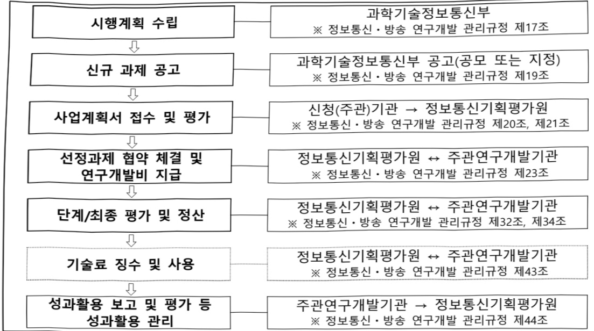

# 생성AI선도인재양성(R&D)

**해당 페이지**: PDF 1116 ~ 1123 쪽 해당

**부처**: 과학기술정보통신부
**분야**: 통신
**회계유형**: 일반회계
**2026 확정예산**: 27000.0 백만원
**전년대비 증감률**: 419.0%
**AI 도메인**: 교육/인재

---

### 가. 예산 총괄표

(단위: 백만원, %)

<table border=1 style='margin: auto; word-wrap: break-word;'><tr><td rowspan="2">사업명</td><td rowspan="2">2024년 결산</td><td colspan="2">2025년 예산</td><td colspan="2">2026년 예산</td><td rowspan="2">중감 (B-A)</td><td rowspan="2">(B-A)/A</td></tr><tr><td style='text-align: center; word-wrap: break-word;'>본예산</td><td style='text-align: center; word-wrap: break-word;'>추경*(A)</td><td style='text-align: center; word-wrap: break-word;'>요구안</td><td style='text-align: center; word-wrap: break-word;'>본예산(B)</td></tr><tr><td style='text-align: center; word-wrap: break-word;'>생성AI전도인재양성</td><td style='text-align: center; word-wrap: break-word;'>3,500</td><td style='text-align: center; word-wrap: break-word;'>5,200</td><td style='text-align: center; word-wrap: break-word;'>8,700</td><td style='text-align: center; word-wrap: break-word;'>27,000</td><td style='text-align: center; word-wrap: break-word;'>27,000</td><td style='text-align: center; word-wrap: break-word;'>21,800</td><td style='text-align: center; word-wrap: break-word;'>419</td></tr></table>

* 추경: 추경증감액을 포함한 최종 예산액을 기재

□ 기능별(내역사업별) 예산 내역

(단위:백만원)

<table border=1 style='margin: auto; word-wrap: break-word;'><tr><td rowspan="2"></td><td colspan="5">2024</td><td colspan="5">2025</td><td rowspan="2">2026예산</td></tr><tr><td style='text-align: center; word-wrap: break-word;'>예산액(추경)</td><td style='text-align: center; word-wrap: break-word;'>예산현액</td><td style='text-align: center; word-wrap: break-word;'>집행액</td><td style='text-align: center; word-wrap: break-word;'>이월액</td><td style='text-align: center; word-wrap: break-word;'>불용액</td><td style='text-align: center; word-wrap: break-word;'>예산액(추경)</td><td style='text-align: center; word-wrap: break-word;'>예산현액</td><td style='text-align: center; word-wrap: break-word;'>집행액</td><td style='text-align: center; word-wrap: break-word;'>이월액</td><td style='text-align: center; word-wrap: break-word;'>불용액</td></tr><tr><td style='text-align: center; word-wrap: break-word;'>○ 기능별 분류(합계)</td><td style='text-align: center; word-wrap: break-word;'>3,500</td><td style='text-align: center; word-wrap: break-word;'>3,500</td><td style='text-align: center; word-wrap: break-word;'>3,500</td><td style='text-align: center; word-wrap: break-word;'>-</td><td style='text-align: center; word-wrap: break-word;'>-</td><td style='text-align: center; word-wrap: break-word;'>8,700</td><td style='text-align: center; word-wrap: break-word;'>8,700</td><td style='text-align: center; word-wrap: break-word;'>8,700</td><td style='text-align: center; word-wrap: break-word;'>-</td><td style='text-align: center; word-wrap: break-word;'>-</td><td style='text-align: center; word-wrap: break-word;'>27,000</td></tr><tr><td style='text-align: center; word-wrap: break-word;'>· 생성AI핵심고급인재</td><td style='text-align: center; word-wrap: break-word;'>3,500</td><td style='text-align: center; word-wrap: break-word;'>3,500</td><td style='text-align: center; word-wrap: break-word;'>3,500</td><td style='text-align: center; word-wrap: break-word;'>-</td><td style='text-align: center; word-wrap: break-word;'>-</td><td style='text-align: center; word-wrap: break-word;'>8,700</td><td style='text-align: center; word-wrap: break-word;'>8,700</td><td style='text-align: center; word-wrap: break-word;'>8,700</td><td style='text-align: center; word-wrap: break-word;'>-</td><td style='text-align: center; word-wrap: break-word;'>-</td><td style='text-align: center; word-wrap: break-word;'>27,000</td></tr></table>

### 나. 사업설명자료

## 1 ) 사업목적·내용

- (생성AI선도인재양성) 생성 AI 기관과 국내 대학원 간 공동 및 파견연구를 지원하여 생성 AI 초격차 기술 확보를 주도할 핵심 고급 인재 양성

- (생성AI핵심고급인재) 대학원생 대상, 국내 생성AI 기관과의 공동연구를 통해 핵심 고급인재로 양성하여 생성AI 기술 경쟁력 제고

## 2 ) 사업개요

## ☐ 사업근거 및 추진경위

① 법령상 근거 및 조항 적시

- 정보통신진흥 및 융합활성화 등에 관한 특별법 제11조(국내 전문인력 양성)

---

정보통신진흥 및 융합활성화 등에 관한 특별법 제11조(국내 전문인력 양성) ① 과학기술

정보통신부장관은 정보통신 분야의 전문적인 기술, 지식 등을 가진 인력(이하 "전문인력"이라 한다)의 육성에 관한 시책을 수립 · 추진하여야 하며, 특히 소프트웨어 교육의 저변학대 및 지역산업의 발전을 위한 소프트웨어 특화교육 활성화를 위하여 노력하여야 한다.

② 제1항에 따른 시책에는 다음 각 호의 사항이 포함되어야 한다.

1. 전문인력의 육성 및 교육훈련에 관한 사항

2. 전문인력의 수급 및 활용에 관한 사항

3. 전문인력의 경력관리 지원 등에 관한 사항

4. 그 밖에 전문인력의 육성 및 관리 등을 위한 사항

## - 정보통신산업진흥법 제16조(전문인력 양성)

## 정보통신산업진흥법 제16조(전문인력 양성) 과학기술정보통신부장관은 정보통신산업의

진흥에 필요한 전문인력을 양성하기 위하여 다음 각 호의 시책을 마련하여야 한다.

1. 전문인력의 수요 실태 파악 및 중·장기 수급 전망 수립

2. 전문인력 양성기관의 설립 · 지원

3. 전문인력 양성 교육프로그램의 개발 및 보급 지원

4. 정보통신기술 관련 자격제도의 정착 및 전문인력 수급 지원

5. 각급 학교 및 그 밖의 교육기관에서 시행하는 정보통신기술 및 정보통신산업 관련 교육의 지원

6. 그 밖에 전문인력 양성에 필요한 사항

## ② 추진경위

- 디지털 인재양성 종합방안 수립·발표(관계부처 합동, '22. 8월)

### 1. 고도화된 디지털 전문인재

②디지털 분야 연구개발 인력양성 및 창업·창작 지원

o (신산업 융복합 연구인력 양성) AI, 빅데이터 등 혁신성장 선도 신산업 분야 경쟁력 제고 및 산업·사회문제 해결을 선도할 고급인재 육성

o (연구지원 연계 인재 육성) 국가 첨단전략기술 중심의 디지털 연구센터 개편·확대 및 산업계 현안해결과 원천기술개발을 통한 인재양성 지원

2. 도메인 분야에 디지털기술을 적용하는 인재

① 비전공 학습자들을 위한 AI + X 등 디지털 융합 과정 운영

o AI 등 디지털 + X 역량 향상 지원 프로그램 운영

○ AI 등 디지털 + X 융합 과정 활성화

- 글로벌 디지털 격차 해소(뉴욕 구상 발표) (22. 9월, 디지털 비전 포럼 기조연설)

---

### 전략 1.세계 최고의 디지털 역량

'6대 디지털 혁신기술 분야에서 초격차 기술력을 확보하겠습니다.

o (투자방향) '23년부터 ①인공지능(AI), ②AI반도체, ③5G·6G 이동통신, ④양자, ⑤메타버스, ⑥사이버보안 등 6대 혁신기술 부냐에 대한 연구개발(R&D) 집중 투자

디지털 인재 100만명 양성으로 인재 부국을 달성하겠습니다.

o (민관 협력 인재양성) 교육과 채용이 연계되는 민관 협력형 교육, 디지털 전환 전문가

육성 등을 통한 산업계 디지털 인력난 해소

- ChatGPT 대응방안 검토 및 「생성AI선도인재양성」사업 기획('22. 12~'23. 5월)

- 대통령 주재 디지털플랫폼정부위원회에서「초거대AI경쟁력강화방안」 발표('23. 4월)

### 3. 초거대AI 전문인재 양성 및 전국민 활용역량 강화

◇ 초거대AI 발전도 결국 사람의 역량 향상이 좌우 $\Rightarrow$ 기존 AI 인력 양성 사업에 초거대AI 개발·활용 경험을 확대하고 전국민 초거대AI 리터러시 강화

개별과정을통해수준별

SW·AI 인재양성 추진('23~'27)

AI 석·박사 등 정규과정(6.5만명)

구직자·재직자 등 비정규과정(13.2만명)

초거대AI 전문인재 신규 양성,

초거대AI 활용역량 강화('23~'27)

초거대AI 전문인재 양성 및 초거대AI 활용역량 교육 보강, 일반국민 AI 역량 교육(100만명)

* 現 SW·AI교육 과정에 초거대AI 활용역량 교육 등을 추가·보완해 운영

□ 초거대AI 전문인재 양성

o (초거대AI 전문인재) 산·학 협력 프로젝트, 해외 공동연구 등을 통해 글로벌 수준의 초거대AI 연구개발, 활용 역량을 갖춘 중·고급 인재 양성('24~)

- SW중심대학, AI대학원 등과 연계하여 ‘초거대AI 네이티브’, ‘초거대 AI 브레인’ 등 지원('24~)

- 제26차 비상경제장관회의에서「소프트웨어진흥전략」 발표('23. 4월)

### 1 -5. 생성 AI 화산에 따른 디지털 교육 개선 추진

◇ 생성 AI 확산에 대응하여 이를 효과적으로 활용하고 필요한 역량을 키울 수 있는 교육 과정 개발·확산하고 초거대AI 관련 최고급 인재 양성 추진

국내 생성 AI 분야 경쟁력 확보를 위한 최고급 인재 양성

산학협력프로젝트, 해외공동연구등을통해글로벌수준의초거대AI연구개발, 활용역량을갖춘고급인재양성추진('24~)

- (초거대AI 네이티브) 초거대AI 기업과 AI·SW 전공자가 함께 산학협력 공동 프로젝트, 문제해결 멘토링을 통한 프롬프트 엔지니어링 역량 제고로 기업이 원하는 초거대 AI 중·고급 인재로 성장 지원

- (초거대AI 브랜딩) 국내 대학원생을 대상으로 국내·외 생성AI 빅테크 기업의 Top-Tier 연구자들과 초거대AI 공동연구를 지원하여 연구개발 역량을 갖춘 엘리트 AI인재 양성

---

- AI컴퓨팅 인프라 확충을 통한 국가AI역량 강화방안('25.2)

- 초격차 AI선도기술·인재 확보('25.5)

## 주요내용

① 사업규모

- 총사업비 : 해당없음

- 사업기간 : '24~'29

- 최근 5년 간 투입된 사업비(예산액기준, 추경편성한 연도에는 추경포함)

<table border=1 style='margin: auto; word-wrap: break-word;'><tr><td style='text-align: center; word-wrap: break-word;'>연도</td><td style='text-align: center; word-wrap: break-word;'>2022</td><td style='text-align: center; word-wrap: break-word;'>2023</td><td style='text-align: center; word-wrap: break-word;'>2024</td><td style='text-align: center; word-wrap: break-word;'>2025</td><td style='text-align: center; word-wrap: break-word;'>2026</td></tr><tr><td style='text-align: center; word-wrap: break-word;'>사업비</td><td style='text-align: center; word-wrap: break-word;'>-</td><td style='text-align: center; word-wrap: break-word;'>-</td><td style='text-align: center; word-wrap: break-word;'>3,500</td><td style='text-align: center; word-wrap: break-word;'>8,700</td><td style='text-align: center; word-wrap: break-word;'>27,000</td></tr></table>

② 사업추진체계

- 사업시행방법 : 출연

- 사업시행주체 : 정보통신기획평가원

- 사업 수혜자 : 대학, 기관 등

- 보조, 융자, 출연, 출자 등의 경우 보조·융자 등 지원 비율 및 법적근거

<table border=1 style='margin: auto; word-wrap: break-word;'><tr><td style='text-align: center; word-wrap: break-word;'>내역사업명</td><td style='text-align: center; word-wrap: break-word;'>구분</td><td style='text-align: center; word-wrap: break-word;'>피보조·피출연 등 기관명</td><td style='text-align: center; word-wrap: break-word;'>지원 금액 (2026예산안)</td><td style='text-align: center; word-wrap: break-word;'>지원 비율(%)</td><td style='text-align: center; word-wrap: break-word;'>보조율 법적근거 (해당 조항)</td></tr><tr><td style='text-align: center; word-wrap: break-word;'>생성AI핵심 고급인재</td><td style='text-align: center; word-wrap: break-word;'>출연</td><td style='text-align: center; word-wrap: break-word;'>정보통신 기획평가원</td><td style='text-align: center; word-wrap: break-word;'>27,000</td><td style='text-align: center; word-wrap: break-word;'>100</td><td style='text-align: center; word-wrap: break-word;'>ㅇ한국연구재단법 제11조 ㅇ정보통신 진흥 및 융합 활성화 등에 관한 특별법 제32조</td></tr></table>

## 3 ) 2026년도 예산 산출 근거

☐ 생성AI선도인재양성:(2025 추경)8,700백만원→(2026 예산안)27,000백만원

(2025 본예산 5,200백만원 → 제1회 추경 8,700백만원)

① 생성AI핵심고급인재 : (2025 추경) 8,700백만원 → (2026 예산안) 27,000백만원

(2025 본예산 5,200백만원 → 제1회 추경 8,700백만원)

- (요구) 생성AI 기술 확보를 위해 국내 대학이 국내·외 생성AI 기관과 공동연구를 통해 핵심 연구개발 인재 양성에 따른 계속과제 지속 지원 및 신규과제 지원 요구, '25년 대비 +419% 증액 요구

- (산출) ① (계속과제) 5개(과제 수) × 2,600백만원 × 12/12개월(수행기간) = 13,000백만원

② (신규과제) 8개(과제 수) × 2,333백만원 × 9/12개월(수행기간) = 14,000백만원

2025년도 추가경정예산 및 2026년도 예산안 산출 세부내역 비교

<table border=1 style='margin: auto; word-wrap: break-word;'><tr><td colspan="2">2025년 제1회 추가경쟁예산</td><td colspan="2">2026년 예산안</td></tr><tr><td style='text-align: center; word-wrap: break-word;'>예산</td><td style='text-align: center; word-wrap: break-word;'>산출내역</td><td style='text-align: center; word-wrap: break-word;'>예산</td><td style='text-align: center; word-wrap: break-word;'>산출내역</td></tr><tr><td rowspan="2">8,700</td><td style='text-align: center; word-wrap: break-word;'>&lt; 생성AI선도인재양성 8,700백만원 &gt;</td><td colspan="2">&lt; 생성AI선도인재양성 27,000백만원 &gt;</td></tr><tr><td style='text-align: center; word-wrap: break-word;'>가. 생성AI핵심고급인재 8,700백만원 • (계속) 2개 × 2,600백만 × 12/12개월 = 5,200백만원 + (1회 추경안) (신규) 3개 × 2,333백만 × 6/12개월 = 3,500백만원</td><td colspan="2">27,000 가. 생성AI핵심고급인재 27,000백만원 • (계속) 5개 × 2,600백만 × 12/12개월 = 13,000백만원 • (신규) 8개 × 2,333백만 × 9/12개월 = 14,000백만원</td></tr></table>

---

## 4 ) 사업효과

☐ 사업영향,산출물 성과지표 등

① 2022~2026년도 성과계획서 상 성과지표 및 최근 5년간 성과 달성도

<table border=1 style='margin: auto; word-wrap: break-word;'><tr><td style='text-align: center; word-wrap: break-word;'>성과지표</td><td style='text-align: center; word-wrap: break-word;'>구분</td><td style='text-align: center; word-wrap: break-word;'>2022</td><td style='text-align: center; word-wrap: break-word;'>2023</td><td style='text-align: center; word-wrap: break-word;'>2024</td><td style='text-align: center; word-wrap: break-word;'>2025</td><td style='text-align: center; word-wrap: break-word;'>2026</td><td style='text-align: center; word-wrap: break-word;'>2026 목표치산출근거</td><td style='text-align: center; word-wrap: break-word;'>측정산식(또는 측정방법)</td><td style='text-align: center; word-wrap: break-word;'>자료수집방법(또는 자료출처)</td></tr><tr><td rowspan="3">공동연구참여도(단위: %)</td><td style='text-align: center; word-wrap: break-word;'>목표</td><td style='text-align: center; word-wrap: break-word;'>-</td><td style='text-align: center; word-wrap: break-word;'>-</td><td style='text-align: center; word-wrap: break-word;'>-</td><td style='text-align: center; word-wrap: break-word;'>150</td><td style='text-align: center; word-wrap: break-word;'>155</td><td rowspan="3">직전년도목표의 3%상향</td><td rowspan="3">우수연구자 과전인원수 / 공동프로젝트 수 × 100%</td><td rowspan="3">과제별 연차보고서</td></tr><tr><td style='text-align: center; word-wrap: break-word;'>실적</td><td style='text-align: center; word-wrap: break-word;'>-</td><td style='text-align: center; word-wrap: break-word;'>-</td><td style='text-align: center; word-wrap: break-word;'>신규</td><td style='text-align: center; word-wrap: break-word;'>187</td><td style='text-align: center; word-wrap: break-word;'>-</td></tr><tr><td style='text-align: center; word-wrap: break-word;'>달성도</td><td style='text-align: center; word-wrap: break-word;'>-</td><td style='text-align: center; word-wrap: break-word;'>-</td><td style='text-align: center; word-wrap: break-word;'>-</td><td style='text-align: center; word-wrap: break-word;'>-</td><td style='text-align: center; word-wrap: break-word;'>-</td></tr><tr><td rowspan="3">생성AI연구역량지수(단위: 건)</td><td style='text-align: center; word-wrap: break-word;'>목표</td><td style='text-align: center; word-wrap: break-word;'>-</td><td style='text-align: center; word-wrap: break-word;'>-</td><td style='text-align: center; word-wrap: break-word;'>-</td><td style='text-align: center; word-wrap: break-word;'>1.83</td><td style='text-align: center; word-wrap: break-word;'>1.88</td><td rowspan="3">유사사업* 실적참고로 설정* 사업초기에 따른 2차년도(25년부터 설정</td><td rowspan="3">(1억원당 SCI 논문 건수 × 0.5) + (1억원당 등록 특허 건수 × 0.5)</td><td rowspan="3">사업성과 보고서</td></tr><tr><td style='text-align: center; word-wrap: break-word;'>실적</td><td style='text-align: center; word-wrap: break-word;'>-</td><td style='text-align: center; word-wrap: break-word;'>-</td><td style='text-align: center; word-wrap: break-word;'>신규</td><td style='text-align: center; word-wrap: break-word;'>집계중</td><td style='text-align: center; word-wrap: break-word;'>-</td></tr><tr><td style='text-align: center; word-wrap: break-word;'>달성도</td><td style='text-align: center; word-wrap: break-word;'>-</td><td style='text-align: center; word-wrap: break-word;'>-</td><td style='text-align: center; word-wrap: break-word;'>-</td><td style='text-align: center; word-wrap: break-word;'>-</td><td style='text-align: center; word-wrap: break-word;'>-</td></tr><tr><td rowspan="3">우수연구자 취업률(단위: %)</td><td style='text-align: center; word-wrap: break-word;'>목표</td><td style='text-align: center; word-wrap: break-word;'>-</td><td style='text-align: center; word-wrap: break-word;'>-</td><td style='text-align: center; word-wrap: break-word;'>-</td><td style='text-align: center; word-wrap: break-word;'>25</td><td style='text-align: center; word-wrap: break-word;'>25.5</td><td rowspan="3">직전년도목표의 2%상향</td><td rowspan="3">취업인원수/우수연구자 수 × 100%</td><td rowspan="3">과제별 연차보고서</td></tr><tr><td style='text-align: center; word-wrap: break-word;'>실적</td><td style='text-align: center; word-wrap: break-word;'>-</td><td style='text-align: center; word-wrap: break-word;'>-</td><td style='text-align: center; word-wrap: break-word;'>신규</td><td style='text-align: center; word-wrap: break-word;'>집계중</td><td style='text-align: center; word-wrap: break-word;'>-</td></tr><tr><td style='text-align: center; word-wrap: break-word;'>달성도</td><td style='text-align: center; word-wrap: break-word;'>-</td><td style='text-align: center; word-wrap: break-word;'>-</td><td style='text-align: center; word-wrap: break-word;'>-</td><td style='text-align: center; word-wrap: break-word;'>-</td><td style='text-align: center; word-wrap: break-word;'>-</td></tr><tr><td rowspan="3">수혜자 만족도(단위: 점)</td><td style='text-align: center; word-wrap: break-word;'>목표</td><td style='text-align: center; word-wrap: break-word;'>-</td><td style='text-align: center; word-wrap: break-word;'>-</td><td style='text-align: center; word-wrap: break-word;'>90</td><td style='text-align: center; word-wrap: break-word;'>91</td><td style='text-align: center; word-wrap: break-word;'>92</td><td rowspan="3">직전년도목표의 1.5%상향</td><td rowspan="3">(학생 만족도 : \Sigma (조사건별 만족도 점수(100점 만점)/만족도 조사건수) × 0.5 + (기업 만족도 : \Sigma (조사건별 만족도 점수(100점 만점)/만족도 조사건수) × 0.5)</td><td rowspan="3">사업성과 보고서</td></tr><tr><td style='text-align: center; word-wrap: break-word;'>실적</td><td style='text-align: center; word-wrap: break-word;'>-</td><td style='text-align: center; word-wrap: break-word;'>-</td><td style='text-align: center; word-wrap: break-word;'>90</td><td style='text-align: center; word-wrap: break-word;'>91</td><td style='text-align: center; word-wrap: break-word;'>-</td></tr><tr><td style='text-align: center; word-wrap: break-word;'>달성도</td><td style='text-align: center; word-wrap: break-word;'>-</td><td style='text-align: center; word-wrap: break-word;'>-</td><td style='text-align: center; word-wrap: break-word;'>100%</td><td style='text-align: center; word-wrap: break-word;'>100%</td><td style='text-align: center; word-wrap: break-word;'>-</td></tr></table>

② 성과지표 이외의 연도별 사업추진 경과 및 실적

<table border=1 style='margin: auto; word-wrap: break-word;'><tr><td style='text-align: center; word-wrap: break-word;'>2022</td><td style='text-align: center; word-wrap: break-word;'>-</td></tr><tr><td style='text-align: center; word-wrap: break-word;'>2023</td><td style='text-align: center; word-wrap: break-word;'>-</td></tr><tr><td style='text-align: center; word-wrap: break-word;'>2024</td><td style='text-align: center; word-wrap: break-word;'>생성AI선도인재양성을 위한 2개 과제 수행기관(바이브컴퍼니, 포티투마루) 선정</td></tr><tr><td style='text-align: center; word-wrap: break-word;'>2025</td><td style='text-align: center; word-wrap: break-word;'>생성AI선도인재양성을 위한 2개 계속과제 지원 및 3개 신규과제 수행기관(NC AI, LG AI연구원, KETI) 선정·지원</td></tr></table>

③향후(2026년도 이후)기대효과

o 생성AI 분야 초격차 인재의 확보를 통해 관련 분야 기술수준 제고

o 국내 생성AI 고급인재를 시장(산업)에 적시 공급하여 기관 수요를 충족하고, 더 나아가 타 산업분야와의 융합을 통한 자생적인 생태계 구축 및 확장에 기여

0 학제 중심의 교육·인재양성 환경에서 벗어나, 현장에서 즉시 활용 가능한 생성 AI 연구개발·활용인재 양성 환경 마련

---

5) 타당성조사 및 예비타당성조사 시행여부 및 결과 요지 : 해당없음

6) 총사업비 대상사업 정보 : 해당없음

7) 사업 집행절차

## 8 ) 각종 평가

1) 국회(예결위, 상임위, 예정처, 국정감사 포함) 지적 : 해당없음

2) 대외공개 평가 : 해당없음

3) 자체평가 : 해당없음

3

---

### 다. 최근 4년간 결산내역

## 1 ) 결산표

☐ 부처 결산내역

(단위: 백만원, %)

<table border=1 style='margin: auto; word-wrap: break-word;'><tr><td rowspan="2">闰도</td><td colspan="3">예산액</td><td rowspan="2">예산현액(A)</td><td rowspan="2">집행액(B)</td><td rowspan="2">집행률(B/A)</td><td rowspan="2">다음연도이월액</td><td rowspan="2">불용액</td></tr><tr><td style='text-align: center; word-wrap: break-word;'>본예산</td><td style='text-align: center; word-wrap: break-word;'>추경중감액</td><td style='text-align: center; word-wrap: break-word;'>추경</td></tr><tr><td style='text-align: center; word-wrap: break-word;'>2022</td><td style='text-align: center; word-wrap: break-word;'>-</td><td style='text-align: center; word-wrap: break-word;'>-</td><td style='text-align: center; word-wrap: break-word;'>-</td><td style='text-align: center; word-wrap: break-word;'>-</td><td style='text-align: center; word-wrap: break-word;'>-</td><td style='text-align: center; word-wrap: break-word;'>-</td><td style='text-align: center; word-wrap: break-word;'>-</td><td style='text-align: center; word-wrap: break-word;'>-</td></tr><tr><td style='text-align: center; word-wrap: break-word;'>2023</td><td style='text-align: center; word-wrap: break-word;'>-</td><td style='text-align: center; word-wrap: break-word;'>-</td><td style='text-align: center; word-wrap: break-word;'>-</td><td style='text-align: center; word-wrap: break-word;'>-</td><td style='text-align: center; word-wrap: break-word;'>-</td><td style='text-align: center; word-wrap: break-word;'>-</td><td style='text-align: center; word-wrap: break-word;'>-</td><td style='text-align: center; word-wrap: break-word;'>-</td></tr><tr><td style='text-align: center; word-wrap: break-word;'>2024</td><td style='text-align: center; word-wrap: break-word;'>3,500</td><td style='text-align: center; word-wrap: break-word;'>-</td><td style='text-align: center; word-wrap: break-word;'>-</td><td style='text-align: center; word-wrap: break-word;'>3,500</td><td style='text-align: center; word-wrap: break-word;'>3,500</td><td style='text-align: center; word-wrap: break-word;'>100%</td><td style='text-align: center; word-wrap: break-word;'>-</td><td style='text-align: center; word-wrap: break-word;'>-</td></tr><tr><td style='text-align: center; word-wrap: break-word;'>2025</td><td style='text-align: center; word-wrap: break-word;'>5,200</td><td style='text-align: center; word-wrap: break-word;'>3,500</td><td style='text-align: center; word-wrap: break-word;'>3,500</td><td style='text-align: center; word-wrap: break-word;'>8,700</td><td style='text-align: center; word-wrap: break-word;'>8,700</td><td style='text-align: center; word-wrap: break-word;'>100%</td><td style='text-align: center; word-wrap: break-word;'>-</td><td style='text-align: center; word-wrap: break-word;'>-</td></tr></table>

2) 주요 결산사항 : 해당없음

---

<table border=1 style='margin: auto; word-wrap: break-word;'><tr><td style='text-align: center; word-wrap: break-word;'>사 업 명</td></tr><tr><td style='text-align: center; word-wrap: break-word;'>(31) 생체노화 리프로그래밍 원천기술 개발 (1138-488)</td></tr></table>

## □ 사업 코드 정보

<table border=1 style='margin: auto; word-wrap: break-word;'><tr><td style='text-align: center; word-wrap: break-word;'>구분</td><td style='text-align: center; word-wrap: break-word;'>회계</td><td style='text-align: center; word-wrap: break-word;'>소관</td><td style='text-align: center; word-wrap: break-word;'>실국(기관)</td><td style='text-align: center; word-wrap: break-word;'>계정</td><td style='text-align: center; word-wrap: break-word;'>분야</td><td style='text-align: center; word-wrap: break-word;'>부문</td></tr><tr><td style='text-align: center; word-wrap: break-word;'>코드</td><td rowspan="2">일반회계</td><td rowspan="2">과학기술정보통신부</td><td rowspan="2">연구개발정책실미래전략기술정책관</td><td rowspan="2">-</td><td style='text-align: center; word-wrap: break-word;'>150</td><td style='text-align: center; word-wrap: break-word;'>155</td></tr><tr><td style='text-align: center; word-wrap: break-word;'>명칭</td><td style='text-align: center; word-wrap: break-word;'>과학기술</td><td style='text-align: center; word-wrap: break-word;'>과학기술연구개발</td></tr></table>

<table border=1 style='margin: auto; word-wrap: break-word;'><tr><td style='text-align: center; word-wrap: break-word;'>구분</td><td style='text-align: center; word-wrap: break-word;'>프로그램</td><td style='text-align: center; word-wrap: break-word;'>단위사업</td><td style='text-align: center; word-wrap: break-word;'>세부사업</td></tr><tr><td style='text-align: center; word-wrap: break-word;'>코드</td><td style='text-align: center; word-wrap: break-word;'>1100</td><td style='text-align: center; word-wrap: break-word;'>1138</td><td style='text-align: center; word-wrap: break-word;'>488</td></tr><tr><td style='text-align: center; word-wrap: break-word;'>명칭</td><td style='text-align: center; word-wrap: break-word;'>미래유망원천기술개발</td><td style='text-align: center; word-wrap: break-word;'>바이오·의료기술개발사업</td><td style='text-align: center; word-wrap: break-word;'>생체노화 리프로그래밍 원천기술 개발</td></tr></table>

□ 사업 성격

<table border=1 style='margin: auto; word-wrap: break-word;'><tr><td style='text-align: center; word-wrap: break-word;'>신규 계속</td><td style='text-align: center; word-wrap: break-word;'>완료</td><td style='text-align: center; word-wrap: break-word;'>예비타당성 실시여부</td><td style='text-align: center; word-wrap: break-word;'>총사업비 관리대상</td><td style='text-align: center; word-wrap: break-word;'>총액계상 예산사업</td><td style='text-align: center; word-wrap: break-word;'>사업소관 변경정보</td></tr><tr><td style='text-align: center; word-wrap: break-word;'>○</td><td style='text-align: center; word-wrap: break-word;'></td><td style='text-align: center; word-wrap: break-word;'></td><td style='text-align: center; word-wrap: break-word;'></td><td style='text-align: center; word-wrap: break-word;'></td><td style='text-align: center; word-wrap: break-word;'></td></tr></table>

□ 사업 지원 형태 및 지원율

<table border=1 style='margin: auto; word-wrap: break-word;'><tr><td style='text-align: center; word-wrap: break-word;'>직접</td><td style='text-align: center; word-wrap: break-word;'>출자</td><td style='text-align: center; word-wrap: break-word;'>출연</td><td style='text-align: center; word-wrap: break-word;'>보조</td><td style='text-align: center; word-wrap: break-word;'>융자</td><td style='text-align: center; word-wrap: break-word;'>국고보조율(%)</td><td style='text-align: center; word-wrap: break-word;'>융자율(%)</td></tr><tr><td style='text-align: center; word-wrap: break-word;'></td><td style='text-align: center; word-wrap: break-word;'></td><td style='text-align: center; word-wrap: break-word;'>○</td><td style='text-align: center; word-wrap: break-word;'></td><td style='text-align: center; word-wrap: break-word;'></td><td style='text-align: center; word-wrap: break-word;'></td><td style='text-align: center; word-wrap: break-word;'></td></tr></table>

## □ 사업 소관부처 및 시행주체

<table border=1 style='margin: auto; word-wrap: break-word;'><tr><td style='text-align: center; word-wrap: break-word;'>사업명</td><td colspan="2">구분</td></tr><tr><td rowspan="2">생체노화 리프로그래밍 원천기술개발</td><td style='text-align: center; word-wrap: break-word;'>소관부처</td><td style='text-align: center; word-wrap: break-word;'>실·국·과(팀) 연구개발정책실 미래전략기술정책관 첨단바이오기술과</td></tr><tr><td style='text-align: center; word-wrap: break-word;'>사업시행주체</td><td style='text-align: center; word-wrap: break-word;'>한국연구재단</td></tr></table>

---

### 원본 PDF 크롭 이미지

