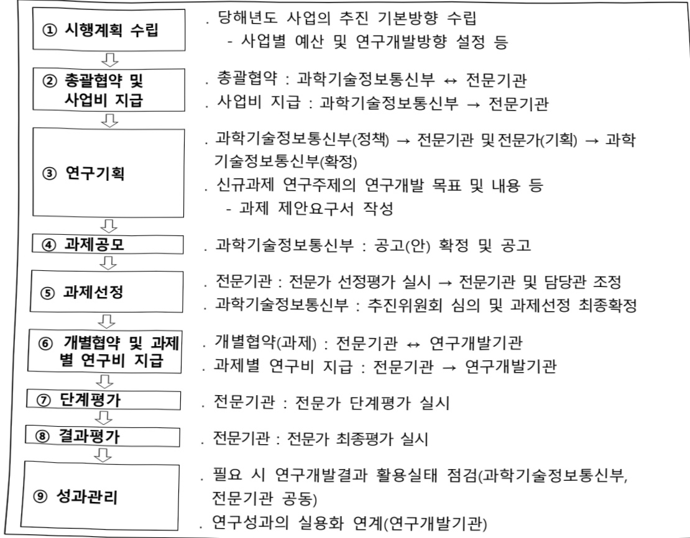

# 생체노화리프로그래밍원천기술개발(R&D)

**해당 페이지**: PDF 1124 ~ 1130 쪽 해당

**부처**: 과학기술정보통신부
**분야**: 과학기술
**회계유형**: 일반회계
**2026 확정예산**: 7500.0 백만원
**전년대비 증감률**: None%
**AI 도메인**: 의료/바이오

---

<table border=1 style='margin: auto; word-wrap: break-word;'><tr><td style='text-align: center; word-wrap: break-word;'>사 업 명</td></tr><tr><td style='text-align: center; word-wrap: break-word;'>(31) 생체노화 리프로그래밍 원천기술 개발 (1138-488)</td></tr></table>

## □ 사업 코드 정보

<table border=1 style='margin: auto; word-wrap: break-word;'><tr><td style='text-align: center; word-wrap: break-word;'>구분</td><td style='text-align: center; word-wrap: break-word;'>회계</td><td style='text-align: center; word-wrap: break-word;'>소관</td><td style='text-align: center; word-wrap: break-word;'>실국(기관)</td><td style='text-align: center; word-wrap: break-word;'>계정</td><td style='text-align: center; word-wrap: break-word;'>분야</td><td style='text-align: center; word-wrap: break-word;'>부문</td></tr><tr><td style='text-align: center; word-wrap: break-word;'>코드</td><td rowspan="2">일반회계</td><td rowspan="2">과학기술정보통신부</td><td rowspan="2">연구개발정책실미래전략기술정책관</td><td rowspan="2">-</td><td style='text-align: center; word-wrap: break-word;'>150</td><td style='text-align: center; word-wrap: break-word;'>155</td></tr><tr><td style='text-align: center; word-wrap: break-word;'>명칭</td><td style='text-align: center; word-wrap: break-word;'>과학기술</td><td style='text-align: center; word-wrap: break-word;'>과학기술연구개발</td></tr></table>

<table border=1 style='margin: auto; word-wrap: break-word;'><tr><td style='text-align: center; word-wrap: break-word;'>구분</td><td style='text-align: center; word-wrap: break-word;'>프로그램</td><td style='text-align: center; word-wrap: break-word;'>단위사업</td><td style='text-align: center; word-wrap: break-word;'>세부사업</td></tr><tr><td style='text-align: center; word-wrap: break-word;'>코드</td><td style='text-align: center; word-wrap: break-word;'>1100</td><td style='text-align: center; word-wrap: break-word;'>1138</td><td style='text-align: center; word-wrap: break-word;'>488</td></tr><tr><td style='text-align: center; word-wrap: break-word;'>명칭</td><td style='text-align: center; word-wrap: break-word;'>미래유망원천기술개발</td><td style='text-align: center; word-wrap: break-word;'>바이오·의료기술개발사업</td><td style='text-align: center; word-wrap: break-word;'>생체노화 리프로그래밍 원천기술 개발</td></tr></table>

□ 사업 성격

<table border=1 style='margin: auto; word-wrap: break-word;'><tr><td style='text-align: center; word-wrap: break-word;'>신규 계속</td><td style='text-align: center; word-wrap: break-word;'>완료</td><td style='text-align: center; word-wrap: break-word;'>예비타당성 실시여부</td><td style='text-align: center; word-wrap: break-word;'>총사업비 관리대상</td><td style='text-align: center; word-wrap: break-word;'>총액계상 예산사업</td><td style='text-align: center; word-wrap: break-word;'>사업소관 변경정보</td></tr><tr><td style='text-align: center; word-wrap: break-word;'>○</td><td style='text-align: center; word-wrap: break-word;'></td><td style='text-align: center; word-wrap: break-word;'></td><td style='text-align: center; word-wrap: break-word;'></td><td style='text-align: center; word-wrap: break-word;'></td><td style='text-align: center; word-wrap: break-word;'></td></tr></table>

□ 사업 지원 형태 및 지원율

<table border=1 style='margin: auto; word-wrap: break-word;'><tr><td style='text-align: center; word-wrap: break-word;'>직접</td><td style='text-align: center; word-wrap: break-word;'>출자</td><td style='text-align: center; word-wrap: break-word;'>출연</td><td style='text-align: center; word-wrap: break-word;'>보조</td><td style='text-align: center; word-wrap: break-word;'>융자</td><td style='text-align: center; word-wrap: break-word;'>국고보조율(%)</td><td style='text-align: center; word-wrap: break-word;'>융자율(%)</td></tr><tr><td style='text-align: center; word-wrap: break-word;'></td><td style='text-align: center; word-wrap: break-word;'></td><td style='text-align: center; word-wrap: break-word;'>○</td><td style='text-align: center; word-wrap: break-word;'></td><td style='text-align: center; word-wrap: break-word;'></td><td style='text-align: center; word-wrap: break-word;'></td><td style='text-align: center; word-wrap: break-word;'></td></tr></table>

## □ 사업 소관부처 및 시행주체

<table border=1 style='margin: auto; word-wrap: break-word;'><tr><td style='text-align: center; word-wrap: break-word;'>사업명</td><td colspan="2">구분</td></tr><tr><td rowspan="2">생체노화 리프로그래밍 원천기술개발</td><td style='text-align: center; word-wrap: break-word;'>소관부처</td><td style='text-align: center; word-wrap: break-word;'>실·국·과(팀) 연구개발정책실 미래전략기술정책관 첨단바이오기술과</td></tr><tr><td style='text-align: center; word-wrap: break-word;'>사업시행주체</td><td style='text-align: center; word-wrap: break-word;'>한국연구재단</td></tr></table>

---

### 가.예산 총괄표

(단위: 백만원, %)

<table border=1 style='margin: auto; word-wrap: break-word;'><tr><td rowspan="2">2024년 사업명</td><td colspan="2">2025년 예산</td><td colspan="2">2026년</td><td rowspan="2">중감 (B-A)</td><td rowspan="2">(B-A)/A</td></tr><tr><td style='text-align: center; word-wrap: break-word;'>본예산</td><td style='text-align: center; word-wrap: break-word;'>추경(A)</td><td style='text-align: center; word-wrap: break-word;'>요구안</td><td style='text-align: center; word-wrap: break-word;'>본예산(B)</td></tr><tr><td style='text-align: center; word-wrap: break-word;'>생체노화 리프로그래밍 원천기술개발</td><td style='text-align: center; word-wrap: break-word;'>-</td><td style='text-align: center; word-wrap: break-word;'>-</td><td style='text-align: center; word-wrap: break-word;'>-</td><td style='text-align: center; word-wrap: break-word;'>7,500</td><td style='text-align: center; word-wrap: break-word;'>7,500</td><td style='text-align: center; word-wrap: break-word;'>순증 순증</td></tr></table>

□ 기능별(내역사업별) 예산 내역

(단위:백만원)

<table border=1 style='margin: auto; word-wrap: break-word;'><tr><td rowspan="2"></td><td colspan="5">2024</td><td colspan="5">2025</td><td rowspan="2">2026예산</td></tr><tr><td style='text-align: center; word-wrap: break-word;'>예산액(추정)</td><td style='text-align: center; word-wrap: break-word;'>예산현액</td><td style='text-align: center; word-wrap: break-word;'>집행액</td><td style='text-align: center; word-wrap: break-word;'>이월액</td><td style='text-align: center; word-wrap: break-word;'>불용액</td><td style='text-align: center; word-wrap: break-word;'>예산액(추정)</td><td style='text-align: center; word-wrap: break-word;'>예산현액</td><td style='text-align: center; word-wrap: break-word;'>집행액</td><td style='text-align: center; word-wrap: break-word;'>이월액</td><td style='text-align: center; word-wrap: break-word;'>불용액</td></tr><tr><td style='text-align: center; word-wrap: break-word;'>○ 기능별 분류(합계)</td><td style='text-align: center; word-wrap: break-word;'></td><td style='text-align: center; word-wrap: break-word;'></td><td style='text-align: center; word-wrap: break-word;'></td><td style='text-align: center; word-wrap: break-word;'></td><td style='text-align: center; word-wrap: break-word;'></td><td style='text-align: center; word-wrap: break-word;'></td><td style='text-align: center; word-wrap: break-word;'></td><td style='text-align: center; word-wrap: break-word;'></td><td style='text-align: center; word-wrap: break-word;'></td><td style='text-align: center; word-wrap: break-word;'></td><td style='text-align: center; word-wrap: break-word;'>7,500</td></tr><tr><td rowspan="3">· 고도노화 정량 지표 확립 및 세포조직 장기별 다차원 노화 지도 구축
· 노화 미세환경 기반
  제어 원천기술 개발
· 노화 제어기술 효능
평가용 플랫폼 구축</td><td rowspan="3"></td><td rowspan="3"></td><td rowspan="3"></td><td rowspan="3"></td><td rowspan="3"></td><td rowspan="3"></td><td rowspan="3"></td><td rowspan="3"></td><td rowspan="3"></td><td rowspan="3"></td><td style='text-align: center; word-wrap: break-word;'>2,250</td></tr><tr><td style='text-align: center; word-wrap: break-word;'>3,000</td></tr><tr><td style='text-align: center; word-wrap: break-word;'>2,250</td></tr></table>

---

### 나. 사업설명자료

## 1 ) 사업목적·내용

- (세부사업명) 생체노화 리프로그래밍 원천기술 개발

: 세계 최초로 고도노화*의 정량 지표를 확립하고, 세포 단위로 노화를 되돌릴 수 있는 제어기술 개발

세포·조직의 노화를 정의하는 개념(심한 과체중을 정의하는 고도비만과 유사한 용도의 개념)

- (내역사업①) 고도노화 정량 지표 확립 및 세포-조직-장기별 다차원 노화지도 구축

현재 고도노화를 계량화할 수 있는 표준 기준이 부재하므로 조기 진단 및 원인 규명을 위해 다수의 분자·세포 지표를 통합한 수치화된 기준 마련. 각 장기별 노화 미세환경의 이질성을 정밀하게 파악하여 고도 노화 제어 원천 기술의 기반이 될 수 있는 다차원 노화지도 구축

- (내역사업②) 노화 미세환경기반 제어 원천기술 개발

: 면역세포, 뇌세포, 심혈관세포, 대사연관세포 등 각 조직·장기 특이적 노화미세환경 조절 유전자 및 신호경로 규명. 세포에서 노화가 일어나는 유전자·분자 단위의 경로를 분석하고, 노화를 되돌릴 수 있는 표적 조절 후보 선별 → 노화인자 발현조절 도구 및 후보물질을 발굴하고 효능 검증

- (내역사업③) 노화 제어기술 효능 평가용 플랫폼 구축

고노노화 제어기술의 효과를 객관적으로 평가하기 위한 다기능 플랫폼 구축. 인간에서 유래한 오가노이드·장기칩·다중공배양 및 질환·노화모델 동물을 활용하여 정량지표 변화 중심의 효능 평가 방법론 개발. 기존의 오가노이드 모델 등은 주로 장기 특이적 기능 재현 또는 약물 반응 테스트를 위한 정적 모델로 활용

→ 시간 축에 따른 노화 지표의 변화를 추적할 수 있는 노화 플랫폼을 통해 노

화의 동역학적 경로를 분석하는 모델 필요

## 2 ) 사업개요

☐ 사업근거 및 추진경위

① 법령상 근거 및 조항 적시

과학기술기본법 제11조(국가연구개발사업의 추진)

: ① 중앙행정기관의 장은 기본계획에 따라 맡은 분야의 국가연구개발사업과 그 시 책을 세워 추진하여야 한다.

과학기술기본법 제17조(협동·융합연구개발의 촉진)

: ① 정부는 기업, 교육기관, 연구기관 및 과학기술 관련 기관·단체 간 또는 이들

---

상호간의 협동연구개발을 촉진하고 북돋우기 위한 시책을 세우고 추진하여야 한다. ② 정부는 민·군 간의 협동연구개발을 장려하고 민·군 기술협력을 촉진하기 위한 시책을 세우고 추진하여야 한다. ③ 과학기술정보통신부장관은 국가적으로 중요한 연구개발과제의 협동·융합연구개발을 위하여 필요하다고 인정하면 관련 기관의 장의 요청에 따라 협동·융합연구개발 관련 기관 간에 과학기술인이 서로 교류하는 것을 권고하거나 알선할 수 있다. ④ 정부는 신기술 상호간 또는 신기술과 학문·문화·예술 및 산업 간의 융합연구개발을 촉진하기 위한 시책을 세우고 추진하여야 한다.

## 생명공학육성법 제11조 (국가연구개발사업의 추진),

: ① 정부는 이 법의 목적을 효율적으로 달성하기 위하여 생명공학 연구 및 기술개발을 위한 연구개발사업을 실시하여야 한다. ② 관계중앙행정기관의 장은 연구개발사업 추진을 위하여 필요하면 연구과제를 선정하고 기업·대학·연구기관·의료기관 및 생명공학 관련 기관·단체 등과 협약을 맺어 연구하게 할 수 있다. ③ 정부는 제2항에 따라 연구개발사업을 수행하는 기관·단체 등에 대해서는 연구개발에 소요되는 비용의 전부 또는 일부를 지원할 수 있다.

## 생명공학육성법 제12조 (공동·융복합연구의 촉진)

: ① 정부는 생명공학연구 및 기술개발의 효율적 육성을 위하여 학계·연구기관·의료 기관 및 산업계 간의 공동·융복합연구를 촉진하여야 한다. ② 제1항에 따른 공동·융복합연구의 촉진에 필요한 사항은 대통령령으로 정한다.

## 기초연구진흥 및 기술개발지원에 대한 법률 제5조 (공동·융복합연구의 촉진)

: ① 관계 중앙행정기관의 장은 종합계획과 시행계획에 따른 기초연구사업을 추진하여야 하며, 기초연구사업을 효율적으로 추진하기 위하여 해당 기초연구사업의 전부 또는 일부를 대통령령으로 정하는 바에 따라 다음 각 호의 기관에 위탁할 수 있다.

1.「정부출연연구기관 등의 설립·운영 및 육성에 관한 법률」또는「과학기술분야 정부출연연구기관 등의 설립·운영 및 육성에 관한 법률」에 따라 설립된 정부출연연구기관

2.「특정연구기관 육성법」의 적용을 받는 연구기관

3.「고등교육법」에 따른 대학·산업대학·전문대학 및 기술대학(이하 "대학"이라 한다)

4.국공립연구기관

5.「산업기술혁신 촉진법」 제42조에 따른 전문생산기술연구소

② 제1항에 따른 기초연구사업 추진에 필요한 비용은 정부 또는 정부 외의 자의 출연금(出掛金), 「과학기술기본법」 제22조에 따른 과학기술진흥기금(이하 "진흥기금"이라 한다)의 운용수익금과 제13조에 따른 공공기관의 연구개발비로 충당한다. ③ 관계 중앙행정기관의 장 또는 제1항에 따라 기초연구사업을 위탁받은 기관의 장은 기초연구사업 추진을 위하여 필요하면 연구과제를 선정하여 제14조제1항 각 호의 기관 또는 단체의 장과 협약을 맺어 그 기관이나 단체로 하여금 연구하게 할 수 있다. ④ 제1항에 따른 기초연구사업의 추진과 제3항에 따른 연구과제의 선정 등 기초연구사업의 추진에 필요한 사항은 대통령령으로 정한다.

## ② 추진경위

- '24년 한국연구재단 개방형 기획협의체를 통해 “생체노화 미세환경 정밀 추적 및 엔지니어링을 통한 역노화 원천기술 개발”, “줄기세포 재활성·노화 역제를 통한 노화 질환 치료 기술 개발” 내용 접수

- 사업 세부 기획에 따른 '26년 신규사업으로 검토 및 기획보고서 완료

---

- 정부정책: 「제4차 생명공학육성 기본계획('23~32)」(범부처, '23.06) : 바이오 신기술(합성생물학, 정밀의학, 유전자치료 등)의 연구개발 지원 확대 내용 및 고령화, 난치질환 극복을 위한 첨단 바이오기술 개발 내용 포함

- 제1차 국가연구개발 중장기 투자전략('23~'27년, 과기정통부) : 정밀의학 및 생체 노화 연구를 포함한 혁신 의료 기술개발 확대, 노화 회복 및 항노화 연구를 국가 전략기술 분야로 지정하여 지원. 신약개발과 줄기세포 치료를 통한 노인성 질환 예방 및 치료 기술 고도화, 노화 관련 기초과학 및 응용연구 지원을 통해 차세대 의료기술 확보 내용 포함「생명공학육성법」제11조(연구개발사업의 추진)

- [국정28] “세계를 선도할 넥스트(NEXT) 전략기술 육성”의 실천과제중 민관협업 기반 미래전략기술 집중 육성 : (K·문샷 프로젝트) 국가전략기술의 미래 분야를 육성하고, 세계를 주도할 첨단과학기술 확보를 위해 초격차 원천기술개발 주력.

□ 주요내용

① 사업규모

- 총사업비(해당되는 경우에만 기재) : 해당없음

- 사업기간 : 2026년~2030년

-최근 5년 간 투입된 사업비(예산액기준, 추경편성한 연도에는 추경포함)

<table border=1 style='margin: auto; word-wrap: break-word;'><tr><td style='text-align: center; word-wrap: break-word;'>연도</td><td style='text-align: center; word-wrap: break-word;'>2022</td><td style='text-align: center; word-wrap: break-word;'>2023</td><td style='text-align: center; word-wrap: break-word;'>2024</td><td style='text-align: center; word-wrap: break-word;'>2025</td><td style='text-align: center; word-wrap: break-word;'>2026</td></tr><tr><td style='text-align: center; word-wrap: break-word;'>사업비</td><td style='text-align: center; word-wrap: break-word;'>-</td><td style='text-align: center; word-wrap: break-word;'>-</td><td style='text-align: center; word-wrap: break-word;'>-</td><td style='text-align: center; word-wrap: break-word;'>-</td><td style='text-align: center; word-wrap: break-word;'>7,500백만원</td></tr></table>

② 사업추진체계

- 사업시행방법 : 출연

- 사업시행주체 : 과제별 상이

- 사업 수혜자 : 대학, 국·공립연구소, 정부출연연 등

- 보조, 융자, 출연, 출자 등의 경우 보조·융자 등 지원 비율 및 법적근거

<table border=1 style='margin: auto; word-wrap: break-word;'><tr><td style='text-align: center; word-wrap: break-word;'>내역사업명</td><td style='text-align: center; word-wrap: break-word;'>구분</td><td style='text-align: center; word-wrap: break-word;'>피보조·피출연 등 기관명</td><td style='text-align: center; word-wrap: break-word;'>지원 금액 (2026예산)</td><td style='text-align: center; word-wrap: break-word;'>지원 비율(%)</td><td style='text-align: center; word-wrap: break-word;'>보조율 법적근거 (해당 조항)</td></tr><tr><td style='text-align: center; word-wrap: break-word;'>생체노화 리프로그래밍 원천기술 개발</td><td style='text-align: center; word-wrap: break-word;'>출연</td><td style='text-align: center; word-wrap: break-word;'>한국연구 재단</td><td style='text-align: center; word-wrap: break-word;'>7,500 백만원</td><td style='text-align: center; word-wrap: break-word;'>100</td><td style='text-align: center; word-wrap: break-word;'>기초연구진흥 및 기술개발지원에 관한 법률 제14조</td></tr></table>

---

<table border=1 style='margin: auto; word-wrap: break-word;'><tr><td style='text-align: center; word-wrap: break-word;'>① 생체노화 리프로그래밍 원천기술 개발: (2026 요구) 7,500백만원, 순증- (산출) (신규) 내역1 1개 x 3,000백만원 x 9/12개월 = 2,250백만원 (신규) 내역2 4개 x 1,000백만원 x 9/12개월 = 3,000백만원 (신규) 내역3 2개 x 1,500백만원 x 9/12개월 = 2,250백만원</td></tr></table>

## 4 ) 사업효과

☐ 사업영향, 산출물 성과지표 등

①2022~2026년도 성과계획서 상 성과지표 및 최근 5년간 성과 달성도

<table border=1 style='margin: auto; word-wrap: break-word;'><tr><td style='text-align: center; word-wrap: break-word;'>성과지표</td><td style='text-align: center; word-wrap: break-word;'>구분</td><td style='text-align: center; word-wrap: break-word;'>2022</td><td style='text-align: center; word-wrap: break-word;'>2023</td><td style='text-align: center; word-wrap: break-word;'>2024</td><td style='text-align: center; word-wrap: break-word;'>2025</td><td style='text-align: center; word-wrap: break-word;'>2026</td><td style='text-align: center; word-wrap: break-word;'>2026 목표치산출근거</td><td style='text-align: center; word-wrap: break-word;'>측정산식(또는 측정방법)</td><td style='text-align: center; word-wrap: break-word;'>자료수집방법(또는 자료출처)</td></tr><tr><td rowspan="3">SCI 논문의표준화된순위보정영향력지수(mrnIF) 평균(단위: 지수)</td><td style='text-align: center; word-wrap: break-word;'>목표</td><td style='text-align: center; word-wrap: break-word;'></td><td style='text-align: center; word-wrap: break-word;'></td><td style='text-align: center; word-wrap: break-word;'></td><td style='text-align: center; word-wrap: break-word;'></td><td style='text-align: center; word-wrap: break-word;'>신규</td><td rowspan="3">-현재 기술 수준(추후 성과목표지표 신규수립 예정)</td><td rowspan="3">∑개별 SCI 논문게재자널의 mmIF/총 SCI 논문게재 건수</td><td rowspan="3">발표 논문 기준계산</td></tr><tr><td style='text-align: center; word-wrap: break-word;'>실적</td><td style='text-align: center; word-wrap: break-word;'></td><td style='text-align: center; word-wrap: break-word;'></td><td style='text-align: center; word-wrap: break-word;'></td><td style='text-align: center; word-wrap: break-word;'>-</td><td style='text-align: center; word-wrap: break-word;'>-</td></tr><tr><td style='text-align: center; word-wrap: break-word;'>달성도</td><td style='text-align: center; word-wrap: break-word;'></td><td style='text-align: center; word-wrap: break-word;'></td><td style='text-align: center; word-wrap: break-word;'></td><td style='text-align: center; word-wrap: break-word;'>-</td><td style='text-align: center; word-wrap: break-word;'>-</td></tr><tr><td rowspan="3">SMART5 분석A급 이상특허등록 수(단위: 건)</td><td style='text-align: center; word-wrap: break-word;'>목표</td><td style='text-align: center; word-wrap: break-word;'></td><td style='text-align: center; word-wrap: break-word;'></td><td style='text-align: center; word-wrap: break-word;'></td><td style='text-align: center; word-wrap: break-word;'></td><td style='text-align: center; word-wrap: break-word;'>신규</td><td rowspan="3">-현재 기술 수준(추후 성과목표지표 신규수립 예정)</td><td rowspan="3">KIPA 특허 분석</td><td rowspan="3">특허 분석</td></tr><tr><td style='text-align: center; word-wrap: break-word;'>실적</td><td style='text-align: center; word-wrap: break-word;'></td><td style='text-align: center; word-wrap: break-word;'></td><td style='text-align: center; word-wrap: break-word;'></td><td style='text-align: center; word-wrap: break-word;'>-</td><td style='text-align: center; word-wrap: break-word;'>-</td></tr><tr><td style='text-align: center; word-wrap: break-word;'>달성도</td><td style='text-align: center; word-wrap: break-word;'></td><td style='text-align: center; word-wrap: break-word;'></td><td style='text-align: center; word-wrap: break-word;'></td><td style='text-align: center; word-wrap: break-word;'>-</td><td style='text-align: center; word-wrap: break-word;'>-</td></tr><tr><td rowspan="3">생체노화미세환경정밀지도 구축(단위: 건)</td><td style='text-align: center; word-wrap: break-word;'>목표</td><td style='text-align: center; word-wrap: break-word;'></td><td style='text-align: center; word-wrap: break-word;'></td><td style='text-align: center; word-wrap: break-word;'></td><td style='text-align: center; word-wrap: break-word;'></td><td style='text-align: center; word-wrap: break-word;'>신규</td><td rowspan="3">-현재 기술 수준(추후 성과목표지표 신규수립 예정)</td><td rowspan="3">2개 장기 이상의 초정밀지도</td><td rowspan="3">관련분야 다수 전문가의 평가</td></tr><tr><td style='text-align: center; word-wrap: break-word;'>실적</td><td style='text-align: center; word-wrap: break-word;'></td><td style='text-align: center; word-wrap: break-word;'></td><td style='text-align: center; word-wrap: break-word;'></td><td style='text-align: center; word-wrap: break-word;'>-</td><td style='text-align: center; word-wrap: break-word;'>-</td></tr><tr><td style='text-align: center; word-wrap: break-word;'>달성도</td><td style='text-align: center; word-wrap: break-word;'></td><td style='text-align: center; word-wrap: break-word;'></td><td style='text-align: center; word-wrap: break-word;'></td><td style='text-align: center; word-wrap: break-word;'>-</td><td style='text-align: center; word-wrap: break-word;'>-</td></tr></table>

② 성과지표 이외의 연도별 사업추진 경과 및 실적: 해당없음

③향후(2026년도 이후)기대효과

- 조직-세포-전신 수준의 통합 플랫폼 구축 : 인간 오가노이드, 장기칩, 동물모델 등 다층 생체모사시스템을 동시 적용하여 실험적 타당성과 임상 연결성 확보

- 노화 데이터를 융합한 4D 노화 ATLAS 구축 및 시각화 : 세포 수준의 시공간 정보와 기능 데이터를 통합하여 국가 단위의 고해상도 노화지도(ATLAS) 2건 최초 구현 및 데이터 공유 플랫폼을 통해 민간 및 공공 활용 가능성 확장

- 고도노화 리프로그래밍 원천기술 개발 : 면역계, 신경계, 소화계, 근골격계 등 각 조직 및 장기 특이적 고도노화 미세환경을 단일세포 수준에서 정의하고 이를 추적 관찰함으로써 핵심 조절 유전자 및 신호경로를 규명하고 고도노화 미세환경 제어

---

기술을 개발하고 검증

- 신약개발·진단·예측을 동합하는 디지털 기반 정밀노화 기술 구현: 각 세부에서

생성된 생체 데이터와 임상·코호트 정보를 통합하여 노화예측 모델, 진단시스템,

치료기술이 연동되는 정밀플랫폼 설계

5) 타당성조사 및 예비타당성조사 시행여부 및 결과 요지 : 해당없음

6) 총사업비 대상사업 여부 및 내역 : 해당없음

7) 사업 집행절차

8) 각종 평가 : 해당없음

다. 최근 4년간 결산내역 : 해당없음

---

### 원본 PDF 크롭 이미지

