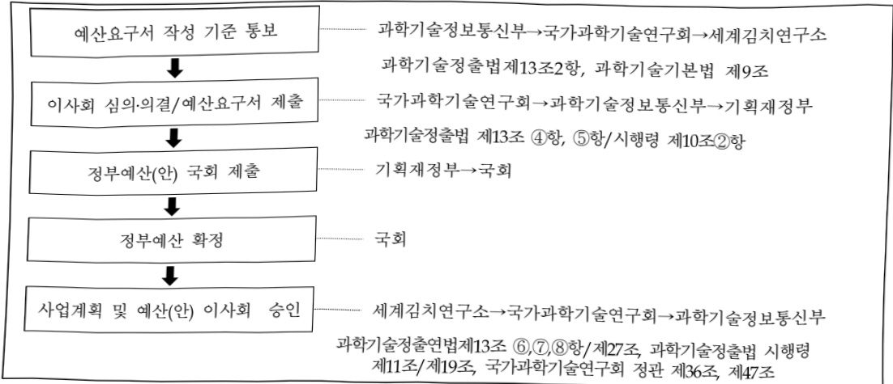

# 세계김치연구소연구운영비지원(R&D)

**해당 페이지**: PDF 1131 ~ 1139 쪽 해당

**부처**: 과학기술정보통신부
**분야**: 과학기술
**회계유형**: 일반회계
**2026 확정예산**: 20785.0 백만원
**전년대비 증감률**: 28.2%
**AI 도메인**: R&D 지원

---

### 가. 예산 총괄표

(단위: 백만원, %)

<table border=1 style='margin: auto; word-wrap: break-word;'><tr><td rowspan="2">사업명</td><td rowspan="2">2024년 결산</td><td colspan="2">2025년 예산</td><td colspan="2">2026년 예산</td><td rowspan="2">증감(B-A)</td><td rowspan="2">(B-A)/A</td></tr><tr><td style='text-align: center; word-wrap: break-word;'>본예산</td><td style='text-align: center; word-wrap: break-word;'>$ \text{추경}^{*}(A) $</td><td style='text-align: center; word-wrap: break-word;'>요구안</td><td style='text-align: center; word-wrap: break-word;'>본예산(B)</td></tr><tr><td style='text-align: center; word-wrap: break-word;'>세계김치연구소연구운영비지원(R&amp;D)</td><td style='text-align: center; word-wrap: break-word;'>14,053</td><td style='text-align: center; word-wrap: break-word;'>16,214</td><td style='text-align: center; word-wrap: break-word;'>16,214</td><td style='text-align: center; word-wrap: break-word;'>19,985</td><td style='text-align: center; word-wrap: break-word;'>20,785</td><td style='text-align: center; word-wrap: break-word;'>4,571</td><td style='text-align: center; word-wrap: break-word;'>28.2</td></tr></table>

*추경: 추경증감액을 포함한 최종 예산액을 기재

## □ 기능별(내역사업별) 예산 내역

(단위:백만원)

<table border=1 style='margin: auto; word-wrap: break-word;'><tr><td rowspan="2"></td><td colspan="5">2024</td><td colspan="5">2025</td><td rowspan="2">2026예산</td></tr><tr><td style='text-align: center; word-wrap: break-word;'>예산액(추정)</td><td style='text-align: center; word-wrap: break-word;'>예산현액</td><td style='text-align: center; word-wrap: break-word;'>집행액</td><td style='text-align: center; word-wrap: break-word;'>이월액</td><td style='text-align: center; word-wrap: break-word;'>불용액</td><td style='text-align: center; word-wrap: break-word;'>예산액(추정)</td><td style='text-align: center; word-wrap: break-word;'>예산현액</td><td style='text-align: center; word-wrap: break-word;'>집행액</td><td style='text-align: center; word-wrap: break-word;'>이월액</td><td style='text-align: center; word-wrap: break-word;'>불용액</td></tr><tr><td style='text-align: center; word-wrap: break-word;'>○ 기능별 분류(합계)</td><td style='text-align: center; word-wrap: break-word;'>14,267</td><td style='text-align: center; word-wrap: break-word;'>14,267</td><td style='text-align: center; word-wrap: break-word;'>14,053</td><td style='text-align: center; word-wrap: break-word;'>-</td><td style='text-align: center; word-wrap: break-word;'>214</td><td style='text-align: center; word-wrap: break-word;'>16,214</td><td style='text-align: center; word-wrap: break-word;'>16,214</td><td style='text-align: center; word-wrap: break-word;'>15,980</td><td style='text-align: center; word-wrap: break-word;'>-</td><td style='text-align: center; word-wrap: break-word;'>234</td><td style='text-align: center; word-wrap: break-word;'>20,785</td></tr><tr><td style='text-align: center; word-wrap: break-word;'>• 기관운영비</td><td style='text-align: center; word-wrap: break-word;'>7,511</td><td style='text-align: center; word-wrap: break-word;'>7,511</td><td style='text-align: center; word-wrap: break-word;'>7,297</td><td style='text-align: center; word-wrap: break-word;'>-</td><td style='text-align: center; word-wrap: break-word;'>214</td><td style='text-align: center; word-wrap: break-word;'>7,716</td><td style='text-align: center; word-wrap: break-word;'>7,716</td><td style='text-align: center; word-wrap: break-word;'>7,482</td><td style='text-align: center; word-wrap: break-word;'>-</td><td style='text-align: center; word-wrap: break-word;'>234</td><td style='text-align: center; word-wrap: break-word;'>8,470</td></tr><tr><td style='text-align: center; word-wrap: break-word;'>• 주요사업비</td><td style='text-align: center; word-wrap: break-word;'>6,756</td><td style='text-align: center; word-wrap: break-word;'>6,756</td><td style='text-align: center; word-wrap: break-word;'>6,756</td><td style='text-align: center; word-wrap: break-word;'>-</td><td style='text-align: center; word-wrap: break-word;'>-</td><td style='text-align: center; word-wrap: break-word;'>8,498</td><td style='text-align: center; word-wrap: break-word;'>8,498</td><td style='text-align: center; word-wrap: break-word;'>8,498</td><td style='text-align: center; word-wrap: break-word;'>-</td><td style='text-align: center; word-wrap: break-word;'>-</td><td style='text-align: center; word-wrap: break-word;'>12,315</td></tr></table>

### 나. 사업설명자료

## 1 ) 사업목적·내용

- (김치발효의 과학화를 위한 핵심원천기술 개발)

· 중군기반 국산김치 품질 차별화 기술개발

: 발효목적/소비자 수요 맞춤의 종균 라인업 강화 및 김치 발효조절 융·복합기술 개발, 멀티 오믹스 기반 김치 미생물의 김치발효 전개 방향성 예측 및 통제 모델 확립, 산업체 보급 확대를 위한 김치종균 대량생산 및 유통안정 통합솔루션 개발 김치의 건강기능성 증진효과 구명

: 김치의 항비만/장건강/면역증진 기전·효능 구명 및 마이크로 바이옵 상관성 분석,

김치 유래 기능성 바이오 소재의 항비만·장건강·면역 효능 검증 시스템 구축

- (김치산업의 선진화를 위한 산업화기술 개발)

·산업체 수요기반 상품김치 가격경쟁력 확보기술 개발

: 김치 생산 공정 기계·자동화와 김치 원부재료 수급 안정화 기술 개발로 김치산업 가격 경쟁력 확보 및 김치산업 기술 혁신

---

· 김치의 전주기적 품질관리 기술 개발

: 김치 품질·위생안전 관리기술 개발과 스마트 포장 기술로 김치제조업체 및 소비자 수요 대응, 김치 제조업체 역량강화를 위한 수요기반 맞춤형 기술 지원

· 김치 장기 유통을 위한 융복합 기술 개발

: 김치 장기저장 및 수출을 위해 발효를 지연하고 식감을 유지할 수 있는 융복합 기술 개발

·식품 폐지원 활용 업사이클링 플랫폼 기술 개발

: 식품산업 탄소중립 실현을 위한 식품 폐지원을 활용한 바이오 업사이클링 및

산업화 기술 개발

- (김치가치 제고를 위한 자원화 및 활용 인프라 구축)

· 김치연구자원·정보 확보 및 활용 인프라 구축

: 김치 원부재료, 발효 미생물 등 김치의 원부재료부터 최종 제품까지 통합 정보 구축, 김치 연구자원(유산군, 유전체 정보, 원부재료 위해요소) 정보를 종합적으로 제공하는 김치 자원은행 운영

· 김치 과학·문화 자원의 플랫폼 구축 및 확산 연구

: 김치의 역사·독자적 정체성 구명 및 김치 문화 융성의 증거로써 김치의 다양·창의·지속성 근거 확보 및 자원화, 김치산업 종합정보 서비스, 국내 김치섭취량 분석 모형 개발 등

## 2 ) 사업개요

## 사업근거 및 추진경위

① 법령상 근거 및 조항 적시

-과학기술분야 정부출연연구기관 등의 설립·운영 및 육성에 관한 법률 제5조(운영재원)

· ① 연구기관 및 연구회는 정부의 출연금과 그 밖의 수익금으로 운영한다.

② 성무는 연구기관 및 연구회의 설립 · 운영에 드는 경비에 충당하기 위하여 예산의 범위에서 연구기관 및 연구회에 출연금을 지급할 수 있다. 이 경우 정부는 연구기관 및 연구회의 지속적이고 안정적인 운영을 위하여 필요한 재원이 마련될 수 있도록 노력하여야 한다.

·③ 지방자치단체의 요청에 따라 연구기관 및 연구회가 해당 지방자치단체에 지역조직을 설립·운영할 경우 지방자치단체는 이에 필요한 경비에 충당하기 위하여 예산의 범위에서 연구기관 및 연구회에 출연금을 지급할 수 있다.

- 김치산업진흥법 제13조(세계 김치연구소)

· ① 국가는 김치종주국의 위상제고, 김치의 연구 · 전시 · 체험 등을 위하여 「과학기술분야 정부출연연구기관 등의 설립 · 운영 및 육성에 관한 법률」에 따라 세계 김치연구소(이하 “김치연구소”라 한다)를 설립한다.

·②국가와 지방자치단체는 김치연구소의 설립과 효율적인 운영·관리를 위하여

필요한 경비를 예산의 범위에서 지원할 수 있다

---

## ② 추진경위

- 2008. 10 김치종주국 위상 회복을 위한 세계최고 수준의 절임류(발효식품) 연구기관

육성(국무회의시 대통령 지시)

- 2009. 12 한국식품연구원 부설 세계김치연구소 설립 승인(국가과학기술연구회 제132회 정기이사회)

- 2010. 01 한국식품연구원 부설 세계김치연구소 설립(지식경제부 소관)

- 2013. 03 미래창조과학부 산하로 소관부처 변경(국가과학기술연구회)

- 2014. 07 소관 연구회 변경(산업기술연구회→국가과학기술연구회)

- 2017. 07 과학기술정보통신부 산하로 소관부처명 변경(국가과학기술연구회)

## 주요내용

① 사업규모

- 총사업비 : 해당없음

- 사업기간 : 계속

- 최근 5년 간 투입된 사업비(예산액기준, 추경편성한 연도에는 추경포함)

<table border=1 style='margin: auto; word-wrap: break-word;'><tr><td style='text-align: center; word-wrap: break-word;'>$ \underline{\text{冼}} $</td><td style='text-align: center; word-wrap: break-word;'>2022</td><td style='text-align: center; word-wrap: break-word;'>2023</td><td style='text-align: center; word-wrap: break-word;'>2024</td><td style='text-align: center; word-wrap: break-word;'>2025</td><td style='text-align: center; word-wrap: break-word;'>2026</td></tr><tr><td style='text-align: center; word-wrap: break-word;'>$ \underline{\text{사업비}} $</td><td style='text-align: center; word-wrap: break-word;'>15,111</td><td style='text-align: center; word-wrap: break-word;'>16,260</td><td style='text-align: center; word-wrap: break-word;'>14,267</td><td style='text-align: center; word-wrap: break-word;'>16,214</td><td style='text-align: center; word-wrap: break-word;'>20,785</td></tr></table>

- 기타: 해당없음

② 사업추진체계

- 사업시행방법 : 출연, 직접수행

- 사업시행주체 : 세계김치연구소

- 사업 수혜자 : 국민, 김치 관련 산업계 등

- 보조, 융자, 출연, 출자 등의 경우 보조 · 융자 등 지원 비율 및 법적근거: 해당없음

---

3) 2026년도 예산 산출 근거

<table border=1 style='margin: auto; word-wrap: break-word;'><tr><td style='text-align: center; word-wrap: break-word;'>요구방향 및 지원필요성</td></tr><tr><td style='text-align: center; word-wrap: break-word;'>○ 국가과학기술 발전계획과 연계하고 김치산업 구조분석 및 산학연 수요조사기반의 미래기술 예측을 반영하여 김치산업의 미래를위한 기반기술과 글로벌 김치산업 선점을 위한 전략기술 개발을 위한 예산 편성</td></tr><tr><td style='text-align: center; word-wrap: break-word;'>○ 세계김치연구소의 기관운영비는 중장기발전계획 및 경영목표에 부합하는 기관 고유 기능의 안정적 수행을 위해서 반드시 정부의 지원이 필요</td></tr></table>

## 세부 요구내용

<table border=1 style='margin: auto; word-wrap: break-word;'><tr><td style='text-align: center; word-wrap: break-word;'>(1) 인건비 : (2025) 6,734 → (2026) 6,970만원, +236백만원, +3.5%</td></tr><tr><td style='text-align: center; word-wrap: break-word;'>- (요구) &#x27;25년 수준 유지 + 처우개선 3.5%(236백만원)</td></tr><tr><td style='text-align: center; word-wrap: break-word;'>- (산출) 전년 수준 6,734백만원 + 처우개선 3.5%(236백만원)</td></tr><tr><td style='text-align: center; word-wrap: break-word;'>(2) 경상경비 : (2025) 982 → (2026) 1,500백만원, +518백만원, +52.7%</td></tr><tr><td style='text-align: center; word-wrap: break-word;'>- (요구) &#x27;25년 수준 유지 + 공공요금 인상예측분, 연구데이터 보안솔루션 도입 등에 따른 &#x27;25년대비 +52.7% 증액 요구</td></tr><tr><td style='text-align: center; word-wrap: break-word;'>- (산출) 전년수준 982백만원 + 공공요금 인상 예측분(33백만원) + 연구 데이터 보안솔루션 도입(500백만원) + 비경직성 경상비 감액(△15백만원)</td></tr><tr><td style='text-align: center; word-wrap: break-word;'>(3) 주요사업비 : (2025) 8,498 → (2026) 12,315백만원, +3,817백만원, +44.9%</td></tr><tr><td style='text-align: center; word-wrap: break-word;'>- (요구) 계속사업 구조개편, 전략연구사업 3개과제 추진에 따라 &#x27;25년 대비 44.9% 증액요구</td></tr><tr><td style='text-align: center; word-wrap: break-word;'>- (산출) &#x27;25년 8,498백만원 → &#x27;26년 12,315백만원(+3,817만원)</td></tr><tr><td style='text-align: center; word-wrap: break-word;'>* 사유 : 지출구조조정(△1,971백만원)</td></tr><tr><td style='text-align: center; word-wrap: break-word;'>계속사업 구조개편에 따른 조정(+800백만원)</td></tr><tr><td style='text-align: center; word-wrap: break-word;'>(신규) 글로벌 표준 김치팩토리 전략연구사업(+2,039백만원)</td></tr><tr><td style='text-align: center; word-wrap: break-word;'>(신규) 김치옴 활용 신바이오소재 전략연구사업(+1,638백만원)</td></tr><tr><td style='text-align: center; word-wrap: break-word;'>(신규) Lacto-AI 기반 김치유산균 파마바이오틱스 전략연구사업(+1,311백만원)</td></tr></table>

(4) 기타 : 해당없음

---

## 4 ) 사업효과

사업영향, 산출물 성과지표 등

① 2022~2026년도 성과계획서 상 성과지표 및 최근 5년간 성과 달성도: 해당없음

② 성과지표 이외의 연도별 사업추진 경과 및 실적

<table border=1 style='margin: auto; word-wrap: break-word;'><tr><td style='text-align: center; word-wrap: break-word;'>2022</td><td style='text-align: center; word-wrap: break-word;'>(기초·미래선도형) 김치발효의 과학화를 위한 핵심원천기술 개발(공공·인프라형) 김치산업의 선진화를 위한 산업화기술 개발(산업화형) 김치가치 제고를 위한 자원화 및 활용 인프라 구축</td></tr><tr><td style='text-align: center; word-wrap: break-word;'>2023</td><td style='text-align: center; word-wrap: break-word;'>(기초·미래선도형) 김치발효의 과학화를 위한 핵심원천기술 개발(공공·인프라형) 김치산업의 선진화를 위한 산업화기술 개발(산업화형) 김치가치 제고를 위한 자원화 및 활용 인프라 구축</td></tr><tr><td style='text-align: center; word-wrap: break-word;'>2024</td><td style='text-align: center; word-wrap: break-word;'>(기초·미래선도형) 김치발효의 과학화를 위한 핵심원천기술 개발(공공·인프라형) 김치산업의 선진화를 위한 산업화기술 개발(산업화형) 김치가치 제고를 위한 자원화 및 활용 인프라 구축</td></tr><tr><td style='text-align: center; word-wrap: break-word;'>2025</td><td style='text-align: center; word-wrap: break-word;'>(기초·미래선도형) 김치발효의 과학화를 위한 핵심원천기술 개발(공공·인프라형) 김치산업의 선진화를 위한 산업화기술 개발(산업화형) 김치가치 제고를 위한 자원화 및 활용 인프라 구축</td></tr></table>

<table border=1 style='margin: auto; word-wrap: break-word;'><tr><td colspan="2">구분</td><td style='text-align: center; word-wrap: break-word;'>2022년</td><td style='text-align: center; word-wrap: break-word;'>2023년</td><td style='text-align: center; word-wrap: break-word;'>2024년</td><td style='text-align: center; word-wrap: break-word;'>2025년</td></tr><tr><td colspan="2">기술료 수입</td><td style='text-align: center; word-wrap: break-word;'>239.3</td><td style='text-align: center; word-wrap: break-word;'>323</td><td style='text-align: center; word-wrap: break-word;'>232</td><td style='text-align: center; word-wrap: break-word;'>653</td></tr><tr><td rowspan="2">특허</td><td style='text-align: center; word-wrap: break-word;'>출원</td><td style='text-align: center; word-wrap: break-word;'>17</td><td style='text-align: center; word-wrap: break-word;'>30</td><td style='text-align: center; word-wrap: break-word;'>43</td><td style='text-align: center; word-wrap: break-word;'>12</td></tr><tr><td style='text-align: center; word-wrap: break-word;'>등록</td><td style='text-align: center; word-wrap: break-word;'>26</td><td style='text-align: center; word-wrap: break-word;'>26</td><td style='text-align: center; word-wrap: break-word;'>15</td><td style='text-align: center; word-wrap: break-word;'>10</td></tr><tr><td rowspan="2">논문</td><td style='text-align: center; word-wrap: break-word;'>SCI(E)</td><td style='text-align: center; word-wrap: break-word;'>35</td><td style='text-align: center; word-wrap: break-word;'>58</td><td style='text-align: center; word-wrap: break-word;'>72</td><td style='text-align: center; word-wrap: break-word;'>60</td></tr><tr><td style='text-align: center; word-wrap: break-word;'>비SCI</td><td style='text-align: center; word-wrap: break-word;'>5</td><td style='text-align: center; word-wrap: break-word;'>17</td><td style='text-align: center; word-wrap: break-word;'>10</td><td style='text-align: center; word-wrap: break-word;'>7</td></tr><tr><td colspan="2">중소·중견기업 지원</td><td style='text-align: center; word-wrap: break-word;'>기업지원 통합 플랫폼 구축</td><td style='text-align: center; word-wrap: break-word;'>기업지원 통합 플랫폼 고도화</td><td style='text-align: center; word-wrap: break-word;'>수출 김치 라벨링 지원 (지원 국가 확대)</td><td style='text-align: center; word-wrap: break-word;'>김치 수출 라벨링, 실무교육 지원 (지원 국가 확대)</td></tr></table>

③향후(2026년도 이후)기대효과

□ 기관운영비(계속)

☐ 안정적인 기관운영경비(인건비 및 경상운영비) 지원을 통한 고유임무 수행

☐ 주요사업비(계속)

0 김치 발효 메커니즘 분석 및 동역학 모델링, 김치별 종군 선별 및 종군의

유전·대사특성기반 선별기준 확립, 데이터기반 배양공정 최적화 및 종군 품질

관리 원천기술 확보

ㅇ 김치 발효단계별 대사물질 분석 및 다단계 기능성·기전 규명

0 김치산업 기술·정책 환경 분석 및 미래 R&D 방향 도출

---

° 주요 원부재료의 품질특성 분석 및 통합데이터(환경-품질-위생) 구축, 원재료(저장) 품질 예측 모델 개발, 기후변화 대응 배추 저장 안정성 확보 기술 개발

○ 바이오 리팩토링을위한 식품 부산물 기질 라이브러리 및 대사 데이터 구축,

식품 부산물 업사이클링기초 미생물 발굴 및 기능성 확보, 식품 부산물 업사

이클링기반기술 개발 및 미생물 세포공장설계

0 김치 발효 단계별 품질 지표 발굴 및 ICT 기술 활용한 정보 수집 기술 구축,

수출 맞춤형 유통 시스템 표준 확립

0 진환성 농정 노입을 동한 기능성 활성불질 및 다공물질 개발, 다공성물질과

천연 유래 산소제거 물질의 혼합 및 폴리머네트워크 내 도입을 통한 기능성

물질 개발,품질열화 방지 기능성 성능 발현 및 특성 분석

○ 김치업체 특성 기반 역량지표 발굴 및 확정(공정기술·품질안전·수출·경영조직),

정량·정성·AI 레벨링모델 개발(외부 기관 협업), AI 기반 역량 분류 모델 개발 및 시범 운영(10개소), WiKim 패밀리기업 육성(6개소)

° 글로벌 김치제조 표준(ISO) 인증, 글로벌 김치 자동화 생산설비 플랫폼 기술 완성(TRL 9단계) 및 성과 확산(국내 10개소), 글로벌 김치팩토리 디지털 트윈(DX) 구현 및 글로벌 생산체계 구축(해외공장 2개소)

○ 세계 유일 저온생육능 유산균 활용 기능성 균주 포트폴리오 100주(TRL 4) 및 이를 활용한 식품, 건강기능식품 제품(TRL 9), 유용물질 라이브러리 구축 30종 및 기술이전 3건 (TRL 4) 및 제품화 3건, 김치 유래 박테리오파지 라이브러리 구축 30주 (TRL 3-4) 및 식품안전/다제내성균역제 파지소재 개발(TRL 5)

○ 김치유산군 기능성 평가 $ \&\#8231 $;예측 원천기술 개발: 예측력 85% 이상(TRL 7), Lacto-AI 활용 유용 유산군 발굴, 김치 신바이오틱스 개발 및 기술이전 (TRL 7~8), Lacto-AI기반 면역·대사질환 파마바이오틱스 1b/2a 임상 완료(TRL 6~7)

5) 타당성조사 및 예비타당성조사 시행여부 및 결과 요지: 해당 없음

6) 총사업비 대상사업 정보: 해당 없음

---

## 7 ) 사업 집행절차

8) 각종 평가 : 해당 없음

---

### 다. 최근 4년간 결산내역

## 1 ) 결산표

☐ 부처 결산내역

(단위: 백만원, %)

<table border=1 style='margin: auto; word-wrap: break-word;'><tr><td rowspan="2">연도</td><td colspan="3">예산액</td><td rowspan="2">예산현액(A)</td><td rowspan="2">집행액(B)</td><td rowspan="2">집행률(B/A)</td><td rowspan="2">다음연도이월액</td><td rowspan="2">불용액</td></tr><tr><td style='text-align: center; word-wrap: break-word;'>본예산</td><td style='text-align: center; word-wrap: break-word;'>추경중감액</td><td style='text-align: center; word-wrap: break-word;'>추경</td></tr><tr><td style='text-align: center; word-wrap: break-word;'>2022</td><td style='text-align: center; word-wrap: break-word;'>15,111</td><td style='text-align: center; word-wrap: break-word;'>-</td><td style='text-align: center; word-wrap: break-word;'>15,111</td><td style='text-align: center; word-wrap: break-word;'>15,111</td><td style='text-align: center; word-wrap: break-word;'>14,631</td><td style='text-align: center; word-wrap: break-word;'>96.8</td><td style='text-align: center; word-wrap: break-word;'>-</td><td style='text-align: center; word-wrap: break-word;'>480</td></tr><tr><td style='text-align: center; word-wrap: break-word;'>2023</td><td style='text-align: center; word-wrap: break-word;'>16,260</td><td style='text-align: center; word-wrap: break-word;'>-</td><td style='text-align: center; word-wrap: break-word;'>16,260</td><td style='text-align: center; word-wrap: break-word;'>16,260</td><td style='text-align: center; word-wrap: break-word;'>15,866</td><td style='text-align: center; word-wrap: break-word;'>97.6</td><td style='text-align: center; word-wrap: break-word;'>-</td><td style='text-align: center; word-wrap: break-word;'>394</td></tr><tr><td style='text-align: center; word-wrap: break-word;'>2024</td><td style='text-align: center; word-wrap: break-word;'>14,267</td><td style='text-align: center; word-wrap: break-word;'>-</td><td style='text-align: center; word-wrap: break-word;'>14,267</td><td style='text-align: center; word-wrap: break-word;'>14,267</td><td style='text-align: center; word-wrap: break-word;'>14,053</td><td style='text-align: center; word-wrap: break-word;'>98.5</td><td style='text-align: center; word-wrap: break-word;'>-</td><td style='text-align: center; word-wrap: break-word;'>214</td></tr><tr><td style='text-align: center; word-wrap: break-word;'>2025</td><td style='text-align: center; word-wrap: break-word;'>16,214</td><td style='text-align: center; word-wrap: break-word;'>-</td><td style='text-align: center; word-wrap: break-word;'>16,214</td><td style='text-align: center; word-wrap: break-word;'>16,214</td><td style='text-align: center; word-wrap: break-word;'>15,980</td><td style='text-align: center; word-wrap: break-word;'>98.6</td><td style='text-align: center; word-wrap: break-word;'>-</td><td style='text-align: center; word-wrap: break-word;'>234</td></tr></table>

## 2 ) 주요 결산사항

2022~2025년 결산 주요사항

<table border=1 style='margin: auto; word-wrap: break-word;'><tr><td style='text-align: center; word-wrap: break-word;'>2022</td><td style='text-align: center; word-wrap: break-word;'>- 불용 사유 : 결원인력 인건비 불용(480백만원)</td></tr><tr><td style='text-align: center; word-wrap: break-word;'>2023</td><td style='text-align: center; word-wrap: break-word;'>- 불용 사유 : 결원인력 인건비 불용(394백만원)</td></tr><tr><td style='text-align: center; word-wrap: break-word;'>2024</td><td style='text-align: center; word-wrap: break-word;'>- 불용 사유 : 결원인력 인건비 불용(214백만원)</td></tr><tr><td style='text-align: center; word-wrap: break-word;'>2025</td><td style='text-align: center; word-wrap: break-word;'>- 불용 사유 : 결원인력 인건비 불용(234백만원)</td></tr></table>

2025년 이·전용 등 세부내역: 해당 없음

---

<table border=1 style='margin: auto; word-wrap: break-word;'><tr><td style='text-align: center; word-wrap: break-word;'>사 업 명</td></tr><tr><td style='text-align: center; word-wrap: break-word;'>(27) 소프트웨어인재키움 (2232-304)</td></tr></table>

사업 코드 정보

<table border=1 style='margin: auto; word-wrap: break-word;'><tr><td style='text-align: center; word-wrap: break-word;'>구분</td><td style='text-align: center; word-wrap: break-word;'>회계</td><td style='text-align: center; word-wrap: break-word;'>소관</td><td style='text-align: center; word-wrap: break-word;'>실국(기관)</td><td style='text-align: center; word-wrap: break-word;'>계정</td><td style='text-align: center; word-wrap: break-word;'>분야</td><td style='text-align: center; word-wrap: break-word;'>부문</td></tr><tr><td style='text-align: center; word-wrap: break-word;'>코드</td><td style='text-align: center; word-wrap: break-word;'>지역균형발전</td><td style='text-align: center; word-wrap: break-word;'>과학기술</td><td style='text-align: center; word-wrap: break-word;'>소프트웨어</td><td style='text-align: center; word-wrap: break-word;'>지역지원</td><td style='text-align: center; word-wrap: break-word;'>130</td><td style='text-align: center; word-wrap: break-word;'>133</td></tr><tr><td style='text-align: center; word-wrap: break-word;'>명칭</td><td style='text-align: center; word-wrap: break-word;'>특별회계</td><td style='text-align: center; word-wrap: break-word;'>정보통신부</td><td style='text-align: center; word-wrap: break-word;'>정책관</td><td style='text-align: center; word-wrap: break-word;'>계정</td><td style='text-align: center; word-wrap: break-word;'>통신</td><td style='text-align: center; word-wrap: break-word;'>정보통신</td></tr></table>

<table border=1 style='margin: auto; word-wrap: break-word;'><tr><td style='text-align: center; word-wrap: break-word;'>구분</td><td style='text-align: center; word-wrap: break-word;'>프로그램</td><td style='text-align: center; word-wrap: break-word;'>단위사업</td><td style='text-align: center; word-wrap: break-word;'>세부사업</td></tr><tr><td style='text-align: center; word-wrap: break-word;'>코드</td><td style='text-align: center; word-wrap: break-word;'>2200</td><td style='text-align: center; word-wrap: break-word;'>2232</td><td style='text-align: center; word-wrap: break-word;'>304</td></tr><tr><td style='text-align: center; word-wrap: break-word;'>명칭</td><td style='text-align: center; word-wrap: break-word;'>SW산업진흥</td><td style='text-align: center; word-wrap: break-word;'>SW융합인력양성(균탁)</td><td style='text-align: center; word-wrap: break-word;'>소프트웨어인재키움</td></tr></table>

사업 성격 (공통요구자료 1-1 작성유의사항 4. 참조, 해당하는 사항에 “0” 표시)

<table border=1 style='margin: auto; word-wrap: break-word;'><tr><td rowspan="2">신규</td><td rowspan="2">계속</td><td rowspan="2">완료</td><td style='text-align: center; word-wrap: break-word;'>예비타당성</td><td style='text-align: center; word-wrap: break-word;'>총사업비</td><td style='text-align: center; word-wrap: break-word;'>총액계상</td><td style='text-align: center; word-wrap: break-word;'>사업소관 변경정보</td></tr><tr><td style='text-align: center; word-wrap: break-word;'>실시여부</td><td style='text-align: center; word-wrap: break-word;'>관리대상</td><td style='text-align: center; word-wrap: break-word;'>예산사업</td><td style='text-align: center; word-wrap: break-word;'>2025예산 시 소관</td></tr><tr><td style='text-align: center; word-wrap: break-word;'>○</td><td style='text-align: center; word-wrap: break-word;'></td><td style='text-align: center; word-wrap: break-word;'></td><td style='text-align: center; word-wrap: break-word;'></td><td style='text-align: center; word-wrap: break-word;'></td><td style='text-align: center; word-wrap: break-word;'></td><td style='text-align: center; word-wrap: break-word;'></td></tr></table>

□ 사업 지원 형태 및 지원을 (최소한 한 개는 반드시 선택하시오. 해당사항에 0 표시)

<table border=1 style='margin: auto; word-wrap: break-word;'><tr><td style='text-align: center; word-wrap: break-word;'>직접</td><td style='text-align: center; word-wrap: break-word;'>출자</td><td style='text-align: center; word-wrap: break-word;'>출연</td><td style='text-align: center; word-wrap: break-word;'>보조</td><td style='text-align: center; word-wrap: break-word;'>융자</td><td style='text-align: center; word-wrap: break-word;'>국고보조율(%)</td><td style='text-align: center; word-wrap: break-word;'>융자율(%)</td></tr><tr><td style='text-align: center; word-wrap: break-word;'></td><td style='text-align: center; word-wrap: break-word;'></td><td style='text-align: center; word-wrap: break-word;'>○</td><td style='text-align: center; word-wrap: break-word;'></td><td style='text-align: center; word-wrap: break-word;'></td><td style='text-align: center; word-wrap: break-word;'></td><td style='text-align: center; word-wrap: break-word;'></td></tr></table>

사업 소관부처 및 시행주체

<table border=1 style='margin: auto; word-wrap: break-word;'><tr><td style='text-align: center; word-wrap: break-word;'>사업명</td><td colspan="2">구분</td></tr><tr><td rowspan="3">소프트웨어 인재 키움</td><td rowspan="2">소관부처</td><td style='text-align: center; word-wrap: break-word;'>정보통신정책실 소프트웨어정책관</td></tr><tr><td style='text-align: center; word-wrap: break-word;'>소프트웨어기반조성팀</td></tr><tr><td style='text-align: center; word-wrap: break-word;'>사업시행주체</td><td style='text-align: center; word-wrap: break-word;'>정보통신산업진흥원</td></tr></table>

### 가.예산 총괄표

(단위: 백만원, %)

<table border=1 style='margin: auto; word-wrap: break-word;'><tr><td style='text-align: center; word-wrap: break-word;'>2024년</td><td style='text-align: center; word-wrap: break-word;'>2025년 예산</td><td style='text-align: center; word-wrap: break-word;'>2026년 예산</td><td colspan="2">증감</td></tr><tr><td style='text-align: center; word-wrap: break-word;'>결산</td><td style='text-align: center; word-wrap: break-word;'>본예산</td><td style='text-align: center; word-wrap: break-word;'>추경(A)</td><td style='text-align: center; word-wrap: break-word;'>본예산(B)</td><td style='text-align: center; word-wrap: break-word;'>(B-A)</td></tr><tr><td style='text-align: center; word-wrap: break-word;'>소프트웨어인재키움</td><td style='text-align: center; word-wrap: break-word;'>-</td><td style='text-align: center; word-wrap: break-word;'>-</td><td style='text-align: center; word-wrap: break-word;'>1,228</td><td style='text-align: center; word-wrap: break-word;'>3,328</td></tr></table>

---

### 원본 PDF 크롭 이미지

