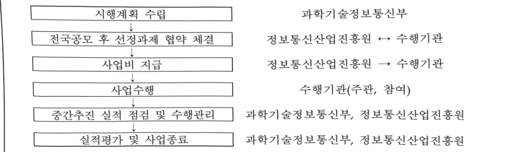
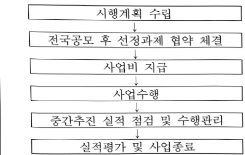

# 스마트물류 기술 실증화

**해당 페이지**: PDF 1151 ~ 1156 쪽 해당

**부처**: 과학기술정보통신부
**분야**: 산업·중소기업 및 에너지
**회계유형**: 지역균형발전 특별회계
**2026 확정예산**: 2160.0 백만원
**전년대비 증감률**: -10.0%
**AI 도메인**: 디지털전환(AX)

---

### 가. 예산 총괄표

(단위: 백만원, %)

<table border=1 style='margin: auto; word-wrap: break-word;'><tr><td rowspan="2">사업명</td><td rowspan="2">2024년 결산</td><td colspan="2">2025년 예산</td><td colspan="2">2026년 예산</td><td rowspan="2">증감(B-A)</td><td rowspan="2">(B-A)/A</td></tr><tr><td style='text-align: center; word-wrap: break-word;'>본예산</td><td style='text-align: center; word-wrap: break-word;'>추경(A)</td><td style='text-align: center; word-wrap: break-word;'>요구안</td><td style='text-align: center; word-wrap: break-word;'>본예산(B)</td></tr><tr><td style='text-align: center; word-wrap: break-word;'>스마트물류 기술 실증화</td><td style='text-align: center; word-wrap: break-word;'>3,000</td><td style='text-align: center; word-wrap: break-word;'>2,400</td><td style='text-align: center; word-wrap: break-word;'>2,400</td><td style='text-align: center; word-wrap: break-word;'>2,160</td><td style='text-align: center; word-wrap: break-word;'>2,160</td><td style='text-align: center; word-wrap: break-word;'>△240</td><td style='text-align: center; word-wrap: break-word;'>△10</td></tr></table>

□ 기능별(내역사업별) 예산 내역

(단위:백만원)

<table border=1 style='margin: auto; word-wrap: break-word;'><tr><td rowspan="2"></td><td colspan="5">2024</td><td colspan="5">2025</td><td rowspan="2">2026 叁沖</td></tr><tr><td style='text-align: center; word-wrap: break-word;'>叁沖の (추경)</td><td style='text-align: center; word-wrap: break-word;'>叁沖 현액</td><td style='text-align: center; word-wrap: break-word;'>집행액</td><td style='text-align: center; word-wrap: break-word;'>이월액</td><td style='text-align: center; word-wrap: break-word;'>불용액</td><td style='text-align: center; word-wrap: break-word;'>叁沖の (추경)</td><td style='text-align: center; word-wrap: break-word;'>叁沖 현액</td><td style='text-align: center; word-wrap: break-word;'>집행액</td><td style='text-align: center; word-wrap: break-word;'>이월액</td><td style='text-align: center; word-wrap: break-word;'>불용액</td></tr><tr><td style='text-align: center; word-wrap: break-word;'>○ 기능별 분류(합계)</td><td style='text-align: center; word-wrap: break-word;'>3,000</td><td style='text-align: center; word-wrap: break-word;'>3,000</td><td style='text-align: center; word-wrap: break-word;'>3,000 [2,999]</td><td style='text-align: center; word-wrap: break-word;'>-</td><td style='text-align: center; word-wrap: break-word;'>-</td><td style='text-align: center; word-wrap: break-word;'>2,400</td><td style='text-align: center; word-wrap: break-word;'>2,400</td><td style='text-align: center; word-wrap: break-word;'>2,400 [2,389]</td><td style='text-align: center; word-wrap: break-word;'></td><td style='text-align: center; word-wrap: break-word;'></td><td style='text-align: center; word-wrap: break-word;'>-</td></tr><tr><td style='text-align: center; word-wrap: break-word;'>· 스피드롬류 기술 실증 화</td><td style='text-align: center; word-wrap: break-word;'>3,000</td><td style='text-align: center; word-wrap: break-word;'>3,000</td><td style='text-align: center; word-wrap: break-word;'>3,000 [2,999]</td><td style='text-align: center; word-wrap: break-word;'>-</td><td style='text-align: center; word-wrap: break-word;'>-</td><td style='text-align: center; word-wrap: break-word;'>2,400</td><td style='text-align: center; word-wrap: break-word;'>2,400</td><td style='text-align: center; word-wrap: break-word;'>2,400 [2,389]</td><td style='text-align: center; word-wrap: break-word;'></td><td style='text-align: center; word-wrap: break-word;'></td><td style='text-align: center; word-wrap: break-word;'>-</td></tr></table>

### 나.사업설명자료

## 1 ) 사업목적·내용

- (사업목적) 물류데이터 수집·분석·활용을 위한 디지털 물류 플랫폼 구축 및 신서비스 개발·실증, 물류산업의 디지털 전환 촉진

- (사업내용) 물류데이터의 공공개방 및 활용을 위한 디지털 물류 플랫폼 구축, 공공물

류센터 수요기반 물류자동화 신서비스 개발 및 실증 추진

## 2 ) 사업개요

☐ 사업근거 및 추진경위

① 법령상 근거 조항 적시

0 지방자치분권 및 지역군형발전에 관한 특별법 제14조(지역 산업 육성 및 일자리 창출 등 지역경제 활성화 촉진) ④ 국가와 지방자치단체는 지역 산업의 육성과 지역경제의 활성화를 위하여 지역의 일자리 창출과 투자 유치활동 지원, 정보통신 진흥 및 지역 특성에 맞는 중소기업의 창업 여건 개선 등에 관한 시책을 추진하여야 한다.

소프트웨어 진흥법 제8조(소프트웨어산업 진흥 전담기관 등) ① 과학기술정보통신부장관은

---

소프트웨어산업의 진흥·발전을 효율적으로 지원하기 위하여「정보통신산업 진흥법」 제26조에 따른 정보통신산업진흥원을 소프트웨어산업 진흥 전담기관으로 지정한다.

○소프트웨어 진흥법 제9조(지역별 소프트웨어산업 진흥) ① 과학기술정보통신부장관은 지역별 특성에 기반한 소프트웨어산업 진흥을 지원하고 지역 산업과의 융합을 촉진하여야 한다.

② 과학기술정보통신부장관은 제1항에 따른 업무를 효과적으로 시행하기 위하여 대통령령으로 정하는 요건을 갖춘 기관을 지역별 소프트웨어산업 진흥기관(이하 이 조에서 “지역산업진흥기관”이라 한다)으로 지정하여 업무를 위탁할 수 있다.

☐ 정보통신산업 진흥법 제3조(국가 및 지방자치단체의 책무) ① 국가는 정보통신산업의 진흥에 필요한 종합적인 시책을 수립하여 시행하고 이에 필요한 재원확보 방안을 마련하여야 한다. ② 지방자치단체는 국가의 시책과 지역적 특성을 고려하여 정보통신기술을 기반으로 정보통신산업의 진흥에 필요한 시책을 마련하여야 한다.

0 정보통신산업 진흥법 제28조(재원 등) ① 정부는 예산 또는 기금의 범위에서 산업진흥원의 설립 및 운영에 필요한 경비의 전부 또는 일부를 출연하거나 보조할 수 있다.

## ② 추진경위

- 대한민국 디지털 전략('22.9월)

[대한민국디지털전략] 3.(미래형 운송업) 디지털로 빨라지는 국가 물류 네트워크

수출입 물류의 자동화, 물류센터 운영최적화, 로봇 배송 활성화 등 물류 네트워크의 디지털 전환을 통해 전 국가적 물류 흐름 효율화

- 이재명 정부 국정기획위원회 국민보고대회 123대 국정과제 발표('25.8월)

전략 1. AI 3대 강국도약

21. 세계에서 AI를 가장 잘쓰는 나라 구현

□주요내용

① 사업규모

- 총사업비(해당되는 경우에만 기재) : 해당없음

- 사업기간 : '24 ~ '26년(3년간)

- 최근 5년 간 투입된 사업비(예산액기준, 추경편성한 연도에는 추경포함)

<table border=1 style='margin: auto; word-wrap: break-word;'><tr><td style='text-align: center; word-wrap: break-word;'>2022</td><td style='text-align: center; word-wrap: break-word;'>2023</td><td style='text-align: center; word-wrap: break-word;'>2024</td><td style='text-align: center; word-wrap: break-word;'>2025</td><td style='text-align: center; word-wrap: break-word;'>2026</td></tr><tr><td style='text-align: center; word-wrap: break-word;'>2023</td><td style='text-align: center; word-wrap: break-word;'>2024</td><td style='text-align: center; word-wrap: break-word;'>2025</td><td style='text-align: center; word-wrap: break-word;'>2026</td><td style='text-align: center; word-wrap: break-word;'></td></tr><tr><td style='text-align: center; word-wrap: break-word;'>2024</td><td style='text-align: center; word-wrap: break-word;'>2025</td><td style='text-align: center; word-wrap: break-word;'>2026</td><td style='text-align: center; word-wrap: break-word;'></td><td style='text-align: center; word-wrap: break-word;'></td></tr><tr><td style='text-align: center; word-wrap: break-word;'>2025</td><td style='text-align: center; word-wrap: break-word;'>2026</td><td style='text-align: center; word-wrap: break-word;'>2027</td><td style='text-align: center; word-wrap: break-word;'>2028</td><td style='text-align: center; word-wrap: break-word;'>2029</td></tr><tr><td style='text-align: center; word-wrap: break-word;'>2025</td><td style='text-align: center; word-wrap: break-word;'>2026</td><td style='text-align: center; word-wrap: break-word;'>2027</td><td style='text-align: center; word-wrap: break-word;'>2028</td><td style='text-align: center; word-wrap: break-word;'>2029</td></tr><tr><td style='text-align: center; word-wrap: break-word;'>2026</td><td style='text-align: center; word-wrap: break-word;'>2027</td><td style='text-align: center; word-wrap: break-word;'>2028</td><td style='text-align: center; word-wrap: break-word;'>2029</td><td style='text-align: center; word-wrap: break-word;'>2030</td></tr><tr><td style='text-align: center; word-wrap: break-word;'>2026</td><td style='text-align: center; word-wrap: break-word;'>2027</td><td style='text-align: center; word-wrap: break-word;'>2028</td><td style='text-align: center; word-wrap: break-word;'>2029</td><td style='text-align: center; word-wrap: break-word;'>2030</td></tr><tr><td style='text-align: center; word-wrap: break-word;'>2027</td><td style='text-align: center; word-wrap: break-word;'>2028</td><td style='text-align: center; word-wrap: break-word;'>2029</td><td style='text-align: center; word-wrap: break-word;'>2030</td><td style='text-align: center; word-wrap: break-word;'>2031</td></tr><tr><td style='text-align: center; word-wrap: break-word;'>2027</td><td style='text-align: center; word-wrap: break-word;'>2028</td><td style='text-align: center; word-wrap: break-word;'>2029</td><td style='text-align: center; word-wrap: break-word;'>2030</td><td style='text-align: center; word-wrap: break-word;'>2031</td></tr><tr><td style='text-align: center; word-wrap: break-word;'>2028</td><td style='text-align: center; word-wrap: break-word;'>2029</td><td style='text-align: center; word-wrap: break-word;'>2030</td><td style='text-align: center; word-wrap: break-word;'>2031</td><td style='text-align: center; word-wrap: break-word;'>2032</td></tr><tr><td style='text-align: center; word-wrap: break-word;'>2028</td><td style='text-align: center; word-wrap: break-word;'>2029</td><td style='text-align: center; word-wrap: break-word;'>2030</td><td style='text-align: center; word-wrap: break-word;'>2031</td><td style='text-align: center; word-wrap: break-word;'>2032</td></tr><tr><td style='text-align: center; word-wrap: break-word;'>2029</td><td style='text-align: center; word-wrap: break-word;'>2030</td><td style='text-align: center; word-wrap: break-word;'>2031</td><td style='text-align: center; word-wrap: break-word;'>2032</td><td style='text-align: center; word-wrap: break-word;'>2033</td></tr><tr><td style='text-align: center; word-wrap: break-word;'>2030</td><td style='text-align: center; word-wrap: break-word;'>2031</td><td style='text-align: center; word-wrap: break-word;'>2032</td><td style='text-align: center; word-wrap: break-word;'>2033</td><td style='text-align: center; word-wrap: break-word;'>2034</td></tr><tr><td style='text-align: center; word-wrap: break-word;'>2031</td><td style='text-align: center; word-wrap: break-word;'>2032</td><td style='text-align: center; word-wrap: break-word;'>2033</td><td style='text-align: center; word-wrap: break-word;'>2034</td><td style='text-align: center; word-wrap: break-word;'>2035</td></tr><tr><td style='text-align: center; word-wrap: break-word;'>2032</td><td style='text-align: center; word-wrap: break-word;'>2033</td><td style='text-align: center; word-wrap: break-word;'>2034</td><td style='text-align: center; word-wrap: break-word;'>2035</td><td style='text-align: center; word-wrap: break-word;'>2036</td></tr><tr><td style='text-align: center; word-wrap: break-word;'>2033</td><td style='text-align: center; word-wrap: break-word;'>2034</td><td style='text-align: center; word-wrap: break-word;'>2035</td><td style='text-align: center; word-wrap: break-word;'>2036</td><td style='text-align: center; word-wrap: break-word;'>2037</td></tr><tr><td style='text-align: center; word-wrap: break-word;'>2034</td><td style='text-align: center; word-wrap: break-word;'>2035</td><td style='text-align: center; word-wrap: break-word;'>2036</td><td style='text-align: center; word-wrap: break-word;'>2037</td><td style='text-align: center; word-wrap: break-word;'>2038</td></tr><tr><td style='text-align: center; word-wrap: break-word;'>2035</td><td style='text-align: center; word-wrap: break-word;'>2036</td><td style='text-align: center; word-wrap: break-word;'>2037</td><td style='text-align: center; word-wrap: break-word;'>2038</td><td style='text-align: center; word-wrap: break-word;'>2039</td></tr><tr><td style='text-align: center; word-wrap: break-word;'>2036</td><td style='text-align: center; word-wrap: break-word;'>2037</td><td style='text-align: center; word-wrap: break-word;'>2038</td><td style='text-align: center; word-wrap: break-word;'>2039</td><td style='text-align: center; word-wrap: break-word;'>2040</td></tr><tr><td style='text-align: center; word-wrap: break-word;'>2037</td><td style='text-align: center; word-wrap: break-word;'>2038</td><td style='text-align: center; word-wrap: break-word;'>2039</td><td style='text-align: center; word-wrap: break-word;'>2040</td><td style='text-align: center; word-wrap: break-word;'>2041</td></tr><tr><td style='text-align: center; word-wrap: break-word;'>2038</td><td style='text-align: center; word-wrap: break-word;'>2039</td><td style='text-align: center; word-wrap: break-word;'>2040</td><td style='text-align: center; word-wrap: break-word;'>2041</td><td style='text-align: center; word-wrap: break-word;'>2042</td></tr><tr><td style='text-align: center; word-wrap: break-word;'>2039</td><td style='text-align: center; word-wrap: break-word;'>2040</td><td style='text-align: center; word-wrap: break-word;'>2041</td><td style='text-align: center; word-wrap: break-word;'>2042</td><td style='text-align: center; word-wrap: break-word;'>2043</td></tr><tr><td style='text-align: center; word-wrap: break-word;'>2040</td><td style='text-align: center; word-wrap: break-word;'>2041</td><td style='text-align: center; word-wrap: break-word;'>2042</td><td style='text-align: center; word-wrap: break-word;'>2043</td><td style='text-align: center; word-wrap: break-word;'>2044</td></tr><tr><td style='text-align: center; word-wrap: break-word;'>2041</td><td style='text-align: center; word-wrap: break-word;'>2042</td><td style='text-align: center; word-wrap: break-word;'>2043</td><td style='text-align: center; word-wrap: break-word;'>2044</td><td style='text-align: center; word-wrap: break-word;'>2045</td></tr><tr><td style='text-align: center; word-wrap: break-word;'>2042</td><td style='text-align: center; word-wrap: break-word;'>2043</td><td style='text-align: center; word-wrap: break-word;'>2044</td><td style='text-align: center; word-wrap: break-word;'>2045</td><td style='text-align: center; word-wrap: break-word;'>2046</td></tr><tr><td style='text-align: center; word-wrap: break-word;'>2043</td><td style='text-align: center; word-wrap: break-word;'>2044</td><td style='text-align: center; word-wrap: break-word;'>2045</td><td style='text-align: center; word-wrap: break-word;'>2046</td><td style='text-align: center; word-wrap: break-word;'>2047</td></tr><tr><td style='text-align: center; word-wrap: break-word;'>2044</td><td style='text-align: center; word-wrap: break-word;'>2045</td><td style='text-align: center; word-wrap: break-word;'>2046</td><td style='text-align: center; word-wrap: break-word;'>2047</td><td style='text-align: center; word-wrap: break-word;'>2048</td></tr><tr><td style='text-align: center; word-wrap: break-word;'>2045</td><td style='text-align: center; word-wrap: break-word;'>2046</td><td style='text-align: center; word-wrap: break-word;'>2047</td><td style='text-align: center; word-wrap: break-word;'>2048</td><td style='text-align: center; word-wrap: break-word;'>2049</td></tr><tr><td style='text-align: center; word-wrap: break-word;'>2046</td><td style='text-align: center; word-wrap: break-word;'>2047</td><td style='text-align: center; word-wrap: break-word;'>2048</td><td style='text-align: center; word-wrap: break-word;'>2049</td><td style='text-align: center; word-wrap: break-word;'>2050</td></tr><tr><td style='text-align: center; word-wrap: break-word;'>2047</td><td style='text-align: center; word-wrap: break-word;'>2048</td><td style='text-align: center; word-wrap: break-word;'>2049</td><td style='text-align: center; word-wrap: break-word;'>2050</td><td style='text-align: center; word-wrap: break-word;'>2051</td></tr><tr><td style='text-align: center; word-wrap: break-word;'>2048</td><td style='text-align: center; word-wrap: break-word;'>2049</td><td style='text-align: center; word-wrap: break-word;'>2050</td><td style='text-align: center; word-wrap: break-word;'>2051</td><td style='text-align: center; word-wrap: break-word;'>2052</td></tr><tr><td style='text-align: center; word-wrap: break-word;'>2049</td><td style='text-align: center; word-wrap: break-word;'>2050</td><td style='text-align: center; word-wrap: break-word;'>2051</td><td style='text-align: center; word-wrap: break-word;'>2052</td><td style='text-align: center; word-wrap: break-word;'>2053</td></tr><tr><td style='text-align: center; word-wrap: break-word;'>2050</td><td style='text-align: center; word-wrap: break-word;'>2051</td><td style='text-align: center; word-wrap: break-word;'>2052</td><td style='text-align: center; word-wrap: break-word;'>2053</td><td style='text-align: center; word-wrap: break-word;'>2054</td></tr><tr><td style='text-align: center; word-wrap: break-word;'>2051</td><td style='text-align: center; word-wrap: break-word;'>2052</td><td style='text-align: center; word-wrap: break-word;'>2053</td><td style='text-align: center; word-wrap: break-word;'>2054</td><td style='text-align: center; word-wrap: break-word;'>2055</td></tr><tr><td style='text-align: center; word-wrap: break-word;'>2052</td><td style='text-align: center; word-wrap: break-word;'>2053</td><td style='text-align: center; word-wrap: break-word;'>2054</td><td style='text-align: center; word-wrap: break-word;'>2055</td><td style='text-align: center; word-wrap: break-word;'>2056</td></tr><tr><td style='text-align: center; word-wrap: break-word;'>2053</td><td style='text-align: center; word-wrap: break-word;'>2054</td><td style='text-align: center; word-wrap: break-word;'>2055</td><td style='text-align: center; word-wrap: break-word;'>2056</td><td style='text-align: center; word-wrap: break-word;'>2057</td></tr><tr><td style='text-align: center; word-wrap: break-word;'>2054</td><td style='text-align: center; word-wrap: break-word;'>2055</td><td style='text-align: center; word-wrap: break-word;'>2056</td><td style='text-align: center; word-wrap: break-word;'>2057</td><td style='text-align: center; word-wrap: break-word;'>2058</td></tr><tr><td style='text-align: center; word-wrap: break-word;'>2055</td><td style='text-align: center; word-wrap: break-word;'>2056</td><td style='text-align: center; word-wrap: break-word;'>2057</td><td style='text-align: center; word-wrap: break-word;'>2058</td><td style='text-align: center; word-wrap: break-word;'>2059</td></tr><tr><td style='text-align: center; word-wrap: break-word;'>2056</td><td style='text-align: center; word-wrap: break-word;'>2057</td><td style='text-align: center; word-wrap: break-word;'>2058</td><td style='text-align: center; word-wrap: break-word;'>2059</td><td style='text-align: center; word-wrap: break-word;'>2060</td></tr><tr><td style='text-align: center; word-wrap: break-word;'>2057</td><td style='text-align: center; word-wrap: break-word;'>2058</td><td style='text-align: center; word-wrap: break-word;'>2059</td><td style='text-align: center; word-wrap: break-word;'>2060</td><td style='text-align: center; word-wrap: break-word;'>2061</td></tr><tr><td style='text-align: center; word-wrap: break-word;'>2058</td><td style='text-align: center; word-wrap: break-word;'>2059</td><td style='text-align: center; word-wrap: break-word;'>2060</td><td style='text-align: center; word-wrap: break-word;'>2061</td><td style='text-align: center; word-wrap: break-word;'>2062</td></tr><tr><td style='text-align: center; word-wrap: break-word;'>2059</td><td style='text-align: center; word-wrap: break-word;'>2060</td><td style='text-align: center; word-wrap: break-word;'>2061</td><td style='text-align: center; word-wrap: break-word;'>2062</td><td style='text-align: center; word-wrap: break-word;'>2063</td></tr><tr><td style='text-align: center; word-wrap: break-word;'>2060</td><td style='text-align: center; word-wrap: break-word;'>2061</td><td style='text-align: center; word-wrap: break-word;'>2062</td><td style='text-align: center; word-wrap: break-word;'>2063</td><td style='text-align: center; word-wrap: break-word;'>2064</td></tr><tr><td style='text-align: center; word-wrap: break-word;'>2061</td><td style='text-align: center; word-wrap: break-word;'>2062</td><td style='text-align: center; word-wrap: break-word;'>2063</td><td style='text-align: center; word-wrap: break-word;'>2064</td><td style='text-align: center; word-wrap: break-word;'>2065</td></tr><tr><td style='text-align: center; word-wrap: break-word;'>2062</td><td style='text-align: center; word-wrap: break-word;'>2063</td><td style='text-align: center; word-wrap: break-word;'>2064</td><td style='text-align: center; word-wrap: break-word;'>2065</td><td style='text-align: center; word-wrap: break-word;'>2066</td></tr><tr><td style='text-align: center; word-wrap: break-word;'>2063</td><td style='text-align: center; word-wrap: break-word;'>2064</td><td style='text-align: center; word-wrap: break-word;'>2065</td><td style='text-align: center; word-wrap: break-word;'>2066</td><td style='text-align: center; word-wrap: break-word;'>2067</td></tr><tr><td style='text-align: center; word-wrap: break-word;'>2064</td><td style='text-align: center; word-wrap: break-word;'>2065</td><td style='text-align: center; word-wrap: break-word;'>2066</td><td style='text-align: center; word-wrap: break-word;'>2067</td><td style='text-align: center; word-wrap: break-word;'>2068</td></tr><tr><td style='text-align: center; word-wrap: break-word;'>2065</td><td style='text-align: center; word-wrap: break-word;'>2066</td><td style='text-align: center; word-wrap: break-word;'>2067</td><td style='text-align: center; word-wrap: break-word;'>2068</td><td style='text-align: center; word-wrap: break-word;'>2069</td></tr><tr><td style='text-align: center; word-wrap: break-word;'>2066</td><td style='text-align: center; word-wrap: break-word;'>2067</td><td style='text-align: center; word-wrap: break-word;'>2068</td><td style='text-align: center; word-wrap: break-word;'>2069</td><td style='text-align: center; word-wrap: break-word;'>2070</td></tr><tr><td style='text-align: center; word-wrap: break-word;'>2067</td><td style='text-align: center; word-wrap: break-word;'>2068</td><td style='text-align: center; word-wrap: break-word;'>2069</td><td style='text-align: center; word-wrap: break-word;'>2070</td><td style='text-align: center; word-wrap: break-word;'>2071</td></tr><tr><td style='text-align: center; word-wrap: break-word;'>2068</td><td style='text-align: center; word-wrap: break-word;'>2069</td><td style='text-align: center; word-wrap: break-word;'>2070</td><td style='text-align: center; word-wrap: break-word;'>2071</td><td style='text-align: center; word-wrap: break-word;'>2072</td></tr><tr><td style='text-align: center; word-wrap: break-word;'>2069</td><td style='text-align: center; word-wrap: break-word;'>2070</td><td style='text-align: center; word-wrap: break-word;'>2071</td><td style='text-align: center; word-wrap: break-word;'>2072</td><td style='text-align: center; word-wrap: break-word;'>2073</td></tr><tr><td style='text-align: center; word-wrap: break-word;'>2070</td><td style='text-align: center; word-wrap: break-word;'>2071</td><td style='text-align: center; word-wrap: break-word;'>2072</td><td style='text-align: center; word-wrap: break-word;'>2073</td><td style='text-align: center; word-wrap: break-word;'>2074</td></tr><tr><td style='text-align: center; word-wrap: break-word;'>2071</td><td style='text-align: center; word-wrap: break-word;'>2072</td><td style='text-align: center; word-wrap: break-word;'>2073</td><td style='text-align: center; word-wrap: break-word;'>2074</td><td style='text-align: center; word-wrap: break-word;'>2075</td></tr><tr><td style='text-align: center; word-wrap: break-word;'>2072</td><td style='text-align: center; word-wrap: break-word;'>2073</td><td style='text-align: center; word-wrap: break-word;'>2074</td><td style='text-align: center; word-wrap: break-word;'>2075</td><td style='text-align: center; word-wrap: break-word;'>2076</td></tr><tr><td style='text-align: center; word-wrap: break-word;'>2073</td><td style='text-align: center; word-wrap: break-word;'>2074</td><td style='text-align: center; word-wrap: break-word;'>2075</td><td style='text-align: center; word-wrap: break-word;'>2076</td><td style='text-align: center; word-wrap: break-word;'>2077</td></tr><tr><td style='text-align: center; word-wrap: break-word;'>2074</td><td style='text-align: center; word-wrap: break-word;'>2075</td><td style='text-align: center; word-wrap: break-word;'>2076</td><td style='text-align: center; word-wrap: break-word;'>2077</td><td style='text-align: center; word-wrap: break-word;'>2078</td></tr><tr><td style='text-align: center; word-wrap: break-word;'>2075</td><td style='text-align: center; word-wrap: break-word;'>2076</td><td style='text-align: center; word-wrap: break-word;'>2077</td><td style='text-align: center; word-wrap: break-word;'>2078</td><td style='text-align: center; word-wrap: break-word;'>2079</td></tr><tr><td style='text-align: center; word-wrap: break-word;'>2076</td><td style='text-align: center; word-wrap: break-word;'>2077</td><td style='text-align: center; word-wrap: break-word;'>2078</td><td style='text-align: center; word-wrap: break-word;'>2079</td><td style='text-align: center; word-wrap: break-word;'>2080</td></tr><tr><td style='text-align: center; word-wrap: break-word;'>2077</td><td style='text-align: center; word-wrap: break-word;'>2078</td><td style='text-align: center; word-wrap: break-word;'>2079</td><td style='text-align: center; word-wrap: break-word;'>2080</td><td style='text-align: center; word-wrap: break-word;'>2081</td></tr><tr><td style='text-align: center; word-wrap: break-word;'>2078</td><td style='text-align: center; word-wrap: break-word;'>2079</td><td style='text-align: center; word-wrap: break-word;'>2080</td><td style='text-align: center; word-wrap: break-word;'>2081</td><td style='text-align: center; word-wrap: break-word;'>2082</td></tr><tr><td style='text-align: center; word-wrap: break-word;'>2079</td><td style='text-align: center; word-wrap: break-word;'>2080</td><td style='text-align: center; word-wrap: break-word;'>2081</td><td style='text-align: center; word-wrap: break-word;'>2082</td><td style='text-align: center; word-wrap: break-word;'>2083</td></tr><tr><td style='text-align: center; word-wrap: break-word;'>2080</td><td style='text-align: center; word-wrap: break-word;'>2081</td><td style='text-align: center; word-wrap: break-word;'>2082</td><td style='text-align: center; word-wrap: break-word;'>2083</td><td style='text-align: center; word-wrap: break-word;'>2084</td></tr><tr><td style='text-align: center; word-wrap: break-word;'>2081</td><td style='text-align: center; word-wrap: break-word;'>2082</td><td style='text-align: center; word-wrap: break-word;'>2083</td><td style='text-align: center; word-wrap: break-word;'>2084</td><td style='text-align: center; word-wrap: break-word;'>2085</td></tr><tr><td style='text-align: center; word-wrap: break-word;'>2082</td><td style='text-align: center; word-wrap: break-word;'>2083</td><td style='text-align: center; word-wrap: break-word;'>2084</td><td style='text-align: center; word-wrap: break-word;'>2085</td><td style='text-align: center; word-wrap: break-word;'>2086</td></tr><tr><td style='text-align: center; word-wrap: break-word;'>2083</td><td style='text-align: center; word-wrap: break-word;'>2084</td><td style='text-align: center; word-wrap: break-word;'>2085</td><td style='text-align: center; word-wrap: break-word;'>2086</td><td style='text-align: center; word-wrap: break-word;'>2087</td></tr><tr><td style='text-align: center; word-wrap: break-word;'>2084</td><td style='text-align: center; word-wrap: break-word;'>2085</td><td style='text-align: center; word-wrap: break-word;'>2086</td><td style='text-align: center; word-wrap: break-word;'>2087</td><td style='text-align: center; word-wrap: break-word;'>2088</td></tr><tr><td style='text-align: center; word-wrap: break-word;'>2085</td><td style='text-align: center; word-wrap: break-word;'>2086</td><td style='text-align: center; word-wrap: break-word;'>2087</td><td style='text-align: center; word-wrap: break-word;'>2088</td><td style='text-align: center; word-wrap: break-word;'>2089</td></tr><tr><td style='text-align: center; word-wrap: break-word;'>2086</td><td style='text-align: center; word-wrap: break-word;'>2087</td><td style='text-align: center; word-wrap: break-word;'>2088</td><td style='text-align: center; word-wrap: break-word;'>2089</td><td style='text-align: center; word-wrap: break-word;'>2090</td></tr><tr><td style='text-align: center; word-wrap: break-word;'>2087</td><td style='text-align: center; word-wrap: break-word;'>2088</td><td style='text-align: center; word-wrap: break-word;'>2089</td><td style='text-align: center; word-wrap: break-word;'>2090</td><td style='text-align: center; word-wrap: break-word;'>2091</td></tr><tr><td style='text-align: center; word-wrap: break-word;'>2088</td><td style='text-align: center; word-wrap: break-word;'>2089</td><td style='text-align: center; word-wrap: break-word;'>2090</td><td style='text-align: center; word-wrap: break-word;'>2091</td><td style='text-align: center; word-wrap: break-word;'>2092</td></tr><tr><td style='text-align: center; word-wrap: break-word;'>2089</td><td style='text-align: center; word-wrap: break-word;'>2090</td><td style='text-align: center; word-wrap: break-word;'>2091</td><td style='text-align: center; word-wrap: break-word;'>2092</td><td style='text-align: center; word-wrap: break-word;'>2093</td></tr><tr><td style='text-align: center; word-wrap: break-word;'>2090</td><td style='text-align: center; word-wrap: break-word;'>2091</td><td style='text-align: center; word-wrap: break-word;'>2092</td><td style='text-align: center; word-wrap: break-word;'>2093</td><td style='text-align: center; word-wrap: break-word;'>2094</td></tr><tr><td style='text-align: center; word-wrap: break-word;'>2091</td><td style='text-align: center; word-wrap: break-word;'>2092</td><td style='text-align: center; word-wrap: break-word;'>2093</td><td style='text-align: center; word-wrap: break-word;'>2094</td><td style='text-align: center; word-wrap: break-word;'>2095</td></tr><tr><td style='text-align: center; word-wrap: break-word;'>2092</td><td style='text-align: center; word-wrap: break-word;'>2093</td><td style='text-align: center; word-wrap: break-word;'>2094</td><td style='text-align: center; word-wrap: break-word;'>2095</td><td style='text-align: center; word-wrap: break-word;'>2096</td></tr><tr><td style='text-align: center; word-wrap: break-word;'>2093</td><td style='text-align: center; word-wrap: break-word;'>2094</td><td style='text-align: center; word-wrap: break-word;'>2095</td><td style='text-align: center; word-wrap: break-word;'>2096</td><td style='text-align: center; word-wrap: break-word;'>2097</td></tr><tr><td style='text-align: center; word-wrap: break-word;'>2094</td><td style='text-align: center; word-wrap: break-word;'>2095</td><td style='text-align: center; word-wrap: break-word;'>2096</td><td style='text-align: center; word-wrap: break-word;'>2097</td><td style='text-align: center; word-wrap: break-word;'>2098</td></tr><tr><td style='text-align: center; word-wrap: break-word;'>2095</td><td style='text-align: center; word-wrap: break-word;'>2096</td><td style='text-align: center; word-wrap: break-word;'>2097</td><td style='text-align: center; word-wrap: break-word;'>2098</td><td style='text-align: center; word-wrap: break-word;'>2099</td></tr><tr><td style='text-align: center; word-wrap: break-word;'>2096</td><td style='text-align: center; word-wrap: break-word;'>2097</td><td style='text-align: center; word-wrap: break-word;'>2098</td><td style='text-align: center; word-wrap: break-word;'>2099</td><td style='text-align: center; word-wrap: break-word;'>2010</td></tr><tr><td style='text-align: center; word-wrap: break-word;'>2097</td><td style='text-align: center; word-wrap: break-word;'>2098</td><td style='text-align: center; word-wrap: break-word;'>2099</td><td style='text-align: center; word-wrap: break-word;'>2010</td><td style='text-align: center; word-wrap: break-word;'>2011</td></tr><tr><td style='text-align: center; word-wrap: break-word;'>2098</td><td style='text-align: center; word-wrap: break-word;'>2099</td><td style='text-align: center; word-wrap: break-word;'>2010</td><td style='text-align: center; word-wrap: break-word;'>2011</td><td style='text-align: center; word-wrap: break-word;'>2012</td></tr><tr><td style='text-align: center; word-wrap: break-word;'>2099</td><td style='text-align: center; word-wrap: break-word;'>2010</td><td style='text-align: center; word-wrap: break-word;'>2011</td><td style='text-align: center; word-wrap: break-word;'>2012</td><td style='text-align: center; word-wrap: break-word;'>2013</td></tr><tr><td style='text-align: center; word-wrap: break-word;'>2010</td><td style='text-align: center; word-wrap: break-word;'>2011</td><td style='text-align: center; word-wrap: break-word;'>2012</td><td style='text-align: center; word-wrap: break-word;'>2013</td><td style='text-align: center; word-wrap: break-word;'>2014</td></tr><tr><td style='text-align: center; word-wrap: break-word;'>2011</td><td style='text-align: center; word-wrap: break-word;'>2012</td><td style='text-align: center; word-wrap: break-word;'>2013</td><td style='text-align: center; word-wrap: break-word;'>2014</td><td style='text-align: center; word-wrap: break-word;'>2015</td></tr><tr><td style='text-align: center; word-wrap: break-word;'>2012</td><td style='text-align: center; word-wrap: break-word;'>2013</td><td style='text-align: center; word-wrap: break-word;'>2014</td><td style='text-align: center; word-wrap: break-word;'>2015</td><td style='text-align: center; word-wrap: break-word;'>2016</td></tr><tr><td style='text-align: center; word-wrap: break-word;'>2013</td><td style='text-align: center; word-wrap: break-word;'>2014</td><td style='text-align: center; word-wrap: break-word;'>2015</td><td style='text-align: center; word-wrap: break-word;'>2016</td><td style='text-align: center; word-wrap: break-word;'>2017</td></tr><tr><td style='text-align: center; word-wrap: break-word;'>2014</td><td style='text-align: center; word-wrap: break-word;'>2015</td><td style='text-align: center; word-wrap: break-word;'>2016</td><td style='text-align: center; word-wrap: break-word;'>2017</td><td style='text-align: center; word-wrap: break-word;'>2018</td></tr><tr><td style='text-align: center; word-wrap: break-word;'>2015</td><td style='text-align: center; word-wrap: break-word;'>2016</td><td style='text-align: center; word-wrap: break-word;'>2017</td><td style='text-align: center; word-wrap: break-word;'>2018</td><td style='text-align: center; word-wrap: break-word;'>2019</td></tr><tr><td style='text-align: center; word-wrap: break-word;'>2016</td><td style='text-align: center; word-wrap: break-word;'>2017</td><td style='text-align: center; word-wrap: break-word;'>2018</td><td style='text-align: center; word-wrap: break-word;'>2019</td><td style='text-align: center; word-wrap: break-word;'>2020</td></tr><tr><td style='text-align: center; word-wrap: break-word;'>2017</td><td style='text-align: center; word-wrap: break-word;'>2018</td><td style='text-align: center; word-wrap: break-word;'>2019</td><td style='text-align: center; word-wrap: break-word;'>2020</td><td style='text-align: center; word-wrap: break-word;'>2021</td></tr><tr><td style='text-align: center; word-wrap: break-word;'>2018</td><td style='text-align: center; word-wrap: break-word;'>2019</td><td style='text-align: center; word-wrap: break-word;'>2020</td><td style='text-align: center; word-wrap: break-word;'>2021</td><td style='text-align: center; word-wrap: break-word;'>2022</td></tr><tr><td style='text-align: center; word-wrap: break-word;'>2019</td><td style='text-align: center; word-wrap: break-word;'>2020</td><td style='text-align: center; word-wrap: break-word;'>2021</td><td style='text-align: center; word-wrap: break-word;'>2022</td><td style='text-align: center; word-wrap: break-word;'>2023</td></tr><tr><td style='text-align: center; word-wrap: break-word;'>2020</td><td style='text-align: center; word-wrap: break-word;'>2021</td><td style='text-align: center; word-wrap: break-word;'>2022</td><td style='text-align: center; word-wrap: break-word;'>2023</td><td style='text-align: center; word-wrap: break-word;'>2024</td></tr><tr><td style='text-align: center; word-wrap: break-word;'>2021</td><td style='text-align: center; word-wrap: break-word;'>2022</td><td style='text-align: center; word-wrap: break-word;'>2023</td><td style='text-align: center; word-wrap: break-word;'>2024</td><td style='text-align: center; word-wrap: break-word;'>2025</td></tr><tr><td style='text-align: center; word-wrap: break-word;'>2022</td><td style='text-align: center; word-wrap: break-word;'>2023</td><td style='text-align: center; word-wrap: break-word;'>2024</td><td style='text-align: center; word-wrap: break-word;'>2025</td><td style='text-align: center; word-wrap: break-word;'>2026</td></tr><tr><td style='text-align: center; word-wrap: break-word;'>2023</td><td style='text-align: center; word-wrap: break-word;'>2024</td><td style='text-align: center; word-wrap: break-word;'>2025</td><td style='text-align: center; word-wrap: break-word;'>2026</td><td style='text-align: center; word-wrap: break-word;'>2027</td></tr><tr><td style='text-align: center; word-wrap: break-word;'>2024</td><td style='text-align: center; word-wrap: break-word;'>2025</td><td style='text-align: center; word-wrap: break-word;'>2026</td><td style='text-align: center; word-wrap: break-word;'>2027</td><td style='text-align: center; word-wrap: break-word;'>2028</td></tr><tr><td style='text-align: center; word-wrap: break-word;'>2025</td><td style='text-align: center; word-wrap: break-word;'>2026</td><td style='text-align: center; word-wrap: break-word;'>2027</td><td style='text-align: center; word-wrap: break-word;'>2028</td><td style='text-align: center; word-wrap: break-word;'>2029</td></tr><tr><td style='text-align: center; word-wrap: break-word;'>2026</td><td style='text-align: center; word-wrap: break-word;'>2027</td><td style='text-align: center; word-wrap: break-word;'>2028</td><td style='text-align: center; word-wrap: break-word;'>2029</td><td style='text-align: center; word-wrap: break-word;'>2030</td></tr><tr><td style='text-align: center; word-wrap: break-word;'>2027</td><td style='text-align: center; word-wrap: break-word;'>2028</td><td style='text-align: center; word-wrap: break-word;'>2029</td><td style='text-align: center; word-wrap: break-word;'>2030</td><td style='text-align: center; word-wrap: break-word;'>2031</td></tr><tr><td style='text-align: center; word-wrap: break-word;'>2028</td><td style='text-align: center; word-wrap: break-word;'>2029</td><td style='text-align: center; word-wrap: break-word;'>2030</td><td style='text-align: center; word-wrap: break-word;'>2031</td><td style='text-align: center; word-wrap: break-word;'>2032</td></tr><tr><td style='text-align: center; word-wrap: break-word;'>2029</td><td style='text-align: center; word-wrap: break-word;'>2030</td><td style='text-align: center; word-wrap: break-word;'>2031</td><td style='text-align: center; word-wrap: break-word;'>2032</td><td style='text-align: center; word-wrap: break-word;'>2033</td></tr><tr><td style='text-align: center; word-wrap: break-word;'>2030</td><td style='text-align: center; word-wrap: break-word;'>2031</td><td style='text-align: center; word-wrap: break-word;'>2032</td><td style='text-align: center; word-wrap: break-word;'>2033</td><td style='text-align: center; word-wrap: break-word;'>2034</td></tr><tr><td style='text-align: center; word-wrap: break-word;'>2031</td><td style='text-align: center; word-wrap: break-word;'>2032</td><td style='text-align: center; word-wrap: break-word;'>2033</td><td style='text-align: center; word-wrap: break-word;'>2034</td><td style='text-align: center; word-wrap: break-word;'>2035</td></tr><tr><td style='text-align: center; word-wrap: break-word;'>2032</td><td style='text-align: center; word-wrap: break-word;'>2033</td><td style='text-align: center; word-wrap: break-word;'>2034</td><td style='text-align: center; word-wrap: break-word;'>2035</td><td style='text-align: center; word-wrap: break-word;'>2036</td></tr><tr><td style='text-align: center; word-wrap: break-word;'>2033</td><td style='text-align: center; word-wrap: break-word;'>2034</td><td style='text-align: center; word-wrap: break-word;'>2035</td><td style='text-align: center; word-wrap: break-word;'>2036</td><td style='text-align: center; word-wrap: break-word;'>2037</td></tr><tr><td style='text-align: center; word-wrap: break-word;'>2034</td><td style='text-align: center; word-wrap: break-word;'>2035</td><td style='text-align: center; word-wrap: break-word;'>2036</td><td style='text-align: center; word-wrap: break-word;'>2037</td><td style='text-align: center; word-wrap: break-word;'>2038</td></tr><tr><td style='text-align: center; word-wrap: break-word;'>2035</td><td style='text-align: center; word-wrap: break-word;'>2036</td><td style='text-align: center; word-wrap: break-word;'>2037</td><td style='text-align: center; word-wrap: break-word;'>2038</td><td style='text-align: center; word-wrap: break-word;'>2039</td></tr><tr><td style='text-align: center; word-wrap: break-word;'>2036</td><td style='text-align: center; word-wrap: break-word;'>2037</td><td style='text-align: center; word-wrap: break-word;'>2038</td><td style='text-align: center; word-wrap: break-word;'>2039</td><td style='text-align: center; word-wrap: break-word;'>2040</td></tr><tr><td style='text-align: center; word-wrap: break-word;'>2037</td><td style='text-align: center; word-wrap: break-word;'>2038</td><td style='text-align: center; word-wrap: break-word;'>2039</td><td style='text-align: center; word-wrap: break-word;'>2040</td><td style='text-align: center; word-wrap: break-word;'>2041</td></tr><tr><td style='text-align: center; word-wrap: break-word;'>2038</td><td style='text-align: center; word-wrap: break-word;'>2039</td><td style='text-align: center; word-wrap: break-word;'>2040</td><td style='text-align: center; word-wrap: break-word;'>2041</td><td style='text-align: center; word-wrap: break-word;'>2042</td></tr><tr><td style='text-align: center; word-wrap: break-word;'>2039</td><td style='text-align: center; word-wrap: break-word;'>2040</td><td style='text-align: center; word-wrap: break-word;'>2041</td><td style='text-align: center; word-wrap: break-word;'>2042</td><td style='text-align: center; word-wrap: break-word;'>2043</td></tr><tr><td style='text-align: center; word-wrap: break-word;'>2040</td><td style='text-align: center; word-wrap: break-word;'>2041</td><td style='text-align: center; word-wrap: break-word;'>2042</td><td style='text-align: center; word-wrap: break-word;'>2043</td><td style='text-align: center; word-wrap: break-word;'>2044</td></tr><tr><td style='text-align: center; word-wrap: break-word;'>2041</td><td style='text-align: center; word-wrap: break-word;'>2042</td><td style='text-align: center; word-wrap: break-word;'>2043</td><td style='text-align: center; word-wrap: break-word;'>2044</td><td style='text-align: center; word-wrap: break-word;'>2045</td></tr><tr><td style='text-align: center; word-wrap: break-word;'>2042</td><td style='text-align: center; word-wrap: break-word;'>2043</td><td style='text-align: center; word-wrap: break-word;'>2044</td><td style='text-align: center; word-wrap: break-word;'>2045</td><td style='text-align: center; word-wrap: break-word;'>2046</td></tr><tr><td style='text-align: center; word-wrap: break-word;'>2043</td><td style='text-align: center; word-wrap: break-word;'>2044</td><td style='text-align: center; word-wrap: break-word;'>2045</td><td style='text-align: center; word-wrap: break-word;'>2046</td><td style='text-align: center; word-wrap: break-word;'>2047</td></tr><tr><td style='text-align: center; word-wrap: break-word;'>2044</td><td style='text-align: center; word-wrap: break-word;'>2045</td><td style='text-align: center; word-wrap: break-word;'>2046</td><td style='text-align: center; word-wrap: break-word;'>2047</td><td style='text-align: center; word-wrap: break-word;'>2048</td></tr><tr><td style='text-align: center; word-wrap: break-word;'>2045</td><td style='text-align: center; word-wrap: break-word;'>2046</td><td style='text-align: center; word-wrap: break-word;'>2047</td><td style='text-align: center; word-wrap: break-word;'>2048</td><td style='text-align: center; word-wrap: break-word;'>2049</td></tr><tr><td style='text-align: center; word-wrap: break-word;'>2046</td><td style='text-align: center; word-wrap: break-word;'>2047</td><td style='text-align: center; word-wrap: break-word;'>2048</td><td style='text-align: center; word-wrap: break-word;'>2049</td><td style='text-align: center; word-wrap: break-word;'>2050</td></tr><tr><td style='text-align: center; word-wrap: break-word;'>2047</td><td style='text-align: center; word-wrap: break-word;'>2048</td><td style='text-align: center; word-wrap: break-word;'>2049</td><td style='text-align: center; word-wrap: break-word;'>2050</td><td style='text-align: center; word-wrap: break-word;'>2051</td></tr><tr><td style='text-align: center; word-wrap: break-word;'>2048</td><td style='text-align: center; word-wrap: break-word;'>2049</td><td style='text-align: center; word-wrap: break-word;'>2050</td><td style='text-align: center; word-wrap: break-word;'>2051</td><td style='text-align: center; word-wrap: break-word;'>2052</td></tr><tr><td style='text-align: center; word-wrap: break-word;'>2049</td><td style='text-align: center; word-wrap: break-word;'>2050</td><td style='text-align: center; word-wrap: break-word;'>2051</td><td style='text-align: center; word-wrap: break-word;'>2052</td><td style='text-align: center; word-wrap: break-word;'>2053</td></tr><tr><td style='text-align: center; word-wrap: break-word;'>2050</td><td style='text-align: center; word-wrap: break-word;'>2051</td><td style='text-align: center; word-wrap: break-word;'>2052</td><td style='text-align: center; word-wrap: break-word;'>2053</td><td style='text-align: center; word-wrap: break-word;'>2054</td></tr><tr><td style='text-align: center; word-wrap: break-word;'>2051</td><td style='text-align: center; word-wrap: break-word;'>2052</td><td style='text-align: center; word-wrap: break-word;'>2053</td><td style='text-align: center; word-wrap: break-word;'>2054</td><td style='text-align: center; word-wrap: break-word;'>2055</td></tr><tr><td style='text-align: center; word-wrap: break-word;'>2052</td><td style='text-align: center; word-wrap: break-word;'>2053</td><td style='text-align: center; word-wrap: break-word;'>2054</td><td style='text-align: center; word-wrap: break-word;'>2055</td><td style='text-align: center; word-wrap: break-word;'>2056</td></tr><tr><td style='text-align: center; word-wrap: break-word;'>2053</td><td style='text-align: center; word-wrap: break-word;'>2054</td><td style='text-align: center; word-wrap: break-word;'>2055</td><td style='text-align: center; word-wrap: break-word;'>2056</td><td style='text-align: center; word-wrap: break-word;'>2057</td></tr><tr><td style='text-align: center; word-wrap: break-word;'>2054</td><td style='text-align: center; word-wrap: break-word;'>2055</td><td style='text-align: center; word-wrap: break-word;'>2056</td><td style='text-align: center; word-wrap: break-word;'>2057</td><td style='text-align: center; word-wrap: break-word;'>2058</td></tr><tr><td style='text-align: center; word-wrap: break-word;'>2055</td><td style='text-align: center; word-wrap: break-word;'>2056</td><td style='text-align: center; word-wrap: break-word;'>2057</td><td style='text-align: center; word-wrap: break-word;'>2058</td><td style='text-align: center; word-wrap: break-word;'>2059</td></tr><tr><td style='text-align: center; word-wrap: break-word;'>2056</td><td style='text-align: center; word-wrap: break-word;'>2057</td><td style='text-align: center; word-wrap: break-word;'>2058</td><td style='text-align: center; word-wrap: break-word;'>2059</td><td style='text-align: center; word-wrap: break-word;'>2060</td></tr><tr><td style='text-align: center; word-wrap: break-word;'>2057</td><td style='text-align: center; word-wrap: break-word;'>2058</td><td style='text-align: center; word-wrap: break-word;'>2059</td><td style='text-align: center; word-wrap: break-word;'>2060</td><td style='text-align: center; word-wrap: break-word;'>2061</td></tr><tr><td style='text-align: center; word-wrap: break-word;'>2058</td><td style='text-align: center; word-wrap: break-word;'>2059</td><td style='text-align: center; word-wrap: break-word;'>2060</td><td style='text-align: center; word-wrap: break-word;'>2061</td><td style='text-align: center; word-wrap: break-word;'>2062</td></tr><tr><td style='text-align: center; word-wrap: break-word;'>2059</td><td style='text-align: center; word-wrap: break-word;'>2060</td><td style='text-align: center; word-wrap: break-word;'>2061</td><td style='text-align: center; word-wrap: break-word;'>2062</td><td style='text-align: center; word-wrap: break-word;'>2063</td></tr><tr><td style='text-align: center; word-wrap: break-word;'>2060</td><td style='text-align: center; word-wrap: break-word;'>2061</td><td style='text-align: center; word-wrap: break-word;'>2062</td><td style='text-align: center; word-wrap: break-word;'>2063</td><td style='text-align: center; word-wrap: break-word;'>2064</td></tr><tr><td style='text-align: center; word-wrap: break-word;'>2061</td><td style='text-align: center; word-wrap: break-word;'>2062</td><td style='text-align: center; word-wrap: break-word;'>2063</td><td style='text-align: center; word-wrap: break-word;'>2064</td><td style='text-align: center; word-wrap: break-word;'>2065</td></tr><tr><td style='text-align: center; word-wrap: break-word;'>2062</td><td style='text-align: center; word-wrap: break-word;'>2063</td><td style='text-align: center; word-wrap: break-word;'>2064</td><td style='text-align: center; word-wrap: break-word;'>2065</td><td style='text-align: center; word-wrap: break-word;'>2066</td></tr><tr><td style='text-align: center; word-wrap: break-word;'>2063</td><td style='text-align: center; word-wrap: break-word;'>2064</td><td style='text-align: center; word-wrap: break-word;'>2065</td><td style='text-align: center; word-wrap: break-word;'>2066</td><td style='text-align: center; word-wrap: break-word;'>2067</td></tr><tr><td style='text-align: center; word-wrap: break-word;'>2064</td><td style='text-align: center; word-wrap: break-word;'>2065</td><td style='text-align: center; word-wrap: break-word;'>2066</td><td style='text-align: center; word-wrap: break-word;'>2067</td><td style='text-align: center; word-wrap: break-word;'>2068</td></tr><tr><td style='text-align: center; word-wrap: break-word;'>2065</td><td style='text-align: center; word-wrap: break-word;'>2066</td><td style='text-align: center; word-wrap: break-word;'>2067</td><td style='text-align: center; word-wrap: break-word;'>2068</td><td style='text-align: center; word-wrap: break-word;'>2069</td></tr><tr><td style='text-align: center; word-wrap: break-word;'>2066</td><td style='text-align: center; word-wrap: break-word;'>2067</td><td style='text-align: center; word-wrap: break-word;'>2068</td><td style='text-align: center; word-wrap: break-word;'>2069</td><td style='text-align: center; word-wrap: break-word;'>2070</td></tr><tr><td style='text-align: center; word-wrap: break-word;'>2067</td><td style='text-align: center; word-wrap: break-word;'>2068</td><td style='text-align: center; word-wrap: break-word;'>2069</td><td style='text-align: center; word-wrap: break-word;'>2070</td><td style='text-align: center; word-wrap: break-word;'>2071</td></tr><tr><td style='text-align: center; word-wrap: break-word;'>2068</td><td style='text-align: center; word-wrap: break-word;'>2069</td><td style='text-align: center; word-wrap: break-word;'>2070</td><td style='text-align: center; word-wrap: break-word;'>2071</td><td style='text-align: center; word-wrap: break-word;'>2072</td></tr><tr><td style='text-align: center; word-wrap: break-word;'>2069</td><td style='text-align: center; word-wrap: break-word;'>2070</td><td style='text-align: center; word-wrap: break-word;'>2071</td><td style='text-align: center; word-wrap: break-word;'>2072</td><td style='text-align: center; word-wrap: break-word;'>2073</td></tr><tr><td style='text-align: center; word-wrap: break-word;'>2070</td><td style='text-align: center; word-wrap: break-word;'>2071</td><td style='text-align: center; word-wrap: break-word;'>2072</td><td style='text-align: center; word-wrap: break-word;'>2073</td><td style='text-align: center; word-wrap: break-word;'>2074</td></tr><tr><td style='text-align: center; word-wrap: break-word;'>2071</td><td style='text-align: center; word-wrap: break-word;'>2072</td><td style='text-align: center; word-wrap: break-word;'>2073</td><td style='text-align: center; word-wrap: break-word;'>2074</td><td style='text-align: center; word-wrap: break-word;'>2075</td></tr><tr><td style='text-align: center; word-wrap: break-word;'>2072</td><td style='text-align: center; word-wrap: break-word;'>2073</td><td style='text-align: center; word-wrap: break-word;'>2074</td><td style='text-align: center; word-wrap: break-word;'>2075</td><td style='text-align: center; word-wrap: break-word;'>2076</td></tr><tr><td style='text-align: center; word-wrap: break-word;'>2073</td><td style='text-align: center; word-wrap: break-word;'>2074</td><td style='text-align: center; word-wrap: break-word;'>2075</td><td style='text-align: center; word-wrap: break-word;'>2076</td><td style='text-align: center; word-wrap: break-word;'>2077</td></tr><tr><td style='text-align: center; word-wrap: break-word;'>2074</td><td style='text-align: center; word-wrap: break-word;'>2075</td><td style='text-align: center; word-wrap: break-word;'>2076</td><td style='text-align: center; word-wrap: break-word;'>2077</td><td style='text-align: center; word-wrap: break-word;'>2078</td></tr><tr><td style='text-align: center; word-wrap: break-word;'>2075</td><td style='text-align: center; word-wrap: break-word;'>2076</td><td style='text-align: center; word-wrap: break-word;'>2077</td><td style='text-align: center; word-wrap: break-word;'>2078</td><td style='text-align: center; word-wrap: break-word;'>2079</td></tr><tr><td style='text-align: center; word-wrap: break-word;'>2076</td><td style='text-align: center; word-wrap: break-word;'>2077</td><td style='text-align: center; word-wrap: break-word;'>2078</td><td style='text-align: center; word-wrap: break-word;'>2079</td><td style='text-align: center; word-wrap: break-word;'>2080</td></tr><tr><td style='text-align: center; word-wrap: break-word;'>2077</td><td style='text-align: center; word-wrap: break-word;'>2078</td><td style='text-align: center; word-wrap: break-word;'>2079</td><td style='text-align: center; word-wrap: break-word;'>2080</td><td style='text-align: center; word-wrap: break-word;'>2081</td></tr><tr><td style='text-align: center; word-wrap: break-word;'>2078</td><td style='text-align: center; word-wrap: break-word;'>2079</td><td style='text-align: center; word-wrap: break-word;'>2080</td><td style='text-align: center; word-wrap: break-word;'>2081</td><td style='text-align: center; word-wrap: break-word;'>2082</td></tr><tr><td style='text-align: center; word-wrap: break-word;'>2079</td><td style='text-align: center; word-wrap: break-word;'>2080</td><td style='text-align: center; word-wrap: break-word;'>2081</td><td style='text-align: center; word-wrap: break-word;'>2082</td><td style='text-align: center; word-wrap: break-word;'>2083</td></tr><tr><td style='text-align: center; word-wrap: break-word;'>2080</td><td style='text-align: center; word-wrap: break-word;'>2081</td><td style='text-align: center; word-wrap: break-word;'>2082</td><td style='text-align: center; word-wrap: break-word;'>2083</td><td style='text-align: center; word-wrap: break-word;'>2084</td></tr><tr><td style='text-align: center; word-wrap: break-word;'>2081</td><td style='text-align: center; word-wrap: break-word;'>2082</td><td style='text-align: center; word-wrap: break-word;'>2083</td><td style='text-align: center; word-wrap: break-word;'>2084</td><td style='text-align: center; word-wrap: break-word;'>2085</td></tr><tr><td style='text-align: center; word-wrap: break-word;'>2082</td><td style='text-align: center; word-wrap: break-word;'>2083</td><td style='text-align: center; word-wrap: break-word;'>2084</td><td style='text-align: center; word-wrap: break-word;'>2085</td><td style='text-align: center; word-wrap: break-word;'>2086</td></tr><tr><td style='text-align: center; word-wrap: break-word;'>2083</td><td style='text-align: center; word-wrap: break-word;'>2084</td><td style='text-align: center; word-wrap: break-word;'>2085</td><td style='text-align: center; word-wrap: break-word;'>2086</td><td style='text-align: center; word-wrap: break-word;'>2087</td></tr><tr><td style='text-align: center; word-wrap: break-word;'>2084</td><td style='text-align: center; word-wrap: break-word;'>2085</td><td style='text-align: center; word-wrap: break-word;'>2086</td><td style='text-align: center; word-wrap: break-word;'>2087</td><td style='text-align: center; word-wrap: break-word;'>2088</td></tr><tr><td style='text-align: center; word-wrap: break-word;'>2085</td><td style='text-align: center; word-wrap: break-word;'>2086</td><td style='text-align: center; word-wrap: break-word;'>2087</td><td style='text-align: center; word-wrap: break-word;'>2088</td><td style='text-align: center; word-wrap: break-word;'>2089</td></tr></table>

- 기타 : 해당없음

---

② 사업추진체계

- 사업시행방법 : 출연

- 사업시행주체 : 정보통신사업진흥원

- 사업 수혜자 : 지역SW산업진흥기관, SW·ICT·물류 분야 중소기업, 대학·연구기관 컨소시엄

- 보조, 융자, 출연, 출자 등의 경우 보조·융자 등 지원 비율 및 법적근거

<table border=1 style='margin: auto; word-wrap: break-word;'><tr><td style='text-align: center; word-wrap: break-word;'>내역사업명</td><td style='text-align: center; word-wrap: break-word;'>구분</td><td style='text-align: center; word-wrap: break-word;'>피보조·피출연 등 기관명</td><td style='text-align: center; word-wrap: break-word;'>지원 금액 (2026예산)</td><td style='text-align: center; word-wrap: break-word;'>지원 비율(%)</td><td style='text-align: center; word-wrap: break-word;'>보조율 법적근거 (해당 조항)</td></tr><tr><td style='text-align: center; word-wrap: break-word;'>스마트물류 기술 실증화</td><td style='text-align: center; word-wrap: break-word;'>출연</td><td style='text-align: center; word-wrap: break-word;'>정보통신 산업진흥원</td><td style='text-align: center; word-wrap: break-word;'>2,160백만원</td><td style='text-align: center; word-wrap: break-word;'>100</td><td style='text-align: center; word-wrap: break-word;'>정보통신산업 진흥법 제28조(재원 등)</td></tr></table>

## 3 ) 2026년도 예산안 산출 근거

① 스마트물류 기술 실증화

:(25)2,400백만원→(26요구)2,160백만원,△240백만원 감액

- (요구) 디지털 물류 플랫폼 구축 및 스마트물류 신서비스 개발·실증 지원을 위한 필요 예산

- (산출) 스마트물류 기술 실증화 1개 지역 2,160백만원

2024년도 예산 및 2025년도 예산안 산출 세부내역 비교

<table border=1 style='margin: auto; word-wrap: break-word;'><tr><td colspan="2">&#x27;25년 예산</td><td colspan="2">&#x27;26년 예산</td></tr><tr><td style='text-align: center; word-wrap: break-word;'>예산</td><td style='text-align: center; word-wrap: break-word;'>산출내역</td><td style='text-align: center; word-wrap: break-word;'>예산</td><td style='text-align: center; word-wrap: break-word;'>산출내역</td></tr><tr><td style='text-align: center; word-wrap: break-word;'>2,400 백만원</td><td style='text-align: center; word-wrap: break-word;'>○ 사업출연금(350-02) : 2,400백만원가. 스마트물류 기술 실증화 (2,400백만원) · 스마트물류 기술 실증화 : 1개 지역 x 2,400백만원 = 2,400백만원</td><td style='text-align: center; word-wrap: break-word;'>2,160 백만원</td><td style='text-align: center; word-wrap: break-word;'>○ 사업출연금(350-02) : 2,160백만원가. 스마트물류 기술 실증화 (2,160백만원) · 스마트물류 기술 실증화 : 1개 지역 x 2,160백만원 = 2,160백만원</td></tr></table>

## 4 ) 사업효과

☐ 사업영향, 산출물 성과지표 등

① 2022~2026년도 성과계획서 상 성과지표 및 최근 5년간 성과 달성도

<table border=1 style='margin: auto; word-wrap: break-word;'><tr><td style='text-align: center; word-wrap: break-word;'>성과지표</td><td style='text-align: center; word-wrap: break-word;'>구분</td><td style='text-align: center; word-wrap: break-word;'>2022</td><td style='text-align: center; word-wrap: break-word;'>2023</td><td style='text-align: center; word-wrap: break-word;'>2024</td><td style='text-align: center; word-wrap: break-word;'>2025</td><td style='text-align: center; word-wrap: break-word;'>2026</td><td style='text-align: center; word-wrap: break-word;'>2026 목표치산출근거</td><td style='text-align: center; word-wrap: break-word;'>측정산식(또는 측정방법)</td><td style='text-align: center; word-wrap: break-word;'>자료수집방법(또는 자료출처)</td></tr><tr><td rowspan="2">신규 고용실적(단위: 명/10억원)</td><td style='text-align: center; word-wrap: break-word;'>목표실적</td><td style='text-align: center; word-wrap: break-word;'>-</td><td style='text-align: center; word-wrap: break-word;'>-</td><td style='text-align: center; word-wrap: break-word;'>8</td><td style='text-align: center; word-wrap: break-word;'>8.1</td><td style='text-align: center; word-wrap: break-word;'>8.2</td><td rowspan="2">SW산업의고용유발계수(7.4)보다 높은초기목표(8명)를도전적으로설정하고 매년개선</td><td rowspan="2">수행기관의직접고용인력수/정부지원예산10억원</td><td rowspan="2">고용보험,가입증명원,결과보고서</td></tr><tr><td style='text-align: center; word-wrap: break-word;'>달성도</td><td style='text-align: center; word-wrap: break-word;'>-</td><td style='text-align: center; word-wrap: break-word;'>-</td><td style='text-align: center; word-wrap: break-word;'>246%</td><td style='text-align: center; word-wrap: break-word;'>100%</td><td style='text-align: center; word-wrap: break-word;'></td></tr></table>

---

② 성과지표 이외의 연도별 사업추진 경과 및 실적

<table border=1 style='margin: auto; word-wrap: break-word;'><tr><td style='text-align: center; word-wrap: break-word;'>2024</td><td style='text-align: center; word-wrap: break-word;'>&lt;스마트볼류 기술 실증화&gt;
o 통합 플랫폼 요구사항 분석·설계, AI기반 예측 모델 및 물류데이터 분석 모델 개발, 소화물자동인입기, 개인별 소화물 자동분류기 및 물류서비스 등 디지털 물류 플랫폼 설계</td></tr><tr><td style='text-align: center; word-wrap: break-word;'>2025</td><td style='text-align: center; word-wrap: break-word;'>&lt;스마트볼류 기술 실증화&gt;
o 통합 플랫폼 요구사항 분석·설계, AI기반 예측 모델 및 물류데이터 분석 모델 개발, 소화물자동인입기, 개인별 소화물 자동분류기 및 물류서비스 등 디지털 물류 플랫폼 고도화</td></tr></table>

③향후(2026년도 이후)기대효과

o 물류 Hub의 자동화로 배송 속도 및 정확성 향상, 물류비용 절감

o 물류 산업 생산인구 감소에 따른 인력수급난 해소, 물류 현장의 노동부하 저감,

산재 위험 감소 등 작업자의 안전성 향상으로 국내 물류 시장 성장에 기여

## 5 )타당성조사 및 예비타당성조사 시행여부 및 결과 요지 : 해당없음

## 6 ) 총사업비 대상사업 여부 및 내역 : 해당없음

## 7 ) 사업 집행절차

스마트물류 기술 실증화

<table border=1 style='margin: auto; word-wrap: break-word;'><tr><td style='text-align: center; word-wrap: break-word;'>부처</td><td style='text-align: center; word-wrap: break-word;'></td><td style='text-align: center; word-wrap: break-word;'>피출연·피보조기관</td><td style='text-align: center; word-wrap: break-word;'></td><td style='text-align: center; word-wrap: break-word;'>간접보조사업자·사업수행자</td></tr><tr><td style='text-align: center; word-wrap: break-word;'>과학기술정보통신부(2,160백만원)</td><td style='text-align: center; word-wrap: break-word;'>=&gt;(2,160백만원)</td><td style='text-align: center; word-wrap: break-word;'>정보통신산업진흥원(160백만원)</td><td style='text-align: center; word-wrap: break-word;'>=&gt;(2,000백만원)</td><td style='text-align: center; word-wrap: break-word;'>1개 지역SW산업진흥기관 포함전소시엄</td></tr></table>

---

## 8 ) 각종 평가

### 다. 최근 4년간 결산내역

## 1 ) 결산표

☐ 부처 결산내역

(단위: 백만원, %)

<table border=1 style='margin: auto; word-wrap: break-word;'><tr><td rowspan="2">闰도</td><td colspan="3">예산액</td><td style='text-align: center; word-wrap: break-word;'>예산현액</td><td style='text-align: center; word-wrap: break-word;'>집행액</td><td style='text-align: center; word-wrap: break-word;'>집행률</td><td style='text-align: center; word-wrap: break-word;'>다음연도</td><td rowspan="2">불용액</td></tr><tr><td style='text-align: center; word-wrap: break-word;'>본예산</td><td style='text-align: center; word-wrap: break-word;'>추경 중감액</td><td style='text-align: center; word-wrap: break-word;'>추경</td><td style='text-align: center; word-wrap: break-word;'>(A)</td><td style='text-align: center; word-wrap: break-word;'>(B)</td><td style='text-align: center; word-wrap: break-word;'>(B/A)</td><td style='text-align: center; word-wrap: break-word;'>이월액</td></tr><tr><td style='text-align: center; word-wrap: break-word;'>2024</td><td style='text-align: center; word-wrap: break-word;'>3,000</td><td style='text-align: center; word-wrap: break-word;'>-</td><td style='text-align: center; word-wrap: break-word;'>3,000</td><td style='text-align: center; word-wrap: break-word;'>3,000</td><td style='text-align: center; word-wrap: break-word;'>3,000</td><td style='text-align: center; word-wrap: break-word;'>100</td><td style='text-align: center; word-wrap: break-word;'>-</td><td style='text-align: center; word-wrap: break-word;'>-</td></tr><tr><td style='text-align: center; word-wrap: break-word;'>2025</td><td style='text-align: center; word-wrap: break-word;'>2,400</td><td style='text-align: center; word-wrap: break-word;'>-</td><td style='text-align: center; word-wrap: break-word;'>2,400</td><td style='text-align: center; word-wrap: break-word;'>2,400</td><td style='text-align: center; word-wrap: break-word;'>2,400</td><td style='text-align: center; word-wrap: break-word;'>100</td><td style='text-align: center; word-wrap: break-word;'>-</td><td style='text-align: center; word-wrap: break-word;'>-</td></tr></table>

2) 주요 결산사항 : 해당없음

---

<table border=1 style='margin: auto; word-wrap: break-word;'><tr><td style='text-align: center; word-wrap: break-word;'>사 업 명</td></tr><tr><td style='text-align: center; word-wrap: break-word;'>(20) 스마트빌리지 보급 및 확산(세종) (2033-301)</td></tr></table>

사업 코드 정보

<table border=1 style='margin: auto; word-wrap: break-word;'><tr><td style='text-align: center; word-wrap: break-word;'>구분</td><td style='text-align: center; word-wrap: break-word;'>회계</td><td style='text-align: center; word-wrap: break-word;'>소관</td><td style='text-align: center; word-wrap: break-word;'>실국(기관)</td><td style='text-align: center; word-wrap: break-word;'>계정</td><td style='text-align: center; word-wrap: break-word;'>분야</td><td style='text-align: center; word-wrap: break-word;'>부문</td></tr><tr><td style='text-align: center; word-wrap: break-word;'>코드</td><td style='text-align: center; word-wrap: break-word;'>지역균형발전</td><td style='text-align: center; word-wrap: break-word;'>과학기술</td><td style='text-align: center; word-wrap: break-word;'>정보통신정책실</td><td style='text-align: center; word-wrap: break-word;'>지역자율</td><td style='text-align: center; word-wrap: break-word;'>130</td><td style='text-align: center; word-wrap: break-word;'>133</td></tr><tr><td style='text-align: center; word-wrap: break-word;'>명칭</td><td style='text-align: center; word-wrap: break-word;'>특별회계</td><td style='text-align: center; word-wrap: break-word;'>정보통신부</td><td style='text-align: center; word-wrap: break-word;'>정보통신정책관</td><td style='text-align: center; word-wrap: break-word;'>계정</td><td style='text-align: center; word-wrap: break-word;'>통신</td><td style='text-align: center; word-wrap: break-word;'>정보통신</td></tr></table>

<table border=1 style='margin: auto; word-wrap: break-word;'><tr><td style='text-align: center; word-wrap: break-word;'>구분</td><td style='text-align: center; word-wrap: break-word;'>프로그램</td><td style='text-align: center; word-wrap: break-word;'>단위사업</td><td style='text-align: center; word-wrap: break-word;'>세부사업</td></tr><tr><td style='text-align: center; word-wrap: break-word;'>코드</td><td style='text-align: center; word-wrap: break-word;'>2000</td><td style='text-align: center; word-wrap: break-word;'>2033</td><td style='text-align: center; word-wrap: break-word;'>301</td></tr><tr><td style='text-align: center; word-wrap: break-word;'>명칭</td><td style='text-align: center; word-wrap: break-word;'>인터넷융합산업</td><td style='text-align: center; word-wrap: break-word;'>스마트화산업기반확충</td><td style='text-align: center; word-wrap: break-word;'>스마트빌리지 보급 및 확산</td></tr></table>

□ 사업 성격 (공통요구자료 Ⅱ-1 작성유의사항 4. 참조, 해당하는 사항에 “○” 표시)

<table border=1 style='margin: auto; word-wrap: break-word;'><tr><td rowspan="2">신규</td><td rowspan="2">계속</td><td rowspan="2">완료</td><td rowspan="2">예비타당성 실시여부</td><td rowspan="2">총사업비 관리대상</td><td rowspan="2">총액계상 예산사업</td><td style='text-align: center; word-wrap: break-word;'>사업소관 변경정보</td></tr><tr><td style='text-align: center; word-wrap: break-word;'>2025예산 시 소관</td></tr><tr><td style='text-align: center; word-wrap: break-word;'></td><td style='text-align: center; word-wrap: break-word;'>O</td><td style='text-align: center; word-wrap: break-word;'></td><td style='text-align: center; word-wrap: break-word;'></td><td style='text-align: center; word-wrap: break-word;'></td><td style='text-align: center; word-wrap: break-word;'></td><td style='text-align: center; word-wrap: break-word;'></td></tr></table>

□ 사업 지원 형태 및 지원을 (최소한 한 개는 반드시 선택하시오. 해당사항에 0 표시)

<table border=1 style='margin: auto; word-wrap: break-word;'><tr><td style='text-align: center; word-wrap: break-word;'>직접</td><td style='text-align: center; word-wrap: break-word;'>출자</td><td style='text-align: center; word-wrap: break-word;'>출연</td><td style='text-align: center; word-wrap: break-word;'>보조</td><td style='text-align: center; word-wrap: break-word;'>융자</td><td style='text-align: center; word-wrap: break-word;'>국고보조율(%)</td><td style='text-align: center; word-wrap: break-word;'>융자율(%)</td></tr><tr><td style='text-align: center; word-wrap: break-word;'></td><td style='text-align: center; word-wrap: break-word;'></td><td style='text-align: center; word-wrap: break-word;'></td><td style='text-align: center; word-wrap: break-word;'>O</td><td style='text-align: center; word-wrap: break-word;'></td><td style='text-align: center; word-wrap: break-word;'>80%/70%</td><td style='text-align: center; word-wrap: break-word;'></td></tr></table>

사업 소관부처 및 시행주체

<table border=1 style='margin: auto; word-wrap: break-word;'><tr><td style='text-align: center; word-wrap: break-word;'>사업명</td><td colspan="2">구분</td></tr><tr><td rowspan="2">스마트빌리지 보급 및 확산 (세종)</td><td style='text-align: center; word-wrap: break-word;'>소관부처</td><td style='text-align: center; word-wrap: break-word;'>정보통신정책관 디지털사회기획과</td></tr><tr><td style='text-align: center; word-wrap: break-word;'>사업시행주체</td><td style='text-align: center; word-wrap: break-word;'>세종특별자치시</td></tr></table>

---

### 원본 PDF 크롭 이미지

