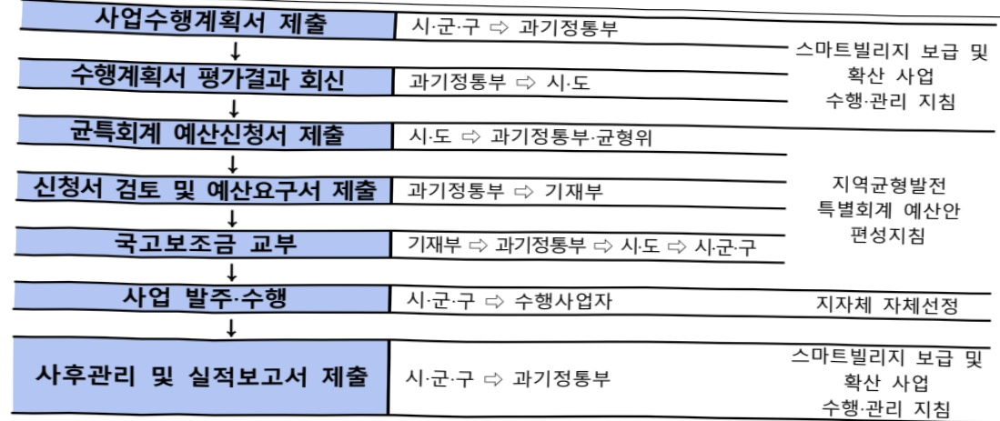

# 스마트빌리지보급및확산(자율)

**해당 페이지**: PDF 1165 ~ 1172 쪽 해당

**부처**: 과학기술정보통신부
**분야**: 통신
**회계유형**: 지역균형발전 특별회계
**2026 확정예산**: 82546.0 백만원
**전년대비 증감률**: -26.9%
**AI 도메인**: 건설/스마트시티

---

### 가.예산 총괄표

(단위: 백만원, %)

<table border=1 style='margin: auto; word-wrap: break-word;'><tr><td rowspan="2">사업명</td><td rowspan="2">2024년 결산</td><td colspan="2">2025년 예산</td><td colspan="2">2026년 예산</td><td rowspan="2">중감 (B-A)</td><td rowspan="2">(B-A)/A</td></tr><tr><td style='text-align: center; word-wrap: break-word;'>본예산</td><td style='text-align: center; word-wrap: break-word;'>추경(A)</td><td style='text-align: center; word-wrap: break-word;'>요구안</td><td style='text-align: center; word-wrap: break-word;'>본예산(B)</td></tr><tr><td style='text-align: center; word-wrap: break-word;'>스마트빌리지 보급 및 확산(자율)</td><td style='text-align: center; word-wrap: break-word;'>99,519</td><td style='text-align: center; word-wrap: break-word;'>112,980</td><td style='text-align: center; word-wrap: break-word;'>112,980</td><td style='text-align: center; word-wrap: break-word;'>81,516</td><td style='text-align: center; word-wrap: break-word;'>82,546</td><td style='text-align: center; word-wrap: break-word;'>△30,434</td><td style='text-align: center; word-wrap: break-word;'>△26.9</td></tr></table>

□ 기능별(내역사업별) 예산 내역

(단위:백만원)

<table border=1 style='margin: auto; word-wrap: break-word;'><tr><td rowspan="2"></td><td colspan="5">2024</td><td colspan="5">2025</td><td rowspan="2">2026예산</td></tr><tr><td style='text-align: center; word-wrap: break-word;'>예산액(추정)</td><td style='text-align: center; word-wrap: break-word;'>예산현액</td><td style='text-align: center; word-wrap: break-word;'>집행액</td><td style='text-align: center; word-wrap: break-word;'>이월액</td><td style='text-align: center; word-wrap: break-word;'>불용액</td><td style='text-align: center; word-wrap: break-word;'>예산액(추정)</td><td style='text-align: center; word-wrap: break-word;'>예산현액</td><td style='text-align: center; word-wrap: break-word;'>집행액</td><td style='text-align: center; word-wrap: break-word;'>이월액</td><td style='text-align: center; word-wrap: break-word;'>불용액</td></tr><tr><td style='text-align: center; word-wrap: break-word;'>○ 기능별 분류(합계)</td><td style='text-align: center; word-wrap: break-word;'>99,519</td><td style='text-align: center; word-wrap: break-word;'>99,519</td><td style='text-align: center; word-wrap: break-word;'>99,519[89,856]</td><td style='text-align: center; word-wrap: break-word;'>-</td><td style='text-align: center; word-wrap: break-word;'>-</td><td style='text-align: center; word-wrap: break-word;'>112,980</td><td style='text-align: center; word-wrap: break-word;'>112,980</td><td style='text-align: center; word-wrap: break-word;'>112,980[79,219]</td><td style='text-align: center; word-wrap: break-word;'>-</td><td style='text-align: center; word-wrap: break-word;'>-</td><td style='text-align: center; word-wrap: break-word;'>82,546</td></tr><tr><td style='text-align: center; word-wrap: break-word;'>· 스마트빌리지 보급 및 확산(자율)</td><td style='text-align: center; word-wrap: break-word;'>99,519</td><td style='text-align: center; word-wrap: break-word;'>99,519</td><td style='text-align: center; word-wrap: break-word;'>99,519[89,856]</td><td style='text-align: center; word-wrap: break-word;'>-</td><td style='text-align: center; word-wrap: break-word;'>-</td><td style='text-align: center; word-wrap: break-word;'>112,980</td><td style='text-align: center; word-wrap: break-word;'>112,980</td><td style='text-align: center; word-wrap: break-word;'>112,980[79,219]</td><td style='text-align: center; word-wrap: break-word;'>-</td><td style='text-align: center; word-wrap: break-word;'>-</td><td style='text-align: center; word-wrap: break-word;'>82,546</td></tr><tr><td style='text-align: center; word-wrap: break-word;'>· 스마트빌리지 개발 및 보급</td><td style='text-align: center; word-wrap: break-word;'>73,239</td><td style='text-align: center; word-wrap: break-word;'>73,239</td><td style='text-align: center; word-wrap: break-word;'>73,239[63,576]</td><td style='text-align: center; word-wrap: break-word;'>-</td><td style='text-align: center; word-wrap: break-word;'>-</td><td style='text-align: center; word-wrap: break-word;'>88,406</td><td style='text-align: center; word-wrap: break-word;'>88,406</td><td style='text-align: center; word-wrap: break-word;'>88,406[59,869]</td><td style='text-align: center; word-wrap: break-word;'>-</td><td style='text-align: center; word-wrap: break-word;'>-</td><td style='text-align: center; word-wrap: break-word;'>66,760</td></tr><tr><td style='text-align: center; word-wrap: break-word;'>· 스마트경로당 개발 및 보급</td><td style='text-align: center; word-wrap: break-word;'>26,280</td><td style='text-align: center; word-wrap: break-word;'>26,280</td><td style='text-align: center; word-wrap: break-word;'>26,280[26,280]</td><td style='text-align: center; word-wrap: break-word;'>-</td><td style='text-align: center; word-wrap: break-word;'>-</td><td style='text-align: center; word-wrap: break-word;'>24,574</td><td style='text-align: center; word-wrap: break-word;'>24,574</td><td style='text-align: center; word-wrap: break-word;'>24,574[19,350]</td><td style='text-align: center; word-wrap: break-word;'>-</td><td style='text-align: center; word-wrap: break-word;'>-</td><td style='text-align: center; word-wrap: break-word;'>15,786</td></tr><tr><td style='text-align: center; word-wrap: break-word;'>○ 비목별 분류(합계)</td><td style='text-align: center; word-wrap: break-word;'>99,519</td><td style='text-align: center; word-wrap: break-word;'>99,519</td><td style='text-align: center; word-wrap: break-word;'>99,519[89,856]</td><td style='text-align: center; word-wrap: break-word;'>-</td><td style='text-align: center; word-wrap: break-word;'>-</td><td style='text-align: center; word-wrap: break-word;'>112,980</td><td style='text-align: center; word-wrap: break-word;'>112,980</td><td style='text-align: center; word-wrap: break-word;'>112,980[79,219]</td><td style='text-align: center; word-wrap: break-word;'>-</td><td style='text-align: center; word-wrap: break-word;'>-</td><td style='text-align: center; word-wrap: break-word;'>82,546</td></tr><tr><td style='text-align: center; word-wrap: break-word;'>· 자치단체자본보조(330-03)</td><td style='text-align: center; word-wrap: break-word;'>99,519</td><td style='text-align: center; word-wrap: break-word;'>99,519</td><td style='text-align: center; word-wrap: break-word;'>99,519[89,856]</td><td style='text-align: center; word-wrap: break-word;'>-</td><td style='text-align: center; word-wrap: break-word;'>-</td><td style='text-align: center; word-wrap: break-word;'>112,980</td><td style='text-align: center; word-wrap: break-word;'>112,980</td><td style='text-align: center; word-wrap: break-word;'>112,980[79,219]</td><td style='text-align: center; word-wrap: break-word;'>-</td><td style='text-align: center; word-wrap: break-word;'>-</td><td style='text-align: center; word-wrap: break-word;'>82,546</td></tr><tr><td style='text-align: center; word-wrap: break-word;'>○ 기능·비목별 분류(합계)</td><td style='text-align: center; word-wrap: break-word;'>99,519</td><td style='text-align: center; word-wrap: break-word;'>99,519</td><td style='text-align: center; word-wrap: break-word;'>99,519[89,856]</td><td style='text-align: center; word-wrap: break-word;'>-</td><td style='text-align: center; word-wrap: break-word;'>-</td><td style='text-align: center; word-wrap: break-word;'>112,980</td><td style='text-align: center; word-wrap: break-word;'>112,980</td><td style='text-align: center; word-wrap: break-word;'>112,980[79,219]</td><td style='text-align: center; word-wrap: break-word;'>-</td><td style='text-align: center; word-wrap: break-word;'>-</td><td style='text-align: center; word-wrap: break-word;'>82,546</td></tr><tr><td style='text-align: center; word-wrap: break-word;'>· 스마트빌리지 보급 및 확산(자율)</td><td style='text-align: center; word-wrap: break-word;'>99,519</td><td style='text-align: center; word-wrap: break-word;'>99,519</td><td style='text-align: center; word-wrap: break-word;'>99,519[89,856]</td><td style='text-align: center; word-wrap: break-word;'>-</td><td style='text-align: center; word-wrap: break-word;'>-</td><td style='text-align: center; word-wrap: break-word;'>112,980</td><td style='text-align: center; word-wrap: break-word;'>112,980</td><td style='text-align: center; word-wrap: break-word;'>112,980[79,219]</td><td style='text-align: center; word-wrap: break-word;'>-</td><td style='text-align: center; word-wrap: break-word;'>-</td><td style='text-align: center; word-wrap: break-word;'>82,546</td></tr><tr><td style='text-align: center; word-wrap: break-word;'>· 스마트빌리지 개발 및 보급</td><td style='text-align: center; word-wrap: break-word;'>73,239</td><td style='text-align: center; word-wrap: break-word;'>73,239</td><td style='text-align: center; word-wrap: break-word;'>73,239[63,576]</td><td style='text-align: center; word-wrap: break-word;'>-</td><td style='text-align: center; word-wrap: break-word;'>-</td><td style='text-align: center; word-wrap: break-word;'>88,406</td><td style='text-align: center; word-wrap: break-word;'>88,406</td><td style='text-align: center; word-wrap: break-word;'>88,406[59,869]</td><td style='text-align: center; word-wrap: break-word;'>-</td><td style='text-align: center; word-wrap: break-word;'>-</td><td style='text-align: center; word-wrap: break-word;'>66,760</td></tr><tr><td style='text-align: center; word-wrap: break-word;'>· 자치단체자본보조(330-03)</td><td style='text-align: center; word-wrap: break-word;'>73,239</td><td style='text-align: center; word-wrap: break-word;'>73,239</td><td style='text-align: center; word-wrap: break-word;'>73,239[63,576]</td><td style='text-align: center; word-wrap: break-word;'>-</td><td style='text-align: center; word-wrap: break-word;'>-</td><td style='text-align: center; word-wrap: break-word;'>88,406</td><td style='text-align: center; word-wrap: break-word;'>88,406</td><td style='text-align: center; word-wrap: break-word;'>88,406[59,869]</td><td style='text-align: center; word-wrap: break-word;'>-</td><td style='text-align: center; word-wrap: break-word;'>-</td><td style='text-align: center; word-wrap: break-word;'>66,760</td></tr><tr><td style='text-align: center; word-wrap: break-word;'>· 스마트경로당 개발 및 보급</td><td style='text-align: center; word-wrap: break-word;'>26,280</td><td style='text-align: center; word-wrap: break-word;'>26,280</td><td style='text-align: center; word-wrap: break-word;'>26,280[26,280]</td><td style='text-align: center; word-wrap: break-word;'>-</td><td style='text-align: center; word-wrap: break-word;'>-</td><td style='text-align: center; word-wrap: break-word;'>24,574</td><td style='text-align: center; word-wrap: break-word;'>24,574</td><td style='text-align: center; word-wrap: break-word;'>24,574[19,350]</td><td style='text-align: center; word-wrap: break-word;'>-</td><td style='text-align: center; word-wrap: break-word;'>-</td><td style='text-align: center; word-wrap: break-word;'>15,786</td></tr><tr><td style='text-align: center; word-wrap: break-word;'>· 자치단체자본보조(330-03)</td><td style='text-align: center; word-wrap: break-word;'>26,280</td><td style='text-align: center; word-wrap: break-word;'>26,280</td><td style='text-align: center; word-wrap: break-word;'>26,280[26,280]</td><td style='text-align: center; word-wrap: break-word;'>-</td><td style='text-align: center; word-wrap: break-word;'>-</td><td style='text-align: center; word-wrap: break-word;'>24,574</td><td style='text-align: center; word-wrap: break-word;'>24,574</td><td style='text-align: center; word-wrap: break-word;'>24,574[19,350]</td><td style='text-align: center; word-wrap: break-word;'>-</td><td style='text-align: center; word-wrap: break-word;'>-</td><td style='text-align: center; word-wrap: break-word;'>15,786</td></tr></table>

---

### 나. 사업설명자료

## 1 ) 사업목적·내용

o (스마트빌리지 보급 및 확산) 지능정보기술, ICT기술을 활용하여 지역사회 경쟁력 강화에 기여하는 스마트 서비스 보급·확산, 신규 서비스 개발·실증 지원

- (스마트빌리지 개발 및 보급) 지역사회 전 분야에 지능정보기술을 접목하여 지역 현안을 해결하고 생활편의를 개선하는 스마트빌리지 서비스 발굴 및 실증

- (스마트경로당 개발 및 보급) 지역사회 노인복지 핵심 거점인 경로당 내 스마트

인프라 구축을 통해 ICT 기반 노인복지 선도 서비스 실증

## 2 ) 사업개요

## □ 사업근거 및 추진경위

① 법령상 근거 조항 적시

- 지능정보화기본법 제14조(공공지능정보화의 추진), 제15조(지역지능정보화의 추진), 제32조(선도사업의 추진과 지원)

제14조(공공지능정보화의 추진) ① 국가기관등은 공공서비스의 지능정보화를 도모하고 국민 편익 증진 등을 위하여 행정, 보건, 사회복지, 교육, 문화, 환경, 교통, 물류, 과학기술, 재난안전, 치안, 국방, 에너지 등 소관 업무에 대한 지능정보화(이하 "공공지능정보화"라 한다)를 추진하여야 한다.

② 국가기관등은 공공지능정보화를 효율적으로 추진하기 위하여 필요한 방안을 마련하여야 한다.

제15조(지역지능정보화의 추진) ① 국가기관과 지방자치단체는 지역 주민의 삶의 질 향상, 주민의 역량강화와 지역 간 균형발전, 정보격차 해소 등을 위하여 하나 또는 여러 개의 지역·도시에 대하여 행정·생활·산업 등의 분야를 대상으로 하는 지능정보화(이하 "지역지능정보화"라 한다)를 추진할 수 있다.

③ 국가기관은 지방자치단체가 추진하는 지역지능정보화를 위하여 행정, 재정, 기술 등에 관하여 필요한 사항을 지원할 수 있다.

제32조(선도사업의 추진과 지원) ① 정부는 사회 각 분야에 지능정보기술 및 지능정보서비스의 이용을 활성화하거나 지능정보기술과 다른 기술을 접목하기 위하여 선도적으로 시범 적용하는 사업(이하 "선도사업"이라 한다)을 적극적으로 추진하여야 한다.

② 정부는 선도사업이 효율적으로 추진될 수 있도록 행정적·재정적·기술적 지원 등 필요한 지원을 할 수 있다.

---

- 지방분권군형발전법 제14조(지역 산업 육성 및 일자리 창출 등 지역경제 활성화 촉진), 제16조(지역과학기술 및 정보통신의 진흥)

제14조(지역 산업 육성 및 일자리 창출 등 지역경제 활성화 촉진) ④ 국가와 지방자치단체는 지역산업의 육성과 지역경제의 활성화를 위하여 지역의 일자리 창출과 투자 유치활동 지원, 정보통신 진흥 및 지역 특성에 맞는 중소기업의 창업 여건 개선 등에 관한 시책을 추진하여야 한다.

제16조(지역과학기술 및 정보통신의 진흥) 국가와 지방자치단체는 지역균형발전에 필요한 과학기술 및 정보통신의 진흥을 위하여 지역의 과학기술연구·교육기관 육성, 지역의 연구개발인력 및 정보통신인력의 확충, 지역균형발전을 위한 연구개발 촉진, 연구개발정보 유통체계 및 시설·장비 등 혁신기반 조성, 과학기술혁신 성과의 확산 및 산업화 촉진 등에 관한 시책을 추진하여야 한다.

## ② 추진경위

- 사업 시작년도 : '19년~'22년(정진기금), '23년~(지특회계)

- 취약한 경제적 기반, 열악한 정주 여건 등으로 인해 지역사회의 인구감소 현상이 계속되고, 고령화의 급속 진행 등 지역사회 지속 우려*

* 전국 228개 시군구 中 '인구 소멸 위험지역' 지속 증가('13년 75개 → '18년 89개 → '20년 105개') 「전국 시군구별 지방소멸위험 현황, 한국고용정보원, '20.05」

·특히 농어촌은 정주기반 만족도 관련 교통·생활·안전·환경 등 모든 항목에서 도시 대비 낮은 만족도(평균점수 도시 6.9, 농촌 5.9)*를 보임

*「2020 농어촌 삶의 질 실태와 주민 정주 만족도 조사, 농촌경제연구원」

·국가균형발전 비전과 전략('18.2)

* (전략2 : 방방곡곡 생기도는 공간) ①매력있게 되살아나는 농산어촌, ②도시재생 뉴딜 및 중소 도시 재도약, ③인구감소지역을 거주강소지역으로

·대한민국 디지털 전략(관계부처 합동, '22.9)

* 전략 Ⅲ. 포용하는 디지털 사회 > ③ 디지털로 재탄생하는 지역사회 구현 > 디지털을 활용한 농어촌 정주여건 개선, 중앙-지방 디지털 혁신 협력기반 강화

· 스마트빌리지 조성 계획(정보통신전략위, '23.9)

· 새정부 공약('25.6.) AI등 신산업 집중 육성 - 국민 누구나 AI를 쉽고 편리하게 사용할 수 있는 나라를 만들겠습니다.

## □ 주요내용

① 사업규모

- 총사업비(해당되는 경우에만 기재) : 해당없음

- 사업기간 : '23년 ~

-최근 5년 간 투입된 사업비(예산액기준, 추경편성한 연도에는 추경포함)

<table border=1 style='margin: auto; word-wrap: break-word;'><tr><td style='text-align: center; word-wrap: break-word;'>吋</td><td style='text-align: center; word-wrap: break-word;'>2022</td><td style='text-align: center; word-wrap: break-word;'>2023</td><td style='text-align: center; word-wrap: break-word;'>2024</td><td style='text-align: center; word-wrap: break-word;'>2025</td><td style='text-align: center; word-wrap: break-word;'>2026</td></tr><tr><td style='text-align: center; word-wrap: break-word;'>人</td><td style='text-align: center; word-wrap: break-word;'>-</td><td style='text-align: center; word-wrap: break-word;'>63,241</td><td style='text-align: center; word-wrap: break-word;'>99,519</td><td style='text-align: center; word-wrap: break-word;'>112,980</td><td style='text-align: center; word-wrap: break-word;'>82,546</td></tr></table>

---

② 사업추진체계

- 사업시행방법 : 보조

- 사업시행주체 : 15개 광역 시·도(제주, 세종 제외)

- 사업 수혜자 : 지자체, 지방기업, 민간인 등

- 보조, 융자, 출연, 출자 등의 경우 보조·융자 등 지원 비율 및 법적근거

<table border=1 style='margin: auto; word-wrap: break-word;'><tr><td style='text-align: center; word-wrap: break-word;'>내역사업명</td><td style='text-align: center; word-wrap: break-word;'>구분</td><td style='text-align: center; word-wrap: break-word;'>피보조·피출연 등 기관명</td><td style='text-align: center; word-wrap: break-word;'>지원 금액 (2026예산)</td><td style='text-align: center; word-wrap: break-word;'>지원 비율(%)</td><td style='text-align: center; word-wrap: break-word;'>보조율 법적근거 (해당 조항)</td></tr><tr><td style='text-align: center; word-wrap: break-word;'>스마트빌리지 개발 및 보급</td><td style='text-align: center; word-wrap: break-word;'>보조</td><td style='text-align: center; word-wrap: break-word;'>지자체 보조</td><td style='text-align: center; word-wrap: break-word;'>66,760</td><td style='text-align: center; word-wrap: break-word;'>선도개발 80 보급확산 70</td><td style='text-align: center; word-wrap: break-word;'>지역균형발전회계 예산안 편성지침</td></tr><tr><td style='text-align: center; word-wrap: break-word;'>스마트경로당 개발 및 보급</td><td style='text-align: center; word-wrap: break-word;'>보조</td><td style='text-align: center; word-wrap: break-word;'>지자체 보조</td><td style='text-align: center; word-wrap: break-word;'>15,786</td><td style='text-align: center; word-wrap: break-word;'>선도개발 80 보급확산 70</td><td style='text-align: center; word-wrap: break-word;'>지역균형발전회계 예산안 편성지침</td></tr></table>

## 3 ) 2026년도 예산안 산출 근거

① 스마트빌리지 개발 및 보급

:(25)88,406백만원→(26요구)66,760백만원

- (요구) 지자체의 스마트빌리지 개발 및 보급 참여 수요에 따른 예산 요구(지자체 자율 편성)

- (산출) 79개 과제 x 845백만원

② 스마트경로당 개발 및 보급

:(25)24,574백만원→(26요구)15,786백만원

- (요구) 지자체의 스마트경로당 개발 및 보급 참여 수요에 따른 예산 요구(지자체 자율 편성)

- (산출) 23개 과제 x 686.3백만원

02025년도 예산 및 2026년도 예산안 산출 세부내역 비교

<table border=1 style='margin: auto; word-wrap: break-word;'><tr><td colspan="2">25년 예산</td><td colspan="2">26년 예산안</td></tr><tr><td style='text-align: center; word-wrap: break-word;'>예산</td><td style='text-align: center; word-wrap: break-word;'>산출내역</td><td style='text-align: center; word-wrap: break-word;'>예산</td><td style='text-align: center; word-wrap: break-word;'>산출내역</td></tr><tr><td style='text-align: center; word-wrap: break-word;'>112,980</td><td style='text-align: center; word-wrap: break-word;'>○ 스마트빌리지보급및확산(자율) : 112,980백만원
가. 스마트빌리지 개발 및 보급 (88,406백만원)
· 스마트빌리지 과제 추진 : 1,028백만원×86개과제=88,406백만원
나. 스마트경로당 개발 및 보급 (24,574백만원)
· 스마트경로당 과제 추진 : 702.1백만원×35개과제=24,574백만원</td><td style='text-align: center; word-wrap: break-word;'>82,546</td><td style='text-align: center; word-wrap: break-word;'>○ 스마트빌리지 보급및확산(자율) : 82,546 백만원
가. 스마트빌리지 개발 및 보급 (66,760백만원)
· 스마트빌리지 과제 추진 : 845백만원×79개과제=66,760백만원
나. 스마트경로당 개발 및 보급 (15,786백만원)
· 스마트경로당 과제 추진 : 686.3백만원×23개과제=15,786백만원</td></tr></table>

## 4 ) 사업효과

□ 사업영향, 산출물 성과지표 등

① 2022~2026년도 성과계획서 상 성과지표 및 최근 5년간 성과 달성도

<table border=1 style='margin: auto; word-wrap: break-word;'><tr><td style='text-align: center; word-wrap: break-word;'>성과지표</td><td style='text-align: center; word-wrap: break-word;'>구분</td><td style='text-align: center; word-wrap: break-word;'>2022</td><td style='text-align: center; word-wrap: break-word;'>2023</td><td style='text-align: center; word-wrap: break-word;'>2024</td><td style='text-align: center; word-wrap: break-word;'>2025</td><td style='text-align: center; word-wrap: break-word;'>2026</td><td style='text-align: center; word-wrap: break-word;'>2026 목표치산출근거</td><td style='text-align: center; word-wrap: break-word;'>측정산식(또는 측정방법)</td><td style='text-align: center; word-wrap: break-word;'>자료수집방법(또는 자료출처)</td></tr><tr><td rowspan="3">만족도(단위: 점)</td><td style='text-align: center; word-wrap: break-word;'>목표</td><td style='text-align: center; word-wrap: break-word;'>-</td><td style='text-align: center; word-wrap: break-word;'>83.8</td><td style='text-align: center; word-wrap: break-word;'>84.3</td><td style='text-align: center; word-wrap: break-word;'>84.8</td><td style='text-align: center; word-wrap: break-word;'></td><td rowspan="3">전년도 실적이 83.4점 미만인 경우 차등 설정, 이상인 경우 전년도 실적치를 목표로 설정해 지목회계사업 공통 지표 표준 가이드라인을 따름</td><td rowspan="3">행사업 만족도평균=∑(과제별 만족도 점수) /N(과제수)</td><td rowspan="3">지역별 결과보고서</td></tr><tr><td style='text-align: center; word-wrap: break-word;'>실적</td><td style='text-align: center; word-wrap: break-word;'>-</td><td style='text-align: center; word-wrap: break-word;'>84.3</td><td style='text-align: center; word-wrap: break-word;'>84.8</td><td style='text-align: center; word-wrap: break-word;'></td><td style='text-align: center; word-wrap: break-word;'></td></tr><tr><td style='text-align: center; word-wrap: break-word;'>달성도</td><td style='text-align: center; word-wrap: break-word;'>-</td><td style='text-align: center; word-wrap: break-word;'>100.5</td><td style='text-align: center; word-wrap: break-word;'>100.6</td><td style='text-align: center; word-wrap: break-word;'></td><td style='text-align: center; word-wrap: break-word;'></td></tr></table>

---

② 성과지표 이외의 연도별 사업추진 경과 및 실적

<table border=1 style='margin: auto; word-wrap: break-word;'><tr><td style='text-align: center; word-wrap: break-word;'>2022</td><td style='text-align: center; word-wrap: break-word;'>-</td></tr><tr><td style='text-align: center; word-wrap: break-word;'>2023</td><td style='text-align: center; word-wrap: break-word;'>전국 14개 광역시·도에서 58개 과제 추진을 통해 스마트빌리지 서비스 개발·조성</td></tr><tr><td style='text-align: center; word-wrap: break-word;'>2024</td><td style='text-align: center; word-wrap: break-word;'>전국 15개 광역시·도에서 94개 과제 추진을 통해 스마트빌리지 서비스 개발·조성</td></tr><tr><td style='text-align: center; word-wrap: break-word;'>2025</td><td style='text-align: center; word-wrap: break-word;'>전국 15개 광역시·도에서 120개 과제 추진을 통해 스마트빌리지 서비스 개발·조성</td></tr></table>

③ 향후(2026년도 이후) 기대효과

○ 지역사회의 디지털 전환, 경쟁력 강화, 삶의 질 향상 및 균형발전에 기여하고, 살기

좋은 지방, 다함께 잘사는 대한민국 실현

- 농업·어업·임업을 비롯한 지역산업의 스마트화, 부가가치 향상, 지능정보기술을 활용한 노동력 절감

- 스마트 기술로 치안, 교통, 재난재해, 안전사고 등 농어촌 일상생활에서의 생활안전 강화

- 농어촌의 주거·환경·교통·교육·문화 등 생활여건 개선, 각종 서비스 확충, 일자리 창출 등에 기여

- 지역민이 이용하는 경로당, 어린이집, 복지관 등 각종 생활 soc시설의 디지털 전환 및 스마트

서비스 개발

5) 타당성조사 및 예비타당성조사 시행여부 및 결과 요지 : 해당사항 없음

6) 총사업비 대상사업 여부 및 내역 : 해당사항 없음

---

## 7 ) 사업 집행절차

- 스마트빌리지 개발 및 보급

<table border=1 style='margin: auto; word-wrap: break-word;'><tr><td style='text-align: center; word-wrap: break-word;'>부처</td><td style='text-align: center; word-wrap: break-word;'></td><td style='text-align: center; word-wrap: break-word;'>피졸연·피보조기관</td><td style='text-align: center; word-wrap: break-word;'></td><td style='text-align: center; word-wrap: break-word;'>간접보조사업자·사업수행자</td></tr><tr><td style='text-align: center; word-wrap: break-word;'>과학기술정보통신부(66,760)</td><td style='text-align: center; word-wrap: break-word;'>=&gt;(66,760)</td><td style='text-align: center; word-wrap: break-word;'>15개 광역시·도(제주,세종 제외)(66,760)</td><td style='text-align: center; word-wrap: break-word;'></td><td style='text-align: center; word-wrap: break-word;'>-</td></tr></table>

-스마트경로당 개발 및 보급

<table border=1 style='margin: auto; word-wrap: break-word;'><tr><td style='text-align: center; word-wrap: break-word;'>부처</td><td style='text-align: center; word-wrap: break-word;'></td><td style='text-align: center; word-wrap: break-word;'>피출연·피보조기관</td><td style='text-align: center; word-wrap: break-word;'></td><td style='text-align: center; word-wrap: break-word;'>간접보조사업자·사업수행자</td></tr><tr><td style='text-align: center; word-wrap: break-word;'>과학기술정보통신부(15,786)</td><td style='text-align: center; word-wrap: break-word;'>=&gt;(15,786)</td><td style='text-align: center; word-wrap: break-word;'>15개 광역시·도(제주,세종 제외)(15,786)</td><td style='text-align: center; word-wrap: break-word;'></td><td style='text-align: center; word-wrap: break-word;'>-</td></tr></table>

## 8 ) 각종 평가

<table border=1 style='margin: auto; word-wrap: break-word;'><tr><td colspan="2">1) 국회(예결위, 상임위, 예정처, 국정감사 포함) 지적</td></tr><tr><td style='text-align: center; word-wrap: break-word;'>예결위 (&#x27;22.12)</td><td style='text-align: center; word-wrap: break-word;'>○ (지적) 선도개발 과제와 보급확산 과제의 국고보조율을 달리 설정 필요○ (조치) &#x27;24년부터 보급확산 사업의 국고보조율을 하향 조정(80%→70%)</td></tr><tr><td style='text-align: center; word-wrap: break-word;'>예결위 (&#x27;23.10)</td><td style='text-align: center; word-wrap: break-word;'>○ (지적) 지자체의 보조금 실집행 실적을 고려하여 보다 철저한 사업관리 필요○ (조치) 하반기 월단위 예산집행율 점검 및 독려 실시, 사업실적보고서 접수, 실적 미흡 지자체 대상 성과관리계획 제출 등 사업관리 강화</td></tr><tr><td style='text-align: center; word-wrap: break-word;'>과방위 (&#x27;24.8)</td><td style='text-align: center; word-wrap: break-word;'>○ (지적) 스마트빌리지 사업의 지역균형발전특별회계 전환에 따른 사업 관리 강화 필요 및 수행 전문기관(지능정보사회진흥원)의 사업관리 예산 확보 노력 필요○ (조치) 사업 수행 주체인 광역시·도와 협조하여 예산집행 관리 강화 및 사업 관리 예산 확보를 위해 지속적으로 협의 추진</td></tr><tr><td style='text-align: center; word-wrap: break-word;'>과방위 (&#x27;25.12)</td><td style='text-align: center; word-wrap: break-word;'>○ (지적) 집행방식을 점검하고 연례적인 이용·불용을 방지하기 위해 노력해야 하며, 전문기관의 사업관리 예산을 확보하고 장기적인 유지·관리 방안 마련 및 공공·민간 협력모델 구축을 통한 운영 효율성 강화 필요○ (조치) 스마트빌리지 보급 및 확산 지원 사업을 통해 사업 관리 예산을 확보, 이용·불용 등 사업 관리를 강화하고 민간 전문가와 협력하여 사업 컨설팅·과제 심사 추진 계획</td></tr></table>

---

### 다. 최근 4년간 결산내역

## 1 ) 결산표

☐ 부처 결산내역

(단위: 백만원, %)

<table border=1 style='margin: auto; word-wrap: break-word;'><tr><td rowspan="2">연도</td><td colspan="3">예산액</td><td rowspan="2">예산현액(A)</td><td rowspan="2">집행액(B)</td><td rowspan="2">집행를(B/A)</td><td rowspan="2">다음연도이월액</td><td rowspan="2">불용액</td></tr><tr><td style='text-align: center; word-wrap: break-word;'>본예산</td><td style='text-align: center; word-wrap: break-word;'>추경중감액</td><td style='text-align: center; word-wrap: break-word;'>추경</td></tr><tr><td style='text-align: center; word-wrap: break-word;'>2022</td><td style='text-align: center; word-wrap: break-word;'>-</td><td style='text-align: center; word-wrap: break-word;'>-</td><td style='text-align: center; word-wrap: break-word;'>-</td><td style='text-align: center; word-wrap: break-word;'>-</td><td style='text-align: center; word-wrap: break-word;'>-</td><td style='text-align: center; word-wrap: break-word;'>-</td><td style='text-align: center; word-wrap: break-word;'>-</td><td style='text-align: center; word-wrap: break-word;'>-</td></tr><tr><td style='text-align: center; word-wrap: break-word;'>2023</td><td style='text-align: center; word-wrap: break-word;'>63,241</td><td style='text-align: center; word-wrap: break-word;'>-</td><td style='text-align: center; word-wrap: break-word;'>63,241</td><td style='text-align: center; word-wrap: break-word;'>63,241</td><td style='text-align: center; word-wrap: break-word;'>63,241</td><td style='text-align: center; word-wrap: break-word;'>100</td><td style='text-align: center; word-wrap: break-word;'>100</td><td style='text-align: center; word-wrap: break-word;'>-</td></tr><tr><td style='text-align: center; word-wrap: break-word;'>2024</td><td style='text-align: center; word-wrap: break-word;'>99,519</td><td style='text-align: center; word-wrap: break-word;'>-</td><td style='text-align: center; word-wrap: break-word;'>99,519</td><td style='text-align: center; word-wrap: break-word;'>99,519</td><td style='text-align: center; word-wrap: break-word;'>99,519</td><td style='text-align: center; word-wrap: break-word;'>100</td><td style='text-align: center; word-wrap: break-word;'>100</td><td style='text-align: center; word-wrap: break-word;'>-</td></tr><tr><td style='text-align: center; word-wrap: break-word;'>2025</td><td style='text-align: center; word-wrap: break-word;'>112,980</td><td style='text-align: center; word-wrap: break-word;'></td><td style='text-align: center; word-wrap: break-word;'>112,980</td><td style='text-align: center; word-wrap: break-word;'>112,980</td><td style='text-align: center; word-wrap: break-word;'>112,980</td><td style='text-align: center; word-wrap: break-word;'>100</td><td style='text-align: center; word-wrap: break-word;'>100</td><td style='text-align: center; word-wrap: break-word;'>-</td></tr></table>

## 2 ) 주요 결산사항

2022~2025년 결산 주요사항 : 해당없음

2025년 이·전용 등 세부내역 : 해당없음

---

<table border=1 style='margin: auto; word-wrap: break-word;'><tr><td style='text-align: center; word-wrap: break-word;'>사 업 명</td></tr><tr><td style='text-align: center; word-wrap: break-word;'>(52) 스마트팝다부처패키지혁신기술개발(R&amp;D) (1158-428)</td></tr></table>

## □ 사업 코드 정보

<table border=1 style='margin: auto; word-wrap: break-word;'><tr><td style='text-align: center; word-wrap: break-word;'>구분</td><td style='text-align: center; word-wrap: break-word;'>회계</td><td style='text-align: center; word-wrap: break-word;'>소관</td><td style='text-align: center; word-wrap: break-word;'>실국(기관)</td><td style='text-align: center; word-wrap: break-word;'>계정</td><td style='text-align: center; word-wrap: break-word;'>분야</td><td style='text-align: center; word-wrap: break-word;'>부문</td></tr><tr><td style='text-align: center; word-wrap: break-word;'>코드</td><td rowspan="2">일반회계</td><td rowspan="2">과학기술정보통신부</td><td rowspan="2">연구개발정책실미래전략기술정책관</td><td rowspan="2"></td><td style='text-align: center; word-wrap: break-word;'>150</td><td style='text-align: center; word-wrap: break-word;'>155</td></tr><tr><td style='text-align: center; word-wrap: break-word;'>명칭</td><td style='text-align: center; word-wrap: break-word;'>과학기술</td><td style='text-align: center; word-wrap: break-word;'>과학기술연구개발</td></tr></table>

<table border=1 style='margin: auto; word-wrap: break-word;'><tr><td style='text-align: center; word-wrap: break-word;'>구분</td><td style='text-align: center; word-wrap: break-word;'>프로그램</td><td style='text-align: center; word-wrap: break-word;'>단위사업</td><td style='text-align: center; word-wrap: break-word;'>세부사업</td></tr><tr><td style='text-align: center; word-wrap: break-word;'>코드</td><td style='text-align: center; word-wrap: break-word;'>1100</td><td style='text-align: center; word-wrap: break-word;'>1158</td><td style='text-align: center; word-wrap: break-word;'>428</td></tr><tr><td style='text-align: center; word-wrap: break-word;'>명칭</td><td style='text-align: center; word-wrap: break-word;'>미래유망원천기술개발</td><td style='text-align: center; word-wrap: break-word;'>첨단융합기술개발</td><td style='text-align: center; word-wrap: break-word;'>스마트팜 다부처 패키지 혁신기술개발(R&amp;D)</td></tr></table>

□ 사업 성격 (공통요구자료 Ⅱ-1 작성유의사항 4. 참조, 해당하는 사항에 “○” 표시)

<table border=1 style='margin: auto; word-wrap: break-word;'><tr><td rowspan="2">신규</td><td rowspan="2">계속</td><td rowspan="2">완료</td><td rowspan="2">예비타당성 실시여부</td><td rowspan="2">총사업비 관리대상</td><td rowspan="2">총액계상 예산사업</td><td style='text-align: center; word-wrap: break-word;'>사업소관 변경정보</td></tr><tr><td style='text-align: center; word-wrap: break-word;'>2025예산 시 소관</td></tr><tr><td style='text-align: center; word-wrap: break-word;'></td><td style='text-align: center; word-wrap: break-word;'>O</td><td style='text-align: center; word-wrap: break-word;'></td><td style='text-align: center; word-wrap: break-word;'>O</td><td style='text-align: center; word-wrap: break-word;'></td><td style='text-align: center; word-wrap: break-word;'></td><td style='text-align: center; word-wrap: break-word;'></td></tr></table>

□ 사업 지원 형태 및 지원을 (최소한 한 개는 반드시 선택하시오. 해당사항에 0 표시)

<table border=1 style='margin: auto; word-wrap: break-word;'><tr><td style='text-align: center; word-wrap: break-word;'>$ \underline{\text{직접}} $</td><td style='text-align: center; word-wrap: break-word;'>$ \underline{\text{출자}} $</td><td style='text-align: center; word-wrap: break-word;'>$ \underline{\text{출연}} $</td><td style='text-align: center; word-wrap: break-word;'>$ \underline{\text{보조}} $</td><td style='text-align: center; word-wrap: break-word;'>$ \underline{\text{융자}} $</td><td style='text-align: center; word-wrap: break-word;'>$ \underline{\text{국고보조율(%)}} $</td><td style='text-align: center; word-wrap: break-word;'>$ \underline{\text{융자율}} $ (%)</td></tr><tr><td style='text-align: center; word-wrap: break-word;'></td><td style='text-align: center; word-wrap: break-word;'></td><td style='text-align: center; word-wrap: break-word;'>O</td><td style='text-align: center; word-wrap: break-word;'></td><td style='text-align: center; word-wrap: break-word;'></td><td style='text-align: center; word-wrap: break-word;'>100</td><td style='text-align: center; word-wrap: break-word;'></td></tr></table>

## □ 사업 담당자

<table border=1 style='margin: auto; word-wrap: break-word;'><tr><td style='text-align: center; word-wrap: break-word;'>사업명</td><td colspan="2">구분</td></tr><tr><td rowspan="3">스마트팜 다부처패키지 혁신기술개발</td><td rowspan="2">소관부처</td><td style='text-align: center; word-wrap: break-word;'>연구개발정책실 미래전략기술정책관</td></tr><tr><td style='text-align: center; word-wrap: break-word;'>미래전략기술정책과</td></tr><tr><td style='text-align: center; word-wrap: break-word;'>사업시행주체</td><td style='text-align: center; word-wrap: break-word;'>농림식품기술기획평가원</td></tr></table>

---

### 원본 PDF 크롭 이미지

