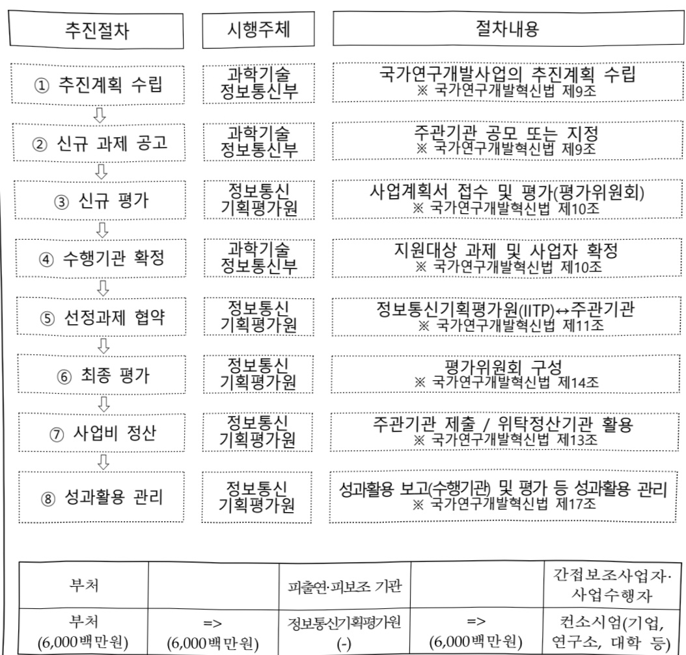

# 실세계능동형에이전틱AI기술개발(R&D)

**해당 페이지**: PDF 1192 ~ 1197 쪽 해당

**부처**: 과학기술정보통신부
**분야**: 통신
**회계유형**: 일반회계
**2026 확정예산**: 6000.0 백만원
**전년대비 증감률**: None%
**AI 도메인**: LLM/언어모델

---

### 가.예산 총괄표

(단위: 백만원, %)

<table border=1 style='margin: auto; word-wrap: break-word;'><tr><td rowspan="2">사업명</td><td rowspan="2">2024년 결산</td><td colspan="2">2025년 예산</td><td colspan="2">2026년 예산</td><td rowspan="2">중감(B-A)</td><td rowspan="2">(B-A)/A</td></tr><tr><td style='text-align: center; word-wrap: break-word;'>본예산</td><td style='text-align: center; word-wrap: break-word;'>추경*(A)</td><td style='text-align: center; word-wrap: break-word;'>요구안</td><td style='text-align: center; word-wrap: break-word;'>본예산(B)</td></tr><tr><td style='text-align: center; word-wrap: break-word;'>실세계능동행동형 에이전틱AI기술개발</td><td style='text-align: center; word-wrap: break-word;'>-</td><td style='text-align: center; word-wrap: break-word;'>-</td><td style='text-align: center; word-wrap: break-word;'>-</td><td style='text-align: center; word-wrap: break-word;'>6,000</td><td style='text-align: center; word-wrap: break-word;'>6,000</td><td style='text-align: center; word-wrap: break-word;'>순증</td><td style='text-align: center; word-wrap: break-word;'>순증</td></tr></table>

*추경: 추경증감액을 포함한 최종 예산액을 기재

□ 기능별(내역사업별) 예산 내역

(단위:백만원)

<table border=1 style='margin: auto; word-wrap: break-word;'><tr><td rowspan="2"></td><td colspan="5">2024</td><td colspan="5">2025</td><td rowspan="2">2026 예산</td></tr><tr><td style='text-align: center; word-wrap: break-word;'>예산액 (추경)</td><td style='text-align: center; word-wrap: break-word;'>예산 현액</td><td style='text-align: center; word-wrap: break-word;'>집행액</td><td style='text-align: center; word-wrap: break-word;'>이월액</td><td style='text-align: center; word-wrap: break-word;'>불용액</td><td style='text-align: center; word-wrap: break-word;'>예산액 (추경)</td><td style='text-align: center; word-wrap: break-word;'>예산 현액</td><td style='text-align: center; word-wrap: break-word;'>집행액</td><td style='text-align: center; word-wrap: break-word;'>이월액</td><td style='text-align: center; word-wrap: break-word;'>불용액</td></tr><tr><td style='text-align: center; word-wrap: break-word;'>○ 기능별 분류(합계)</td><td style='text-align: center; word-wrap: break-word;'>-</td><td style='text-align: center; word-wrap: break-word;'>-</td><td style='text-align: center; word-wrap: break-word;'>-</td><td style='text-align: center; word-wrap: break-word;'>-</td><td style='text-align: center; word-wrap: break-word;'>-</td><td style='text-align: center; word-wrap: break-word;'>-</td><td style='text-align: center; word-wrap: break-word;'>-</td><td style='text-align: center; word-wrap: break-word;'>-</td><td style='text-align: center; word-wrap: break-word;'>-</td><td style='text-align: center; word-wrap: break-word;'>-</td><td style='text-align: center; word-wrap: break-word;'>6,000</td></tr><tr><td style='text-align: center; word-wrap: break-word;'>• 실세계능동행동형 에이전틱AI기술개발</td><td style='text-align: center; word-wrap: break-word;'>-</td><td style='text-align: center; word-wrap: break-word;'>-</td><td style='text-align: center; word-wrap: break-word;'>-</td><td style='text-align: center; word-wrap: break-word;'>-</td><td style='text-align: center; word-wrap: break-word;'>-</td><td style='text-align: center; word-wrap: break-word;'>-</td><td style='text-align: center; word-wrap: break-word;'>-</td><td style='text-align: center; word-wrap: break-word;'>-</td><td style='text-align: center; word-wrap: break-word;'>-</td><td style='text-align: center; word-wrap: break-word;'>-</td><td style='text-align: center; word-wrap: break-word;'>6,000</td></tr></table>

### 나. 사업설명자료

## 1 ) 사업목적·내용

- (실세계능동행동형에이전틱AI기술개발) 실세계에서 사람의 개입 없이 자율·능동적으로

임무 설정→판단→행동이 가능한 에이전틱 AI 핵심기술 확보 및 국내 확산

* 인지추론 AI Reflection → 계획조정 AI Planning → 행동 AI Tool Use → 협업개선 AI Multi-Agent Collaboration

<table border=1 style='margin: auto; word-wrap: break-word;'><tr><td style='text-align: center; word-wrap: break-word;'>핵심기술 개발 목표(안)</td></tr><tr><td style='text-align: center; word-wrap: break-word;'>· (인지·추론) AI Reflection 기술(알고리즘) 확보  ※ 생성한 절차, 판단 등에 대해 비판하고 개선 및 성찰  · (행동) AI Tool Use 기술(알고리즘) 확보  ※ 목표 달성을 위한 도구 탐색, 활용</td></tr><tr><td style='text-align: center; word-wrap: break-word;'>· (계획·조정) AI Planning 기술(알고리즘) 확보  ※ 복잡한 요청을 처리하기 위해 연속적인 행동을 결정하고 수행  · (협업·개선) AI Multi-Agent Collaboration 기술(알고리즘) 확보  ※ 서로 다른 시점에서 서로 다른 역할을 수행하거나 협업</td></tr></table>

---

## 2 ) 사업개요

## 사업근거 및 추진경위

① 법령상 근거 및 조항 적시

- 인공지능 발전과 신뢰 기반 조성 등에 관한 기본법 제13조(인공지능 기술개발 및 안전한 이용 지원)

제13조(인공지능 기술개발 및 안전한 이용 지원) ① 정부는 인공지능기술 개발 활성화를 위하여 다음 각 호의 사업을 지원할 수 있다.

1. 국내외 인공지능기술 동향 · 수준 및 관련 제도의 조사

2. 인공지능기술의 연구·개발, 시험 및 평가 또는 개발된 기술의 활용

3. 인공지능기술 확산, 인공지능기술 협력 · 이전 등 기술의 실용화 및 사업화 지원

4. 인공지능기술의 구현을 위한 정보의 원활한 유통 및 산학협력

5. 그 밖에 인공지능기술의 개발 및 연구·조사와 관련하여 대통령령으로 정하는 사업

- 정보통신 진흥 및 융합 활성화 등에 관한 특별법 제32조(정보통신융합등 기술·서비스 개발 등의 지원)

제32조(정보통신유합등 기술·서비스 개발 등의 지원) ① 과학기술정보통신부장관은 다른 산업 및 서비스 등에 정보통신의 접목을 통하여 생산성과 가치를 높일 수 있도록 노력하여야 한다.

② 과학기술정보통신부장관은 정보통신융합등 기술·서비스의 개발을 촉진하기 위하여 다음 각 호의 사업을 추진할 수 있다.

1. 정보통신융합등 기술·서비스 관련 연구개발 사업 (이하 생략)

- 과학기술 기본법 제15조(기초연구의 진흥)

제15조(기초연구의 진흥) 정부는 과학기술혁신의 바탕이 되는 기초연구를 진흥시키기

위하여 대학과 정부가 출연하는 연구기관의 연구 및 상호 연계·협력을 활성화하고

안정적인 연구비를 지원하는 등 종합적인 시책을 세우고 추진하여야 한다.

② 추진경위

: 이재명 정부 국정과제 22번 「초격차 AI 선도기술·인재 확보」

- AI-반도체 이니셔티브('24.4월)

o 9대 기술혁신 과제 - ① 인간처럼 인지·행동·성장하는 차세대 범용(AGI) 개발

- 국가AI전략 정책방향('24.9월)

- 기술·인프라 - ③ AI 핵심·원천기술개발 확충

- AI컴퓨팅인프라 확충을 통한 국가AI역량강화방안('25.2월)

□ [장기] LLM을 넘어 차세대 AI 원천기술 확보

제조, 바이오, 금융 등 산업 특화형 에이전틱AI 기술을 확보하고 선도모델 구축

못 국내외 실증 등 응용서비스로 확산

※ 팬 생성형 AI 기반 에이전틱 AI와 달리, 실세계 적용가능한 행동형 에이전틱 AI 기술확보에 중점

---

## 주요내용

① 사업규모

- 총사업비(해당되는 경우에만 기재) : 해당없음

- 사업기간 : '26 ~ '29년

- 최근 5년 간 투입된 사업비(예산액기준, 추경편성한 연도에는 추경포함)

<table border=1 style='margin: auto; word-wrap: break-word;'><tr><td style='text-align: center; word-wrap: break-word;'>$ \underline{\text{焼成}} $</td><td style='text-align: center; word-wrap: break-word;'>2022</td><td style='text-align: center; word-wrap: break-word;'>2023</td><td style='text-align: center; word-wrap: break-word;'>2024</td><td style='text-align: center; word-wrap: break-word;'>2025</td><td style='text-align: center; word-wrap: break-word;'>2026</td></tr><tr><td style='text-align: center; word-wrap: break-word;'>$ \underline{\text{사업비}} $</td><td style='text-align: center; word-wrap: break-word;'>-</td><td style='text-align: center; word-wrap: break-word;'>-</td><td style='text-align: center; word-wrap: break-word;'>-</td><td style='text-align: center; word-wrap: break-word;'>-</td><td style='text-align: center; word-wrap: break-word;'>6,000</td></tr></table>

- 기타: 해당없음

② 사업추진체계

- 사업시행방법 : 출연

- 사업시행주체 : 정보통신기획평가원

- 사업 수혜자 : 기업, 대학, 연구소 등

- 보조, 융자, 출연, 출자 등의 경우 보조·융자 등 지원 비율 및 법적근거

<table border=1 style='margin: auto; word-wrap: break-word;'><tr><td style='text-align: center; word-wrap: break-word;'>내역사업명</td><td style='text-align: center; word-wrap: break-word;'>구분</td><td style='text-align: center; word-wrap: break-word;'>피보조·피출연 등 기관명</td><td style='text-align: center; word-wrap: break-word;'>지원 금액 (2026예산)</td><td style='text-align: center; word-wrap: break-word;'>지원 비율(%)</td><td style='text-align: center; word-wrap: break-word;'>보조율 법적근거 (해당 조항)</td></tr><tr><td style='text-align: center; word-wrap: break-word;'>실세계 능동행동형 에이전팅AI 기술개발</td><td style='text-align: center; word-wrap: break-word;'>출연</td><td style='text-align: center; word-wrap: break-word;'>정보통신 기획평가원</td><td style='text-align: center; word-wrap: break-word;'>6,000</td><td style='text-align: center; word-wrap: break-word;'>100%이내</td><td style='text-align: center; word-wrap: break-word;'>ㅇ 한국연구재단법 제11조ㅇ 정보통신산업진흥법 제28조ㅇ 정보통신 진흥 및 융합 활성화 등에 관한 특별법 제32조</td></tr></table>

## 3 ) 2026년도 예산 산출 근거

사람의 개입 없이 자율적으로 목표 설정, 스스로 판단·행동 가능한 실세계

에이전틱AI 구현을 위한 기술개발

: 3,000백만원 x 4개 과제 x 6/12개월 = 6,000백만원

※ '26년 7월 협약(예정) 이후 1차년도 R&D 지원

---

## 4 ) 사업효과

사업영향,산출물 성과지표 등

① 2022~2026년도 성과계획서 상 성과지표 및 최근 5년간 성과 달성도

<table border=1 style='margin: auto; word-wrap: break-word;'><tr><td style='text-align: center; word-wrap: break-word;'>성과지표</td><td style='text-align: center; word-wrap: break-word;'>구분</td><td style='text-align: center; word-wrap: break-word;'>2022</td><td style='text-align: center; word-wrap: break-word;'>2023</td><td style='text-align: center; word-wrap: break-word;'>2024</td><td style='text-align: center; word-wrap: break-word;'>2025</td><td style='text-align: center; word-wrap: break-word;'>2026</td><td style='text-align: center; word-wrap: break-word;'>2026 목표치산출근거</td><td style='text-align: center; word-wrap: break-word;'>측정산식(또는 측정방법)</td><td style='text-align: center; word-wrap: break-word;'>자료수집방법(또는 자료출처)</td></tr><tr><td rowspan="3">세계 최고수준(Top-tier)학술대회기술논문 발표건수(단위: 건)</td><td style='text-align: center; word-wrap: break-word;'>목표</td><td style='text-align: center; word-wrap: break-word;'>-</td><td style='text-align: center; word-wrap: break-word;'>-</td><td style='text-align: center; word-wrap: break-word;'>-</td><td style='text-align: center; word-wrap: break-word;'>-</td><td style='text-align: center; word-wrap: break-word;'>신규</td><td rowspan="3">26년 신규사업으로 과제 2차년도인 27년부터 목표치산출</td><td rowspan="3">세계 최고 수준 수준(Top-tier) 학술대회논문 발표 건수</td><td rowspan="3">수행기관 보고서</td></tr><tr><td style='text-align: center; word-wrap: break-word;'>실적</td><td style='text-align: center; word-wrap: break-word;'>-</td><td style='text-align: center; word-wrap: break-word;'>-</td><td style='text-align: center; word-wrap: break-word;'>-</td><td style='text-align: center; word-wrap: break-word;'>-</td><td style='text-align: center; word-wrap: break-word;'>-</td></tr><tr><td style='text-align: center; word-wrap: break-word;'>달성도</td><td style='text-align: center; word-wrap: break-word;'>-</td><td style='text-align: center; word-wrap: break-word;'>-</td><td style='text-align: center; word-wrap: break-word;'>-</td><td style='text-align: center; word-wrap: break-word;'>-</td><td style='text-align: center; word-wrap: break-word;'>-</td></tr><tr><td rowspan="3">mrnIF 지수(단위: 점)</td><td style='text-align: center; word-wrap: break-word;'>목표</td><td style='text-align: center; word-wrap: break-word;'>-</td><td style='text-align: center; word-wrap: break-word;'>-</td><td style='text-align: center; word-wrap: break-word;'>-</td><td style='text-align: center; word-wrap: break-word;'>-</td><td style='text-align: center; word-wrap: break-word;'>신규</td><td rowspan="3">26년 신규사업으로 과제 2차년도인 27년부터 목표치산출</td><td rowspan="3">(NxrnIFj-1)/(N-1) x 100(N : 해당분야내 학술지수, rnlFj : 순위보정영향적지수)</td><td rowspan="3">NTIS, 관리기관의 등록증</td></tr><tr><td style='text-align: center; word-wrap: break-word;'>실적</td><td style='text-align: center; word-wrap: break-word;'>-</td><td style='text-align: center; word-wrap: break-word;'>-</td><td style='text-align: center; word-wrap: break-word;'>-</td><td style='text-align: center; word-wrap: break-word;'>-</td><td style='text-align: center; word-wrap: break-word;'>-</td></tr><tr><td style='text-align: center; word-wrap: break-word;'>달성도</td><td style='text-align: center; word-wrap: break-word;'>-</td><td style='text-align: center; word-wrap: break-word;'>-</td><td style='text-align: center; word-wrap: break-word;'>-</td><td style='text-align: center; word-wrap: break-word;'>-</td><td style='text-align: center; word-wrap: break-word;'>-</td></tr></table>

※ 사업 2차년도(27년)부터 목표치 산출, 추후 전략계획서 수립을 통해 조정 및 구체화 예정

② 성과지표 이외의 연도별 사업추진 경과 및 실적

<table border=1 style='margin: auto; word-wrap: break-word;'><tr><td style='text-align: center; word-wrap: break-word;'>2025</td><td style='text-align: center; word-wrap: break-word;'>☐ 실세계 능동행동형 에이전틱AI 기술개발 신규사업 기획을 위한 위원회 운영 - 사전연구기획보고서 보고서 마련(&#x27;25.5월) ☐ 기획위원회 운영 및 신규과제 기획(&#x27;25.9월~12월)</td></tr></table>

③향후(2026년도 이후)기대효과

° '28년까지 일상 업무 결정의 최소 15%가 에이전트 AI를 통해 자율적으로 이루어질 것으로 전망(가트너, '24.10월)

°에이전틱 AI 시장은 '30년까지 10배' 수준으로 성장 전망, GPU 시장과 함께 새로운 비즈니스 모델로 부상

* AI 시장 전망(statista, '24.6월) : ('23) 1,359억$ → ('30) 8,267억$

○ AI 기술 도입 및 확산을 통해 제조, 물류, 의료 등 산업 전반의 지능·자율화 가능

→생산성향상기대

* AI 도입 햇 2050년까지 GDP 4.2%(생산성)~12.6%(노동보완과 생산성) 향상(한국은행, '25.2월) 생성형 AI 도입 햇 영업이익률 증가 예측(삼일PwC, '24.10월) : (제조) 5.7%, (소비재) 14.5% 등

5) 타당성조사 및 예비타당성조사 시행여부 및 결과 요지 : 해당사항 없음

6) 총사업비 대상사업 정보 : 해당사항 없음

---

## 7 ) 사업 집행절차

<table border=1 style='margin: auto; word-wrap: break-word;'><tr><td style='text-align: center; word-wrap: break-word;'>부처</td><td style='text-align: center; word-wrap: break-word;'></td><td style='text-align: center; word-wrap: break-word;'>피출연·피보조 기관</td><td style='text-align: center; word-wrap: break-word;'></td><td style='text-align: center; word-wrap: break-word;'>간접보조사업자·사업수행자</td></tr><tr><td style='text-align: center; word-wrap: break-word;'>부처 (6,000백만원)</td><td style='text-align: center; word-wrap: break-word;'>=&gt; (6,000백만원)</td><td style='text-align: center; word-wrap: break-word;'>정보통신기획평가원 (-)</td><td style='text-align: center; word-wrap: break-word;'>=&gt; (6,000백만원)</td><td style='text-align: center; word-wrap: break-word;'>전소시임(기업, 연구소, 대학 등)</td></tr></table>

8) 각종 평가 : 해당사항 없음

다. 최근 4년간 결산내역 : 해당사항 없음

---

<table border=1 style='margin: auto; word-wrap: break-word;'><tr><td style='text-align: center; word-wrap: break-word;'>사 업 명</td></tr><tr><td style='text-align: center; word-wrap: break-word;'>(25) 연합학습기반 신약개발 가속화 프로젝트(K-MELLODDY)(R&amp;D)(1138-459)</td></tr></table>

사업 코드 정보

<table border=1 style='margin: auto; word-wrap: break-word;'><tr><td style='text-align: center; word-wrap: break-word;'>구분</td><td style='text-align: center; word-wrap: break-word;'>회계</td><td style='text-align: center; word-wrap: break-word;'>소관</td><td style='text-align: center; word-wrap: break-word;'>실국(기관)</td><td style='text-align: center; word-wrap: break-word;'>계정</td><td style='text-align: center; word-wrap: break-word;'>분야</td><td style='text-align: center; word-wrap: break-word;'>부문</td></tr><tr><td style='text-align: center; word-wrap: break-word;'>코드</td><td rowspan="2">일반회계</td><td rowspan="2">과학기술정보통신부</td><td rowspan="2">연구개발정책실미래전략기술정책관</td><td rowspan="2">-</td><td style='text-align: center; word-wrap: break-word;'>150</td><td style='text-align: center; word-wrap: break-word;'>155</td></tr><tr><td style='text-align: center; word-wrap: break-word;'>명칭</td><td style='text-align: center; word-wrap: break-word;'>과학기술</td><td style='text-align: center; word-wrap: break-word;'>과학기술연구개발</td></tr></table>

<table border=1 style='margin: auto; word-wrap: break-word;'><tr><td style='text-align: center; word-wrap: break-word;'>구분</td><td style='text-align: center; word-wrap: break-word;'>프로그램</td><td style='text-align: center; word-wrap: break-word;'>단위사업</td><td style='text-align: center; word-wrap: break-word;'>세부사업</td></tr><tr><td style='text-align: center; word-wrap: break-word;'>코드</td><td style='text-align: center; word-wrap: break-word;'>1100</td><td style='text-align: center; word-wrap: break-word;'>1138</td><td style='text-align: center; word-wrap: break-word;'>459</td></tr><tr><td style='text-align: center; word-wrap: break-word;'>명칭</td><td style='text-align: center; word-wrap: break-word;'>미래유망기술개발</td><td style='text-align: center; word-wrap: break-word;'>바이오·의료기술개발</td><td style='text-align: center; word-wrap: break-word;'>연합학습기반신약개발가속화프로젝트(K-MELODDY프로젝트)</td></tr></table>

□ 사업 성격

<table border=1 style='margin: auto; word-wrap: break-word;'><tr><td style='text-align: center; word-wrap: break-word;'>신규</td><td style='text-align: center; word-wrap: break-word;'>계속</td><td style='text-align: center; word-wrap: break-word;'>완료</td><td style='text-align: center; word-wrap: break-word;'>예비타당성 실시여부</td><td style='text-align: center; word-wrap: break-word;'>총사업비 관리대상</td><td style='text-align: center; word-wrap: break-word;'>총액계상 예산사업</td><td style='text-align: center; word-wrap: break-word;'>사업소관 변경정보 2025예산 시 소관</td></tr><tr><td style='text-align: center; word-wrap: break-word;'></td><td style='text-align: center; word-wrap: break-word;'>○</td><td style='text-align: center; word-wrap: break-word;'></td><td style='text-align: center; word-wrap: break-word;'></td><td style='text-align: center; word-wrap: break-word;'></td><td style='text-align: center; word-wrap: break-word;'></td><td style='text-align: center; word-wrap: break-word;'></td></tr></table>

□ 사업 지원 형태 및 지원율

<table border=1 style='margin: auto; word-wrap: break-word;'><tr><td style='text-align: center; word-wrap: break-word;'>직접</td><td style='text-align: center; word-wrap: break-word;'>출자</td><td style='text-align: center; word-wrap: break-word;'>출연</td><td style='text-align: center; word-wrap: break-word;'>보조</td><td style='text-align: center; word-wrap: break-word;'>융자</td><td style='text-align: center; word-wrap: break-word;'>국고보조율(%)</td><td style='text-align: center; word-wrap: break-word;'>융자율(%)</td></tr><tr><td style='text-align: center; word-wrap: break-word;'></td><td style='text-align: center; word-wrap: break-word;'></td><td style='text-align: center; word-wrap: break-word;'>○</td><td style='text-align: center; word-wrap: break-word;'></td><td style='text-align: center; word-wrap: break-word;'></td><td style='text-align: center; word-wrap: break-word;'></td><td style='text-align: center; word-wrap: break-word;'></td></tr></table>

□사업 소관부처 및 시행주체

<table border=1 style='margin: auto; word-wrap: break-word;'><tr><td style='text-align: center; word-wrap: break-word;'>사업명</td><td colspan="2">구분</td></tr><tr><td rowspan="2">연합학습기반 신약개발 가속화 프로젝트 (K-MELLODDY 프로젝트)</td><td style='text-align: center; word-wrap: break-word;'>소관부처</td><td style='text-align: center; word-wrap: break-word;'>연구개발정책실 미래전략기술정책관 첨단바이오기술과</td></tr><tr><td style='text-align: center; word-wrap: break-word;'>사업시행주체</td><td style='text-align: center; word-wrap: break-word;'>한국연구재단</td></tr></table>

### 가.예산 총괄표

(단위:백만원,%)

<table border=1 style='margin: auto; word-wrap: break-word;'><tr><td rowspan="2">사업명</td><td rowspan="2">2024년 결산</td><td colspan="2">2025년 예산</td><td colspan="2">2026년 예산</td><td rowspan="2">증감 (B-A)</td><td rowspan="2">(B-A)/A</td></tr><tr><td style='text-align: center; word-wrap: break-word;'>본예산</td><td style='text-align: center; word-wrap: break-word;'>추경(A)</td><td style='text-align: center; word-wrap: break-word;'>요구안</td><td style='text-align: center; word-wrap: break-word;'>본예산(B)</td></tr><tr><td style='text-align: center; word-wrap: break-word;'>연합학습기반신약개발 가속화 프로젝트 (K-MELLODDY프로젝트)</td><td style='text-align: center; word-wrap: break-word;'>1,225</td><td style='text-align: center; word-wrap: break-word;'>3,050</td><td style='text-align: center; word-wrap: break-word;'>3,050</td><td style='text-align: center; word-wrap: break-word;'>4,550</td><td style='text-align: center; word-wrap: break-word;'>4,550</td><td style='text-align: center; word-wrap: break-word;'>1,500</td><td style='text-align: center; word-wrap: break-word;'>49.2</td></tr></table>

---

### 원본 PDF 크롭 이미지

