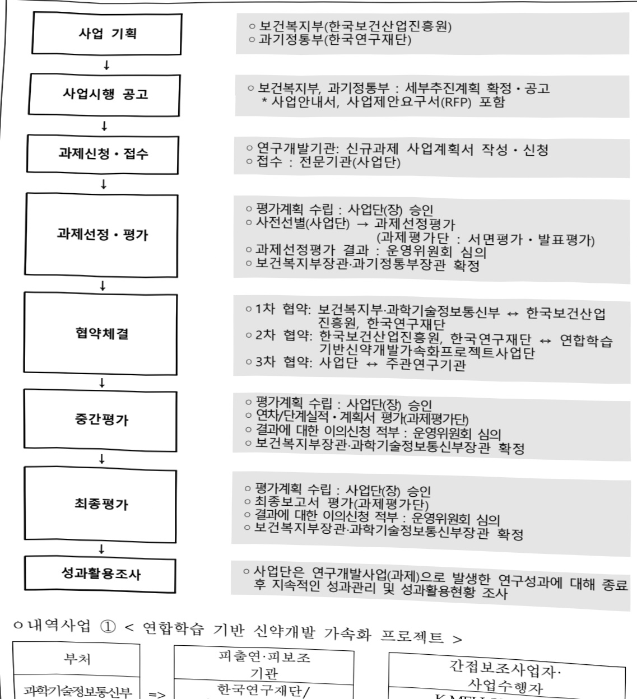
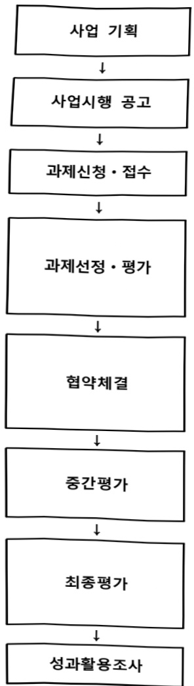
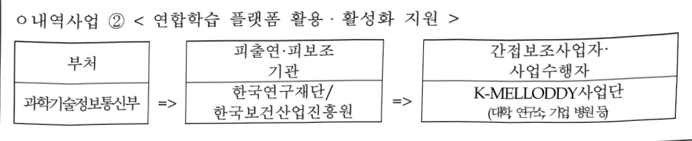

# 연합학습 기반 신약개발 가속화 프로젝트(K-MELLO…

**해당 페이지**: PDF 1198 ~ 1204 쪽 해당

**부처**: 과학기술정보통신부
**분야**: 과학기술
**회계유형**: 일반회계
**2026 확정예산**: 4550.0 백만원
**전년대비 증감률**: 49.2%
**AI 도메인**: 데이터, 의료/바이오

---

<table border=1 style='margin: auto; word-wrap: break-word;'><tr><td style='text-align: center; word-wrap: break-word;'>사 업 명</td></tr><tr><td style='text-align: center; word-wrap: break-word;'>(25) 연합학습기반 신약개발 가속화 프로젝트(K-MELLODDY)(R&amp;D)(1138-459)</td></tr></table>

사업 코드 정보

<table border=1 style='margin: auto; word-wrap: break-word;'><tr><td style='text-align: center; word-wrap: break-word;'>구분</td><td style='text-align: center; word-wrap: break-word;'>회계</td><td style='text-align: center; word-wrap: break-word;'>소관</td><td style='text-align: center; word-wrap: break-word;'>실국(기관)</td><td style='text-align: center; word-wrap: break-word;'>계정</td><td style='text-align: center; word-wrap: break-word;'>분야</td><td style='text-align: center; word-wrap: break-word;'>부문</td></tr><tr><td style='text-align: center; word-wrap: break-word;'>코드</td><td rowspan="2">일반회계</td><td rowspan="2">과학기술정보통신부</td><td rowspan="2">연구개발정책실미래전략기술정책관</td><td rowspan="2">-</td><td style='text-align: center; word-wrap: break-word;'>150</td><td style='text-align: center; word-wrap: break-word;'>155</td></tr><tr><td style='text-align: center; word-wrap: break-word;'>명칭</td><td style='text-align: center; word-wrap: break-word;'>과학기술</td><td style='text-align: center; word-wrap: break-word;'>과학기술연구개발</td></tr></table>

<table border=1 style='margin: auto; word-wrap: break-word;'><tr><td style='text-align: center; word-wrap: break-word;'>구분</td><td style='text-align: center; word-wrap: break-word;'>프로그램</td><td style='text-align: center; word-wrap: break-word;'>단위사업</td><td style='text-align: center; word-wrap: break-word;'>세부사업</td></tr><tr><td style='text-align: center; word-wrap: break-word;'>코드</td><td style='text-align: center; word-wrap: break-word;'>1100</td><td style='text-align: center; word-wrap: break-word;'>1138</td><td style='text-align: center; word-wrap: break-word;'>459</td></tr><tr><td style='text-align: center; word-wrap: break-word;'>명칭</td><td style='text-align: center; word-wrap: break-word;'>미래유망기술개발</td><td style='text-align: center; word-wrap: break-word;'>바이오·의료기술개발</td><td style='text-align: center; word-wrap: break-word;'>연합학습기반신약개발가속화프로젝트(K-MELODDY프로젝트)</td></tr></table>

□ 사업 성격

<table border=1 style='margin: auto; word-wrap: break-word;'><tr><td style='text-align: center; word-wrap: break-word;'>신규</td><td style='text-align: center; word-wrap: break-word;'>계속</td><td style='text-align: center; word-wrap: break-word;'>완료</td><td style='text-align: center; word-wrap: break-word;'>예비타당성 실시여부</td><td style='text-align: center; word-wrap: break-word;'>총사업비 관리대상</td><td style='text-align: center; word-wrap: break-word;'>총액계상 예산사업</td><td style='text-align: center; word-wrap: break-word;'>사업소관 변경정보 2025예산 시 소관</td></tr><tr><td style='text-align: center; word-wrap: break-word;'></td><td style='text-align: center; word-wrap: break-word;'>○</td><td style='text-align: center; word-wrap: break-word;'></td><td style='text-align: center; word-wrap: break-word;'></td><td style='text-align: center; word-wrap: break-word;'></td><td style='text-align: center; word-wrap: break-word;'></td><td style='text-align: center; word-wrap: break-word;'></td></tr></table>

□ 사업 지원 형태 및 지원율

<table border=1 style='margin: auto; word-wrap: break-word;'><tr><td style='text-align: center; word-wrap: break-word;'>직접</td><td style='text-align: center; word-wrap: break-word;'>출자</td><td style='text-align: center; word-wrap: break-word;'>출연</td><td style='text-align: center; word-wrap: break-word;'>보조</td><td style='text-align: center; word-wrap: break-word;'>융자</td><td style='text-align: center; word-wrap: break-word;'>국고보조율(%)</td><td style='text-align: center; word-wrap: break-word;'>융자율(%)</td></tr><tr><td style='text-align: center; word-wrap: break-word;'></td><td style='text-align: center; word-wrap: break-word;'></td><td style='text-align: center; word-wrap: break-word;'>○</td><td style='text-align: center; word-wrap: break-word;'></td><td style='text-align: center; word-wrap: break-word;'></td><td style='text-align: center; word-wrap: break-word;'></td><td style='text-align: center; word-wrap: break-word;'></td></tr></table>

□사업 소관부처 및 시행주체

<table border=1 style='margin: auto; word-wrap: break-word;'><tr><td style='text-align: center; word-wrap: break-word;'>사업명</td><td colspan="2">구분</td></tr><tr><td rowspan="2">연합학습기반 신약개발 가속화 프로젝트 (K-MELLODDY 프로젝트)</td><td style='text-align: center; word-wrap: break-word;'>소관부처</td><td style='text-align: center; word-wrap: break-word;'>연구개발정책실 미래전략기술정책관 첨단바이오기술과</td></tr><tr><td style='text-align: center; word-wrap: break-word;'>사업시행주체</td><td style='text-align: center; word-wrap: break-word;'>한국연구재단</td></tr></table>

### 가.예산 총괄표

(단위:백만원,%)

<table border=1 style='margin: auto; word-wrap: break-word;'><tr><td rowspan="2">사업명</td><td rowspan="2">2024년 결산</td><td colspan="2">2025년 예산</td><td colspan="2">2026년 예산</td><td rowspan="2">증감 (B-A)</td><td rowspan="2">(B-A)/A</td></tr><tr><td style='text-align: center; word-wrap: break-word;'>본예산</td><td style='text-align: center; word-wrap: break-word;'>추경(A)</td><td style='text-align: center; word-wrap: break-word;'>요구안</td><td style='text-align: center; word-wrap: break-word;'>본예산(B)</td></tr><tr><td style='text-align: center; word-wrap: break-word;'>연합학습기반신약개발 가속화 프로젝트 (K-MELLODDY프로젝트)</td><td style='text-align: center; word-wrap: break-word;'>1,225</td><td style='text-align: center; word-wrap: break-word;'>3,050</td><td style='text-align: center; word-wrap: break-word;'>3,050</td><td style='text-align: center; word-wrap: break-word;'>4,550</td><td style='text-align: center; word-wrap: break-word;'>4,550</td><td style='text-align: center; word-wrap: break-word;'>1,500</td><td style='text-align: center; word-wrap: break-word;'>49.2</td></tr></table>

---

□ 기능별(내역사업별) 예산 내역

(단위:백만원)

<table border=1 style='margin: auto; word-wrap: break-word;'><tr><td rowspan="2"></td><td colspan="5">2024</td><td colspan="5">2025</td><td rowspan="2">2026 倉塗</td></tr><tr><td style='text-align: center; word-wrap: break-word;'>倉塗効 (専倉)</td><td style='text-align: center; word-wrap: break-word;'>倉塗効 専倉</td><td style='text-align: center; word-wrap: break-word;'>倉塗効 専倉</td><td style='text-align: center; word-wrap: break-word;'>倉塗効 専倉</td><td style='text-align: center; word-wrap: break-word;'>倉塗効 専倉</td><td style='text-align: center; word-wrap: break-word;'>倉塗効 (専倉)</td><td style='text-align: center; word-wrap: break-word;'>倉塗効 専倉</td><td style='text-align: center; word-wrap: break-word;'>倉塗効 専倉</td><td style='text-align: center; word-wrap: break-word;'>倉塗効 専倉</td><td style='text-align: center; word-wrap: break-word;'>倉塗効 専倉</td></tr><tr><td style='text-align: center; word-wrap: break-word;'>○ 기능별 분류(합계)</td><td style='text-align: center; word-wrap: break-word;'>1,225</td><td style='text-align: center; word-wrap: break-word;'>1,225</td><td style='text-align: center; word-wrap: break-word;'>1,225 [1,225]</td><td style='text-align: center; word-wrap: break-word;'>-</td><td style='text-align: center; word-wrap: break-word;'>-</td><td style='text-align: center; word-wrap: break-word;'>3,050</td><td style='text-align: center; word-wrap: break-word;'>3,050</td><td style='text-align: center; word-wrap: break-word;'>3,050</td><td style='text-align: center; word-wrap: break-word;'>-</td><td style='text-align: center; word-wrap: break-word;'>-</td><td style='text-align: center; word-wrap: break-word;'>4,550</td></tr><tr><td rowspan="2">· 冋 합 합 습 기 반 신 약 개 발 가 속 화 프 로 젠 트 · 冋 합 합 습  플 댓 폼 활 용 활 삼 화 지 원</td><td style='text-align: center; word-wrap: break-word;'>475</td><td style='text-align: center; word-wrap: break-word;'>475</td><td style='text-align: center; word-wrap: break-word;'>475 [475]</td><td style='text-align: center; word-wrap: break-word;'>-</td><td style='text-align: center; word-wrap: break-word;'>-</td><td style='text-align: center; word-wrap: break-word;'>800</td><td style='text-align: center; word-wrap: break-word;'>800</td><td style='text-align: center; word-wrap: break-word;'>800</td><td style='text-align: center; word-wrap: break-word;'>-</td><td style='text-align: center; word-wrap: break-word;'>-</td><td style='text-align: center; word-wrap: break-word;'>800</td></tr><tr><td style='text-align: center; word-wrap: break-word;'>750</td><td style='text-align: center; word-wrap: break-word;'>750</td><td style='text-align: center; word-wrap: break-word;'>750 [750]</td><td style='text-align: center; word-wrap: break-word;'>-</td><td style='text-align: center; word-wrap: break-word;'>-</td><td style='text-align: center; word-wrap: break-word;'>2,250</td><td style='text-align: center; word-wrap: break-word;'>2,250</td><td style='text-align: center; word-wrap: break-word;'>2,250</td><td style='text-align: center; word-wrap: break-word;'>-</td><td style='text-align: center; word-wrap: break-word;'>-</td><td style='text-align: center; word-wrap: break-word;'>3,750</td></tr></table>

### 나. 사업설명자료

## 1 ) 사업목적·내용

- (연합학습기반신약개발가속화프로젝트) 제약사 등이 보유한 양질의 데이터를 활용,

데이터 보안을 유지하면서 데이터 연합학습이 가능한 모델·플랫폼을 개발하여

신약개발 데이터의 효과적인 활용 체계 구축 및 문제 해결형 연구 생태계 조성

<table border=1 style='margin: auto; word-wrap: break-word;'><tr><td style='text-align: center; word-wrap: break-word;'>[연합학습 개념] - 개인, 기관 등 여러 위치에 분산 저장된 데이터를 직접 공유하지 않고 로컬(내부)에서 학습시켜 분석 결과만을 중앙서버로 전송하여, 학습모델을 갱신하는 분산형 학습 기법</td></tr><tr><td style='text-align: center; word-wrap: break-word;'>[연합학습 특징] - 각 기관 데이터의 물리적 연계 시 발생하는 참여자의 이해관계, 효율성, 비용 등 실질적인 문제를 해결 가능</td></tr><tr><td style='text-align: center; word-wrap: break-word;'>- 연합학습을 통해 데이터를 모아 분석하는 것과 유사한 성능의 AI 개발 가능</td></tr><tr><td style='text-align: center; word-wrap: break-word;'>- 의료분야에서 화두인 ‘개인정보보호’와 ‘활용’ 양립 가능</td></tr></table>

- (내역사업① 연합학습기반신약개발가속화프로젝트) 연합학습 신약개발 가속화 프로젝트 추진을 위한 플랫폼 구축 및 사업단 사무국 운영

- (내역사업② 연합학습 플랫폼활용활성화지원) AI 신약 개발에 필요한 데이터 활용 협력체계 구축, 데이터 품질관리, 전처리 도구 개발 등을 지원

## 2 ) 사업개요

□ 사업근거 및 추진경위

① 법령상 근거 및 조항 적시

과학기술기본법 제11조(국가연구개발사업의 추진)

---

① 중앙행정기관의 장은 기본계획에 따라 맡은 분야의 국가연구개발사업과 그 시책을 세워 추진하여야 한다.

## - 생명공학육성법 제12조(공동·육복합연구의 촉진)

① 정부는 생명공학연구 및 기술개발의 효율적 육성을 위하여 학계·연구기관·의료기관 및 신업계 간의 공동·융복합연구를 촉진하여야 한다.

② 정부는 생명공학에 인공지능기술 또는 정보통신기술 등 다른 연구분야 기술을 결합하는 등의 기술 간 융복합연구를 촉진하기 위한 다음 각 호의 사업을 추진할 수 있다.

1. 생명공학 융복합연구 관련 연구개발 사업

2 생명공학 융복합연구 관련 연구장비·시설 등 인프라 확충

3. 생명공학 융복합연구 관련 기술혁신 성과의 사업화 지원

4. 생명공학 융복합연구 전문인력 양성

5. 그 밖에 생명공학 융복합연구 촉진을 위하여 필요한 사업

③ 제1항 및 제2항에 따른 공동·융복합연구의 촉진에 필요한 사항은 대통령령으로 정한다.

② 추진경위 - 사업 시작년도, 추진배경, 부처별 중점과제, 대통령 공약사항 등

○ 국정과제 28번 : 세계를 선도할 넥스트(NEXT) 전략기술 육성

- 첨단바이오, 양자, AI휴머노이드 등 새로운 미래시장 선점에 투자

* AI+바이오 융합을 가속화하고, 뇌·역노화 등 태동기 완기술, 파급력 있는 범용원천 기술개발을 선도하여 초격차 기술 기반 바이오 강국 실현

○ 국민 건강 · 생명 보호와 미래 국가 성장동력 확보를 위해 신약 개발 역량이 매우 중요하나, 글로벌 빅파마 대비 R&D 투자 등의 절대적 열세로 전통적 신약개발 방식으로는 제약 분야 선도국가 추격이 요원

- 연합학습기술(Federated learning) 기술은 ① 개인정보보호 및 지적재산권 이슈를 극복하면서 ②다기관 데이터를 연계하는 협력기술로, AI 신약개발의 저비용 고효율 효과를 신약개발 모든 단계로 확장 가능

○ 「디지털바이오 혁신전략」('22.12.) 및 「제4차 생명공학육성 기본계획」('23.4.), 인공지능바이오 확산전략('25.4) 수립 등

## □ 주요내용

① 사업규모

- 총사업비(해당되는 경우에만 기재) : 해당 없음

- 사업기간 : '24 ~ '28

-최근 5년 간 투입된 사업비(예산액기준, 추경편성한 연도에는 추경포함)

<table border=1 style='margin: auto; word-wrap: break-word;'><tr><td style='text-align: center; word-wrap: break-word;'>연도</td><td style='text-align: center; word-wrap: break-word;'>2022</td><td style='text-align: center; word-wrap: break-word;'>2023</td><td style='text-align: center; word-wrap: break-word;'>2024</td><td style='text-align: center; word-wrap: break-word;'>2025</td><td style='text-align: center; word-wrap: break-word;'>2026</td></tr><tr><td style='text-align: center; word-wrap: break-word;'>사업비</td><td style='text-align: center; word-wrap: break-word;'>-</td><td style='text-align: center; word-wrap: break-word;'>-</td><td style='text-align: center; word-wrap: break-word;'>1,225</td><td style='text-align: center; word-wrap: break-word;'>3,050</td><td style='text-align: center; word-wrap: break-word;'>4,550</td></tr></table>

---

## ② 사업추진체계

- 사업시행방법 : 전액 국고 출연 (과기정통부/보건복지부 공동주관)

- 사업시행주체 : 과기정통부(한국연구재단)/보건복지부(한국보건산업진흥원)

* 1단계(24년-26년) 간사 부처(전문기관) : 보건복지부(한국보건산업진흥원)

* 2단계(27년-28년) 간사 부처(전문기관) : 과기정통부(한국연구재단)

- 사업 수혜자 : 산업체(기업), 대학, 출연(연), 연구소, 병원 등 일반 연구자

- 보조, 융자, 출연, 출자 등의 경우 보조 · 융자 등 지원 비율 및 법적근거

<table border=1 style='margin: auto; word-wrap: break-word;'><tr><td style='text-align: center; word-wrap: break-word;'>내역사업명</td><td style='text-align: center; word-wrap: break-word;'>구분</td><td style='text-align: center; word-wrap: break-word;'>피보조·피출연 등 기관명</td><td style='text-align: center; word-wrap: break-word;'>지원 금액 (2026예산)</td><td style='text-align: center; word-wrap: break-word;'>지원 비율(%)</td><td style='text-align: center; word-wrap: break-word;'>보조율 법적근거 (해당 조항)</td></tr><tr><td style='text-align: center; word-wrap: break-word;'>연합학습기반신약개발 가속화프로 제트</td><td rowspan="2">출연</td><td rowspan="2">한국연구재단·한국보건산업진흥원</td><td style='text-align: center; word-wrap: break-word;'>800</td><td rowspan="2">100</td><td rowspan="2">기초연구진흥 및 기술개발지원에 관한 법률 제14조</td></tr><tr><td style='text-align: center; word-wrap: break-word;'>연합학습 플랫폼활용 활성화지원</td><td style='text-align: center; word-wrap: break-word;'>3,750</td></tr></table>

## 3 )2026년도 예산 산출 근거

연합학습기반신약개발가속화프로젝트

:(2025 본예산) 3,050백만 원 → (2026 요구) 4,550백만 원, 1,500백만 원 증액

- (요구) AI 신약 개발에 필요한 데이터 활용 협력체계 구축, 데이터 품질관리, 전처리 도구 개발 등을 위한 신규과제 지원을 위해 전년 대비 증액 요구

- (산출) 연합학습기반신약개발가속화프로젝트 800백만 원

연합학습 플랫폼활용활성화지원 3,750백만 원(신규과제 지원 : 750백만 원)

2025년도 예산 및 2026년도 예산안 산출 세부내역 비교

<table border=1 style='margin: auto; word-wrap: break-word;'><tr><td colspan="2">2025년 본예산</td><td colspan="2">2026년 예산</td></tr><tr><td style='text-align: center; word-wrap: break-word;'>예산</td><td style='text-align: center; word-wrap: break-word;'>산출내역</td><td style='text-align: center; word-wrap: break-word;'>예산</td><td style='text-align: center; word-wrap: break-word;'>산출내역</td></tr><tr><td style='text-align: center; word-wrap: break-word;'>3,050</td><td style='text-align: center; word-wrap: break-word;'>○ 연구활동비(360-05): 3,050백만 원
가. 연합학습기반신악개발가속화프로젝트(800백만 원)
나. 연합학습플랫폼용활성화지원(2,250백만 원)
· 계속과제: 300백만 원×5개=1,500백만 원
· 신규과제: 150백만 원×5개=750백만 원</td><td style='text-align: center; word-wrap: break-word;'>4,550</td><td style='text-align: center; word-wrap: break-word;'>○ 연구활동비(360-05): 4,550백만 원
가. 연합학습기반신악개발가속화프로젝트(800백만 원)
나. 연합학습플랫폼용활성화지원(3750백만 원)
· 계속과제: 300백만 원×10개=3,700백만 원
· 신규과제: 150백만 원×5개=750백만 원</td></tr></table>

## 4 ) 사업효과

☐ 사업영향, 산출물 성과지표 등

①2022~2026년도 성과계획서 상 성과지표 및 최근 5년간 성과 달성도

<table border=1 style='margin: auto; word-wrap: break-word;'><tr><td style='text-align: center; word-wrap: break-word;'>부처</td><td style='text-align: center; word-wrap: break-word;'>성과지표</td><td style='text-align: center; word-wrap: break-word;'>구분</td><td style='text-align: center; word-wrap: break-word;'>2022</td><td style='text-align: center; word-wrap: break-word;'>2023</td><td style='text-align: center; word-wrap: break-word;'>2024</td><td style='text-align: center; word-wrap: break-word;'>2025</td><td style='text-align: center; word-wrap: break-word;'>2026</td><td style='text-align: center; word-wrap: break-word;'>2026목표치산출근거</td><td style='text-align: center; word-wrap: break-word;'>측정산식(또는 측정방법)</td><td style='text-align: center; word-wrap: break-word;'>자료수집방법(또는 자료출처)</td></tr><tr><td style='text-align: center; word-wrap: break-word;'>공통</td><td style='text-align: center; word-wrap: break-word;'>연합학습기술 성능(단위: %)</td><td style='text-align: center; word-wrap: break-word;'>목표실적</td><td style='text-align: center; word-wrap: break-word;'>-</td><td style='text-align: center; word-wrap: break-word;'>-</td><td style='text-align: center; word-wrap: break-word;'>90</td><td style='text-align: center; word-wrap: break-word;'>94.5</td><td style='text-align: center; word-wrap: break-word;'>99</td><td style='text-align: center; word-wrap: break-word;'>연합학습의 글로벌 수준 판단을 위해 Nature 논문</td><td style='text-align: center; word-wrap: break-word;'>(연합학습 모델의 평균 정확도, 0.83) / (중앙집중식 모델의</td><td style='text-align: center; word-wrap: break-word;'>IRIS 연차보고서</td></tr></table>

---

<table border=1 style='margin: auto; word-wrap: break-word;'><tr><td rowspan="2"></td><td rowspan="2"></td><td style='text-align: center; word-wrap: break-word;'></td><td style='text-align: center; word-wrap: break-word;'></td><td style='text-align: center; word-wrap: break-word;'></td><td style='text-align: center; word-wrap: break-word;'></td><td style='text-align: center; word-wrap: break-word;'></td><td style='text-align: center; word-wrap: break-word;'></td><td rowspan="2">성능치를 참고, 개발이 완료되는 3차년도에 글로벌 수준의 목표치를 달성하도록 설정</td><td rowspan="2">평균 정확도, 0.84) * 100</td><td rowspan="2"></td><td rowspan="2"></td></tr><tr><td style='text-align: center; word-wrap: break-word;'>달성도</td><td style='text-align: center; word-wrap: break-word;'>-</td><td style='text-align: center; word-wrap: break-word;'>-</td><td style='text-align: center; word-wrap: break-word;'>100</td><td style='text-align: center; word-wrap: break-word;'>-</td><td style='text-align: center; word-wrap: break-word;'>-</td></tr><tr><td rowspan="3">공통</td><td rowspan="3">플랫폼 구축 진척도 (단위: %)</td><td style='text-align: center; word-wrap: break-word;'>목표</td><td style='text-align: center; word-wrap: break-word;'>-</td><td style='text-align: center; word-wrap: break-word;'>-</td><td style='text-align: center; word-wrap: break-word;'>50</td><td style='text-align: center; word-wrap: break-word;'>75</td><td style='text-align: center; word-wrap: break-word;'>100</td><td rowspan="3">연합학습 기반 플랫폼 구축 최종 목표 달성을 평가하기 위해서 사업 계획에 따라 다음과 같은 진척도 평가를 수행함</td><td rowspan="3">연차별 목표에 따른 산출물을 기준으로 진척도 평가</td><td rowspan="3">IRIS 연차보고서, 인증서, 논문 등</td><td rowspan="3"></td></tr><tr><td style='text-align: center; word-wrap: break-word;'>실적</td><td style='text-align: center; word-wrap: break-word;'>-</td><td style='text-align: center; word-wrap: break-word;'>-</td><td style='text-align: center; word-wrap: break-word;'>50</td><td style='text-align: center; word-wrap: break-word;'>-</td><td style='text-align: center; word-wrap: break-word;'>-</td></tr><tr><td style='text-align: center; word-wrap: break-word;'>달성도</td><td style='text-align: center; word-wrap: break-word;'>-</td><td style='text-align: center; word-wrap: break-word;'>-</td><td style='text-align: center; word-wrap: break-word;'>100</td><td style='text-align: center; word-wrap: break-word;'>-</td><td style='text-align: center; word-wrap: break-word;'>-</td></tr><tr><td rowspan="3">과기 정통부</td><td rowspan="3">ADMET/PK 예측 모델 시험 인증 (단위: 개)</td><td style='text-align: center; word-wrap: break-word;'>목표</td><td style='text-align: center; word-wrap: break-word;'>-</td><td style='text-align: center; word-wrap: break-word;'>-</td><td style='text-align: center; word-wrap: break-word;'>-</td><td style='text-align: center; word-wrap: break-word;'>-</td><td style='text-align: center; word-wrap: break-word;'>5</td><td rowspan="3">RFP 및 연구계획 일정 등을 고려하여 목표를 설정</td><td rowspan="3">(과제별 해당연도 산출물 실적)* 과제 수)</td><td rowspan="3">범부처통합연구지원 시스템(IRIS)에 등록된 공인 시험 인증서, 공인 SW 시험 결과서 등 인증기관의 인증서</td><td rowspan="3"></td></tr><tr><td style='text-align: center; word-wrap: break-word;'>실적</td><td style='text-align: center; word-wrap: break-word;'>-</td><td style='text-align: center; word-wrap: break-word;'>-</td><td style='text-align: center; word-wrap: break-word;'>-</td><td style='text-align: center; word-wrap: break-word;'>-</td><td style='text-align: center; word-wrap: break-word;'>-</td></tr><tr><td style='text-align: center; word-wrap: break-word;'>달성도</td><td style='text-align: center; word-wrap: break-word;'>-</td><td style='text-align: center; word-wrap: break-word;'>-</td><td style='text-align: center; word-wrap: break-word;'>-</td><td style='text-align: center; word-wrap: break-word;'>-</td><td style='text-align: center; word-wrap: break-word;'>-</td></tr><tr><td rowspan="3">과기 정통부</td><td rowspan="3">표준 화된 영향력 지수 (mnif 지수)</td><td style='text-align: center; word-wrap: break-word;'>목표</td><td style='text-align: center; word-wrap: break-word;'>-</td><td style='text-align: center; word-wrap: break-word;'>-</td><td style='text-align: center; word-wrap: break-word;'>-</td><td style='text-align: center; word-wrap: break-word;'>66.83</td><td style='text-align: center; word-wrap: break-word;'>68.17</td><td rowspan="3">최근 3년 국가 R&amp;D 평균 등을 고려하여 목표치 설정</td><td rowspan="3">(∑ (개별 논문의 표준화된 순위보정 영향력 지수)) / 전체 논문 수</td><td rowspan="3">NTIS 연구성과관리시스템</td><td rowspan="3"></td></tr><tr><td style='text-align: center; word-wrap: break-word;'>실적</td><td style='text-align: center; word-wrap: break-word;'>-</td><td style='text-align: center; word-wrap: break-word;'>-</td><td style='text-align: center; word-wrap: break-word;'>-</td><td style='text-align: center; word-wrap: break-word;'>-</td><td style='text-align: center; word-wrap: break-word;'>-</td></tr><tr><td style='text-align: center; word-wrap: break-word;'>달성도</td><td style='text-align: center; word-wrap: break-word;'>-</td><td style='text-align: center; word-wrap: break-word;'>-</td><td style='text-align: center; word-wrap: break-word;'>-</td><td style='text-align: center; word-wrap: break-word;'>-</td><td style='text-align: center; word-wrap: break-word;'>-</td></tr></table>

② 성과지표 이외의 연도별 사업추진 경과 및 실적

<table border=1 style='margin: auto; word-wrap: break-word;'><tr><td style='text-align: center; word-wrap: break-word;'>2022</td><td style='text-align: center; word-wrap: break-word;'>-</td></tr><tr><td style='text-align: center; word-wrap: break-word;'>2023</td><td style='text-align: center; word-wrap: break-word;'>-</td></tr><tr><td style='text-align: center; word-wrap: break-word;'>2024</td><td style='text-align: center; word-wrap: break-word;'>- ‘24년도 신규과제 6개 선정 및 연구 개시</td></tr><tr><td style='text-align: center; word-wrap: break-word;'>2025</td><td style='text-align: center; word-wrap: break-word;'>- ‘25년도 신규과제 5개 선정 및 연구 개시</td></tr></table>

## ③향후(2026년도 이후)기대효과

- (R&D 효율화) 연합학습 기반 ADME/Tox 예측 모델 개발로 직접적 R&D 투자비

절감이 가능하며, 향후 국가 및 민간의 신약개발 R&D 비용을 대폭 절감 기대

- (공동연구 촉진) 제약바이오산업의 디지털 전환과 AI 기술 도입을 촉진하여 저비용

고효율 AI 신약개발로 패러다임 전환 가속화

- (AI 기술 혁신) AI 신약개발에서 데이터 활용 문제를 해소하고 신약개발에서 요구되는 AI 기술 수요를 정확히 파악, 신약개발 분야 AI 기술 혁신 촉진

---

5) 타당성조사 및 예비타당성조사 시행여부 및 결과 요지 : 해당 없음

6) 총사업비 대상사업 여부 및 내역 : 해당 없음

7) 사업 집행절차

○ 보건복지부(한국보건산업진흥원)

○ 과기정통부(한국연구재단)

○ 보건복지부, 과기정통부 : 세부추진계획 확정 · 공고

* 사업안내서, 사업제안요구서(RFP) 포함

◦ 연구개발기관: 신규과제 사업계획서 작성 · 신청

◦ 접수 : 전문기관(사업단)

○ 평가계획 수립 : 사업단(장) 승인

○ 사전선별(사업단) → 과제선정평가

(과제평가단 : 서면평가 · 발표평가)

○ 과제선정평가 결과 : 운영위원회 심의

○ 보건복지부장관·과기정통부장관 확정

○ 1차 협약: 보건복지부·과학기술정보통신부 ↔ 한국보건산업진흥원, 한국연구재단

○ 2차 협약: 한국보건산업진흥원, 한국연구재단 ↔ 연합학습기반신약개발가속화프로젝트사업단

○ 3차 협약: 사업단 ↔ 주관연구기관

○ 평가계획 수립 : 사업단(장) 승인

○ 연차/단계실적·계획서 평가(과제평가단)

○ 결과에 대한 이의신청 적부 : 운영위원회 심의

○ 보건복지부장관·과학기술정보통신부장관 확정

◦ 평가계획 수립 : 사업단(장) 승인

◦ 최종보고서 평가(과제평가단)

◦ 결과에 대한 이의신청 적부 : 운영위원회 심의

◦ 보건복지부장관·과학기술정보통신부장관 확정

◦ 사업단은 연구개발사업(과제)으로 발생한 연구성과에 대해 종료 후 지속적인 성과관리 및 성과활용현황 조사

ㅇ 내역사업 ① < 연합학습 기반 신약개발 가속화 프로젝트 >

피출연·피보조

기관

한국연구재단/

한국보건산업진흥원

간접보조사업자·

사업수행자

K-MELLODDY사업단

(대학 연구소 기업 병원 등)

---

ㅇ내역사업 ② < 연합학습 플랫폼 활용 · 활성화 지원 >

8) 각종 평가 : 해당없음

### 다.최근 4년간 결산내역

1) 결산표

☐ 부처 결산내역

(단위: 백만원, %)

<table border=1 style='margin: auto; word-wrap: break-word;'><tr><td rowspan="2">연도</td><td colspan="3">예산액</td><td rowspan="2">예산현액(A)</td><td rowspan="2">집행액(B)</td><td rowspan="2">집행률(B/A)</td><td rowspan="2">다음연도이월액</td><td rowspan="2">불용액</td></tr><tr><td style='text-align: center; word-wrap: break-word;'>본예산</td><td style='text-align: center; word-wrap: break-word;'>추경증감액</td><td style='text-align: center; word-wrap: break-word;'>추경</td></tr><tr><td style='text-align: center; word-wrap: break-word;'>2022</td><td style='text-align: center; word-wrap: break-word;'>-</td><td style='text-align: center; word-wrap: break-word;'>-</td><td style='text-align: center; word-wrap: break-word;'>-</td><td style='text-align: center; word-wrap: break-word;'>-</td><td style='text-align: center; word-wrap: break-word;'>-</td><td style='text-align: center; word-wrap: break-word;'>-</td><td style='text-align: center; word-wrap: break-word;'>-</td><td style='text-align: center; word-wrap: break-word;'>-</td></tr><tr><td style='text-align: center; word-wrap: break-word;'>2023</td><td style='text-align: center; word-wrap: break-word;'>-</td><td style='text-align: center; word-wrap: break-word;'>-</td><td style='text-align: center; word-wrap: break-word;'>-</td><td style='text-align: center; word-wrap: break-word;'>-</td><td style='text-align: center; word-wrap: break-word;'>-</td><td style='text-align: center; word-wrap: break-word;'>-</td><td style='text-align: center; word-wrap: break-word;'>-</td><td style='text-align: center; word-wrap: break-word;'>-</td></tr><tr><td style='text-align: center; word-wrap: break-word;'>2024</td><td style='text-align: center; word-wrap: break-word;'>1,225</td><td style='text-align: center; word-wrap: break-word;'>-</td><td style='text-align: center; word-wrap: break-word;'>1,225</td><td style='text-align: center; word-wrap: break-word;'>1,225</td><td style='text-align: center; word-wrap: break-word;'>1,225</td><td style='text-align: center; word-wrap: break-word;'>100</td><td style='text-align: center; word-wrap: break-word;'>-</td><td style='text-align: center; word-wrap: break-word;'>-</td></tr><tr><td style='text-align: center; word-wrap: break-word;'>2025</td><td style='text-align: center; word-wrap: break-word;'>3,050</td><td style='text-align: center; word-wrap: break-word;'>-</td><td style='text-align: center; word-wrap: break-word;'>3,050</td><td style='text-align: center; word-wrap: break-word;'>3,050</td><td style='text-align: center; word-wrap: break-word;'>3,050</td><td style='text-align: center; word-wrap: break-word;'>100</td><td style='text-align: center; word-wrap: break-word;'>-</td><td style='text-align: center; word-wrap: break-word;'>-</td></tr></table>

2) 주요 결산사항 : 해당없음

---

### 원본 PDF 크롭 이미지

