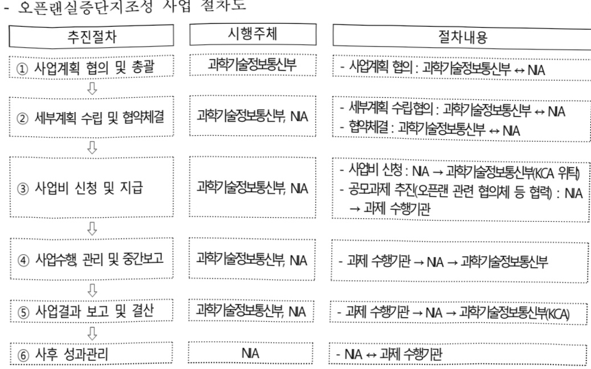

# 오픈랜실증단지조성

**해당 페이지**: PDF 1205 ~ 1211 쪽 해당

**부처**: 과학기술정보통신부
**분야**: 통신
**회계유형**: 일반회계
**2026 확정예산**: 3466.0 백만원
**전년대비 증감률**: -11.7%
**AI 도메인**: 통신/네트워크

---

<table border=1 style='margin: auto; word-wrap: break-word;'><tr><td style='text-align: center; word-wrap: break-word;'>사 업 명</td></tr><tr><td style='text-align: center; word-wrap: break-word;'>(176) 오픈렌실증단지조성 (2137-362)</td></tr></table>

사업 코드 정보

<table border=1 style='margin: auto; word-wrap: break-word;'><tr><td style='text-align: center; word-wrap: break-word;'>구분</td><td style='text-align: center; word-wrap: break-word;'>회계</td><td style='text-align: center; word-wrap: break-word;'>소관</td><td style='text-align: center; word-wrap: break-word;'>실국(기관)</td><td style='text-align: center; word-wrap: break-word;'>계정</td><td style='text-align: center; word-wrap: break-word;'>분야</td><td style='text-align: center; word-wrap: break-word;'>부문</td></tr><tr><td style='text-align: center; word-wrap: break-word;'>코드링칭</td><td style='text-align: center; word-wrap: break-word;'>일반회계</td><td style='text-align: center; word-wrap: break-word;'>과학기술정보통신부</td><td style='text-align: center; word-wrap: break-word;'>정보보호네트워크정책관</td><td style='text-align: center; word-wrap: break-word;'>-</td><td style='text-align: center; word-wrap: break-word;'>130통신</td><td style='text-align: center; word-wrap: break-word;'>133정보통신</td></tr></table>

<table border=1 style='margin: auto; word-wrap: break-word;'><tr><td style='text-align: center; word-wrap: break-word;'>구분</td><td style='text-align: center; word-wrap: break-word;'>프로그램</td><td style='text-align: center; word-wrap: break-word;'>단위사업</td><td style='text-align: center; word-wrap: break-word;'>세부사업</td></tr><tr><td style='text-align: center; word-wrap: break-word;'>코드</td><td style='text-align: center; word-wrap: break-word;'>2100</td><td style='text-align: center; word-wrap: break-word;'>2137</td><td style='text-align: center; word-wrap: break-word;'>362</td></tr><tr><td style='text-align: center; word-wrap: break-word;'>명칭</td><td style='text-align: center; word-wrap: break-word;'>정보통신융합산업</td><td style='text-align: center; word-wrap: break-word;'>ICT산업기반확충</td><td style='text-align: center; word-wrap: break-word;'>오픈랜슬증단지조성</td></tr></table>

□ 사업 성격 (공통요구자료 Ⅱ-1 작성유의사항 4. 참조, 해당하는 사항에 “○” 표시)

<table border=1 style='margin: auto; word-wrap: break-word;'><tr><td rowspan="2">신규</td><td rowspan="2">계속</td><td rowspan="2">완료</td><td rowspan="2">예비타당성 실시여부</td><td rowspan="2">총사업비 관리대상</td><td rowspan="2">총액계상 예산사업</td><td style='text-align: center; word-wrap: break-word;'>사업소관 변경정보</td></tr><tr><td style='text-align: center; word-wrap: break-word;'>2025예산 시 소관</td></tr><tr><td style='text-align: center; word-wrap: break-word;'></td><td style='text-align: center; word-wrap: break-word;'>O</td><td style='text-align: center; word-wrap: break-word;'></td><td style='text-align: center; word-wrap: break-word;'></td><td style='text-align: center; word-wrap: break-word;'></td><td style='text-align: center; word-wrap: break-word;'></td><td style='text-align: center; word-wrap: break-word;'></td></tr></table>

사업 지원 형태 및 지원을 (최소한 한 개는 반드시 선택하시오. 해당사항에 O 표시)

<table border=1 style='margin: auto; word-wrap: break-word;'><tr><td style='text-align: center; word-wrap: break-word;'>직접</td><td style='text-align: center; word-wrap: break-word;'>출자</td><td style='text-align: center; word-wrap: break-word;'>출연</td><td style='text-align: center; word-wrap: break-word;'>보조</td><td style='text-align: center; word-wrap: break-word;'>융자</td><td style='text-align: center; word-wrap: break-word;'>국고보조율(%)</td><td style='text-align: center; word-wrap: break-word;'>융자율(%)</td></tr><tr><td style='text-align: center; word-wrap: break-word;'></td><td style='text-align: center; word-wrap: break-word;'></td><td style='text-align: center; word-wrap: break-word;'>0</td><td style='text-align: center; word-wrap: break-word;'></td><td style='text-align: center; word-wrap: break-word;'></td><td style='text-align: center; word-wrap: break-word;'></td><td style='text-align: center; word-wrap: break-word;'></td></tr></table>

## □ 사업 소관부처 및 시행주체

<table border=1 style='margin: auto; word-wrap: break-word;'><tr><td style='text-align: center; word-wrap: break-word;'>사업명</td><td colspan="2">구분</td></tr><tr><td rowspan="3">오픈랜 실증단지 조성</td><td rowspan="2">소관부처</td><td style='text-align: center; word-wrap: break-word;'>정보보호네트워크정책실 정보보호네트워크정책관</td></tr><tr><td style='text-align: center; word-wrap: break-word;'>네트워크정책과</td></tr><tr><td style='text-align: center; word-wrap: break-word;'>사업시행주체</td><td style='text-align: center; word-wrap: break-word;'>한국지능정보사회진흥원</td></tr></table>

---

### 가. 예산 총괄표

(단위: 백만원, %)

<table border=1 style='margin: auto; word-wrap: break-word;'><tr><td rowspan="2">2024년 사업명</td><td colspan="2">2025년 예산</td><td colspan="2">2026년 예산</td><td rowspan="2">증감 (B-A)</td><td rowspan="2">(B-A)/A</td></tr><tr><td style='text-align: center; word-wrap: break-word;'>본예산</td><td style='text-align: center; word-wrap: break-word;'>추경*(A)</td><td style='text-align: center; word-wrap: break-word;'>요구안</td><td style='text-align: center; word-wrap: break-word;'>본예산(B)</td></tr><tr><td style='text-align: center; word-wrap: break-word;'>오픈렌실증단지조성</td><td style='text-align: center; word-wrap: break-word;'>980</td><td style='text-align: center; word-wrap: break-word;'>3,925</td><td style='text-align: center; word-wrap: break-word;'>3,925</td><td style='text-align: center; word-wrap: break-word;'>3,466</td><td style='text-align: center; word-wrap: break-word;'>3,466</td><td style='text-align: center; word-wrap: break-word;'>△459</td></tr></table>

□ 기능별(내역사업별) 예산 내역

(단위:백만원)

<table border=1 style='margin: auto; word-wrap: break-word;'><tr><td rowspan="2"></td><td colspan="5">2024</td><td colspan="5">2025</td><td rowspan="2">2026 倉圧</td></tr><tr><td style='text-align: center; word-wrap: break-word;'>倉圧の (専門)</td><td style='text-align: center; word-wrap: break-word;'>倉圧の 専門</td><td style='text-align: center; word-wrap: break-word;'>倉圧の 専門</td><td style='text-align: center; word-wrap: break-word;'>倉圧の 専門</td><td style='text-align: center; word-wrap: break-word;'>倉圧の 専門</td><td style='text-align: center; word-wrap: break-word;'>倉圧の 専門</td><td style='text-align: center; word-wrap: break-word;'>倉圧の 専門</td><td style='text-align: center; word-wrap: break-word;'>倉圧の 専門</td><td style='text-align: center; word-wrap: break-word;'>倉圧の 専門</td><td style='text-align: center; word-wrap: break-word;'>倉圧の 専門</td></tr><tr><td style='text-align: center; word-wrap: break-word;'>○ 기능별 분류(합계)</td><td style='text-align: center; word-wrap: break-word;'>980</td><td style='text-align: center; word-wrap: break-word;'>980</td><td style='text-align: center; word-wrap: break-word;'>980</td><td style='text-align: center; word-wrap: break-word;'>-</td><td style='text-align: center; word-wrap: break-word;'>-</td><td style='text-align: center; word-wrap: break-word;'>3,925</td><td style='text-align: center; word-wrap: break-word;'>3,925</td><td style='text-align: center; word-wrap: break-word;'>3,925</td><td style='text-align: center; word-wrap: break-word;'>-</td><td style='text-align: center; word-wrap: break-word;'>-</td><td style='text-align: center; word-wrap: break-word;'>3,466</td></tr><tr><td style='text-align: center; word-wrap: break-word;'>• 오픈랜실중단지조성</td><td style='text-align: center; word-wrap: break-word;'>980</td><td style='text-align: center; word-wrap: break-word;'>980</td><td style='text-align: center; word-wrap: break-word;'>980</td><td style='text-align: center; word-wrap: break-word;'>-</td><td style='text-align: center; word-wrap: break-word;'>-</td><td style='text-align: center; word-wrap: break-word;'>3,925</td><td style='text-align: center; word-wrap: break-word;'>3,925</td><td style='text-align: center; word-wrap: break-word;'>3,925</td><td style='text-align: center; word-wrap: break-word;'>-</td><td style='text-align: center; word-wrap: break-word;'>-</td><td style='text-align: center; word-wrap: break-word;'>3,466</td></tr></table>

### 나. 사업설명자료

## 1 ) 사업목적·내용

- 국내 네트워크 장비 제조사 등의 개방형 무선 접속망(Open-RAN) 장비·솔루션에 대한 개발·상용화를 지원하여, 국제 협력 수출 기반 마련 및 AI-RAN 등 차세대 무선네트워크 산업 분야의 기술 패권 경쟁을 선도하기 위한 '오픈랜 실증단지' 조성

* 단일 제조사 제품으로만 구성하던 5G 무선망을 다수 제조사로 구성할 수 있도록 장비 간 통신 방식을 개방화·지능화하는 기술로 6G 무선망, AI-RAN 구축을 위한 브릿지 기술 역할

## 2 ) 사업개요

## □ 사업근거 및 추진경위

① 법령상 근거 및 조항

· 정보통신진흥및융합활성화등에관한특별법 제14조(정보통신 네트워크의 고도화) 제14조(정보통신 네트워크의 고도화) ① 과학기술정보통신부장관은 정보통신 진흥 및 융합 활성화를 위하여 정보통신 네트워크의 고도화를 지속적으로 추진하여야 한다. ② 과학기술정보통신부장관은

---

정보통신 네트워크 고도화를 위한 민간의 활발한 투자를 유도하고 지원하는 데 필요한 정책을 마련하여야 한다.

## ·지능정보화기본법 제39조(전담기관의 지정·운영)

제39조(전담기관의 지정·운영) ① 과학기술정보통신부장관은 초연결지능정보통신기반의 원활한 구축과 이용촉진을 위하여 필요한 때에는 그 업무를 전담할 기관(이하 이 조에서 “전담기관”이라 한다)을 지정할 수 있다. ② 정부는 초연결지능정보통신기반의 구축 및 이용촉진과 관련된 업무를 수행하는 데 소요되는 자금을 전담기관에 출연하거나 융자 등을 할 수 있다. ③ 전담기관은 제2항에 따른 자금을 별도로 관리하여야 한다. ④ 전담기관의 지정 및 운영 등에 관하여 필요한 사항은 대통령령으로 정한다.

## ② 추진경위

- '23. 2월 : K-Network 2030 전략 발표(오픈랜 시험·실증환경 구축*)

* '오픈랜 생태계 조성 및 국내·외 초기시장 선점을 위한 성장환경 구축'

- '23. 4월 : 한미동맹 70주년 기념 한미 정상 공동성명(오픈랜 국제협력*)

* '양 정상은 국내외에서 오픈랜 접근법을 사용하여 개방적이고 투명하며 안전한 5G 및 6G 네트워크 장비구조를 발전시키기 위해 협력하기로 약속'

- '23. 5월 : 신규사업(오픈랜실증단지조성) 사전적격성 심사 통과

- '23. 8월 : 오픈랜 인더스트리 얼라이언스(ORIA) 협의체 출범선포식 개최

- '23.12월 : Korea Open Testing and Integration Centre(K-OTIC) 개소

- '24.12월 : 통신 3사 상용망과 연계된 오픈랜 실증단지 3개소 개소

- '25. 7월 : (국정과제) 실천과제1. AI 혁신을 견인할 국가 디지털 네트워크 고도화

* 기지국, 컴퓨팅 결합한 5G 지능형 기지국(AI-RAN)을 제조·의료 등 주요 산업 현장에 시범 구축('28), 한-미 협력 기반 동남아 오픈랜황산사업('27~) 추진지원

- '25.10월 : APEC 정상회담 '대통령실K-AI x NVIDIA 미래로의 도약!('10.31)' 협력

아젠다중 '지능형 기지국(AI-RAN) 기술 개발 및 상용화 아젠다 포함

- '25.12월 : 5G 특화망 사업자 김포공항 지능형 기지국(AI-RAN) 및 서울역

멀티벤더 오픈랜 실증단지 2개소 개소

- '25.12월 : 인공지능전략위원회 ‘대한민국 인공지능 행동계획(안)(12.16)’, 정책 권고사항 내 ‘AI-RAN 상용화 계획 수립’포함, 「Hyper AI 네트워크전략」과학기술 관계장관회의 상정·의결(12.18), AI-RAN 선제실증 및 구축

---

## 주요내용

① 사업규모

① 사업규모

- 총사업비 : 해당 없음

- 사업기간 : 2024 ~ 계속

- 최근 5년 간 투입된 사업비(예산액기준, 추정편성한 연도에는 추경포함)

<table border=1 style='margin: auto; word-wrap: break-word;'><tr><td style='text-align: center; word-wrap: break-word;'>$ \underline{\text{焼成}} $</td><td style='text-align: center; word-wrap: break-word;'>2022</td><td style='text-align: center; word-wrap: break-word;'>2023</td><td style='text-align: center; word-wrap: break-word;'>2024</td><td style='text-align: center; word-wrap: break-word;'>2025</td><td style='text-align: center; word-wrap: break-word;'>2026</td></tr><tr><td style='text-align: center; word-wrap: break-word;'>$ \underline{\text{사업비}} $</td><td style='text-align: center; word-wrap: break-word;'>-</td><td style='text-align: center; word-wrap: break-word;'>-</td><td style='text-align: center; word-wrap: break-word;'>980</td><td style='text-align: center; word-wrap: break-word;'>3,925</td><td style='text-align: center; word-wrap: break-word;'>3,466</td></tr></table>

- 기타: 해당 없음

② 사업추진체계

- 사업시행방법 : 출연

- 사업시행주체 : 한국지능정보사회진흥원(NIA)

- 사업 수혜자 : 중소 무선 네트워크 장비 제조사·통신사, 수요기관 등

- 보조, 융자, 출연, 출자 등의 경우 보조 · 융자 등 지원 비율 및 법적근거

<table border=1 style='margin: auto; word-wrap: break-word;'><tr><td style='text-align: center; word-wrap: break-word;'>내역사업명</td><td style='text-align: center; word-wrap: break-word;'>구분</td><td style='text-align: center; word-wrap: break-word;'>피보조·피출연 등 기관명</td><td style='text-align: center; word-wrap: break-word;'>지원 금액 (2026예산안)</td><td style='text-align: center; word-wrap: break-word;'>지원 비율(%)</td><td style='text-align: center; word-wrap: break-word;'>보조율 법적근거 (해당 조항)</td></tr><tr><td style='text-align: center; word-wrap: break-word;'>오픈랜실증단지조성</td><td style='text-align: center; word-wrap: break-word;'>출연</td><td style='text-align: center; word-wrap: break-word;'>한국지능 정보사회 진흥원</td><td style='text-align: center; word-wrap: break-word;'>3,466</td><td style='text-align: center; word-wrap: break-word;'>100</td><td style='text-align: center; word-wrap: break-word;'>지능정보화기본법 제12조(한국지능정보사회 진흥원의 설립) ④ 국가기관등은 지능정보사회원의 설립·시설·운영 및 사업 추진 등에 필요한 경비에 충당하도록 하기 위하여 지능정보사회원에 출연할 수 있으며, 정부는 지능정보사회원의 설립 및 운영 등을 위하여 필요한 국유재산을 무상으로 대여할 수 있다.</td></tr></table>

## 3 ) 2026년도 예산 산출 근거

① 오픈랜실증단지조성 : (2025) 3,925 → (2026 예산안) 3,466백만원, △459백만원

- (요구) 국정과제 이행 및 국내 이동통신 장비 공급망 유지를 위한 실증사업비 요구 국내 통신장비 기업의 오픈랜 장비·솔루션 개발·상용화 확대 요구

- (산출) 망 유형별 실증환경 구축 3,466백만원

## 4 ) 사업효과

☐ 사업영향, 산출물 성과지표 등

① 2022~2026년도 성과계획서 상 성과지표 및 최근 5년간 성과 달성도

---

<table border=1 style='margin: auto; word-wrap: break-word;'><tr><td style='text-align: center; word-wrap: break-word;'>성과지표</td><td style='text-align: center; word-wrap: break-word;'>구분</td><td style='text-align: center; word-wrap: break-word;'>2022</td><td style='text-align: center; word-wrap: break-word;'>2023</td><td style='text-align: center; word-wrap: break-word;'>2024</td><td style='text-align: center; word-wrap: break-word;'>2025</td><td style='text-align: center; word-wrap: break-word;'>2026</td><td style='text-align: center; word-wrap: break-word;'>2026 목표치산출근거</td><td style='text-align: center; word-wrap: break-word;'>측정산시(또는 측정방법)</td><td style='text-align: center; word-wrap: break-word;'>자료수집방법(또는 자료출처)</td></tr><tr><td rowspan="3">오픈랜 실증단지조성(단위: 개소)</td><td style='text-align: center; word-wrap: break-word;'>목표</td><td style='text-align: center; word-wrap: break-word;'>-</td><td style='text-align: center; word-wrap: break-word;'>-</td><td style='text-align: center; word-wrap: break-word;'>3</td><td style='text-align: center; word-wrap: break-word;'>4</td><td style='text-align: center; word-wrap: break-word;'>5</td><td rowspan="3">&#x27;25년 목표(4건) 대비 목표치를 도전적으로 33% 상향 반영</td><td rowspan="3">∑오픈랜 실증단지 조성 개수</td><td rowspan="3">사업 참여기업 제출자료(결과보고서 등)</td></tr><tr><td style='text-align: center; word-wrap: break-word;'>실적</td><td style='text-align: center; word-wrap: break-word;'>-</td><td style='text-align: center; word-wrap: break-word;'>-</td><td style='text-align: center; word-wrap: break-word;'>3</td><td style='text-align: center; word-wrap: break-word;'>5</td><td style='text-align: center; word-wrap: break-word;'>-</td></tr><tr><td style='text-align: center; word-wrap: break-word;'>달성도</td><td style='text-align: center; word-wrap: break-word;'>-</td><td style='text-align: center; word-wrap: break-word;'>-</td><td style='text-align: center; word-wrap: break-word;'>100</td><td style='text-align: center; word-wrap: break-word;'>125</td><td style='text-align: center; word-wrap: break-word;'>-</td></tr><tr><td rowspan="3">오픈랜 장비·솔루션 시장진출(단위: 건)</td><td style='text-align: center; word-wrap: break-word;'>목표</td><td style='text-align: center; word-wrap: break-word;'>-</td><td style='text-align: center; word-wrap: break-word;'>-</td><td style='text-align: center; word-wrap: break-word;'>-</td><td style='text-align: center; word-wrap: break-word;'>1(신규)</td><td style='text-align: center; word-wrap: break-word;'>2</td><td rowspan="3">&#x27;25년 목표(1건) 대비 목표치를 도전적으로 55%상향 반영</td><td rowspan="3">∑사업결과물의 민간·공공 부문 매출 발생 건수</td><td rowspan="3">사업 참여기업 제출자료(매출증빙 등)</td></tr><tr><td style='text-align: center; word-wrap: break-word;'>실적</td><td style='text-align: center; word-wrap: break-word;'>-</td><td style='text-align: center; word-wrap: break-word;'>-</td><td style='text-align: center; word-wrap: break-word;'>-</td><td style='text-align: center; word-wrap: break-word;'>2</td><td style='text-align: center; word-wrap: break-word;'>-</td></tr><tr><td style='text-align: center; word-wrap: break-word;'>달성도</td><td style='text-align: center; word-wrap: break-word;'>-</td><td style='text-align: center; word-wrap: break-word;'>-</td><td style='text-align: center; word-wrap: break-word;'>-</td><td style='text-align: center; word-wrap: break-word;'>200</td><td style='text-align: center; word-wrap: break-word;'>-</td></tr></table>

## ② 성과지표 이외의 연도별 사업추진 경과 및 실적

<table border=1 style='margin: auto; word-wrap: break-word;'><tr><td style='text-align: center; word-wrap: break-word;'>2024</td><td style='text-align: center; word-wrap: break-word;'>- 국내 오픈랜 생태계 활성화 지원(Open RAN Symposium 2024 개최 지원 등) - 이동통신 3사가 상용망기반 국내 장비·솔루션으로 오픈랜기술 검증 환경 조성 및 국내 중견·중소 통신 장비 기업의 무선 네트워크 장비 개발, 구축, 검증 완료 * SKT(농어촌(양평), &#x27;24.12.8), LG유플러스(금오공대캠퍼스, &#x27;24.12.8), KT(공공기관 NIA서귀포, &#x27;24.10.17) ** 쏠리드(중건), 삼지전자(중소) 기업의 신규 무선 네트워크 장비(O-RU) 개발 및 기술 검증 완료 -&gt; 해외 수출</td></tr><tr><td style='text-align: center; word-wrap: break-word;'>2025</td><td style='text-align: center; word-wrap: break-word;'>- 서울역 5G특화망 기반 오픈랜 실증단지 구축·운영 * 국산 3개 멀티벤더 O-RU(기가레인, 웨이브일렉트로닉스, 삼지전자)및 LG전자 O-DU/CU 기반 멀티벤더 오픈랜 최초 실증 (글로벌 표준 인증인 Multi-vendor O-RAN Global PlugFest(E2E) 성공) * 멀티벤더 오픈랜 기반 대국민 체감형 서비스 실증·운영(① 역사 내 혼잡도 관리 및 로봇운영, ② 승강 장 안전라인 침범 방지, ③ 스마트 화장실 재실, 위험 감지 등 대국민 서비스 제공) * 서울역 기반 국내 대표 오픈랜 실증레퍼런스 확보로 국내기업(삼지전자) 수출성공 - 김포공항 오픈랜 기반 AI-RAN 실증·상용화 * 국산 장비 연동 AI-RAN을 구축하여 AI 추론과 무선네트워크(RAN) 기능을 하나의 기지국 장비에서 제공하는 지능형 기지국 국내·글로벌 최초 상용화 * 공항 CCTV 데이터를 외부 유출 없이 현장(AI-RAN Edge)에서 직접 학습·튜닝하고 대국민 AI 서비스 (제한구역 침입·역행 방지) 국내 최초 실증 * 공인 시험성적 지원소(ETRI) 협조를 통해 AI-RAN(기본호 및 AI-RAN) 성능 공인시험 성적 획득 - 이동통신 3社 상용망 기반 장비·솔루션으로 오픈랜기술 검증 환경 조성 고도화 완료 * SKT(AI-RAN 지원을 위한 가상화 vRAN 장비 개발), LG유플러스(금오공대캠퍼스 전체 오픈랜 커버리지 확대), KT(Multi-Band 지원 오픈랜 장비 실증)</td></tr></table>

③ 향후(2026년도 이후) 기대효과 :

- '26년부터 2년('24~'25)간 검증한 국산 개방화·지능화 오픈랜 솔루션과 이를 활용한 특화 서비스 실증 레퍼런스를 대외 홍보하고 글로벌 밸류체인에 합류 및 동남아, 미국, 일본 등에 수출 확산

5) 타당성조사 및 예비타당성조사 시행여부 및 결과 요지 : 해당 없음

6) 총사업비 대상사업 여부 및 내역 : 해당 없음

---

## 7 ) 사업 집행절차

- 오픈랜실증단지조성 사업 집행방안

<table border=1 style='margin: auto; word-wrap: break-word;'><tr><td style='text-align: center; word-wrap: break-word;'>부처</td><td style='text-align: center; word-wrap: break-word;'></td><td style='text-align: center; word-wrap: break-word;'>피출연·피보조기관</td><td style='text-align: center; word-wrap: break-word;'></td><td style='text-align: center; word-wrap: break-word;'>간접보조사업자·사업수행자</td></tr><tr><td style='text-align: center; word-wrap: break-word;'>과학기술정보통신부(3,466백만원)</td><td style='text-align: center; word-wrap: break-word;'>=&gt;(3,466백만원)</td><td style='text-align: center; word-wrap: break-word;'>한국지능정보사회진흥원(3,466백만원)</td><td style='text-align: center; word-wrap: break-word;'>=&gt;(3,466백만원)</td><td style='text-align: center; word-wrap: break-word;'>중소제조사·통신사 등</td></tr></table>

## 8 ) 각종 평가

1) 국회(예결위, 상임위, 예정처, 국정감사 포함) 지적 : 해당 없음

2) 대외공개 평가 : 해당 없음

3) 자체평가 : 해당 없음

### 다. 최근 4년간 결산내역

## 1 ) 결산표

---

☐ 부처 결산내역

(단위: 백만원, %)

<table border=1 style='margin: auto; word-wrap: break-word;'><tr><td rowspan="2">闰도</td><td colspan="3">예산액</td><td rowspan="2">전년도 이월액</td><td rowspan="2">이·전용 등</td><td rowspan="2">예비비</td><td rowspan="2">예산 현액(B)</td><td rowspan="2">집행액(C)</td><td rowspan="2">집행률(C/A)</td><td rowspan="2">집행률(C/B)</td><td rowspan="2">다음연도 이월액</td><td rowspan="2">불용액</td></tr><tr><td style='text-align: center; word-wrap: break-word;'>본예산</td><td style='text-align: center; word-wrap: break-word;'>추경 중감액</td><td style='text-align: center; word-wrap: break-word;'>추경(A)</td></tr><tr><td style='text-align: center; word-wrap: break-word;'>2022</td><td style='text-align: center; word-wrap: break-word;'>-</td><td style='text-align: center; word-wrap: break-word;'>-</td><td style='text-align: center; word-wrap: break-word;'>-</td><td style='text-align: center; word-wrap: break-word;'>-</td><td style='text-align: center; word-wrap: break-word;'>-</td><td style='text-align: center; word-wrap: break-word;'>-</td><td style='text-align: center; word-wrap: break-word;'>-</td><td style='text-align: center; word-wrap: break-word;'>-</td><td style='text-align: center; word-wrap: break-word;'>-</td><td style='text-align: center; word-wrap: break-word;'>-</td><td style='text-align: center; word-wrap: break-word;'>-</td><td style='text-align: center; word-wrap: break-word;'>-</td></tr><tr><td style='text-align: center; word-wrap: break-word;'>2023</td><td style='text-align: center; word-wrap: break-word;'>-</td><td style='text-align: center; word-wrap: break-word;'>-</td><td style='text-align: center; word-wrap: break-word;'>-</td><td style='text-align: center; word-wrap: break-word;'>-</td><td style='text-align: center; word-wrap: break-word;'>-</td><td style='text-align: center; word-wrap: break-word;'>-</td><td style='text-align: center; word-wrap: break-word;'>-</td><td style='text-align: center; word-wrap: break-word;'>-</td><td style='text-align: center; word-wrap: break-word;'>-</td><td style='text-align: center; word-wrap: break-word;'>-</td><td style='text-align: center; word-wrap: break-word;'>-</td><td style='text-align: center; word-wrap: break-word;'>-</td></tr><tr><td style='text-align: center; word-wrap: break-word;'>2024</td><td style='text-align: center; word-wrap: break-word;'>980</td><td style='text-align: center; word-wrap: break-word;'>-</td><td style='text-align: center; word-wrap: break-word;'>980</td><td style='text-align: center; word-wrap: break-word;'>-</td><td style='text-align: center; word-wrap: break-word;'>-</td><td style='text-align: center; word-wrap: break-word;'>-</td><td style='text-align: center; word-wrap: break-word;'>980</td><td style='text-align: center; word-wrap: break-word;'>980</td><td style='text-align: center; word-wrap: break-word;'>100</td><td style='text-align: center; word-wrap: break-word;'>100</td><td style='text-align: center; word-wrap: break-word;'>-</td><td style='text-align: center; word-wrap: break-word;'>-</td></tr><tr><td style='text-align: center; word-wrap: break-word;'>2025</td><td style='text-align: center; word-wrap: break-word;'>3,925</td><td style='text-align: center; word-wrap: break-word;'>-</td><td style='text-align: center; word-wrap: break-word;'>3,925</td><td style='text-align: center; word-wrap: break-word;'>-</td><td style='text-align: center; word-wrap: break-word;'>-</td><td style='text-align: center; word-wrap: break-word;'>-</td><td style='text-align: center; word-wrap: break-word;'>3,925</td><td style='text-align: center; word-wrap: break-word;'>3,925</td><td style='text-align: center; word-wrap: break-word;'>100</td><td style='text-align: center; word-wrap: break-word;'>100</td><td style='text-align: center; word-wrap: break-word;'>-</td><td style='text-align: center; word-wrap: break-word;'>-</td></tr></table>

2) 주요 결산사항 : 해당 없음

---

### 원본 PDF 크롭 이미지

