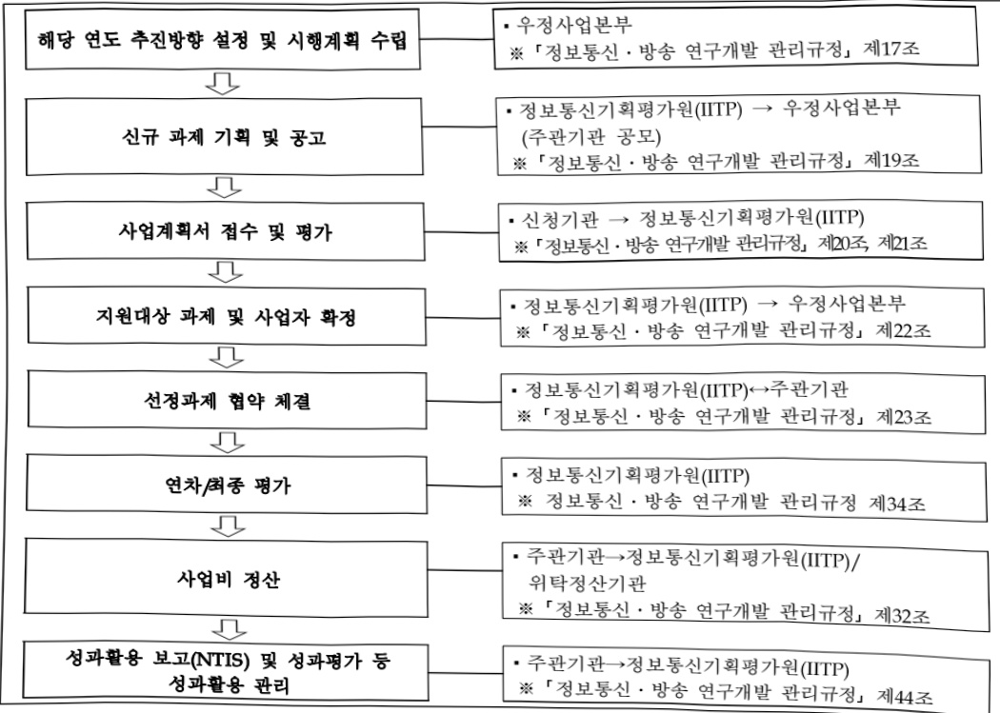

# 우편물류기술연구개발(R&D)

**해당 페이지**: PDF 1219 ~ 1224 쪽 해당

**부처**: 과학기술정보통신부
**분야**: 통신
**회계유형**: 우편사업 특별회계
**2026 확정예산**: 825.0 백만원
**전년대비 증감률**: None%
**AI 도메인**: 데이터

---

<table border=1 style='margin: auto; word-wrap: break-word;'><tr><td style='text-align: center; word-wrap: break-word;'>사 업 명</td></tr><tr><td style='text-align: center; word-wrap: break-word;'>(25) 우편물류기술연구개발(R&amp;D) (5141-401)</td></tr></table>

사업 코드 정보

<table border=1 style='margin: auto; word-wrap: break-word;'><tr><td style='text-align: center; word-wrap: break-word;'>구분</td><td style='text-align: center; word-wrap: break-word;'>회계</td><td style='text-align: center; word-wrap: break-word;'>소관</td><td style='text-align: center; word-wrap: break-word;'>실국(기관)</td><td style='text-align: center; word-wrap: break-word;'>계정</td><td style='text-align: center; word-wrap: break-word;'>분야</td><td style='text-align: center; word-wrap: break-word;'>부문</td></tr><tr><td style='text-align: center; word-wrap: break-word;'>코드</td><td style='text-align: center; word-wrap: break-word;'>우편사업</td><td style='text-align: center; word-wrap: break-word;'>과학기술</td><td rowspan="2">우정사업본부</td><td rowspan="2">손익</td><td style='text-align: center; word-wrap: break-word;'>130</td><td style='text-align: center; word-wrap: break-word;'>132</td></tr><tr><td style='text-align: center; word-wrap: break-word;'>명칭</td><td style='text-align: center; word-wrap: break-word;'>특별회계</td><td style='text-align: center; word-wrap: break-word;'>정보통신부</td><td style='text-align: center; word-wrap: break-word;'>통신</td><td style='text-align: center; word-wrap: break-word;'>우정</td></tr></table>

<table border=1 style='margin: auto; word-wrap: break-word;'><tr><td style='text-align: center; word-wrap: break-word;'>구분</td><td style='text-align: center; word-wrap: break-word;'>프로그램</td><td style='text-align: center; word-wrap: break-word;'>단위사업</td><td style='text-align: center; word-wrap: break-word;'>세부사업</td></tr><tr><td style='text-align: center; word-wrap: break-word;'>코드</td><td style='text-align: center; word-wrap: break-word;'>5100</td><td style='text-align: center; word-wrap: break-word;'>5141</td><td style='text-align: center; word-wrap: break-word;'>401</td></tr><tr><td style='text-align: center; word-wrap: break-word;'>명칭</td><td style='text-align: center; word-wrap: break-word;'>우편서비스</td><td style='text-align: center; word-wrap: break-word;'>우정사업연구</td><td style='text-align: center; word-wrap: break-word;'>우편물류기술연구개발(R&amp;D)</td></tr></table>

☐ 사업 성격

<table border=1 style='margin: auto; word-wrap: break-word;'><tr><td rowspan="2">신규</td><td rowspan="2">계속</td><td rowspan="2">완료</td><td rowspan="2">예비타당성 실시여부</td><td rowspan="2">총사업비 관리대상</td><td rowspan="2">총액계상 예산사업</td><td style='text-align: center; word-wrap: break-word;'>사업소관 변경정보</td></tr><tr><td style='text-align: center; word-wrap: break-word;'>2025예산 시 소관</td></tr><tr><td style='text-align: center; word-wrap: break-word;'>☐</td><td style='text-align: center; word-wrap: break-word;'></td><td style='text-align: center; word-wrap: break-word;'></td><td style='text-align: center; word-wrap: break-word;'></td><td style='text-align: center; word-wrap: break-word;'></td><td style='text-align: center; word-wrap: break-word;'></td><td style='text-align: center; word-wrap: break-word;'></td></tr></table>

□ 사업 지원 형태 및 지원을

<table border=1 style='margin: auto; word-wrap: break-word;'><tr><td style='text-align: center; word-wrap: break-word;'>직접</td><td style='text-align: center; word-wrap: break-word;'>출자</td><td style='text-align: center; word-wrap: break-word;'>출연</td><td style='text-align: center; word-wrap: break-word;'>보조</td><td style='text-align: center; word-wrap: break-word;'>융자</td><td style='text-align: center; word-wrap: break-word;'>국고보조율(%)</td><td style='text-align: center; word-wrap: break-word;'>융자율(%)</td></tr><tr><td style='text-align: center; word-wrap: break-word;'></td><td style='text-align: center; word-wrap: break-word;'></td><td style='text-align: center; word-wrap: break-word;'>0</td><td style='text-align: center; word-wrap: break-word;'></td><td style='text-align: center; word-wrap: break-word;'></td><td style='text-align: center; word-wrap: break-word;'></td><td style='text-align: center; word-wrap: break-word;'></td></tr></table>

□사업 소관부처 및 시행주체

<table border=1 style='margin: auto; word-wrap: break-word;'><tr><td style='text-align: center; word-wrap: break-word;'>사업 명</td><td colspan="2">구분</td></tr><tr><td rowspan="3">우편물류 기술연구개발 (R&amp;D)</td><td rowspan="2">소관부처</td><td style='text-align: center; word-wrap: break-word;'>우정사업본부 우편사업단</td></tr><tr><td style='text-align: center; word-wrap: break-word;'>물류기획과</td></tr><tr><td style='text-align: center; word-wrap: break-word;'>사업 시행주체</td><td style='text-align: center; word-wrap: break-word;'>정보통신기획평가원</td></tr></table>

---

### 가. 예산 총괄표

(단위:백만원,%)

<table border=1 style='margin: auto; word-wrap: break-word;'><tr><td rowspan="2">사업명</td><td rowspan="2">2024년 결산</td><td colspan="2">2025년 예산</td><td colspan="2">2026년 예산</td><td rowspan="2">증감 (B-A)</td><td rowspan="2">(B-A)/A</td></tr><tr><td style='text-align: center; word-wrap: break-word;'>본예산</td><td style='text-align: center; word-wrap: break-word;'>추경(A)</td><td style='text-align: center; word-wrap: break-word;'>요구안</td><td style='text-align: center; word-wrap: break-word;'>본예산(B)</td></tr><tr><td style='text-align: center; word-wrap: break-word;'>우편물류기술연구개발(R&amp;D)</td><td style='text-align: center; word-wrap: break-word;'>-</td><td style='text-align: center; word-wrap: break-word;'>-</td><td style='text-align: center; word-wrap: break-word;'>-</td><td style='text-align: center; word-wrap: break-word;'>825</td><td style='text-align: center; word-wrap: break-word;'>825</td><td style='text-align: center; word-wrap: break-word;'>+825</td><td style='text-align: center; word-wrap: break-word;'>순증</td></tr></table>

□ 기능별(내역사업별) 예산 내역

(단위:백만원)

<table border=1 style='margin: auto; word-wrap: break-word;'><tr><td rowspan="2"></td><td colspan="5">2024</td><td colspan="5">2025</td><td rowspan="2">2026 倉塗</td></tr><tr><td style='text-align: center; word-wrap: break-word;'>倉塗効 (추경)</td><td style='text-align: center; word-wrap: break-word;'>倉塗 徳効</td><td style='text-align: center; word-wrap: break-word;'>집행効</td><td style='text-align: center; word-wrap: break-word;'>이월効</td><td style='text-align: center; word-wrap: break-word;'>불용効</td><td style='text-align: center; word-wrap: break-word;'>倉塗効 (추경)</td><td style='text-align: center; word-wrap: break-word;'>倉塗 徳効</td><td style='text-align: center; word-wrap: break-word;'>집행効</td><td style='text-align: center; word-wrap: break-word;'>이월効</td><td style='text-align: center; word-wrap: break-word;'>불용効</td></tr><tr><td style='text-align: center; word-wrap: break-word;'>○ 기능별 분류(합계)</td><td style='text-align: center; word-wrap: break-word;'>-</td><td style='text-align: center; word-wrap: break-word;'>-</td><td style='text-align: center; word-wrap: break-word;'>-</td><td style='text-align: center; word-wrap: break-word;'>-</td><td style='text-align: center; word-wrap: break-word;'>-</td><td style='text-align: center; word-wrap: break-word;'>-</td><td style='text-align: center; word-wrap: break-word;'>-</td><td style='text-align: center; word-wrap: break-word;'>-</td><td style='text-align: center; word-wrap: break-word;'>-</td><td style='text-align: center; word-wrap: break-word;'>-</td><td style='text-align: center; word-wrap: break-word;'>825</td></tr><tr><td style='text-align: center; word-wrap: break-word;'>·우편 물류 자동화설비 정보통합 표준화 인터페이스 개발</td><td style='text-align: center; word-wrap: break-word;'>-</td><td style='text-align: center; word-wrap: break-word;'>-</td><td style='text-align: center; word-wrap: break-word;'>-</td><td style='text-align: center; word-wrap: break-word;'>-</td><td style='text-align: center; word-wrap: break-word;'>-</td><td style='text-align: center; word-wrap: break-word;'>-</td><td style='text-align: center; word-wrap: break-word;'>-</td><td style='text-align: center; word-wrap: break-word;'>-</td><td style='text-align: center; word-wrap: break-word;'>-</td><td style='text-align: center; word-wrap: break-word;'>-</td><td style='text-align: center; word-wrap: break-word;'>825</td></tr></table>

### 나.사업설명자료

## 1 ) 사업목적·내용

(우편물류기술연구개발) 물류산업의 핵심인 자동화설비의 정보통합 표준화 인터페이스 기술개발을 통해 국가 사무인 우편사업 물류처리의 운영기반 개선과 함께, 동 기술의 민간 이전을 통한 민간 물류산업의 경쟁력 확보기반 마련 병행 추진

- (우편·물류 자동화설비 정보통합 표준화 인터페이스 개발) 동 내역사업은 집중국 등

물류사업장에서 운용하는 몇種의 우편·물류 자동화설비 통합제어와 데이터 분석

활용을 위한 표준화 인터페이스 기술 개발을 위한 사업

## 2 ) 사업개요

## 사업근거 및 추진경위

① 법령상 근거

-「과학기술분야 정부출연기관 등의 설립·운영 및 육성에 관한 법률 및 동법 시행령

-「우정사업 운영에 관한 특례법」제17조의2(우정사업의 연구개발)

---

제1조의2(우정사업의 연구개발) ① 우정사업 총괄기관의 장은 우정사업의 진흥 및 육성을 위하여 우정사업 전반에 대한 연구개발에 노력하여야 한다.

② 우정사업총괄기관의 장은 제1항에 따른 연구개발을 촉진하기 위하여 이를 전문적으로 연구하는 기관 또는 단체를 지원 · 육성할 수 있다.

③ 우정사업총괄기관의 장은 제2항의 규정에 의하여 지원·육성한 연구기관·단체의 개발성과를 대통령령이 정하는 바에 의하여 우정사업 관련 산업체에서 활용할 수 있도록 지원할 수 있다.

-「우정사업 운영에 관한 특례법 시행령」제14조의2(우정사업 연구개발) 및 제14조의3(우정사업 관련 산업체의 지원·육성)

-「정보통신·방송 연구개발 관리규정」(과학기술정보통신부 고시 제2024-42호)

-「우정사업 연구개발 관리규정」(우정사업본부 훈령 제908호)

② 추진경위

- 사업기간 : '26 ~ '27년

- 추진배경 : 우편물류기술연구개발 수행과제 공모 및 선정('24.10.~12.)

- 대통령 공약사항

2.성장 - 2.성장기반 구축 - 21.중소기업의 판로 지원, 생산성 향상과 수출증대로 안정적인 경영을 보장

0 국가인프라인 우편·물류 자동화설비 표준화 인터페이스 연구개발

-자동화설비를 제작·지원하는 중소기업에 오픈소스 제공

- 국가 주도 물류 표준화 기술개발을 통해 중소물류기업도 기존보다 편리하고 저렴하게 자동화설비 도입이 기능해 국내 물류산업 경쟁력 향상에 기여

3.행복 - 1.생활비절감 대책 - 02.우체국 활용, 사각지대 없는 공공서비스 전달체계 구축

o 물류환경·정책변화에 신속한 기술적 대응을 통해 저렴하고 안정적인 보편적 우편

서비스의 제공 기반 마련

---

## 주요내용

① 사업규모

- 총사업비 : 해당 없음

- 사업기간 : '26 ~ '27년

- 최근 5년 간 투입된 사업비

<table border=1 style='margin: auto; word-wrap: break-word;'><tr><td style='text-align: center; word-wrap: break-word;'>$ \underline{\text{笹}} $</td><td style='text-align: center; word-wrap: break-word;'>2022</td><td style='text-align: center; word-wrap: break-word;'>2023</td><td style='text-align: center; word-wrap: break-word;'>2024</td><td style='text-align: center; word-wrap: break-word;'>2025</td><td style='text-align: center; word-wrap: break-word;'>2026</td></tr><tr><td style='text-align: center; word-wrap: break-word;'>$ \underline{\text{사업비}} $</td><td style='text-align: center; word-wrap: break-word;'>-</td><td style='text-align: center; word-wrap: break-word;'>-</td><td style='text-align: center; word-wrap: break-word;'>-</td><td style='text-align: center; word-wrap: break-word;'>-</td><td style='text-align: center; word-wrap: break-word;'>825</td></tr></table>

- 기타 : 해당 없음

## ② 사업추진체계

- 사업시행방법 : 출연

- 사업시행주체 : 정보통신기획평가원(IITP)

- 사업 수혜자 : (주관기관) 대학, 출연연, 기업 등 (참여기관) 대학, 출연연, 기업 등

- 보조, 융자, 출연, 출자 등의 경우 보조·융자 등 지원 비율 및 법적근거

<table border=1 style='margin: auto; word-wrap: break-word;'><tr><td style='text-align: center; word-wrap: break-word;'>내역사업명</td><td style='text-align: center; word-wrap: break-word;'>구분</td><td style='text-align: center; word-wrap: break-word;'>피보조·피출연 등 기관명</td><td style='text-align: center; word-wrap: break-word;'>지원 금액 (2026예산)</td><td style='text-align: center; word-wrap: break-word;'>지원 비율(%)</td><td style='text-align: center; word-wrap: break-word;'>보조율 법적근거 (해당 조항)</td></tr><tr><td style='text-align: center; word-wrap: break-word;'>우편·물류 자동화설비 정보통합표준화 인터페이스 연구개발</td><td style='text-align: center; word-wrap: break-word;'>출연</td><td style='text-align: center; word-wrap: break-word;'>정보통신 기획평가원</td><td style='text-align: center; word-wrap: break-word;'>825백만원</td><td style='text-align: center; word-wrap: break-word;'>100.0</td><td style='text-align: center; word-wrap: break-word;'>-「우정사업 운영에 관한 특례법」제17조의2-「우정사업 운영에 관한 특례법 시행령」제14조의2</td></tr></table>

## 3 ) 2026년도 예산 산출 근거

① 우편·물류 자동화설비 정보통합 표준화 인터페이스 개발

: (2025 본예산) - → (2026 요구) 825백만원(+825백만원, 순증)

- (요구) 집중국 등 우정관서 등에서 운용하는 못패의 물류 자동화설비*의 통합제어·관리를 위한 '정보통합 표준화 인터페이스 기술' 연구개발을 위한 예산 요구

- (산출) 연구개발 1식 × 1,100백만원 × 9/12개월 = 825백만원

---

## 4 ) 사업효과

사업영향, 산출물 성과지표 등

① 2022~2026년도 성과계획서 상 성과지표 및 최근 5년간 성과 달성도

<table border=1 style='margin: auto; word-wrap: break-word;'><tr><td style='text-align: center; word-wrap: break-word;'>성과지표</td><td style='text-align: center; word-wrap: break-word;'>구분</td><td style='text-align: center; word-wrap: break-word;'>2022</td><td style='text-align: center; word-wrap: break-word;'>2023</td><td style='text-align: center; word-wrap: break-word;'>2024</td><td style='text-align: center; word-wrap: break-word;'>2025</td><td style='text-align: center; word-wrap: break-word;'>2026</td><td style='text-align: center; word-wrap: break-word;'>2026목표치산출근거</td><td style='text-align: center; word-wrap: break-word;'>측정산식(또는 측정방법)</td><td style='text-align: center; word-wrap: break-word;'>자료수집방법(또는 자료출처)</td></tr><tr><td style='text-align: center; word-wrap: break-word;'>표준화인터페이스설계 및 개발(단위: %)</td><td style='text-align: center; word-wrap: break-word;'>목표실적달성도</td><td style='text-align: center; word-wrap: break-word;'>-</td><td style='text-align: center; word-wrap: break-word;'>-</td><td style='text-align: center; word-wrap: break-word;'>-</td><td style='text-align: center; word-wrap: break-word;'>-</td><td style='text-align: center; word-wrap: break-word;'>100</td><td style='text-align: center; word-wrap: break-word;'>&#x27;26년도연구계획</td><td style='text-align: center; word-wrap: break-word;'>연구계획 상인터페이스개발 진행정도(%)</td><td style='text-align: center; word-wrap: break-word;'>연차보고서</td></tr></table>

② 성과지표 이외의 연도별 사업추진 경과 및 실적 : 해당 없음

③ 향후(2026년도 이후) 기대효과 : 현재 운영중인 자동화설비에 표준화 인터페이스

적용 시 장기적으로 제어부 도입 비용 약 15,612백만원 절감 예상

5) 타당성조사 및 예비타당성조사 시행여부 및 결과 요지 : 해당 없음

6) 종사업비 대상사업 여부 및 내역 : 해당 없음

7) 사업 집행절차

---

8) 각종 평가 : 해당 없음

### 다.최근 4년간 결산내역

## 1 ) 결산표

☐ 부처 결산내역 : 해당 없음

## 2 ) 수요 결산사항

2022~2025년 결산 주요사항 : 해당 없음

□ 2025년 이 · 전용 등 세부내역 : 해당 없음

---

### 원본 PDF 크롭 이미지

