# 울산과학기술원 연구 운영비 지원(R&D)

**해당 페이지**: PDF 1225 ~ 1236 쪽 해당

**부처**: 과학기술정보통신부
**분야**: 교육
**회계유형**: 일반회계
**2026 확정예산**: 126289.0 백만원
**전년대비 증감률**: 40.1%
**AI 도메인**: R&D 지원

---

<table border=1 style='margin: auto; word-wrap: break-word;'><tr><td style='text-align: center; word-wrap: break-word;'>사 업 명</td></tr><tr><td style='text-align: center; word-wrap: break-word;'>(185) 울산과학기술원 연구운영비 지원(R&amp;D) (2231-403)</td></tr></table>

사업 코드 정보

<table border=1 style='margin: auto; word-wrap: break-word;'><tr><td style='text-align: center; word-wrap: break-word;'>구분</td><td style='text-align: center; word-wrap: break-word;'>회계</td><td style='text-align: center; word-wrap: break-word;'>소관</td><td style='text-align: center; word-wrap: break-word;'>실국(기관)</td><td style='text-align: center; word-wrap: break-word;'>계정</td><td style='text-align: center; word-wrap: break-word;'>분야</td><td style='text-align: center; word-wrap: break-word;'>부문</td></tr><tr><td style='text-align: center; word-wrap: break-word;'>코드</td><td rowspan="2">일반회계</td><td style='text-align: center; word-wrap: break-word;'>과학기술</td><td rowspan="2">미래인재정책국</td><td rowspan="2"></td><td style='text-align: center; word-wrap: break-word;'>050</td><td style='text-align: center; word-wrap: break-word;'>052</td></tr><tr><td style='text-align: center; word-wrap: break-word;'>명칭</td><td style='text-align: center; word-wrap: break-word;'>정보통신부</td><td style='text-align: center; word-wrap: break-word;'>교육</td><td style='text-align: center; word-wrap: break-word;'>고등교육</td></tr></table>

<table border=1 style='margin: auto; word-wrap: break-word;'><tr><td style='text-align: center; word-wrap: break-word;'>구분</td><td style='text-align: center; word-wrap: break-word;'>프로그램</td><td style='text-align: center; word-wrap: break-word;'>단위사업</td><td style='text-align: center; word-wrap: break-word;'>세부사업</td></tr><tr><td style='text-align: center; word-wrap: break-word;'>코드</td><td style='text-align: center; word-wrap: break-word;'>2200</td><td style='text-align: center; word-wrap: break-word;'>2231</td><td style='text-align: center; word-wrap: break-word;'>403</td></tr><tr><td style='text-align: center; word-wrap: break-word;'>명칭</td><td style='text-align: center; word-wrap: break-word;'>과학기술인력양성</td><td style='text-align: center; word-wrap: break-word;'>직할출연연구기관지원</td><td style='text-align: center; word-wrap: break-word;'>울산과학기술원 연구운영비 지원(R&amp;D)</td></tr></table>

□ 사업 성격 (공통요구자료 II-1 작성유의사항 4. 참조, 해당하는 사항에 “○” 표시)

<table border=1 style='margin: auto; word-wrap: break-word;'><tr><td rowspan="2">신규</td><td rowspan="2">계속</td><td rowspan="2">완료</td><td style='text-align: center; word-wrap: break-word;'>예비타당성</td><td style='text-align: center; word-wrap: break-word;'>총사업비</td><td style='text-align: center; word-wrap: break-word;'>총액계상</td><td style='text-align: center; word-wrap: break-word;'>사업소관 변경정보</td></tr><tr><td style='text-align: center; word-wrap: break-word;'>실시여부</td><td style='text-align: center; word-wrap: break-word;'>관리대상</td><td style='text-align: center; word-wrap: break-word;'>예산사업</td><td style='text-align: center; word-wrap: break-word;'>2025예산 시 소관</td></tr><tr><td style='text-align: center; word-wrap: break-word;'></td><td style='text-align: center; word-wrap: break-word;'>☐</td><td style='text-align: center; word-wrap: break-word;'></td><td style='text-align: center; word-wrap: break-word;'></td><td style='text-align: center; word-wrap: break-word;'></td><td style='text-align: center; word-wrap: break-word;'></td><td style='text-align: center; word-wrap: break-word;'></td></tr></table>

□ 사업 지원 형태 및 지원을 (최소한 한 개는 반드시 선택하시오. 해당사항에 O 표시)

<table border=1 style='margin: auto; word-wrap: break-word;'><tr><td style='text-align: center; word-wrap: break-word;'>직접</td><td style='text-align: center; word-wrap: break-word;'>출자</td><td style='text-align: center; word-wrap: break-word;'>출연</td><td style='text-align: center; word-wrap: break-word;'>보조</td><td style='text-align: center; word-wrap: break-word;'>융자</td><td style='text-align: center; word-wrap: break-word;'>국고보조율(%)</td><td style='text-align: center; word-wrap: break-word;'>융자율(%)</td></tr><tr><td style='text-align: center; word-wrap: break-word;'></td><td style='text-align: center; word-wrap: break-word;'></td><td style='text-align: center; word-wrap: break-word;'>○</td><td style='text-align: center; word-wrap: break-word;'></td><td style='text-align: center; word-wrap: break-word;'></td><td style='text-align: center; word-wrap: break-word;'></td><td style='text-align: center; word-wrap: break-word;'></td></tr></table>

□ 사업 소관부처 및 시행주체

<table border=1 style='margin: auto; word-wrap: break-word;'><tr><td style='text-align: center; word-wrap: break-word;'>사업명</td><td colspan="2">구분</td></tr><tr><td rowspan="2">윤산과학기술원 연구운영비 지원(R&amp;D)</td><td style='text-align: center; word-wrap: break-word;'>소관부처</td><td style='text-align: center; word-wrap: break-word;'>미래인재정책국 미래인재양성과</td></tr><tr><td style='text-align: center; word-wrap: break-word;'>사업시행주체</td><td style='text-align: center; word-wrap: break-word;'>윤산과학기술원</td></tr></table>

---

### 가.예산 총괄표

(단위: 백만원, %)

<table border=1 style='margin: auto; word-wrap: break-word;'><tr><td rowspan="2">사업명</td><td rowspan="2">2024년 결산</td><td colspan="2">2025년 예산</td><td colspan="2">2026년 예산</td><td rowspan="2">중감(B-A)</td><td rowspan="2">(B-A)/A</td></tr><tr><td style='text-align: center; word-wrap: break-word;'>본예산</td><td style='text-align: center; word-wrap: break-word;'>추경*(A)</td><td style='text-align: center; word-wrap: break-word;'>요구안</td><td style='text-align: center; word-wrap: break-word;'>본예산(B)</td></tr><tr><td style='text-align: center; word-wrap: break-word;'>울산과학기술원연구운영비지원(R&amp;D)</td><td style='text-align: center; word-wrap: break-word;'>85,922</td><td style='text-align: center; word-wrap: break-word;'>90,160</td><td style='text-align: center; word-wrap: break-word;'>97,660</td><td style='text-align: center; word-wrap: break-word;'>126,289</td><td style='text-align: center; word-wrap: break-word;'>126,289</td><td style='text-align: center; word-wrap: break-word;'>36,129</td><td style='text-align: center; word-wrap: break-word;'>40.1</td></tr></table>

* 추경: 추경증감액을 포함한 최종 예산액을 기재

## □ 기능별(내역사업별) 예산 내역

(단위:백만원)

<table border=1 style='margin: auto; word-wrap: break-word;'><tr><td rowspan="2"></td><td colspan="5">2024</td><td colspan="5">2025</td><td rowspan="2">2026예산</td></tr><tr><td style='text-align: center; word-wrap: break-word;'>예산액(추정)</td><td style='text-align: center; word-wrap: break-word;'>예산현액</td><td style='text-align: center; word-wrap: break-word;'>집행액</td><td style='text-align: center; word-wrap: break-word;'>아일액</td><td style='text-align: center; word-wrap: break-word;'>불용액</td><td style='text-align: center; word-wrap: break-word;'>예산액(추정)</td><td style='text-align: center; word-wrap: break-word;'>예산현액</td><td style='text-align: center; word-wrap: break-word;'>집행액</td><td style='text-align: center; word-wrap: break-word;'>아일액</td><td style='text-align: center; word-wrap: break-word;'>불용액</td></tr><tr><td style='text-align: center; word-wrap: break-word;'>○ 기능별 분류(합계)</td><td style='text-align: center; word-wrap: break-word;'>85,922</td><td style='text-align: center; word-wrap: break-word;'>85,922</td><td style='text-align: center; word-wrap: break-word;'>85,922</td><td style='text-align: center; word-wrap: break-word;'>-</td><td style='text-align: center; word-wrap: break-word;'>-</td><td style='text-align: center; word-wrap: break-word;'>97,660</td><td style='text-align: center; word-wrap: break-word;'>97,660</td><td style='text-align: center; word-wrap: break-word;'>97,660</td><td style='text-align: center; word-wrap: break-word;'>-</td><td style='text-align: center; word-wrap: break-word;'>-</td><td style='text-align: center; word-wrap: break-word;'>126,289</td></tr><tr><td style='text-align: center; word-wrap: break-word;'>· 기관운영비</td><td style='text-align: center; word-wrap: break-word;'>49,481</td><td style='text-align: center; word-wrap: break-word;'>49,481</td><td style='text-align: center; word-wrap: break-word;'>49,481</td><td style='text-align: center; word-wrap: break-word;'>-</td><td style='text-align: center; word-wrap: break-word;'>-</td><td style='text-align: center; word-wrap: break-word;'>50,755</td><td style='text-align: center; word-wrap: break-word;'>50,755</td><td style='text-align: center; word-wrap: break-word;'>50,755</td><td style='text-align: center; word-wrap: break-word;'>-</td><td style='text-align: center; word-wrap: break-word;'>-</td><td style='text-align: center; word-wrap: break-word;'>52,404</td></tr><tr><td style='text-align: center; word-wrap: break-word;'>- 인건비</td><td style='text-align: center; word-wrap: break-word;'>41,136</td><td style='text-align: center; word-wrap: break-word;'>41,136</td><td style='text-align: center; word-wrap: break-word;'>41,136</td><td style='text-align: center; word-wrap: break-word;'>-</td><td style='text-align: center; word-wrap: break-word;'>-</td><td style='text-align: center; word-wrap: break-word;'>42,390</td><td style='text-align: center; word-wrap: break-word;'>42,390</td><td style='text-align: center; word-wrap: break-word;'>42,390</td><td style='text-align: center; word-wrap: break-word;'>-</td><td style='text-align: center; word-wrap: break-word;'>-</td><td style='text-align: center; word-wrap: break-word;'>44,134</td></tr><tr><td style='text-align: center; word-wrap: break-word;'>- 경상경비</td><td style='text-align: center; word-wrap: break-word;'>8,345</td><td style='text-align: center; word-wrap: break-word;'>8,345</td><td style='text-align: center; word-wrap: break-word;'>8,345</td><td style='text-align: center; word-wrap: break-word;'>-</td><td style='text-align: center; word-wrap: break-word;'>-</td><td style='text-align: center; word-wrap: break-word;'>8,365</td><td style='text-align: center; word-wrap: break-word;'>8,365</td><td style='text-align: center; word-wrap: break-word;'>8,365</td><td style='text-align: center; word-wrap: break-word;'>-</td><td style='text-align: center; word-wrap: break-word;'>-</td><td style='text-align: center; word-wrap: break-word;'>8,270</td></tr><tr><td style='text-align: center; word-wrap: break-word;'>· 기관고유사업비</td><td style='text-align: center; word-wrap: break-word;'>29,401</td><td style='text-align: center; word-wrap: break-word;'>29,401</td><td style='text-align: center; word-wrap: break-word;'>29,401</td><td style='text-align: center; word-wrap: break-word;'>-</td><td style='text-align: center; word-wrap: break-word;'>-</td><td style='text-align: center; word-wrap: break-word;'>32,365</td><td style='text-align: center; word-wrap: break-word;'>32,365</td><td style='text-align: center; word-wrap: break-word;'>32,365</td><td style='text-align: center; word-wrap: break-word;'>-</td><td style='text-align: center; word-wrap: break-word;'>-</td><td style='text-align: center; word-wrap: break-word;'>29,741</td></tr><tr><td style='text-align: center; word-wrap: break-word;'>- 학사사업비</td><td style='text-align: center; word-wrap: break-word;'>20,742</td><td style='text-align: center; word-wrap: break-word;'>20,742</td><td style='text-align: center; word-wrap: break-word;'>20,742</td><td style='text-align: center; word-wrap: break-word;'>-</td><td style='text-align: center; word-wrap: break-word;'>-</td><td style='text-align: center; word-wrap: break-word;'>20,742</td><td style='text-align: center; word-wrap: break-word;'>20,742</td><td style='text-align: center; word-wrap: break-word;'>20,742</td><td style='text-align: center; word-wrap: break-word;'>-</td><td style='text-align: center; word-wrap: break-word;'>-</td><td style='text-align: center; word-wrap: break-word;'>20,042</td></tr><tr><td style='text-align: center; word-wrap: break-word;'>- 과학기술선도기초연구</td><td style='text-align: center; word-wrap: break-word;'>259</td><td style='text-align: center; word-wrap: break-word;'>259</td><td style='text-align: center; word-wrap: break-word;'>259</td><td style='text-align: center; word-wrap: break-word;'>-</td><td style='text-align: center; word-wrap: break-word;'>-</td><td style='text-align: center; word-wrap: break-word;'>200</td><td style='text-align: center; word-wrap: break-word;'>200</td><td style='text-align: center; word-wrap: break-word;'>200</td><td style='text-align: center; word-wrap: break-word;'>-</td><td style='text-align: center; word-wrap: break-word;'>-</td><td style='text-align: center; word-wrap: break-word;'>100</td></tr><tr><td style='text-align: center; word-wrap: break-word;'>- 글로벌선도대학육상지원</td><td style='text-align: center; word-wrap: break-word;'>1,000</td><td style='text-align: center; word-wrap: break-word;'>1,000</td><td style='text-align: center; word-wrap: break-word;'>1,000</td><td style='text-align: center; word-wrap: break-word;'>-</td><td style='text-align: center; word-wrap: break-word;'>-</td><td style='text-align: center; word-wrap: break-word;'>2,200</td><td style='text-align: center; word-wrap: break-word;'>2,200</td><td style='text-align: center; word-wrap: break-word;'>2,200</td><td style='text-align: center; word-wrap: break-word;'>-</td><td style='text-align: center; word-wrap: break-word;'>-</td><td style='text-align: center; word-wrap: break-word;'>1,186</td></tr><tr><td style='text-align: center; word-wrap: break-word;'>- 학술정보운영</td><td style='text-align: center; word-wrap: break-word;'>2,000</td><td style='text-align: center; word-wrap: break-word;'>2,000</td><td style='text-align: center; word-wrap: break-word;'>2,000</td><td style='text-align: center; word-wrap: break-word;'>-</td><td style='text-align: center; word-wrap: break-word;'>-</td><td style='text-align: center; word-wrap: break-word;'>5,723</td><td style='text-align: center; word-wrap: break-word;'>5,723</td><td style='text-align: center; word-wrap: break-word;'>5,723</td><td style='text-align: center; word-wrap: break-word;'>-</td><td style='text-align: center; word-wrap: break-word;'>-</td><td style='text-align: center; word-wrap: break-word;'>5,163</td></tr><tr><td style='text-align: center; word-wrap: break-word;'>- 기관고유센터운영</td><td style='text-align: center; word-wrap: break-word;'>2,000</td><td style='text-align: center; word-wrap: break-word;'>2,000</td><td style='text-align: center; word-wrap: break-word;'>2,000</td><td style='text-align: center; word-wrap: break-word;'>-</td><td style='text-align: center; word-wrap: break-word;'>-</td><td style='text-align: center; word-wrap: break-word;'>500</td><td style='text-align: center; word-wrap: break-word;'>500</td><td style='text-align: center; word-wrap: break-word;'>500</td><td style='text-align: center; word-wrap: break-word;'>-</td><td style='text-align: center; word-wrap: break-word;'>-</td><td style='text-align: center; word-wrap: break-word;'>250</td></tr><tr><td style='text-align: center; word-wrap: break-word;'>- 대형연구시설장비운영유지비</td><td style='text-align: center; word-wrap: break-word;'>1,000</td><td style='text-align: center; word-wrap: break-word;'>1,000</td><td style='text-align: center; word-wrap: break-word;'>1,000</td><td style='text-align: center; word-wrap: break-word;'>-</td><td style='text-align: center; word-wrap: break-word;'>-</td><td style='text-align: center; word-wrap: break-word;'>1,000</td><td style='text-align: center; word-wrap: break-word;'>1,000</td><td style='text-align: center; word-wrap: break-word;'>1,000</td><td style='text-align: center; word-wrap: break-word;'>-</td><td style='text-align: center; word-wrap: break-word;'>-</td><td style='text-align: center; word-wrap: break-word;'>500</td></tr><tr><td style='text-align: center; word-wrap: break-word;'>- CN(탄소중립융합)</td><td style='text-align: center; word-wrap: break-word;'>2,400</td><td style='text-align: center; word-wrap: break-word;'>2,400</td><td style='text-align: center; word-wrap: break-word;'>2,400</td><td style='text-align: center; word-wrap: break-word;'>-</td><td style='text-align: center; word-wrap: break-word;'>-</td><td style='text-align: center; word-wrap: break-word;'>2,000</td><td style='text-align: center; word-wrap: break-word;'>2,000</td><td style='text-align: center; word-wrap: break-word;'>2,000</td><td style='text-align: center; word-wrap: break-word;'>-</td><td style='text-align: center; word-wrap: break-word;'>-</td><td style='text-align: center; word-wrap: break-word;'>1,500</td></tr><tr><td style='text-align: center; word-wrap: break-word;'>- 양자융합원(신규)</td><td style='text-align: center; word-wrap: break-word;'>-</td><td style='text-align: center; word-wrap: break-word;'>-</td><td style='text-align: center; word-wrap: break-word;'>-</td><td style='text-align: center; word-wrap: break-word;'>-</td><td style='text-align: center; word-wrap: break-word;'>-</td><td style='text-align: center; word-wrap: break-word;'>-</td><td style='text-align: center; word-wrap: break-word;'>-</td><td style='text-align: center; word-wrap: break-word;'>-</td><td style='text-align: center; word-wrap: break-word;'>-</td><td style='text-align: center; word-wrap: break-word;'>-</td><td style='text-align: center; word-wrap: break-word;'>1,000</td></tr></table>

---

<table border=1 style='margin: auto; word-wrap: break-word;'><tr><td rowspan="2"></td><td colspan="5">2024</td><td colspan="5">2025</td><td rowspan="2">2026예산</td></tr><tr><td style='text-align: center; word-wrap: break-word;'>예산액(추정)</td><td style='text-align: center; word-wrap: break-word;'>예산현액</td><td style='text-align: center; word-wrap: break-word;'>집행액</td><td style='text-align: center; word-wrap: break-word;'>이월액</td><td style='text-align: center; word-wrap: break-word;'>불용액</td><td style='text-align: center; word-wrap: break-word;'>예산액(추정)</td><td style='text-align: center; word-wrap: break-word;'>예산현액</td><td style='text-align: center; word-wrap: break-word;'>집행액</td><td style='text-align: center; word-wrap: break-word;'>이월액</td><td style='text-align: center; word-wrap: break-word;'>불용액</td></tr><tr><td style='text-align: center; word-wrap: break-word;'>·일반사업비</td><td style='text-align: center; word-wrap: break-word;'>3,300</td><td style='text-align: center; word-wrap: break-word;'>3,300</td><td style='text-align: center; word-wrap: break-word;'>3,300</td><td style='text-align: center; word-wrap: break-word;'>-</td><td style='text-align: center; word-wrap: break-word;'>-</td><td style='text-align: center; word-wrap: break-word;'>11,500</td><td style='text-align: center; word-wrap: break-word;'>11,500</td><td style='text-align: center; word-wrap: break-word;'>11,500</td><td style='text-align: center; word-wrap: break-word;'>-</td><td style='text-align: center; word-wrap: break-word;'>-</td><td style='text-align: center; word-wrap: break-word;'>31,918</td></tr><tr><td style='text-align: center; word-wrap: break-word;'>·창업 및 사업화 협력</td><td style='text-align: center; word-wrap: break-word;'>1,500</td><td style='text-align: center; word-wrap: break-word;'>1,500</td><td style='text-align: center; word-wrap: break-word;'>1,500</td><td style='text-align: center; word-wrap: break-word;'>-</td><td style='text-align: center; word-wrap: break-word;'>-</td><td style='text-align: center; word-wrap: break-word;'>1,000</td><td style='text-align: center; word-wrap: break-word;'>1,000</td><td style='text-align: center; word-wrap: break-word;'>1,000</td><td style='text-align: center; word-wrap: break-word;'>-</td><td style='text-align: center; word-wrap: break-word;'>-</td><td style='text-align: center; word-wrap: break-word;'>2,000</td></tr><tr><td style='text-align: center; word-wrap: break-word;'>·미래선도형특성화연구</td><td style='text-align: center; word-wrap: break-word;'>1,300</td><td style='text-align: center; word-wrap: break-word;'>1,300</td><td style='text-align: center; word-wrap: break-word;'>1,300</td><td style='text-align: center; word-wrap: break-word;'>-</td><td style='text-align: center; word-wrap: break-word;'>-</td><td style='text-align: center; word-wrap: break-word;'>2,500</td><td style='text-align: center; word-wrap: break-word;'>2,500</td><td style='text-align: center; word-wrap: break-word;'>2,500</td><td style='text-align: center; word-wrap: break-word;'>-</td><td style='text-align: center; word-wrap: break-word;'>-</td><td style='text-align: center; word-wrap: break-word;'>1,018</td></tr><tr><td style='text-align: center; word-wrap: break-word;'>·Beyond Si 반도체혁신선도연구단</td><td style='text-align: center; word-wrap: break-word;'>500</td><td style='text-align: center; word-wrap: break-word;'>500</td><td style='text-align: center; word-wrap: break-word;'>500</td><td style='text-align: center; word-wrap: break-word;'>-</td><td style='text-align: center; word-wrap: break-word;'>-</td><td style='text-align: center; word-wrap: break-word;'>500</td><td style='text-align: center; word-wrap: break-word;'>500</td><td style='text-align: center; word-wrap: break-word;'>500</td><td style='text-align: center; word-wrap: break-word;'>-</td><td style='text-align: center; word-wrap: break-word;'>-</td><td style='text-align: center; word-wrap: break-word;'>-</td></tr><tr><td style='text-align: center; word-wrap: break-word;'>·AI 국가대표 양성(InnoCORE)</td><td style='text-align: center; word-wrap: break-word;'>-</td><td style='text-align: center; word-wrap: break-word;'>-</td><td style='text-align: center; word-wrap: break-word;'>-</td><td style='text-align: center; word-wrap: break-word;'>-</td><td style='text-align: center; word-wrap: break-word;'>-</td><td style='text-align: center; word-wrap: break-word;'>7,500</td><td style='text-align: center; word-wrap: break-word;'>7,500</td><td style='text-align: center; word-wrap: break-word;'>7,500</td><td style='text-align: center; word-wrap: break-word;'>-</td><td style='text-align: center; word-wrap: break-word;'>-</td><td style='text-align: center; word-wrap: break-word;'>26,250</td></tr><tr><td style='text-align: center; word-wrap: break-word;'>·AI 전사양성사업(AI기업계획 프로템운영)(신규)</td><td style='text-align: center; word-wrap: break-word;'>-</td><td style='text-align: center; word-wrap: break-word;'>-</td><td style='text-align: center; word-wrap: break-word;'>-</td><td style='text-align: center; word-wrap: break-word;'>-</td><td style='text-align: center; word-wrap: break-word;'>-</td><td style='text-align: center; word-wrap: break-word;'>-</td><td style='text-align: center; word-wrap: break-word;'>-</td><td style='text-align: center; word-wrap: break-word;'>-</td><td style='text-align: center; word-wrap: break-word;'>-</td><td style='text-align: center; word-wrap: break-word;'>-</td><td style='text-align: center; word-wrap: break-word;'>2,650</td></tr><tr><td style='text-align: center; word-wrap: break-word;'>·장바시스템 구축비</td><td style='text-align: center; word-wrap: break-word;'>3,740</td><td style='text-align: center; word-wrap: break-word;'>3,740</td><td style='text-align: center; word-wrap: break-word;'>3,740</td><td style='text-align: center; word-wrap: break-word;'>-</td><td style='text-align: center; word-wrap: break-word;'>-</td><td style='text-align: center; word-wrap: break-word;'>3,040</td><td style='text-align: center; word-wrap: break-word;'>3,040</td><td style='text-align: center; word-wrap: break-word;'>3,040</td><td style='text-align: center; word-wrap: break-word;'>-</td><td style='text-align: center; word-wrap: break-word;'>-</td><td style='text-align: center; word-wrap: break-word;'>2,973</td></tr><tr><td style='text-align: center; word-wrap: break-word;'>·전 탁연구사업(신규)</td><td style='text-align: center; word-wrap: break-word;'>-</td><td style='text-align: center; word-wrap: break-word;'>-</td><td style='text-align: center; word-wrap: break-word;'>-</td><td style='text-align: center; word-wrap: break-word;'>-</td><td style='text-align: center; word-wrap: break-word;'>-</td><td style='text-align: center; word-wrap: break-word;'>-</td><td style='text-align: center; word-wrap: break-word;'>-</td><td style='text-align: center; word-wrap: break-word;'>-</td><td style='text-align: center; word-wrap: break-word;'>-</td><td style='text-align: center; word-wrap: break-word;'>-</td><td style='text-align: center; word-wrap: break-word;'>9,253</td></tr><tr><td style='text-align: center; word-wrap: break-word;'>·차세대 모델보취형 선사암프레젠 반취제제형 통합사업탈발(UNSFGSHDOSI)(신규)</td><td style='text-align: center; word-wrap: break-word;'>-</td><td style='text-align: center; word-wrap: break-word;'>-</td><td style='text-align: center; word-wrap: break-word;'>-</td><td style='text-align: center; word-wrap: break-word;'>-</td><td style='text-align: center; word-wrap: break-word;'>-</td><td style='text-align: center; word-wrap: break-word;'>-</td><td style='text-align: center; word-wrap: break-word;'>-</td><td style='text-align: center; word-wrap: break-word;'>-</td><td style='text-align: center; word-wrap: break-word;'>-</td><td style='text-align: center; word-wrap: break-word;'>-</td><td style='text-align: center; word-wrap: break-word;'>4,012</td></tr><tr><td style='text-align: center; word-wrap: break-word;'>·유해총방제비요신쇄 및총형 세포공장 개발(KAIST-UNIST)(신규)</td><td style='text-align: center; word-wrap: break-word;'>-</td><td style='text-align: center; word-wrap: break-word;'>-</td><td style='text-align: center; word-wrap: break-word;'>-</td><td style='text-align: center; word-wrap: break-word;'>-</td><td style='text-align: center; word-wrap: break-word;'>-</td><td style='text-align: center; word-wrap: break-word;'>-</td><td style='text-align: center; word-wrap: break-word;'>-</td><td style='text-align: center; word-wrap: break-word;'>-</td><td style='text-align: center; word-wrap: break-word;'>-</td><td style='text-align: center; word-wrap: break-word;'>-</td><td style='text-align: center; word-wrap: break-word;'>728</td></tr><tr><td style='text-align: center; word-wrap: break-word;'>·양자컴퓨터(중첩화기술개발(KAIST-UNIST)(신규)</td><td style='text-align: center; word-wrap: break-word;'>-</td><td style='text-align: center; word-wrap: break-word;'>-</td><td style='text-align: center; word-wrap: break-word;'>-</td><td style='text-align: center; word-wrap: break-word;'>-</td><td style='text-align: center; word-wrap: break-word;'>-</td><td style='text-align: center; word-wrap: break-word;'>-</td><td style='text-align: center; word-wrap: break-word;'>-</td><td style='text-align: center; word-wrap: break-word;'>-</td><td style='text-align: center; word-wrap: break-word;'>-</td><td style='text-align: center; word-wrap: break-word;'>-</td><td style='text-align: center; word-wrap: break-word;'>1,003</td></tr><tr><td style='text-align: center; word-wrap: break-word;'>·휴대기기협회육비슬(DOSTKASFQSI-UNSI)(신규)</td><td style='text-align: center; word-wrap: break-word;'>-</td><td style='text-align: center; word-wrap: break-word;'>-</td><td style='text-align: center; word-wrap: break-word;'>-</td><td style='text-align: center; word-wrap: break-word;'>-</td><td style='text-align: center; word-wrap: break-word;'>-</td><td style='text-align: center; word-wrap: break-word;'>-</td><td style='text-align: center; word-wrap: break-word;'>-</td><td style='text-align: center; word-wrap: break-word;'>-</td><td style='text-align: center; word-wrap: break-word;'>-</td><td style='text-align: center; word-wrap: break-word;'>-</td><td style='text-align: center; word-wrap: break-word;'>1,003</td></tr><tr><td style='text-align: center; word-wrap: break-word;'>·세계최초 페로브스카이트 태양전지상용화(GIST-UNIST)(신규)</td><td style='text-align: center; word-wrap: break-word;'>-</td><td style='text-align: center; word-wrap: break-word;'>-</td><td style='text-align: center; word-wrap: break-word;'>-</td><td style='text-align: center; word-wrap: break-word;'>-</td><td style='text-align: center; word-wrap: break-word;'>-</td><td style='text-align: center; word-wrap: break-word;'>-</td><td style='text-align: center; word-wrap: break-word;'>-</td><td style='text-align: center; word-wrap: break-word;'>-</td><td style='text-align: center; word-wrap: break-word;'>-</td><td style='text-align: center; word-wrap: break-word;'>-</td><td style='text-align: center; word-wrap: break-word;'>2,507</td></tr></table>

---

### 나.사업설명자료

## 1 ) 사업목적·내용

- (울산과학기술원 연구운영비 지원(R&D)) 국가의 첨단과학기술 혁신과 지역산업의 기술·지식 발전을 주도할 고급과학기술인재를 양성하고 산업계와의 협동연구, 외국과의 교육·연구 교류, 기술의 이전·사업화의 촉진 및 창업을 지원함으로써 국가과학기술발전에 이바지함

- (기관운영비) 설립목적에 따라 수립된 기관 R&R(역할과 책임) 관련 주요 사업

목표 달성을 위한 인건비, 경상경비 등 기관운영경비

- (사업비) 고급과학기술인재 양성 및 기초·응용과학 연구수행 등 기관 고유목적

달성을 위한 교육·연구 사업비

## 2 ) 사업개요

사업근거 및 추진경위

① 법령상 근거 및 조항 적시 : 울산과학기술원법 제14조(출연금) ①국가 · 지방자치 단체 또는 「공공기관의 운영에 관한 법률」 제4조에 따른 공공기관은 울산과기원의 설립 · 건설 · 연구 및 운영에 소요되는 경비에 충당하게 하기 위하여 예산의 범위에서 출연금을 지급할 수 있다.

## ② 추진경위

- '04. 10 울산국립대학 설립추진위원회 및 추진기획단 구성

- '06. 08 울산국립대학건설추진단 발족

- '07. 04 국립대학법인 울산과학기술대학교 설립운영에 관한 법률 제정·공포

- '15. 03 UNIST 과기원 전환 법안 국회 본회의 통과 및 공포

- '15. 09 울산과학기술원 출범

## 주요내용

① 사업규모

- 총사업비 : 해당사항 없음

- 사업기간 : 2007년 ~ 계속

-최근 5년 간 투입된 사업비(예산액기준, 추경편성한 연도에는 추경포함)

<table border=1 style='margin: auto; word-wrap: break-word;'><tr><td style='text-align: center; word-wrap: break-word;'>$ \underline{\text{所}} $</td><td style='text-align: center; word-wrap: break-word;'>2022</td><td style='text-align: center; word-wrap: break-word;'>2023</td><td style='text-align: center; word-wrap: break-word;'>2024</td><td style='text-align: center; word-wrap: break-word;'>2025</td><td style='text-align: center; word-wrap: break-word;'>2026</td></tr><tr><td style='text-align: center; word-wrap: break-word;'>$ \underline{\text{人}} $</td><td style='text-align: center; word-wrap: break-word;'>87,513</td><td style='text-align: center; word-wrap: break-word;'>89,959</td><td style='text-align: center; word-wrap: break-word;'>85,922</td><td style='text-align: center; word-wrap: break-word;'>97,660</td><td style='text-align: center; word-wrap: break-word;'>126,289</td></tr></table>

- 기타 : 해당사항 없음

---

## ② 사업추진체계

- 사업시행방법 : 출연

- 사업시행주체 : 울산과학기술원

- 사업 수혜자 : 학생, 산업체, 연구기관, 대학 등

- 보조, 융자, 출연, 출자 등의 경우 보조 · 융자 등 지원 비율 및 법적근거

<table border=1 style='margin: auto; word-wrap: break-word;'><tr><td style='text-align: center; word-wrap: break-word;'>내역사업명</td><td style='text-align: center; word-wrap: break-word;'>구분</td><td style='text-align: center; word-wrap: break-word;'>피보조·피출연 등 기관명</td><td style='text-align: center; word-wrap: break-word;'>지원 금액 (2026예산)</td><td style='text-align: center; word-wrap: break-word;'>지원 비율(%)</td><td style='text-align: center; word-wrap: break-word;'>보조율 법적근거 (해당 조항)</td></tr><tr><td style='text-align: center; word-wrap: break-word;'>울산과학 기술원 연구운영비 지원(R&amp;D)</td><td style='text-align: center; word-wrap: break-word;'>출연</td><td style='text-align: center; word-wrap: break-word;'>울산과학 기술원</td><td style='text-align: center; word-wrap: break-word;'>126,289</td><td style='text-align: center; word-wrap: break-word;'>100</td><td style='text-align: center; word-wrap: break-word;'>울산과학기술원법 제14조</td></tr></table>

## 3 ) 2026년도 예산 산출 근거

□ 울산과학기술원 연구운영비 지원(R&D): 126,289백만원

☐ 인건비 : 44,134백만원

- '25년 신규인력 미반영 인건비 20백만원, '26년 신규인력 4명 인건비 240백만원, 처우개선분 1,484백만원

○ 경상경비 : 8,270백만원

- '25년 경상경비 지출 효율화 △95백만원

○ 주요사업비 : 73,885백만원

① 기관고유사업비 29,741백만원

- 학사사업비 20,042백만원, 과학기술선도기초연구 100백만원, 글로벌선도대학육성지원 1,186백만원, 학술정보 운영 5,163백만원, 기관고유센터운영 250백만원, CNI(탄소중립융합원) 1,500백만원, (신규)양자융합원 1,000백만원, 대형연구시설장비 운영유지비 500백만원

② 일반사업비 31,918백만원

- 창업및사업화협력 2,000백만원, 미래선도형특성화연구 1,018백만원, Beyond Si 반도체혁신선도연구단 -백만원, AI 국가대표 양성(InnoCORE) 26,250백만원, (신규)AI 전사양성사업(AI거점대학 프로그램 운영) 2,650백만원

③ 장비·시스템구축비 2,973백만원

- 장비·시스템구축비 2,973백만원

④ 전략연구사업 9,253백만원

- (신규)(수백)자세대 모빌리티향 센서·뉴로모픽 반도체 지능형 통합시스템 개발 4,012백만원, (신규)(참여) 유해선층 방제 바이오신소재 맞춤형 세포공장 개발 728백만원, (신규)(참여)양자컴퓨터(중성원자) 기술 개발 연구 1,003백만원, (신규)(참여) 바이오메디컬 패러다임 교체를 위한 휴먼디지털트윈기술 개발 1,003백만원, (신규)(참여) 세계 최초 페로브스카이트 태양전지 상용화 2,507백만원

---

## 4 ) 사업효과

☐ 사업영향, 산출물 성과지표 등

① 2022~2026년도 성과계획서 상 성과지표 및 최근 5년간 성과 달성도

<table border=1 style='margin: auto; word-wrap: break-word;'><tr><td style='text-align: center; word-wrap: break-word;'>성과지표</td><td style='text-align: center; word-wrap: break-word;'>구분</td><td style='text-align: center; word-wrap: break-word;'>2022</td><td style='text-align: center; word-wrap: break-word;'>2023</td><td style='text-align: center; word-wrap: break-word;'>2024</td><td style='text-align: center; word-wrap: break-word;'>2025</td><td style='text-align: center; word-wrap: break-word;'>2026</td><td style='text-align: center; word-wrap: break-word;'>2026 목표치산출근거</td><td style='text-align: center; word-wrap: break-word;'>측정산식(또는 측정방법)</td><td style='text-align: center; word-wrap: break-word;'>자료수집방법(또는 자료출처)</td></tr><tr><td rowspan="3">논문의 평균피인용 횟수(단위: 회)</td><td style='text-align: center; word-wrap: break-word;'>목표</td><td style='text-align: center; word-wrap: break-word;'>4.8</td><td style='text-align: center; word-wrap: break-word;'>5.1</td><td style='text-align: center; word-wrap: break-word;'>5.4</td><td style='text-align: center; word-wrap: break-word;'>5.7</td><td style='text-align: center; word-wrap: break-word;'>6.0</td><td rowspan="3">매년 전년도 목표치의 106% 상향 설정</td><td rowspan="3">전임교원이 최종 출판한 논문의 Web of Science 피인용 횟수의 합 / 전임교원이 최종 출판한 논문 수의 합</td><td rowspan="3">발표논문편수 및 피인용횟수 집계</td></tr><tr><td style='text-align: center; word-wrap: break-word;'>실적</td><td style='text-align: center; word-wrap: break-word;'>9.9</td><td style='text-align: center; word-wrap: break-word;'>10.2</td><td style='text-align: center; word-wrap: break-word;'>13.1</td><td style='text-align: center; word-wrap: break-word;'>15.8</td><td style='text-align: center; word-wrap: break-word;'>-</td></tr><tr><td style='text-align: center; word-wrap: break-word;'>달성도</td><td style='text-align: center; word-wrap: break-word;'>206%</td><td style='text-align: center; word-wrap: break-word;'>200%</td><td style='text-align: center; word-wrap: break-word;'>243%</td><td style='text-align: center; word-wrap: break-word;'>277%</td><td style='text-align: center; word-wrap: break-word;'>-</td></tr></table>

② 성과지표 이외의 연도별 사업추진 경과 및 실적

<table border=1 style='margin: auto; word-wrap: break-word;'><tr><td style='text-align: center; word-wrap: break-word;'>2022</td><td style='text-align: center; word-wrap: break-word;'>· &#x27;22 THE World Ranking 국내 순위 6위, 세계 174위· &#x27;22 THE Young Universities 국내 1위, 세계 11위· &#x27;22 QS World University Ranking 세계 197위(15단계 상승)· 2022 라이텐랭킹 국내 대학 순위 1위(6년 연속)· 전체 논문 중 피인용도 상위 1% 논문 비율 국내 1위· Nature Index 2022 대학순위 국내 8위, 세계 220위· 세계에서 가장 영향력 있는 연구자 &#x27;HCR&#x27; UNIST 교원 10명 선정(국내 최다)</td></tr><tr><td style='text-align: center; word-wrap: break-word;'>2023</td><td style='text-align: center; word-wrap: break-word;'>· &#x27;23 THE World&#x27;s Best Small Universities 2023, 세계 3위 (국내 2위)· &#x27;23 THE Young University Rankings 2023, 세계 10위 (국내 1위)· &#x27;23 세계에서 가장 영향력 있는 연구자(HCR) 국내 2위 (9명)· 최근 교원 및 학생 창업 4대 과기원 중 1위 (&#x27;19~&#x27;22년 누적 71개 기업)· 기재부 공공기관 고객만족도 3년 연속 우수(&#x27;20~&#x27;22)· &#x27;22 권익위 종합청렴도 평가 국공립대학 최우수· &#x27;22 연구지원체계평가 A등급</td></tr><tr><td style='text-align: center; word-wrap: break-word;'>2024</td><td style='text-align: center; word-wrap: break-word;'>· &#x27;24 THE World Ranking 국내 순위 7위, 세계 201-250위· &#x27;24 THE World&#x27;s Best Small Universities 2024, 세계 4위 (국내 2위)· &#x27;24 THE Young University Rankings 2024, 세계 15위 (국내 2위)· &#x27;24 세계에서 가장 영향력 있는 연구자(HCR) 국내 3위 (7명)· &#x27;24 라이텐랭킹 국내 대학 순위 1위(8년 연속), 세계 순위 150위· &#x27;24 중앙일보 대학평가 계열평가 공학 4위, 기초과학 6위· 논문피인용도 부문 공학 1위, 기초과학 1위</td></tr><tr><td style='text-align: center; word-wrap: break-word;'>2025</td><td style='text-align: center; word-wrap: break-word;'>· &#x27;25 THE Asia University Rankings 국내 순위 7위, 세계 38위· &#x27;25 QS 아시아대학평가 세계 83위(국내 11위)· &#x27;25 CWTS Leiden Ranking 국내 1위(9년 연속), 세계 203위· &#x27;25 중앙일보 수학·물리·천문·지구환경분야 &#x27;최상&#x27; 등급· &#x27;25 세계 상위 1% 연구자(HCR) 9명 선정, 국내 2위</td></tr></table>

---

## ③향후(2026년도 이후)기대효과

## o 도약하는 UNIST

노별상

Leading Innovator

인류의 삶에 공헌하는 세계적 과학기술 선도대학

2019 HCR에 UNIST 교수6명 선정

서울대에 미어 국내 2위

Nature 선정 신흥대학평가

국내 3위 세계 10위

2019 라이덴 대학평가

- 국내 1위(3년 연속), 세계 68위

2차전지분야

- 글로벌 Top3, 화학분야 국내 Top

최첨단 장비센터 및 슈퍼컴퓨팅센터 운영

-아시아 최초 타이탄 현미경 도입, 전문인력 50여명

교원 창업기업 48개

- 기업가치 3,775억 원

- 자금유치 1,809억 원

<table border=1 style='margin: auto; width: max-content;'>
  <thead><tr><th style='text-align: center;'>年份</th><th style='text-align: center;'>数值</th></tr></thead>
  <tbody>
    <tr><td style='text-align: center;'>2020</td><td style='text-align: center;'>2030</td></tr>
    <tr><td style='text-align: center;'>2009</td><td style='text-align: center;'>unist</td></tr>
  </tbody>
</table>

스마트 제조 도시

신산업 성장 동력 추진

경제 활력 제고

실직자 재교육·인력양성

## 전통제조도시

자동차·조선·석유화학

코로나19 위기 경기 침체

실직자 및 유휴인력 발생

o 2030년 THE 세계대학평가 100위 진입 목표

"2030년 THE 세계대학평가 100위 진입"

2022 QS세계대학평가 국내8위, THE 신흥대학평가 국내 1위

발전전략

국제교류 확대·석학 유치를 통한 평판도 및 연구교육 역량 향상

## (1) 글로벌 협력 확대

해외공동연구·글로벌 전략 고도화

국제공동지도교수제도운영

-단기중기해외석학초빙프로그램

·총장국제자문위원회구성 및 운영

## (2) 우수교원 유치

세계 수준 선도 연구자 유치·육성

-UNIST 석좌·특효교수 제도 운영

-산업체·정부출연연구기관출신고경력자은퇴자유치

## (3) 공유연구단 도입

## 지역 기반 혁신연구개발 거점 구축

-공유연구단신설 및 유치

-지역거점대학-출연연-과기원/IBS간

삼각협력거점구축

---

° (교육) 4차 산업 융합과학기술 글로벌 인재양성

-학생들이 흥미를 가지고 스스로 학습할 수 있는 실전 격투기형 교육

## (교육) 4차 산업 융합과학기술 글로벌 인재양성

Unist

## 격투기형 교육

학생들이 흥미를 가지고 스스로 학습할 수 있는 체험과 실무중심 교육과정

과학기술발전속도를따라가는교육이아닌과학기술혁신을리드하는교육

먼저도전해경험해보고변화를이끌수있는인재양성

## 도전적 학습

·고교교과와차별화된이공개교과

·프로토타입교과목으로 실전문제 해결

· 전공분야 AI연계 교과목

## 경험적 학습

· 융합연구프로젝트(UIRP)

·기업 현장실습프로그램(Coop)

·연구개발 동아리

## 실험적 학습

·글로벌대회

·로컬경진대회

·창업동아리

## - '과학/공학을 아는 의사, 의학을 아는 과학자/공학자' 양성

## 교육목표

## 혁신적 바이오기업, 노벨상을 바라보는 의과학/의공학 혁신가·창업가"과학/공학을 아는 의사, 의학을 아는 과학자/공학자"양성

본과 (4년)

익메과

(2년)

## UNIST 수행 조직

산재특화 스마트

헬스케어 연구센터

(산재의료 특화)

---

## °(연구)국가 및 동남권 지역산업 혁신에 기여하는 연구 고도화

## (연구)지역산업 혁신에 기여하는 연구 고도화

° (Challenge 융합관 건립) UNIST 고유의 창의인재 교육 및 창업지원 인프라 구축

## 설립목표

창업에 긴요한 융합교육, 실질적 보육 생태계 구축을 통해 울산권 첨단기술 스타트업 지속배출 및 지역경쟁력 개선·청년고용창출

## 미션

실전형 격투기교육으로 창의인재육성

(오픈형 강의 → 학생주도 창업/연구스터디)

☐ 흘어진 공간별 분절적 교육을 한곳에

→ 오픈형 다학제간 교류연결 및 융합연구

동남권 과학문화·창업 기반조성

(예비창업→시제품제작/전시→실제창업)

○ 창의·도전·경험 중심 혁신적 교육 도입

## 주요 프로그램

- 프로토타입 지향학습(POL) 모델

-학년별교육과정연계

융합연구프로젝트(UIRP)

- 전공모듈형 원데이렉쳐 (One-day Lecture)

○ AI 연계 교과목, 스터디, 창업동아리 지원

○ 자기주도적 스터디에서 Pre예비 창업자로

→ 연구한 기술의 실증 및 창업 아이템화

○ 아이디어 테스트를 위한 인프라 제공

(사무공간, OA존, 회의실, 장인공방 등)

○ 창업기업·투자사 울산지역 유치

ㅇ 투자유치IR, 전문멘토링·교육, 네트워킹

비즈니스모델링·국제화(기술자문 및 검증)

주요시설

## 엠포리움강의실

핵심공간

일반공간

회의·행사

행정지원,휴게 등

Study Room / Study Zone

회의실,세미나실,원형강연스튜디오

행정실,OA실,안내데스크,스탠드형 계단,카페,편의시설 등

---

<table border=1 style='margin: auto; word-wrap: break-word;'><tr><td style='text-align: center; word-wrap: break-word;'>주요분야</td><td style='text-align: center; word-wrap: break-word;'>AI</td><td style='text-align: center; word-wrap: break-word;'>반도체</td><td style='text-align: center; word-wrap: break-word;'>탄소중립</td><td style='text-align: center; word-wrap: break-word;'>의사과학자 · 스마트 헬스케어</td></tr><tr><td style='text-align: center; word-wrap: break-word;'>분야목표</td><td style='text-align: center; word-wrap: break-word;'>AI 산업혁신집적생태계 조성 및 AI 보급</td><td style='text-align: center; word-wrap: break-word;'>글로벌 허브 구축 및 반도체 생태계 선도</td><td style='text-align: center; word-wrap: break-word;'>2050탄소중립 실현</td><td style='text-align: center; word-wrap: break-word;'>글로벌 수준 재생·재활 R&amp;D 및 갱신업 발굴육성</td></tr><tr><td style='text-align: center; word-wrap: break-word;'>UNIST 수행조직</td><td style='text-align: center; word-wrap: break-word;'>AI대학원, AI Innovation Park</td><td style='text-align: center; word-wrap: break-word;'>반도체소재부품대학원 Beyond Si 반도체혁신선도연구단</td><td style='text-align: center; word-wrap: break-word;'>CNI (탄소중립융합원)</td><td style='text-align: center; word-wrap: break-word;'>의과학원, 산재특화 스마트 헬스케어 연구센터</td></tr><tr><td rowspan="2">지역협력기관</td><td style='text-align: center; word-wrap: break-word;'>제조업, 자동차, 헬스케어 등 AI 집목가능기업</td><td rowspan="2">정밀화학, 자동차 부품 등 반도체 전후방기업, 울산테크노파크</td><td style='text-align: center; word-wrap: break-word;'>울산시 이산화탄소 자원화 규제자유특구사업</td><td style='text-align: center; word-wrap: break-word;'>울산대병원 스마트 헬스케어 관련기업</td></tr><tr><td style='text-align: center; word-wrap: break-word;'>울산테크노파크, HTC일반산단</td><td style='text-align: center; word-wrap: break-word;'>관내 탄소 대량 발생 기업</td><td style='text-align: center; word-wrap: break-word;'>근로복지공단, 울산산재공공병원</td></tr><tr><td style='text-align: center; word-wrap: break-word;'>UNIST 주요역할</td><td style='text-align: center; word-wrap: break-word;'>·AI 인재양성 ·AI원천기술확보 ·지역산업고도화 ·산업인력교육</td><td style='text-align: center; word-wrap: break-word;'>·반도체 인재양성 ·소부장 기술 국산화 ·지역新산업육성</td><td style='text-align: center; word-wrap: break-word;'>·탄소중립교육모델개발 ·탄소중립 인재양성 ·탄소중립 실증화 연구 ·관련 정책 연구</td><td style='text-align: center; word-wrap: break-word;'>·의사과학자 양성 ·헬스케어분야 인재양성 ·재생·재활분야 원천기술 확보</td></tr><tr><td style='text-align: center; word-wrap: break-word;'>기대 효과</td><td style='text-align: center; word-wrap: break-word;'>·산업현장AI보급 ·제조혁신 원가절감</td><td style='text-align: center; word-wrap: break-word;'>·노후산업→반도체 산업다각화 ·기술수입의존도 개선</td><td style='text-align: center; word-wrap: break-word;'>·탄소중립사회 가속화 ·지역산업 탄소저감 ·고부가가치 물질생산</td><td style='text-align: center; word-wrap: break-word;'>·의료혁신 인재양성 ·산재환자 직업복귀을 개선 ·헬스케어분야 신산업 육성</td></tr></table>

<table border=1 style='margin: auto; word-wrap: break-word;'><tr><td style='text-align: center; word-wrap: break-word;'>비전</td><td style='text-align: center; word-wrap: break-word;'>첨단과학기술 · 지역산업 혁신을 통한 국가발전에 기여</td></tr><tr><td style='text-align: center; word-wrap: break-word;'>목표</td><td style='text-align: center; word-wrap: break-word;'>주요역량 선택 · 집중을 통한 지역산업 고도화 - 신산업 발굴육성 - 고급인력양성 · 투입</td></tr></table>

---

5) 타당성조사 및 예비타당성조사 시행여부 및 결과 요지 : 해당사항 없음

## 6 ) 총사업비 대상사업 정보 : 해당사항 없음

## 7 ) 사업 집행절차

## 8 ) 각종 평가

1) 국회(예결위, 상임위, 예정처, 국정감사 포함) 지적 : 해당사항 없음

2) 대외공개 평가 : 해당사항 없음

3) 자체평가 : 해당사항 없음

---

### 다. 최근 4년간 결산내역

## 1 ) 결산표

☐ 부처 결산내역

(단위: 백만원, %)

<table border=1 style='margin: auto; word-wrap: break-word;'><tr><td rowspan="2">연도</td><td colspan="3">예산액</td><td rowspan="2">예산현액(A)</td><td rowspan="2">집행액(B)</td><td rowspan="2">집행률(B/A)</td><td rowspan="2">다음연도이월액</td><td rowspan="2">불용액</td></tr><tr><td style='text-align: center; word-wrap: break-word;'>본예산</td><td style='text-align: center; word-wrap: break-word;'>추경증감액</td><td style='text-align: center; word-wrap: break-word;'>추경</td></tr><tr><td style='text-align: center; word-wrap: break-word;'>2022</td><td style='text-align: center; word-wrap: break-word;'>87,513</td><td style='text-align: center; word-wrap: break-word;'>-</td><td style='text-align: center; word-wrap: break-word;'>87,513</td><td style='text-align: center; word-wrap: break-word;'>87,513</td><td style='text-align: center; word-wrap: break-word;'>87,513</td><td style='text-align: center; word-wrap: break-word;'>100.0</td><td style='text-align: center; word-wrap: break-word;'>-</td><td style='text-align: center; word-wrap: break-word;'>-</td></tr><tr><td style='text-align: center; word-wrap: break-word;'>2023</td><td style='text-align: center; word-wrap: break-word;'>89,959</td><td style='text-align: center; word-wrap: break-word;'>-</td><td style='text-align: center; word-wrap: break-word;'>89,959</td><td style='text-align: center; word-wrap: break-word;'>89,959</td><td style='text-align: center; word-wrap: break-word;'>89,959</td><td style='text-align: center; word-wrap: break-word;'>100.0</td><td style='text-align: center; word-wrap: break-word;'>-</td><td style='text-align: center; word-wrap: break-word;'>-</td></tr><tr><td style='text-align: center; word-wrap: break-word;'>2024</td><td style='text-align: center; word-wrap: break-word;'>85,922</td><td style='text-align: center; word-wrap: break-word;'>-</td><td style='text-align: center; word-wrap: break-word;'>85,922</td><td style='text-align: center; word-wrap: break-word;'>85,922</td><td style='text-align: center; word-wrap: break-word;'>85,922</td><td style='text-align: center; word-wrap: break-word;'>100.0</td><td style='text-align: center; word-wrap: break-word;'>-</td><td style='text-align: center; word-wrap: break-word;'>-</td></tr><tr><td style='text-align: center; word-wrap: break-word;'>2025</td><td style='text-align: center; word-wrap: break-word;'>90,160</td><td style='text-align: center; word-wrap: break-word;'>7,500</td><td style='text-align: center; word-wrap: break-word;'>97,660</td><td style='text-align: center; word-wrap: break-word;'>97,660</td><td style='text-align: center; word-wrap: break-word;'>97,660</td><td style='text-align: center; word-wrap: break-word;'>100.0</td><td style='text-align: center; word-wrap: break-word;'>-</td><td style='text-align: center; word-wrap: break-word;'>-</td></tr></table>

## 2 ) 주요 결산사항

□ 2022~2025년 결산 주요사항

<table border=1 style='margin: auto; word-wrap: break-word;'><tr><td style='text-align: center; word-wrap: break-word;'>2022</td><td style='text-align: center; word-wrap: break-word;'>- 해당사항 없음</td></tr><tr><td style='text-align: center; word-wrap: break-word;'>2023</td><td style='text-align: center; word-wrap: break-word;'>- 해당사항 없음</td></tr><tr><td style='text-align: center; word-wrap: break-word;'>2024</td><td style='text-align: center; word-wrap: break-word;'>- 해당사항 없음</td></tr><tr><td style='text-align: center; word-wrap: break-word;'>2025</td><td style='text-align: center; word-wrap: break-word;'>- 추경 편성 사유 : AI 국가대표 양성(InnoCORE) 사업을 위한 7,500백만원 추경 편성</td></tr></table>

2025년 이·전용 등 세부내역 : 해당사항 없음

---

### 원본 PDF 크롭 이미지

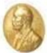

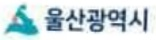

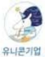

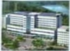

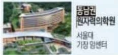

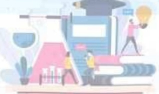

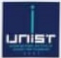

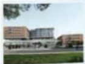

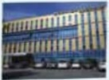

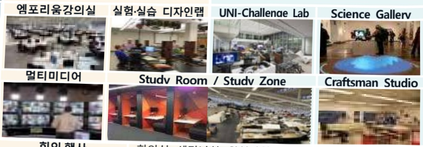

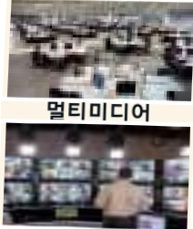

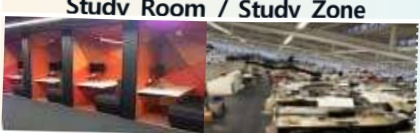

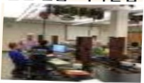

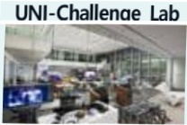

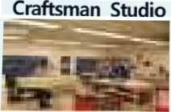

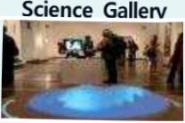

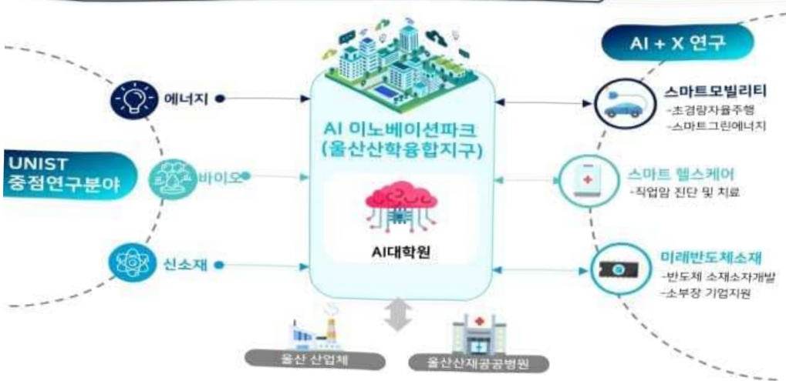

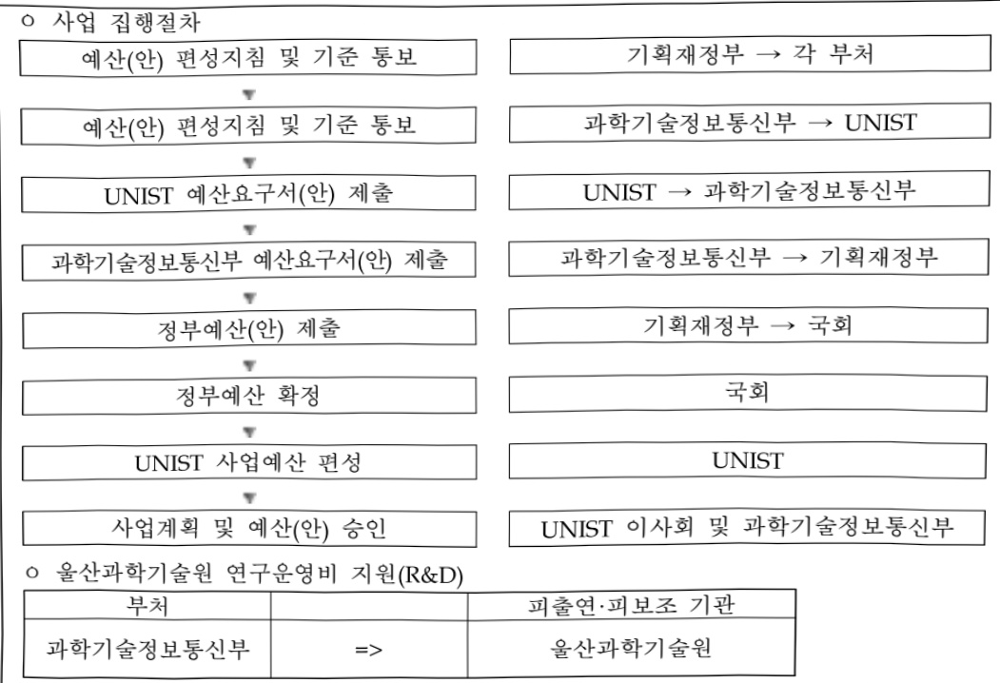

