# 융합서비스 글로벌시장 진출지원

**해당 페이지**: PDF 1237 ~ 1257 쪽 해당

**부처**: 과학기술정보통신부
**분야**: 통신
**회계유형**: 일반회계
**2026 확정예산**: 45150.0 백만원
**전년대비 증감률**: 99.2%
**AI 도메인**: AI반도체, 데이터, 제조/스마트팩토리, 문화/콘텐츠, 디지털전환(AX)

---

<table border=1 style='margin: auto; word-wrap: break-word;'><tr><td style='text-align: center; word-wrap: break-word;'>사 업 명</td></tr><tr><td style='text-align: center; word-wrap: break-word;'>(174) 융합서비스 글로벌시장 진출지원 (2137-310)</td></tr></table>

사업 코드 정보

<table border=1 style='margin: auto; word-wrap: break-word;'><tr><td style='text-align: center; word-wrap: break-word;'>구분</td><td style='text-align: center; word-wrap: break-word;'>회계</td><td style='text-align: center; word-wrap: break-word;'>소관</td><td style='text-align: center; word-wrap: break-word;'>실국(기관)</td><td style='text-align: center; word-wrap: break-word;'>계정</td><td style='text-align: center; word-wrap: break-word;'>분야</td><td style='text-align: center; word-wrap: break-word;'>부문</td></tr><tr><td style='text-align: center; word-wrap: break-word;'>코드</td><td rowspan="2">일반회계</td><td rowspan="2">과학기술정보통신부</td><td rowspan="2">정보통신산업정책관</td><td rowspan="2">-</td><td style='text-align: center; word-wrap: break-word;'>130</td><td style='text-align: center; word-wrap: break-word;'>133</td></tr><tr><td style='text-align: center; word-wrap: break-word;'>명칭</td><td style='text-align: center; word-wrap: break-word;'>통신</td><td style='text-align: center; word-wrap: break-word;'>정보통신</td></tr></table>

<table border=1 style='margin: auto; word-wrap: break-word;'><tr><td style='text-align: center; word-wrap: break-word;'>구분</td><td style='text-align: center; word-wrap: break-word;'>프로그램</td><td style='text-align: center; word-wrap: break-word;'>단위사업</td><td style='text-align: center; word-wrap: break-word;'>세부사업</td></tr><tr><td style='text-align: center; word-wrap: break-word;'>코드</td><td style='text-align: center; word-wrap: break-word;'>2100</td><td style='text-align: center; word-wrap: break-word;'>2137</td><td style='text-align: center; word-wrap: break-word;'>310</td></tr><tr><td style='text-align: center; word-wrap: break-word;'>명칭</td><td style='text-align: center; word-wrap: break-word;'>정보통신융합산업</td><td style='text-align: center; word-wrap: break-word;'>ICT산업기반확충</td><td style='text-align: center; word-wrap: break-word;'>융합서비스 글로벌시장 진출지원</td></tr></table>

☐ 사업 성격

<table border=1 style='margin: auto; word-wrap: break-word;'><tr><td rowspan="2">신규</td><td rowspan="2">계속</td><td rowspan="2">완료</td><td rowspan="2">예비타당성 실시여부</td><td rowspan="2">총사업비 관리대상</td><td rowspan="2">총액계상 예산사업</td><td style='text-align: center; word-wrap: break-word;'>사업소관 변경정보</td></tr><tr><td style='text-align: center; word-wrap: break-word;'>2023예산 시 소관</td></tr><tr><td style='text-align: center; word-wrap: break-word;'></td><td style='text-align: center; word-wrap: break-word;'>○</td><td style='text-align: center; word-wrap: break-word;'></td><td style='text-align: center; word-wrap: break-word;'></td><td style='text-align: center; word-wrap: break-word;'></td><td style='text-align: center; word-wrap: break-word;'></td><td style='text-align: center; word-wrap: break-word;'></td></tr></table>

□ 사업 지원 형태 및 지원을

<table border=1 style='margin: auto; word-wrap: break-word;'><tr><td style='text-align: center; word-wrap: break-word;'>직접</td><td style='text-align: center; word-wrap: break-word;'>출자</td><td style='text-align: center; word-wrap: break-word;'>출연</td><td style='text-align: center; word-wrap: break-word;'>보조</td><td style='text-align: center; word-wrap: break-word;'>융자</td><td style='text-align: center; word-wrap: break-word;'>국고보조율(%)</td><td style='text-align: center; word-wrap: break-word;'>융자율(%)</td></tr><tr><td style='text-align: center; word-wrap: break-word;'></td><td style='text-align: center; word-wrap: break-word;'></td><td style='text-align: center; word-wrap: break-word;'>○</td><td style='text-align: center; word-wrap: break-word;'></td><td style='text-align: center; word-wrap: break-word;'></td><td style='text-align: center; word-wrap: break-word;'></td><td style='text-align: center; word-wrap: break-word;'></td></tr></table>

□ 사업 소관부처 및 시행주체

<table border=1 style='margin: auto; word-wrap: break-word;'><tr><td style='text-align: center; word-wrap: break-word;'>사업명</td><td colspan="2">구분</td></tr><tr><td rowspan="3">DNA 대중소 파트너십 동반친출</td><td rowspan="2">소관부처</td><td style='text-align: center; word-wrap: break-word;'>정보통신정책실 정보통신산업정책관</td></tr><tr><td style='text-align: center; word-wrap: break-word;'>정보통신산업정책과</td></tr><tr><td style='text-align: center; word-wrap: break-word;'>사업 시행 주체</td><td style='text-align: center; word-wrap: break-word;'>정보통신산업진흥원</td></tr><tr><td rowspan="3">DNA 융합 제품 서비스 해외 진출 지원</td><td rowspan="2">소관부처</td><td style='text-align: center; word-wrap: break-word;'>정보통신정책실 정보통신산업정책관</td></tr><tr><td style='text-align: center; word-wrap: break-word;'>정보통신산업기반과</td></tr><tr><td style='text-align: center; word-wrap: break-word;'>사업 시행 주체</td><td style='text-align: center; word-wrap: break-word;'>정보통신산업진흥원</td></tr><tr><td rowspan="3">디지털 혁신기업 글로벌 성장 바우처 지원</td><td rowspan="2">소관부처</td><td style='text-align: center; word-wrap: break-word;'>정보통신정책실 정보통신산업정책관</td></tr><tr><td style='text-align: center; word-wrap: break-word;'>정보통신산업기반과</td></tr><tr><td style='text-align: center; word-wrap: break-word;'>사업 시행 주체</td><td style='text-align: center; word-wrap: break-word;'>정보통신산업진흥원</td></tr></table>

---

<table border=1 style='margin: auto; word-wrap: break-word;'><tr><td rowspan="3">AI·반도체 해외 실증 지원</td><td rowspan="2">소관부처</td><td style='text-align: center; word-wrap: break-word;'>정보통신정책실 정보통신산업정책관</td></tr><tr><td style='text-align: center; word-wrap: break-word;'>정보통신산업기반과</td></tr><tr><td style='text-align: center; word-wrap: break-word;'>사업 시행 주체</td><td style='text-align: center; word-wrap: break-word;'>정보통신산업진흥원</td></tr><tr><td rowspan="3">AI·디지털전환 혁신 기업 해외실증 지원</td><td rowspan="2">소관부처</td><td style='text-align: center; word-wrap: break-word;'>정보통신정책실 정보통신산업정책관</td></tr><tr><td style='text-align: center; word-wrap: break-word;'>정보통신산업기반과</td></tr><tr><td style='text-align: center; word-wrap: break-word;'>사업 시행 주체</td><td style='text-align: center; word-wrap: break-word;'>정보통신산업진흥원</td></tr><tr><td rowspan="3">AI·디지털 비즈니스 파트너십 구축</td><td rowspan="2">소관부처</td><td style='text-align: center; word-wrap: break-word;'>정보통신정책실 정보통신산업정책관</td></tr><tr><td style='text-align: center; word-wrap: break-word;'>정보통신산업기반과</td></tr><tr><td style='text-align: center; word-wrap: break-word;'>사업 시행 주체</td><td style='text-align: center; word-wrap: break-word;'>정보통신산업진흥원</td></tr><tr><td rowspan="3">K태크파이오나즈 (산납)</td><td rowspan="2">소관부처</td><td style='text-align: center; word-wrap: break-word;'>정보통신정책실 정보통신산업정책관</td></tr><tr><td style='text-align: center; word-wrap: break-word;'>정보통신산업기반과</td></tr><tr><td style='text-align: center; word-wrap: break-word;'>사업 시행 주체</td><td style='text-align: center; word-wrap: break-word;'>정보통신산업진흥원</td></tr></table>

---

### 가.예산 총괄표

(단위: 백만원, %)

<table border=1 style='margin: auto; word-wrap: break-word;'><tr><td rowspan="2">사업명</td><td rowspan="2">2024년 결산</td><td colspan="2">2025년 예산</td><td colspan="2">2026년 예산</td><td rowspan="2">중감(B-A)</td><td rowspan="2">(B-A)/A</td></tr><tr><td style='text-align: center; word-wrap: break-word;'>본예산</td><td style='text-align: center; word-wrap: break-word;'>추경*(A)</td><td style='text-align: center; word-wrap: break-word;'>요구안</td><td style='text-align: center; word-wrap: break-word;'>본예산(B)</td></tr><tr><td style='text-align: center; word-wrap: break-word;'>융합서비스 글로벌시장 진출지원</td><td style='text-align: center; word-wrap: break-word;'>7,763</td><td style='text-align: center; word-wrap: break-word;'>17,263</td><td style='text-align: center; word-wrap: break-word;'>22,663</td><td style='text-align: center; word-wrap: break-word;'>42,300</td><td style='text-align: center; word-wrap: break-word;'>45,150</td><td style='text-align: center; word-wrap: break-word;'>22,487</td><td style='text-align: center; word-wrap: break-word;'>99.2</td></tr></table>

* 추경: 추경증감액을 포함한 최종 예산액을 기재

## □ 기능별(내역사업별) 예산 내역

(단위:백만원)

<table border=1 style='margin: auto; word-wrap: break-word;'><tr><td rowspan="2"></td><td colspan="5">2024</td><td colspan="5">2025(2025.12월말)</td><td rowspan="2">2026예산안</td></tr><tr><td style='text-align: center; word-wrap: break-word;'>예산액(추정)</td><td style='text-align: center; word-wrap: break-word;'>예산현액</td><td style='text-align: center; word-wrap: break-word;'>집행액</td><td style='text-align: center; word-wrap: break-word;'>이월액</td><td style='text-align: center; word-wrap: break-word;'>불용액</td><td style='text-align: center; word-wrap: break-word;'>예산액(추정)</td><td style='text-align: center; word-wrap: break-word;'>예산현액</td><td style='text-align: center; word-wrap: break-word;'>집행액</td><td style='text-align: center; word-wrap: break-word;'>이월예산액</td><td style='text-align: center; word-wrap: break-word;'>불용예산액</td></tr><tr><td style='text-align: center; word-wrap: break-word;'>○ 기능별 분류(합계)</td><td style='text-align: center; word-wrap: break-word;'>7,763</td><td style='text-align: center; word-wrap: break-word;'>7,763</td><td style='text-align: center; word-wrap: break-word;'>7,763</td><td style='text-align: center; word-wrap: break-word;'>-</td><td style='text-align: center; word-wrap: break-word;'>-</td><td style='text-align: center; word-wrap: break-word;'>22,663</td><td style='text-align: center; word-wrap: break-word;'>22,663</td><td style='text-align: center; word-wrap: break-word;'>22,663</td><td style='text-align: center; word-wrap: break-word;'>-</td><td style='text-align: center; word-wrap: break-word;'>-</td><td style='text-align: center; word-wrap: break-word;'>45,150</td></tr><tr><td style='text-align: center; word-wrap: break-word;'>• DNA 대중소 파트너십 동반진출</td><td style='text-align: center; word-wrap: break-word;'>3,178</td><td style='text-align: center; word-wrap: break-word;'>3,178</td><td style='text-align: center; word-wrap: break-word;'>3,178</td><td style='text-align: center; word-wrap: break-word;'>-</td><td style='text-align: center; word-wrap: break-word;'>-</td><td style='text-align: center; word-wrap: break-word;'>3,178</td><td style='text-align: center; word-wrap: break-word;'>3,178</td><td style='text-align: center; word-wrap: break-word;'>3,178</td><td style='text-align: center; word-wrap: break-word;'>-</td><td style='text-align: center; word-wrap: break-word;'>-</td><td style='text-align: center; word-wrap: break-word;'>4,465</td></tr><tr><td style='text-align: center; word-wrap: break-word;'>• DNA 융합 제품 서비스 해외 진출 지원</td><td style='text-align: center; word-wrap: break-word;'>1,585</td><td style='text-align: center; word-wrap: break-word;'>1,585</td><td style='text-align: center; word-wrap: break-word;'>1,585</td><td style='text-align: center; word-wrap: break-word;'>-</td><td style='text-align: center; word-wrap: break-word;'>-</td><td style='text-align: center; word-wrap: break-word;'>1,085</td><td style='text-align: center; word-wrap: break-word;'>1,085</td><td style='text-align: center; word-wrap: break-word;'>1,085</td><td style='text-align: center; word-wrap: break-word;'>-</td><td style='text-align: center; word-wrap: break-word;'>-</td><td style='text-align: center; word-wrap: break-word;'>1,085</td></tr><tr><td style='text-align: center; word-wrap: break-word;'>• 디지털 혁신기업 글로벌 성장 바우처 지원</td><td style='text-align: center; word-wrap: break-word;'>3,000</td><td style='text-align: center; word-wrap: break-word;'>3,000</td><td style='text-align: center; word-wrap: break-word;'>3,000</td><td style='text-align: center; word-wrap: break-word;'>-</td><td style='text-align: center; word-wrap: break-word;'>-</td><td style='text-align: center; word-wrap: break-word;'>3,000</td><td style='text-align: center; word-wrap: break-word;'>3,000</td><td style='text-align: center; word-wrap: break-word;'>3,000</td><td style='text-align: center; word-wrap: break-word;'>-</td><td style='text-align: center; word-wrap: break-word;'>-</td><td style='text-align: center; word-wrap: break-word;'>3,000</td></tr><tr><td style='text-align: center; word-wrap: break-word;'>• AI·반도체 해외 실증 지원</td><td style='text-align: center; word-wrap: break-word;'>-</td><td style='text-align: center; word-wrap: break-word;'>-</td><td style='text-align: center; word-wrap: break-word;'>-</td><td style='text-align: center; word-wrap: break-word;'>-</td><td style='text-align: center; word-wrap: break-word;'>-</td><td style='text-align: center; word-wrap: break-word;'>10,800</td><td style='text-align: center; word-wrap: break-word;'>10,800</td><td style='text-align: center; word-wrap: break-word;'>10,800</td><td style='text-align: center; word-wrap: break-word;'>-</td><td style='text-align: center; word-wrap: break-word;'>-</td><td style='text-align: center; word-wrap: break-word;'>21,600</td></tr><tr><td style='text-align: center; word-wrap: break-word;'>• AI·디지털 전환 혁신기업 해외 실증 지원</td><td style='text-align: center; word-wrap: break-word;'>-</td><td style='text-align: center; word-wrap: break-word;'>-</td><td style='text-align: center; word-wrap: break-word;'>-</td><td style='text-align: center; word-wrap: break-word;'>-</td><td style='text-align: center; word-wrap: break-word;'>-</td><td style='text-align: center; word-wrap: break-word;'>1,600</td><td style='text-align: center; word-wrap: break-word;'>1,600</td><td style='text-align: center; word-wrap: break-word;'>1,600</td><td style='text-align: center; word-wrap: break-word;'>-</td><td style='text-align: center; word-wrap: break-word;'>-</td><td style='text-align: center; word-wrap: break-word;'>4,000</td></tr><tr><td style='text-align: center; word-wrap: break-word;'>• AI·디지털 비즈니스 파트너십 구축</td><td style='text-align: center; word-wrap: break-word;'>-</td><td style='text-align: center; word-wrap: break-word;'>-</td><td style='text-align: center; word-wrap: break-word;'>-</td><td style='text-align: center; word-wrap: break-word;'>-</td><td style='text-align: center; word-wrap: break-word;'>-</td><td style='text-align: center; word-wrap: break-word;'>3,000</td><td style='text-align: center; word-wrap: break-word;'>3,000</td><td style='text-align: center; word-wrap: break-word;'>3,000</td><td style='text-align: center; word-wrap: break-word;'>-</td><td style='text-align: center; word-wrap: break-word;'>-</td><td style='text-align: center; word-wrap: break-word;'>3,000</td></tr><tr><td style='text-align: center; word-wrap: break-word;'>• K테크 파이오나이즈</td><td style='text-align: center; word-wrap: break-word;'>-</td><td style='text-align: center; word-wrap: break-word;'>-</td><td style='text-align: center; word-wrap: break-word;'>-</td><td style='text-align: center; word-wrap: break-word;'>-</td><td style='text-align: center; word-wrap: break-word;'>-</td><td style='text-align: center; word-wrap: break-word;'>-</td><td style='text-align: center; word-wrap: break-word;'>-</td><td style='text-align: center; word-wrap: break-word;'>-</td><td style='text-align: center; word-wrap: break-word;'>-</td><td style='text-align: center; word-wrap: break-word;'>-</td><td style='text-align: center; word-wrap: break-word;'>8,000</td></tr></table>

### 나. 사업설명자료

## 1 ) 사업목적·내용

- (DNA 대중소 파트너십 동반진출) 기업 간 연대·동반 해외진출을 위한 융합제품·서비스의 현지화 실증 지원, 글로벌 홍보와 해외시장 개척을 위한 지원 플랫폼 운영, 통상 정책 대응 지원을 통한 기업의 수출 여건 개선 추진

---

- (DNA 융합 제품·서비스 해외 진출지원) AI 분야 등 미래 디지털기술 기반의 우수 융합 제품 서비스 현지화 및 확산 지원을 위한 국내외 기업 간 조인트벤처 (Joint Venture, JV) 파트너십 형성과 JV 추진·운영 지원

- (디지털 혁신기업 글로벌 성장 바우처 지원) 유망 디지털 혁신기업의 해외시장

맞춤형 제품·서비스 개발·고도화 및 레퍼런스 확보를 위한 바우처 지원

- (AI-반도체 해외실증 지원) AI반도체 및 AI서비스 기업의 동반 해외진출을 위해 'AI반도체 + 서버/엣지 + AI모델'을 패키징化하여 해외실증 지원

- (AI·디지털전환 혁신기업 해외실증) ①AI·디지털전환 해외실증 프로젝트 발굴 및

②기술·시제품 현지실증을 통해 디지털 혁신기업의 해외진출 및 판로개척 지원

- (AI·디지털 비즈니스 파트너십 구축) AI 및 디지털 혁신기업의 새동부 시장 진출을 지원하기 위한 현지 지원체계 구축 및 현지 사업화 지원

- (K-테크 파이오니어즈) 글로벌 활동 중인 AI·AX 등 초격차 기술 보유 한국 인재·기업의 국내 유입·정착을 통한 국내 산업생태계 활성화 기반 마련

## 2 ) 사업개요

## □ 사업근거 및 추진경위

① 법령상 근거 및 조항 적시

- 정보통신 진흥 및 융합 활성화 등에 관한 특별법 제30조(중소기업 및 벤처 등의 창업과 해외시장 진출 등)

① 과학기술정보통신부장관은 정보통신융합등 관련 중소기업 및 벤처 등의 창업과 해외시장 진출을 활성화하고 지원하기 위하여 다음 각 호의 사업을 할 수 있다.

1. 정보통신융합등 관련 중소기업 및 벤처 등의 국내외 현지 창업 및 해외진출 지원

② 과학기술정보통신부장관은 제1항 각 호의 사업을 효율적으로 추진하기 위하여 대통령령으로 정하는 기관 또는 단체를 전문기관으로 지정하여 운영할 수 있으며, 필요한 비용의 전부 또는 일부를 보조할 수 있다.

## -정보통신산업 진흥법 제5조(정보통신산업 진흥계획)

① 과학기술정보통신부장관은 정보통신산업의 진흥에 관한 중·장기 정책목표 및 방향을 설정하기 위하여 다음 각 호의 사항이 포함된 정보통신산업 진흥계획(이하 “진흥계획”이라 한다)을 수립·시행하여야 한다.

8. 정보통신산업의 국제협력 및 해외시장 진출 지원에 관한 사항..

- 정보통신산업 진흥법 제17조(정보통신산업의 국제협력 추진)

---

<table border=1 style='margin: auto; word-wrap: break-word;'><tr><td style='text-align: center; word-wrap: break-word;'>① 과학기술정보통신부장관은 정보통신기술 및 정보통신산업에 관한 국제적 동향을 과악하고 국제협력을 추진하여야 한다.</td></tr><tr><td style='text-align: center; word-wrap: break-word;'>② 과학기술정보통신부장관은 정보통신산업 분야의 국제협력을 추진하기 위하여 정보통신기술 및 전문인력의 국제교류 및 국제공동연구개발 등의 사업을 지원할 수 있다.</td></tr><tr><td style='text-align: center; word-wrap: break-word;'>③ 과학기술정보통신부장관은 정보통신기술 및 정보통신산업과 관련된 민간부문의 국제협력을 지원할 수 있다.</td></tr></table>

- 정보통신산업 진흥법 제25조(정보통신기업의 해외진출 촉진)

<table border=1 style='margin: auto; word-wrap: break-word;'><tr><td style='text-align: center; word-wrap: break-word;'>과학기술정보통신부장관은 국내 정보통신기업이 해외시장에 활발히 진출하여 기업활동을 할 수 있도록 필요한 시책을 마련하여 추진하여야 한다.</td></tr></table>

- 소프트웨어산업 진흥법 제4조(기본계획의 수립 등), 제16조(국제협력 및 해외진출 촉진)

<table border=1 style='margin: auto; word-wrap: break-word;'><tr><td style='text-align: center; word-wrap: break-word;'>제5조(기본계획의 수립 등) ① 과학기술정보통신부장관은 소프트웨어 진흥을 위하여 관계 중앙행정기관의 장과 협의를 거쳐 소프트웨어 진흥 기본계획(이하 “기본계획”이라 한다)을 수립 · 시행하여야 한다. ② 기본계획에는 다음 각 호의 사항이 포함되어야 한다.</td></tr><tr><td style='text-align: center; word-wrap: break-word;'>8. 소프트웨어산업의 국제협력 및 해외시장 진출</td></tr><tr><td style='text-align: center; word-wrap: break-word;'>제16조(국제협력 및 해외진출 지원) 정부는 소프트웨어산업의 국제협력 및 해외시장 진출을 촉진하기 위하여 다음 각 호의 사업을 지원할 수 있다.</td></tr><tr><td style='text-align: center; word-wrap: break-word;'>5. 소프트웨어의 해외 현지화</td></tr><tr><td style='text-align: center; word-wrap: break-word;'>6. 그 밖에 국제협력 및 해외진출을 위하여 필요한 사업</td></tr></table>

- 정보통신산업 진흥법 제27조(사업), 제28조(재원 등)

<table border=1 style='margin: auto; word-wrap: break-word;'><tr><td style='text-align: center; word-wrap: break-word;'>제27조(사업) 산업진흥원은 다음 각 호의 사업을 한다.</td></tr><tr><td style='text-align: center; word-wrap: break-word;'>5. 정보통신산업 발전을 위한 유통시장 활성화와 마케팅 지원</td></tr><tr><td style='text-align: center; word-wrap: break-word;'>7. 정보통신기술의 융합·활용에 관한 사업</td></tr><tr><td style='text-align: center; word-wrap: break-word;'>8. 정보통신산업 관련 국제교류·협력 및 해외진출의 지원</td></tr><tr><td style='text-align: center; word-wrap: break-word;'>제28조(재원 등) ① 정부는 예산 또는 기금의 범위에서 산업진흥원의 설립 및 운영에 필요한 경비의 전부 또는 일부를 출연하거나 보조할 수 있다</td></tr></table>

-정보통신 진흥 및 융합 활성화 등에 관한 특별법 제32조(정보통신융합등 기술 서비스 개발 등의 지원)

제32조(정보통신융합등 기술·서비스 개발 등의 지원) ① 과학기술정보통신부장관은 다른 산업 및 서비스 등에 정보통신의 접목을 통하여 생산성과 가치를 높일 수 있도록 노력하여야 한다.

② 과학기술정보통신부장관은 정보통신융합등 기술·서비스의 개발을 촉진하기 위하여 다음 각 호의 사업을 추진할 수 있다. ③ 과학기술정보통신부장관은 제2항 각 호의 사업을 추진하기 위하여 법인인 전담기관을 설립하거나 법인·단체에 위탁·운영할 수 있으며, 필요한 비용의 전부 또는 일부를 예산의 범위에서 출연 또는 보조할 수 있다. ④ 중앙행정기관의 장 및 지방자치단체의 장은 제2항 각 호의 사업을 제3항에 따른 전담기관으로 하여금 수행하게 하고, 그에 소요되는 비용의 전부 또는 일부를 지원할 수 있다. ⑤ 제3항에 따른 전담기관에 관하여 이 법에서 정한 것을 제외하고는「민법」 중 재단법인에 관한 규정을 준용하며, 전담기관의 운영 및 제2항 각 호의 업무수행에 필요한 사항은 대통령령으로 정한다.

---

-정보통신 진흥 및 융합 활성화 등에 관한 특별법 제11조(국내 전문인력의 양성)

① 과학기술정보통신부장관은 정보통신 분야의 전문적인 기술, 지식 등을 가진 인력(이하 “전문인력”이라 한다)의 육성에 관한 시책을 수립 · 추진하여야 하며, 특히 소프트웨어 교육의 저변화대 및 지역산업의 발전을 위한 소프트웨어 특화교육 활성화를 위하여 노력하여야 한다.

② 제1항에 따른 시책에는 다음 각 호의 사항이 포함되어야 한다.

2.전문인력의 수급 및 활용에 관한 사항

4. 그 밖에 전문인력의 육성 및 관리 등을 위한 사항

② 추진경위 - 사업 시작년도, 추진배경, 부처별 중점과제, 대통령 공약사항 등

<table border=1 style='margin: auto; word-wrap: break-word;'><tr><td style='text-align: center; word-wrap: break-word;'>년월</td><td style='text-align: center; word-wrap: break-word;'>관련부처</td><td style='text-align: center; word-wrap: break-word;'>내용</td></tr><tr><td style='text-align: center; word-wrap: break-word;'>&#x27;17.01월</td><td style='text-align: center; word-wrap: break-word;'>관계부처 합동</td><td style='text-align: center; word-wrap: break-word;'>과학기술·ICT 국제화사업 시행계획</td></tr><tr><td style='text-align: center; word-wrap: break-word;'>&#x27;20.02월</td><td style='text-align: center; word-wrap: break-word;'>관계부처 합동</td><td style='text-align: center; word-wrap: break-word;'>「코로나 바이러스 감염증-19」기업애로 해소 및 수출지원 대책</td></tr><tr><td style='text-align: center; word-wrap: break-word;'>&#x27;21.01월</td><td style='text-align: center; word-wrap: break-word;'>관계부처 합동</td><td style='text-align: center; word-wrap: break-word;'>「K-뉴딜 글로벌화 전략」발표</td></tr><tr><td style='text-align: center; word-wrap: break-word;'>&#x27;21.11월</td><td style='text-align: center; word-wrap: break-word;'>관계부처 합동</td><td style='text-align: center; word-wrap: break-word;'>「제1차 수출전략회의」기업애로 해소 및 지원 대책</td></tr><tr><td style='text-align: center; word-wrap: break-word;'>&#x27;22.09월</td><td style='text-align: center; word-wrap: break-word;'>관계부처 합동</td><td style='text-align: center; word-wrap: break-word;'>「대한민국 디지털전략」글로벌 시장 주도하는 &#x27;K-디지털&#x27; 전략과제</td></tr><tr><td style='text-align: center; word-wrap: break-word;'>&#x27;23.06월</td><td style='text-align: center; word-wrap: break-word;'>과기정통부</td><td style='text-align: center; word-wrap: break-word;'>「디지털분야 해외진출 및 수출활성화 전략」발표</td></tr><tr><td style='text-align: center; word-wrap: break-word;'>&#x27;23.09월</td><td style='text-align: center; word-wrap: break-word;'>과기정통부</td><td style='text-align: center; word-wrap: break-word;'>한국기관-미뉴욕대 인공지능(AI)-디지털 비즈니스 파트너십 MoU 체결</td></tr><tr><td style='text-align: center; word-wrap: break-word;'>&#x27;24.04월</td><td style='text-align: center; word-wrap: break-word;'>관계부처 합동</td><td style='text-align: center; word-wrap: break-word;'>「AI-반도체 이니셔티브(안)」발표</td></tr><tr><td style='text-align: center; word-wrap: break-word;'>&#x27;24.09월</td><td style='text-align: center; word-wrap: break-word;'>과기정통부</td><td style='text-align: center; word-wrap: break-word;'>글로벌 AI 프론티어랩(Global AI Frontier Lab) 개소</td></tr><tr><td style='text-align: center; word-wrap: break-word;'>&#x27;25.01월</td><td style='text-align: center; word-wrap: break-word;'>관계부처 합동</td><td style='text-align: center; word-wrap: break-word;'>「첨단산업 인재혁신 특별법」</td></tr></table>

## □ 주요내용

① 사업규모

- 총사업비(해당되는 경우에만 기재) : 해당없음

- 사업기간 : '21년 ~ 계속

-최근 5년 간 투입된 사업비(예산액기준, 추경편성한 연도에는 추경포함)

<table border=1 style='margin: auto; word-wrap: break-word;'><tr><td style='text-align: center; word-wrap: break-word;'>$ \underline{\text{所}} $</td><td style='text-align: center; word-wrap: break-word;'>2022</td><td style='text-align: center; word-wrap: break-word;'>2023</td><td style='text-align: center; word-wrap: break-word;'>2024</td><td style='text-align: center; word-wrap: break-word;'>2025</td><td style='text-align: center; word-wrap: break-word;'>2026(所)</td></tr><tr><td style='text-align: center; word-wrap: break-word;'>$ \underline{\text{사업비}} $</td><td style='text-align: center; word-wrap: break-word;'>5,000</td><td style='text-align: center; word-wrap: break-word;'>4,900</td><td style='text-align: center; word-wrap: break-word;'>7,763</td><td style='text-align: center; word-wrap: break-word;'>22,663</td><td style='text-align: center; word-wrap: break-word;'>45,150</td></tr></table>

- 기타: 해당없음

② 사업추진체계

- 사업시행방법 : 출연

- 사업시행주체 : 정보통신산업진흥원

---

- 사업 수혜자 : 창업초기기업, 글로벌 진출 희망 중소기업, 벤처기업 등

- 보조, 융자, 출연, 출자 등의 경우 보조·융자 등 지원 비율 및 법적근거

<table border=1 style='margin: auto; word-wrap: break-word;'><tr><td style='text-align: center; word-wrap: break-word;'>내역사업명</td><td style='text-align: center; word-wrap: break-word;'>구분</td><td style='text-align: center; word-wrap: break-word;'>피보조·피출연 등 기관명</td><td style='text-align: center; word-wrap: break-word;'>지원 금액 (2026계획)</td><td style='text-align: center; word-wrap: break-word;'>지원 비율(%)</td><td style='text-align: center; word-wrap: break-word;'>보조율 법적근거 (해당 조항)</td></tr><tr><td style='text-align: center; word-wrap: break-word;'>DNA 대·중소 파트너십 동반진출</td><td style='text-align: center; word-wrap: break-word;'>출연</td><td style='text-align: center; word-wrap: break-word;'>정보통신 산업진흥원</td><td style='text-align: center; word-wrap: break-word;'>4,465</td><td style='text-align: center; word-wrap: break-word;'>100</td><td style='text-align: center; word-wrap: break-word;'>정보통신산업진흥법 제27조 및 28조, 정보통신융합법 제32조 제3항</td></tr><tr><td style='text-align: center; word-wrap: break-word;'>DNA 융합 제품·서비스 해외진출지원</td><td style='text-align: center; word-wrap: break-word;'>출연</td><td style='text-align: center; word-wrap: break-word;'>정보통신 산업진흥원</td><td style='text-align: center; word-wrap: break-word;'>1,085</td><td style='text-align: center; word-wrap: break-word;'>100</td><td style='text-align: center; word-wrap: break-word;'>정보통신산업진흥법 제27조 및 28조, 정보통신융합법 제32조 제3항</td></tr><tr><td style='text-align: center; word-wrap: break-word;'>디지털 혁신기업 글로벌 성장 바우처 지원</td><td style='text-align: center; word-wrap: break-word;'>출연</td><td style='text-align: center; word-wrap: break-word;'>정보통신 산업진흥원</td><td style='text-align: center; word-wrap: break-word;'>3,000</td><td style='text-align: center; word-wrap: break-word;'>100</td><td style='text-align: center; word-wrap: break-word;'>정보통신산업진흥법 제27조 및 28조, 정보통신융합법 제32조 제3항</td></tr><tr><td style='text-align: center; word-wrap: break-word;'>AI·반도체 해외실증 지원</td><td style='text-align: center; word-wrap: break-word;'>출연</td><td style='text-align: center; word-wrap: break-word;'>정보통신 산업진흥원</td><td style='text-align: center; word-wrap: break-word;'>21,600</td><td style='text-align: center; word-wrap: break-word;'>100</td><td style='text-align: center; word-wrap: break-word;'>정보통신산업진흥법 제27조 및 28조, 정보통신융합법 제30조 제1항 1호, 제2항</td></tr><tr><td style='text-align: center; word-wrap: break-word;'>AI·디지털전환 혁신기업 해외실증 지원</td><td style='text-align: center; word-wrap: break-word;'>출연</td><td style='text-align: center; word-wrap: break-word;'>정보통신 산업진흥원</td><td style='text-align: center; word-wrap: break-word;'>4,000</td><td style='text-align: center; word-wrap: break-word;'>100</td><td style='text-align: center; word-wrap: break-word;'>정보통신산업진흥법 제27조 및 28조, 정보통신융합법 제32조 제3항</td></tr><tr><td style='text-align: center; word-wrap: break-word;'>AI·디지털 비즈니스 파트너십 구축</td><td style='text-align: center; word-wrap: break-word;'>출연</td><td style='text-align: center; word-wrap: break-word;'>정보통신 산업진흥원</td><td style='text-align: center; word-wrap: break-word;'>3,000</td><td style='text-align: center; word-wrap: break-word;'>100</td><td style='text-align: center; word-wrap: break-word;'>정보통신산업진흥법 제27조 및 28조, 정보통신융합법 제30조 제1항 1호, 제2항</td></tr><tr><td style='text-align: center; word-wrap: break-word;'>K·테크 파이오나이즈 (신규)</td><td style='text-align: center; word-wrap: break-word;'>출연</td><td style='text-align: center; word-wrap: break-word;'>정보통신 산업진흥원</td><td style='text-align: center; word-wrap: break-word;'>8,000</td><td style='text-align: center; word-wrap: break-word;'>100</td><td style='text-align: center; word-wrap: break-word;'>정보통신산업진흥법 제27조 및 28조, 정보통신융합법 제30조 제1항 1호, 제2항</td></tr></table>

---

## 3 ) 2026년도 예산 산출 근거

## ① DNA 대·중소 파트너십 동반진출

:(25)3,178백만원→(2026예산안)4,465백만원

- (요구) 신규과제 컨소시엄 4개(2,800백만원), 확산과제 컨소시엄 1개(378백만원), 수출여건개선(837백만원), 수출지원 플랫폼 운영(450백만원)

- (산출) 해외 동반진출 컨소시엄을 위한 신규과제 지원 (700백만원*4개=2,800백만원)

1차년도 지원분야 성과확산을 위한 1개 과제 계속 지원 (378백만원*1개=378백만원, 전년동)

글로벌 통상환경 변화에 따른 ICT 혁신기업의 수출 여건을 개선하기 위한 정책 및 지원 프로그램 (837백만원)

국내 최대 규모의 ICT 전시회인 ‘월드IT쇼’ 개최 등 수출지원플랫폼 운영 (30개 기업*15백만원=450백만원)

## ② DNA 융합 제품서비스 해외진출지원

:(25)1,085백만원→(2026예산안)1,085백만원

- (요구) 해외 현지 합작법인 설립 지원(500백만원) 및 기설립 합작법인 후속지원(585백만원)

- (산출) 해외합작법인설립 지원(10개사x50백만원) + 기설립 합작법인 후속지원(6개사x97.5백만원)

## ③디지털 혁신기업 글로벌 성장 바우처 지원

:(25)3,000백만원→(2026예산안)3,000백만원

- (요구) Solution바우처 1,500백만원, Reference바우처 1,500백만원 지원

- (산출) S바우처 : 1,500백만원(3개 슬루션 분야 x 5개 디지털 혁신기업 x 100백만원)

R바우처 : 1,500백만원(5개 지역 x 6개 컨소시엄 x 50백만원)

## ④ AI-반도체 해외실증 지원

: (2025 추경) 10,800백만원 → (2026 예산안) 21,600백만원 (2025 본예산 5,400백만원 → 제1회 추경 10,800백만원)

- (요구) 서버형 8개 12,000백만원, 엣지형 8개 9,600백만원 등 총 21,600백만원

- (산출) 서버형 : 12,000백만원(1,500백만원 x 8개(계속 4개, 신규 4개))

옛지형 : 9,600백만원(1,200백만원 x 8개(계속 4개, 신규 4개))

## ⑤ AI·디지털전환 혁신기업 해외실증 지원

:(25)1,600백만원→(2026 예산안)4,000백만원

- (요구) AI·디지털전환 분야별 해외실증 지원 4,000백만원

- (산출) 4개 분야 x 5개 과제 x 200백만원

## ⑥ AI·디지털 비즈니스 파트너십 구축

:(25)3,000백만원→(2026 예산안)3,000백만원

- (요구) AI·디지털 혁신기업의 미동부시장 진출을 위한 맨토링, 현지사업화 등 프로그램 운영 및 행사개최, 현지 안착 인프라 구축·운영 지원(20개사 지원)

- (산술) AI·디지털 혁신기업 해외진출 지원 (20개사 x 150백만원)

## ⑦ (신규) K-테크 파이오니어즈 : (2026 신규) 8,000백만원

- (요구) 첨단 기술 인재들의 해외 유출에 따른 경제적 손실이 상당하여 우수 인재의 국내로의 유턴(리쇼어링)을 지원하여 한국 산업 생태계와의 연계를 위한 정책적 대응 지원

- (산출) 인재·팀 선발 1,500백만원(500백만원 x 3개권역), 정착지원 6,500백만원(325백만원 x 20개팀)

---

## 4 ) 사업효과

☐ 사업영향, 산출물 성과지표 등

① 2022~2026년도 성과계획서 상 성과지표 및 최근 5년간 성과 달성도

<table border=1 style='margin: auto; word-wrap: break-word;'><tr><td style='text-align: center; word-wrap: break-word;'>성과지표</td><td style='text-align: center; word-wrap: break-word;'>구분</td><td style='text-align: center; word-wrap: break-word;'>&#x27;22</td><td style='text-align: center; word-wrap: break-word;'>&#x27;23</td><td style='text-align: center; word-wrap: break-word;'>&#x27;24</td><td style='text-align: center; word-wrap: break-word;'>&#x27;25</td><td style='text-align: center; word-wrap: break-word;'>&#x27;26</td><td style='text-align: center; word-wrap: break-word;'>&#x27;26목표치산출근거</td><td style='text-align: center; word-wrap: break-word;'>측정산식(또는 측정방법)</td><td style='text-align: center; word-wrap: break-word;'>자료수집방법(또는 자료출처)</td></tr><tr><td rowspan="3">해외진출 지원수혜기업만족도(단위: 점)</td><td style='text-align: center; word-wrap: break-word;'>목표</td><td style='text-align: center; word-wrap: break-word;'>9.05</td><td style='text-align: center; word-wrap: break-word;'>9.10</td><td style='text-align: center; word-wrap: break-word;'>9.15</td><td style='text-align: center; word-wrap: break-word;'>9.15</td><td style='text-align: center; word-wrap: break-word;'>9.15</td><td rowspan="3">매우민족수준90점으로 목표부여 방식을적용하여 공격적으로 설정</td><td rowspan="3">항목별 만족 여부를라커트 5점 척도로(매우불만족 1점, 불만족 2점, 보통 3점, 만족 4점, 매우 만족 5점) 시스템평균 만족도 환산</td><td rowspan="3">설문조사/외부기관</td></tr><tr><td style='text-align: center; word-wrap: break-word;'>실적</td><td style='text-align: center; word-wrap: break-word;'>9.5</td><td style='text-align: center; word-wrap: break-word;'>9.6</td><td style='text-align: center; word-wrap: break-word;'>9.7</td><td style='text-align: center; word-wrap: break-word;'>-</td><td style='text-align: center; word-wrap: break-word;'>-</td></tr><tr><td style='text-align: center; word-wrap: break-word;'>달성도</td><td style='text-align: center; word-wrap: break-word;'>104</td><td style='text-align: center; word-wrap: break-word;'>105</td><td style='text-align: center; word-wrap: break-word;'>-</td><td style='text-align: center; word-wrap: break-word;'>-</td><td style='text-align: center; word-wrap: break-word;'>-</td></tr><tr><td rowspan="3">해외진출 건 수(단위: 건)</td><td style='text-align: center; word-wrap: break-word;'>목표</td><td style='text-align: center; word-wrap: break-word;'>3</td><td style='text-align: center; word-wrap: break-word;'>21</td><td style='text-align: center; word-wrap: break-word;'>21</td><td style='text-align: center; word-wrap: break-word;'>32</td><td style='text-align: center; word-wrap: break-word;'>40</td><td rowspan="3">본 사업을 통해해외진출을 지원받은 기업이 사업기간 내 추진한 해외진출 건수 측정- 지원사업 수혜기업의 수출계약 MOU 등 실적을 합쳐 산정</td><td rowspan="3">수혜기업의 해외 계약, MOU 체결 건수 등 합산</td><td rowspan="3">자체조사/결과보고서</td></tr><tr><td style='text-align: center; word-wrap: break-word;'>실적</td><td style='text-align: center; word-wrap: break-word;'>3</td><td style='text-align: center; word-wrap: break-word;'>21</td><td style='text-align: center; word-wrap: break-word;'>22</td><td style='text-align: center; word-wrap: break-word;'>-</td><td style='text-align: center; word-wrap: break-word;'>-</td></tr><tr><td style='text-align: center; word-wrap: break-word;'>달성도</td><td style='text-align: center; word-wrap: break-word;'>100</td><td style='text-align: center; word-wrap: break-word;'>100</td><td style='text-align: center; word-wrap: break-word;'>-</td><td style='text-align: center; word-wrap: break-word;'>-</td><td style='text-align: center; word-wrap: break-word;'>-</td></tr><tr><td rowspan="3">현지화 지원 건 수(단위: 건)</td><td style='text-align: center; word-wrap: break-word;'>목표</td><td style='text-align: center; word-wrap: break-word;'>-</td><td style='text-align: center; word-wrap: break-word;'>-</td><td style='text-align: center; word-wrap: break-word;'>11</td><td style='text-align: center; word-wrap: break-word;'>17</td><td style='text-align: center; word-wrap: break-word;'>25</td><td rowspan="3">본 사업을 통해해외진출을 지원받은 기업이 사업기간 내 추진한 해외진출 건수 측정- 지원사업 수혜기업의 수출계약 MOU 등 실적을 합쳐 산정</td><td rowspan="3">수혜기업이 완료한 현지 JV 설립, 실증, 권설팅 등 합산</td><td rowspan="3">자체조사/결과보고서</td></tr><tr><td style='text-align: center; word-wrap: break-word;'>실적</td><td style='text-align: center; word-wrap: break-word;'>-</td><td style='text-align: center; word-wrap: break-word;'>-</td><td style='text-align: center; word-wrap: break-word;'>21</td><td style='text-align: center; word-wrap: break-word;'>-</td><td style='text-align: center; word-wrap: break-word;'>-</td></tr><tr><td style='text-align: center; word-wrap: break-word;'>달성도</td><td style='text-align: center; word-wrap: break-word;'>-</td><td style='text-align: center; word-wrap: break-word;'>-</td><td style='text-align: center; word-wrap: break-word;'>-</td><td style='text-align: center; word-wrap: break-word;'></td><td style='text-align: center; word-wrap: break-word;'></td></tr></table>

② 성과지표 이외의 연도별 사업추진 경과 및 실적

o DNA 대중소 파트너십 동반진출 사업

- 해외시장내 우선 진출적용이 가능한 2개 분야(의료, 제조) 융합서비스 해외 시범구축 추진을 통한 글로벌 레퍼런스 확보 추진

<지원 과제 개요>

<table border=1 style='margin: auto; word-wrap: break-word;'><tr><td style='text-align: center; word-wrap: break-word;'>분야</td><td style='text-align: center; word-wrap: break-word;'>과제명</td><td style='text-align: center; word-wrap: break-word;'>지원기업</td></tr><tr><td style='text-align: center; word-wrap: break-word;'>의료</td><td style='text-align: center; word-wrap: break-word;'>SaaS 기반 글로벌 AI의료영상분석 서비스</td><td style='text-align: center; word-wrap: break-word;'>LG CNS, 루닛, 뷰노, 바른인포테크(4개사)</td></tr><tr><td style='text-align: center; word-wrap: break-word;'>제조</td><td style='text-align: center; word-wrap: break-word;'>5G기반 스마트팩토리시장 진출을 위한 인공지능 로보틱스 및 5G단말 솔루션</td><td style='text-align: center; word-wrap: break-word;'>씨메스, 밀리웨이브, 플랙토리, SKT(4개사)</td></tr></table>

## o DNA 융합 제품서비스 해외진출 지원

·해외 현지 수요기반 안착성장 잠재력 보유한 DNA 분야 혁신기업 발굴 43건

-해외 현지 조인트벤처 설립 및 운영을 위한 경영컨설팅 시장검증, 사업개발 등 지원 12개사

-미국,동남아,일본,호주,유럽현지DNA분야글로벌조인트벤처설립10건

---

<table border=1 style='margin: auto; word-wrap: break-word;'><tr><td style='text-align: center; word-wrap: break-word;'></td><td colspan="5">o DNA 언택트 비즈니스 플랫폼 운영- 언택트 비즈니스 환경의 플랫폼 구축을 위한 경영환경 분석, 단계별 이행 로드맵 등 정보화 전략계획 수립 완료</td></tr><tr><td rowspan="15">2022</td><td colspan="5">o DNA 대중소 파트너십 동반진출 사업- 해외시장내 우선 진출적용이 가능한 2개 분야(의료, 제조) 용합서비스 해외 시범구축 추진을 통한 글로벌 레퍼런스 확보 추진&lt;지원 과제 개요&gt;</td></tr><tr><td style='text-align: center; word-wrap: break-word;'>분야</td><td colspan="2">과제명</td><td colspan="2">지원기업</td></tr><tr><td style='text-align: center; word-wrap: break-word;'>콘텐츠</td><td colspan="2">한류콘텐츠 글로벌 NFT 마켓플레이스 구축</td><td colspan="2">아이비즈소프트웨어, CJ 올리브네트웍스, 디디에스(3개사)</td></tr><tr><td style='text-align: center; word-wrap: break-word;'>의료</td><td colspan="2">K-헬스케어 B2C2B 글로벌 플랫폼 구축</td><td colspan="2">엔디에스, 하이케어넷, 알체라, 큐램(4개사)</td></tr><tr><td style='text-align: center; word-wrap: break-word;'>에너지</td><td colspan="2">지능형 에너지관리 플랫폼 실증</td><td colspan="2">클라우드앤, 한중엔지니어링, 미래비엠(3개사)</td></tr><tr><td colspan="5">o DNA 용합 제품서비스 해외진출 지원- 해외 현지 수요기반 안착성장 잠재력 보유한 DNA 분야 혁신기업 발굴 30건- 해외 현지 조인트벤처 설립 및 운영을 위한 컨설팅(경영, 진출전략) 지원 326건- 해외 주요국 현지 DNA 용합 제품서비스 현지화 공급기지로 기술매칭형 조인트벤처 완료 19건• 법인형(14건) : JV 추진운영 내 소요 컨설팅, 국외여비, 임차료 등 지원- 프로젝트형(5건) : 국제기구 등 해외 파트너 프로그램 연계를 통한 국내외 기업 간 공동 사업화 프로젝트 지원(파트너십, 확장 전략 컨설팅 등)</td></tr><tr><td colspan="2">지원기업</td><td style='text-align: center; word-wrap: break-word;'>지역구()</td><td style='text-align: center; word-wrap: break-word;'>완료일</td><td style='text-align: center; word-wrap: break-word;'>조인트벤처 프로젝트 내용</td></tr><tr><td colspan="2"> [F6]</td><td rowspan="2"></td><td rowspan="2"></td><td rowspan="2">화물운전자를 위한 SaaS 기반 물류운송 플랫폼 출루선을 통합해 중남미 시장 공동 확대</td></tr><tr><td style='text-align: center; word-wrap: break-word;'></td><td style='text-align: center; word-wrap: break-word;'></td></tr><tr><td colspan="2">  </td><td rowspan="2">중남미(멕시코)</td><td rowspan="2">&#x27;22 3.15.</td><td rowspan="2">- Maestrik의 온라인 영어학습 플랫폼에 뛰이드의 인공지능 솔루션을 결합해 AI 진단을 통한 개인화된 영어 학습 코스를 제공하는 신규 앱 개발 진행</td></tr><tr><td style='text-align: center; word-wrap: break-word;'>(류)뮤이드 AI 학습 솔루션</td><td style='text-align: center; word-wrap: break-word;'></td></tr><tr><td colspan="2">  [F23]</td><td rowspan="2"></td><td rowspan="2">&#x27;22 3.15.</td><td rowspan="2">- Wheel the World의 접근성 매핑 시스템과 닷의 시각장애인을 위한 웨이푸를 잡자 스마트워치 솔루션을 용합한 시각장애자 셀프 여행 가이드 앱 개발 추진</td></tr><tr><td style='text-align: center; word-wrap: break-word;'>(류)닷 웨이리를 점자 솔루션</td><td style='text-align: center; word-wrap: break-word;'></td></tr><tr><td colspan="2">   </td><td rowspan="2">중남미(페루)</td><td rowspan="2">&#x27;22 3.15.</td><td rowspan="2">- SaaS 기반 건설 · 산업현장에 VR, AR 기술을 접목해 VR 안전 교육과 AR 유지보수 솔루션을 통합하여 중남미 시장 공동 확대</td></tr><tr><td style='text-align: center; word-wrap: break-word;'>(류)버네트 산업용 운영관리 XR 솔루션</td><td style='text-align: center; word-wrap: break-word;'></td></tr></table>

---

<table border=1 style='margin: auto; word-wrap: break-word;'><tr><td rowspan="2"></td><td style='text-align: center; word-wrap: break-word;'>shopl. + A Advance</td><td style='text-align: center; word-wrap: break-word;'>중남미(콜롬ㅣㅇㅣ)</td><td rowspan="2">22 3.15.</td><td rowspan="2">- 콜롬ㅣㅇㅣ 현지 기업 고객을 대상으로 Advance의 직원 재정교육 솔루션과 사플앤컴퍼니의 리데일 매장 직원 업무관리 솔루션</td></tr><tr><td style='text-align: center; word-wrap: break-word;'>(백)사플앤컴퍼니리데일 매장 직원업무관리 솔루션</td><td style='text-align: center; word-wrap: break-word;'>(콜롬ㅣㅇㅣ)Advance 직원 재정교육 솔루션</td></tr><tr><td rowspan="12">2023</td><td colspan="4">o DNA 대중소 파트너십 동반진출 사업- (해외진출 지원과제 발굴) 국내 유망 ICT 융합서비스플랫폼 발굴을 통해 디저털 진화 수요로 시장 상장이 기대되는 글로벌 시장내 현지 시범사비스 구축실증 현지 사업화 지원으로 글로벌 참사장 선점 및 사업 확산 성과 창출&lt;1차년도(신규) 지원 과제 개요&gt;</td></tr><tr><td style='text-align: center; word-wrap: break-word;'>과제명</td><td style='text-align: center; word-wrap: break-word;'>시장</td><td colspan="2">주관기관/ 참여기관</td></tr><tr><td style='text-align: center; word-wrap: break-word;'>AI·빅데이터기반 비대면 원격진료 헬스케어 플랫폼</td><td style='text-align: center; word-wrap: break-word;'>베트남</td><td colspan="2">(쥐데이터스트림즈/쥐엠디스퀘어</td></tr><tr><td style='text-align: center; word-wrap: break-word;'>메타버스기술기반 디지털트뮌 서비스 플랫폼</td><td style='text-align: center; word-wrap: break-word;'>스페인</td><td colspan="2">(쥐버넥트/ (쥐GSITM 쥐더픽트</td></tr><tr><td style='text-align: center; word-wrap: break-word;'>e-Mobility(전기이륜차) 충전 관리운영 서비스 기반 파이낸싱 플랫폼</td><td style='text-align: center; word-wrap: break-word;'>인도 네시아</td><td colspan="2">(쥐에이젠글로벌/ (쥐틸다)</td></tr><tr><td style='text-align: center; word-wrap: break-word;'>글로벌 스마트 자동화산업 시장 인공지능 로보틱스 플랫폼</td><td style='text-align: center; word-wrap: break-word;'>베트남</td><td colspan="2">(쥐씨메스/ (쥐플랙토리)</td></tr><tr><td colspan="4">&lt;2차년도(확산) 지원 과제 개요&gt;</td></tr><tr><td style='text-align: center; word-wrap: break-word;'>과제명</td><td style='text-align: center; word-wrap: break-word;'>시장</td><td colspan="2">주관기관/ 참여기관</td></tr><tr><td style='text-align: center; word-wrap: break-word;'>동남아에 적용 가능한 AIoT 기반 건물 에너지 관리 플랫폼</td><td style='text-align: center; word-wrap: break-word;'>태국</td><td colspan="2">(쥐클라우드앤/ (쥐한중엔지니어링, 쥐미래비엠)</td></tr><tr><td colspan="4">- (디지털동반진출협의회) 국내기업의 수출, 애로사항 파악 및 협력 활성화 방안 마련을 위한 &#x27;디지털 동반진출협의회&#x27; 신규 구성발족, 반기별 협의회 개최(6월 11월 등 총 2회) - (해외전시회 참가지원) 19개사 해외 전시(Expand North Star) 참가 지원 및 슈퍼노바 챌린지 2개사 본선 진출, 디렉토리 북 제작 지원, 총 1,067건 상담, MoU 4건 체결 *&lt; 2023년 Expand North Star 행사 개요 &gt;</td></tr><tr><td colspan="4">o (행사명) 2023 Expand North Star (GITEX 연계 전시회)o (일정/장소) &#x27;23.10.15.(일)~10.18.(수) / UAE 두바이 Harbor Cruise Terminalo (주요내용) 디지털화를 통한 탈탄소화※ AI, 핀테크, 헬스케어, 로봇 등 정보통신 장비 및 기술 등 총 21개 전시분야o DNA 융합 제품서비스 해외진출 지원- 해외 현지 수요기반 안착성장 잠재력 보유한 DNA 분야 혁신기업 발굴 28건- 기술매칭형 조인트벤처 설립 완료 10건, 기설립 조인트벤처 현지 사업성과 창출을 위한 후속 성장지원을 통한 해외 투자유치, MOU체결 등 후속 성장 성과 28건</td></tr><tr><td style='text-align: center; word-wrap: break-word;'>기업명</td><td style='text-align: center; word-wrap: break-word;'>지역(국가)</td><td style='text-align: center; word-wrap: break-word;'>설립시기</td><td style='text-align: center; word-wrap: break-word;'>분야 협력분야</td></tr><tr><td style='text-align: center; word-wrap: break-word;'>1</td><td style='text-align: center; word-wrap: break-word;'>큐브 세븐틴</td><td style='text-align: center; word-wrap: break-word;'>북미 (미국)</td><td style='text-align: center; word-wrap: break-word;'>2023. 12.</td><td style='text-align: center; word-wrap: break-word;'>Digital Healthcare</td></tr><tr><td style='text-align: center; word-wrap: break-word;'>2</td><td style='text-align: center; word-wrap: break-word;'>포스처 에이야이</td><td style='text-align: center; word-wrap: break-word;'>유럽 (특세부르크)</td><td style='text-align: center; word-wrap: break-word;'>2023. 11.</td><td style='text-align: center; word-wrap: break-word;'>Digital Healthcare</td></tr></table>

---

<table border=1 style='margin: auto; word-wrap: break-word;'><tr><td style='text-align: center; word-wrap: break-word;'></td><td style='text-align: center; word-wrap: break-word;'>기업명</td><td style='text-align: center; word-wrap: break-word;'>지역(국가)</td><td style='text-align: center; word-wrap: break-word;'>설립시기</td><td style='text-align: center; word-wrap: break-word;'>분야</td><td style='text-align: center; word-wrap: break-word;'>협력분야</td></tr><tr><td style='text-align: center; word-wrap: break-word;'>3</td><td style='text-align: center; word-wrap: break-word;'>해즈</td><td style='text-align: center; word-wrap: break-word;'>아시아태평양(스리랑카)</td><td style='text-align: center; word-wrap: break-word;'>2023.11.</td><td style='text-align: center; word-wrap: break-word;'>CleanTech</td><td style='text-align: center; word-wrap: break-word;'>·매연저감,그린수소발생 장치 등 공동개발 및 현지 영업</td></tr><tr><td style='text-align: center; word-wrap: break-word;'>4</td><td style='text-align: center; word-wrap: break-word;'>샤픈고트</td><td style='text-align: center; word-wrap: break-word;'>유럽(체코)</td><td style='text-align: center; word-wrap: break-word;'>2023.12.</td><td style='text-align: center; word-wrap: break-word;'>AI/Safety</td><td style='text-align: center; word-wrap: break-word;'>·현지 공공/대형 고객 영업/마케팅 등</td></tr><tr><td style='text-align: center; word-wrap: break-word;'>5</td><td style='text-align: center; word-wrap: break-word;'>픽셀로</td><td style='text-align: center; word-wrap: break-word;'>아시아태평양(호주)</td><td style='text-align: center; word-wrap: break-word;'>2023.12</td><td style='text-align: center; word-wrap: break-word;'>DigitalHealthcare</td><td style='text-align: center; word-wrap: break-word;'>·현지 영업/마케팅, 판로 개척</td></tr><tr><td style='text-align: center; word-wrap: break-word;'>6</td><td style='text-align: center; word-wrap: break-word;'>ITNJ</td><td style='text-align: center; word-wrap: break-word;'>아시아태평양(태국)</td><td style='text-align: center; word-wrap: break-word;'>2023.12.</td><td style='text-align: center; word-wrap: break-word;'>SmartFactory</td><td style='text-align: center; word-wrap: break-word;'>·메타버스 플랫폼 개발관련 공동개발(스마트팩토리 등 공정관련)</td></tr><tr><td style='text-align: center; word-wrap: break-word;'>7</td><td style='text-align: center; word-wrap: break-word;'>플로우스튜디오</td><td style='text-align: center; word-wrap: break-word;'>북미(캐나다)</td><td style='text-align: center; word-wrap: break-word;'>2023.12</td><td style='text-align: center; word-wrap: break-word;'>Edu-Tech</td><td style='text-align: center; word-wrap: break-word;'>·교육키트용 임베디드집 현지개발 및 남품, 정부 교육사업 공동 참여 수주</td></tr><tr><td style='text-align: center; word-wrap: break-word;'>8</td><td style='text-align: center; word-wrap: break-word;'>엘메카</td><td style='text-align: center; word-wrap: break-word;'>유럽(형가리)</td><td style='text-align: center; word-wrap: break-word;'>2023.12</td><td style='text-align: center; word-wrap: break-word;'>DigitalHealthcare</td><td style='text-align: center; word-wrap: break-word;'>·의료용 무인 석선 솔루션 판로개척(환자 모니터링, 데이터 기반 제어)</td></tr><tr><td style='text-align: center; word-wrap: break-word;'>9</td><td style='text-align: center; word-wrap: break-word;'>엔세이지</td><td style='text-align: center; word-wrap: break-word;'>유럽(리투아니아)</td><td style='text-align: center; word-wrap: break-word;'>2023.12</td><td style='text-align: center; word-wrap: break-word;'>DigitalHealthcare</td><td style='text-align: center; word-wrap: break-word;'>·유전자 가위, 분자진단 키트 공동 개발</td></tr><tr><td style='text-align: center; word-wrap: break-word;'>10</td><td style='text-align: center; word-wrap: break-word;'>온다</td><td style='text-align: center; word-wrap: break-word;'>중동(UAE)</td><td style='text-align: center; word-wrap: break-word;'>2023.12</td><td style='text-align: center; word-wrap: break-word;'>PropTech</td><td style='text-align: center; word-wrap: break-word;'>·디지털 숙박생태계 영업망 구축</td></tr><tr><td rowspan="4"></td><td colspan="3"></td><td colspan="2"></td></tr><tr><td colspan="3">(팀그릿 설립 JV의 베트남 진출 행사운영 &quot;CoPlay 2023 with UIT&quot; 활동 지원</td><td colspan="2">(엔피코어) 베트남 통신사 VNPT 및 계열사 협업 미팅</td></tr><tr><td colspan="3"></td><td colspan="2"></td></tr><tr><td colspan="3">(코코넛사일로) Avancargo CS 신규법인 설립을 위한 파트너사 방문</td><td colspan="2">(엘메카) 합작법안설립 이후 단계 협력논의</td></tr><tr><td rowspan="6">2024</td><td colspan="5">○ DNA 대중소 파트너십 동반진출 사업- (해외진출 지원과제 발굴) 펜테크, AI로보틱스 등 ICT용합기술을 활용한 디지털서비스 기업 선정 및 해외 실증, 글로벌마케팅, 현지화 지원 등을 통해 해외 신규 수요 발굴 및 해외진출 지원 &lt;2024년 지원기관 및 목표시장 현황&gt;</td></tr><tr><td colspan="3">과제명</td><td style='text-align: center; word-wrap: break-word;'>목표시장</td><td style='text-align: center; word-wrap: break-word;'>주관기관/참여기관</td></tr><tr><td colspan="3">저궤도 위성 통신 SW 및 HW 용합 IoT솔루션 현지화 및 수출</td><td style='text-align: center; word-wrap: break-word;'>대만말레이시아 등</td><td style='text-align: center; word-wrap: break-word;'>아리온통신현대제이콤</td></tr><tr><td colspan="3">Pet-tech 플랫폼 인도시장 실증</td><td style='text-align: center; word-wrap: break-word;'>인도</td><td style='text-align: center; word-wrap: break-word;'>케어식스인투씨엔에스</td></tr><tr><td colspan="3">인도네시아 청단교통관리 시스템을 위한 시범 플랫폼 구축 및 서비스</td><td style='text-align: center; word-wrap: break-word;'>인도네시아</td><td style='text-align: center; word-wrap: break-word;'>포인트범호아이티</td></tr><tr><td colspan="3">AI 기술을 활용한 Middle Mile 물류플랫폼 서비스 해외 시범 구축 및 시장 진출</td><td style='text-align: center; word-wrap: break-word;'>미국멕시코</td><td style='text-align: center; word-wrap: break-word;'>엔소프트롯데글로벌로지스</td></tr></table>

---

<2024년 지원기관 및 목표시장 현황>

<table border=1 style='margin: auto; word-wrap: break-word;'><tr><td style='text-align: center; word-wrap: break-word;'>과제명</td><td style='text-align: center; word-wrap: break-word;'>목표시장</td><td style='text-align: center; word-wrap: break-word;'>주관기관/참여기관</td></tr><tr><td style='text-align: center; word-wrap: break-word;'>글로벌 스마트 자동화산업 시장 인공지능로보택스 플랫폼 수출</td><td style='text-align: center; word-wrap: break-word;'>미국 대만</td><td style='text-align: center; word-wrap: break-word;'>씨메스 플랙토리</td></tr></table>

- (해외전시회 참가지원) 아세안 주요 도시를 대상으로, 70여개 기업이 참여하여 'K-디지털 대전환'의 우수한 기술력 홍보를 통한 수출판로 개척

·(내용) ICT 산업 분야 수출 활성화를 위해 디지털 전환 수요가 높은 수출유망국을 대상으로「민·관 합동 디지털 수출개척단」을 파견하여 아세안지역 주요 바이어와 비즈니스 매칭 추진, 기업 간담회 개최 등 수행

·(일정) '24. 5. 24(금) ~ 5. 29(금)

·(국가)인도네시아,자카르타

·(성과)인니,베트남60개사지원,수출303만불달성

·해외진출지원활동을통하여발굴된우리기업의IT서비스공급계약제품서비스수출계약

<지원 주요성과>

<table border=1 style='margin: auto; word-wrap: break-word;'><tr><td style='text-align: center; word-wrap: break-word;'>체결대상</td><td style='text-align: center; word-wrap: break-word;'>계약 주요내용(안)</td></tr><tr><td style='text-align: center; word-wrap: break-word;'>티멕스티베로(한국) ↔ 인도세시아 국세청(인니)</td><td style='text-align: center; word-wrap: break-word;'>o (내용) 인도네시아 국세청 내부 시스템을 티멕스 솔루션으로 변경 o (규모) 1,100,000 USD</td></tr><tr><td style='text-align: center; word-wrap: break-word;'>스틸리언(한국) ↔ Adira Finance(인니)</td><td style='text-align: center; word-wrap: break-word;'>o (내용) 스틸리언에서 자체 개발한 모바일 보안 솔루션인 &#x27;앱수트 프리미엄&#x27; 도입 o (규모) 250,000 USD  ※금액 비공개 요청</td></tr><tr><td style='text-align: center; word-wrap: break-word;'>미리로이드(한국) ↔ Magic Photo(인니)</td><td style='text-align: center; word-wrap: break-word;'>o (내용) AI/AR 기술 기반의 사진촬영 및 인화 SW/HW 장치 공급 o (규모) 1,000,000 USD</td></tr><tr><td style='text-align: center; word-wrap: break-word;'>아라소프트(한국) ↔ PT Indonesia Networks(인니)</td><td style='text-align: center; word-wrap: break-word;'>o (내용) e러닝 교육콘텐츠를 바탕으로 한 전자책 저작도구 &#x27;나모 오서&#x27;의 인도네시아 총판 계약 o (규모) 40,000 USD</td></tr></table>

## o DNA 융합 제품서비스 해외진출 지원

- JV형 해외진출 지원을 위한 파트너십 형성 지원, 국내기업과 해외기업 간 파트너십 형성 지원(4건)

※ 큐브세븐틴, 코코넷사일로, 구니스, 포스처에이아이 등 4개 기업

·국내 우수기술 기업의 쿠웨이트 현지 사업화 과정 내 시너지 창출이 가능한 분야 검토(2.16.)

·국내 기업과 스웨덴 기업의 기술 및 협업 가능 분야에 대한 논의(3.13.)

---

· World Bank 대표단을 대상으로 국내 우수기술 기업의 IR을 진행, 국내 기업-해외현지기업 간 합작법인을 통한 개발대상국의 디지털 혁신 촉진 방안 논의(5.31.)

· 국내 기업과 튀르키예 기업간 네트워킹을 통해 협업 가능한 잠재 파트너 발굴 지원(6.13.)

## o디지털 혁신기업 글로벌 성장 바우처 지원

- (해외진출 지원과제 발굴) S바우처 15개과제, R바우처 총 30개과제 선발

- (해외진출 지원) 개별과제 수요별 해외진출 지원 및 지역진흥원 별 프로그램 유영

1. (베트남 해외시장개척단) 베트남 해외시장개척을 위해 경북대전 기업의 우수한 기술력 홍보 및 교두보 확보를 위한 해외시장진출 프로그램 운영

·(내용)경북대전기업의베트남시장개척을위하여공동으로비즈니스상담회개최

·(일정) '24. 11. 26(화) ~ 11. 30(토)

·(국가)베트남(호치만)

·(성과)베트남15개사와의상담회지원,MOU7건체결

2.(국내전시회 참가지원) 부산에서 개최된 글로벌 전시회 K-ICT WEEK 참가 지원

·(내용) 솔루션 홍보 및 국내외 판로개척, 기업 간담회 등 활동 참여

·(일정) '24. 9. 10.(화) ~ 12.(목)

·(성과)상담금액19억원 및 계약추진액14억원 일본 내 영업 파트너 MOU 체결 등

3.(해외실증 지원) 해외 시설물 유지관리 기관 대상, 국내 실증실적을 바탕으로 사업 설명회와 현지 실증을 통해 해외시장 진출

(내용) 국내 수요처(한국도로공사 PoC) 실증 결과물 기반, 베트남 다낭시 건설부

관계자 대상 제품 설명회 개최, 제품(AI기반 교각 균열점검 로봇) 현지 실증 진행

·(일정) '24. 11. 24(일) ~ 11. 26(화)

·(국가)베트남 다낭시

·(지원)항공권,현지체류비지원

·(성과)현지현수교PoC 완료,제품 수출*(1건)

---

## O DNA 대중소 파트너십 동반진출 사업

- (해외진출 지원과제 발굴) 펜테크, AI영상품질 개선, 에듀테크 등 ICT융합 기술을 활용한 디지털서비스 기업 선정 및 해외 실증, 글로벌마케팅, 현지화 지원 등을 통해 해외 신규 수요 발굴 및 해외진출 지원

## <2025년 지원기관 및 목표시장 현황>

<table border=1 style='margin: auto; word-wrap: break-word;'><tr><td style='text-align: center; word-wrap: break-word;'>과제명</td><td style='text-align: center; word-wrap: break-word;'>목표시장</td><td style='text-align: center; word-wrap: break-word;'>주관기관/참여기관</td></tr><tr><td style='text-align: center; word-wrap: break-word;'>AI 기술을 활용한 DX Solution 및 물류플랫폼 서비스 해외 시범 구축 및 시장 확대</td><td style='text-align: center; word-wrap: break-word;'>미국, 멕시코</td><td style='text-align: center; word-wrap: break-word;'>(쥐) 엔소프트 - 물류플랫폼 개발 (참) 롯데글로벌로지스 - 물류, 운송기업</td></tr><tr><td style='text-align: center; word-wrap: break-word;'>ePUB3.0 과제명 표준 기술 글로벌화 및 인도네시아 심층 실증을 통한 수출 확대</td><td style='text-align: center; word-wrap: break-word;'>인도네시아</td><td style='text-align: center; word-wrap: break-word;'>(쥐) 아라소프트 - ICT용합서비스 (참) 마이스리치 - ICT글로벌마케팅</td></tr><tr><td style='text-align: center; word-wrap: break-word;'>생성형 AI 위인 활용 융복합콘텐츠의 신시장 개척 및 동남아시아 시장 확장</td><td style='text-align: center; word-wrap: break-word;'>베트남, 말레이, 태국</td><td style='text-align: center; word-wrap: break-word;'>(쥐) 아로셋길 - XR실감교육 플랫폼 (참) 디오비스튜디오 - 디지털휴먼 제작솔루션</td></tr><tr><td style='text-align: center; word-wrap: break-word;'>AI 기반 미디어 솔루션 일본 및 미국 확장</td><td style='text-align: center; word-wrap: break-word;'>일본, 미국</td><td style='text-align: center; word-wrap: break-word;'>(쥐) 포바이포 - AI 초실감 콘텐츠 (참) 살린 - AI챗봇, 자막, 번역</td></tr><tr><td style='text-align: center; word-wrap: break-word;'>고품질 AI 영상 콘텐츠 제작을 위한 ICT 솔루션 글로벌 진출 및 현지화</td><td style='text-align: center; word-wrap: break-word;'>미국, 인도네시아</td><td style='text-align: center; word-wrap: break-word;'>(쥐) 스튜디오프리움루전 - 영상 콘텐츠 제작 (참) CJ ENM - 글로벌 IP 유통채널</td></tr></table>

## o DNA 융합 제품서비스 해외진출 지원

- 해외 현지 수요기반 안착성장 잠재력 보유한 DNA 분야 혁신기업 발굴 25건

## o디지털 혁신기업 글로벌 성장 바우처 지원

- (해외진출 지원과제 발굴) S바우처 15개과제, R바우처 총 30개과제 선발

- (해외진출 지원) 개별과제 수요별 해외진출 지원 및 통합 해외진출지원 프로그램 운영

· (태국 프로그램) 태국시장 진출 수요 7개 과제 대상 현지 글로벌 기업 매칭·네트워킹 등 참가 지원 및 해외진출 역량강화 활동 추진('25.07.03~07.07)

---

## o AI-반도체 해외실증지원

-국산AI반도체 및 AI서비스의 해외 현지 검증을 통한 글로벌 레퍼런스 확보 지원을 통한 글로벌 시장 선점 지원

<지원 과제 개요>

<table border=1 style='margin: auto; word-wrap: break-word;'><tr><td style='text-align: center; word-wrap: break-word;'>구분</td><td style='text-align: center; word-wrap: break-word;'>과제명</td><td style='text-align: center; word-wrap: break-word;'>주관기업(참여기업)</td><td style='text-align: center; word-wrap: break-word;'>국가</td></tr><tr><td rowspan="4">서버</td><td style='text-align: center; word-wrap: break-word;'>반도체 생산공정 적용 All-In-One AI 패키징 개발 및 해외 실증</td><td style='text-align: center; word-wrap: break-word;'>심플랫폼 (디텍)</td><td style='text-align: center; word-wrap: break-word;'>말레이시아</td></tr><tr><td style='text-align: center; word-wrap: break-word;'>서버용 인공지능 반도체를 활용한 몽골 관세행정 업무지원 챗봇 및 증강검색 플랫폼 서비스 실증</td><td style='text-align: center; word-wrap: break-word;'>버넥트 (리벨리온, 비투엔)</td><td style='text-align: center; word-wrap: break-word;'>몽골</td></tr><tr><td style='text-align: center; word-wrap: break-word;'>AI 영상 인식 기반 실시간 수상 오염원 탐지 및 자율 정화 솔루션 실증 사업</td><td style='text-align: center; word-wrap: break-word;'>에코피스 (리벨리온)</td><td style='text-align: center; word-wrap: break-word;'>UAE</td></tr><tr><td style='text-align: center; word-wrap: break-word;'>국산 AI 반도체 및 AI 솔루션 패키지의 해외 실증(서버형)</td><td style='text-align: center; word-wrap: break-word;'>더존비즈온 (퓨리오사에이아이)</td><td style='text-align: center; word-wrap: break-word;'>일본</td></tr><tr><td rowspan="4">엣지</td><td style='text-align: center; word-wrap: break-word;'>&quot;찾아가는 검진 서비스&quot;를 위한 국산 AI 반도체 기반 AI 엣지 디지털 포터블 엑스레이 영상 장비 개발을 통한 글로벌 사업화</td><td style='text-align: center; word-wrap: break-word;'>오톰 (유엑스팩토리, 자유로운소프트)</td><td rowspan="2">필리핀 대만</td></tr><tr><td style='text-align: center; word-wrap: break-word;'>국산 AI 반도체 및 SW 적용 AI 박스 해외 실증</td><td style='text-align: center; word-wrap: break-word;'>딥엑스(노타)</td></tr><tr><td style='text-align: center; word-wrap: break-word;'>AI 반도체 기반 MaaS 통합 보행환경 플랫폼의 글로벌 시장 진출</td><td style='text-align: center; word-wrap: break-word;'>엘비에스테크 (디노티시아)</td><td style='text-align: center; word-wrap: break-word;'>영국</td></tr><tr><td style='text-align: center; word-wrap: break-word;'>국산 NPU 기반 재난안전방법 관제 온디바이스 AI 시스템</td><td style='text-align: center; word-wrap: break-word;'>라온피플 (모빌린트)</td><td style='text-align: center; word-wrap: break-word;'>태국</td></tr></table>

## o AI디지털전환 혁신기업 해외실증지원 '25년 선정과제 현황

<table border=1 style='margin: auto; word-wrap: break-word;'><tr><td style='text-align: center; word-wrap: break-word;'>#</td><td style='text-align: center; word-wrap: break-word;'>분야</td><td style='text-align: center; word-wrap: break-word;'>기업명</td><td style='text-align: center; word-wrap: break-word;'>국가</td><td style='text-align: center; word-wrap: break-word;'>수요처</td></tr><tr><td style='text-align: center; word-wrap: break-word;'>1</td><td style='text-align: center; word-wrap: break-word;'>농축산</td><td style='text-align: center; word-wrap: break-word;'>로봇웨어AI</td><td style='text-align: center; word-wrap: break-word;'>말레이시아</td><td style='text-align: center; word-wrap: break-word;'>SDEC</td></tr><tr><td style='text-align: center; word-wrap: break-word;'>2</td><td style='text-align: center; word-wrap: break-word;'>농축산</td><td style='text-align: center; word-wrap: break-word;'>트리플랫</td><td style='text-align: center; word-wrap: break-word;'>말레이시아</td><td style='text-align: center; word-wrap: break-word;'>IOWC</td></tr><tr><td style='text-align: center; word-wrap: break-word;'>3</td><td style='text-align: center; word-wrap: break-word;'>디지털제조</td><td style='text-align: center; word-wrap: break-word;'>틸다</td><td style='text-align: center; word-wrap: break-word;'>독일</td><td style='text-align: center; word-wrap: break-word;'>Adaept Engineering GmbH</td></tr><tr><td style='text-align: center; word-wrap: break-word;'>4</td><td style='text-align: center; word-wrap: break-word;'>디지털제조</td><td style='text-align: center; word-wrap: break-word;'>큐브세븐틴</td><td style='text-align: center; word-wrap: break-word;'>록셈부르크</td><td style='text-align: center; word-wrap: break-word;'>Hospilux</td></tr><tr><td style='text-align: center; word-wrap: break-word;'>5</td><td style='text-align: center; word-wrap: break-word;'>디지털헬스케어</td><td style='text-align: center; word-wrap: break-word;'>테트라시그넘</td><td style='text-align: center; word-wrap: break-word;'>멕시코</td><td style='text-align: center; word-wrap: break-word;'>Technologico de Monterrey</td></tr><tr><td style='text-align: center; word-wrap: break-word;'>6</td><td style='text-align: center; word-wrap: break-word;'>디지털헬스케어</td><td style='text-align: center; word-wrap: break-word;'>모닛</td><td style='text-align: center; word-wrap: break-word;'>싱가포르</td><td style='text-align: center; word-wrap: break-word;'>SingHealth Polyclinics</td></tr><tr><td style='text-align: center; word-wrap: break-word;'>7</td><td style='text-align: center; word-wrap: break-word;'>교육</td><td style='text-align: center; word-wrap: break-word;'>코드프레소</td><td style='text-align: center; word-wrap: break-word;'>록셈부르크</td><td style='text-align: center; word-wrap: break-word;'>Polytechnic Cyber Institute</td></tr><tr><td style='text-align: center; word-wrap: break-word;'>8</td><td style='text-align: center; word-wrap: break-word;'>교육</td><td style='text-align: center; word-wrap: break-word;'>클라섹</td><td style='text-align: center; word-wrap: break-word;'>말레이시아</td><td style='text-align: center; word-wrap: break-word;'>Swingvy</td></tr></table>

## o AI·디지털 비즈니스 파트너십 구축

- AI·디지털 혁신기업 20개사 AI 혁신 엑셀러레이터 프로그램 참가를 통해 수출·매출(22,571백만원), 투자(1,200백만원), 파트너십(62건), 지재권 출원·등록(46건), 법인설립(3건) 등 다양한 형태의 실질 성과창출

---

③향후(2026년도 이후)기대효과

O (DNA 대중소 파트너십 동반진출) ICT융합서비스 글로벌시장 선점을 위해 ICT 분야 강소·혁신기업의 서비스 현지화 및 해외 실증, 수요처 발굴, 글로벌 마케팅 등 전사적 해외진출 및 글로벌기업으로 성장기회 확대

※ 목표시장별 융합서비스 현지화를 통한 실증 레퍼런스 확보 연간 총 10건 이상 예상

O (DNA 융합 제품서비스 해외진출) 신규 조인트벤처 추가 설립을 통한 글로벌 진출지역

O (디지털 혁신기업 글로벌 성장 바우처 지원) 디지털 혁신기업의 제품·서비스 개발과 폐련스 확보 지원으로 글로벌시장 진출 경쟁력 제고 및 지역 ICT혁신 생태계 활성화

O (AI-반도체 해외실증 지원) 글로벌 AI반도체 수요 증가에 맞춰, 국내 AI반도체 및 AI모델 기업들의 글로벌 레퍼런스 확보 및 성능·안정성 검증을 통한 글로벌 시장 선점 도모

O (AI·디지털전환 혁신기업 해외실증 지원) 현지실증 과정에서 현지화 우위 선점을 통한 빠른 시장진입과 함께 본 계약 체결 등 성과 창출

O (AI·디지털 비즈니스 파트너십 구축) 美 동부지역 중심의 국가 간 협력을 기반으로

민·관·학 글로벌 지원체계를 구축하여, AI·디지털 시장 선점 및 주도권 확보 지속

O (K·테크 파이오니어즈) AI·AX 등 초격차 기술 분야 인재의 국내 산업 생태계

안착 및 창업, 사업화 지원을 통한 산업 생태계 활성화 기반 마련

5) 타당성조사 및 예비타당성조사 시행여부 및 결과 요지 : 해당사항 없음

6) 총사업비 대상사업 여부 및 내역 : 해당사항 없음

## 7 ) 사업 집행절차

---

<table border=1 style='margin: auto; word-wrap: break-word;'><tr><td style='text-align: center; word-wrap: break-word;'>부처</td><td style='text-align: center; word-wrap: break-word;'></td><td style='text-align: center; word-wrap: break-word;'>피출연·피보조기관</td><td style='text-align: center; word-wrap: break-word;'></td><td style='text-align: center; word-wrap: break-word;'>간접보조실업자·채업주행채·</td></tr><tr><td rowspan="3">피화기술정보통신(4,465백만원)</td><td rowspan="3">(4,465백만원)</td><td rowspan="3">정보통신사업지휘원(1,125백만원)</td><td style='text-align: center; word-wrap: break-word;'>(2,800백만원)</td><td style='text-align: center; word-wrap: break-word;'>사업수행기관(기업등)</td></tr><tr><td style='text-align: center; word-wrap: break-word;'>(100백만원)</td><td style='text-align: center; word-wrap: break-word;'>소프트웨어정책연구소,대외경제정책연구원</td></tr><tr><td style='text-align: center; word-wrap: break-word;'>(440백만원)</td><td style='text-align: center; word-wrap: break-word;'>한국정보통신진흥협회</td></tr></table>

## O DNA 융합·제품 서비스 해외진출 지원

<table border=1 style='margin: auto; word-wrap: break-word;'><tr><td style='text-align: center; word-wrap: break-word;'>사업기획수립 및 확정</td><td style='text-align: center; word-wrap: break-word;'>→</td><td style='text-align: center; word-wrap: break-word;'>협약 및 예산지원</td><td style='text-align: center; word-wrap: break-word;'>→</td><td style='text-align: center; word-wrap: break-word;'>지원기업 공모 및 선정</td><td style='text-align: center; word-wrap: break-word;'>→</td><td style='text-align: center; word-wrap: break-word;'>협약 체결</td></tr><tr><td style='text-align: center; word-wrap: break-word;'>·과학기술정보통신부·정보통신산업진흥원</td><td style='text-align: center; word-wrap: break-word;'>→</td><td style='text-align: center; word-wrap: break-word;'>·과학기술정보통신부·정보통신산업진흥원·(재)글로벌디지털혁신네트워크</td><td style='text-align: center; word-wrap: break-word;'>→</td><td style='text-align: center; word-wrap: break-word;'>·(재)글로벌디지털혁신네트워크</td><td style='text-align: center; word-wrap: break-word;'>→</td><td style='text-align: center; word-wrap: break-word;'>·(재)글로벌디지털혁신네트워크·지원기업</td></tr><tr><td style='text-align: center; word-wrap: break-word;'>사업 수행</td><td rowspan="2">→</td><td style='text-align: center; word-wrap: break-word;'>진도점검 및 중간보고</td><td rowspan="2">→</td><td style='text-align: center; word-wrap: break-word;'>사업 성과취합 및 지원기업 만족도 조사</td><td rowspan="2">→</td><td style='text-align: center; word-wrap: break-word;'>최종보고서 제출</td></tr><tr><td style='text-align: center; word-wrap: break-word;'>·(재)글로벌디지털혁신네트워크·지원기업</td><td style='text-align: center; word-wrap: break-word;'>·정보통신산업진흥원·(재)글로벌디지털혁신네트워크</td><td style='text-align: center; word-wrap: break-word;'>·(재)글로벌디지털혁신네트워크·지원기업</td><td style='text-align: center; word-wrap: break-word;'>·정보통신산업진흥원·(재)글로벌디지털혁신네트워크</td></tr></table>

<table border=1 style='margin: auto; word-wrap: break-word;'><tr><td style='text-align: center; word-wrap: break-word;'>부처</td><td style='text-align: center; word-wrap: break-word;'>피출연·피보조기관</td><td style='text-align: center; word-wrap: break-word;'></td><td style='text-align: center; word-wrap: break-word;'>간접부조사·재입주행차</td></tr><tr><td style='text-align: center; word-wrap: break-word;'>과학기술정보통신부(1,085 백만원)</td><td style='text-align: center; word-wrap: break-word;'>(1,085 백만원)</td><td style='text-align: center; word-wrap: break-word;'>정보통신사업지흥원(30 백만원)</td><td style='text-align: center; word-wrap: break-word;'>(제)글 클런 디지털신념트워크</td></tr></table>

---

<table border=1 style='margin: auto; word-wrap: break-word;'><tr><td style='text-align: center; word-wrap: break-word;'>사업기획수립 및 확정</td><td rowspan="4">→</td><td style='text-align: center; word-wrap: break-word;'>협약 및 예산지원</td><td rowspan="4">→</td><td style='text-align: center; word-wrap: break-word;'>과제 공모 및 선정</td><td rowspan="4">→</td><td style='text-align: center; word-wrap: break-word;'>협약체결 및 지원금 교부</td></tr><tr><td style='text-align: center; word-wrap: break-word;'>·과학기술정보통신부·정보통신산업진흥원</td><td style='text-align: center; word-wrap: break-word;'>·과학기술정보통신부·정보통신산업진흥원</td><td style='text-align: center; word-wrap: break-word;'>·정보통신산업진흥원·사업 운영기관</td><td style='text-align: center; word-wrap: break-word;'>·정보통신산업진흥원·사업 운영기관·지원기업(기관)</td></tr><tr><td style='text-align: center; word-wrap: break-word;'>지원과제 수행</td><td style='text-align: center; word-wrap: break-word;'>진도점검 및 중간보고</td><td style='text-align: center; word-wrap: break-word;'>결과평가 및 사업비 정산</td><td style='text-align: center; word-wrap: break-word;'>사업 성과분석 및 최종보고서 작성</td></tr><tr><td style='text-align: center; word-wrap: break-word;'>·사업 운영기관·지원기업(기관)</td><td style='text-align: center; word-wrap: break-word;'>·정보통신산업진흥원·사업 운영기관·지원기업(기관)</td><td style='text-align: center; word-wrap: break-word;'>·정보통신산업진흥원·사업 운영기관·지원기업(기관)</td><td style='text-align: center; word-wrap: break-word;'>·정보통신산업진흥원</td></tr><tr><td style='text-align: center; word-wrap: break-word;'>부처</td><td style='text-align: center; word-wrap: break-word;'></td><td style='text-align: center; word-wrap: break-word;'>피출연·피보조기관</td><td style='text-align: center; word-wrap: break-word;'></td><td style='text-align: center; word-wrap: break-word;'></td><td colspan="2">간접부족상업자·</td></tr><tr><td style='text-align: center; word-wrap: break-word;'>과학기술정보통신부(3,000 백만원)</td><td style='text-align: center; word-wrap: break-word;'>(3,000 백만원)</td><td style='text-align: center; word-wrap: break-word;'>정보통신사업지휘원(200 백만원)</td><td colspan="2">(2,800 백만원)</td><td colspan="2">6개 운영기관(S암부족 5개)</td></tr><tr><td colspan="7">○ AI-반도체 해외실증 지원</td></tr><tr><td style='text-align: center; word-wrap: break-word;'>사업기획수립 및 확정</td><td rowspan="4">→</td><td style='text-align: center; word-wrap: break-word;'>→</td><td style='text-align: center; word-wrap: break-word;'>→</td><td style='text-align: center; word-wrap: break-word;'>→</td><td style='text-align: center; word-wrap: break-word;'>→</td><td style='text-align: center; word-wrap: break-word;'>→</td></tr><tr><td style='text-align: center; word-wrap: break-word;'>·과학기술정보통신부·정보통신산업진흥원</td><td style='text-align: center; word-wrap: break-word;'></td><td style='text-align: center; word-wrap: break-word;'></td><td style='text-align: center; word-wrap: break-word;'></td><td style='text-align: center; word-wrap: break-word;'></td><td style='text-align: center; word-wrap: break-word;'></td></tr><tr><td style='text-align: center; word-wrap: break-word;'>지원과제 수행</td><td style='text-align: center; word-wrap: break-word;'>→</td><td style='text-align: center; word-wrap: break-word;'>→</td><td style='text-align: center; word-wrap: break-word;'>→</td><td style='text-align: center; word-wrap: break-word;'>→</td><td style='text-align: center; word-wrap: break-word;'></td></tr><tr><td style='text-align: center; word-wrap: break-word;'>·지원기업(기관)</td><td style='text-align: center; word-wrap: break-word;'></td><td style='text-align: center; word-wrap: break-word;'></td><td style='text-align: center; word-wrap: break-word;'></td><td style='text-align: center; word-wrap: break-word;'></td><td style='text-align: center; word-wrap: break-word;'></td></tr><tr><td style='text-align: center; word-wrap: break-word;'>부처</td><td style='text-align: center; word-wrap: break-word;'></td><td style='text-align: center; word-wrap: break-word;'>피출연·피보조기관</td><td style='text-align: center; word-wrap: break-word;'></td><td style='text-align: center; word-wrap: break-word;'></td><td colspan="2">간접부족상업자·</td></tr><tr><td style='text-align: center; word-wrap: break-word;'>과학기술정보통신부(21,600 백만원)</td><td style='text-align: center; word-wrap: break-word;'>(21,600 백만원)</td><td style='text-align: center; word-wrap: break-word;'>정보통신사업지휘원(600 백만원)</td><td colspan="2">(21,000 백만원)</td><td colspan="2">사업수행기관(기업등)</td></tr><tr><td colspan="7">○ AI-디지털전환 혁신기업해외실증 지원</td></tr><tr><td style='text-align: center; word-wrap: break-word;'></td><td style='text-align: center; word-wrap: break-word;'>→</td><td style='text-align: center; word-wrap: break-word;'></td><td style='text-align: center; word-wrap: break-word;'>→</td><td style='text-align: center; word-wrap: break-word;'></td><td style='text-align: center; word-wrap: break-word;'>→</td><td style='text-align: center; word-wrap: break-word;'></td></tr></table>

---

---

## 8 ) 각종 평가

ㅇ 대외공개 평가 및 자체평가 : 2024년 중소기업지원사업 성과평가(우수)

### 다. 최근 4년간 결산내역

## 1 ) 결산표

☐ 부처 결산내역

(단위: 백만원, %)

<table border=1 style='margin: auto; word-wrap: break-word;'><tr><td rowspan="2">연도</td><td colspan="3">예산액</td><td rowspan="2">전년도 이월액</td><td rowspan="2">이·전용 등</td><td rowspan="2">예비비</td><td rowspan="2">예산 현액(B)</td><td rowspan="2">집행액(C)</td><td rowspan="2">집행률(C/A)</td><td rowspan="2">집행률(C/B)</td><td rowspan="2">다음엔도 이월액</td><td rowspan="2">불용액</td></tr><tr><td style='text-align: center; word-wrap: break-word;'>본예산</td><td style='text-align: center; word-wrap: break-word;'>추경증감액</td><td style='text-align: center; word-wrap: break-word;'>추경(A)</td></tr><tr><td style='text-align: center; word-wrap: break-word;'>2022</td><td style='text-align: center; word-wrap: break-word;'>5,000</td><td style='text-align: center; word-wrap: break-word;'></td><td style='text-align: center; word-wrap: break-word;'>5,000</td><td style='text-align: center; word-wrap: break-word;'>-</td><td style='text-align: center; word-wrap: break-word;'>-</td><td style='text-align: center; word-wrap: break-word;'>-</td><td style='text-align: center; word-wrap: break-word;'>5,000</td><td style='text-align: center; word-wrap: break-word;'>5,000</td><td style='text-align: center; word-wrap: break-word;'>100</td><td style='text-align: center; word-wrap: break-word;'>100</td><td style='text-align: center; word-wrap: break-word;'></td><td style='text-align: center; word-wrap: break-word;'></td></tr><tr><td style='text-align: center; word-wrap: break-word;'>2023</td><td style='text-align: center; word-wrap: break-word;'>4,900</td><td style='text-align: center; word-wrap: break-word;'></td><td style='text-align: center; word-wrap: break-word;'>4,900</td><td style='text-align: center; word-wrap: break-word;'>-</td><td style='text-align: center; word-wrap: break-word;'>-</td><td style='text-align: center; word-wrap: break-word;'>-</td><td style='text-align: center; word-wrap: break-word;'>4,900</td><td style='text-align: center; word-wrap: break-word;'>4,900</td><td style='text-align: center; word-wrap: break-word;'>100</td><td style='text-align: center; word-wrap: break-word;'>100</td><td style='text-align: center; word-wrap: break-word;'></td><td style='text-align: center; word-wrap: break-word;'></td></tr><tr><td style='text-align: center; word-wrap: break-word;'>2024</td><td style='text-align: center; word-wrap: break-word;'>7,763</td><td style='text-align: center; word-wrap: break-word;'></td><td style='text-align: center; word-wrap: break-word;'>7,763</td><td style='text-align: center; word-wrap: break-word;'>-</td><td style='text-align: center; word-wrap: break-word;'>-</td><td style='text-align: center; word-wrap: break-word;'>-</td><td style='text-align: center; word-wrap: break-word;'>7,763</td><td style='text-align: center; word-wrap: break-word;'>7,763</td><td style='text-align: center; word-wrap: break-word;'>100</td><td style='text-align: center; word-wrap: break-word;'>100</td><td style='text-align: center; word-wrap: break-word;'></td><td style='text-align: center; word-wrap: break-word;'></td></tr><tr><td style='text-align: center; word-wrap: break-word;'>2025</td><td style='text-align: center; word-wrap: break-word;'>17,263</td><td style='text-align: center; word-wrap: break-word;'>5,400</td><td style='text-align: center; word-wrap: break-word;'>22,663</td><td style='text-align: center; word-wrap: break-word;'>-</td><td style='text-align: center; word-wrap: break-word;'>-</td><td style='text-align: center; word-wrap: break-word;'>-</td><td style='text-align: center; word-wrap: break-word;'>22,663</td><td style='text-align: center; word-wrap: break-word;'>22,663</td><td style='text-align: center; word-wrap: break-word;'>100</td><td style='text-align: center; word-wrap: break-word;'>100</td><td style='text-align: center; word-wrap: break-word;'></td><td style='text-align: center; word-wrap: break-word;'></td></tr></table>

## 2 ) 주요 결산사항

2021년~2023년 결산사항 : 해당없음

2024년 이·전용 등 세부내역 : 해당없음

2024년 예비비 배정 세부내역 : 해당없음

---

### 원본 PDF 크롭 이미지

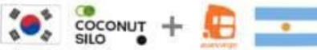

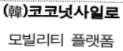

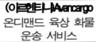

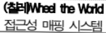

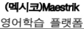

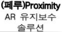

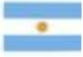

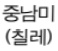

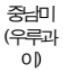

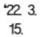

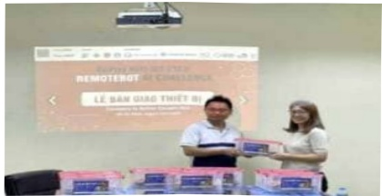

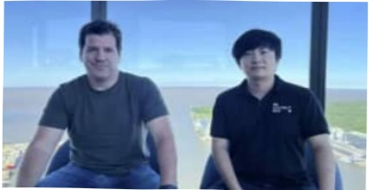

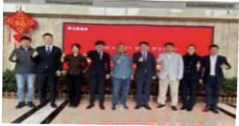

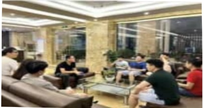

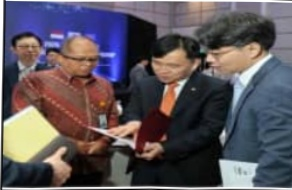

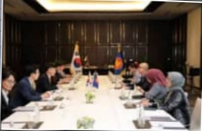

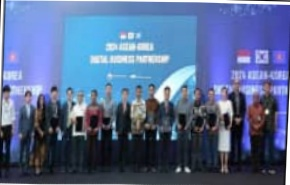

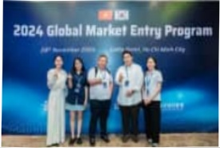

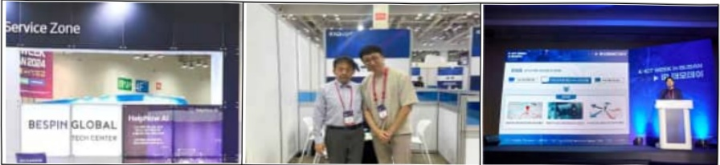

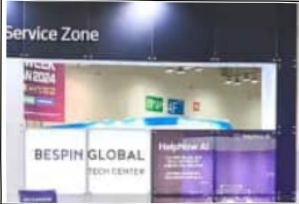

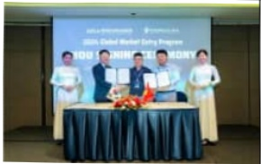

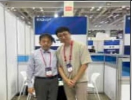

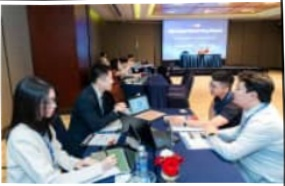

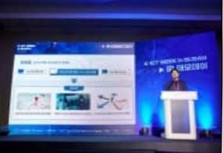

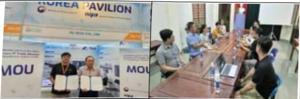

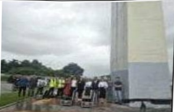

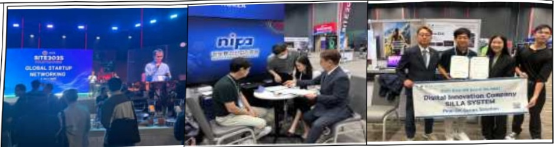

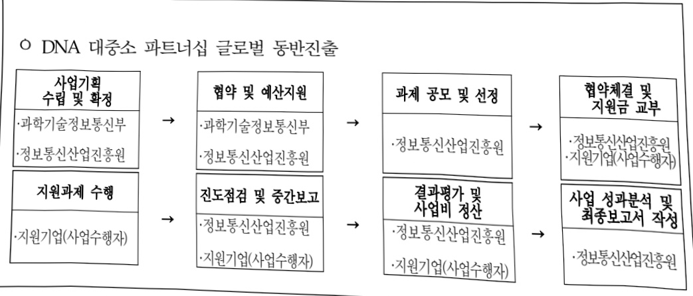

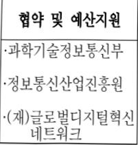

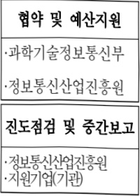

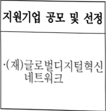

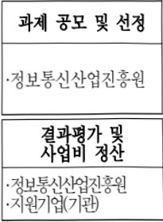

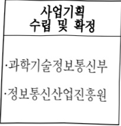

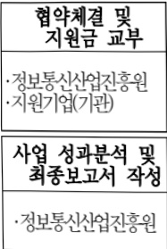

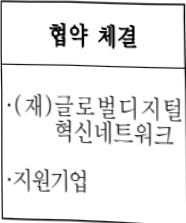

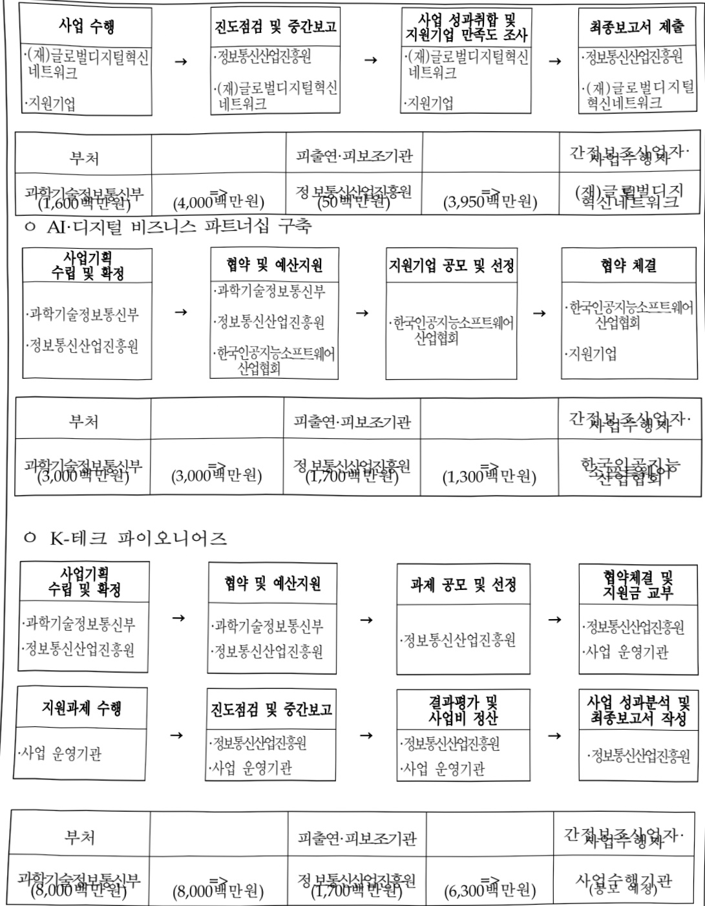

