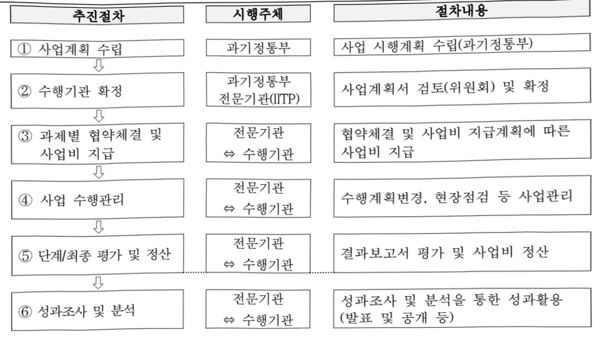

# 의료 AI 반도체 전문인력 양성센터 구축

**해당 페이지**: PDF 1258 ~ 1265 쪽 해당

**부처**: 과학기술정보통신부
**분야**: 통신
**회계유형**: 지역균형발전 특별회계
**2026 확정예산**: 4078.0 백만원
**전년대비 증감률**: 39.5%
**AI 도메인**: AI반도체, 의료/바이오, 교육/인재

---

<table border=1 style='margin: auto; word-wrap: break-word;'><tr><td style='text-align: center; word-wrap: break-word;'>사 업 명</td></tr><tr><td style='text-align: center; word-wrap: break-word;'>(25) 의료 AI반도체 전문인력 양성센터 구축 (2137-302)</td></tr></table>

사업 코드 정보

<table border=1 style='margin: auto; word-wrap: break-word;'><tr><td style='text-align: center; word-wrap: break-word;'>구분</td><td style='text-align: center; word-wrap: break-word;'>회계</td><td style='text-align: center; word-wrap: break-word;'>소관</td><td style='text-align: center; word-wrap: break-word;'>실국(기관)</td><td style='text-align: center; word-wrap: break-word;'>계정</td><td style='text-align: center; word-wrap: break-word;'>분야</td><td style='text-align: center; word-wrap: break-word;'>부문</td></tr><tr><td style='text-align: center; word-wrap: break-word;'>코드</td><td style='text-align: center; word-wrap: break-word;'>지역균형발전</td><td style='text-align: center; word-wrap: break-word;'>과학기술</td><td style='text-align: center; word-wrap: break-word;'>정보통신</td><td style='text-align: center; word-wrap: break-word;'>[2]</td><td style='text-align: center; word-wrap: break-word;'>130</td><td style='text-align: center; word-wrap: break-word;'>133</td></tr><tr><td style='text-align: center; word-wrap: break-word;'>명칭</td><td style='text-align: center; word-wrap: break-word;'>특별회계</td><td style='text-align: center; word-wrap: break-word;'>정보통신부</td><td style='text-align: center; word-wrap: break-word;'>산업정책관</td><td style='text-align: center; word-wrap: break-word;'>지역지원</td><td style='text-align: center; word-wrap: break-word;'>통신</td><td style='text-align: center; word-wrap: break-word;'>정보통신</td></tr></table>

<table border=1 style='margin: auto; word-wrap: break-word;'><tr><td style='text-align: center; word-wrap: break-word;'>구분</td><td style='text-align: center; word-wrap: break-word;'>프로그램</td><td style='text-align: center; word-wrap: break-word;'>단위사업</td><td style='text-align: center; word-wrap: break-word;'>세부사업</td></tr><tr><td style='text-align: center; word-wrap: break-word;'>코드</td><td style='text-align: center; word-wrap: break-word;'>2100</td><td style='text-align: center; word-wrap: break-word;'>2137</td><td style='text-align: center; word-wrap: break-word;'>302</td></tr><tr><td style='text-align: center; word-wrap: break-word;'>명칭</td><td style='text-align: center; word-wrap: break-word;'>정보통신융합산업</td><td style='text-align: center; word-wrap: break-word;'>ICT산업기반확충(지특)</td><td style='text-align: center; word-wrap: break-word;'>의료 AI반도체 전문인력 양성센터 구축</td></tr></table>

□ 사업 성격 (공통요구자료 Ⅱ-1 작성유의사항 4. 참조, 해당하는 사항에 “○” 표시)

<table border=1 style='margin: auto; word-wrap: break-word;'><tr><td rowspan="2">신규</td><td rowspan="2">계속</td><td rowspan="2">완료</td><td rowspan="2">예비타당성 실시여부</td><td rowspan="2">총사업비 관리대상</td><td rowspan="2">총액계상 예산사업</td><td style='text-align: center; word-wrap: break-word;'>사업소관 변경정보</td></tr><tr><td style='text-align: center; word-wrap: break-word;'>2025예산 시 소관</td></tr><tr><td style='text-align: center; word-wrap: break-word;'></td><td style='text-align: center; word-wrap: break-word;'>○</td><td style='text-align: center; word-wrap: break-word;'></td><td style='text-align: center; word-wrap: break-word;'></td><td style='text-align: center; word-wrap: break-word;'></td><td style='text-align: center; word-wrap: break-word;'></td><td style='text-align: center; word-wrap: break-word;'></td></tr></table>

□ 사업 지원 형태 및 지원을 (최소한 한 개는 반드시 선택하시오. 해당사항에 0 표시)

<table border=1 style='margin: auto; word-wrap: break-word;'><tr><td style='text-align: center; word-wrap: break-word;'>직접</td><td style='text-align: center; word-wrap: break-word;'>출자</td><td style='text-align: center; word-wrap: break-word;'>출연</td><td style='text-align: center; word-wrap: break-word;'>보조</td><td style='text-align: center; word-wrap: break-word;'>융자</td><td style='text-align: center; word-wrap: break-word;'>국고보조율(%)</td><td style='text-align: center; word-wrap: break-word;'>융자율(%)</td></tr><tr><td style='text-align: center; word-wrap: break-word;'></td><td style='text-align: center; word-wrap: break-word;'></td><td style='text-align: center; word-wrap: break-word;'>○</td><td style='text-align: center; word-wrap: break-word;'></td><td style='text-align: center; word-wrap: break-word;'></td><td style='text-align: center; word-wrap: break-word;'></td><td style='text-align: center; word-wrap: break-word;'></td></tr></table>

□사업 소관부처 및 시행주체

<table border=1 style='margin: auto; word-wrap: break-word;'><tr><td style='text-align: center; word-wrap: break-word;'>사업명</td><td colspan="2">구분</td></tr><tr><td rowspan="3">의료 AI반도체 전문인력 양성센터 구축</td><td rowspan="2">소관부처</td><td style='text-align: center; word-wrap: break-word;'>정보통신정책실 정보통신산업정책관</td></tr><tr><td style='text-align: center; word-wrap: break-word;'>정보통신산업기반과</td></tr><tr><td style='text-align: center; word-wrap: break-word;'>사업시행주체</td><td style='text-align: center; word-wrap: break-word;'>정보통신기획평가원</td></tr></table>

---

### 가.예산 총괄표

(단위: 백만원, %)

<table border=1 style='margin: auto; word-wrap: break-word;'><tr><td rowspan="2">사업명</td><td rowspan="2">2024년 결산</td><td colspan="2">2025년 예산</td><td colspan="2">2026년 예산</td><td rowspan="2">증감(B-A)</td><td rowspan="2">(B-A)/A</td></tr><tr><td style='text-align: center; word-wrap: break-word;'>본예산</td><td style='text-align: center; word-wrap: break-word;'>추경*(A)</td><td style='text-align: center; word-wrap: break-word;'>요구안</td><td style='text-align: center; word-wrap: break-word;'>본예산(B)</td></tr><tr><td style='text-align: center; word-wrap: break-word;'>의료 AI반도체 전문인력 양성센터 구축</td><td style='text-align: center; word-wrap: break-word;'>3,000</td><td style='text-align: center; word-wrap: break-word;'>2,922</td><td style='text-align: center; word-wrap: break-word;'>2,922</td><td style='text-align: center; word-wrap: break-word;'>2,922</td><td style='text-align: center; word-wrap: break-word;'>4,078</td><td style='text-align: center; word-wrap: break-word;'>1,156</td><td style='text-align: center; word-wrap: break-word;'>39.5</td></tr></table>

*추경: 추경증감액을 포함한 최종 예산액을 기재

## □ 기능별(내역사업별) 예산 내역

(단위:백만원)

<table border=1 style='margin: auto; word-wrap: break-word;'><tr><td rowspan="2"></td><td colspan="5">2024</td><td colspan="5">2025</td><td rowspan="2">2026예산</td></tr><tr><td style='text-align: center; word-wrap: break-word;'>예산액(추경)</td><td style='text-align: center; word-wrap: break-word;'>예산현액</td><td style='text-align: center; word-wrap: break-word;'>집행액</td><td style='text-align: center; word-wrap: break-word;'>이월액</td><td style='text-align: center; word-wrap: break-word;'>불용액</td><td style='text-align: center; word-wrap: break-word;'>예산액(추경)</td><td style='text-align: center; word-wrap: break-word;'>예산현액</td><td style='text-align: center; word-wrap: break-word;'>집행액</td><td style='text-align: center; word-wrap: break-word;'>이월액</td><td style='text-align: center; word-wrap: break-word;'>불용액</td></tr><tr><td style='text-align: center; word-wrap: break-word;'>○ 기능별 분류(합계)</td><td style='text-align: center; word-wrap: break-word;'>3,000</td><td style='text-align: center; word-wrap: break-word;'>3,000</td><td style='text-align: center; word-wrap: break-word;'>3,000</td><td style='text-align: center; word-wrap: break-word;'>-</td><td style='text-align: center; word-wrap: break-word;'>-</td><td style='text-align: center; word-wrap: break-word;'>2,922</td><td style='text-align: center; word-wrap: break-word;'>2,922</td><td style='text-align: center; word-wrap: break-word;'>2,922</td><td style='text-align: center; word-wrap: break-word;'>-</td><td style='text-align: center; word-wrap: break-word;'>-</td><td style='text-align: center; word-wrap: break-word;'>4,078</td></tr><tr><td style='text-align: center; word-wrap: break-word;'>· 의료 AI반도체 전후방엔지니어 육성</td><td style='text-align: center; word-wrap: break-word;'>1,300</td><td style='text-align: center; word-wrap: break-word;'>1,300</td><td style='text-align: center; word-wrap: break-word;'>1,300</td><td style='text-align: center; word-wrap: break-word;'></td><td style='text-align: center; word-wrap: break-word;'></td><td style='text-align: center; word-wrap: break-word;'>1,022</td><td style='text-align: center; word-wrap: break-word;'>1,022</td><td style='text-align: center; word-wrap: break-word;'>1,022</td><td style='text-align: center; word-wrap: break-word;'>-</td><td style='text-align: center; word-wrap: break-word;'>-</td><td style='text-align: center; word-wrap: break-word;'>1,703</td></tr><tr><td style='text-align: center; word-wrap: break-word;'>· 의료 AI반도체 교육·연구 플랫폼 구축</td><td style='text-align: center; word-wrap: break-word;'>1,700</td><td style='text-align: center; word-wrap: break-word;'>1,700</td><td style='text-align: center; word-wrap: break-word;'>1,700</td><td style='text-align: center; word-wrap: break-word;'></td><td style='text-align: center; word-wrap: break-word;'></td><td style='text-align: center; word-wrap: break-word;'>1,900</td><td style='text-align: center; word-wrap: break-word;'>1,900</td><td style='text-align: center; word-wrap: break-word;'>1,900</td><td style='text-align: center; word-wrap: break-word;'>-</td><td style='text-align: center; word-wrap: break-word;'>-</td><td style='text-align: center; word-wrap: break-word;'>2,375</td></tr><tr><td style='text-align: center; word-wrap: break-word;'>○ 비목별 분류(합계)</td><td style='text-align: center; word-wrap: break-word;'>3,000</td><td style='text-align: center; word-wrap: break-word;'>3,000</td><td style='text-align: center; word-wrap: break-word;'>3,000</td><td style='text-align: center; word-wrap: break-word;'>-</td><td style='text-align: center; word-wrap: break-word;'>-</td><td style='text-align: center; word-wrap: break-word;'>2,922</td><td style='text-align: center; word-wrap: break-word;'>2,922</td><td style='text-align: center; word-wrap: break-word;'>2,922</td><td style='text-align: center; word-wrap: break-word;'>-</td><td style='text-align: center; word-wrap: break-word;'>-</td><td style='text-align: center; word-wrap: break-word;'>4,078</td></tr><tr><td style='text-align: center; word-wrap: break-word;'>· 사업출연금(350-02)</td><td style='text-align: center; word-wrap: break-word;'>3,000</td><td style='text-align: center; word-wrap: break-word;'>3,000</td><td style='text-align: center; word-wrap: break-word;'>3,000</td><td style='text-align: center; word-wrap: break-word;'>-</td><td style='text-align: center; word-wrap: break-word;'>-</td><td style='text-align: center; word-wrap: break-word;'>2,922</td><td style='text-align: center; word-wrap: break-word;'>2,922</td><td style='text-align: center; word-wrap: break-word;'>2,922</td><td style='text-align: center; word-wrap: break-word;'>-</td><td style='text-align: center; word-wrap: break-word;'>-</td><td style='text-align: center; word-wrap: break-word;'>4,078</td></tr><tr><td style='text-align: center; word-wrap: break-word;'>○ 기능·비목별 분류(합계)</td><td style='text-align: center; word-wrap: break-word;'>3,000</td><td style='text-align: center; word-wrap: break-word;'>3,000</td><td style='text-align: center; word-wrap: break-word;'>3,000</td><td style='text-align: center; word-wrap: break-word;'>-</td><td style='text-align: center; word-wrap: break-word;'>-</td><td style='text-align: center; word-wrap: break-word;'>2,922</td><td style='text-align: center; word-wrap: break-word;'>2,922</td><td style='text-align: center; word-wrap: break-word;'>2,922</td><td style='text-align: center; word-wrap: break-word;'>-</td><td style='text-align: center; word-wrap: break-word;'>-</td><td style='text-align: center; word-wrap: break-word;'>4,078</td></tr><tr><td style='text-align: center; word-wrap: break-word;'>· 의료 AI반도체 전후방엔지니어 육성</td><td style='text-align: center; word-wrap: break-word;'>1,300</td><td style='text-align: center; word-wrap: break-word;'>1,300</td><td style='text-align: center; word-wrap: break-word;'>1,300</td><td style='text-align: center; word-wrap: break-word;'>-</td><td style='text-align: center; word-wrap: break-word;'>-</td><td style='text-align: center; word-wrap: break-word;'>1,022</td><td style='text-align: center; word-wrap: break-word;'>1,022</td><td style='text-align: center; word-wrap: break-word;'>1,022</td><td style='text-align: center; word-wrap: break-word;'>-</td><td style='text-align: center; word-wrap: break-word;'>-</td><td style='text-align: center; word-wrap: break-word;'>1,703</td></tr><tr><td style='text-align: center; word-wrap: break-word;'>· 사업출연금(350-02)</td><td style='text-align: center; word-wrap: break-word;'>1,300</td><td style='text-align: center; word-wrap: break-word;'>1,300</td><td style='text-align: center; word-wrap: break-word;'>1,300</td><td style='text-align: center; word-wrap: break-word;'></td><td style='text-align: center; word-wrap: break-word;'></td><td style='text-align: center; word-wrap: break-word;'>1,022</td><td style='text-align: center; word-wrap: break-word;'>1,022</td><td style='text-align: center; word-wrap: break-word;'>1,022</td><td style='text-align: center; word-wrap: break-word;'>-</td><td style='text-align: center; word-wrap: break-word;'>-</td><td style='text-align: center; word-wrap: break-word;'>1,703</td></tr><tr><td style='text-align: center; word-wrap: break-word;'>· 의료 AI반도체 교육·연구 플랫폼 구축</td><td style='text-align: center; word-wrap: break-word;'>1,700</td><td style='text-align: center; word-wrap: break-word;'>1,700</td><td style='text-align: center; word-wrap: break-word;'>1,700</td><td style='text-align: center; word-wrap: break-word;'>-</td><td style='text-align: center; word-wrap: break-word;'>-</td><td style='text-align: center; word-wrap: break-word;'>1,900</td><td style='text-align: center; word-wrap: break-word;'>1,900</td><td style='text-align: center; word-wrap: break-word;'>1,900</td><td style='text-align: center; word-wrap: break-word;'>-</td><td style='text-align: center; word-wrap: break-word;'>-</td><td style='text-align: center; word-wrap: break-word;'>2,375</td></tr><tr><td style='text-align: center; word-wrap: break-word;'>· 사업출연금(350-02)</td><td style='text-align: center; word-wrap: break-word;'>1,700</td><td style='text-align: center; word-wrap: break-word;'>1,700</td><td style='text-align: center; word-wrap: break-word;'>1,700</td><td style='text-align: center; word-wrap: break-word;'></td><td style='text-align: center; word-wrap: break-word;'></td><td style='text-align: center; word-wrap: break-word;'>1,900</td><td style='text-align: center; word-wrap: break-word;'>1,900</td><td style='text-align: center; word-wrap: break-word;'>1,900</td><td style='text-align: center; word-wrap: break-word;'>-</td><td style='text-align: center; word-wrap: break-word;'>-</td><td style='text-align: center; word-wrap: break-word;'>2,375</td></tr></table>

### 나.사업설명자료

## 1 ) 사업목적·내용

- (의료 AI반도체 전문인력 양성센터 구축사업) 강원지역 내 지능형 의료기기산업 생태계

조성 및 AI·반도체·데이터 등 국가전략기술 산업 맞춤형 핵심인력 양성

(의료 AI반도체 전후방 엔지니어 육성) 맞춤형 교육과정 개발 및 운영, 산학연 공동협업 프로젝트 운영, 취·창업 지원 등을 통한 의료 AI반도체 전·후방 엔지니어 육성

---

(의료 AI반도체 교육 연구 플랫폼 구축) 의료 AI반도체 관련 교육·연구 지원 및

의료 AI반도체 분야 관련 기업의 플랫폼 활용·개발 지원 등을 위한 의료 AI반도체

교육·연구용 인프라 구축

## 2 ) 사업개요

## ☐ 사업근거 및 추진경위

① 법령상 근거 조항 적시

0 정보통신진흥 및 융합활성화 등에 관한 특별법 제11조(국내 전문인력 양성)

제11조(국내 전문인력의 양성) ① 과학기술정보통신부장관은 정보통신 분야의 전문적인 기술, 지식 등을 가진 인력(이하 “전문인력“이라 한다)의 육성에 관한 시책을 수립 · 추진하여야 하며, 특히 소프트웨어 교육의 저변 확대 및 지역산업의 발전을 위한 소프트웨어 특화교육 활성화를 위하여 노력하여야 한다.

② 제1항에 따른 시책에는 다음 각 호의 사항이 포함되어야 한다.

1. 전문인력의 육성 및 교육훈련에 관한 사항

2. 전문인력의 수급 및 활용에 관한 사항

3. 전문인력의 경력관리 지원 등에 관한 사항

4. 그 밖에 전문인력의 육성 및 관리 등을 위한 사항

o 정보통신산업진흥법 제16조(전문인력 양성)

제16조(전문인력의 양성) 과학기술정보통신부장관은 정보통신산업의 진흥에 필요한 전문인력을 양성하기 위하여 다음 각 호의 시책을 마련하여야 한다.

1. 전문인력의 수요 실태 파악 및 중·장기 수급 전망 수립

2. 전문인력 양성기관의 설립 · 지원

3. 전문인력 양성 교육프로그램의 개발 및 보급 지원

4. 정보통신기술 관련 자격제도의 정착 및 전문인력 수급 지원

5. 각급 학교 및 그 밖의 교육기관에서 시행하는 정보통신기술 및 정보통신산업 관련 교육의 지원

6. 그 밖에 전문인력 양성에 필요한 사항

o 국가첨단전략산업 경쟁력 강화 및 보호에 관한 특별조치법 제35조(전문인력양성)

제35조(전문인력양성) ① 정부는 전략산업등의 원활한 인력 수급을 위하여 산업계 · 대학 · 연구기관 등과 연계하여 다음 각 호의 사업을 추진할 수 있다.

1. 산업체 수요와 연계된 계약학과 및 이공계학과, 「초·중등교육법」 제2조제3호에 따른 고등학교 중대통령령으로 정하는 고등학교 등 교육기관을 통한 인력양성사업

2. 제1호에 따른 교육기관 외의 전문인력양성기관을 통한 인력양성사업

3. 전문인력의 양성에 필요한 연구시설·장비 및 전문교원 확충

4.「수도권정비계획법」제2조제1호에 따른 수도권 외의 지역에 대한 거점구축형 인력양성사업

5. 그 밖에 대통령령으로 정하는 인력양성사업

② 정부는 제1항에 따른 전문인력양성사업과 연계하여 전략산업 등의 전문인력 확대 및 선순환 생태계 구축을 위하여 다음 각 호에 대한 행정적 · 재정적 지원을 할 수 있다.

1. 전략기술 관련 정부 기술개발사업 또는 인력양성프로그램에 참여하였거나 제36조부터 제38조까지의 인력양성기관에서 교육과정을 거친 기술인력에 대한 취업 지원

2. 제1호의 기술인력 또는 제14조제2항에 따라 지정된 전문인력 등에 대한 기술개발사업 우선 지원

3. 제36조부터 제38조까지의 인력양성기관에서 전략기술 관련 교육·실습을 하는 경우 전문인력등의 활용방안 마련

4. 전략산업 등 관련 대학의 학생 정원 조정

---

0 지방자치분권 및 지역군형발전에 관한 특별법 제14조(지역 산업 육성 및 일자리 창출 등 지역경제 활성화 촉진)

제14조(지역 산업 육성 및 일자리 창출 등 지역경제 활성화 촉진) ① 시·도지사는 관계 중앙행정기관의 장 및 관할 구역의 시·군·구의 시장·군수(광역시의 군수를 포함한다. 이하 같다) · 구청장(자치구의 구청장을 말한다. 이하 같다)과 협의하여 해당 시·도의 지역특화산업을 선정할 수 있다. 이 경우 다음 각 호의 사항을 종합적으로 고려하여야 한다.

1. 국가의 성장잠재력과 경제성장에 대한 기여도

2. 지역일자리 창출 및 경쟁력 강화에 미치는 영향

3. 지역의 발전역량을 강화시킬 수 있는 가능성

② 초광역권설정 지방자치단체의 장은 초광역권설정 지방자치단체를 구성하는 지방자치단체의 장 및 관계 중앙행정기관의 장과 협의하여 해당 초광역권의 초광역권산업을 선정할 수 있다. 이 경우 제1항 각 호의 사항을 종합적으로 고려하여야 한다.

③ 국가와 지방자치단체는 지역특화산업과 초광역권산업을 육성하기 위하여 해당 산업의 구조 고도화와 투자 유치 촉진, 집적(集積) 및 기반 확충 등에 관한 시책을 추진하여야 한다.

④ 국가와 지방자치단체는 지역 산업의 육성과 지역경제의 활성화를 위하여 지역의 일자리 창출과 투자 유치활동 지원, 정보통신 진흥 및 지역 특성에 맞는 중소기업의 창업 여건 개선 등에 관한 시책을 추진하여야 한다.

⑤ 제3항에 따른 지역특화산업 · 초광역권산업 및 제4항에 따른 지역 산업의 육성과 지역경제 활성화 촉진을 위한 시책의 추진 및 추진절차에 관하여 필요한 사항은 대통령령으로 정한다.

② 추진경위

°22. 7월 : 반도체 관련 인재양성 방안(관계부처 합동)

o '22. 8월 : 디지털 인재양성 종합방안(관계부처 합동)

°22.9월 : 대한민국 디지털 전략(관계부처 합동)

o '22.12월 : 신성장 4.0 전략(관계부처 합동)

- 분야 2. 완일상 : 내 삶 속의 디지털(의료 AI · SW 적용 · 확산)

- 분야 3. 新시장 : 초격차 확보(반도체 등 전략산업 글로벌 1위 초격차 확보)

o '23.12월 : 제4차 융합연구 활성화 기본계획

°23.11월 : 제1차 지방시대 종합계획

o '24. 1월 : 의료 AI반도체 전문인력 양성센터 구축 사업 추진계획 수립

°24.4:2024년 지방시대 시행계획

o '24. 4월 : AI-반도체 이니셔티브(관계부처 합동)

- 중점 추진과제 2. AI-반도체 산업을 이끌 혁신인재 양성

°25.9월 : 이재명 정부 123대 국정과제

- 국정22. 초격차 AI 선도기술인재확보, 국정55. 지역교육 혁신을 통한 지역인재 양성 등

---

## □ 주요내용

① 사업규모

- 총사업비 : 219억 원(국 100, 지 100, 민 19)

- 사업기간 : 2024년 ~ 2028년(5년)

- 최근 5년 간 투입된 사업비(예산액기준, 추경편성한 연도에는 추경포함)

<table border=1 style='margin: auto; word-wrap: break-word;'><tr><td style='text-align: center; word-wrap: break-word;'>연도</td><td style='text-align: center; word-wrap: break-word;'>2022</td><td style='text-align: center; word-wrap: break-word;'>2023</td><td style='text-align: center; word-wrap: break-word;'>2024</td><td style='text-align: center; word-wrap: break-word;'>2025</td><td style='text-align: center; word-wrap: break-word;'>2026</td></tr><tr><td style='text-align: center; word-wrap: break-word;'>국비(억원)</td><td style='text-align: center; word-wrap: break-word;'>-</td><td style='text-align: center; word-wrap: break-word;'>-</td><td style='text-align: center; word-wrap: break-word;'>30</td><td style='text-align: center; word-wrap: break-word;'>29.22</td><td style='text-align: center; word-wrap: break-word;'>40.78</td></tr></table>

- 기타 : 인력양성 및 관련 인프라 구축

② 사업추진체계

- 사업시행방법 : 출연

- 사업시행주체 : 정보통신기획평가원

- 사업 수혜자 : 연세대학교 미래캠퍼스 미래산학협력단

(의료 AI반도체 분야 산·학·연, 대학생, 예비창업자 및 구직자·재직자 등)

- 보조, 융자, 출연, 출자 등의 경우 보조 · 융자 등 지원 비율 및 법적근거

<table border=1 style='margin: auto; word-wrap: break-word;'><tr><td style='text-align: center; word-wrap: break-word;'>내역사업명</td><td style='text-align: center; word-wrap: break-word;'>구분</td><td style='text-align: center; word-wrap: break-word;'>피보조·피출연 등 기관명</td><td style='text-align: center; word-wrap: break-word;'>지원 금액 (2026예산)</td><td style='text-align: center; word-wrap: break-word;'>지원 비율(%)</td><td style='text-align: center; word-wrap: break-word;'>보조율 법적근거 (해당 조항)</td></tr><tr><td style='text-align: center; word-wrap: break-word;'>의료 AI반도체 전·후방 엔지니어 육성</td><td style='text-align: center; word-wrap: break-word;'>출연</td><td style='text-align: center; word-wrap: break-word;'>정보통신 기획평가원</td><td style='text-align: center; word-wrap: break-word;'>1,703 백만원</td><td style='text-align: center; word-wrap: break-word;'>100%</td><td rowspan="2">○ 정보통신진흥 및 융합활성화 등에 관한 특별법 제11조 ○ 정보통신산업진흥법 제16조 ○ 국가첨단전략산업 경쟁력 강화 및 보호에 관한 특별조치법 제35조 ○ 지방자치분권 및 지역균형발전에 관한 특별법 제14조 ○ 정보통신진흥 및 융합활성화 등에 관한 특별법 제11조 ○ 정보통신산업진흥법 제16조 ○ 국가첨단전략산업 경쟁력 강화 및 보호에 관한 특별조치법 제35조</td></tr><tr><td style='text-align: center; word-wrap: break-word;'>의료 AI반도체 교육·연구 플랫폼 구축</td><td style='text-align: center; word-wrap: break-word;'>출연</td><td style='text-align: center; word-wrap: break-word;'>정보통신 기획평가원</td><td style='text-align: center; word-wrap: break-word;'>2,375 백만원</td><td style='text-align: center; word-wrap: break-word;'>100%</td></tr></table>

## 3 ) 2026년도 예산안 산출 근거

① 의료 AI반도체 전 · 후방 엔지니어 육성 : (2025년 본예산) 1,022백만원 → (2026 예산안) 1,703백만원, 681백만원 증액

- (요구) 맞춤형 교육과정 개발 및 운영, 산학연 프로젝트 운영, 취·창업 지원 등 전년 대비 지원범위 및 물량 확대

- (산출) 1,703백만원(3년차 사업비)×1개 과제

② 의료 AI 반도체 교육 · 연구 플랫폼 구축 : (2025년 본예산) 1,900백만원 → ('2026 예산안) 2,375백만원, 475백만원 증액 - (요구) 의료 AI 솔루션 및 반도체 교육센터 구축운영, 플랫폼 기반 교육 및 장비 활용기업 지원 등 전년 대비 물량 확대 - (산출) 2,375백만원(3년차 사업비)×1개 과제

---

## 4 ) 사업효과

☐ 사업영향, 산출물 성과지표 등

① 2022~2026년도 성과계획서 상 성과지표 및 최근 5년간 성과 달성도

<table border=1 style='margin: auto; word-wrap: break-word;'><tr><td style='text-align: center; word-wrap: break-word;'>성과지표</td><td style='text-align: center; word-wrap: break-word;'>구분</td><td style='text-align: center; word-wrap: break-word;'>2022</td><td style='text-align: center; word-wrap: break-word;'>2023</td><td style='text-align: center; word-wrap: break-word;'>2024</td><td style='text-align: center; word-wrap: break-word;'>2025</td><td style='text-align: center; word-wrap: break-word;'>2026</td><td style='text-align: center; word-wrap: break-word;'>2026 목표치산출근거</td><td style='text-align: center; word-wrap: break-word;'>측정산시(또는 측정방법)</td><td style='text-align: center; word-wrap: break-word;'>자료수집방법(또는 자료출처)</td></tr><tr><td rowspan="3">양성인원(단위:명)</td><td style='text-align: center; word-wrap: break-word;'>목표</td><td style='text-align: center; word-wrap: break-word;'>-</td><td style='text-align: center; word-wrap: break-word;'>-</td><td style='text-align: center; word-wrap: break-word;'>40</td><td style='text-align: center; word-wrap: break-word;'>165</td><td style='text-align: center; word-wrap: break-word;'>205</td><td rowspan="2">AI반도체학부 및 융합과정 운영, 재차 취협대책</td><td rowspan="3">당해연도 의료 AI반도체 관련 교육 수혜 인원</td><td rowspan="3">사업결과 보고서 또는 조사서</td></tr><tr><td style='text-align: center; word-wrap: break-word;'>실적</td><td style='text-align: center; word-wrap: break-word;'>-</td><td style='text-align: center; word-wrap: break-word;'>-</td><td style='text-align: center; word-wrap: break-word;'>85</td><td style='text-align: center; word-wrap: break-word;'>-</td><td style='text-align: center; word-wrap: break-word;'>-</td></tr><tr><td style='text-align: center; word-wrap: break-word;'>달성도</td><td style='text-align: center; word-wrap: break-word;'>-</td><td style='text-align: center; word-wrap: break-word;'>-</td><td style='text-align: center; word-wrap: break-word;'>212.5</td><td style='text-align: center; word-wrap: break-word;'>-</td><td style='text-align: center; word-wrap: break-word;'>-</td><td style='text-align: center; word-wrap: break-word;'>추체치설정</td></tr><tr><td rowspan="3">장비활용(단위:건)</td><td style='text-align: center; word-wrap: break-word;'>목표</td><td style='text-align: center; word-wrap: break-word;'>-</td><td style='text-align: center; word-wrap: break-word;'>-</td><td style='text-align: center; word-wrap: break-word;'>2</td><td style='text-align: center; word-wrap: break-word;'>-</td><td style='text-align: center; word-wrap: break-word;'>-</td><td rowspan="3">지역내(강원도, 원주시) 의료 AI 관련 업체수를 바탕으로 장비 활용 추세치 설정</td><td rowspan="3">교육센터 장비 활용 건수</td><td rowspan="3">사업결과 보고서 또는 조사서</td></tr><tr><td style='text-align: center; word-wrap: break-word;'>실적</td><td style='text-align: center; word-wrap: break-word;'>-</td><td style='text-align: center; word-wrap: break-word;'>-</td><td style='text-align: center; word-wrap: break-word;'>2</td><td style='text-align: center; word-wrap: break-word;'>-</td><td style='text-align: center; word-wrap: break-word;'>-</td></tr><tr><td style='text-align: center; word-wrap: break-word;'>달성도</td><td style='text-align: center; word-wrap: break-word;'>-</td><td style='text-align: center; word-wrap: break-word;'>-</td><td style='text-align: center; word-wrap: break-word;'>100</td><td style='text-align: center; word-wrap: break-word;'>-</td><td style='text-align: center; word-wrap: break-word;'>-</td></tr><tr><td rowspan="3">장비활용 만족도(단위:점)</td><td style='text-align: center; word-wrap: break-word;'>목표</td><td style='text-align: center; word-wrap: break-word;'>-</td><td style='text-align: center; word-wrap: break-word;'>-</td><td style='text-align: center; word-wrap: break-word;'>-</td><td style='text-align: center; word-wrap: break-word;'>80</td><td style='text-align: center; word-wrap: break-word;'>85</td><td rowspan="3">&#x27;24년 신규로&#x27;25년 80%에서 연차별 상향 조정하여 최종 연도&#x27;28년 90% 수준으로 설정</td><td rowspan="3">교육센터 장비활용 기관지 대상 장비 활용의 전반적인 (상능, 기간 사용성 등) 만족도 조사</td><td rowspan="3">사업결과 보고서 또는 조사서</td></tr><tr><td style='text-align: center; word-wrap: break-word;'>실적</td><td style='text-align: center; word-wrap: break-word;'>-</td><td style='text-align: center; word-wrap: break-word;'>-</td><td style='text-align: center; word-wrap: break-word;'>-</td><td style='text-align: center; word-wrap: break-word;'>-</td><td style='text-align: center; word-wrap: break-word;'>-</td></tr><tr><td style='text-align: center; word-wrap: break-word;'>달성도</td><td style='text-align: center; word-wrap: break-word;'>-</td><td style='text-align: center; word-wrap: break-word;'>-</td><td style='text-align: center; word-wrap: break-word;'>-</td><td style='text-align: center; word-wrap: break-word;'>-</td><td style='text-align: center; word-wrap: break-word;'>-</td></tr></table>

※ (24년) 장비활용(건) → (25년) 장비활용 만족도(점) 변경

② 성과지표 이외의 연도별 사업추진 경과 및 실적

<table border=1 style='margin: auto; word-wrap: break-word;'><tr><td style='text-align: center; word-wrap: break-word;'>2022</td><td style='text-align: center; word-wrap: break-word;'>-</td></tr><tr><td style='text-align: center; word-wrap: break-word;'>2023</td><td style='text-align: center; word-wrap: break-word;'>-</td></tr><tr><td style='text-align: center; word-wrap: break-word;'>2024</td><td style='text-align: center; word-wrap: break-word;'>- 신규사업 추진 / 내역사업별 총 2개 과제 신규 협약체결 - 재직자 과정 운영(85명 양성), 취업지원(254명), 창업지원(10건), 장비구축(36종) 등</td></tr><tr><td style='text-align: center; word-wrap: break-word;'>2025</td><td style='text-align: center; word-wrap: break-word;'>- 맞춤형 교육개발 및 운영(3개 트랙운영), 교재개발(23과목), 산학협력 프로젝트(14개 추진), 취·창업 지원(경진대회, 컨퍼런스 등) - AI 솔루션 및 AI반도체 센터 구축 및 운영, 장비 활용 기업지원(컨설팅, 세미나, 자문 등), 국내·외 네트워크 구축 등</td></tr></table>

③향후(2026년도 이후)기대효과

- (지역산업 혁신) 지역 특화산업인 의료기기 산업 첨단화·고부가가치화 및 관련 분야 스타트업 양성으로 지역산업 생태계 조성

- (AI·반도체 경쟁력 확보) 의료기기 고도화를 위한 의료 AI반도체 전·후방 전문인력

양성을 통해 국가전략기술 초격차 기술 확보에 기여

---

5) 타당성조사 및 예비타당성조사 시행여부 및 결과 요지 : 해당없음

6) 총사업비 대상사업 여부 및 내역 : 해당없음

## 7 ) 사업 집행절차

- 의료 AI 반도체 전·후방 엔지니어 육성

<table border=1 style='margin: auto; word-wrap: break-word;'><tr><td style='text-align: center; word-wrap: break-word;'>부처</td><td style='text-align: center; word-wrap: break-word;'></td><td style='text-align: center; word-wrap: break-word;'>피출연·피보조기관</td><td style='text-align: center; word-wrap: break-word;'></td><td style='text-align: center; word-wrap: break-word;'>간접보조사업자·사업수행자</td></tr><tr><td style='text-align: center; word-wrap: break-word;'>과학기술정보통신(1,703백만원)</td><td style='text-align: center; word-wrap: break-word;'>=&gt;(1,703백만원)</td><td style='text-align: center; word-wrap: break-word;'>정보통신기획평가원(65백만원)</td><td style='text-align: center; word-wrap: break-word;'>=&gt;(1,638백만원)</td><td style='text-align: center; word-wrap: break-word;'>연세대학교미래산학협력단</td></tr><tr><td colspan="5">- 의료 AI 반도체 교육·연구 플랫폼 구축</td></tr><tr><td style='text-align: center; word-wrap: break-word;'>부처</td><td style='text-align: center; word-wrap: break-word;'></td><td style='text-align: center; word-wrap: break-word;'>피출연·피보조기관</td><td style='text-align: center; word-wrap: break-word;'></td><td style='text-align: center; word-wrap: break-word;'>간접보조사업자·사업수행자</td></tr><tr><td style='text-align: center; word-wrap: break-word;'>과학기술정보통신(2,375백만원)</td><td style='text-align: center; word-wrap: break-word;'>=&gt;(2,375백만원)</td><td style='text-align: center; word-wrap: break-word;'>정보통신기획평가원(90백만원)</td><td style='text-align: center; word-wrap: break-word;'>=&gt;(2,285백만원)</td><td style='text-align: center; word-wrap: break-word;'>연세대학교미래산학협력단</td></tr></table>

8) 각종 평가 : 해당없음

---

### 다. 최근 4년간 결산내역

## 1 ) 결산표

☐ 부처 결산내역

(단위: 백만원, %)

<table border=1 style='margin: auto; word-wrap: break-word;'><tr><td rowspan="2">연도</td><td colspan="3">예산액</td><td rowspan="2">예산현액(A)</td><td rowspan="2">집행액(B)</td><td rowspan="2">집행률(B/A)</td><td rowspan="2">다음연도이월액</td><td rowspan="2">불용액</td></tr><tr><td style='text-align: center; word-wrap: break-word;'>본예산</td><td style='text-align: center; word-wrap: break-word;'>추경중감액</td><td style='text-align: center; word-wrap: break-word;'>추경</td></tr><tr><td style='text-align: center; word-wrap: break-word;'>2022</td><td style='text-align: center; word-wrap: break-word;'>-</td><td style='text-align: center; word-wrap: break-word;'>-</td><td style='text-align: center; word-wrap: break-word;'>-</td><td style='text-align: center; word-wrap: break-word;'>-</td><td style='text-align: center; word-wrap: break-word;'>-</td><td style='text-align: center; word-wrap: break-word;'>-</td><td style='text-align: center; word-wrap: break-word;'>-</td><td style='text-align: center; word-wrap: break-word;'>-</td></tr><tr><td style='text-align: center; word-wrap: break-word;'>2023</td><td style='text-align: center; word-wrap: break-word;'>-</td><td style='text-align: center; word-wrap: break-word;'>-</td><td style='text-align: center; word-wrap: break-word;'>-</td><td style='text-align: center; word-wrap: break-word;'>-</td><td style='text-align: center; word-wrap: break-word;'>-</td><td style='text-align: center; word-wrap: break-word;'>-</td><td style='text-align: center; word-wrap: break-word;'>-</td><td style='text-align: center; word-wrap: break-word;'>-</td></tr><tr><td style='text-align: center; word-wrap: break-word;'>2024</td><td style='text-align: center; word-wrap: break-word;'>3,000</td><td style='text-align: center; word-wrap: break-word;'>-</td><td style='text-align: center; word-wrap: break-word;'>3,000</td><td style='text-align: center; word-wrap: break-word;'>3,000</td><td style='text-align: center; word-wrap: break-word;'>3,000</td><td style='text-align: center; word-wrap: break-word;'>100</td><td style='text-align: center; word-wrap: break-word;'>-</td><td style='text-align: center; word-wrap: break-word;'>-</td></tr><tr><td style='text-align: center; word-wrap: break-word;'>2025</td><td style='text-align: center; word-wrap: break-word;'>2,922</td><td style='text-align: center; word-wrap: break-word;'>-</td><td style='text-align: center; word-wrap: break-word;'>2,922</td><td style='text-align: center; word-wrap: break-word;'>2,922</td><td style='text-align: center; word-wrap: break-word;'>2,922</td><td style='text-align: center; word-wrap: break-word;'>100</td><td style='text-align: center; word-wrap: break-word;'>-</td><td style='text-align: center; word-wrap: break-word;'>-</td></tr></table>

## 2 ) 주요 결산사항

2022~2025년 결산 주요사항 : 해당없음

2025년 이·전용 등 세부내역 : 해당없음

---

### 원본 PDF 크롭 이미지

