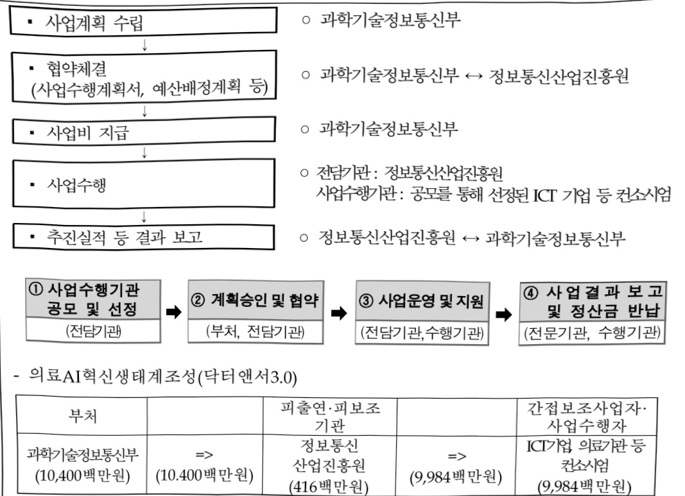

# 의료AI혁신생태계조성(닥터앤서3.0)

**해당 페이지**: PDF 1266 ~ 1272 쪽 해당

**부처**: 과학기술정보통신부
**분야**: 통신
**회계유형**: 일반회계
**2026 확정예산**: 10400.0 백만원
**전년대비 증감률**: 352.2%
**AI 도메인**: 의료/바이오

---

### 가. 예산 총괄표

(단위: 백만원, %)

<table border=1 style='margin: auto; word-wrap: break-word;'><tr><td rowspan="2">사업명</td><td rowspan="2">2024년 결산</td><td colspan="2">2025년 예산</td><td colspan="2">2026년 예산</td><td rowspan="2">증감(B-A)</td><td rowspan="2">(B-A)/A</td></tr><tr><td style='text-align: center; word-wrap: break-word;'>본예산</td><td style='text-align: center; word-wrap: break-word;'>추경*(A)</td><td style='text-align: center; word-wrap: break-word;'>요구안</td><td style='text-align: center; word-wrap: break-word;'>본예산(B)</td></tr><tr><td style='text-align: center; word-wrap: break-word;'>의료AI혁신생태계 조성(닥터앤서3.0)</td><td style='text-align: center; word-wrap: break-word;'>-</td><td style='text-align: center; word-wrap: break-word;'>2,300</td><td style='text-align: center; word-wrap: break-word;'>6,300</td><td style='text-align: center; word-wrap: break-word;'>10,400</td><td style='text-align: center; word-wrap: break-word;'>10,400</td><td style='text-align: center; word-wrap: break-word;'>8,100</td><td style='text-align: center; word-wrap: break-word;'>352.2</td></tr></table>

* 추경: 추경증감액을 포함한 최종 예산액을 기재

□ 기능별(내역사업별) 예산 내역

(단위: 백만원)

<table border=1 style='margin: auto; word-wrap: break-word;'><tr><td rowspan="2"></td><td colspan="5">2024</td><td colspan="5">2025</td><td rowspan="2">2026예산</td></tr><tr><td style='text-align: center; word-wrap: break-word;'>예산액(추정)</td><td style='text-align: center; word-wrap: break-word;'>예산현액</td><td style='text-align: center; word-wrap: break-word;'>집행액</td><td style='text-align: center; word-wrap: break-word;'>이월액</td><td style='text-align: center; word-wrap: break-word;'>불용액</td><td style='text-align: center; word-wrap: break-word;'>예산액(추정)</td><td style='text-align: center; word-wrap: break-word;'>예산현액</td><td style='text-align: center; word-wrap: break-word;'>집행액</td><td style='text-align: center; word-wrap: break-word;'>이월액</td><td style='text-align: center; word-wrap: break-word;'>불용액</td></tr><tr><td style='text-align: center; word-wrap: break-word;'>○ 기능별 분류(합계)</td><td style='text-align: center; word-wrap: break-word;'>-</td><td style='text-align: center; word-wrap: break-word;'>-</td><td style='text-align: center; word-wrap: break-word;'>-</td><td style='text-align: center; word-wrap: break-word;'>-</td><td style='text-align: center; word-wrap: break-word;'>-</td><td style='text-align: center; word-wrap: break-word;'>2,300</td><td style='text-align: center; word-wrap: break-word;'>6,300</td><td style='text-align: center; word-wrap: break-word;'>6,300</td><td style='text-align: center; word-wrap: break-word;'>6,300</td><td style='text-align: center; word-wrap: break-word;'>6,300</td><td style='text-align: center; word-wrap: break-word;'>-</td></tr><tr><td style='text-align: center; word-wrap: break-word;'>• 의료AI혁신생태계조성(타터앤서3.0)</td><td style='text-align: center; word-wrap: break-word;'>-</td><td style='text-align: center; word-wrap: break-word;'>-</td><td style='text-align: center; word-wrap: break-word;'>-</td><td style='text-align: center; word-wrap: break-word;'>-</td><td style='text-align: center; word-wrap: break-word;'>-</td><td style='text-align: center; word-wrap: break-word;'>2,300</td><td style='text-align: center; word-wrap: break-word;'>6,300</td><td style='text-align: center; word-wrap: break-word;'>6,300</td><td style='text-align: center; word-wrap: break-word;'>6,300</td><td style='text-align: center; word-wrap: break-word;'>6,300</td><td style='text-align: center; word-wrap: break-word;'>-</td></tr></table>

### 나. 사업설명자료

## 1 ) 사업목적·내용

- (의료AI혁신생태계조성(닥터앤서3.0)) 질병 발생 후 환자가 병원과 가정에서 지속적으로 건강 회복 및 유지관리를 할 수 있도록 AI기반의 예후관리 서비스 개발·실증

## 2 ) 사업개요

① 법령상 근거 및 조항 적시

- 정보통신산업 진흥법 제21조(정보통신망 응용서비스의 개발촉진 등)

제21조(정보통신망 응용서비스의 개발촉진 등)

② 과학기술정보통신부장관은 민간부문에 의한 정보통신망 응용서비스의 개발을 촉진하기 위하여 재정 및 기술 등 필요한 지원을 할 수 있다.

- 정보통신산업 진흥법 27조(사업), 제28조(재원)

---

제27조(사업) 산업진흥원은 다음 각 호의 사업을 한다.
3. 정보통신산업 육성·발전 및 지원시설 등 기반조성사업
4. 정보통신기업의 창업·성장 등의 지원
7. 정보통신기술의 융합·활용에 관한 사업
8. 정보통신산업 관련 국제교류·협력 및 해외진출의 지원
제28조(재원 등) ① 정부는 예산 또는 기금의 범위에서 산업진흥원의 설립 및 운영에 필요한 경비의 전부 또는 일부를 출연하거나 보조할 수 있다.

- 정보통신 진흥 및 융합 활성화 등에 관한 특별법 제32조(정보통신융합 등 기술·서비스 개발 등의 지원)

제32조(정보통신융합 등 기술·서비스 개발 등의 지원) ② 과학기술정보통신부장관은 정보통신융합 등 기술·서비스의 개발을 촉진하기 위하여 다음 각 호의 사업을 추진할 수 있다.

1. 정보통신융합 등 기술·서비스 관련 연구개발 사업

11. 정보통신융합 등 기술·서비스 관련 시범사업

12. 그 밖에 정보통신기술진흥을 위하여 필요한 사업

③ 과학기술정보통신부장관은 제2항 각 호의 사업을 추진하기 위하여 법인인 전담기관을 설립하거나 법인·단체에 위탁·운영할 수 있으며, 필요한 비용의 전부 또는 일부를 예산의 범위에서 출연 또는 보조할 수 있다.

## ② 추진경위

- '新성장 4.0 전략' 추진계획 발표('22.12월, 기획재정부)

□ (新일상 : Digital Everywhere) 의료 AI-SW 적용·확산 등 AI제품·서비스 개발 보급

- '첨단산업 글로벌 클러스터 육성방안('23.6월') 및 후속방안 조치('23.9월, 관계부처합동)

□ 기존 한계를 뛰어넘는 R&D 성공사례 창출을 위해 7대 선도프로젝트 추진

② 닥터앤서 3.0

- 전국민 AI일상화 실행계획('23.9월, 관계부처합동)

□ (건강) 의료·보건 서비스 품질제고 : 의료기관 대상 클라우드 병원정보시스템, 질환

진단 AI 도입 지원

- 이재명정부 123대 국정과제('25.8월, 국정기획위원회 국민보고대회)

□ (국정과제 23) 안전과 책임 기반의 'AI 기본사회' 실현

---

## 주요내용

① 사업규모

- 총사업비(해당되는 경우에만 기재) : 해당 없음

- 사업기간 : '25년 ~ '28년

- 최근 5년 간 투입된 사업비(예산액기준, 추경편성한 연도에는 추경포함)

<table border=1 style='margin: auto; word-wrap: break-word;'><tr><td style='text-align: center; word-wrap: break-word;'>연도</td><td style='text-align: center; word-wrap: break-word;'>2022</td><td style='text-align: center; word-wrap: break-word;'>2023</td><td style='text-align: center; word-wrap: break-word;'>2024</td><td style='text-align: center; word-wrap: break-word;'>2025</td><td style='text-align: center; word-wrap: break-word;'>2026</td></tr><tr><td style='text-align: center; word-wrap: break-word;'>사업비</td><td style='text-align: center; word-wrap: break-word;'>-</td><td style='text-align: center; word-wrap: break-word;'>-</td><td style='text-align: center; word-wrap: break-word;'></td><td style='text-align: center; word-wrap: break-word;'>6,300</td><td style='text-align: center; word-wrap: break-word;'>10,400</td></tr></table>

- 기타: 해당 없음

② 사업추진체계

- 사업시행방법 : 출연

- 사업시행주체 : 정보통신산업진흥원

- 사업 수혜자 : 공모를 통해 선정된 ICT 기업 등 컨소시엄

- 보조, 융자, 출연, 출자 등의 경우 보조·융자 등 지원 비율 및 법적근거

<table border=1 style='margin: auto; word-wrap: break-word;'><tr><td style='text-align: center; word-wrap: break-word;'>내역사업명</td><td style='text-align: center; word-wrap: break-word;'>구분</td><td style='text-align: center; word-wrap: break-word;'>피보조·피출연 등 기관명</td><td style='text-align: center; word-wrap: break-word;'>지원 금액 (2026예산)</td><td style='text-align: center; word-wrap: break-word;'>지원 비율(%)</td><td style='text-align: center; word-wrap: break-word;'>보조율 법적근거 (해당 조항)</td></tr><tr><td style='text-align: center; word-wrap: break-word;'>의료AI혁신생태계조성(닥터앤서3.0)</td><td style='text-align: center; word-wrap: break-word;'>출연</td><td style='text-align: center; word-wrap: break-word;'>정보통신산업진흥원</td><td style='text-align: center; word-wrap: break-word;'>10,400</td><td style='text-align: center; word-wrap: break-word;'>100</td><td style='text-align: center; word-wrap: break-word;'>정보통신산업 진흥법 제27조, 정보통신 진흥 및 융합 활성화 등에 관한 특별법 제32조</td></tr></table>

## 3 ) 2026년도 예산 산출 근거

○ 사업출연금(350-02) : 10,400백만원

의료AI혁신생태계조성(닥터앤서3.0) (10,400백만원)

- AI 예후관리 솔루션 개발

(계속) 8개 질환(서비스) × 800백만원 = 6,400백만원

(신규) 5개 질환(서비스) × 800백만원 = 4,000백만원

* (지원기관) 신규과제는 병원, loT/SW/AI 기업간 원활한 소통을 위해, 1개 컨소시엄 선정

* (지원기간) '26년 신규과제는 '28년까지 3년간 지원(연차평가 통해 계속 지원여부 결정)

---

## 4 ) 사업효과

☐ 사업영향, 산출물 성과지표 등

① 2022~2026년도 성과계획서 상 성과지표 및 최근 5년간 성과 달성도

<table border=1 style='margin: auto; word-wrap: break-word;'><tr><td style='text-align: center; word-wrap: break-word;'>성과지표</td><td style='text-align: center; word-wrap: break-word;'>구분</td><td style='text-align: center; word-wrap: break-word;'>2022</td><td style='text-align: center; word-wrap: break-word;'>2023</td><td style='text-align: center; word-wrap: break-word;'>2024</td><td style='text-align: center; word-wrap: break-word;'>2025</td><td style='text-align: center; word-wrap: break-word;'>2026</td><td style='text-align: center; word-wrap: break-word;'>2026 목표치산출근거</td><td style='text-align: center; word-wrap: break-word;'>측정산식(또는 측정방법)</td><td style='text-align: center; word-wrap: break-word;'>자료수집방법(또는 자료출처)</td></tr><tr><td rowspan="3">학습데이터수집·가공(단위: 건)</td><td style='text-align: center; word-wrap: break-word;'>목표</td><td style='text-align: center; word-wrap: break-word;'>-</td><td style='text-align: center; word-wrap: break-word;'>-</td><td style='text-align: center; word-wrap: break-word;'>-</td><td style='text-align: center; word-wrap: break-word;'>3,600</td><td style='text-align: center; word-wrap: break-word;'>5,850</td><td rowspan="3">AI 솔루션 개발사업 신규지표임을 감안하여 사업 초기 중요 과업인 데이터 수집·가공을 목표로 설정(질환별 최소 450건 이상)</td><td rowspan="3">질환별 학습데이터 수집·가공 수의 합</td><td rowspan="3">결과보고서</td></tr><tr><td style='text-align: center; word-wrap: break-word;'>실적</td><td style='text-align: center; word-wrap: break-word;'>-</td><td style='text-align: center; word-wrap: break-word;'>-</td><td style='text-align: center; word-wrap: break-word;'>-</td><td style='text-align: center; word-wrap: break-word;'>-</td><td style='text-align: center; word-wrap: break-word;'>-</td></tr><tr><td style='text-align: center; word-wrap: break-word;'>달성도</td><td style='text-align: center; word-wrap: break-word;'>-</td><td style='text-align: center; word-wrap: break-word;'>-</td><td style='text-align: center; word-wrap: break-word;'>-</td><td style='text-align: center; word-wrap: break-word;'>-</td><td style='text-align: center; word-wrap: break-word;'>-</td></tr></table>

② 성과지표 이외의 연도별 사업추진 경과 및 실적

<table border=1 style='margin: auto; word-wrap: break-word;'><tr><td style='text-align: center; word-wrap: break-word;'>2022</td><td style='text-align: center; word-wrap: break-word;'>• 해당 없음</td></tr><tr><td style='text-align: center; word-wrap: break-word;'>2023</td><td style='text-align: center; word-wrap: break-word;'>• 해당 없음</td></tr><tr><td style='text-align: center; word-wrap: break-word;'>2024</td><td style='text-align: center; word-wrap: break-word;'>• 해당 없음</td></tr><tr><td style='text-align: center; word-wrap: break-word;'>2025</td><td style='text-align: center; word-wrap: break-word;'>• AI예후관리(Post Care) 서비스 개발·실증 신규과제 모집공고(&#x27;25.3월) • 4개 예후관리 질환(서비스)* 선정(1차, &#x27;25.6월) * 신장암, 유방암, 심장질환, 피부질환 • AI예후관리(Post Care) 서비스 개발·실증 신규과제 모집공고(&#x27;25.2차 추경, &#x27;25.7월) • 6개 예후관리 질환(서비스)* 선정(2차, &#x27;25.9월) * 대장암, 위암, 산모관리, 소아만성호흡부전, 전립선비대증, 수술후재활운동</td></tr></table>

③향후(2026년도 이후)기대효과

- (사회적 효과) 선제적 AI 예후관리 서비스를 통해 국민의 건강수명을 연장하고,

만성질환 악화 예방으로 삶의 질을 개선하는 데 기여

- (경제적 효과) 질병의 조기 발견과 악화 방지를 통해 불필요한 의료비 지출 절감 및 의료자원의 효율적 운용에 기여

- (산업적 효과) AI기반 솔루션, 디지털 의료기기의 신속한 인허가·실증 지원을 통해 신기술의 시장 진입 촉진 및 신성장동력 산업 촉진

5) 타당성조사 및 예비타당성조사 시행여부 및 결과 요지 : 해당 없음

6) 총사업비 대상사업 정보 : 해당 없음

---

## 7 ) 사업 집행절차

## 8 ) 각종 평가

○ 동 사업의 수혜자가 디지털 기기 사용이 익숙하지 않은 고령층을 포함하고 있음을 고려하여, 디지털 취약계층을 위해 접근성 문제를 보완한다. (25년 제2회 추가경정 예산안 과방위 심사 부대의견)

※ (대응방안) 쉽고 단순한 서비스 화면 등 고령층에 친화적인 솔루션을 고안하고, 의료기관 대상 솔루션 실증 과정에서, 환자들의 피드백을 반영하여 편의성을 높일 수 있도록 추진할 예정

---

### 다. 최근 4년간 결산내역

## 1 ) 결산표

☐ 부처 결산내역

(단위:백만원,%)

<table border=1 style='margin: auto; word-wrap: break-word;'><tr><td rowspan="2">연도</td><td colspan="3">예산액</td><td style='text-align: center; word-wrap: break-word;'>예산현액</td><td style='text-align: center; word-wrap: break-word;'>집행액</td><td style='text-align: center; word-wrap: break-word;'>집행률</td><td style='text-align: center; word-wrap: break-word;'>다음연도</td><td rowspan="2">불용액</td></tr><tr><td style='text-align: center; word-wrap: break-word;'>본예산</td><td style='text-align: center; word-wrap: break-word;'>추경</td><td style='text-align: center; word-wrap: break-word;'>추경</td><td style='text-align: center; word-wrap: break-word;'>(A)</td><td style='text-align: center; word-wrap: break-word;'>(B)</td><td style='text-align: center; word-wrap: break-word;'>(B/A)</td><td style='text-align: center; word-wrap: break-word;'>이월액</td></tr><tr><td style='text-align: center; word-wrap: break-word;'>2025</td><td style='text-align: center; word-wrap: break-word;'>2,300</td><td style='text-align: center; word-wrap: break-word;'>4,000</td><td style='text-align: center; word-wrap: break-word;'>6,300</td><td style='text-align: center; word-wrap: break-word;'>6,300</td><td style='text-align: center; word-wrap: break-word;'>6,300</td><td style='text-align: center; word-wrap: break-word;'>100</td><td style='text-align: center; word-wrap: break-word;'>-</td><td style='text-align: center; word-wrap: break-word;'>-</td></tr></table>

## 2 ) 주요 결산사항

2022~2025년 결산 주요사항 : 해당 없음

2025년 이·전용 등 세부내역 : 해당 없음

---

<table border=1 style='margin: auto; word-wrap: break-word;'><tr><td style='text-align: center; word-wrap: break-word;'>사 업 명</td></tr><tr><td style='text-align: center; word-wrap: break-word;'>(46) 인간-AI 협업형 LAM 개발·글로벌 실증(R&amp;D) (4231-301)</td></tr></table>

☐ 사업 코드 정보

<table border=1 style='margin: auto; word-wrap: break-word;'><tr><td style='text-align: center; word-wrap: break-word;'>구분</td><td style='text-align: center; word-wrap: break-word;'>회계</td><td style='text-align: center; word-wrap: break-word;'>소관</td><td style='text-align: center; word-wrap: break-word;'>실국(기관)</td><td style='text-align: center; word-wrap: break-word;'>계정</td><td style='text-align: center; word-wrap: break-word;'>분야</td><td style='text-align: center; word-wrap: break-word;'>부문</td></tr><tr><td style='text-align: center; word-wrap: break-word;'>코드</td><td style='text-align: center; word-wrap: break-word;'>지역균형발전</td><td style='text-align: center; word-wrap: break-word;'>과학기술</td><td style='text-align: center; word-wrap: break-word;'>정보통신산업</td><td rowspan="2">지역지원</td><td style='text-align: center; word-wrap: break-word;'>150</td><td style='text-align: center; word-wrap: break-word;'>155</td></tr><tr><td style='text-align: center; word-wrap: break-word;'>명칭</td><td style='text-align: center; word-wrap: break-word;'>특별회계</td><td style='text-align: center; word-wrap: break-word;'>정보통신부</td><td style='text-align: center; word-wrap: break-word;'>정책관</td><td style='text-align: center; word-wrap: break-word;'>과학기술</td><td style='text-align: center; word-wrap: break-word;'>과학기술 연구개발</td></tr></table>

<table border=1 style='margin: auto; word-wrap: break-word;'><tr><td style='text-align: center; word-wrap: break-word;'>구분</td><td style='text-align: center; word-wrap: break-word;'>프로그램</td><td style='text-align: center; word-wrap: break-word;'>단위사업</td><td style='text-align: center; word-wrap: break-word;'>세부사업</td></tr><tr><td style='text-align: center; word-wrap: break-word;'>코드</td><td style='text-align: center; word-wrap: break-word;'>4200</td><td style='text-align: center; word-wrap: break-word;'>4231</td><td style='text-align: center; word-wrap: break-word;'>301</td></tr><tr><td style='text-align: center; word-wrap: break-word;'>명칭</td><td style='text-align: center; word-wrap: break-word;'>지역경제활성화</td><td style='text-align: center; word-wrap: break-word;'>광역경제권산업경쟁력강화(지역지원)</td><td style='text-align: center; word-wrap: break-word;'>인간-AI 협업형 LAM 개발·글로벌 실증(R&amp;D)</td></tr></table>

□ 사업 성격 (공통요구자료 Ⅱ-1 작성유의사항 4. 참조, 해당하는 사항에 “○” 표시)

<table border=1 style='margin: auto; word-wrap: break-word;'><tr><td rowspan="2">신규 계속</td><td rowspan="2">완료</td><td rowspan="2">예비타당성 실시여부</td><td rowspan="2">총사업비 관리대상</td><td rowspan="2">총액계상 예산사업</td><td style='text-align: center; word-wrap: break-word;'>사업소관 변경정보</td></tr><tr><td style='text-align: center; word-wrap: break-word;'>2025예산 시 소관</td></tr><tr><td style='text-align: center; word-wrap: break-word;'></td><td style='text-align: center; word-wrap: break-word;'>○</td><td style='text-align: center; word-wrap: break-word;'></td><td style='text-align: center; word-wrap: break-word;'></td><td style='text-align: center; word-wrap: break-word;'></td><td style='text-align: center; word-wrap: break-word;'></td></tr></table>

사업 지원 형태 및 지원을 (최소한 한 개는 반드시 선택하시오. 해당사항에 O 표시)

<table border=1 style='margin: auto; word-wrap: break-word;'><tr><td style='text-align: center; word-wrap: break-word;'>직접</td><td style='text-align: center; word-wrap: break-word;'>출자</td><td style='text-align: center; word-wrap: break-word;'>출연</td><td style='text-align: center; word-wrap: break-word;'>보조</td><td style='text-align: center; word-wrap: break-word;'>융자</td><td style='text-align: center; word-wrap: break-word;'>국고보조율(%)</td><td style='text-align: center; word-wrap: break-word;'>융자율(%)</td></tr><tr><td style='text-align: center; word-wrap: break-word;'></td><td style='text-align: center; word-wrap: break-word;'></td><td style='text-align: center; word-wrap: break-word;'>○</td><td style='text-align: center; word-wrap: break-word;'></td><td style='text-align: center; word-wrap: break-word;'></td><td style='text-align: center; word-wrap: break-word;'></td><td style='text-align: center; word-wrap: break-word;'></td></tr></table>

## ☐ 사업 소관부처 및 시행주체

<table border=1 style='margin: auto; word-wrap: break-word;'><tr><td style='text-align: center; word-wrap: break-word;'>사업명</td><td colspan="2">구분</td></tr><tr><td rowspan="3">인간-AI협업형LAM개발·글로벌 실증(R&amp;D)</td><td rowspan="2">소관부처</td><td style='text-align: center; word-wrap: break-word;'>정보통신정책실정보통신산업정책관</td></tr><tr><td style='text-align: center; word-wrap: break-word;'>정보통신산업정책과</td></tr><tr><td style='text-align: center; word-wrap: break-word;'>사업시행주체</td><td style='text-align: center; word-wrap: break-word;'>정보통신산업진흥원</td></tr></table>

---

### 원본 PDF 크롭 이미지

