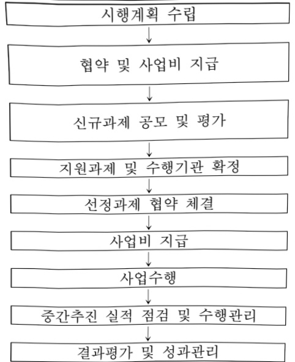
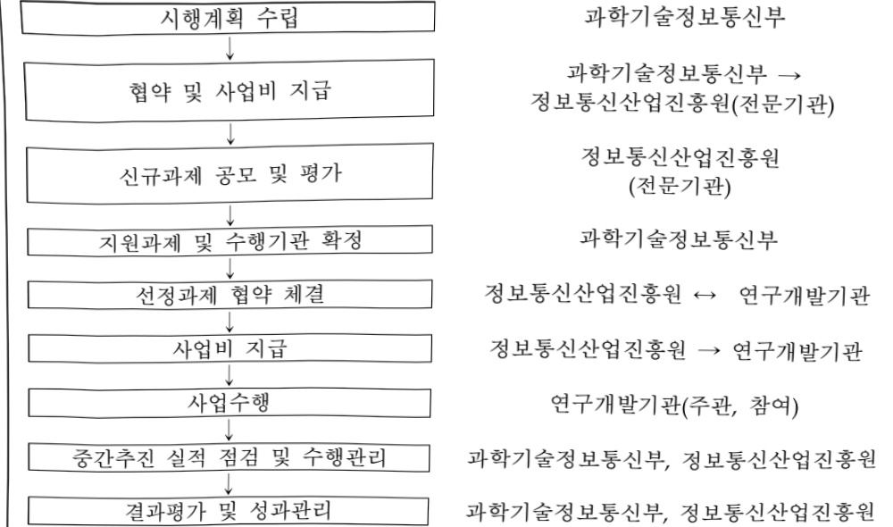

# 인간-AI 협업형 LAM 개발·글로벌 실증(R&D)

**해당 페이지**: PDF 1273 ~ 1278 쪽 해당

**부처**: 과학기술정보통신부
**분야**: 과학기술
**회계유형**: 지역균형발전 특별회계
**2026 확정예산**: 66666.0 백만원
**전년대비 증감률**: None%
**AI 도메인**: 디지털전환(AX), 피지컬AI/디바이스

---

### 가.예산 총괄표

(단위: 백만원, %)

<table border=1 style='margin: auto; word-wrap: break-word;'><tr><td rowspan="2">사업명</td><td rowspan="2">2024년 결산</td><td colspan="2">2025년 예산</td><td colspan="2">2026년 예산</td><td rowspan="2">중감(B-A)</td><td rowspan="2">(B-A)/A</td></tr><tr><td style='text-align: center; word-wrap: break-word;'>본예산</td><td style='text-align: center; word-wrap: break-word;'>추경*(A)</td><td style='text-align: center; word-wrap: break-word;'>요구안</td><td style='text-align: center; word-wrap: break-word;'>본예산(B)</td></tr><tr><td style='text-align: center; word-wrap: break-word;'>인간-AI 협업형 LAM 개발·글로벌 실증(R&amp;D)</td><td style='text-align: center; word-wrap: break-word;'>-</td><td style='text-align: center; word-wrap: break-word;'>-</td><td style='text-align: center; word-wrap: break-word;'>-</td><td style='text-align: center; word-wrap: break-word;'>40,000</td><td style='text-align: center; word-wrap: break-word;'>66,666</td><td style='text-align: center; word-wrap: break-word;'>순증</td><td style='text-align: center; word-wrap: break-word;'>순증</td></tr></table>

*추경: 추경증감액을 포함한 최종 예산액을 기재

## □ 기능별(내역사업별) 예산 내역

(단위:백만원)

<table border=1 style='margin: auto; word-wrap: break-word;'><tr><td rowspan="2"></td><td colspan="5">2024</td><td colspan="5">2025</td><td rowspan="2">2026 叁</td></tr><tr><td style='text-align: center; word-wrap: break-word;'>叁</td><td style='text-align: center; word-wrap: break-word;'>叁</td><td style='text-align: center; word-wrap: break-word;'>叁</td><td style='text-align: center; word-wrap: break-word;'>叁</td><td style='text-align: center; word-wrap: break-word;'>叁</td><td style='text-align: center; word-wrap: break-word;'>叁</td><td style='text-align: center; word-wrap: break-word;'>叁</td><td style='text-align: center; word-wrap: break-word;'>叁</td><td style='text-align: center; word-wrap: break-word;'>叁</td><td style='text-align: center; word-wrap: break-word;'>叁</td></tr><tr><td style='text-align: center; word-wrap: break-word;'>○ 기능별 분류(합계)</td><td style='text-align: center; word-wrap: break-word;'>-</td><td style='text-align: center; word-wrap: break-word;'>-</td><td style='text-align: center; word-wrap: break-word;'>-</td><td style='text-align: center; word-wrap: break-word;'>-</td><td style='text-align: center; word-wrap: break-word;'>-</td><td style='text-align: center; word-wrap: break-word;'>-</td><td style='text-align: center; word-wrap: break-word;'>-</td><td style='text-align: center; word-wrap: break-word;'>-</td><td style='text-align: center; word-wrap: break-word;'>-</td><td style='text-align: center; word-wrap: break-word;'>-</td><td style='text-align: center; word-wrap: break-word;'>66,666</td></tr><tr><td style='text-align: center; word-wrap: break-word;'>· 인간-AI 협업형 LAM개발 글로벌 실증</td><td style='text-align: center; word-wrap: break-word;'>-</td><td style='text-align: center; word-wrap: break-word;'>-</td><td style='text-align: center; word-wrap: break-word;'>-</td><td style='text-align: center; word-wrap: break-word;'>-</td><td style='text-align: center; word-wrap: break-word;'>-</td><td style='text-align: center; word-wrap: break-word;'>-</td><td style='text-align: center; word-wrap: break-word;'>-</td><td style='text-align: center; word-wrap: break-word;'>-</td><td style='text-align: center; word-wrap: break-word;'>-</td><td style='text-align: center; word-wrap: break-word;'>-</td><td style='text-align: center; word-wrap: break-word;'>66,666</td></tr></table>

### 나.사업설명자료

## 1 ) 사업목적·내용

o 피지컬AI 특화 고신뢰성 융합데이터 및 LAM(PINN 기반 물리지능행동모델) 핵심기술

확보로 우리나라 피지컬AI 기술 주도권 확보 및 AX 역량 강화

- 국내외 피지컬AI 특화 산학연 협력을 기반으로 정밀 제어가 필요한 분야에 활용

할 수 있는 피지컬AI 특화 LAM 핵심기술 개발 및 글로벌 실증

## 2 ) 사업개요

## ☐ 사업근거 및 추진경위

① 법령상 근거 조항 적시

- 인공지능 발전과 신뢰 기반 조성 등에 관한 기본법 제16조(인공지능 기술 도입·활용 지원) ① 국가 및 지방자치단체는 기업 및 공공기관의 인공지능 기술 도입 촉진 및 활용 확산을 위하여 필요한 경우에는 다음 각 호의 지원을 할 수 있다. 1. 인공지능기술, 인공지능제품 또는 인공지능서비스의 개발 지원 및 연구·개발 성과의 확산

---

- 인공지능 발전과 신뢰 기반 조성 등에 관한 기본법 제19조(인공지능 융합의 촉진) ①

정부는 인공지능산업과 그 밖의 산업 간 융합을 촉진하고 전 분야에서 인공지능 활용을 활성화하기 위하여 필요한 시책을 수립하여 추진하여야 한다

- 지방자치분권 및 지역군형발전에 관한 특별법 제14조(지역 산업 육성 및 일자리 창출 등 지역경제 활성화 촉진)④ 국가와 지방자치단체는 지역 산업의 육성과 지역경제의 활성화를 위하여 지역의 일자리 창출과 투자 유치활동 지원, 정보통신 진흥 및 지역 특성에 맞는 중소기업의 창업 여건 개선 등에 관한 시책을 추진하여야 한다.

- 지방자치분권 및 지역군형발전에 관한 특별법 제16조(지역과학기술 및 정보통신의 진흥) 국가와 지방자치단체는 지역군형발전에 필요한 과학기술 및 정보통신의 진흥을 위하여 지역의 과학기술연구·교육기관 육성, 지역의 연구개발인력 및 정보통신인력의 확충, 지역군형발전을 위한 연구개발 촉진, 연구개발정보 유통체계 및 시설·장비 등 혁신기반 조성, 과학기술혁신 성과의 확산 및 산업화 촉진 등에 관한 시책을 추진하여야 한다.

- 정보통신 진흥 및 융합 활성화 등에 관한 특별법 제32조(정보통신융합등 기술·서비스 개발 등의 지원) ①과학기술정보통신부장관은 다른 산업 및 서비스 등에 정보통신의 접목을 통하여 생산성과 가치를 높일 수 있도록 노력하여야 한다.

- 국가연구개발혁신법 제5조(정부의 책무) 3. 연구개발기관 간의 협력, 기술·학문·산업 간의 융합 및 창의적·도전적 연구개발 촉진 4. 연구자와 연구개발기관을 위한 최상의 연구환경 조성 등 연구개발 역량을 높이기 위한 지원

## ② 추진경위

- 24. 9월 : 국가 AI전략 정책방향(관계부처 합동)

### ·4대 AI 플래그십 프로젝트 3. 국가 AX(AI+X) 전면화

☐ 특정분야에 한정된 AI 활용을 넘어 산업, 공공, 사회, 지역, 국방에 이르는 국가전반의 AI 대전환 추진

- 24. 11월 : AI 혁신 생태계 조기구축 방안(관계부처 합동)

### ·중점투자방향 2. AI 핵심기술 개발

□ 차세대 AI 생태계 선점을 위해 AI반도체·AI서비스사업 R&D에 과감한 예산 지원

○ AI 자율제조 거점 육성, 혁신도전형 AI기술 등 차세대 핵심기술에 대한 투자 확대

-25.8월 : 새정부 국정과제

## ·세계를이끄는혁신경제

□ 21. AI를 가장 잘 쓰는 나라 구현(3.지역·산업 전반의 AX 대전환)

22. 초격차 AI 선도기술·인재 확보(5. 피지컬 AI 핵심기술 확보 및 산업 육성 지원)

25. 8월 : 예타면제 국무회의 의결

---

## 주요내용

- 종사업비 : 해당없음

- 사업기간 : '26년~'30년

- 최근 5년 간 투입된 사업비(예산액기준, 추경편성한 연도에는 추경포함)

<table border=1 style='margin: auto; word-wrap: break-word;'><tr><td style='text-align: center; word-wrap: break-word;'>연도</td><td style='text-align: center; word-wrap: break-word;'>2022</td><td style='text-align: center; word-wrap: break-word;'>2023</td><td style='text-align: center; word-wrap: break-word;'>2024</td><td style='text-align: center; word-wrap: break-word;'>2025</td><td style='text-align: center; word-wrap: break-word;'>2026(안)</td></tr><tr><td style='text-align: center; word-wrap: break-word;'>사업비</td><td style='text-align: center; word-wrap: break-word;'>-</td><td style='text-align: center; word-wrap: break-word;'>-</td><td style='text-align: center; word-wrap: break-word;'>-</td><td style='text-align: center; word-wrap: break-word;'>-</td><td style='text-align: center; word-wrap: break-word;'>66,666</td></tr></table>

-기타:해당없음

② 사업추진체계

- 사업시행방법 : 출연

- 사업시행주체 : 정보통신산업진흥원

- 사업 수혜자 : 피지컬AI 관련 산학연 등

- 보조, 융자, 출연, 출자 등의 경우 보조·융자 등 지원 비율 및 법적근거

<table border=1 style='margin: auto; word-wrap: break-word;'><tr><td style='text-align: center; word-wrap: break-word;'>내역사업명</td><td style='text-align: center; word-wrap: break-word;'>구분</td><td style='text-align: center; word-wrap: break-word;'>피보조·피출연 등 기관명</td><td style='text-align: center; word-wrap: break-word;'>지원 금액 (2026계획)</td><td style='text-align: center; word-wrap: break-word;'>지원 비율(%)</td><td style='text-align: center; word-wrap: break-word;'>보조율 법적근거 (해당 조항)</td></tr><tr><td style='text-align: center; word-wrap: break-word;'>인간-AI협업형 LAM 개발·글로벌 실증</td><td style='text-align: center; word-wrap: break-word;'>출연</td><td style='text-align: center; word-wrap: break-word;'>정보통신산업진흥원</td><td style='text-align: center; word-wrap: break-word;'>66,666 백만원</td><td style='text-align: center; word-wrap: break-word;'>100%</td><td style='text-align: center; word-wrap: break-word;'>정보통신산업진흥법 제28조</td></tr></table>

## 3 ) 2026년도 예산 산출 근거

□ 인간-AI 협업형 LAM 개발·글로벌 실증 : (2025 본예산) 0 → (2026 예산안) 66,666백만원

① 인간-AI 협업형 LAM 개발·글로벌 실증 : (2025 본예산) 0 → (2026 예산안) 66,666백만원

- (요구) LAM 모델 개발을 위한 고신뢰성 융합데이터 수립 플랫폼 구축 및 데이터셋 확보, 국내 최적화된 디지털 트윈 기반 인간-AI 협업형(AI-Guided) 물리모델 구현·실증 예산 66,666백만원 신규 반영

- (산출) 융합데이터 수집·활용체계 구축 : 1식 × 24,571백만원 × 9/12개월 = 18,428백만원

 LAM(PINN 기반 물리지능행동모델) 핵심기술 개발 : 1식 × 57,415백만원 × 9/12개월 = 43,061백만원

글로벌 협력체계 구축 : 1식 × 3,183백만원 × 9/12개월 = 2,387백만원

 LAM 사업단 구축·운영 : 1식 × 2,387백만원 × 9/12개월 = 1,790백만원

기획평가관리비 : 1,333백만원 × 9/12개월 = 1,000백만원

---

## 4 ) 사업효과

사업영향, 산출물 성과지표 등

① 2022~2026년도 성과계획서 상 성과지표 및 최근 5년간 성과 달성도

<table border=1 style='margin: auto; word-wrap: break-word;'><tr><td style='text-align: center; word-wrap: break-word;'>성과지표</td><td style='text-align: center; word-wrap: break-word;'>구분</td><td style='text-align: center; word-wrap: break-word;'>2022</td><td style='text-align: center; word-wrap: break-word;'>2023</td><td style='text-align: center; word-wrap: break-word;'>2024</td><td style='text-align: center; word-wrap: break-word;'>2025</td><td style='text-align: center; word-wrap: break-word;'>2026</td><td style='text-align: center; word-wrap: break-word;'>‘26목표치산출근거</td><td style='text-align: center; word-wrap: break-word;'>측정산식(또는 측정방법)</td><td style='text-align: center; word-wrap: break-word;'>자료수집방법(또는 자료출처)</td></tr><tr><td rowspan="3">LAM모델핵심기술설계개발(단위 건(누적))</td><td style='text-align: center; word-wrap: break-word;'>목표</td><td style='text-align: center; word-wrap: break-word;'>-</td><td style='text-align: center; word-wrap: break-word;'>-</td><td style='text-align: center; word-wrap: break-word;'>-</td><td style='text-align: center; word-wrap: break-word;'>-</td><td style='text-align: center; word-wrap: break-word;'>8</td><td rowspan="3">산수혁명을 고려하여 연간핵심기술설계개발8건을목표로설정</td><td rowspan="3">∑LAM 모델핵심기술설계·개발수(누적)</td><td rowspan="3">결과보고서</td></tr><tr><td style='text-align: center; word-wrap: break-word;'>실적</td><td style='text-align: center; word-wrap: break-word;'>-</td><td style='text-align: center; word-wrap: break-word;'>-</td><td style='text-align: center; word-wrap: break-word;'>-</td><td style='text-align: center; word-wrap: break-word;'>-</td><td style='text-align: center; word-wrap: break-word;'>-</td></tr><tr><td style='text-align: center; word-wrap: break-word;'>달성도</td><td style='text-align: center; word-wrap: break-word;'>-</td><td style='text-align: center; word-wrap: break-word;'>-</td><td style='text-align: center; word-wrap: break-word;'>-</td><td style='text-align: center; word-wrap: break-word;'>-</td><td style='text-align: center; word-wrap: break-word;'>-</td></tr><tr><td rowspan="3">디지털 트렌기반 실증 수(단위:건(누적))</td><td style='text-align: center; word-wrap: break-word;'>목표</td><td style='text-align: center; word-wrap: break-word;'>-</td><td style='text-align: center; word-wrap: break-word;'>-</td><td style='text-align: center; word-wrap: break-word;'>-</td><td style='text-align: center; word-wrap: break-word;'>-</td><td style='text-align: center; word-wrap: break-word;'>2</td><td rowspan="3">산수혁명을 고려하여 연간실증2건을목표로설정</td><td rowspan="3">∑디지털 트렌기반 실증수(누적)</td><td rowspan="3">결과보고서</td></tr><tr><td style='text-align: center; word-wrap: break-word;'>실적</td><td style='text-align: center; word-wrap: break-word;'>-</td><td style='text-align: center; word-wrap: break-word;'>-</td><td style='text-align: center; word-wrap: break-word;'>-</td><td style='text-align: center; word-wrap: break-word;'>-</td><td style='text-align: center; word-wrap: break-word;'>-</td></tr><tr><td style='text-align: center; word-wrap: break-word;'>달성도</td><td style='text-align: center; word-wrap: break-word;'>-</td><td style='text-align: center; word-wrap: break-word;'>-</td><td style='text-align: center; word-wrap: break-word;'>-</td><td style='text-align: center; word-wrap: break-word;'>-</td><td style='text-align: center; word-wrap: break-word;'>-</td></tr></table>

② 성과지표 이외의 연도별 사업추진 경과 및 실적 : 해당없음

③향후(2026년도 이후)기대효과

- (피지컬AI 생태계 조성) 글로벌 협업을 기반으로 고신뢰성 융합데이터 수집,

LAM(PINN 모델 기반 물리지능행동모델) 핵심기술개발로 피지컬AI 글로벌 생태계 국내 구축

- (AX 혁신 주도) 제조 분야에 LAM 핵심기술 도입으로 이기종·소품종·다량생산이

가능한 AX 기반 현장 혁신 및 의료·우주항공 등 다양한 분야에 확산 추진

5) 타당성조사 및 예비타당성조사 시행여부 및 결과 요지

□ 국가재정법 제38조 제2항에 따라 예타면제 국무회의 의결 후 적정성 검토 추진 중

6) 총사업비 대상사업 여부 및 내역 : 해당없음

□ 총사업비 정보 : 해당없음

□ 총사업비 변경내역(변경일자 및 규모, 변경사유) : 해당없음

---

## 7 ) 사업 집행절차

- 인간-AI 협업형 LAM 개발·글로벌 실증

<table border=1 style='margin: auto; word-wrap: break-word;'><tr><td style='text-align: center; word-wrap: break-word;'>부처</td><td style='text-align: center; word-wrap: break-word;'></td><td style='text-align: center; word-wrap: break-word;'>피출연·피보조기관</td><td style='text-align: center; word-wrap: break-word;'></td><td style='text-align: center; word-wrap: break-word;'>간접보조사업자·사업수행자</td></tr><tr><td style='text-align: center; word-wrap: break-word;'>과학기술정보통신부(66,666)</td><td style='text-align: center; word-wrap: break-word;'>=&gt;(66,666)</td><td style='text-align: center; word-wrap: break-word;'>정보통신산업진흥원(1,000)</td><td style='text-align: center; word-wrap: break-word;'>=&gt;(65,666)</td><td style='text-align: center; word-wrap: break-word;'>연구개발기관 권소시엄</td></tr></table>

8) 각종 평가 : 해당없음

### 다.최근 4년간 결산내역

1) 결산표 : 해당없음

2) 주요 결산사항

□2022~2025년 결산 주요사항:해당없음

□ 2025년 이·전용 등 세부내역 : 해당없음

---

<table border=1 style='margin: auto; word-wrap: break-word;'><tr><td style='text-align: center; word-wrap: break-word;'>사 업 명</td></tr><tr><td style='text-align: center; word-wrap: break-word;'>(310) 인간인지기반AI핵심원천기술개발 (2601-395)</td></tr></table>

□ 사업 코드 정보

<table border=1 style='margin: auto; word-wrap: break-word;'><tr><td style='text-align: center; word-wrap: break-word;'>구분</td><td style='text-align: center; word-wrap: break-word;'>회계</td><td style='text-align: center; word-wrap: break-word;'>소관</td><td style='text-align: center; word-wrap: break-word;'>실국(기관)</td><td style='text-align: center; word-wrap: break-word;'>계정</td><td style='text-align: center; word-wrap: break-word;'>분야</td><td style='text-align: center; word-wrap: break-word;'>부문</td></tr><tr><td style='text-align: center; word-wrap: break-word;'>코드</td><td rowspan="2">일반회계</td><td rowspan="2">과학기술정보통신부</td><td rowspan="2">인공지능기반정책관</td><td rowspan="2">-</td><td style='text-align: center; word-wrap: break-word;'>130</td><td style='text-align: center; word-wrap: break-word;'>133</td></tr><tr><td style='text-align: center; word-wrap: break-word;'>명칭</td><td style='text-align: center; word-wrap: break-word;'>통신</td><td style='text-align: center; word-wrap: break-word;'>정보통신</td></tr></table>

<table border=1 style='margin: auto; word-wrap: break-word;'><tr><td style='text-align: center; word-wrap: break-word;'>구분</td><td style='text-align: center; word-wrap: break-word;'>프로그램</td><td style='text-align: center; word-wrap: break-word;'>단위사업</td><td style='text-align: center; word-wrap: break-word;'>세부사업</td></tr><tr><td style='text-align: center; word-wrap: break-word;'>코드</td><td style='text-align: center; word-wrap: break-word;'>2600</td><td style='text-align: center; word-wrap: break-word;'>2601</td><td style='text-align: center; word-wrap: break-word;'>395</td></tr><tr><td style='text-align: center; word-wrap: break-word;'>명칭</td><td style='text-align: center; word-wrap: break-word;'>인공지능데이터진흥</td><td style='text-align: center; word-wrap: break-word;'>AI기술개발(일반)</td><td style='text-align: center; word-wrap: break-word;'>인간인지기반AI핵심원천기술개발(R&amp;D)</td></tr></table>

□ 사업 성격 (공통요구자료 Ⅱ-1 작성유의사항 4. 참조, 해당하는 사항에 “○” 표시)

<table border=1 style='margin: auto; word-wrap: break-word;'><tr><td style='text-align: center; word-wrap: break-word;'>신규</td><td style='text-align: center; word-wrap: break-word;'>계속</td><td style='text-align: center; word-wrap: break-word;'>완료</td><td style='text-align: center; word-wrap: break-word;'>예비타당성 실시여부</td><td style='text-align: center; word-wrap: break-word;'>총사업비 관리대상</td><td style='text-align: center; word-wrap: break-word;'>총액계상 예산사업</td><td style='text-align: center; word-wrap: break-word;'>사업소관 변경정보 2025예산 시 소관</td></tr><tr><td style='text-align: center; word-wrap: break-word;'>O</td><td style='text-align: center; word-wrap: break-word;'></td><td style='text-align: center; word-wrap: break-word;'></td><td style='text-align: center; word-wrap: break-word;'></td><td style='text-align: center; word-wrap: break-word;'></td><td style='text-align: center; word-wrap: break-word;'></td><td style='text-align: center; word-wrap: break-word;'></td></tr></table>

□ 사업 지원 형태 및 지원을 (최소한 한 개는 반드시 선택하시오. 해당사항에 0 표시)

<table border=1 style='margin: auto; word-wrap: break-word;'><tr><td style='text-align: center; word-wrap: break-word;'>직접</td><td style='text-align: center; word-wrap: break-word;'>출자</td><td style='text-align: center; word-wrap: break-word;'>출연</td><td style='text-align: center; word-wrap: break-word;'>보조</td><td style='text-align: center; word-wrap: break-word;'>융자</td><td style='text-align: center; word-wrap: break-word;'>국고보조율(%)</td><td style='text-align: center; word-wrap: break-word;'>융자율(%)</td></tr><tr><td style='text-align: center; word-wrap: break-word;'></td><td style='text-align: center; word-wrap: break-word;'></td><td style='text-align: center; word-wrap: break-word;'>O</td><td style='text-align: center; word-wrap: break-word;'></td><td style='text-align: center; word-wrap: break-word;'></td><td style='text-align: center; word-wrap: break-word;'></td><td style='text-align: center; word-wrap: break-word;'></td></tr></table>

## □ 사업 담당자

<table border=1 style='margin: auto; word-wrap: break-word;'><tr><td style='text-align: center; word-wrap: break-word;'>사업명</td><td colspan="2">구분</td></tr><tr><td rowspan="2">인간인지기반 AI핵심원천 기술개발</td><td style='text-align: center; word-wrap: break-word;'>소관부처</td><td style='text-align: center; word-wrap: break-word;'>인공지능정책실 인공지능정책기획관 디지털인재양성과</td></tr><tr><td style='text-align: center; word-wrap: break-word;'>사업시행주체</td><td style='text-align: center; word-wrap: break-word;'>정보통신기획평가원</td></tr></table>

---

### 원본 PDF 크롭 이미지

