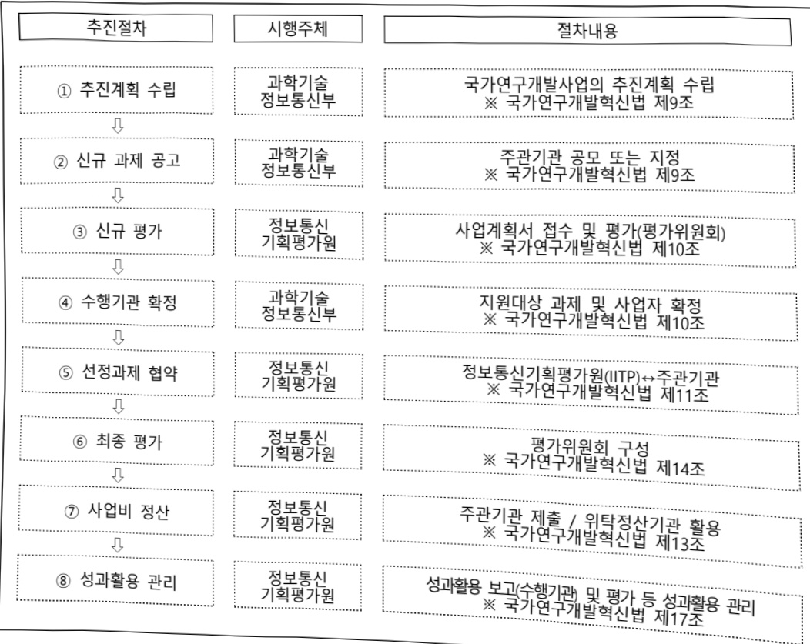

# 인간지향적차세대도전형AI기술개발(R&D)

**해당 페이지**: PDF 1285 ~ 1292 쪽 해당

**부처**: 과학기술정보통신부
**분야**: 통신
**회계유형**: 일반회계
**2026 확정예산**: 7000.0 백만원
**전년대비 증감률**: 15.7%
**AI 도메인**: LLM/언어모델

---

<table border=1 style='margin: auto; word-wrap: break-word;'><tr><td style='text-align: center; word-wrap: break-word;'>사 업 명</td></tr><tr><td style='text-align: center; word-wrap: break-word;'>(305) 인간지향적차세대도전형AI기술개발 (2601-388)</td></tr></table>

사업 코드 정보

<table border=1 style='margin: auto; word-wrap: break-word;'><tr><td style='text-align: center; word-wrap: break-word;'>구분</td><td style='text-align: center; word-wrap: break-word;'>회계</td><td style='text-align: center; word-wrap: break-word;'>소관</td><td style='text-align: center; word-wrap: break-word;'>실국(기관)</td><td style='text-align: center; word-wrap: break-word;'>계정</td><td style='text-align: center; word-wrap: break-word;'>분야</td><td style='text-align: center; word-wrap: break-word;'>부문</td></tr><tr><td style='text-align: center; word-wrap: break-word;'>코드</td><td rowspan="2">일반회계</td><td rowspan="2">과학기술정보통신부</td><td rowspan="2">인공지능정책기획관</td><td rowspan="2">-</td><td style='text-align: center; word-wrap: break-word;'>130</td><td style='text-align: center; word-wrap: break-word;'>133</td></tr><tr><td style='text-align: center; word-wrap: break-word;'>명칭</td><td style='text-align: center; word-wrap: break-word;'>통신</td><td style='text-align: center; word-wrap: break-word;'>정보통신</td></tr></table>

<table border=1 style='margin: auto; word-wrap: break-word;'><tr><td style='text-align: center; word-wrap: break-word;'>구분</td><td style='text-align: center; word-wrap: break-word;'>프로그램</td><td style='text-align: center; word-wrap: break-word;'>단위사업</td><td style='text-align: center; word-wrap: break-word;'>세부사업</td></tr><tr><td style='text-align: center; word-wrap: break-word;'>코드</td><td style='text-align: center; word-wrap: break-word;'>2600</td><td style='text-align: center; word-wrap: break-word;'>2601</td><td style='text-align: center; word-wrap: break-word;'>388</td></tr><tr><td style='text-align: center; word-wrap: break-word;'>명칭</td><td style='text-align: center; word-wrap: break-word;'>인공지능데이터진흥</td><td style='text-align: center; word-wrap: break-word;'>AI기술개발(일반)</td><td style='text-align: center; word-wrap: break-word;'>인간지향적차세대도전형 AI기술개발(R&amp;D)</td></tr></table>

□ 사업 성격 (공통요구자료 Ⅱ-1 작성유의사항 4. 참조, 해당하는 사항에 “○” 표시)

<table border=1 style='margin: auto; word-wrap: break-word;'><tr><td rowspan="2">신규</td><td rowspan="2">계속</td><td rowspan="2">완료</td><td rowspan="2">예비타당성 실시여부</td><td rowspan="2">총사업비 관리대상</td><td rowspan="2">총액계상 예산사업</td><td style='text-align: center; word-wrap: break-word;'>사업소관 변경정보</td></tr><tr><td style='text-align: center; word-wrap: break-word;'>2025예산 시 소관</td></tr><tr><td style='text-align: center; word-wrap: break-word;'></td><td style='text-align: center; word-wrap: break-word;'>O</td><td style='text-align: center; word-wrap: break-word;'></td><td style='text-align: center; word-wrap: break-word;'></td><td style='text-align: center; word-wrap: break-word;'></td><td style='text-align: center; word-wrap: break-word;'></td><td style='text-align: center; word-wrap: break-word;'></td></tr></table>

□ 사업 지원 형태 및 지원을 (최소한 한 개는 반드시 선택하시오. 해당사항에 O 표시)

<table border=1 style='margin: auto; word-wrap: break-word;'><tr><td style='text-align: center; word-wrap: break-word;'>직접</td><td style='text-align: center; word-wrap: break-word;'>출자</td><td style='text-align: center; word-wrap: break-word;'>출연</td><td style='text-align: center; word-wrap: break-word;'>보조</td><td style='text-align: center; word-wrap: break-word;'>융자</td><td style='text-align: center; word-wrap: break-word;'>국고보조율(%)</td><td style='text-align: center; word-wrap: break-word;'>융자율(%)</td></tr><tr><td style='text-align: center; word-wrap: break-word;'></td><td style='text-align: center; word-wrap: break-word;'></td><td style='text-align: center; word-wrap: break-word;'>O</td><td style='text-align: center; word-wrap: break-word;'></td><td style='text-align: center; word-wrap: break-word;'></td><td style='text-align: center; word-wrap: break-word;'></td><td style='text-align: center; word-wrap: break-word;'></td></tr></table>

□ 사업 소관부처 및 시행주체

<table border=1 style='margin: auto; word-wrap: break-word;'><tr><td style='text-align: center; word-wrap: break-word;'>사업명</td><td colspan="2">구분</td></tr><tr><td rowspan="2">인간지향적 차세대도전형 AI기술개발</td><td style='text-align: center; word-wrap: break-word;'>소관부처</td><td style='text-align: center; word-wrap: break-word;'>인공지능정책실 인공지능정책기획관 디지털인재양성과</td></tr><tr><td style='text-align: center; word-wrap: break-word;'>사업시행주체</td><td style='text-align: center; word-wrap: break-word;'>정보통신기획평가원</td></tr></table>

---

### 가. 예산 총괄표

(단위: 백만원, %)

<table border=1 style='margin: auto; word-wrap: break-word;'><tr><td rowspan="2">사업명</td><td rowspan="2">2024년 결산</td><td colspan="2">2025년 예산</td><td colspan="2">2026년 예산</td><td rowspan="2" colspan="2">증감(B-A)</td></tr><tr><td style='text-align: center; word-wrap: break-word;'>본예산</td><td style='text-align: center; word-wrap: break-word;'>추경*(A)</td><td style='text-align: center; word-wrap: break-word;'>요구안</td><td colspan="3">본예산(B)</td></tr><tr><td style='text-align: center; word-wrap: break-word;'>인간지향적차세대도전형AI기술개발</td><td style='text-align: center; word-wrap: break-word;'>-</td><td style='text-align: center; word-wrap: break-word;'>6,050</td><td style='text-align: center; word-wrap: break-word;'>6,050</td><td style='text-align: center; word-wrap: break-word;'>7,000</td><td style='text-align: center; word-wrap: break-word;'>7,000</td><td style='text-align: center; word-wrap: break-word;'>950</td><td style='text-align: center; word-wrap: break-word;'>15.7</td></tr></table>

□ 기능별(내역사업별) 예산 내역

(단위:백만원)

<table border=1 style='margin: auto; word-wrap: break-word;'><tr><td rowspan="2"></td><td colspan="5">2024</td><td colspan="5">2025</td><td style='text-align: center; word-wrap: break-word;'>2026 倉塗</td></tr><tr><td style='text-align: center; word-wrap: break-word;'>倉塗処(専倉)</td><td style='text-align: center; word-wrap: break-word;'>倉塗処処処処</td><td style='text-align: center; word-wrap: break-word;'>倉塗処処処処処</td><td style='text-align: center; word-wrap: break-word;'>倉塗処処処処処</td><td style='text-align: center; word-wrap: break-word;'>倉塗処処処処処</td><td style='text-align: center; word-wrap: break-word;'>倉塗処処処処処</td><td style='text-align: center; word-wrap: break-word;'>倉塗処処処処処</td><td style='text-align: center; word-wrap: break-word;'>倉塗処処処処処</td><td style='text-align: center; word-wrap: break-word;'>倉塗処処処処</td><td style='text-align: center; word-wrap: break-word;'>倉塗処処処処処</td><td style='text-align: center; word-wrap: break-word;'>倉塗処処処処処</td></tr><tr><td style='text-align: center; word-wrap: break-word;'>○ 기능별 분류(합계)</td><td style='text-align: center; word-wrap: break-word;'>-</td><td style='text-align: center; word-wrap: break-word;'>-</td><td style='text-align: center; word-wrap: break-word;'>-</td><td style='text-align: center; word-wrap: break-word;'>-</td><td style='text-align: center; word-wrap: break-word;'>-</td><td style='text-align: center; word-wrap: break-word;'>6,050</td><td style='text-align: center; word-wrap: break-word;'>6,050</td><td style='text-align: center; word-wrap: break-word;'>6,050</td><td style='text-align: center; word-wrap: break-word;'>-</td><td style='text-align: center; word-wrap: break-word;'>-</td><td style='text-align: center; word-wrap: break-word;'>7,000</td></tr><tr><td style='text-align: center; word-wrap: break-word;'>• 창의도전R&amp;D</td><td style='text-align: center; word-wrap: break-word;'>-</td><td style='text-align: center; word-wrap: break-word;'>-</td><td style='text-align: center; word-wrap: break-word;'>-</td><td style='text-align: center; word-wrap: break-word;'>-</td><td style='text-align: center; word-wrap: break-word;'>-</td><td style='text-align: center; word-wrap: break-word;'>2,300</td><td style='text-align: center; word-wrap: break-word;'>2,300</td><td style='text-align: center; word-wrap: break-word;'>2,300</td><td style='text-align: center; word-wrap: break-word;'>-</td><td style='text-align: center; word-wrap: break-word;'>-</td><td style='text-align: center; word-wrap: break-word;'>3,000</td></tr><tr><td style='text-align: center; word-wrap: break-word;'>• 핵심전략R&amp;D</td><td style='text-align: center; word-wrap: break-word;'>-</td><td style='text-align: center; word-wrap: break-word;'>-</td><td style='text-align: center; word-wrap: break-word;'>-</td><td style='text-align: center; word-wrap: break-word;'>-</td><td style='text-align: center; word-wrap: break-word;'>-</td><td style='text-align: center; word-wrap: break-word;'>3,750</td><td style='text-align: center; word-wrap: break-word;'>3,750</td><td style='text-align: center; word-wrap: break-word;'>3,750</td><td style='text-align: center; word-wrap: break-word;'>-</td><td style='text-align: center; word-wrap: break-word;'>-</td><td style='text-align: center; word-wrap: break-word;'>4,000</td></tr></table>

### 나. 사업설명자료

## 1 ) 사업목적·내용

- (인간지향적차세대도전형AI기술개발) 인간처럼 새로운 환경에 스스로 적응·성장하는

- 차세대 범용 AI 기술개발로 패턴 AI의 지적 수준을 고도화하고 범용적 활용성 극대화

- (창의도전R&D) AGI 기본조건만 제시하되, 1단계연구자가 제시한 기초단계의 AGI 기반기술 연구방법론 중 R&D 경쟁방식을 통해 → 2단계도전성이 높은 일부 과제 후속 R&D 지원(기초분야 중심)

- (핵심전략R&D) AGI 구현을 위한 차세대 AI 핵심분야만 제시하되, 연구자가 제시한 기초단계의 AGI 기반기술 연구방법론 중 R&D 경쟁방식을 통해 → 2단계 도전성이 높은 일부 과제 후속 R&D 지원(응용분야 중심)

---

## 2 ) 사업개요

## 사업근거 및 추진경위

① 법령상 근거 및 조항 적시

- 과학기술 기본법 제15조(기초연구의 진흥)

제15조(기초연구의 진흥) 정부는 과학기술혁신의 바탕이 되는 기초연구를 진흥시키기 위하여 대학과 정부가 출연하는 연구기관의 연구 및 상호 연계·협력을 활성화하고 안정적인 연구비를 지원하는 등 종합적인 시책을 세우고 추진하여야 한다.

- 정보통신산업 진흥법 제7조(정보통신기술진흥 시행계획)

제7조(정보통신기술진흥 시행계획) ① 과학기술정보통신부장관은 정보통신기술의 진흥을 위하여 진흥계획에 따라 다음 각 호의 사항이 포함된 정보통신기술진흥 시행계획을 매년 수립 · 시행하여야 한다. (중략)

3. 정보통신기술의 연구개발 및 다른 기술과의 결합 및 융합 촉진에 관한 사항 (이하 생략)

- 정보통신 진흥 및 융합 활성화 등에 관한 특별법 제32조(정보통신융합등 기술·서비스 개발 등의 지원)

제32조(정보통신융합등 기술·서비스 개발 등의 지원) ① 과학기술정보통신부장관은 다른 산업 및 서비스 등에 정보통신의 접목을 통하여 생산성과 가치를 높일 수 있도록 노력하여야 한다.

② 과학기술정보통신부장관은 정보통신융합등 기술·서비스의 개발을 촉진하기 위하여 다음 각 호의 사업을 추진할 수 있다.

1. 정보통신융합등 기술·서비스 관련 연구개발 사업 (이하 생략)

## ② 추진경위

: 이재명 정부 국정과제 22번 「초격차 AI 선도기술·인재 확보」

- 인공지능 일상화 및 산업 고도화 계획(안)(국가데이터정책위원회, '23.1)

0 現 인공지능 한계 극복으로 기술 적용 범위·신뢰성을 확장

(2단계) 자가성장, 자율지능, 인간 교감·소통 등 인공지능을 사람처럼 인지·학습·추론할 수 있도록 하는 범용 인공지능기술에 도전

- 초거대AI 경쟁력 강화 방안(초거대AI 미래원천기술 확보 지원, '23.4)

0 초거대 AI는 최신정보 미반영, 거짓답변 등 한계→현행 AI 기초연구에 추가하여 초거대 AI

한계 돌과 기술개발 착수, 차세대 초거대 AI 선도기반 조성

- 2025년 국가연구개발 투자방향 및 기준(국가과학기술자문회의, '24.3)

°(인공지능)공공·산업문제해결에특화된핵심기술개발과차세대인공지능원천기술확보를위한지원확대

ㅇ 대규모 데이터 학습 등에 의존하지 않는 범용적AI(AGI) 등 차세대 인공지능 원천기술 확보를 위한 기술개발 지원 강화

---

- AI-반도체 이니셔티브(관계부처 합동, '24.4)

0 멀티모달(이미지, 영상 등) 인식, 데이터 중심(Data-centric) AI, 인과관계(Causal) AI 등 차세대 AI 구현을 위한 핵심분야 R&D 추진('25~)

* ①AGI 핵심 요소 연구자 자체 기획, ②뇌 인지 모사, ③복합환경델티모달 인식 고도화 등 시범사업 신설 추진

- 국가 AI전략 정책방향(국가인공지능위원회, '24.9)

○ 4대 AI 플래그십 프로젝트 추진

- 민간부문 AI 투자 대폭 확대 : 4년간('24~'27) 민간 총 65조원 투자, 정부는 투자활성화 지원

○ 4대 분야 정책 추진방향

- AI핵심·원천기술 확충 및 AI인프라 혁신 추진

- '26년 국가연구개발 투자방향 및 기준(국가과학기술자문회의, '25.3)

0 과학기술 혁신으로 새로운 성장동력 확보

- (신기술 도전) AGI, 포스트 트랜스포머 등 새로운 AI 접근방식과 현세대 AI 한계 극복을 위한 초경량, 고성능 모델 등 도전적 원천 연구에 투자 대폭 확대

---

## 주요내용

① 사업규모

- 총사업비(해당되는 경우에만 기재) : 해당없음

- 사업기간 : '25 ~ '29년

- 최근 5년 간 투입된 사업비(예산액기준, 추경편성한 연도에는 추경포함)

<table border=1 style='margin: auto; word-wrap: break-word;'><tr><td style='text-align: center; word-wrap: break-word;'>연도</td><td style='text-align: center; word-wrap: break-word;'>2022</td><td style='text-align: center; word-wrap: break-word;'>2023</td><td style='text-align: center; word-wrap: break-word;'>2024</td><td style='text-align: center; word-wrap: break-word;'>2025</td><td style='text-align: center; word-wrap: break-word;'>2026</td></tr><tr><td style='text-align: center; word-wrap: break-word;'>사업비</td><td style='text-align: center; word-wrap: break-word;'>-</td><td style='text-align: center; word-wrap: break-word;'>-</td><td style='text-align: center; word-wrap: break-word;'>-</td><td style='text-align: center; word-wrap: break-word;'>6,050</td><td style='text-align: center; word-wrap: break-word;'>7,000</td></tr></table>

- 기타: 해당없음

② 사업추진체계

- 사업시행방법 : 출연

- 사업시행주체 : 한국연구재단 부설 정보통신기획평가원

- 사업 수혜자 : 기업, 대학, 연구소 등

- 보조, 융자, 출연, 출자 등의 경우 보조·융자 등 지원 비율 및 법적근거

<table border=1 style='margin: auto; word-wrap: break-word;'><tr><td style='text-align: center; word-wrap: break-word;'>내역사업명</td><td style='text-align: center; word-wrap: break-word;'>구분</td><td style='text-align: center; word-wrap: break-word;'>피보조·피출연 등 기관명</td><td style='text-align: center; word-wrap: break-word;'>지원 금액 (2026예산)</td><td style='text-align: center; word-wrap: break-word;'>지원 비율(%)</td><td style='text-align: center; word-wrap: break-word;'>보조율 법적근거 (해당 조항)</td></tr><tr><td rowspan="2">창의도전 R&amp;D 핵심전략 R&amp;D</td><td rowspan="2">출연</td><td rowspan="2">정보통신 기획평가원</td><td style='text-align: center; word-wrap: break-word;'>3,000</td><td rowspan="2">100%이내</td><td rowspan="2">☐ 한국연구재단법 제11조 ☐ 정보통신산업진흥법 제28조 ☐ 정보통신 진흥 및 융합 활성화 등에 관한 특별법 제32조</td></tr><tr><td style='text-align: center; word-wrap: break-word;'>4,000</td></tr></table>

## 3 ) 2026년도 예산 산출 근거

가. 창의도전R&D (3,000백만원)

1차년도('25년)에 도출하여 경쟁형으로 압축된 AGI 연구방법론 기반의 알고리즘

모델 개발, 통합 AGI 시스템 개발 등 후속 R&D 지원

(계속) 3개 과제 x 1,000백만원 x 12/12개월 = 3,000백만원

나. 핵심전략R&D (4,000백만원)

1차년도(25년)에 도출하여 경쟁협으로 압축된 AGI 연구방법론 기반의 알고리즘

모델 개발, 통합 AGI 시스템 개발 등 후속 R&D 지원

(계속) 2개 과제 x 2,000백만원 x 12/12개월 = 4,000백만원

---

## 4 ) 사업효과

사업영향, 산출물 성과지표 등

① 2022~2026년도 성과계획서 상 성과지표 및 최근 5년간 성과 달성도

<table border=1 style='margin: auto; word-wrap: break-word;'><tr><td style='text-align: center; word-wrap: break-word;'>성과지표</td><td style='text-align: center; word-wrap: break-word;'>구분</td><td style='text-align: center; word-wrap: break-word;'>2029</td><td style='text-align: center; word-wrap: break-word;'>2029 목표치산출근거</td><td style='text-align: center; word-wrap: break-word;'>측정산식(또는 측정방법)</td><td style='text-align: center; word-wrap: break-word;'>자료수집방법(또는 자료출처)</td></tr><tr><td rowspan="3">AGI 기술적 혁신 알고리즘 발표 건수(건)</td><td style='text-align: center; word-wrap: break-word;'>목표</td><td style='text-align: center; word-wrap: break-word;'>64</td><td rowspan="2">혁신도전형 R&amp;D의 정부 추진 방향성을 고려하여 국내외 새로운 개념설계 지향 중심의 AGI 기술을 선도할 수 있는 알고리즘의 국내외 학회·컨퍼런스에서의 발표 건수 채택</td><td rowspan="2">○ 측정산식: ∑(과제별 국내 학회 및 컨퍼런스 발표 건수 + 해외 최상위 컨퍼런스 발표 건수)○ 측정방법: 국내외 학회 컨퍼런스 발표 논문 및 결과보고 등 발표 관련 성과 증빙 문서 집계를 통해 합산</td><td rowspan="4">IRIS, 성과조사분석보고서, 단계보고서 등</td></tr><tr><td style='text-align: center; word-wrap: break-word;'>실적</td><td style='text-align: center; word-wrap: break-word;'>-</td></tr><tr><td style='text-align: center; word-wrap: break-word;'>달성도</td><td style='text-align: center; word-wrap: break-word;'>-</td><td style='text-align: center; word-wrap: break-word;'>각 과제별 공인 시험기관의 평가(시험성적(확인서))를 통해 성능지표의 세계 최고 수준 대비 달성도 평균치 계산* 한국의 인공지능 분야 기술 수준 연평균 증가율(0.57%)의 약 2배인 1%씩 매년 상승시켜 &#x27;29년 성능지표 평균 세계 최고 기술수준 대비 달성도 95.3% 달성</td><td style='text-align: center; word-wrap: break-word;'>○ 측정산식: ∑(성능지표 달성수준)×100%)/성능지표 수○ 측정방법: 개발기술의 핵심 및 혁신성 시험 항목을 도출하고 제3자 시험검증을 통해 시험성적서 확보하여 각 과제별 공인시험 성능지표별 세계 최고수준 달성도의 평균치 값 산정</td></tr><tr><td style='text-align: center; word-wrap: break-word;'>공개 SW 개발 활성화 지수(건)</td><td style='text-align: center; word-wrap: break-word;'>목표</td><td style='text-align: center; word-wrap: break-word;'>2.3</td><td style='text-align: center; word-wrap: break-word;'>동 사업은 모든 과제가 공개 SW로 성과 활성화 정도를 질적·복합적으로 평가하기 위해 AI 서비스의 개발 및 활용 확산을 도모하며 다양한 산업에서 AI 융합을 위한 기반 기술 확보를 목표로 한 SW컴퓨팅산업컨컨기술 개발 성과지표 인용</td><td style='text-align: center; word-wrap: break-word;'>○ 측정산식: ∑(Fork + Pdl Request + 기여자수)○ 사업전체 정부지원예산(10억원당)○ 측정방법: 공개SW 성과를 사업 전체기간 정부지원 예산 10억원당 발생한 공개SW 관련 측정항목인 Fork, Pull request(closed), 기여자 수의 누적치를 합산하여 측정</td></tr><tr><td style='text-align: center; word-wrap: break-word;'>지속적인 혁신성·도전성 피드백 노력도(건)</td><td style='text-align: center; word-wrap: break-word;'>목표</td><td style='text-align: center; word-wrap: break-word;'>23</td><td style='text-align: center; word-wrap: break-word;'>결과주의적 평가가 아닌 과정 중심의 정성평가로의 전환이 핵심인 혁신도전형(APRO) 사업의 방향성에 적합하도록 연구수행 중의 최신 기술 및 시장변화를 분석해 연구 내용에 반영하는 지속적인 피드백 노력을 고려한 지표 설정</td><td style='text-align: center; word-wrap: break-word;'>○ 측정산식: [최종 연구지원한 과제 개수* × ((기술교류회 개최 건수) × 40%)+ ((동향→연구내용 분석 보고서 건수)× 30%)+ ((연구내용 업데이트 건수)업데이트 요구 건수 × 30%)]○ 측정방법: 개최 결과보고서, 현 동향→과제 분석 보고서 및 이에 따른 연구내용 반영한 연구개발계획서를 통해 매년 결과치 합산</td><td style='text-align: center; word-wrap: break-word;'>IRIS, 성과조사분석보고서, 단계보고서 등</td></tr></table>

※ 동 사업은 25년도 신규사업으로, 전략계획서 2차 심의 중으로 향후 보완을 통해 변경될 수 있으며 혁신도전형 R&D로 지정된 사업으로 사업 특성 작성 지침에 따라 최종 종료 연도에만 성과 달성 목표치 설정함

---

③ 향후(2026년도 이후) 기대효과

- 전세계적으로 태동기인 AGI 기술을 신속하게 선점함에 따라 다양한 산업에 적용하여

새로운 시장 개척 가능

- 보한 교육, 법률, 금융, 제조 등 현존하는 모든 분야에 적용되어 우리 삶을 획기적으로

변화시킬 것으로 전망

## 5 ) 타당성조사 및 예비타당성조사 시행여부 및 결과 요지 : 해당사항 없음

## 6 ) 총사업비 대상사업 정보 : 해당사항 없음

## 7 ) 사업 집행절차

---

<창의도전 R&D>

<table border=1 style='margin: auto; word-wrap: break-word;'><tr><td style='text-align: center; word-wrap: break-word;'>부처</td><td style='text-align: center; word-wrap: break-word;'></td><td style='text-align: center; word-wrap: break-word;'>피출연·피보조 기관</td><td style='text-align: center; word-wrap: break-word;'></td><td style='text-align: center; word-wrap: break-word;'>간접보조사업자·사업수행자</td></tr><tr><td style='text-align: center; word-wrap: break-word;'>부처 (3,000백만원)</td><td style='text-align: center; word-wrap: break-word;'>=&gt; (3,000백만원)</td><td style='text-align: center; word-wrap: break-word;'>정보통신기획평가원 (-)</td><td style='text-align: center; word-wrap: break-word;'>=&gt; (3,000백만원)</td><td style='text-align: center; word-wrap: break-word;'>전소시임(기업, 연구소, 대학 등)</td></tr></table>

<핵심전략 R&D>

<table border=1 style='margin: auto; word-wrap: break-word;'><tr><td style='text-align: center; word-wrap: break-word;'>부처</td><td style='text-align: center; word-wrap: break-word;'></td><td style='text-align: center; word-wrap: break-word;'>피출연·피보조 기관</td><td style='text-align: center; word-wrap: break-word;'></td><td style='text-align: center; word-wrap: break-word;'>간접보조사업자·사업수행자</td></tr><tr><td style='text-align: center; word-wrap: break-word;'>부처 (4,000백만원)</td><td style='text-align: center; word-wrap: break-word;'>=&gt; (4,000백만원)</td><td style='text-align: center; word-wrap: break-word;'>정보통신기획평가원 (-)</td><td style='text-align: center; word-wrap: break-word;'>=&gt; (4,000백만원)</td><td style='text-align: center; word-wrap: break-word;'>전소시엄(기업, 연구소, 대학 등)</td></tr></table>

8) 각종 평가 : 해당사항 없음

### 다. 최근 4년간 결산내역

## 1 ) 결산표

☐ 부처 결산내역

(단위: 백만원, %)

<table border=1 style='margin: auto; word-wrap: break-word;'><tr><td rowspan="2">연도</td><td colspan="3">예산액</td><td rowspan="2">예산현액(A)</td><td rowspan="2">집행액(B)</td><td rowspan="2">집행률(B/A)</td><td rowspan="2">다음연도이월액</td><td rowspan="2">불용액</td></tr><tr><td style='text-align: center; word-wrap: break-word;'>분예산</td><td style='text-align: center; word-wrap: break-word;'>추경증감액</td><td style='text-align: center; word-wrap: break-word;'>추경</td></tr><tr><td style='text-align: center; word-wrap: break-word;'>2025</td><td style='text-align: center; word-wrap: break-word;'>6,050</td><td style='text-align: center; word-wrap: break-word;'>-</td><td style='text-align: center; word-wrap: break-word;'>6,050</td><td style='text-align: center; word-wrap: break-word;'>6,050</td><td style='text-align: center; word-wrap: break-word;'>6,050</td><td style='text-align: center; word-wrap: break-word;'>100</td><td style='text-align: center; word-wrap: break-word;'>-</td><td style='text-align: center; word-wrap: break-word;'>-</td></tr></table>

## 2 ) 주요 결산사항

2022~2025년 결산 주요사항 : 해당사항 없음

□ 2025년 이·전용 등 세부내역 : 해당사항 없음

---

### 원본 PDF 크롭 이미지

