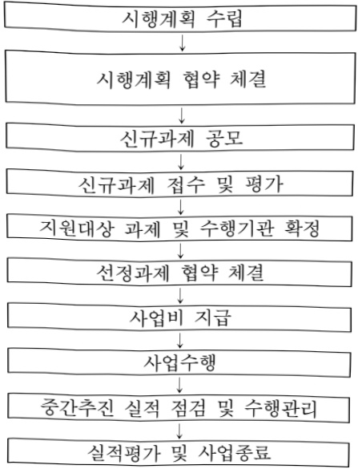

# 인공지능 신뢰성 혁신 실증사업

**해당 페이지**: PDF 1293 ~ 1298 쪽 해당

**부처**: 과학기술정보통신부
**분야**: 통신
**회계유형**: 지역균형발전 특별회계
**2026 확정예산**: 1000.0 백만원
**전년대비 증감률**: None%
**AI 도메인**: 디지털전환(AX)

---

<table border=1 style='margin: auto; word-wrap: break-word;'><tr><td style='text-align: center; word-wrap: break-word;'>사 업 명</td></tr><tr><td style='text-align: center; word-wrap: break-word;'>(47) 인공지능 신뢰성 혁신 실증사업 (4231-301)</td></tr></table>

사업 코드 정보

<table border=1 style='margin: auto; word-wrap: break-word;'><tr><td style='text-align: center; word-wrap: break-word;'>구분</td><td style='text-align: center; word-wrap: break-word;'>회계</td><td style='text-align: center; word-wrap: break-word;'>소관</td><td style='text-align: center; word-wrap: break-word;'>실국(기관)</td><td style='text-align: center; word-wrap: break-word;'>계정</td><td style='text-align: center; word-wrap: break-word;'>분야</td><td style='text-align: center; word-wrap: break-word;'>부문</td></tr><tr><td style='text-align: center; word-wrap: break-word;'>코드</td><td style='text-align: center; word-wrap: break-word;'>지역균형발전</td><td style='text-align: center; word-wrap: break-word;'>과학기술정보</td><td rowspan="2">소프트웨어정책관</td><td rowspan="2">지역지원</td><td style='text-align: center; word-wrap: break-word;'>130</td><td style='text-align: center; word-wrap: break-word;'>133</td></tr><tr><td style='text-align: center; word-wrap: break-word;'>명칭</td><td style='text-align: center; word-wrap: break-word;'>특별회계</td><td style='text-align: center; word-wrap: break-word;'>통신부</td><td style='text-align: center; word-wrap: break-word;'>통신</td><td style='text-align: center; word-wrap: break-word;'>정보통신</td></tr></table>

<table border=1 style='margin: auto; word-wrap: break-word;'><tr><td style='text-align: center; word-wrap: break-word;'>구분</td><td style='text-align: center; word-wrap: break-word;'>프로그램</td><td style='text-align: center; word-wrap: break-word;'>단위사업</td><td style='text-align: center; word-wrap: break-word;'>세부사업</td></tr><tr><td style='text-align: center; word-wrap: break-word;'>코드</td><td style='text-align: center; word-wrap: break-word;'>4200</td><td style='text-align: center; word-wrap: break-word;'>4231</td><td style='text-align: center; word-wrap: break-word;'>301</td></tr><tr><td style='text-align: center; word-wrap: break-word;'>명칭</td><td style='text-align: center; word-wrap: break-word;'>지역경제활성화</td><td style='text-align: center; word-wrap: break-word;'>광역경제권산업경쟁력강화(지역지원)</td><td style='text-align: center; word-wrap: break-word;'>인공지능 신뢰성 혁신 실증사업</td></tr></table>

□ 사업 성격 (공통요구자료 Ⅱ-1 작성유의사항 4. 참조, 해당하는 사항에 “○” 표시)

<table border=1 style='margin: auto; word-wrap: break-word;'><tr><td rowspan="2">신규</td><td rowspan="2">계속</td><td rowspan="2">완료</td><td rowspan="2">예비타당성 실시여부</td><td rowspan="2">총사업비 관리대상</td><td rowspan="2">총액계상 예산사업</td><td style='text-align: center; word-wrap: break-word;'>사업소관 변경정보</td></tr><tr><td style='text-align: center; word-wrap: break-word;'>2025예산 시 소관</td></tr><tr><td style='text-align: center; word-wrap: break-word;'>○</td><td style='text-align: center; word-wrap: break-word;'></td><td style='text-align: center; word-wrap: break-word;'></td><td style='text-align: center; word-wrap: break-word;'></td><td style='text-align: center; word-wrap: break-word;'></td><td style='text-align: center; word-wrap: break-word;'></td><td style='text-align: center; word-wrap: break-word;'></td></tr></table>

□ 사업 지원 형태 및 지원율

<table border=1 style='margin: auto; word-wrap: break-word;'><tr><td style='text-align: center; word-wrap: break-word;'>직접</td><td style='text-align: center; word-wrap: break-word;'>출자</td><td style='text-align: center; word-wrap: break-word;'>출연</td><td style='text-align: center; word-wrap: break-word;'>보조</td><td style='text-align: center; word-wrap: break-word;'>융자</td><td style='text-align: center; word-wrap: break-word;'>국고보조율(%)</td><td style='text-align: center; word-wrap: break-word;'>융자율(%)</td></tr><tr><td style='text-align: center; word-wrap: break-word;'></td><td style='text-align: center; word-wrap: break-word;'></td><td style='text-align: center; word-wrap: break-word;'>○</td><td style='text-align: center; word-wrap: break-word;'></td><td style='text-align: center; word-wrap: break-word;'></td><td style='text-align: center; word-wrap: break-word;'></td><td style='text-align: center; word-wrap: break-word;'></td></tr></table>

□사업 소관부처 및 시행주체

<table border=1 style='margin: auto; word-wrap: break-word;'><tr><td style='text-align: center; word-wrap: break-word;'>사업명</td><td colspan="2">구분</td></tr><tr><td rowspan="3">인공지능신뢰성혁신실증사업</td><td rowspan="2">소관부처</td><td style='text-align: center; word-wrap: break-word;'>정보통신정책실소프트웨어정책관</td></tr><tr><td style='text-align: center; word-wrap: break-word;'>소프트웨어산업과</td></tr><tr><td style='text-align: center; word-wrap: break-word;'>사업시행주체</td><td style='text-align: center; word-wrap: break-word;'>정보통신산업진흥원</td></tr></table>

---

### 가.예산 총괄표

(단위: 백만원, %)

<table border=1 style='margin: auto; word-wrap: break-word;'><tr><td rowspan="2">사업명</td><td rowspan="2">2024년 결산</td><td colspan="2">2025년 예산</td><td colspan="2">2026년 예산</td><td rowspan="2">중감 (B-A)</td><td rowspan="2">(B-A)/A</td></tr><tr><td style='text-align: center; word-wrap: break-word;'>본예산</td><td style='text-align: center; word-wrap: break-word;'>추경*(A)</td><td style='text-align: center; word-wrap: break-word;'>요구안</td><td style='text-align: center; word-wrap: break-word;'>본예산(B)</td></tr><tr><td style='text-align: center; word-wrap: break-word;'>인공지능 신뢰성 혁신 실증사업</td><td style='text-align: center; word-wrap: break-word;'>-</td><td style='text-align: center; word-wrap: break-word;'>-</td><td style='text-align: center; word-wrap: break-word;'>-</td><td style='text-align: center; word-wrap: break-word;'>1,000</td><td style='text-align: center; word-wrap: break-word;'>1,000</td><td style='text-align: center; word-wrap: break-word;'>순증</td><td style='text-align: center; word-wrap: break-word;'>순증</td></tr></table>

*추경: 추경증감액을 포함한 최종 예산액을 기재

## □ 기능별(내역사업별) 예산 내역

(단위:백만원)

<table border=1 style='margin: auto; word-wrap: break-word;'><tr><td rowspan="2"></td><td colspan="5">2024</td><td colspan="5">2025</td><td style='text-align: center; word-wrap: break-word;'>2026 倉塗</td></tr><tr><td style='text-align: center; word-wrap: break-word;'>倉塗塗塗塗塗塗塗塗塗塗塗塗塗塗塗塗塗塗塗塗塗塗塗塗塗塗塗塗塗塗塗塗塗塗塗塗塗塗塗塗塗塗塗塗塗塗塗塗塗塗塗塗塗塗塗塗塗塗塗塗塗塗塗塗塗塗塗塗塗塗塗塗塗塗塗塗塗塗塗塗塗塗塗塗塗塗塗塗塗塗塗塗塗塗塗塗塗塗塗塗塗塗塗塗塗塗塗塗塗塗塗塗塗塗塗塗塗塗塗塗塗塗塗塗塗塗塗塗塗塗塗塗塗塗塗塗塗塗塗塗塗塗塗塗塗塗塗塗塗塗塗塗塗塗塗塗塗塗塗塗塗塗塗塗塗塗塗塗塗塗塗塗塗塗塗塗塗塗塗塗塗塗塗塗塗塗塗塗塗塗塗塗塗塗塗塗塗塗塗塗塗塗塗塗塗塗塗塗塗塗塗塗塗塗塗塗塗塗塗塗塗塗塗塗塗塗塗塗塗塗塗塗塗塗塗塗塗塗塗塗塗塗塗塗塗塗塗塗塗塗塗塗塗塗塗塗塗塗塗塗塗塗塗塗塗塗塗塗塗塗塗塗塗塗塗塗塗塗塗塗塗塗塗塗塗塗塗塗塗塗塗塗塗塗塗塗塗塗塗塗塗塗塗塗塗塗塗塗塗塗塗塗塗塗塗塗塗塗塗塗塗塗塗塗塗塗塗塗塗塗塗塗塗塗塗塗塗塗塗塗塗塗塗塗塗塗塗塗塗塗塗塗塗塗塗塗塗塗塗塗塗塗塗塗塗塗塗塗塗塗塗塗塗塗塗塗塗塗塗塗塗塗塗塗塗塗塗塗塗塗塗塗塗塗塗塗塗塗塗塗塗塗塗塗塗塗塗塗塗塗塗塗塗塗塗塗塗塗塗塗塗塗塗塗塗塗塗塗塗塗塗塗塗塗塗塗塗塗塗塗塗塗塗塗塗塗塗塗塗塗塗塗塗塗塗塗塗塗塗塗塗塗塗塗塗塗塗塗塗塗塗塗塗塗塗塗塗塗塗塗塗塗塗塗塗塗塗塗塗塗塗塗塗塗塗塗塗塗塗塗塗塗塗塗塗塗塗塗塗塗塗塗塗塗塗塗塗塗塗塗塗塗塗塗塗塗塗塗塗塗塗塗塗塗塗塗塗塗塗塗塗塗塗塗塗塗塗塗塗塗塗塗塗塗塗塗塗塗塗塗塗塗塗塗塗塗塗塗塗塗塗塗塗塗塗塗塗塗塗塗塗塗塗塗塗塗塗塗塗塗塗塗塗塗塗塗塗塗塗塗塗塗塗塗塗塗塗塗塗塗塗塗塗塗塗塗塗塗塗塗塗塗塗塗塗塗塗塗塗塗塗塗塗塗塗塗塗塗塗塗塗塗塗塗塗塗塗塗塗塗塗塗塗塗塗塗塗塗塗塗塗塗塗塗塗塗塗塗塗塗塗塗塗塗塗塗塗塗塗塗塗塗塗塗塗塗塗塗塗塗塗塗塗塗塗塗塗塗塗塗塗塗塗塗塗塗塗塗塗塗塗塗塗塗塗塗塗塗塗塗塗塗塗塗塗塗塗塗塗塗塗塗塗塗塗塗塗塗塗塗塗塗塗塗塗塗塗塗塗塗塗塗塗塗塗塗塗塗塗塗塗塗塗塗塗塗塗塗塗塗塗塗塗塗塗塗塗塗塗塗塗塗塗塗塗塗塗塗塗塗塗塗塗塗塗塗塗塗塗塗塗塗塗塗塗塗塗塗塗塗塗塗塗塗塗塗塗塗塗塗塗塗塗塗塗塗塗塗塗塗塗塗塗塗塗塗塗塗塗塗塗塗塗塗塗塗塗塗塗塗塗塗塗塗塗塗塗塗塗塗塗塗塗塗塗塗塗塗塗塗塗塗塗塗塗塗塗塗塗塗塗塗塗塗塗塗塗塗塗塗塗塗塗塗塗塗塗塗塗塗塗塗塗塗塗塗塗塗塗塗塗塗塗塗塗塗塗塗塗塗塗塗塗塗塗塗塗塗塗塗塗塗塗塗塗塗塗塗塗塗塗塗塗塗塗塗塗塗塗塗塗塗塗塗塗塗塗塗塗塗塗塗塗塗塗塗塗塗塗塗塗塗塗塗塗塗塗塗塗塗塗塗塗塗塗塗塗塗塗塗塗塗塗塗塗塗塗塗塗塗塗塗塗塗塗塗塗塗塗塗塗塗塗塗塗塗塗塗塗塗塗塗塗塗塗塗塗塗塗塗塗塗塗塗塗塗塗塗塗塗塗塗塗塗塗塗塗塗塗塗塗塗塗塗塗塗塗塗塗塗塗塗塗塗塗塗塗塗塗塗塗塗塗塗塗塗塗塗塗塗塗塗塗塗塗塗塗塗塗塗塗塗塗塗塗塗塗塗塗塗塗塗塗塗塗塗塗塗塗塗塗塗塗塗塗塗塗塗塗塗塗塗塗塗塗塗塗塗塗塗塗塗塗塗塗塗塗塗塗塗塗塗塗塗塗塗塗塗塗塗塗塗塗塗塗塗塗塗塗塗塗塗塗塗塗塗塗塗塗塗塗塗塗塗塗塗塗塗塗塗塗塗塗塗塗塗塗塗塗塗塗塗塗塗塗塗塗塗塗塗塗塗塗塗塗塗塗塗塗塗塗塗塗塗塗塗塗塗塗塗塗塗塗塗塗塗塗塗塗塗塗塗塗塗塗塗塗塗塗塗塗塗塗塗塗塗塗塗塗塗塗塗塗塗塗塗塗塗塗塗塗塗塗塗塗塗塗塗塗塗塗塗塗塗塗塗塗塗塗塗塗塗塗塗塗塗塗塗塗塗塗塗塗塗塗塗塗塗塗塗塗塗塗塗塗塗塗塗塗塗塗塗塗塗塗塗塗塗塗塗塗塗塗塗塗塗塗塗塗塗塗塗塗塗塗塗塗塗塗塗塗塗塗塗塗塗塗塗塗塗塗塗塗</td><td style='text-align: center; word-wrap: break-word;'></td><td style='text-align: center; word-wrap: break-word;'></td><td style='text-align: center; word-wrap: break-word;'></td><td style='text-align: center; word-wrap: break-word;'></td><td style='text-align: center; word-wrap: break-word;'></td><td style='text-align: center; word-wrap: break-word;'></td><td style='text-align: center; word-wrap: break-word;'></td><td style='text-align: center; word-wrap: break-word;'></td><td style='text-align: center; word-wrap: break-word;'></td><td style='text-align: center; word-wrap: break-word;'></td></tr></table>

### 나. 사업설명자료

## 1 ) 사업목적·내용

(인공지능 신뢰성 혁신 실증사업) 지역특화산업 AX기업 글로벌 규제 대응력 및 시장 경쟁력 제고를 위한 AI안전·신뢰성 확보 지원을 통해 신뢰가능한 AI생태계 조성

<table border=1 style='margin: auto; word-wrap: break-word;'><tr><td style='text-align: center; word-wrap: break-word;'>- AI 제품·서비스를 보유한 지역 AX기업 대상, AI 위험도 진단 및 신뢰성 보완, AI 검·인증 등 AI 신뢰성 향상 지원</td></tr><tr><td style='text-align: center; word-wrap: break-word;'>- 활용 아이디어를 보유한 지역기업 대상, 기획단계부터 AI 신뢰성 컨설팅·구현·검인증 등 AI 신뢰성 설계·확보 지원</td></tr></table>

## 2 ) 사업개요

## ☐ 사업근거 및 추진경위

① 법령상 근거 조항 적시

- 지방자치분권 및 지역군형발전에 관한 특별법 제14조(지역 산업 육성 및 일자리 창출 등 지역경제 활성화 촉진)④ 국가와 지방자치단체는 지역 산업의 육성과 지역경제의 활성화를 위하여 지역의 일자리 창출과 투자 유치활동 지원, 정보통신 진흥 및 지역

---

특성에 맞는 중소기업의 창업 여건 개선 등에 관한 시책을 추진하여야 한다.

- 정보통신산업진흥법 제27조(사업) 산업진흥원은 다음 각 호의 사업을 한다.

- 정보통신산업진흥법 제28조(재원 등)① 정부는 예산 또는 기금의 범위에서 산업진흥원의 설립, 시설, 운영 및 사업추진 등에 필요한 경비의 전부 또는 일부를 충족한 수 있다.

- 소프트웨어진흥법 제9조(지역별 소프트웨어산업 진흥)①과학기술정보통신부장관은 지역별 특성에 기반한 소프트웨어산업 진흥을 지원하고 지역 산업과의 융합을 촉진하여야 한다.

② 과학기술정보통신부장관은 제1항에 따른 업무를 효과적으로 시행하기 위하여 대통령령으로 정하는 요건을 갖춘 기관을 지역별 소프트웨어산업 진흥기관(이하 이 조에서 “지역산업진흥기관”이라 한다)으로 지정하여 업무를 위탁할 수 있다.

- 인공지능 발전과 신뢰 기반 조성 등에 관한 기본법 제29조(인공지능 신뢰기반 조성을 위한 시책의 마련)정부는 인공지능이 국민의 생활에 미치는 잠재적 위험을 최소화하고 안전한 인공지능의 이용을 위한 신뢰 기반을 조성하기 위하여 다음 각 호의 시책을 마련하여야 한다.

- 인공지능 발전과 신뢰 기반 조성 등에 관한 기본법 제30조(인공지능 안전성·신뢰성 검·인증등 지원) ① 과학기술정보통신부장관은 단체등이 인공지능의 안전성·신뢰성 확보를 위하여 자율적으로 추진하는 검증·인증 활동(이하 “검·인증등”이라 한다)을 지원하기 위하여 다음 각 호의 사업을 추진할 수 있다.

- 인공지능 발전과 신뢰 기반 조성 등에 관한 기본법 제34조(고영향 인공지능과 관련한 사업자의 책무) ① 인공지능사업자는 고영향 인공지능 또는 이를 이용한 제품 · 서비스를 제공하는 경우 고영향 인공지능의 안전성 · 신뢰성을 확보하기 위하여 다음 각호의 내용을 포함하는 조치를 대통령령으로 정하는 바에 따라 이행하여야 한다.

② 추진경위

- '10.4 ~ : 14개* 지역SW품질역량센터 구축 및 운영

- '19.10 ~ : 9개소* KOLAS 국제공인시험기관 구축 운영(SW분야)

- '24.1 : 인공지능 지역화산(AI융합 지능형 농업 생태계 구축)운영

- '24.12 : AI지역학산 사업 AI검·인증 체계 연구

- '25.5 : [지역제기] 과기정통부 신규사업 사전 적격성 심사 통과

## 주요내용

① 사업규모

- 총사업비(해당되는 경우에만 기재) : 해당없음

- 사업기간 : 2026년

- 최근 5년 간 투입된 사업비(예산액기준, 추경편성한 연도에는 추경포함)

<table border=1 style='margin: auto; word-wrap: break-word;'><tr><td style='text-align: center; word-wrap: break-word;'>연도</td><td style='text-align: center; word-wrap: break-word;'>2022</td><td style='text-align: center; word-wrap: break-word;'>2023</td><td style='text-align: center; word-wrap: break-word;'>2024</td><td style='text-align: center; word-wrap: break-word;'>2025</td><td style='text-align: center; word-wrap: break-word;'>2026</td></tr><tr><td style='text-align: center; word-wrap: break-word;'>사업비</td><td style='text-align: center; word-wrap: break-word;'>-</td><td style='text-align: center; word-wrap: break-word;'>-</td><td style='text-align: center; word-wrap: break-word;'>-</td><td style='text-align: center; word-wrap: break-word;'>-</td><td style='text-align: center; word-wrap: break-word;'>1,000</td></tr></table>

- 기타: 해당없음

---

## ② 사업추진체계

- 사업시행방법 : 출연

- 사업시행주체 : 광역자치단체(수도권 제외), 정보통신산업진흥원

- 사업 수혜자 : 지역 소재 AI · AX기업

- 보조, 융자, 출연, 출자 등의 경우 보조 · 융자 등 지원 비율 및 법적근거

<table border=1 style='margin: auto; word-wrap: break-word;'><tr><td style='text-align: center; word-wrap: break-word;'>내역사업명</td><td style='text-align: center; word-wrap: break-word;'>구분</td><td style='text-align: center; word-wrap: break-word;'>피보조·피출연 등 기관명</td><td style='text-align: center; word-wrap: break-word;'>지원 금액 (2026예산)</td><td style='text-align: center; word-wrap: break-word;'>지원 비율(%)</td><td style='text-align: center; word-wrap: break-word;'>보조율 법적근거 (해당 조항)</td></tr><tr><td style='text-align: center; word-wrap: break-word;'>인공지능 신뢰성 혁신 실용사업</td><td style='text-align: center; word-wrap: break-word;'>출연</td><td style='text-align: center; word-wrap: break-word;'>정보통신산업진흥원</td><td style='text-align: center; word-wrap: break-word;'>1,000</td><td style='text-align: center; word-wrap: break-word;'>100%</td><td style='text-align: center; word-wrap: break-word;'>정보통신산업진흥법 제28조</td></tr></table>

## 3 ) 2026년도 예산 산출 근거

□ 인공지능 신뢰성 혁신 실증사업 : (2025본예산) - → (2026요구) 1,000백만원, 순증

- (요구) AI위험도·안전성분석 및 컨설팅, AI검·인증 지원 등 AI신뢰성 확보 순주기 신규지원 필요

- (산출) TAI Boost(AI 신뢰성 향상 지원) : 50백만원 x 10개 = 500백만원

TAI Build(AI 신뢰성 설계 확보지원) : 50백만원 x 10개 = 500백만원

2025년도 예산 및 2026년도 예산안 산출 세부내역 비교

<table border=1 style='margin: auto; word-wrap: break-word;'><tr><td colspan="2">2025년 본예산</td><td colspan="2">2026년 예산</td></tr><tr><td style='text-align: center; word-wrap: break-word;'>예산</td><td style='text-align: center; word-wrap: break-word;'>산출내역</td><td style='text-align: center; word-wrap: break-word;'>예산</td><td style='text-align: center; word-wrap: break-word;'>산출내역</td></tr><tr><td style='text-align: center; word-wrap: break-word;'>-</td><td style='text-align: center; word-wrap: break-word;'>-</td><td style='text-align: center; word-wrap: break-word;'>1,000</td><td style='text-align: center; word-wrap: break-word;'>○ 사업출연금(350-02): 1,000백만원
- 인공지능 신뢰성 혁신 실증사업(1,000백만원)
• AI위험도·안전성분석 및 컨설팅, AI감인증 지원 등 AI신뢰성 확보
  초주기 신규지원 필요
: TAI Boost(AI 신뢰성 향상 지원): 50백만원 x 10개 = 500백만원
TAI Build(AI 신뢰성 설계 확보지원): 50백만원 x 10개 = 500백만원</td></tr></table>

---

## 4 ) 사업효과

사업영향, 산출물 성과지표 등

① 2022~2026년도 성과계획서 상 성과지표 및 최근 5년간 성과 달성도

<table border=1 style='margin: auto; word-wrap: break-word;'><tr><td style='text-align: center; word-wrap: break-word;'>성과지표</td><td style='text-align: center; word-wrap: break-word;'>구분</td><td style='text-align: center; word-wrap: break-word;'>2022</td><td style='text-align: center; word-wrap: break-word;'>2023</td><td style='text-align: center; word-wrap: break-word;'>2024</td><td style='text-align: center; word-wrap: break-word;'>2025</td><td style='text-align: center; word-wrap: break-word;'>2026</td><td style='text-align: center; word-wrap: break-word;'>2026 목표치산출근거</td><td style='text-align: center; word-wrap: break-word;'>측정산식(또는 측정방법)</td><td style='text-align: center; word-wrap: break-word;'>자료수집방법(또는 자료출처)</td></tr><tr><td rowspan="3">AI검·인증지원(단위: 진)</td><td style='text-align: center; word-wrap: break-word;'>목표</td><td style='text-align: center; word-wrap: break-word;'>-</td><td style='text-align: center; word-wrap: break-word;'>-</td><td style='text-align: center; word-wrap: break-word;'>-</td><td style='text-align: center; word-wrap: break-word;'>-</td><td style='text-align: center; word-wrap: break-word;'>10</td><td rowspan="3">과기정통부신규적정성 평가기준으로 목표 설정</td><td rowspan="3">매년 전수조사</td><td rowspan="3">당해연도결과보고서</td></tr><tr><td style='text-align: center; word-wrap: break-word;'>실적</td><td style='text-align: center; word-wrap: break-word;'>-</td><td style='text-align: center; word-wrap: break-word;'>-</td><td style='text-align: center; word-wrap: break-word;'>-</td><td style='text-align: center; word-wrap: break-word;'>-</td><td style='text-align: center; word-wrap: break-word;'>-</td></tr><tr><td style='text-align: center; word-wrap: break-word;'>달성도</td><td style='text-align: center; word-wrap: break-word;'>-</td><td style='text-align: center; word-wrap: break-word;'>-</td><td style='text-align: center; word-wrap: break-word;'>-</td><td style='text-align: center; word-wrap: break-word;'>-</td><td style='text-align: center; word-wrap: break-word;'>-</td></tr></table>

② 성과지표 이외의 연도별 사업추진 경과 및 실적 : 해당없음

③ 향후(2026년도 이후) 기대효과

- '26년『인공지능 발전과 신뢰 기반 조성 등에 관한 기본법』관련 내용 선제적 대응 및 지역특화산업 AX기업 글로벌 규제 대응력 및 시장경쟁력 제고를 위한 AI안전·신뢰성 확보 지원을 통해 신뢰가능한 AI생태계 조성

5) 타당성조사 및 예비타당성조사 시행여부 및 결과 요지 : 해당없음

6) 총사업비 대상사업 정보 : 해당없음

## 7 ) 사업 집행절차

## 8 ) 각종 평가

1) 국회(예결위, 상임위, 예정처, 국정감사 포함) 지적 : 해당없음

2) 대외공개 평가 : 해당없음

3) 자체평가 : 해당없음

### 다. 최근 4년간 결산내역

## 1 ) 결산표

---

## 과학기술정보통신부

과학기술정보통신부 →

정보통신산업진흥원(전담기관)

정보통신산업진흥원(전담기관)

정보통신산업진흥원(전담기관)

과학기술정보통신부

정보통신산업진흥원 $\leftrightarrow$ 사업수행기관

정보통신산업진흥원 → 사업수행기관

사업수행기관(주관, 참여)

과학기술정보통신부, 정보통신산업진흥원

과학기술정보통신부, 정보통신산업진흥원

<table border=1 style='margin: auto; word-wrap: break-word;'><tr><td style='text-align: center; word-wrap: break-word;'>부처</td><td style='text-align: center; word-wrap: break-word;'></td><td style='text-align: center; word-wrap: break-word;'>전담기관</td><td style='text-align: center; word-wrap: break-word;'></td><td style='text-align: center; word-wrap: break-word;'>사업수행자</td></tr><tr><td style='text-align: center; word-wrap: break-word;'>과학기술정보통신부(1,000백만원)</td><td style='text-align: center; word-wrap: break-word;'>=&gt;출연금(1,000백만원)</td><td style='text-align: center; word-wrap: break-word;'>정보통신산업진흥원(50백만원)</td><td style='text-align: center; word-wrap: break-word;'>=&gt;(950백만원)</td><td style='text-align: center; word-wrap: break-word;'>지역SW산업진흥기관(950백만원)</td></tr></table>

☐ 부처 결산내역

(단위: 백만원, %)

<table border=1 style='margin: auto; word-wrap: break-word;'><tr><td rowspan="2">연도</td><td colspan="3">예산액</td><td rowspan="2">예산현액(A)</td><td rowspan="2">집행액(B)</td><td rowspan="2">집행률(B/A)</td><td rowspan="2">다음연도이월액</td><td rowspan="2">불용액</td></tr><tr><td style='text-align: center; word-wrap: break-word;'>본예산</td><td style='text-align: center; word-wrap: break-word;'>추경증감액</td><td style='text-align: center; word-wrap: break-word;'>추경</td></tr><tr><td style='text-align: center; word-wrap: break-word;'>2022</td><td style='text-align: center; word-wrap: break-word;'>-</td><td style='text-align: center; word-wrap: break-word;'>-</td><td style='text-align: center; word-wrap: break-word;'>-</td><td style='text-align: center; word-wrap: break-word;'>-</td><td style='text-align: center; word-wrap: break-word;'>-</td><td style='text-align: center; word-wrap: break-word;'>-</td><td style='text-align: center; word-wrap: break-word;'>-</td><td style='text-align: center; word-wrap: break-word;'>-</td></tr><tr><td style='text-align: center; word-wrap: break-word;'>2023</td><td style='text-align: center; word-wrap: break-word;'>-</td><td style='text-align: center; word-wrap: break-word;'>-</td><td style='text-align: center; word-wrap: break-word;'>-</td><td style='text-align: center; word-wrap: break-word;'>-</td><td style='text-align: center; word-wrap: break-word;'>-</td><td style='text-align: center; word-wrap: break-word;'>-</td><td style='text-align: center; word-wrap: break-word;'>-</td><td style='text-align: center; word-wrap: break-word;'>-</td></tr><tr><td style='text-align: center; word-wrap: break-word;'>2024</td><td style='text-align: center; word-wrap: break-word;'>-</td><td style='text-align: center; word-wrap: break-word;'>-</td><td style='text-align: center; word-wrap: break-word;'>-</td><td style='text-align: center; word-wrap: break-word;'>-</td><td style='text-align: center; word-wrap: break-word;'>-</td><td style='text-align: center; word-wrap: break-word;'>-</td><td style='text-align: center; word-wrap: break-word;'>-</td><td style='text-align: center; word-wrap: break-word;'>-</td></tr><tr><td style='text-align: center; word-wrap: break-word;'>2025</td><td style='text-align: center; word-wrap: break-word;'>-</td><td style='text-align: center; word-wrap: break-word;'>-</td><td style='text-align: center; word-wrap: break-word;'>-</td><td style='text-align: center; word-wrap: break-word;'>-</td><td style='text-align: center; word-wrap: break-word;'>-</td><td style='text-align: center; word-wrap: break-word;'>-</td><td style='text-align: center; word-wrap: break-word;'>-</td><td style='text-align: center; word-wrap: break-word;'>-</td></tr></table>

## 2 ) 주요 결산사항

2022~2025년 결산 주요사항 : 해당없음

2025년 이·전용 등 세부내역 : 해당없음

---

### 원본 PDF 크롭 이미지

