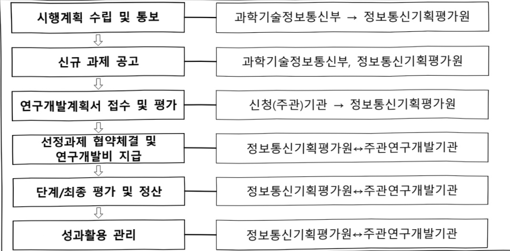

# 인공지능융합혁신인재양성(R&D)

**해당 페이지**: PDF 1306 ~ 1312 쪽 해당

**부처**: 과학기술정보통신부
**분야**: 통신
**회계유형**: 일반회계
**2026 확정예산**: 21000.0 백만원
**전년대비 증감률**: 55.5%
**AI 도메인**: 디지털전환(AX)

---

<table border=1 style='margin: auto; word-wrap: break-word;'><tr><td style='text-align: center; word-wrap: break-word;'>사 업 명</td></tr><tr><td style='text-align: center; word-wrap: break-word;'>(215) 인공지능융합혁신인재양성(2232-302)</td></tr></table>

사업 코드 정보

<table border=1 style='margin: auto; word-wrap: break-word;'><tr><td style='text-align: center; word-wrap: break-word;'>구분</td><td style='text-align: center; word-wrap: break-word;'>회계</td><td style='text-align: center; word-wrap: break-word;'>소관</td><td style='text-align: center; word-wrap: break-word;'>실국(기관)</td><td style='text-align: center; word-wrap: break-word;'>계정</td><td style='text-align: center; word-wrap: break-word;'>분야</td><td style='text-align: center; word-wrap: break-word;'>부문</td></tr><tr><td rowspan="2">코드 명칭</td><td rowspan="2">일반회계</td><td rowspan="2">과학기술정보통신부</td><td rowspan="2">정보통신정책실소프트웨어정책관</td><td rowspan="2">-</td><td style='text-align: center; word-wrap: break-word;'>130</td><td style='text-align: center; word-wrap: break-word;'>133</td></tr><tr><td style='text-align: center; word-wrap: break-word;'>통신</td><td style='text-align: center; word-wrap: break-word;'>정보통신</td></tr></table>

<table border=1 style='margin: auto; word-wrap: break-word;'><tr><td style='text-align: center; word-wrap: break-word;'>구분</td><td style='text-align: center; word-wrap: break-word;'>프로그램</td><td style='text-align: center; word-wrap: break-word;'>단위사업</td><td style='text-align: center; word-wrap: break-word;'>세부사업</td></tr><tr><td style='text-align: center; word-wrap: break-word;'>코드</td><td style='text-align: center; word-wrap: break-word;'>2200</td><td style='text-align: center; word-wrap: break-word;'>2232</td><td style='text-align: center; word-wrap: break-word;'>302</td></tr><tr><td style='text-align: center; word-wrap: break-word;'>명칭</td><td style='text-align: center; word-wrap: break-word;'>SW산업진흥</td><td style='text-align: center; word-wrap: break-word;'>SW융합인력양성</td><td style='text-align: center; word-wrap: break-word;'>인공지능융합혁신인재양성(R&amp;D)</td></tr></table>

사업 성격 (공통요구자료 Ⅱ-1 작성유의사항 4. 참조, 해당하는 사항에 “○” 표시)

<table border=1 style='margin: auto; word-wrap: break-word;'><tr><td rowspan="2">신규</td><td rowspan="2">계속</td><td rowspan="2">완료</td><td rowspan="2">예비타당성 실시여부</td><td rowspan="2">총사업비 관리대상</td><td rowspan="2">총액계상 예산사업</td><td style='text-align: center; word-wrap: break-word;'>사업소관 변경정보</td></tr><tr><td style='text-align: center; word-wrap: break-word;'>2025예산 시 소관</td></tr><tr><td style='text-align: center; word-wrap: break-word;'></td><td style='text-align: center; word-wrap: break-word;'>O</td><td style='text-align: center; word-wrap: break-word;'></td><td style='text-align: center; word-wrap: break-word;'></td><td style='text-align: center; word-wrap: break-word;'></td><td style='text-align: center; word-wrap: break-word;'></td><td style='text-align: center; word-wrap: break-word;'></td></tr></table>

□ 사업 지원 형태 및 지원을 (최소한 한 개는 반드시 선택하시오. 해당사항에 0 표시)

<table border=1 style='margin: auto; word-wrap: break-word;'><tr><td style='text-align: center; word-wrap: break-word;'>직접</td><td style='text-align: center; word-wrap: break-word;'>출자</td><td style='text-align: center; word-wrap: break-word;'>출연</td><td style='text-align: center; word-wrap: break-word;'>보조</td><td style='text-align: center; word-wrap: break-word;'>융자</td><td style='text-align: center; word-wrap: break-word;'>국고보조율(%)</td><td style='text-align: center; word-wrap: break-word;'>융자율(%)</td></tr><tr><td style='text-align: center; word-wrap: break-word;'></td><td style='text-align: center; word-wrap: break-word;'></td><td style='text-align: center; word-wrap: break-word;'>O</td><td style='text-align: center; word-wrap: break-word;'></td><td style='text-align: center; word-wrap: break-word;'></td><td style='text-align: center; word-wrap: break-word;'></td><td style='text-align: center; word-wrap: break-word;'></td></tr></table>

사업 소관부처 및 시행주체

<table border=1 style='margin: auto; word-wrap: break-word;'><tr><td style='text-align: center; word-wrap: break-word;'>사업명</td><td colspan="2">구분</td></tr><tr><td rowspan="3">인공지능융합 혁신인재양성</td><td rowspan="2">소관부처</td><td style='text-align: center; word-wrap: break-word;'>정보통신정책실 소프트웨어정책관</td></tr><tr><td style='text-align: center; word-wrap: break-word;'>소프트웨어정책과</td></tr><tr><td style='text-align: center; word-wrap: break-word;'>사업시행주체</td><td style='text-align: center; word-wrap: break-word;'>정보통신기획평가원</td></tr></table>

---

### 가. 예산 총괄표

(단위: 백만원, %)

<table border=1 style='margin: auto; word-wrap: break-word;'><tr><td rowspan="2">사업명</td><td rowspan="2">2024년 결산</td><td colspan="2">2025년 예산</td><td colspan="2">2026년 예산</td><td rowspan="2">증감(B-A)</td><td rowspan="2">(B-A)/A</td></tr><tr><td style='text-align: center; word-wrap: break-word;'>본예산</td><td style='text-align: center; word-wrap: break-word;'>추경*(A)</td><td style='text-align: center; word-wrap: break-word;'>요구안</td><td style='text-align: center; word-wrap: break-word;'>본예산(B)</td></tr><tr><td style='text-align: center; word-wrap: break-word;'>인공지능융합혁신인재양성(R&amp;D)</td><td style='text-align: center; word-wrap: break-word;'>10,500</td><td style='text-align: center; word-wrap: break-word;'>13,500</td><td style='text-align: center; word-wrap: break-word;'>-</td><td style='text-align: center; word-wrap: break-word;'>21,000</td><td style='text-align: center; word-wrap: break-word;'>21,000</td><td style='text-align: center; word-wrap: break-word;'>7,500</td><td style='text-align: center; word-wrap: break-word;'>55.5</td></tr></table>

* 추경: 추경증감액을 포함한 최종 예산액을 기재

## □ 기능별(내역사업별) 예산 내역

(단위:백만원)

<table border=1 style='margin: auto; word-wrap: break-word;'><tr><td rowspan="2"></td><td colspan="5">2024</td><td colspan="5">2025</td><td rowspan="2">2026예산</td></tr><tr><td style='text-align: center; word-wrap: break-word;'>예산액(추경)</td><td style='text-align: center; word-wrap: break-word;'>예산현액</td><td style='text-align: center; word-wrap: break-word;'>집행액</td><td style='text-align: center; word-wrap: break-word;'>이월액</td><td style='text-align: center; word-wrap: break-word;'>불용액</td><td style='text-align: center; word-wrap: break-word;'>예산액(추경)</td><td style='text-align: center; word-wrap: break-word;'>예산현액</td><td style='text-align: center; word-wrap: break-word;'>집행액</td><td style='text-align: center; word-wrap: break-word;'>이월액</td><td style='text-align: center; word-wrap: break-word;'>불용액</td></tr><tr><td style='text-align: center; word-wrap: break-word;'>○ 기능별 분류(합계)</td><td style='text-align: center; word-wrap: break-word;'>10,500</td><td style='text-align: center; word-wrap: break-word;'>10,500</td><td style='text-align: center; word-wrap: break-word;'>10,500[10,500]</td><td style='text-align: center; word-wrap: break-word;'>-</td><td style='text-align: center; word-wrap: break-word;'>-</td><td style='text-align: center; word-wrap: break-word;'>13,500</td><td style='text-align: center; word-wrap: break-word;'>13,500</td><td style='text-align: center; word-wrap: break-word;'>13,500</td><td style='text-align: center; word-wrap: break-word;'>-</td><td style='text-align: center; word-wrap: break-word;'>-</td><td style='text-align: center; word-wrap: break-word;'>21,000</td></tr><tr><td style='text-align: center; word-wrap: break-word;'>• 인공지능융합혁신인재양성</td><td style='text-align: center; word-wrap: break-word;'>10,500</td><td style='text-align: center; word-wrap: break-word;'>10,500</td><td style='text-align: center; word-wrap: break-word;'>10,500[10,500]</td><td style='text-align: center; word-wrap: break-word;'>-</td><td style='text-align: center; word-wrap: break-word;'>-</td><td style='text-align: center; word-wrap: break-word;'>13,500</td><td style='text-align: center; word-wrap: break-word;'>13,500</td><td style='text-align: center; word-wrap: break-word;'>13,500</td><td style='text-align: center; word-wrap: break-word;'>-</td><td style='text-align: center; word-wrap: break-word;'>-</td><td style='text-align: center; word-wrap: break-word;'>6,000</td></tr><tr><td style='text-align: center; word-wrap: break-word;'>• 인공지능혁신인재양성</td><td style='text-align: center; word-wrap: break-word;'>-</td><td style='text-align: center; word-wrap: break-word;'>-</td><td style='text-align: center; word-wrap: break-word;'>-</td><td style='text-align: center; word-wrap: break-word;'>-</td><td style='text-align: center; word-wrap: break-word;'>-</td><td style='text-align: center; word-wrap: break-word;'>-</td><td style='text-align: center; word-wrap: break-word;'>-</td><td style='text-align: center; word-wrap: break-word;'>-</td><td style='text-align: center; word-wrap: break-word;'>-</td><td style='text-align: center; word-wrap: break-word;'>-</td><td style='text-align: center; word-wrap: break-word;'>15,000</td></tr></table>

### 나. 사업설명자료

## 1 ) 사업목적·내용

- (인공지능융합혁신인재양성) 산·학 공동 AI융합프로젝트를 통해 산업계 현안 해결

지원 및 기업이 직접 교육과정에 참여하여 실전형 고급 인재양성

- (인공지능혁신인재양성) 국내 대학이 기업과 함께 AI Core 및 AI휴합 특화 교육을 통해 실전형 AI혁신(AX : AI Transformation) 고급인재를 집중 양성

## 2 ) 사업개요

## □ 사업근거 및 추진경위

① 법령상 근거 및 조항 적시

- 정보통신진흥 및 융합활성화 등에 관한 특별법 제11조(국내 전문인력 양성)

---

정보통신진흥 및 융합활성화 등에 관한 특별법 제11조(국내 전문인력 양성) ① 과학기술 정보통신부장관은 정보통신 분야의 전문적인 기술, 지식 등을 가진 인력(이하 "전문인력"이라 한다)의 육성에 관한 시책을 수립 · 추진하여야 하며, 특히 소프트웨어 교육의 저변화대 및 지역산업의 발전을 위한 소프트웨어 특화교육 활성화를 위하여 노력하여야 한다.

② 제1항에 따른 시책에는 다음 각 호의 사항이 포함되어야 한다.

1. 전문인력의 육성 및 교육훈련에 관한 사항

2. 전문인력의 수급 및 활용에 관한 사항

3. 전문인력의 경력관리 지원 등에 관한 사항

4. 그 밖에 전문인력의 육성 및 관리 등을 위한 사항

## - 방송통신발전기본법 제21조(방송통신 전문인력의 양성 등)

방송통신발전기본법 제21조(방송통신 전문인력의 양성 등) 과학기술정보통신부장관은 방송통신 발전에 필요한 방송통신 전문인력을 양성하기 위하여 다음 각 호의 계획을 수립 · 시행하여야 한다.

1. 방송통신기술 및 방송통신서비스와 관련된 전문인력(이하 이 조에서 “전문인력”이라 한다) 수요 실태 및 중·장기 수급 전망 파악

2. 전문인력 양성사업의 지원

3. 전문인력 양성기관의 지원

4. 전문인력 양성 교육프로그램의 개발 및 보급 지원

5. 방송통신기술 자격제도의 정착 및 전문인력 수급 지원

6. 각 급 학교 및 그 밖의 교육기관에서 시행하는 방송통신기술 및 방송통신서비스 관련 교육의 지원

7. 일반국민에 대한 방송통신기술 및 방송통신서비스 관련 교육의 확대

8. 그 밖에 전문인력 양성에 필요한 사항

- 정보통신산업진흥법 제16조(전문인력 양성)

## 정보통신산업진흥법 제16조(전문인력 양성) 과학기술정보통신부장관은 정보통신산업의 진흥에 필요한 전문인력을 양성하기 위하여 다음 각 호의 시책을 마련하여야 한다

1. 전문인력의 수요 실태 파악 및 중·장기 수급 전망 수립

2. 전문인력 양성기관의 설립 · 지원

3. 전문인력 양성 교육프로그램의 개발 및 보급 지원

4. 정보통신기술 관련 자격제도의 정착 및 전문인력 수급 지원

5. 각급 학교 및 그 밖의 교육기관에서 시행하는 정보통신기술 및 정보통신산업 관련 교육의 지원

6. 그 밖에 전문인력 양성에 필요한 사항

## ② 추진경위

- 4차 산업혁명에 대응한 지능정보사회 종합대책 발표('16.12월)

- 4차산업혁명위원회 "I-Korea 4.0 실현을 위한 인공지능(AI) R&D 전략" 발표('18.5월)

- 제27차 경제활력대책회의 “인공지능 국가전략” 발표('18.12월)

- 제1차 혁신성장전략회의 “데이터·AI 경제 활성화 계획” 발표('19.1월)

---

- 제37차 비상경제중앙대책본부회의 “민·관 협력 기반의 소프트웨어 인재양성 대책”(21.6월)

- 디지털 인재양성 중합방안 수립·발표(관계부처 합동, '22.8월)

- 제26차 비상경제장관회의에서 「소프트웨어진흥전략」 발표('23.4월)

- 초거대AI경쟁력 강화방안 발표('23.4월)

- 인공지능(AI)-반도체전략(이니셔티브) 발표('24.4월)

- AI컴퓨팅 인프라 확충을 통한 국가AI역량 강화방안('25.2)

- 초격차 AI선도기술·인재 확보(25.5)

## 주요내용

① 사업규모

- 총사업비 : 해당없음

- 사업기간 : '22년 ~ 계속

- 최근 5년 간 투입된 사업비(예산액기준, 추경편성한 연도에는 추경포함)

<table border=1 style='margin: auto; word-wrap: break-word;'><tr><td style='text-align: center; word-wrap: break-word;'>연도</td><td style='text-align: center; word-wrap: break-word;'>2022</td><td style='text-align: center; word-wrap: break-word;'>2023</td><td style='text-align: center; word-wrap: break-word;'>2024</td><td style='text-align: center; word-wrap: break-word;'>2025</td><td style='text-align: center; word-wrap: break-word;'>2026</td></tr><tr><td style='text-align: center; word-wrap: break-word;'>사업비</td><td style='text-align: center; word-wrap: break-word;'>3,750</td><td style='text-align: center; word-wrap: break-word;'>10,500</td><td style='text-align: center; word-wrap: break-word;'>10,500</td><td style='text-align: center; word-wrap: break-word;'>13,500</td><td style='text-align: center; word-wrap: break-word;'>21,000</td></tr></table>

② 사업추진체계

- 사업시행방법 : 출연

- 사업시행주체 : 정보통신기획평가원

- 사업 수혜자 : 대학

- 보조, 융자, 출연, 출자 등의 경우 보조·융자 등 지원 비율 및 법적근거

<table border=1 style='margin: auto; word-wrap: break-word;'><tr><td style='text-align: center; word-wrap: break-word;'>내역사업명</td><td style='text-align: center; word-wrap: break-word;'>구분</td><td style='text-align: center; word-wrap: break-word;'>피보조·피출연 등 기관명</td><td style='text-align: center; word-wrap: break-word;'>지원 금액 (2026예산)</td><td style='text-align: center; word-wrap: break-word;'>지원 비율(%)</td><td style='text-align: center; word-wrap: break-word;'>보조율 법적근거 (해당 조항)</td></tr><tr><td style='text-align: center; word-wrap: break-word;'>인공지능융합 혁신안제강성</td><td style='text-align: center; word-wrap: break-word;'>출연</td><td style='text-align: center; word-wrap: break-word;'>정보통신 기획평가원</td><td style='text-align: center; word-wrap: break-word;'>21,000</td><td style='text-align: center; word-wrap: break-word;'>100</td><td style='text-align: center; word-wrap: break-word;'>·「국가연구개발혁신법」제13조(연구개발비 지급 및 사용 등) 제1항~제8항 ·제22조(전문기관의 지정 등) 제1항~제6항</td></tr></table>

## 3 ) 2026년도 예산 산출 근거

① 인공지능융합혁신인재양성

:(25)13,500백만원→(26요구)6,000백만원,7,500백만원감액

- (요구) 인공지능융합혁신대학원 지원을 통해 문제해결 역량을 갖추 실전형 고급인재 양성을 위한 계속과제 지속 지원

- (산출) 계속과제 4개 x 1,500백만원 x 12/12개월 = 6,000백만원

- 2025년도 예산 및 2026년도 예산안 산출 세부내역 비교

<table border=1 style='margin: auto; word-wrap: break-word;'><tr><td colspan="2">&#x27;25년 예산</td><td colspan="2">&#x27;26년 예산</td></tr><tr><td style='text-align: center; word-wrap: break-word;'>예산</td><td style='text-align: center; word-wrap: break-word;'>산줄내역</td><td style='text-align: center; word-wrap: break-word;'>예산</td><td style='text-align: center; word-wrap: break-word;'>산줄내역</td></tr><tr><td style='text-align: center; word-wrap: break-word;'>13,500</td><td style='text-align: center; word-wrap: break-word;'>연구활동비등(360-05): 13,500백만원</td><td style='text-align: center; word-wrap: break-word;'>6,000</td><td style='text-align: center; word-wrap: break-word;'>연구활동비등(360-05): 6,000백만원</td></tr></table>

---

<table border=1 style='margin: auto; word-wrap: break-word;'><tr><td colspan="2">25년 예산</td><td colspan="2">26년 예산</td></tr><tr><td style='text-align: center; word-wrap: break-word;'>예산</td><td style='text-align: center; word-wrap: break-word;'>산출내역</td><td style='text-align: center; word-wrap: break-word;'>예산</td><td style='text-align: center; word-wrap: break-word;'>산출내역</td></tr><tr><td style='text-align: center; word-wrap: break-word;'></td><td style='text-align: center; word-wrap: break-word;'>- (계속) 9개×1,500백만원×12/12개월 = 13,500백만원</td><td style='text-align: center; word-wrap: break-word;'></td><td style='text-align: center; word-wrap: break-word;'>- (계속) 4개×1,500백만원×12/12개월 = 6,000백만원</td></tr></table>

②인공지능혁신인재양성

:(25)→(26요구)15,000백만원,15,000백만원 순증

- (요구) 기업주도형으로 대학 내 “인공지능혁신대학원” 설립 및 AI 분야 이론과 실전을 겸비한 석박사 양성을 통해 AI 분야 핵심인재 확보, '25년 대비 15,000백만원(순증) 증액 요구

- (산출) 신규과제 10개 x 3,000백만원 x 6/12개월 = 15,000백만원

°2025년도 예산 및 2026년도 예산안 산출 세부내역 비교

<table border=1 style='margin: auto; word-wrap: break-word;'><tr><td colspan="2">&#x27;25년 예산</td><td colspan="2">&#x27;26년 예산</td></tr><tr><td style='text-align: center; word-wrap: break-word;'>예산</td><td style='text-align: center; word-wrap: break-word;'>산줄내역</td><td style='text-align: center; word-wrap: break-word;'>예산</td><td style='text-align: center; word-wrap: break-word;'>산줄내역</td></tr><tr><td style='text-align: center; word-wrap: break-word;'>-</td><td style='text-align: center; word-wrap: break-word;'>○ 연구활동비등(360-05) : -</td><td style='text-align: center; word-wrap: break-word;'>15,000</td><td style='text-align: center; word-wrap: break-word;'>○ 연구활동비등(360-05) : 15,000백만원
- (신규) 10개×3,000백만원×6/12개월 = 15,000백만원</td></tr></table>

## 4 ) 사업효과

□ 사업영향, 산출물 성과지표 등

①2022~2026년도 성과계획서 상 성과지표 및 최근 5년간 성과 달성도

<table border=1 style='margin: auto; word-wrap: break-word;'><tr><td style='text-align: center; word-wrap: break-word;'>성과지표</td><td style='text-align: center; word-wrap: break-word;'>구분</td><td style='text-align: center; word-wrap: break-word;'>2022</td><td style='text-align: center; word-wrap: break-word;'>2023</td><td style='text-align: center; word-wrap: break-word;'>2024</td><td style='text-align: center; word-wrap: break-word;'>2025</td><td style='text-align: center; word-wrap: break-word;'>2026</td><td style='text-align: center; word-wrap: break-word;'>2026 목표치산출근거</td><td style='text-align: center; word-wrap: break-word;'>측정산식(또는 측정방법)</td><td style='text-align: center; word-wrap: break-word;'>자료수집방법(또는 자료출처)</td></tr><tr><td rowspan="3">수혜자 만족도(단위: 점)</td><td style='text-align: center; word-wrap: break-word;'>목표</td><td style='text-align: center; word-wrap: break-word;'>83</td><td style='text-align: center; word-wrap: break-word;'>84</td><td style='text-align: center; word-wrap: break-word;'>85</td><td style='text-align: center; word-wrap: break-word;'>86</td><td style='text-align: center; word-wrap: break-word;'>87</td><td rowspan="3">AI용합연구센터의만족도를 참고지표로 활용하여목표치기준으로 설정</td><td rowspan="3">당해연도 사업참여 대학별수혜자(학생) 대상서조사센터 맞축도접수(100점 만점) 만족도 조사건수</td><td rowspan="3">대학별자체조사결과</td></tr><tr><td style='text-align: center; word-wrap: break-word;'>실적</td><td style='text-align: center; word-wrap: break-word;'>85</td><td style='text-align: center; word-wrap: break-word;'>88</td><td style='text-align: center; word-wrap: break-word;'>89.5</td><td style='text-align: center; word-wrap: break-word;'>92.4</td><td style='text-align: center; word-wrap: break-word;'>-</td></tr><tr><td style='text-align: center; word-wrap: break-word;'>달성도</td><td style='text-align: center; word-wrap: break-word;'>100</td><td style='text-align: center; word-wrap: break-word;'>100</td><td style='text-align: center; word-wrap: break-word;'>100</td><td style='text-align: center; word-wrap: break-word;'>100</td><td style='text-align: center; word-wrap: break-word;'>-</td></tr><tr><td rowspan="3">고급 AI연구역량지수(단위: 점)</td><td style='text-align: center; word-wrap: break-word;'>목표</td><td style='text-align: center; word-wrap: break-word;'>-</td><td style='text-align: center; word-wrap: break-word;'>57.8</td><td style='text-align: center; word-wrap: break-word;'>58.0</td><td style='text-align: center; word-wrap: break-word;'>58.2</td><td style='text-align: center; word-wrap: break-word;'>58.4</td><td rowspan="3">집단연구지원(선도연구센터)사업의 연평균mnif 증가율(0.3%)기준으로 상향목표 설정</td><td rowspan="3">SCI 논문의 표준화연영향력지수(mrnIF) = ∑표준화된 영향력지수(mrnIF) / 전체 논문건수</td><td rowspan="3">SCI 논문 검증표준화된 IF분석결과(인공지능을 학혁신인재양성사업성과보고서)</td></tr><tr><td style='text-align: center; word-wrap: break-word;'>실적</td><td style='text-align: center; word-wrap: break-word;'>-</td><td style='text-align: center; word-wrap: break-word;'>69.9</td><td style='text-align: center; word-wrap: break-word;'>73.8</td><td style='text-align: center; word-wrap: break-word;'>집계중</td><td style='text-align: center; word-wrap: break-word;'>-</td></tr><tr><td style='text-align: center; word-wrap: break-word;'>달성도</td><td style='text-align: center; word-wrap: break-word;'>-</td><td style='text-align: center; word-wrap: break-word;'>-</td><td style='text-align: center; word-wrap: break-word;'>-</td><td style='text-align: center; word-wrap: break-word;'>-</td><td style='text-align: center; word-wrap: break-word;'>-</td></tr></table>

② 성과지표 이외의 연도별 사업추진 경과 및 실적

<table border=1 style='margin: auto; word-wrap: break-word;'><tr><td style='text-align: center; word-wrap: break-word;'>2022</td><td style='text-align: center; word-wrap: break-word;'>- 경희대, 이화여대 등 인공지능융합혁신대학원 5개 신규과제 선정·지원</td></tr><tr><td style='text-align: center; word-wrap: break-word;'>2023</td><td style='text-align: center; word-wrap: break-word;'>- 동국대, 부산대 등 인공지능융합혁신대학원 4개 신규과제 선정·지원
- 경희대, 이화여대 등 인공지능융합혁신대학원 5개 계속과제 지원</td></tr><tr><td style='text-align: center; word-wrap: break-word;'>2024</td><td style='text-align: center; word-wrap: break-word;'>- 경희대, 이화여대 등 인공지능융합혁신대학원 9개 계속과제 지원
- AI분야 최고 전문가로 구성된 전임교원 252명 확보 및 우수 신입생 761명 선발
(‘22년 71명, ‘23년 310명, ‘24년 380명)(‘24년)</td></tr><tr><td style='text-align: center; word-wrap: break-word;'>2025</td><td style='text-align: center; word-wrap: break-word;'>- 경희대, 이화여대 등 인공지능융합혁신대학원 9개 계속과제 지원</td></tr></table>

③향후(2026년도 이후)기대효과

○ AI융합 산업분야 경쟁력 확보, AI융합 인재양성 및 인프라 조성 등 산업 도메인에 특화된 AI 융합 기술 허브 구축

o AI 기술 패권 경쟁을 선도할 수 있는 교육과정 등을 혁신하여 AI 분야 기술

---

경쟁력 기반 제고 및 AI분야 석·박사 고급인재에 대한 산업계의 필요 수급 기여

°코어+융합'이 병합된 하이브리드형 교육과정을 바탕으로 이론과 실무가 겸비된

석·박사급 고급인재양성 장 마련

## 5 ) 타당성조사 및 예비타당성조사 시행여부 및 결과 요지 : 해당없음

## 6 ) 총사업비 대상사업 정보 : 해당없음

## 7 ) 사업 집행절차

## 8 ) 각종 평가

o 「국가연구개발사업 등의 성과평가 및 성과관리에 관한 법률」제7조제3항에 따른 상위평가 결과(2025년)

- 대상연도 : 2022~2024

- 사업규모 : '24년 기준, 9개 과제 지원

- 평가결과 : 보통(81.6점)

---

### 다. 최근 4년간 결산내역

## 1 ) 결산표

☐ 부처 결산내역

(단위: 백만원, %)

<table border=1 style='margin: auto; word-wrap: break-word;'><tr><td rowspan="2">연도</td><td colspan="3">예산액</td><td rowspan="2">예산현액(A)</td><td rowspan="2">집행액(B)</td><td rowspan="2">집행를(B/A)</td><td rowspan="2">다음연도이월액</td><td rowspan="2">불용액</td></tr><tr><td style='text-align: center; word-wrap: break-word;'>본예산</td><td style='text-align: center; word-wrap: break-word;'>추경증감액</td><td style='text-align: center; word-wrap: break-word;'>추경</td></tr><tr><td style='text-align: center; word-wrap: break-word;'>2022</td><td style='text-align: center; word-wrap: break-word;'>3,750</td><td style='text-align: center; word-wrap: break-word;'>-</td><td style='text-align: center; word-wrap: break-word;'>3,750</td><td style='text-align: center; word-wrap: break-word;'>3,750</td><td style='text-align: center; word-wrap: break-word;'>3,750</td><td style='text-align: center; word-wrap: break-word;'>100</td><td style='text-align: center; word-wrap: break-word;'>-</td><td style='text-align: center; word-wrap: break-word;'>-</td></tr><tr><td style='text-align: center; word-wrap: break-word;'>2023</td><td style='text-align: center; word-wrap: break-word;'>10,500</td><td style='text-align: center; word-wrap: break-word;'>-</td><td style='text-align: center; word-wrap: break-word;'>10,500</td><td style='text-align: center; word-wrap: break-word;'>10,500</td><td style='text-align: center; word-wrap: break-word;'>10,500</td><td style='text-align: center; word-wrap: break-word;'>100</td><td style='text-align: center; word-wrap: break-word;'>-</td><td style='text-align: center; word-wrap: break-word;'>-</td></tr><tr><td style='text-align: center; word-wrap: break-word;'>2024</td><td style='text-align: center; word-wrap: break-word;'>10,500</td><td style='text-align: center; word-wrap: break-word;'>-</td><td style='text-align: center; word-wrap: break-word;'>10,500</td><td style='text-align: center; word-wrap: break-word;'>10,500</td><td style='text-align: center; word-wrap: break-word;'>10,500</td><td style='text-align: center; word-wrap: break-word;'>100</td><td style='text-align: center; word-wrap: break-word;'>-</td><td style='text-align: center; word-wrap: break-word;'>-</td></tr><tr><td style='text-align: center; word-wrap: break-word;'>2025</td><td style='text-align: center; word-wrap: break-word;'>13,500</td><td style='text-align: center; word-wrap: break-word;'>-</td><td style='text-align: center; word-wrap: break-word;'>13,500</td><td style='text-align: center; word-wrap: break-word;'>13,500</td><td style='text-align: center; word-wrap: break-word;'>13,500</td><td style='text-align: center; word-wrap: break-word;'>100</td><td style='text-align: center; word-wrap: break-word;'>-</td><td style='text-align: center; word-wrap: break-word;'>-</td></tr></table>

## 2 ) 주요 결산사항 : 해당없음

2025년 이·전용 등 세부내역 : 해당없음

---

### 원본 PDF 크롭 이미지

