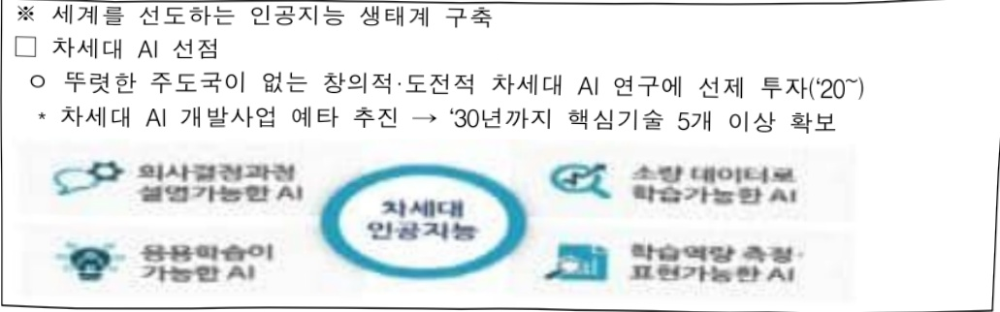
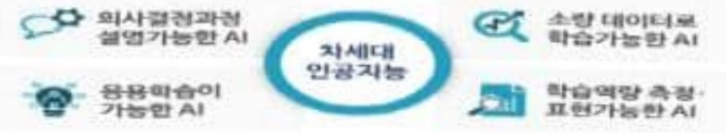
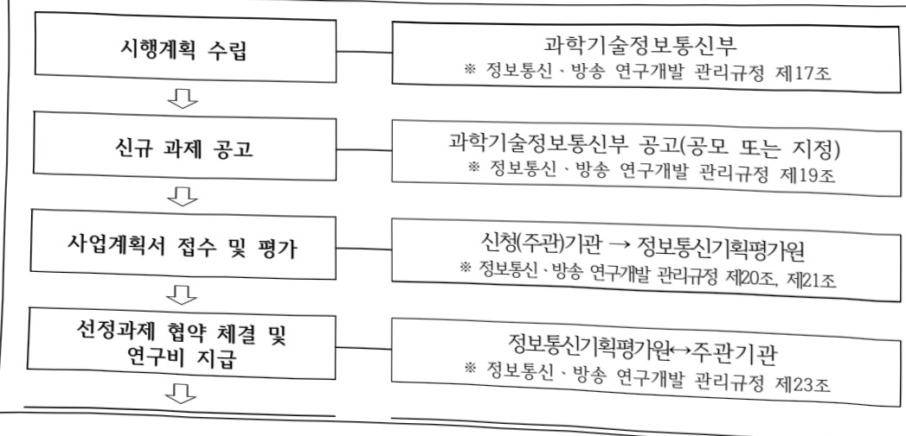
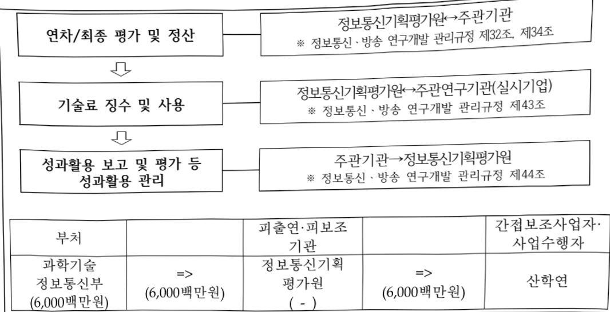

# 인공지능첨단유망기술개발(R&D)

**해당 페이지**: PDF 1313 ~ 1320 쪽 해당

**부처**: 과학기술정보통신부
**분야**: 통신
**회계유형**: 일반회계
**2026 확정예산**: 6000.0 백만원
**전년대비 증감률**: None%
**AI 도메인**: R&D 지원

---

### 가.예산안 총괄표

(단위: 백만원, %)

<table border=1 style='margin: auto; word-wrap: break-word;'><tr><td rowspan="2">사업명</td><td rowspan="2">2024년 결산</td><td colspan="2">2025년 예산</td><td colspan="2">2026년 예산</td><td rowspan="2">증감(B-A)</td><td rowspan="2">(B-A)/A</td></tr><tr><td style='text-align: center; word-wrap: break-word;'>본예산</td><td style='text-align: center; word-wrap: break-word;'>추경(A)</td><td style='text-align: center; word-wrap: break-word;'>요구안</td><td style='text-align: center; word-wrap: break-word;'>본예산(B)</td></tr><tr><td style='text-align: center; word-wrap: break-word;'>인공지능첨단원천유망기술개발(R&amp;D)</td><td style='text-align: center; word-wrap: break-word;'>7,000</td><td style='text-align: center; word-wrap: break-word;'>6,300</td><td style='text-align: center; word-wrap: break-word;'>6,300</td><td style='text-align: center; word-wrap: break-word;'>6,000</td><td style='text-align: center; word-wrap: break-word;'>6,000</td><td style='text-align: center; word-wrap: break-word;'>△300</td><td style='text-align: center; word-wrap: break-word;'>△4.8%</td></tr></table>

□ 기능별(내역사업별), 목별 예산안 내역

(단위:백만원)

<table border=1 style='margin: auto; word-wrap: break-word;'><tr><td rowspan="2"></td><td colspan="5">2024</td><td colspan="5">2025</td><td rowspan="2">2026예산</td></tr><tr><td style='text-align: center; word-wrap: break-word;'>예산액(추경)</td><td style='text-align: center; word-wrap: break-word;'>예산현액</td><td style='text-align: center; word-wrap: break-word;'>집행액</td><td style='text-align: center; word-wrap: break-word;'>이월액</td><td style='text-align: center; word-wrap: break-word;'>불용액</td><td style='text-align: center; word-wrap: break-word;'>예산액(추경)</td><td style='text-align: center; word-wrap: break-word;'>예산현액</td><td style='text-align: center; word-wrap: break-word;'>집행액</td><td style='text-align: center; word-wrap: break-word;'>이월액</td><td style='text-align: center; word-wrap: break-word;'>불용액</td></tr><tr><td style='text-align: center; word-wrap: break-word;'>○ 기능별 분류(함계)</td><td style='text-align: center; word-wrap: break-word;'>7,000</td><td style='text-align: center; word-wrap: break-word;'>7,000</td><td style='text-align: center; word-wrap: break-word;'>7,000</td><td style='text-align: center; word-wrap: break-word;'>-</td><td style='text-align: center; word-wrap: break-word;'>-</td><td style='text-align: center; word-wrap: break-word;'>6,300</td><td style='text-align: center; word-wrap: break-word;'>6,300</td><td style='text-align: center; word-wrap: break-word;'>6,300</td><td style='text-align: center; word-wrap: break-word;'>-</td><td style='text-align: center; word-wrap: break-word;'>-</td><td style='text-align: center; word-wrap: break-word;'>6,000</td></tr><tr><td style='text-align: center; word-wrap: break-word;'>· AI기반과학·공공난제해결</td><td style='text-align: center; word-wrap: break-word;'>3,667</td><td style='text-align: center; word-wrap: break-word;'>3,667</td><td style='text-align: center; word-wrap: break-word;'>3,667</td><td style='text-align: center; word-wrap: break-word;'>-</td><td style='text-align: center; word-wrap: break-word;'>-</td><td style='text-align: center; word-wrap: break-word;'>3,000</td><td style='text-align: center; word-wrap: break-word;'>3,000</td><td style='text-align: center; word-wrap: break-word;'>3,000</td><td style='text-align: center; word-wrap: break-word;'>-</td><td style='text-align: center; word-wrap: break-word;'>-</td><td style='text-align: center; word-wrap: break-word;'>4,000</td></tr><tr><td style='text-align: center; word-wrap: break-word;'>· AI기반산업난제해결</td><td style='text-align: center; word-wrap: break-word;'>3,333</td><td style='text-align: center; word-wrap: break-word;'>3,333</td><td style='text-align: center; word-wrap: break-word;'>3,333</td><td style='text-align: center; word-wrap: break-word;'>-</td><td style='text-align: center; word-wrap: break-word;'>-</td><td style='text-align: center; word-wrap: break-word;'>3,300</td><td style='text-align: center; word-wrap: break-word;'>3,300</td><td style='text-align: center; word-wrap: break-word;'>3,300</td><td style='text-align: center; word-wrap: break-word;'>-</td><td style='text-align: center; word-wrap: break-word;'>-</td><td style='text-align: center; word-wrap: break-word;'>2,000</td></tr><tr><td style='text-align: center; word-wrap: break-word;'>○ 비목별 분류(함계)</td><td style='text-align: center; word-wrap: break-word;'>7,000</td><td style='text-align: center; word-wrap: break-word;'>7,000</td><td style='text-align: center; word-wrap: break-word;'>7,000</td><td style='text-align: center; word-wrap: break-word;'>-</td><td style='text-align: center; word-wrap: break-word;'>-</td><td style='text-align: center; word-wrap: break-word;'>6,300</td><td style='text-align: center; word-wrap: break-word;'>6,300</td><td style='text-align: center; word-wrap: break-word;'>6,300</td><td style='text-align: center; word-wrap: break-word;'>-</td><td style='text-align: center; word-wrap: break-word;'>-</td><td style='text-align: center; word-wrap: break-word;'>6,000</td></tr><tr><td style='text-align: center; word-wrap: break-word;'>· 연구개발활동비 등(360-05)</td><td style='text-align: center; word-wrap: break-word;'>7,000</td><td style='text-align: center; word-wrap: break-word;'>7,000</td><td style='text-align: center; word-wrap: break-word;'>7,000</td><td style='text-align: center; word-wrap: break-word;'>-</td><td style='text-align: center; word-wrap: break-word;'>-</td><td style='text-align: center; word-wrap: break-word;'>6,300</td><td style='text-align: center; word-wrap: break-word;'>6,300</td><td style='text-align: center; word-wrap: break-word;'>6,300</td><td style='text-align: center; word-wrap: break-word;'>-</td><td style='text-align: center; word-wrap: break-word;'>-</td><td style='text-align: center; word-wrap: break-word;'>6,000</td></tr><tr><td style='text-align: center; word-wrap: break-word;'>○ 기능비목별 분류(함계)</td><td style='text-align: center; word-wrap: break-word;'>7,000</td><td style='text-align: center; word-wrap: break-word;'>7,000</td><td style='text-align: center; word-wrap: break-word;'>7,000</td><td style='text-align: center; word-wrap: break-word;'>-</td><td style='text-align: center; word-wrap: break-word;'>-</td><td style='text-align: center; word-wrap: break-word;'>6,300</td><td style='text-align: center; word-wrap: break-word;'>6,300</td><td style='text-align: center; word-wrap: break-word;'>6,300</td><td style='text-align: center; word-wrap: break-word;'>-</td><td style='text-align: center; word-wrap: break-word;'>-</td><td style='text-align: center; word-wrap: break-word;'>6,000</td></tr><tr><td style='text-align: center; word-wrap: break-word;'>· AI기반과학·공공난제해결</td><td style='text-align: center; word-wrap: break-word;'>3,667</td><td style='text-align: center; word-wrap: break-word;'>3,667</td><td style='text-align: center; word-wrap: break-word;'>3,667</td><td style='text-align: center; word-wrap: break-word;'>-</td><td style='text-align: center; word-wrap: break-word;'>-</td><td style='text-align: center; word-wrap: break-word;'>3,000</td><td style='text-align: center; word-wrap: break-word;'>3,000</td><td style='text-align: center; word-wrap: break-word;'>3,000</td><td style='text-align: center; word-wrap: break-word;'>-</td><td style='text-align: center; word-wrap: break-word;'>-</td><td style='text-align: center; word-wrap: break-word;'>4,000</td></tr><tr><td style='text-align: center; word-wrap: break-word;'>· 연구개발활동비 등(360-05)</td><td style='text-align: center; word-wrap: break-word;'>3,667</td><td style='text-align: center; word-wrap: break-word;'>3,667</td><td style='text-align: center; word-wrap: break-word;'>3,667</td><td style='text-align: center; word-wrap: break-word;'>-</td><td style='text-align: center; word-wrap: break-word;'>-</td><td style='text-align: center; word-wrap: break-word;'>3,000</td><td style='text-align: center; word-wrap: break-word;'>3,000</td><td style='text-align: center; word-wrap: break-word;'>3,000</td><td style='text-align: center; word-wrap: break-word;'>-</td><td style='text-align: center; word-wrap: break-word;'>-</td><td style='text-align: center; word-wrap: break-word;'>4,000</td></tr><tr><td style='text-align: center; word-wrap: break-word;'>· AI기반산업난제해결</td><td style='text-align: center; word-wrap: break-word;'>3,333</td><td style='text-align: center; word-wrap: break-word;'>3,333</td><td style='text-align: center; word-wrap: break-word;'>3,333</td><td style='text-align: center; word-wrap: break-word;'>-</td><td style='text-align: center; word-wrap: break-word;'>-</td><td style='text-align: center; word-wrap: break-word;'>3,300</td><td style='text-align: center; word-wrap: break-word;'>3,300</td><td style='text-align: center; word-wrap: break-word;'>3,300</td><td style='text-align: center; word-wrap: break-word;'>-</td><td style='text-align: center; word-wrap: break-word;'>-</td><td style='text-align: center; word-wrap: break-word;'>2,000</td></tr><tr><td style='text-align: center; word-wrap: break-word;'>· 연구개발활동비 등(360-05)</td><td style='text-align: center; word-wrap: break-word;'>3,333</td><td style='text-align: center; word-wrap: break-word;'>3,333</td><td style='text-align: center; word-wrap: break-word;'>3,333</td><td style='text-align: center; word-wrap: break-word;'>-</td><td style='text-align: center; word-wrap: break-word;'>-</td><td style='text-align: center; word-wrap: break-word;'>3,300</td><td style='text-align: center; word-wrap: break-word;'>3,300</td><td style='text-align: center; word-wrap: break-word;'>3,300</td><td style='text-align: center; word-wrap: break-word;'>-</td><td style='text-align: center; word-wrap: break-word;'>-</td><td style='text-align: center; word-wrap: break-word;'>2,000</td></tr></table>

### 나. 사업설명자료

## 1 ) 사업목적·내용

- 인공지능 기술 기반의 과학·공공·산업적 난제해결을 위해 우수 아이디어를 발굴하고, 발굴된 아이디어 대상 연구 지원을 통해 인공지능 원천기술을 확보하고 우수성과의 연구 지속성을 제공하는 인공지능 원천 R&D 추진

- (AI기반과학공공난제해결) AI 기반으로 해결 가능한 고난이도 공공·사회문제 해결 (UN SDGs)을 위한 핵심원천기술개발

---

- (AI기반산업단체해결) 산업 도메인(반도체, 제조, 농축산, 물류 등)의 문제를 AI 연구 개발을 통해 경쟁국 대비 초격차 수준으로 성장 가능한 연구주제 기술개발

## 2 ) 사업개요

□ 사업근거 및 추진경위

① 법령상 근거 및 조항 적시

- 과학기술 기본법 제11조(국가연구개발사업의 추진)

제11조(국가연구개발사업의 추진) ① 중앙행정기관의 장은 기본계획에 따라 말은

분야의 국가연구개발사업과 그 시책을 세워 추진하여야 한다.

② (이하 생략)

## - 정보통신산업 진흥법 제7조(정보통신기술진흥 시행계획)

제7조(정보통신기술진흥 시행계획) ① 과학기술정보통신부장관은 정보통신기술의 진흥을 위하여 진흥계획에 따라 다음 각 호의 사항이 포함된 정보통신기술진흥 시행계획을 매년 수립 · 시행하여야 한다. (중략)

3. 정보통신기술의 연구개발 및 다른 기술과의 결합 및 융합 촉진에 관한 사항

(이하 생략)

- 정보통신 진흥 및 융합 활성화 등에 관한 특별법 제32조(정보통신융합등 기술·서비스 개발 등의 지원)

제32조(정보통신유합등 기술·서비스 개발 등의 지원) ① 과학기술정보통신부장관은 다른 산업 및 서비스 등에 정보통신의 접목을 통하여 생산성과 가치를 높일 수 있도록 노력하여야 한다.

② 과학기술정보통신부장관은 정보통신융합등 기술·서비스의 개발을 촉진하기 위하여 다음 각 호의 사업을 추진할 수 있다.

1. 정보통신융합등 기술·서비스 관련 연구개발 사업 (이하 생략)

## ② 추진경위

: 이재명 정부 국정과제 22번 「초격차 AI 선도기술·인재 확보」

- “인공지능 국가전략” 발표(제27차 경제활력대책회의, 제53회 국무회의(관계부처 합동), '19.12)

---

※ 세계를 선도하는 인공지능 생태계 구축

☐ 차세대 AI 선점

ㅇ 뚜렷한 주도국이 없는 창의적·도전적 차세대 AI 연구에 선제 투자('20~)

* 차세대 AI 개발사업 예타 추진 → '30년까지 핵심기술 5개 이상 확보

### - 2022년 과기정통부 업무계획('22.1)

Ⅲ. 2022년 핵심 추진과제

3 디지털 뉴딜 가속화로 디지털 선도국가 도약

(2) 세계와 경쟁하는 신산업 육성 및 디지털 융합 확산

1 기술·산업생태계 구축

°(인공시능) 인공지능의 기술적 단체 극복 및 인공지능 반도체의 경쟁력 확보를 위한 대

규모 투자 추진

-2023년도 국가연구개발 투자방향 및 기준(안)(22.3, 국가과학기술자문회의 심의회의)

Ⅱ.2023년도 국가연구개발 중점 투자방향

2.9대 중점 투자방향

(2) 국가 필수전략기술의 체계적 육성을 위한 토대 마련

□ (인공지능) 경제·안보 패권경쟁을 위한 AI 핵심원천기술을 중장기적으로 확보하고, 전문 인력양성 및 민군·양용 AI 활용 기술 개발 지원 확대

o (추진 목표) '30년까지 최고 수준의 인공지능 핵심기술 5개 이상 확보

o (중점기술개발) 학습능력·신뢰성을 높이는 차세대 AI 핵심원천기술, 자율감시·정찰, 지능형 지휘통제 등 군사적 활용성이 높은 AI 개발 지원

o (R&D 투자방향) 차세대 핵심원천기술에 대해 지속·안정적으로 투자

- 또한, 수준별 AI 고급인력 양성, 빠른 기술변화에 대한 대응 투자를 강화하고, 자율주행, 민-군 협력을 통한 국방·안보분야AI 적용 지원확대

### Ⅲ. 2023년도 기술분야별 투자전략

1. ICT·SW

(1) 주요 정책목표

□ (전략기술 선도) 주요 ICT 분야 기술 패권 경쟁 및 글로벌 공급망 재편 등 전략기술 분야 선제적 대응을 위한 기술 경쟁력 확보

ㅇ 디지털 경제로의 전환을 목표로 인공지능 인프라 및 기술경쟁력 확보, 글로벌 기술패권 경쟁에 대응하는 6G 핵심원천기술 및 표준 선점

(3) '22년도 투자방향

□ (디지털 전환 촉진) ICT 주력산업 주도권 강화를 위해 AI반도체, 6G, 양자 등 도전적 혁신기술 분야 R&D 선제적 투자하여 기술경쟁력 제고

°(인공지능) 인공지능 기초 R&D에 대한 투자를 확대하고, 민-관 역할 분담을 통한 AI 핵심 인력 양성 및 전문기업 역량 강화 지원

-범용인공지능구현을위한초거대AI모델연구생태계활성화및차세대AI유망기술개발지원강화

- 제4차 과학기술기본계획 2022년도 시행계획(안) (22.3, 국가과학기술자문회의 심의회의)

---

<table border=1 style='margin: auto; word-wrap: break-word;'><tr><td style='text-align: center; word-wrap: break-word;'>V. 2022년도 추진계획 전략3. 과학기술이 선도하는 신산업·일자리 창출 11 4차 산업혁명 대응기반 강화 ○ 인공지능, 인공지능 반도체, 메타버스 플랫폼 등 디지털 융합 기술개발 및 산업 생태계 구축에 투자 확대</td></tr></table>

□ 주요내용

① 사업규모

- 총사업비(해당되는 경우에만 기재) : 해당없음

- 사업기간 : '23 ~ '26

- 최근 5년 간 투입된 사업비(예산액기준, 추경편성한 연도에는 추경포함)

<table border=1 style='margin: auto; word-wrap: break-word;'><tr><td style='text-align: center; word-wrap: break-word;'>$ H_{2}O $</td><td style='text-align: center; word-wrap: break-word;'>2022</td><td style='text-align: center; word-wrap: break-word;'>2023</td><td style='text-align: center; word-wrap: break-word;'>2024</td><td style='text-align: center; word-wrap: break-word;'>2025</td><td style='text-align: center; word-wrap: break-word;'>2026</td></tr><tr><td style='text-align: center; word-wrap: break-word;'>$ H_{2}O $</td><td style='text-align: center; word-wrap: break-word;'>-</td><td style='text-align: center; word-wrap: break-word;'>4,500</td><td style='text-align: center; word-wrap: break-word;'>7,000</td><td style='text-align: center; word-wrap: break-word;'>6,300</td><td style='text-align: center; word-wrap: break-word;'>6,000</td></tr></table>

-기타: 해당없음

② 사업추진체계

- 사업시행방법 : 출연

- 사업시행주체 : 정보통신기획평가원

- 사업 수혜자 : 산·학·연·기타

- 보조, 융자, 출연, 출자 등의 경우 보조·융자 등 지원 비율 및 법적근거

<table border=1 style='margin: auto; word-wrap: break-word;'><tr><td style='text-align: center; word-wrap: break-word;'>내역사업명</td><td style='text-align: center; word-wrap: break-word;'>구분</td><td style='text-align: center; word-wrap: break-word;'>피보조·피출연 등기관명</td><td style='text-align: center; word-wrap: break-word;'>지원 금액(2026예산)</td><td style='text-align: center; word-wrap: break-word;'>지원비율(%)</td><td style='text-align: center; word-wrap: break-word;'>보조율 법적근거 (해당 조항)</td></tr><tr><td style='text-align: center; word-wrap: break-word;'>AI기반과학 공공분야난제해결</td><td rowspan="2">출연</td><td rowspan="2">정보통신기획평가원</td><td style='text-align: center; word-wrap: break-word;'>4,000</td><td rowspan="2">100%이내</td><td rowspan="2">○ 한국연구재단법 제11조○ 정보통신산업진흥법 제28조○ 정보통신 진흥 및 융합 활성화 등에 관한 특별법 제32조</td></tr><tr><td style='text-align: center; word-wrap: break-word;'>AI기반산업분야난제해결</td><td style='text-align: center; word-wrap: break-word;'>2,000</td></tr></table>

---

## 3 ) 2026년도 예산안 산출 근거

<table border=1 style='margin: auto; word-wrap: break-word;'><tr><td style='text-align: center; word-wrap: break-word;'>① AI기반과학·공공분야난제해결: 4,000백만원</td></tr><tr><td style='text-align: center; word-wrap: break-word;'>- (요구내용) 인공지능 기반으로 해결 가능한 고난이도 과학난제 혹은 공공·사회문제 해결(UN, SDGs)을 위한 연구주제 지원을 위한 기술개발 추진</td></tr><tr><td style='text-align: center; word-wrap: break-word;'>- (산출근거) 2,000백만원 × 2개 × 12/12개월 = 4,000백만원</td></tr><tr><td style='text-align: center; word-wrap: break-word;'>② AI기반산업분야난제해결: 2,000백만원</td></tr><tr><td style='text-align: center; word-wrap: break-word;'>- (요구내용) 주요 산업 내 난제해결에 관한 인공지능 적용 연구개발을 통해 경쟁국 대비 초격차 수준으로 성장 가능한 연구주제 지원을 위한 기술개발 추진</td></tr><tr><td style='text-align: center; word-wrap: break-word;'>- (산출근거) 1,000백만원 × 2개 × 12/12개월 = 2,000백만원</td></tr></table>

## 4 ) 사업효과

□ 사업영향, 산출물 성과지표 등

① 2022~2026년도 성과계획서 상 성과지표 및 최근 5년간 성과 달성도

<table border=1 style='margin: auto; word-wrap: break-word;'><tr><td style='text-align: center; word-wrap: break-word;'>성과지표</td><td style='text-align: center; word-wrap: break-word;'>구분</td><td style='text-align: center; word-wrap: break-word;'>2022</td><td style='text-align: center; word-wrap: break-word;'>2023</td><td style='text-align: center; word-wrap: break-word;'>2024</td><td style='text-align: center; word-wrap: break-word;'>2025</td><td style='text-align: center; word-wrap: break-word;'>2026</td><td style='text-align: center; word-wrap: break-word;'>2026 목표치산출근거</td><td style='text-align: center; word-wrap: break-word;'>측정산식(또는 측정방법)</td><td style='text-align: center; word-wrap: break-word;'>자료수집방법(또는 자료출처)</td></tr><tr><td rowspan="3">mrnIF 지수(단위: 점)</td><td style='text-align: center; word-wrap: break-word;'>목표</td><td style='text-align: center; word-wrap: break-word;'>-</td><td style='text-align: center; word-wrap: break-word;'>-</td><td style='text-align: center; word-wrap: break-word;'>59.60</td><td style='text-align: center; word-wrap: break-word;'>61.39</td><td style='text-align: center; word-wrap: break-word;'>63.2</td><td rowspan="3">전년도 목표치기준 3% 상향조정</td><td rowspan="3">(NmlFj -1)/(Nf) x 100(N: 해당분야대 학술자수, mlFj: 순위보정영향력자수)</td><td rowspan="3">NIS, 성과분석보고서</td></tr><tr><td style='text-align: center; word-wrap: break-word;'>실적</td><td style='text-align: center; word-wrap: break-word;'>-</td><td style='text-align: center; word-wrap: break-word;'>-</td><td style='text-align: center; word-wrap: break-word;'>82.53</td><td style='text-align: center; word-wrap: break-word;'>-</td><td style='text-align: center; word-wrap: break-word;'>-</td></tr><tr><td style='text-align: center; word-wrap: break-word;'>달성도</td><td style='text-align: center; word-wrap: break-word;'>-</td><td style='text-align: center; word-wrap: break-word;'>-</td><td style='text-align: center; word-wrap: break-word;'>138%</td><td style='text-align: center; word-wrap: break-word;'>-</td><td style='text-align: center; word-wrap: break-word;'>-</td></tr><tr><td rowspan="3">특허등급지수(단위: 점)</td><td style='text-align: center; word-wrap: break-word;'>목표</td><td style='text-align: center; word-wrap: break-word;'>-</td><td style='text-align: center; word-wrap: break-word;'>-</td><td style='text-align: center; word-wrap: break-word;'>-</td><td style='text-align: center; word-wrap: break-word;'>3.94</td><td style='text-align: center; word-wrap: break-word;'>4.05</td><td rowspan="3">목표치 설정이후 3% 상향조정</td><td style='text-align: center; word-wrap: break-word;'>$ \sum(A \times B) $</td><td rowspan="3">NIS, 한국발명진흥회(SMART 접수 산출)</td></tr><tr><td style='text-align: center; word-wrap: break-word;'>실적</td><td style='text-align: center; word-wrap: break-word;'>-</td><td style='text-align: center; word-wrap: break-word;'>-</td><td style='text-align: center; word-wrap: break-word;'>-</td><td style='text-align: center; word-wrap: break-word;'>-</td><td style='text-align: center; word-wrap: break-word;'>-</td><td rowspan="2">특허등록건수(A: 특허등급별 가중치, B: 등급별 특허성과 건수)</td></tr><tr><td style='text-align: center; word-wrap: break-word;'>달성도</td><td style='text-align: center; word-wrap: break-word;'>-</td><td style='text-align: center; word-wrap: break-word;'>-</td><td style='text-align: center; word-wrap: break-word;'>-</td><td style='text-align: center; word-wrap: break-word;'>-</td><td style='text-align: center; word-wrap: break-word;'>-</td></tr><tr><td rowspan="3">기술료(기술이전 금액)</td><td style='text-align: center; word-wrap: break-word;'>목표</td><td style='text-align: center; word-wrap: break-word;'>-</td><td style='text-align: center; word-wrap: break-word;'>-</td><td style='text-align: center; word-wrap: break-word;'>-</td><td style='text-align: center; word-wrap: break-word;'>0.78</td><td style='text-align: center; word-wrap: break-word;'>0.80</td><td rowspan="3">목표치 설정이후 3% 상향조정</td><td rowspan="3">(∑A)/B(A: 당해연도 기술이전 금액(억원), B: 당해연도 지원예산액(10억원))</td><td rowspan="3">NIS, 성과분석보고서, 기술이전/실시계약서, 기술료장수 결과보고 등</td></tr><tr><td style='text-align: center; word-wrap: break-word;'>실적</td><td style='text-align: center; word-wrap: break-word;'>-</td><td style='text-align: center; word-wrap: break-word;'>-</td><td style='text-align: center; word-wrap: break-word;'>-</td><td style='text-align: center; word-wrap: break-word;'>-</td><td style='text-align: center; word-wrap: break-word;'>-</td></tr><tr><td style='text-align: center; word-wrap: break-word;'>달성도</td><td style='text-align: center; word-wrap: break-word;'>-</td><td style='text-align: center; word-wrap: break-word;'>-</td><td style='text-align: center; word-wrap: break-word;'>-</td><td style='text-align: center; word-wrap: break-word;'>-</td><td style='text-align: center; word-wrap: break-word;'>-</td></tr><tr><td rowspan="3">사업화 매출액</td><td style='text-align: center; word-wrap: break-word;'>목표</td><td style='text-align: center; word-wrap: break-word;'>-</td><td style='text-align: center; word-wrap: break-word;'>-</td><td style='text-align: center; word-wrap: break-word;'>-</td><td style='text-align: center; word-wrap: break-word;'>1.79</td><td style='text-align: center; word-wrap: break-word;'>1.84</td><td rowspan="3">목표치 설정이후 3% 상향조정</td><td rowspan="3">(∑A*)기여도)/B(A: 당해연도 사업화 매출액(억원), B: 당해연도 지원예산액(10억원))</td><td rowspan="3">NIS, 성과분석보고서, 매출정보(재무제표, 매출전표 등)</td></tr><tr><td style='text-align: center; word-wrap: break-word;'>실적</td><td style='text-align: center; word-wrap: break-word;'>-</td><td style='text-align: center; word-wrap: break-word;'>-</td><td style='text-align: center; word-wrap: break-word;'>-</td><td style='text-align: center; word-wrap: break-word;'>-</td><td style='text-align: center; word-wrap: break-word;'>-</td></tr><tr><td style='text-align: center; word-wrap: break-word;'>달성도</td><td style='text-align: center; word-wrap: break-word;'>-</td><td style='text-align: center; word-wrap: break-word;'>-</td><td style='text-align: center; word-wrap: break-word;'>-</td><td style='text-align: center; word-wrap: break-word;'>-</td><td style='text-align: center; word-wrap: break-word;'>-</td></tr></table>

---

② 성과지표 이외의 연도별 사업추진 경과 및 실적

<table border=1 style='margin: auto; word-wrap: break-word;'><tr><td style='text-align: center; word-wrap: break-word;'>2023</td><td style='text-align: center; word-wrap: break-word;'>- AI기반과학공공분야 난제해결 내역 2개, AI기반 산업분야난제해결 내역 2개 총 4개 과제 신규 협약 및 과제 지원- (성과) SCI 포함 논문 10건, Top-tier conference 포함 학술대회 발표 논문 10건, 특허 3건, 표준화 채택 1건 등</td></tr><tr><td style='text-align: center; word-wrap: break-word;'>2024</td><td style='text-align: center; word-wrap: break-word;'>- AI기반과학공공분야 난제해결 내역 2개 및 AI기반 산업분야난제해결 내역 2개 등 총 4개 계속과제 지원 지원 및- (성과) SCI 포함 논문 27건, Top-tier conference 포함 학술대회 발표 논문 69건, 특허 8건 등</td></tr><tr><td style='text-align: center; word-wrap: break-word;'>2025</td><td style='text-align: center; word-wrap: break-word;'>- AI기반과학공공분야 난제해결 내역 2개 및 AI기반 산업분야난제해결 내역 4개 등 총 6개 계속과제 지원</td></tr></table>

③향후(2026년도 이후)기대효과

0 난제해결의 혁신적 아이디어를 도출하고, 기존 칸막이식 R&D 투자로 발생하는 연구성과의 공백을 해소

0 검증된 아이디어를 바탕으로 한 연구 수행을 통해 혁신적 아이디어 연구의 단절을 방지하고, 효율적인 기술축적 유도

0 10대 분야 난제해결을 위한 인공지능 기술확보 및 연구생태계 조성을 통해 글로벌 선도국가로 도약

5) 타당성조사 및 예비타당성조사 시행여부 및 결과 요지 : 해당 없음

6) 총사업비 대상사업 여부 및 내역 : 해당 없음

7) 사업 집행절차

---

8) 각종 평가 : 해당 없음

### 다.최근 4년간 결산내역

1) 결산표

☐ 부처 결산내역

(단위: 백만원, %)

<table border=1 style='margin: auto; word-wrap: break-word;'><tr><td rowspan="2">연도</td><td colspan="3">예산액</td><td rowspan="2">예산현액(A)</td><td rowspan="2">집행액(B)</td><td rowspan="2">집행률(B/A)</td><td rowspan="2">다음연도이월액</td><td rowspan="2">불용액</td></tr><tr><td style='text-align: center; word-wrap: break-word;'>본예산</td><td style='text-align: center; word-wrap: break-word;'>추경중감액</td><td style='text-align: center; word-wrap: break-word;'>추경</td></tr><tr><td style='text-align: center; word-wrap: break-word;'>2022</td><td style='text-align: center; word-wrap: break-word;'>-</td><td style='text-align: center; word-wrap: break-word;'>-</td><td style='text-align: center; word-wrap: break-word;'>-</td><td style='text-align: center; word-wrap: break-word;'>-</td><td style='text-align: center; word-wrap: break-word;'>-</td><td style='text-align: center; word-wrap: break-word;'>-</td><td style='text-align: center; word-wrap: break-word;'>-</td><td style='text-align: center; word-wrap: break-word;'>-</td></tr><tr><td style='text-align: center; word-wrap: break-word;'>2023</td><td style='text-align: center; word-wrap: break-word;'>4,500</td><td style='text-align: center; word-wrap: break-word;'>-</td><td style='text-align: center; word-wrap: break-word;'>4,500</td><td style='text-align: center; word-wrap: break-word;'>4,500</td><td style='text-align: center; word-wrap: break-word;'>4,500</td><td style='text-align: center; word-wrap: break-word;'>100</td><td style='text-align: center; word-wrap: break-word;'>-</td><td style='text-align: center; word-wrap: break-word;'>-</td></tr><tr><td style='text-align: center; word-wrap: break-word;'>2024</td><td style='text-align: center; word-wrap: break-word;'>7,000</td><td style='text-align: center; word-wrap: break-word;'>-</td><td style='text-align: center; word-wrap: break-word;'>7,000</td><td style='text-align: center; word-wrap: break-word;'>7,000</td><td style='text-align: center; word-wrap: break-word;'>7,000</td><td style='text-align: center; word-wrap: break-word;'>100</td><td style='text-align: center; word-wrap: break-word;'>-</td><td style='text-align: center; word-wrap: break-word;'>-</td></tr><tr><td style='text-align: center; word-wrap: break-word;'>2025</td><td style='text-align: center; word-wrap: break-word;'>6,300</td><td style='text-align: center; word-wrap: break-word;'>-</td><td style='text-align: center; word-wrap: break-word;'>6,300</td><td style='text-align: center; word-wrap: break-word;'>6,300</td><td style='text-align: center; word-wrap: break-word;'>6,300</td><td style='text-align: center; word-wrap: break-word;'>100</td><td style='text-align: center; word-wrap: break-word;'>-</td><td style='text-align: center; word-wrap: break-word;'>-</td></tr></table>

2) 주요 결산사항 : 해당 없음

---

<table border=1 style='margin: auto; word-wrap: break-word;'><tr><td style='text-align: center; word-wrap: break-word;'>사 업 명</td></tr><tr><td style='text-align: center; word-wrap: break-word;'>(136) 자율주행기술개발혁신사업(R&amp;D) (2033-306)</td></tr></table>

☐ 사업 코드 정보

<table border=1 style='margin: auto; word-wrap: break-word;'><tr><td style='text-align: center; word-wrap: break-word;'>구분</td><td style='text-align: center; word-wrap: break-word;'>회계</td><td style='text-align: center; word-wrap: break-word;'>소관</td><td style='text-align: center; word-wrap: break-word;'>실국(기관)</td><td style='text-align: center; word-wrap: break-word;'>계정</td><td style='text-align: center; word-wrap: break-word;'>분야</td><td style='text-align: center; word-wrap: break-word;'>부문</td></tr><tr><td style='text-align: center; word-wrap: break-word;'>코드</td><td rowspan="2">일반회계</td><td style='text-align: center; word-wrap: break-word;'>과학기술정보</td><td style='text-align: center; word-wrap: break-word;'>정보통신산업</td><td rowspan="2"></td><td style='text-align: center; word-wrap: break-word;'>130</td><td style='text-align: center; word-wrap: break-word;'>133</td></tr><tr><td style='text-align: center; word-wrap: break-word;'>명칭</td><td style='text-align: center; word-wrap: break-word;'>통신부</td><td style='text-align: center; word-wrap: break-word;'>정책관</td><td style='text-align: center; word-wrap: break-word;'>통신</td><td style='text-align: center; word-wrap: break-word;'>정보통신</td></tr></table>

<table border=1 style='margin: auto; word-wrap: break-word;'><tr><td style='text-align: center; word-wrap: break-word;'>구분</td><td style='text-align: center; word-wrap: break-word;'>프로그램</td><td style='text-align: center; word-wrap: break-word;'>단위사업</td><td style='text-align: center; word-wrap: break-word;'>세부사업</td></tr><tr><td style='text-align: center; word-wrap: break-word;'>코드</td><td style='text-align: center; word-wrap: break-word;'>2000</td><td style='text-align: center; word-wrap: break-word;'>2033</td><td style='text-align: center; word-wrap: break-word;'>306</td></tr><tr><td style='text-align: center; word-wrap: break-word;'>명칭</td><td style='text-align: center; word-wrap: break-word;'>인터넷융합산업</td><td style='text-align: center; word-wrap: break-word;'>스마트화산업기반확충(일반)</td><td style='text-align: center; word-wrap: break-word;'>자율주행기술개발혁신사업(R&amp;D)</td></tr></table>

<table border=1 style='margin: auto; word-wrap: break-word;'><tr><td style='text-align: center; word-wrap: break-word;'>신규</td><td style='text-align: center; word-wrap: break-word;'>계속</td><td style='text-align: center; word-wrap: break-word;'>완료</td><td style='text-align: center; word-wrap: break-word;'>예비타당성 실시여부</td><td style='text-align: center; word-wrap: break-word;'>총사업비 관리대상</td><td style='text-align: center; word-wrap: break-word;'>총액계상 예산사업</td><td style='text-align: center; word-wrap: break-word;'>사업소관 변경정보 2025예산 시 소관</td></tr><tr><td style='text-align: center; word-wrap: break-word;'></td><td style='text-align: center; word-wrap: break-word;'>☐</td><td style='text-align: center; word-wrap: break-word;'></td><td style='text-align: center; word-wrap: break-word;'>☐</td><td style='text-align: center; word-wrap: break-word;'></td><td style='text-align: center; word-wrap: break-word;'></td><td style='text-align: center; word-wrap: break-word;'></td></tr></table>

사업 지원 형태 및 지원을 (최소한 한 개는 반드시 선택하시오. 해당사항에 O 표시)

<table border=1 style='margin: auto; word-wrap: break-word;'><tr><td style='text-align: center; word-wrap: break-word;'>직접</td><td style='text-align: center; word-wrap: break-word;'>출자</td><td style='text-align: center; word-wrap: break-word;'>출연</td><td style='text-align: center; word-wrap: break-word;'>보조</td><td style='text-align: center; word-wrap: break-word;'>융자</td><td style='text-align: center; word-wrap: break-word;'>국고보조율(%)</td><td style='text-align: center; word-wrap: break-word;'>융자율(%)</td></tr><tr><td style='text-align: center; word-wrap: break-word;'></td><td style='text-align: center; word-wrap: break-word;'></td><td style='text-align: center; word-wrap: break-word;'>○</td><td style='text-align: center; word-wrap: break-word;'></td><td style='text-align: center; word-wrap: break-word;'></td><td style='text-align: center; word-wrap: break-word;'></td><td style='text-align: center; word-wrap: break-word;'></td></tr></table>

## 사업 소관부처 및 시행주체

<table border=1 style='margin: auto; word-wrap: break-word;'><tr><td style='text-align: center; word-wrap: break-word;'>사업명</td><td colspan="2">구분</td></tr><tr><td rowspan="2">자율주행기술개발혁신사업(R&amp;D)</td><td style='text-align: center; word-wrap: break-word;'>소관부처</td><td style='text-align: center; word-wrap: break-word;'>정보통신정책실디바이스AX혁신팀</td></tr><tr><td style='text-align: center; word-wrap: break-word;'>사업시행주체</td><td style='text-align: center; word-wrap: break-word;'>정보통신기획평가원</td></tr></table>

---

### 원본 PDF 크롭 이미지

