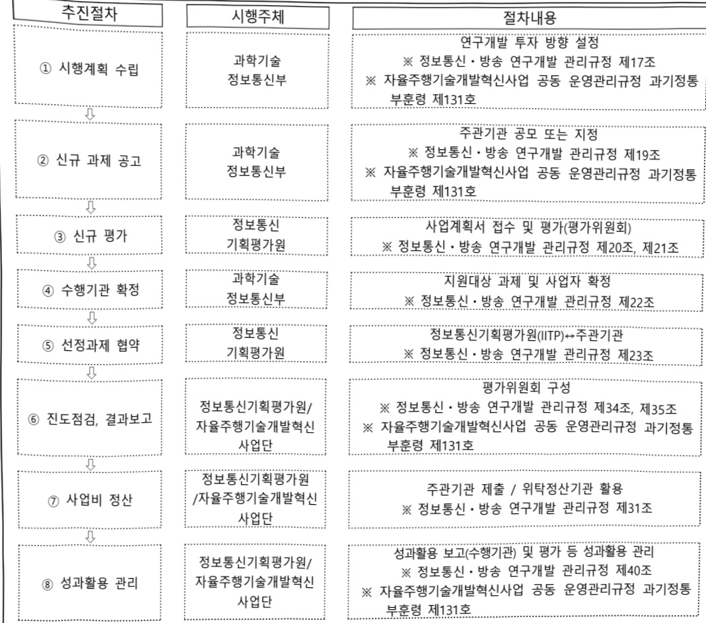

# 자율주행 기술개발 혁신사업(R&D)

**해당 페이지**: PDF 1321 ~ 1328 쪽 해당

**부처**: 과학기술정보통신부
**분야**: 통신
**회계유형**: 일반회계
**2026 확정예산**: 14575.0 백만원
**전년대비 증감률**: -33.1%
**AI 도메인**: 교통/모빌리티

---

<table border=1 style='margin: auto; word-wrap: break-word;'><tr><td style='text-align: center; word-wrap: break-word;'>사 업 명</td></tr><tr><td style='text-align: center; word-wrap: break-word;'>(136) 자율주행기술개발혁신사업(R&amp;D) (2033-306)</td></tr></table>

☐ 사업 코드 정보

<table border=1 style='margin: auto; word-wrap: break-word;'><tr><td style='text-align: center; word-wrap: break-word;'>구분</td><td style='text-align: center; word-wrap: break-word;'>회계</td><td style='text-align: center; word-wrap: break-word;'>소관</td><td style='text-align: center; word-wrap: break-word;'>실국(기관)</td><td style='text-align: center; word-wrap: break-word;'>계정</td><td style='text-align: center; word-wrap: break-word;'>분야</td><td style='text-align: center; word-wrap: break-word;'>부문</td></tr><tr><td style='text-align: center; word-wrap: break-word;'>코드</td><td rowspan="2">일반회계</td><td style='text-align: center; word-wrap: break-word;'>과학기술정보</td><td style='text-align: center; word-wrap: break-word;'>정보통신산업</td><td rowspan="2"></td><td style='text-align: center; word-wrap: break-word;'>130</td><td style='text-align: center; word-wrap: break-word;'>133</td></tr><tr><td style='text-align: center; word-wrap: break-word;'>명칭</td><td style='text-align: center; word-wrap: break-word;'>통신부</td><td style='text-align: center; word-wrap: break-word;'>정책관</td><td style='text-align: center; word-wrap: break-word;'>통신</td><td style='text-align: center; word-wrap: break-word;'>정보통신</td></tr></table>

<table border=1 style='margin: auto; word-wrap: break-word;'><tr><td style='text-align: center; word-wrap: break-word;'>구분</td><td style='text-align: center; word-wrap: break-word;'>프로그램</td><td style='text-align: center; word-wrap: break-word;'>단위사업</td><td style='text-align: center; word-wrap: break-word;'>세부사업</td></tr><tr><td style='text-align: center; word-wrap: break-word;'>코드</td><td style='text-align: center; word-wrap: break-word;'>2000</td><td style='text-align: center; word-wrap: break-word;'>2033</td><td style='text-align: center; word-wrap: break-word;'>306</td></tr><tr><td style='text-align: center; word-wrap: break-word;'>명칭</td><td style='text-align: center; word-wrap: break-word;'>인터넷융합산업</td><td style='text-align: center; word-wrap: break-word;'>스마트화산업기반확충(일반)</td><td style='text-align: center; word-wrap: break-word;'>자율주행기술개발혁신사업(R&amp;D)</td></tr></table>

<table border=1 style='margin: auto; word-wrap: break-word;'><tr><td style='text-align: center; word-wrap: break-word;'>신규</td><td style='text-align: center; word-wrap: break-word;'>계속</td><td style='text-align: center; word-wrap: break-word;'>완료</td><td style='text-align: center; word-wrap: break-word;'>예비타당성 실시여부</td><td style='text-align: center; word-wrap: break-word;'>총사업비 관리대상</td><td style='text-align: center; word-wrap: break-word;'>총액계상 예산사업</td><td style='text-align: center; word-wrap: break-word;'>사업소관 변경정보 2025예산 시 소관</td></tr><tr><td style='text-align: center; word-wrap: break-word;'></td><td style='text-align: center; word-wrap: break-word;'>☐</td><td style='text-align: center; word-wrap: break-word;'></td><td style='text-align: center; word-wrap: break-word;'>☐</td><td style='text-align: center; word-wrap: break-word;'></td><td style='text-align: center; word-wrap: break-word;'></td><td style='text-align: center; word-wrap: break-word;'></td></tr></table>

사업 지원 형태 및 지원을 (최소한 한 개는 반드시 선택하시오. 해당사항에 O 표시)

<table border=1 style='margin: auto; word-wrap: break-word;'><tr><td style='text-align: center; word-wrap: break-word;'>직접</td><td style='text-align: center; word-wrap: break-word;'>출자</td><td style='text-align: center; word-wrap: break-word;'>출연</td><td style='text-align: center; word-wrap: break-word;'>보조</td><td style='text-align: center; word-wrap: break-word;'>융자</td><td style='text-align: center; word-wrap: break-word;'>국고보조율(%)</td><td style='text-align: center; word-wrap: break-word;'>융자율(%)</td></tr><tr><td style='text-align: center; word-wrap: break-word;'></td><td style='text-align: center; word-wrap: break-word;'></td><td style='text-align: center; word-wrap: break-word;'>○</td><td style='text-align: center; word-wrap: break-word;'></td><td style='text-align: center; word-wrap: break-word;'></td><td style='text-align: center; word-wrap: break-word;'></td><td style='text-align: center; word-wrap: break-word;'></td></tr></table>

## 사업 소관부처 및 시행주체

<table border=1 style='margin: auto; word-wrap: break-word;'><tr><td style='text-align: center; word-wrap: break-word;'>사업명</td><td colspan="2">구분</td></tr><tr><td rowspan="2">자율주행기술개발혁신사업(R&amp;D)</td><td style='text-align: center; word-wrap: break-word;'>소관부처</td><td style='text-align: center; word-wrap: break-word;'>정보통신정책실디바이스AX혁신팀</td></tr><tr><td style='text-align: center; word-wrap: break-word;'>사업시행주체</td><td style='text-align: center; word-wrap: break-word;'>정보통신기획평가원</td></tr></table>

---

### 가. 예산 총괄표

(단위: 백만원, %)

<table border=1 style='margin: auto; word-wrap: break-word;'><tr><td rowspan="2">사업명</td><td rowspan="2">2024년 결산</td><td colspan="2">2025년 예산</td><td colspan="2">2026년 예산</td><td rowspan="2">증감(B-A)</td><td rowspan="2">(B-A)/A</td></tr><tr><td style='text-align: center; word-wrap: break-word;'>본예산</td><td style='text-align: center; word-wrap: break-word;'>추경(A)</td><td style='text-align: center; word-wrap: break-word;'>요구안</td><td style='text-align: center; word-wrap: break-word;'>본예산(B)</td></tr><tr><td style='text-align: center; word-wrap: break-word;'>자율주행기술개발혁신사업(R&amp;D)</td><td style='text-align: center; word-wrap: break-word;'>29,970</td><td style='text-align: center; word-wrap: break-word;'>21,797</td><td style='text-align: center; word-wrap: break-word;'>21,797</td><td style='text-align: center; word-wrap: break-word;'>14,575</td><td style='text-align: center; word-wrap: break-word;'>14,575</td><td style='text-align: center; word-wrap: break-word;'>△7,222</td><td style='text-align: center; word-wrap: break-word;'>△33.1</td></tr></table>

* 추경: 추경증감액을 포함한 최종 예산액을 기재

□ 기능별(내역사업별) 예산 내역

(단위:백만원)

<table border=1 style='margin: auto; word-wrap: break-word;'><tr><td rowspan="2"></td><td colspan="5">2024</td><td colspan="5">2025</td><td rowspan="2">2026 倉廬</td></tr><tr><td style='text-align: center; word-wrap: break-word;'>倉廬(倉廬)</td><td style='text-align: center; word-wrap: break-word;'>倉廬(倉廬)</td><td style='text-align: center; word-wrap: break-word;'>倉廬(倉廬)</td><td style='text-align: center; word-wrap: break-word;'>倉廬(倉廬)</td><td style='text-align: center; word-wrap: break-word;'>倉廬(倉廬)</td><td style='text-align: center; word-wrap: break-word;'>倉廬(倉廬)</td><td style='text-align: center; word-wrap: break-word;'>倉廬(倉廬)</td><td style='text-align: center; word-wrap: break-word;'>倉廬(倉廬)</td><td style='text-align: center; word-wrap: break-word;'>倉廬(倉廬)</td><td style='text-align: center; word-wrap: break-word;'>倉廬(倉廬)</td></tr><tr><td style='text-align: center; word-wrap: break-word;'>○ 기능별 분류(합계)</td><td style='text-align: center; word-wrap: break-word;'>29,970</td><td style='text-align: center; word-wrap: break-word;'>29,970</td><td style='text-align: center; word-wrap: break-word;'>29,970</td><td style='text-align: center; word-wrap: break-word;'>-</td><td style='text-align: center; word-wrap: break-word;'>-</td><td style='text-align: center; word-wrap: break-word;'>21,797</td><td style='text-align: center; word-wrap: break-word;'>21,797</td><td style='text-align: center; word-wrap: break-word;'>21,797</td><td style='text-align: center; word-wrap: break-word;'>-</td><td style='text-align: center; word-wrap: break-word;'>-</td><td style='text-align: center; word-wrap: break-word;'>14,575</td></tr><tr><td rowspan="2">· 자율주행기술개발 혁신사업(R&amp;D) · 사업단운영비</td><td style='text-align: center; word-wrap: break-word;'>29,475</td><td style='text-align: center; word-wrap: break-word;'>29,475</td><td style='text-align: center; word-wrap: break-word;'>29,475</td><td style='text-align: center; word-wrap: break-word;'>-</td><td style='text-align: center; word-wrap: break-word;'>-</td><td style='text-align: center; word-wrap: break-word;'>21,302</td><td style='text-align: center; word-wrap: break-word;'>21,302</td><td style='text-align: center; word-wrap: break-word;'>21,302</td><td style='text-align: center; word-wrap: break-word;'>-</td><td style='text-align: center; word-wrap: break-word;'>-</td><td style='text-align: center; word-wrap: break-word;'>14,125</td></tr><tr><td style='text-align: center; word-wrap: break-word;'>495</td><td style='text-align: center; word-wrap: break-word;'>495</td><td style='text-align: center; word-wrap: break-word;'>495</td><td style='text-align: center; word-wrap: break-word;'>-</td><td style='text-align: center; word-wrap: break-word;'>-</td><td style='text-align: center; word-wrap: break-word;'>495</td><td style='text-align: center; word-wrap: break-word;'>495</td><td style='text-align: center; word-wrap: break-word;'>495</td><td style='text-align: center; word-wrap: break-word;'>-</td><td style='text-align: center; word-wrap: break-word;'>-</td><td style='text-align: center; word-wrap: break-word;'>450</td></tr></table>

### 나. 사업설명자료

## 1 ) 사업목적·내용

- (자율주행기술개발혁신사업) '27년 융합형 레벨4* 자율주행 기반 조성을 위한 차량

-ICT-도로교통 연계 자율주행 융합 신기술 개발 및 융합 신산업 육성

* 차량-ICT-도로가 융합하여 고속도로, 교차로, 비, 눈, 안개 등 보다 다양한 운행가능영역(ODD)에서 모든

운행조작과 위기대응을 시스템이 수행하는 자율주행 기술수준

## 2 ) 사업개요

## 사업근거 및 추진경위

① 법령상 근거 및 조항 적시

-정보통신산업진흥법 제7조(정보통신기술진흥시행계획) 내지 제8조(연구과제 등의 지정)

---

<table border=1 style='margin: auto; word-wrap: break-word;'><tr><td style='text-align: center; word-wrap: break-word;'>17조(정보통신기술진흥 시행계획) ① 과학기술정보통신부장관은 정보통신기술의 진흥을 위하여 진흥계획에 따라 다음 각 호의 사항이 포함된 정보통신기술진흥 시행계획을 매년 수립·시행하여야 한다.</td></tr><tr><td style='text-align: center; word-wrap: break-word;'>1. 정보통신기술 수준의 조사, 개발된 정보통신기술의 평가 및 활용에 관한 사항</td></tr><tr><td style='text-align: center; word-wrap: break-word;'>2. 정보통신기술 관련 정보의 원활한 유통에 관한 사항</td></tr><tr><td style='text-align: center; word-wrap: break-word;'>3. 정보통신기술의 연구개발 및 다른 기술과의 결합 및 융합 촉진에 관한 사항</td></tr><tr><td style='text-align: center; word-wrap: break-word;'>4. 정보통신기술의 협력, 지도 및 이전에 관한 사항</td></tr><tr><td style='text-align: center; word-wrap: break-word;'>5. 정보통신기술에 관한 산학협동 촉진에 관한 사항</td></tr><tr><td style='text-align: center; word-wrap: break-word;'>6. 전문인력의 양성 및 수급에 관한 사항</td></tr><tr><td style='text-align: center; word-wrap: break-word;'>7. 정보통신기술의 표준화 및 새로운 정보통신기술의 채택에 관한 사항</td></tr><tr><td style='text-align: center; word-wrap: break-word;'>8. 정보통신기술을 연구하는 기관 또는 단체의 육성에 관한 사항</td></tr><tr><td style='text-align: center; word-wrap: break-word;'>9. 정보통신기술의 국제협력에 관한 사항</td></tr><tr><td style='text-align: center; word-wrap: break-word;'>10. 그 밖에 정보통신기술의 진흥을 위하여 필요한 사항</td></tr><tr><td style='text-align: center; word-wrap: break-word;'>② 과학기술정보통신부장관은 제1항에 따른 사항을 효율적으로 추진하기 위하여 필요하면 대통령령으로 정하는 바에 따라 정보통신기술의 개발 및 정보통신산업의 진흥과 관련된 연구기관 및 단체로 하여금 이를 대행하게 할 수 있으며 이에 드는 비용을 지원할 수 있다.</td></tr><tr><td style='text-align: center; word-wrap: break-word;'>제8조(연구과제 등의 지정) ① 과학기술정보통신부장관은 정보통신기술의 연구개발을 위하여 정보통신기술에 관한 연구과제를 선정하고 연구할 자를 지정할 수 있다.</td></tr><tr><td style='text-align: center; word-wrap: break-word;'>② 제1항에 따른 연구과제의 선정, 연구할 자의 지정 및 연구비의 지원 등에 필요한 사항은 대통령령으로 정한다.</td></tr></table>

- 정보통신 진흥 및 융합 활성화 등에 관한 특별법 제33조(정보통신융합등 기술·서비스 개발 등의 지원)

제32조(정보통신융합등 기술·서비스 개발 등의 지원) ② 과학기술정보통신부장관은 정보통신융합등 기술

·서비스의개발을촉진하기위하여다음각호의사업을추진할수있다.

1. 정보통신융합등 기술·서비스 관련 연구개발 사업

2. 제1호에 따라 추진되는 과제에 대한 기획·평가·관리

3. 국가·지방자치단체, 대학·정부출연연구기관, 민간 등이 보유한 정보통신융합등 기술의 거래 등 기술이전을 위한 중개·알선 지원

4. 정보통신융합등 기술에 대한 평가 및 평가 기법의 개발·보급

5. 정보통신융합등 기술의 기술이전·사업화에 관한 통계조사·연구 등 관련 정보의 수집·분석·제공

6. 정보통신융합등 기술의 기술이전 후 상용화 연구개발 지원

7.정보통신융합등 기술의 기술사업화 전문인력 양성

8. 정보통신융합등 기술의 기술거래·사업화 촉진을 위한 정보시스템 구축·활용

9.지식재산권 등 정보통신융합등 기술 관련 연구성과물의 관리·홍보·활용

10. 정보통신융합등 기술·서비스의 수준조사 등 정책연구 사업

11.정보통신융합등 기술·서비스 관련 시범사업

12.그 밖에 정보통신기술진흥을 위하여 필요한 사업

## ② 추진경위

- '19. 7.: 자율주행 기술개발 혁신사업(다부처) 예타기획('18.7.~'19.7.) 완료

- '20. 4. : 본예타 신청('19.10.), 본예타 통과('20.4.)

- '20. 12. : 과기정통부훈령 제131호(자율주행기술개발혁신사업 공동운영관리규정) 제정

- '21. 3. : 범부처 (재)자율주행기술개발혁신사업단 출범('21.3.24)

- '21. 4.: '21년도 53개 과제 연구개발 착수(과기정통부 15개, 산업부 16개, 국토부 13개, 경찰청 9개)

- '22. 4. : '22년도 65개 과제 연구개발 착수(과기정통부 17개, 산업부 23개, 국토부 16개, 경찰청 9개)

- '23. 4.: '23년도 83개 과제 연구개발 착수(과기정통부 23개, 산업부 27개, 국토부 22개, 경찰청 11개)

- '24. 4. : '24년도 84개 과제 연구개발 착수(과기정통부 22개, 산업부 27개, 국토부 22개, 경찰청 13개)

---

- '25. 4.: '25년도 72개 과제 연구개발 착수(과기정통부 12개, 신업부 2개, 국토부 2개, 경찰청 11개)

- 12대 국가 전략기술 : 첨단모빌리티, 인공지능

- 국정과제 22 「초격차 AI 선도기술 · 인재 확보」

- 국정과제 28 「세계를 선도할 넥스트(NEXT) 전략기술 육성」

- 국정과제 31 「미래 모빌리티와 'K-AI시티' 실현」

□ 주요내용

①사업규모

- 총사업비 : 해당없음

- 사업기간 : '21년 ~ '27년(7년)

- 최근 5년 간 투입된 사업비(예산액기준, 추경편성한 연도에는 추경포함)

<table border=1 style='margin: auto; word-wrap: break-word;'><tr><td style='text-align: center; word-wrap: break-word;'>$ \underline{\text{角}} $</td><td style='text-align: center; word-wrap: break-word;'>2022</td><td style='text-align: center; word-wrap: break-word;'>2023</td><td style='text-align: center; word-wrap: break-word;'>2024</td><td style='text-align: center; word-wrap: break-word;'>2025</td><td style='text-align: center; word-wrap: break-word;'>2026</td></tr><tr><td style='text-align: center; word-wrap: break-word;'>$ \underline{\text{人}} $</td><td style='text-align: center; word-wrap: break-word;'>28,446</td><td style='text-align: center; word-wrap: break-word;'>37,340</td><td style='text-align: center; word-wrap: break-word;'>29,970</td><td style='text-align: center; word-wrap: break-word;'>21,797</td><td style='text-align: center; word-wrap: break-word;'>14,575</td></tr></table>

-기타:해당없음

②사업추진체계

-사업시행방법:출연

-사업시행주체:정보통신기획평가원,(재)자율주행기술개발혁신사업단

-사업 수혜자:자율주행 관련 산·학·연

- 보조, 융자, 출연, 출자 등의 경우 보조·융자 등 지원 비율 및 법적근거

<table border=1 style='margin: auto; word-wrap: break-word;'><tr><td style='text-align: center; word-wrap: break-word;'>내역사업명</td><td style='text-align: center; word-wrap: break-word;'>구분</td><td style='text-align: center; word-wrap: break-word;'>피보조·피출연 등 기관명</td><td style='text-align: center; word-wrap: break-word;'>지원 금액 (2026예산)</td><td style='text-align: center; word-wrap: break-word;'>지원 비율(%)</td><td style='text-align: center; word-wrap: break-word;'>보조율 법적근거 (해당 조항)</td></tr><tr><td style='text-align: center; word-wrap: break-word;'>자율주행기술 개발혁신사업 (R&amp;D)</td><td style='text-align: center; word-wrap: break-word;'>출연</td><td style='text-align: center; word-wrap: break-word;'>정보통신 기획평가원</td><td style='text-align: center; word-wrap: break-word;'>14,575백만원</td><td style='text-align: center; word-wrap: break-word;'>100</td><td style='text-align: center; word-wrap: break-word;'>가) 정보통신산업진흥법 제8조(연구과제 등의 지정) 나) 정보통신 진흥 및 융합 활성화 등에 관한 특별법 제32조</td></tr></table>

3)2026년도 예산 산출 근거

□ 자율주행기술개발혁신사업(R&D):14,575백만원

① 자율주행기술개발혁신사업(R&D):14,125백만원

- (산출) (계속) 9개 과제 x 1,569.5백만원 x 12/12개월

<table border=1 style='margin: auto; word-wrap: break-word;'><tr><td colspan="2">2026년 예산안</td></tr><tr><td style='text-align: center; word-wrap: break-word;'>예산</td><td style='text-align: center; word-wrap: break-word;'>산출내역</td></tr><tr><td style='text-align: center; word-wrap: break-word;'>14,125</td><td style='text-align: center; word-wrap: break-word;'>○ 연구개발연구활동비등(360-05): 14,125백만원 가. (계속) 9개 x 1,569.5백만원 x 12/12개월 = 14,125백만원</td></tr></table>

② 사업단 운영비 : 450백만원,

- (산출) 14,125백만원(연구개발비) x 3.19% x 12/12개월

<table border=1 style='margin: auto; word-wrap: break-word;'><tr><td colspan="2">2026년 예산안</td></tr><tr><td style='text-align: center; word-wrap: break-word;'>예산</td><td style='text-align: center; word-wrap: break-word;'>산출내역</td></tr><tr><td style='text-align: center; word-wrap: break-word;'>14,125</td><td style='text-align: center; word-wrap: break-word;'>○ 연구개발연구활동비등(360-05): 450백만원 가. 연구개발비 14,125백만원 × 3.19% × 12/12개월 = 450백만원</td></tr></table>

## 4 ) 사업효과

---

## ☐ 사업영향, 산출물 성과지표 등

①2022~2026년도 성과계획서 상 성과지표 및 최근 5년간 성과 달성도

<table border=1 style='margin: auto; word-wrap: break-word;'><tr><td style='text-align: center; word-wrap: break-word;'>성과지표</td><td style='text-align: center; word-wrap: break-word;'>구분</td><td style='text-align: center; word-wrap: break-word;'>2022</td><td style='text-align: center; word-wrap: break-word;'>2023</td><td style='text-align: center; word-wrap: break-word;'>2024</td><td style='text-align: center; word-wrap: break-word;'>2025</td><td style='text-align: center; word-wrap: break-word;'>2026</td><td style='text-align: center; word-wrap: break-word;'>2026 목표치산출근거</td><td style='text-align: center; word-wrap: break-word;'>측정산식(또는 측정방법)</td><td style='text-align: center; word-wrap: break-word;'>자료수집방법(또는 자료출처)</td></tr><tr><td rowspan="3">삼극특허(단위: 건)</td><td style='text-align: center; word-wrap: break-word;'>목표</td><td style='text-align: center; word-wrap: break-word;'>1.0(%)</td><td style='text-align: center; word-wrap: break-word;'>1.5(%)</td><td style='text-align: center; word-wrap: break-word;'>2.0(%)</td><td style='text-align: center; word-wrap: break-word;'>3</td><td style='text-align: center; word-wrap: break-word;'>6</td><td rowspan="3">1단계 삼극특허 등록 건수(1건) 기준 매년 150% 상향 목표 설정</td><td rowspan="3">전년도 삼극특허 등록 누적 간수 +당해연도 삼극특허 등록 간수</td><td rowspan="3">KET, IITP, KAA KIPOT 등 사업관리시스템 연차별 기술개발 보고서 등</td></tr><tr><td style='text-align: center; word-wrap: break-word;'>실적</td><td style='text-align: center; word-wrap: break-word;'>1.0(%)</td><td style='text-align: center; word-wrap: break-word;'>3.73(%)</td><td style='text-align: center; word-wrap: break-word;'>5.21(%)</td><td style='text-align: center; word-wrap: break-word;'>-</td><td style='text-align: center; word-wrap: break-word;'>-</td></tr><tr><td style='text-align: center; word-wrap: break-word;'>달성도</td><td style='text-align: center; word-wrap: break-word;'>100</td><td style='text-align: center; word-wrap: break-word;'>248</td><td style='text-align: center; word-wrap: break-word;'>260</td><td style='text-align: center; word-wrap: break-word;'>-</td><td style='text-align: center; word-wrap: break-word;'>-</td></tr><tr><td rowspan="3">기술수준(단위: %)</td><td style='text-align: center; word-wrap: break-word;'>목표</td><td style='text-align: center; word-wrap: break-word;'>87.1</td><td style='text-align: center; word-wrap: break-word;'>88.3</td><td style='text-align: center; word-wrap: break-word;'>89.1</td><td style='text-align: center; word-wrap: break-word;'>90.7</td><td style='text-align: center; word-wrap: break-word;'>91.8</td><td rowspan="3">IITP 기술수준보고서(18년 내 자율주행차 기술수준 82.4%를 기준으로 하여, 매년 1.18% 상향 값을 목표 설정</td><td rowspan="3">해당 기술에 대한 선진국 대비 기술수준(%)</td><td rowspan="3">관련기관의 기술수준 조사 및 평가보고서 연차별 기술개발 보고서</td></tr><tr><td style='text-align: center; word-wrap: break-word;'>실적</td><td style='text-align: center; word-wrap: break-word;'>88.6</td><td style='text-align: center; word-wrap: break-word;'>88.7</td><td style='text-align: center; word-wrap: break-word;'>89.2</td><td style='text-align: center; word-wrap: break-word;'>-</td><td style='text-align: center; word-wrap: break-word;'>-</td></tr><tr><td style='text-align: center; word-wrap: break-word;'>달성도</td><td style='text-align: center; word-wrap: break-word;'>102</td><td style='text-align: center; word-wrap: break-word;'>100</td><td style='text-align: center; word-wrap: break-word;'>100</td><td style='text-align: center; word-wrap: break-word;'>-</td><td style='text-align: center; word-wrap: break-word;'>-</td></tr><tr><td rowspan="3">법·제도제안(단위: 건)</td><td style='text-align: center; word-wrap: break-word;'>목표</td><td style='text-align: center; word-wrap: break-word;'>3</td><td style='text-align: center; word-wrap: break-word;'>8</td><td style='text-align: center; word-wrap: break-word;'>15</td><td style='text-align: center; word-wrap: break-word;'>-</td><td style='text-align: center; word-wrap: break-word;'>-</td><td rowspan="3">-</td><td rowspan="3">-</td><td rowspan="3">-</td></tr><tr><td style='text-align: center; word-wrap: break-word;'>실적</td><td style='text-align: center; word-wrap: break-word;'>4</td><td style='text-align: center; word-wrap: break-word;'>9</td><td style='text-align: center; word-wrap: break-word;'>15</td><td style='text-align: center; word-wrap: break-word;'>-</td><td style='text-align: center; word-wrap: break-word;'>-</td></tr><tr><td style='text-align: center; word-wrap: break-word;'>달성도</td><td style='text-align: center; word-wrap: break-word;'>133</td><td style='text-align: center; word-wrap: break-word;'>112</td><td style='text-align: center; word-wrap: break-word;'>100</td><td style='text-align: center; word-wrap: break-word;'>-</td><td style='text-align: center; word-wrap: break-word;'>-</td></tr><tr><td rowspan="3">국제표준 제안(단위: 건)</td><td style='text-align: center; word-wrap: break-word;'>목표</td><td style='text-align: center; word-wrap: break-word;'>1</td><td style='text-align: center; word-wrap: break-word;'>3</td><td style='text-align: center; word-wrap: break-word;'>5</td><td style='text-align: center; word-wrap: break-word;'>-</td><td style='text-align: center; word-wrap: break-word;'>-</td><td rowspan="3">-</td><td rowspan="3">-</td><td rowspan="3">-</td></tr><tr><td style='text-align: center; word-wrap: break-word;'>실적</td><td style='text-align: center; word-wrap: break-word;'>1</td><td style='text-align: center; word-wrap: break-word;'>7</td><td style='text-align: center; word-wrap: break-word;'>6</td><td style='text-align: center; word-wrap: break-word;'>-</td><td style='text-align: center; word-wrap: break-word;'>-</td></tr><tr><td style='text-align: center; word-wrap: break-word;'>달성도</td><td style='text-align: center; word-wrap: break-word;'>100</td><td style='text-align: center; word-wrap: break-word;'>233</td><td style='text-align: center; word-wrap: break-word;'>120</td><td style='text-align: center; word-wrap: break-word;'>-</td><td style='text-align: center; word-wrap: break-word;'>-</td></tr><tr><td rowspan="3">중소·중견기업 예산지원(%)</td><td style='text-align: center; word-wrap: break-word;'>목표</td><td style='text-align: center; word-wrap: break-word;'>41.5</td><td style='text-align: center; word-wrap: break-word;'>43</td><td style='text-align: center; word-wrap: break-word;'>45</td><td style='text-align: center; word-wrap: break-word;'>48.0</td><td style='text-align: center; word-wrap: break-word;'>46.0</td><td rowspan="3">중소·중견기업의 정부출연금 지원 비율 1 단계(21~24) 약 47%를 기준으로, 연차별 예산비분 주이반명 목표 설정</td><td rowspan="3">(∑) 참여 중소·중견기업 정부출연금/(∑) 정부출연금)×100(%)</td><td rowspan="3">KET, IITP, KAA KIPOT 등 사업관리시스템 연차별 기술개발 보고서 등</td></tr><tr><td style='text-align: center; word-wrap: break-word;'>실적</td><td style='text-align: center; word-wrap: break-word;'>43.4</td><td style='text-align: center; word-wrap: break-word;'>45.6</td><td style='text-align: center; word-wrap: break-word;'>46.6</td><td style='text-align: center; word-wrap: break-word;'>-</td><td style='text-align: center; word-wrap: break-word;'>-</td></tr><tr><td style='text-align: center; word-wrap: break-word;'>달성도</td><td style='text-align: center; word-wrap: break-word;'>105</td><td style='text-align: center; word-wrap: break-word;'>106</td><td style='text-align: center; word-wrap: break-word;'>104</td><td style='text-align: center; word-wrap: break-word;'>-</td><td style='text-align: center; word-wrap: break-word;'>-</td></tr><tr><td rowspan="3">사업화 실적(10억당 매출액)</td><td style='text-align: center; word-wrap: break-word;'>목표</td><td style='text-align: center; word-wrap: break-word;'>-</td><td style='text-align: center; word-wrap: break-word;'>-</td><td style='text-align: center; word-wrap: break-word;'>(신규)</td><td style='text-align: center; word-wrap: break-word;'>28.91</td><td style='text-align: center; word-wrap: break-word;'>29.78</td><td rowspan="3">자율주행 관련사업의 평균 사업화 매출액으로 초기값 설정</td><td rowspan="3">∑(조사대상 교체의 사업화 매출액 / (해당연도 사업화 실적 조사)과 교체의 정부지원금)</td><td rowspan="3">KET, IITP, KAA KIPOT 등 사업관리시스템 등</td></tr><tr><td style='text-align: center; word-wrap: break-word;'>실적</td><td style='text-align: center; word-wrap: break-word;'>-</td><td style='text-align: center; word-wrap: break-word;'>-</td><td style='text-align: center; word-wrap: break-word;'>-</td><td style='text-align: center; word-wrap: break-word;'>-</td><td style='text-align: center; word-wrap: break-word;'>-</td></tr><tr><td style='text-align: center; word-wrap: break-word;'>달성도</td><td style='text-align: center; word-wrap: break-word;'>-</td><td style='text-align: center; word-wrap: break-word;'>-</td><td style='text-align: center; word-wrap: break-word;'>-</td><td style='text-align: center; word-wrap: break-word;'>-</td><td style='text-align: center; word-wrap: break-word;'>-</td></tr><tr><td rowspan="3">기술자립도(%)</td><td style='text-align: center; word-wrap: break-word;'>목표</td><td style='text-align: center; word-wrap: break-word;'>-</td><td style='text-align: center; word-wrap: break-word;'>-</td><td style='text-align: center; word-wrap: break-word;'>(신규)</td><td style='text-align: center; word-wrap: break-word;'>67.14</td><td style='text-align: center; word-wrap: break-word;'>73.57</td><td rowspan="3">&#x27;17년 기준 기술자립 화 수준 50% &#x27;27년 80%의 기술지립도 제 고를 목표 &#x27;25년 기술 자립도 67.14%를 시작으로, 점진적으로 증가&#x27;</td><td rowspan="3">(∑)사업종료제에서 개론돼(44+ 자율주행 관련 기술 및 제품의 지탱화율%) / (본사업종료제누적에서 개론돼(44+ 자율주행 관련 기술 및 제품수)</td><td rowspan="3">연차별 기술개발 보고서 관련기관의 평가보고서 등</td></tr><tr><td style='text-align: center; word-wrap: break-word;'>실적</td><td style='text-align: center; word-wrap: break-word;'>-</td><td style='text-align: center; word-wrap: break-word;'>-</td><td style='text-align: center; word-wrap: break-word;'>-</td><td style='text-align: center; word-wrap: break-word;'>-</td><td style='text-align: center; word-wrap: break-word;'>-</td></tr><tr><td style='text-align: center; word-wrap: break-word;'>달성도</td><td style='text-align: center; word-wrap: break-word;'>-</td><td style='text-align: center; word-wrap: break-word;'>-</td><td style='text-align: center; word-wrap: break-word;'>-</td><td style='text-align: center; word-wrap: break-word;'>-</td><td style='text-align: center; word-wrap: break-word;'>-</td></tr><tr><td rowspan="3">실증거리(천km)</td><td style='text-align: center; word-wrap: break-word;'>목표</td><td style='text-align: center; word-wrap: break-word;'>-</td><td style='text-align: center; word-wrap: break-word;'>-</td><td style='text-align: center; word-wrap: break-word;'>(신규)</td><td style='text-align: center; word-wrap: break-word;'>50</td><td style='text-align: center; word-wrap: break-word;'>120</td><td rowspan="3">자율주행 리밍에서 운영되는 자율차의 연차별 실증운영 알수, 운영시간 시단당 운영 가리 등을 고려</td><td rowspan="3">본 사업 자율주행차림의 총 운영거리(누적)</td><td rowspan="3">KET, IITP, KAA KIPOT 등 사업관리시스템 자율주행모빌리티센터 운영 보고서 등</td></tr><tr><td style='text-align: center; word-wrap: break-word;'>실적</td><td style='text-align: center; word-wrap: break-word;'>-</td><td style='text-align: center; word-wrap: break-word;'>-</td><td style='text-align: center; word-wrap: break-word;'>-</td><td style='text-align: center; word-wrap: break-word;'>-</td><td style='text-align: center; word-wrap: break-word;'>-</td></tr><tr><td style='text-align: center; word-wrap: break-word;'>달성도</td><td style='text-align: center; word-wrap: break-word;'>-</td><td style='text-align: center; word-wrap: break-word;'>-</td><td style='text-align: center; word-wrap: break-word;'>-</td><td style='text-align: center; word-wrap: break-word;'>-</td><td style='text-align: center; word-wrap: break-word;'>-</td></tr><tr><td style='text-align: center; word-wrap: break-word;'>빅데이터 수집량</td><td style='text-align: center; word-wrap: break-word;'>목표</td><td style='text-align: center; word-wrap: break-word;'>-</td><td style='text-align: center; word-wrap: break-word;'>-</td><td style='text-align: center; word-wrap: break-word;'>-</td><td style='text-align: center; word-wrap: break-word;'>(신규)</td><td style='text-align: center; word-wrap: break-word;'>5,000</td><td style='text-align: center; word-wrap: break-word;'>자율주행 리밍에서</td><td style='text-align: center; word-wrap: break-word;'>리밍맵에서 운행되는</td><td style='text-align: center; word-wrap: break-word;'>KET, IITP, KAA</td></tr></table>

---

<table border=1 style='margin: auto; word-wrap: break-word;'><tr><td rowspan="2">(TB)</td><td style='text-align: center; word-wrap: break-word;'>실적</td><td style='text-align: center; word-wrap: break-word;'>-</td><td style='text-align: center; word-wrap: break-word;'>-</td><td style='text-align: center; word-wrap: break-word;'>-</td><td style='text-align: center; word-wrap: break-word;'>-</td><td style='text-align: center; word-wrap: break-word;'>-</td><td rowspan="2">운영되는 자율차의 연차별 실증운행 일수, 운행시간 시간당 수집 데이터 수 등을 고려</td><td rowspan="2">본사업 자율차에서 수집되어 자율주행모빌리티센터 스토리지에 저장관리되는 총 데이터량(누적)</td><td rowspan="2">KIPOT 등 사업관리시스템 자율주행모빌리티센터 운영 보고서 등</td></tr><tr><td style='text-align: center; word-wrap: break-word;'>달성도</td><td style='text-align: center; word-wrap: break-word;'>-</td><td style='text-align: center; word-wrap: break-word;'>-</td><td style='text-align: center; word-wrap: break-word;'>-</td><td style='text-align: center; word-wrap: break-word;'>-</td><td style='text-align: center; word-wrap: break-word;'>-</td></tr><tr><td rowspan="3">서비스이용 만족도 (점)</td><td style='text-align: center; word-wrap: break-word;'>목표</td><td style='text-align: center; word-wrap: break-word;'>-</td><td style='text-align: center; word-wrap: break-word;'>-</td><td style='text-align: center; word-wrap: break-word;'>-</td><td style='text-align: center; word-wrap: break-word;'>(신규)</td><td style='text-align: center; word-wrap: break-word;'>65</td><td rowspan="3">리빙랩에서 자율주행 서비스가 시작되는 26년 본사업 서비스 이용 자가 65점 만족하는 것을 초기목표로 설정</td><td rowspan="3">∑(서비스 이용자별 만족도 / 전체 유효응답자 수)</td><td rowspan="3">KEIT, IITP, KAIA KIPOT 등 사업관리시스템, 서비스 이용자의 만족도 설문조사 결과보고서 등</td></tr><tr><td style='text-align: center; word-wrap: break-word;'>실적</td><td style='text-align: center; word-wrap: break-word;'>-</td><td style='text-align: center; word-wrap: break-word;'>-</td><td style='text-align: center; word-wrap: break-word;'>-</td><td style='text-align: center; word-wrap: break-word;'>-</td><td style='text-align: center; word-wrap: break-word;'>-</td></tr><tr><td style='text-align: center; word-wrap: break-word;'>달성도</td><td style='text-align: center; word-wrap: break-word;'>-</td><td style='text-align: center; word-wrap: break-word;'>-</td><td style='text-align: center; word-wrap: break-word;'>-</td><td style='text-align: center; word-wrap: break-word;'>-</td><td style='text-align: center; word-wrap: break-word;'>-</td></tr></table>

※ '25년 실적 분석 중

② 성과지표 이외의 연도별 사업추진 경과 및 실적

<table border=1 style='margin: auto; word-wrap: break-word;'><tr><td style='text-align: center; word-wrap: break-word;'>2022</td><td style='text-align: center; word-wrap: break-word;'>○ 자율주행 AI SW의 지능고도화를 위한 핵심 요소기술 개발</td></tr><tr><td style='text-align: center; word-wrap: break-word;'>2023</td><td style='text-align: center; word-wrap: break-word;'>○ 자율주행 차량용, 인프라용 인공지능 학습 데이터셋 수집 및 구축 데이터 공개(총 17종, 1,173 GB)</td></tr><tr><td style='text-align: center; word-wrap: break-word;'>2024</td><td style='text-align: center; word-wrap: break-word;'>○ 연구개발로 수집한 학습데이터를 활용한 자율주행 인공지능 챌린지 개최(4개 부문, 279개 팀 참가)</td></tr><tr><td style='text-align: center; word-wrap: break-word;'>2025</td><td style='text-align: center; word-wrap: break-word;'>○ 1단계 성과공유회 개최를 통한 기술 시연 및 운전석 없는 자율주행 AI SW 탑재 셔틀 차량 시승 체험 진행으로 수용성 향상 도모(3일, 관람객 49,200명, 탑승객 240명)</td></tr></table>

③향후(2026년도 이후)기대효과

- 오픈소스(공개SW) R&D 추진을 통한 40개 SW 저장소 운영 및 자율주행 클라우드 -옛지-차량 수집 데이터 공개 기반의 자율주행 산업 생태계 활력 조성

5) 타당성조사 및 예비타당성조사 시행여부 및 결과 요지

<table border=1 style='margin: auto; word-wrap: break-word;'><tr><td style='text-align: center; word-wrap: break-word;'></td><td style='text-align: center; word-wrap: break-word;'>조사기관</td><td style='text-align: center; word-wrap: break-word;'>조사기간</td><td style='text-align: center; word-wrap: break-word;'>조사결과 및 진행상황</td></tr><tr><td style='text-align: center; word-wrap: break-word;'>예비타당성 조사</td><td style='text-align: center; word-wrap: break-word;'>KISTEP</td><td style='text-align: center; word-wrap: break-word;'>&#x27;19.09~ &#x27;20.04</td><td style='text-align: center; word-wrap: break-word;'>○ (결과) B/C 0.70, AHP 0.721○ (특이사항) 없음</td></tr></table>

<table border=1 style='margin: auto; word-wrap: break-word;'><tr><td rowspan="2">예비타당성조사대상여부</td><td style='text-align: center; word-wrap: break-word;'>검토의견</td></tr><tr><td style='text-align: center; word-wrap: break-word;'>○ (사업개요) - 비전: 자율주행 신사업 육성을 통한 안전하고 편리한 국민의 삶 실현 (&#x27;27년 융합형 레벨4+ 자율주행차 상용화 기반 완성) - 목표: ① 패키지형 융합기술개발을 통한 3대 글로벌 자율주행 기술강국 진입 ② 자율주행 생태계 구축을 통한 신산업 기반 확보 ③ 자율주행 서비스 실증을 통한 신시장 창출 및 국민 수용성 제고 - 사업기간: 2021~2027년 (2단계 총 7년) - 사업내용: 차량융합 신기술, ICT융합 신기술, 도로교통융합 신기술, 자율주행 서비스, 자율주행 생태계 등 5개 전략분야, 30개 중점분야, 84개 세부기술개발과제로 구성</td></tr></table>

---

## 6 ) 총사업비 대상사업 정보 : 해당없음

## 7 ) 사업 집행절차

<자율주행기술개발혁신사업>

<table border=1 style='margin: auto; word-wrap: break-word;'><tr><td style='text-align: center; word-wrap: break-word;'>부처</td><td style='text-align: center; word-wrap: break-word;'></td><td style='text-align: center; word-wrap: break-word;'>피출연·피보조기관</td><td style='text-align: center; word-wrap: break-word;'></td><td style='text-align: center; word-wrap: break-word;'>간접보조사업자·사업수행자</td></tr><tr><td style='text-align: center; word-wrap: break-word;'>과학기술정보통신부(14,575백만원)</td><td style='text-align: center; word-wrap: break-word;'>=&gt;(14,575백만원)</td><td style='text-align: center; word-wrap: break-word;'>정보통신기획평가원(14,575백만원)</td><td style='text-align: center; word-wrap: break-word;'>=&gt;(14,575백만원)</td><td style='text-align: center; word-wrap: break-word;'>ETRI의 9개 과제(35여 기관)</td></tr></table>

---

### 다. 최근 4년간 결산내역

## 1 ) 결산표

☐ 부처 결산내역

(단위: 백만원, %)

<table border=1 style='margin: auto; word-wrap: break-word;'><tr><td rowspan="2">연도</td><td colspan="3">예산액</td><td rowspan="2">예산현액(A)</td><td rowspan="2">집행액(B)</td><td rowspan="2">집행률(B/A)</td><td rowspan="2">다음연도이월액</td><td rowspan="2">불용액</td></tr><tr><td style='text-align: center; word-wrap: break-word;'>본예산</td><td style='text-align: center; word-wrap: break-word;'>추경중감액</td><td style='text-align: center; word-wrap: break-word;'>추경</td></tr><tr><td style='text-align: center; word-wrap: break-word;'>2022</td><td style='text-align: center; word-wrap: break-word;'>28,446</td><td style='text-align: center; word-wrap: break-word;'>-</td><td style='text-align: center; word-wrap: break-word;'>28,446</td><td style='text-align: center; word-wrap: break-word;'>28,446</td><td style='text-align: center; word-wrap: break-word;'>28,446</td><td style='text-align: center; word-wrap: break-word;'>100</td><td style='text-align: center; word-wrap: break-word;'>-</td><td style='text-align: center; word-wrap: break-word;'>-</td></tr><tr><td style='text-align: center; word-wrap: break-word;'>2023</td><td style='text-align: center; word-wrap: break-word;'>37,340</td><td style='text-align: center; word-wrap: break-word;'>-</td><td style='text-align: center; word-wrap: break-word;'>37,340</td><td style='text-align: center; word-wrap: break-word;'>37,340</td><td style='text-align: center; word-wrap: break-word;'>37,340</td><td style='text-align: center; word-wrap: break-word;'>100</td><td style='text-align: center; word-wrap: break-word;'>-</td><td style='text-align: center; word-wrap: break-word;'>-</td></tr><tr><td style='text-align: center; word-wrap: break-word;'>2024</td><td style='text-align: center; word-wrap: break-word;'>29,970</td><td style='text-align: center; word-wrap: break-word;'>-</td><td style='text-align: center; word-wrap: break-word;'>29,970</td><td style='text-align: center; word-wrap: break-word;'>29,970</td><td style='text-align: center; word-wrap: break-word;'>29,970</td><td style='text-align: center; word-wrap: break-word;'>100</td><td style='text-align: center; word-wrap: break-word;'>-</td><td style='text-align: center; word-wrap: break-word;'>-</td></tr><tr><td style='text-align: center; word-wrap: break-word;'>2025</td><td style='text-align: center; word-wrap: break-word;'>21,797</td><td style='text-align: center; word-wrap: break-word;'>-</td><td style='text-align: center; word-wrap: break-word;'>21,797</td><td style='text-align: center; word-wrap: break-word;'>21,797</td><td style='text-align: center; word-wrap: break-word;'>21,797</td><td style='text-align: center; word-wrap: break-word;'>100</td><td style='text-align: center; word-wrap: break-word;'>-</td><td style='text-align: center; word-wrap: break-word;'>-</td></tr></table>

## 2 ) 주요 결산사항

□ 2022~2025년 결산 주요사항

<table border=1 style='margin: auto; word-wrap: break-word;'><tr><td style='text-align: center; word-wrap: break-word;'>2022</td><td style='text-align: center; word-wrap: break-word;'>- 해당없음</td></tr><tr><td style='text-align: center; word-wrap: break-word;'>2023</td><td style='text-align: center; word-wrap: break-word;'>- 해당없음</td></tr><tr><td style='text-align: center; word-wrap: break-word;'>2024</td><td style='text-align: center; word-wrap: break-word;'>- 해당없음</td></tr><tr><td style='text-align: center; word-wrap: break-word;'>2025</td><td style='text-align: center; word-wrap: break-word;'>- 해당없음</td></tr></table>

□ 2025년 이·전용 등 세부내역 : 해당없음

---

### 원본 PDF 크롭 이미지

