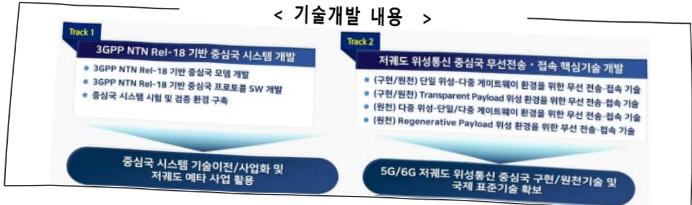
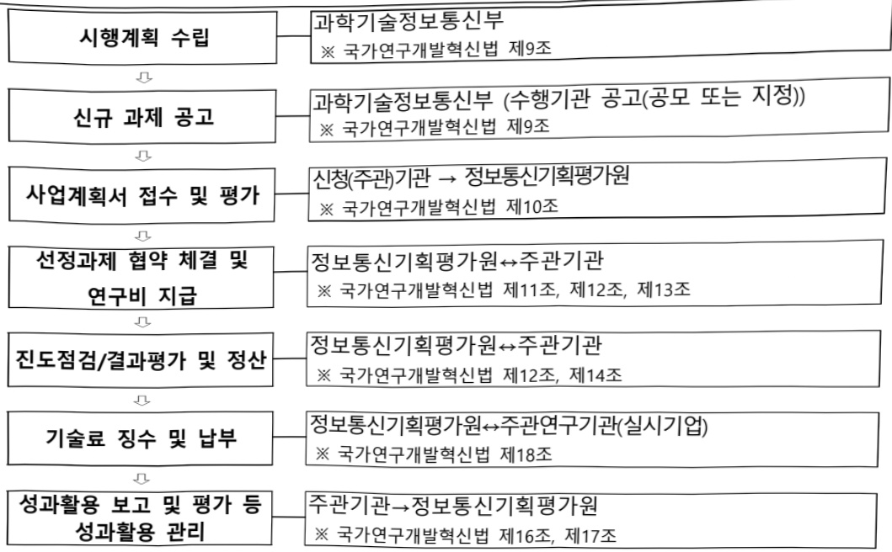

# 저궤도 군집 위성통신용 지능형 지상국 핵심기술 개…

**해당 페이지**: PDF 1346 ~ 1353 쪽 해당

**부처**: 과학기술정보통신부
**분야**: 통신
**회계유형**: 일반회계
**2026 확정예산**: 3860.0 백만원
**전년대비 증감률**: -3.5%
**AI 도메인**: 우주/위성

---

### 가.예산 총괄표

(단위: 백만원, %)

<table border=1 style='margin: auto; word-wrap: break-word;'><tr><td rowspan="2">사업명</td><td rowspan="2">2024년 결산</td><td colspan="2">2025년 예산</td><td colspan="2">2026년 예산</td><td rowspan="2">증감(B-A)</td><td rowspan="2">(B-A)/A</td></tr><tr><td style='text-align: center; word-wrap: break-word;'>본예산</td><td style='text-align: center; word-wrap: break-word;'>추경*(A)</td><td style='text-align: center; word-wrap: break-word;'>요구안</td><td style='text-align: center; word-wrap: break-word;'>본예산(B)</td></tr><tr><td style='text-align: center; word-wrap: break-word;'>저궤도 군집 위성통신용 지능형 지상국 핵심기술 개발</td><td style='text-align: center; word-wrap: break-word;'>4,960</td><td style='text-align: center; word-wrap: break-word;'>4,000</td><td style='text-align: center; word-wrap: break-word;'>4,000</td><td style='text-align: center; word-wrap: break-word;'>3,860</td><td style='text-align: center; word-wrap: break-word;'>3,860</td><td style='text-align: center; word-wrap: break-word;'>△140</td><td style='text-align: center; word-wrap: break-word;'>△3.5</td></tr></table>

*추경: 추경증감액을 포함한 최종 예산액을 기재

## □ 기능별(내역사업별) 예산 내역

(단위:백만원)

<table border=1 style='margin: auto; word-wrap: break-word;'><tr><td rowspan="2"></td><td colspan="5">2024</td><td colspan="5">2025</td><td rowspan="2">2026 예산</td></tr><tr><td style='text-align: center; word-wrap: break-word;'>예산액 (추정)</td><td style='text-align: center; word-wrap: break-word;'>예산 현액</td><td style='text-align: center; word-wrap: break-word;'>집행액</td><td style='text-align: center; word-wrap: break-word;'>이월액</td><td style='text-align: center; word-wrap: break-word;'>불용액</td><td style='text-align: center; word-wrap: break-word;'>예산액 (추정)</td><td style='text-align: center; word-wrap: break-word;'>예산 현액</td><td style='text-align: center; word-wrap: break-word;'>집행액</td><td style='text-align: center; word-wrap: break-word;'>이월액</td><td style='text-align: center; word-wrap: break-word;'>불용액</td></tr><tr><td style='text-align: center; word-wrap: break-word;'>○ 기능별 분류(합계)</td><td style='text-align: center; word-wrap: break-word;'>4,960</td><td style='text-align: center; word-wrap: break-word;'>4,960</td><td style='text-align: center; word-wrap: break-word;'>4,960</td><td style='text-align: center; word-wrap: break-word;'>-</td><td style='text-align: center; word-wrap: break-word;'>-</td><td style='text-align: center; word-wrap: break-word;'>4,000</td><td style='text-align: center; word-wrap: break-word;'>4,000</td><td style='text-align: center; word-wrap: break-word;'>4,000</td><td style='text-align: center; word-wrap: break-word;'>-</td><td style='text-align: center; word-wrap: break-word;'>-</td><td style='text-align: center; word-wrap: break-word;'>3,860</td></tr><tr><td style='text-align: center; word-wrap: break-word;'>• 저궤도 군집 위성 통신용 지능형 지상국 핵심기술개발</td><td style='text-align: center; word-wrap: break-word;'>4,960</td><td style='text-align: center; word-wrap: break-word;'>4,960</td><td style='text-align: center; word-wrap: break-word;'>4,960</td><td style='text-align: center; word-wrap: break-word;'>-</td><td style='text-align: center; word-wrap: break-word;'>-</td><td style='text-align: center; word-wrap: break-word;'>4,000</td><td style='text-align: center; word-wrap: break-word;'>4,000</td><td style='text-align: center; word-wrap: break-word;'>4,000</td><td style='text-align: center; word-wrap: break-word;'>-</td><td style='text-align: center; word-wrap: break-word;'>-</td><td style='text-align: center; word-wrap: break-word;'>3,860</td></tr></table>

### 나. 사업설명자료

## 1 ) 사업목적·내용

- 저폐도 위성통신 시스템 기반으로 군집위성 동시 운용 및 위성-지상망 연결을 위한 지상국 핵심기술 개발

·저궤도 통신위성과 데이터 네트워크를 연결하는 피디링크 송수신 및 접속 제어를 위한 중심국 모델 및 프로토콜 기술 개발

---

2) 사업개요

사업근거 및 추진경위

① 법령상 근거 및 조항 적시

0 과학기술기본법 제11조(국가연구개발사업의 추진)

제11조(국가연구개발사업의 추진)

① 중앙행정기관의 장은 기본계획에 따라 말은 분야의 국가연구개발사업과 그 시책을 세워 추진하여야 한다. <개정 2014 · 5 · 28>

0 정보통신산업진흥법 제7조(정보통신기술진흥 시행계획)

제7조(정보통신기술진흥 시행계획)

① 과학기술정보통신부장관은 정보통신기술의 진흥을 위하여 진흥계획에 따라 다음 각 호의 사항이 포함된 정보통신기술진흥 시행계획을 매년 수립·시행하여야 한다. <개정 2013 · 3 · 23, 2017 · 7 · 26>

1. 정보통신기술 수준의 조사, 개발된 정보통신기술의 평가 및 활용에 관한 사항

2. 정보통신기술 관련 정보의 원활한 유통에 관한 사항

3. 정보통신기술의 연구개발 및 다른 기술과의 결합 및 융합 촉진에 관한 사항

4. 정보통신기술의 협력, 지도 및 이전에 관한 사항

5. 정보통신기술에 관한 산학협동 촉진에 관한 사항

6. 전문인력의 양성 및 수급에 관한 사항

7. 정보통신기술의 표준화 및 새로운 정보통신기술의 채택에 관한 사항

8. 정보통신기술을 연구하는 기관 또는 단체의 육성에 관한 사항

9. 정보통신기술의 국제협력에 관한 사항

10. 그 밖에 정보통신기술의 진흥을 위하여 필요한 사항

② 과학기술정보통신부장관은 제1항에 따른 사항을 효율적으로 추진하기 위하여 필요하면 대통령령으로 정하는 바에 따라 정보통신기술의 개발 및 정보통신산업의 진흥과 관련된 연구기관 및 단체로 하여금 이를 대행하게 할 수 있으며 이에 드는 비용을 지원할 수 있다. <개정 2013 · 3 · 23, 2017 · 7 · 26>

③ 제1항에 따른 정보통신기술진흥 시행계획의 수립·시행 등에 필요한 사항은 대통령령으로 정한다.

° 정보통신 진흥 및 융합 활성화 등에 관한 특별법 제14조 (정보통신 네트워크의 고도화)

제14조(정보통신 네트워크의 고도화) ① 과학기술정보통신부장관은 정보통신 진흥 및 융합 활성화를 위하여 정보통신 네트워크의 고도화를 지속적으로 추진하여야 한다. <개정 2017. 7. 26.>

② 과학기술정보통신부장관은 정보통신 네트워크 고도화를 위한 민간의 활발한 투자를 유도하고 지원하는 데 필요한 정책을 마련하여야 한다. <개정 2017. 7. 26.>

정보통신 진흥 및 융합 활성화 등에 관한 특별법 제32조

(정보통신융합등 기술·서비스 개발 등의 지원)

제32조(정보통신융합등 기술·서비스 개발 등의 지원) ① 과학기술정보통신부장관은 다른 산업 및 서비스 등에 정보통신의 접목을 통하여 생산성과 가치를 높일 수 있도록 노력하여야 한다. <개정 2017.7.26>

② 과학기술정보통신부장관은 정보통신융합등 기술·서비스의 개발을 촉진하기 위하여 다음 각 호의 사업을 추진할 수 있다. <개정 2017.7.26>

1. 정보통신융합등 기술·서비스 관련 연구개발 사업

2. 제1호에 따라 추진되는 과제에 대한 기획·평가·관리

3. 국가·지방자치단체, 대학·정부출연연구기관, 민간 등이 보유한 정보통신융합등 기술의 거래 등 기술이전을 위한 중개·알선 지원

4. 정보통신융합등 기술에 대한 평가 및 평가 기법의 개발·보급

5. 정보통신융합등 기술의 기술이전·사업화에 관한 통계조사·연구 등 관련 정보의 수집·분석·제공

6. 정보통신융합등 기술의 기술이전 후 상용화 연구개발 지원

7. 정보통신융합등 기술의 기술사업화 전문인력 양성

8. 정보통신융합등 기술의 기술거래·사업화 촉진을 위한 정보시스템 구축·활용

9. 지식재산권 등 정보통신융합등 기술 관련 연구성과물의 관리·홍보·활용

10. 정보통신융합등 기술·서비스의 수준조사 등 정책연구 사업

---

11. 정보통신융합등 기술·서비스 관련 시범사업

12. 그 밖에 정보통신기술진흥을 위하여 필요한 사업

③ 과학기술정보통신부장관은 제2항 각 호의 사업을 추진하기 위하여 법인인 전담기관을 설립하거나 법인·단체에 위탁·운영할 수 있으며, 필요한 비용의 전부 또는 일부를 예산의 범위에서 출연 또는 보조할 수 있다. <개정 2017. 7. 26.>

④ 중앙행정기관의 장 및 지방자치단체의 장은 제2항 각 호의 사업을 제3항에 따른 전담기관으로 하여금 수행하게 하고, 그에 소요되는 비용의 전부 또는 일부를 지원할 수 있다.

⑤ 제3항에 따른 전담기관에 관하여 이 법에서 정한 것을 제외하고는 ‘민법’ 중 재단법인에 관한 규정을 준용하며, 전담기관의 운영 및 제2항 각 호의 업무수행에 필요한 사항은 대통령령으로 정한다.

0 우주개발 진흥법 제5조(우주개발진흥 기본계획의 수립)

① 정부는 우주개발의 진흥과 우주물체의 이용·관리 등을 위하여 5년마다 우주개발에 관한 중장기 정책 목표 및 기본방향을 정하는 우주개발진흥 기본계획(이하 "기본계획"이라 한다)을 수립하여야 한다.

② 기본계획에는 다음 각 호의 사항이 포함되어야 한다. <개정 2022. 6. 10.>

1. 우주개발정책의 목표 및 방향에 관한 사항

6. 우주개발을 위한 연구개발에 관한 사항

## ② 추진경위

°국정과제(AI 3대 강국 도약을 위한『AI고속도로』구축)

0 디지털국정과제 현장간담회('22.9.)

(참석자) 과기정통부 제2차관, 위성통신 관련 산학연 전문가 등

(주요 내용) 뉴스페이스 시대의 6G 초공간 기술 확보를 위한 국내 산업계 변화 대응 필요

○ 新성장 4.0 전략 추진계획('22.12.)

• 6G 상용화 기술개발 추진, 저궤도 위성통신 시범망* 구축('26~)

* 소형위성을 발사해 2,000km 내 저궤도에서 지상 전역의 통신을 커버하는 기술

2. (新일상) Digital Everywhere

① (내 삶 속의 디지털) K-클라우드 프로젝트 추진('30), AI 제품·서비스 개발·보급 5G 전국악 구촉('24), 6G('30) 및 위성인터넷 기술 확보

② (차세대 물류) 부산신망('26) · 진해신망('29)을 스마트망만으로 구촉 로봇·드론 배송 등 밝물류서비스 전국 확산, 식품 등 클드제인 구촉

③ (단소중립도시) '30년까지 탄소중립도시(Net-Zero City) 10개소 조성

④ (스마트 농어업) 도심형 복합수직농장 구촉(~27), 민간주도 대규모 스마트팀 조성 대규모 스마트양식 클러스터 구촉(6개소, '26), 부드론크 육성

⑤ (스마트 그리드) 재생에 통합관제시스템 구촉(~25), 공공 ESS 구촉('23)

ㅇ 제4차 우주개발진흥 기본계획('22.12)

•「우주개발진흥법」제5조에 따라 국가 우주개발의 중장기 정책목표와 방향을 설정하는 최상위 법정 계획

* ①뉴스페이스 확대, ②우주탐사 본격화, ③글로벌 경쟁 격화, ④우주개발의 가치 증대에 발맞춰

대한민국 우주경제 실현을 위한 우주개발 2.0정책 제시

○ K-Network 2030 전략('23.2.)

·과학기술정보통신부는 6G·위성·양자 등 차세대 네트워크 준비, 기존 네트워크 고도화 및 전후방 네트워크 산업 생태계 활성화를 위한 미래 비전 및 전략 수립

* (위성통신 경쟁력 확보) 미래 통신서비스의 공간적 확장(지상→공중)에 대비, 저궤도 위성통신 경쟁력 확보를 위한 시범망 구축 및 핵심기술 자립화

○ 위성통신 활성화 전략('23.9.)

·과학기술정보통신부는 9.18(월) 개최된 비상경제장관회의에서 위성통신 기술·산업 경쟁력 확보와 국민들의 위성통신 서비스 이용 기반 마련을 위한「위성통신 활성화 전략」을 발표

---

## 주요내용

① 사업규모

- 사업기간 : '24.4.~'26.12.

- 최근 5년 간 투입된 사업비(예산액기준, 추경편성한 연도에는 추경포함)

<table border=1 style='margin: auto; word-wrap: break-word;'><tr><td style='text-align: center; word-wrap: break-word;'>연도</td><td style='text-align: center; word-wrap: break-word;'>2022</td><td style='text-align: center; word-wrap: break-word;'>2023</td><td style='text-align: center; word-wrap: break-word;'>2024</td><td style='text-align: center; word-wrap: break-word;'>2025</td><td style='text-align: center; word-wrap: break-word;'>2026</td></tr><tr><td style='text-align: center; word-wrap: break-word;'>사업비</td><td style='text-align: center; word-wrap: break-word;'>-</td><td style='text-align: center; word-wrap: break-word;'>-</td><td style='text-align: center; word-wrap: break-word;'>4,960</td><td style='text-align: center; word-wrap: break-word;'>4,000</td><td style='text-align: center; word-wrap: break-word;'>3,860</td></tr></table>

② 사업추진체계

- 사업시행방법 : 출연

- 사업시행주체 : 정보통신기획평가원

- 사업 수혜자 : 산업체, 대학, 연구소, 위성통신 서비스 이용자(국민·기업) 등

- 보조, 융자, 출연, 출자 등의 경우 보조·융자 등 지원 비율 및 법적근거

<table border=1 style='margin: auto; word-wrap: break-word;'><tr><td style='text-align: center; word-wrap: break-word;'>내역사업명</td><td style='text-align: center; word-wrap: break-word;'>구분</td><td style='text-align: center; word-wrap: break-word;'>피보조·피출연 등 기관명</td><td style='text-align: center; word-wrap: break-word;'>지원 금액 (2026예산안)</td><td style='text-align: center; word-wrap: break-word;'>지원 비율(%)</td><td style='text-align: center; word-wrap: break-word;'>보조율 법적근거 (해당 조항)</td></tr><tr><td style='text-align: center; word-wrap: break-word;'>저궤도 군집 위성통신용 지능형 지상국 핵심기술 개발</td><td style='text-align: center; word-wrap: break-word;'>출연</td><td style='text-align: center; word-wrap: break-word;'>정보통신기획 평가원</td><td style='text-align: center; word-wrap: break-word;'>3,860</td><td style='text-align: center; word-wrap: break-word;'>100</td><td style='text-align: center; word-wrap: break-word;'>국가연구개발혁신법 제22조</td></tr></table>

## 3 ) 2026년도 예산 산출 근거

① 저궤도 군집 위성통신용 지능형 지상국 핵심기술 개발

- (요구) 중심국 모뎀/프로토콜 SW/HW 플랫폼 고도화, 중심국 시스템 통합 시험/검증 등 추진

- (산출) 계속 1개 × 3,860백만원 × 12/12개월 = 3,860백만원

## 4 ) 사업효과

사업영향, 산출물 성과지표 등

① 2022~2026년도 성과계획서 상 성과지표 및 최근 5년간 성과 달성도

<table border=1 style='margin: auto; word-wrap: break-word;'><tr><td style='text-align: center; word-wrap: break-word;'>성과지표</td><td style='text-align: center; word-wrap: break-word;'>구분</td><td style='text-align: center; word-wrap: break-word;'>2022</td><td style='text-align: center; word-wrap: break-word;'>2023</td><td style='text-align: center; word-wrap: break-word;'>2024</td><td style='text-align: center; word-wrap: break-word;'>2025</td><td style='text-align: center; word-wrap: break-word;'>2026</td><td style='text-align: center; word-wrap: break-word;'>2026 목표치산출근거</td><td style='text-align: center; word-wrap: break-word;'>측정산식(또는 측정방법)</td><td style='text-align: center; word-wrap: break-word;'>자료수집방법(또는 자료출처)</td></tr><tr><td rowspan="3">중심국 주파수 효율(단위: bps/Hz)</td><td style='text-align: center; word-wrap: break-word;'>목표</td><td rowspan="3">-</td><td rowspan="3">신규</td><td style='text-align: center; word-wrap: break-word;'>9(시뮬레이션)</td><td style='text-align: center; word-wrap: break-word;'>12(시뮬레이션)</td><td rowspan="3">6G 이동통신 시스템의 주파수 효율이 12bps/Hz 예상, 이를 근거로 중심국 주파수 효율 설정※ 1차년도에는 중심국 주파수 효율 핵심기술 설계 및 시뮬레이션 설계/개발 단계이므로 성과지표 수치를 제시하기 어려움</td><td rowspan="3">초당 데이터 비트 수/주파수 대역폭</td><td rowspan="3">NTIS 및 연구관리시스템, 성과조사분석 보고서</td><td rowspan="3"></td></tr><tr><td style='text-align: center; word-wrap: break-word;'>실적</td><td style='text-align: center; word-wrap: break-word;'>-</td><td style='text-align: center; word-wrap: break-word;'>9</td></tr><tr><td style='text-align: center; word-wrap: break-word;'>달성도</td><td style='text-align: center; word-wrap: break-word;'>-</td><td style='text-align: center; word-wrap: break-word;'>100</td></tr><tr><td style='text-align: center; word-wrap: break-word;'>핸드오버 지연 시간(단위:ms)</td><td style='text-align: center; word-wrap: break-word;'>목표</td><td style='text-align: center; word-wrap: break-word;'>-</td><td style='text-align: center; word-wrap: break-word;'>신규</td><td style='text-align: center; word-wrap: break-word;'>20(시뮬레이션)</td><td style='text-align: center; word-wrap: break-word;'>5(시뮬레이션)</td><td style='text-align: center; word-wrap: break-word;'>샐러드 이동통신 시스템에서의 핸드오버 지연 시간 감소 기술(Dual Active Protocol Stack(DAPS))을 위성통신 환경에 고려하여 핸드오버 지연시간 5ms 이하</td><td style='text-align: center; word-wrap: break-word;'>단말이 소스(Source)셀에서 타겟(target)셀로 연결을 변경할 때기지국과 데이터를</td><td style='text-align: center; word-wrap: break-word;'>NTIS 및 연구관리시스템, 성과조사분석</td><td style='text-align: center; word-wrap: break-word;'></td></tr></table>

---

<table border=1 style='margin: auto; word-wrap: break-word;'><tr><td rowspan="2"></td><td style='text-align: center; word-wrap: break-word;'>실적</td><td style='text-align: center; word-wrap: break-word;'></td><td style='text-align: center; word-wrap: break-word;'></td><td style='text-align: center; word-wrap: break-word;'>-</td><td style='text-align: center; word-wrap: break-word;'>20</td><td style='text-align: center; word-wrap: break-word;'>-</td><td rowspan="2">로 설정(※ 700 km 고도의 저해도 위성 환경에서 단말 위성 간 최소 RTT: 대략 5 ms)</td><td rowspan="2">송수신하지 못하는 최소 시간</td><td rowspan="2">보고서</td></tr><tr><td style='text-align: center; word-wrap: break-word;'>달성도</td><td style='text-align: center; word-wrap: break-word;'></td><td style='text-align: center; word-wrap: break-word;'></td><td style='text-align: center; word-wrap: break-word;'></td><td style='text-align: center; word-wrap: break-word;'>100</td><td style='text-align: center; word-wrap: break-word;'></td></tr><tr><td rowspan="3">논문의 표준화 영향력지수 (단위: mrnIF)</td><td style='text-align: center; word-wrap: break-word;'>목표</td><td style='text-align: center; word-wrap: break-word;'></td><td style='text-align: center; word-wrap: break-word;'></td><td style='text-align: center; word-wrap: break-word;'>신규</td><td style='text-align: center; word-wrap: break-word;'>69.35</td><td style='text-align: center; word-wrap: break-word;'>71.43</td><td rowspan="3">유사사업(방송통신산업기술개발사업의 21년 ~23년 논문의 표준화된 손위보정 영향력지수(mmIF) 평균(69.35)을 목표치료 설정하고 연차 별로 +3% 상향</td><td rowspan="3">논문의 표준화 영향력 지수 =  $ \sum $논문(mmIF)/논문진수</td><td rowspan="3">NTIS 및 연구관리시스템, 성과조사분석 보고서</td></tr><tr><td style='text-align: center; word-wrap: break-word;'>실적</td><td style='text-align: center; word-wrap: break-word;'></td><td style='text-align: center; word-wrap: break-word;'></td><td style='text-align: center; word-wrap: break-word;'>-</td><td style='text-align: center; word-wrap: break-word;'>84.89</td><td style='text-align: center; word-wrap: break-word;'>-</td></tr><tr><td style='text-align: center; word-wrap: break-word;'>달성도</td><td style='text-align: center; word-wrap: break-word;'></td><td style='text-align: center; word-wrap: break-word;'></td><td style='text-align: center; word-wrap: break-word;'>-</td><td style='text-align: center; word-wrap: break-word;'>122</td><td style='text-align: center; word-wrap: break-word;'>-</td></tr></table>

* 전략계획서 기준

## ② 성과지표 이외의 연도별 사업추진 경과 및 실적

<table border=1 style='margin: auto; word-wrap: break-word;'><tr><td style='text-align: center; word-wrap: break-word;'>2024</td><td style='text-align: center; word-wrap: break-word;'>○ 지상국 규격 및 상위/상세설계 - 중심국 시스템 요구사항 정의 - 중심국 모델/프로토콜 규격 정의 - 중심국 모델/프로토콜 상위/상세설계 - 핵심기술 요구사항 정의 및 기술동향 분석 - 저궤도 위성통신 관련 3GPP 표준화 활동</td></tr><tr><td style='text-align: center; word-wrap: break-word;'>2025</td><td style='text-align: center; word-wrap: break-word;'>○ 중심국 모델/프로토콜 SW 및 HW 플랫폼 개발, 검증환경 구축을 위한 에뮬레이터 구매 등 - 중심국 모델/프로토콜 구현 및 HW 플랫폼 제작(TRL 6~7) - 중심국 모델 및 프로토콜 통합 - 검증환경 구축용 에뮬레이터 개발 및 구매 - 핵심기술 도출/알고리즘 개발/성능분석 시뮬레이터 개발 - 저궤도 위성통신 관련 3GPP 표준화 활동</td></tr></table>

③ 향후(2026년도 이후) 기대효과 : 개조식으로 작성, 건 별로 계량적 수치 제시

- (기술적 기대효과) 3GPP NTN 기반의 저휘도 위성통신 기지국 및 네트워크 기술 개발로 국내 위성통신 산업체의 기술경쟁력 강화

- (경제적 기대효과) 저휘도 통신위성 기반 초공간 통신 인프라 구축으로 차별화된

혁신적 서비스 활성화 및 신규 일자리 창출 기대

- (사회적 기대효과) 재난·재해 등 위급상황이나 통신 인프라가 취약한 도서지역까지 고품질의 통신서비스를 제공하여 국민 삶의 질 제고, 공공 안전 개선에 기여

5) 타당성조사 및 예비타당성조사 시행여부 및 결과 요지 : 해당 없음

6) 총사업비 대상사업 정보 : 해당 없음

## 7 ) 사업 집행절차

---

과학기술정보통신부

※ 국가연구개발혁신법 제9조

과학기술정보통신부 (수행기관 공고(공모 또는 지정))

※ 국가연구개발혁신법 제9조

정보통신기획평가원↔주관기관

※ 국가연구개발혁신법 제11조, 제12조, 제13조

저케도 군집 위성통신용 지능형 지상국 핵심기술 개발

<table border=1 style='margin: auto; word-wrap: break-word;'><tr><td style='text-align: center; word-wrap: break-word;'>부처</td><td style='text-align: center; word-wrap: break-word;'></td><td style='text-align: center; word-wrap: break-word;'>피출연·피보조기관</td><td style='text-align: center; word-wrap: break-word;'></td><td style='text-align: center; word-wrap: break-word;'>간접보조사업자·사업수행자</td></tr><tr><td style='text-align: center; word-wrap: break-word;'>과학기술정보통신부(3,860백만원)</td><td style='text-align: center; word-wrap: break-word;'>=&gt;(3,860백만원)</td><td style='text-align: center; word-wrap: break-word;'>정보통신기획평가원(3,860백만원)</td><td style='text-align: center; word-wrap: break-word;'>=&gt;(3,860백만원)</td><td style='text-align: center; word-wrap: break-word;'>한국전자통신연구원외 12개 기관</td></tr></table>

8) 각종 평가 : 해당 없음

### 다. 최근 4년간 결산내역

1) 결산표

☐ 부처 결산내역

(단위: 백만원, %)

<table border=1 style='margin: auto; word-wrap: break-word;'><tr><td rowspan="2">闰도</td><td colspan="3">예산액</td><td rowspan="2">예산현액(A)</td><td rowspan="2">집행액(B)</td><td rowspan="2">집행률(B/A)</td><td rowspan="2">다음연도이월액</td><td rowspan="2">불용액</td></tr><tr><td style='text-align: center; word-wrap: break-word;'>본예산</td><td style='text-align: center; word-wrap: break-word;'>추경중감액</td><td style='text-align: center; word-wrap: break-word;'>추경</td></tr><tr><td style='text-align: center; word-wrap: break-word;'>2022</td><td style='text-align: center; word-wrap: break-word;'>-</td><td style='text-align: center; word-wrap: break-word;'>-</td><td style='text-align: center; word-wrap: break-word;'>-</td><td style='text-align: center; word-wrap: break-word;'>-</td><td style='text-align: center; word-wrap: break-word;'>-</td><td style='text-align: center; word-wrap: break-word;'>-</td><td style='text-align: center; word-wrap: break-word;'>-</td><td style='text-align: center; word-wrap: break-word;'>-</td></tr><tr><td style='text-align: center; word-wrap: break-word;'>2023</td><td style='text-align: center; word-wrap: break-word;'>-</td><td style='text-align: center; word-wrap: break-word;'>-</td><td style='text-align: center; word-wrap: break-word;'>-</td><td style='text-align: center; word-wrap: break-word;'>-</td><td style='text-align: center; word-wrap: break-word;'>-</td><td style='text-align: center; word-wrap: break-word;'>-</td><td style='text-align: center; word-wrap: break-word;'>-</td><td style='text-align: center; word-wrap: break-word;'>-</td></tr><tr><td style='text-align: center; word-wrap: break-word;'>2024</td><td style='text-align: center; word-wrap: break-word;'>4,960</td><td style='text-align: center; word-wrap: break-word;'></td><td style='text-align: center; word-wrap: break-word;'>4,960</td><td style='text-align: center; word-wrap: break-word;'>4,960</td><td style='text-align: center; word-wrap: break-word;'>4,960</td><td style='text-align: center; word-wrap: break-word;'>100</td><td style='text-align: center; word-wrap: break-word;'>-</td><td style='text-align: center; word-wrap: break-word;'>-</td></tr><tr><td style='text-align: center; word-wrap: break-word;'>2025</td><td style='text-align: center; word-wrap: break-word;'>4,000</td><td style='text-align: center; word-wrap: break-word;'></td><td style='text-align: center; word-wrap: break-word;'>4,000</td><td style='text-align: center; word-wrap: break-word;'>4,000</td><td style='text-align: center; word-wrap: break-word;'>4,000</td><td style='text-align: center; word-wrap: break-word;'>100</td><td style='text-align: center; word-wrap: break-word;'>-</td><td style='text-align: center; word-wrap: break-word;'>-</td></tr></table>

---

□2025년 이·전용 등 세부내역 : 해당 없음

<table border=1 style='margin: auto; word-wrap: break-word;'><tr><td style='text-align: center; word-wrap: break-word;'>2024</td><td style='text-align: center; word-wrap: break-word;'>- 4,960 백 만원(100%) 집행 완료</td></tr><tr><td style='text-align: center; word-wrap: break-word;'>2025</td><td style='text-align: center; word-wrap: break-word;'>- 4,000 백 만원(100%) 집행 완료</td></tr></table>

□2022~2025년 결산 주요사항

---

<table border=1 style='margin: auto; word-wrap: break-word;'><tr><td style='text-align: center; word-wrap: break-word;'>사 업 명</td></tr><tr><td style='text-align: center; word-wrap: break-word;'>(11) 전국민 AI활용서비스 개발환경 조성 (2033-504)</td></tr></table>

☐ 사업 코드 정보

<table border=1 style='margin: auto; word-wrap: break-word;'><tr><td style='text-align: center; word-wrap: break-word;'>구분</td><td style='text-align: center; word-wrap: break-word;'>기금</td><td style='text-align: center; word-wrap: break-word;'>소관</td><td style='text-align: center; word-wrap: break-word;'>실국(기관)</td><td style='text-align: center; word-wrap: break-word;'>계정</td><td style='text-align: center; word-wrap: break-word;'>분야</td><td style='text-align: center; word-wrap: break-word;'>부문</td></tr><tr><td style='text-align: center; word-wrap: break-word;'>코드</td><td style='text-align: center; word-wrap: break-word;'>정보통신진흥</td><td style='text-align: center; word-wrap: break-word;'>과학기술정보</td><td rowspan="2">정보통신정책관</td><td rowspan="2">-</td><td style='text-align: center; word-wrap: break-word;'>분야코드(3자리)</td><td style='text-align: center; word-wrap: break-word;'>부문코드(3자리)</td></tr><tr><td style='text-align: center; word-wrap: break-word;'>명칭</td><td style='text-align: center; word-wrap: break-word;'>기금</td><td style='text-align: center; word-wrap: break-word;'>통신부</td><td style='text-align: center; word-wrap: break-word;'>분야명</td><td style='text-align: center; word-wrap: break-word;'>부문명</td></tr></table>

<table border=1 style='margin: auto; word-wrap: break-word;'><tr><td style='text-align: center; word-wrap: break-word;'>구분</td><td style='text-align: center; word-wrap: break-word;'>프로그램</td><td style='text-align: center; word-wrap: break-word;'>단위사업</td><td style='text-align: center; word-wrap: break-word;'>세부사업</td></tr><tr><td style='text-align: center; word-wrap: break-word;'>코드</td><td style='text-align: center; word-wrap: break-word;'>2000</td><td style='text-align: center; word-wrap: break-word;'>2033</td><td style='text-align: center; word-wrap: break-word;'>504</td></tr><tr><td style='text-align: center; word-wrap: break-word;'>명칭</td><td style='text-align: center; word-wrap: break-word;'>인터넷융합사업</td><td style='text-align: center; word-wrap: break-word;'>스마트화산업기반확충</td><td style='text-align: center; word-wrap: break-word;'>전국민 AI활용 서비스 개발환경 조성</td></tr></table>

□ 사업 성격 (공통요구자료 II-1 작성유의사항 4. 참조, 해당하는 사항에 “○” 표시)

<table border=1 style='margin: auto; word-wrap: break-word;'><tr><td rowspan="2">신규</td><td rowspan="2">계속</td><td rowspan="2">완료</td><td rowspan="2">예비타당성 실시여부</td><td rowspan="2">총사업비 관리대상</td><td rowspan="2">총액계상 예산사업</td><td style='text-align: center; word-wrap: break-word;'>사업소관 변경정보</td></tr><tr><td style='text-align: center; word-wrap: break-word;'>2025예산 시 소관</td></tr><tr><td style='text-align: center; word-wrap: break-word;'></td><td style='text-align: center; word-wrap: break-word;'></td><td style='text-align: center; word-wrap: break-word;'></td><td style='text-align: center; word-wrap: break-word;'></td><td style='text-align: center; word-wrap: break-word;'></td><td style='text-align: center; word-wrap: break-word;'></td><td style='text-align: center; word-wrap: break-word;'></td></tr></table>

□ 사업 지원 형태 및 지원을

<table border=1 style='margin: auto; word-wrap: break-word;'><tr><td style='text-align: center; word-wrap: break-word;'>직접</td><td style='text-align: center; word-wrap: break-word;'>출자</td><td style='text-align: center; word-wrap: break-word;'>출연</td><td style='text-align: center; word-wrap: break-word;'>보조</td><td style='text-align: center; word-wrap: break-word;'>융자</td><td style='text-align: center; word-wrap: break-word;'>국고보조율(%)</td><td style='text-align: center; word-wrap: break-word;'>융자율(%)</td></tr><tr><td style='text-align: center; word-wrap: break-word;'></td><td style='text-align: center; word-wrap: break-word;'></td><td style='text-align: center; word-wrap: break-word;'>O</td><td style='text-align: center; word-wrap: break-word;'></td><td style='text-align: center; word-wrap: break-word;'></td><td style='text-align: center; word-wrap: break-word;'></td><td style='text-align: center; word-wrap: break-word;'></td></tr></table>

□ 사업 소관부처 및 시행주체

<table border=1 style='margin: auto; word-wrap: break-word;'><tr><td style='text-align: center; word-wrap: break-word;'>사업명</td><td colspan="2">구분</td></tr><tr><td rowspan="2">전국민 AI활용서비스 개발환경 조성</td><td style='text-align: center; word-wrap: break-word;'>소관부처</td><td style='text-align: center; word-wrap: break-word;'>정보통신정책실·정보통신정책관·디지털사회기획과</td></tr><tr><td style='text-align: center; word-wrap: break-word;'>사업시행주체</td><td style='text-align: center; word-wrap: break-word;'>한국지능정보사회진흥원</td></tr></table>

---

### 원본 PDF 크롭 이미지

