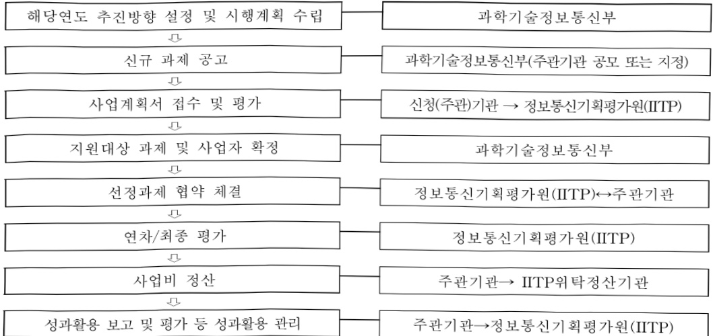

# 정보보호핵심원천기술개발(R&D,정보화)

**해당 페이지**: PDF 1362 ~ 1371 쪽 해당

**부처**: 과학기술정보통신부
**분야**: 통신
**회계유형**: 기금
**2026 확정예산**: 107415.0 백만원
**전년대비 증감률**: None%
**AI 도메인**: 보안/사이버, 디지털전환(AX)

---

<table border=1 style='margin: auto; word-wrap: break-word;'><tr><td rowspan="2"></td><td colspan="5">2024</td><td colspan="5">2025</td><td rowspan="2">2026계획</td></tr><tr><td style='text-align: center; word-wrap: break-word;'>계획액(주경)</td><td style='text-align: center; word-wrap: break-word;'>계획현액</td><td style='text-align: center; word-wrap: break-word;'>집행액</td><td style='text-align: center; word-wrap: break-word;'>이월액</td><td style='text-align: center; word-wrap: break-word;'>불용액</td><td style='text-align: center; word-wrap: break-word;'>계획액(주경)</td><td style='text-align: center; word-wrap: break-word;'>계획현액</td><td style='text-align: center; word-wrap: break-word;'>집행액</td><td style='text-align: center; word-wrap: break-word;'>이월액</td><td style='text-align: center; word-wrap: break-word;'>불용액</td></tr><tr><td style='text-align: center; word-wrap: break-word;'>○ 기능별 분류(합계)</td><td style='text-align: center; word-wrap: break-word;'>107,570</td><td style='text-align: center; word-wrap: break-word;'>107,570</td><td style='text-align: center; word-wrap: break-word;'>107,570[10748.5]</td><td style='text-align: center; word-wrap: break-word;'>-</td><td style='text-align: center; word-wrap: break-word;'>121.5</td><td style='text-align: center; word-wrap: break-word;'>99,335</td><td style='text-align: center; word-wrap: break-word;'>99,335</td><td style='text-align: center; word-wrap: break-word;'>99,335[99,335]</td><td style='text-align: center; word-wrap: break-word;'>-</td><td style='text-align: center; word-wrap: break-word;'>-</td><td style='text-align: center; word-wrap: break-word;'>107,415</td></tr><tr><td style='text-align: center; word-wrap: break-word;'>·데이터 및 네트워크보호 기술개발</td><td style='text-align: center; word-wrap: break-word;'>46,636</td><td style='text-align: center; word-wrap: break-word;'>46,636</td><td style='text-align: center; word-wrap: break-word;'>46,636[46,636]</td><td style='text-align: center; word-wrap: break-word;'>-</td><td style='text-align: center; word-wrap: break-word;'>-</td><td style='text-align: center; word-wrap: break-word;'>33,736</td><td style='text-align: center; word-wrap: break-word;'>33,736</td><td style='text-align: center; word-wrap: break-word;'>33,736[33,736]</td><td style='text-align: center; word-wrap: break-word;'>-</td><td style='text-align: center; word-wrap: break-word;'>-</td><td style='text-align: center; word-wrap: break-word;'>42,090</td></tr><tr><td style='text-align: center; word-wrap: break-word;'>·취약점 대응 및 신산업 융합보호 기술개발</td><td style='text-align: center; word-wrap: break-word;'>37,294</td><td style='text-align: center; word-wrap: break-word;'>37,294</td><td style='text-align: center; word-wrap: break-word;'>37,294[37,294]</td><td style='text-align: center; word-wrap: break-word;'>-</td><td style='text-align: center; word-wrap: break-word;'>-</td><td style='text-align: center; word-wrap: break-word;'>34,799</td><td style='text-align: center; word-wrap: break-word;'>34,799</td><td style='text-align: center; word-wrap: break-word;'>34,799[34,799]</td><td style='text-align: center; word-wrap: break-word;'>-</td><td style='text-align: center; word-wrap: break-word;'>-</td><td style='text-align: center; word-wrap: break-word;'>37,616</td></tr><tr><td style='text-align: center; word-wrap: break-word;'>·공공서비스 보호강화</td><td style='text-align: center; word-wrap: break-word;'>15,320</td><td style='text-align: center; word-wrap: break-word;'>15,320</td><td style='text-align: center; word-wrap: break-word;'>15,320[15,198.5]</td><td style='text-align: center; word-wrap: break-word;'>-</td><td style='text-align: center; word-wrap: break-word;'>121.5</td><td style='text-align: center; word-wrap: break-word;'>15,838</td><td style='text-align: center; word-wrap: break-word;'>15,838</td><td style='text-align: center; word-wrap: break-word;'>15,838[15,838]</td><td style='text-align: center; word-wrap: break-word;'>-</td><td style='text-align: center; word-wrap: break-word;'>-</td><td style='text-align: center; word-wrap: break-word;'>11,803</td></tr><tr><td style='text-align: center; word-wrap: break-word;'>·사이버보안 국제협력기반 기술개발</td><td style='text-align: center; word-wrap: break-word;'>8,320</td><td style='text-align: center; word-wrap: break-word;'>8,320</td><td style='text-align: center; word-wrap: break-word;'>8,320[8,320]</td><td style='text-align: center; word-wrap: break-word;'>-</td><td style='text-align: center; word-wrap: break-word;'>-</td><td style='text-align: center; word-wrap: break-word;'>14,962</td><td style='text-align: center; word-wrap: break-word;'>14,962</td><td style='text-align: center; word-wrap: break-word;'>14,962[14,962]</td><td style='text-align: center; word-wrap: break-word;'></td><td style='text-align: center; word-wrap: break-word;'></td><td style='text-align: center; word-wrap: break-word;'>15,906</td></tr><tr><td style='text-align: center; word-wrap: break-word;'>○ 비목별 분류(합계)</td><td style='text-align: center; word-wrap: break-word;'>107,570</td><td style='text-align: center; word-wrap: break-word;'>107,570</td><td style='text-align: center; word-wrap: break-word;'>107,570[10748.5]</td><td style='text-align: center; word-wrap: break-word;'>-</td><td style='text-align: center; word-wrap: break-word;'>121.5</td><td style='text-align: center; word-wrap: break-word;'>99,335</td><td style='text-align: center; word-wrap: break-word;'>99,335</td><td style='text-align: center; word-wrap: break-word;'>99,335[99,335]</td><td style='text-align: center; word-wrap: break-word;'>-</td><td style='text-align: center; word-wrap: break-word;'>-</td><td style='text-align: center; word-wrap: break-word;'>107,415</td></tr><tr><td style='text-align: center; word-wrap: break-word;'>·연구개발연구 활동비등(360-05)</td><td style='text-align: center; word-wrap: break-word;'>107,570</td><td style='text-align: center; word-wrap: break-word;'>107,570</td><td style='text-align: center; word-wrap: break-word;'>107,570[10748.5]</td><td style='text-align: center; word-wrap: break-word;'>-</td><td style='text-align: center; word-wrap: break-word;'>121.5</td><td style='text-align: center; word-wrap: break-word;'>99,335</td><td style='text-align: center; word-wrap: break-word;'>99,335</td><td style='text-align: center; word-wrap: break-word;'>99,335[99,335]</td><td style='text-align: center; word-wrap: break-word;'>-</td><td style='text-align: center; word-wrap: break-word;'>-</td><td style='text-align: center; word-wrap: break-word;'>107,415</td></tr><tr><td style='text-align: center; word-wrap: break-word;'>○ 기능비목별 분류(합계)</td><td style='text-align: center; word-wrap: break-word;'>107,570</td><td style='text-align: center; word-wrap: break-word;'>107,570</td><td style='text-align: center; word-wrap: break-word;'>107,570[10748.5]</td><td style='text-align: center; word-wrap: break-word;'>-</td><td style='text-align: center; word-wrap: break-word;'>121.5</td><td style='text-align: center; word-wrap: break-word;'>99,335</td><td style='text-align: center; word-wrap: break-word;'>99,335</td><td style='text-align: center; word-wrap: break-word;'>99,335[99,335]</td><td style='text-align: center; word-wrap: break-word;'>-</td><td style='text-align: center; word-wrap: break-word;'>-</td><td style='text-align: center; word-wrap: break-word;'>107,415</td></tr><tr><td style='text-align: center; word-wrap: break-word;'>·데이터 및 네트워크 보호 기술개발</td><td style='text-align: center; word-wrap: break-word;'>46,636</td><td style='text-align: center; word-wrap: break-word;'>46,636</td><td style='text-align: center; word-wrap: break-word;'>46,636[46,636]</td><td style='text-align: center; word-wrap: break-word;'>-</td><td style='text-align: center; word-wrap: break-word;'>-</td><td style='text-align: center; word-wrap: break-word;'>33,736</td><td style='text-align: center; word-wrap: break-word;'>33,736</td><td style='text-align: center; word-wrap: break-word;'>33,736[33,736]</td><td style='text-align: center; word-wrap: break-word;'>-</td><td style='text-align: center; word-wrap: break-word;'>-</td><td style='text-align: center; word-wrap: break-word;'>42,090</td></tr><tr><td style='text-align: center; word-wrap: break-word;'>·연구개발연구 활동비 등(360-05)</td><td style='text-align: center; word-wrap: break-word;'>46,636</td><td style='text-align: center; word-wrap: break-word;'>46,636</td><td style='text-align: center; word-wrap: break-word;'>46,636[46,636]</td><td style='text-align: center; word-wrap: break-word;'>-</td><td style='text-align: center; word-wrap: break-word;'>-</td><td style='text-align: center; word-wrap: break-word;'>33,736</td><td style='text-align: center; word-wrap: break-word;'>33,736</td><td style='text-align: center; word-wrap: break-word;'>33,736[33,736]</td><td style='text-align: center; word-wrap: break-word;'>-</td><td style='text-align: center; word-wrap: break-word;'>-</td><td style='text-align: center; word-wrap: break-word;'>42,090</td></tr><tr><td style='text-align: center; word-wrap: break-word;'>·취약점 대응 및 신산업 융합보호 기술개발</td><td style='text-align: center; word-wrap: break-word;'>37,294</td><td style='text-align: center; word-wrap: break-word;'>37,294</td><td style='text-align: center; word-wrap: break-word;'>37,294[37,294]</td><td style='text-align: center; word-wrap: break-word;'>-</td><td style='text-align: center; word-wrap: break-word;'>-</td><td style='text-align: center; word-wrap: break-word;'>34,799</td><td style='text-align: center; word-wrap: break-word;'>34,799</td><td style='text-align: center; word-wrap: break-word;'>34,799[34,799]</td><td style='text-align: center; word-wrap: break-word;'>-</td><td style='text-align: center; word-wrap: break-word;'>-</td><td style='text-align: center; word-wrap: break-word;'>37,616</td></tr><tr><td style='text-align: center; word-wrap: break-word;'>·연구개발연구 활동비 등(360-05)</td><td style='text-align: center; word-wrap: break-word;'>37,294</td><td style='text-align: center; word-wrap: break-word;'>37,294</td><td style='text-align: center; word-wrap: break-word;'>37,294[37,294]</td><td style='text-align: center; word-wrap: break-word;'>-</td><td style='text-align: center; word-wrap: break-word;'>-</td><td style='text-align: center; word-wrap: break-word;'>34,799</td><td style='text-align: center; word-wrap: break-word;'>34,799</td><td style='text-align: center; word-wrap: break-word;'>34,799[34,799]</td><td style='text-align: center; word-wrap: break-word;'>-</td><td style='text-align: center; word-wrap: break-word;'>-</td><td style='text-align: center; word-wrap: break-word;'>37,616</td></tr><tr><td style='text-align: center; word-wrap: break-word;'>·공공서비스 보호강화</td><td style='text-align: center; word-wrap: break-word;'>15,320</td><td style='text-align: center; word-wrap: break-word;'>15,320</td><td style='text-align: center; word-wrap: break-word;'>15,320[15,198.5]</td><td style='text-align: center; word-wrap: break-word;'>-</td><td style='text-align: center; word-wrap: break-word;'>121.5</td><td style='text-align: center; word-wrap: break-word;'>15,838</td><td style='text-align: center; word-wrap: break-word;'>15,838</td><td style='text-align: center; word-wrap: break-word;'>15,838[15,838]</td><td style='text-align: center; word-wrap: break-word;'>-</td><td style='text-align: center; word-wrap: break-word;'>-</td><td style='text-align: center; word-wrap: break-word;'>11,803</td></tr><tr><td style='text-align: center; word-wrap: break-word;'>·연구개발연구 활동비 등(360-05)</td><td style='text-align: center; word-wrap: break-word;'>15,320</td><td style='text-align: center; word-wrap: break-word;'>15,320</td><td style='text-align: center; word-wrap: break-word;'>15,320[15,198.5]</td><td style='text-align: center; word-wrap: break-word;'>-</td><td style='text-align: center; word-wrap: break-word;'>121.5</td><td style='text-align: center; word-wrap: break-word;'>15,838</td><td style='text-align: center; word-wrap: break-word;'>15,838</td><td style='text-align: center; word-wrap: break-word;'>15,838[15,838]</td><td style='text-align: center; word-wrap: break-word;'>-</td><td style='text-align: center; word-wrap: break-word;'>-</td><td style='text-align: center; word-wrap: break-word;'>11,803</td></tr><tr><td style='text-align: center; word-wrap: break-word;'>·사이버보안 국제협력 기반</td><td style='text-align: center; word-wrap: break-word;'>8,320</td><td style='text-align: center; word-wrap: break-word;'>8,320</td><td style='text-align: center; word-wrap: break-word;'>8,320[8,320]</td><td style='text-align: center; word-wrap: break-word;'>-</td><td style='text-align: center; word-wrap: break-word;'>-</td><td style='text-align: center; word-wrap: break-word;'>14,962</td><td style='text-align: center; word-wrap: break-word;'>14,962</td><td style='text-align: center; word-wrap: break-word;'>14,962[14,962]</td><td style='text-align: center; word-wrap: break-word;'>-</td><td style='text-align: center; word-wrap: break-word;'>-</td><td style='text-align: center; word-wrap: break-word;'>15,906</td></tr></table>

(단위: 백만원)

□ 기능별(대역사업별) 계획 내역

* 주경: 추경증감액을 포함한 최종 예산액을 기재

<table border=1 style='margin: auto; word-wrap: break-word;'><tr><td rowspan="2">사업명</td><td rowspan="2">2024년 결산</td><td colspan="2">2025년 예산</td><td colspan="2">2026년 예산</td><td rowspan="2">중감 (B-A)</td><td rowspan="2">(B-A)/A</td></tr><tr><td style='text-align: center; word-wrap: break-word;'>본예산</td><td style='text-align: center; word-wrap: break-word;'>추경*(A)</td><td style='text-align: center; word-wrap: break-word;'>요구안</td><td style='text-align: center; word-wrap: break-word;'>본예산(B)</td></tr><tr><td style='text-align: center; word-wrap: break-word;'>정보보호핵심원칙 기술개발사업</td><td style='text-align: center; word-wrap: break-word;'>107,570</td><td style='text-align: center; word-wrap: break-word;'>99,335</td><td style='text-align: center; word-wrap: break-word;'>99,335</td><td style='text-align: center; word-wrap: break-word;'>107,415</td><td style='text-align: center; word-wrap: break-word;'>107,415</td><td style='text-align: center; word-wrap: break-word;'>8,080</td><td style='text-align: center; word-wrap: break-word;'>8.1%</td></tr></table>

(단위: 백만원, %)

---

<table border=1 style='margin: auto; word-wrap: break-word;'><tr><td rowspan="2"></td><td colspan="5">2024</td><td colspan="5">2025</td><td rowspan="2">2026 계획</td></tr><tr><td style='text-align: center; word-wrap: break-word;'>계획액 (추경)</td><td style='text-align: center; word-wrap: break-word;'>계획 현액</td><td style='text-align: center; word-wrap: break-word;'>집행액</td><td style='text-align: center; word-wrap: break-word;'>이월액</td><td style='text-align: center; word-wrap: break-word;'>불용액</td><td style='text-align: center; word-wrap: break-word;'>계획액 (추경)</td><td style='text-align: center; word-wrap: break-word;'>계획 현액</td><td style='text-align: center; word-wrap: break-word;'>집행액</td><td style='text-align: center; word-wrap: break-word;'>이월액</td><td style='text-align: center; word-wrap: break-word;'>불용액</td></tr><tr><td style='text-align: center; word-wrap: break-word;'>기술개발 - 연구개발연구활동비 등(360-05)</td><td style='text-align: center; word-wrap: break-word;'>8,320</td><td style='text-align: center; word-wrap: break-word;'>8,320</td><td style='text-align: center; word-wrap: break-word;'>8,320 [8,320]</td><td style='text-align: center; word-wrap: break-word;'>-</td><td style='text-align: center; word-wrap: break-word;'>-</td><td style='text-align: center; word-wrap: break-word;'>14,962</td><td style='text-align: center; word-wrap: break-word;'>14,962</td><td style='text-align: center; word-wrap: break-word;'>14,962 [14,962]</td><td style='text-align: center; word-wrap: break-word;'>-</td><td style='text-align: center; word-wrap: break-word;'>-</td><td style='text-align: center; word-wrap: break-word;'>15,906</td></tr></table>

### 나.사업설명자료

## 1 ) 사업목적·내용

° (정보보호핵심원천기술개발) 안전한 국가 사이버 환경 조성 및 ICT 환경변화에 따른 신규보안 위협 대응 기술개발을 위해 정보보호 원천기술개발 지원

- (데이터 및 네트워크 보호 기술개발) 고도화된 사이버 침해 공격으로부터 국가·공공 주요 인프라 및 네트워크·클라우드·데이터 보호를 위한 정보보호 핵심기술 확보

- (취약점 대응 및 신산업 융합 보호기술개발) 디지털 전환 및 신산업 융합에 따라 새롭게 대두되는 사이버 위협 탐지·대응 및 보호를 강화하여 신뢰 기반 디지털 사회 확산에 기여

- (공공서비스 보호강화) 민·군, 민·경 등 관계부처 수요기반 R&D 추진 및 협업을 통해 사이버 안보·치안·경제 등 국민 생활과 밀접한 공공서비스 보호기술 확보

- (사이버보안 국제협력기반 기술개발) 글로벌 사이버 위협에 공동 대응하고, 선도국과의 기술격차를 줄이기 위해 주요 국가와의 국제공동연구 등 추진

## 2 ) 사업개요

## □ 사업근거 및 추진경위

① 법령상 근거 및 조항 적시

○ 정보보호 산업 진흥에 관한 법률 제11조(정보보호산업의 융합 촉진)

② 정부는 정보보호산업과 그 밖의 산업 간 융합의 진전에 따른 융합형 정보보호기술등의 연구개발과 다양한 정보보호제품 및 정보보호서비스의 개발을 촉진하기 위하여 필요한 시책을 수립·시행할 수 있다.

1. 융합형 정보보호기술등에 관한 연구개발

○ 정보보호 산업 진흥에 관한 법률 제14조(기술개발 및 표준화 추진)

① 과학기술정보통신부장관은 정보보호기술의 개발 및 투자를 촉진하기 위하여 다음 각 호의 사업을 추진할 수 있다.

2. 미래 성장유망분야의 정보보호 핵심 원천기술 발굴 및 개발

3. 정보보호기술에 관한 국제 공동연구 개발 및 지원

5. 산·학·연 정보보호기술 공동연구 지원 사업

○ 정보통신망 이용촉진 및 정보보호 등에 관한 법률 제4조(정보통신망 이용촉진 및 정보보호 등에 관한 시책의 마련)

② 제1항에 따른 시책에는 다음 각 호의 사항이 포함되어야 한다.

1. 정보통신망에 관련된 기술의 개발·보급

6. 정보통신망을 통하여 수집·처리·보관·이용되는 개인정보의 보호 및 그와 관련된 기술의 개발·보급

---

8. 정보통신망의 안전성 및 신뢰성 제고

○ 정보통신기반보호법 제24조(기술개발 등)

① 정부는 정보통신기반시설을 보호하기 위하여 필요한 기술의 개발 및 전문인력 양성에 관한 시책을 강구할 수 있다.

○과학기술기본법 제11조(국가연구개발사업의 추진)

① 관계 중앙행정기관의 장은 기본계획에 따라 밝은 분야의 국가연구개발사업과 그 지원시책을 세워 추진하여야 한다.

○ 과학기술기본법 제15조(기초과학의 진흥) 정부는 과학기술혁신의 바탕이 되는 기초과학을 진흥시키기 위하여 대학과 정부가 출연하는 연구기관의 연구를 활성화하고 안정적인 연구비를 지원하는 등 종합적인 지원시책을 세우고 추진하여야 한다.

☐ 성보통신 진흥 및 붕합 활성화 능력 반응 뉴얼법 세32소(정보통신봉합등 기술·서비스 개발 등의 지원)

② 정부는 국가연구개발사업을 효율적으로 추진하기 위하여 정부가 출연하는 연구기관, 연구지원기관 및 교육·연구기관 등(이하 "정부출연연구기관등"이라 한다)을 적극 육성하여야 한다.

1. 정보통신융합등 기술·서비스 관련 연구개발 사업 ...

12. 그 밖에 정보통신기술진흥을 위하여 필요한 사업

② 추진경위 - 사업 시작년도, 추진배경, 부처별 중점과제, 대통령 공약사항 등

° '혁신성장 실현을 위한 5G+ 전략' 10대 핵심 산업 중 ⑤지능형 CCTV, ⑨정보보안 (관계부처 합동, '19.4.8.)

o '국가 사이버안보 전략' 중 전략과제 4. 사이버보안 산업 성장기반 구축(청와대 국가안보실, '19.4.2.)

0 과기정통부 '민간부문 정보보호 R&D 중장기 전략' 수립(4차 산업혁명위원회 보고·의결, '19.2월)

관계부처 합동 '제2차 정보보호산업 진흥계획' 발표(제12차 정보통신전략위, '20.6월)

o 과기정통부 'K-사이버방역 추진전략' 발표 (제13차 정보통신전략위, '21.2월)

o 과기정통부 '랜섬웨어 대응 강화방안' 발표 (관계부처 합동, '21.8월)

° '국가전략기술육성방안' 12대 전략기술 중 사이버보안 선정 (국가과학기술자문회의, '22.10.28.)

## □ 주요내용

① 사업규모

- 총사업비 : 해당 없음

- 사업기간 : '16년~계속 (일몰관리혁신, 5년 단위 주기적 연장평가)

- 최근 5년 간 투입된 사업비

<table border=1 style='margin: auto; word-wrap: break-word;'><tr><td style='text-align: center; word-wrap: break-word;'>연도</td><td style='text-align: center; word-wrap: break-word;'>2022</td><td style='text-align: center; word-wrap: break-word;'>2023</td><td style='text-align: center; word-wrap: break-word;'>2024</td><td style='text-align: center; word-wrap: break-word;'>2025</td><td style='text-align: center; word-wrap: break-word;'>2026</td></tr><tr><td style='text-align: center; word-wrap: break-word;'>사업비</td><td style='text-align: center; word-wrap: break-word;'>83,204</td><td style='text-align: center; word-wrap: break-word;'>75,490</td><td style='text-align: center; word-wrap: break-word;'>107,570</td><td style='text-align: center; word-wrap: break-word;'>99,335</td><td style='text-align: center; word-wrap: break-word;'>107,415</td></tr></table>

② 사업추진체계

- 사업시행방법 : 출연

-사업시행주체:정보통신기획평가원(IITP)

- 사업 수혜자 : 정보보호 관련 산업체, 대학, 연구소 등

- 보조, 융자, 출연, 출자 등의 경우 보조·융자 등 지원 비율 및 법적근거

---

<table border=1 style='margin: auto; word-wrap: break-word;'><tr><td style='text-align: center; word-wrap: break-word;'>내역사업명</td><td style='text-align: center; word-wrap: break-word;'>구분</td><td style='text-align: center; word-wrap: break-word;'>피보조·피출연 등 기관명</td><td style='text-align: center; word-wrap: break-word;'>지원 금액 (2026계획)</td><td style='text-align: center; word-wrap: break-word;'>지원 비율(%)</td><td style='text-align: center; word-wrap: break-word;'>보조율 법적근거 (해당 조항)</td></tr><tr><td style='text-align: center; word-wrap: break-word;'>데이터 및 네트워크보호기술개발</td><td rowspan="4">출연</td><td rowspan="4">정보통신 기획평가원</td><td style='text-align: center; word-wrap: break-word;'>42,090</td><td rowspan="4">100</td><td rowspan="4">정보통신 진흥 및 융합 활성화 등에 관한 특별법 제32조</td></tr><tr><td style='text-align: center; word-wrap: break-word;'>취약점 대응 및 신산업융합 보호 기술개발</td><td style='text-align: center; word-wrap: break-word;'>37,616</td></tr><tr><td style='text-align: center; word-wrap: break-word;'>공공서비스 보호강화</td><td style='text-align: center; word-wrap: break-word;'>11,803</td></tr><tr><td style='text-align: center; word-wrap: break-word;'>사이버보안 국제협력기반기술개발</td><td style='text-align: center; word-wrap: break-word;'>15,906</td></tr></table>

## 3 ) 2026년도 계획 산출 근거

① 데이터 및 네트워크 보호 기술개발 : (2025 추경) 33,736백만원 → (2026 계획) 42,090백만원, +8,354백만원

- (요구) 고도화된 사이버 침해 공격으로부터 주요 인프라 및 클라우드·데이터 등에 대한 정보보호 핵심기술 확보를 위한 계속 및 신규 과제 예산요구

- (산출) (신규) 1,800백만원 (2개 과제 × 1,200백만원 × 9/12개월)

(계속) 26,966백만원 (22개 과제 × 1,226백만원 × 12/12개월)

(종료) 13,324백만원 (13개 과제 × 1,025백만원 × 12/12개월)

② 취약점대응 및 신산업융합 보호 기술개발 : (2025 추경) 34,799백만원 → (2026 계획) 37,616백만원 +2.817백만원

- (요구) 비대면 환경에 따른 디지털 전환 및 신산업 융합 가속화에 따라 새롭게 대두되는 사이버 위협 탐지·대응·보호기술 확보를 위한 계속 및 신규과제 예산요구

- (산출) (신규) 1,800백만원 (2개 과제 × 1,200백만원 × 9/12개월)

(계속) 17,156백만원 (13개 과제 × 1,320백만원 × 12/12개월)

(종료) 18,660백만원 (13개 과제 × 1,435백만원 × 12/12개월)

③ 공공서비스 보호강화 : (2025 추경) 15,838백만원 → (2026 계획) 11,803백만원, △4,035백만원

- (요구) 국가 사이버보안 R&D조정협의회 등을 통한 타 부처 수요 기반 국민 생활 안전을 위한 보호 기술개발 계속 및 신규 과제 예산요구

* 국방부, 대검찰청, 경찰청, 국정원 등 유관 부처 간 협의를 통해 사이버보안 R&D 수요 발굴 및 협업 추진을 위한 협의회 (16년~)

- (산출) (신규) 900백만원 (1개 과제 × 1,200백만원 × 9/12개월)

(계속) 2,739백만원 (2개 과제 × 1,370백만원 × 12/12개월)

(종료) 8,164백만원 (5개 과제 × 1,633백만원 × 12/12개월)

④ 사이버보안 국제협력기반 기술개발 : (2025 추경) 14,962백만원 → (2026 계획) 15,906백만원, 944백만원

- (요구) 글로벌 사이버 위협에 공동대응하고, 선도국과의 기술격차를 줄이기 위해 주요 국가와 국제공동연구 등 추진을 위한 예산 요구

- (산출) (신규) 500백만원 (1개 과제 × 1,000백만원 × 6/12개월)

(계속) 3,800백만원 (3개 과제 × 1,267백만원 × 12/12개월)

(종료) 11,606백만원 (7개 과제 × 1,658백만원 × 12/12개월)

2025년도 예산 및 2026년도 예산 산출 세부내역 비교

<table border=1 style='margin: auto; word-wrap: break-word;'><tr><td colspan="2">2025년 예산</td><td colspan="2">2026년 예산</td></tr><tr><td style='text-align: center; word-wrap: break-word;'>예산</td><td style='text-align: center; word-wrap: break-word;'>산출내역</td><td style='text-align: center; word-wrap: break-word;'>예산</td><td style='text-align: center; word-wrap: break-word;'>산출내역</td></tr><tr><td style='text-align: center; word-wrap: break-word;'>99,335</td><td style='text-align: center; word-wrap: break-word;'>○ 연구개발연구활동비등(360-05): 99,335백만원
가. 데이터 및 네트워크 보호 기술개발 33,736백만원
• (계속) 24개 × 907백만 × 12/12개월
8개 × 1,332백만 × 10/12개월</td><td style='text-align: center; word-wrap: break-word;'>107,415</td><td style='text-align: center; word-wrap: break-word;'>○ 연구개발연구활동비등(360-05): 107,415백만원
가. 데이터 및 네트워크 보호 기술개발 42,090백만원
• (계속) 22개 × 1,226백만원 × 12/12개월
• (종료) 13개 × 1,025백만원 × 12/12개월</td></tr></table>

---

<table border=1 style='margin: auto; word-wrap: break-word;'><tr><td colspan="2">2025년 예산</td><td colspan="2">2026년 예산</td></tr><tr><td style='text-align: center; word-wrap: break-word;'>예산</td><td style='text-align: center; word-wrap: break-word;'>산출내역</td><td style='text-align: center; word-wrap: break-word;'>예산</td><td style='text-align: center; word-wrap: break-word;'>산출내역</td></tr><tr><td colspan="2">· (신규) 3개 × 1,378백만 × 9/12개월</td><td colspan="2">· (신규) 2개 × 1,200백만원 × 9/12개월</td></tr><tr><td colspan="2">나. 취약점대응 및 신산업융합 보호 기술개발 34,799백만원</td><td colspan="2">나. 취약점대응 및 신산업융합 보호 기술개발 37,616백만원</td></tr><tr><td colspan="2">· (계속) 16개 × 1,196백만 × 12/12개월</td><td colspan="2">· (계속) 13개 × 1,320백만원 × 12/12개월</td></tr><tr><td colspan="2">· (계속) 7개 × 1,335백만 × 10/12개월</td><td colspan="2">· (계속) 13개 × 1,435백만원 × 12/12개월</td></tr><tr><td colspan="2">· (종료) 6개 × 796백만 × 12/12개월</td><td colspan="2">· (종료) 2개 × 1,200백만원 × 9/12개월</td></tr><tr><td colspan="2">· (신규) 3개 × 1,378백만 × 9/12개월</td><td colspan="2">다. 공공서비스 보호강화 11,803백만원</td></tr><tr><td colspan="2">다. 공공서비스 보호강화 15,838백만원</td><td colspan="2">· (계속) 2개 × 1,370백만원 × 12/12개월</td></tr><tr><td colspan="2">· (계속) 6개 × 1,367백만 × 12/12개월</td><td colspan="2">· (종료) 5개 × 1,633백만원 × 12/12개월</td></tr><tr><td colspan="2">· (종료) 7개 × 891백만 × 12/12개월</td><td colspan="2">· (신규) 1개 × 1,200백만원 × 9/12개월</td></tr><tr><td colspan="2">· (신규) 1개 × 1,867백만 × 9/12개월</td><td colspan="2">라. 사이버보안 국제협력기반 기술개발 15,906백만원</td></tr><tr><td colspan="2">라. 사이버보안 국제협력기반 기술개발 14,962백만원</td><td colspan="2">· (계속) 3개 × 1,267백만원 × 12/12개월</td></tr><tr><td colspan="2">· (계속) 8개 × 1,695백만 × 12/12개월</td><td colspan="2">· (종료) 7개 × 1,658백만원 × 12/12개월</td></tr><tr><td colspan="2">· (신규) 2개 × 1,400백만 × 6/12개월</td><td colspan="2">· (신규) 1개 × 1,000백만원 × 6/12개월</td></tr></table>

4) 사업효과

☐ 사업영향, 산출물 성과지표 등

① 2022~2026년도 성과계획서 상 성과지표 및 최근 5년간 성과 달성도

<table border=1 style='margin: auto; word-wrap: break-word;'><tr><td style='text-align: center; word-wrap: break-word;'>성과지표</td><td style='text-align: center; word-wrap: break-word;'>구분</td><td style='text-align: center; word-wrap: break-word;'>2022</td><td style='text-align: center; word-wrap: break-word;'>2023</td><td style='text-align: center; word-wrap: break-word;'>2024</td><td style='text-align: center; word-wrap: break-word;'>2025</td><td style='text-align: center; word-wrap: break-word;'>2026</td><td style='text-align: center; word-wrap: break-word;'>2026 목표치산출근거</td><td style='text-align: center; word-wrap: break-word;'>측정산식(또는 측정방법)</td><td style='text-align: center; word-wrap: break-word;'>자료수집방법(또는 자료출처)</td></tr><tr><td rowspan="3">논문 IF(Impact Factor) 지수(단위: %)</td><td style='text-align: center; word-wrap: break-word;'>목표</td><td style='text-align: center; word-wrap: break-word;'>65.14</td><td style='text-align: center; word-wrap: break-word;'>65.52</td><td style='text-align: center; word-wrap: break-word;'>60.45</td><td style='text-align: center; word-wrap: break-word;'>62.26</td><td style='text-align: center; word-wrap: break-word;'>64.13</td><td rowspan="3">최근 3년의 실적 평균치 또는 직전년도 실적치 중 최고값을 기준으로 매년 1% 상향 조정하여 설정</td><td rowspan="3">$ mmIF = \frac{(N \times rnIF_j - 1)}{N - 1} \times 10^{10} $ N : 해당분야대 학술지수, mIf : 순위보정영향력지수</td><td rowspan="3">NTIS, JCR DB</td></tr><tr><td style='text-align: center; word-wrap: break-word;'>실적</td><td style='text-align: center; word-wrap: break-word;'>64.65</td><td style='text-align: center; word-wrap: break-word;'>67.30</td><td style='text-align: center; word-wrap: break-word;'>66.67</td><td style='text-align: center; word-wrap: break-word;'>-</td><td style='text-align: center; word-wrap: break-word;'>-</td></tr><tr><td style='text-align: center; word-wrap: break-word;'>달성도</td><td style='text-align: center; word-wrap: break-word;'>99.3</td><td style='text-align: center; word-wrap: break-word;'>102.7</td><td style='text-align: center; word-wrap: break-word;'>110.3</td><td style='text-align: center; word-wrap: break-word;'>-</td><td style='text-align: center; word-wrap: break-word;'>-</td></tr><tr><td rowspan="3">상위등급(BBB 이상) 특허 비중(단위: %)</td><td style='text-align: center; word-wrap: break-word;'>목표</td><td style='text-align: center; word-wrap: break-word;'>-</td><td style='text-align: center; word-wrap: break-word;'>-</td><td style='text-align: center; word-wrap: break-word;'>4.92</td><td style='text-align: center; word-wrap: break-word;'>5.07</td><td style='text-align: center; word-wrap: break-word;'>5.22</td><td rowspan="3">최근 3년의 실적 평균치를 기준으로 상위등급 특허 비중을 매년 3% 상향하여 목표 설정</td><td rowspan="3">당해연도 BBB등급 이상 등록 특허 건수 /당해연도 전체 등록 특허 건수</td><td rowspan="3">NTIS, 한국발명 진흥회 (SMART)</td></tr><tr><td style='text-align: center; word-wrap: break-word;'>실적</td><td style='text-align: center; word-wrap: break-word;'>-</td><td style='text-align: center; word-wrap: break-word;'>-</td><td style='text-align: center; word-wrap: break-word;'>26.66</td><td style='text-align: center; word-wrap: break-word;'>-</td><td style='text-align: center; word-wrap: break-word;'>-</td></tr><tr><td style='text-align: center; word-wrap: break-word;'>달성도</td><td style='text-align: center; word-wrap: break-word;'>-</td><td style='text-align: center; word-wrap: break-word;'>-</td><td style='text-align: center; word-wrap: break-word;'>541.8</td><td style='text-align: center; word-wrap: break-word;'>-</td><td style='text-align: center; word-wrap: break-word;'>-</td></tr><tr><td rowspan="3">정보보호 기술 성능향상 수준(단위: %)</td><td style='text-align: center; word-wrap: break-word;'>목표</td><td style='text-align: center; word-wrap: break-word;'>-</td><td style='text-align: center; word-wrap: break-word;'>-</td><td style='text-align: center; word-wrap: break-word;'>-</td><td style='text-align: center; word-wrap: break-word;'>5.0</td><td style='text-align: center; word-wrap: break-word;'>10.0</td><td rowspan="3">정보보호 핵심 요소기술의 평균 기술수준을 매년 5% 이상 상향하도록 목표 설정</td><td rowspan="3">∑((연차별 대표요소 기술의 성능수준 - 24년도 대표요소기술의 성능수준)/24년도 대표요소 기술의 성능수준*100)/ 대표요소기술 수</td><td rowspan="3">NTIS</td></tr><tr><td style='text-align: center; word-wrap: break-word;'>실적</td><td style='text-align: center; word-wrap: break-word;'>-</td><td style='text-align: center; word-wrap: break-word;'>-</td><td style='text-align: center; word-wrap: break-word;'>-</td><td style='text-align: center; word-wrap: break-word;'>-</td><td style='text-align: center; word-wrap: break-word;'>-</td></tr><tr><td style='text-align: center; word-wrap: break-word;'>달성도</td><td style='text-align: center; word-wrap: break-word;'>-</td><td style='text-align: center; word-wrap: break-word;'>-</td><td style='text-align: center; word-wrap: break-word;'>-</td><td style='text-align: center; word-wrap: break-word;'>-</td><td style='text-align: center; word-wrap: break-word;'>-</td></tr><tr><td rowspan="3">기술이전 금액(단위: 원)</td><td style='text-align: center; word-wrap: break-word;'>목표</td><td style='text-align: center; word-wrap: break-word;'>0.305</td><td style='text-align: center; word-wrap: break-word;'>0.330</td><td style='text-align: center; word-wrap: break-word;'>0.277</td><td style='text-align: center; word-wrap: break-word;'>0.286</td><td style='text-align: center; word-wrap: break-word;'>0.294</td><td rowspan="3">최근 3년 실적 평균치를 기준으로 ‘24년 신규과제 급증에 따른 조정값을 반영한 값을 기준으로 하고, 매년 3% 상향</td><td rowspan="3">기술이전 금액(억원)/ 사업비 10억원</td><td rowspan="3">NTIS</td></tr><tr><td style='text-align: center; word-wrap: break-word;'>실적</td><td style='text-align: center; word-wrap: break-word;'>0.355</td><td style='text-align: center; word-wrap: break-word;'>0.442</td><td style='text-align: center; word-wrap: break-word;'>0.202</td><td style='text-align: center; word-wrap: break-word;'>-</td><td style='text-align: center; word-wrap: break-word;'>-</td></tr><tr><td style='text-align: center; word-wrap: break-word;'>달성도</td><td style='text-align: center; word-wrap: break-word;'>116.4</td><td style='text-align: center; word-wrap: break-word;'>133.9</td><td style='text-align: center; word-wrap: break-word;'>72.9</td><td style='text-align: center; word-wrap: break-word;'>-</td><td style='text-align: center; word-wrap: break-word;'>-</td></tr><tr><td style='text-align: center; word-wrap: break-word;'>사업화 매출액(단위: 원)</td><td style='text-align: center; word-wrap: break-word;'>목표</td><td style='text-align: center; word-wrap: break-word;'>-</td><td style='text-align: center; word-wrap: break-word;'>-</td><td style='text-align: center; word-wrap: break-word;'>0.293</td><td style='text-align: center; word-wrap: break-word;'>0.302</td><td style='text-align: center; word-wrap: break-word;'>0.311</td><td style='text-align: center; word-wrap: break-word;'>최근 3년 실적 평균치를 기준으로</td><td style='text-align: center; word-wrap: break-word;'>사업화 매출액(억원)/</td><td style='text-align: center; word-wrap: break-word;'>NTIS</td></tr></table>

---

<table border=1 style='margin: auto; word-wrap: break-word;'><tr><td rowspan="2"></td><td style='text-align: center; word-wrap: break-word;'>실적</td><td style='text-align: center; word-wrap: break-word;'>-</td><td style='text-align: center; word-wrap: break-word;'>-</td><td style='text-align: center; word-wrap: break-word;'>0.531</td><td style='text-align: center; word-wrap: break-word;'>-</td><td style='text-align: center; word-wrap: break-word;'>-</td><td rowspan="2">‘24년 신규과제 급증에 따른 조정값을 반영한 값을 기준으로 하고, 매년 3% 상향</td><td rowspan="2">사업비(10억원)× 기여율* *기여율 : 기여율 30% 반영</td><td rowspan="2"></td></tr><tr><td style='text-align: center; word-wrap: break-word;'>달성도</td><td style='text-align: center; word-wrap: break-word;'>-</td><td style='text-align: center; word-wrap: break-word;'>-</td><td style='text-align: center; word-wrap: break-word;'>181.2</td><td style='text-align: center; word-wrap: break-word;'>-</td><td style='text-align: center; word-wrap: break-word;'>-</td></tr><tr><td rowspan="3">특허등급 (SMART) 지수 (단위: 점)</td><td style='text-align: center; word-wrap: break-word;'>목표</td><td style='text-align: center; word-wrap: break-word;'>4.43</td><td style='text-align: center; word-wrap: break-word;'>4.34</td><td style='text-align: center; word-wrap: break-word;'>종료</td><td style='text-align: center; word-wrap: break-word;'>-</td><td style='text-align: center; word-wrap: break-word;'>-</td><td rowspan="3">최근 3년의 실적 평균치 3% 상향 설정</td><td rowspan="3">∑((Ai × Bi)/ 국내특허등록건수) (Ai : 특허등급별 가중치, Bi : 등급별 특허성과 건수)</td><td rowspan="3">NTIS, 한국발명 진흥회 (SMART)</td></tr><tr><td style='text-align: center; word-wrap: break-word;'>실적</td><td style='text-align: center; word-wrap: break-word;'>4.23</td><td style='text-align: center; word-wrap: break-word;'>4.15</td><td style='text-align: center; word-wrap: break-word;'>-</td><td style='text-align: center; word-wrap: break-word;'>-</td><td style='text-align: center; word-wrap: break-word;'>-</td></tr><tr><td style='text-align: center; word-wrap: break-word;'>달성도</td><td style='text-align: center; word-wrap: break-word;'>95.5</td><td style='text-align: center; word-wrap: break-word;'>95.6</td><td style='text-align: center; word-wrap: break-word;'>-</td><td style='text-align: center; word-wrap: break-word;'>-</td><td style='text-align: center; word-wrap: break-word;'>-</td></tr><tr><td rowspan="3">기술이전 건수 (단위: 건)</td><td style='text-align: center; word-wrap: break-word;'>목표</td><td style='text-align: center; word-wrap: break-word;'>1.445</td><td style='text-align: center; word-wrap: break-word;'>1.549</td><td style='text-align: center; word-wrap: break-word;'>종료</td><td style='text-align: center; word-wrap: break-word;'>-</td><td style='text-align: center; word-wrap: break-word;'>-</td><td rowspan="3">최근 3년의 실적 평균치 3% 상향 설정</td><td rowspan="3">기술이전 건수/ 사업비 10억원</td><td rowspan="3">NTIS</td></tr><tr><td style='text-align: center; word-wrap: break-word;'>실적</td><td style='text-align: center; word-wrap: break-word;'>1.466</td><td style='text-align: center; word-wrap: break-word;'>1.550</td><td style='text-align: center; word-wrap: break-word;'>-</td><td style='text-align: center; word-wrap: break-word;'>-</td><td style='text-align: center; word-wrap: break-word;'>-</td></tr><tr><td style='text-align: center; word-wrap: break-word;'>달성도</td><td style='text-align: center; word-wrap: break-word;'>101.5</td><td style='text-align: center; word-wrap: break-word;'>100</td><td style='text-align: center; word-wrap: break-word;'>-</td><td style='text-align: center; word-wrap: break-word;'>-</td><td style='text-align: center; word-wrap: break-word;'>-</td></tr></table>

② 성과지표 이외의 연도별 사업추진 경과 및 실적

<table border=1 style='margin: auto; word-wrap: break-word;'><tr><td style='text-align: center; word-wrap: break-word;'>2022</td><td style='text-align: center; word-wrap: break-word;'>○ 공급망 네트워크 취약점 분석·탐지 보안 기술개발(&#x27;22.7월)○ 영상 등 멀티미디어 데이터의 온전한 AI 학습활용을 보장하는 복원 불가형 개인식별정보 익명 처리 핵심기술개발(&#x27;22.7월)</td></tr><tr><td style='text-align: center; word-wrap: break-word;'>2023</td><td style='text-align: center; word-wrap: break-word;'>○ 국내/최초 및 최고 수준의 AI CCTV 핵심기술을 개발하여 와일드 영상 기반 위험 식별, 추적 AI 기술개발 및 현장 적용- CCTV, 블랙박스, 드론 영상 분석으로 사람·차량을 식별, 추적하는 AI CCTV 서비스 운영 등(서울시 서초구, 세종시 도입 운영 중, &#x27;23년)○ 효율적인 동형암호 연산 기술(덧셈, 곱셈 등) 성능 개선 및 비 다항식 연산 기술 등 고속화된 동형암호 라이브러리 구축- 세계 최고 수준의 고속화된 동형기계학습 알고리즘 및 라이브러리(HEaaN.lib)를 개발하고 IBM사와 공급계약 체결하여 운영 중(&#x27;23년)</td></tr><tr><td style='text-align: center; word-wrap: break-word;'>2024</td><td style='text-align: center; word-wrap: break-word;'>○ 2024년 국가연구개발 우수성과 100선 2개 과제 선정- 가상자산 거래소 식별 기술개발 및 응용, 실 환경에서의 가려진 얼굴 인식에 강인한 동일인 인식 기술개발○ 디지털 포렌식 기술 기반 자율 주행 자동차 사고조사 도구 개발(ACAT)* * 2024년 CES 혁신상 및 에디슨 어워즈 동상 수상○ 딥러닝 영상분석 기반 사건·사고 이벤트 탐지의 지자체(함안군, 밀양시) 실증</td></tr><tr><td style='text-align: center; word-wrap: break-word;'>2025</td><td style='text-align: center; word-wrap: break-word;'>○ 영지식 증명(無 정보 노출 및 신뢰 확신) 기반 블록체인 투표시스템 &#x27;zkVoting&#x27; 개발 * &#x27;24 · &#x27;25년 CES 혁신상 연속 수상 및 &#x27;24년 국가연구개발사업 우수성과 100선 선정○ 보안관제센터의 대규모 사이버 위협 정보를 자동 분류·대응하는 한국형 보안 오케스트레이션 개발, 글로벌 기업(AWS, Azure 등)으로 진출 추진 중 * 기업 기술이전(37건) 등: ①보안 장비 연동·대응, ②위협 탐지 자동화, ③위협 분석 자동화</td></tr></table>

---

③ 향후(2026년도 이후) 기대효과 :

4차 산업혁명의 다양한 서비스의 안정성 및 보안성을 강화하여, 관련 산업의 지속 가능성과 국가 사이버안전 확보

국민 실생활과 밀접한 분야의 보안 이슈 해결에 기여하고, 사이버 역기능에 대한 국민 불안감 해소

5) 타당성조사 및 예비타당성조사 시행여부 및 결과 요지 : 해당 없음

6) 총사업비 대상사업 정보 : 해당없음

---

## 7 ) 사업 집행절차

0 과학기술정보통신부는 사업추진 방향 설정 등 정책 수립을 총괄하고, 정보통신기획평가원(IITP)은 사업전담 관리 기능을 수행

0 전담기관은 내역사업 세부 과제 수행을 위해 필요시 주관(수행)기관 등 참여기관 및 외부전문가 등으로 구성된 자체위원회 운영

0 세부 내역사업별 정책지정 또는 공모를 통해 해당분야 전문성을 갖춘 주관(수행)기관을 선정하여 세부 사업 추진

관계법령 : 국가연구개발혁신법, 과학기술기본법, 정보통신 진흥 및 융합 활성화 등에 관한 특별법, 정보통신산업진흥법 등

0 관련규정·지침 : 정보통신·방송 연구개발 관리규정 등

-데이터 및 네트워크 보호 기술개발 내역사업

<table border=1 style='margin: auto; word-wrap: break-word;'><tr><td style='text-align: center; word-wrap: break-word;'>부처</td><td style='text-align: center; word-wrap: break-word;'>교부액</td><td style='text-align: center; word-wrap: break-word;'>피출연·피보조기관</td><td style='text-align: center; word-wrap: break-word;'>교부액</td><td style='text-align: center; word-wrap: break-word;'>주관기관</td></tr><tr><td style='text-align: center; word-wrap: break-word;'>과학기술정보통신부 (42,090백만원)</td><td style='text-align: center; word-wrap: break-word;'>→ (42,090백만원)</td><td style='text-align: center; word-wrap: break-word;'>정보통신기획평가원 (0백만원)</td><td style='text-align: center; word-wrap: break-word;'>→ (42,090백만원)</td><td style='text-align: center; word-wrap: break-word;'>정보보호 관련 산업체, 대학, 연구소 등</td></tr></table>

- 취약점 대응 및 신산업 융합보호기술개발 내역사업

<table border=1 style='margin: auto; word-wrap: break-word;'><tr><td style='text-align: center; word-wrap: break-word;'>부처</td><td style='text-align: center; word-wrap: break-word;'>교부액</td><td style='text-align: center; word-wrap: break-word;'>피출연·피보조기관</td><td style='text-align: center; word-wrap: break-word;'>교부액</td><td style='text-align: center; word-wrap: break-word;'>주관기관</td></tr><tr><td style='text-align: center; word-wrap: break-word;'>과학기술정보통신부 (37,616백만원)</td><td style='text-align: center; word-wrap: break-word;'>→ (37,616백만원)</td><td style='text-align: center; word-wrap: break-word;'>정보통신기획평가원 (0백만원)</td><td style='text-align: center; word-wrap: break-word;'>→ (37,616백만원)</td><td style='text-align: center; word-wrap: break-word;'>정보보호 관련 산업체, 대학, 연구소 등</td></tr></table>

-공공서비스 보호강화 내역사업

<table border=1 style='margin: auto; word-wrap: break-word;'><tr><td style='text-align: center; word-wrap: break-word;'>毕 $ \underset{\cdot}{料} $</td><td style='text-align: center; word-wrap: break-word;'>$ \underset{\cdot}{应} $毕 $ \underset{\cdot}{亦} $</td><td style='text-align: center; word-wrap: break-word;'>$ \underset{\cdot}{収} $출 $ \underset{\cdot}{冇}\underset{\cdot}{一} $収 $ \underset{\cdot}{至} $기 $ \underset{\cdot}{관} $</td><td style='text-align: center; word-wrap: break-word;'>$ \underset{\cdot}{应} $毕 $ \underset{\cdot}{亦} $</td><td style='text-align: center; word-wrap: break-word;'>$ \underset{\cdot}{应} $毕 $ \underset{\cdot}{亦} $</td></tr><tr><td style='text-align: center; word-wrap: break-word;'>$ \underset{\cdot}{収} $劫 $ \underset{\cdot}{事} $金 $ \underset{\cdot}{刍} $牝 $ \underset{\cdot}{髪} $刍 $ \underset{\cdot}{牝} $髪 $ \underset{\cdot}{冇} $牝 $ \underset{\cdot}{髪} $冇 $ \underset{\cdot}{牝} $髪 $ \underset{\cdot}{冇} $牝 $ \underset{\cdot}{髪} $冇 $ \underset{\cdot}{牝} $髪 $ \underset{\cdot}{冇} $牝 $ \underset{\cdot}{髪} $冇 $ \underset{\cdot}{牝} $髪\</td><td style='text-align: center; word-wrap: break-word;'></td><td style='text-align: center; word-wrap: break-word;'></td><td style='text-align: center; word-wrap: break-word;'></td><td style='text-align: center; word-wrap: break-word;'></td></tr></table>

- 사이버보안 국제협력기반 기술개발 내역사업

<table border=1 style='margin: auto; word-wrap: break-word;'><tr><td style='text-align: center; word-wrap: break-word;'>毕袄</td><td style='text-align: center; word-wrap: break-word;'>교부액</td><td style='text-align: center; word-wrap: break-word;'>피출연·피보조기관</td><td style='text-align: center; word-wrap: break-word;'>교부액</td><td style='text-align: center; word-wrap: break-word;'>주관기관</td></tr><tr><td style='text-align: center; word-wrap: break-word;'>과학기술정보통신부 (15,906백만원)</td><td style='text-align: center; word-wrap: break-word;'>→ (15,906백만원)</td><td style='text-align: center; word-wrap: break-word;'>정보통신기획평가원 (0백만원)</td><td style='text-align: center; word-wrap: break-word;'>→ (15,906백만원)</td><td style='text-align: center; word-wrap: break-word;'>정보보호 관련 산업제, 대학, 연구소 등</td></tr></table>

---

## 8 ) 각종 평가

1) 국회(예결위, 상임위, 예정처, 국정감사 포함) 지적 : 해당없음

2) 대외공개 평가 : 해당없음

3) 자체평가 : 해당없음

### 다. 최근 4년간 결산내역

## 1 ) 결산표

☐ 부처 결산내역

(단위: 백만원, %)

<table border=1 style='margin: auto; word-wrap: break-word;'><tr><td rowspan="2">연도</td><td colspan="3">계획액</td><td rowspan="2">계획현액(A)</td><td rowspan="2">집행액(B)</td><td rowspan="2">집행률(B/A)</td><td rowspan="2">다음연도이월액</td><td rowspan="2">불용액</td></tr><tr><td style='text-align: center; word-wrap: break-word;'>분예산</td><td style='text-align: center; word-wrap: break-word;'>추경중감액</td><td style='text-align: center; word-wrap: break-word;'>추경</td></tr><tr><td style='text-align: center; word-wrap: break-word;'>2022</td><td style='text-align: center; word-wrap: break-word;'>83,204</td><td style='text-align: center; word-wrap: break-word;'>83,204</td><td style='text-align: center; word-wrap: break-word;'>83,204</td><td style='text-align: center; word-wrap: break-word;'>83,204</td><td style='text-align: center; word-wrap: break-word;'>83,204</td><td style='text-align: center; word-wrap: break-word;'>100</td><td style='text-align: center; word-wrap: break-word;'>-</td><td style='text-align: center; word-wrap: break-word;'>-</td></tr><tr><td style='text-align: center; word-wrap: break-word;'>2023</td><td style='text-align: center; word-wrap: break-word;'>75,490</td><td style='text-align: center; word-wrap: break-word;'>75,490</td><td style='text-align: center; word-wrap: break-word;'>75,490</td><td style='text-align: center; word-wrap: break-word;'>75,490</td><td style='text-align: center; word-wrap: break-word;'>75,490</td><td style='text-align: center; word-wrap: break-word;'>100</td><td style='text-align: center; word-wrap: break-word;'>-</td><td style='text-align: center; word-wrap: break-word;'>-</td></tr><tr><td style='text-align: center; word-wrap: break-word;'>2024</td><td style='text-align: center; word-wrap: break-word;'>107,570</td><td style='text-align: center; word-wrap: break-word;'>107,570</td><td style='text-align: center; word-wrap: break-word;'>107,570</td><td style='text-align: center; word-wrap: break-word;'>107,570</td><td style='text-align: center; word-wrap: break-word;'>107,570</td><td style='text-align: center; word-wrap: break-word;'>100</td><td style='text-align: center; word-wrap: break-word;'>-</td><td style='text-align: center; word-wrap: break-word;'>-</td></tr><tr><td style='text-align: center; word-wrap: break-word;'>2025</td><td style='text-align: center; word-wrap: break-word;'>99,335</td><td style='text-align: center; word-wrap: break-word;'>99,335</td><td style='text-align: center; word-wrap: break-word;'>99,335</td><td style='text-align: center; word-wrap: break-word;'>99,335</td><td style='text-align: center; word-wrap: break-word;'>99,335</td><td style='text-align: center; word-wrap: break-word;'>100</td><td style='text-align: center; word-wrap: break-word;'>-</td><td style='text-align: center; word-wrap: break-word;'>-</td></tr></table>

## 2 ) 주요 결산사항 : 해당없음

2022~2025년 결산 주요사항 : 해당없음

□ 2025년 계획변경 세부내역 : 해당없음

---

<table border=1 style='margin: auto; word-wrap: break-word;'><tr><td style='text-align: center; word-wrap: break-word;'>사 업 명</td></tr><tr><td style='text-align: center; word-wrap: break-word;'>(120) 정보통신 기반보호 강화 (정보화 1935-500)</td></tr></table>

사업 코드 정보

<table border=1 style='margin: auto; word-wrap: break-word;'><tr><td style='text-align: center; word-wrap: break-word;'>구분</td><td style='text-align: center; word-wrap: break-word;'>회계</td><td style='text-align: center; word-wrap: break-word;'>소관</td><td style='text-align: center; word-wrap: break-word;'>실국(기관)</td><td style='text-align: center; word-wrap: break-word;'>계정</td><td style='text-align: center; word-wrap: break-word;'>분야</td><td style='text-align: center; word-wrap: break-word;'>부문</td></tr><tr><td style='text-align: center; word-wrap: break-word;'>코드</td><td rowspan="2">일반회계</td><td rowspan="2">과학기술정보통신부</td><td rowspan="2">정보보호네트워크정책관</td><td rowspan="2">-</td><td rowspan="2">010일반·지방행정</td><td rowspan="2">015정부자원관리</td></tr><tr><td style='text-align: center; word-wrap: break-word;'>명칭</td></tr></table>

<table border=1 style='margin: auto; word-wrap: break-word;'><tr><td style='text-align: center; word-wrap: break-word;'>구분</td><td style='text-align: center; word-wrap: break-word;'>프로그램</td><td style='text-align: center; word-wrap: break-word;'>단위사업</td><td style='text-align: center; word-wrap: break-word;'>세부사업</td></tr><tr><td style='text-align: center; word-wrap: break-word;'>코드</td><td style='text-align: center; word-wrap: break-word;'>1900</td><td style='text-align: center; word-wrap: break-word;'>1935</td><td style='text-align: center; word-wrap: break-word;'>500</td></tr><tr><td style='text-align: center; word-wrap: break-word;'>명칭</td><td style='text-align: center; word-wrap: break-word;'>국가사회정보화</td><td style='text-align: center; word-wrap: break-word;'>정보보호체계강화(정보화)</td><td style='text-align: center; word-wrap: break-word;'>정보통신 기반보호 강화(정보화)</td></tr></table>

□ 사업 성격 (공통요구자료 II-1 작성유의사항 4. 참조, 해당하는 사항에 “○” 표시)

<table border=1 style='margin: auto; word-wrap: break-word;'><tr><td rowspan="2">신규</td><td rowspan="2">계속</td><td rowspan="2">완료</td><td rowspan="2">예비타당성 실시여부</td><td rowspan="2">총사업비 관리대상</td><td rowspan="2">총액계상 예산사업</td><td style='text-align: center; word-wrap: break-word;'>사업소관 변경정보</td></tr><tr><td style='text-align: center; word-wrap: break-word;'>2025예산 시 소관</td></tr><tr><td style='text-align: center; word-wrap: break-word;'>-</td><td style='text-align: center; word-wrap: break-word;'>○</td><td style='text-align: center; word-wrap: break-word;'>-</td><td style='text-align: center; word-wrap: break-word;'>-</td><td style='text-align: center; word-wrap: break-word;'>-</td><td style='text-align: center; word-wrap: break-word;'>-</td><td style='text-align: center; word-wrap: break-word;'>-</td></tr></table>

사업지원형태 및 지원을(최소한 개는 반드시 선택하시오. 해당사항에 O 표시)

<table border=1 style='margin: auto; word-wrap: break-word;'><tr><td style='text-align: center; word-wrap: break-word;'>직접</td><td style='text-align: center; word-wrap: break-word;'>출자</td><td style='text-align: center; word-wrap: break-word;'>출연</td><td style='text-align: center; word-wrap: break-word;'>보조</td><td style='text-align: center; word-wrap: break-word;'>융자</td><td style='text-align: center; word-wrap: break-word;'>국고보조율(%)</td><td style='text-align: center; word-wrap: break-word;'>융자율(%)</td></tr><tr><td style='text-align: center; word-wrap: break-word;'>-</td><td style='text-align: center; word-wrap: break-word;'>-</td><td style='text-align: center; word-wrap: break-word;'>○</td><td style='text-align: center; word-wrap: break-word;'>-</td><td style='text-align: center; word-wrap: break-word;'>-</td><td style='text-align: center; word-wrap: break-word;'>-</td><td style='text-align: center; word-wrap: break-word;'>-</td></tr></table>

□ 사업 소관부처 및 시행주체

<table border=1 style='margin: auto; word-wrap: break-word;'><tr><td style='text-align: center; word-wrap: break-word;'>사업명</td><td colspan="2">구분</td></tr><tr><td rowspan="2">주요정보통신기반시설정보보호체계 강화</td><td style='text-align: center; word-wrap: break-word;'>소관부처</td><td style='text-align: center; word-wrap: break-word;'>정보보호네트워크정책실정보보호네트워크정책관사이버침해대응과</td></tr><tr><td style='text-align: center; word-wrap: break-word;'>사업시행주체</td><td style='text-align: center; word-wrap: break-word;'>한국인터넷진흥원</td></tr><tr><td rowspan="2">주요정보통신기반시설신규지정 및 인식제고</td><td style='text-align: center; word-wrap: break-word;'>소관부처</td><td style='text-align: center; word-wrap: break-word;'>정보보호네트워크정책실정보보호네트워크정책관사이버침해대응과</td></tr><tr><td style='text-align: center; word-wrap: break-word;'>사업시행주체</td><td style='text-align: center; word-wrap: break-word;'>한국인터넷진흥원</td></tr></table>

---

### 원본 PDF 크롭 이미지

