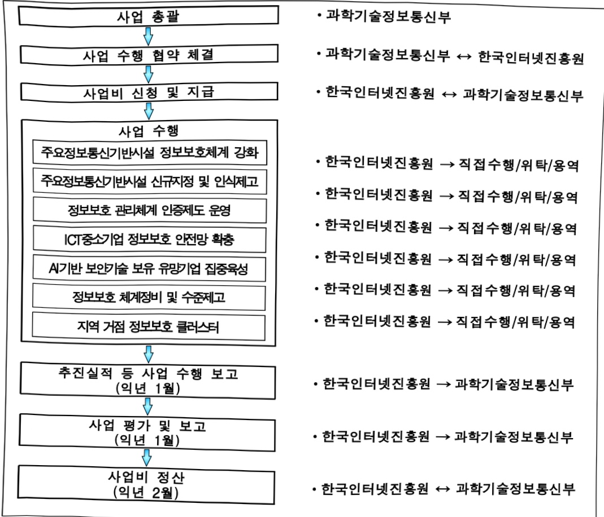

# 정보통신 기반보호 강화(정보화)

**해당 페이지**: PDF 1372 ~ 1382 쪽 해당

**부처**: 과학기술정보통신부
**분야**: 일반·지방행정
**회계유형**: 일반회계
**2026 확정예산**: 24606.0 백만원
**전년대비 증감률**: -6.2%
**AI 도메인**: 보안/사이버

---

<table border=1 style='margin: auto; word-wrap: break-word;'><tr><td style='text-align: center; word-wrap: break-word;'>사 업 명</td></tr><tr><td style='text-align: center; word-wrap: break-word;'>(120) 정보통신 기반보호 강화 (정보화 1935-500)</td></tr></table>

사업 코드 정보

<table border=1 style='margin: auto; word-wrap: break-word;'><tr><td style='text-align: center; word-wrap: break-word;'>구분</td><td style='text-align: center; word-wrap: break-word;'>회계</td><td style='text-align: center; word-wrap: break-word;'>소관</td><td style='text-align: center; word-wrap: break-word;'>실국(기관)</td><td style='text-align: center; word-wrap: break-word;'>계정</td><td style='text-align: center; word-wrap: break-word;'>분야</td><td style='text-align: center; word-wrap: break-word;'>부문</td></tr><tr><td style='text-align: center; word-wrap: break-word;'>코드</td><td rowspan="2">일반회계</td><td rowspan="2">과학기술정보통신부</td><td rowspan="2">정보보호네트워크정책관</td><td rowspan="2">-</td><td rowspan="2">010일반·지방행정</td><td rowspan="2">015정부자원관리</td></tr><tr><td style='text-align: center; word-wrap: break-word;'>명칭</td></tr></table>

<table border=1 style='margin: auto; word-wrap: break-word;'><tr><td style='text-align: center; word-wrap: break-word;'>구분</td><td style='text-align: center; word-wrap: break-word;'>프로그램</td><td style='text-align: center; word-wrap: break-word;'>단위사업</td><td style='text-align: center; word-wrap: break-word;'>세부사업</td></tr><tr><td style='text-align: center; word-wrap: break-word;'>코드</td><td style='text-align: center; word-wrap: break-word;'>1900</td><td style='text-align: center; word-wrap: break-word;'>1935</td><td style='text-align: center; word-wrap: break-word;'>500</td></tr><tr><td style='text-align: center; word-wrap: break-word;'>명칭</td><td style='text-align: center; word-wrap: break-word;'>국가사회정보화</td><td style='text-align: center; word-wrap: break-word;'>정보보호체계강화(정보화)</td><td style='text-align: center; word-wrap: break-word;'>정보통신 기반보호 강화(정보화)</td></tr></table>

□ 사업 성격 (공통요구자료 II-1 작성유의사항 4. 참조, 해당하는 사항에 “○” 표시)

<table border=1 style='margin: auto; word-wrap: break-word;'><tr><td rowspan="2">신규</td><td rowspan="2">계속</td><td rowspan="2">완료</td><td rowspan="2">예비타당성 실시여부</td><td rowspan="2">총사업비 관리대상</td><td rowspan="2">총액계상 예산사업</td><td style='text-align: center; word-wrap: break-word;'>사업소관 변경정보</td></tr><tr><td style='text-align: center; word-wrap: break-word;'>2025예산 시 소관</td></tr><tr><td style='text-align: center; word-wrap: break-word;'>-</td><td style='text-align: center; word-wrap: break-word;'>○</td><td style='text-align: center; word-wrap: break-word;'>-</td><td style='text-align: center; word-wrap: break-word;'>-</td><td style='text-align: center; word-wrap: break-word;'>-</td><td style='text-align: center; word-wrap: break-word;'>-</td><td style='text-align: center; word-wrap: break-word;'>-</td></tr></table>

사업지원형태 및 지원을(최소한 개는 반드시 선택하시오. 해당사항에 O 표시)

<table border=1 style='margin: auto; word-wrap: break-word;'><tr><td style='text-align: center; word-wrap: break-word;'>직접</td><td style='text-align: center; word-wrap: break-word;'>출자</td><td style='text-align: center; word-wrap: break-word;'>출연</td><td style='text-align: center; word-wrap: break-word;'>보조</td><td style='text-align: center; word-wrap: break-word;'>융자</td><td style='text-align: center; word-wrap: break-word;'>국고보조율(%)</td><td style='text-align: center; word-wrap: break-word;'>융자율(%)</td></tr><tr><td style='text-align: center; word-wrap: break-word;'>-</td><td style='text-align: center; word-wrap: break-word;'>-</td><td style='text-align: center; word-wrap: break-word;'>○</td><td style='text-align: center; word-wrap: break-word;'>-</td><td style='text-align: center; word-wrap: break-word;'>-</td><td style='text-align: center; word-wrap: break-word;'>-</td><td style='text-align: center; word-wrap: break-word;'>-</td></tr></table>

□ 사업 소관부처 및 시행주체

<table border=1 style='margin: auto; word-wrap: break-word;'><tr><td style='text-align: center; word-wrap: break-word;'>사업명</td><td colspan="2">구분</td></tr><tr><td rowspan="2">주요정보통신기반시설정보보호체계 강화</td><td style='text-align: center; word-wrap: break-word;'>소관부처</td><td style='text-align: center; word-wrap: break-word;'>정보보호네트워크정책실정보보호네트워크정책관사이버침해대응과</td></tr><tr><td style='text-align: center; word-wrap: break-word;'>사업시행주체</td><td style='text-align: center; word-wrap: break-word;'>한국인터넷진흥원</td></tr><tr><td rowspan="2">주요정보통신기반시설신규지정 및 인식제고</td><td style='text-align: center; word-wrap: break-word;'>소관부처</td><td style='text-align: center; word-wrap: break-word;'>정보보호네트워크정책실정보보호네트워크정책관사이버침해대응과</td></tr><tr><td style='text-align: center; word-wrap: break-word;'>사업시행주체</td><td style='text-align: center; word-wrap: break-word;'>한국인터넷진흥원</td></tr></table>

---

<table border=1 style='margin: auto; word-wrap: break-word;'><tr><td rowspan="2">정보보호관리체계인증제도운영</td><td style='text-align: center; word-wrap: break-word;'>소관부처</td><td style='text-align: center; word-wrap: break-word;'>정보보호네트워크정책실정보보호네트워크정책관사이버침해대응과</td></tr><tr><td style='text-align: center; word-wrap: break-word;'>사업시행주체</td><td style='text-align: center; word-wrap: break-word;'>한국인터넷진흥원</td></tr><tr><td rowspan="2">ICT중소기업정보보호안전망 확충</td><td style='text-align: center; word-wrap: break-word;'>소관부처</td><td style='text-align: center; word-wrap: break-word;'>정보보호네트워크정책실정보보호네트워크정책관사이버침해대응과</td></tr><tr><td style='text-align: center; word-wrap: break-word;'>사업시행주체</td><td style='text-align: center; word-wrap: break-word;'>한국인터넷진흥원</td></tr><tr><td rowspan="2">AI기반보안기술보유유망기업집중육성</td><td style='text-align: center; word-wrap: break-word;'>소관부처</td><td style='text-align: center; word-wrap: break-word;'>정보보호네트워크정책실정보보호네트워크정책관사이버침해대응과</td></tr><tr><td style='text-align: center; word-wrap: break-word;'>사업시행주체</td><td style='text-align: center; word-wrap: break-word;'>한국인터넷진흥원</td></tr><tr><td rowspan="2">정보보호체계정비 및수준제고</td><td style='text-align: center; word-wrap: break-word;'>소관부처</td><td style='text-align: center; word-wrap: break-word;'>정보보호네트워크정책실정보보호네트워크정책관사이버침해대응과</td></tr><tr><td style='text-align: center; word-wrap: break-word;'>사업시행주체</td><td style='text-align: center; word-wrap: break-word;'>한국인터넷진흥원</td></tr><tr><td rowspan="2">지역 거점정보보호클러스터</td><td style='text-align: center; word-wrap: break-word;'>소관부처</td><td style='text-align: center; word-wrap: break-word;'>정보보호네트워크정책실정보보호네트워크정책관사이버침해대응과</td></tr><tr><td style='text-align: center; word-wrap: break-word;'>사업시행주체</td><td style='text-align: center; word-wrap: break-word;'>한국인터넷진흥원</td></tr></table>

### 가. 예산 총괄표

(단위: 백만원, %)

<table border=1 style='margin: auto; word-wrap: break-word;'><tr><td rowspan="2">사업명</td><td rowspan="2">2024년 결산</td><td colspan="2">2025년 예산</td><td colspan="2">2026년 예산</td><td rowspan="2">증감 (B-A)</td><td rowspan="2">(B-A)/A</td></tr><tr><td style='text-align: center; word-wrap: break-word;'>본예산</td><td style='text-align: center; word-wrap: break-word;'>추경*(A)</td><td style='text-align: center; word-wrap: break-word;'>요구안</td><td style='text-align: center; word-wrap: break-word;'>본예산(B)</td></tr><tr><td style='text-align: center; word-wrap: break-word;'>정보통신 기반보호 강화</td><td style='text-align: center; word-wrap: break-word;'>25,985</td><td style='text-align: center; word-wrap: break-word;'>19,490</td><td style='text-align: center; word-wrap: break-word;'>26,230</td><td style='text-align: center; word-wrap: break-word;'>21,591</td><td style='text-align: center; word-wrap: break-word;'>24,606</td><td style='text-align: center; word-wrap: break-word;'>△1,624</td><td style='text-align: center; word-wrap: break-word;'>△6.2</td></tr></table>

*추경: 추경중감액을 포함한 최종 예산액을 기재

## □ 기능별(내역사업별) 예산 내역

(단위:백만원)

<table border=1 style='margin: auto; word-wrap: break-word;'><tr><td rowspan="2"></td><td colspan="5">2024</td><td colspan="5">2025</td><td rowspan="2">2026 叁</td></tr><tr><td style='text-align: center; word-wrap: break-word;'>叁</td><td style='text-align: center; word-wrap: break-word;'>叁</td><td style='text-align: center; word-wrap: break-word;'>叁</td><td style='text-align: center; word-wrap: break-word;'>叁</td><td style='text-align: center; word-wrap: break-word;'>叁</td><td style='text-align: center; word-wrap: break-word;'>叁</td><td style='text-align: center; word-wrap: break-word;'>叁</td><td style='text-align: center; word-wrap: break-word;'>叁</td><td style='text-align: center; word-wrap: break-word;'>叁</td><td style='text-align: center; word-wrap: break-word;'>叁</td></tr><tr><td style='text-align: center; word-wrap: break-word;'>○ 기능별 분류(합계)</td><td style='text-align: center; word-wrap: break-word;'>25,985</td><td style='text-align: center; word-wrap: break-word;'>25,985</td><td style='text-align: center; word-wrap: break-word;'>25,985</td><td style='text-align: center; word-wrap: break-word;'>25,985</td><td style='text-align: center; word-wrap: break-word;'>-</td><td style='text-align: center; word-wrap: break-word;'>-</td><td style='text-align: center; word-wrap: break-word;'>26,230</td><td style='text-align: center; word-wrap: break-word;'>26,230</td><td style='text-align: center; word-wrap: break-word;'>26,230</td><td style='text-align: center; word-wrap: break-word;'>-</td><td style='text-align: center; word-wrap: break-word;'>24,606</td></tr></table>

---

<table border=1 style='margin: auto; word-wrap: break-word;'><tr><td rowspan="2"></td><td colspan="5">2024</td><td colspan="5">2025</td><td rowspan="2">2026예산</td></tr><tr><td style='text-align: center; word-wrap: break-word;'>예산의(추정)</td><td style='text-align: center; word-wrap: break-word;'>예산현액</td><td style='text-align: center; word-wrap: break-word;'>집행액</td><td style='text-align: center; word-wrap: break-word;'>이윌액</td><td style='text-align: center; word-wrap: break-word;'>불용액</td><td style='text-align: center; word-wrap: break-word;'>예산액(추정)</td><td style='text-align: center; word-wrap: break-word;'>예산현액</td><td style='text-align: center; word-wrap: break-word;'>집행액</td><td style='text-align: center; word-wrap: break-word;'>이윌액</td><td style='text-align: center; word-wrap: break-word;'>불용액</td></tr><tr><td style='text-align: center; word-wrap: break-word;'>· 주요정보통신기반시설 정보보호체계강화</td><td style='text-align: center; word-wrap: break-word;'>2,635</td><td style='text-align: center; word-wrap: break-word;'>2,635</td><td style='text-align: center; word-wrap: break-word;'>2,635[2,619]</td><td style='text-align: center; word-wrap: break-word;'>-</td><td style='text-align: center; word-wrap: break-word;'>-</td><td style='text-align: center; word-wrap: break-word;'>4,277</td><td style='text-align: center; word-wrap: break-word;'>4,277</td><td style='text-align: center; word-wrap: break-word;'>4,277</td><td style='text-align: center; word-wrap: break-word;'>-</td><td style='text-align: center; word-wrap: break-word;'>-</td><td style='text-align: center; word-wrap: break-word;'>1,558</td></tr><tr><td style='text-align: center; word-wrap: break-word;'>· 주요정보통신기반시설 신규지정 및인식제고</td><td style='text-align: center; word-wrap: break-word;'>228</td><td style='text-align: center; word-wrap: break-word;'>228</td><td style='text-align: center; word-wrap: break-word;'>228[225]</td><td style='text-align: center; word-wrap: break-word;'>-</td><td style='text-align: center; word-wrap: break-word;'>-</td><td style='text-align: center; word-wrap: break-word;'>228</td><td style='text-align: center; word-wrap: break-word;'>228</td><td style='text-align: center; word-wrap: break-word;'>228</td><td style='text-align: center; word-wrap: break-word;'>-</td><td style='text-align: center; word-wrap: break-word;'>-</td><td style='text-align: center; word-wrap: break-word;'>228</td></tr><tr><td style='text-align: center; word-wrap: break-word;'>· 정보보호 관리체계인증제도 운영</td><td style='text-align: center; word-wrap: break-word;'>2,136</td><td style='text-align: center; word-wrap: break-word;'>2,136</td><td style='text-align: center; word-wrap: break-word;'>2,136[2,116]</td><td style='text-align: center; word-wrap: break-word;'>-</td><td style='text-align: center; word-wrap: break-word;'>-</td><td style='text-align: center; word-wrap: break-word;'>2,495</td><td style='text-align: center; word-wrap: break-word;'>2,495</td><td style='text-align: center; word-wrap: break-word;'>2,495</td><td style='text-align: center; word-wrap: break-word;'>-</td><td style='text-align: center; word-wrap: break-word;'>-</td><td style='text-align: center; word-wrap: break-word;'>1,995</td></tr><tr><td style='text-align: center; word-wrap: break-word;'>· ICT중소기업 정보보호 안전망 확충</td><td style='text-align: center; word-wrap: break-word;'>8,880</td><td style='text-align: center; word-wrap: break-word;'>8,880</td><td style='text-align: center; word-wrap: break-word;'>8,880[8,740]</td><td style='text-align: center; word-wrap: break-word;'>-</td><td style='text-align: center; word-wrap: break-word;'>-</td><td style='text-align: center; word-wrap: break-word;'>8,956</td><td style='text-align: center; word-wrap: break-word;'>8,956</td><td style='text-align: center; word-wrap: break-word;'>8,956</td><td style='text-align: center; word-wrap: break-word;'>-</td><td style='text-align: center; word-wrap: break-word;'>-</td><td style='text-align: center; word-wrap: break-word;'>8,956</td></tr><tr><td style='text-align: center; word-wrap: break-word;'>· AI기반 보호기술 보유유망기업 집중육성</td><td style='text-align: center; word-wrap: break-word;'>6,873</td><td style='text-align: center; word-wrap: break-word;'>6,873</td><td style='text-align: center; word-wrap: break-word;'>6,873[6,688]</td><td style='text-align: center; word-wrap: break-word;'>-</td><td style='text-align: center; word-wrap: break-word;'>-</td><td style='text-align: center; word-wrap: break-word;'>4,311</td><td style='text-align: center; word-wrap: break-word;'>4,311</td><td style='text-align: center; word-wrap: break-word;'>4,311</td><td style='text-align: center; word-wrap: break-word;'>-</td><td style='text-align: center; word-wrap: break-word;'>-</td><td style='text-align: center; word-wrap: break-word;'>3,811</td></tr><tr><td style='text-align: center; word-wrap: break-word;'>· 정보보호 체계정비 및 수준제고</td><td style='text-align: center; word-wrap: break-word;'>703</td><td style='text-align: center; word-wrap: break-word;'>703</td><td style='text-align: center; word-wrap: break-word;'>703[672]</td><td style='text-align: center; word-wrap: break-word;'>-</td><td style='text-align: center; word-wrap: break-word;'>-</td><td style='text-align: center; word-wrap: break-word;'>491</td><td style='text-align: center; word-wrap: break-word;'>491</td><td style='text-align: center; word-wrap: break-word;'>491</td><td style='text-align: center; word-wrap: break-word;'>-</td><td style='text-align: center; word-wrap: break-word;'>-</td><td style='text-align: center; word-wrap: break-word;'>528</td></tr><tr><td style='text-align: center; word-wrap: break-word;'>· 지역 거점 정보보호 클러스터</td><td style='text-align: center; word-wrap: break-word;'>3,900</td><td style='text-align: center; word-wrap: break-word;'>3,900</td><td style='text-align: center; word-wrap: break-word;'>3,900[3,900]</td><td style='text-align: center; word-wrap: break-word;'>-</td><td style='text-align: center; word-wrap: break-word;'>-</td><td style='text-align: center; word-wrap: break-word;'>5,030</td><td style='text-align: center; word-wrap: break-word;'>5,030</td><td style='text-align: center; word-wrap: break-word;'>5,030</td><td style='text-align: center; word-wrap: break-word;'>-</td><td style='text-align: center; word-wrap: break-word;'>-</td><td style='text-align: center; word-wrap: break-word;'>7,530</td></tr><tr><td style='text-align: center; word-wrap: break-word;'>· 아파트 정보보호 안전망 확충</td><td style='text-align: center; word-wrap: break-word;'>630</td><td style='text-align: center; word-wrap: break-word;'>630</td><td style='text-align: center; word-wrap: break-word;'>630[606]</td><td style='text-align: center; word-wrap: break-word;'>-</td><td style='text-align: center; word-wrap: break-word;'>-</td><td style='text-align: center; word-wrap: break-word;'>442</td><td style='text-align: center; word-wrap: break-word;'>442</td><td style='text-align: center; word-wrap: break-word;'>442</td><td style='text-align: center; word-wrap: break-word;'>-</td><td style='text-align: center; word-wrap: break-word;'>-</td><td style='text-align: center; word-wrap: break-word;'>-</td></tr><tr><td style='text-align: center; word-wrap: break-word;'>○ 비목별 분류(합계)</td><td style='text-align: center; word-wrap: break-word;'>25,985</td><td style='text-align: center; word-wrap: break-word;'>25,985</td><td style='text-align: center; word-wrap: break-word;'>25,985[25,566]</td><td style='text-align: center; word-wrap: break-word;'>-</td><td style='text-align: center; word-wrap: break-word;'>-</td><td style='text-align: center; word-wrap: break-word;'>26,230</td><td style='text-align: center; word-wrap: break-word;'>26,230</td><td style='text-align: center; word-wrap: break-word;'>26,230</td><td style='text-align: center; word-wrap: break-word;'>-</td><td style='text-align: center; word-wrap: break-word;'>-</td><td style='text-align: center; word-wrap: break-word;'>24,606</td></tr><tr><td style='text-align: center; word-wrap: break-word;'>· 사업출연금(350-02)</td><td style='text-align: center; word-wrap: break-word;'>25,985</td><td style='text-align: center; word-wrap: break-word;'>25,985</td><td style='text-align: center; word-wrap: break-word;'>25,985[25,566]</td><td style='text-align: center; word-wrap: break-word;'>-</td><td style='text-align: center; word-wrap: break-word;'>-</td><td style='text-align: center; word-wrap: break-word;'>26,230</td><td style='text-align: center; word-wrap: break-word;'>26,230</td><td style='text-align: center; word-wrap: break-word;'>26,230</td><td style='text-align: center; word-wrap: break-word;'>-</td><td style='text-align: center; word-wrap: break-word;'>-</td><td style='text-align: center; word-wrap: break-word;'>24,606</td></tr><tr><td style='text-align: center; word-wrap: break-word;'>○ 가능비목별 분류(합계)</td><td style='text-align: center; word-wrap: break-word;'>25,985</td><td style='text-align: center; word-wrap: break-word;'>25,985</td><td style='text-align: center; word-wrap: break-word;'>25,985[25,566]</td><td style='text-align: center; word-wrap: break-word;'>-</td><td style='text-align: center; word-wrap: break-word;'>-</td><td style='text-align: center; word-wrap: break-word;'>26,230</td><td style='text-align: center; word-wrap: break-word;'>26,230</td><td style='text-align: center; word-wrap: break-word;'>26,230</td><td style='text-align: center; word-wrap: break-word;'>-</td><td style='text-align: center; word-wrap: break-word;'>-</td><td style='text-align: center; word-wrap: break-word;'>24,606</td></tr><tr><td style='text-align: center; word-wrap: break-word;'>· 주요정보통신기반시설 정보보호체계강화</td><td style='text-align: center; word-wrap: break-word;'>2,635</td><td style='text-align: center; word-wrap: break-word;'>2,635</td><td style='text-align: center; word-wrap: break-word;'>2,635[2,619]</td><td style='text-align: center; word-wrap: break-word;'>-</td><td style='text-align: center; word-wrap: break-word;'>-</td><td style='text-align: center; word-wrap: break-word;'>4,277</td><td style='text-align: center; word-wrap: break-word;'>4,277</td><td style='text-align: center; word-wrap: break-word;'>4,277</td><td style='text-align: center; word-wrap: break-word;'>-</td><td style='text-align: center; word-wrap: break-word;'>-</td><td style='text-align: center; word-wrap: break-word;'>1,558</td></tr><tr><td style='text-align: center; word-wrap: break-word;'>· 사업출연금(350-02)</td><td style='text-align: center; word-wrap: break-word;'>2,635</td><td style='text-align: center; word-wrap: break-word;'>2,635</td><td style='text-align: center; word-wrap: break-word;'>2,635[2,619]</td><td style='text-align: center; word-wrap: break-word;'>-</td><td style='text-align: center; word-wrap: break-word;'>-</td><td style='text-align: center; word-wrap: break-word;'>4,277</td><td style='text-align: center; word-wrap: break-word;'>4,277</td><td style='text-align: center; word-wrap: break-word;'>4,277</td><td style='text-align: center; word-wrap: break-word;'>-</td><td style='text-align: center; word-wrap: break-word;'>-</td><td style='text-align: center; word-wrap: break-word;'>1,558</td></tr><tr><td style='text-align: center; word-wrap: break-word;'>· 주요정보통신기반시설 신규지정 및인식제고</td><td style='text-align: center; word-wrap: break-word;'>228</td><td style='text-align: center; word-wrap: break-word;'>228</td><td style='text-align: center; word-wrap: break-word;'>228[225]</td><td style='text-align: center; word-wrap: break-word;'>-</td><td style='text-align: center; word-wrap: break-word;'>-</td><td style='text-align: center; word-wrap: break-word;'>228</td><td style='text-align: center; word-wrap: break-word;'>228</td><td style='text-align: center; word-wrap: break-word;'>228</td><td style='text-align: center; word-wrap: break-word;'>-</td><td style='text-align: center; word-wrap: break-word;'>-</td><td style='text-align: center; word-wrap: break-word;'>228</td></tr><tr><td style='text-align: center; word-wrap: break-word;'>· 사업출연금(350-02)</td><td style='text-align: center; word-wrap: break-word;'>228</td><td style='text-align: center; word-wrap: break-word;'>228</td><td style='text-align: center; word-wrap: break-word;'>228[225]</td><td style='text-align: center; word-wrap: break-word;'>-</td><td style='text-align: center; word-wrap: break-word;'>-</td><td style='text-align: center; word-wrap: break-word;'>228</td><td style='text-align: center; word-wrap: break-word;'>228</td><td style='text-align: center; word-wrap: break-word;'>228</td><td style='text-align: center; word-wrap: break-word;'>-</td><td style='text-align: center; word-wrap: break-word;'>-</td><td style='text-align: center; word-wrap: break-word;'>228</td></tr><tr><td style='text-align: center; word-wrap: break-word;'>· 정보보호 관리체계인증제도 운영</td><td style='text-align: center; word-wrap: break-word;'>2,136</td><td style='text-align: center; word-wrap: break-word;'>2,136</td><td style='text-align: center; word-wrap: break-word;'>2,136[2,116]</td><td style='text-align: center; word-wrap: break-word;'>-</td><td style='text-align: center; word-wrap: break-word;'>-</td><td style='text-align: center; word-wrap: break-word;'>2,495</td><td style='text-align: center; word-wrap: break-word;'>2,495</td><td style='text-align: center; word-wrap: break-word;'>2,495</td><td style='text-align: center; word-wrap: break-word;'>-</td><td style='text-align: center; word-wrap: break-word;'>-</td><td style='text-align: center; word-wrap: break-word;'>1,995</td></tr><tr><td style='text-align: center; word-wrap: break-word;'>· 사업출연금(350-02)</td><td style='text-align: center; word-wrap: break-word;'>2,136</td><td style='text-align: center; word-wrap: break-word;'>2,136</td><td style='text-align: center; word-wrap: break-word;'>2,136[2,116]</td><td style='text-align: center; word-wrap: break-word;'>-</td><td style='text-align: center; word-wrap: break-word;'>-</td><td style='text-align: center; word-wrap: break-word;'>2,495</td><td style='text-align: center; word-wrap: break-word;'>2,495</td><td style='text-align: center; word-wrap: break-word;'>2,495</td><td style='text-align: center; word-wrap: break-word;'>-</td><td style='text-align: center; word-wrap: break-word;'>-</td><td style='text-align: center; word-wrap: break-word;'>1,995</td></tr><tr><td style='text-align: center; word-wrap: break-word;'>· ICT중소기업 정보보호 안전망 확충</td><td style='text-align: center; word-wrap: break-word;'>8,880</td><td style='text-align: center; word-wrap: break-word;'>8,880</td><td style='text-align: center; word-wrap: break-word;'>8,880[8,740]</td><td style='text-align: center; word-wrap: break-word;'>-</td><td style='text-align: center; word-wrap: break-word;'>-</td><td style='text-align: center; word-wrap: break-word;'>8,956</td><td style='text-align: center; word-wrap: break-word;'>8,956</td><td style='text-align: center; word-wrap: break-word;'>8,956</td><td style='text-align: center; word-wrap: break-word;'>-</td><td style='text-align: center; word-wrap: break-word;'>-</td><td style='text-align: center; word-wrap: break-word;'>8,956</td></tr><tr><td style='text-align: center; word-wrap: break-word;'>· 사업출연금(350-02)</td><td style='text-align: center; word-wrap: break-word;'>8,880</td><td style='text-align: center; word-wrap: break-word;'>8,880</td><td style='text-align: center; word-wrap: break-word;'>8,880[8,740]</td><td style='text-align: center; word-wrap: break-word;'>-</td><td style='text-align: center; word-wrap: break-word;'>-</td><td style='text-align: center; word-wrap: break-word;'>8,956</td><td style='text-align: center; word-wrap: break-word;'>8,956</td><td style='text-align: center; word-wrap: break-word;'>8,956</td><td style='text-align: center; word-wrap: break-word;'>-</td><td style='text-align: center; word-wrap: break-word;'>-</td><td style='text-align: center; word-wrap: break-word;'>8,956</td></tr><tr><td style='text-align: center; word-wrap: break-word;'>· AI기반 보호기술 보유유망기업 집중육성</td><td style='text-align: center; word-wrap: break-word;'>6,873</td><td style='text-align: center; word-wrap: break-word;'>6,873</td><td style='text-align: center; word-wrap: break-word;'>6,873[6,688]</td><td style='text-align: center; word-wrap: break-word;'>-</td><td style='text-align: center; word-wrap: break-word;'>-</td><td style='text-align: center; word-wrap: break-word;'>4,311</td><td style='text-align: center; word-wrap: break-word;'>4,311</td><td style='text-align: center; word-wrap: break-word;'>4,311</td><td style='text-align: center; word-wrap: break-word;'>-</td><td style='text-align: center; word-wrap: break-word;'>-</td><td style='text-align: center; word-wrap: break-word;'>3,811</td></tr><tr><td style='text-align: center; word-wrap: break-word;'>· 사업출연금(350-02)</td><td style='text-align: center; word-wrap: break-word;'>6,873</td><td style='text-align: center; word-wrap: break-word;'>6,873</td><td style='text-align: center; word-wrap: break-word;'>6,873[6,688]</td><td style='text-align: center; word-wrap: break-word;'>-</td><td style='text-align: center; word-wrap: break-word;'>-</td><td style='text-align: center; word-wrap: break-word;'>4,311</td><td style='text-align: center; word-wrap: break-word;'>4,311</td><td style='text-align: center; word-wrap: break-word;'>4,311</td><td style='text-align: center; word-wrap: break-word;'>-</td><td style='text-align: center; word-wrap: break-word;'>-</td><td style='text-align: center; word-wrap: break-word;'>3,811</td></tr><tr><td style='text-align: center; word-wrap: break-word;'>· 정보보호 체계정비</td><td style='text-align: center; word-wrap: break-word;'>703</td><td style='text-align: center; word-wrap: break-word;'>703</td><td style='text-align: center; word-wrap: break-word;'>703</td><td style='text-align: center; word-wrap: break-word;'>703</td><td style='text-align: center; word-wrap: break-word;'>-</td><td style='text-align: center; word-wrap: break-word;'>491</td><td style='text-align: center; word-wrap: break-word;'>491</td><td style='text-align: center; word-wrap: break-word;'>491</td><td style='text-align: center; word-wrap: break-word;'>-</td><td style='text-align: center; word-wrap: break-word;'>-</td><td style='text-align: center; word-wrap: break-word;'>528</td></tr></table>

---

<table border=1 style='margin: auto; word-wrap: break-word;'><tr><td rowspan="2"></td><td colspan="5">2024</td><td colspan="5">2025</td><td rowspan="2">2026예산</td></tr><tr><td style='text-align: center; word-wrap: break-word;'>예산액(추정)</td><td style='text-align: center; word-wrap: break-word;'>예산현액</td><td style='text-align: center; word-wrap: break-word;'>집행액</td><td style='text-align: center; word-wrap: break-word;'>이월액</td><td style='text-align: center; word-wrap: break-word;'>불용액</td><td style='text-align: center; word-wrap: break-word;'>예산액(추정)</td><td style='text-align: center; word-wrap: break-word;'>예산현액</td><td style='text-align: center; word-wrap: break-word;'>집행액</td><td style='text-align: center; word-wrap: break-word;'>이월액</td><td style='text-align: center; word-wrap: break-word;'>불용액</td></tr><tr><td style='text-align: center; word-wrap: break-word;'>및 수준제고</td><td style='text-align: center; word-wrap: break-word;'></td><td style='text-align: center; word-wrap: break-word;'></td><td style='text-align: center; word-wrap: break-word;'>[672]</td><td style='text-align: center; word-wrap: break-word;'></td><td style='text-align: center; word-wrap: break-word;'></td><td style='text-align: center; word-wrap: break-word;'></td><td style='text-align: center; word-wrap: break-word;'></td><td style='text-align: center; word-wrap: break-word;'></td><td style='text-align: center; word-wrap: break-word;'></td><td style='text-align: center; word-wrap: break-word;'></td><td style='text-align: center; word-wrap: break-word;'></td></tr><tr><td style='text-align: center; word-wrap: break-word;'>- 시업출연금(350-02)</td><td style='text-align: center; word-wrap: break-word;'>703</td><td style='text-align: center; word-wrap: break-word;'>703</td><td style='text-align: center; word-wrap: break-word;'>703</td><td style='text-align: center; word-wrap: break-word;'></td><td style='text-align: center; word-wrap: break-word;'></td><td style='text-align: center; word-wrap: break-word;'>491</td><td style='text-align: center; word-wrap: break-word;'>491</td><td style='text-align: center; word-wrap: break-word;'>491</td><td style='text-align: center; word-wrap: break-word;'>-</td><td style='text-align: center; word-wrap: break-word;'>-</td><td style='text-align: center; word-wrap: break-word;'>528</td></tr><tr><td style='text-align: center; word-wrap: break-word;'>- 지역 거점 정보 보호 클러스터</td><td style='text-align: center; word-wrap: break-word;'>3,900</td><td style='text-align: center; word-wrap: break-word;'>3,900</td><td style='text-align: center; word-wrap: break-word;'>3,900</td><td style='text-align: center; word-wrap: break-word;'></td><td style='text-align: center; word-wrap: break-word;'></td><td style='text-align: center; word-wrap: break-word;'>5,030</td><td style='text-align: center; word-wrap: break-word;'>5,030</td><td style='text-align: center; word-wrap: break-word;'>5,030</td><td style='text-align: center; word-wrap: break-word;'>-</td><td style='text-align: center; word-wrap: break-word;'>-</td><td style='text-align: center; word-wrap: break-word;'>7,530</td></tr><tr><td style='text-align: center; word-wrap: break-word;'>- 시업출연금(350-02)</td><td style='text-align: center; word-wrap: break-word;'>3,900</td><td style='text-align: center; word-wrap: break-word;'>3,900</td><td style='text-align: center; word-wrap: break-word;'>3,900</td><td style='text-align: center; word-wrap: break-word;'></td><td style='text-align: center; word-wrap: break-word;'></td><td style='text-align: center; word-wrap: break-word;'>5,030</td><td style='text-align: center; word-wrap: break-word;'>5,030</td><td style='text-align: center; word-wrap: break-word;'>5,030</td><td style='text-align: center; word-wrap: break-word;'>-</td><td style='text-align: center; word-wrap: break-word;'>-</td><td style='text-align: center; word-wrap: break-word;'>7,530</td></tr><tr><td style='text-align: center; word-wrap: break-word;'>- 아파트 정보보호 안전망 확충</td><td style='text-align: center; word-wrap: break-word;'>630</td><td style='text-align: center; word-wrap: break-word;'>630</td><td style='text-align: center; word-wrap: break-word;'>630</td><td style='text-align: center; word-wrap: break-word;'></td><td style='text-align: center; word-wrap: break-word;'></td><td style='text-align: center; word-wrap: break-word;'>442</td><td style='text-align: center; word-wrap: break-word;'>442</td><td style='text-align: center; word-wrap: break-word;'>442</td><td style='text-align: center; word-wrap: break-word;'>-</td><td style='text-align: center; word-wrap: break-word;'>-</td><td style='text-align: center; word-wrap: break-word;'>-</td></tr><tr><td style='text-align: center; word-wrap: break-word;'>- 시업출연금(350-02)</td><td style='text-align: center; word-wrap: break-word;'>630</td><td style='text-align: center; word-wrap: break-word;'>630</td><td style='text-align: center; word-wrap: break-word;'>630</td><td style='text-align: center; word-wrap: break-word;'></td><td style='text-align: center; word-wrap: break-word;'></td><td style='text-align: center; word-wrap: break-word;'>442</td><td style='text-align: center; word-wrap: break-word;'>442</td><td style='text-align: center; word-wrap: break-word;'>442</td><td style='text-align: center; word-wrap: break-word;'>-</td><td style='text-align: center; word-wrap: break-word;'>-</td><td style='text-align: center; word-wrap: break-word;'>-</td></tr></table>

### 나. 사업설명자료

## 1 ) 사업목적·내용

- 국가·사회적으로 중요한 정보통신시설을 주요정보통신기반시설로 지정하여 보호·관리함으로써 국가차원의 보호체계 구축

- 정보보호 제도(정보보호관리체계 인증, 정보보호최고책임자 지정·신고) 운영, 공동주택 등의 홈네트워크 보안성 확보, 중소기업 정보보호 지원 등을 통한 안전한 정보보호 환경 조성

- 인공지능(AI) 기반 보안 기업 육성, 지역 거점 정보보호 클러스터 구축 등 정보보호

산업 육성을 통한 정보보호 기반 강화

## 2 ) 사업개요

## 사업근거 및 추진경위

① 법령상 근거 및 조항 적시 : 해당되는 모든 조항의 전체 조문을 기재

0 「정보통신기반보호법」제5조(주요정보통신기반시설 보호대책의 수립 등), 제5조의2(주요정보통신기반시설 보호대책 이행 여부의 확인), 제6조(주요정보통신기반시설 보호계획의 수립 등), 제7조(주요정보통신기반시설의 보호지원), 제8조(주요정보통신기반시설의 지정 등), 제8조의2(주요정보통신기반시설의 지정 권고), 제9조(취약점의 분석·평가) 등

---

°「정보통신망 이용촉진 및 정보보호 등에 관한 법률」제45조의3(정보보호 최고책임자 지정 등), 제47조(정보보호 관리체계의 인증), 제52조(한국인터넷진흥원)

° | 주택법 | 제2조제13호, | 주택건설기준 등에 관한 규정 | 제32조의2(지능형 홈네트워크 설비), | 지능형 홈네트워크 설비 설치 및 기술기준 | 제14조의2(홈네트워크 보안)

°「정보보호산업법」 제14조제1항제4호(지역의 정보보호 관련 사업의 클러스터 구축)

② 추진경위 - 사업 시작년도, 추진배경, 부처별 중점과제, 대통령 공약사항 등

## <수요정보통신기반시설 보호>

- '00.02 : 「정보통신기반보호법」 재정추진 협의

※ 국무총리 주재 “사이버테러방지 관계 장관 회의”

- '01.01 : 정보통신기반보보호법 제정·공포(1월), 시행(7월)

- '07.12 : 정보통신기반보호법 일부 개정

※ 기반시설 보호대책 이행여부 확인(제5조의 2) 및 지정권고(제8조의 2)

- '08.02 : 정부조직 개편에 따라 기반시설 총괄업무 이관

※ 국정원 · (구)정통부에서 국정원 · 안행부로 변경

- '13.03 : 정부조직 개편에 따라 기반시설 총괄업무 이관

※ 국정원 · 안행부에서 국정원 · 과기정통부(前미래창조과학부)로 변경

- '25.03 : 주요정보통신기반시설 447개 시설(공공 288개, 민간 159개) 지정 관리

## <정보보호 관리체계 인증제도>

- '01.07 : 정보보호관리체계 인증제도 도입

- '07.01 : 정보통신망법 제47조(정보보호관리체계의 인증)에 인증기관 복수화 근거 마련

- '12.02 : 정보보호 안전진단 제도를 폐지 및 정보보호관리체계 인증 의무화

- '15.12 : 정보통신망법 개정에 따른 ISMS 인증 의무대상 확대

- '18.11 : ISMS 인증(과기정통부)과 PIMS 인증(방통위, 행안부)을 통합한 인증제도(ISMS-P) 시행

- '22.07 : 신규 가상자산사업자의 시장 진입 불가 해소를 위한 ISMS 예비인증 도입

- '23.10 : 유관법령 개정에 따른 ISMS-P 인증기준 개정을 위한 ISMS-P 고시 개정

- '24.07 : 중소기업 부담 경감을 위해 인증기준, 수수료를 경량화한 ISMS 간편인증 도입

## <ICT 중소기업 정보보호 안전망 확충>

- '04.08 : "중소기업 정보보호지원 및 IT일자리 창출사업"에 따른 중소기업 정보보호점검지원단 운영

---

- '05.06 : 중소기업 정보보호를 위한 장관 및 CEO 간담회 개최

- '19.04. : 5G 초연결 환경에 대응하는 사이버보안 예방체계 확립을 위해 관계부처 합동 5G+ 전략 추진(중소기업 안전체계 수립)

- '19.04. : 민간분야 사이버안보 사각지대 해소를 위한 대응체계 개선, 유관기관간 공조체계 강화 등 국가사이버안보 전략 수립(국가안보실)

- '19.06. : 지자체, 공공기관, 중소기업, 정보보호지원센터 등과 협력을 통한 지역 사이버 안전망 구축을 위한 국가사이버안보 기본계획(안) 수립(관계부처합동)

- '19.07. : 대통령님 정보보호의 날 축사 內 정보보호 관련 예산규모 증액, 지역정보보호 지원센터 10개소 확대 등 5G 시대의 정보보호 중요성 강조 말씀

- '20.06 : 제2차 정보보호산업 진흥계획(2021~2026, 관계부처합동)

- '22.02 : 정보보호산업의 전략정 육성 방안(관계부처합동)

- '25.08 : 국정과제23-3, AI시대를 지탱하는 건고한 디지털 보안·안전 체계 구축

## <AI기반 보안기술 보유 유망기업 집중육성>

- '15.04 : K-ICT시큐리티 발전전략(관계부처합동)

- '16.05 : K-ICT 융합보안 발전전략(前미래창조과학부)

- '18.05 : 인공지능(AI) R&D 전략(과학기술정보통신부)

- '19.12 : 인공지능 국가전략(과학기술정보통신부)

- '20.06 : 제2차 정보보호 산업진흥계획(과학기술정보통신부)

- '20.07 : 한국판 뉴딜 종합계획(기획재정부)

- '22.02 : 정보보호산업의 전략적 육성 방안(관계부처합동)

## <정보보호 체계정비 및 수준제고>

- '12.10 : 각종 기념일 등에 대한 규정 개정령안 국무회의 통과

※ 매년 7월 둘째주 수요일을「정보보호의 날」로 지정

- '15.12 : 정보보호산업법 제정에 따른 정보보호 준비도 평가 활성화 지원의 근거 마련

- '16.04 : 정보보호 준비도 평가기관 등록(5개 기관)

- '16.12 : 정보통신망법 개정에 따라 CISO 지정 · 신고 의무화('14.11) 및 6,616개 기업 신고 완료

- '19.06 : 정보통신망법 개정('18.6)에 따라 CSO 지정신고 대상 자격요건 부여 및 검직금지 시행('19.6)

- '21.12 : 정보통신망법 개정(21.6)에 따라 CSO 지정신고 대상 검직제한 요건 완화 시행(21.12)

- '21.12 : 정보통신망법 개정('21.6)에 따라 CISO 지정신고 의무대상 및 검직제한 완화 시행

---

- '23.12 : 자회사의 지배관리 업무만 수행하는 순수지주회사에 대한 CISO 겸직금지 완화 시행령 개정('23.12)

## <지역 거점 정보보호 클러스터>

- '23.10 : 지방 디지털 경쟁력 강화방안을 위한 사이버 보안 거점으로 지역 거점 정보 보호 클러스터 조성하여 사이버 보안 역량 강화(관계부처합동)

- '23.11 : 지역 주력산업의 디지털 전환을 주도하는 디지털 서비스 강소기업 육성, 부·울·경 정보보호 클러스터 (대통령직속 지방시대위원회)

- '23.12 : 동남권 지역 거점 정보보호 클러스터 개소

- '25.12 : 충청권 지역 거점 정보보호 클러스터 개소

## 주요내용

① 사업규모

- 총사업비(해당되는 경우에만 기재) :

- 사업기간 : '05년 ~ 계속

- 최근 5년 간 투입된 사업비(예산액기준, 추경편성한 연도에는 추경포함)

<table border=1 style='margin: auto; word-wrap: break-word;'><tr><td style='text-align: center; word-wrap: break-word;'>$ \underline{\text{所}} $</td><td style='text-align: center; word-wrap: break-word;'>2022</td><td style='text-align: center; word-wrap: break-word;'>2023</td><td style='text-align: center; word-wrap: break-word;'>2024</td><td style='text-align: center; word-wrap: break-word;'>2025</td><td style='text-align: center; word-wrap: break-word;'>2026</td></tr><tr><td style='text-align: center; word-wrap: break-word;'>$ \underline{\text{사업비}} $</td><td style='text-align: center; word-wrap: break-word;'>28,518</td><td style='text-align: center; word-wrap: break-word;'>30,604</td><td style='text-align: center; word-wrap: break-word;'>25,985</td><td style='text-align: center; word-wrap: break-word;'>26,230</td><td style='text-align: center; word-wrap: break-word;'>24,606</td></tr></table>

-기타: 해당없음

② 사업추진체계

- 사업시행방법 : 출연

-사업시행주체:한국인터넷진흥원(KISA)

- 사업 수혜자 : 국가 차원의 보호체계 구축 및 중소기업 등 정보보호 수준 제고 등을 통한 국가의 안전과 국민생활의 안정을 보장

- 보조, 융자, 출연, 출자 등의 경우 보조·융자 등 지원 비율 및 법적근거

---

<table border=1 style='margin: auto; word-wrap: break-word;'><tr><td style='text-align: center; word-wrap: break-word;'>내역사업명</td><td style='text-align: center; word-wrap: break-word;'>구분</td><td style='text-align: center; word-wrap: break-word;'>피보조·피출연 등 기관명</td><td style='text-align: center; word-wrap: break-word;'>지원 금액 (2026예산)</td><td style='text-align: center; word-wrap: break-word;'>지원 비율(%)</td><td style='text-align: center; word-wrap: break-word;'>보조율 법적근거 (해당 조항)</td></tr><tr><td style='text-align: center; word-wrap: break-word;'>· 주요정보통신기반시설정보호체계강화</td><td rowspan="7">출연</td><td rowspan="7">한국인터넷 진흥원</td><td style='text-align: center; word-wrap: break-word;'>1,558백만원</td><td rowspan="7">100</td><td rowspan="2">○「정보통신기반보호법」제5조(주요정보통신기반시설 보호대책의 수립 등), 제5조의2(주요정보통신기반시설 보호대책이행 여부의 확인), 제6조(주요정보통신기반시설 보호계획의 수립 등), 제7조(주요정보통신기반시설의 보호지원), 제8조(주요정보통신기반시설의 지정 등), 제8조의2(주요정보통신기반시설의 지정 권고), 제9조(취약점의 분석·평가) 등</td></tr><tr><td style='text-align: center; word-wrap: break-word;'>· 주요정보통신기반시설 신규지정 및 인식제고</td><td style='text-align: center; word-wrap: break-word;'>228백만원</td></tr><tr><td style='text-align: center; word-wrap: break-word;'>· 정보보호 관리체계 인증제도 운영</td><td style='text-align: center; word-wrap: break-word;'>1,995백만원</td><td style='text-align: center; word-wrap: break-word;'>○「정보통신망법」제47조(정보보호 관리체계의 인증)</td></tr><tr><td style='text-align: center; word-wrap: break-word;'>· ICT중소기업 정보보호 안전망 확충</td><td style='text-align: center; word-wrap: break-word;'>8,956백만원</td><td style='text-align: center; word-wrap: break-word;'>○「정보보호산업의 진흥에 관한 법률」제34조(이용자의 보호시책 등)</td></tr><tr><td style='text-align: center; word-wrap: break-word;'>· AI기반 보안기술 보유 유망기업 집중육성</td><td style='text-align: center; word-wrap: break-word;'>3,811백만원</td><td style='text-align: center; word-wrap: break-word;'>○「정보통신망 이용촉진 및 정보보호 등에 관한 법률」제52조(한국인터넷진흥원)</td></tr><tr><td style='text-align: center; word-wrap: break-word;'>· 정보보호 체계정비 및 수준제고</td><td style='text-align: center; word-wrap: break-word;'>528백만원</td><td style='text-align: center; word-wrap: break-word;'>○「정보통신망 이용촉진 및 정보보호 등에 관한 법률」제45조의3(정보보호 최고책임자 지정 등)</td></tr><tr><td style='text-align: center; word-wrap: break-word;'>· 지역 거점 정보 보호 클러스터</td><td style='text-align: center; word-wrap: break-word;'>7,530백만원</td><td style='text-align: center; word-wrap: break-word;'>○「정보통신망 이용촉진 및 정보보호 등에 관한 법률」제52조(한국인터넷진흥원)</td></tr></table>

## 4 ) 사업효과

☐ 사업영향, 산출물 성과지표 등

① 2022~2026년도 성과계획서 상 성과지표 및 최근 5년간 성과 달성도

<table border=1 style='margin: auto; word-wrap: break-word;'><tr><td style='text-align: center; word-wrap: break-word;'>성과지표</td><td style='text-align: center; word-wrap: break-word;'>구분</td><td style='text-align: center; word-wrap: break-word;'>2022</td><td style='text-align: center; word-wrap: break-word;'>2023</td><td style='text-align: center; word-wrap: break-word;'>2024</td><td style='text-align: center; word-wrap: break-word;'>2025</td><td style='text-align: center; word-wrap: break-word;'>2026</td><td style='text-align: center; word-wrap: break-word;'>2026 목표치산출근거</td><td style='text-align: center; word-wrap: break-word;'>측정산식(또는 측정방법)</td><td style='text-align: center; word-wrap: break-word;'>자료수집방법(또는 자료출처)</td></tr><tr><td rowspan="3">지표명(단위: )</td><td style='text-align: center; word-wrap: break-word;'>목표</td><td style='text-align: center; word-wrap: break-word;'></td><td style='text-align: center; word-wrap: break-word;'></td><td style='text-align: center; word-wrap: break-word;'></td><td style='text-align: center; word-wrap: break-word;'></td><td style='text-align: center; word-wrap: break-word;'></td><td rowspan="3"></td><td rowspan="3"></td><td rowspan="3"></td></tr><tr><td style='text-align: center; word-wrap: break-word;'>실적</td><td style='text-align: center; word-wrap: break-word;'></td><td style='text-align: center; word-wrap: break-word;'></td><td style='text-align: center; word-wrap: break-word;'></td><td style='text-align: center; word-wrap: break-word;'></td><td style='text-align: center; word-wrap: break-word;'></td></tr><tr><td style='text-align: center; word-wrap: break-word;'>달성도</td><td style='text-align: center; word-wrap: break-word;'></td><td style='text-align: center; word-wrap: break-word;'></td><td style='text-align: center; word-wrap: break-word;'></td><td style='text-align: center; word-wrap: break-word;'></td><td style='text-align: center; word-wrap: break-word;'></td></tr><tr><td rowspan="3">지표명(단위: )</td><td style='text-align: center; word-wrap: break-word;'>목표</td><td style='text-align: center; word-wrap: break-word;'></td><td style='text-align: center; word-wrap: break-word;'></td><td style='text-align: center; word-wrap: break-word;'></td><td style='text-align: center; word-wrap: break-word;'></td><td style='text-align: center; word-wrap: break-word;'></td><td rowspan="3"></td><td rowspan="3"></td><td rowspan="3"></td></tr><tr><td style='text-align: center; word-wrap: break-word;'>실적</td><td style='text-align: center; word-wrap: break-word;'></td><td style='text-align: center; word-wrap: break-word;'></td><td style='text-align: center; word-wrap: break-word;'></td><td style='text-align: center; word-wrap: break-word;'></td><td style='text-align: center; word-wrap: break-word;'></td></tr><tr><td style='text-align: center; word-wrap: break-word;'>달성도</td><td style='text-align: center; word-wrap: break-word;'></td><td style='text-align: center; word-wrap: break-word;'></td><td style='text-align: center; word-wrap: break-word;'></td><td style='text-align: center; word-wrap: break-word;'></td><td style='text-align: center; word-wrap: break-word;'></td></tr></table>

---

② 성과지표 이외의 연도별 사업추진 경과 및 실적

<table border=1 style='margin: auto; word-wrap: break-word;'><tr><td style='text-align: center; word-wrap: break-word;'>2022</td><td style='text-align: center; word-wrap: break-word;'>&lt;정보보호 관리체계 인증제도&gt;○ &#x27;22.07 : 신규 가상자산사업자 시장진입 불가 해소를 위한 ISMS 예비인증 도입 &lt;ICT중소기업 정보보호 안전망 확충&gt;○ &#x27;22.12 : 중소기업 1,335개사 대상 정보보호 서비스 지원, 지역 2,699명 대상 정보보호 교육 시행 &lt;AI기반 보안기술 보유 유망기업 집중육성&gt;○ &#x27;22.11 : AI기반 보안 시제품 개발(10개) 및 사업화 지원(5개) &lt;아파트 정보보호 안전망 확충&gt;○ &#x27;22.12 : 「홈네트워크 보안가이드 제정」(&#x27;22.12)</td></tr><tr><td style='text-align: center; word-wrap: break-word;'>2023</td><td style='text-align: center; word-wrap: break-word;'>&lt;정보보호 관리체계 인증제도 강화&gt;○ &#x27;23.12 : 유관범령 개정에 따른 ISMS-P 인증기준 개정을 위한 ISMS-P 고시 개정 &lt;ICT중소기업 정보보호 안전망 확충&gt;○ &#x27;23.12 : 중소기업 1,555개사 대상 정보보호 서비스 지원, 지역 6,017명 대상 정보보호 교육 시행 &lt;지역 거점 정보보호 클러스터&gt;○ &#x27;23.12 : 동남권(부산, 울산, 경남) 초광역 지역 거점 정보보호 클러스터 개소 &lt;AI기반 보안기술 보유 유망기업 집중육성&gt;○ &#x27;23.11 : AI기반 보안 시제품 개발(10개) 및 제품·서비스 사업화 지원(5개)○ &#x27;23.12 : AI기반 보안 제품 및 서비스 확산 지원(1개) &lt;아파트 정보보호 안전망 확충&gt;○ &#x27;23.12 : 아파트 보안 자율 점검 지원(204개 단지)</td></tr><tr><td style='text-align: center; word-wrap: break-word;'>2024</td><td style='text-align: center; word-wrap: break-word;'>&lt;ICT중소기업 정보보호 안전망 확충&gt;○ &#x27;24.12 : 중소기업 853개사 대상 정보보호 서비스 지원, 지역 6,527명 대상 정보보호 교육 시행 &lt;AI기반 보안기술 보유 유망기업 집중육성&gt;○ &#x27;24.11 : AI기반 보안 시제품 개발(10개) 및 제품·서비스 사업화 지원(5개)○ &#x27;24.12 : AI기반 보안 제품 및 서비스 확산 지원(2개) &lt;아파트 정보보호 안전망 확충&gt;○ &#x27;24.12 : 아파트 보안 자율 점검 지원(200개 단지)</td></tr><tr><td style='text-align: center; word-wrap: break-word;'>2025</td><td style='text-align: center; word-wrap: break-word;'>&lt;지역 거점 정보보호 클러스터&gt;○ &#x27;25.7 : 충청권(대전, 세종, 충남, 충북) 초광역 지역 거점 정보보호 클러스터 개소 추진 중 &lt;AI기반 보안기술 보유 유망기업 집중육성&gt;○ &#x27;25.5 : AI기반 보안 시제품 개발(5개) 및 제품·서비스 사업화·실증 지원(4개) 추진 중 &lt;아파트 정보보호 안전망 확충&gt;○ &#x27;25.7 : 아파트 보안 자율 점검 지원 중(120개 단지 목표)</td></tr></table>

③ 향후(2026년도 이후) 기대효과 : 국가 차원의 보호체계 구축 및 중소기업 등 정보보호 수준 제고를 통한 국가의 안전과 국민생활의 안정을 보장

5) 타당성조사 및 예비타당성조사 시행여부 및 결과 요지 : 해당없음

6) 총사업비 대상사업 여부 및 내역 : 해당없음

---

## 7 ) 사업 집행절차

## 8 ) 각종 평가: 해당없음

---

### 다. 최근 4년간 결산내역

## 1 ) 결산표

☐ 부처 결산내역

(단위: 백만원, %)

<table border=1 style='margin: auto; word-wrap: break-word;'><tr><td rowspan="2">연도</td><td colspan="3">예산액</td><td rowspan="2">예산현액(A)</td><td rowspan="2">집행액(B)</td><td rowspan="2">집행를(B/A)</td><td rowspan="2">다음연도이월액</td><td rowspan="2">불용액</td></tr><tr><td style='text-align: center; word-wrap: break-word;'>본예산</td><td style='text-align: center; word-wrap: break-word;'>추경중감액</td><td style='text-align: center; word-wrap: break-word;'>추경</td></tr><tr><td style='text-align: center; word-wrap: break-word;'>2022</td><td style='text-align: center; word-wrap: break-word;'>28,518</td><td style='text-align: center; word-wrap: break-word;'>-</td><td style='text-align: center; word-wrap: break-word;'>28,518</td><td style='text-align: center; word-wrap: break-word;'>28,518</td><td style='text-align: center; word-wrap: break-word;'>28,518</td><td style='text-align: center; word-wrap: break-word;'>100.0</td><td style='text-align: center; word-wrap: break-word;'>-</td><td style='text-align: center; word-wrap: break-word;'>-</td></tr><tr><td style='text-align: center; word-wrap: break-word;'>2023</td><td style='text-align: center; word-wrap: break-word;'>30,604</td><td style='text-align: center; word-wrap: break-word;'>-</td><td style='text-align: center; word-wrap: break-word;'>30,604</td><td style='text-align: center; word-wrap: break-word;'>30,604</td><td style='text-align: center; word-wrap: break-word;'>30,604</td><td style='text-align: center; word-wrap: break-word;'>100.0</td><td style='text-align: center; word-wrap: break-word;'>-</td><td style='text-align: center; word-wrap: break-word;'>-</td></tr><tr><td style='text-align: center; word-wrap: break-word;'>2024</td><td style='text-align: center; word-wrap: break-word;'>25,985</td><td style='text-align: center; word-wrap: break-word;'>-</td><td style='text-align: center; word-wrap: break-word;'>25,985</td><td style='text-align: center; word-wrap: break-word;'>25,985</td><td style='text-align: center; word-wrap: break-word;'>25,985</td><td style='text-align: center; word-wrap: break-word;'>100.0</td><td style='text-align: center; word-wrap: break-word;'>-</td><td style='text-align: center; word-wrap: break-word;'>-</td></tr><tr><td style='text-align: center; word-wrap: break-word;'>2025</td><td style='text-align: center; word-wrap: break-word;'>19,490</td><td style='text-align: center; word-wrap: break-word;'>6,740</td><td style='text-align: center; word-wrap: break-word;'>26,230</td><td style='text-align: center; word-wrap: break-word;'>26,230</td><td style='text-align: center; word-wrap: break-word;'>26,230</td><td style='text-align: center; word-wrap: break-word;'>100.0</td><td style='text-align: center; word-wrap: break-word;'>-</td><td style='text-align: center; word-wrap: break-word;'>-</td></tr></table>

## 2 ) 주요 결산사항

2022~2025년 결산 주요 지적사항 및 시정요구사항

<table border=1 style='margin: auto; word-wrap: break-word;'><tr><td style='text-align: center; word-wrap: break-word;'>2022</td><td style='text-align: center; word-wrap: break-word;'>- 해당없음</td></tr><tr><td style='text-align: center; word-wrap: break-word;'>2023</td><td style='text-align: center; word-wrap: break-word;'>- 해당없음</td></tr><tr><td style='text-align: center; word-wrap: break-word;'>2024</td><td style='text-align: center; word-wrap: break-word;'>- 해당없음</td></tr><tr><td style='text-align: center; word-wrap: break-word;'>2025</td><td style='text-align: center; word-wrap: break-word;'>- 해당없음</td></tr></table>

2025년 이·전용 등 세부내역 : 해당없음

---

### 원본 PDF 크롭 이미지

