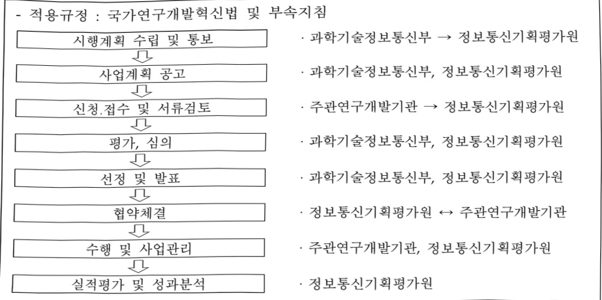
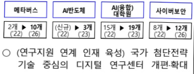
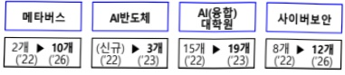
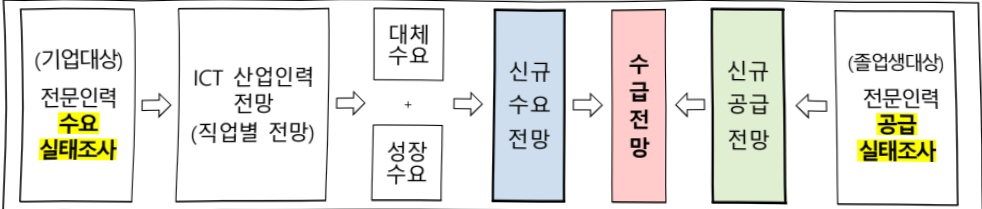

# 정보통신방송혁신인재양성(R&D)

**해당 페이지**: PDF 1383 ~ 1413 쪽 해당

**부처**: 과학기술정보통신부
**분야**: 통신
**회계유형**: 특별회계
**2026 확정예산**: 144742.0 백만원
**전년대비 증감률**: 11.0%
**AI 도메인**: AI반도체, 교육/인재, 통신/네트워크

---

<table border=1 style='margin: auto; word-wrap: break-word;'><tr><td rowspan="2"></td><td rowspan="2">사업시행주체</td><td rowspan="2">정보통신기획평가원</td><td style='text-align: center; word-wrap: break-word;'>디지털인재양성단</td><td colspan="2">AI·반도체인재팀</td></tr><tr><td style='text-align: center; word-wrap: break-word;'>AI·디지털융합단</td><td colspan="2">글로벌·핵심인재팀</td></tr><tr><td rowspan="2">연구지원</td><td style='text-align: center; word-wrap: break-word;'>소관부처</td><td style='text-align: center; word-wrap: break-word;'>과학기술정보통신부</td><td style='text-align: center; word-wrap: break-word;'>정보통신정책실</td><td style='text-align: center; word-wrap: break-word;'>소프트웨어정책관</td><td style='text-align: center; word-wrap: break-word;'>소프트웨어정책과</td></tr><tr><td style='text-align: center; word-wrap: break-word;'>사업시행주체</td><td style='text-align: center; word-wrap: break-word;'>정보통신기획평가원</td><td style='text-align: center; word-wrap: break-word;'>디지털인재양성단</td><td colspan="2">디지털선도인재팀</td></tr><tr><td rowspan="2">정책기반지원</td><td style='text-align: center; word-wrap: break-word;'>소관부처</td><td style='text-align: center; word-wrap: break-word;'>과학기술정보통신부</td><td style='text-align: center; word-wrap: break-word;'>정보통신정책실</td><td style='text-align: center; word-wrap: break-word;'>소프트웨어정책관</td><td style='text-align: center; word-wrap: break-word;'>소프트웨어정책과</td></tr><tr><td style='text-align: center; word-wrap: break-word;'>사업시행주체</td><td style='text-align: center; word-wrap: break-word;'>정보통신기획평가원</td><td style='text-align: center; word-wrap: break-word;'>디지털인재양성단</td><td colspan="2">인재기획팀</td></tr></table>

---

### 가.지출계획 총괄표

(단위:백만원,%)

<table border=1 style='margin: auto; word-wrap: break-word;'><tr><td rowspan="2">목명</td><td rowspan="2">2024년 결산</td><td colspan="2">2025년 계획</td><td colspan="2">2026년</td><td rowspan="2">증감(B-A)</td><td rowspan="2">(B-A)/A</td></tr><tr><td style='text-align: center; word-wrap: break-word;'>당초(A)</td><td style='text-align: center; word-wrap: break-word;'>수정</td><td style='text-align: center; word-wrap: break-word;'>요구안</td><td style='text-align: center; word-wrap: break-word;'>확정(B)</td></tr><tr><td style='text-align: center; word-wrap: break-word;'>정보통신 방송혁신</td><td rowspan="2">105,410</td><td rowspan="2">130,400</td><td rowspan="2">140,400</td><td rowspan="2">144,092</td><td rowspan="2">144,742</td><td rowspan="2">14,342</td><td rowspan="2">11.0</td></tr><tr><td style='text-align: center; word-wrap: break-word;'>인재양성</td></tr></table>

※ 일부 내내역사업*을 2024년에 디지털선도기술핵심인재양성(고등·평생교육지원특별회계) 사업으로 이관

*ICT명품인재양성, 학·석사연계ICT핵심인재양성, 지역지능화혁신인재양성, ICT글로벌인재양성

## □ 기능별(내역사업별), 목별 계획 내역

(단위:백만원)

<table border=1 style='margin: auto; word-wrap: break-word;'><tr><td rowspan="3"></td><td colspan="5">2024</td><td colspan="8">2025(2025.12월말)</td><td rowspan="3">2026계획</td></tr><tr><td rowspan="2">계획액(수정)</td><td rowspan="2">계획현액</td><td rowspan="2">집행액[실집행액]</td><td rowspan="2">이월액</td><td rowspan="2">불용액</td><td colspan="2">계획액</td><td rowspan="2">계획현액</td><td rowspan="2">집행액[실집행액]</td><td colspan="2">전년도 이월액제의</td><td rowspan="2">이월액예상액</td><td rowspan="2">불용예상액</td></tr><tr><td style='text-align: center; word-wrap: break-word;'>당초</td><td style='text-align: center; word-wrap: break-word;'>수정</td><td style='text-align: center; word-wrap: break-word;'>계획현액</td><td style='text-align: center; word-wrap: break-word;'>집행액[실집행액]</td></tr><tr><td style='text-align: center; word-wrap: break-word;'>○ 정보통신방송혁신인재양성</td><td style='text-align: center; word-wrap: break-word;'>105,410</td><td style='text-align: center; word-wrap: break-word;'>105,410</td><td style='text-align: center; word-wrap: break-word;'>105,410[105,410]</td><td style='text-align: center; word-wrap: break-word;'>-</td><td style='text-align: center; word-wrap: break-word;'>-</td><td style='text-align: center; word-wrap: break-word;'>130,400</td><td style='text-align: center; word-wrap: break-word;'>140,400</td><td style='text-align: center; word-wrap: break-word;'>140,400[140,400]</td><td style='text-align: center; word-wrap: break-word;'>140,400</td><td style='text-align: center; word-wrap: break-word;'>140,400[140,400]</td><td style='text-align: center; word-wrap: break-word;'>-</td><td style='text-align: center; word-wrap: break-word;'>-</td><td style='text-align: center; word-wrap: break-word;'>144,742</td><td style='text-align: center; word-wrap: break-word;'></td></tr><tr><td style='text-align: center; word-wrap: break-word;'>· 교육훈련</td><td style='text-align: center; word-wrap: break-word;'>70,110</td><td style='text-align: center; word-wrap: break-word;'>70,110</td><td style='text-align: center; word-wrap: break-word;'>70,110[70,110]</td><td style='text-align: center; word-wrap: break-word;'>-</td><td style='text-align: center; word-wrap: break-word;'>-</td><td style='text-align: center; word-wrap: break-word;'>75,662</td><td style='text-align: center; word-wrap: break-word;'>85,662</td><td style='text-align: center; word-wrap: break-word;'>85,662[85,662]</td><td style='text-align: center; word-wrap: break-word;'>85,662</td><td style='text-align: center; word-wrap: break-word;'>85,662[85,662]</td><td style='text-align: center; word-wrap: break-word;'>-</td><td style='text-align: center; word-wrap: break-word;'>-</td><td style='text-align: center; word-wrap: break-word;'>88,129</td><td style='text-align: center; word-wrap: break-word;'></td></tr><tr><td style='text-align: center; word-wrap: break-word;'>· 인공지능핵심인재양성</td><td style='text-align: center; word-wrap: break-word;'>20,000</td><td style='text-align: center; word-wrap: break-word;'>20,000</td><td style='text-align: center; word-wrap: break-word;'>20,000[20,000]</td><td style='text-align: center; word-wrap: break-word;'>-</td><td style='text-align: center; word-wrap: break-word;'>-</td><td style='text-align: center; word-wrap: break-word;'>20,000</td><td style='text-align: center; word-wrap: break-word;'>30,000</td><td style='text-align: center; word-wrap: break-word;'>30,000[30,000]</td><td style='text-align: center; word-wrap: break-word;'>30,000</td><td style='text-align: center; word-wrap: break-word;'>30,000[30,000]</td><td style='text-align: center; word-wrap: break-word;'>-</td><td style='text-align: center; word-wrap: break-word;'>-</td><td style='text-align: center; word-wrap: break-word;'>40,000</td><td style='text-align: center; word-wrap: break-word;'></td></tr><tr><td style='text-align: center; word-wrap: break-word;'>· 융합보안핵심인재양성</td><td style='text-align: center; word-wrap: break-word;'>8,760</td><td style='text-align: center; word-wrap: break-word;'>8,760</td><td style='text-align: center; word-wrap: break-word;'>8,760[8,760]</td><td style='text-align: center; word-wrap: break-word;'>-</td><td style='text-align: center; word-wrap: break-word;'>-</td><td style='text-align: center; word-wrap: break-word;'>6,176</td><td style='text-align: center; word-wrap: break-word;'>6,176</td><td style='text-align: center; word-wrap: break-word;'>6,176[6,176]</td><td style='text-align: center; word-wrap: break-word;'>6,176</td><td style='text-align: center; word-wrap: break-word;'>6,176[6,176]</td><td style='text-align: center; word-wrap: break-word;'>-</td><td style='text-align: center; word-wrap: break-word;'>-</td><td style='text-align: center; word-wrap: break-word;'>5,500</td><td style='text-align: center; word-wrap: break-word;'></td></tr><tr><td style='text-align: center; word-wrap: break-word;'>· 인공지능혁신허브</td><td style='text-align: center; word-wrap: break-word;'>10,000</td><td style='text-align: center; word-wrap: break-word;'>10,000</td><td style='text-align: center; word-wrap: break-word;'>10,000[10,000]</td><td style='text-align: center; word-wrap: break-word;'>-</td><td style='text-align: center; word-wrap: break-word;'>-</td><td style='text-align: center; word-wrap: break-word;'>8,126</td><td style='text-align: center; word-wrap: break-word;'>8,126</td><td style='text-align: center; word-wrap: break-word;'>8,126[8,126]</td><td style='text-align: center; word-wrap: break-word;'>8,126</td><td style='text-align: center; word-wrap: break-word;'>8,126[8,126]</td><td style='text-align: center; word-wrap: break-word;'>-</td><td style='text-align: center; word-wrap: break-word;'>-</td><td style='text-align: center; word-wrap: break-word;'>-</td><td style='text-align: center; word-wrap: break-word;'></td></tr><tr><td style='text-align: center; word-wrap: break-word;'>· 가상융합대학원(암메타버스융합대학원)</td><td style='text-align: center; word-wrap: break-word;'>6,500</td><td style='text-align: center; word-wrap: break-word;'>6,500</td><td style='text-align: center; word-wrap: break-word;'>6,500[6,500]</td><td style='text-align: center; word-wrap: break-word;'>-</td><td style='text-align: center; word-wrap: break-word;'>-</td><td style='text-align: center; word-wrap: break-word;'>6,501</td><td style='text-align: center; word-wrap: break-word;'>6,501</td><td style='text-align: center; word-wrap: break-word;'>6,501[6,501]</td><td style='text-align: center; word-wrap: break-word;'>6,501</td><td style='text-align: center; word-wrap: break-word;'>6,501[6,501]</td><td style='text-align: center; word-wrap: break-word;'>-</td><td style='text-align: center; word-wrap: break-word;'>-</td><td style='text-align: center; word-wrap: break-word;'>6,501</td><td style='text-align: center; word-wrap: break-word;'></td></tr><tr><td style='text-align: center; word-wrap: break-word;'>· 인공지능반도체고급인재양성</td><td style='text-align: center; word-wrap: break-word;'>9,000</td><td style='text-align: center; word-wrap: break-word;'>9,000</td><td style='text-align: center; word-wrap: break-word;'>9,000[9,000]</td><td style='text-align: center; word-wrap: break-word;'>-</td><td style='text-align: center; word-wrap: break-word;'>-</td><td style='text-align: center; word-wrap: break-word;'>9,000</td><td style='text-align: center; word-wrap: break-word;'>9,000</td><td style='text-align: center; word-wrap: break-word;'>9,000[9,000]</td><td style='text-align: center; word-wrap: break-word;'>9,000</td><td style='text-align: center; word-wrap: break-word;'>9,000[9,000]</td><td style='text-align: center; word-wrap: break-word;'>-</td><td style='text-align: center; word-wrap: break-word;'>-</td><td style='text-align: center; word-wrap: break-word;'>9,000</td><td style='text-align: center; word-wrap: break-word;'></td></tr><tr><td style='text-align: center; word-wrap: break-word;'>· AI·디지털혁신인재단기집중역량강화</td><td style='text-align: center; word-wrap: break-word;'>5,850</td><td style='text-align: center; word-wrap: break-word;'>5,850</td><td style='text-align: center; word-wrap: break-word;'>5,850[5,850]</td><td style='text-align: center; word-wrap: break-word;'>-</td><td style='text-align: center; word-wrap: break-word;'>-</td><td style='text-align: center; word-wrap: break-word;'>6,107</td><td style='text-align: center; word-wrap: break-word;'>6,107</td><td style='text-align: center; word-wrap: break-word;'>6,107[6,107]</td><td style='text-align: center; word-wrap: break-word;'>6,107</td><td style='text-align: center; word-wrap: break-word;'>6,107[6,107]</td><td style='text-align: center; word-wrap: break-word;'>-</td><td style='text-align: center; word-wrap: break-word;'>-</td><td style='text-align: center; word-wrap: break-word;'>6,876</td><td style='text-align: center; word-wrap: break-word;'></td></tr><tr><td style='text-align: center; word-wrap: break-word;'>· 인공지능 연구거점 프로젝트</td><td style='text-align: center; word-wrap: break-word;'>4,000</td><td style='text-align: center; word-wrap: break-word;'>4,000</td><td style='text-align: center; word-wrap: break-word;'>4,000[4,000]</td><td style='text-align: center; word-wrap: break-word;'>-</td><td style='text-align: center; word-wrap: break-word;'>-</td><td style='text-align: center; word-wrap: break-word;'>10,000</td><td style='text-align: center; word-wrap: break-word;'>10,000</td><td style='text-align: center; word-wrap: break-word;'>10,000[10,000]</td><td style='text-align: center; word-wrap: break-word;'>10,000</td><td style='text-align: center; word-wrap: break-word;'>10,000[10,000]</td><td style='text-align: center; word-wrap: break-word;'>-</td><td style='text-align: center; word-wrap: break-word;'>-</td><td style='text-align: center; word-wrap: break-word;'>10,000</td><td style='text-align: center; word-wrap: break-word;'></td></tr><tr><td style='text-align: center; word-wrap: break-word;'>· 글로벌 데이터융합리더 양성</td><td style='text-align: center; word-wrap: break-word;'>2,000</td><td style='text-align: center; word-wrap: break-word;'>2,000</td><td style='text-align: center; word-wrap: break-word;'>2,000[2,000]</td><td style='text-align: center; word-wrap: break-word;'>-</td><td style='text-align: center; word-wrap: break-word;'>-</td><td style='text-align: center; word-wrap: break-word;'>3,251</td><td style='text-align: center; word-wrap: break-word;'>3,251</td><td style='text-align: center; word-wrap: break-word;'>3,251[3,251]</td><td style='text-align: center; word-wrap: break-word;'>3,251</td><td style='text-align: center; word-wrap: break-word;'>3,251[3,251]</td><td style='text-align: center; word-wrap: break-word;'>-</td><td style='text-align: center; word-wrap: break-word;'>-</td><td style='text-align: center; word-wrap: break-word;'>3,751</td><td style='text-align: center; word-wrap: break-word;'></td></tr><tr><td style='text-align: center; word-wrap: break-word;'>· 오픈랜 인력양성프로그램</td><td style='text-align: center; word-wrap: break-word;'>1,500</td><td style='text-align: center; word-wrap: break-word;'>1,500</td><td style='text-align: center; word-wrap: break-word;'>1,500[1,500]</td><td style='text-align: center; word-wrap: break-word;'>-</td><td style='text-align: center; word-wrap: break-word;'>-</td><td style='text-align: center; word-wrap: break-word;'>2,438</td><td style='text-align: center; word-wrap: break-word;'>2,438</td><td style='text-align: center; word-wrap: break-word;'>2,438[2,438]</td><td style='text-align: center; word-wrap: break-word;'>2,438</td><td style='text-align: center; word-wrap: break-word;'>2,438[2,438]</td><td style='text-align: center; word-wrap: break-word;'>-</td><td style='text-align: center; word-wrap: break-word;'>-</td><td style='text-align: center; word-wrap: break-word;'>2,438</td><td style='text-align: center; word-wrap: break-word;'></td></tr><tr><td style='text-align: center; word-wrap: break-word;'>· 차세대통신 클라</td><td style='text-align: center; word-wrap: break-word;'>2,500</td><td style='text-align: center; word-wrap: break-word;'>2,500</td><td style='text-align: center; word-wrap: break-word;'>2,500</td><td style='text-align: center; word-wrap: break-word;'>-</td><td style='text-align: center; word-wrap: break-word;'>-</td><td style='text-align: center; word-wrap: break-word;'>4,063</td><td style='text-align: center; word-wrap: break-word;'>4,063</td><td style='text-align: center; word-wrap: break-word;'>4,063[4,063]</td><td style='text-align: center; word-wrap: break-word;'>4,063</td><td style='text-align: center; word-wrap: break-word;'>4,063[4,063]</td><td style='text-align: center; word-wrap: break-word;'>-</td><td style='text-align: center; word-wrap: break-word;'>-</td><td style='text-align: center; word-wrap: break-word;'>4,063</td><td style='text-align: center; word-wrap: break-word;'></td></tr></table>

---

<table border=1 style='margin: auto; word-wrap: break-word;'><tr><td rowspan="3"></td><td colspan="5">2024</td><td colspan="8">2025(2025.12월말)</td><td rowspan="3">2026계획</td></tr><tr><td rowspan="2">계획액(수정)</td><td rowspan="2">계획현액</td><td rowspan="2">집행액[실집행액]</td><td rowspan="2">이월액</td><td rowspan="2">불용액</td><td colspan="2">계획액</td><td rowspan="2">계획현액</td><td rowspan="2">집행액[실집행액]</td><td colspan="2">전년도 이월액제외</td><td rowspan="2">이월예상액</td><td rowspan="2">불용예상액</td></tr><tr><td style='text-align: center; word-wrap: break-word;'>당초</td><td style='text-align: center; word-wrap: break-word;'>수정</td><td style='text-align: center; word-wrap: break-word;'>계획현액</td><td style='text-align: center; word-wrap: break-word;'>집행액[실집행액]</td></tr><tr><td style='text-align: center; word-wrap: break-word;'>우드 리더십 구축</td><td style='text-align: center; word-wrap: break-word;'></td><td style='text-align: center; word-wrap: break-word;'></td><td style='text-align: center; word-wrap: break-word;'>[2,500]</td><td style='text-align: center; word-wrap: break-word;'></td><td style='text-align: center; word-wrap: break-word;'></td><td style='text-align: center; word-wrap: break-word;'></td><td style='text-align: center; word-wrap: break-word;'></td><td style='text-align: center; word-wrap: break-word;'></td><td style='text-align: center; word-wrap: break-word;'>[4,063]</td><td style='text-align: center; word-wrap: break-word;'></td><td style='text-align: center; word-wrap: break-word;'>[4,063]</td><td style='text-align: center; word-wrap: break-word;'></td><td style='text-align: center; word-wrap: break-word;'></td><td style='text-align: center; word-wrap: break-word;'></td></tr><tr><td style='text-align: center; word-wrap: break-word;'>· 연구지원</td><td style='text-align: center; word-wrap: break-word;'>34,800</td><td style='text-align: center; word-wrap: break-word;'>34,800</td><td style='text-align: center; word-wrap: break-word;'>34,800[34,800]</td><td style='text-align: center; word-wrap: break-word;'>-</td><td style='text-align: center; word-wrap: break-word;'>-</td><td style='text-align: center; word-wrap: break-word;'>54,250</td><td style='text-align: center; word-wrap: break-word;'>54,250</td><td style='text-align: center; word-wrap: break-word;'>54,250</td><td style='text-align: center; word-wrap: break-word;'>54,250[54,250]</td><td style='text-align: center; word-wrap: break-word;'>54,250</td><td style='text-align: center; word-wrap: break-word;'>54,250[54,250]</td><td style='text-align: center; word-wrap: break-word;'>-</td><td style='text-align: center; word-wrap: break-word;'>-</td><td style='text-align: center; word-wrap: break-word;'>56,125</td></tr><tr><td style='text-align: center; word-wrap: break-word;'>· 대학ICT연구센터</td><td style='text-align: center; word-wrap: break-word;'>34,800</td><td style='text-align: center; word-wrap: break-word;'>34,800</td><td style='text-align: center; word-wrap: break-word;'>34,800[34,800]</td><td style='text-align: center; word-wrap: break-word;'>-</td><td style='text-align: center; word-wrap: break-word;'>-</td><td style='text-align: center; word-wrap: break-word;'>54,250</td><td style='text-align: center; word-wrap: break-word;'>54,250</td><td style='text-align: center; word-wrap: break-word;'>54,250</td><td style='text-align: center; word-wrap: break-word;'>54,250[54,250]</td><td style='text-align: center; word-wrap: break-word;'>54,250</td><td style='text-align: center; word-wrap: break-word;'>54,250[54,250]</td><td style='text-align: center; word-wrap: break-word;'>-</td><td style='text-align: center; word-wrap: break-word;'>-</td><td style='text-align: center; word-wrap: break-word;'>56,125</td></tr><tr><td style='text-align: center; word-wrap: break-word;'>· 정책기반지원</td><td style='text-align: center; word-wrap: break-word;'>500</td><td style='text-align: center; word-wrap: break-word;'>500</td><td style='text-align: center; word-wrap: break-word;'>500[500]</td><td style='text-align: center; word-wrap: break-word;'>-</td><td style='text-align: center; word-wrap: break-word;'>-</td><td style='text-align: center; word-wrap: break-word;'>488</td><td style='text-align: center; word-wrap: break-word;'>488</td><td style='text-align: center; word-wrap: break-word;'>488</td><td style='text-align: center; word-wrap: break-word;'>488[488]</td><td style='text-align: center; word-wrap: break-word;'>488</td><td style='text-align: center; word-wrap: break-word;'>488[488]</td><td style='text-align: center; word-wrap: break-word;'>-</td><td style='text-align: center; word-wrap: break-word;'>-</td><td style='text-align: center; word-wrap: break-word;'>488</td></tr><tr><td style='text-align: center; word-wrap: break-word;'>· ICT인재양성관리기반조성</td><td style='text-align: center; word-wrap: break-word;'>500</td><td style='text-align: center; word-wrap: break-word;'>500</td><td style='text-align: center; word-wrap: break-word;'>500[500]</td><td style='text-align: center; word-wrap: break-word;'>-</td><td style='text-align: center; word-wrap: break-word;'>-</td><td style='text-align: center; word-wrap: break-word;'>488</td><td style='text-align: center; word-wrap: break-word;'>488</td><td style='text-align: center; word-wrap: break-word;'>488</td><td style='text-align: center; word-wrap: break-word;'>488[488]</td><td style='text-align: center; word-wrap: break-word;'>488</td><td style='text-align: center; word-wrap: break-word;'>488[488]</td><td style='text-align: center; word-wrap: break-word;'>-</td><td style='text-align: center; word-wrap: break-word;'>-</td><td style='text-align: center; word-wrap: break-word;'>488</td></tr><tr><td rowspan="2">○ 비목별 분류(합계)· 연구개발활동비등(360-05)</td><td style='text-align: center; word-wrap: break-word;'>105,410</td><td style='text-align: center; word-wrap: break-word;'>105,410</td><td style='text-align: center; word-wrap: break-word;'>105,410[105,410]</td><td style='text-align: center; word-wrap: break-word;'>-</td><td style='text-align: center; word-wrap: break-word;'>-</td><td style='text-align: center; word-wrap: break-word;'>130,400</td><td style='text-align: center; word-wrap: break-word;'>140,400</td><td style='text-align: center; word-wrap: break-word;'>140,400</td><td style='text-align: center; word-wrap: break-word;'>140,400[140,400]</td><td style='text-align: center; word-wrap: break-word;'>140,400</td><td style='text-align: center; word-wrap: break-word;'>140,400[140,400]</td><td style='text-align: center; word-wrap: break-word;'>-</td><td style='text-align: center; word-wrap: break-word;'>-</td><td style='text-align: center; word-wrap: break-word;'>144,742</td></tr><tr><td style='text-align: center; word-wrap: break-word;'>105,410</td><td style='text-align: center; word-wrap: break-word;'>105,410</td><td style='text-align: center; word-wrap: break-word;'>105,410[105,410]</td><td style='text-align: center; word-wrap: break-word;'>-</td><td style='text-align: center; word-wrap: break-word;'>-</td><td style='text-align: center; word-wrap: break-word;'>130,400</td><td style='text-align: center; word-wrap: break-word;'>140,400</td><td style='text-align: center; word-wrap: break-word;'>140,400</td><td style='text-align: center; word-wrap: break-word;'>140,400[140,400]</td><td style='text-align: center; word-wrap: break-word;'>140,400</td><td style='text-align: center; word-wrap: break-word;'>140,400[140,400]</td><td style='text-align: center; word-wrap: break-word;'>-</td><td style='text-align: center; word-wrap: break-word;'>-</td><td style='text-align: center; word-wrap: break-word;'>144,742</td></tr></table>

## 1 ) 사업목적·내용

- (정보통신방송혁신인재양성) AI·차세대통신·ICT융합 등 ICT 유망기술 분야 석·박사급 고급 인재를 양성하여 기술 경쟁력을 제고하고 디지털 경제성장을 견인

(교육훈련) AI·AI반도체·융합보안 등 대학원 교육과정 운영 지원, 산·학 공동 연구 교육 및 글로벌 협력 연구·교육 등을 통한 석·박사급 인재양성

(연구지원) ICT유망기술 분야 대학ICT연구센터의 첨단 연구 프로젝트 지원을 통해 R&D역량을 갖춘 석·박사급 핵심 연구인재 양성

(정책기반지원) ICT분야 전문 인력의 직업·기술·학력별 수요와 공급을 전망하고, ICT환경 변화를 반영한 인력양성 정책 수립 지원

## 2 ) 사업개요

□ 사업근거 및 추진경위

① 법령상 근거 및 조항 적시

지원근거

- 정보통신진흥 및 융합활성화 등에 관한 특별법 제11조(국내 전문인력 양성)

- 정보통신진흥 및 융합활성화 등에 관한 특별법

제11조(국내 전문인력의 양성) ① 과학기술정보통신부장관은 정보통신 분야의 전문적인 기술, 지식 등을 가진 인력(이하 "전문인력"이라 한다)의 육성에 관한 시책을 수립·추진하여

---

야 하며, 특히 소프트웨어 교육의 저변 확대 및 지역산업의 발전을 위한 소프트웨어 특화 교육 활성화를 위하여 노력하여야 한다.

② 제1항에 따른 시책에는 다음 각 호의 사항이 포함되어야 한다.

1. 전문인력의 육성 및 교육훈련에 관한 사항

2. 전문인력의 수급 및 활용에 관한 사항

3. 전문인력의 경력관리 지원 등에 관한 사항

4. 그 밖에 전문인력의 육성 및 관리 등을 위한 사항

## 0 정보통신산업진흥법 제16조(전문인력 양성)

## - 정보통신산업진흥법 -

제16조(전문인력의 양성) 과학기술정보통신부장관은 정보통신산업의 진흥에 필요한 전문인력을 양성하기 위하여 다음 각 호의 시책을 마련하여야 한다.

1. 전문인력의 수요 실태 파악 및 중·장기 수급 전망 수립

2. 전문인력 양성기관의 설립·지원

3. 전문인력 양성 교육프로그램의 개발 및 보급 지원

4. 정보통신기술 관련 자격제도의 정착 및 전문인력 수급 지원

5. 각급 학교 및 그 밖의 교육기관에서 시행하는 정보통신기술 및 정보통신산업 관련 교육의 지원

6. 그 밖에 전문인력 양성에 필요한 사항

o 방송통신발전기본법 제21조(방송통신 전문인력의 양성 등)

## - 방송통신발전기본법 -

제21조(방송통신 전문인력의 양성 등) 과학기술정보통신부장관은 방송통신 발전에 필요한 방송통신 전문인력을 양성하기 위하여 다음 각 호의 계획을 수립·시행하여야 한다.

1. 방송통신기술 및 방송통신서비스와 관련된 전문인력(이하 이 조에서 “전문인력”이라 한다) 수요 실태 및 중·장기 수급 전망 파악

2. 전문인력 양성사업의 지원

3. 전문인력 양성기관의 지원

4. 전문인력 양성 교육프로그램의 개발 및 보급 지원

5. 방송통신기술 자격제도의 정착 및 전문인력 수급 지원

6. 각급 학교 및 그 밖의 교육기관에서 시행하는 방송통신기술 및 방송통신서비스 관련 교육의 지원

7. 일반국민에 대한 방송통신기술 및 방송통신서비스 관련 교육의 확대

8. 그 밖에 전문인력 양성에 필요한 사항

② 추진경위 - 사업 시작년도, 추진배경, 부처별 중점과제, 대통령 공약사항 등

- '14. 2월 : 정보통신기술인력양성사업 시행계획(미래창조과학부)

- '15. 3월 : K-ICT전략발표(미래창조과학부)

- '17. 11월 : 혁신성장을 위한 사람중심의 '4차 산업혁명 대응계획(관계부처 합동)

---

- '19. 8월 : 혁신성장 확산·가속화 전략(과기정통부)

- '19. 12월 : 인공지능 국가전략(관계부처 합동)

- '20. 1월 : 정보통신기술인력양성사업, 인공지능핵심인재양성 등 ICT 석 · 박사 인재양성사업 통합, 정보통신방송혁신인재사업 시행

- '20. 7월 : 한국판 뉴딜 2.0.(관계부처 합동)

- '21. 4월 : BIG3+인공지능 인재양성 방안(관계부처 합동)

- '21. 6월 : 민·관 협력 기반의 소프트웨어 인재양성 대책(관계부처 합동)

- '21.12월 : 제4차 과학기술인재 육성·지원 기본계획(관계부처 합동)

- '22. 1월 : 메타버스 신산업 선도전략(관계부처 합동)

- '22. 6월 : 인공지능반도체 산업 성장 지원대책(과기정통부)

- '22 7월 : 반도체 관련 인재양성 방안(관계부처 합동)

- '22. 7월 : 사이버 10만 인재 양성방안(관계부처 합동)

- '22. 8월 : 디지털 인재양성 종합방안(관계부처 합동)

- '22. 9월 : 대한민국 디지털 전략(관계부처 합동)

- '23. 1월 : 제1차 데이터 산업 진흥 기본계획(관계부처 합동)

- '23. 2월 : K-Network 2030 전략(관계부처 합동)

- '23. 4월 : 초거대AI 경쟁력 강화 방안(관계부처 합동)

- '23. 5월 : 제3차 국가초고성능컴퓨팅 육성 기본계획('23~'27)(관계부처 합동)

- '24. 1월 : 내내역사업 이관(→디지털선도기술핵심인재양성(고등·평생교육지원 특별회계))

* 대상 : ICT명품인재양성, 학·석사연계ICT핵심인재양성, 지역지능화혁신인재양성, ICT글로벌인재양성

- '24. 4월 : AI반도체 이니셔티브(관계부처 합동)

- '24. 9월 : 과학기술 인재 성장·발전 전략(관계부처 합동)

- '24. 9월 : 국가 AI 전략 정책방향(관계부처 합동)

- '25. 2월 : 국가 AI 역량 강화 방안(관계부처 합동)

- '25. 9월 : 이재명 정부 123대 국정과제(대한민국 정부)

22. 초격차 AI 선도기술·인재 확보

## □ 주요내용

① 사업규모

- 총사업비(해당되는 경우에만 기재) : 해당 없음

- 사업기간 : '20년 ~ 계속

- 최근 5년 간 투입된 사업비(예산액기준, 추경편성한 연도에는 추경포함)

<table border=1 style='margin: auto; word-wrap: break-word;'><tr><td style='text-align: center; word-wrap: break-word;'>연도</td><td style='text-align: center; word-wrap: break-word;'>2022</td><td style='text-align: center; word-wrap: break-word;'>2023</td><td style='text-align: center; word-wrap: break-word;'>2024</td><td style='text-align: center; word-wrap: break-word;'>2025</td><td style='text-align: center; word-wrap: break-word;'>2026</td></tr><tr><td style='text-align: center; word-wrap: break-word;'>사업비</td><td style='text-align: center; word-wrap: break-word;'>107,460</td><td style='text-align: center; word-wrap: break-word;'>128,310</td><td style='text-align: center; word-wrap: break-word;'>105,410</td><td style='text-align: center; word-wrap: break-word;'>140,400</td><td style='text-align: center; word-wrap: break-word;'>144,742</td></tr></table>

---

## ② 사업추진체계

- 사업시행방법 : 출연

- 사업시행주체 : (전문기관) 정보통신기획평가원, (주관연구개발기관) 대학(원) 등

- 사업수혜자 : ICT분야 대학, 대학(원)생 등

- 보조, 융자, 출연, 출자 등의 경우 보조·융자 등 지원 비율 및 법적근거

<table border=1 style='margin: auto; word-wrap: break-word;'><tr><td style='text-align: center; word-wrap: break-word;'>내역사업명</td><td style='text-align: center; word-wrap: break-word;'>구분</td><td style='text-align: center; word-wrap: break-word;'>피보조·피출연 등 기관명</td><td style='text-align: center; word-wrap: break-word;'>지원 금액 (2026계획안)</td><td style='text-align: center; word-wrap: break-word;'>지원 비율(%)</td><td style='text-align: center; word-wrap: break-word;'>보조율 법적근거 (해당 조항)</td></tr><tr><td style='text-align: center; word-wrap: break-word;'>교육훈련</td><td style='text-align: center; word-wrap: break-word;'>출연</td><td style='text-align: center; word-wrap: break-word;'>정보통신</td><td style='text-align: center; word-wrap: break-word;'>88,129</td><td style='text-align: center; word-wrap: break-word;'>100%</td><td style='text-align: center; word-wrap: break-word;'>- 정보통신산업진흥법 제22조 (관련 기관에 대한 지원 등)</td></tr><tr><td style='text-align: center; word-wrap: break-word;'>연구지원</td><td style='text-align: center; word-wrap: break-word;'>출연</td><td rowspan="2">기획평가원 (한국연구재단 부설)</td><td style='text-align: center; word-wrap: break-word;'>56,125</td><td style='text-align: center; word-wrap: break-word;'>100%</td><td rowspan="2">- 정보통신융합법 제32조 (정보통신 융합 등 기술·서비스 개발 등의 지원)</td></tr><tr><td style='text-align: center; word-wrap: break-word;'>정책기반지원</td><td style='text-align: center; word-wrap: break-word;'>출연</td><td style='text-align: center; word-wrap: break-word;'>488</td><td style='text-align: center; word-wrap: break-word;'>100%</td></tr></table>

---

☐ 요구내용 : 144,742백만원

○ 교육훈련 : (25년) 85,662 → (26년) 88,129백만원, 2,467백만원 증액(2.9%)

- AI·AI반도체·융합보안·가상융합 대학원 교육·연구 지원 및 AI연구 및 차세대 통신·데이터 분야 문제 해결 역량을 갖춘 핵심 연구인력을 양성하기 위한 계속 과제 지속 지원 예산 및 신규과제 지원 예산 요구

① 인공지능핵심인재양성

- (요구) 인공지능핵심 기술에 대한 체계적인 연구·교육 지원을 통해 글로벌 경쟁력을

석·박사급 인공지능 선도 연구자 집중 양성을 위한 지원예산 40,000백만원 요구

- (산출) [계속] 10개 과제×4,000백만원×12/12개월 = 40,000백만원

② 융합보안핵심인재양성

- (요구) 산업과 ICT 간 융합에 따른 보안위험에 대응하여 전략산업과 연계한 융합보안 산업 선도인재 양성을 위한 지원예산 5,500백만원 요구

- (산출) [계속] 4개 과제×1,000백만원×12/12개월 = 4,000백만원

[신규] 3개 과제×1,000백만원×6/12개월 = 1,500백만원

③ 가상융합대학원(롤 메타버스융합대학원)

- (요구) 다양한 ICT 기술과 인문사회 분야 융복합을 통해 새로운 가치를 창출하는 가상융합산업을 선도할 글로벌 경쟁력을 갖춘 연구개발 융합 인재 양성을 위한 지원예산 6,501백만원 요구

- (산출) [계속] 8개 과제×812.625백만원×12/12개월 = 6,501백만원

④ 인공지능반도체고급인재양성

- (요구) AI반도체대학원 설립·운영 지원을 통하여 최고 수준의 AI반도체 분야 석·박사급 선도연구자 양성 위한 지원예산 9,000백만원 요구

- (산출) [계속] 3개 과제×3,000백만원×12/12개월 = 9,000백만원

- (요구) 디지털 혁신기술 분야 해외 최고 수준 대학에 맞춤형 교육과정을 개설하고 국내 석·박사급 청년 인재를 과연·교육하여 글로벌 현장 감각을 갖춘 고급 인재를 양성하기 위한 지원예산 6,876백만원 요구

- (산출) [계속] 1개 과제×3,400백만원×12/12개월 = 3,400백만원

[계속] 2개 과제×1,700백만원×12/12개월 = 3,400백만원

[계속] 1개 과제× 76백만원×12/12개월 = 76백만원

- (요구) 세계 최고 수준의 AI기술 확보를 위해 국내에「국가 AI연구거점」구축 및 국내·외 우수연구자 간 공동연구 등 글로벌 협력 추진을 위한 지원예산 10,000백만원 요구

---

- (산출) [계속] 1개 과제×10,000백만원×12/12개월 = 10,000백만원
⑦ 글로벌 데이터 융합리더 양성
- (요구) 해외 대학과 협력을 통해, 글로벌 수준의 데이터 역량을 갖추어 해외진출을 선도할 수 있는 '글로벌 데이터 융합 리더' 양성을 위한 지원예산 3,751백만원 요구
- (산출) [계속] 2개 과제×1,219백만원×12/12개월 = 2,438백만원
[계속] 1개 과제× 813백만원×12/12개월 = 813백만원
[신규] 1개 과제×1,000백만원× 6/12개월 = 500백만원
⑧ 오픈랜 인력양성 프로그램
- (요구) 오픈랜 실증사업을 활발히 진행 중인 해외 유수 대학과 국내 대학 간 공동연구 추진, 국내 석·박사 학생 과견을 통한 인재양성을 위한 지원예산 2,438백만원 요구
- (산출) [계속] 2개 과제×1,219백만원×12/12개월 = 2,438백만원
⑨ 차세대통신 클라우드 리더쉽 구축
- (요구) 통신·클라우드 원천기술 보유 연구기관들과 공동연구를 통해 차세대 이동 통신 분야 글로벌 기술주도권 확보 및 인재양성을 위한 지원예산 4,063백만원 요구
- (산출) [계속] 2개 과제×2,031.5백만원×12/12개월 = 4,063백만원
◯ 연구지원 : 미래 ICT 주요기술 분야에서 연구개발을 선도해 나갈 석·박사급 전문 연구 인재를 양성하기 위한 계속과제 지속 및 신규과제 지원예산 요구
(25년) 54,250백만원 → (26년) 56,125백만원, 1,875백만원 셈(3.5%)
① 대학ICT연구센터
- (요구) 대학의 ICT 유망기술 분야 연구프로젝트 수행 등을 지원하여 석·박사생의 첨단 연구역량을 제고함으로써 디지털 혁신과 경제성장을 견인할 핵심인재를 양성하기 위한 지원예산 56,125백만원 요구
- (산출) [계속] 22개 과제×780.6백만원×12/12개월 = 17,173.2백만원
[계속] 34개 과제×975.7백만원×12/12개월 = 33,173.8백만원
[계속] 8개 과제×487.875백만원×12/12개월 = 3,903백만원
[신규] 2개 과제×1,000백만원×9/12개월 = 1,500백만원
[신규] 1개 과제×500백만원×9/12개월 = 375백만원
◯ 정책기반지원 : ICT분야 전문인력에 대한 수요·공급 차이 조사·분석, 인력양성 정책 지원 등을 위한 계속과제 지속 지원예산 요구
(25년) 488백만원 → (26년) 488백만원, - (-)
① ICT인재양성관리기반조성
- (요구) ICT분야 전문인력의 직업·기술·학력별 수요와 공급을 전망하고, ICT환경 변화를 반영한 인력양성 정책 수립 지원을 위해 488백만원 요구
- (산출) [계속] 1개 과제×488백만원×12/12개월 = 488백만원

---

2025년도 예산 및 2026년도 예산안 산출 세부내역 비교

<table border=1 style='margin: auto; word-wrap: break-word;'><tr><td colspan="2">25년 예산</td><td colspan="2">26년 예산(안)</td></tr><tr><td style='text-align: center; word-wrap: break-word;'>예산</td><td style='text-align: center; word-wrap: break-word;'>산출내역</td><td style='text-align: center; word-wrap: break-word;'>예산</td><td style='text-align: center; word-wrap: break-word;'>산출내역</td></tr><tr><td style='text-align: center; word-wrap: break-word;'>140,400</td><td style='text-align: center; word-wrap: break-word;'>○ 교육훈련: (2024) 70,110 → (2025요구) 85,662백만원, +22.2% (1) 인공지능핵심인재양성: 30,000백만원 - 계속지원 과제: 30,000백만원(10개×3,000백만원) (2) 융합보안핵심인재양성: 6,176백만원 - 계속지원 과제: 2,925백만원(5개×585백만원) - 계속지원 과제: 3,251백만원(4개×812.75백만원) (3) 인공지능혁신허브: 8,126백만원 - 계속지원 과제: 8,126백만원(1개×8,126백만원) (4) 메타버스융합대학원: 6,501백만원 - 계속지원 과제: 6,501백만원(8개×812.625백만원) (5) 인공지능반도체고급인재양성: 9,000백만원 - 계속지원 과제: 9,000백만원(3개×3,000백만원) (6) AI-디지털혁신인재단기집중역량강화: 6,107백만원 - 계속지원 과제: 3,412백만원(1개×3,412백만원) - 계속지원 과제: 1,706백만원(1개×1,706백만원) - 계속지원 과제: 489백만원(1개×489백만원) - 신규지원 과제: 500백만원(1개×1,000백만원×6/12개월) (7) 인공지능연구거점프로젝트: 10,000백만원 - 계속지원 과제: 10,000백만원(1개×10,000백만원) (8) 글로벌데이터융합리더양성: 3,251백만원 - 계속지원 과제: 2,438백만원(2개×1,219백만원) - 계속지원 과제: 813백만원(1개×813백만원) (9) 오픈랜인력양성프로그램: 2,438백만원 - 계속지원 과제: 2,438백만원(2개×1,219백만원) (10) 차세대통신 클라우드 리더쉽 구축: 4,063백만원 - 계속지원 과제: 4,063백만원(2개×2,031.5백만원)</td><td style='text-align: center; word-wrap: break-word;'>144,092</td><td style='text-align: center; word-wrap: break-word;'>○ 교육훈련: (2025) 85,662 → (2026요구) 88,129백만원, +2.9% (1) 인공지능핵심인재양성: 40,000백만원 - 계속지원 과제: 40,000백만원(10개×4,000백만원) (2) 융합보안핵심인재양성: 5,500백만원 - 계속지원 과제: 4,000백만원(4개×1,000백만원) - 신규지원 과제: 1,500백만원(3개×1,000백만원×6/12개월) (3) 가상융합대학원(졸 메타버스융합대학원): 6,501백만원 - 계속지원 과제: 6,501백만원(8개×812.625백만원) (4) 인공지능반도체고급인재양성: 9,000백만원 - 계속지원 과제: 9,000백만원(3개×3,000백만원) (5) AI-디지털혁신인재단기집중역량강화: 6,876백만원 - 계속지원 과제: 3,400백만원(1개×3,400백만원) - 계속지원 과제: 3,400백만원(2개×1,700백만원) - 계속지원 과제: 76백만원(1개×76백만원) (6) 인공지능연구거점프로젝트: 10,000백만원 - 계속지원 과제: 10,000백만원(1개×10,000백만원) (7) 글로벌데이터융합리더양성: 3,751백만원 - 계속지원 과제: 2,438백만원(2개×1,219백만원) (8) 오픈랜인력양성프로그램: 2,438백만원 - 계속지원 과제: 2,438백만원(2개×1,219백만원) (9) 차세대통신 클라우드 리더쉽 구축: 4,063백만원 - 계속지원 과제: 4,063백만원(2개×2,031.5백만원)</td></tr><tr><td style='text-align: center; word-wrap: break-word;'>○ 연구지원: (2024) 34,800 → (2025요구) 54,250백만원, 55.9% (1) 대학ICT연구센터: 54,250백만원 - 계속지원 과제: 17,173.2백만원(22개 과제×780.6백만원) - 계속지원 과제: 33,173.8백만원(34개 과제×975.7백만원) - 계속지원 과제: 3,903백만원(8개×487.875백만원)</td><td style='text-align: center; word-wrap: break-word;'>○ 연구지원: (2025) 54,250 → (2026요구) 56,125백만원, 3.5% (1) 대학ICT연구센터: 56,125백만원 - 계속지원 과제: 17,173.2백만원(22개 과제×780.6백만원) - 계속지원 과제: 33,173.8백만원(34개 과제×975.7백만원) - 계속지원 과제: 3,903백만원(8개×487.875백만원) - 신규지원 과제: 1,500백만원(2개×1,000백만원×9/12개월) - 신규지원 과제: 375백만원(1개×500백만원×9/12개월)</td><td style='text-align: center; word-wrap: break-word;'>○ 정책기반지원: (2025) 488 → (2026요구) 488백만원, - (1) ICT인재양성관리기반구축: 488백만원 - 계속지원 과제: 488백만원(1개×488백만원)</td><td style='text-align: center; word-wrap: break-word;'></td></tr></table>

---

## 4 ) 사업효과

□ 사업영향, 산출물 성과지표 등

① 2022~2026년도 성과계획서 상 성과지표 및 최근 5년간 성과 달성도

<table border=1 style='margin: auto; word-wrap: break-word;'><tr><td style='text-align: center; word-wrap: break-word;'>성과지표</td><td style='text-align: center; word-wrap: break-word;'>구분</td><td style='text-align: center; word-wrap: break-word;'>2022</td><td style='text-align: center; word-wrap: break-word;'>2023</td><td style='text-align: center; word-wrap: break-word;'>2024</td><td style='text-align: center; word-wrap: break-word;'>2025</td><td style='text-align: center; word-wrap: break-word;'>2026</td><td style='text-align: center; word-wrap: break-word;'>2026 목표치산출근거</td><td style='text-align: center; word-wrap: break-word;'>측정산시(또는 측정방법)</td><td style='text-align: center; word-wrap: break-word;'>자료수집방법(또는 자료출처)</td></tr><tr><td rowspan="3">등록특허 등급지수(단위: 점)</td><td style='text-align: center; word-wrap: break-word;'>목표</td><td style='text-align: center; word-wrap: break-word;'>3.94</td><td style='text-align: center; word-wrap: break-word;'>4.00</td><td style='text-align: center; word-wrap: break-word;'>4.20</td><td style='text-align: center; word-wrap: break-word;'>4.27 $ ^{**} $</td><td style='text-align: center; word-wrap: break-word;'>4.35 $ ^{**} $</td><td rowspan="3">최근 3년간특허실적 평가 점수 대비 2% 상향</td><td rowspan="3">당해연도 NITS 등록 특허에 대해 SMART를 통해 등급별 점수를 부여하고 특허 등급의 평균값 부여</td><td rowspan="3">외부전문기관 성과분석보고서(NITS 특허 등록 건수 및 SMART시스템 분석 보고서)</td></tr><tr><td style='text-align: center; word-wrap: break-word;'>실적</td><td style='text-align: center; word-wrap: break-word;'>4.04</td><td style='text-align: center; word-wrap: break-word;'>4.32</td><td style='text-align: center; word-wrap: break-word;'>-</td><td style='text-align: center; word-wrap: break-word;'>-</td><td style='text-align: center; word-wrap: break-word;'>-</td></tr><tr><td style='text-align: center; word-wrap: break-word;'>달성도</td><td style='text-align: center; word-wrap: break-word;'>102.5</td><td style='text-align: center; word-wrap: break-word;'>108.0</td><td style='text-align: center; word-wrap: break-word;'>-</td><td style='text-align: center; word-wrap: break-word;'>-</td><td style='text-align: center; word-wrap: break-word;'>-</td></tr></table>

* '24년 실적은 국가과학기술정보서비스(NTIS)에 등록, 성과 검증, 이의신청 접수·반영 등의

절차를 거쳐 '26년 1월경 확정(한국과학기술기획평가원(KISTEP)의 성과 확정 일정에 따름)

**'25,26년 목표는 임의 값으로 '24년 실적이 확정된 후 변경 예정

② 성과지표 이외의 연도별 사업추진 경과 및 실적

<table border=1 style='margin: auto; word-wrap: break-word;'><tr><td style='text-align: center; word-wrap: break-word;'>2022</td><td style='text-align: center; word-wrap: break-word;'>☐ 교육훈련
○ 인공지능핵심인재양성
- KAIST 등 AI대학원 10개 과제 지원
- AI분야 최고 전문가로 구성된 전임교원 161명 확보 및 우수 신입생 1,673명 선발(&#x27;19년 98명, &#x27;20년 366명, &#x27;21년 595명, &#x27;22년 614명), 기계학습, 딥러닝 등 총 664개 과목의 인공지능 분야 특화 교육과정을 개발·편성(&#x27;19~, &#x27;22년)
○ 융합보안핵심인재양성
- 고려대 등 융합보안대학원 8개 과제 지원
- ICT융합분야 핵심인재 양성을 위한 &#x27;22년도 융합보안대학원 신입생 총 95명 선발 및 &#x27;22년까지 94개의 융합보안 특화 교육과정(디지털 헬스케어 보안, 스마트팩토리개론 등) 개설 및 운영
○ 인공지능핵신허브
- 고려대학교 전소시업에 1개 과제 지원
- KAIST, 포항공대, 연세대 등 11개 공동연구개발기관이 참여하여 개방형 공동연구체계 구축
- 특허 73건, 논문 157건 등 우수 연구성과 창출(~&#x27;22년)
○ 메타버스융합대학원
- 서강대 등 메타버스융합대학원 2개 과제 지원(&#x27;22년 2개 신규 지원)
○ ICT명품인재양성
- 성균관대 등 ICT명품인재양성 2개 과제 지원
- 대학연구소 설립 및 최고 수준의 연구 환경을 구축하여 ICT융합 연구 SCI논문 988건, 특허 출원·등록 756건의 연구성과 도출(&#x27;11~, &#x27;22년)
○ 학·석사연계ICT핵심인재양성(舊 ICT혁신인재4.0)
- 포항공대 등 학·석사연계ICT핵심인재양성 17개 대학 31개 혁신 연구 교육과정 개발 지원(&#x27;22년 10개교 신규 지원)</td></tr></table>

---

<table border=1 style='margin: auto; word-wrap: break-word;'><tr><td style='text-align: center; word-wrap: break-word;'></td><td style='text-align: center; word-wrap: break-word;'>- PBL(Problem-based Learning) 교육과정 총 83개 과목 개발·편성 및 대학과 기업 멘토로 구성된 전문 교수요원 334명이 참여하여 758명의 인재 양성(~22) ○ 지역지능화혁신인재양성 - 부산대 등 Grand ICT연구센터 12개 과제 지원(&#x27;22년 5개 신규 지원) - 대학의 ICT · 지능화 기술역량을 활용, 지역기업의 지능화 혁신을 지원하는 연구 수행 등을 통해 석·박사 895명 배출, 특허등록 285건, 기술이전 수입 7,790백만원, SCI급 논문 558건 등 성과 도출(&#x27;15~&#x27;22년) □ 연구지원 ○ 대학 ICT연구센터 - 서울대 등 대학ICT연구센터 48개 과제 지원(&#x27;22년 6개 신규 지원) - 석·박사 17,153명 배출, 특허등록 6,112건, 기술이전 수입 약 581억원 등 우수 연구성과 창출(&#x27;00~&#x27;22년) □ 해외연계지원 ○ ICT글로벌인재양성 - 신흥국 진출 수요와 매칭한 외국인 공무원 및 전문가 석·박사 학위과정 지원을 통해 신규 네트워크 형성 및 해외진출 연계(&#x27;22년 55명) ○ 프로젝트형글로벌역량강화 - ICT 선도 분야 해외 최고 수준 대학에 맞춤형 교육과정을 개설하고 국내 청년 인재들을 과전·교육하여 고급인력 양성 및 산업계 인력 공급(&#x27;22년 30명) □ 정책기반지원 ○ ICT인재양성관리기반조성 - 신기술 및 유망 기술 분야의 인재 수요 전망 및 현황 데이터 확보 - ICT전문인력 실태 조사 및 수급전망 분석 보고서 발간, 유관기관 협력을 통해 ICT인재양성 정책 수립방향을 지원</td></tr><tr><td style='text-align: center; word-wrap: break-word;'>2023</td><td style='text-align: center; word-wrap: break-word;'>□ 교육훈련 ○ ICT명품인재양성 - 성균관대 등 ICT명품인재양성 2개 과제 지원 - 대학연구소 설립 및 최고 수준의 연구 환경을 구축하여 ICT용합 연구 SCI논문 1,099건, 특허 출원·등록 883건의 연구성과 도출(&#x27;11~&#x27;23년) ○ 인공지능핵심인재양성 - KAIST 등 AI대학원 10개 과제 지원 - AI분야 최고 전문가로 구성된 전임교원 178명 확보 및 우수 신입생 2,377명 선발(&#x27;19년 98명, &#x27;20년 366명, &#x27;21년 595명, &#x27;22년 614명, &#x27;23년 704명), 기계학습, 딥러닝 등 총 772개 과목의 인공지능 분야 특화 교육과정을 개발·편성(&#x27;19~&#x27;23년) ○ 용합보안핵심인재양성 - 고려대 등 용합보안대학원 10개 과제 지원(신규 2개) - ICT용합분야 핵심인재 양성을 위한 &#x27;23년도 융합보안대학원 신입생 총 98명 선발 및 &#x27;23년까지 198개의 융합보안 특화 교육과정 개설 및 운영 ○ 학·석사연계ICT핵심인재양성 - 포항공대 등 학·석사연계ICT핵심인재양성 23개 대학 37개 혁신 연구 교육과정 개발 지원(&#x27;23년 6개교 신규 지원) - PBL(Problem-based Learning) 교육과정 총 164개 과목 개발·편성 및 대학과 기업 멘토로 구성된 전문 교수요원 496명이 참여하여 894명의 인재 양성(~&#x27;23) ○ 지역지능화혁신인재양성</td></tr></table>

---

<table border=1 style='margin: auto; word-wrap: break-word;'><tr><td style='text-align: center; word-wrap: break-word;'></td><td style='text-align: center; word-wrap: break-word;'>- 부산대 등 Grand ICT연구센터 13개 과제 지원(&#x27;23년 2개 신규 지원) - 대학의 ICT · 지능화 기술역량을 활용, 지역기업의 지능화 혁신을 지원하는 연구 수행 등을 통해 석·박사 1,191명 배출, 특허등록 390건, 기술이전 수입 10,068백만원, SCI급 논문 824건 등 성과 도출(&#x27;15~&#x27;23년) ○ 인공지능혁신허브 - 고려대학교 전소시업에 1개 과제 지원 - 고위험·도전형 R&amp;D 수행을 통한 인재양성 및 개방형 공동연구를 위한 고성능 컴퓨팅 인프라 구축(&#x27;23.2, AI데이터센터 개소) - 특허 출원 177건, 논문 284건 등 우수 연구성과 창출(~&#x27;23년) ○ 메타버스융합대학원 - 서강대 등 메타버스융합대학원 5개 과제 지원(신규 3개) - 메타버스 분야 고급인재 양성을 위한 &#x27;23년도 메타버스 융합대학원 신입생 총 114명 선발 및 &#x27;23년까지 90개의 메타버스 특화 교육과정 개설 및 운영 ○ 인공지능반도체고급인재양성 - 서울대 등 인공지능반도체대학원 3개 과제 지원(신규 3개) - 인공지능 반도체 분야 핵심인재 양성을 위한 &#x27;23년도 인공지능반도체대학원 신입생 총 41명 선발 및 &#x27;23년까지 24개의 인공지능 반도체 특화 교육과정 개설 및 운영 □ 연구지원 ○ 대학 ICT연구센터 - 서울대 등 대학ICT연구센터 52개 과제 지원(신규 12개) - 석·박사 17,847명 배출, 특허등록 6,357건, 기술이전 수입 약 612억원 등 우수 연구성과 창출(&#x27;00~&#x27;23년) □ 해외연계지원 ○ ICT글로벌인재양성 - KAIST 등 2개 과제 지원(&#x27;23년 47개국, 총 60명 수혜) ○ 프로젝트형글로벌역량강화 - 서강대 1개 과제 지원(&#x27;23년 카네기멜론대 30명/신규 토론토대 30명 선정·지원) □ 정책기반지원 ○ ICT인재양성관리기반조성 - 신기술 및 유망 기술 분야의 인재 수요 전망 및 현황 데이터 확보 - ICT전문인력 실태 조사 및 수급전망 분석 보고서 발간, 유관기관 협력을 통해 ICT인재양성 정책 수립방향을 지원</td></tr><tr><td style='text-align: center; word-wrap: break-word;'>2024</td><td style='text-align: center; word-wrap: break-word;'>□ 교육훈련 ○ 인공지능핵심인재양성 - KAIST 등 AI대학원 10개 과제 지원 - AI분야 최고 전문가로 구성된 전임교원 225명 확보 및 우수 신입생 3,073명 선발(&#x27;19년 98명, &#x27;20년 366명, &#x27;21년 595명, &#x27;22년 614명, &#x27;23년 704명, &#x27;24년 696명) ○ 융합보안핵심인재양성 - 고려대 등 융합보안대학원 계속 12개 과제 지원 중(신규 2개) - ICT융합분야 핵심인재 양성을 위한 &#x27;24년도 융합보안대학원 신입생 총 167명 선발 ○ 인공지능혁신허브</td></tr></table>

---

<table border=1 style='margin: auto; word-wrap: break-word;'><tr><td style='text-align: center; word-wrap: break-word;'></td><td style='text-align: center; word-wrap: break-word;'>- 고려대학교 전소시엄에 1개 과제 지원 중- Top-tier급 논문 135건, H100 서버 8대 확대 구축(총 12[PF] 구축)○ 메타버스융합대학원- 서강대 등 메타버스융합대학원 8개 과제 지원 중(신규 3개) - 메타버스 분야 고급인재 양성을 위한 &#x27;24년도 신입생 총 177명 선발, 산학협력프로젝트 46건, 124개 메타버스 특화 교육과정 개설 및 운영○ 인공지능반도체고급인재양성- 서울대 등 인공지능반도체대학원 3개 과제 지원 중- 인공지능 반도체 분야 핵심인재 양성을 위한 인공지능반도체대학원 신입생 총 165명 선발(&#x27;23년 41명, &#x27;24년 124명)○ AI·디지털혁신인재단기집중역량강화- 서강대 1개 과제(2개 과정 운영, 카네기멜론대 34명/토론토대 34명 선정·지원), 신규 글로벌교육 1개 과제(고려대, 주관기관 선정), 신규 글로벌 연수·탐방 1개 과제(한국정보산업연합회, 주관기관 선정) 지원 중○ 인공지능연구거점프로젝트- 신규 1개 과제 선정·지원(KAIST)○ 글로벌데이터융합리더양성- 신규 3개 과제 선정·지원(서울대, 포항공대, KAIST)○ 오픈랜인재양성프로그램- 신규 2개 과제 선정·지원(연세대, 카이스트)○ 차세대통신클라우드리더십구축- 신규 2개 과제 선정·지원(서울대, 연세대)□ 연구지원○ 대학 ICT연구센터- KAIST 등 대학ICT연구센터 64개 과제 지원 중(신규 24개) - 석·박사 18,722명 배출, 특허등록 6,561건, 기술이전 수입 약 638.8억원 등 우수 연구성과 창출(&#x27;00~&#x27;24년)□ 정책기반지원○ ICT인재양성관리기반조성- 신기술 및 유망 기술 분야의 인재 수요 전망 및 현황 데이터 확보- ICT전문인력 수급 실태조사 및 전망 분석 보고서 발간, 유관기관 협력을 통해 ICT인재양성 정책 수립방향을 지원</td></tr><tr><td style='text-align: center; word-wrap: break-word;'>2025</td><td style='text-align: center; word-wrap: break-word;'>□ 교육훈련(배출인원, 논문, 특허 등 성과는 &#x27;26년 산출 가능)○ 인공지능핵심인재양성- KAIST 등 AI대학원 10개 과제 지속 지원○ 융합보안핵심인재양성- 성균관대 등 융합보안대학원 계속 9개 과제 지속 지원○ 가상융합대학원(촬 메타버스융합대학원) - 서강대 등 메타버스융합대학원 8개 과제 지속 지원</td></tr></table>

---

<table border=1 style='margin: auto; word-wrap: break-word;'><tr><td style='text-align: center; word-wrap: break-word;'></td><td style='text-align: center; word-wrap: break-word;'>○ 인공지능반도체고급인재양성- 서울대 등 인공지능반도체대학원 3개 과제 지속 지원○ AI·디지털혁신인재단기집중역량강화- 서강대 1개 과제(2개 과정 운영, 카네기멜론대 25명/토론토대 25명 선정·지원), 고려대 1개 과제(옥스포드대 30명 선정·지원), 신규 글로벌교육 1개 과제(한양대, 주관기관 선정), 글로벌 연수·탐방 1개 과제 계속지원○ 인공지능연구거점프로젝트- KAIST 1개 과제 지속 지원○ 글로벌데이터융합리더양성- 포항공대 등 3개 과제 지속 지원- 산업, 의료분야와 데이터 융합 연구역량 및 글로벌 역량 보유한 인재양성을 위해 카네기멜론대, 멜버른대 등 24명 과전 지원(&#x27;25.6. 기준)○ 오픈랜인재양성프로그램- KAIST 등 2개 과제 지속 지원○ 차세대통신·클라우드리더십구축- 연세대 등 2개 과제 지속 지원- 통신·클라우드분야 글로벌 리더십 확보를 위해 클로라도 보더대, 뉴욕대 등 학생 과전 및 연구교류 지원 중(&#x27;25.6. 기준)□ 연구지원(배출인원, 논문, 특허 등 성과는 &#x27;26년 중 산출 가능)○ 대학 ICT연구센터- KAIST 등 대학ICT연구센터 64개 과제 지속 지원□ 정책기반지원○ ICT인재양성관리기반조성- 신기술 및 유망 기술 분야의 인재 수요 전망 및 현황 데이터 확보- ICT전문인력 수급 실태조사 및 전망 분석 보고서 발간, 유관기관 협력을 통해 ICT인재양성 정책 수립방향을 지원</td></tr></table>

## ③ 향후('26년도 이후) 기대효과

AI·차세대통신·ICT융합 등 ICT 유망기술 분야 석·박사급 고급 인재를 지속적으로 양성하여 국가 산업 기술 경쟁력을 제고하고 디지털 경제성장을 견인(연간 3,600여명 양성)

- 디지털 인재 수요 급증 분야에 대한 지원을 통해 대학의 혁신적 연구역량 제고 및 디지털 신산업 분야에 필요한 핵심인재 양성

- 해외 Top-Tier 대학, 기업과 협력 연구, 과견 교육 등 지원을 통해 글로벌 디지털 기술 패권 선점을 선도할 고급인재 양성

- ICT분야 전문인력의 직업·기술·학력별 수요와 공급을 전망하고, ICT환경 변화를 반영한 인력양성 정책 수립 지원

---

5) 타당성조사 및 예비타당성조사 시행여부 및 결과 요지 : 해당 없음

6) 총사업비 대상사업 여부 및 내역 : 해당 없음

## 7 ) 사업 집행절차

8) 중기재정계획 상 연도별 투자계획 및 추진경과

(단위: 백만원)

<table border=1 style='margin: auto; word-wrap: break-word;'><tr><td style='text-align: center; word-wrap: break-word;'>$ \underline{\text{冬}} $2024 $ \underline{\text{2025}} $2026202720282029</td></tr><tr><td style='text-align: center; word-wrap: break-word;'>2024~2028105,410130,400130,400130,400130,40012025~2029114,320114,320114,320</td></tr></table>

---

9) 최근 3년간 동 사업에 대한 주요 외부지적사항 및 평가, 문제점 및 대책

## 1 )2023년 결산 국회 시정요구사항 및 조치결과

<table border=1 style='margin: auto; word-wrap: break-word;'><tr><td style='text-align: center; word-wrap: break-word;'>1) 2023년</td><td style='text-align: center; word-wrap: break-word;'>사항 및 조치결과</td></tr><tr><td style='text-align: center; word-wrap: break-word;'>1. 인공지능핵심인재양성○ (부대의견) - 과기정통부는 AI인재양성 관련 중·장기계획을 수립하여 사업을 추진하고 사업의 확대 및 AI 인재의 해외유출을 방지·최소화하기 위한 방안을 적극적으로 검토 필요○ (조치상황) - AI(융합혁신)대학원 교육과정 운영에 AI 기술 동향과 학생들의 의견을 반영*하고, 산·학 협력을 강화**하여 AI 인재가 원하는 연구를 하고 성장할 수 있는 환경 조성* 거대언어모델의 한계와 극복전략(연세대), 자율주행 인공지능(고려대) 등** 고려대-엔씨소프트 간 &#x27;실시간 대화 생성을 위한 언어모델 추론 가속화 알고리즘 개발&#x27; 연구 협력 등 - AI인재의 안정적 연구를 지원하기 위해 &#x27;AI스타펠로우십 지원&#x27;&quot; 사업 추진* AI분야 신진연구자(박사후연구원, 임용 7년 이내 교원) 주도로 창의·혁신적 연구 추진을 통한 연구 몰입도 제고 지원</td><td style='text-align: center; word-wrap: break-word;'></td></tr></table>

## 10 ) 향후 추진방향 및 추진계획

<table border=1 style='margin: auto; word-wrap: break-word;'><tr><td style='text-align: center; word-wrap: break-word;'>○ 디지털 기술의 빠른 성장으로 산업을 비롯한 전 사회 분야에서 ICT 인재 수요 급증으로 국가적 지원 중요성 증가, 팀 정부에서는 관련 내용을 대통령 공약 및 국정과제에 반영하고, 관계 부처 합동으로 정부 정책을 발표하는 등 정부 역량 집중 의지 피력</td></tr><tr><td style='text-align: center; word-wrap: break-word;'>- 해당 사업은 기술 분야별 전문대학원, 글로벌협력 사업 및 대학ICT연구센터 신설·확대 등을 통해 국가 디지털 인재양성을 위한 주요 정부 정책 이행에 이바지하였으며,</td></tr><tr><td style='text-align: center; word-wrap: break-word;'>- 팀 정부의 국정과제와 추후 관련 정부 정책 등에 맞춰 인재양성 분야 및 규모 등을 확대하여 디지털 기술 패권을 선점할 수 있도록 고급인재(석·박사급) 양성 기반 마련 노력</td></tr><tr><td style='text-align: center; word-wrap: break-word;'>※ 예시) 팀 정부 국정과제 및 관련 정부 정책, ICT 전문인력 수급실태조사 및 산·학·연 대상의 기술 수요조사 등을 반영하여 대학ICT연구센터 확대</td></tr><tr><td style='text-align: center; word-wrap: break-word;'>- 다만, 방발기금 상황에 따른 내내역사업별 계속과제 소요액 부족 반영 및 신규과제 미반영으로 석·박사생 연구인력·규모 축소, 대학원 신입생 선발 규모 감축, 학생인건비 지원 감소 등 기준에 연구를 지원받는 석·박사생 뿐만 아니라 학부생의 대학원 유입에도 영향 우려</td></tr></table>

<디지털 인재양성 관련 주요 정부 정책 이행 현황(요약) >

<table border=1 style='margin: auto; word-wrap: break-word;'><tr><td colspan="2">디지털 인재양성 주요 정부 정책</td></tr><tr><td style='text-align: center; word-wrap: break-word;'>디지털 인재양성 종합방안 (&#x27;22.8, 관계부처 합동)</td><td style='text-align: center; word-wrap: break-word;'>○ (디지털 분야 대학원 확대) 디지털 분야별 (AI, 메타버스, 빅데이터 등) 고급인재양성을 위한 대학원 설치·운영 지원 </td></tr></table>

<table border=1 style='margin: auto; word-wrap: break-word;'><tr><td style='text-align: center; word-wrap: break-word;'>정부 정책 이행 현황</td></tr><tr><td style='text-align: center; word-wrap: break-word;'>○ (전문대학원) AI, AI반도체 등 고급인재 배출기반 확충을 위해 관련 분야 전문특화) 대학원 설치·운영 지원(*) 학생 정원 확보 커리큘럼 개발 교원 확보 등 지원)</td></tr><tr><td style='text-align: center; word-wrap: break-word;'>· 인공지능혁심인재양성(*19~, (*19) 5개 → (*25) 10개)</td></tr><tr><td style='text-align: center; word-wrap: break-word;'>· 융합보안혁심인재양성(*19~, (*19) 3개 → (*25) 9개)</td></tr><tr><td style='text-align: center; word-wrap: break-word;'>· 가상융합대학원(*22~, (*22) 3개 → (*25) 8개)</td></tr><tr><td style='text-align: center; word-wrap: break-word;'>· 인공지능반도체고급인재양성(*23~, (*23) 3개 → (*25) 3개(유지))</td></tr><tr><td style='text-align: center; word-wrap: break-word;'>○ (AI연구협력) 국내 산·학·연의 AI 역량을 결집하여, 세계적</td></tr></table>

---

<table border=1 style='margin: auto; word-wrap: break-word;'><tr><td style='text-align: center; word-wrap: break-word;'></td><td style='text-align: center; word-wrap: break-word;'>및 산업계 현안해결과 원천기술개발을 통한 인재양성 지원 - (대학ICT연구센터) 디지털 전략기술 중심으로 재편, (22) 48개 → (27) 80개</td><td style='text-align: center; word-wrap: break-word;'>수준의 AI연구거점 구축, 세계적 수준의 AI연구 및 인재양성 환경 조성 · 인공지능혁신허브(21~25, 연 100억원 규모(주관 1개, 공동 10개 연구개발기관 결집) · 인공지능연구거점(24~, 연 100억원 규모(주관대학(KAIST), 참여기업(네이버 등), 해외연구진 등 최고 역량 기관, 전문가 등 결집))</td></tr><tr><td style='text-align: center; word-wrap: break-word;'>AI-반도체 이니셔티브 (&#x27;24.4, 관계부채 합동)</td><td style='text-align: center; word-wrap: break-word;'>☐ AI-반도체 산업을 이끌 혁신인재 양성 ○ (글로벌 인재) AI-반도체 분야 해외 우수 기관과 연계한 석·박사생 파견 교육 및 공동 R&amp;D프로젝트 수행 등 글로벌 역량 강화 ○ (AI반도체대학원) AI반도체 설계 및 SW 혁신 역량 강화를 위한 특화 심화교육과정 지원 ○ (대학ICT연구센터) AI반도체 분야 학생 도전 혁신적 자율과제 및 챌린지(경연) 등 연구 지원</td><td style='text-align: center; word-wrap: break-word;'>○ (글로벌협력) 고급인재 글로벌 역량강화를 위해 해외 Top-Tier 대학 등과 협력하여 해외 파견교육 및 공동연구 지원 · AI-디지털혁신인재단기집중역량강화(ICT 전문야)(22~, (22) 1개 → (25) 4개) · 글로벌데이터융합리더응성(24년 신설, 3개) · 오픈랜인력양성프로그램(24년 신설, 2개) · 차세대통신클라우드리더십구축(24년 신설, 2개)</td></tr></table>

## 11 ) 해당사업에 대한 각종 사업평가의 결과

<table border=1 style='margin: auto; word-wrap: break-word;'><tr><td style='text-align: center; word-wrap: break-word;'>°「국가연구개발사업 등의 성과평가 및 성과관리에 관한 법률」제7조제3항에 따른 상위평가 결과(2023년)</td></tr><tr><td style='text-align: center; word-wrap: break-word;'>- 대상연도 : 2020~2022</td></tr><tr><td style='text-align: center; word-wrap: break-word;'>- 총사업비 : 계속사업(&#x27;22년까지 기 투자액 2,780억원)</td></tr><tr><td style='text-align: center; word-wrap: break-word;'>- 사업규모 : &#x27;22년 기준 118개 과제 지원</td></tr><tr><td style='text-align: center; word-wrap: break-word;'>- 평가결과 : 우수(91.2점)</td></tr></table>

## 12 ) 해당사업에 대한 부처 자체평가의 결과 : 해당없음(R&D 사업)

13) 부처 건의사항 : 해당없음

---

### 다. 최근 4년간 결산내역

## 1 ) 결산표

☐ 부처 결산내역

(단위: 백만원, %)

<table border=1 style='margin: auto; word-wrap: break-word;'><tr><td rowspan="2">연도</td><td colspan="3">계획액</td><td rowspan="2">전년도 이월액</td><td rowspan="2">계획 현액(B)</td><td rowspan="2">집행액 (C)</td><td rowspan="2">집행률 (C/A)</td><td rowspan="2">집행률 (C/B)</td><td rowspan="2">다음연도 이월액</td><td rowspan="2">불용액</td></tr><tr><td style='text-align: center; word-wrap: break-word;'>당초</td><td style='text-align: center; word-wrap: break-word;'>증감액</td><td style='text-align: center; word-wrap: break-word;'>수정(A)</td></tr><tr><td style='text-align: center; word-wrap: break-word;'>2022</td><td style='text-align: center; word-wrap: break-word;'>107,460</td><td style='text-align: center; word-wrap: break-word;'>-</td><td style='text-align: center; word-wrap: break-word;'>107,460</td><td style='text-align: center; word-wrap: break-word;'>-</td><td style='text-align: center; word-wrap: break-word;'>107,460</td><td style='text-align: center; word-wrap: break-word;'>107,460</td><td style='text-align: center; word-wrap: break-word;'>100.0</td><td style='text-align: center; word-wrap: break-word;'>100.0</td><td style='text-align: center; word-wrap: break-word;'>-</td><td style='text-align: center; word-wrap: break-word;'>-</td></tr><tr><td style='text-align: center; word-wrap: break-word;'>2023</td><td style='text-align: center; word-wrap: break-word;'>128,310</td><td style='text-align: center; word-wrap: break-word;'>-</td><td style='text-align: center; word-wrap: break-word;'>128,310</td><td style='text-align: center; word-wrap: break-word;'>-</td><td style='text-align: center; word-wrap: break-word;'>128,310</td><td style='text-align: center; word-wrap: break-word;'>128,310</td><td style='text-align: center; word-wrap: break-word;'>100.0</td><td style='text-align: center; word-wrap: break-word;'>100.0</td><td style='text-align: center; word-wrap: break-word;'>-</td><td style='text-align: center; word-wrap: break-word;'>-</td></tr><tr><td style='text-align: center; word-wrap: break-word;'>2024</td><td style='text-align: center; word-wrap: break-word;'>105,410</td><td style='text-align: center; word-wrap: break-word;'>-</td><td style='text-align: center; word-wrap: break-word;'>105,410</td><td style='text-align: center; word-wrap: break-word;'>-</td><td style='text-align: center; word-wrap: break-word;'>105,410</td><td style='text-align: center; word-wrap: break-word;'>105,410</td><td style='text-align: center; word-wrap: break-word;'>100.0</td><td style='text-align: center; word-wrap: break-word;'>100.0</td><td style='text-align: center; word-wrap: break-word;'>-</td><td style='text-align: center; word-wrap: break-word;'>-</td></tr><tr><td style='text-align: center; word-wrap: break-word;'>2025</td><td style='text-align: center; word-wrap: break-word;'>130,400</td><td style='text-align: center; word-wrap: break-word;'>+10,000</td><td style='text-align: center; word-wrap: break-word;'>140,400</td><td style='text-align: center; word-wrap: break-word;'>-</td><td style='text-align: center; word-wrap: break-word;'>140,400</td><td style='text-align: center; word-wrap: break-word;'>140,400</td><td style='text-align: center; word-wrap: break-word;'>100.0</td><td style='text-align: center; word-wrap: break-word;'>100.0</td><td style='text-align: center; word-wrap: break-word;'>-</td><td style='text-align: center; word-wrap: break-word;'>-</td></tr></table>

□출연·보조사업 등 실집행내역

(단위: 백만원, %)

<table border=1 style='margin: auto; word-wrap: break-word;'><tr><td rowspan="2">구분</td><td colspan="3">부처</td><td colspan="6">사업시행주체(피출연·피보조 기관 등)</td></tr><tr><td colspan="2">계획액</td><td style='text-align: center; word-wrap: break-word;'>집행액</td><td style='text-align: center; word-wrap: break-word;'>교부액</td><td style='text-align: center; word-wrap: break-word;'>전년도 이월액</td><td style='text-align: center; word-wrap: break-word;'>교부 현액</td><td style='text-align: center; word-wrap: break-word;'>집행액 (B)</td><td style='text-align: center; word-wrap: break-word;'>이월액</td><td style='text-align: center; word-wrap: break-word;'>불용액 (B/A)</td></tr><tr><td style='text-align: center; word-wrap: break-word;'>2022</td><td style='text-align: center; word-wrap: break-word;'>107,460</td><td style='text-align: center; word-wrap: break-word;'>107,460</td><td style='text-align: center; word-wrap: break-word;'>107,460</td><td style='text-align: center; word-wrap: break-word;'>107,460</td><td style='text-align: center; word-wrap: break-word;'>-</td><td style='text-align: center; word-wrap: break-word;'>107,460</td><td style='text-align: center; word-wrap: break-word;'>107,460</td><td style='text-align: center; word-wrap: break-word;'>-</td><td style='text-align: center; word-wrap: break-word;'>-</td></tr><tr><td style='text-align: center; word-wrap: break-word;'>2023</td><td style='text-align: center; word-wrap: break-word;'>128,310</td><td style='text-align: center; word-wrap: break-word;'>128,310</td><td style='text-align: center; word-wrap: break-word;'>128,310</td><td style='text-align: center; word-wrap: break-word;'>128,310</td><td style='text-align: center; word-wrap: break-word;'>-</td><td style='text-align: center; word-wrap: break-word;'>128,310</td><td style='text-align: center; word-wrap: break-word;'>128,155</td><td style='text-align: center; word-wrap: break-word;'>-</td><td style='text-align: center; word-wrap: break-word;'>-</td></tr><tr><td style='text-align: center; word-wrap: break-word;'>2024</td><td style='text-align: center; word-wrap: break-word;'>105,410</td><td style='text-align: center; word-wrap: break-word;'>105,410</td><td style='text-align: center; word-wrap: break-word;'>105,410</td><td style='text-align: center; word-wrap: break-word;'>105,410</td><td style='text-align: center; word-wrap: break-word;'>-</td><td style='text-align: center; word-wrap: break-word;'>105,410</td><td style='text-align: center; word-wrap: break-word;'>105,410</td><td style='text-align: center; word-wrap: break-word;'>-</td><td style='text-align: center; word-wrap: break-word;'>-</td></tr><tr><td style='text-align: center; word-wrap: break-word;'>2025. 12월기준</td><td style='text-align: center; word-wrap: break-word;'>130,400</td><td style='text-align: center; word-wrap: break-word;'>140,400</td><td style='text-align: center; word-wrap: break-word;'>140,400</td><td style='text-align: center; word-wrap: break-word;'>140,400</td><td style='text-align: center; word-wrap: break-word;'>-</td><td style='text-align: center; word-wrap: break-word;'>140,400</td><td style='text-align: center; word-wrap: break-word;'>140,400</td><td style='text-align: center; word-wrap: break-word;'>-</td><td style='text-align: center; word-wrap: break-word;'>-</td></tr></table>

## 2 ) 주요 결산사항

□ 2022~2025년 결산사항

<table border=1 style='margin: auto; word-wrap: break-word;'><tr><td style='text-align: center; word-wrap: break-word;'>2022</td><td style='text-align: center; word-wrap: break-word;'>- 해당 없음</td></tr><tr><td style='text-align: center; word-wrap: break-word;'>2023</td><td style='text-align: center; word-wrap: break-word;'>- 실집행 불용 : 교육훈련(인공지능혁신허브) 과제 수행기관(공동연구개발기관)의 예산불용(155백만원)</td></tr><tr><td style='text-align: center; word-wrap: break-word;'>2024</td><td style='text-align: center; word-wrap: break-word;'>- 해당 없음</td></tr><tr><td style='text-align: center; word-wrap: break-word;'>2025</td><td style='text-align: center; word-wrap: break-word;'>- 미도래</td></tr></table>

□ 2025년 계획변경 세부내역 : 해당없음

### 라.기타 추가자료

(1) 내내역사업별 추가 설명 자료

---

## 붙임

### 1. [교육훈련]인공지능핵심인재양성

<table border=1 style='margin: auto; word-wrap: break-word;'><tr><td style='text-align: center; word-wrap: break-word;'>사업기간</td><td style='text-align: center; word-wrap: break-word;'>2019 ~ 계속</td></tr><tr><td style='text-align: center; word-wrap: break-word;'>주관기관</td><td style='text-align: center; word-wrap: break-word;'>서울대, 고려대 등 10개 대학</td></tr><tr><td style='text-align: center; word-wrap: break-word;'>담당자</td><td style='text-align: center; word-wrap: break-word;'>소프트웨어정책과 김주호 사무관(⑰ 044-202-6318)</td></tr></table>

## ☐ 사업내용

°(사업목적)인공지능핵심기술에대한R&D지원을통해글로벌경쟁력을갖춘석·박사급인공지능선도연구자집중양성

°(지원대상) ICT분야 대학원이 설치된 국내 대학(원)

°(지원규모) 과제당 연 40억원 내외('26년 기준)

°(지원기간) 5+3+2년(최대 10년)

°(주요내용)

- (AI 특화교육과정) 체계적인 교육과 연구를 위해 최신 AI 기술 동향을 반영한 AI 특화 교육과정 신설 및 운영

- (산학협력 강화) 현장 문제를 해결할 수 있는 실전형 인재를 양성하기 위해

산학 공동 연구, 인턴십 프로그램 참여 등 산·학 협력 강화

- (대학원 교류 확대) 심포지엄 개최를 통해 대학원 간 연구 성과 공유 및 학생·교원 간 교류의 장 마련

## □ 주요성과

°(AI 전임교원 및 학생 선발) AI분야 최고 전문가로 구성된 전임교원 249명 확보('25년 10월 기준) 및 우수 신입생 3,835명 선발(~25년)

° (연구 역량 강화) 인공지능분야 우수 학회인 ICLR, ICML 등에서 연구 발표, 국내외 인턴십 등을 통한 연구 역량 제고

※ (UNIST) 환경변화에 강인한 강화학습 기법 개발(ICLR), (포항공대) 평탄한 손실 지형을 가진 희박모델을 탐색하는 제약 최적화 알고리즘 제안(ICML) / (KAIST) NVIDIA 인턴십 수행 및 펠로우십 수상 등

---

### 2. [교육훈련]융합보안핵심인재양성

<table border=1 style='margin: auto; word-wrap: break-word;'><tr><td style='text-align: center; word-wrap: break-word;'>사업기간</td><td style='text-align: center; word-wrap: break-word;'>2019 ~ 계속</td></tr><tr><td style='text-align: center; word-wrap: break-word;'>주관기관</td><td style='text-align: center; word-wrap: break-word;'>경희대, 중앙대, 숭실대, 한양대 ERICA</td></tr><tr><td style='text-align: center; word-wrap: break-word;'>담당자</td><td style='text-align: center; word-wrap: break-word;'>정보보호기획과 황성하 사무관(⑳ 044-202-6445)</td></tr></table>

## □ 사업내용

(사업목적) 산업과 ICT 간 융합에 따라 AI 및 손산업분야로 확산되는

보안위험에 대응하여 전략산업과 연계한 융합보안 핵심인재 양성

°(지원대상) ICT분야 대학원이 설치된 국내 대학(원)

°(지원규모) 과제당 연 10억원 이내

°(지원기간) 4+2년(최대 6년)

°(주요내용)

-산업별특화된융합보안교육과정개발및전용실습장구축및컨소

시업을 통한 산·학 연계 프로젝트 등 현장중심형 인력 양성

- 연계협력 및 자율성 강화를 위한 대학, 기업 간 협력 컨소시엄 구성 등

※ 대학은 관련 기업과 컨소시엄을 구성하고, 정부예산의 10% 이상을 부담

## □ 주요성과

○ ICT융합분야 핵심인재 양성을 위한 산학협력 기반의 융합보안대학원 2개교 '24년 신규 선정(승실대, 한양대ERICA) 및 '19년도 이후 우수한 석·박사 신입생 총 648명('24년 139명, '25년 118명) 선발

°25년까지 총 289건의 전공 관련 교과과정 개발을 통해 스마트공장, 무인

이동체 등 다양한 융합보안 특화 교육과정 운영

- 캠퍼스 내 지능형 융합보안 리빙랩 구축(부산대), 스마트시티 테스트베드 구축 (KAIST), 자율주행차 보안 테스트베드(순천향대) 등 보안 실습 인프라 구축 등

---

### 3. (교육훈련) 가상융합대학원(밭 메타버스융합대학원)

<table border=1 style='margin: auto; word-wrap: break-word;'><tr><td style='text-align: center; word-wrap: break-word;'>사업기간</td><td style='text-align: center; word-wrap: break-word;'>2022 ~ 계속</td></tr><tr><td style='text-align: center; word-wrap: break-word;'>주관기관</td><td style='text-align: center; word-wrap: break-word;'>서강대, 한국과학기술원 등 8개 대학</td></tr><tr><td style='text-align: center; word-wrap: break-word;'>담당자</td><td style='text-align: center; word-wrap: break-word;'>디지털콘텐츠과 문구선 사무관(⑧ 044-202-6356)</td></tr></table>

## □사업내용

(사업목적) AI 등 다양한 ICT 기술과 인문사회 분야 융·복합을 통해 가상융합서비스를 선도할 글로벌 수준의 연구개발 융합 인재양성('22년~') ※ (활) 메타버스융합대학원 → 가상융합대학원

°(지원대상) 가상융합(공학+AI, 공학+인문사회) 교육과정을 개설하여 석·박사급 인재를 양성할 수 있는 국내 대학(원)

°(지원규모) 과제당 연 10억원 내외

°(지원기간) 4+2년(최대 6년)

○ (주요내용)

° (대학원 운영) 가상융합 요소기술(AI 등)과 인문사회** 분야 4년제 국내 대학이 연합한 융합 전문대학원 운영

* (요소기술) XR + DNA(데이터, 네트워크, 인공지능), 블록체인 등

** (인문사회) 예술(미술), 경영학, 심리학, 미디어, 스토리텔링 등

- (융합 커리큘럼) 문화기술(Culture Tech), 예술기술(Art Tech), 영상공학(Image Tech) 등 가상융합에 필요한 공학과 인문학을 융합

- (핵심역량 강화) 다학제 교과목 전공필수 지정, 세미나 방식 수업을

통한 가상융합 고급기술 학습 및 산업현장 프로젝트 참여

## □ 주요성과

가상융합대학원 8개 계속과제(건국대, 성균관대 등) 지속 지원을 통한 575명

양성 및 140개 과목의 특화 교육과정 편성 운영

○ SCI급 논문, 특허 출원/등록 및 기술이전 추진 등 연구역량 강화

※ ~'22년부터 SCI 논문 242건, 특허 180건, 산학협력프로젝트 172건(526명 참여)

---

### 4. [교육훈련]인공지능반도체고급인재양성

☐ 사업개요

<table border=1 style='margin: auto; word-wrap: break-word;'><tr><td style='text-align: center; word-wrap: break-word;'>사업기간</td><td style='text-align: center; word-wrap: break-word;'>2023년 ~ 계속</td></tr><tr><td style='text-align: center; word-wrap: break-word;'>주관기관</td><td style='text-align: center; word-wrap: break-word;'>서울대, KAIST, 한양대</td></tr><tr><td style='text-align: center; word-wrap: break-word;'>담당자</td><td style='text-align: center; word-wrap: break-word;'>정보통신산업기반과 김준호 사무관(Ⓡ 044-202-6242)</td></tr></table>

## □ 사업내용

(사업목적) AI반도체대학원 설립·운영 지원을 통하여 최고 수준의 AI 반도체 분야 석·박사급 선도연구자 양성

° (지원대상) 반도체, AI, SW 분야 대학원이 설치된 국내 대학(원)

°(지원규모) 과제당 연 30억원 내외

°(지원기간) 3+3년(최대 6년)

°(주요내용)

- (특화 커리큘럼) AI반도체 등 설계 및 SW역량을 확보할 수 있도록 특화

교육과정을 운영하고, 문제해결형 프로젝트 중심으로 운영

※대학원생의최신기술동향및산업현장에대한이해도제고,대학원별연구

성과공유·확산의장인AI반도체인사이트데이개최('25.4.25)

- (산학 협력) 기업이 대학원 교육과정, 프로젝트에 참여하여 현장 이해도를 제고하고 미세공정 설계 및 현장 기반 R&D역량을 강화

- (글로벌 협력) 세계 최고 수준 AI반도체 분야 대학과의 혁신 교육 및

협력 연구를 지원하여 석·박사 인재의 글로벌 역량 제고

## □ 주요성과

°(전임교원 및 학생 선발) AI반도체 분야 최고 전문가로 구성된 전임교원 61명 확보(~25년 10월) 및 우수 신입생 301명 선발(~25년)

° (연구 성과) 반도체 분야 우수학회인 VLSI 연구발표 등 연구 역량 제고

※ (KAIST) BCH 디코더를 위한 에너지 효율 증대 알고리즘 설계(VLSI)

---

### 5. [교육훈련]AI·디지털혁신인재단기집중역량강화

<table border=1 style='margin: auto; word-wrap: break-word;'><tr><td style='text-align: center; word-wrap: break-word;'>사업기간</td><td style='text-align: center; word-wrap: break-word;'>2022 ~ 계속</td></tr><tr><td style='text-align: center; word-wrap: break-word;'>주관기관</td><td style='text-align: center; word-wrap: break-word;'>서강대, 고려대, 한양대, 한국정보산업연합회</td></tr><tr><td style='text-align: center; word-wrap: break-word;'>담당자</td><td style='text-align: center; word-wrap: break-word;'>소프트웨어정책과 이태준 사무관(⑳ 044-202-6324)</td></tr></table>

## □ 사업내용

°(사업목적) 디지털 혁신기술 분야 해외 최고 수준 대학에 맞춤형 교육

과정을 개설하고 국내 석·박사급 청년 인재를 파견·교육(6개월)하여

글로벌 현장 감각을 갖춘 고급 인재양성

°(지원대상) 국내 ICT분야 대학(원)

°(지원규모) 4개 과제, 총 61.07억원 지원(과제별 지원단가 상이)

°(지원기간) 3+3년(최대 6년)

° (주요내용) 혁신기술 분야 글로벌 교육, 글로벌 전시회 기반의 연수·탐방

① 글로벌 교육(총 3개 과제(AI, 사이버보안, AI반도체), 4개 교육과정)

- (AI 심화 과정) AI·컴공 전공자 중심으로 교과과정(필수과목, 프로젝트)

을 설계하고 AI 이론을 응용·적용함으로써 AI 역량 강화

- (AI 융합 과정) AI융합 프로그램 중심으로 교과과정(필수/선택과목, 프로젝트)을 설계함으로써 다양한 도메인에서 AI+X 역량 강화

- (사이버보안 과정) 사이버보안 중심으로 교과과정(필수과목, 프로젝트)을 설계하고 관련 이론을 응용·적용함으로써 사이버보안 역량 강화

- (AI반도체 과정) AI반도체 아키텍처, AI 머신러닝, 시스템SW 중심으로

교과과정(필수과목, 프로젝트)을 설계하고 관련 이론을 응용·적용함으로써

AI반도체 역량 강화

< 해외 교육기관 현황 >

<table border=1 style='margin: auto; word-wrap: break-word;'><tr><td style='text-align: center; word-wrap: break-word;'>국내 수행기관</td><td style='text-align: center; word-wrap: break-word;'>위탁 교육기관</td><td style='text-align: center; word-wrap: break-word;'>교육 분야</td><td style='text-align: center; word-wrap: break-word;'>교육 형태</td><td style='text-align: center; word-wrap: break-word;'>운영기간</td><td style='text-align: center; word-wrap: break-word;'>교육생 수</td></tr><tr><td rowspan="2">서강대</td><td style='text-align: center; word-wrap: break-word;'>카네기멜론대</td><td style='text-align: center; word-wrap: break-word;'>AI 심화 (9월~2월)</td><td style='text-align: center; word-wrap: break-word;'>· 코스웍(필수 3과목) · AI 프로젝트</td><td style='text-align: center; word-wrap: break-word;'>&#x27;22년~</td><td style='text-align: center; word-wrap: break-word;'>30명 내외/년</td></tr><tr><td style='text-align: center; word-wrap: break-word;'>토론토대</td><td style='text-align: center; word-wrap: break-word;'>AI 융합 (1월~6월)</td><td style='text-align: center; word-wrap: break-word;'>· 코스웍(필수 3과목&amp;선택 1과목) · 기업 연계 AI응용 프로젝트</td><td style='text-align: center; word-wrap: break-word;'>&#x27;23년~</td><td style='text-align: center; word-wrap: break-word;'>30명 내외/년</td></tr><tr><td style='text-align: center; word-wrap: break-word;'>고려대</td><td style='text-align: center; word-wrap: break-word;'>옥스포드대</td><td style='text-align: center; word-wrap: break-word;'>사이버보안 (9월~2월)</td><td style='text-align: center; word-wrap: break-word;'>· 코스웍(필수 3과목) · 실습 프로젝트</td><td style='text-align: center; word-wrap: break-word;'>&#x27;24년~</td><td style='text-align: center; word-wrap: break-word;'>30명 내외/년</td></tr><tr><td style='text-align: center; word-wrap: break-word;'>한양대</td><td style='text-align: center; word-wrap: break-word;'>일리노이대 어버너샘페인</td><td style='text-align: center; word-wrap: break-word;'>AI반도체 (9월~2월)</td><td style='text-align: center; word-wrap: break-word;'>· 코스웍(필수 3과목) · 실습 프로젝트</td><td style='text-align: center; word-wrap: break-word;'>&#x27;25년~</td><td style='text-align: center; word-wrap: break-word;'>30명 내외/년</td></tr></table>

※ 교육생 선발절차 : 국내 수행기관의 모집 공고 → 1차 전형(서류 심사) → 2차 전형(필기 전형) → 3차 전형(영어 면접) → 최종 선발

---

## ② 글로벌 연수·탐방(1개 과제, 한국정보산업연합회)

- 글로벌 전시회 중심으로 단기 연수·탐방을 설계·지원하여 국내 우수

대학원생(석·박사)의 디지털 역량 강화

## □ 주요성과

°22년부터 AI분야 연구 역량을 갖춘 석·박사 고급인재 양성을 통해 신성장 동력 및 신산업 창출에 기여(석·박사 238명 수혜, 팀 과견인력 포함)

- 카네기멜론대(AI심화), 토론토대(AI융합), 옥스퍼드대(사이버보안) 글로벌 교육, 단기 과전 교육 등 지속 운영

※ SCI급 논문 게재 5편, 국내외 주요 학술대회 발표 37편 완료

° '24년부터 석·박사급 고급인재 양성사업 중 사업별 우수성과 발표회, 경진대회 등의 수상자 등을 대상으로 CES(美 라스베이거스), GITEX(UAE 두바이) 글로벌 전시회 단기 연수·탐방 연간 30명 내외 지원

---

### 6. [교육훈련]인공지능연구거점프로젝트

<table border=1 style='margin: auto; word-wrap: break-word;'><tr><td style='text-align: center; word-wrap: break-word;'>사업기간</td><td style='text-align: center; word-wrap: break-word;'>2024 ~ 계속</td></tr><tr><td style='text-align: center; word-wrap: break-word;'>주관기관</td><td style='text-align: center; word-wrap: break-word;'>한국과학기술원</td></tr><tr><td style='text-align: center; word-wrap: break-word;'>담당자</td><td style='text-align: center; word-wrap: break-word;'>디지털인재양성과 김법준 사무관(⑳ 044-202-6374)</td></tr></table>

## ☐ 사업내용

°(사업목적) 세계 최고 수준의 AI기술 확보를 위해 국내에 「국가 AI연구 거점」구축(서울 양재, '24.10) 및 국내외 우수연구자 간 공동연구 등을 통한 글로벌 협력 추진

°(지원대상) 세계적·역동적 AI 연구거점 구축이 가능한 국내 기관

°(지원규모) 연 100억원 이내(1개 컨소시엄)

°(지원기간) 3+2년(최대 5년)

°(주요내용) AI 연구거점 구축·운영 및 AI 국제공동연구 수행

## □ 주요내용

°(공동연구)국내대학,지자체,대중소기업과미국·캐나다·프랑스등해외

유수 AI기관이 협력기관으로 참여하여 AI 국제공동연구* 수행

* △뉴럴 스케일링 법칙 초월연구, △로봇파운데이션 모델 연구, △현실세계를 반영한 초고

차원 멀티모달 AI파운데이션 모델 개발

° (연구거점) 세계적인 연구진과 산업계의 수요를 반영한 AI문제해결 및 실증을 지원하는 오픈형 R&D 활용거점으로 운영하고, AI관련 국내·외 주요 연구기관, 전문가 간 협력을 위한 글로벌 협력거점 운영

## □ 주요성과

기술수요조사 후 AI분야 국제공동연구 사업과 연구주제 공동기획 및 AI 연구거점 프로젝트 연구기관 선정·착수 및 해외기관과 공동연구 계약 체결

국내 주요 연구진 44명, 해외 주요 연구진 18명 간 상호 교류 및 공동연구

° 국가 AI 연구거점 개소 및 주요 운영계획·국제공동연구 추진방안 발표(2410.28)

※ (한 장관, 원장, 서울시장, 구청장, 국회의원 등 (캐) 피스칼 푸파 워털루대 교수 등 80여명 참석

○ AI석학의 기조연설·좌담회 및 연구진의 글로벌 협력연구 공유·홍보 등 글로벌 AI프론티어 심포지엄 개최(25.10.27.)

※ (국내) 부총리, 원장, NYU부총장 등 (해외) 뉴욕대 얀르쿤, 스탠포드대 최예진 교수 등 700여명 참석

---

### 7. (교육훈련)글로벌데이터융합리더양성

<table border=1 style='margin: auto; word-wrap: break-word;'><tr><td style='text-align: center; word-wrap: break-word;'>사업기간</td><td style='text-align: center; word-wrap: break-word;'>2024~계속</td></tr><tr><td style='text-align: center; word-wrap: break-word;'>주관기관</td><td style='text-align: center; word-wrap: break-word;'>서울대, 포항공대, 한국과학기술원 총 3개 대학</td></tr><tr><td style='text-align: center; word-wrap: break-word;'>담당자</td><td style='text-align: center; word-wrap: break-word;'>AI데이터진흥과 조영미 사무관(⑳ 044-202-6595)</td></tr></table>

## □사업내용

(사업목적) 해외 대학과 협력을 통해, 글로벌 수준의 데이터 역량을 갖추어 해외진출을 선도할 수 있는 '글로벌 데이터 융합 리더' 양성

* 글로벌 연구기관·대학, 기업 등과 데이터 기반 협력모델을 구축할 수 있는 역량

°(지원대상) 데이터 융합 석사학위 과정 신설이 가능한 국내 대학(원)

°(지원규모) 과제당 연 10~15억원 내외(사업 시작년도 반액 지원)

※ (해외교육형) 연 15억원 내외, (해외연계형) 연 10억원 내외

°(지원기간) 3+3년(최대 6년)

(주요내용) 국내 대학의 데이터 융합 분야 석사과정 신설·운영 비용 지원

※데이터융합분야석사과정신설 및대학원생선발·교육비용

- (교육과정) 해외 선도 대학과 협력, 기업경영 등 데이터 기반 비즈니스

의사결정과 해외진출 선도 역량을 강화하는 교육과정 운영

※데이터사이언스및융합분야등글로벌선도대학의해외현지교육등을수행하고

해외대학과복수학위,공동학위,학점연계석사과정운영

- (글로벌 캡스톤) 국내외 기업의 문제를 데이터 기반으로 해결하는 캡스톤

- 운영을 통해 글로벌 리더로 양성 지원 [해외교육형]

- (국제공동연구) 국내 대학친 덴이터 연구센터와 해외대학릴 데이터 분야 공동연구를 추진하고 기업 적용·활용까지 지원 [해외연계형]

## □ 주요성과

O KAIST MBA 글로벌 비즈니스 애널리틱스 분야 교과 과정 신설·운영 및 카네기멜론 해외 대학 과견 교육 추진

○ 포항공대 산업데이터사이언스전공 신설·운영 및 데이터 기술 기반 국내교육 과 퍼듀대, 싱가폴국립대, 아헨공대 등과 해외 심화 교육 추진

0 서울대 글로벌의료데이터융합 교과과정 신설·운영 및 MIT, 하버드대,

싱가폴국립대 등과 글로벌 공동연구 수행

---

### 8. [교육훈련]오픈랜인력양성프로그램

<table border=1 style='margin: auto; word-wrap: break-word;'><tr><td style='text-align: center; word-wrap: break-word;'>사업기간</td><td style='text-align: center; word-wrap: break-word;'>2024~계속</td></tr><tr><td style='text-align: center; word-wrap: break-word;'>주관기관</td><td style='text-align: center; word-wrap: break-word;'>연세대, 한국과학기술원 총 2개 대학</td></tr><tr><td style='text-align: center; word-wrap: break-word;'>담당자</td><td style='text-align: center; word-wrap: break-word;'>혁신네트워크팀 황원준 사무관(⑧ 044-202-6423)</td></tr></table>

## ☐ 사업내용

(사업목적) 오픈랜 실중사업을 활발히 진행 중인 해외 유수 대학과 국내 대학 간 공동연구 추진, 국내 석·박사 학생 파견을 통한 인재양성

(지원대상) 오픈랜 인재양성 커리큘럼 운영 역량 보유 대학(원)

※협력할해외대학은국내지원기관이자체발굴하여컨소시엄구성후제안

°(지원규모) 과제당 연 15억원 내외(사업 시작년도 반액 지원)

°(지원기간) 3+2년(최대 5년)

°(주요내용) 오픈랜 실증 경험 보유 전문 고급인재 양성을 위해,

- ①대학의 기존 수업을 활용한 오픈랜 커리큘럼 제시·운영, ②오픈랜 시험망

보유 해외대학과 공동연구 과제 수행, ③해당 대학에 인재과견 등을 통한

실전 경험 함양

* 공동연구 주제는 국내 지원기관과 해외대학과 자유롭게 제안

**오픈랜 커리큘럼 이수 석박사생에 한해 해외파견 가능(先기본지식 교육 케팅) 케팅 효과 향상)

## □ 주요성과

° 국내·외 기관과의 교류 및 공동연구 지원, 행정 및 연구지원 업무를 수행하는 글로벌 협력센터 국내 대학에 설치 및 운영

* 연세대 'YKCS 오픈랜 글로벌협력 연구센터', KAIST 'Edge AI 연구센터'

오픈랜 특화 정규 및 비정규 교육과정 개설(기존 과정 개편 포함), 국내·외 대학 및 기관과의 교류 등 오픈랜 분야 특화 커리큘럼 운영

---

### 9. (교육훈련)차세대통신클라우드리더쉽구축

<table border=1 style='margin: auto; word-wrap: break-word;'><tr><td style='text-align: center; word-wrap: break-word;'>사업기간</td><td style='text-align: center; word-wrap: break-word;'>2024 ~ 계속</td></tr><tr><td style='text-align: center; word-wrap: break-word;'>주관기관</td><td style='text-align: center; word-wrap: break-word;'>연세대, 서울대 총 2개 대학</td></tr><tr><td style='text-align: center; word-wrap: break-word;'>담당자</td><td style='text-align: center; word-wrap: break-word;'>혁신네트워크팀 허관 사무관(⑳ 044-202-6428)</td></tr></table>

## □ 사업내용

(사업목적) 통신·클라우드 원천기술 보유 연구기관들과 공동연구를 통해

차세대 이동통신 분야 글로벌 기술주도권 확보 및 인재양성 추진

°(지원대상) 차세대 통신·클라우드 시스템 설계 역량을 보유한 국내 대학(원)

°(지원규모) 과제당 연 25억원 내외(사업 시작년도 반액 지원)

°(지원기간) 3+2년(최대 5년)

°(주요내용)

- (글로벌 연구센터 구축) SW·클라우드 기반 통신 기술개발 역량을 보유한

국내대학과 해외연구기관이 협력하여 글로벌 연구센터 구축

- (국제연구협력·인력교류) 세계적 수준의 인재양성 및 기술개발을 위해

국내대학·해외연구기관간 인력교류 및 연구협력 수행

- (성과확산) 연구결과물이 사업화에 반영될 수 있도록 산·학·연이 함께

참여하는 성과교류회 개최

## □ 주요성과

- 6G 통신분야 교육과정 개설(기존 과정 개편 포함), 국내외 연구기관

(대학포함) 교류 등 통신·클라우드 분야 고급인재양성 추진

- 국내·외 기관과의 교류 및 공동연구 지원, 행정 및 연구지원 업무를

수행하는 글로벌 연구센터 국내 대학에 설치 및 운영

※ 연세대 '6G·Cloud R&E Open Hub Research Center', KAIST '차세대 통신 클라우드 연구 센터'

---

### 10. [연구지원]대학ICT연구센터

<table border=1 style='margin: auto; word-wrap: break-word;'><tr><td style='text-align: center; word-wrap: break-word;'>사업기간</td><td style='text-align: center; word-wrap: break-word;'>2000 ~ 계속</td></tr><tr><td style='text-align: center; word-wrap: break-word;'>주관기관</td><td style='text-align: center; word-wrap: break-word;'>이화여자대학교 등 32개 대학</td></tr><tr><td style='text-align: center; word-wrap: break-word;'>담당자</td><td style='text-align: center; word-wrap: break-word;'>SW인재정책팀 이종근 서기관(© 044-202-6325)</td></tr></table>

## □사업내용

(사업목적) 대학의 ICT 유망기술 문야 연구프로젝트 수행 등을 지원하여

석·박사생의 첨단 연구역량을 제고함으로써 디지털 혁신과 경제성장을

견인할 핵심인재 양성

°(지원대상) ICT분야 대학원이 설치된 국내 대학(원)

°(지원규모) '25년 542.5억원, 총 64개 과제(계속)

° (지원기간) 2+4+2년(최대 8년)

°(주요내용)센터별로연구주제에따른연구프로젝트(4~5개)를수행

- (연구 자율성 제고) 석·박사생의 창의성 발현과 연구 자율성·주도성 보장을 위해 연구프로젝트 외에 학생창의자율과제(5개) 운영 등 지원

- (혁신형 연구) 실패 위험도는 높으나, 성공시 파급 효과가 큰 혁신·도전적

프로젝트(1센터 1과제)를 의무 수행

- (융합형 연구) AI·디지털 일상화 시대에 필수적으로 요구되는 ICT 분야와 인문·사회·예술 등 타분야와 융합형 연구 의무화

- (창업지원교육) 기존 기업가정신교육을 개편하여 ICT 분야 우수 창업자,

창업 지원 전문가 등 초청 강연·세미나, 네트워킹 등 추진

## □ 주요성과

° '00년부터 ICT분야 R&D연구 역량을 갖춘 석·박사 고급인재 양성을 통해 신성장 동력 및 신산업 창출에 기여

- (연구성과) 석·박사 18,687명 배출, 특허등록 6,561건, 기술이전 수입

약 638.8억원 등 우수 연구성과 창출('00~'24년)

°(국가연구개발 우수성과 100선) '16년 이후 총 15건이 우수성과 100선에 선정되어 ICT 분야 선도 인재양성사업으로 자리매김

※ 연도별 국가 연구개발 우수성과 100선 중 정보·전자 분야는 20% 미만

※ ITRC에서 지원한 연구가 '24년에 정보·전자 부문의 '최우수성과' 로 선정(아주대 전자공학과 박성준 교수)

---

### 11. [정책기반지원]ICT인재양성관리기반조성

<table border=1 style='margin: auto; word-wrap: break-word;'><tr><td style='text-align: center; word-wrap: break-word;'>사업기간</td><td style='text-align: center; word-wrap: break-word;'>2020 ~ 계속</td></tr><tr><td style='text-align: center; word-wrap: break-word;'>주관기관</td><td style='text-align: center; word-wrap: break-word;'>한국직업능력연구원</td></tr><tr><td style='text-align: center; word-wrap: break-word;'>담당자</td><td style='text-align: center; word-wrap: break-word;'>소프트웨어정책과 이태준 사무관(⑧ 044-202-6324)</td></tr></table>

## □사업내용

° (사업목적) ICT분야 전문인력 수급 현황 조사·분석, 전망을 통해 인적

자원 관리, 인력양성 정책 등 지원

°(지원대상)한국직업능력연구원

°(지원규모) 연 6억원 내외

°(지원기간) 3년(3년 단위 재협약)

°(주요내용)

- ICT 전문인덕(전문대, 대학, 대학원 졸업) 수요·공급 실태조사(국가승인통계)를 실시하고 향후 5년 간 수준별, 분야별 인력 수급 전망을 제시하여 ICT 인재 정책 및 사업 기획·운영 시 기초 자료로 활용

※ 통계명 : ICT 전문인력 수급실태조사 / 승인번호 : 제127009호(2018.8.1.)

< 수급전망 프로세스 요약 >

## □ 주요성과

o ICT전문인력 수급 실태조사 등 국가 승인 통계 작성 및 공표('18~)

o ICT 유망기술 분야의 인재 수요 전망 및 현황 데이터 확보

---

<table border=1 style='margin: auto; word-wrap: break-word;'><tr><td style='text-align: center; word-wrap: break-word;'>사 업 명</td></tr><tr><td style='text-align: center; word-wrap: break-word;'>(36) 제조업 AI융합 기반 조성 (2601-409)</td></tr></table>

☐ 사업 코드 정보

<table border=1 style='margin: auto; word-wrap: break-word;'><tr><td style='text-align: center; word-wrap: break-word;'>구분</td><td style='text-align: center; word-wrap: break-word;'>회계</td><td style='text-align: center; word-wrap: break-word;'>소관</td><td style='text-align: center; word-wrap: break-word;'>실국(기관)</td><td style='text-align: center; word-wrap: break-word;'>계정</td><td style='text-align: center; word-wrap: break-word;'>분야</td><td style='text-align: center; word-wrap: break-word;'>부문</td></tr><tr><td style='text-align: center; word-wrap: break-word;'>코드 명칭</td><td style='text-align: center; word-wrap: break-word;'>지역균형발전 특별회계</td><td style='text-align: center; word-wrap: break-word;'>과학기술정보 통신부</td><td style='text-align: center; word-wrap: break-word;'>안공지능 정책기혁관</td><td style='text-align: center; word-wrap: break-word;'>지역지원</td><td style='text-align: center; word-wrap: break-word;'>130 통신</td><td style='text-align: center; word-wrap: break-word;'>133 정보통신</td></tr></table>

<table border=1 style='margin: auto; word-wrap: break-word;'><tr><td style='text-align: center; word-wrap: break-word;'>구분</td><td style='text-align: center; word-wrap: break-word;'>프로그램</td><td style='text-align: center; word-wrap: break-word;'>단위사업</td><td style='text-align: center; word-wrap: break-word;'>세부사업</td></tr><tr><td style='text-align: center; word-wrap: break-word;'>코드</td><td style='text-align: center; word-wrap: break-word;'>2600</td><td style='text-align: center; word-wrap: break-word;'>2601</td><td style='text-align: center; word-wrap: break-word;'>409</td></tr><tr><td style='text-align: center; word-wrap: break-word;'>명칭</td><td style='text-align: center; word-wrap: break-word;'>인공지능데이터진흥</td><td style='text-align: center; word-wrap: break-word;'>AI기술개발(지탁)</td><td style='text-align: center; word-wrap: break-word;'>제조업 AI용합 기반 조성</td></tr></table>

□ 사업 성격 (공통요구자료 Ⅱ-1 작성유의사항 4. 참조, 해당하는 사항에 “○” 표시)

<table border=1 style='margin: auto; word-wrap: break-word;'><tr><td style='text-align: center; word-wrap: break-word;'>신규</td><td style='text-align: center; word-wrap: break-word;'>계속</td><td style='text-align: center; word-wrap: break-word;'>완료</td><td style='text-align: center; word-wrap: break-word;'>예비타당성 실시여부</td><td style='text-align: center; word-wrap: break-word;'>총사업비 관리대상</td><td style='text-align: center; word-wrap: break-word;'>총액계상 예산사업</td><td style='text-align: center; word-wrap: break-word;'>사업소관 변경정보 2025예산 시 소관</td></tr><tr><td style='text-align: center; word-wrap: break-word;'></td><td style='text-align: center; word-wrap: break-word;'>☐</td><td style='text-align: center; word-wrap: break-word;'></td><td style='text-align: center; word-wrap: break-word;'></td><td style='text-align: center; word-wrap: break-word;'></td><td style='text-align: center; word-wrap: break-word;'></td><td style='text-align: center; word-wrap: break-word;'></td></tr></table>

□ 사업 지원 형태 및 지원을

<table border=1 style='margin: auto; word-wrap: break-word;'><tr><td style='text-align: center; word-wrap: break-word;'>직접</td><td style='text-align: center; word-wrap: break-word;'>출자</td><td style='text-align: center; word-wrap: break-word;'>출연</td><td style='text-align: center; word-wrap: break-word;'>보조</td><td style='text-align: center; word-wrap: break-word;'>융자</td><td style='text-align: center; word-wrap: break-word;'>국고보조율(%)</td><td style='text-align: center; word-wrap: break-word;'>융자율(%)</td></tr><tr><td style='text-align: center; word-wrap: break-word;'></td><td style='text-align: center; word-wrap: break-word;'></td><td style='text-align: center; word-wrap: break-word;'>○</td><td style='text-align: center; word-wrap: break-word;'></td><td style='text-align: center; word-wrap: break-word;'></td><td style='text-align: center; word-wrap: break-word;'></td><td style='text-align: center; word-wrap: break-word;'></td></tr></table>

## 사업 소관부처 및 시행주체

<table border=1 style='margin: auto; word-wrap: break-word;'><tr><td style='text-align: center; word-wrap: break-word;'>사업명</td><td colspan="2">구분</td></tr><tr><td rowspan="3">인공지능신뢰성혁신실증사업</td><td rowspan="2">소관부처</td><td style='text-align: center; word-wrap: break-word;'>인공지능정책실인공지능정책기획관</td></tr><tr><td style='text-align: center; word-wrap: break-word;'>디지털인재양성과</td></tr><tr><td style='text-align: center; word-wrap: break-word;'>사업시행주체</td><td style='text-align: center; word-wrap: break-word;'>정보통신산업진흥원</td></tr></table>

---

### 원본 PDF 크롭 이미지

