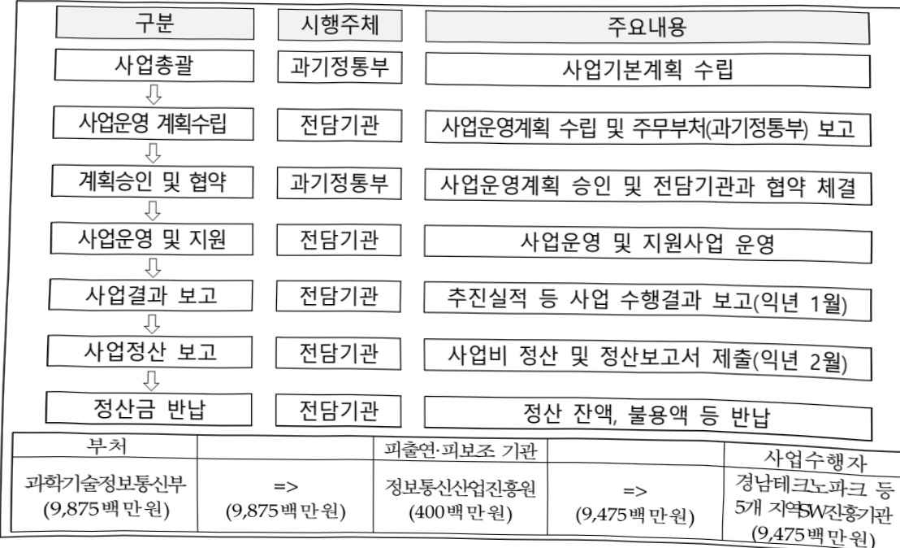

# 제조업 AI융합 기반 조성

**해당 페이지**: PDF 1414 ~ 1420 쪽 해당

**부처**: 과학기술정보통신부
**분야**: 통신
**회계유형**: 지역균형발전 특별회계
**2026 확정예산**: 9875.0 백만원
**전년대비 증감률**: -1.3%
**AI 도메인**: 디지털전환(AX)

---

<table border=1 style='margin: auto; word-wrap: break-word;'><tr><td rowspan="3"></td><td colspan="5">2024</td><td colspan="7">2025(2025년 12월)</td><td rowspan="3">2026예산</td></tr><tr><td rowspan="2">예산액(추경)</td><td rowspan="2">예산현액</td><td rowspan="2">집행액[실집행액]</td><td rowspan="2">이월액</td><td rowspan="2">불용액</td><td rowspan="2">분예산</td><td rowspan="2">예산현액</td><td rowspan="2">집행액[실집행액]</td><td colspan="2">전년도아월액제외</td><td rowspan="2">이월액예산액</td><td rowspan="2">불용예산액</td></tr><tr><td style='text-align: center; word-wrap: break-word;'>예산현액</td><td style='text-align: center; word-wrap: break-word;'>집행액[실집행액]</td></tr><tr><td style='text-align: center; word-wrap: break-word;'>○기능별 분류(합계)</td><td style='text-align: center; word-wrap: break-word;'>10,000</td><td style='text-align: center; word-wrap: break-word;'>10,000</td><td style='text-align: center; word-wrap: break-word;'>10,000[9,995]</td><td style='text-align: center; word-wrap: break-word;'>-</td><td style='text-align: center; word-wrap: break-word;'>-</td><td style='text-align: center; word-wrap: break-word;'>10,000</td><td style='text-align: center; word-wrap: break-word;'>14,000</td><td style='text-align: center; word-wrap: break-word;'>14,000[13,979]</td><td style='text-align: center; word-wrap: break-word;'>14,000</td><td style='text-align: center; word-wrap: break-word;'>14,000[13,979]</td><td style='text-align: center; word-wrap: break-word;'>-</td><td style='text-align: center; word-wrap: break-word;'>-</td><td style='text-align: center; word-wrap: break-word;'>9,875</td></tr><tr><td rowspan="2">·제조업 현안 해결AI오픈랩 구축·운영·제조업 현안 해결AI7술 개발·실증 지원·제조업 AI용합 기반 조성</td><td style='text-align: center; word-wrap: break-word;'>3,000</td><td style='text-align: center; word-wrap: break-word;'>3,000</td><td style='text-align: center; word-wrap: break-word;'>3,000[2,998]</td><td style='text-align: center; word-wrap: break-word;'>-</td><td style='text-align: center; word-wrap: break-word;'>-</td><td style='text-align: center; word-wrap: break-word;'>-</td><td style='text-align: center; word-wrap: break-word;'>-</td><td style='text-align: center; word-wrap: break-word;'>-</td><td style='text-align: center; word-wrap: break-word;'>-</td><td style='text-align: center; word-wrap: break-word;'>-</td><td style='text-align: center; word-wrap: break-word;'>-</td><td style='text-align: center; word-wrap: break-word;'>-</td><td style='text-align: center; word-wrap: break-word;'>-</td></tr><tr><td style='text-align: center; word-wrap: break-word;'>7,000</td><td style='text-align: center; word-wrap: break-word;'>7,000</td><td style='text-align: center; word-wrap: break-word;'>7,000[6,997]</td><td style='text-align: center; word-wrap: break-word;'>-</td><td style='text-align: center; word-wrap: break-word;'>-</td><td style='text-align: center; word-wrap: break-word;'>-</td><td style='text-align: center; word-wrap: break-word;'>10,000</td><td style='text-align: center; word-wrap: break-word;'>14,000</td><td style='text-align: center; word-wrap: break-word;'>14,000[13,979]</td><td style='text-align: center; word-wrap: break-word;'>14,000[13,979]</td><td style='text-align: center; word-wrap: break-word;'>-</td><td style='text-align: center; word-wrap: break-word;'>-</td><td style='text-align: center; word-wrap: break-word;'>-</td></tr><tr><td style='text-align: center; word-wrap: break-word;'>○비목별 분류(합계)</td><td style='text-align: center; word-wrap: break-word;'>10,000</td><td style='text-align: center; word-wrap: break-word;'>10,000</td><td style='text-align: center; word-wrap: break-word;'>10,000[9,995]</td><td style='text-align: center; word-wrap: break-word;'>-</td><td style='text-align: center; word-wrap: break-word;'>-</td><td style='text-align: center; word-wrap: break-word;'>10,000</td><td style='text-align: center; word-wrap: break-word;'>14,000</td><td style='text-align: center; word-wrap: break-word;'>14,000[13,979]</td><td style='text-align: center; word-wrap: break-word;'>14,000[13,979]</td><td style='text-align: center; word-wrap: break-word;'>14,000[13,979]</td><td style='text-align: center; word-wrap: break-word;'>-</td><td style='text-align: center; word-wrap: break-word;'>-</td><td style='text-align: center; word-wrap: break-word;'>9,875</td></tr><tr><td style='text-align: center; word-wrap: break-word;'>·사 업 출 연 금(350-02)</td><td style='text-align: center; word-wrap: break-word;'>10,000</td><td style='text-align: center; word-wrap: break-word;'>10,000</td><td style='text-align: center; word-wrap: break-word;'>10,000[9,995]</td><td style='text-align: center; word-wrap: break-word;'>-</td><td style='text-align: center; word-wrap: break-word;'>-</td><td style='text-align: center; word-wrap: break-word;'>10,000</td><td style='text-align: center; word-wrap: break-word;'>14,000</td><td style='text-align: center; word-wrap: break-word;'>14,000[13,979]</td><td style='text-align: center; word-wrap: break-word;'>14,000[13,979]</td><td style='text-align: center; word-wrap: break-word;'>14,000[13,979]</td><td style='text-align: center; word-wrap: break-word;'>-</td><td style='text-align: center; word-wrap: break-word;'>-</td><td style='text-align: center; word-wrap: break-word;'>9,875</td></tr><tr><td style='text-align: center; word-wrap: break-word;'>○기능비목별 분류(합계)</td><td style='text-align: center; word-wrap: break-word;'>10,000</td><td style='text-align: center; word-wrap: break-word;'>10,000</td><td style='text-align: center; word-wrap: break-word;'>10,000[9,995]</td><td style='text-align: center; word-wrap: break-word;'>-</td><td style='text-align: center; word-wrap: break-word;'>-</td><td style='text-align: center; word-wrap: break-word;'>10,000</td><td style='text-align: center; word-wrap: break-word;'>14,000</td><td style='text-align: center; word-wrap: break-word;'>14,000[13,979]</td><td style='text-align: center; word-wrap: break-word;'>14,000[13,979]</td><td style='text-align: center; word-wrap: break-word;'>14,000[13,979]</td><td style='text-align: center; word-wrap: break-word;'>-</td><td style='text-align: center; word-wrap: break-word;'>-</td><td style='text-align: center; word-wrap: break-word;'>9,875</td></tr><tr><td rowspan="2">·제조업 현안 해결AI오픈랩 구축·운영·사업출연금(350-02)</td><td style='text-align: center; word-wrap: break-word;'>3,000</td><td style='text-align: center; word-wrap: break-word;'>3,000</td><td style='text-align: center; word-wrap: break-word;'>3,000[2,998]</td><td style='text-align: center; word-wrap: break-word;'>-</td><td style='text-align: center; word-wrap: break-word;'>-</td><td style='text-align: center; word-wrap: break-word;'>-</td><td style='text-align: center; word-wrap: break-word;'>-</td><td style='text-align: center; word-wrap: break-word;'>-</td><td style='text-align: center; word-wrap: break-word;'>-</td><td style='text-align: center; word-wrap: break-word;'>-</td><td style='text-align: center; word-wrap: break-word;'>-</td><td style='text-align: center; word-wrap: break-word;'>-</td><td style='text-align: center; word-wrap: break-word;'>-</td></tr><tr><td style='text-align: center; word-wrap: break-word;'>3,000</td><td style='text-align: center; word-wrap: break-word;'>3,000</td><td style='text-align: center; word-wrap: break-word;'>3,000[2,998]</td><td style='text-align: center; word-wrap: break-word;'>-</td><td style='text-align: center; word-wrap: break-word;'>-</td><td style='text-align: center; word-wrap: break-word;'>-</td><td style='text-align: center; word-wrap: break-word;'>-</td><td style='text-align: center; word-wrap: break-word;'>-</td><td style='text-align: center; word-wrap: break-word;'>-</td><td style='text-align: center; word-wrap: break-word;'>-</td><td style='text-align: center; word-wrap: break-word;'>-</td><td style='text-align: center; word-wrap: break-word;'>-</td><td style='text-align: center; word-wrap: break-word;'>-</td></tr><tr><td rowspan="2">·제조업 현안 해결AI7술 개발·실증 지원·사업출연금(350-02)</td><td style='text-align: center; word-wrap: break-word;'>7,000</td><td style='text-align: center; word-wrap: break-word;'>7,000</td><td style='text-align: center; word-wrap: break-word;'>7,000[6,997]</td><td style='text-align: center; word-wrap: break-word;'>-</td><td style='text-align: center; word-wrap: break-word;'>-</td><td style='text-align: center; word-wrap: break-word;'>10,000</td><td style='text-align: center; word-wrap: break-word;'>14,000</td><td style='text-align: center; word-wrap: break-word;'>14,000[13,979]</td><td style='text-align: center; word-wrap: break-word;'>14,000[13,979]</td><td style='text-align: center; word-wrap: break-word;'>14,000[13,979]</td><td style='text-align: center; word-wrap: break-word;'>-</td><td style='text-align: center; word-wrap: break-word;'>-</td><td style='text-align: center; word-wrap: break-word;'>9,875</td></tr><tr><td style='text-align: center; word-wrap: break-word;'>7,000</td><td style='text-align: center; word-wrap: break-word;'>7,000[6,997]</td><td style='text-align: center; word-wrap: break-word;'>-</td><td style='text-align: center; word-wrap: break-word;'>-</td><td style='text-align: center; word-wrap: break-word;'>-</td><td style='text-align: center; word-wrap: break-word;'>10,000</td><td style='text-align: center; word-wrap: break-word;'>14,000</td><td style='text-align: center; word-wrap: break-word;'>14,000[13,979]</td><td style='text-align: center; word-wrap: break-word;'>14,000[13,979]</td><td style='text-align: center; word-wrap: break-word;'>14,000[13,979]</td><td style='text-align: center; word-wrap: break-word;'>-</td><td style='text-align: center; word-wrap: break-word;'>-</td><td style='text-align: center; word-wrap: break-word;'>9,875</td></tr><tr><td style='text-align: center; word-wrap: break-word;'>·제조업 AI용합 기반 조성·사업출연금(350-02)</td><td style='text-align: center; word-wrap: break-word;'>-</td><td style='text-align: center; word-wrap: break-word;'>-</td><td style='text-align: center; word-wrap: break-word;'>-</td><td style='text-align: center; word-wrap: break-word;'>-</td><td style='text-align: center; word-wrap: break-word;'>-</td><td style='text-align: center; word-wrap: break-word;'>10,000</td><td style='text-align: center; word-wrap: break-word;'>14,000</td><td style='text-align: center; word-wrap: break-word;'>14,000[13,979]</td><td style='text-align: center; word-wrap: break-word;'>14,000[13,979]</td><td style='text-align: center; word-wrap: break-word;'>14,000[13,979]</td><td style='text-align: center; word-wrap: break-word;'>-</td><td style='text-align: center; word-wrap: break-word;'>-</td><td style='text-align: center; word-wrap: break-word;'>9,875</td></tr></table>

(단위: 백만원)

□기능별(대역사업별)예산내역

<table border=1 style='margin: auto; word-wrap: break-word;'><tr><td rowspan="2">사업명</td><td rowspan="2">2024년 결산</td><td colspan="2">2025년 예산</td><td colspan="2">2026년 예산</td><td rowspan="2">증감 (B-A)</td><td rowspan="2">(B-A)/A</td></tr><tr><td style='text-align: center; word-wrap: break-word;'>본예산</td><td style='text-align: center; word-wrap: break-word;'>추경 $ ^{*} $(A)</td><td style='text-align: center; word-wrap: break-word;'>요구안</td><td style='text-align: center; word-wrap: break-word;'>본예산(B)</td></tr><tr><td style='text-align: center; word-wrap: break-word;'>제조업 AI융합 기반 조성</td><td style='text-align: center; word-wrap: break-word;'>10,000</td><td style='text-align: center; word-wrap: break-word;'>10,000</td><td style='text-align: center; word-wrap: break-word;'>14,000</td><td style='text-align: center; word-wrap: break-word;'>9,875</td><td style='text-align: center; word-wrap: break-word;'>9,875</td><td style='text-align: center; word-wrap: break-word;'>△125</td><td style='text-align: center; word-wrap: break-word;'>△1.3</td></tr></table>

(단위: 백만원, %)

---

### 나. 사업설명자료

## 1 ) 사업목적·내용

- (제조업 AI융합 기반 조성) 제조데이터를 기반으로 맞춤형 AI융합 솔루션 개발·실증을 지원하여 산업의 현안을 해결하고, AI융합 솔루션의 개발·확산 지원

- 안전예방, 생산성 제고 등 현안 해결이 필요한 제조업계 수요기업의 데이터를 수집·가공하고, AI솔루션을 개발·실증·확산하기 위한 기반 환경 조성

- 수요처 데이터를 기반으로 제조 현장의 현안 해결에 필요한 AI융합 솔루션 개발·실증

## 2 ) 사업개요

## □ 사업근거 및 추진경위

① 법령상 근거 조항 적시

0 정보통신산업진흥법 제27조(사업)

° 정보통신 진흥 및 융합 활성화 등에 관한 특별법 제32조(정보통신융합등 기술·서비스 개발 등의 지원)

0 지방자치분권 및 지역군형발전에 관한 특별법 제14조(지역산업 육성 및 일자리 창출 등 지역경제 활성화 촉진), 제16조(지역과학기술 및 정보통신의 진흥), 제79조(지역지원계정의 세입과 세출)

## ② 추진경위

0 인공지능 지역 확산 추진방향('21.10월, 4차위)

▶ 인공지능 기반 지역경제 재도약과 디지털 대전환 가속화를 위해 과기정통부와 17개 시·도가

협력하여 '인공지능 지역 확산 추진방향' 마련

- 영남권은 제조AI기술을 확보하여 제조 현안 해결 및 지역 주력산업 위기 극복 등 디지털

혁신을 통한 제조업 AI융합 기반 조성 사업 제안

### ° 정부 국정과제('22.5월)

국정과제 77(민·관 협력을 통한 디지털 경제 패권국가 실현)

- (국정과제 주요내용 일부) 전 분야에 AI 전면 적용('22~')을 통해 AI 융합 확산

→ (이행계획) 지역별 강점을 살린 권역별 AI 선도 프로젝트 등 추진

### ° 대한민국 디지털 전략 발표('22.9월, 관계부처합동)

"국민과 함께 세계 모범이 되는 디지털 강국 대한민국 실현"

• 뉴욕구상에 담긴 기조와 철학을 반영하여, 5대 전략 19대 세부과제 제시

② 충분한 디지털 자원 확보

- (융합) 국민 일상 속 'AI 융합시대 본격화'

---

0 인공지능 일상화 및 산업고도화 계획 발표('23.1월, 과학기술정보통신부)

국민과 디지털혜택 공유, 대규모 인공지능 수요창출, 산업혁신을 위한 인공지능사업 추진

국민 일상생활, 공공영역, 전산업 분야로 인공지능 전면 확산

○ AI 일상화를 위한 '24년 국민·산업·공공 프로젝트 추진계획 발표('24.4월, 관계부처합동)

국가 전반의 AI 활용도 제고와 국민체감 확산

- (제소·공성) 공성효율 향상·비용절감 기여, AI 채용 채용서비스 창출 기여

° AI 3강 도약을 위한 정책 과제 발표(대선공약('25.5) 및 국정과제(안)('25.8))

• 인공지능 대전환(AX)으로 혁신 생태계 구축 및 일자리 창출

- 제조AI 등 산업별 융합 촉진, 인공지능 활용 선도사업 추진 및 확산 기반 조성

국정과제(안) 21. 세계에서 AI를 가장 잘 쓰는 나라 구현

## □ 주요내용

① 사업규모

- 총사업비(해당되는 경우에만 기재) : 해당없음

- 사업기간 : 2024 ~ 2026(3년)

-최근 5년 간 투입된 사업비(예산액기준, 추경편성한 연도에는 추경포함)

<table border=1 style='margin: auto; word-wrap: break-word;'><tr><td style='text-align: center; word-wrap: break-word;'>연도</td><td style='text-align: center; word-wrap: break-word;'>2022</td><td style='text-align: center; word-wrap: break-word;'>2023</td><td style='text-align: center; word-wrap: break-word;'>2024</td><td style='text-align: center; word-wrap: break-word;'>2025</td><td style='text-align: center; word-wrap: break-word;'>2026(안)</td></tr><tr><td style='text-align: center; word-wrap: break-word;'>사업비</td><td style='text-align: center; word-wrap: break-word;'>-</td><td style='text-align: center; word-wrap: break-word;'>-</td><td style='text-align: center; word-wrap: break-word;'>10,000</td><td style='text-align: center; word-wrap: break-word;'>14,000</td><td style='text-align: center; word-wrap: break-word;'>9,875</td></tr></table>

- 기타 : (지방비 매칭) 국비 : 지방비 = 2 : 1

② 사업추진체계

- 사업시행방법 : 출연

- 사업시행주체 : 정보통신산업진흥원

- 사업 수혜자 : AI기업 및 수요처

- 보조, 융자, 출연, 출자 등의 경우 보조·융자 등 지원 비율 및 법적근거

<table border=1 style='margin: auto; word-wrap: break-word;'><tr><td style='text-align: center; word-wrap: break-word;'>내역사업명</td><td style='text-align: center; word-wrap: break-word;'>구분</td><td style='text-align: center; word-wrap: break-word;'>피보조·피출연 등 기관명</td><td style='text-align: center; word-wrap: break-word;'>지원 금액 (2026예산)</td><td style='text-align: center; word-wrap: break-word;'>지원 비율(%)</td><td style='text-align: center; word-wrap: break-word;'>보조율 법적근거 (해당 조항)</td></tr><tr><td style='text-align: center; word-wrap: break-word;'>제조업 AI·융합 기반 조성</td><td style='text-align: center; word-wrap: break-word;'>출연</td><td style='text-align: center; word-wrap: break-word;'>정보통신 산업진흥원</td><td style='text-align: center; word-wrap: break-word;'>9,875백만원</td><td style='text-align: center; word-wrap: break-word;'>100</td><td style='text-align: center; word-wrap: break-word;'>정보통신산업진흥법 제27조, 정보통신 진흥 및 융합 활성화 등에 관한 특별법 제32조, 지방자치 분권 및 지역균형발전에 관한 특별법 제14조</td></tr></table>

---

3) 2026년도 예산 산출 근거

① 제조업 AI융합 기반 조성 : (2025 추경) 14,000백만원 → (2026 예산안) 9,875백만원, △4,125백만원 (2025 본예산 10,000백만원 → 제2회 추경 14,000백만원)

- (요구) 수요맞춤형 AI기술 개발·실증 과제 종료에 따른 순감, 확산거점형 과제 복합모델 추가 개발, 고도화 및 실증을 위한 단가 확대 등 '25년 대비 △1.3% 감액 요구

- (산출) ① AI오픈랩 고도화·운영 1,000백만원, ② 제조업 현안 해결 AI기술 개발·실증 지원 8,875백만원

① AI오픈랩 고도화·운영 : 1,000백만원 = 5식 × 200백만원

② 제조업 현안 해결 AI기술 개발·실증 지원 : 8,875백만원

-광역연계형 2,800백만원, 확산거점형 6,075백만원

2025년도 추가경정예산 및 2026년도 예산안 산출 세부내역 비교

<table border=1 style='margin: auto; word-wrap: break-word;'><tr><td colspan="2">2025년 제2회 추가경쟁예산</td><td colspan="2">2026년 예산안</td><td style='text-align: center; word-wrap: break-word;'></td></tr><tr><td style='text-align: center; word-wrap: break-word;'>예산</td><td style='text-align: center; word-wrap: break-word;'>산출내역</td><td style='text-align: center; word-wrap: break-word;'>예산</td><td style='text-align: center; word-wrap: break-word;'>산출내역</td><td style='text-align: center; word-wrap: break-word;'></td></tr><tr><td style='text-align: center; word-wrap: break-word;'>14,000</td><td style='text-align: center; word-wrap: break-word;'>&lt; 제조업 AI융합 기반 조성 14,000백만원 &gt; 가. 제조업 AI융합기반 조성 (14,000백만원) - 제조업 현안 해결 AI오픈램 구축·운영(1,500백만원) • AI오픈램 고도화·운영 : 5식 × 300백만원 = 1,500백만원 - 제조업 현안 해결 AI기술 개발·실증 지원(8,500백만원) • 수요맞춤형 제조업 현안해결 AI기술 개발 및 고도화 : 25건 × 120백만원 = 3,000백만원 • 광역연계형 제조업 현안해결 AI기술 개발 및 실증 : 10건 × 280백만원 = 2,800백만원 • 확산거점형 제조업 현안해결 AI기술 개발 및 실증 : 15건 × 180백만원 = 2,700백만원</td><td style='text-align: center; word-wrap: break-word;'>9,875</td><td style='text-align: center; word-wrap: break-word;'>&lt; 제조업 AI융합 기반 조성 9,875백만원 &gt; 가. 제조업 AI융합기반 조성 (9,875백만원) - 제조업 현안 해결 AI오픈램 구축·운영(1,000백만원) • AI오픈램 고도화·운영 : 5식 × 200백만원 = 1,000백만원 - 제조업 현안 해결 AI기술 개발·실증 지원(8,875백만원) • 광역연계형 제조업 현안해결 AI기술 개발 및 실증 : 10건 × 280백만원 = 2,800백만원 • 확산거점형 제조업 현안해결 AI기술 개발 및 실증 : 15건 × 180백만원 = 2,700백만원</td><td style='text-align: center; word-wrap: break-word;'>9,875</td></tr></table>

## 4 ) 사업효과

☐ 사업영향, 산출물 성과지표 등

① 2022~2026년도 성과계획서 상 성과지표 및 최근 5년간 성과 달성도

<table border=1 style='margin: auto; word-wrap: break-word;'><tr><td style='text-align: center; word-wrap: break-word;'>성과지표</td><td style='text-align: center; word-wrap: break-word;'>구분</td><td style='text-align: center; word-wrap: break-word;'>2022</td><td style='text-align: center; word-wrap: break-word;'>2023</td><td style='text-align: center; word-wrap: break-word;'>2024</td><td style='text-align: center; word-wrap: break-word;'>2025</td><td style='text-align: center; word-wrap: break-word;'>2026</td><td style='text-align: center; word-wrap: break-word;'>2026 목표치산출근거</td><td style='text-align: center; word-wrap: break-word;'>측정산식(또는 측정방법)</td><td style='text-align: center; word-wrap: break-word;'>자료수집방법(또는 자료출처)</td></tr><tr><td rowspan="3">생산성 향상률(단위: %)</td><td style='text-align: center; word-wrap: break-word;'>목표</td><td style='text-align: center; word-wrap: break-word;'>-</td><td style='text-align: center; word-wrap: break-word;'>-</td><td style='text-align: center; word-wrap: break-word;'>5</td><td style='text-align: center; word-wrap: break-word;'>6.5</td><td style='text-align: center; word-wrap: break-word;'>7</td><td rowspan="3">최종 목표(7%, 유사사업 참고) 달성을 위해 단계별 상향</td><td rowspan="3">AI 도입 전생산성 평균/AI 도입 후 생산성 평균 x 100%</td><td rowspan="3">전문 시험기관 측정</td></tr><tr><td style='text-align: center; word-wrap: break-word;'>실적</td><td style='text-align: center; word-wrap: break-word;'>-</td><td style='text-align: center; word-wrap: break-word;'>-</td><td style='text-align: center; word-wrap: break-word;'>6.84</td><td style='text-align: center; word-wrap: break-word;'>8.49</td><td style='text-align: center; word-wrap: break-word;'>-</td></tr><tr><td style='text-align: center; word-wrap: break-word;'>달성도</td><td style='text-align: center; word-wrap: break-word;'>-</td><td style='text-align: center; word-wrap: break-word;'>-</td><td style='text-align: center; word-wrap: break-word;'>1.37</td><td style='text-align: center; word-wrap: break-word;'>1.31</td><td style='text-align: center; word-wrap: break-word;'>-</td></tr><tr><td rowspan="3">수요기업 만족도(단위: 점)</td><td style='text-align: center; word-wrap: break-word;'>목표</td><td style='text-align: center; word-wrap: break-word;'>-</td><td style='text-align: center; word-wrap: break-word;'>-</td><td style='text-align: center; word-wrap: break-word;'>83</td><td style='text-align: center; word-wrap: break-word;'>87</td><td style='text-align: center; word-wrap: break-word;'>91</td><td rowspan="3">전년 실적 대비 5% 상향 설정</td><td rowspan="3">지원사업 수요기업 총 만족도/설문 참여기업 수</td><td rowspan="3">설문조사</td></tr><tr><td style='text-align: center; word-wrap: break-word;'>실적</td><td style='text-align: center; word-wrap: break-word;'>-</td><td style='text-align: center; word-wrap: break-word;'>-</td><td style='text-align: center; word-wrap: break-word;'>89.3</td><td style='text-align: center; word-wrap: break-word;'>87.5</td><td style='text-align: center; word-wrap: break-word;'>-</td></tr><tr><td style='text-align: center; word-wrap: break-word;'>달성도</td><td style='text-align: center; word-wrap: break-word;'>-</td><td style='text-align: center; word-wrap: break-word;'>-</td><td style='text-align: center; word-wrap: break-word;'>1.08</td><td style='text-align: center; word-wrap: break-word;'>1.01</td><td style='text-align: center; word-wrap: break-word;'>-</td></tr></table>

---

② 성과지표 이외의 연도별 사업추진 경과 및 실적

<table border=1 style='margin: auto; word-wrap: break-word;'><tr><td style='text-align: center; word-wrap: break-word;'>2024</td><td style='text-align: center; word-wrap: break-word;'>○ 총괄운영기관(주관기관) 공모·선정 및 협약 체결(&#x27;24.3~4)○ 수요맞춤형 AI솔루션 개발·실증 신규 과제 25개 컨소시엄 공모·선정 및 협약 체결(&#x27;24.6~7)○ 제조업 현안해결 AI오픈랩 구축(5개소)</td></tr><tr><td style='text-align: center; word-wrap: break-word;'>2025</td><td style='text-align: center; word-wrap: break-word;'>○ 총괄운영기관(주관기관) 협약 체결(&#x27;25.3)○ 수요맞춤형 AI솔루션 개발·실증 계속 과제 25개 컨소시엄 협약 체결(&#x27;25.4)○ 광역연계형·확산거점형 AI솔루션 개발·실증 신규 과제 공모·선정 및 협약 체결(&#x27;25.4~5)○ 제조업 현안해결 AI오픈랩 고도화(1건)</td></tr></table>

③향후(2026년도 이후)기대효과

지역별 중점산업 특화 AI융합 확산 거점의 AI기술개발 지원 및 AI모델 확산 환경 조성 등 기능 고도화('25)를 통한 AI모델 및 데이터 활용·확산

○ AI개발기업의 제조AI 기술 개발·실증 지원을 통한 AI기술력 향상 및 제조기업의 AI기술 도입으로 제조현안 해결을 통한 생산성 7% 향상 등 부가가치 유발

5) 타당성조사 및 예비타당성조사 시행여부 및 결과 요지 : 해당없음

6) 총사업비 대상사업 여부 및 내역 : 해당없음

## 7 ) 사업 집행절차

---

## 8 ) 각종 평가

1) 2024년도 지역군형발전사업 중합평가 결과

○ (최종의견 및 점수) 87점

### 다. 최근 4년간 결산내역

## 1 ) 결산표

☐ 부처 결산내역

(단위: 백만원, %)

<table border=1 style='margin: auto; word-wrap: break-word;'><tr><td rowspan="2">闰五</td><td colspan="3">예산액</td><td rowspan="2">전년도 이월액</td><td rowspan="2">이·전용 등</td><td rowspan="2">예비비</td><td rowspan="2">예산 현액(B)</td><td rowspan="2">집행액(C)</td><td rowspan="2">집행률(C/A)</td><td rowspan="2">집행률(C/B)</td><td rowspan="2">다음연도 이월액</td><td rowspan="2">불용액</td></tr><tr><td style='text-align: center; word-wrap: break-word;'>본예산</td><td style='text-align: center; word-wrap: break-word;'>추경 중감액</td><td style='text-align: center; word-wrap: break-word;'>추경(A)</td></tr><tr><td style='text-align: center; word-wrap: break-word;'>2022</td><td style='text-align: center; word-wrap: break-word;'>-</td><td style='text-align: center; word-wrap: break-word;'>-</td><td style='text-align: center; word-wrap: break-word;'>-</td><td style='text-align: center; word-wrap: break-word;'>-</td><td style='text-align: center; word-wrap: break-word;'>-</td><td style='text-align: center; word-wrap: break-word;'>-</td><td style='text-align: center; word-wrap: break-word;'>-</td><td style='text-align: center; word-wrap: break-word;'>-</td><td style='text-align: center; word-wrap: break-word;'>-</td><td style='text-align: center; word-wrap: break-word;'>-</td><td style='text-align: center; word-wrap: break-word;'>-</td><td style='text-align: center; word-wrap: break-word;'>-</td></tr><tr><td style='text-align: center; word-wrap: break-word;'>2023</td><td style='text-align: center; word-wrap: break-word;'>-</td><td style='text-align: center; word-wrap: break-word;'>-</td><td style='text-align: center; word-wrap: break-word;'>-</td><td style='text-align: center; word-wrap: break-word;'>-</td><td style='text-align: center; word-wrap: break-word;'>-</td><td style='text-align: center; word-wrap: break-word;'>-</td><td style='text-align: center; word-wrap: break-word;'>-</td><td style='text-align: center; word-wrap: break-word;'>-</td><td style='text-align: center; word-wrap: break-word;'>-</td><td style='text-align: center; word-wrap: break-word;'>-</td><td style='text-align: center; word-wrap: break-word;'>-</td><td style='text-align: center; word-wrap: break-word;'>-</td></tr><tr><td style='text-align: center; word-wrap: break-word;'>2024</td><td style='text-align: center; word-wrap: break-word;'>10,000</td><td style='text-align: center; word-wrap: break-word;'>-</td><td style='text-align: center; word-wrap: break-word;'>10,000</td><td style='text-align: center; word-wrap: break-word;'>-</td><td style='text-align: center; word-wrap: break-word;'>-</td><td style='text-align: center; word-wrap: break-word;'>-</td><td style='text-align: center; word-wrap: break-word;'>10,000</td><td style='text-align: center; word-wrap: break-word;'>10,000</td><td style='text-align: center; word-wrap: break-word;'>100</td><td style='text-align: center; word-wrap: break-word;'>100</td><td style='text-align: center; word-wrap: break-word;'>-</td><td style='text-align: center; word-wrap: break-word;'>-</td></tr><tr><td style='text-align: center; word-wrap: break-word;'>2025</td><td style='text-align: center; word-wrap: break-word;'>10,000</td><td style='text-align: center; word-wrap: break-word;'>4,000</td><td style='text-align: center; word-wrap: break-word;'>14,000</td><td style='text-align: center; word-wrap: break-word;'>-</td><td style='text-align: center; word-wrap: break-word;'>-</td><td style='text-align: center; word-wrap: break-word;'>-</td><td style='text-align: center; word-wrap: break-word;'>14,000</td><td style='text-align: center; word-wrap: break-word;'>14,000</td><td style='text-align: center; word-wrap: break-word;'>100</td><td style='text-align: center; word-wrap: break-word;'>100</td><td style='text-align: center; word-wrap: break-word;'>-</td><td style='text-align: center; word-wrap: break-word;'>-</td></tr></table>

## 2 ) 주요 결산사항

□ 2022~2025년 결산 주요사항 : 해당없음

2025년 이·전용 등 세부내역 : 해당없음

---

<table border=1 style='margin: auto; word-wrap: break-word;'><tr><td style='text-align: center; word-wrap: break-word;'>사 업 명</td></tr><tr><td style='text-align: center; word-wrap: break-word;'>(141) 지능형 홈 산업 육성 (2033-378)</td></tr></table>

사업 코드 정보

<table border=1 style='margin: auto; word-wrap: break-word;'><tr><td style='text-align: center; word-wrap: break-word;'>구분</td><td style='text-align: center; word-wrap: break-word;'>회계</td><td style='text-align: center; word-wrap: break-word;'>소관</td><td style='text-align: center; word-wrap: break-word;'>실국(기관)</td><td style='text-align: center; word-wrap: break-word;'>계정</td><td style='text-align: center; word-wrap: break-word;'>분야</td><td style='text-align: center; word-wrap: break-word;'>부문</td></tr><tr><td style='text-align: center; word-wrap: break-word;'>코드</td><td rowspan="2">일반회계</td><td rowspan="2">과학기술정보통신부</td><td rowspan="2">정보보호네트워크정책관</td><td rowspan="2">-</td><td rowspan="2">130통신</td><td rowspan="2">133정보통신</td></tr><tr><td style='text-align: center; word-wrap: break-word;'>명칭</td></tr></table>

<table border=1 style='margin: auto; word-wrap: break-word;'><tr><td style='text-align: center; word-wrap: break-word;'>구분</td><td style='text-align: center; word-wrap: break-word;'>프로그램</td><td style='text-align: center; word-wrap: break-word;'>단위사업</td><td style='text-align: center; word-wrap: break-word;'>세부사업</td></tr><tr><td style='text-align: center; word-wrap: break-word;'>코드</td><td style='text-align: center; word-wrap: break-word;'>2000</td><td style='text-align: center; word-wrap: break-word;'>2033</td><td style='text-align: center; word-wrap: break-word;'>378</td></tr><tr><td style='text-align: center; word-wrap: break-word;'>명칭</td><td style='text-align: center; word-wrap: break-word;'>인터넷융합산업</td><td style='text-align: center; word-wrap: break-word;'>스마트화산업기반확충(일반)</td><td style='text-align: center; word-wrap: break-word;'>지능형 홈 산업 육성</td></tr></table>

□ 사업 성격 (공통요구자료 Ⅱ-1 작성유의사항 4. 참조, 해당하는 사항에 “○” 표시)

<table border=1 style='margin: auto; word-wrap: break-word;'><tr><td rowspan="2">신규</td><td rowspan="2">계속</td><td rowspan="2">완료</td><td rowspan="2">예비타당성 실시여부</td><td rowspan="2">총사업비 관리대상</td><td rowspan="2">총액계상 예산사업</td><td style='text-align: center; word-wrap: break-word;'>사업소관 변경정보</td></tr><tr><td style='text-align: center; word-wrap: break-word;'>2025예산 시 소관</td></tr><tr><td style='text-align: center; word-wrap: break-word;'></td><td style='text-align: center; word-wrap: break-word;'>○</td><td style='text-align: center; word-wrap: break-word;'></td><td style='text-align: center; word-wrap: break-word;'></td><td style='text-align: center; word-wrap: break-word;'></td><td style='text-align: center; word-wrap: break-word;'></td><td style='text-align: center; word-wrap: break-word;'></td></tr></table>

사업 지원 형태 및 지원을 (최소한 한 개는 반드시 선택하시오. 해당사항에 O 표시)

<table border=1 style='margin: auto; word-wrap: break-word;'><tr><td style='text-align: center; word-wrap: break-word;'>직접</td><td style='text-align: center; word-wrap: break-word;'>출자</td><td style='text-align: center; word-wrap: break-word;'>출연</td><td style='text-align: center; word-wrap: break-word;'>보조</td><td style='text-align: center; word-wrap: break-word;'>융자</td><td style='text-align: center; word-wrap: break-word;'>국고보조율(%)</td><td style='text-align: center; word-wrap: break-word;'>융자율(%)</td></tr><tr><td style='text-align: center; word-wrap: break-word;'></td><td style='text-align: center; word-wrap: break-word;'></td><td style='text-align: center; word-wrap: break-word;'>○</td><td style='text-align: center; word-wrap: break-word;'></td><td style='text-align: center; word-wrap: break-word;'></td><td style='text-align: center; word-wrap: break-word;'></td><td style='text-align: center; word-wrap: break-word;'></td></tr></table>

사업 소관부처 및 시행주체

<table border=1 style='margin: auto; word-wrap: break-word;'><tr><td style='text-align: center; word-wrap: break-word;'>사업명</td><td colspan="2">구분</td></tr><tr><td rowspan="3">지능형 홈 산업 육성</td><td rowspan="2">소관부처</td><td style='text-align: center; word-wrap: break-word;'>정보보호네트워크정책실 정보보호네트워크정책관</td></tr><tr><td style='text-align: center; word-wrap: break-word;'>디지털기반안전과</td></tr><tr><td style='text-align: center; word-wrap: break-word;'>사업시행주체</td><td style='text-align: center; word-wrap: break-word;'>정보통신산업진흥원</td></tr></table>

---

### 원본 PDF 크롭 이미지

