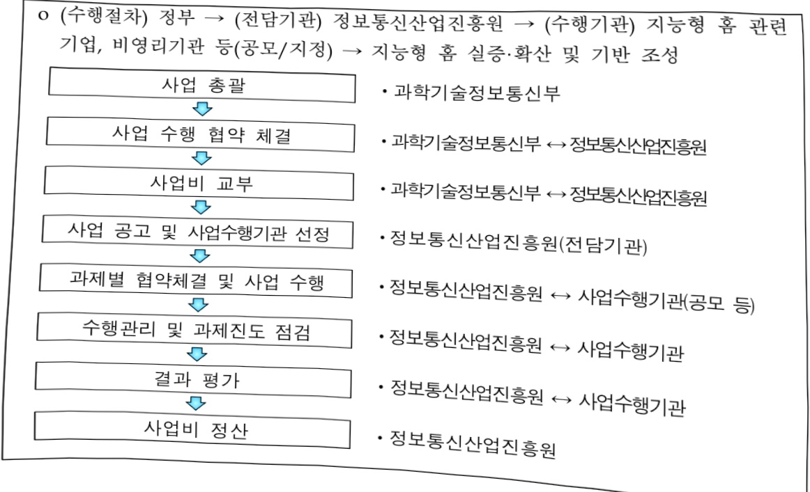

# 지능형 홈 산업 육성

**해당 페이지**: PDF 1421 ~ 1427 쪽 해당

**부처**: 과학기술정보통신부
**분야**: 통신
**회계유형**: 일반회계
**2026 확정예산**: 3360.0 백만원
**전년대비 증감률**: None%
**AI 도메인**: 피지컬AI/디바이스

---

<table border=1 style='margin: auto; word-wrap: break-word;'><tr><td style='text-align: center; word-wrap: break-word;'>사 업 명</td></tr><tr><td style='text-align: center; word-wrap: break-word;'>(141) 지능형 홈 산업 육성 (2033-378)</td></tr></table>

사업 코드 정보

<table border=1 style='margin: auto; word-wrap: break-word;'><tr><td style='text-align: center; word-wrap: break-word;'>구분</td><td style='text-align: center; word-wrap: break-word;'>회계</td><td style='text-align: center; word-wrap: break-word;'>소관</td><td style='text-align: center; word-wrap: break-word;'>실국(기관)</td><td style='text-align: center; word-wrap: break-word;'>계정</td><td style='text-align: center; word-wrap: break-word;'>분야</td><td style='text-align: center; word-wrap: break-word;'>부문</td></tr><tr><td style='text-align: center; word-wrap: break-word;'>코드</td><td rowspan="2">일반회계</td><td rowspan="2">과학기술정보통신부</td><td rowspan="2">정보보호네트워크정책관</td><td rowspan="2">-</td><td rowspan="2">130통신</td><td rowspan="2">133정보통신</td></tr><tr><td style='text-align: center; word-wrap: break-word;'>명칭</td></tr></table>

<table border=1 style='margin: auto; word-wrap: break-word;'><tr><td style='text-align: center; word-wrap: break-word;'>구분</td><td style='text-align: center; word-wrap: break-word;'>프로그램</td><td style='text-align: center; word-wrap: break-word;'>단위사업</td><td style='text-align: center; word-wrap: break-word;'>세부사업</td></tr><tr><td style='text-align: center; word-wrap: break-word;'>코드</td><td style='text-align: center; word-wrap: break-word;'>2000</td><td style='text-align: center; word-wrap: break-word;'>2033</td><td style='text-align: center; word-wrap: break-word;'>378</td></tr><tr><td style='text-align: center; word-wrap: break-word;'>명칭</td><td style='text-align: center; word-wrap: break-word;'>인터넷융합산업</td><td style='text-align: center; word-wrap: break-word;'>스마트화산업기반확충(일반)</td><td style='text-align: center; word-wrap: break-word;'>지능형 홈 산업 육성</td></tr></table>

□ 사업 성격 (공통요구자료 Ⅱ-1 작성유의사항 4. 참조, 해당하는 사항에 “○” 표시)

<table border=1 style='margin: auto; word-wrap: break-word;'><tr><td rowspan="2">신규</td><td rowspan="2">계속</td><td rowspan="2">완료</td><td rowspan="2">예비타당성 실시여부</td><td rowspan="2">총사업비 관리대상</td><td rowspan="2">총액계상 예산사업</td><td style='text-align: center; word-wrap: break-word;'>사업소관 변경정보</td></tr><tr><td style='text-align: center; word-wrap: break-word;'>2025예산 시 소관</td></tr><tr><td style='text-align: center; word-wrap: break-word;'></td><td style='text-align: center; word-wrap: break-word;'>○</td><td style='text-align: center; word-wrap: break-word;'></td><td style='text-align: center; word-wrap: break-word;'></td><td style='text-align: center; word-wrap: break-word;'></td><td style='text-align: center; word-wrap: break-word;'></td><td style='text-align: center; word-wrap: break-word;'></td></tr></table>

사업 지원 형태 및 지원을 (최소한 한 개는 반드시 선택하시오. 해당사항에 O 표시)

<table border=1 style='margin: auto; word-wrap: break-word;'><tr><td style='text-align: center; word-wrap: break-word;'>직접</td><td style='text-align: center; word-wrap: break-word;'>출자</td><td style='text-align: center; word-wrap: break-word;'>출연</td><td style='text-align: center; word-wrap: break-word;'>보조</td><td style='text-align: center; word-wrap: break-word;'>융자</td><td style='text-align: center; word-wrap: break-word;'>국고보조율(%)</td><td style='text-align: center; word-wrap: break-word;'>융자율(%)</td></tr><tr><td style='text-align: center; word-wrap: break-word;'></td><td style='text-align: center; word-wrap: break-word;'></td><td style='text-align: center; word-wrap: break-word;'>○</td><td style='text-align: center; word-wrap: break-word;'></td><td style='text-align: center; word-wrap: break-word;'></td><td style='text-align: center; word-wrap: break-word;'></td><td style='text-align: center; word-wrap: break-word;'></td></tr></table>

사업 소관부처 및 시행주체

<table border=1 style='margin: auto; word-wrap: break-word;'><tr><td style='text-align: center; word-wrap: break-word;'>사업명</td><td colspan="2">구분</td></tr><tr><td rowspan="3">지능형 홈 산업 육성</td><td rowspan="2">소관부처</td><td style='text-align: center; word-wrap: break-word;'>정보보호네트워크정책실 정보보호네트워크정책관</td></tr><tr><td style='text-align: center; word-wrap: break-word;'>디지털기반안전과</td></tr><tr><td style='text-align: center; word-wrap: break-word;'>사업시행주체</td><td style='text-align: center; word-wrap: break-word;'>정보통신산업진흥원</td></tr></table>

---

### 가. 예산 총괄표

(단위: 백만원, %)

<table border=1 style='margin: auto; word-wrap: break-word;'><tr><td rowspan="2">사업명</td><td rowspan="2">2024년 결산</td><td colspan="2">2025년 예산</td><td colspan="2">2026년 예산</td><td rowspan="2">중감(B-A)</td><td rowspan="2">(B-A)/A</td></tr><tr><td style='text-align: center; word-wrap: break-word;'>본예산</td><td style='text-align: center; word-wrap: break-word;'>추경*(A)</td><td style='text-align: center; word-wrap: break-word;'>요구안</td><td style='text-align: center; word-wrap: break-word;'>본예산(B)</td></tr><tr><td style='text-align: center; word-wrap: break-word;'>지능형 홈 산업 육성</td><td style='text-align: center; word-wrap: break-word;'>3,900</td><td style='text-align: center; word-wrap: break-word;'>3,900</td><td style='text-align: center; word-wrap: break-word;'>-</td><td style='text-align: center; word-wrap: break-word;'>3,360</td><td style='text-align: center; word-wrap: break-word;'>3,360</td><td style='text-align: center; word-wrap: break-word;'>△540</td><td style='text-align: center; word-wrap: break-word;'>△13.8%</td></tr></table>

* 추경: 추경증감액을 포함한 최종 예산액을 기재

## □ 기능별(내역사업별) 예산 내역

(단위:백만원)

<table border=1 style='margin: auto; word-wrap: break-word;'><tr><td rowspan="2"></td><td colspan="5">2024</td><td colspan="5">2025</td><td style='text-align: center; word-wrap: break-word;'>2026</td></tr><tr><td style='text-align: center; word-wrap: break-word;'>예산액(추경)</td><td style='text-align: center; word-wrap: break-word;'>예산현액</td><td style='text-align: center; word-wrap: break-word;'>집행액</td><td style='text-align: center; word-wrap: break-word;'>이월액</td><td style='text-align: center; word-wrap: break-word;'>불용액</td><td style='text-align: center; word-wrap: break-word;'>예산액(추경)</td><td style='text-align: center; word-wrap: break-word;'>예산현액</td><td style='text-align: center; word-wrap: break-word;'>집행액</td><td style='text-align: center; word-wrap: break-word;'>이월액</td><td style='text-align: center; word-wrap: break-word;'>불용액</td><td style='text-align: center; word-wrap: break-word;'>예산</td></tr><tr><td style='text-align: center; word-wrap: break-word;'>○ 기능별 분류(합계)</td><td style='text-align: center; word-wrap: break-word;'>3,900</td><td style='text-align: center; word-wrap: break-word;'>3,900</td><td style='text-align: center; word-wrap: break-word;'>3,900</td><td style='text-align: center; word-wrap: break-word;'>-</td><td style='text-align: center; word-wrap: break-word;'>-</td><td style='text-align: center; word-wrap: break-word;'>3,900</td><td style='text-align: center; word-wrap: break-word;'>3,900</td><td style='text-align: center; word-wrap: break-word;'>3,900</td><td style='text-align: center; word-wrap: break-word;'>-</td><td style='text-align: center; word-wrap: break-word;'>-</td><td style='text-align: center; word-wrap: break-word;'>3,360</td></tr><tr><td style='text-align: center; word-wrap: break-word;'>• 지능형 홈 실증 확산</td><td style='text-align: center; word-wrap: break-word;'>2,500</td><td style='text-align: center; word-wrap: break-word;'>2,500</td><td style='text-align: center; word-wrap: break-word;'>2,500</td><td style='text-align: center; word-wrap: break-word;'>-</td><td style='text-align: center; word-wrap: break-word;'>-</td><td style='text-align: center; word-wrap: break-word;'>2,500</td><td style='text-align: center; word-wrap: break-word;'>2,500</td><td style='text-align: center; word-wrap: break-word;'>2,500</td><td style='text-align: center; word-wrap: break-word;'>-</td><td style='text-align: center; word-wrap: break-word;'>-</td><td style='text-align: center; word-wrap: break-word;'>1,960</td></tr><tr><td style='text-align: center; word-wrap: break-word;'>• 지능형 홈 기반 조성</td><td style='text-align: center; word-wrap: break-word;'>1,400</td><td style='text-align: center; word-wrap: break-word;'>1,400</td><td style='text-align: center; word-wrap: break-word;'>1,400</td><td style='text-align: center; word-wrap: break-word;'>-</td><td style='text-align: center; word-wrap: break-word;'>-</td><td style='text-align: center; word-wrap: break-word;'>1,400</td><td style='text-align: center; word-wrap: break-word;'>1,400</td><td style='text-align: center; word-wrap: break-word;'>1,400</td><td style='text-align: center; word-wrap: break-word;'>-</td><td style='text-align: center; word-wrap: break-word;'>-</td><td style='text-align: center; word-wrap: break-word;'>1,400</td></tr></table>

### 나. 사업설명자료

## 1 ) 사업목적·내용

- (지능형 홈 산업 육성) 홈 IoT 기기들의 자유로운 연결과 인공지능 기반의 고체감 홈 서비스를 구현, 지능형 홈 생태계 조성을 통해 고부가 신시장 창출 및 국민 삶의 질 제고

- (지능형 홈 실증·확산) 기기 간 호환성을 보장하는 국제표준과 인공지능 기반의 개인

맞춤형 고체감 지능형 홈 서비스 개발 및 실증

- (지능형 홈 기반 조성) 중소 디바이스 기업 글로벌 진출과 지능형 홈 협력 생태계 조성을 위한 글로벌 표준 국제공인시험인증기관 및 얼라이언스 구축·운영

## 2 ) 사업개요

## ☐ 사업근거 및 추진경위

① 법령상 근거 및 조항 적시

- 정보통신산업진흥법 제26조(정보통신산업진흥원의 설립 등), 제27조(사업), 제28조(재원 등)

- 정보통신 진흥 및 융합 활성화 등에 관한 특별법 제32조(정보통신융합등 기술·서비스 개발 등의 지원)

---

## ② 추진경위

- '14.05. : 사물인터넷 기본계획 발표(정보통신전략위원회)

- '15.03. : K-ICT 전략 발표(미래창조과학부)

- '15.12 : K-ICT 사물인터넷 확산 전략 발표(정보통신전략위원회)

- '17.12 : 4차 산업혁명 대비 초연결 지능형 네트워크 구축 전략

- '19.04 : 혁신성장 실현을 위한 5G+ 전략(관계부처 합동)

- '23.08 : 지능형 홈(AI@Home) 구축·확산 방안(관계부처 합동)

- '23.09 : 전국민 인공지능 일상화 실행계획(관계부처 합동)

- '24.04 : AI 반도체 이니셔티브(관계부처 합동)

## 주요내용

① 사업규모

- 총사업비(해당되는 경우에만 기재) : 해당없음

- 사업기간 : '24년~계속

-최근 5년 간 투입된 사업비(예산액기준, 추경편성한 연도에는 추경포함)

<table border=1 style='margin: auto; word-wrap: break-word;'><tr><td style='text-align: center; word-wrap: break-word;'>연도</td><td style='text-align: center; word-wrap: break-word;'>2022</td><td style='text-align: center; word-wrap: break-word;'>2023</td><td style='text-align: center; word-wrap: break-word;'>2024</td><td style='text-align: center; word-wrap: break-word;'>2025</td><td style='text-align: center; word-wrap: break-word;'>2026</td></tr><tr><td style='text-align: center; word-wrap: break-word;'>사업비</td><td style='text-align: center; word-wrap: break-word;'>-</td><td style='text-align: center; word-wrap: break-word;'>-</td><td style='text-align: center; word-wrap: break-word;'>3,900</td><td style='text-align: center; word-wrap: break-word;'>3,900</td><td style='text-align: center; word-wrap: break-word;'>3,360</td></tr></table>

- 기타: 해당없음

② 사업추진체계

- 사업시행방법 : 출연

-사업시행주체:정보통신산업진흥원

-사업 수혜자 : 지능형 홈 관련 기업, 기타 비영리기관 등

- 보조, 융자, 출연, 출자 등의 경우 보조·융자 등 지원 비율 및 법적근거

<table border=1 style='margin: auto; word-wrap: break-word;'><tr><td style='text-align: center; word-wrap: break-word;'>내역사업명</td><td style='text-align: center; word-wrap: break-word;'>구분</td><td style='text-align: center; word-wrap: break-word;'>피보조·피출연 등 기관명</td><td style='text-align: center; word-wrap: break-word;'>지원 금액 (2026예산)</td><td style='text-align: center; word-wrap: break-word;'>지원 비율(%)</td><td style='text-align: center; word-wrap: break-word;'>보조율 법적근거 (해당 조항)</td></tr><tr><td style='text-align: center; word-wrap: break-word;'>지능형 홈 실증·확산</td><td style='text-align: center; word-wrap: break-word;'>출연</td><td style='text-align: center; word-wrap: break-word;'>정보통신 산업진흥원</td><td style='text-align: center; word-wrap: break-word;'>1,960</td><td style='text-align: center; word-wrap: break-word;'>100</td><td rowspan="2">정보통신산업진흥법 제26조, 제27조, 제28조, 정보통신 진흥 및 융합 활성화 등에 관한 특별법 제32조</td></tr><tr><td style='text-align: center; word-wrap: break-word;'>지능형 홈 기반 조성</td><td style='text-align: center; word-wrap: break-word;'>출연</td><td style='text-align: center; word-wrap: break-word;'>정보통신 산업진흥원</td><td style='text-align: center; word-wrap: break-word;'>1,400</td><td style='text-align: center; word-wrap: break-word;'>100</td></tr></table>

---

## 3 ) 2026년도 예산 산출 근거

<table border=1 style='margin: auto; word-wrap: break-word;'><tr><td colspan="2">☑ 시능형 홈 실증·확산</td></tr><tr><td colspan="2">: (2025) 2,500백만원 → (2026) 1,960백만원, 540백만원 감액</td></tr><tr><td colspan="2">- (요구) 지능형 홈 구축확산방안 및 AI반도체 이니셔티브 등에 따른 글로벌 연동표준, AI기술 기반의 지능형 홈 선도 서비스 구현</td></tr><tr><td colspan="2">- (산출) 지능형 홈 서비스 개발·실증 1,960백만원</td></tr><tr><td colspan="2">② 지능형 홈 기반조성</td></tr><tr><td colspan="2">: (2025) 1,400백만원 → (2026) 1,400백만원, 전년 동</td></tr><tr><td colspan="2">- (요구) 글로벌 표준(매터) 국제공인시험인증기관 구축·운영 및 지능형 홈 관련 민·관 협력체계 구축 등 지능형 홈 산업 생태계 조성</td></tr><tr><td colspan="2">- (산출) 글로벌 표준(매터) 국제공인시험인증기관 구축·운영 1,200백만원, 지능형 홈 얼라이언스 운영 등 협력생태계 조성 200백만원</td></tr></table>

## 4 ) 사업효과

☐ 사업영향, 산출물 성과지표 등

①2022~2026년도 성과계획서 상 성과지표 및 최근 5년간 성과 달성도

<table border=1 style='margin: auto; word-wrap: break-word;'><tr><td style='text-align: center; word-wrap: break-word;'>성과지표</td><td style='text-align: center; word-wrap: break-word;'>구분</td><td style='text-align: center; word-wrap: break-word;'>2022</td><td style='text-align: center; word-wrap: break-word;'>2023</td><td style='text-align: center; word-wrap: break-word;'>2024</td><td style='text-align: center; word-wrap: break-word;'>2025</td><td style='text-align: center; word-wrap: break-word;'>2026</td><td style='text-align: center; word-wrap: break-word;'>2026 목표치산출근거</td><td style='text-align: center; word-wrap: break-word;'>측정산식(또는 측정방법)</td><td style='text-align: center; word-wrap: break-word;'>자료수집방법(또는 자료출처)</td></tr><tr><td rowspan="3">지능형디바이스연동(누적)(단위: 종)</td><td style='text-align: center; word-wrap: break-word;'>목표</td><td style='text-align: center; word-wrap: break-word;'>-</td><td style='text-align: center; word-wrap: break-word;'>신규</td><td style='text-align: center; word-wrap: break-word;'>5</td><td style='text-align: center; word-wrap: break-word;'>7</td><td style='text-align: center; word-wrap: break-word;'>12</td><td rowspan="3">&#x27;26년 신규 과제공모 예정으로1차년도에 5종이상의 디바이스개발 목표</td><td rowspan="3">지능형 홈 서비스구현에 필요한 디바이스 종수</td><td rowspan="3">최종 결과보고서</td></tr><tr><td style='text-align: center; word-wrap: break-word;'>실적</td><td style='text-align: center; word-wrap: break-word;'>-</td><td style='text-align: center; word-wrap: break-word;'>-</td><td style='text-align: center; word-wrap: break-word;'>5</td><td style='text-align: center; word-wrap: break-word;'>7</td><td style='text-align: center; word-wrap: break-word;'>-</td></tr><tr><td style='text-align: center; word-wrap: break-word;'>달성도</td><td style='text-align: center; word-wrap: break-word;'>-</td><td style='text-align: center; word-wrap: break-word;'>-</td><td style='text-align: center; word-wrap: break-word;'>100%</td><td style='text-align: center; word-wrap: break-word;'>100%</td><td style='text-align: center; word-wrap: break-word;'>-</td></tr><tr><td rowspan="3">지능형 홈 서비스 실증(단위: 건)</td><td style='text-align: center; word-wrap: break-word;'>목표</td><td style='text-align: center; word-wrap: break-word;'>-</td><td style='text-align: center; word-wrap: break-word;'>-</td><td style='text-align: center; word-wrap: break-word;'>신규</td><td style='text-align: center; word-wrap: break-word;'>3</td><td style='text-align: center; word-wrap: break-word;'>-</td><td rowspan="3">&#x27;26년 신규 과제공모 예정으로서비스 실증은2차년도(27년) 진행 예정으로&#x27;26년성과지표에서 제외</td><td rowspan="3">-</td><td rowspan="3">최종 결과보고서</td></tr><tr><td style='text-align: center; word-wrap: break-word;'>실적</td><td style='text-align: center; word-wrap: break-word;'>-</td><td style='text-align: center; word-wrap: break-word;'>-</td><td style='text-align: center; word-wrap: break-word;'>-</td><td style='text-align: center; word-wrap: break-word;'>4</td><td style='text-align: center; word-wrap: break-word;'>-</td></tr><tr><td style='text-align: center; word-wrap: break-word;'>달성도</td><td style='text-align: center; word-wrap: break-word;'>-</td><td style='text-align: center; word-wrap: break-word;'>-</td><td style='text-align: center; word-wrap: break-word;'>-</td><td style='text-align: center; word-wrap: break-word;'>133%</td><td style='text-align: center; word-wrap: break-word;'>-</td></tr><tr><td rowspan="3">공인인증지원건수(단위: 건)</td><td style='text-align: center; word-wrap: break-word;'>목표</td><td style='text-align: center; word-wrap: break-word;'>-</td><td style='text-align: center; word-wrap: break-word;'>신규</td><td style='text-align: center; word-wrap: break-word;'>30</td><td style='text-align: center; word-wrap: break-word;'>33</td><td style='text-align: center; word-wrap: break-word;'>37</td><td rowspan="3">전년 동일지원예산에도시장 확대를감안하여전년보다 10% 향상</td><td rowspan="3">국제공인시험인증서+시험결과보고서+컨설팅지원일지</td><td rowspan="3">최종 결과보고서</td></tr><tr><td style='text-align: center; word-wrap: break-word;'>실적</td><td style='text-align: center; word-wrap: break-word;'>-</td><td style='text-align: center; word-wrap: break-word;'>-</td><td style='text-align: center; word-wrap: break-word;'>33</td><td style='text-align: center; word-wrap: break-word;'>37</td><td style='text-align: center; word-wrap: break-word;'>-</td></tr><tr><td style='text-align: center; word-wrap: break-word;'>달성도</td><td style='text-align: center; word-wrap: break-word;'>-</td><td style='text-align: center; word-wrap: break-word;'>-</td><td style='text-align: center; word-wrap: break-word;'>110%</td><td style='text-align: center; word-wrap: break-word;'>112%</td><td style='text-align: center; word-wrap: break-word;'>-</td></tr></table>

② 성과지표 이외의 연도별 사업추진 경과 및 실적

<table border=1 style='margin: auto; word-wrap: break-word;'><tr><td style='text-align: center; word-wrap: break-word;'>2024</td><td style='text-align: center; word-wrap: break-word;'>o 지능형 홈 서비스 개발·실증 과제(1개) 공모 선정(2~5월) 및 착수(&#x27;24.5월~&#x27;25년말) o 글로벌 표준(매터) 국제공인 시험인증소 개소(3월) 및 시험검증, 컨설팅 지원(총 33건) o 지능형 홈 얼라이언스(가전·건설·AI기업 등 61개사 참여 중) 발족(3월), 운영위원회(2회) 및 정책제도·서비스·기술표준 분과위원회(총 14회) 운영</td></tr><tr><td style='text-align: center; word-wrap: break-word;'>2025</td><td style='text-align: center; word-wrap: break-word;'>o 지능형 홈 서비스 개발·실증 과제(1개)를 추진하여 감성대화, 맞춤제어, 응급대처 등 서비스(4종) 및 디바이스(7종) 개발을 완료하고, 100세대 실증 완료 o 글로벌 표준(매터) 국제공인 시험인증소를 운영하여 시험검증, 컨설팅 지원(연간 37건) 및 CSA 국내 회원사 교류회(4월), 매터 표준 보급 및 확산 세미나(7월, 11월) 개최 o 지능형 홈 얼라이언스 회원사 간 제도 개선사항 발굴 및 정책제안, 기업 간 상호</td></tr></table>

---

<table border=1 style='margin: auto; word-wrap: break-word;'><tr><td style='text-align: center; word-wrap: break-word;'></td><td style='text-align: center; word-wrap: break-word;'>협력을 위해 운영위원회 및 정책제도·서비스·기술표준 분과위원회(총 16회)를 운영하고, 매터 디바이스 개발자 교육(2회) 및 산업동향 조사보고서 발간(4회) 등 추진</td></tr></table>

③ 향후(2026년도 이후) 기대효과

- 글로벌 표준(매터) 기반 기기-플랫폼 간 상호호환성을 확보하여 지능형 홈 개방형 생태계 조성

- 생성형 AI, 온디바이스 AI 등 혁신 기술을 활용하여 상황과 환경에 맞춘 인간 중심의 다양한 서비스 창출을 통해 국민의 삶의 질 제고 및 장애인·노인 등 취약계층 복지 증진에 기여

- 국내 지능형 홈 국제공인 시험인증기관 구축·운영으로 국내 기술 유출 방지 및 상시 기술지원, 표준 컨설팅 제공 등을 통한 개발비용 절감 및 시험기간 단축

- 건설, AI, 홈IoT, 가전, 통신사 등 이종 기업간 공동 협력 기반을 구축하여 신서비스

창출 및 해외 수출 등 국내 지능형 홈 산업 경쟁력 강화

5) 타당성조사 및 예비타당성조사 시행여부 및 결과 요지 : 해당 없음

## 6 ) 총사업비 대상사업 정보 : 해당 없음

## 7 ) 사업 집행절차

---

## -지능형 홈 실증·확산

<table border=1 style='margin: auto; word-wrap: break-word;'><tr><td style='text-align: center; word-wrap: break-word;'>부처</td><td style='text-align: center; word-wrap: break-word;'></td><td style='text-align: center; word-wrap: break-word;'>피출연·피보조기관</td><td style='text-align: center; word-wrap: break-word;'></td><td style='text-align: center; word-wrap: break-word;'>간접보조사업자·사업수행자</td></tr><tr><td style='text-align: center; word-wrap: break-word;'>과학기술정보통신부(1,960백만원)</td><td style='text-align: center; word-wrap: break-word;'>$ \Rightarrow $(1,960백만원)</td><td style='text-align: center; word-wrap: break-word;'>정보통신산업진흥원(120백만원)</td><td style='text-align: center; word-wrap: break-word;'>$ \Rightarrow $(1,840백만원)</td><td style='text-align: center; word-wrap: break-word;'>컨소시엄(공모, 신규)</td></tr></table>

-지능형 홈 기반 조성

<table border=1 style='margin: auto; word-wrap: break-word;'><tr><td style='text-align: center; word-wrap: break-word;'>부처</td><td style='text-align: center; word-wrap: break-word;'></td><td style='text-align: center; word-wrap: break-word;'>피출연·피보조기관</td><td style='text-align: center; word-wrap: break-word;'></td><td style='text-align: center; word-wrap: break-word;'>간접보조사업자·사업수행자</td></tr><tr><td style='text-align: center; word-wrap: break-word;'>과학기술정보통신부(1,400백만원)</td><td style='text-align: center; word-wrap: break-word;'>⇒(1,400백만원)</td><td style='text-align: center; word-wrap: break-word;'>정보통신산업진흥원(50백만원)</td><td style='text-align: center; word-wrap: break-word;'>⇒(1,350백만원)</td><td style='text-align: center; word-wrap: break-word;'>TTA(정책지정) 및 수행기관(공모, 계속)</td></tr></table>

※(TTA) 글로벌 표준(매터) 국제공인시험인증기관 구축운영, (수행기관) 지능형 홈 얼라이언스 운영 등

## 8 ) 각종 평가

1) 국회(예결위, 상임위, 예정처, 국정감사 포함) 지적 : 해당없음

2) 대외공개 평가 : 해당없음

3) 자체평가

ㅇ 부처 재정사업 자율평가 : (25) 보통

### 다. 최근 4년간 결산내역

## 1 ) 결산표

☐ 부처 결산내역

(단위: 백만원, %)

<table border=1 style='margin: auto; word-wrap: break-word;'><tr><td rowspan="2">연도</td><td colspan="3">예산액</td><td rowspan="2">예산현액(A)</td><td rowspan="2">집행액(B)</td><td rowspan="2">집행률(B/A)</td><td rowspan="2">다음연도이월액</td><td rowspan="2">불용액</td></tr><tr><td style='text-align: center; word-wrap: break-word;'>본예산</td><td style='text-align: center; word-wrap: break-word;'>추경증감액</td><td style='text-align: center; word-wrap: break-word;'>추경</td></tr><tr><td style='text-align: center; word-wrap: break-word;'>2022</td><td style='text-align: center; word-wrap: break-word;'>-</td><td style='text-align: center; word-wrap: break-word;'>-</td><td style='text-align: center; word-wrap: break-word;'>-</td><td style='text-align: center; word-wrap: break-word;'>-</td><td style='text-align: center; word-wrap: break-word;'>-</td><td style='text-align: center; word-wrap: break-word;'>-</td><td style='text-align: center; word-wrap: break-word;'>-</td><td style='text-align: center; word-wrap: break-word;'>-</td></tr><tr><td style='text-align: center; word-wrap: break-word;'>2023</td><td style='text-align: center; word-wrap: break-word;'>-</td><td style='text-align: center; word-wrap: break-word;'>-</td><td style='text-align: center; word-wrap: break-word;'>-</td><td style='text-align: center; word-wrap: break-word;'>-</td><td style='text-align: center; word-wrap: break-word;'>-</td><td style='text-align: center; word-wrap: break-word;'>-</td><td style='text-align: center; word-wrap: break-word;'>-</td><td style='text-align: center; word-wrap: break-word;'>-</td></tr><tr><td style='text-align: center; word-wrap: break-word;'>2024</td><td style='text-align: center; word-wrap: break-word;'>3,900</td><td style='text-align: center; word-wrap: break-word;'>-</td><td style='text-align: center; word-wrap: break-word;'>3,900</td><td style='text-align: center; word-wrap: break-word;'>3,900</td><td style='text-align: center; word-wrap: break-word;'>3,900</td><td style='text-align: center; word-wrap: break-word;'>100.0</td><td style='text-align: center; word-wrap: break-word;'>-</td><td style='text-align: center; word-wrap: break-word;'>-</td></tr><tr><td style='text-align: center; word-wrap: break-word;'>2025</td><td style='text-align: center; word-wrap: break-word;'>3,900</td><td style='text-align: center; word-wrap: break-word;'>-</td><td style='text-align: center; word-wrap: break-word;'>3,900</td><td style='text-align: center; word-wrap: break-word;'>3,900</td><td style='text-align: center; word-wrap: break-word;'>3,900</td><td style='text-align: center; word-wrap: break-word;'>100.0</td><td style='text-align: center; word-wrap: break-word;'>-</td><td style='text-align: center; word-wrap: break-word;'>-</td></tr></table>

---

## 2 ) 주요 결산사항

2022~2025년 결산 주요사항 : 해당 없음

□ 2025년 이·전용 등 세부내역 : 해당 없음

---

### 원본 PDF 크롭 이미지

