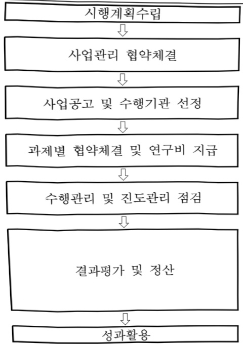

# 지역거점AX혁신기술개발(R&D)

**해당 페이지**: PDF 1435 ~ 1440 쪽 해당

**부처**: 과학기술정보통신부
**분야**: 과학기술
**회계유형**: 지역균형발전 특별회계
**2026 확정예산**: 11020.0 백만원
**전년대비 증감률**: None%
**AI 도메인**: LLM/언어모델, 의료/바이오, 로봇, 문화/콘텐츠, 디지털전환(AX)

---

<table border=1 style='margin: auto; word-wrap: break-word;'><tr><td style='text-align: center; word-wrap: break-word;'>사 업 명</td></tr><tr><td style='text-align: center; word-wrap: break-word;'>(54) 지역거점AX혁신 기술개발(R&amp;D)(4231-426)</td></tr></table>

□ 사업 코드 정보

<table border=1 style='margin: auto; word-wrap: break-word;'><tr><td style='text-align: center; word-wrap: break-word;'>구분</td><td style='text-align: center; word-wrap: break-word;'>회계</td><td style='text-align: center; word-wrap: break-word;'>소관</td><td style='text-align: center; word-wrap: break-word;'>실국(기관)</td><td style='text-align: center; word-wrap: break-word;'>계정</td><td style='text-align: center; word-wrap: break-word;'>분야</td><td style='text-align: center; word-wrap: break-word;'>부문</td></tr><tr><td style='text-align: center; word-wrap: break-word;'>코드</td><td style='text-align: center; word-wrap: break-word;'>지역균형발전</td><td style='text-align: center; word-wrap: break-word;'>과학기술</td><td style='text-align: center; word-wrap: break-word;'>인공지능</td><td style='text-align: center; word-wrap: break-word;'>지역지원</td><td style='text-align: center; word-wrap: break-word;'>150</td><td style='text-align: center; word-wrap: break-word;'>155</td></tr><tr><td style='text-align: center; word-wrap: break-word;'>덩칭</td><td style='text-align: center; word-wrap: break-word;'>특별회계</td><td style='text-align: center; word-wrap: break-word;'>정보통신부</td><td style='text-align: center; word-wrap: break-word;'>정책기획관</td><td style='text-align: center; word-wrap: break-word;'>계정</td><td style='text-align: center; word-wrap: break-word;'>과학기술</td><td style='text-align: center; word-wrap: break-word;'>과학기술 연구개발</td></tr></table>

<table border=1 style='margin: auto; word-wrap: break-word;'><tr><td style='text-align: center; word-wrap: break-word;'>구분</td><td style='text-align: center; word-wrap: break-word;'>프로그램</td><td style='text-align: center; word-wrap: break-word;'>단위사업</td><td style='text-align: center; word-wrap: break-word;'>세부사업</td></tr><tr><td style='text-align: center; word-wrap: break-word;'>코드</td><td style='text-align: center; word-wrap: break-word;'>4200</td><td style='text-align: center; word-wrap: break-word;'>4231</td><td style='text-align: center; word-wrap: break-word;'>426</td></tr><tr><td style='text-align: center; word-wrap: break-word;'>명칭</td><td style='text-align: center; word-wrap: break-word;'>지역경제활성화</td><td style='text-align: center; word-wrap: break-word;'>광역경제권산업경쟁력강화</td><td style='text-align: center; word-wrap: break-word;'>지역거점AX혁신기술개발(R&amp;D)</td></tr></table>

□ 사업 성격 (공통요구자료 Ⅱ-1 작성유의사항 4. 참조, 해당하는 사항에 “○” 표시)

<table border=1 style='margin: auto; word-wrap: break-word;'><tr><td style='text-align: center; word-wrap: break-word;'>신규</td><td style='text-align: center; word-wrap: break-word;'>계속</td><td style='text-align: center; word-wrap: break-word;'>완료</td><td style='text-align: center; word-wrap: break-word;'>예비타당성실시여부</td><td style='text-align: center; word-wrap: break-word;'>총사업비관리대상</td><td style='text-align: center; word-wrap: break-word;'>총액계상예산사업</td><td style='text-align: center; word-wrap: break-word;'>사업소관 변경정보</td></tr><tr><td style='text-align: center; word-wrap: break-word;'>○</td><td style='text-align: center; word-wrap: break-word;'></td><td style='text-align: center; word-wrap: break-word;'></td><td style='text-align: center; word-wrap: break-word;'>면제</td><td style='text-align: center; word-wrap: break-word;'></td><td style='text-align: center; word-wrap: break-word;'></td><td style='text-align: center; word-wrap: break-word;'></td></tr></table>

□사업지원형태 및지원을(최소한개는반드시선택하시오.해당사항에O표시)

<table border=1 style='margin: auto; word-wrap: break-word;'><tr><td style='text-align: center; word-wrap: break-word;'>직접</td><td style='text-align: center; word-wrap: break-word;'>출자</td><td style='text-align: center; word-wrap: break-word;'>출연</td><td style='text-align: center; word-wrap: break-word;'>보조</td><td style='text-align: center; word-wrap: break-word;'>융자</td><td style='text-align: center; word-wrap: break-word;'>국고보조율(%)</td><td style='text-align: center; word-wrap: break-word;'>융자율(%)</td></tr><tr><td style='text-align: center; word-wrap: break-word;'></td><td style='text-align: center; word-wrap: break-word;'></td><td style='text-align: center; word-wrap: break-word;'>○</td><td style='text-align: center; word-wrap: break-word;'></td><td style='text-align: center; word-wrap: break-word;'></td><td style='text-align: center; word-wrap: break-word;'></td><td style='text-align: center; word-wrap: break-word;'></td></tr></table>

## □ 사업 담당자

<table border=1 style='margin: auto; word-wrap: break-word;'><tr><td style='text-align: center; word-wrap: break-word;'>사업명</td><td colspan="2">구분</td></tr><tr><td rowspan="8">지역거점AX혁신기술개발</td><td rowspan="3">소관부처</td><td style='text-align: center; word-wrap: break-word;'>실·국·과(팀)</td></tr><tr><td style='text-align: center; word-wrap: break-word;'>인공지능정책실인공지능정책기획관</td></tr><tr><td style='text-align: center; word-wrap: break-word;'>디지털인재양성과</td></tr><tr><td style='text-align: center; word-wrap: break-word;'>사업시행주체</td><td style='text-align: center; word-wrap: break-word;'>정보통신산업진흥원</td></tr><tr><td rowspan="3">소관부처</td><td style='text-align: center; word-wrap: break-word;'>실·국·과(팀)</td></tr><tr><td style='text-align: center; word-wrap: break-word;'>연구개발정책실기초원천연구정책관</td></tr><tr><td style='text-align: center; word-wrap: break-word;'>첨단바이오기술과</td></tr><tr><td style='text-align: center; word-wrap: break-word;'>사업시행주체</td><td style='text-align: center; word-wrap: break-word;'>한국연구재단</td></tr></table>

---

### 가. 예산 총괄표

(단위: 백만원, %)

<table border=1 style='margin: auto; word-wrap: break-word;'><tr><td rowspan="2">사업명</td><td rowspan="2">2024년 결산</td><td colspan="2">2025년 예산</td><td colspan="2">2026년</td><td rowspan="2">증감(B-A)</td><td rowspan="2">(B-A)/A</td></tr><tr><td style='text-align: center; word-wrap: break-word;'>본예산(A)</td><td style='text-align: center; word-wrap: break-word;'>추경</td><td style='text-align: center; word-wrap: break-word;'>정부안</td><td style='text-align: center; word-wrap: break-word;'>확정(B)</td></tr><tr><td style='text-align: center; word-wrap: break-word;'>지역거점 AX 혁신기술개발(R&amp;D)</td><td style='text-align: center; word-wrap: break-word;'>-</td><td style='text-align: center; word-wrap: break-word;'>-</td><td style='text-align: center; word-wrap: break-word;'>-</td><td style='text-align: center; word-wrap: break-word;'>7,920</td><td style='text-align: center; word-wrap: break-word;'>11,020</td><td style='text-align: center; word-wrap: break-word;'>-</td><td style='text-align: center; word-wrap: break-word;'>순증</td></tr></table>

□ 기능별(내역사업별), 목별 예산 내역

(단위:백만원)

<table border=1 style='margin: auto; word-wrap: break-word;'><tr><td rowspan="3"></td><td colspan="5">2024</td><td colspan="7">2025(2025년 12월 말)</td><td rowspan="3">2026 예산</td></tr><tr><td rowspan="2">예산액(추경)</td><td rowspan="2">예산 현액</td><td rowspan="2">집행액[실집행액]</td><td rowspan="2">이월액</td><td rowspan="2">불용액</td><td rowspan="2">본예산</td><td rowspan="2">예산 현액</td><td rowspan="2">집행액[실집행액]</td><td colspan="2">전년도 이월액 제외</td><td rowspan="2">이월 예상액</td><td rowspan="2">불용 예상액</td></tr><tr><td style='text-align: center; word-wrap: break-word;'>예산 현액</td><td style='text-align: center; word-wrap: break-word;'>집행액[실집행액]</td></tr><tr><td style='text-align: center; word-wrap: break-word;'>○ 기능별 분류(합계)</td><td style='text-align: center; word-wrap: break-word;'>-</td><td style='text-align: center; word-wrap: break-word;'>-</td><td style='text-align: center; word-wrap: break-word;'>-</td><td style='text-align: center; word-wrap: break-word;'>-</td><td style='text-align: center; word-wrap: break-word;'>-</td><td style='text-align: center; word-wrap: break-word;'>-</td><td style='text-align: center; word-wrap: break-word;'>-</td><td style='text-align: center; word-wrap: break-word;'>-</td><td style='text-align: center; word-wrap: break-word;'>-</td><td style='text-align: center; word-wrap: break-word;'>-</td><td style='text-align: center; word-wrap: break-word;'>-</td><td style='text-align: center; word-wrap: break-word;'>-</td><td style='text-align: center; word-wrap: break-word;'>11,020</td></tr><tr><td style='text-align: center; word-wrap: break-word;'>• 첨단 바이오 제품 표준AX 제조 공정</td><td style='text-align: center; word-wrap: break-word;'>-</td><td style='text-align: center; word-wrap: break-word;'>-</td><td style='text-align: center; word-wrap: break-word;'>-</td><td style='text-align: center; word-wrap: break-word;'>-</td><td style='text-align: center; word-wrap: break-word;'>-</td><td style='text-align: center; word-wrap: break-word;'>-</td><td style='text-align: center; word-wrap: break-word;'>-</td><td style='text-align: center; word-wrap: break-word;'>-</td><td style='text-align: center; word-wrap: break-word;'>-</td><td style='text-align: center; word-wrap: break-word;'>-</td><td style='text-align: center; word-wrap: break-word;'>-</td><td style='text-align: center; word-wrap: break-word;'>-</td><td style='text-align: center; word-wrap: break-word;'>2,630</td></tr><tr><td style='text-align: center; word-wrap: break-word;'>• 바이오·헬스케어 특화 AI·SW 기술개발</td><td style='text-align: center; word-wrap: break-word;'>-</td><td style='text-align: center; word-wrap: break-word;'>-</td><td style='text-align: center; word-wrap: break-word;'>-</td><td style='text-align: center; word-wrap: break-word;'>-</td><td style='text-align: center; word-wrap: break-word;'>-</td><td style='text-align: center; word-wrap: break-word;'>-</td><td style='text-align: center; word-wrap: break-word;'>-</td><td style='text-align: center; word-wrap: break-word;'>-</td><td style='text-align: center; word-wrap: break-word;'>-</td><td style='text-align: center; word-wrap: break-word;'>-</td><td style='text-align: center; word-wrap: break-word;'>-</td><td style='text-align: center; word-wrap: break-word;'>-</td><td style='text-align: center; word-wrap: break-word;'>1,100</td></tr><tr><td style='text-align: center; word-wrap: break-word;'>• 표준 AX 활용 바이오 제품개발</td><td style='text-align: center; word-wrap: break-word;'>-</td><td style='text-align: center; word-wrap: break-word;'>-</td><td style='text-align: center; word-wrap: break-word;'>-</td><td style='text-align: center; word-wrap: break-word;'>-</td><td style='text-align: center; word-wrap: break-word;'>-</td><td style='text-align: center; word-wrap: break-word;'>-</td><td style='text-align: center; word-wrap: break-word;'>-</td><td style='text-align: center; word-wrap: break-word;'>-</td><td style='text-align: center; word-wrap: break-word;'>-</td><td style='text-align: center; word-wrap: break-word;'>-</td><td style='text-align: center; word-wrap: break-word;'>-</td><td style='text-align: center; word-wrap: break-word;'>-</td><td style='text-align: center; word-wrap: break-word;'>2,200</td></tr><tr><td style='text-align: center; word-wrap: break-word;'>• 휴머노이드 특화 AX 핵심기술 개발</td><td rowspan="2">-</td><td rowspan="2">-</td><td rowspan="2">-</td><td rowspan="2">-</td><td rowspan="2">-</td><td rowspan="2">-</td><td rowspan="2">-</td><td rowspan="2">-</td><td rowspan="2">-</td><td rowspan="2">-</td><td rowspan="2">-</td><td rowspan="2">-</td><td style='text-align: center; word-wrap: break-word;'>4,920</td></tr><tr><td style='text-align: center; word-wrap: break-word;'>• 기획 평가 관리 비(360-06)</td><td style='text-align: center; word-wrap: break-word;'>170</td></tr></table>

### 나. 사업설명자료

## 1 ) 사업목적·내용

- (사업목적) 손산업의 인공지능 전환에 따른 글로벌 신시장 선점을 위해, 'AX R&D 허브'

조성을 통한 글로벌 선도기술력 확보 및 전략산업의 AX 가속화

- (사업내용) AX 전략 분야(완전자율로봇, 바이오·헬스케어) 기술 현안 및 난제 해결을 위한 핵심 기술개발 지원

## 2 ) 사업개요

□ 사업근거 및 추진경위

<table border=1 style='margin: auto; word-wrap: break-word;'><tr><td style='text-align: center; word-wrap: break-word;'>&lt;지역거점 AX 혁신기술개발(신규)&gt;</td></tr><tr><td style='text-align: center; word-wrap: break-word;'>① 범령상 근거 조항 적시 : 지방자치분권 및 지역군형발전에 관한 특별법, 국가연구</td></tr></table>

---

개발혁신법, 소프트웨어진흥법 및 정보통신산업진흥법 등

- 지방자치분권 및 지역군형발전에 관한 특별법 제14조(지역 산업 육성 및 일자리 창출 등 지역경제 활성화 촉진) ④ 국가와 지방자치단체는 지역 산업의 육성과 지역경제의 활성화를 위하여 지역의 일자리 창출과 투자 유치활동 지원, 정보통신 진흥 및 지역 특성에 맞는 중소기업의 창업 여건 개선 등에 관한 시책을 추진하여야 한다.

- 국가연구개발혁신법 제5조(정부의 책무) ① 정부는 이 법의 목적을 달성하기 위하여 다음 각 호의 사항에 관한 시책을 마련하고 추진하여야 한다.

- 소프트웨어 진흥법 제8조(소프트웨어산업 진흥 전담기관 등) ① 과학기술정보통신부 장관은 소프트웨어산업의 진흥·발전을 효율적으로 지원하기 위하여 「정보통신산업 진흥법」 제26조에 따른 정보통신산업진흥원을 소프트웨어산업 진흥 전담기관으로 지정한다.

- 소프트웨어 진흥법 제9조(지역별 소프트웨어산업 진흥) ① 과학기술정보통신부장관은 지역별 특성에 기반한 소프트웨어산업 진흥을 지원하고 지역 산업과의 융합을 촉진하여야 한다.

- 정보통신산업 진흥법 제3조(국가 및 지방자치단체의 책무) ① 국가는 정보통신산업의 진흥에 필요한 종합적인 시책을 수립하여 시행하고 이에 필요한 재원확보 방안을 마련하여야 한다. ② 지방자치단체는 국가의 시책과 지역적 특성을 고려하여 정보통신기술을 기반으로 정보통신산업의 진흥에 필요한 시책을 마련하여야 한다.

- 정보통신산업 진흥법 제28조(재원 등) ① 정부는 예산 또는 기금의 범위에서 산업 진흥원의 설립 및 운영에 필요한 경비의 전부 또는 일부를 출연하거나 보조할 수 있다.

## ② 추진경위

- (25.8) 새정부 국정과제 'AI 3대 강국 도약으로 여는 '모두의 AI'시대'

## ·세계를이끄는혁신경제

21. 세계에서 AI를 가장 잘 쓰는 나라 구현

- (25.8) '지역거점 AX 혁신 기술개발' 사업 예타면제 국무회의 의결

- (25.8) 과기정통부 혁신도전형 R&D 사업군 추가지정

- (25.12) '26년 과기정통부 주요업무 추진계획

·국가 AI 대전환 및 글로벌 AI 기본사회 실현

AI기반의 지역산업 재도약 및 주민 체감 프로젝트 추진

---

## □ 주요내용

① 사업규모

- 총사업비(해당되는 경우에만 기재) : 해당없음

- 사업기간 : '26~'30년

- 최근 5년 간 투입된 사업비(예산액기준, 추경편성한 연도에는 추경포함)

<table border=1 style='margin: auto; word-wrap: break-word;'><tr><td style='text-align: center; word-wrap: break-word;'>$ \underline{\text{연도}} $</td><td style='text-align: center; word-wrap: break-word;'>2022</td><td style='text-align: center; word-wrap: break-word;'>2023</td><td style='text-align: center; word-wrap: break-word;'>2024</td><td style='text-align: center; word-wrap: break-word;'>2025</td><td style='text-align: center; word-wrap: break-word;'>2026(안)</td></tr><tr><td style='text-align: center; word-wrap: break-word;'>사업비</td><td style='text-align: center; word-wrap: break-word;'>-</td><td style='text-align: center; word-wrap: break-word;'>-</td><td style='text-align: center; word-wrap: break-word;'>-</td><td style='text-align: center; word-wrap: break-word;'>-</td><td style='text-align: center; word-wrap: break-word;'>11,020</td></tr></table>

② 사업추진체계

- 사업시행방법 : 출연

- 사업시행주체 : 정보통신산업진흥원

- 사업 수혜자 : 국내외 대학 및 연구소, AX 공급·수요 기업 등

- 보조, 융자, 출연, 출자 등의 경우 보조·융자 등 지원 비율 및 법적근거

<table border=1 style='margin: auto; word-wrap: break-word;'><tr><td style='text-align: center; word-wrap: break-word;'>내역사업명</td><td style='text-align: center; word-wrap: break-word;'>구분</td><td style='text-align: center; word-wrap: break-word;'>피보조·피출연 등 기관명</td><td style='text-align: center; word-wrap: break-word;'>지원 금액 (2026예산안)</td><td style='text-align: center; word-wrap: break-word;'>지원 비율(%)</td><td style='text-align: center; word-wrap: break-word;'>보조율 법적근거 (해당 조항)</td></tr><tr><td style='text-align: center; word-wrap: break-word;'>지역거점 AX혁신기술 개발</td><td style='text-align: center; word-wrap: break-word;'>출연</td><td style='text-align: center; word-wrap: break-word;'>정보통신 산업진흥원</td><td style='text-align: center; word-wrap: break-word;'>11,020백만원</td><td style='text-align: center; word-wrap: break-word;'>100</td><td style='text-align: center; word-wrap: break-word;'>정보통신산업 진흥법 제28조(재원 등)</td></tr></table>

## 3 ) 2026년도 예산안 산출 근거

□ 지역거점 AX 혁신기술개발(R&D) : ('25) 0 → ('26) 11,020백만원

① 지역거점 AX 혁신기술개발(R&D): ('25) 0 백만원 → (26예산안) 11,020백만원

- (요구) 첨단 바이오제품 표준AX 제조공정 기술개발을 위한 2,630백만원 신규반영 요구

바이오·헬스케어 특화 AI-SW 기술개발을 위한 1,100백만원 신규반영 요구

표준 AX 활용 바이오 제품개발을 위한 2,200백만원 신규반영 요구

휴머노이드 특화 AX 핵심기술 개발을 위한 4,920백만원 신규반영 요구

사업 기획평가관리를 위한 170백만원 신규반영 요구

- (산출) 첨단 바이오제품 표준AX 제조공정 1식 × 5,760백만원 × 5.5/12개월 = 2,630백만원

바이오·헬스케어 특화 AI·SW 기술개발 1식 × 2,400백만원 × 5.5/12개월 = 1,100백만원

표준 AX 활용 바이오 제품개발 1식 × 4,800백만원 × 5.5/12개월 = 2,200백만원

휴머노이드 특화 AX 핵심기술 개발 1식 × 10,800백만원 × 5.5/12개월 = 4,920백만원

기획평가관리비 1식 × 170백만원 × 12/12개월 = 170백만원

---

## 4 ) 사업효과

☐ 사업영향, 산출물 성과지표 등

① 2022~2026년도 성과계획서 상 성과지표 및 최근 5년간 성과 달성도

<table border=1 style='margin: auto; word-wrap: break-word;'><tr><td style='text-align: center; word-wrap: break-word;'>성과지표</td><td style='text-align: center; word-wrap: break-word;'>구분</td><td style='text-align: center; word-wrap: break-word;'>2022</td><td style='text-align: center; word-wrap: break-word;'>2023</td><td style='text-align: center; word-wrap: break-word;'>2024</td><td style='text-align: center; word-wrap: break-word;'>2025</td><td style='text-align: center; word-wrap: break-word;'>2026</td><td style='text-align: center; word-wrap: break-word;'>&#x27;26목표치산출근거</td><td style='text-align: center; word-wrap: break-word;'>측정산식(또는 측정방법)</td><td style='text-align: center; word-wrap: break-word;'>자료수집방법(또는 자료출처)</td></tr><tr><td rowspan="3">특허 건수(단위: 건)</td><td style='text-align: center; word-wrap: break-word;'>목표</td><td style='text-align: center; word-wrap: break-word;'>-</td><td style='text-align: center; word-wrap: break-word;'>-</td><td style='text-align: center; word-wrap: break-word;'>-</td><td style='text-align: center; word-wrap: break-word;'>-</td><td style='text-align: center; word-wrap: break-word;'>18</td><td rowspan="3">유사 연구개발사업1억원당 평균특허수(0.16) × 당해연도 사업비</td><td rowspan="3">∑ 당해연도 특허출원·등록건수(건)</td><td rowspan="3">NTIS 자료(성과분석보고서)</td></tr><tr><td style='text-align: center; word-wrap: break-word;'>실적</td><td style='text-align: center; word-wrap: break-word;'>-</td><td style='text-align: center; word-wrap: break-word;'>-</td><td style='text-align: center; word-wrap: break-word;'>-</td><td style='text-align: center; word-wrap: break-word;'>-</td><td style='text-align: center; word-wrap: break-word;'>-</td></tr><tr><td style='text-align: center; word-wrap: break-word;'>달성도</td><td style='text-align: center; word-wrap: break-word;'>-</td><td style='text-align: center; word-wrap: break-word;'>-</td><td style='text-align: center; word-wrap: break-word;'>-</td><td style='text-align: center; word-wrap: break-word;'>-</td><td style='text-align: center; word-wrap: break-word;'>-</td></tr></table>

② 성과지표 이외의 연도별 사업추진 경과 및 실적 : 해당없음

③향후(2026년도 이후)기대효과

° 국내·외 혁신 연구자 및 기업, 최고 수준 연구 인프라가 집적된 글로벌 수준의 'AX 기술 공급기지' 구축

° 비수도권 SW기업 거점인 수성알파시티를 AX 연구개발 허브로 확대 조성하여, '30년까지 AX 전문기업 1,000개 및 종사인력 2만명 집적

5) 타당성조사 및 예비타당성조사 시행여부 및 결과 요지

□ 예비타당성 조사 면제('25.8월)

6) 총사업비 대상사업 여부 및 내역 : 해당없음

---

## 7 ) 사업 집행절차

사업관리 협약체결

사업공고 및 수행기관 선정

과제별 협약체결 및 연구비 지급

수행관리 및 진도관리 점검

결과평가 및 정산

과학기술정보통신부

과학기술정보통신부 $\leftrightarrow$

정보통신산업진흥원, 한국연구재단

정보통신산업진흥원, 한국연구재단

(수행기관 공고(지정공모))

정보통신산업진흥원, 한국연구재단

→ 수행기관

정보통신산업진흥원, 한국연구재단

→ 수행기관

정보통신산업진흥원, 한국연구재단

→ 수행기관

(평가, 정산 결과보고 :

정보통신산업진흥원, 한국연구재단

→ 과학기술정보통신부)

사업종료 후 5년간

<table border=1 style='margin: auto; word-wrap: break-word;'><tr><td style='text-align: center; word-wrap: break-word;'>부처</td><td style='text-align: center; word-wrap: break-word;'></td><td style='text-align: center; word-wrap: break-word;'>피출연·피보조기관</td><td style='text-align: center; word-wrap: break-word;'></td><td style='text-align: center; word-wrap: break-word;'>간접보조사업자·사업수행자</td></tr><tr><td rowspan="2">과학기술정보통신부(11,020백만원)</td><td style='text-align: center; word-wrap: break-word;'>=&gt;(7,720백만원)</td><td style='text-align: center; word-wrap: break-word;'>정보통신산업진흥원(170백만원)</td><td style='text-align: center; word-wrap: break-word;'>=&gt;(7,550백만원)</td><td style='text-align: center; word-wrap: break-word;'>수행기관 컨소시엄 수행기관 컨소시엄</td></tr><tr><td style='text-align: center; word-wrap: break-word;'>=&gt;(3,300백만원)</td><td style='text-align: center; word-wrap: break-word;'>한국연구재단(3,300백만원)</td><td style='text-align: center; word-wrap: break-word;'>=&gt;(3,300백만원)</td><td style='text-align: center; word-wrap: break-word;'>컨소시엄</td></tr></table>

8) 각종 평가 : 해당없음

다. 최근 4년간 결산내역 : 해당없음

---

### 원본 PDF 크롭 이미지

