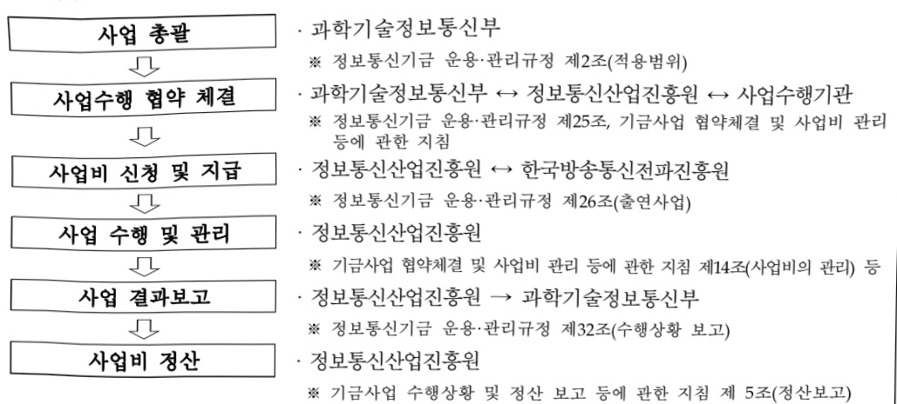
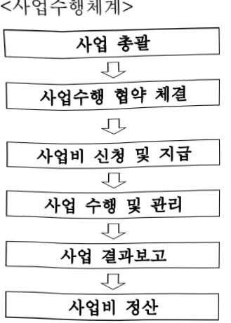

# 지역특화 AI 공간컴퓨팅 육성사업

**해당 페이지**: PDF 1454 ~ 1460 쪽 해당

**부처**: 과학기술정보통신부
**분야**: 통신
**회계유형**: 기금
**2026 확정예산**: 1500.0 백만원
**전년대비 증감률**: None%
**AI 도메인**: 교통/모빌리티, 로봇

---

<table border=1 style='margin: auto; word-wrap: break-word;'><tr><td style='text-align: center; word-wrap: break-word;'>사 업 명</td></tr><tr><td style='text-align: center; word-wrap: break-word;'>(43) 지역특화 AI 공간컴퓨팅 육성 (2602-337)</td></tr></table>

□ 사업 코드 정보

<table border=1 style='margin: auto; word-wrap: break-word;'><tr><td style='text-align: center; word-wrap: break-word;'>구분</td><td style='text-align: center; word-wrap: break-word;'>기금</td><td style='text-align: center; word-wrap: break-word;'>소관</td><td style='text-align: center; word-wrap: break-word;'>실국(기관)</td><td style='text-align: center; word-wrap: break-word;'>계정</td><td style='text-align: center; word-wrap: break-word;'>분야</td><td style='text-align: center; word-wrap: break-word;'>부문</td></tr><tr><td style='text-align: center; word-wrap: break-word;'>코드</td><td style='text-align: center; word-wrap: break-word;'>정보통신</td><td style='text-align: center; word-wrap: break-word;'>과학기술</td><td style='text-align: center; word-wrap: break-word;'>소프트웨어</td><td rowspan="2">-</td><td style='text-align: center; word-wrap: break-word;'>130</td><td style='text-align: center; word-wrap: break-word;'>133</td></tr><tr><td style='text-align: center; word-wrap: break-word;'>명칭</td><td style='text-align: center; word-wrap: break-word;'>진흥기금</td><td style='text-align: center; word-wrap: break-word;'>정보통신부</td><td style='text-align: center; word-wrap: break-word;'>정책관</td><td style='text-align: center; word-wrap: break-word;'>통신</td><td style='text-align: center; word-wrap: break-word;'>정보통신</td></tr></table>

<table border=1 style='margin: auto; word-wrap: break-word;'><tr><td style='text-align: center; word-wrap: break-word;'>구분</td><td style='text-align: center; word-wrap: break-word;'>프로그램</td><td style='text-align: center; word-wrap: break-word;'>단위사업</td><td style='text-align: center; word-wrap: break-word;'>세부사업</td></tr><tr><td style='text-align: center; word-wrap: break-word;'>코드</td><td style='text-align: center; word-wrap: break-word;'>2600</td><td style='text-align: center; word-wrap: break-word;'>2602</td><td style='text-align: center; word-wrap: break-word;'>337</td></tr><tr><td style='text-align: center; word-wrap: break-word;'>명칭</td><td style='text-align: center; word-wrap: break-word;'>인공지능데이터진흥</td><td style='text-align: center; word-wrap: break-word;'>AI경쟁력강화(정진)</td><td style='text-align: center; word-wrap: break-word;'>지역특화 AI 공간컴퓨팅 육성사업</td></tr></table>

<table border=1 style='margin: auto; word-wrap: break-word;'><tr><td colspan="5">☐ 사업 성격 (공통요구자료 Ⅱ-1 작성유의사항 4. 참조, 해당하는 사항에 “○” 표시)</td></tr><tr><td style='text-align: center; word-wrap: break-word;'>신규 계속 완료</td><td style='text-align: center; word-wrap: break-word;'>예비타당성 실시여부</td><td style='text-align: center; word-wrap: break-word;'>총사업비 관리대상</td><td style='text-align: center; word-wrap: break-word;'>총액계상 예산사업</td><td style='text-align: center; word-wrap: break-word;'>사업소관 변경정보 2025예산 시 소관</td></tr><tr><td style='text-align: center; word-wrap: break-word;'>☐</td><td style='text-align: center; word-wrap: break-word;'></td><td style='text-align: center; word-wrap: break-word;'></td><td style='text-align: center; word-wrap: break-word;'></td><td style='text-align: center; word-wrap: break-word;'></td></tr></table>

사업 지원 형태 및 지원을 (최소한 한 개는 반드시 선택하시오. 해당사항에 O 표시)

<table border=1 style='margin: auto; word-wrap: break-word;'><tr><td style='text-align: center; word-wrap: break-word;'>직접</td><td style='text-align: center; word-wrap: break-word;'>출자</td><td style='text-align: center; word-wrap: break-word;'>출연</td><td style='text-align: center; word-wrap: break-word;'>보조</td><td style='text-align: center; word-wrap: break-word;'>융자</td><td style='text-align: center; word-wrap: break-word;'>국고보조율(%)</td><td style='text-align: center; word-wrap: break-word;'>융자율(%)</td></tr><tr><td style='text-align: center; word-wrap: break-word;'></td><td style='text-align: center; word-wrap: break-word;'></td><td style='text-align: center; word-wrap: break-word;'>○</td><td style='text-align: center; word-wrap: break-word;'></td><td style='text-align: center; word-wrap: break-word;'></td><td style='text-align: center; word-wrap: break-word;'></td><td style='text-align: center; word-wrap: break-word;'></td></tr></table>

□사업 소관부처 및 시행주체

<table border=1 style='margin: auto; word-wrap: break-word;'><tr><td style='text-align: center; word-wrap: break-word;'>사업명</td><td colspan="2">구분</td></tr><tr><td rowspan="3">지역특화 AI 공간컴퓨팅 육성사업</td><td rowspan="2">소관부처</td><td style='text-align: center; word-wrap: break-word;'>정보통신정책실 소프트웨어정책관</td></tr><tr><td style='text-align: center; word-wrap: break-word;'>디지털콘텐츠과</td></tr><tr><td style='text-align: center; word-wrap: break-word;'>사업시행주체</td><td style='text-align: center; word-wrap: break-word;'>정보통신산업진흥원</td></tr></table>

---

### 가.지출계획 총괄표

(단위: 백만원, %)

<table border=1 style='margin: auto; word-wrap: break-word;'><tr><td rowspan="2">사업명</td><td rowspan="2">2024년 결산</td><td colspan="2">2025년 예산</td><td colspan="2">2026년 예산</td><td rowspan="2">증감(B-A)</td><td rowspan="2">(B-A)/A</td></tr><tr><td style='text-align: center; word-wrap: break-word;'>본예산</td><td style='text-align: center; word-wrap: break-word;'>추경*(A)</td><td style='text-align: center; word-wrap: break-word;'>요구안</td><td style='text-align: center; word-wrap: break-word;'>본예산(B)</td></tr><tr><td style='text-align: center; word-wrap: break-word;'>지역특화 AI 공간컴퓨팅 육성사업</td><td style='text-align: center; word-wrap: break-word;'></td><td style='text-align: center; word-wrap: break-word;'></td><td style='text-align: center; word-wrap: break-word;'></td><td style='text-align: center; word-wrap: break-word;'>1,500</td><td style='text-align: center; word-wrap: break-word;'>1,500</td><td style='text-align: center; word-wrap: break-word;'>1,500</td><td style='text-align: center; word-wrap: break-word;'>순증</td></tr></table>

□ 기능별(내역사업별) 계획 내역

(단위:백만원)

<table border=1 style='margin: auto; word-wrap: break-word;'><tr><td rowspan="2"></td><td colspan="5">2024</td><td colspan="5">2025</td><td rowspan="2">2026 계획</td></tr><tr><td style='text-align: center; word-wrap: break-word;'>계획액(추정)</td><td style='text-align: center; word-wrap: break-word;'>계획현액</td><td style='text-align: center; word-wrap: break-word;'>집행액</td><td style='text-align: center; word-wrap: break-word;'>이월액</td><td style='text-align: center; word-wrap: break-word;'>불용액</td><td style='text-align: center; word-wrap: break-word;'>계획액(추정)</td><td style='text-align: center; word-wrap: break-word;'>계획현액</td><td style='text-align: center; word-wrap: break-word;'>집행액</td><td style='text-align: center; word-wrap: break-word;'>이월액</td><td style='text-align: center; word-wrap: break-word;'>불용액</td></tr><tr><td style='text-align: center; word-wrap: break-word;'>○ 기능별 분류(합계)</td><td style='text-align: center; word-wrap: break-word;'>-</td><td style='text-align: center; word-wrap: break-word;'>-</td><td style='text-align: center; word-wrap: break-word;'>-</td><td style='text-align: center; word-wrap: break-word;'>-</td><td style='text-align: center; word-wrap: break-word;'>-</td><td style='text-align: center; word-wrap: break-word;'>-</td><td style='text-align: center; word-wrap: break-word;'>-</td><td style='text-align: center; word-wrap: break-word;'>-</td><td style='text-align: center; word-wrap: break-word;'>-</td><td style='text-align: center; word-wrap: break-word;'>-</td><td style='text-align: center; word-wrap: break-word;'>1,500</td></tr><tr><td style='text-align: center; word-wrap: break-word;'>· 지역주도 선도 프로젝트</td><td style='text-align: center; word-wrap: break-word;'>-</td><td style='text-align: center; word-wrap: break-word;'>-</td><td style='text-align: center; word-wrap: break-word;'>-</td><td style='text-align: center; word-wrap: break-word;'>-</td><td style='text-align: center; word-wrap: break-word;'>-</td><td style='text-align: center; word-wrap: break-word;'>-</td><td style='text-align: center; word-wrap: break-word;'>-</td><td style='text-align: center; word-wrap: break-word;'>-</td><td style='text-align: center; word-wrap: break-word;'>-</td><td style='text-align: center; word-wrap: break-word;'>-</td><td style='text-align: center; word-wrap: break-word;'>1,500</td></tr></table>

---

### 나. 사업설명자료

## 1 ) 사업목적·내용

(사업목적) AI 기반 공간컴퓨팅 기술을 활용한 산업 혁신 서비스와 실질적인 효과가 높은 신규 특화분야 서비스 개발·실증 지원

※ (공간컴퓨팅) AI가 현실공간을 직접 '보고 이해하게' 만드는 기술로, 사람·로봇 등의 위치와 움직임을 인식하여 맞춤형 정보제공과 로봇 자율주행을 지원하는 SW핵심기술

- (지역주도 선도 프로젝트) 지역사회 문제와 산업현안을 기반으로 지역특화 분야에 대한 AI·공간컴퓨팅 특화 서비스 개발 및 실증 지원

※ 관광·산업 등 지역 핵심 현안(1차: 부산)의 편의성·생산성 제고를 위해 공간컴퓨팅 기술을 활용한 AR·로봇 등 지능형 서비스 개발

## 2 ) 사업개요

## □ 사업근거 및 추진경위

① 법령상 근거 및 조항 적시

- 「정보통신 진흥 및 융합 활성화 등에 관한 특별법」 제21조, 제27조

제21조(디지털콘텐츠의 진흥과 활성화) ① 정부는 디지털콘텐츠 제작자의 창의성을 높이고, 유망 디지털콘텐츠가 창작·유통·이용될 수 있는 환경을 조성하여야 하며, 관련 산업의 경쟁력을 강화하기 위하여 노력하여야 한다.

② 정부는 디지털콘텐츠의 진흥 및 활성화를 위하여 다음 각 호의 사업을 추진할 수 있다.

1. 디지털콘텐츠의 제작 및 유통 지원

2. 디지털콘텐츠 관련 지역협력 및 시범사업

3. 디지털콘텐츠 인프라 구축 지원

4. 디지털콘텐츠 관련 전문인력 양성 지원

5. 디지털콘텐츠 진흥 및 활성화를 위한 정책연구 사업

6. 그 밖에 디지털콘텐츠 진흥 및 활성화를 위하여 대통령령으로 정하는 사항

③ 정부는 제2항 각 호의 사업을 효율적으로 추진하기 위하여 전담기관을 지정할 수 있으며, 필요한 비용의 전부 또는 일부를 보조할 수 있다.

④ 제2항에 따른 지원 사업 및 제3항에 따른 전담기관의 지정 등에 필요한 사항은 대통령령으로 정한다. 제27조(디지털콘텐츠의 진흥과 활성화 사업 등) ① 법 제21조제2항제6호에서 "대통령령으로 정하는 사항"이란 다음 각 호의 지원을 말한다.

1. 디지털콘텐츠 투자 및 융자 지원

2. 디지털콘텐츠 분야 창업 지원

3. 디지털콘텐츠 관련 표준화 및 기술개발 지원

4. 인접 분야와의 융합을 통한 다양한 디지털콘텐츠의 발굴, 제작 및 유통 활성화 지원

5. 디지털콘텐츠의 이용기회 확대 및 이용 안전성 제고 지원

6. 디지털콘텐츠의 해외진출을 위한 기반조성 및 마케팅 지원

7. 디지털콘텐츠 관련 사업에 대한 법률 지원 및 경영자문 지원

8. 그 밖에 다양하고 건전한 디지털콘텐츠의 제작 및 이용 촉진을 위하여 필요한 지원

---

② 법 제21조제3항에 따른 디지털콘텐츠의 진흥 및 활성화 사업의 전담기관으로 지정받을 수 있는 자는 다음 각 호와 같다.

2.「전파법」제66조의2에 따른 한국전파진흥협회

가상융합산업 진흥법 제11조, 제20조, 제21조, 제31조

<table border=1 style='margin: auto; word-wrap: break-word;'><tr><td style='text-align: center; word-wrap: break-word;'>제11조(기술개발의 촉진) ① 정부는 가상융합기술의 개발과 발전을 촉진하기 위하여 다음 각 호의 사업을 추진할 수 있다.1. 국내외 가상융합기술 동향·수준 및 관련 제도의 조사2. 가상융합기술의 연구·개발, 시험 및 평가3. 가상융합기술 협력·이전 등 기술의 실용화4. 가상융합기술 정보의 원활한 유통5. 그 밖에 가상융합기술 개발을 위하여 필요한 사업② 정부는 제1항에 따른 사업을 효율적으로 추진하기 위하여 필요한 때에는 제17조에 따른 전담 기관이나 관련 기관 또는 단체에 제1항 각 호의 사업을 위탁할 수 있다.③ 정부 및 지방자치단체는 제2항에 따라 사업을 위탁받은 자에게 예산의 범위에서 해당 사업의 수행에 필요한 비용의 전부 또는 일부를 지원할 수 있다.④ 제2항에 따라 위탁하는 업무의 범위, 위탁기관의 선정 방법 및 절차 등에 필요한 사항은 대통령령으로 정한다.제20조(가상융합사업자에 대한 지원) ① 정부 및 지방자치단체는 가상융합산업 진흥을 위하여 가상융합사업자에 대하여 다음 각 호의 행정적·재정적 지원을 할 수 있다.1. 가상융합기술 또는 가상융합서비스등의 개발 지원 및 연구·개발 성과의 확산2. 장비·시설 등의 공동 사용3. 가상융합기술 또는 가상융합서비스등의 사업화 지원4. 그 밖에 가상융합산업 진흥을 위하여 대통령령으로 정하는 사항제21조(가상융합산업 지원사업) 중앙행정기관의 장 및 지방자치단체의 장은 가상융합산업 진흥을 위하여 다음 각 호의 사업을 시행할 수 있다.1. 연구 사업2. 활성화 기반 조성 및 제도 개선 사업3. 호환성, 상호운용성 확보 및 연계 사업4. 기존 서비스 등의 가상융합서비스등으로의 전환 지원 사업5. 그 밖에 가상융합산업 진흥을 위하여 필요한 사업제31조(전환 가상융합세계 생태계의 조성 등) ① 정부는 이용자의 권익을 보호하고 건전한 가상융합세계 생태계의 조성 및 유지를 위하여 노력하여야 한다.② 가상융합사업자는 건전한 가상융합세계 생태계의 조성 및 유지를 위하여 성별, 정치, 경제, 사회, 문화 등과 관련된 부당한 차별적 콘텐츠의 제작, 유통, 배포, 게시, 전시, 복제, 전송 등을 하지 아니하도록 노력하여야 한다. 다만, ‘저작권법’에 따른 온라인서비스제공자에 해당하는 가상융합사업자의 경우에는 이러한 노력이 ‘저작권법’ 제102조제3항에 따른 모니터링이나 조사를 목적으로 하여서는 아니 된다.③ 매출액, 이용자 수 등이 대통령령으로 정하는 기준에 해당하는 가상융합 플랫폼 사업자는 법령 및 약관·운영정책 등의 위반과 관련된 이용자와 가상융합 플랫폼 사업자 사이 또는 이용자들 사이의 분쟁을 해결하기 위한 절차를 마련하여야 한다.④ 가상융합 플랫폼 사업자는 플랫폼을 투명하고 공정하게 운영하여야 하며, 이용자를 부당하게 차별하여 취급하지 아니하도록 노력하여야 한다.⑤ 가상융합 플랫폼 사업자는 플랫폼의 품질·성능 및 정보보호·보안 수준을 향상시키고, 호환성, 상호운용성 및 서비스의 지속가능성을 확보하기 위하여 노력하여야 한다.</td></tr></table>

---

② 추진경위

○ 추진경과

- '17년 7월: 국정운영 5개년 계획 100대 국정과제 '소프트웨어 강국, ICT 르네상스로

4차 산업 선도 기반 구축 발표

- '18년 12월: '콘텐츠산업 경쟁력강화 핵심전략' 발표(관계부처, 국정현안점검조정회의)

- '19년 10월: 실감콘텐츠산업 활성화 전략 발표(정보통신전략위원회)

- '20년 12월: 가상융합경제 발전전략 발표(국정현안점검조정회의)

- '22년 01월: 메타버스 신산업 선도 전략 발표(비상경제중대본회의)

- '22년 09월: 대한민국 디지털 전략 발표(비상경제민생회의)

- '24년 02월: 가상융합산업진흥법 제정

- '24년 07월: 과기정통부-국토부 공간정보 사업 부처협업 회의

- '24년 08월 ~ 수시: 공간정보 기반 기술검토 및 사업기획

0 국정과제

- 국정과제 22: 초격차 AI 선도기술·인재 확보츠산업발전법 시행

- 실천과제 5: 피지컬 AI 핵심기술 확보 및 산업 육성 지원/(AX 생태계 구축)

## □ 주요내용

① 사업규모

- 총사업비 : 해당없음

- 사업기간 : '26년(단년도)

- 최근 5년 간 투입된 사업비(예산액기준, 추경편성한 연도에는 추경포함)

<table border=1 style='margin: auto; word-wrap: break-word;'><tr><td style='text-align: center; word-wrap: break-word;'>연도</td><td style='text-align: center; word-wrap: break-word;'>2022</td><td style='text-align: center; word-wrap: break-word;'>2023</td><td style='text-align: center; word-wrap: break-word;'>2024</td><td style='text-align: center; word-wrap: break-word;'>2025</td><td style='text-align: center; word-wrap: break-word;'>2026(안)</td></tr><tr><td style='text-align: center; word-wrap: break-word;'>사업비</td><td style='text-align: center; word-wrap: break-word;'>-</td><td style='text-align: center; word-wrap: break-word;'>-</td><td style='text-align: center; word-wrap: break-word;'>-</td><td style='text-align: center; word-wrap: break-word;'>-</td><td style='text-align: center; word-wrap: break-word;'>1,500</td></tr></table>

② 사업추진체계

- 사업시행방법 : 출연

- 사업시행주체 : 정보통신산업진흥원

- 사업 수혜자 : AI, 공간컴퓨팅 문야 기업과 종사자 및 구직자, 일반 국민 등

- 보조, 융자, 출연, 출자 등의 경우 보조·융자 등 지원 비율 및 법적근거

<table border=1 style='margin: auto; word-wrap: break-word;'><tr><td style='text-align: center; word-wrap: break-word;'>내역사업명</td><td style='text-align: center; word-wrap: break-word;'>구분</td><td style='text-align: center; word-wrap: break-word;'>피보조·피출연 등 기관명</td><td style='text-align: center; word-wrap: break-word;'>지원 금액 (2026계획안)</td><td style='text-align: center; word-wrap: break-word;'>지원 비율(%)</td><td style='text-align: center; word-wrap: break-word;'>보조율 법적근거 (해당 조항)</td></tr><tr><td style='text-align: center; word-wrap: break-word;'>지역주도 선도 프로젝트</td><td style='text-align: center; word-wrap: break-word;'>출연</td><td style='text-align: center; word-wrap: break-word;'>정보통신 산업진흥원</td><td style='text-align: center; word-wrap: break-word;'>1,500</td><td style='text-align: center; word-wrap: break-word;'>100</td><td style='text-align: center; word-wrap: break-word;'>○ 정보통신산업진흥법 제26조, 제27조 및 제28조 ○ 정보통신 진흥 및 융합 활성화 등에 관한 특별법 제21조, 제27조 ○ 가상융합산업진흥법 제11조, 제20조, 제21조, 제31조</td></tr></table>

---

## 3 ) 2026년도 계획안 산출 근거

① 지역주도 선도 프로젝트 : 1,500백만원, 신규

- (요구) 관광산업 등 부산 지역 특화 분야의 핵심 지역 현안에 대응하고, 지역 산업 생산성과 시민 편의성을 제고하기 위해 AI·공간컴퓨팅 기반 AR·로봇 등 지능형 서비스 개발에 1,500백만원 요구

- (산출) ('26) 1,500백만원×1개' = 1,500백만원

* 가상융합산업 진흥 인프라 구축 지자체 출연기관 등(국비:지방비=7:3 매칭)

## 4 ) 사업효과

□ 사업영향, 산출물 성과지표 등

① 2022~2026년도 성과계획서 상 성과지표 및 최근 5년간 성과 달성도

<table border=1 style='margin: auto; word-wrap: break-word;'><tr><td style='text-align: center; word-wrap: break-word;'>성과지표</td><td style='text-align: center; word-wrap: break-word;'>구분</td><td style='text-align: center; word-wrap: break-word;'>2022</td><td style='text-align: center; word-wrap: break-word;'>2023</td><td style='text-align: center; word-wrap: break-word;'>2024</td><td style='text-align: center; word-wrap: break-word;'>2025</td><td style='text-align: center; word-wrap: break-word;'>2026</td><td style='text-align: center; word-wrap: break-word;'>2026 목표치산출근거</td><td style='text-align: center; word-wrap: break-word;'>측정산식(또는 측정방법)</td><td style='text-align: center; word-wrap: break-word;'>자료수집방법(또는 자료출처)</td></tr><tr><td rowspan="3">기술·서비스상용화 건수(단위: 건)</td><td style='text-align: center; word-wrap: break-word;'>목표</td><td style='text-align: center; word-wrap: break-word;'>-</td><td style='text-align: center; word-wrap: break-word;'>-</td><td style='text-align: center; word-wrap: break-word;'>-</td><td style='text-align: center; word-wrap: break-word;'>-</td><td style='text-align: center; word-wrap: break-word;'>1</td><td rowspan="3">공간컴퓨팅기술 및서비스의 상용화 목표치</td><td rowspan="3">당해연도개발완료 및매출발생</td><td rowspan="3">결과보고서,매출계약서 등</td></tr><tr><td style='text-align: center; word-wrap: break-word;'>실적</td><td style='text-align: center; word-wrap: break-word;'>-</td><td style='text-align: center; word-wrap: break-word;'>-</td><td style='text-align: center; word-wrap: break-word;'>-</td><td style='text-align: center; word-wrap: break-word;'>-</td><td style='text-align: center; word-wrap: break-word;'>-</td></tr><tr><td style='text-align: center; word-wrap: break-word;'>달성도</td><td style='text-align: center; word-wrap: break-word;'>-</td><td style='text-align: center; word-wrap: break-word;'>-</td><td style='text-align: center; word-wrap: break-word;'>-</td><td style='text-align: center; word-wrap: break-word;'>-</td><td style='text-align: center; word-wrap: break-word;'>-</td></tr></table>

② 성과지표 이외의 연도별 사업추진 경과 및 실적 : 해당없음

③ 향후(2026년도 이후) 기대효과

- (지역주도 선도 프로젝트) 지역 특성을 반영한 AI·공간컴퓨팅 서비스 개발을 통해 지역 전통 산업의 성장 제고와 관광 경쟁력 강화 등 지역 균형 발전 촉진

5) 타당성조사 및 예비타당성조사 시행여부 및 결과 요지 : 해당없음

6) 총사업비 대상사업 여부 및 내역 : 해당없음

---

## 7 ) 사업 집행절차

## ·과학기술정보통신부

※ 정보통신기금 운용·관리규정 제2조(적용범위)

·과학기술정보통신부→정보통신산업진흥원→사업수행기관

※ 정보통신기금 운용·관리규정 제25조, 기금사업 협약체결 및 사업비 관리 등에 관한 지침

· 정보통신산업진흥원 ← 한국방송통신전과진흥원

※ 정보통신기금 운용·관리규정 제26조(출연사업)

·정보통신산업진흥원

※ 기금사업 협약체결 및 사업비 관리 등에 관한 지침 제14조(사업비의 관리) 등

## <지역주도 선도 프로젝트>

<table border=1 style='margin: auto; word-wrap: break-word;'><tr><td style='text-align: center; word-wrap: break-word;'>부처</td><td style='text-align: center; word-wrap: break-word;'></td><td style='text-align: center; word-wrap: break-word;'>피출연·피보조기관</td><td style='text-align: center; word-wrap: break-word;'></td><td style='text-align: center; word-wrap: break-word;'>간접보조사업자·사업수행자</td></tr><tr><td style='text-align: center; word-wrap: break-word;'>과학기술정보통신부(1,500백만원)</td><td style='text-align: center; word-wrap: break-word;'>=&gt;(1,500백만원)</td><td style='text-align: center; word-wrap: break-word;'>정보통신산업진흥원(90백만원)</td><td style='text-align: center; word-wrap: break-word;'>=&gt;(1,410백만원)</td><td style='text-align: center; word-wrap: break-word;'>사업수행기관 등</td></tr></table>

## 8 ) 각종 평가

1) 국회(예결위, 상임위, 예정처, 국정감사 포함) 지적 : 해당없음

2) 대외공개 평가 : 해당없음

3) 자체평가 : 해당없음

### 다. 최근 4년간 결산내역 : 해당없음

---

### 원본 PDF 크롭 이미지

