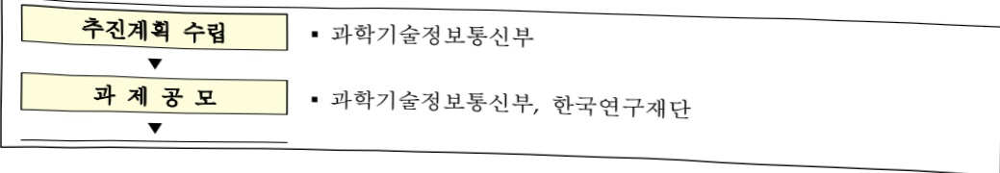
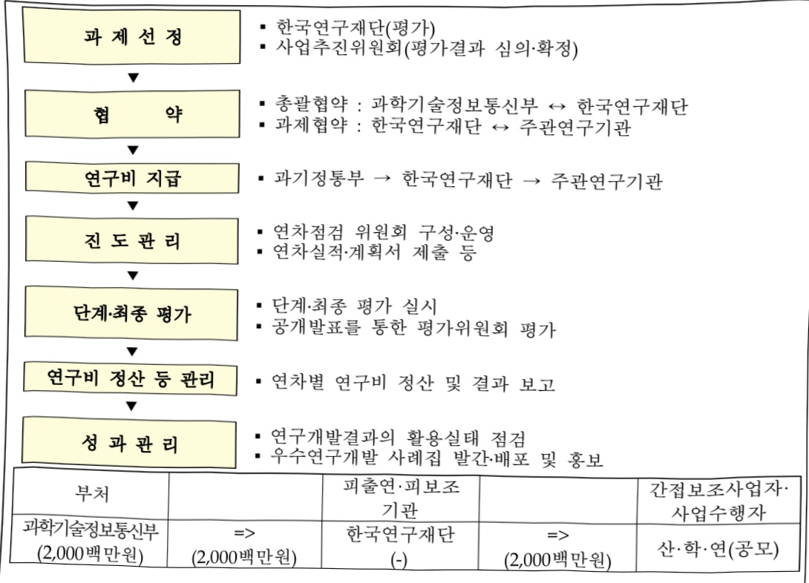

# 차세대 AI+S&T 기반기술개발(R&D)

**해당 페이지**: PDF 1461 ~ 1466 쪽 해당

**부처**: 과학기술정보통신부
**분야**: 과학기술
**회계유형**: 일반회계
**2026 확정예산**: 2000.0 백만원
**전년대비 증감률**: None%
**AI 도메인**: LLM/언어모델, R&D 지원

---

<table border=1 style='margin: auto; word-wrap: break-word;'><tr><td style='text-align: center; word-wrap: break-word;'>사 업 명</td></tr><tr><td style='text-align: center; word-wrap: break-word;'>(67) 차세대 AI+S&amp;T 기반 기술개발(R&amp;D) (1159-446)</td></tr></table>

사업 코드 정보

<table border=1 style='margin: auto; word-wrap: break-word;'><tr><td style='text-align: center; word-wrap: break-word;'>구분</td><td style='text-align: center; word-wrap: break-word;'>회계</td><td style='text-align: center; word-wrap: break-word;'>소관</td><td style='text-align: center; word-wrap: break-word;'>실국(기관)</td><td style='text-align: center; word-wrap: break-word;'>계정</td><td style='text-align: center; word-wrap: break-word;'>분야</td><td style='text-align: center; word-wrap: break-word;'>부문</td></tr><tr><td style='text-align: center; word-wrap: break-word;'>코드</td><td rowspan="2">일반회계</td><td rowspan="2">과학기술정보통신부</td><td rowspan="2">연구개발정책실기초원천연구정책관</td><td rowspan="2"></td><td style='text-align: center; word-wrap: break-word;'>150</td><td style='text-align: center; word-wrap: break-word;'>155</td></tr><tr><td style='text-align: center; word-wrap: break-word;'>명칭</td><td style='text-align: center; word-wrap: break-word;'>과학기술</td><td style='text-align: center; word-wrap: break-word;'>과학기술연구개발</td></tr></table>

<table border=1 style='margin: auto; word-wrap: break-word;'><tr><td style='text-align: center; word-wrap: break-word;'>구분</td><td style='text-align: center; word-wrap: break-word;'>프로그램</td><td style='text-align: center; word-wrap: break-word;'>단위사업</td><td style='text-align: center; word-wrap: break-word;'>세부사업</td></tr><tr><td style='text-align: center; word-wrap: break-word;'>코드</td><td style='text-align: center; word-wrap: break-word;'>1100</td><td style='text-align: center; word-wrap: break-word;'>1159</td><td style='text-align: center; word-wrap: break-word;'>446</td></tr><tr><td style='text-align: center; word-wrap: break-word;'>명칭</td><td style='text-align: center; word-wrap: break-word;'>미래유망원천기술개발</td><td style='text-align: center; word-wrap: break-word;'>차세대정보·컴퓨팅기술개발</td><td style='text-align: center; word-wrap: break-word;'>차세대 AI+S&amp;T 기반 기술개발(R&amp;D)</td></tr></table>

□ 사업 성격 (공통요구자료 II-1 작성유의사항 4. 참조, 해당하는 사항에 “○” 표시)

<table border=1 style='margin: auto; word-wrap: break-word;'><tr><td rowspan="2">신규</td><td rowspan="2">계속</td><td rowspan="2">완료</td><td rowspan="2">예비타당성 실시여부</td><td rowspan="2">총사업비 관리대상</td><td rowspan="2">총액계상 예산사업</td><td style='text-align: center; word-wrap: break-word;'>사업소관 변경정보</td></tr><tr><td style='text-align: center; word-wrap: break-word;'>2025예산 시 소관</td></tr><tr><td style='text-align: center; word-wrap: break-word;'>○</td><td style='text-align: center; word-wrap: break-word;'></td><td style='text-align: center; word-wrap: break-word;'></td><td style='text-align: center; word-wrap: break-word;'></td><td style='text-align: center; word-wrap: break-word;'></td><td style='text-align: center; word-wrap: break-word;'></td><td style='text-align: center; word-wrap: break-word;'></td></tr></table>

☐ 사업 지원 형태 및 지원을 (최소한 한 개는 반드시 선택하시오. 해당사항에 0 표시)

<table border=1 style='margin: auto; word-wrap: break-word;'><tr><td style='text-align: center; word-wrap: break-word;'>직접</td><td style='text-align: center; word-wrap: break-word;'>출자</td><td style='text-align: center; word-wrap: break-word;'>출연</td><td style='text-align: center; word-wrap: break-word;'>보조</td><td style='text-align: center; word-wrap: break-word;'>융자</td><td style='text-align: center; word-wrap: break-word;'>국고보조율(%)</td><td style='text-align: center; word-wrap: break-word;'>융자율(%)</td></tr><tr><td style='text-align: center; word-wrap: break-word;'></td><td style='text-align: center; word-wrap: break-word;'></td><td style='text-align: center; word-wrap: break-word;'>○</td><td style='text-align: center; word-wrap: break-word;'></td><td style='text-align: center; word-wrap: break-word;'></td><td style='text-align: center; word-wrap: break-word;'></td><td style='text-align: center; word-wrap: break-word;'></td></tr></table>

□ 사업 소관부처 및 시행주체

<table border=1 style='margin: auto; word-wrap: break-word;'><tr><td style='text-align: center; word-wrap: break-word;'>사업명</td><td colspan="2">구분</td></tr><tr><td rowspan="3">차세대 AI+S&amp;T기반 기술개발(R&amp;D)</td><td rowspan="2">소관부처</td><td style='text-align: center; word-wrap: break-word;'>연구개발정책실 기초원천연구정책관</td></tr><tr><td style='text-align: center; word-wrap: break-word;'>원천기술과(과학기술AI확산팀)</td></tr><tr><td style='text-align: center; word-wrap: break-word;'>사업시행주체</td><td style='text-align: center; word-wrap: break-word;'>한국연구재단</td></tr></table>

### 가. 예산 총괄표

(단위: 백만원, %)

<table border=1 style='margin: auto; word-wrap: break-word;'><tr><td rowspan="2">사업명</td><td rowspan="2">2024년 결산</td><td colspan="2">2025년 예산</td><td colspan="2">2026년 예산</td><td rowspan="2">증감(B-A)</td><td rowspan="2">(B-A)/A</td></tr><tr><td style='text-align: center; word-wrap: break-word;'>본예산</td><td style='text-align: center; word-wrap: break-word;'>추경*(A)</td><td style='text-align: center; word-wrap: break-word;'>요구안</td><td style='text-align: center; word-wrap: break-word;'>본예산(B)</td></tr><tr><td style='text-align: center; word-wrap: break-word;'>차세대 AI+S&amp;T 기반 기술개발(R&amp;D)</td><td style='text-align: center; word-wrap: break-word;'>-</td><td style='text-align: center; word-wrap: break-word;'>-</td><td style='text-align: center; word-wrap: break-word;'>-</td><td style='text-align: center; word-wrap: break-word;'>2,000</td><td style='text-align: center; word-wrap: break-word;'>2,000</td><td style='text-align: center; word-wrap: break-word;'>2,000</td><td style='text-align: center; word-wrap: break-word;'>순증</td></tr></table>

---

□ 기능별(내역사업별) 예산 내역

(단위:백만원)

<table border=1 style='margin: auto; word-wrap: break-word;'><tr><td rowspan="2"></td><td colspan="5">2024</td><td colspan="5">2025</td><td rowspan="2">2026 叁沓</td></tr><tr><td style='text-align: center; word-wrap: break-word;'>叁沓(柒佰)</td><td style='text-align: center; word-wrap: break-word;'>叁沓(柒佰)</td><td style='text-align: center; word-wrap: break-word;'>叁沓(柒佰)</td><td style='text-align: center; word-wrap: break-word;'>叁沓(柒佰)</td><td style='text-align: center; word-wrap: break-word;'>叁沓(柒佰)</td><td style='text-align: center; word-wrap: break-word;'>叁沓(柒佰)</td><td style='text-align: center; word-wrap: break-word;'>叁沓(柒佰)</td><td style='text-align: center; word-wrap: break-word;'>叁沓(柒佰)</td><td style='text-align: center; word-wrap: break-word;'>叁沓(柒佰)</td><td style='text-align: center; word-wrap: break-word;'>叁沓(柒佰)</td></tr><tr><td style='text-align: center; word-wrap: break-word;'>○ 기능별 분류(합계)</td><td style='text-align: center; word-wrap: break-word;'>-</td><td style='text-align: center; word-wrap: break-word;'>-</td><td style='text-align: center; word-wrap: break-word;'>-</td><td style='text-align: center; word-wrap: break-word;'>-</td><td style='text-align: center; word-wrap: break-word;'>-</td><td style='text-align: center; word-wrap: break-word;'>-</td><td style='text-align: center; word-wrap: break-word;'>-</td><td style='text-align: center; word-wrap: break-word;'>-</td><td style='text-align: center; word-wrap: break-word;'>-</td><td style='text-align: center; word-wrap: break-word;'>-</td><td style='text-align: center; word-wrap: break-word;'>2,000</td></tr><tr><td style='text-align: center; word-wrap: break-word;'>• 차세대 A+S&amp;T 기반 기술개발R&amp;D</td><td style='text-align: center; word-wrap: break-word;'>-</td><td style='text-align: center; word-wrap: break-word;'>-</td><td style='text-align: center; word-wrap: break-word;'>-</td><td style='text-align: center; word-wrap: break-word;'>-</td><td style='text-align: center; word-wrap: break-word;'>-</td><td style='text-align: center; word-wrap: break-word;'>-</td><td style='text-align: center; word-wrap: break-word;'>-</td><td style='text-align: center; word-wrap: break-word;'>-</td><td style='text-align: center; word-wrap: break-word;'>-</td><td style='text-align: center; word-wrap: break-word;'>-</td><td style='text-align: center; word-wrap: break-word;'>2,000</td></tr></table>

### 나. 사업설명자료

## 1 ) 사업목적·내용

- (차세대 AI+S&T 기반 기술개발) 연구의 효율성과 정확성을 획기적으로 향상시키고 과급력이 큰 3대 핵심 연구 분야 AI 기반기술 개발 지원을 통해 초연산, 원리 규명 등 새로운 과학기술 지식 창출에 활용 가능한 차세대 AI 기반 기술* 확보를 통해

* (예시) 과학적 파운데이션 모델, 뇌신경망 모사 초저전력 하이브리드 AI 등

## 2 ) 사업개요

## 사업근거 및 추진경위

① 법령상 근거 및 조항 적시

-인공지능 발전과 신뢰 기반 조성 등에 관한 기본법 제6조 (인공지능 기본계획의 수립)

제6조(인공지능 기본계획의 수립) ① 과학기술정보통신부장관은 관계 중앙행정기관의 장 및 지방자치단체의 장의 의견을 들어 3년마다 인공지능기술 및 인공지능산업의 진흥과 국가경쟁력 강화를 위하여 인공지능 기본계획(이하 “기본계획”이라 한다)을 제7조에 따른 국가인공지능위원회의 심의 · 의결을 거쳐 수립 · 변경 및 시행하여야 한다. 다만, 기본계획 중 대통령령으로 정하는 경미한 사항을 변경하는 경우에는 그러하지 아니하다

②기본계획에는 다음 각 호의 사항이 포함되어야 한다.

1.인공지능등에 관한 정책의 기본 방향과 전략에 관한 사항

2 인공지능산업의 체계적 육성을 위한 전문인력의 양성 및 인공지능 개발·활용 촉진 기반 조성 등에 관한 사항

3. 인공지능윤리의 확산 등 건전한 인공지능사회 구현을 위한 법·제도 및 문화에 관한 사항

4. 인공지능기술 개발 및 인공지능산업 진흥을 위한 재원의 확보와 투자의 방향 등에 관한 사항

5. 인공지능의 공정성·투명성·책임성·안전성 확보 등 신뢰 기반 조성에 관한 사항

6. 인공지능기술의 발전 방향 및 그에 따른 교육·노동·경제·문화 등 사회 각 영역의 변화와 대응에 관한 사항

7. 그 밖에 인공지능기술 및 인공지능산업의 진흥과 국제협력 등 국가경쟁력 강화를 위하여 과학기술정보통신부장관이 필요하다고 인정하는 사항 ··· (후략)

---

-인공지능 발전과 신뢰 기반 조성 등에 관한 기본법 제13조(인공지능기술 개발 및 안전한 이용 지원)

제13조(인공지능기술 개발 및 안전한 이용 지원) ① 정부는 인공지능기술 개발 활성화를 위하여 다음 각 호의 사업을 지원할 수 있다.

1. 국내외 인공지능기술 동향·수준 및 관련 제도의 조사

2. 인공지능기술의 연구·개발, 시험 및 평가 또는 개발된 기술의 활용

3. 인공지능기술 확산, 인공지능기술 협력 · 이전 등 기술의 실용화 및 사업화 지원

4. 인공지능기술의 구현을 위한 정보의 원활한 유통 및 산학협력

5. 그 밖에 인공지능기술의 개발 및 연구·조사와 관련하여 대통령령으로 정하는 사업

② 정부는 인공지능기술의 안전하고 편리한 이용을 위하여 다음 각 호의 사업을 지원할 수 있다.

1.「지능정보화 기본법」제60조제1항 각 호의 사항을 인공지능기술로 구현하는 연구개발 사업

2.「지능정보화 기본법」 제60조제3항에 따른 비상정지 기능을 인공지능제품 또는 인공지능서비스에서 구현하기 위한 기술 연구 지원 및 해당 기술의 확산을 위한 사업

3. 인공지능기술의 개발에 있어서「지능정보화 기본법」제61조제2항에 따른 사생활등의 보호에 적합한 설계 기준 및 기술의 연구개발 및 보급 사업

4. 인공지능기술의「지능정보화 기본법」제56조제1항에 따른 사회적 영향평가의 실시와 적용을 위한 연구개발 사업

5. 인공지능이 인간의 존엄성 및 기본권을 존중하는 방향으로 개발·이용될 수 있도록 하는 기술 또는 기준 등의 연구개발 및 보급 사업

6. 인공지능의 인전한 개발과 이용을 위한 인식개선, 올바른 이용방법과 인전 환경 조성을 위한 교육 및 홍보 시업

7. 그 밖에 인공지능의 개발과 이용에 있어서 국민의 기본권 신체와 재산을 보호하기 위하여 필요한 사업

③ 정부는 제2항에 따른 사업의 결과를 누구든지 손쉽게 이용할 수 있도록 공개하고 보급하여야 한다. 이 경우 기술을 개발한 자를 보호하기 위하여 필요한 경우에는 보호기간을 정하여 기술사용료를 받을 수 있게 하거나 그 밖의 방법으로 보호할 수 있다.

-인공지능 발전과 신뢰 기반 조성 등에 관한 기본법 제16조(인공지능기술 도입·활용 지원)

제16조(인공지능기술 도입·활용 지원) ① 국가 및 지방자치단체는 기업 및 공공기관의 인공

서늦기술 노법 속진 및 활용 확산을 위하여 필요한 경우에는 다음 각 호의 지원을 할 수 있다.

1. 인공지능기술, 인공지능제품 또는 인공지능서비스의 개발 지원 및 연구 개발 성과의 확산

2. 인공지능기술을 도입·활용하고자 하는 기업 및 공공기관에 대한 컨설팅 지원

3. '중소기업기본법' 제2조제1항에 따른 중소기업, '벤처기업육성에 관한 특별법' 제2조제1항에 따른 벤처기업 및 '소상공인기본법' 제2조제1항에 따른 소상공인(이하 "중소기업등"이라 한다)의 임직원에 대한 인공지능기술

4.중소기업등의 인공지능기술 도입 및 활용에 사용되는 자금의 지원

5. 그 밖에 기업 및 공공기관의 인공지능기술 도입 및 활용을 촉진하기 위하여 대통령령으로 정하는 사항

② 제1항에 따른 지원에 필요한 사항은 대통령령으로 정한다.

- 글로벌 과학기술 강국 실현을 위한 AI+S&T 활성화 방안 (25.3)

전 세계적인 AI 활용 R&D 패러다임 전환에 선제적으로 대응하기 위해 과학기술 전반에 AI 황요 허신 측기

AI 활용 확산 추진

※ 4대 AI 플래그십 프로젝트 중 '국가 AX(AI+X) 전면화'의 일환으로 마련

- 국정과제 (21. 세계에서 AI를 가장 잘 쓰는 나라 구현)

3. 지역·산업 전반의 AX 대전환

- (AI+과학기술) 양자·신약·소재 등 첨단과학기술 분야 AI활용으로 난제해결·연구기간 단축, AI실험실·Agentic AI랩 구축으로 R&D 혁신

---

- 국정과제 (28. 세계를 선도할 넥스트(NEXT) 전략기술 육성)

1. 민관협업 기반 미래전략기술 집중 육성

    ○ 국가전략기술의 미래 분야를 육성하고, 세계를 주도할 첨단과학기술 확보를 위해

    초격차 원천기술개발에 주력

② 추진경위

- AI 기초연구 및 AI R&D 활용 간담회 개최 (24.7.18)

- AI+Science 고품질 데이터 확보 전략 자문 회의 (24.12.18)

- AI+Science 추진 전문가 간담회 (25.2.13)

- AI+S&T 활성화방안 후속 신규 사업기획 추진을 위한 정책연구 시행(25.4.)

- AI+S&T 활성화방안 발표 (25.3.12, 경제관계장관회의)

- 과학기술 x AI 혁신 TF 운영(25.8~)

- 과학기술 AI 국가전략 발표 (25.11.24, 과학기술관계장관회의)

## 주요내용

① 사업규모

- 총사업비 : 해당없음

- 사업기간 : '26 ~ '31(6년)

- 최근 5년 간 투입된 사업비(예산액기준, 추경편성한 연도에는 추경포함)

<table border=1 style='margin: auto; word-wrap: break-word;'><tr><td style='text-align: center; word-wrap: break-word;'>연도</td><td style='text-align: center; word-wrap: break-word;'>2022</td><td style='text-align: center; word-wrap: break-word;'>2023</td><td style='text-align: center; word-wrap: break-word;'>2024</td><td style='text-align: center; word-wrap: break-word;'>2025</td><td style='text-align: center; word-wrap: break-word;'>2026</td></tr><tr><td style='text-align: center; word-wrap: break-word;'>사업비</td><td style='text-align: center; word-wrap: break-word;'></td><td style='text-align: center; word-wrap: break-word;'></td><td style='text-align: center; word-wrap: break-word;'></td><td style='text-align: center; word-wrap: break-word;'></td><td style='text-align: center; word-wrap: break-word;'>2,000</td></tr></table>

- 기타: 해당없음

② 사업추진체계

- 사업시행방법 : 출연

- 사업시행주체 : 한국연구재단

- 사업 수혜자 : 대학, 출연연, 기업 등

- 보조, 융자, 출연, 출자 등의 경우 보조·융자 등 지원 비율 및 법적근거

<table border=1 style='margin: auto; word-wrap: break-word;'><tr><td style='text-align: center; word-wrap: break-word;'>내역사업명</td><td style='text-align: center; word-wrap: break-word;'>구분</td><td style='text-align: center; word-wrap: break-word;'>피보조·피출연 등 기관명</td><td style='text-align: center; word-wrap: break-word;'>지원 금액 (2026예산안)</td><td style='text-align: center; word-wrap: break-word;'>지원 비율(%)</td><td style='text-align: center; word-wrap: break-word;'>보조율 법적근거 (해당 조항)</td></tr><tr><td style='text-align: center; word-wrap: break-word;'>차세대 AI+S&amp;T 기반 기술개발</td><td style='text-align: center; word-wrap: break-word;'>출연</td><td style='text-align: center; word-wrap: break-word;'>한국연구 재단</td><td style='text-align: center; word-wrap: break-word;'>2,000</td><td style='text-align: center; word-wrap: break-word;'>100</td><td style='text-align: center; word-wrap: break-word;'>기초연구진흥 및 기술개발지원에 관한 법률 제14조</td></tr></table>

---

## 3 ) 2026년도 예산 산출 근거

①차세대 AI+S&T 기반 기술개발:(2025)-→(2026요구)2,000백만원

- (요구) 과학적 파운데이션 모델 개발 등 신규 차세대 AI+S&T 기반 기술개발 4개 과제 지원을 위한 1차년도 사업비 2,000백만원 요구

- (산출) 4개(신규) × 1,000백만원 × 6/12개월 = 2,000백만원

°2025년도 본예산 및 2026년도 예산안 산출 세부내역 비교

<table border=1 style='margin: auto; word-wrap: break-word;'><tr><td colspan="2">2025년 본예산</td><td colspan="2">2026년 예산안</td></tr><tr><td style='text-align: center; word-wrap: break-word;'>예산</td><td style='text-align: center; word-wrap: break-word;'>산출내역</td><td style='text-align: center; word-wrap: break-word;'>예산</td><td style='text-align: center; word-wrap: break-word;'>산출내역</td></tr><tr><td style='text-align: center; word-wrap: break-word;'>-</td><td style='text-align: center; word-wrap: break-word;'>-</td><td style='text-align: center; word-wrap: break-word;'>2,000</td><td style='text-align: center; word-wrap: break-word;'>○ 연구개발활동비등(360-05): 2,000백만원
• (산출) 4개(신규) × 1,000백만원 × 6/12개월 = 2,000백만원</td></tr></table>

## 4 ) 사업효과

□ 사업영향, 산출물 성과지표 등

① 2022~2026년도 성과계획서 상 성과지표 및 최근 5년간 성과 달성도

<table border=1 style='margin: auto; word-wrap: break-word;'><tr><td style='text-align: center; word-wrap: break-word;'>성과지표</td><td style='text-align: center; word-wrap: break-word;'>구분</td><td style='text-align: center; word-wrap: break-word;'>2022</td><td style='text-align: center; word-wrap: break-word;'>2023</td><td style='text-align: center; word-wrap: break-word;'>2024</td><td style='text-align: center; word-wrap: break-word;'>2025</td><td style='text-align: center; word-wrap: break-word;'>2026</td><td style='text-align: center; word-wrap: break-word;'>2026 목표치산출근거</td><td style='text-align: center; word-wrap: break-word;'>측정산식(또는 측정방법)</td><td style='text-align: center; word-wrap: break-word;'>자료수집방법(또는 자료출처)</td></tr><tr><td rowspan="3">논문의 질적수준(단위: 점)</td><td style='text-align: center; word-wrap: break-word;'>목표</td><td style='text-align: center; word-wrap: break-word;'>-</td><td style='text-align: center; word-wrap: break-word;'>-</td><td style='text-align: center; word-wrap: break-word;'>-</td><td style='text-align: center; word-wrap: break-word;'>-</td><td style='text-align: center; word-wrap: break-word;'>신규</td><td rowspan="3">목표치를 매년 2씩 증가하도록 설정</td><td rowspan="3">∑(표준화된순위보정영향력지수)/∑(SCI 논문건수)</td><td rowspan="3">NTIS/IRIS한국연구재단성과시스템</td></tr><tr><td style='text-align: center; word-wrap: break-word;'>실적</td><td style='text-align: center; word-wrap: break-word;'>-</td><td style='text-align: center; word-wrap: break-word;'>-</td><td style='text-align: center; word-wrap: break-word;'>-</td><td style='text-align: center; word-wrap: break-word;'>-</td><td style='text-align: center; word-wrap: break-word;'>-</td></tr><tr><td style='text-align: center; word-wrap: break-word;'>달성도</td><td style='text-align: center; word-wrap: break-word;'>-</td><td style='text-align: center; word-wrap: break-word;'>-</td><td style='text-align: center; word-wrap: break-word;'>-</td><td style='text-align: center; word-wrap: break-word;'>-</td><td style='text-align: center; word-wrap: break-word;'>-</td></tr><tr><td rowspan="3">특허 질적 수준(등급: BB이상)</td><td style='text-align: center; word-wrap: break-word;'>목표</td><td style='text-align: center; word-wrap: break-word;'>-</td><td style='text-align: center; word-wrap: break-word;'>-</td><td style='text-align: center; word-wrap: break-word;'>-</td><td style='text-align: center; word-wrap: break-word;'>-</td><td style='text-align: center; word-wrap: break-word;'>신규</td><td rowspan="3">특허 질적수준 등급을 매년 BB 이상으로 설정</td><td rowspan="3">∑(특허 SMART 등급 접수)/∑(특허 수)</td><td rowspan="3">NTIS/IRIS한국연구재단성과시스템</td></tr><tr><td style='text-align: center; word-wrap: break-word;'>실적</td><td style='text-align: center; word-wrap: break-word;'>-</td><td style='text-align: center; word-wrap: break-word;'>-</td><td style='text-align: center; word-wrap: break-word;'>-</td><td style='text-align: center; word-wrap: break-word;'>-</td><td style='text-align: center; word-wrap: break-word;'>-</td></tr><tr><td style='text-align: center; word-wrap: break-word;'>달성도</td><td style='text-align: center; word-wrap: break-word;'>-</td><td style='text-align: center; word-wrap: break-word;'>-</td><td style='text-align: center; word-wrap: break-word;'>-</td><td style='text-align: center; word-wrap: break-word;'>-</td><td style='text-align: center; word-wrap: break-word;'>-</td></tr></table>

※ 연구성과평가법에 따라 향후 전략계획서 수립 및 과학기술혁신본부 점검 후, 성과지표 및 목표치 최종 확정 예정

② 성과지표 이외의 연도별 사업추진 경과 및 실적 : 해당없음

③ 향후(2026년도 이후) 기대효과 : 새로운 과학기술 지식 창출에 활용 가능한 차세대 AI 기반 기술 2종류 이상 확보

5) 타당성조사 및 예비타당성조사 시행여부 및 결과 요지 : 해당없음

6) 총사업비 대상사업 정보 : 해당없음

7) 사업 집행절차

---

8) 각종 평가 : 해당없음

다. 최근 4년간 결산내역 : 해당없음

---

### 원본 PDF 크롭 이미지

