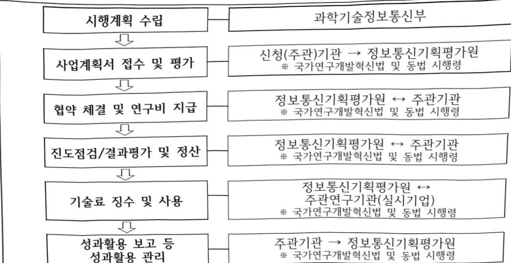

# 차세대 네트워크 AI파운데이션 모델(NFM) 개발(R&D)

**해당 페이지**: PDF 1467 ~ 1472 쪽 해당

**부처**: 과학기술정보통신부
**분야**: 통신
**회계유형**: 일반회계
**2026 확정예산**: 4000.0 백만원
**전년대비 증감률**: None%
**AI 도메인**: LLM/언어모델, 통신/네트워크

---

<table border=1 style='margin: auto; word-wrap: break-word;'><tr><td style='text-align: center; word-wrap: break-word;'>사 업 명</td></tr><tr><td style='text-align: center; word-wrap: break-word;'>(173) 차세대 네트워크 AI파운데이션 모델(NFM) 개발(R&amp;D) (2132-421)</td></tr></table>

## ☐ 사업 코드 정보

<table border=1 style='margin: auto; word-wrap: break-word;'><tr><td style='text-align: center; word-wrap: break-word;'>구분</td><td style='text-align: center; word-wrap: break-word;'>회계</td><td style='text-align: center; word-wrap: break-word;'>소관</td><td style='text-align: center; word-wrap: break-word;'>실국(기관)</td><td style='text-align: center; word-wrap: break-word;'>계정</td><td style='text-align: center; word-wrap: break-word;'>분야</td><td style='text-align: center; word-wrap: break-word;'>부문</td></tr><tr><td style='text-align: center; word-wrap: break-word;'>코드</td><td rowspan="2">일반회계</td><td style='text-align: center; word-wrap: break-word;'>과학기술</td><td style='text-align: center; word-wrap: break-word;'>정보보호</td><td rowspan="2"></td><td style='text-align: center; word-wrap: break-word;'>130</td><td style='text-align: center; word-wrap: break-word;'>133</td></tr><tr><td style='text-align: center; word-wrap: break-word;'>명칭</td><td style='text-align: center; word-wrap: break-word;'>정보통신부</td><td style='text-align: center; word-wrap: break-word;'>네트워크정책관</td><td style='text-align: center; word-wrap: break-word;'>통신</td><td style='text-align: center; word-wrap: break-word;'>정보통신</td></tr></table>

<table border=1 style='margin: auto; word-wrap: break-word;'><tr><td style='text-align: center; word-wrap: break-word;'>구분</td><td style='text-align: center; word-wrap: break-word;'>프로그램</td><td style='text-align: center; word-wrap: break-word;'>단위사업</td><td style='text-align: center; word-wrap: break-word;'>세부사업</td></tr><tr><td style='text-align: center; word-wrap: break-word;'>코드</td><td style='text-align: center; word-wrap: break-word;'>2100</td><td style='text-align: center; word-wrap: break-word;'>2132</td><td style='text-align: center; word-wrap: break-word;'>421</td></tr><tr><td style='text-align: center; word-wrap: break-word;'>명칭</td><td style='text-align: center; word-wrap: break-word;'>정보통신융합산업</td><td style='text-align: center; word-wrap: break-word;'>콘텐츠디바이스기술개발(일반)</td><td style='text-align: center; word-wrap: break-word;'>차세대 네트워크 AI파운데이션 모델(NFM) 개발(R&amp;D)</td></tr></table>

<table border=1 style='margin: auto; word-wrap: break-word;'><tr><td colspan="6">☐ 사업 성격 (공통요구자료 II-1 작성유의사항 4. 참조, 해당하는 사항에 “○” 표시)</td></tr><tr><td style='text-align: center; word-wrap: break-word;'>신규 계속</td><td style='text-align: center; word-wrap: break-word;'>완료</td><td style='text-align: center; word-wrap: break-word;'>예비타당성 실시여부</td><td style='text-align: center; word-wrap: break-word;'>총사업비 관리대상</td><td style='text-align: center; word-wrap: break-word;'>총액계상 예산사업</td><td style='text-align: center; word-wrap: break-word;'>사업소관 변경정보 2025예산 시 소관</td></tr><tr><td style='text-align: center; word-wrap: break-word;'>☐</td><td style='text-align: center; word-wrap: break-word;'></td><td style='text-align: center; word-wrap: break-word;'></td><td style='text-align: center; word-wrap: break-word;'></td><td style='text-align: center; word-wrap: break-word;'></td><td style='text-align: center; word-wrap: break-word;'></td></tr></table>

□ 사업 지원 형태 및 지원을 (최소한 한 개는 반드시 선택하시오. 해당사항에 0 표시)

<table border=1 style='margin: auto; word-wrap: break-word;'><tr><td style='text-align: center; word-wrap: break-word;'>직접</td><td style='text-align: center; word-wrap: break-word;'>출자</td><td style='text-align: center; word-wrap: break-word;'>출연</td><td style='text-align: center; word-wrap: break-word;'>보조</td><td style='text-align: center; word-wrap: break-word;'>융자</td><td style='text-align: center; word-wrap: break-word;'>국고보조율(%)</td><td style='text-align: center; word-wrap: break-word;'>융자율(%)</td></tr><tr><td style='text-align: center; word-wrap: break-word;'></td><td style='text-align: center; word-wrap: break-word;'></td><td style='text-align: center; word-wrap: break-word;'>O</td><td style='text-align: center; word-wrap: break-word;'></td><td style='text-align: center; word-wrap: break-word;'></td><td style='text-align: center; word-wrap: break-word;'></td><td style='text-align: center; word-wrap: break-word;'></td></tr></table>

## □ 사업 소관부처 및 시행주체

<table border=1 style='margin: auto; word-wrap: break-word;'><tr><td style='text-align: center; word-wrap: break-word;'>사업명</td><td colspan="2">구분</td></tr><tr><td rowspan="3">차세대 네트워크 AI과운데이션 모델(NFM) 개발(R&amp;D)</td><td rowspan="2">소관부처</td><td style='text-align: center; word-wrap: break-word;'>정보보호네트워크정책실 정보보호네트워크정책관</td></tr><tr><td style='text-align: center; word-wrap: break-word;'>네트워크정책과</td></tr><tr><td style='text-align: center; word-wrap: break-word;'>사업시행주체</td><td style='text-align: center; word-wrap: break-word;'>정보통신기획평가원</td></tr></table>

---

### 가. 예산 총괄표

(단위: 백만원, %)

<table border=1 style='margin: auto; word-wrap: break-word;'><tr><td rowspan="2">사업명</td><td rowspan="2">2024년 결산</td><td colspan="2">2025년 예산</td><td colspan="2">2026년 예산</td><td rowspan="2">중감(B-A)</td><td rowspan="2">(B-A)/A</td></tr><tr><td style='text-align: center; word-wrap: break-word;'>본예산</td><td style='text-align: center; word-wrap: break-word;'>추경*(A)</td><td style='text-align: center; word-wrap: break-word;'>요구안</td><td style='text-align: center; word-wrap: break-word;'>본예산(B)</td></tr><tr><td style='text-align: center; word-wrap: break-word;'>차세대 네트워크 AI파운데이션 모델(NFM) 개발(R&amp;D)</td><td style='text-align: center; word-wrap: break-word;'>-</td><td style='text-align: center; word-wrap: break-word;'>-</td><td style='text-align: center; word-wrap: break-word;'>-</td><td style='text-align: center; word-wrap: break-word;'>4,000</td><td style='text-align: center; word-wrap: break-word;'>4,000</td><td style='text-align: center; word-wrap: break-word;'>4,000</td><td style='text-align: center; word-wrap: break-word;'>순증</td></tr></table>

□ 기능별(내역사업별) 예산 내역

(단위:백만원)

<table border=1 style='margin: auto; word-wrap: break-word;'><tr><td rowspan="2"></td><td colspan="5">2024</td><td colspan="5">2025</td><td rowspan="2">2026 倉冫</td></tr><tr><td style='text-align: center; word-wrap: break-word;'>倉冫効 (倉冫)</td><td style='text-align: center; word-wrap: break-word;'>倉冫効 倉冫効</td><td style='text-align: center; word-wrap: break-word;'>倉冫効 倉冫効</td><td style='text-align: center; word-wrap: break-word;'>倉冫効</td><td style='text-align: center; word-wrap: break-word;'>倉冫効</td><td style='text-align: center; word-wrap: break-word;'>倉冫効 (倉冫)</td><td style='text-align: center; word-wrap: break-word;'>倉冫効 倉冫効</td><td style='text-align: center; word-wrap: break-word;'>倉冫効</td><td style='text-align: center; word-wrap: break-word;'>倉冫効</td><td style='text-align: center; word-wrap: break-word;'>倉冫効</td></tr><tr><td style='text-align: center; word-wrap: break-word;'>○ 기능별 분류(합계)</td><td style='text-align: center; word-wrap: break-word;'>-</td><td style='text-align: center; word-wrap: break-word;'>-</td><td style='text-align: center; word-wrap: break-word;'>-</td><td style='text-align: center; word-wrap: break-word;'>-</td><td style='text-align: center; word-wrap: break-word;'>-</td><td style='text-align: center; word-wrap: break-word;'>-</td><td style='text-align: center; word-wrap: break-word;'>-</td><td style='text-align: center; word-wrap: break-word;'>-</td><td style='text-align: center; word-wrap: break-word;'>-</td><td style='text-align: center; word-wrap: break-word;'>-</td><td style='text-align: center; word-wrap: break-word;'>4,000</td></tr><tr><td style='text-align: center; word-wrap: break-word;'>· 차세대 네트워크 AI파운데이션모델 (NFM)개발(R&amp;D)</td><td style='text-align: center; word-wrap: break-word;'>-</td><td style='text-align: center; word-wrap: break-word;'>-</td><td style='text-align: center; word-wrap: break-word;'>-</td><td style='text-align: center; word-wrap: break-word;'>-</td><td style='text-align: center; word-wrap: break-word;'>-</td><td style='text-align: center; word-wrap: break-word;'>-</td><td style='text-align: center; word-wrap: break-word;'>-</td><td style='text-align: center; word-wrap: break-word;'>-</td><td style='text-align: center; word-wrap: break-word;'>-</td><td style='text-align: center; word-wrap: break-word;'>-</td><td style='text-align: center; word-wrap: break-word;'>4,000</td></tr></table>

### 나.사업설명자료

1) 사업목적·내용

0 통신 네트워크 환경에서 AI기반 분석과 최적화를 수행하기 위한 대규모 AI 모델인 네트워크 파운데이션 모델 개발 및 실증

- (차세대 네트워크 AI파운데이션모델(NFM)개발) 국내 네트워크 산업·서비스 생태계 활성화와 글로벌 네트워크 시장 경쟁력 강화를 위한 자립형 네트워크 파운데이션 모델(NFM) 확보

2) 사업개요

사업근거 및 추진경위

① 법령상 근거 및 조항 적시

-과학기술기본법 제11조(국가연구개발사업의 추진)

제11조(국가연구개발사업의 추진)

① 중앙행정기관의 장은 기본계획에 따라 말은 분야의 국가연구개발사업과 그 시책을 세워 주진하여야 한다.

---

- 정보통신 진흥 및 융합 활성화 등에 관한 특별법 제14조, 제31조, 제32조, 제39조

제14조(정보통신 네트워크의 고도화)

① 과학기술정보통신부장관은 정보통신 진흥 및 융합 활성화를 위하여 정보통신 네트워크의 고도화를 지속적으로 추진하여야 한다.

제31조(국제협력 및 글로벌협의체 운영 등)

① 과학기술정보통신부장관은 정보통신 진흥 및 융합 활성화를 위하여 필요한 관련 국제 동향을 과악하고 국제협력을 추진하여야 한다.

② 과학기술정보통신부장관은 제1항에 따른 국제협력을 추진하기 위하여 다음 각 호의 업무를 할 수 있다.

3. 정보통신융합등 관련 국제표준화와 국제공동연구·개발사업 등의 지원

제32조(정보통신융합등 기술·서비스 개발 등의 지원)

① 과학기술정보통신부장관은 다른 산업 및 서비스 등에 정보통신의 접목을 통하여 생산성과 가치를 높일 수 있도록 노력하여야 한다.

② 과학기술정보통신부장관은 정보통신 융합 등 기술·서비스의 개발을 촉진하기 위하여 다음 각 호의 사업을 추진할 수 있다.

1. 정보통신융합등 기술·서비스 관련 연구개발 사업

제39조(재원마련)

과학기술정보통신부장관은 정보통신 진흥 및 융합 활성화를 위하여 「방송통신발전 기본법」

제24조에 따른 방송통신발전기금 및 「정보통신산업 진흥법」 제41조에 따른 정보통신진흥 기금을 사용할 수 있다.

-국정과제(20번)관련

[국정과제 20] AI 3대 강국 도약을 위한『AI고속도로』 구축

② 추진경위 - 사업 시작년도, 추진배경, 부처별 중점과제, 대통령 공약사항 등

°(22.5) 정부 110대 국정과제 발표(75. 초격차 전략기술 육성으로 과학기술 G5 도약, 78. 세계 최고의 네트워크 구축 및 디지털 혁신 가속화)

°(22.12) 제5차 과학기술기본계획(23~27) (12대 국가전략기술 중 '차세대 통신')

°(23.2.20) 비상경제장관회의「K-Network 2030」 전략 발표

°(24.2) 국가과학기술자문회의 산하 제5회 국가전략기술 특별위원회 '차세대통신 등 5개 분야 임무중심 전략로드맵' 의결

°(25.8) 국정기획위원회 국민보고대회 정부 123대 국정과제(안) 발표(20. AI 3대 강국 도약을 위한『AI고속도로』 구축)

° (25.12) 제2회 과학기술관계장관회의「Hyper AI네트워크 전략」발표

---

## 주요내용

① 사업규모

- 총사업비 : 해당 없음

- 사업기간 : '26년 ~ '30년 (총 5년)

- 최근 5년 간 투입된 사업비

<table border=1 style='margin: auto; word-wrap: break-word;'><tr><td style='text-align: center; word-wrap: break-word;'>연도</td><td style='text-align: center; word-wrap: break-word;'>2022</td><td style='text-align: center; word-wrap: break-word;'>2023</td><td style='text-align: center; word-wrap: break-word;'>2024</td><td style='text-align: center; word-wrap: break-word;'>2025</td><td style='text-align: center; word-wrap: break-word;'>2026</td></tr><tr><td style='text-align: center; word-wrap: break-word;'>사업비</td><td style='text-align: center; word-wrap: break-word;'>-</td><td style='text-align: center; word-wrap: break-word;'>-</td><td style='text-align: center; word-wrap: break-word;'>-</td><td style='text-align: center; word-wrap: break-word;'>-</td><td style='text-align: center; word-wrap: break-word;'>4,000</td></tr></table>

- 기타: 해당 없음

② 사업추진체계

- 사업시행방법 : 출연

- 사업시행주체 : 정보통신기획평가원

- 사업 수혜자 : 기업, 대학, 정부 출연연구기관·특정연구기관 등

- 보조, 융자, 출연, 출자 등의 경우 보조·융자 등 지원 비율 및 법적근거

<table border=1 style='margin: auto; word-wrap: break-word;'><tr><td style='text-align: center; word-wrap: break-word;'>내역사업명</td><td style='text-align: center; word-wrap: break-word;'>구분</td><td style='text-align: center; word-wrap: break-word;'>피보조·피출연 등 기관명</td><td style='text-align: center; word-wrap: break-word;'>지원 금액 (2026예산)</td><td style='text-align: center; word-wrap: break-word;'>지원 비율(%)</td><td style='text-align: center; word-wrap: break-word;'>보조율 법적근거 (해당 조항)</td></tr><tr><td style='text-align: center; word-wrap: break-word;'>차세대 네트워크 AI파운데이션 모델(NFM) 개발</td><td style='text-align: center; word-wrap: break-word;'>출연</td><td style='text-align: center; word-wrap: break-word;'>정보통신 기획 평가원</td><td style='text-align: center; word-wrap: break-word;'>4,000</td><td style='text-align: center; word-wrap: break-word;'>100%</td><td style='text-align: center; word-wrap: break-word;'>정보통신융합 및 활성화 등에 관한 특별법 제32조, 동법 시행령 제35조</td></tr></table>

## 3 ) 2026년도 예산 산출 근거

□ 차세대 네트워크 AI파운데이션모델(NFM)개발 : (2025 본예산) 0백만원 → (2026 요구) 4,000백만원, 신규

① 차세대 네트워크 AI파운데이션모델(NFM)개발

:(2025 본예산) 0백만원 → (2026 요구) 4,000백만원, 신규

- (요구) 파운데이션 모델 개발을 위한 데이터 전처리 및 학습 환경 인프라 구축을 위한 4,000백만원 요구

· 사전학습을 위한 데이터 레이크 구축 기반 기술 개발(12억)

* 데이터 확보 및 학습 방안: 국내 통신사업자망, 연구망(KOREN, KREONET), 국내 네트워크 장비(우리넷, 다산네트웍스, 두두원 등)

컨소시엄 구성을 통한 데이터 확보 및 연합학습/분할학습을 병행한 데이터 보안 유지

NFM

·NFM 학습을 위한 스토리지 및 네트워크 인프라 및 SW 플랫폼 구축(12억)

·멀티모달 네트워크 데이터 전처리 기반 기술 개발(6억)

·통신네트워크 특화 대규모 언어 모델(LLM), 멀티모달 모델(LMM) 아키텍처 기술 개발(10억)

- (산출) (신규) 4,000백만원 = 1개 과제 × 5,333백만원 × 9/12개월

2025년도 예산 및 2026년도 예산 산출 세부내역 비교

<table border=1 style='margin: auto; word-wrap: break-word;'><tr><td colspan="2">2025년 본예산</td><td colspan="2">2026년 예산안</td></tr><tr><td style='text-align: center; word-wrap: break-word;'>예산</td><td style='text-align: center; word-wrap: break-word;'>산출내역</td><td style='text-align: center; word-wrap: break-word;'>예산</td><td style='text-align: center; word-wrap: break-word;'>산출내역</td></tr><tr><td style='text-align: center; word-wrap: break-word;'>-</td><td style='text-align: center; word-wrap: break-word;'>-</td><td style='text-align: center; word-wrap: break-word;'>4,000</td><td style='text-align: center; word-wrap: break-word;'>&lt; 차세대 네트워크 AI파운데이션모델(NFM)개발 &gt; 신규 - (신규) 4,000백만원 = 1개 과제 × 5,333백만원 × 9/12개월</td></tr></table>

---

## 4 ) 사업효과

□ 사업영향, 산출물 성과지표 등

① 2022~2026년도 성과계획서 상 성과지표 및 최근 5년간 성과 달성도

<table border=1 style='margin: auto; word-wrap: break-word;'><tr><td style='text-align: center; word-wrap: break-word;'>성과지표</td><td style='text-align: center; word-wrap: break-word;'>구분</td><td style='text-align: center; word-wrap: break-word;'>2022</td><td style='text-align: center; word-wrap: break-word;'>2023</td><td style='text-align: center; word-wrap: break-word;'>2024</td><td style='text-align: center; word-wrap: break-word;'>2025</td><td style='text-align: center; word-wrap: break-word;'>2026</td><td style='text-align: center; word-wrap: break-word;'>2026목표치산출근거</td><td style='text-align: center; word-wrap: break-word;'>측정산식(또는 측정방법)</td><td style='text-align: center; word-wrap: break-word;'>자료수집방법(또는 자료출처)</td></tr><tr><td rowspan="3">논문의표준화된순위보정영향력지수(mrnIF)(단위: 점)</td><td style='text-align: center; word-wrap: break-word;'>목표</td><td style='text-align: center; word-wrap: break-word;'>-</td><td style='text-align: center; word-wrap: break-word;'>-</td><td style='text-align: center; word-wrap: break-word;'>-</td><td style='text-align: center; word-wrap: break-word;'>(신규)</td><td style='text-align: center; word-wrap: break-word;'>67.27</td><td rowspan="3">&#x27;26년도 목표가신규지표임을 감안하여 기준 ICT R&amp;D 기술개발사업 최근 3년간 실적치의 평균치 67.27점을 목표치로 설정함(이후, 연차별 1% 상향)</td><td rowspan="3">$  \pm  $논문(mrnIF*) ÷논문건수*표준화된순위보정 영향력지수= $  \frac{(N \times \text{rnIF}_j - 1)}{N - 1} \times 100  $</td><td rowspan="3">NTIS, JCR</td></tr><tr><td style='text-align: center; word-wrap: break-word;'>실적</td><td style='text-align: center; word-wrap: break-word;'>-</td><td style='text-align: center; word-wrap: break-word;'>-</td><td style='text-align: center; word-wrap: break-word;'>-</td><td style='text-align: center; word-wrap: break-word;'>-</td><td style='text-align: center; word-wrap: break-word;'>-</td></tr><tr><td style='text-align: center; word-wrap: break-word;'>달성도</td><td style='text-align: center; word-wrap: break-word;'>-</td><td style='text-align: center; word-wrap: break-word;'>-</td><td style='text-align: center; word-wrap: break-word;'>-</td><td style='text-align: center; word-wrap: break-word;'>-</td><td style='text-align: center; word-wrap: break-word;'>-</td></tr><tr><td rowspan="3">등록특허등급(SMART)지수(단위: 점)</td><td style='text-align: center; word-wrap: break-word;'>목표</td><td style='text-align: center; word-wrap: break-word;'>-</td><td style='text-align: center; word-wrap: break-word;'>-</td><td style='text-align: center; word-wrap: break-word;'>-</td><td style='text-align: center; word-wrap: break-word;'>(신규)</td><td style='text-align: center; word-wrap: break-word;'>4.22</td><td rowspan="3">&#x27;26년도 목표가신규지표임을 감안하여 기준 ICT R&amp;D 기술개발사업 최근 3년간 실적치의 평균치 4.22점을 목표치로 설정함(이후, 연차별 1% 상향)</td><td rowspan="3">$  \sum  $(Ai x Bi) /  $  \sum  $(Ai : 특허등급별 가중치, Bi : 등급별 특허성과 건수)</td><td rowspan="3">NTIS, 한국발명 진흥회(SMART)</td></tr><tr><td style='text-align: center; word-wrap: break-word;'>실적</td><td style='text-align: center; word-wrap: break-word;'>-</td><td style='text-align: center; word-wrap: break-word;'>-</td><td style='text-align: center; word-wrap: break-word;'>-</td><td style='text-align: center; word-wrap: break-word;'>-</td><td style='text-align: center; word-wrap: break-word;'>-</td></tr><tr><td style='text-align: center; word-wrap: break-word;'>달성도</td><td style='text-align: center; word-wrap: break-word;'>-</td><td style='text-align: center; word-wrap: break-word;'>-</td><td style='text-align: center; word-wrap: break-word;'>-</td><td style='text-align: center; word-wrap: break-word;'>-</td><td style='text-align: center; word-wrap: break-word;'>-</td></tr><tr><td rowspan="3">정부출연금10억원당 특허등록건수(단위: 건)</td><td style='text-align: center; word-wrap: break-word;'>목표</td><td style='text-align: center; word-wrap: break-word;'>-</td><td style='text-align: center; word-wrap: break-word;'>-</td><td style='text-align: center; word-wrap: break-word;'>-</td><td style='text-align: center; word-wrap: break-word;'>(신규)</td><td style='text-align: center; word-wrap: break-word;'>2.32</td><td rowspan="3">&#x27;26년도 목표가신규지표임을 감안하여 기준 ICT R&amp;D 기술개발사업 최근 3년간 실적치의 평균치 2.32점을 목표치로 설정함(이후, 연차별 1% 상향)</td><td rowspan="3">$  \pm  $10×특허등록(국내+국외)건수/당해사업비(억원)</td><td rowspan="3">NTIS, 성과보고서</td></tr><tr><td style='text-align: center; word-wrap: break-word;'>실적</td><td style='text-align: center; word-wrap: break-word;'>-</td><td style='text-align: center; word-wrap: break-word;'>-</td><td style='text-align: center; word-wrap: break-word;'>-</td><td style='text-align: center; word-wrap: break-word;'>-</td><td style='text-align: center; word-wrap: break-word;'>-</td></tr><tr><td style='text-align: center; word-wrap: break-word;'>달성도</td><td style='text-align: center; word-wrap: break-word;'>-</td><td style='text-align: center; word-wrap: break-word;'>-</td><td style='text-align: center; word-wrap: break-word;'>-</td><td style='text-align: center; word-wrap: break-word;'>-</td><td style='text-align: center; word-wrap: break-word;'>-</td></tr></table>

② 성과지표 이외의 연도별 사업추진 경과 및 실적 : 해당 없음

③ 향후(2026년도 이후) 기대효과

°(경제/사회적 파급효과)

- 네트워크 과운테이션 모델의 API 개방을 통해 통신네트워크 분야의 신생 SW/AI 스타트업 성장을 촉진하고, 융합형 네트워크 AI 모델 확산으로 혁신적인 솔루션과 서비스가 제공되어 통신네트워크 SW/AI 시장 활성화 기대

°(직·간접적 고용, 일자리 창출, 인력양성 파급효과)

- 전략적이고 체계적인 네트워크 과운데이션 모델 개발 프로젝트를 통해 통신

네트워크 특화 생성형 AI 기술력을 축적한 AI 전문인력 양성 및 일자리 창출 가능

5) 타당성조사 및 예비타당성조사 시행여부 및 결과 요지 : 해당 없음

6) 총사업비 대상사업 정보 : 해당 없음

---

## 7 ) 사업 집행절차

- 차세대 네트워크 AI파운데이션모델(NFM)개발

<table border=1 style='margin: auto; word-wrap: break-word;'><tr><td style='text-align: center; word-wrap: break-word;'>부처</td><td style='text-align: center; word-wrap: break-word;'></td><td style='text-align: center; word-wrap: break-word;'>피출연·피보조기관</td><td style='text-align: center; word-wrap: break-word;'></td><td style='text-align: center; word-wrap: break-word;'>간접보조사업자·사업수행자</td></tr><tr><td style='text-align: center; word-wrap: break-word;'>과학기술정보통신부(4,000백만원)</td><td style='text-align: center; word-wrap: break-word;'>↔(4,000백만원)</td><td style='text-align: center; word-wrap: break-word;'>정보통신기획평가원</td><td style='text-align: center; word-wrap: break-word;'>↔(4,000백만원)</td><td style='text-align: center; word-wrap: break-word;'>산·학·연·기타</td></tr></table>

8) 각종 평가 : 해당 없음

다. 최근 4년간 결산내역 : 해당 없음

---

### 원본 PDF 크롭 이미지

