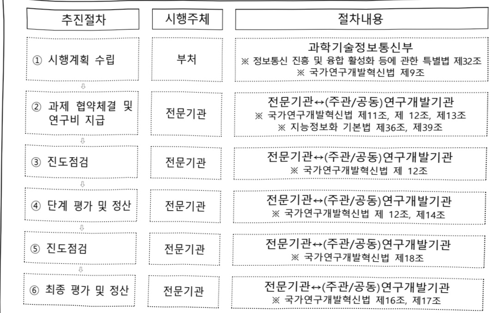

# 차세대 네트워크 선도 연구시험망 구축운영(R&D)

**해당 페이지**: PDF 1473 ~ 1480 쪽 해당

**부처**: 과학기술정보통신부
**분야**: 통신
**회계유형**: 일반회계
**2026 확정예산**: 11500.0 백만원
**전년대비 증감률**: 27.8%
**AI 도메인**: 통신/네트워크

---

<table border=1 style='margin: auto; word-wrap: break-word;'><tr><td style='text-align: center; word-wrap: break-word;'>사 업 명</td></tr><tr><td style='text-align: center; word-wrap: break-word;'>(142) 차세대 네트워크 선도 연구시험망 구축운영(R&amp;D) (2033-363)</td></tr></table>

☐ 사업 코드 정보

<table border=1 style='margin: auto; word-wrap: break-word;'><tr><td style='text-align: center; word-wrap: break-word;'>구분</td><td style='text-align: center; word-wrap: break-word;'>회계</td><td style='text-align: center; word-wrap: break-word;'>소관</td><td style='text-align: center; word-wrap: break-word;'>실국(기관)</td><td style='text-align: center; word-wrap: break-word;'>계정</td><td style='text-align: center; word-wrap: break-word;'>분야</td><td style='text-align: center; word-wrap: break-word;'>부문</td></tr><tr><td style='text-align: center; word-wrap: break-word;'>코드</td><td rowspan="2">일반회계</td><td style='text-align: center; word-wrap: break-word;'>과학기술</td><td style='text-align: center; word-wrap: break-word;'>정보보호</td><td rowspan="2">-</td><td style='text-align: center; word-wrap: break-word;'>130</td><td style='text-align: center; word-wrap: break-word;'>133</td></tr><tr><td style='text-align: center; word-wrap: break-word;'>명칭</td><td style='text-align: center; word-wrap: break-word;'>정보통신부</td><td style='text-align: center; word-wrap: break-word;'>네트워크정책관</td><td style='text-align: center; word-wrap: break-word;'>통신</td><td style='text-align: center; word-wrap: break-word;'>정보통신</td></tr></table>

<table border=1 style='margin: auto; word-wrap: break-word;'><tr><td style='text-align: center; word-wrap: break-word;'>구분</td><td style='text-align: center; word-wrap: break-word;'>프로그램</td><td style='text-align: center; word-wrap: break-word;'>단위사업</td><td style='text-align: center; word-wrap: break-word;'>세부사업</td></tr><tr><td style='text-align: center; word-wrap: break-word;'>코드</td><td style='text-align: center; word-wrap: break-word;'>2000</td><td style='text-align: center; word-wrap: break-word;'>2033</td><td style='text-align: center; word-wrap: break-word;'>363</td></tr><tr><td style='text-align: center; word-wrap: break-word;'>명칭</td><td style='text-align: center; word-wrap: break-word;'>인터넷융합산업</td><td style='text-align: center; word-wrap: break-word;'>스마트화산업기반확충(일반)</td><td style='text-align: center; word-wrap: break-word;'>차세대 네트워크 선도 연구시험망 구축운영(R&amp;D)</td></tr></table>

□ 사업 성격 (공통요구자료 Ⅱ-1 작성유의사항 4. 참조, 해당하는 사항에 “○” 표시)

<table border=1 style='margin: auto; word-wrap: break-word;'><tr><td rowspan="2">신규</td><td rowspan="2">계속</td><td rowspan="2">완료</td><td rowspan="2">예비타당성 실시여부</td><td rowspan="2">총사업비 관리대상</td><td rowspan="2">총액계상 예산사업</td><td style='text-align: center; word-wrap: break-word;'>사업소관 변경정보</td></tr><tr><td style='text-align: center; word-wrap: break-word;'>2025예산 시 소관</td></tr><tr><td style='text-align: center; word-wrap: break-word;'></td><td style='text-align: center; word-wrap: break-word;'>○</td><td style='text-align: center; word-wrap: break-word;'></td><td style='text-align: center; word-wrap: break-word;'></td><td style='text-align: center; word-wrap: break-word;'></td><td style='text-align: center; word-wrap: break-word;'></td><td style='text-align: center; word-wrap: break-word;'></td></tr></table>

사업 지원 형태 및 지원을 (최소한 한 개는 반드시 선택하시오. 해당사항에 0 표시)

<table border=1 style='margin: auto; word-wrap: break-word;'><tr><td style='text-align: center; word-wrap: break-word;'>직접</td><td style='text-align: center; word-wrap: break-word;'>출자</td><td style='text-align: center; word-wrap: break-word;'>출연</td><td style='text-align: center; word-wrap: break-word;'>보조</td><td style='text-align: center; word-wrap: break-word;'>융자</td><td style='text-align: center; word-wrap: break-word;'>국고보조율(%)</td><td style='text-align: center; word-wrap: break-word;'>융자율(%)</td></tr><tr><td style='text-align: center; word-wrap: break-word;'></td><td style='text-align: center; word-wrap: break-word;'></td><td style='text-align: center; word-wrap: break-word;'>○</td><td style='text-align: center; word-wrap: break-word;'></td><td style='text-align: center; word-wrap: break-word;'></td><td style='text-align: center; word-wrap: break-word;'></td><td style='text-align: center; word-wrap: break-word;'></td></tr></table>

□ 사업 소관부처 및 시행주체

<table border=1 style='margin: auto; word-wrap: break-word;'><tr><td style='text-align: center; word-wrap: break-word;'>사업명</td><td colspan="2">구분</td></tr><tr><td rowspan="3">차세대네트워크선도연구시험망구축운영(R&amp;D)</td><td rowspan="2">소관부처</td><td style='text-align: center; word-wrap: break-word;'>정보보호네트워크정책실정보보호네트워크정책관</td></tr><tr><td style='text-align: center; word-wrap: break-word;'>네트워크정책과</td></tr><tr><td style='text-align: center; word-wrap: break-word;'>사업시행주체</td><td style='text-align: center; word-wrap: break-word;'>정보통신기획평가원</td></tr></table>

---

### 가. 예산 총괄표

(단위: 백만원, %)

<table border=1 style='margin: auto; word-wrap: break-word;'><tr><td rowspan="2">사업명</td><td rowspan="2">2024년 결산</td><td colspan="2">2025년 예산</td><td colspan="2">2026년 예산</td><td rowspan="2">중감(B-A)</td><td rowspan="2">(B-A)/A</td></tr><tr><td style='text-align: center; word-wrap: break-word;'>본예산</td><td style='text-align: center; word-wrap: break-word;'>추경*(A)</td><td style='text-align: center; word-wrap: break-word;'>요구안</td><td style='text-align: center; word-wrap: break-word;'>본예산(B)</td></tr><tr><td style='text-align: center; word-wrap: break-word;'>차세대 네트워크 선도 연구시험망 구축운영(R&amp;D)</td><td style='text-align: center; word-wrap: break-word;'>9,000</td><td style='text-align: center; word-wrap: break-word;'>9,000</td><td style='text-align: center; word-wrap: break-word;'>9,000</td><td style='text-align: center; word-wrap: break-word;'>11,500</td><td style='text-align: center; word-wrap: break-word;'>11,500</td><td style='text-align: center; word-wrap: break-word;'>2,500</td><td style='text-align: center; word-wrap: break-word;'>27.8</td></tr></table>

*추경: 추경증감액을 포함한 최종 예산액을 기재

## □ 기능별(내역사업별) 예산 내역

(단위:백만원)

<table border=1 style='margin: auto; word-wrap: break-word;'><tr><td rowspan="2"></td><td colspan="5">2024</td><td colspan="5">2025</td><td rowspan="2">2026 예산</td></tr><tr><td style='text-align: center; word-wrap: break-word;'>예산액(추경)</td><td style='text-align: center; word-wrap: break-word;'>예산현액</td><td style='text-align: center; word-wrap: break-word;'>집행액</td><td style='text-align: center; word-wrap: break-word;'>이월액</td><td style='text-align: center; word-wrap: break-word;'>불용액</td><td style='text-align: center; word-wrap: break-word;'>예산액(추경)</td><td style='text-align: center; word-wrap: break-word;'>예산현액</td><td style='text-align: center; word-wrap: break-word;'>집행액</td><td style='text-align: center; word-wrap: break-word;'>이월액</td><td style='text-align: center; word-wrap: break-word;'>불용액</td></tr><tr><td style='text-align: center; word-wrap: break-word;'>○ 기능별 분류(합계)</td><td style='text-align: center; word-wrap: break-word;'>9,000</td><td style='text-align: center; word-wrap: break-word;'>9,000</td><td style='text-align: center; word-wrap: break-word;'>9,000</td><td style='text-align: center; word-wrap: break-word;'>-</td><td style='text-align: center; word-wrap: break-word;'>-</td><td style='text-align: center; word-wrap: break-word;'>9,000</td><td style='text-align: center; word-wrap: break-word;'>9,000</td><td style='text-align: center; word-wrap: break-word;'>9,000</td><td style='text-align: center; word-wrap: break-word;'>-</td><td style='text-align: center; word-wrap: break-word;'>-</td><td style='text-align: center; word-wrap: break-word;'>11,500</td></tr><tr><td style='text-align: center; word-wrap: break-word;'>• 차세대 네트워크 선도 연구시험망 구축운영(R&amp;D)</td><td style='text-align: center; word-wrap: break-word;'>9,000</td><td style='text-align: center; word-wrap: break-word;'>9,000</td><td style='text-align: center; word-wrap: break-word;'>9,000</td><td style='text-align: center; word-wrap: break-word;'>-</td><td style='text-align: center; word-wrap: break-word;'>-</td><td style='text-align: center; word-wrap: break-word;'>9,000</td><td style='text-align: center; word-wrap: break-word;'>9,000</td><td style='text-align: center; word-wrap: break-word;'>9,000</td><td style='text-align: center; word-wrap: break-word;'>-</td><td style='text-align: center; word-wrap: break-word;'>-</td><td style='text-align: center; word-wrap: break-word;'>11,500</td></tr></table>

### 나. 사업설명자료

## 1 ) 사업목적·내용

ㅇ 글로벌 기술 패권 경쟁 및 자국 우선주의 환경에서 기술 주권 확보를 위한 “차세대 네트워크 기술혁신 선도 연구시험망”을 구축·제공하고, 민·관 간 초협력을 통한 실증·시험 영역 확대 및 이용 활성화 촉진

- (차세대 네트워크 선도 연구시험망 구축운영) 산·학·연이 차세대 네트워크 분야 연구 및 기술개발을 진행하고 시험·검증 등을 수행할 수 있도록 국내 유일의 전국 단위 연구개발망 구축·운영

## 2 ) 사업개요

## 사업근거 및 추진경위

① 법령상 근거 및 조항 적시

- 정보통신 진흥 및 융합 활성화 등에 관한 특별법 제32조(정보통신융합등 기술·서비스 개발 등의 지원)

---

## 제32조(정보통신융합등 기술·서비스 개발 등의 지원)

① 과학기술정보통신부장관은 다른 산업 및 서비스 등에 정보통신의 접목을 통하여 생산성과 가치를 높일 수 있도록 노력하여야 한다.

② 과학기술정보통신부장관은 정보통신융합등 기술·서비스의 개발을 촉진하기 위하여 다음 각 호의 사업을 추진할 수 있다.

1. 정보통신융합등 기술·서비스 관련 연구개발 사업(중략)

2. 정보통신융합등 기술·서비스 관련 시범사업(이하생략)

- 지능정보화 기본법 제36조(초연결지능형연구개발망의 구축·관리)

제36조(초연결지능형연구개발망의 구축·관리)

과학기술정보통신부장관은 초연결지능정보통신망의 구축을 촉진하기 위하여 국가재정으로 초연결지능연구개발망(초연결지능정보통신망과 관련한 기술 및 서비스를 시험·검증하고 연구개발을 지원하기 위한 정보통신망을 말한다)을 구축·관리·운영하거나 제39조에 따라 지정된 전담기관으로 하여금 구축·관리·운영하게 할 수 있다.

-방송통신발전 기본법 제14조(방송통신기반시설 조성·지원)

-국정과제(20번)관련

[국정과제 20] AI 3대 강국 도약을 위한『AI고속도로』 구축

② 추진경위 - 사업 시작년도, 추진배경, 부처별 중점과제, 대통령 공약사항 등

’95. 06월 : 선도시험망 사업계획 수립

°'01.06월 : 초고속정보통신망 고도화 기본계획 수립(초고속선도망)

° '04. 02월 : 광대역통합망(BcN) 구축 기본계획(첨단연구개발망)

° '06. 03월 : 광대역통합망(BcN) 구축 기본계획 Ⅱ(광대역통합연구개발망)

° '09. 01월 : 방송통신망 중장기 발전계획

° '11. 06월 : 미래를 대비한 인터넷 발전계획 수립

° '12. 12월 : 선도시험망을 활용한 미래인터넷 활성화 방안

° '14. 05월 : 네트워크 장비산업 상생발전 실천계획(정보통신전략위원회)

° '15. 12월 : KOREN FNC(Future Network Center) 개소

° '15. 12월 : K-ICT 네트워크 발전전략 수립(정보통신전략위원회)

° '16. 10월 : 2017~2019년 KOREN 국내망 고도화 기본계획 수립

° '16. 11월 : 공공안전분야(PS-LTE, LTE-R, LTE-M, LPWA) 시험검증 환경 구축

° '17. 11월 : AI Network Lab 확대 개소

° '18. 12월 : 전국 10개 지역 접속점 SW기반 네트워크로 전환

° '19. 07월 : 초연결 지능형 연구개발망 구축운영 사전기획보고서 마련

° '19. 10월 : 초연결 지능형 연구개발망 국내망 4개년 사업계획(안) 과기부 승인

° '20. 04월 : 20년도 사업착수('20.1~'23.12)

° '20. 11월 : 차세대 네트워크 기반 구축사업 종료평가 우수(80.6점)

---

° '22. 12월 : 차세대 네트워크 선도 연구시험망 구축·운영 사전기획보고서 마련

° '23. 12월 : 국내 최초 백본망(서울-대전 구간) 1.2Tbps 대역폭 구현 및 선도 적용

° '24. 03월 : '차세대 네트워크 선도 연구시험망('24~'27년) 사업계획 수립

° '24. 12월 : R&D 연구개발 결과물 법정인증 연계지원 체계 마련

° '24. 12월 : 국내 최초 백본망(서울-대전 구간) 2.8Tbps 대역폭 구현 및 선도 적용

° '25. 08월 : 국정기획위원회 국민보고대회 정부 123대 국정과제(안) 발표(20. AI 3대 강국 도약을 위한『AI고속도로』 구축)

주요내용

① 사업규모

- 총사업비 : 해당 없음

- 사업기간 : 2024~2027년 (총 4년)

- 최근 5년 간 투입된 사업비(예산액기준, 추경편성한 연도에는 추경포함)

(단위,백만원)

<table border=1 style='margin: auto; word-wrap: break-word;'><tr><td style='text-align: center; word-wrap: break-word;'>연도</td><td style='text-align: center; word-wrap: break-word;'>2022</td><td style='text-align: center; word-wrap: break-word;'>2023</td><td style='text-align: center; word-wrap: break-word;'>2024</td><td style='text-align: center; word-wrap: break-word;'>2025</td><td style='text-align: center; word-wrap: break-word;'>2026</td></tr><tr><td style='text-align: center; word-wrap: break-word;'>사업비</td><td style='text-align: center; word-wrap: break-word;'>-</td><td style='text-align: center; word-wrap: break-word;'>-</td><td style='text-align: center; word-wrap: break-word;'>9,000</td><td style='text-align: center; word-wrap: break-word;'>9,000</td><td style='text-align: center; word-wrap: break-word;'>11,500</td></tr></table>

-기타:해당 없음

② 사업추진체계

- 사업시행방법 : 출연

- 사업시행주체 : (전문기관) 정보통신기획평가원, (주관기관) 한국지능정보사회진흥원

-사업 수혜자 : 기업, 대학, 연구소 등

- 보조, 융자, 출연, 출자 등의 경우 보조·융자 등 지원 비율 및 법적근거

<table border=1 style='margin: auto; word-wrap: break-word;'><tr><td style='text-align: center; word-wrap: break-word;'>내역사업명</td><td style='text-align: center; word-wrap: break-word;'>구분</td><td style='text-align: center; word-wrap: break-word;'>피보조·피출연 등 기관명</td><td style='text-align: center; word-wrap: break-word;'>지원 금액 (2026예산)</td><td style='text-align: center; word-wrap: break-word;'>지원 비율(%)</td><td style='text-align: center; word-wrap: break-word;'>보조율 법적근거 (해당 조항)</td></tr><tr><td style='text-align: center; word-wrap: break-word;'>차세대 네트워크 선도 연구시험방구축운영</td><td style='text-align: center; word-wrap: break-word;'>출연</td><td style='text-align: center; word-wrap: break-word;'>정보통신 기획평가원</td><td style='text-align: center; word-wrap: break-word;'>11,500</td><td style='text-align: center; word-wrap: break-word;'>100%</td><td style='text-align: center; word-wrap: break-word;'>- 정보통신 진흥 및 융합 활성화 등에 관한 특별법 제32조(정보통신융합등기술·서비스개발 등의 지원) - 한국연구재단법 제11조(출연금)</td></tr></table>

---

## 3 ) 2026년도 예산 산출 근거

① 차세대 네트워크 선도 연구시험망 구축운영

:(2025 본예산) 9,000백만원 → (2026 요구) 11,500백만원, 2,500백만원 증액

- (요구) 차세대 네트워크 선도 연구시험망 운영 및 고도화를 위해 10,600백만원 요구

신기술 장비·서비스 실증 이용 활성화를 위해 900백만원 요구

- (산출) 1개 과제 × 11,500백만원 × 12/12개월 = 11,500백만원

02025년도 예산 및 2026년도 예산 산출 세부내역 비교

<table border=1 style='margin: auto; word-wrap: break-word;'><tr><td colspan="2">2025년 본예산</td><td colspan="2">2026년 예산</td></tr><tr><td style='text-align: center; word-wrap: break-word;'>예산</td><td style='text-align: center; word-wrap: break-word;'>산출내역</td><td style='text-align: center; word-wrap: break-word;'>예산</td><td style='text-align: center; word-wrap: break-word;'>산출내역</td></tr><tr><td style='text-align: center; word-wrap: break-word;'>9,000 백만원</td><td style='text-align: center; word-wrap: break-word;'>○ 차세대 네트워크 선도 연구시험망 구축운영 : 9,000백만원 가. 차세대 네트워크 선도 연구시험망 구축운영 : 9,000백만원 · 1개 과제 × 9,000백만원 × 12/12개월 나. 상세 산출내역 · SW기반 네트워크/네트워크 가상화 등 네트워크 신기술 적용 연구개발망 구축·운영 : 10구간 × 400백만원 = 4,000백만원 · 국제망(한국↔싱가포르, 홍콩) : 2식 × 1,000백만원 = 2,000백만원 · 망관리센터(NOC) 운영(국내망/국제망) : 1식 × 1,000백만원 = 1,000백만원 · 클라우드 네이티브 기반 마련 : 1식 × 600백만원 = 600백만원 · AI Network Lab 기술지원시험검증 환경 운영) : 1식 × 200백만원 = 200백만원 · 연구개발 시험검증체계 운영(공공·민간 연구개발 결과물 시험검증) : 1식 × 500백만원 = 500백만원 · 통합인증체계 운영 : 1식 × 500백만원 = 500백만원 · 연구협력체계 운영 : 1식 × 200백만원 = 200백만원</td><td style='text-align: center; word-wrap: break-word;'>11,500 백만원</td><td style='text-align: center; word-wrap: break-word;'>○ 차세대 네트워크 선도 연구시험망 구축운영 : 11,500백만원 가. 차세대 네트워크 선도 연구시험망 구축운영 : 11,500백만원 · 1개 과제 × 11,500백만원 × 12/12개월 나. 상세 산출내역 · SW기반 네트워크/네트워크 가상화 등 네트워크 신기술 적용 연구개발망 구축·운영 : 10구간 × 400백만원 = 4,000백만원 · 국제망(한국↔싱가포르, 홍콩) : 2식 × 1,000백만원 = 2,000백만원 · 국제망 신뢰성 강화를 위한 추가 노드(한국↔일본) 구성·운영(대역폭 10Gbps) : 1식 × 1,000백만원 = 1,000백만원 · 망관리센터(NOC) 운영(국내망/국제망) : 1식 × 1,000백만원 = 1,000백만원 · 클라우드 네이티브 기반 마련 : 1식 × 600백만원 = 600백만원 · 초지능·초저지연·고신뢰 연구시험망으로 전환하기 위한 AI Work Node 시범 구현 : 2구간 × 1,000백만원 = 2000백만원 · AI Network Lab 기술지원시험검증 환경 운영) : 1식 × 200백만원 = 200백만원 · 연구개발 시험검증체계 운영(공공·민간 연구개발 결과물 시험검증) : 1식 × 500백만원 = 500백만원 · 연구협력체계 운영 : 1식 × 200백만원 = 200백만원</td></tr></table>

---

## 4 ) 사업효과

☐ 사업영향, 산출물 성과지표 등

① 2022~2026년도 성과계획서 상 성과지표 및 최근 5년간 성과 달성도

<table border=1 style='margin: auto; word-wrap: break-word;'><tr><td style='text-align: center; word-wrap: break-word;'>성과지표</td><td style='text-align: center; word-wrap: break-word;'>구분</td><td style='text-align: center; word-wrap: break-word;'>2022</td><td style='text-align: center; word-wrap: break-word;'>2023</td><td style='text-align: center; word-wrap: break-word;'>2024</td><td style='text-align: center; word-wrap: break-word;'>2025</td><td style='text-align: center; word-wrap: break-word;'>2026</td><td style='text-align: center; word-wrap: break-word;'>2026 목표치산출근거</td><td style='text-align: center; word-wrap: break-word;'>측정산식(또는 측정방법)</td><td style='text-align: center; word-wrap: break-word;'>자료수집방법(또는 자료출처)</td></tr><tr><td rowspan="2">인프라 가용률(단위: %)</td><td style='text-align: center; word-wrap: break-word;'>목표실적</td><td style='text-align: center; word-wrap: break-word;'>-</td><td style='text-align: center; word-wrap: break-word;'>-</td><td style='text-align: center; word-wrap: break-word;'>90</td><td style='text-align: center; word-wrap: break-word;'>92</td><td style='text-align: center; word-wrap: break-word;'>94</td><td rowspan="2">첫 해는 HW-SW 중심 인프라 전환에 따른 기술 변화 Cloud Native 기반 연구지원플랫폼으로 시험환경 전환, SDI 기반 지원체계 개선 등을 감안하여 90%로 목표치를 설정 ※ 매년 2% 상향</td><td rowspan="2">KOREN 인프라 가용 율*=(백본망 가용 율+가입자망 가용율)/2* 인프라(백본망+가입자망) 실제 가동시간/가용 시간(365일×24시간)</td><td rowspan="2">연차보고서</td></tr><tr><td style='text-align: center; word-wrap: break-word;'>달성도</td><td style='text-align: center; word-wrap: break-word;'>-</td><td style='text-align: center; word-wrap: break-word;'>-</td><td style='text-align: center; word-wrap: break-word;'>104.2</td><td style='text-align: center; word-wrap: break-word;'>-</td><td style='text-align: center; word-wrap: break-word;'>-</td></tr><tr><td rowspan="2">기술지원 건수(단위: 건)</td><td style='text-align: center; word-wrap: break-word;'>목표실적</td><td style='text-align: center; word-wrap: break-word;'>-</td><td style='text-align: center; word-wrap: break-word;'>-</td><td style='text-align: center; word-wrap: break-word;'>220</td><td style='text-align: center; word-wrap: break-word;'>264</td><td style='text-align: center; word-wrap: break-word;'>317</td><td rowspan="2">직전 일몰 사업의 최근 3개년 평균값을 목표치로 설정 ※ 매년 120% 상향</td><td rowspan="2">기술지도 건수(KOREN 인프라 연동·연계 기술지원 건수)+시험·검증·분석 지원(시험·검증 절차 및 결과분석 지원 건수)+시제품 제작 지원+인증지원</td><td rowspan="2">연차보고서</td></tr><tr><td style='text-align: center; word-wrap: break-word;'>달성도</td><td style='text-align: center; word-wrap: break-word;'>-</td><td style='text-align: center; word-wrap: break-word;'>-</td><td style='text-align: center; word-wrap: break-word;'>115.4</td><td style='text-align: center; word-wrap: break-word;'>-</td><td style='text-align: center; word-wrap: break-word;'>-</td></tr><tr><td rowspan="2">이용자 만족도(단위: 점)</td><td style='text-align: center; word-wrap: break-word;'>목표실적</td><td style='text-align: center; word-wrap: break-word;'>-</td><td style='text-align: center; word-wrap: break-word;'>-</td><td style='text-align: center; word-wrap: break-word;'>83.5</td><td style='text-align: center; word-wrap: break-word;'>84</td><td style='text-align: center; word-wrap: break-word;'>84.5</td><td rowspan="2">직전 일몰 사업의 목표치(83점)를 기준으로 매년 0.5점씩 상향하여 목표삶성</td><td rowspan="2">KOREN 이용기관, 기술지원 및 교육생 등 이용자의 전반적인 만족도 조사</td><td rowspan="2">연차보고서</td></tr><tr><td style='text-align: center; word-wrap: break-word;'>달성도</td><td style='text-align: center; word-wrap: break-word;'>-</td><td style='text-align: center; word-wrap: break-word;'>-</td><td style='text-align: center; word-wrap: break-word;'>102.6</td><td style='text-align: center; word-wrap: break-word;'>-</td><td style='text-align: center; word-wrap: break-word;'>-</td></tr></table>

② 성과지표 이외의 연도별 사업추진 경과 및 실적

<table border=1 style='margin: auto; word-wrap: break-word;'><tr><td style='text-align: center; word-wrap: break-word;'>2024</td><td style='text-align: center; word-wrap: break-word;'>- 백본망 고도화(최대 1.2Tbps→2.8Tbps) - 정부 및 산업계 네트워크 R&amp;D 결과물의 시험검증(254건) - 혁신기술 상용화를 위한 지원체계 마련 및 법정 인증제도 연계지원(1건)</td></tr><tr><td style='text-align: center; word-wrap: break-word;'>2025</td><td style='text-align: center; word-wrap: break-word;'>- 백본망 고도화(최대 2.8Tbps→7Tbps) - 정부 및 산업계 네트워크 R&amp;D 결과물의 시험검증(264건) - 혁신기술 상용화를 위한 지원체계 마련 및 법정 인증제도 연계지원(2건)</td></tr></table>

③ 향후(2026년도 이후) 기대효과

° 국내 네트워크 장비·솔루션 산업의 기술·제품 경쟁력 향상 지원

- 국내 최초, 최고 수준의 네트워크·서비스 연구개발물의 안정적, 체계적, 종합적인 검증 인프라를 통해 국산 기술의 성공적인 상용화 지원

° 국제망 신뢰성 강화를 통한 연구협력 강화

- 국내 연구시험망(KOREN)과 해외연구망 간 연계 강화를 통해 연구·개발 활동 확대 및 협력기반 강화

※ 3회선 국제망 운영 : 한국-싱가포르, 한국-홍콩, 한국-일본(추가)

° 국내 연구개발 지원체계의 질적 향상 및 결과물 활용 활성화

- 선도적 초연결 지능형 네트워크 연구개발 인프라 및 개발도구 제공, 고급 인력

양성 지원 등으로 미래 기술 선도 역량 확보

---

5) 타당성조사 및 예비타당성조사 시행여부 및 결과 요지 : 해당 없음

6) 총사업비 대상사업 여부 및 내역 : 해당 없음

## 7 ) 사업 집행절차

<차세대 네트워크 선도 연구시험망 구축운영>

<table border=1 style='margin: auto; word-wrap: break-word;'><tr><td style='text-align: center; word-wrap: break-word;'>부처</td><td style='text-align: center; word-wrap: break-word;'>피출연·피보조기관</td><td style='text-align: center; word-wrap: break-word;'>=&gt; (11,500백만원)</td><td style='text-align: center; word-wrap: break-word;'>간접보조사업자·사업수행자</td></tr><tr><td style='text-align: center; word-wrap: break-word;'>과기정통부(11,500백만원)</td><td style='text-align: center; word-wrap: break-word;'>=&gt; (11,500백만원)</td><td style='text-align: center; word-wrap: break-word;'>정보통신기획평가원(-)</td><td style='text-align: center; word-wrap: break-word;'>=&gt; (11,500백만원)</td></tr></table>

## 8 ) 각종 평가 : 해당없음

---

### 다. 최근 4년간 결산내역

## 1 ) 결산표

☐ 부처 결산내역

(단위: 백만원, %)

<table border=1 style='margin: auto; word-wrap: break-word;'><tr><td rowspan="2">연도</td><td colspan="3">예산액</td><td rowspan="2">예산현액(A)</td><td rowspan="2">집행액(B)</td><td rowspan="2">집행를(B/A)</td><td rowspan="2">다음연도이월액</td><td rowspan="2">불용액</td></tr><tr><td style='text-align: center; word-wrap: break-word;'>본예산</td><td style='text-align: center; word-wrap: break-word;'>추경증감액</td><td style='text-align: center; word-wrap: break-word;'>추경</td></tr><tr><td style='text-align: center; word-wrap: break-word;'>2022</td><td style='text-align: center; word-wrap: break-word;'></td><td style='text-align: center; word-wrap: break-word;'></td><td style='text-align: center; word-wrap: break-word;'></td><td style='text-align: center; word-wrap: break-word;'></td><td style='text-align: center; word-wrap: break-word;'></td><td style='text-align: center; word-wrap: break-word;'></td><td style='text-align: center; word-wrap: break-word;'></td><td style='text-align: center; word-wrap: break-word;'></td></tr><tr><td style='text-align: center; word-wrap: break-word;'>2023</td><td style='text-align: center; word-wrap: break-word;'></td><td style='text-align: center; word-wrap: break-word;'></td><td style='text-align: center; word-wrap: break-word;'></td><td style='text-align: center; word-wrap: break-word;'></td><td style='text-align: center; word-wrap: break-word;'></td><td style='text-align: center; word-wrap: break-word;'></td><td style='text-align: center; word-wrap: break-word;'></td><td style='text-align: center; word-wrap: break-word;'></td></tr><tr><td style='text-align: center; word-wrap: break-word;'>2024</td><td style='text-align: center; word-wrap: break-word;'>9,000</td><td style='text-align: center; word-wrap: break-word;'>-</td><td style='text-align: center; word-wrap: break-word;'>-</td><td style='text-align: center; word-wrap: break-word;'>9,000</td><td style='text-align: center; word-wrap: break-word;'>9,000</td><td style='text-align: center; word-wrap: break-word;'>100</td><td style='text-align: center; word-wrap: break-word;'>-</td><td style='text-align: center; word-wrap: break-word;'>-</td></tr><tr><td style='text-align: center; word-wrap: break-word;'>2025</td><td style='text-align: center; word-wrap: break-word;'>9,000</td><td style='text-align: center; word-wrap: break-word;'>-</td><td style='text-align: center; word-wrap: break-word;'>-</td><td style='text-align: center; word-wrap: break-word;'>9,000</td><td style='text-align: center; word-wrap: break-word;'>9,000</td><td style='text-align: center; word-wrap: break-word;'>100</td><td style='text-align: center; word-wrap: break-word;'>-</td><td style='text-align: center; word-wrap: break-word;'>-</td></tr></table>

## 2 ) 주요 결산사항

2022~2025년 결산 주요사항 : 해당없음

□ 2025년 이·전용 등 세부내역 : 해당없음

---

### 원본 PDF 크롭 이미지

