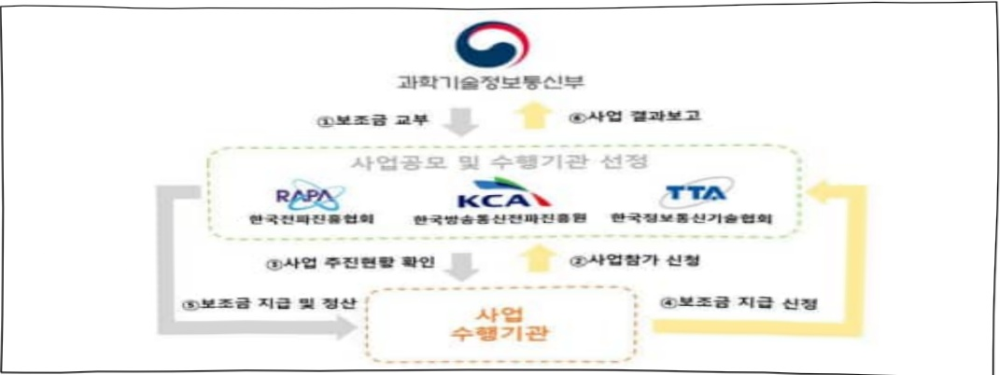

# 차세대 특화망 융합산업 활성화 기반구축

**해당 페이지**: PDF 1481 ~ 1485 쪽 해당

**부처**: 과학기술정보통신부
**분야**: 통신
**회계유형**: 일반
**2026 확정예산**: 1000.0 백만원
**전년대비 증감률**: None%
**AI 도메인**: 통신/네트워크, 디지털전환(AX)

---

<table border=1 style='margin: auto; word-wrap: break-word;'><tr><td style='text-align: center; word-wrap: break-word;'>사 업 명</td></tr><tr><td style='text-align: center; word-wrap: break-word;'>(284) 차세대 특화망 융합산업 활성화 기반구축 (2531-359)</td></tr></table>

□ 사업 코드 정보

<table border=1 style='margin: auto; word-wrap: break-word;'><tr><td style='text-align: center; word-wrap: break-word;'>구분</td><td style='text-align: center; word-wrap: break-word;'>회계</td><td style='text-align: center; word-wrap: break-word;'>소관</td><td style='text-align: center; word-wrap: break-word;'>실국(기관)</td><td style='text-align: center; word-wrap: break-word;'>계정</td><td style='text-align: center; word-wrap: break-word;'>분야</td><td style='text-align: center; word-wrap: break-word;'>부문</td></tr><tr><td style='text-align: center; word-wrap: break-word;'>코드</td><td rowspan="2">일반</td><td rowspan="2">과학기술정보통신부</td><td rowspan="2">전과정책국</td><td rowspan="2">-</td><td style='text-align: center; word-wrap: break-word;'>130</td><td style='text-align: center; word-wrap: break-word;'>131</td></tr><tr><td style='text-align: center; word-wrap: break-word;'>명칭</td><td style='text-align: center; word-wrap: break-word;'>통신</td><td style='text-align: center; word-wrap: break-word;'>방송통신</td></tr></table>

<table border=1 style='margin: auto; word-wrap: break-word;'><tr><td style='text-align: center; word-wrap: break-word;'>구분</td><td style='text-align: center; word-wrap: break-word;'>프로그램</td><td style='text-align: center; word-wrap: break-word;'>단위사업</td><td style='text-align: center; word-wrap: break-word;'>세부사업</td></tr><tr><td style='text-align: center; word-wrap: break-word;'>코드</td><td style='text-align: center; word-wrap: break-word;'>2500</td><td style='text-align: center; word-wrap: break-word;'>2531</td><td style='text-align: center; word-wrap: break-word;'>359</td></tr><tr><td style='text-align: center; word-wrap: break-word;'>명칭</td><td style='text-align: center; word-wrap: break-word;'>전파활용방송서비스산업</td><td style='text-align: center; word-wrap: break-word;'>전파방송산업활성화</td><td style='text-align: center; word-wrap: break-word;'>차세대특화망융합산업 활성화기반구축</td></tr></table>

□ 사업 성격 (공통요구자료 Ⅱ-1 작성유의사항 4. 참조, 해당하는 사항에 “○” 표시)

<table border=1 style='margin: auto; word-wrap: break-word;'><tr><td rowspan="2">신규</td><td rowspan="2">계속</td><td rowspan="2">완료</td><td rowspan="2">예비타당성 실시여부</td><td rowspan="2">총사업비 관리대상</td><td rowspan="2">총액계상 예산사업</td><td style='text-align: center; word-wrap: break-word;'>사업소관 변경정보</td></tr><tr><td style='text-align: center; word-wrap: break-word;'>2025예산 시 소관</td></tr><tr><td style='text-align: center; word-wrap: break-word;'>☐</td><td style='text-align: center; word-wrap: break-word;'></td><td style='text-align: center; word-wrap: break-word;'></td><td style='text-align: center; word-wrap: break-word;'></td><td style='text-align: center; word-wrap: break-word;'></td><td style='text-align: center; word-wrap: break-word;'></td><td style='text-align: center; word-wrap: break-word;'></td></tr></table>

□ 사업 지원 형태 및 지원을 (최소한 한 개는 반드시 선택하시오. 해당사항에 0 표시)

<table border=1 style='margin: auto; word-wrap: break-word;'><tr><td style='text-align: center; word-wrap: break-word;'>직접</td><td style='text-align: center; word-wrap: break-word;'>출자</td><td style='text-align: center; word-wrap: break-word;'>출연</td><td style='text-align: center; word-wrap: break-word;'>보조</td><td style='text-align: center; word-wrap: break-word;'>융자</td><td style='text-align: center; word-wrap: break-word;'>국고보조율(%)</td><td style='text-align: center; word-wrap: break-word;'>융자율(%)</td></tr><tr><td style='text-align: center; word-wrap: break-word;'></td><td style='text-align: center; word-wrap: break-word;'></td><td style='text-align: center; word-wrap: break-word;'></td><td style='text-align: center; word-wrap: break-word;'>○</td><td style='text-align: center; word-wrap: break-word;'></td><td style='text-align: center; word-wrap: break-word;'>100</td><td style='text-align: center; word-wrap: break-word;'></td></tr></table>

□ 사업 소관부처 및 시행주체

<table border=1 style='margin: auto; word-wrap: break-word;'><tr><td style='text-align: center; word-wrap: break-word;'>사업명</td><td colspan="2">구분</td></tr><tr><td rowspan="3">장비·단말 검증체계 구축</td><td rowspan="2">소관부처</td><td style='text-align: center; word-wrap: break-word;'>전과정책국</td></tr><tr><td style='text-align: center; word-wrap: break-word;'>주과수정책과</td></tr><tr><td style='text-align: center; word-wrap: break-word;'>사업시행주체</td><td style='text-align: center; word-wrap: break-word;'>한국정보통신기술협회, 한국전과진흥협회</td></tr><tr><td rowspan="3">기술 실증 및 도입 지원</td><td rowspan="2">소관부처</td><td style='text-align: center; word-wrap: break-word;'>전과정책국</td></tr><tr><td style='text-align: center; word-wrap: break-word;'>주과수정책과</td></tr><tr><td style='text-align: center; word-wrap: break-word;'>사업시행주체</td><td style='text-align: center; word-wrap: break-word;'>한국방송통신전과진흥원</td></tr><tr><td rowspan="3">추가 주과수 이용기반 조성</td><td rowspan="2">소관부처</td><td style='text-align: center; word-wrap: break-word;'>전과정책국</td></tr><tr><td style='text-align: center; word-wrap: break-word;'>주과수정책과</td></tr><tr><td style='text-align: center; word-wrap: break-word;'>사업시행주체</td><td style='text-align: center; word-wrap: break-word;'>한국방송통신전과진흥원</td></tr></table>

---

### 가.예산안 총괄표

(단위: 백만원, %)

<table border=1 style='margin: auto; word-wrap: break-word;'><tr><td rowspan="2">사업명</td><td rowspan="2">2024년 결산</td><td colspan="2">2025년 예산</td><td colspan="2">2026년 예산</td><td rowspan="2">증감(B-A)</td><td rowspan="2">(B-A)/A</td></tr><tr><td style='text-align: center; word-wrap: break-word;'>본예산</td><td style='text-align: center; word-wrap: break-word;'>추경*(A)</td><td style='text-align: center; word-wrap: break-word;'>요구안</td><td style='text-align: center; word-wrap: break-word;'>본예산(B)</td></tr><tr><td style='text-align: center; word-wrap: break-word;'>차세대 특화망 융합산업 활성화 기반구축</td><td style='text-align: center; word-wrap: break-word;'>-</td><td style='text-align: center; word-wrap: break-word;'>-</td><td style='text-align: center; word-wrap: break-word;'>-</td><td style='text-align: center; word-wrap: break-word;'>1,000</td><td style='text-align: center; word-wrap: break-word;'>1,000</td><td style='text-align: center; word-wrap: break-word;'>1,000</td><td style='text-align: center; word-wrap: break-word;'>순증</td></tr></table>

□ 기능별(내역사업별) 예산 내역

(단위: 백만원)

<table border=1 style='margin: auto; word-wrap: break-word;'><tr><td rowspan="2"></td><td colspan="5">2024</td><td colspan="5">2025</td><td rowspan="2">2026 예산</td></tr><tr><td style='text-align: center; word-wrap: break-word;'>예산액(추경)</td><td style='text-align: center; word-wrap: break-word;'>예산 현액</td><td style='text-align: center; word-wrap: break-word;'>집행액</td><td style='text-align: center; word-wrap: break-word;'>이월액</td><td style='text-align: center; word-wrap: break-word;'>불용액</td><td style='text-align: center; word-wrap: break-word;'>예산액(추경)</td><td style='text-align: center; word-wrap: break-word;'>예산 현액</td><td style='text-align: center; word-wrap: break-word;'>집행액</td><td style='text-align: center; word-wrap: break-word;'>이월액</td><td style='text-align: center; word-wrap: break-word;'>불용액</td></tr><tr><td style='text-align: center; word-wrap: break-word;'>○ 기능별 분류(합계)</td><td style='text-align: center; word-wrap: break-word;'>-</td><td style='text-align: center; word-wrap: break-word;'>-</td><td style='text-align: center; word-wrap: break-word;'>-</td><td style='text-align: center; word-wrap: break-word;'>-</td><td style='text-align: center; word-wrap: break-word;'>-</td><td style='text-align: center; word-wrap: break-word;'>-</td><td style='text-align: center; word-wrap: break-word;'>-</td><td style='text-align: center; word-wrap: break-word;'>-</td><td style='text-align: center; word-wrap: break-word;'>-</td><td style='text-align: center; word-wrap: break-word;'>-</td><td style='text-align: center; word-wrap: break-word;'>1,000</td></tr><tr><td style='text-align: center; word-wrap: break-word;'>• 장비·단말 검증체계 구축• 기술 실증 및 도입지원• 추가 주파수 이용기반 조성</td><td style='text-align: center; word-wrap: break-word;'>-</td><td style='text-align: center; word-wrap: break-word;'>-</td><td style='text-align: center; word-wrap: break-word;'>-</td><td style='text-align: center; word-wrap: break-word;'>-</td><td style='text-align: center; word-wrap: break-word;'>-</td><td style='text-align: center; word-wrap: break-word;'>-</td><td style='text-align: center; word-wrap: break-word;'>-</td><td style='text-align: center; word-wrap: break-word;'>-</td><td style='text-align: center; word-wrap: break-word;'>-</td><td style='text-align: center; word-wrap: break-word;'>-</td><td style='text-align: center; word-wrap: break-word;'>250 600 150</td></tr></table>

### 나.사업설명자료

## 1 ) 사업목적·내용

- AI 기술로 전 산업분야의 디지털 혁신 수요가 증가함에 따라, 특화망과 제조 물류 농업 의료 교육 등

다양한 산업을 연계하여 디지털·인공지능 전환 융합서비스를 확산하기 위한 차세대 특화망 활성화

- (장비·단말 검증체계 구축) 수요기업·기관의 품질 요구사항 검증하고 제조사의 효율적 개발을 지원하기 위한 장비·단말 시험체계 구축, 기능·성능 요구사항 및 기술·시험규격 가이드라인 개발

- (기술 실증 및 도입지원) 실증 분야별로 수요기업의 융합서비스 발굴을 지원하고,

수요기업의 특화망 도입에 앞서 컨설팅 및 사전검증 등을 선제 지원

- (추가주파수 이용기반 조성) 수요 증가 및 채용 취업 서비스 도입 대비 특화망 추가 주파수

공급 확대를 위한 전과환경분석 체계 구축, 이용자 협의체 구축 및 운영지침 마련 등

---

## 2 ) 사업개요

□ 사업근거 및 추진경위

① 법령상 근거 및 조항 적시

o 전파법

- 제3조(전파자원의 이용촉진), 제5조(전파자원의 확보), 제6조(전파자원 이용 효율의 개선), 제6조의 2(주파수회수 또는 주파수재배치), 제9조(주파수분배), 제10조(주파수할당), 제11조(대가에 의한 주파수 할당), 제18조의 6(공공용 주파수 수급계획의 수립), 제60조(주파수이용현황의 공개) 등

지원근거

o 전파법 시행령

- 제4조(주파수 이용현황의 조사·확인), 제5조(주파수회수 또는 주파수재배치의 공고 등), 제7조(주파수 대역정비의 요건), 제13조(전파자원의 독과점 방지), 제20조의8(공공용 주파수 적정성 조사·분석 기관의 지정 등), 제85조(주파수 이용현황의 공개) 등

○「제3차 전파진흥기본계획('19~'23)」('19.2월),「5G+ 스펙트럼 플랜」('19.12월)

o「대한민국 디지털 전략」(22.9월),「디지털 권리장전」(23.9월)

ㅇ「대한민국 스펙트럼 플랜」(24.9월),「제4차 전파진흥기본계획(24~28)」(24.10월) 등

## ② 추진경위

추진경위

○ 5G 특화망 제도 발표 및 지원체계 도입

- '21년 특화망 정책방안 발표 및 주파수 할당 공고

- '22년「이음5G 지원센터」운영 및 제도개선

- '23년 5G 특화망 지원포털 서비스 개시

- '24년 자가용 특화망 단말기 개설절차 완화(허가→신고)

- '25.7월 기준 전국 39개 기업·기관에서 91개 사이트에 특화망 도입

○ AX 실현을 위한 통신 인프라로서 차세대 특화망 확대 계획 수립

- 차세대 기술(5G-adv. 등)과 채용서비스를 기반으로 기존 특화망의 한계를 완화하고, 공급 생태계와 수요자 지원을 통해 특화망 확산 지원 필요성 제기

※ 기존 특화망은 특정 구역에 한정 → 대규모 사업장, 재난구조 등 한계

- 「제4차 전파진흥기본계획(‘24~’28)」을 통해 특화망 활성화 계획 마련

- 장비·단말 확산, 차세대 기술 실증, 홍보 강화 등 특화망 생태계 활성화

- 新유형 서비스(광역형, 이동형 등) 도입을 위한 주파수 이용체계 개선 등

□ 주요내용

① 사업규모

- 사업기간 : '26년~

---

- 최근 5년 간 투입된 사업비(예산액기준, 추경편성한 연도에는 추경포함)

<table border=1 style='margin: auto; word-wrap: break-word;'><tr><td style='text-align: center; word-wrap: break-word;'>연도</td><td style='text-align: center; word-wrap: break-word;'>2022</td><td style='text-align: center; word-wrap: break-word;'>2023</td><td style='text-align: center; word-wrap: break-word;'>2024</td><td style='text-align: center; word-wrap: break-word;'>2025</td><td style='text-align: center; word-wrap: break-word;'>2026</td></tr><tr><td style='text-align: center; word-wrap: break-word;'>사업비</td><td style='text-align: center; word-wrap: break-word;'>-</td><td style='text-align: center; word-wrap: break-word;'>-</td><td style='text-align: center; word-wrap: break-word;'>-</td><td style='text-align: center; word-wrap: break-word;'>-</td><td style='text-align: center; word-wrap: break-word;'>1,000</td></tr></table>

## ② 사업추진체계

- 사업시행방법 : 민간경상보조

- 사업시행주체 : 한국방송통신전파진흥원, 한국정보통신기술협회, 한국전파진흥협회

- 사업 수혜자 : 제조·물류·농업·의료·교육 등 다양한 산업에 특화망을 연계한

- 보조, 융자, 출연, 출자 등의 경우 보조·융자 등 지원 비율 및 법적근거

<table border=1 style='margin: auto; word-wrap: break-word;'><tr><td style='text-align: center; word-wrap: break-word;'>내역사업명</td><td style='text-align: center; word-wrap: break-word;'>구분</td><td style='text-align: center; word-wrap: break-word;'>피보조·피출연 등 기관명</td><td style='text-align: center; word-wrap: break-word;'>지원 금액 (2026예산)</td><td style='text-align: center; word-wrap: break-word;'>지원 비율(%)</td><td style='text-align: center; word-wrap: break-word;'>보조율 법적근거 (해당 조항)</td></tr><tr><td rowspan="2">장비·단말 검증체계 구축</td><td rowspan="2">보조</td><td style='text-align: center; word-wrap: break-word;'>한국정보통신 기술협회</td><td style='text-align: center; word-wrap: break-word;'>150백만원</td><td style='text-align: center; word-wrap: break-word;'>100%</td><td style='text-align: center; word-wrap: break-word;'>전파법 제66조 제4항 제5호</td></tr><tr><td style='text-align: center; word-wrap: break-word;'>한국전파 진흥협회</td><td style='text-align: center; word-wrap: break-word;'>100백만원</td><td style='text-align: center; word-wrap: break-word;'>100%</td><td style='text-align: center; word-wrap: break-word;'>전파법 제66조 제4항 제5호</td></tr><tr><td style='text-align: center; word-wrap: break-word;'>기술 실증 및 도입지원</td><td style='text-align: center; word-wrap: break-word;'>보조</td><td style='text-align: center; word-wrap: break-word;'>한국방송 통신전파 진흥원</td><td style='text-align: center; word-wrap: break-word;'>600백만원</td><td style='text-align: center; word-wrap: break-word;'>100%</td><td style='text-align: center; word-wrap: break-word;'>전파법 제66조 제4항 제5호</td></tr><tr><td style='text-align: center; word-wrap: break-word;'>추가 주파수 이용기반 조성</td><td style='text-align: center; word-wrap: break-word;'>보조</td><td style='text-align: center; word-wrap: break-word;'>한국방송 통신전파 진흥원</td><td style='text-align: center; word-wrap: break-word;'>150백만원</td><td style='text-align: center; word-wrap: break-word;'>100%</td><td style='text-align: center; word-wrap: break-word;'>전파법 제66조 제4항 제5호</td></tr></table>

## 3 ) 2026년도 예산 산출 근거

①장비·단말 검증체계 구축 : (2025) 0 → (2026) 250백만원, 순증

- (요구) 수요기업의 품질 요구사항을 검증하고 제조사의 효율적 개발을 지원하기 위한 장비·단말 시험 지원,

기능·성능에 대한 요구사항 및 기술·시험규격의 가이드라인 개발

- (산출) ① 기업기술지원 = 100백만원

② 가이드라인 개발 = 150백만원

② 기술 실증 및 도입지원 : (2025) 0 → (2026) 600백만원, 순증

- (요구) 실증 분야별 수요기업의 융합서비스 발굴 지원 및 수요기업의 특화망 도입 컨설팅·사전검증 지원

- (산출) ① 융합서비스 실증 = 500백만원

② 특화망 도입검증 지원 = 100백만원

③ 추가 주파수 이용기반 조성 : (2025) 0 → (2026) 150백만원, 순증

- (요구) 수요확대 등에 따라 추가 주파수 공급 확대를 위한 전파환경 분석 및 간섭조정체계 구축 등

- (산출) ① 추가주파수 발굴을 위한 환경분석 = 100백만원

② 이용지침 마련 = 50백만원

---

## 4 ) 사업효과

□ 사업영향, 산출물 성과지표 등

① 2022~2026년도 성과계획서 상 성과지표 및 최근 5년간 성과 달성도

<table border=1 style='margin: auto; word-wrap: break-word;'><tr><td style='text-align: center; word-wrap: break-word;'>성과지표</td><td style='text-align: center; word-wrap: break-word;'>구분</td><td style='text-align: center; word-wrap: break-word;'>2022</td><td style='text-align: center; word-wrap: break-word;'>2023</td><td style='text-align: center; word-wrap: break-word;'>2024</td><td style='text-align: center; word-wrap: break-word;'>2025</td><td style='text-align: center; word-wrap: break-word;'>2026</td><td style='text-align: center; word-wrap: break-word;'>2026 목표치산출근거</td><td style='text-align: center; word-wrap: break-word;'>측정산식(또는 측정방법)</td><td style='text-align: center; word-wrap: break-word;'>자료수집방법(또는 자료출처)</td></tr><tr><td rowspan="3">차세대 특화망 융합서비스 활성화 기반구축 추진율 (단위:%)</td><td style='text-align: center; word-wrap: break-word;'>목표</td><td style='text-align: center; word-wrap: break-word;'>-</td><td style='text-align: center; word-wrap: break-word;'>-</td><td style='text-align: center; word-wrap: break-word;'>-</td><td style='text-align: center; word-wrap: break-word;'>-</td><td style='text-align: center; word-wrap: break-word;'>100%</td><td rowspan="3">사업수행계획서</td><td rowspan="3">[(장비·단말기업기술지원 및 가이드라인개발 실적)+(특화망 융합서비스 실증·사전검증 실적)+(추가주 과수후보대역 발굴실적)/각 목표치의 합]×100</td><td rowspan="3">최종 수행상황 보고서</td></tr><tr><td style='text-align: center; word-wrap: break-word;'>실적</td><td style='text-align: center; word-wrap: break-word;'>-</td><td style='text-align: center; word-wrap: break-word;'>-</td><td style='text-align: center; word-wrap: break-word;'>-</td><td style='text-align: center; word-wrap: break-word;'>-</td><td style='text-align: center; word-wrap: break-word;'>-</td></tr><tr><td style='text-align: center; word-wrap: break-word;'>달성도</td><td style='text-align: center; word-wrap: break-word;'>-</td><td style='text-align: center; word-wrap: break-word;'>-</td><td style='text-align: center; word-wrap: break-word;'>-</td><td style='text-align: center; word-wrap: break-word;'>-</td><td style='text-align: center; word-wrap: break-word;'>-</td></tr></table>

② 성과지표 이외의 연도별 사업추진 경과 및 실적 : 해당없음

③향후(2026년도 이후) 기대효과

○ 국내 통신산업의 제조·서비스 분야 역량 강화 → 국내 확산 지원 → 해외시장으로의 진출 등 선순환 체계를 통해 생태계 활성화뿐만 아니라 순산업 디지털화에 기여

- 차세대 특화망 장비·단말 생태계 활성화 및 융합서비스 발굴 지원으로 특화망 도입 확대('30년 250개소 이상) 및 인증 장비·단말 확대('30년 100종 이상) 예상

5) 타당성조사 및 예비타당성조사 시행여부 및 결과 요지 : 해당없음

6) 총사업비 대상사업 정보 : 해당없음

## 7 ) 사업 집행절차

8) 각종 평가 : 해당없음

다. 최근 4년간 결산내역 : 해당사항 없음

---

### 원본 PDF 크롭 이미지

