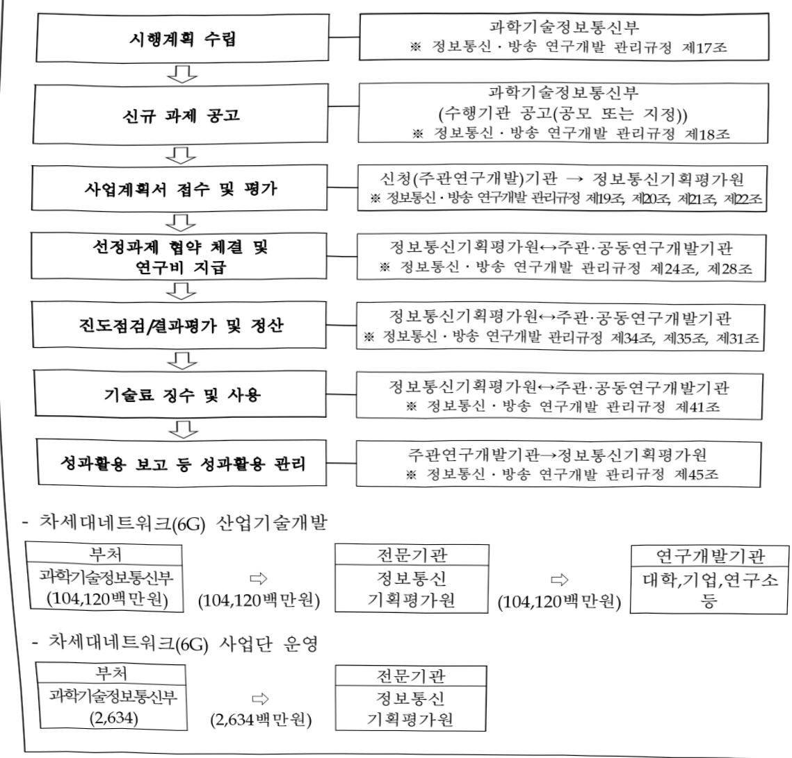

# 차세대네트워크(6G) 산업기술개발(R&D)

**해당 페이지**: PDF 1486 ~ 1494 쪽 해당

**부처**: 과학기술정보통신부
**분야**: 통신
**회계유형**: 일반회계
**2026 확정예산**: 106754.0 백만원
**전년대비 증감률**: 22.8%
**AI 도메인**: 통신/네트워크

---

### 가.예산 총괄표

(단위:백만원,%)

<table border=1 style='margin: auto; word-wrap: break-word;'><tr><td rowspan="2">사업명</td><td rowspan="2">2024년 결산</td><td colspan="2">2025년 예산</td><td colspan="2">2026년 예산</td><td rowspan="2">증감(B-A)</td><td rowspan="2">(B-A)/A</td></tr><tr><td style='text-align: center; word-wrap: break-word;'>본예산</td><td style='text-align: center; word-wrap: break-word;'>추경*(A)</td><td style='text-align: center; word-wrap: break-word;'>요구안</td><td style='text-align: center; word-wrap: break-word;'>본예산(B)</td></tr><tr><td style='text-align: center; word-wrap: break-word;'>차세대 네트워크(6G)</td><td rowspan="2">21,000</td><td rowspan="2">86,958</td><td rowspan="2">86,958</td><td rowspan="2">106,754</td><td rowspan="2">106,754</td><td rowspan="2">19,796</td><td rowspan="2">22.8</td></tr><tr><td style='text-align: center; word-wrap: break-word;'>산업 기술개발</td></tr></table>

*추경: 추경증감액을 포함한 최종 예산액을 기재

## □ 기능별(내역사업별) 예산 내역

(단위:백만원)

<table border=1 style='margin: auto; word-wrap: break-word;'><tr><td rowspan="2"></td><td colspan="5">2024</td><td colspan="5">2025</td><td rowspan="2">2026예산</td></tr><tr><td style='text-align: center; word-wrap: break-word;'>예산액(추경)</td><td style='text-align: center; word-wrap: break-word;'>예산현액</td><td style='text-align: center; word-wrap: break-word;'>집행액</td><td style='text-align: center; word-wrap: break-word;'>이월액</td><td style='text-align: center; word-wrap: break-word;'>불용액</td><td style='text-align: center; word-wrap: break-word;'>예산액(추경)</td><td style='text-align: center; word-wrap: break-word;'>예산현액</td><td style='text-align: center; word-wrap: break-word;'>집행액</td><td style='text-align: center; word-wrap: break-word;'>이월액</td><td style='text-align: center; word-wrap: break-word;'>불용액</td></tr><tr><td style='text-align: center; word-wrap: break-word;'>○ 기능별 분류(합계)</td><td style='text-align: center; word-wrap: break-word;'>21,000</td><td style='text-align: center; word-wrap: break-word;'>21,000</td><td style='text-align: center; word-wrap: break-word;'>21,000</td><td style='text-align: center; word-wrap: break-word;'>-</td><td style='text-align: center; word-wrap: break-word;'>-</td><td style='text-align: center; word-wrap: break-word;'>86,958</td><td style='text-align: center; word-wrap: break-word;'>86,958</td><td style='text-align: center; word-wrap: break-word;'>86,958</td><td style='text-align: center; word-wrap: break-word;'>-</td><td style='text-align: center; word-wrap: break-word;'>-</td><td style='text-align: center; word-wrap: break-word;'>106,754</td></tr><tr><td rowspan="2">• 차세대 네트워크(6G)산업 기술개발• 차세대 네트워크(6G) 사업단 운영</td><td style='text-align: center; word-wrap: break-word;'>20,600</td><td style='text-align: center; word-wrap: break-word;'>20,600</td><td style='text-align: center; word-wrap: break-word;'>20,600</td><td style='text-align: center; word-wrap: break-word;'>-</td><td style='text-align: center; word-wrap: break-word;'>-</td><td style='text-align: center; word-wrap: break-word;'>84,860</td><td style='text-align: center; word-wrap: break-word;'>84,860</td><td style='text-align: center; word-wrap: break-word;'>84,860</td><td style='text-align: center; word-wrap: break-word;'>-</td><td style='text-align: center; word-wrap: break-word;'>-</td><td style='text-align: center; word-wrap: break-word;'>104,120</td></tr><tr><td style='text-align: center; word-wrap: break-word;'>400</td><td style='text-align: center; word-wrap: break-word;'>400</td><td style='text-align: center; word-wrap: break-word;'>400</td><td style='text-align: center; word-wrap: break-word;'>-</td><td style='text-align: center; word-wrap: break-word;'>-</td><td style='text-align: center; word-wrap: break-word;'>2,098</td><td style='text-align: center; word-wrap: break-word;'>2,098</td><td style='text-align: center; word-wrap: break-word;'>2,098</td><td style='text-align: center; word-wrap: break-word;'>-</td><td style='text-align: center; word-wrap: break-word;'>-</td><td style='text-align: center; word-wrap: break-word;'>2,634</td></tr></table>

### 나. 사업설명자료

## 1 ) 사업목적·내용

o (차세대 네트워크(6G) 산업 기술개발) 6G 기술패권 경쟁 대비, 차세대 네트워크 기술·표준 선점을 위한 6G 시장 선도기술 개발

- (차세대 네트워크(6G) 산업 기술개발) 6G 관련 상용화 연구*, 6G 핵심부품 자립화**, 표준 대응*** 등 6G 산업 기술개발 지원

*Upper-mid 대역 기술, 커버리지, SW(Cloud-Native, AI-Native), 성능보장 기술 연구

**기지국·단말, 네트워크 부품 중 국산화 가능성 및 시장 파급력 등을 종합적으로 고려, 국내 기술 주도로 핵심부품 확보 추진

***

민·관 협력을 통해 6G R&D와 연계한 표준 반영·개발 및 표준필수특허 지분 30% 이상 확보 추진

- (차세대 네트워크(6G) 사업단 운영) 6G 산업기술개발 사업 관리, Pre-6G 기술시연

준비 등을 위한 사업단 지원

---

## 2 ) 사업개요

## ☐ 사업근거 및 추진경위

① 법령상 근거 및 조항 적시

- 과학기술기본법 제11조(국가연구개발사업의 추진)

## 제11조(국가연구개발사업의 추진)

① 중앙행정기관의 장은 기본계획에 따라 말은 분야의 국가연구개발사업과 그 시책을 세워 추진하여야 한다.

-방송통신발전 기본법 제16조(방송통신기술의 진흥 등)

## 제16조(방송통신기술의 진흥 등)

과학기술정보통신부장관은 방송통신기술의 진흥을 통한 방송통신서비스 발전을 위하여 다음 각 호의 시책을 수립·시행하여야 한다.

1. 방송통신과 관련된 기술수준의 조사, 기술의 연구개발, 개발기술의 평가 및 활용에 관한 사항

5. 방송통신기술의 국제협력에 관한 사항

## -전파법 제62조(기술개발의 촉진)

## 제62조(기술개발의 촉진)

과학기술정보통신부장관은 전과산업과 방송기기산업의 기반 조성에 필요한 기술의 연구·개발 및 활용을 촉진하기 위하여 다음 각 호의 사항을 추진하여야 한다.

1. 기술수준의 조사·연구개발 및 개발기술의 평가·활용

4.산업계·학계 및 연구계의 공동 연구·개발

5. 그 밖에 기술개발을 위하여 필요한 사항

-국정과제(20번)

[국정과제 20] AI 3대 강국 도약을 위한『AI고속도로』 구축

## ② 추진경위

- (22.4.) 커 정부 인수위, '26년 세계 첫 6G 기술 시연 목표

- (22.4.) 예비타당성조사 추진 결정(과학기술정보통신부, IITP)

- (22.4.26) 기획실무반 회의 개최(기획 방향, 일정 논의 및 실무작업반 구성 등)

(22.5.2~5.4) 산·학·연 간담회 개최(예타 방향, 기술 동향 공유 및 의견 수렴 등)

-(22.5.) 정부 110대 국정과제 발표(75.초격차 전략기술 육성으로 과학기술 G5 도약, 78. 세계 최고의 네트워크 구축 및 디지털 혁신 가속화)

- (22.5.26) 1차 총괄기획위원회 개최(Kick-Off)

- (22.6~22.7) 각 기술분과별 분과회의 개최

- (22.7.8) 2차 총괄기획위원회 개최

- (22.8.25) 「차세대 네트워크(6G)산업 기술개발사업」 공청회

- (22.9.1) '22년 3분기 예비타당성 기획보고서 제출

---

-(22.9.29) 제9차 비상경제민생회의 「대한민국 디지털 전략」 발표, 6G 표준특허 선점 및 '26년 Pre-6G 시연 추진

- (22.10.27) '22년 3분기 예타 대상사업 미선정

- (22.10.28) 국가과학기술자문회의 「국가전략기술 육성방안」 발표, ‘차세대통신’ 12대 국가전략기술로 선정

- (22.12.1) '22년 4분기 예타 대상사업 신청

-(22.12.21) 대통령 주재 ‘제12차 비상경제민생회의’ 겸 ‘제1차 국민경제자문회의’

「신성장 4.0 전략 추진계획」 발표, '내 삶속의 디지털' 관련 6G 상용화 기술개발 추진

- (23.1.12) '22년 4분기 예타 대상사업 선정

- (23.2.20) 비상경제장관회의「K-Network 2030」 전략 발표

- (23.2.23) 예타 자문위원회 1차 발표

- (23.4.6) 예타 자문위원회 2차 발표

- (23.6.14) 예타 1차 점검회의

- (23.7.27) 예타 2차 점검회의

- (23.8.8) 예타 종합평가위원회(AHP 평가)

- (23.8.23) '23년 제10회 국가연구개발사업평가 총괄위원회 '차세대 네트워크(6G)

사업 기술개발 사업 예비타당성조사 통과

(24~28 5년간 국고 총 4,407.3억원, '24년 국고 498.3억원)

- (24.1.5) '24년 신규지원 대상과제 공고

- (24.2.1) 국가과학기술자문회의 산하 제5회 국가전략기술 특별위원회 '차세대통신 등

5개 분야 임무중심 전략로드맵' 의결

- (25.8.) 국정기획위원회 국민보고대회 정부 123대 국정과제(안) 발표(20. AI 3대 강국 도약을 위한『AI고속도로』 구축)

□ 주요내용

① 사업규모

- 총사업비(해당되는 경우에만 기재) : 해당없음

- 사업기간 : '24~'28년

- 최근 5년 간 투입된 사업비(예산액기준, 추경편성한 연도에는 추경포함)

<table border=1 style='margin: auto; word-wrap: break-word;'><tr><td style='text-align: center; word-wrap: break-word;'>연도</td><td style='text-align: center; word-wrap: break-word;'>2022</td><td style='text-align: center; word-wrap: break-word;'>2023</td><td style='text-align: center; word-wrap: break-word;'>2024</td><td style='text-align: center; word-wrap: break-word;'>2025</td><td style='text-align: center; word-wrap: break-word;'>2026</td></tr><tr><td style='text-align: center; word-wrap: break-word;'>사업비</td><td style='text-align: center; word-wrap: break-word;'>-</td><td style='text-align: center; word-wrap: break-word;'>-</td><td style='text-align: center; word-wrap: break-word;'>21,000</td><td style='text-align: center; word-wrap: break-word;'>86,958</td><td style='text-align: center; word-wrap: break-word;'>106,754</td></tr></table>

② 사업추진체계

- 사업시행방법 : 출연

- 사업시행주체 : 정보통신기획평가원

---

- 사업 수혜자 : 기업, 대학, 연구소 등

- 보조, 융자, 출연, 출자 등의 경우 보조·융자 등 지원 비율 및 법적근거

<table border=1 style='margin: auto; word-wrap: break-word;'><tr><td style='text-align: center; word-wrap: break-word;'>내역사업명</td><td style='text-align: center; word-wrap: break-word;'>구분</td><td style='text-align: center; word-wrap: break-word;'>피보조·피출연 등 기관명</td><td style='text-align: center; word-wrap: break-word;'>지원 금액 (2026예산)</td><td style='text-align: center; word-wrap: break-word;'>지원 비율(%)</td><td style='text-align: center; word-wrap: break-word;'>보조율 법적근거 (해당 조항)</td></tr><tr><td style='text-align: center; word-wrap: break-word;'>차세대 네트워크(6G) 산업 기술개발</td><td rowspan="2">출연</td><td rowspan="2">정보통신 기획 평가원</td><td style='text-align: center; word-wrap: break-word;'>104,120 백 만원</td><td rowspan="2">100</td><td rowspan="2">정보통신 진흥 및 융합 활성화 등에 관한 특별법 제32조, 동법 시행령 제35조</td></tr><tr><td style='text-align: center; word-wrap: break-word;'>차세대 네트워크(6G) 산업 기술개발 사업단 운영</td><td style='text-align: center; word-wrap: break-word;'>2,634 백만 원</td></tr></table>

## 3 ) 2026년도 예산 산출 근거

① 차세대 네트워크(6G) 산업 기술개발

: (2025 본예산) 84,860백만원 → (2026 요구) 104,120백만원, 19,260백만원 증액

- (요구) 6G 관련 상용화 연구*, 6G 핵심부품 자립화*, 표준 대응** 등 6G 산업 기술개발을 위한 5대 분야 13개 전략기술 지원

* Upper-mid 대역 기술, 커버리지, SW(Cloud-Native, AI-Native), 성능보장 기술 연구

** 기지국·단말, 네트워크 부품 중 국산화 가능성 및 시장 파급력 등을 종합적으로 고려, 국내 기술 주도로 핵심부품 확보 추진

*** 민·관 협력을 통해 6G R&D와 연계한 표준 반영·개발 및 표준필수특허 지분 30% 이상 확보 추진

- (산출) ('26년 계속) 95,820백만원 = 30개 과제 × 3,194.0백만원 × 12/12개월

  ('26년 종료) 1,400백만원 = 1개 과제 × 1,400.0백만원 × 12/12개월

  ('26년 신규) 6,900백만원 = 3개 과제 × 3,066.7백만원 × 9/12개월

② 차세대 네트워크(6G) 사업단 운영

: (2025 본예산) 2,098백만원 → (2026 요구) 2,634백만원, 536백만원 증액

- 6G 산업기술개발 사업 전주기 관리 및 과제 간 긴밀한 연계·협업 등을 위한 사업단 지원

- (산출) (계속) 2,634백만원 = 1개 과제 × 2,634백만원 × 12/12개월

°2025년도 예산 및 2026년도 예산 산출 세부내역 비교

<table border=1 style='margin: auto; word-wrap: break-word;'><tr><td colspan="2">2025년 본예산</td><td colspan="2">2026년 예산</td></tr><tr><td style='text-align: center; word-wrap: break-word;'>예산</td><td style='text-align: center; word-wrap: break-word;'>산출내역</td><td style='text-align: center; word-wrap: break-word;'>예산</td><td style='text-align: center; word-wrap: break-word;'>산출내역</td></tr><tr><td style='text-align: center; word-wrap: break-word;'>84,860</td><td style='text-align: center; word-wrap: break-word;'>○ 차세대 네트워크(6G) 산업 기술개발 : 84,860백만원
• 계속과제: 27개 × 2,761백만원 × 12/12개월 = 74,560백만원
• 신규과제: 4개 × 3,433백만원 × 9/12개월 = 10,300백만원</td><td style='text-align: center; word-wrap: break-word;'>104,120</td><td style='text-align: center; word-wrap: break-word;'>○ 차세대 네트워크(6G) 산업 기술개발 : 104,120백만원
• 계속과제: 30개 × 3,194.0백만원 × 12/12개월 = 95,820백만원
• 종료과제: 1개 × 1,400백만원 × 12/12개월 = 1,400백만원
• 신규과제: 3개 × 3,066.7백만원 × 9/12개월 = 6,900백만원</td></tr><tr><td style='text-align: center; word-wrap: break-word;'>2,098</td><td style='text-align: center; word-wrap: break-word;'>○ 차세대 네트워크(6G) 사업단 운영 : 2,098백만원
• 계속과제: 1개 × 2,098백만원 × 12/12개월 = 2,098백만원</td><td style='text-align: center; word-wrap: break-word;'>2,634</td><td style='text-align: center; word-wrap: break-word;'>○ 차세대 네트워크(6G) 사업단 운영 : 2,634백만원
• 계속과제: 1개 × 2,634백만원 × 12/12개월 = 2,634백만원</td></tr></table>

## 4 ) 사업효과

☐ 사업영향, 산출물 성과지표 등

---

① 2022~2026년도 성과계획서 상 성과지표 및 최근 5년간 성과 달성도

<table border=1 style='margin: auto; word-wrap: break-word;'><tr><td style='text-align: center; word-wrap: break-word;'>성과지표</td><td style='text-align: center; word-wrap: break-word;'>구분</td><td style='text-align: center; word-wrap: break-word;'>2022</td><td style='text-align: center; word-wrap: break-word;'>2023</td><td style='text-align: center; word-wrap: break-word;'>2024</td><td style='text-align: center; word-wrap: break-word;'>2025</td><td style='text-align: center; word-wrap: break-word;'>2026</td><td style='text-align: center; word-wrap: break-word;'>2026 목표치산출근거</td><td style='text-align: center; word-wrap: break-word;'>측정산식(또는 측정방법)</td><td style='text-align: center; word-wrap: break-word;'>자료수집방법(또는 자료출처)</td></tr><tr><td rowspan="3">표준화된 순위보정 영향력지수(mmIF)(단위: 점)</td><td style='text-align: center; word-wrap: break-word;'>목표</td><td style='text-align: center; word-wrap: break-word;'>-</td><td style='text-align: center; word-wrap: break-word;'>-</td><td style='text-align: center; word-wrap: break-word;'>67</td><td style='text-align: center; word-wrap: break-word;'>69</td><td style='text-align: center; word-wrap: break-word;'>72</td><td rowspan="3">유사시업 및 전체 국가 R&amp;D mmIF 값을 고려하여 설정 *CG핵심기술개발사업 등</td><td rowspan="3">(표준화된 순위보정영향력 지수)/(당해연도 SCI(E) 논문건수)</td><td rowspan="3">NTIS, R&amp;D 사업관리시스템 등</td></tr><tr><td style='text-align: center; word-wrap: break-word;'>실적</td><td style='text-align: center; word-wrap: break-word;'>-</td><td style='text-align: center; word-wrap: break-word;'>-</td><td style='text-align: center; word-wrap: break-word;'>67.6</td><td style='text-align: center; word-wrap: break-word;'>-</td><td style='text-align: center; word-wrap: break-word;'>-</td></tr><tr><td style='text-align: center; word-wrap: break-word;'>달성도</td><td style='text-align: center; word-wrap: break-word;'>-</td><td style='text-align: center; word-wrap: break-word;'>-</td><td style='text-align: center; word-wrap: break-word;'>100.8</td><td style='text-align: center; word-wrap: break-word;'>-</td><td style='text-align: center; word-wrap: break-word;'>-</td></tr><tr><td rowspan="3">등록특허 SMART 지수(단위: 점)</td><td style='text-align: center; word-wrap: break-word;'>목표</td><td style='text-align: center; word-wrap: break-word;'>-</td><td style='text-align: center; word-wrap: break-word;'>-</td><td style='text-align: center; word-wrap: break-word;'>-</td><td style='text-align: center; word-wrap: break-word;'>3.88</td><td style='text-align: center; word-wrap: break-word;'>3.99</td><td rowspan="3">유사사업 1차년 목표치 상향설정 *CG핵심기술개발사업 등</td><td rowspan="3">∑(Ai x Bi)/∑Bi -Ai : 특허등급별 가중치, Bi : 등급별 특허성과 건수</td><td rowspan="3">NTIS, R&amp;D 사업관리시스템 등</td></tr><tr><td style='text-align: center; word-wrap: break-word;'>실적</td><td style='text-align: center; word-wrap: break-word;'>-</td><td style='text-align: center; word-wrap: break-word;'>-</td><td style='text-align: center; word-wrap: break-word;'>-</td><td style='text-align: center; word-wrap: break-word;'>-</td><td style='text-align: center; word-wrap: break-word;'>-</td></tr><tr><td style='text-align: center; word-wrap: break-word;'>달성도</td><td style='text-align: center; word-wrap: break-word;'>-</td><td style='text-align: center; word-wrap: break-word;'>-</td><td style='text-align: center; word-wrap: break-word;'>-</td><td style='text-align: center; word-wrap: break-word;'>-</td><td style='text-align: center; word-wrap: break-word;'>-</td></tr></table>

② 성과지표 이외의 연도별 사업추진 경과 및 실적

<table border=1 style='margin: auto; word-wrap: break-word;'><tr><td style='text-align: center; word-wrap: break-word;'>2024</td><td style='text-align: center; word-wrap: break-word;'>○ 6G 연구·개발 및 표준화 진전을 위한 ‘6G 원칙 공동선언문’ 참여(‘24.2월’) - 한국을 포함한 10개국이 6G 무선 통신시스템 연구·개발을 위한 원칙을 바탕으로 개방적이고, 상호운용적이며 안전한 네트워크 연결 등 선언○ 신규과제 공모·협약체결(1~4월) 및 연구착수(4월~, 27개 과제) - 6G무선통신(11개), 6G모바일코어(3개), 6G유선네트워크(8개), 6G시스템(2개), 표준화(3개)○ 차세대네트워크(6G) 기술교류회 개최(‘24.6월’) - 동 사업 수행기관간 연구계획 공유 및 과제간 연계·협력방안 토론○ 6G 이동통신 분야 간 소통과 교류 중진을 위한 6G 소사이어티 발족(‘24.7월’)○ ‘25년 차세대네트워크(6G) 신규과제 공모를 위한 과제기획위원회 개최(‘24.9~12월’) - 6G무선통신(1개), 6G유선네트워크(1개), 6G시스템(2개)○ 6G 통신 심포지엄 개최(‘24.10월’) - 차세대네트워크(6G) 사업 추진계획 및 기존 국책과제에서 발굴된 6G 기술결과물 공유○ “모바일 코리아 2024” 개최(미국·EU 등 60개 기관 약 200여 명 참여, 24.10월)○ 차세대네트워크(6)사업단 설립(‘24.12월’) - 사업단 설립 준비위원회 운영(8~11월)을 통한 관련 규정 정비 및 사업단 설립(11~12월)</td></tr><tr><td style='text-align: center; word-wrap: break-word;'>2025</td><td style='text-align: center; word-wrap: break-word;'>○ 신규과제 공모·협약체결(1~4월) 및 연구착수(4월~, 4개 과제) - Upper-mid Band 기지국 핵심 부품, 6G 광액세스용 핵심 부품·시스템, 6G 고품질 응용서비스 성능보장 기술 등 4개 신규 과제(총103억원) 공모·선정○ 3GPP 기술총회 및 6G 기술 위크솜 개최(‘25.3’) - 6G 신규 무선망 및 핵심 구조 등 향후 6G 표준화 연구 방향성 합의와 함께 6G 표준 연구 분격 착수, 한국 의장단 진출로 표준 주도권 확보○ 차세대네트워크(6G)산업기술개발 과제별 현장간담회 추진(‘25.2~4’)○ 과제 간 연계·협력 강화를 위한 분야별 기술협의체(‘25.5’) 및 총괄 기술협의체(‘25.6’) 추진○ 미국, 인도 간 6G 공동워크숍 개최(‘25.5~6’) - NGA 공동 워크숍(5.28~29)을 통한 한·미 간 6G 기술협력 및 정책 공조 강화, B6GA 공동 워크숍(6.4) 개최로 한·인도 간 6G 비전 공유 및 공동 과제 발굴○ 차세대네트워크(6G)산업기술개발 제1회 운영위원회 개최(‘25.7’)</td></tr></table>

---

③ 향후(2026년도 이후) 기대효과 : 개조식으로 작성, 건 별로 계량적 수치 제시

ICT분야 선도국가로서 6G 핵심기술을 조기 개발하여 6G 상용화에 선제 대응하고 글로벌 시장 선점 기회 확보

- 6G 원천기술의 국제표준특허 확보를 통해, 스마트폰 점유율 세계 1위, 핵심표준특허 보유 세계 1위, 장비시장 점유율 세계 2위 이내 진입 목표

° 손산업 분야에서 6G 기술이 촉발할 채지능형 서비스를 발굴, 이를 통한 산업 구조 혁신 및 막대한 경제적 파급효과 창출

- 6G 기반 컨디바이스·장비시장의 국산화 및 인프라의 지능화를 통한 유·무선 통신

산업의 경쟁력 강화

0 표준기술 및 표준특허를 확보하여 세계 최고 수준의 이동통신 서비스 및 기술을

선도함으로써 글로벌 모바일 리더십 위상 확보

6G 산업기술개발사업 5대 분야 13개 전략기술의 체계적 관리 및 전략기술·과제 간 유기적 협력을 통해 '26년 Pre-6G 기술 시연, '28년 통합시연 달성

## 5 ) 타당성조사 및 예비타당성조사 시행여부 및 결과 요지

☐ 타당성조사 보고서가 있는 경우는 편익/비용을 중심으로 내용을 요약제시(보고서 제목, 작성자(기관), 작성일 명시) : 해당없음

□ 총사업비 500억원 이상인 경우 예비타당성조사 시행유무 및 그 결과요지 기재

<table border=1 style='margin: auto; word-wrap: break-word;'><tr><td style='text-align: center; word-wrap: break-word;'>구분</td><td style='text-align: center; word-wrap: break-word;'>조사기관</td><td style='text-align: center; word-wrap: break-word;'>조사기간</td><td style='text-align: center; word-wrap: break-word;'>조사결과 및 진행상황</td></tr><tr><td style='text-align: center; word-wrap: break-word;'>예비타당성 조사</td><td style='text-align: center; word-wrap: break-word;'>KISTEP</td><td style='text-align: center; word-wrap: break-word;'>&#x27;23.01~&#x27;23.08</td><td style='text-align: center; word-wrap: break-word;'>○ (결과) B/C 0.60, AHP 0.656</td></tr></table>

<table border=1 style='margin: auto; word-wrap: break-word;'><tr><td rowspan="2">예비타당성 조사 대상여부</td><td style='text-align: center; word-wrap: break-word;'>검토의견</td></tr><tr><td style='text-align: center; word-wrap: break-word;'>○ (사업개요) 차세대 네트워크 기술·표준 선점으로 6G 조기 상용화를 통한 글로벌 6G 시장선도○ (검토의견) 4,407.3억원 (국비 3,731.7억원, 민자 675.6억원)</td></tr></table>

* 2023년 제10회 국가연구개발사업평가 총괄위원회('23.8.23) :『차세대 네트워크(6G) 산업기술개발사업』 예비타당성조사 최종결과, KISTEP 재정투자분석본부

6) 총사업비 대상사업 정보 : 해당없음

---

## 7 ) 사업 집행절차

## 8 ) 각종 평가

1) 국회(예결위, 상임위, 예정처, 국정감사 포함) 지적

o 차세대네트워크(6G)사업단 지연 출범을 고려한 보다 면밀한 과제 관리 필요(예결위, '24.10)

2) 대외공개 평가 : 해당없음

---

### 다.최근 4년간 결산내역

## 1 ) 결산표

☐ 부처 결산내역

(단위: 백만원, %)

<table border=1 style='margin: auto; word-wrap: break-word;'><tr><td rowspan="2">연도</td><td colspan="3">예산액</td><td rowspan="2">예산현액(A)</td><td rowspan="2">집행액(B)</td><td rowspan="2">집행률(B/A)</td><td rowspan="2">다음연도이월액</td><td rowspan="2">불용액</td></tr><tr><td style='text-align: center; word-wrap: break-word;'>본예산</td><td style='text-align: center; word-wrap: break-word;'>추경중감액</td><td style='text-align: center; word-wrap: break-word;'>추경</td></tr><tr><td style='text-align: center; word-wrap: break-word;'>2022</td><td style='text-align: center; word-wrap: break-word;'>-</td><td style='text-align: center; word-wrap: break-word;'>-</td><td style='text-align: center; word-wrap: break-word;'>-</td><td style='text-align: center; word-wrap: break-word;'>-</td><td style='text-align: center; word-wrap: break-word;'>-</td><td style='text-align: center; word-wrap: break-word;'>-</td><td style='text-align: center; word-wrap: break-word;'>-</td><td style='text-align: center; word-wrap: break-word;'>-</td></tr><tr><td style='text-align: center; word-wrap: break-word;'>2023</td><td style='text-align: center; word-wrap: break-word;'>-</td><td style='text-align: center; word-wrap: break-word;'>-</td><td style='text-align: center; word-wrap: break-word;'>-</td><td style='text-align: center; word-wrap: break-word;'>-</td><td style='text-align: center; word-wrap: break-word;'>-</td><td style='text-align: center; word-wrap: break-word;'>-</td><td style='text-align: center; word-wrap: break-word;'>-</td><td style='text-align: center; word-wrap: break-word;'>-</td></tr><tr><td style='text-align: center; word-wrap: break-word;'>2024</td><td style='text-align: center; word-wrap: break-word;'>21,000</td><td style='text-align: center; word-wrap: break-word;'>-</td><td style='text-align: center; word-wrap: break-word;'>-</td><td style='text-align: center; word-wrap: break-word;'>21,000</td><td style='text-align: center; word-wrap: break-word;'>21,000</td><td style='text-align: center; word-wrap: break-word;'>100</td><td style='text-align: center; word-wrap: break-word;'>-</td><td style='text-align: center; word-wrap: break-word;'>-</td></tr><tr><td style='text-align: center; word-wrap: break-word;'>2025</td><td style='text-align: center; word-wrap: break-word;'>86,958</td><td style='text-align: center; word-wrap: break-word;'>-</td><td style='text-align: center; word-wrap: break-word;'>-</td><td style='text-align: center; word-wrap: break-word;'>86,958</td><td style='text-align: center; word-wrap: break-word;'>86,958</td><td style='text-align: center; word-wrap: break-word;'>100</td><td style='text-align: center; word-wrap: break-word;'>-</td><td style='text-align: center; word-wrap: break-word;'>-</td></tr></table>

## 2 ) 주요 결산사항

2022~2025년 결산 주요 지적사항 및 시정요구사항

<table border=1 style='margin: auto; word-wrap: break-word;'><tr><td style='text-align: center; word-wrap: break-word;'>2024</td><td style='text-align: center; word-wrap: break-word;'>o 차세대 네트워크(6G) 사업단 출범 지연 - 향후 유사 사례가 재발하지 않도록 방지책을 마련</td></tr><tr><td style='text-align: center; word-wrap: break-word;'>2025</td><td style='text-align: center; word-wrap: break-word;'>o 특이사항 없음</td></tr></table>

□ 2025년 이·전용 등 세부내역 : 해당없음

---

<table border=1 style='margin: auto; word-wrap: break-word;'><tr><td style='text-align: center; word-wrap: break-word;'>사 업 명</td></tr><tr><td style='text-align: center; word-wrap: break-word;'>(302) 차세대생성AI기술개발 (2601-378)</td></tr></table>

□ 사업 코드 정보

<table border=1 style='margin: auto; word-wrap: break-word;'><tr><td style='text-align: center; word-wrap: break-word;'>구분</td><td style='text-align: center; word-wrap: break-word;'>회계</td><td style='text-align: center; word-wrap: break-word;'>소관</td><td style='text-align: center; word-wrap: break-word;'>실국(기관)</td><td style='text-align: center; word-wrap: break-word;'>계정</td><td style='text-align: center; word-wrap: break-word;'>분야</td><td style='text-align: center; word-wrap: break-word;'>부문</td></tr><tr><td style='text-align: center; word-wrap: break-word;'>코드</td><td rowspan="2">일반회계</td><td rowspan="2">과학기술정보통신부</td><td rowspan="2">인공지능기반정책관</td><td rowspan="2">-</td><td style='text-align: center; word-wrap: break-word;'>130</td><td style='text-align: center; word-wrap: break-word;'>133</td></tr><tr><td style='text-align: center; word-wrap: break-word;'>명칭</td><td style='text-align: center; word-wrap: break-word;'>통신</td><td style='text-align: center; word-wrap: break-word;'>정보통신</td></tr></table>

<table border=1 style='margin: auto; word-wrap: break-word;'><tr><td style='text-align: center; word-wrap: break-word;'>구분</td><td style='text-align: center; word-wrap: break-word;'>프로그램</td><td style='text-align: center; word-wrap: break-word;'>단위사업</td><td style='text-align: center; word-wrap: break-word;'>세부사업</td></tr><tr><td style='text-align: center; word-wrap: break-word;'>코드</td><td style='text-align: center; word-wrap: break-word;'>2600</td><td style='text-align: center; word-wrap: break-word;'>2601</td><td style='text-align: center; word-wrap: break-word;'>378</td></tr><tr><td style='text-align: center; word-wrap: break-word;'>명칭</td><td style='text-align: center; word-wrap: break-word;'>인공지능데이터진흥</td><td style='text-align: center; word-wrap: break-word;'>AI기술개발(일반)</td><td style='text-align: center; word-wrap: break-word;'>차세대생성AI기술개발(R&amp;D)</td></tr></table>

사업 성격 (공통요구자료 Ⅱ-1 작성유의사항 4. 참조, 해당하는 사항에 “○” 표시)

<table border=1 style='margin: auto; word-wrap: break-word;'><tr><td rowspan="2">신규</td><td rowspan="2">계속</td><td rowspan="2">완료</td><td rowspan="2">예비타당성 실시여부</td><td rowspan="2">총사업비 관리대상</td><td rowspan="2">총액계상 예산사업</td><td style='text-align: center; word-wrap: break-word;'>사업소관 변경정보</td></tr><tr><td style='text-align: center; word-wrap: break-word;'>2025예산 시 소관</td></tr><tr><td style='text-align: center; word-wrap: break-word;'></td><td style='text-align: center; word-wrap: break-word;'>O</td><td style='text-align: center; word-wrap: break-word;'></td><td style='text-align: center; word-wrap: break-word;'></td><td style='text-align: center; word-wrap: break-word;'></td><td style='text-align: center; word-wrap: break-word;'></td><td style='text-align: center; word-wrap: break-word;'></td></tr></table>

□ 사업 지원 형태 및 지원을 (최소한 한 개는 반드시 선택하시오. 해당사항에 0 표시)

<table border=1 style='margin: auto; word-wrap: break-word;'><tr><td style='text-align: center; word-wrap: break-word;'>직접</td><td style='text-align: center; word-wrap: break-word;'>출자</td><td style='text-align: center; word-wrap: break-word;'>출연</td><td style='text-align: center; word-wrap: break-word;'>보조</td><td style='text-align: center; word-wrap: break-word;'>융자</td><td style='text-align: center; word-wrap: break-word;'>국고보조율(%)</td><td style='text-align: center; word-wrap: break-word;'>융자율(%)</td></tr><tr><td style='text-align: center; word-wrap: break-word;'></td><td style='text-align: center; word-wrap: break-word;'></td><td style='text-align: center; word-wrap: break-word;'>O</td><td style='text-align: center; word-wrap: break-word;'></td><td style='text-align: center; word-wrap: break-word;'></td><td style='text-align: center; word-wrap: break-word;'></td><td style='text-align: center; word-wrap: break-word;'></td></tr></table>

## □ 사업 담당자

<table border=1 style='margin: auto; word-wrap: break-word;'><tr><td style='text-align: center; word-wrap: break-word;'>사업명</td><td colspan="2">구분</td></tr><tr><td rowspan="3">차세대생성AI기술개발</td><td rowspan="2">소관부처</td><td style='text-align: center; word-wrap: break-word;'>인공지능정책실인공지능정책기획관</td></tr><tr><td style='text-align: center; word-wrap: break-word;'>디지털인재양성과</td></tr><tr><td style='text-align: center; word-wrap: break-word;'>사업시행주체</td><td style='text-align: center; word-wrap: break-word;'>정보통신기획평가원</td></tr></table>

---

### 원본 PDF 크롭 이미지

