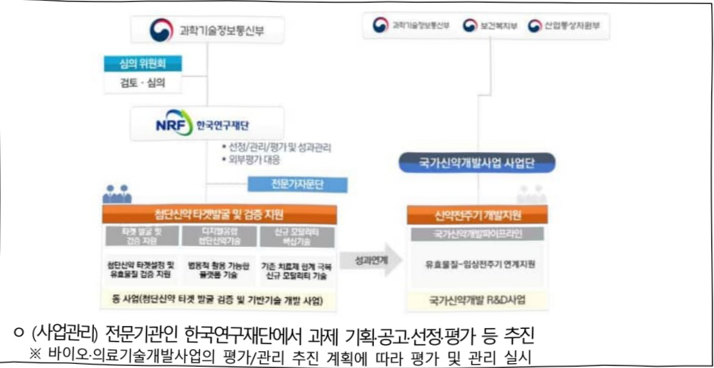

# 첨단신약 타겟 발굴 검증 및 기반기술 개발(R&D)

**해당 페이지**: PDF 1509 ~ 1514 쪽 해당

**부처**: 과학기술정보통신부
**분야**: 과학기술
**회계유형**: 일반회계
**2026 확정예산**: 3675.0 백만원
**전년대비 증감률**: None%
**AI 도메인**: 데이터, 의료/바이오, 디지털전환(AX)

---

<table border=1 style='margin: auto; word-wrap: break-word;'><tr><td style='text-align: center; word-wrap: break-word;'>사 업 명</td></tr><tr><td style='text-align: center; word-wrap: break-word;'>(34) 침단신약 타겟 발굴 검증 및 기반기술 개발(R&amp;D) (1138-499)</td></tr></table>

## ☐ 사업 코드 정보

<table border=1 style='margin: auto; word-wrap: break-word;'><tr><td style='text-align: center; word-wrap: break-word;'>구분</td><td style='text-align: center; word-wrap: break-word;'>회계</td><td style='text-align: center; word-wrap: break-word;'>소관</td><td style='text-align: center; word-wrap: break-word;'>실국(기관)</td><td style='text-align: center; word-wrap: break-word;'>계정</td><td style='text-align: center; word-wrap: break-word;'>분야</td><td style='text-align: center; word-wrap: break-word;'>부문</td></tr><tr><td style='text-align: center; word-wrap: break-word;'>코드</td><td rowspan="2">일반회계</td><td rowspan="2">과학기술정보통신부</td><td rowspan="2">연구개발정책실미래전략기술정책관</td><td rowspan="2">-</td><td style='text-align: center; word-wrap: break-word;'>150</td><td style='text-align: center; word-wrap: break-word;'>155</td></tr><tr><td style='text-align: center; word-wrap: break-word;'>명칭</td><td style='text-align: center; word-wrap: break-word;'>과학기술</td><td style='text-align: center; word-wrap: break-word;'>과학기술연구개발</td></tr></table>

<table border=1 style='margin: auto; word-wrap: break-word;'><tr><td style='text-align: center; word-wrap: break-word;'>구분</td><td style='text-align: center; word-wrap: break-word;'>프로그램</td><td style='text-align: center; word-wrap: break-word;'>단위사업</td><td style='text-align: center; word-wrap: break-word;'>세부사업</td></tr><tr><td style='text-align: center; word-wrap: break-word;'>코드</td><td style='text-align: center; word-wrap: break-word;'>1100</td><td style='text-align: center; word-wrap: break-word;'>1138</td><td style='text-align: center; word-wrap: break-word;'>499</td></tr><tr><td style='text-align: center; word-wrap: break-word;'>명칭</td><td style='text-align: center; word-wrap: break-word;'>미래유망원천기술개발</td><td style='text-align: center; word-wrap: break-word;'>바이오·의료기술개발</td><td style='text-align: center; word-wrap: break-word;'>첨단신약 타겟 발굴 검증 및 기반기술 개발(R&amp;D)</td></tr></table>

☐ 사업 성격

<table border=1 style='margin: auto; word-wrap: break-word;'><tr><td style='text-align: center; word-wrap: break-word;'>신규</td><td style='text-align: center; word-wrap: break-word;'>계속</td><td style='text-align: center; word-wrap: break-word;'>완료</td><td style='text-align: center; word-wrap: break-word;'>예비타당성 실시여부</td><td style='text-align: center; word-wrap: break-word;'>총사업비 관리대상</td><td style='text-align: center; word-wrap: break-word;'>총액계상 예산사업</td><td style='text-align: center; word-wrap: break-word;'>사업소관 변경정보</td></tr><tr><td style='text-align: center; word-wrap: break-word;'>O</td><td style='text-align: center; word-wrap: break-word;'></td><td style='text-align: center; word-wrap: break-word;'></td><td style='text-align: center; word-wrap: break-word;'></td><td style='text-align: center; word-wrap: break-word;'></td><td style='text-align: center; word-wrap: break-word;'></td><td style='text-align: center; word-wrap: break-word;'></td></tr></table>

□ 사업 지원 형태 및 지원을

<table border=1 style='margin: auto; word-wrap: break-word;'><tr><td style='text-align: center; word-wrap: break-word;'>직접</td><td style='text-align: center; word-wrap: break-word;'>출자</td><td style='text-align: center; word-wrap: break-word;'>출연</td><td style='text-align: center; word-wrap: break-word;'>보조</td><td style='text-align: center; word-wrap: break-word;'>융자</td><td style='text-align: center; word-wrap: break-word;'>국고보조율(%)</td><td style='text-align: center; word-wrap: break-word;'>융자율(%)</td></tr><tr><td style='text-align: center; word-wrap: break-word;'></td><td style='text-align: center; word-wrap: break-word;'></td><td style='text-align: center; word-wrap: break-word;'>O</td><td style='text-align: center; word-wrap: break-word;'></td><td style='text-align: center; word-wrap: break-word;'></td><td style='text-align: center; word-wrap: break-word;'></td><td style='text-align: center; word-wrap: break-word;'></td></tr></table>

## □ 사업 소관부처 및 시행주체

<table border=1 style='margin: auto; word-wrap: break-word;'><tr><td style='text-align: center; word-wrap: break-word;'>사업명</td><td colspan="2">구분</td></tr><tr><td rowspan="3">침단신악타겟 발굴검증 및 기반기술개발(R&amp;D)</td><td rowspan="2">소관부처</td><td style='text-align: center; word-wrap: break-word;'>연구개발정책실미래전략기술정책관</td></tr><tr><td style='text-align: center; word-wrap: break-word;'>첨단바이오기술과</td></tr><tr><td style='text-align: center; word-wrap: break-word;'>사업시행주체</td><td style='text-align: center; word-wrap: break-word;'>한국연구재단</td></tr></table>

---

### 가.예산 총괄표

(단위: 백만원, %)

<table border=1 style='margin: auto; word-wrap: break-word;'><tr><td rowspan="2">사업명</td><td rowspan="2">2024년 결산</td><td colspan="2">2025년 예산</td><td colspan="2">2026년 예산</td><td rowspan="2">중감(B-A)</td><td rowspan="2">(B-A)/A</td></tr><tr><td style='text-align: center; word-wrap: break-word;'>본예산</td><td style='text-align: center; word-wrap: break-word;'>추경(A)</td><td style='text-align: center; word-wrap: break-word;'>요구안</td><td style='text-align: center; word-wrap: break-word;'>본예산(B)</td></tr><tr><td style='text-align: center; word-wrap: break-word;'>첨단신약 타겟발굴 검증 및 기반기술개발(R&amp;D)</td><td style='text-align: center; word-wrap: break-word;'>-</td><td style='text-align: center; word-wrap: break-word;'>-</td><td style='text-align: center; word-wrap: break-word;'>-</td><td style='text-align: center; word-wrap: break-word;'>3,675</td><td style='text-align: center; word-wrap: break-word;'>3,675</td><td style='text-align: center; word-wrap: break-word;'>3,675</td><td style='text-align: center; word-wrap: break-word;'>순증</td></tr></table>

□ 기능별(내역사업별) 예산 내역

(단위:백만원)

<table border=1 style='margin: auto; word-wrap: break-word;'><tr><td rowspan="2"></td><td colspan="5">2024</td><td colspan="5">2025</td><td rowspan="2">2026예산</td></tr><tr><td style='text-align: center; word-wrap: break-word;'>예산액(추경)</td><td style='text-align: center; word-wrap: break-word;'>예산현액</td><td style='text-align: center; word-wrap: break-word;'>집행액</td><td style='text-align: center; word-wrap: break-word;'>이일액</td><td style='text-align: center; word-wrap: break-word;'>불용액</td><td style='text-align: center; word-wrap: break-word;'>예산액(추경)</td><td style='text-align: center; word-wrap: break-word;'>예산현액</td><td style='text-align: center; word-wrap: break-word;'>집행액</td><td style='text-align: center; word-wrap: break-word;'>이일액</td><td style='text-align: center; word-wrap: break-word;'>불용액</td></tr><tr><td style='text-align: center; word-wrap: break-word;'>○ 기능별 분류(합계)</td><td style='text-align: center; word-wrap: break-word;'>-</td><td style='text-align: center; word-wrap: break-word;'>-</td><td style='text-align: center; word-wrap: break-word;'>-</td><td style='text-align: center; word-wrap: break-word;'>-</td><td style='text-align: center; word-wrap: break-word;'>-</td><td style='text-align: center; word-wrap: break-word;'>-</td><td style='text-align: center; word-wrap: break-word;'>-</td><td style='text-align: center; word-wrap: break-word;'>-</td><td style='text-align: center; word-wrap: break-word;'>-</td><td style='text-align: center; word-wrap: break-word;'>-</td><td style='text-align: center; word-wrap: break-word;'>3,675</td></tr><tr><td rowspan="3">• 첨단신약 타겟발굴 및 검증지원• 디지털 융합첨단신약기술 개발• 신규 모달리티핵심기술개발</td><td style='text-align: center; word-wrap: break-word;'>-</td><td style='text-align: center; word-wrap: break-word;'>-</td><td style='text-align: center; word-wrap: break-word;'>-</td><td style='text-align: center; word-wrap: break-word;'>-</td><td style='text-align: center; word-wrap: break-word;'>-</td><td style='text-align: center; word-wrap: break-word;'>-</td><td style='text-align: center; word-wrap: break-word;'>-</td><td style='text-align: center; word-wrap: break-word;'>-</td><td style='text-align: center; word-wrap: break-word;'>-</td><td style='text-align: center; word-wrap: break-word;'>-</td><td style='text-align: center; word-wrap: break-word;'>1,875</td></tr><tr><td style='text-align: center; word-wrap: break-word;'>-</td><td style='text-align: center; word-wrap: break-word;'>-</td><td style='text-align: center; word-wrap: break-word;'>-</td><td style='text-align: center; word-wrap: break-word;'>-</td><td style='text-align: center; word-wrap: break-word;'>-</td><td style='text-align: center; word-wrap: break-word;'>-</td><td style='text-align: center; word-wrap: break-word;'>-</td><td style='text-align: center; word-wrap: break-word;'>-</td><td style='text-align: center; word-wrap: break-word;'>-</td><td style='text-align: center; word-wrap: break-word;'>-</td><td style='text-align: center; word-wrap: break-word;'>900</td></tr><tr><td style='text-align: center; word-wrap: break-word;'>-</td><td style='text-align: center; word-wrap: break-word;'>-</td><td style='text-align: center; word-wrap: break-word;'>-</td><td style='text-align: center; word-wrap: break-word;'>-</td><td style='text-align: center; word-wrap: break-word;'>-</td><td style='text-align: center; word-wrap: break-word;'>-</td><td style='text-align: center; word-wrap: break-word;'>-</td><td style='text-align: center; word-wrap: break-word;'>-</td><td style='text-align: center; word-wrap: break-word;'>-</td><td style='text-align: center; word-wrap: break-word;'>-</td><td style='text-align: center; word-wrap: break-word;'>900</td></tr></table>

### 나. 사업설명자료

## 1 ) 사업목적·내용

°(첨단신약 타겟 발굴·검증 및 기반기술 개발 사업) 산·학·연·병에 타겟 발굴·검증, AI·빅데이터 연구, 신규 모달리티 기술 개발 지원을 통하여 디지털 혁신과 새로운 모달리티가 융합된 첨단신약 개발 및 생태계 활성화 추진

- (첨단신약 타겟팔 몇 검증지원) AI, 오믹스 기반 정밀 타겟팔, 후보약물의 작용

기전 및 타겟의 유효성 검증 연구 신규과제 지원

- (디지털 융합 첨단신약기술 개발) 디지털과 융합하여 범용적 활용이 가능한 플랫폼 기술 개발 신규과제 지원

- (신규 모달리티 핵심기술 개발) 기존 소분자·항체치료제들의 한계를 극복하는 신규

모달리티 핵심 기술 개발 신규과제 지원

---

## 2 ) 사업개요

## □ 사업근거 및 추진경위

① 법령상 근거 및 조항

- 과학기술기본법 제11조(국가연구개발사업의 추진)

: ① 중앙행정기관의 장은 기본계획에 따라 맡은 분야의 국가연구개발사업과 그 시책을 세워 추진하여야 한다.

- 생명공학육성법 제11조(연구개발사업의 추진)

: ① 정부는 이 법의 목적을 효율적으로 달성하기 위하여 생명공학 연구 및 기술 개발을 위한 연구개발사업을 실시하여야 한다.

② 관계중앙행정기관의 장은 연구개발사업 추진을 위하여 필요하면 연구과제를 선정하고 기업·대학·연구기관·의료기관 및 생명공학 관련 기관·단체 등과 협약을 맺어 연구하게 할 수 있다.

③ 정부는 제2항에 따라 연구개발사업을 수행하는 기관·단체 등에 대해서는 연구개발에 소요되는 비용의 전부 또는 일부를 지원할 수 있다.

## ② 추진경위

0 타겟의 발굴 및 검증을 기반으로 하는 R&D 사업은 새로운 후보물질의 발굴을 기반으로 신약개발 파이프라인을 확대 가능

- 국내 제약사 대상의 전임상 파이프라인 대비 후보물질 탐색 파이프라인 수가 부족하여, 현재의 파이프라인 유지를 위해 대학·연구소·병원·중소기업 등 기초연구 수행 주체로부터 물질 도입하는 상황(2022년 신약개발 정부 R&D 투자 포트폴리오 분석, KISTEP, '24)

- 현재 예타사업으로 추진 중인 「국가신약개발사업」은 유효물질 도출부터 임상

2단계에 초점을 두어 타겟 발굴과 기반기술 구축의 원천기술 확보를 위해 기초·

원천기술 단계의 연구지원이 지속적으로 필요

- 국가신약개발사업의 등장으로 제약·바이오 분야에 대한 학계 및 산업계의 관심이 증가,

특히 기초·원천기술 단계인 신약기반구축 및 기초타겟 발굴연구의 경쟁률은 증가 추세

※ 최근 5년간 과제 경쟁률: 기초타겟 발굴 및 검증(12.9:1), 기반구축(8.5:1)

○ 주요국은 국민 건강, 국가보건안보, 경제적 성장 등을 목적으로 자국의 신약개발을

촉진하기 위해 신약개발 전주기에 걸쳐 단계별 지원 중

- (미국) 의료·생명과학 분야의 방대한 데이터셋을 표준화·분석하여 질병 연구와 신약개발을 가속화하기 위한 대형 프로젝트인 Bridge2AI(Bridge to Artificial Intelligence) 프로그램 추진

---

- (EU) EU와 유럽제약산업협회(EFPIA) 공동 추진으로 공공-민간 파트너십으로 혁신의약품이니서티브(IMI)을 추진하여 신약개발 경쟁력 강화 목표

디지털바이오 혁신전략('22.12., 과기정통부)을 통해 기본방향을 '바이오-디지털융합 촉진 및 이를 위한 공통기반기술 인프라 혁신'을 도출

- 동 사업에서 추구하는 첨단신약은 기존의 전통적 신약에서 벗어나 새로운 플랫폼이나 기술을 기반으로 “디지털 혁신”과 “신규모달리티”가 융합된 정밀 맞춤 신약을 의미

- 핵심 타겟팔굴 및 검증지원과 이를 위한 디지털융합 신약 핵심기술 개발, 신규 모달리티 핵심기술 개발, 첨단신약 생태계 지원을 통한 첨단신약 개발 파이프라인의 지속적 확보를 위해 「첨단신약 타겟팔굴·검증 및 기반기술 개발 사업」 추진

○ 국정과제 28번, “세계를 선도할 넥스트(NEXT) 전략기술 육성” 및 국정과제 32번, “의료 AI·제약·바이오헬스 강국 실현” 달성에 필수적

주요내용

① 사업규모

- 총사업비 : 해당없음

- 사업기간 : 2026 ~ 2030

- 최근 5년 간 투입된 사업비(예산액기준, 추경편성한 연도에는 추경포함)

<table border=1 style='margin: auto; word-wrap: break-word;'><tr><td style='text-align: center; word-wrap: break-word;'>연도</td><td style='text-align: center; word-wrap: break-word;'>2022</td><td style='text-align: center; word-wrap: break-word;'>2023</td><td style='text-align: center; word-wrap: break-word;'>2024</td><td style='text-align: center; word-wrap: break-word;'>2025</td><td style='text-align: center; word-wrap: break-word;'>2026</td></tr><tr><td style='text-align: center; word-wrap: break-word;'>사업비</td><td style='text-align: center; word-wrap: break-word;'>-</td><td style='text-align: center; word-wrap: break-word;'>-</td><td style='text-align: center; word-wrap: break-word;'>-</td><td style='text-align: center; word-wrap: break-word;'>-</td><td style='text-align: center; word-wrap: break-word;'>3,675</td></tr></table>

② 사업추진체계

- 사업시행방법 : 출연

- 사업시행주체 : 한국연구재단

- 사업 수혜자 : 과제별 상이(대학, 국·공립연구소, 정부출연연 등)

- 보조, 융자, 출연, 출자 등의 경우 보조·융자 등 지원 비율 및 법적근거

<table border=1 style='margin: auto; word-wrap: break-word;'><tr><td style='text-align: center; word-wrap: break-word;'>내역사업명</td><td style='text-align: center; word-wrap: break-word;'>구분</td><td style='text-align: center; word-wrap: break-word;'>피보조·피출연 등 기관명</td><td style='text-align: center; word-wrap: break-word;'>지원 금액 (2026예산)</td><td style='text-align: center; word-wrap: break-word;'>지원 비율(%)</td><td style='text-align: center; word-wrap: break-word;'>보조율 법적근거 (해당 조항)</td></tr><tr><td style='text-align: center; word-wrap: break-word;'>첨단신약타갯발굴 및 검증지원</td><td rowspan="3">출연</td><td rowspan="3">한국연구재단</td><td style='text-align: center; word-wrap: break-word;'>1,875</td><td rowspan="3">100</td><td rowspan="3">기초연구진흥 및 기술개발지원에 관한 법률 제14조</td></tr><tr><td style='text-align: center; word-wrap: break-word;'>디지털 융합첨단신약기술 개발</td><td style='text-align: center; word-wrap: break-word;'>900</td></tr><tr><td style='text-align: center; word-wrap: break-word;'>신규 모달리티핵심기술 개발</td><td style='text-align: center; word-wrap: break-word;'>900</td></tr></table>

---

## 3 ) 2026년도 예산 산출 근거

① 첨단신약 타겟발굴 및 검증지원 : (26) 1,875백만원

- AI, 오믹스 기반 정밀 타겟 발굴, 후보약물의 작용 기전 및 타겟의 유효성 검증 연구 신규과제 지원

- (산출) (신규) 10과제×250백만원×9/12개월 = 1,875백만원

② 디지털 융합 첨단신약기술 개발 : 900백만원

- 디지털과 융합하여 범용적 활용이 가능한 플랫폼 기술 개발 신규과제 지원

- (산출) (신규) 4과제×300백만원×9/12개월 = 900백만원

③ 신규 모달리티 핵심기술 개발 : ('26) 900백만원

- 기존 소분자·향체치료제들의 한계를 극복하는 신규 모달리티 핵심 기술 개발 신규과제 지원

- (산출) (신규) 4과제×300백만원×9/12개월 = 900백만원

## 4 ) 사업효과

☐ 사업영향,산출물 성과지표 등

①2022~2026년도 성과계획서 상 성과지표 및 최근 5년간 성과 달성도

<table border=1 style='margin: auto; word-wrap: break-word;'><tr><td style='text-align: center; word-wrap: break-word;'>성과지표</td><td style='text-align: center; word-wrap: break-word;'>구분</td><td style='text-align: center; word-wrap: break-word;'>2022</td><td style='text-align: center; word-wrap: break-word;'>2023</td><td style='text-align: center; word-wrap: break-word;'>2024</td><td style='text-align: center; word-wrap: break-word;'>2025</td><td style='text-align: center; word-wrap: break-word;'>2026</td><td style='text-align: center; word-wrap: break-word;'>2026 목표치산출근거</td><td style='text-align: center; word-wrap: break-word;'>측정산식(또는 측정방법)</td><td style='text-align: center; word-wrap: break-word;'>자료수집방법(또는 자료출처)</td></tr><tr><td rowspan="3">SCIE 논문(건)</td><td style='text-align: center; word-wrap: break-word;'>목표</td><td style='text-align: center; word-wrap: break-word;'>-</td><td style='text-align: center; word-wrap: break-word;'>-</td><td style='text-align: center; word-wrap: break-word;'>-</td><td style='text-align: center; word-wrap: break-word;'>-</td><td style='text-align: center; word-wrap: break-word;'>신규</td><td rowspan="3">현재 기술 수준(추후 성과목표 지표 신규수립 예정)</td><td rowspan="3">∑SCIE 논문 게재 건수</td><td rowspan="3">IRIS 성과관리 시스템 및 NTIS 성과조사</td></tr><tr><td style='text-align: center; word-wrap: break-word;'>실적</td><td style='text-align: center; word-wrap: break-word;'>-</td><td style='text-align: center; word-wrap: break-word;'>-</td><td style='text-align: center; word-wrap: break-word;'>-</td><td style='text-align: center; word-wrap: break-word;'>-</td><td style='text-align: center; word-wrap: break-word;'>-</td></tr><tr><td style='text-align: center; word-wrap: break-word;'>달성도</td><td style='text-align: center; word-wrap: break-word;'>-</td><td style='text-align: center; word-wrap: break-word;'>-</td><td style='text-align: center; word-wrap: break-word;'>-</td><td style='text-align: center; word-wrap: break-word;'>-</td><td style='text-align: center; word-wrap: break-word;'>-</td></tr><tr><td rowspan="3">국내외 특허출원(건)</td><td style='text-align: center; word-wrap: break-word;'>목표</td><td style='text-align: center; word-wrap: break-word;'>-</td><td style='text-align: center; word-wrap: break-word;'>-</td><td style='text-align: center; word-wrap: break-word;'>-</td><td style='text-align: center; word-wrap: break-word;'>-</td><td style='text-align: center; word-wrap: break-word;'>신규</td><td rowspan="3">현재 기술 수준(추후 성과목표 지표 신규수립 예정)</td><td rowspan="3">∑국내외 특허 출원 건수</td><td rowspan="3">IRIS 성과관리 시스템 및 NTIS 성과조사</td></tr><tr><td style='text-align: center; word-wrap: break-word;'>실적</td><td style='text-align: center; word-wrap: break-word;'>-</td><td style='text-align: center; word-wrap: break-word;'>-</td><td style='text-align: center; word-wrap: break-word;'>-</td><td style='text-align: center; word-wrap: break-word;'>-</td><td style='text-align: center; word-wrap: break-word;'>-</td></tr><tr><td style='text-align: center; word-wrap: break-word;'>달성도</td><td style='text-align: center; word-wrap: break-word;'>-</td><td style='text-align: center; word-wrap: break-word;'>-</td><td style='text-align: center; word-wrap: break-word;'>-</td><td style='text-align: center; word-wrap: break-word;'>-</td><td style='text-align: center; word-wrap: break-word;'>-</td></tr><tr><td rowspan="3">SOP 수립(건)</td><td style='text-align: center; word-wrap: break-word;'>목표</td><td style='text-align: center; word-wrap: break-word;'>-</td><td style='text-align: center; word-wrap: break-word;'>-</td><td style='text-align: center; word-wrap: break-word;'>-</td><td style='text-align: center; word-wrap: break-word;'>-</td><td style='text-align: center; word-wrap: break-word;'>신규</td><td rowspan="3">현재 기술 수준(추후 성과목표 지표 신규수립 예정)</td><td rowspan="3">∑본 과제를 통해 수립한 SOP</td><td rowspan="3">IRIS 성과관리 시스템 및 NTIS 성과조사</td></tr><tr><td style='text-align: center; word-wrap: break-word;'>실적</td><td style='text-align: center; word-wrap: break-word;'>-</td><td style='text-align: center; word-wrap: break-word;'>-</td><td style='text-align: center; word-wrap: break-word;'>-</td><td style='text-align: center; word-wrap: break-word;'>-</td><td style='text-align: center; word-wrap: break-word;'>-</td></tr><tr><td style='text-align: center; word-wrap: break-word;'>달성도</td><td style='text-align: center; word-wrap: break-word;'>-</td><td style='text-align: center; word-wrap: break-word;'>-</td><td style='text-align: center; word-wrap: break-word;'>-</td><td style='text-align: center; word-wrap: break-word;'>-</td><td style='text-align: center; word-wrap: break-word;'>-</td></tr><tr><td rowspan="3">기술이전료(억원)</td><td style='text-align: center; word-wrap: break-word;'>목표</td><td style='text-align: center; word-wrap: break-word;'>-</td><td style='text-align: center; word-wrap: break-word;'>-</td><td style='text-align: center; word-wrap: break-word;'>-</td><td style='text-align: center; word-wrap: break-word;'>-</td><td style='text-align: center; word-wrap: break-word;'>신규</td><td rowspan="3">현재 기술 수준(추후 성과목표 지표 신규수립 예정)</td><td rowspan="3">∑기술이전 금액</td><td rowspan="3">IRIS 성과관리 시스템 및 NTIS 성과조사</td></tr><tr><td style='text-align: center; word-wrap: break-word;'>실적</td><td style='text-align: center; word-wrap: break-word;'>-</td><td style='text-align: center; word-wrap: break-word;'>-</td><td style='text-align: center; word-wrap: break-word;'>-</td><td style='text-align: center; word-wrap: break-word;'>-</td><td style='text-align: center; word-wrap: break-word;'>-</td></tr><tr><td style='text-align: center; word-wrap: break-word;'>달성도</td><td style='text-align: center; word-wrap: break-word;'>-</td><td style='text-align: center; word-wrap: break-word;'>-</td><td style='text-align: center; word-wrap: break-word;'>-</td><td style='text-align: center; word-wrap: break-word;'>-</td><td style='text-align: center; word-wrap: break-word;'>-</td></tr><tr><td rowspan="3">후속사업 연계(건)</td><td style='text-align: center; word-wrap: break-word;'>목표</td><td style='text-align: center; word-wrap: break-word;'>-</td><td style='text-align: center; word-wrap: break-word;'>-</td><td style='text-align: center; word-wrap: break-word;'>-</td><td style='text-align: center; word-wrap: break-word;'>-</td><td style='text-align: center; word-wrap: break-word;'>신규</td><td rowspan="3">현재 기술 수준(추후 성과목표 지표 신규수립 예정)</td><td rowspan="3">∑본 사업의 연구 결과가 후속사업 과제로 연계된 성과</td><td rowspan="3">IRIS 성과관리 시스템 및 NTIS 성과조사</td></tr><tr><td style='text-align: center; word-wrap: break-word;'>실적</td><td style='text-align: center; word-wrap: break-word;'>-</td><td style='text-align: center; word-wrap: break-word;'>-</td><td style='text-align: center; word-wrap: break-word;'>-</td><td style='text-align: center; word-wrap: break-word;'>-</td><td style='text-align: center; word-wrap: break-word;'>-</td></tr><tr><td style='text-align: center; word-wrap: break-word;'>달성도</td><td style='text-align: center; word-wrap: break-word;'>-</td><td style='text-align: center; word-wrap: break-word;'>-</td><td style='text-align: center; word-wrap: break-word;'>-</td><td style='text-align: center; word-wrap: break-word;'>-</td><td style='text-align: center; word-wrap: break-word;'>-</td></tr></table>

---

② 성과지표 이외의 연도별 사업추진 경과 및 실적 : 해당없음

③ 향후(2026년도 이후) 기대효과 : 첨단신약 원천기술 확보를 통해 신약 분야 기술수준 개선, 고부가가치 산업인 바이오·제약 산업의 경쟁력 강화 및 R&D 생태계 활성화

5) 타당성조사 및 예비타당성조사 시행여부 및 결과 요지 : 해당없음

6) 총사업비 대상사업 정보 : 해당없음

## 7 ) 사업 집행절차

(사업관리) 전문기관인 한국연구재단에서 과제 기획공고·선정·평가 등 추진

바이오·의료기술개발사업의 평가/관리 추진 계획에 따라 평가 및 관리 실시

8) 각종 평가 : 해당없음

다. 최근 4년간 결산내역 : 해당없음

---

### 원본 PDF 크롭 이미지

