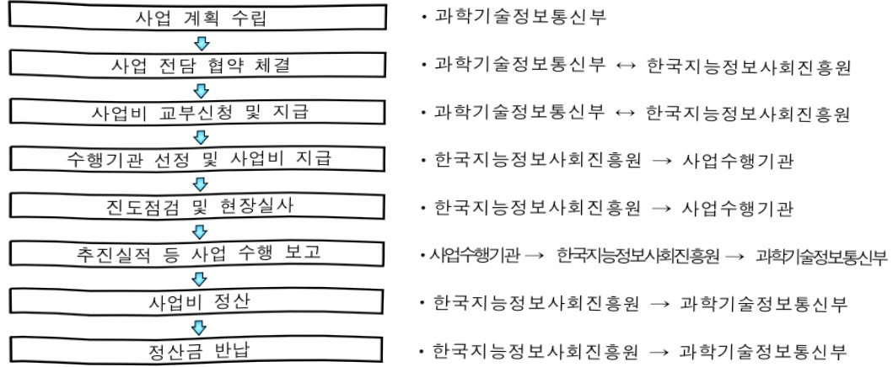

# 초거대AI 클라우드팜 실증 및 AI 확산 환경조성

**해당 페이지**: PDF 1515 ~ 1522 쪽 해당

**부처**: 과학기술정보통신부
**분야**: 통신
**회계유형**: 지역균형발전 특별회계
**2026 확정예산**: 3600.0 백만원
**전년대비 증감률**: -10.0%
**AI 도메인**: LLM/언어모델, 클라우드/컴퓨팅, 디지털전환(AX)

---

### 가. 예산 총괄표

(단위: 백만원, %)

<table border=1 style='margin: auto; word-wrap: break-word;'><tr><td rowspan="2">사업명</td><td rowspan="2">2024년 결산</td><td colspan="2">2025년 예산</td><td colspan="2">2026년 예산</td><td rowspan="2">증감(B-A)</td><td rowspan="2">(B-A)/A</td></tr><tr><td style='text-align: center; word-wrap: break-word;'>본예산</td><td style='text-align: center; word-wrap: break-word;'>추경*(A)</td><td style='text-align: center; word-wrap: break-word;'>요구안</td><td style='text-align: center; word-wrap: break-word;'>본예산(B)</td></tr><tr><td style='text-align: center; word-wrap: break-word;'>초거대AI 클라우드팜 실증 및 AI 확산 환경 조성</td><td style='text-align: center; word-wrap: break-word;'>4,000</td><td style='text-align: center; word-wrap: break-word;'>4,000</td><td style='text-align: center; word-wrap: break-word;'>4,000</td><td style='text-align: center; word-wrap: break-word;'>3,600</td><td style='text-align: center; word-wrap: break-word;'>3,600</td><td style='text-align: center; word-wrap: break-word;'>△400</td><td style='text-align: center; word-wrap: break-word;'>△10.0</td></tr></table>

□ 기능별(내역사업별) 예산 내역

(단위:백만원)

<table border=1 style='margin: auto; word-wrap: break-word;'><tr><td rowspan="2"></td><td colspan="5">2024</td><td colspan="5">2025</td><td rowspan="2">2026예산</td></tr><tr><td style='text-align: center; word-wrap: break-word;'>예산액(추정)</td><td style='text-align: center; word-wrap: break-word;'>예산현액</td><td style='text-align: center; word-wrap: break-word;'>집행액</td><td style='text-align: center; word-wrap: break-word;'>이월액</td><td style='text-align: center; word-wrap: break-word;'>불용액</td><td style='text-align: center; word-wrap: break-word;'>예산액(추정)</td><td style='text-align: center; word-wrap: break-word;'>예산현액</td><td style='text-align: center; word-wrap: break-word;'>집행액</td><td style='text-align: center; word-wrap: break-word;'>이월액</td><td style='text-align: center; word-wrap: break-word;'>불용액</td></tr><tr><td style='text-align: center; word-wrap: break-word;'>○ 기능별 분류(합계)</td><td style='text-align: center; word-wrap: break-word;'>4,000</td><td style='text-align: center; word-wrap: break-word;'>4,000</td><td style='text-align: center; word-wrap: break-word;'>4,000</td><td style='text-align: center; word-wrap: break-word;'>-</td><td style='text-align: center; word-wrap: break-word;'>-</td><td style='text-align: center; word-wrap: break-word;'>4,000</td><td style='text-align: center; word-wrap: break-word;'>4,000</td><td style='text-align: center; word-wrap: break-word;'>4,000</td><td style='text-align: center; word-wrap: break-word;'>-</td><td style='text-align: center; word-wrap: break-word;'>-</td><td style='text-align: center; word-wrap: break-word;'>3,600</td></tr><tr><td style='text-align: center; word-wrap: break-word;'>• 초거대AI 인프라 구성</td><td style='text-align: center; word-wrap: break-word;'>1,600</td><td style='text-align: center; word-wrap: break-word;'>1,600</td><td style='text-align: center; word-wrap: break-word;'>1,600</td><td style='text-align: center; word-wrap: break-word;'>-</td><td style='text-align: center; word-wrap: break-word;'>-</td><td style='text-align: center; word-wrap: break-word;'>1,600</td><td style='text-align: center; word-wrap: break-word;'>1,600</td><td style='text-align: center; word-wrap: break-word;'>1,600</td><td style='text-align: center; word-wrap: break-word;'>-</td><td style='text-align: center; word-wrap: break-word;'>-</td><td style='text-align: center; word-wrap: break-word;'>1,440</td></tr><tr><td style='text-align: center; word-wrap: break-word;'>• 초거대AI 융합맺풍 실증</td><td style='text-align: center; word-wrap: break-word;'>2,000</td><td style='text-align: center; word-wrap: break-word;'>2,000</td><td style='text-align: center; word-wrap: break-word;'>2,000</td><td style='text-align: center; word-wrap: break-word;'>-</td><td style='text-align: center; word-wrap: break-word;'>-</td><td style='text-align: center; word-wrap: break-word;'>2,000</td><td style='text-align: center; word-wrap: break-word;'>2,000</td><td style='text-align: center; word-wrap: break-word;'>2,000</td><td style='text-align: center; word-wrap: break-word;'>-</td><td style='text-align: center; word-wrap: break-word;'>-</td><td style='text-align: center; word-wrap: break-word;'>1,800</td></tr><tr><td style='text-align: center; word-wrap: break-word;'>• 산학연 협력생태계 조성</td><td style='text-align: center; word-wrap: break-word;'>400</td><td style='text-align: center; word-wrap: break-word;'>400</td><td style='text-align: center; word-wrap: break-word;'>400</td><td style='text-align: center; word-wrap: break-word;'>-</td><td style='text-align: center; word-wrap: break-word;'>-</td><td style='text-align: center; word-wrap: break-word;'>400</td><td style='text-align: center; word-wrap: break-word;'>400</td><td style='text-align: center; word-wrap: break-word;'>400</td><td style='text-align: center; word-wrap: break-word;'>-</td><td style='text-align: center; word-wrap: break-word;'>-</td><td style='text-align: center; word-wrap: break-word;'>360</td></tr></table>

---

### 나. 사업설명자료

## 1 ) 사업목적·내용

경북지역의 중소·벤처기업 등이 AI 기술과 서비스 개발에 필요한 인프라와 플랫폼 등을 제공하는 ①초거대 AI 클라우드 테스트베드를 구성하고, ②지역 중소기업과 민간 빅테크 기업의 협력을 통한 AI 플랫폼 및 서비스 실증, ③산학연 협력생태계 조성 → 지역의 AI·SW 중소기업 경쟁력 강화 및 지역 특화산업 육성 등 초거대 AI 생태계 활성화 촉진 제고

- (내역사업① 초거대AI 인프라 구성) 지역 초거대 AI 테스트베드 제공을 위해 초거대 AI 고성능 인프라 및 지역특화 경량 초거대 AI 플랫폼을 구성하여, 기술력이 열악한 지역 중소·벤처 기업 대상 AI 인프라, 플랫폼(API 등) 및 전문기술 등 집중 지원

- (내역사업② 초거대AI 융합플랫폼 실증) 민관협력으로 초거대 AI 빅테크 기업과 지역 기관·대학·중소기업 간 협력하여, 지역 현안해결 및 특화산업 육성을 위한 초거대 AI 융합플랫폼, 특화 서비스 개발 및 실증을 통한 AI 기술 확산

- (내역사업③ 산학연 협력생태계 조성) 지역 산학연과 연계하여 현장 수요 기반의

초거대 AI 전문 인력 지원, 창업지원 및 멘토링 등 AI 확산을 위한 협의체 구성·운영

## 2 ) 사업개요

## □ 사업근거 및 추진경위

① 법령상 근거 조항 적시

0 지능정보화기본법 제32조(선도사업의 추진과 지원)

0 지방자치분권 및 지역균형발전에 관한 특별법 제14조(지역산업 육성 및 일자리 창출 등 지역경제 활성화 촉진), 제16조(지역과학기술 및 정보통신의 진흥), 제79조(지역지원 계정의 세입과 세출)

② 추진경위

- '23.01. : 인공지능 일상화 및 산업고도화 계획

- '23.04. : 초거대 인공지능 경쟁력 강화 방안

- '25.09 : 이재명정부 123대 국정과제 발표

※ (국정과제 21) 세계에서 AI를 가장 잘 쓰는 나라 구현

---

□ 주요내용

① 사업규모

- 총사업비 : 해당없음

- 사업기간 : 2024년 ~ 2026년

- 최근 5년 간 투입된 사업비(예산액기준, 추경편성한 연도에는 추경포함)

<table border=1 style='margin: auto; word-wrap: break-word;'><tr><td style='text-align: center; word-wrap: break-word;'>연도</td><td style='text-align: center; word-wrap: break-word;'>2022</td><td style='text-align: center; word-wrap: break-word;'>2023</td><td style='text-align: center; word-wrap: break-word;'>2024</td><td style='text-align: center; word-wrap: break-word;'>2025</td><td style='text-align: center; word-wrap: break-word;'>2026(안)</td></tr><tr><td style='text-align: center; word-wrap: break-word;'>사업비</td><td style='text-align: center; word-wrap: break-word;'>-</td><td style='text-align: center; word-wrap: break-word;'>-</td><td style='text-align: center; word-wrap: break-word;'>4,000백만원</td><td style='text-align: center; word-wrap: break-word;'>4,000백만원</td><td style='text-align: center; word-wrap: break-word;'>3,600백만원</td></tr></table>

- 기타 : 해당없음

② 사업추진체계

- 사업시행방법 : 출연

- 사업시행주체 : 한국지능정보사회진흥원

- 사업 수혜자 : 지역 공공기관·ICT 기업·대학 등

- 보조, 융자, 출연, 출자 등의 경우 보조·융자 등 지원 비율 및 법적근거

<table border=1 style='margin: auto; word-wrap: break-word;'><tr><td style='text-align: center; word-wrap: break-word;'>내역사업명</td><td style='text-align: center; word-wrap: break-word;'>구분</td><td style='text-align: center; word-wrap: break-word;'>피보조·피출연 등 기관명</td><td style='text-align: center; word-wrap: break-word;'>지원 금액 (2026예산안)</td><td style='text-align: center; word-wrap: break-word;'>지원 비율(%)</td><td style='text-align: center; word-wrap: break-word;'>보조율 법적근거 (해당 조항)</td></tr><tr><td style='text-align: center; word-wrap: break-word;'>초거대AI 인프라 구성</td><td style='text-align: center; word-wrap: break-word;'>출연</td><td style='text-align: center; word-wrap: break-word;'>한국지능정보 사회진흥원</td><td style='text-align: center; word-wrap: break-word;'>1,440 백만원</td><td style='text-align: center; word-wrap: break-word;'>100</td><td style='text-align: center; word-wrap: break-word;'>지능정보화기본법 제32조</td></tr><tr><td style='text-align: center; word-wrap: break-word;'>초거대AI 융합플랫폼 실증</td><td style='text-align: center; word-wrap: break-word;'>출연</td><td style='text-align: center; word-wrap: break-word;'>한국지능정보 사회진흥원</td><td style='text-align: center; word-wrap: break-word;'>1,800 백만원</td><td style='text-align: center; word-wrap: break-word;'>100</td><td style='text-align: center; word-wrap: break-word;'>지능정보화기본법 제32조</td></tr><tr><td style='text-align: center; word-wrap: break-word;'>산학연협력생태계 조성</td><td style='text-align: center; word-wrap: break-word;'>출연</td><td style='text-align: center; word-wrap: break-word;'>한국지능정보 사회진흥원</td><td style='text-align: center; word-wrap: break-word;'>360 백만원</td><td style='text-align: center; word-wrap: break-word;'>100</td><td style='text-align: center; word-wrap: break-word;'>지능정보화기본법 제32조</td></tr></table>

---

3) 2026년도 예산안 산출 근거

## ① 초거대AI 인프라 구성

:(25)1,600백만원→(26요구)1,440백만원,160백만원감액

- (요구) 지역 내 초거대AI 테스트베드 제공과 초거대AI 고성능 인프라 등 지역 특화 경량 초거대AI 플랫폼 구성을 통해 기술력이 열악한 지역 중소·벤처 기업 대상 초거대 AI 인프라 지원 및 초거대 모델 고도화(API 등) 등 전문 기술 지원, 1,440백만원 요구

- (산출) 마이크로 데이터센터기반 초거대 AI 인프라 확대 및 플랫폼 구성 고도화 : 1,000백만원

초거대AI 관련 테스트베드활용 지원 : 440백만원

## ② 초거대AI 융합플랫폼 실증

:(25)2,000백만원→(26요구)1,800백만원,200백만원감액

- (요구) 지역 현안 해결과 특화 산업 육성을 위한 초거대AI 특화서비스 및 맞춤형 플랫폼 개발·실증 고도화,

1,800백만원 요구

- (산출) 초거대AI 융합플랫폼 개발·실증 고도화 및 확산 등 컨소시엄 2개 × 900백만원 : 1,800백만원

## ③ 산학연 협력생태계 조성

:(25)400백만원→(26요구)360백만원,40백만원 감액

- (요구) 지역 산학연 및 현장 수요 기반 초거대AI 전문인력 지원, 컨설팅 등 협의체 구성·운영 확대, 360백만원 요구

- (산출) 교육·세미나 등 전문 인력 지원 180명 × 1백만원 : 180백만원

창업 지원 및 협의체 운영 1식 × 180백만원 : 180백만원

2025년도 예산 및 2026년도 예산안 산출 세부내역 비교

<table border=1 style='margin: auto; word-wrap: break-word;'><tr><td colspan="2">&#x27;25년 예산</td><td colspan="2">&#x27;26년 예산안</td></tr><tr><td style='text-align: center; word-wrap: break-word;'>예산</td><td style='text-align: center; word-wrap: break-word;'>산출내역</td><td style='text-align: center; word-wrap: break-word;'>예산</td><td style='text-align: center; word-wrap: break-word;'>산출내역</td></tr><tr><td style='text-align: center; word-wrap: break-word;'>4,000</td><td style='text-align: center; word-wrap: break-word;'>○ 사업출연금(350-02): 4,000백만원가. 초거대AI 인프라 구성 (1,600백만원) • 초거대 AI 인프라 및 플랫폼 구성: 1,100백만원 • 초거대AI 전문기술지원: 500백만원나. 초거대AI 융합플랫폼 실증 (2,000백만원) • 초거대AI 융합서비스 개발·실증·확산: 2개 과제×1,000백만원다. 산학연 협력생태계 조성 (400백만원) • 전문 인력 지원: 200명×1백만원 • 창업 지원 및 협의체 운영: 1식×200백만원</td><td style='text-align: center; word-wrap: break-word;'>3,600</td><td style='text-align: center; word-wrap: break-word;'>○ 사업출연금(350-02): 3,600백만원가. 초거대AI 인프라 구성 (1,440백만원) • 초거대 AI 인프라 확대 및 플랫폼 구성 고도화: 1,000백만원 • 초거대AI 전문기술지원: 440백만원나. 초거대AI 융합플랫폼 실증 (1,800백만원) • 초거대AI 융합서비스 개발·실증 고도화 및 확산: 2개 과제×900백만원다. 산학연 협력생태계 조성 (360백만원) • 전문 인력 지원: 180명×1백만원 • 창업 지원 및 협의체 운영: 1식×180백만원</td></tr></table>

---

## 4 ) 사업효과

☐ 사업영향, 산출물 성과지표 등

① 2022~2026년도 성과계획서 상 성과지표 및 최근 5년간 성과 달성도

<table border=1 style='margin: auto; word-wrap: break-word;'><tr><td style='text-align: center; word-wrap: break-word;'>성과지표</td><td style='text-align: center; word-wrap: break-word;'>구분</td><td style='text-align: center; word-wrap: break-word;'>2022</td><td style='text-align: center; word-wrap: break-word;'>2023</td><td style='text-align: center; word-wrap: break-word;'>2024</td><td style='text-align: center; word-wrap: break-word;'>2025</td><td style='text-align: center; word-wrap: break-word;'>2026</td><td style='text-align: center; word-wrap: break-word;'>2026 목표치산출근거</td><td style='text-align: center; word-wrap: break-word;'>측정산식(또는 측정방법)</td><td style='text-align: center; word-wrap: break-word;'>자료수집방법(또는 자료출처)</td></tr><tr><td rowspan="3">초거대 AI 테스트베드 전문 기술지원(단위: 건)</td><td style='text-align: center; word-wrap: break-word;'>목표</td><td style='text-align: center; word-wrap: break-word;'>-</td><td style='text-align: center; word-wrap: break-word;'>-</td><td style='text-align: center; word-wrap: break-word;'>20</td><td style='text-align: center; word-wrap: break-word;'>30</td><td style='text-align: center; word-wrap: break-word;'>50</td><td rowspan="3">초거대AI 테스트베드의 안정적 운영체계 화립과 기술 및 서비스 지원을 중점으로 목표치 설정</td><td rowspan="3">초거대AI 테스트베드 기반 활용 컨설팅, POC(실증), 플랫폼(API) 이용지원 등 기술지원 건수</td><td rowspan="3">사업수행 결과보고서</td></tr><tr><td style='text-align: center; word-wrap: break-word;'>실적</td><td style='text-align: center; word-wrap: break-word;'>-</td><td style='text-align: center; word-wrap: break-word;'>-</td><td style='text-align: center; word-wrap: break-word;'>25</td><td style='text-align: center; word-wrap: break-word;'>35</td><td style='text-align: center; word-wrap: break-word;'></td></tr><tr><td style='text-align: center; word-wrap: break-word;'>달성도</td><td style='text-align: center; word-wrap: break-word;'>-</td><td style='text-align: center; word-wrap: break-word;'>-</td><td style='text-align: center; word-wrap: break-word;'>125%</td><td style='text-align: center; word-wrap: break-word;'>116%</td><td style='text-align: center; word-wrap: break-word;'></td></tr><tr><td rowspan="3">초거대 AI 서비스 실증(단위: 건)</td><td style='text-align: center; word-wrap: break-word;'>목표</td><td style='text-align: center; word-wrap: break-word;'>-</td><td style='text-align: center; word-wrap: break-word;'>-</td><td style='text-align: center; word-wrap: break-word;'>2</td><td style='text-align: center; word-wrap: break-word;'>2</td><td style='text-align: center; word-wrap: break-word;'>2</td><td rowspan="3">초거대 AI 테스트베드 구축 이후 AI 인프라를 활용한 기술 및 서비스 등 총 2건이상 실증 목표치 설정</td><td rowspan="3">지역특화산업 등 초거대AI 기반 특화서비스 실증+확산 건수</td><td rowspan="3">사업수행 결과보고서</td></tr><tr><td style='text-align: center; word-wrap: break-word;'>실적</td><td style='text-align: center; word-wrap: break-word;'>-</td><td style='text-align: center; word-wrap: break-word;'>-</td><td style='text-align: center; word-wrap: break-word;'>3</td><td style='text-align: center; word-wrap: break-word;'>3</td><td style='text-align: center; word-wrap: break-word;'></td></tr><tr><td style='text-align: center; word-wrap: break-word;'>달성도</td><td style='text-align: center; word-wrap: break-word;'>-</td><td style='text-align: center; word-wrap: break-word;'>-</td><td style='text-align: center; word-wrap: break-word;'>150%</td><td style='text-align: center; word-wrap: break-word;'>150%</td><td style='text-align: center; word-wrap: break-word;'>-</td></tr></table>

② 성과지표 이외의 연도별 사업추진 경과 및 실적 : 해당없음

③ 향후(2026년도 이후) 기대효과

- 지역의 중소·벤처기업에게 초거대 AI 고성능 컴퓨팅 자원과 플랫폼을 지원함으로써

초기 단계인 국내 초거대 AI 시장을 활성화하고 초거대 AI 생태계 확장에 기여

- 민관협력 초거대 AI 플랫폼·서비스 개발·실증을 통해 지역 디지털 전환을 선도하고 지역의 현안 해결은 물론 지역 특화 및 주력 산업의 경쟁력 강화 등 지역혁신에 기여

- 실무형 AI 전문 인력 지원을 통해 초거대 AI 활용 분야 및 시장 확대를 통해

심각해지는 AI 인재 부족 문제 해결에 기여

5) 타당성조사 및 예비타당성조사 시행여부 및 결과 요지 : 해당없음

6) 총사업비 대상사업 여부 및 내역 : 해당없음

---

## 7 ) 사업 집행절차

## <집행절차>

·과학기술정보통신부

·과학기술정보통신부 $\leftrightarrow$ 한국지능정보사회진흥원

·과학기술정보통신부 $\leftrightarrow$ 한국지능정보사회진흥원

수행기관 선정 및 사업비 지급

·한국지능정보사회진흥원 → 사업수행기관

• 한국지능정보사회진흥원 → 사업수행기관

·사업수행기관→한국지능정보사회진흥원→과학기술정보통신부

·한국지능정보사회진흥원→과학기술정보통신부

• 한국지능정보사회진흥원 → 과학기술정보통신부

## - '초거대AI 인프라 구성'

<table border=1 style='margin: auto; word-wrap: break-word;'><tr><td style='text-align: center; word-wrap: break-word;'>부처</td><td style='text-align: center; word-wrap: break-word;'></td><td style='text-align: center; word-wrap: break-word;'>피출연·피보조기관</td><td style='text-align: center; word-wrap: break-word;'></td><td style='text-align: center; word-wrap: break-word;'>사업수행자</td></tr><tr><td style='text-align: center; word-wrap: break-word;'>과학기술정보통신부 (1,440백만원)</td><td style='text-align: center; word-wrap: break-word;'>=&gt; (1,440백만원)</td><td style='text-align: center; word-wrap: break-word;'>한국지능정보사회진흥원 (120백만원)</td><td style='text-align: center; word-wrap: break-word;'>=&gt; (1,320백만원)</td><td style='text-align: center; word-wrap: break-word;'>공모로 선정된경북 sw진흥기관주관 권소시엄</td></tr></table>

## -‘초거대AI 융합플랫폼 실증’

<table border=1 style='margin: auto; word-wrap: break-word;'><tr><td style='text-align: center; word-wrap: break-word;'>부처</td><td style='text-align: center; word-wrap: break-word;'></td><td style='text-align: center; word-wrap: break-word;'>피출연·피보조기관</td><td style='text-align: center; word-wrap: break-word;'></td><td style='text-align: center; word-wrap: break-word;'>사업수행자</td></tr><tr><td style='text-align: center; word-wrap: break-word;'>과학기술정보통신부 (1,800백만원)</td><td style='text-align: center; word-wrap: break-word;'>=&gt; (1,800백만원)</td><td style='text-align: center; word-wrap: break-word;'>한국지능정보사회진흥원 (150백만원)</td><td style='text-align: center; word-wrap: break-word;'>=&gt; (1,650백만원)</td><td style='text-align: center; word-wrap: break-word;'>공모로 선정된경북 sw진흥기관주관 권소시엄</td></tr></table>

## - '산학연 협력생태계 조성'

<table border=1 style='margin: auto; word-wrap: break-word;'><tr><td style='text-align: center; word-wrap: break-word;'>부처</td><td style='text-align: center; word-wrap: break-word;'></td><td style='text-align: center; word-wrap: break-word;'>피출연·피보조기관</td><td style='text-align: center; word-wrap: break-word;'></td><td style='text-align: center; word-wrap: break-word;'>사업수행자</td></tr><tr><td style='text-align: center; word-wrap: break-word;'>과학기술정보통신부(360백만원)</td><td style='text-align: center; word-wrap: break-word;'>=&gt;(360백만원)</td><td style='text-align: center; word-wrap: break-word;'>한국지능정보사회진흥원(30백만원)</td><td style='text-align: center; word-wrap: break-word;'>=&gt;(330백만원)</td><td style='text-align: center; word-wrap: break-word;'>공모로 선정된경북 sw진흥기관주관 컨소시엄</td></tr></table>

---

8) 각종 평가 : 해당없음

<table border=1 style='margin: auto; word-wrap: break-word;'><tr><td style='text-align: center; word-wrap: break-word;'>1) 국회(예결위, 상임위, 예정처, 국정감사 포함) 지적</td></tr><tr><td style='text-align: center; word-wrap: break-word;'>2) 대외공개 평가</td></tr><tr><td style='text-align: center; word-wrap: break-word;'>3) 자체평가</td></tr></table>

### 다. 최근 4년간 결산내역

## 1 ) 결산표

☐ 부처 결산내역

(단위: 백만원, %)

<table border=1 style='margin: auto; word-wrap: break-word;'><tr><td rowspan="2">闰도</td><td colspan="3">예산액</td><td rowspan="2">전년도 이월액</td><td rowspan="2">이·전용 등</td><td rowspan="2">예비비</td><td rowspan="2">예산 현액(B)</td><td rowspan="2">집행액(C)</td><td rowspan="2">집행률(C/A)</td><td rowspan="2">집행률(C/B)</td><td rowspan="2">다음연도 이월액</td><td rowspan="2">불용액</td></tr><tr><td style='text-align: center; word-wrap: break-word;'>본예산 중감액</td><td style='text-align: center; word-wrap: break-word;'>추경 중감액</td><td style='text-align: center; word-wrap: break-word;'>추경(A)</td></tr><tr><td style='text-align: center; word-wrap: break-word;'>2022</td><td style='text-align: center; word-wrap: break-word;'>-</td><td style='text-align: center; word-wrap: break-word;'>-</td><td style='text-align: center; word-wrap: break-word;'>-</td><td style='text-align: center; word-wrap: break-word;'>-</td><td style='text-align: center; word-wrap: break-word;'>-</td><td style='text-align: center; word-wrap: break-word;'>-</td><td style='text-align: center; word-wrap: break-word;'>-</td><td style='text-align: center; word-wrap: break-word;'>-</td><td style='text-align: center; word-wrap: break-word;'>-</td><td style='text-align: center; word-wrap: break-word;'>-</td><td style='text-align: center; word-wrap: break-word;'>-</td><td style='text-align: center; word-wrap: break-word;'>-</td></tr><tr><td style='text-align: center; word-wrap: break-word;'>2023</td><td style='text-align: center; word-wrap: break-word;'>-</td><td style='text-align: center; word-wrap: break-word;'>-</td><td style='text-align: center; word-wrap: break-word;'>-</td><td style='text-align: center; word-wrap: break-word;'>-</td><td style='text-align: center; word-wrap: break-word;'>-</td><td style='text-align: center; word-wrap: break-word;'>-</td><td style='text-align: center; word-wrap: break-word;'>-</td><td style='text-align: center; word-wrap: break-word;'>-</td><td style='text-align: center; word-wrap: break-word;'>-</td><td style='text-align: center; word-wrap: break-word;'>-</td><td style='text-align: center; word-wrap: break-word;'>-</td><td style='text-align: center; word-wrap: break-word;'>-</td></tr><tr><td style='text-align: center; word-wrap: break-word;'>2024</td><td style='text-align: center; word-wrap: break-word;'>4,000</td><td style='text-align: center; word-wrap: break-word;'>-</td><td style='text-align: center; word-wrap: break-word;'>4,000</td><td style='text-align: center; word-wrap: break-word;'>-</td><td style='text-align: center; word-wrap: break-word;'>-</td><td style='text-align: center; word-wrap: break-word;'>-</td><td style='text-align: center; word-wrap: break-word;'>4,000</td><td style='text-align: center; word-wrap: break-word;'>4,000</td><td style='text-align: center; word-wrap: break-word;'>100</td><td style='text-align: center; word-wrap: break-word;'>100</td><td style='text-align: center; word-wrap: break-word;'>-</td><td style='text-align: center; word-wrap: break-word;'>-</td></tr><tr><td style='text-align: center; word-wrap: break-word;'>2025</td><td style='text-align: center; word-wrap: break-word;'>4,000</td><td style='text-align: center; word-wrap: break-word;'>-</td><td style='text-align: center; word-wrap: break-word;'>4,000</td><td style='text-align: center; word-wrap: break-word;'>-</td><td style='text-align: center; word-wrap: break-word;'>-</td><td style='text-align: center; word-wrap: break-word;'>-</td><td style='text-align: center; word-wrap: break-word;'>4,000</td><td style='text-align: center; word-wrap: break-word;'>4,000</td><td style='text-align: center; word-wrap: break-word;'>100</td><td style='text-align: center; word-wrap: break-word;'>100</td><td style='text-align: center; word-wrap: break-word;'>-</td><td style='text-align: center; word-wrap: break-word;'>-</td></tr></table>

## 2 ) 주요 결산사항

2022년~2025년 결산사항 : 해당없음

2025년 이·전용 등 세부내역 : 해당없음

---

<table border=1 style='margin: auto; word-wrap: break-word;'><tr><td style='text-align: center; word-wrap: break-word;'>사 업 명</td></tr><tr><td style='text-align: center; word-wrap: break-word;'>(298) 초거대산업AI연구지원 (2601-317)</td></tr></table>

□ 사업 코드 정보

<table border=1 style='margin: auto; word-wrap: break-word;'><tr><td style='text-align: center; word-wrap: break-word;'>구분</td><td style='text-align: center; word-wrap: break-word;'>회계</td><td style='text-align: center; word-wrap: break-word;'>소관</td><td style='text-align: center; word-wrap: break-word;'>실국(기관)</td><td style='text-align: center; word-wrap: break-word;'>계정</td><td style='text-align: center; word-wrap: break-word;'>분야</td><td style='text-align: center; word-wrap: break-word;'>부문</td></tr><tr><td style='text-align: center; word-wrap: break-word;'>코드 명칭</td><td style='text-align: center; word-wrap: break-word;'>일반회계</td><td style='text-align: center; word-wrap: break-word;'>과학기술정보통신부</td><td style='text-align: center; word-wrap: break-word;'>인공지능기반정책관</td><td style='text-align: center; word-wrap: break-word;'>-</td><td style='text-align: center; word-wrap: break-word;'>130통신</td><td style='text-align: center; word-wrap: break-word;'>133정보통신</td></tr></table>

<table border=1 style='margin: auto; word-wrap: break-word;'><tr><td style='text-align: center; word-wrap: break-word;'>구분</td><td style='text-align: center; word-wrap: break-word;'>프로그램</td><td style='text-align: center; word-wrap: break-word;'>단위사업</td><td style='text-align: center; word-wrap: break-word;'>세부사업</td></tr><tr><td style='text-align: center; word-wrap: break-word;'>코드</td><td style='text-align: center; word-wrap: break-word;'>2600</td><td style='text-align: center; word-wrap: break-word;'>2601</td><td style='text-align: center; word-wrap: break-word;'>317</td></tr><tr><td style='text-align: center; word-wrap: break-word;'>명칭</td><td style='text-align: center; word-wrap: break-word;'>인공지능데이터진흥</td><td style='text-align: center; word-wrap: break-word;'>AI기술개발(일반)</td><td style='text-align: center; word-wrap: break-word;'>초거대산업AI연구지원(R&amp;D)</td></tr></table>

□ 사업 성격 (공통요구자료 Ⅱ-1 작성유의사항 4. 참조, 해당하는 사항에 “○” 표시)

<table border=1 style='margin: auto; word-wrap: break-word;'><tr><td rowspan="2">신규</td><td rowspan="2">계속</td><td rowspan="2">완료</td><td rowspan="2">예비타당성 실시여부</td><td rowspan="2">총사업비 관리대상</td><td rowspan="2">총액계상 예산사업</td><td style='text-align: center; word-wrap: break-word;'>사업소관 변경정보</td></tr><tr><td style='text-align: center; word-wrap: break-word;'>2025예산 시 소관</td></tr><tr><td style='text-align: center; word-wrap: break-word;'>O</td><td style='text-align: center; word-wrap: break-word;'></td><td style='text-align: center; word-wrap: break-word;'></td><td style='text-align: center; word-wrap: break-word;'></td><td style='text-align: center; word-wrap: break-word;'></td><td style='text-align: center; word-wrap: break-word;'></td><td style='text-align: center; word-wrap: break-word;'></td></tr></table>

□ 사업 지원 형태 및 지원을 (최소한 한 개는 반드시 선택하시오. 해당사항에 0 표시)

<table border=1 style='margin: auto; word-wrap: break-word;'><tr><td style='text-align: center; word-wrap: break-word;'>직접</td><td style='text-align: center; word-wrap: break-word;'>출자</td><td style='text-align: center; word-wrap: break-word;'>출연</td><td style='text-align: center; word-wrap: break-word;'>보조</td><td style='text-align: center; word-wrap: break-word;'>융자</td><td style='text-align: center; word-wrap: break-word;'>국고보조율(%)</td><td style='text-align: center; word-wrap: break-word;'>융자율(%)</td></tr><tr><td style='text-align: center; word-wrap: break-word;'></td><td style='text-align: center; word-wrap: break-word;'></td><td style='text-align: center; word-wrap: break-word;'>O</td><td style='text-align: center; word-wrap: break-word;'></td><td style='text-align: center; word-wrap: break-word;'></td><td style='text-align: center; word-wrap: break-word;'></td><td style='text-align: center; word-wrap: break-word;'></td></tr></table>

## □ 사업 담당자

<table border=1 style='margin: auto; word-wrap: break-word;'><tr><td style='text-align: center; word-wrap: break-word;'>사업명</td><td colspan="2">구분</td></tr><tr><td rowspan="3">초거대산업 AI연구지원</td><td rowspan="2">소관부처</td><td style='text-align: center; word-wrap: break-word;'>인공지능정책실 인공지능정책기획관</td></tr><tr><td style='text-align: center; word-wrap: break-word;'>디지털인재양성과</td></tr><tr><td style='text-align: center; word-wrap: break-word;'>사업시행주체</td><td style='text-align: center; word-wrap: break-word;'>정보통신기획평가위</td></tr></table>

---

### 원본 PDF 크롭 이미지

