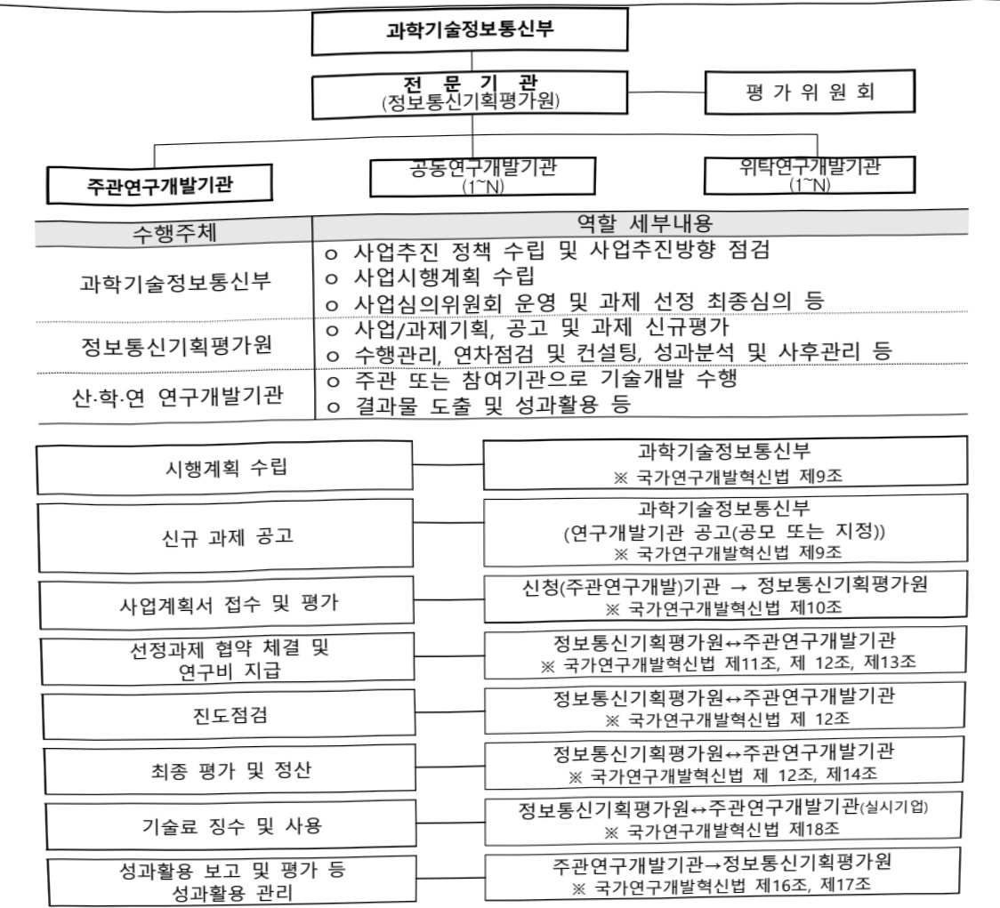
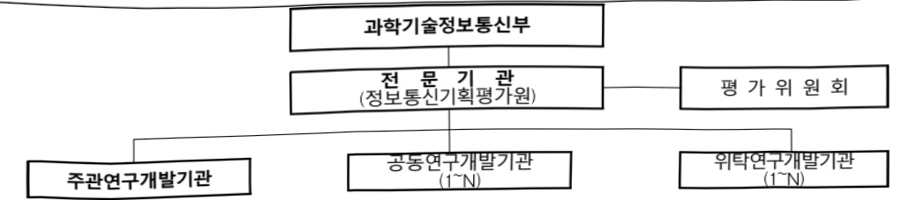
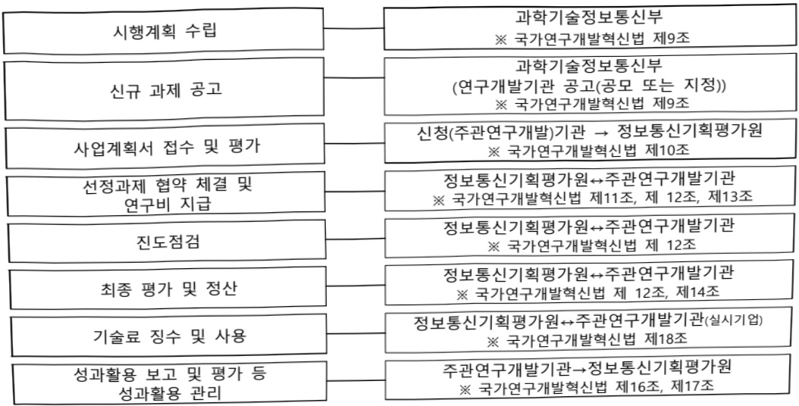

# 초고층 복합시설 복합재난관리 디지털플랫폼 기술개…

**해당 페이지**: PDF 1529 ~ 1534 쪽 해당

**부처**: 과학기술정보통신부
**분야**: 통신
**회계유형**: 일반회계
**2026 확정예산**: 2000.0 백만원
**전년대비 증감률**: None%
**AI 도메인**: 건설/스마트시티, 재난/안전

---

### 가. 예산 총괄표

(단위: 백만원, %)

<table border=1 style='margin: auto; word-wrap: break-word;'><tr><td rowspan="2">사업명</td><td rowspan="2">2024년 결산</td><td colspan="2">2025년 예산</td><td colspan="2">2026년 예산</td><td rowspan="2">증감(B-A)</td><td rowspan="2">(B-A)/A</td></tr><tr><td style='text-align: center; word-wrap: break-word;'>본예산</td><td style='text-align: center; word-wrap: break-word;'>추경*(A)</td><td style='text-align: center; word-wrap: break-word;'>요구안</td><td style='text-align: center; word-wrap: break-word;'>본예산(B)</td></tr><tr><td style='text-align: center; word-wrap: break-word;'>초고층 복합시설 복합재난관리 디지털플랫폼 기술개발</td><td style='text-align: center; word-wrap: break-word;'>-</td><td style='text-align: center; word-wrap: break-word;'>-</td><td style='text-align: center; word-wrap: break-word;'>-</td><td style='text-align: center; word-wrap: break-word;'>2,000</td><td style='text-align: center; word-wrap: break-word;'>2,000</td><td style='text-align: center; word-wrap: break-word;'>순증</td><td style='text-align: center; word-wrap: break-word;'>순증</td></tr></table>

* 추경: 추경증감액을 포함한 최종 예산액을 기재

□ 기능별(내역사업별) 예산 내역

(단위:백만원)

<table border=1 style='margin: auto; word-wrap: break-word;'><tr><td rowspan="2"></td><td colspan="5">2024</td><td colspan="5">2025</td><td style='text-align: center; word-wrap: break-word;'>2026 倉塗</td></tr><tr><td style='text-align: center; word-wrap: break-word;'>倉塗塗(専倉)</td><td style='text-align: center; word-wrap: break-word;'>倉塗塗塗塗塗塗塗塗塗塗塗塗塗塗塗塗塗塗塗塗塗塗塗塗塗塗塗塗塗塗塗塗塗塗塗塗塗塗塗塗塗塗塗塗塗塗塗塗塗塗塗塗塗塗塗塗塗塗塗塗塗塗塗塗塗塗塗塗塗塗塗塗塗塗塗塗塗塗塗塗塗塗塗塗塗塗塗塗塗塗塗塗塗塗塗塗塗塗塗塗塗塗塗塗塗塗塗塗塗塗塗塗塗塗塗塗塗塗塗塗塗塗塗塗塗塗塗塗塗塗塗塗塗塗塗塗塗塗塗塗塗塗塗塗塗塗塗塗塗塗塗塗塗塗塗塗塗塗塗塗塗塗塗塗塗塗塗塗塗塗塗塗塗塗塗塗塗塗塗塗塗塗塗塗塗塗塗塗塗塗塗塗塗塗塗塗塗塗塗塗塗塗塗塗塗塗塗塗塗塗塗塗塗塗塗塗塗塗塗塗塗塗塗塗塗塗塗塗塗塗塗塗塗塗塗塗塗塗塗塗塗塗塗塗塗塗塗塗塗塗塗塗塗塗塗塗塗塗塗塗塗塗塗塗塗塗塗塗塗塗塗塗塗塗塗塗塗塗塗塗塗塗塗塗塗塗塗塗塗塗塗塗塗塗塗塗塗塗塗塗塗塗塗塗塗塗塗塗塗塗塗塗塗塗塗塗塗塗塗塗塗塗塗塗塗塗塗塗塗塗塗塗塗塗塗塗塗塗塗塗塗塗塗塗塗塗塗塗塗塗塗塗塗塗塗塗塗塗塗塗塗塗塗塗塗塗塗塗塗塗塗塗塗塗塗塗塗塗塗塗塗塗塗塗塗塗塗塗塗塗塗塗塗塗塗塗塗塗塗塗塗塗塗塗塗塗塗塗塗塗塗塗塗塗塗塗塗塗塗塗塗塗塗塗塗塗塗塗塗塗塗塗塗塗塗塗塗塗塗塗塗塗塗塗塗塗塗塗塗塗塗塗塗塗塗塗塗塗塗塗塗塗塗塗塗塗塗塗塗塗塗塗塗塗塗塗塗塗塗塗塗塗塗塗塗塗塗塗塗塗塗塗塗塗塗塗塗塗塗塗塗塗塗塗塗塗塗塗塗塗塗塗塗塗塗塗塗塗塗塗塗塗塗塗塗塗塗塗塗塗塗塗塗塗塗塗塗塗塗塗塗塗塗塗塗塗塗塗塗塗塗塗塗塗塗塗塗塗塗塗塗塗塗塗塗塗塗塗塗塗塗塗塗塗塗塗塗塗塗塗塗塗塗塗塗塗塗塗塗塗塗塗塗塗塗塗塗塗塗塗塗塗塗塗塗塗塗塗塗塗塗塗塗塗塗塗塗塗塗塗塗塗塗塗塗塗塗塗塗塗塗塗塗塗塗塗塗塗塗塗塗塗塗塗塗塗塗塗塗塗塗塗塗塗塗塗塗塗塗塗塗塗塗塗塗塗塗塗塗塗塗塗塗塗塗塗塗塗塗塗塗塗塗塗塗塗塗塗塗塗塗塗塗塗塗塗塗塗塗塗塗塗塗塗塗塗塗塗塗塗塗塗塗塗塗塗塗塗塗塗塗塗塗塗塗塗塗塗塗塗塗塗塗塗塗塗塗塗塗塗塗塗塗塗塗塗塗塗塗塗塗塗塗塗塗塗塗塗塗塗塗塗塗塗塗塗塗塗塗塗塗塗塗塗塗塗塗塗塗塗塗塗塗塗塗塗塗塗塗塗塗塗塗塗塗塗塗塗塗塗塗塗塗塗塗塗塗塗塗塗塗塗塗塗塗塗塗塗塗塗塗塗塗塗塗塗塗塗塗塗塗塗塗塗塗塗塗塗塗塗塗塗塗塗塗塗塗塗塗塗塗塗塗塗塗塗塗塗塗塗塗塗塗塗塗塗塗塗塗塗塗塗塗塗塗塗塗塗塗塗塗塗塗塗塗塗塗塗塗塗塗塗塗塗塗塗塗塗塗塗塗塗塗塗塗塗塗塗塗塗塗塗塗塗塗塗塗塗塗塗塗塗塗塗塗塗塗塗塗塗塗塗塗塗塗塗塗塗塗塗塗塗塗塗塗塗塗塗塗塗塗塗塗塗塗塗塗塗塗塗塗塗塗塗塗塗塗塗塗塗塗塗塗塗塗塗塗塗塗塗塗塗塗塗塗塗塗塗塗塗塗塗塗塗塗塗塗塗塗塗塗塗塗塗塗塗塗塗塗塗塗塗塗塗塗塗塗塗塗塗塗塗塗塗塗塗塗塗塗塗塗塗塗塗塗塗塗塗塗塗塗塗塗塗塗塗塗塗塗塗塗塗塗塗塗塗塗塗塗塗塗塗塗塗塗塗塗塗塗塗塗塗塗塗塗塗塗塗塗塗塗塗塗塗塗塗塗塗塗塗塗塗塗塗塗塗塗塗塗塗塗塗塗塗塗塗塗塗塗塗塗塗塗塗塗塗塗塗塗塗塗塗塗塗塗塗塗塗塗塗塗塗塗塗塗塗塗塗塗塗塗塗塗塗塗塗塗塗塗塗塗塗塗塗塗塗塗塗塗塗塗塗塗塗塗塗塗塗塗塗塗塗塗塗塗塗塗塗塗塗塗塗塗塗塗塗塗塗塗塗塗塗塗塗塗塗塗塗塗塗塗塗塗塗塗塗塗塗塗塗塗塗塗塗塗塗塗塗塗塗塗塗塗塗塗塗塗塗塗塗塗塗塗塗塗塗塗塗塗塗塗塗塗塗塗塗塗塗塗塗塗塗塗塗塗塗塗塗塗塗塗塗塗塗塗塗塗塗塗塗塗塗塗塗塗塗塗塗塗塗塗塗塗塗塗塗塗塗塗塗塗塗塗塗塗塗塗塗塗塗塗塗塗塗塗塗塗塗塗塗塗塗塗塗塗塗塗塗塗塗塗塗塗塗塗塗塗塗塗塗塗塗塗塗塗塗塗塗塗塗塗塗塗塗塗塗塗</td><td style='text-align: center; word-wrap: break-word;'></td><td style='text-align: center; word-wrap: break-word;'></td><td style='text-align: center; word-wrap: break-word;'></td><td style='text-align: center; word-wrap: break-word;'></td><td style='text-align: center; word-wrap: break-word;'></td><td style='text-align: center; word-wrap: break-word;'></td><td style='text-align: center; word-wrap: break-word;'></td><td style='text-align: center; word-wrap: break-word;'></td><td style='text-align: center; word-wrap: break-word;'></td></tr></table>

### 나. 사업설명자료

## 1 ) 사업목적·내용

- (초고층 복합시설 복합재난관리 디지털플랫폼 기술개발) 지상·지하 공간이 상호

연계된 도심지 복합공간에서의 재난 회복력 강화를 위한 예측·예방 중심의 초고층

복합시설 복합재난관리 디지털플랫폼 개발

- (인공지능기반 복합 재난관리 통합 플랫폼 기술개발) 초고층 복합시설에서 재난상황

인지 및 의사결정지원정보 추론이 가능한 인공지능 기반 전주기 재난안전관리 기술

연구 및 플랫폼 개발

## 2 ) 사업개요

사업근거 및 추진경위

① 법령상 근거 및 조항 적시

---

- 재난 및 안전관리 기본법 제25조(시·군·구 안전관리계획의 수립), 제71조(재난 및 안전관리에 필요한 과학기술의 진흥 등), 제71조의2(재난 및 안전관리기술개발 종합계획의 수립 등), 제72조(연구개발사업 성과의 사업화 지원)

- 정보통신산업진흥법 제7조(정보통신기술진흥 시행계획)

- 정보통신 진흥 및 융합 활성화 등에 관한 특별법 제32조(정보통신 융합 등 기술·서비스 개발 등의 지원)

② 추진경위

- '23.6. : 다부처공동기획연구지원사업(KISTEP) 신규 대상과제 선정

- '24.1. : 다부처공동기획연구 최종후보 주제 선정

- '24.12. : 부처협업사업 관련 부처 협의(과기정통부, 국토부, 행안부)

- 국정과제(31. 미래 모빌리티와 'K-AI시티' 실현, 72. 국민안전 보장을 위한 재난안전 관리체계 확립, 73. 재난피해 최소화를 위한 예방 · 대응 강화)

주요내용

① 사업규모

- 총사업비(해당되는 경우에만 기재) : 해당없음

- 사업기간 : '26년~'28년

- 최근 5년 간 투입된 사업비(예산액기준, 추경편성한 연도에는 추경포함)

<table border=1 style='margin: auto; word-wrap: break-word;'><tr><td style='text-align: center; word-wrap: break-word;'>$  \text{연도}  $</td><td style='text-align: center; word-wrap: break-word;'>2022</td><td style='text-align: center; word-wrap: break-word;'>2023</td><td style='text-align: center; word-wrap: break-word;'>2024</td><td style='text-align: center; word-wrap: break-word;'>2025</td><td style='text-align: center; word-wrap: break-word;'>2026</td></tr><tr><td style='text-align: center; word-wrap: break-word;'>사업비</td><td style='text-align: center; word-wrap: break-word;'>-</td><td style='text-align: center; word-wrap: break-word;'>-</td><td style='text-align: center; word-wrap: break-word;'>-</td><td style='text-align: center; word-wrap: break-word;'>-</td><td style='text-align: center; word-wrap: break-word;'>2,000</td></tr></table>

-기타: 해당없음

② 사업추진체계

- 사업시행방법 : 출연

- 사업시행주체 : 정보통신기획평가원

-사업 수혜자 : 대학, 기업, 출연연 등

- 보조, 융자, 출연, 출자 등의 경우 보조·융자 등 지원 비율 및 법적근거

<table border=1 style='margin: auto; word-wrap: break-word;'><tr><td style='text-align: center; word-wrap: break-word;'>내역사업명</td><td style='text-align: center; word-wrap: break-word;'>구분</td><td style='text-align: center; word-wrap: break-word;'>피보조·피출연 등 기관명</td><td style='text-align: center; word-wrap: break-word;'>지원 금액 (2026예산)</td><td style='text-align: center; word-wrap: break-word;'>지원 비율(%)</td><td style='text-align: center; word-wrap: break-word;'>보조율 법적근거 (해당 조항)</td></tr><tr><td style='text-align: center; word-wrap: break-word;'>인공지능기반 복합 재난관리 통합 플랫폼 기술개발</td><td style='text-align: center; word-wrap: break-word;'>출연</td><td style='text-align: center; word-wrap: break-word;'>정보통신 기획평가원</td><td style='text-align: center; word-wrap: break-word;'>2,000백만원</td><td style='text-align: center; word-wrap: break-word;'>100</td><td style='text-align: center; word-wrap: break-word;'>- 정보통신산업진흥법 제7조 - 정보통신 진흥 및 융합 활성화 등에 관한 특별법 제32조</td></tr></table>

---

## 3 ) 2026년도 예산 산출 근거

□ 초고층 복합시설 복합재난관리 디지털플랫폼 기술개발 : (2025) 0 → (2026) 2,000백만원, 순증

① 인공지능기반 복합 재난관리 통합 플랫폼 기술개발

- (요구) 멀티센서·엣지 AI 기반 현장정보 수집을 통한 상황 감지기술 개발 및 저지연·고신뢰 네트워크 구현, 복합정보 교차분석을 통한 위험도 추론 기술개발, 복합재난 예측·대응을 위한 의사결정지원 및 대응 최적화 기술 개발

- (산출) 신규 과제 1개 × 2,667백만원 × 9/12개월 = 2,000백만원

## 4 ) 사업효과

☐ 사업영향, 산출물 성과지표 등

① 2022~2026년도 성과계획서 상 성과지표 및 최근 5년간 성과 달성도

<table border=1 style='margin: auto; word-wrap: break-word;'><tr><td style='text-align: center; word-wrap: break-word;'>성과지표</td><td style='text-align: center; word-wrap: break-word;'>구분</td><td style='text-align: center; word-wrap: break-word;'>2022</td><td style='text-align: center; word-wrap: break-word;'>2023</td><td style='text-align: center; word-wrap: break-word;'>2024</td><td style='text-align: center; word-wrap: break-word;'>2025</td><td style='text-align: center; word-wrap: break-word;'>2026</td><td style='text-align: center; word-wrap: break-word;'>2026 목표치산출근거</td><td style='text-align: center; word-wrap: break-word;'>측정산식(또는 측정방법)</td><td style='text-align: center; word-wrap: break-word;'>자료수집방법(또는 자료출처)</td></tr><tr><td rowspan="3">특허출원/등록건수(국내, 국제)(단위: 건)</td><td style='text-align: center; word-wrap: break-word;'>목표</td><td style='text-align: center; word-wrap: break-word;'>-</td><td style='text-align: center; word-wrap: break-word;'>-</td><td style='text-align: center; word-wrap: break-word;'>-</td><td style='text-align: center; word-wrap: break-word;'>-</td><td style='text-align: center; word-wrap: break-word;'>신규</td><td rowspan="3">10억당 국내외특허 출원 및 등록 건수</td><td rowspan="3">(∑국내외 특허 등록 및 출원건수)/(해당연도예산/10억)</td><td rowspan="3">국내외 특허 등록 및 출원문서</td></tr><tr><td style='text-align: center; word-wrap: break-word;'>실적</td><td style='text-align: center; word-wrap: break-word;'>-</td><td style='text-align: center; word-wrap: break-word;'>-</td><td style='text-align: center; word-wrap: break-word;'>-</td><td style='text-align: center; word-wrap: break-word;'>-</td><td style='text-align: center; word-wrap: break-word;'>-</td></tr><tr><td style='text-align: center; word-wrap: break-word;'>달성도</td><td style='text-align: center; word-wrap: break-word;'>-</td><td style='text-align: center; word-wrap: break-word;'>-</td><td style='text-align: center; word-wrap: break-word;'>-</td><td style='text-align: center; word-wrap: break-word;'>-</td><td style='text-align: center; word-wrap: break-word;'>-</td></tr><tr><td rowspan="3">표준후보채택건수(국내, 국제)(단위: 건)</td><td style='text-align: center; word-wrap: break-word;'>목표</td><td style='text-align: center; word-wrap: break-word;'>-</td><td style='text-align: center; word-wrap: break-word;'>-</td><td style='text-align: center; word-wrap: break-word;'>-</td><td style='text-align: center; word-wrap: break-word;'>-</td><td style='text-align: center; word-wrap: break-word;'>신규</td><td rowspan="3">국내외 표준화채택 건수</td><td rowspan="3">(∑국내외 표준기고 및 채택 건수)</td><td rowspan="3">표준 기고 및 채택 문서</td></tr><tr><td style='text-align: center; word-wrap: break-word;'>실적</td><td style='text-align: center; word-wrap: break-word;'>-</td><td style='text-align: center; word-wrap: break-word;'>-</td><td style='text-align: center; word-wrap: break-word;'>-</td><td style='text-align: center; word-wrap: break-word;'>-</td><td style='text-align: center; word-wrap: break-word;'>-</td></tr><tr><td style='text-align: center; word-wrap: break-word;'>달성도</td><td style='text-align: center; word-wrap: break-word;'>-</td><td style='text-align: center; word-wrap: break-word;'>-</td><td style='text-align: center; word-wrap: break-word;'>-</td><td style='text-align: center; word-wrap: break-word;'>-</td><td style='text-align: center; word-wrap: break-word;'>-</td></tr></table>

② 성과지표 이외의 연도별 사업추진 경과 및 실적 : 해당없음

③ 향후(2026년도 이후) 기대효과

-예측·예방 중심 적극적 재난관리 체계 구축 및 초고층 복합시설 복합재난 피해

저감을 위한 핵심 기술 확보

- 복합시설 복합 재난 전조 감지 인프라 및 효율적인 복합재난관리 시스템 체계

구축을 통한 재난안전관리 역량 강화

5) 타당성조사 및 예비타당성조사 시행여부 및 결과 요지 : 해당 없음

6) 총사업비 대상사업 정보 : 해당 없음

---

## 7 ) 사업 집행절차

- 인공지능기반 복합 재난관리 통합 플랫폼 기술개발(26년)

<table border=1 style='margin: auto; word-wrap: break-word;'><tr><td style='text-align: center; word-wrap: break-word;'>부처</td><td style='text-align: center; word-wrap: break-word;'></td><td style='text-align: center; word-wrap: break-word;'>피출연·피보조기관</td><td style='text-align: center; word-wrap: break-word;'></td><td style='text-align: center; word-wrap: break-word;'>사업수행자</td></tr><tr><td style='text-align: center; word-wrap: break-word;'>과학기술정보통신부(2,000백만원)</td><td style='text-align: center; word-wrap: break-word;'>=&gt;(2,000백만원)</td><td style='text-align: center; word-wrap: break-word;'>정보통신기획평가원(-)</td><td style='text-align: center; word-wrap: break-word;'>=&gt;(2,000백만원)</td><td style='text-align: center; word-wrap: break-word;'>대학·기업·출연연등 수행기관</td></tr></table>

## 8 ) 각종 평가 : 해당없음

---

다.최근 4년간 결산내역

1) 결산표 : 해당없음

2) 주요 결산사항

□ 2022~2025년 결산 주요사항 : 해당 없음

□ 2025년 이·전용 등 세부내역 : 해당 없음

---

<table border=1 style='margin: auto; word-wrap: break-word;'><tr><td style='text-align: center; word-wrap: break-word;'>사 업 명</td></tr><tr><td style='text-align: center; word-wrap: break-word;'>(218) 최고급 AI해외인재 유치지원(2232-327)</td></tr></table>

사업 코드 정보

<table border=1 style='margin: auto; word-wrap: break-word;'><tr><td style='text-align: center; word-wrap: break-word;'>구분</td><td style='text-align: center; word-wrap: break-word;'>회계</td><td style='text-align: center; word-wrap: break-word;'>소관</td><td style='text-align: center; word-wrap: break-word;'>실국(기관)</td><td style='text-align: center; word-wrap: break-word;'>계정</td><td style='text-align: center; word-wrap: break-word;'>분야</td><td style='text-align: center; word-wrap: break-word;'>부문</td></tr><tr><td style='text-align: center; word-wrap: break-word;'>코드 명칭</td><td style='text-align: center; word-wrap: break-word;'>일반회계</td><td style='text-align: center; word-wrap: break-word;'>과학기술 정보통신부</td><td style='text-align: center; word-wrap: break-word;'>정보통신정책실 소프트웨어정책관</td><td style='text-align: center; word-wrap: break-word;'></td><td style='text-align: center; word-wrap: break-word;'>130 통신</td><td style='text-align: center; word-wrap: break-word;'>133 정보통신</td></tr></table>

<table border=1 style='margin: auto; word-wrap: break-word;'><tr><td style='text-align: center; word-wrap: break-word;'>구분</td><td style='text-align: center; word-wrap: break-word;'>프로그램</td><td style='text-align: center; word-wrap: break-word;'>단위사업</td><td style='text-align: center; word-wrap: break-word;'>세부사업</td></tr><tr><td style='text-align: center; word-wrap: break-word;'>코드</td><td style='text-align: center; word-wrap: break-word;'>2200</td><td style='text-align: center; word-wrap: break-word;'>2232</td><td style='text-align: center; word-wrap: break-word;'>327</td></tr><tr><td style='text-align: center; word-wrap: break-word;'>명칭</td><td style='text-align: center; word-wrap: break-word;'>SW산업진흥</td><td style='text-align: center; word-wrap: break-word;'>SW융합인력양성(일반)</td><td style='text-align: center; word-wrap: break-word;'>최고급 AI해외인재 유치지원</td></tr></table>

사업 성격 (공통요구자료 II-1 작성유의사항 4. 참조, 해당하는 사항에 “○” 표시)

<table border=1 style='margin: auto; word-wrap: break-word;'><tr><td style='text-align: center; word-wrap: break-word;'>신규</td><td style='text-align: center; word-wrap: break-word;'>계속</td><td style='text-align: center; word-wrap: break-word;'>완료</td><td style='text-align: center; word-wrap: break-word;'>예비타당성 실시여부</td><td style='text-align: center; word-wrap: break-word;'>총사업비 관리대상</td><td style='text-align: center; word-wrap: break-word;'>총액계상 예산사업</td><td style='text-align: center; word-wrap: break-word;'>사업소관 변경정보 2025예산 시 소관</td></tr><tr><td style='text-align: center; word-wrap: break-word;'></td><td style='text-align: center; word-wrap: break-word;'>○</td><td style='text-align: center; word-wrap: break-word;'></td><td style='text-align: center; word-wrap: break-word;'></td><td style='text-align: center; word-wrap: break-word;'></td><td style='text-align: center; word-wrap: break-word;'></td><td style='text-align: center; word-wrap: break-word;'></td></tr></table>

사업 지원 형태 및 지원을 (최소한 한 개는 반드시 선택하시오. 해당사항에 O 표시)

<table border=1 style='margin: auto; word-wrap: break-word;'><tr><td style='text-align: center; word-wrap: break-word;'>직접</td><td style='text-align: center; word-wrap: break-word;'>출자</td><td style='text-align: center; word-wrap: break-word;'>출연</td><td style='text-align: center; word-wrap: break-word;'>보조</td><td style='text-align: center; word-wrap: break-word;'>융자</td><td style='text-align: center; word-wrap: break-word;'>국고보조율(%)</td><td style='text-align: center; word-wrap: break-word;'>융자율(%)</td></tr><tr><td style='text-align: center; word-wrap: break-word;'></td><td style='text-align: center; word-wrap: break-word;'></td><td style='text-align: center; word-wrap: break-word;'>○</td><td style='text-align: center; word-wrap: break-word;'></td><td style='text-align: center; word-wrap: break-word;'></td><td style='text-align: center; word-wrap: break-word;'></td><td style='text-align: center; word-wrap: break-word;'></td></tr></table>

사업 소관부처 및 시행주체

<table border=1 style='margin: auto; word-wrap: break-word;'><tr><td style='text-align: center; word-wrap: break-word;'>사업명</td><td colspan="2">구분</td></tr><tr><td rowspan="2">최고급AI해외인재유치지원</td><td style='text-align: center; word-wrap: break-word;'>소관부처</td><td style='text-align: center; word-wrap: break-word;'>정보통신정책실소프트웨어정책관</td></tr><tr><td style='text-align: center; word-wrap: break-word;'>사업시행주체</td><td style='text-align: center; word-wrap: break-word;'>정보통신기획평가원</td></tr></table>

---

### 원본 PDF 크롭 이미지

