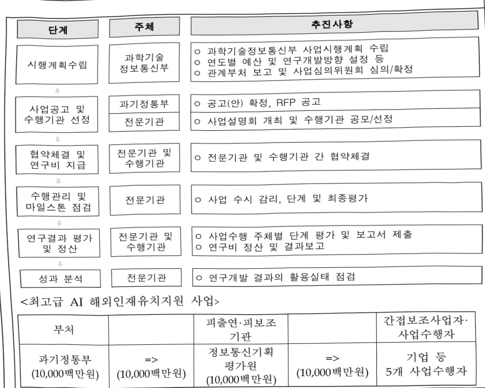

# 최고급AI해외인재유치지원(R&D)

**해당 페이지**: PDF 1535 ~ 1541 쪽 해당

**부처**: 과학기술정보통신부
**분야**: 통신
**회계유형**: 일반회계
**2026 확정예산**: 10000.0 백만원
**전년대비 증감률**: 100.0%
**AI 도메인**: 교육/인재

---

<table border=1 style='margin: auto; word-wrap: break-word;'><tr><td style='text-align: center; word-wrap: break-word;'>사 업 명</td></tr><tr><td style='text-align: center; word-wrap: break-word;'>(218) 최고급 AI해외인재 유치지원(2232-327)</td></tr></table>

사업 코드 정보

<table border=1 style='margin: auto; word-wrap: break-word;'><tr><td style='text-align: center; word-wrap: break-word;'>구분</td><td style='text-align: center; word-wrap: break-word;'>회계</td><td style='text-align: center; word-wrap: break-word;'>소관</td><td style='text-align: center; word-wrap: break-word;'>실국(기관)</td><td style='text-align: center; word-wrap: break-word;'>계정</td><td style='text-align: center; word-wrap: break-word;'>분야</td><td style='text-align: center; word-wrap: break-word;'>부문</td></tr><tr><td style='text-align: center; word-wrap: break-word;'>코드 명칭</td><td style='text-align: center; word-wrap: break-word;'>일반회계</td><td style='text-align: center; word-wrap: break-word;'>과학기술 정보통신부</td><td style='text-align: center; word-wrap: break-word;'>정보통신정책실 소프트웨어정책관</td><td style='text-align: center; word-wrap: break-word;'></td><td style='text-align: center; word-wrap: break-word;'>130 통신</td><td style='text-align: center; word-wrap: break-word;'>133 정보통신</td></tr></table>

<table border=1 style='margin: auto; word-wrap: break-word;'><tr><td style='text-align: center; word-wrap: break-word;'>구분</td><td style='text-align: center; word-wrap: break-word;'>프로그램</td><td style='text-align: center; word-wrap: break-word;'>단위사업</td><td style='text-align: center; word-wrap: break-word;'>세부사업</td></tr><tr><td style='text-align: center; word-wrap: break-word;'>코드</td><td style='text-align: center; word-wrap: break-word;'>2200</td><td style='text-align: center; word-wrap: break-word;'>2232</td><td style='text-align: center; word-wrap: break-word;'>327</td></tr><tr><td style='text-align: center; word-wrap: break-word;'>명칭</td><td style='text-align: center; word-wrap: break-word;'>SW산업진흥</td><td style='text-align: center; word-wrap: break-word;'>SW융합인력양성(일반)</td><td style='text-align: center; word-wrap: break-word;'>최고급 AI해외인재 유치지원</td></tr></table>

사업 성격 (공통요구자료 II-1 작성유의사항 4. 참조, 해당하는 사항에 “○” 표시)

<table border=1 style='margin: auto; word-wrap: break-word;'><tr><td style='text-align: center; word-wrap: break-word;'>신규</td><td style='text-align: center; word-wrap: break-word;'>계속</td><td style='text-align: center; word-wrap: break-word;'>완료</td><td style='text-align: center; word-wrap: break-word;'>예비타당성 실시여부</td><td style='text-align: center; word-wrap: break-word;'>총사업비 관리대상</td><td style='text-align: center; word-wrap: break-word;'>총액계상 예산사업</td><td style='text-align: center; word-wrap: break-word;'>사업소관 변경정보 2025예산 시 소관</td></tr><tr><td style='text-align: center; word-wrap: break-word;'></td><td style='text-align: center; word-wrap: break-word;'>○</td><td style='text-align: center; word-wrap: break-word;'></td><td style='text-align: center; word-wrap: break-word;'></td><td style='text-align: center; word-wrap: break-word;'></td><td style='text-align: center; word-wrap: break-word;'></td><td style='text-align: center; word-wrap: break-word;'></td></tr></table>

사업 지원 형태 및 지원을 (최소한 한 개는 반드시 선택하시오. 해당사항에 O 표시)

<table border=1 style='margin: auto; word-wrap: break-word;'><tr><td style='text-align: center; word-wrap: break-word;'>직접</td><td style='text-align: center; word-wrap: break-word;'>출자</td><td style='text-align: center; word-wrap: break-word;'>출연</td><td style='text-align: center; word-wrap: break-word;'>보조</td><td style='text-align: center; word-wrap: break-word;'>융자</td><td style='text-align: center; word-wrap: break-word;'>국고보조율(%)</td><td style='text-align: center; word-wrap: break-word;'>융자율(%)</td></tr><tr><td style='text-align: center; word-wrap: break-word;'></td><td style='text-align: center; word-wrap: break-word;'></td><td style='text-align: center; word-wrap: break-word;'>○</td><td style='text-align: center; word-wrap: break-word;'></td><td style='text-align: center; word-wrap: break-word;'></td><td style='text-align: center; word-wrap: break-word;'></td><td style='text-align: center; word-wrap: break-word;'></td></tr></table>

사업 소관부처 및 시행주체

<table border=1 style='margin: auto; word-wrap: break-word;'><tr><td style='text-align: center; word-wrap: break-word;'>사업명</td><td colspan="2">구분</td></tr><tr><td rowspan="2">최고급AI해외인재유치지원</td><td style='text-align: center; word-wrap: break-word;'>소관부처</td><td style='text-align: center; word-wrap: break-word;'>정보통신정책실소프트웨어정책관</td></tr><tr><td style='text-align: center; word-wrap: break-word;'>사업시행주체</td><td style='text-align: center; word-wrap: break-word;'>정보통신기획평가원</td></tr></table>

---

### 가.예산 총괄표

(단위: 백만원, %)

<table border=1 style='margin: auto; word-wrap: break-word;'><tr><td rowspan="2">사업명</td><td rowspan="2">2024년 결산</td><td colspan="2">2025년 예산</td><td colspan="2">2026년 예산</td><td rowspan="2">증감(B-A)</td><td rowspan="2">(B-A)/A</td></tr><tr><td style='text-align: center; word-wrap: break-word;'>본예산</td><td style='text-align: center; word-wrap: break-word;'>추경*(A)</td><td style='text-align: center; word-wrap: break-word;'>요구안</td><td style='text-align: center; word-wrap: break-word;'>본예산(B)</td></tr><tr><td style='text-align: center; word-wrap: break-word;'>최고급AI해외인재 유치지원</td><td style='text-align: center; word-wrap: break-word;'></td><td style='text-align: center; word-wrap: break-word;'></td><td style='text-align: center; word-wrap: break-word;'>5,000</td><td style='text-align: center; word-wrap: break-word;'>10,000</td><td style='text-align: center; word-wrap: break-word;'>10,000</td><td style='text-align: center; word-wrap: break-word;'>5,000</td><td style='text-align: center; word-wrap: break-word;'>100</td></tr></table>

□ 기능별(내역사업별) 예산 내역

(단위:백만원)

<table border=1 style='margin: auto; word-wrap: break-word;'><tr><td rowspan="2"></td><td colspan="5">2024</td><td colspan="5">2025</td><td rowspan="2">2026예산</td></tr><tr><td style='text-align: center; word-wrap: break-word;'>예산액(추정)</td><td style='text-align: center; word-wrap: break-word;'>예산현액</td><td style='text-align: center; word-wrap: break-word;'>집행액</td><td style='text-align: center; word-wrap: break-word;'>이월액</td><td style='text-align: center; word-wrap: break-word;'>불용액</td><td style='text-align: center; word-wrap: break-word;'>예산액(추정)</td><td style='text-align: center; word-wrap: break-word;'>예산현액</td><td style='text-align: center; word-wrap: break-word;'>집행액</td><td style='text-align: center; word-wrap: break-word;'>이월액</td><td style='text-align: center; word-wrap: break-word;'>불용액</td></tr><tr><td style='text-align: center; word-wrap: break-word;'>○ 최고급AI해외인재 유치지원</td><td style='text-align: center; word-wrap: break-word;'>-</td><td style='text-align: center; word-wrap: break-word;'>-</td><td style='text-align: center; word-wrap: break-word;'>-</td><td style='text-align: center; word-wrap: break-word;'>-</td><td style='text-align: center; word-wrap: break-word;'>-</td><td style='text-align: center; word-wrap: break-word;'>5,000(5,000)</td><td style='text-align: center; word-wrap: break-word;'>-</td><td style='text-align: center; word-wrap: break-word;'>5,000</td><td style='text-align: center; word-wrap: break-word;'>-</td><td style='text-align: center; word-wrap: break-word;'>-</td><td style='text-align: center; word-wrap: break-word;'>10,000</td></tr><tr><td style='text-align: center; word-wrap: break-word;'>• 최고급AI해외인재유치지원</td><td style='text-align: center; word-wrap: break-word;'>-</td><td style='text-align: center; word-wrap: break-word;'>-</td><td style='text-align: center; word-wrap: break-word;'>-</td><td style='text-align: center; word-wrap: break-word;'>-</td><td style='text-align: center; word-wrap: break-word;'>-</td><td style='text-align: center; word-wrap: break-word;'>5,000(5,000)</td><td style='text-align: center; word-wrap: break-word;'>-</td><td style='text-align: center; word-wrap: break-word;'>5,000</td><td style='text-align: center; word-wrap: break-word;'>-</td><td style='text-align: center; word-wrap: break-word;'>-</td><td style='text-align: center; word-wrap: break-word;'>10,000</td></tr></table>

### 나. 사업설명자료

## 1 ) 사업목적·내용

- (최고급AI해외인재유치지원) 기업 등이 해외 AI 우수연구자를 유치하여 도전적 AI 프로젝트 수행을 통해 우수성과를 창출하고, AI 고급인재 양성 및 글로벌 협력 네트워크 구축 등 AI 연구생태계 조성 기여

## 2 ) 사업개요

☐ 사업근거 및 추진경위

① 법령상 근거 및 조항

- 정보통신진흥 및 융합활성화 등에 관한 특별법 제11조(국내 전문인력 양성)

---

정보통신진흥 및 융합활성화 등에 관한 특별법 제11조(국내 전문인력 양성) ① 과학기술 정보통신부장관은 정보통신 분야의 전문적인 기술, 지식 등을 가진 인력(이하 "전문인력"이라 한다)의 육성에 관한 시책을 수립 · 추진하여야 하며, 특히 소프트웨어 교육의 저변확대 및 지역산업의 발전을 위한 소프트웨어 특화교육 활성화를 위하여 노력하여야 한다.

② 제1항에 따른 시책에는 다음 각 호의 사항이 포함되어야 한다.

1. 전문인력의 육성 및 교육훈련에 관한 사항

2. 전문인력의 수급 및 활용에 관한 사항

3. 전문인력의 경력관리 지원 등에 관한 사항

4. 그 밖에 전문인력의 육성 및 관리 등을 위한 사항

## - 정보통신산업진흥법 제16조(전문인력 양성)

## 정보통신산업진흥법 제16조(전문인력 양성) 과학기술정보통신부장관은 정보통신산업의

진흥에 필요한 전문인력을 양성하기 위하여 다음 각 호의 시책을 마련하여야 한다.

1. 전문인력의 수요 실태 파악 및 중·장기 수급 전망 수립

2. 전문인력 양성기관의 설립 · 지원

3. 전문인력 양성 교육프로그램의 개발 및 보급 지원

4. 정보통신기술 관련 자격제도의 정착 및 전문인력 수급 지원

5. 각급 학교 및 그 밖의 교육기관에서 시행하는 정보통신기술 및 정보통신산업 관련 교육의 지원

6. 그 밖에 전문인력 양성에 필요한 사항

## ② 추진경위

- 디지털 인재양성 종합방안 수립·발표(관계부처 합동, '22. 8월)

1. 고도화된 디지털 전문인재

② 디지털 분야 연구개발 인력양성 및 창업·창작 지원

(신산업 융복합 연구인력 양성) AI, 빅데이터 등 혁신성장 선도 신산업 분야 경쟁력

제고 및 산업·사회문제 해결을 선도할 고급인재 육성

° (연구지원 연계 인재 육성) 국가 첨단전략기술 중심의 디지털 연구센터 개편·확대 및 산업계 현안해결과 원천기술개발을 통한 인재양성 지원

2. 도메인 분야에 디지털기술을 적용하는 인재

① 비전공 학습자들을 위한 AI + X 등 디지털 융합 과정 운영

○ AI 등 디지털 + X 역량 향상 지원 프로그램 운영

○ AI 등 디지털 + X 융합 과정 활성화

---

- 글로벌 디지털 격차 해소(뉴욕 구상 발표) (22. 9월, 디지털 비전 포럼 기조연설)

전략 1. 세계 최고의 디지털 역량
'6대 디지털 혁신기술 분야에서 초격차 기술력을 확보하겠습니다.
°(투자방향) '23년부터 ①인공지능(AI), ②AI반도체, ③5G·6G 이동통신, ④양자,
⑤메타버스, ⑥사이버보안 등 6대 혁신기술 부냐에 대한 연구개발(R&D) 집중 투자
디지털 인재 100만명 양성으로 인재 부국을 달성하겠습니다.
°(민관 협력 인재양성) 교육과 채용이 연계되는 민관 협력형 교육, 디지털 전환 전문가
육성 등을 통한 산업계 디지털 인력난 해소
- 제26차 비상경제장관회의에서「소프트웨어진흥전략」발표('23. 4월)

전략 1. [인재] 전국민 SW교육 및 고급·전문인재 양성을 위한 기반 마련

1. [1] 창의적 창의

- AI-반도체 이니셔티브 수립·발표(관계부처 합동, '24. 4월)

### 중점 추진과제 2. AI-반도체 산업을 이끌 혁신인재 양성

ㅎㄱㅏㄴㅇ

- 국가 AI전략 정책방향(안)(관계부처 합동, '24. 9월)

### 24 대 분야 정책 추진방향, [스타트업. 인재] 국가 AX혁신을 뒷받침 할 기초체력 확충

□ (AI인재) 교육 생애주기 전반을 아우르는 AI인재양성 확대와 해외 인재유치 촉진으로 '30년까지 20만 AI인재확보 추진'(23, 5.1만명)

° (인재양성) AI인재양성의 수월화, 글로벌화, 보편화를 통해 최고급 AI인재·글로벌 AI인재 양성과 함께 AI교육 저변확대

°(인재유치) 해외 우수AI인재 국내유입 촉진을 위한 비자제도 개선 및 국내정착 기반 조성(한국어 교육, 취업지원 등)

---

- AI컴퓨팅 인프라 확충을 통한 AI경쟁력 강화 방안(안)(관계부처 합동, '25. 2월)

전략 2-핵심과제 3. 고급 AI인재 양성체계 고도화

세계 최고 수준의 AI 인재 양성·확보

° AI 분야 해외인재 및 재외 한인 연구자를 국내 유치·활용 확대- 기존 사업을 활용하여 AI 분야 석학, 우수연구자 유치 확대

- AI 기업이 필요로 하는 글로벌 핵심인재 유치 시 기업과 정부가 인건비를 매칭하여 지원(1인당 정부지원 최대 10억원 규모)

※ AI 분야 해외인재 또는 재외 한국인 초청 시 인건비·체제비·연구비 매칭 지원(최대 5년)

## □ 주요내용

① 사업규모

- 총사업비 : 해당없음

- 사업기간 : '25 ~ '27

- 최근 5년 간 투입된 사업비(예산액기준, 추경편성한 연도에는 추경포함)

<table border=1 style='margin: auto; word-wrap: break-word;'><tr><td style='text-align: center; word-wrap: break-word;'>연도</td><td style='text-align: center; word-wrap: break-word;'>2022</td><td style='text-align: center; word-wrap: break-word;'>2023</td><td style='text-align: center; word-wrap: break-word;'>2024</td><td style='text-align: center; word-wrap: break-word;'>2025</td><td style='text-align: center; word-wrap: break-word;'>2026</td></tr><tr><td style='text-align: center; word-wrap: break-word;'>사업비</td><td style='text-align: center; word-wrap: break-word;'></td><td style='text-align: center; word-wrap: break-word;'></td><td style='text-align: center; word-wrap: break-word;'></td><td style='text-align: center; word-wrap: break-word;'>5,000</td><td style='text-align: center; word-wrap: break-word;'>10,000</td></tr></table>

② 사업추진체계

- 사업시행방법 : 출연

- 사업시행주체 : 정보통신기획평가원

- 사업 수혜자 : 기업, 대학 등

- 보조, 융자, 출연, 출자 등의 경우 보조·융자 등 지원 비율 및 법적근거

<table border=1 style='margin: auto; word-wrap: break-word;'><tr><td style='text-align: center; word-wrap: break-word;'>내역사업명</td><td style='text-align: center; word-wrap: break-word;'>구분</td><td style='text-align: center; word-wrap: break-word;'>피보조·피출연 등 기관명</td><td style='text-align: center; word-wrap: break-word;'>지원 금액 (2026예산안)</td><td style='text-align: center; word-wrap: break-word;'>지원 비율(%)</td><td style='text-align: center; word-wrap: break-word;'>보조율 법적근거 (해당 조항)</td></tr><tr><td style='text-align: center; word-wrap: break-word;'>최고급AI 해외인재 유치지원</td><td style='text-align: center; word-wrap: break-word;'>출연</td><td style='text-align: center; word-wrap: break-word;'>정보통신 기획평가원</td><td style='text-align: center; word-wrap: break-word;'>10,000 (10,000)</td><td style='text-align: center; word-wrap: break-word;'>100</td><td style='text-align: center; word-wrap: break-word;'>한국연구체단법 제11조 정보통신 진흥 및 융합 활성화 등에 관한 특별법 제32조</td></tr></table>

## 3 ) 2026년도 예산 산출 근거

□ 최고급AI해외인재유치지원 :

(2025 추경예산 5,000백만원)→(2026)10,000백만원

- (요구) 도전적 AI R&D 프로젝트를 주도할 해외 AI 우수연구자 유치 지원을 위한 계속과제 지속 지원 소요분 요구

- (산출) 계속과제(5개) 10,000백만원

2025년도 추가경정예산 및 2026년도 예산 산출 세부내역 비교

<table border=1 style='margin: auto; word-wrap: break-word;'><tr><td colspan="2">2025년 추가경정예산</td><td colspan="2">2026년 예산안</td></tr><tr><td style='text-align: center; word-wrap: break-word;'>예산</td><td style='text-align: center; word-wrap: break-word;'>산출내역</td><td style='text-align: center; word-wrap: break-word;'>예산</td><td style='text-align: center; word-wrap: break-word;'>산출내역</td></tr><tr><td rowspan="2">최고급AI 해외인재 유치지원</td><td style='text-align: center; word-wrap: break-word;'>&lt; 최고급AI해외인재유치지원 5,000 백만원 &gt;</td><td rowspan="2">최고급AI 해외인재 유치지원</td><td style='text-align: center; word-wrap: break-word;'>&lt; 최고급AI해외인재유치지원 10,000 백만원 &gt;</td></tr><tr><td style='text-align: center; word-wrap: break-word;'>- (신규과제) 5개 × 1,000백만 = 5,000만원</td><td style='text-align: center; word-wrap: break-word;'>(계규과제) 5개 × 2,000백만 × (12/12)개월 = 10,000만원</td></tr></table>

---

## 4 ) 사업효과

☐ 사업영향, 산출물 성과지표 등

① 2022~2026년도 성과계획서 상 성과지표 및 최근 5년간 성과 달성도

<table border=1 style='margin: auto; word-wrap: break-word;'><tr><td style='text-align: center; word-wrap: break-word;'>성과지표</td><td style='text-align: center; word-wrap: break-word;'>구분</td><td style='text-align: center; word-wrap: break-word;'>2022</td><td style='text-align: center; word-wrap: break-word;'>2023</td><td style='text-align: center; word-wrap: break-word;'>2024</td><td style='text-align: center; word-wrap: break-word;'>2025</td><td style='text-align: center; word-wrap: break-word;'>2026</td><td style='text-align: center; word-wrap: break-word;'>‘25목표치산출근거</td><td style='text-align: center; word-wrap: break-word;'>측정산식(또는측정방법)</td><td style='text-align: center; word-wrap: break-word;'>자료수집방법(또는자료출처)</td></tr><tr><td rowspan="3">유치인원수(단위:명)</td><td style='text-align: center; word-wrap: break-word;'>목표</td><td style='text-align: center; word-wrap: break-word;'>-</td><td style='text-align: center; word-wrap: break-word;'>-</td><td style='text-align: center; word-wrap: break-word;'>-</td><td style='text-align: center; word-wrap: break-word;'>5</td><td style='text-align: center; word-wrap: break-word;'>5</td><td rowspan="3">지원과제당1명 유치</td><td rowspan="3">해외 전문가국내 유치인원수</td><td rowspan="3">고용계약서 등</td></tr><tr><td style='text-align: center; word-wrap: break-word;'>실적</td><td style='text-align: center; word-wrap: break-word;'>-</td><td style='text-align: center; word-wrap: break-word;'>-</td><td style='text-align: center; word-wrap: break-word;'>-</td><td style='text-align: center; word-wrap: break-word;'>-</td><td style='text-align: center; word-wrap: break-word;'>-</td></tr><tr><td style='text-align: center; word-wrap: break-word;'>달성도</td><td style='text-align: center; word-wrap: break-word;'>-</td><td style='text-align: center; word-wrap: break-word;'>-</td><td style='text-align: center; word-wrap: break-word;'>-</td><td style='text-align: center; word-wrap: break-word;'>-</td><td style='text-align: center; word-wrap: break-word;'>-</td></tr><tr><td rowspan="3">수혜인력수(단위:명)</td><td style='text-align: center; word-wrap: break-word;'>목표</td><td style='text-align: center; word-wrap: break-word;'>-</td><td style='text-align: center; word-wrap: break-word;'>-</td><td style='text-align: center; word-wrap: break-word;'>-</td><td style='text-align: center; word-wrap: break-word;'>25</td><td style='text-align: center; word-wrap: break-word;'>25</td><td rowspan="3">지원과제당5명 이상</td><td rowspan="3">국내 연구팀인원수</td><td rowspan="3">성과분석 보고서</td></tr><tr><td style='text-align: center; word-wrap: break-word;'>실적</td><td style='text-align: center; word-wrap: break-word;'>-</td><td style='text-align: center; word-wrap: break-word;'>-</td><td style='text-align: center; word-wrap: break-word;'>-</td><td style='text-align: center; word-wrap: break-word;'>-</td><td style='text-align: center; word-wrap: break-word;'>-</td></tr><tr><td style='text-align: center; word-wrap: break-word;'>달성도</td><td style='text-align: center; word-wrap: break-word;'>-</td><td style='text-align: center; word-wrap: break-word;'>-</td><td style='text-align: center; word-wrap: break-word;'>-</td><td style='text-align: center; word-wrap: break-word;'>-</td><td style='text-align: center; word-wrap: break-word;'>-</td></tr><tr><td rowspan="3">(WBL)프로젝트수행(단위:점)</td><td style='text-align: center; word-wrap: break-word;'>목표</td><td style='text-align: center; word-wrap: break-word;'>-</td><td style='text-align: center; word-wrap: break-word;'>-</td><td style='text-align: center; word-wrap: break-word;'>-</td><td style='text-align: center; word-wrap: break-word;'>80</td><td style='text-align: center; word-wrap: break-word;'>82</td><td rowspan="3">(WBL)프로젝트수행 만족도</td><td rowspan="3">WBL 공동프로젝트 참여만족도</td><td rowspan="3">성과분석 보고서</td></tr><tr><td style='text-align: center; word-wrap: break-word;'>실적</td><td style='text-align: center; word-wrap: break-word;'>-</td><td style='text-align: center; word-wrap: break-word;'>-</td><td style='text-align: center; word-wrap: break-word;'>-</td><td style='text-align: center; word-wrap: break-word;'>-</td><td style='text-align: center; word-wrap: break-word;'>-</td></tr><tr><td style='text-align: center; word-wrap: break-word;'>달성도</td><td style='text-align: center; word-wrap: break-word;'>-</td><td style='text-align: center; word-wrap: break-word;'>-</td><td style='text-align: center; word-wrap: break-word;'>-</td><td style='text-align: center; word-wrap: break-word;'>-</td><td style='text-align: center; word-wrap: break-word;'>-</td></tr><tr><td rowspan="3">개방형세미나 건수(단위:전)</td><td style='text-align: center; word-wrap: break-word;'>목표</td><td style='text-align: center; word-wrap: break-word;'>-</td><td style='text-align: center; word-wrap: break-word;'>-</td><td style='text-align: center; word-wrap: break-word;'>-</td><td style='text-align: center; word-wrap: break-word;'>5</td><td style='text-align: center; word-wrap: break-word;'>10</td><td rowspan="3">지원과제당1회/년 이상</td><td rowspan="3">해외우수연구자의 개방형세미나 개최건수</td><td rowspan="3">성과분석 보고서</td></tr><tr><td style='text-align: center; word-wrap: break-word;'>실적</td><td style='text-align: center; word-wrap: break-word;'>-</td><td style='text-align: center; word-wrap: break-word;'>-</td><td style='text-align: center; word-wrap: break-word;'>-</td><td style='text-align: center; word-wrap: break-word;'>-</td><td style='text-align: center; word-wrap: break-word;'>-</td></tr><tr><td style='text-align: center; word-wrap: break-word;'>달성도</td><td style='text-align: center; word-wrap: break-word;'>-</td><td style='text-align: center; word-wrap: break-word;'>-</td><td style='text-align: center; word-wrap: break-word;'>-</td><td style='text-align: center; word-wrap: break-word;'>-</td><td style='text-align: center; word-wrap: break-word;'>-</td></tr><tr><td rowspan="3">글로벌연구역량도(SCImrnif)</td><td style='text-align: center; word-wrap: break-word;'>목표</td><td style='text-align: center; word-wrap: break-word;'>-</td><td style='text-align: center; word-wrap: break-word;'>-</td><td style='text-align: center; word-wrap: break-word;'>-</td><td style='text-align: center; word-wrap: break-word;'>-</td><td style='text-align: center; word-wrap: break-word;'>54.2</td><td rowspan="3">유사사업의mrnIF증가율(0.33%)기준</td><td rowspan="3">SCI 논문의표준화된영향력지수(mrnIF)</td><td rowspan="3">성과분석 보고서</td></tr><tr><td style='text-align: center; word-wrap: break-word;'>실적</td><td style='text-align: center; word-wrap: break-word;'>-</td><td style='text-align: center; word-wrap: break-word;'>-</td><td style='text-align: center; word-wrap: break-word;'>-</td><td style='text-align: center; word-wrap: break-word;'>-</td><td style='text-align: center; word-wrap: break-word;'>-</td></tr><tr><td style='text-align: center; word-wrap: break-word;'>달성도</td><td style='text-align: center; word-wrap: break-word;'>-</td><td style='text-align: center; word-wrap: break-word;'>-</td><td style='text-align: center; word-wrap: break-word;'>-</td><td style='text-align: center; word-wrap: break-word;'>-</td><td style='text-align: center; word-wrap: break-word;'>-</td></tr></table>

② 성과지표 이외의 연도별 사업추진 경과 및 실적

<table border=1 style='margin: auto; word-wrap: break-word;'><tr><td style='text-align: center; word-wrap: break-word;'>2022</td><td style='text-align: center; word-wrap: break-word;'>-</td></tr><tr><td style='text-align: center; word-wrap: break-word;'>2023</td><td style='text-align: center; word-wrap: break-word;'>-</td></tr><tr><td style='text-align: center; word-wrap: break-word;'>2024</td><td style='text-align: center; word-wrap: break-word;'>-</td></tr><tr><td style='text-align: center; word-wrap: break-word;'>2025</td><td style='text-align: center; word-wrap: break-word;'>국내 AI기관 수요에 기반한 연구과제를 해외 AI연구자(연구팀)와 공동 프로젝트로 수행하는 5개 컨소시엄 선정 및 최고급 우수연구자 8명 유치·지원</td></tr></table>

③향후(2026년도 이후)기대효과

- AI 최고급 인재의 확보를 통해 AI 분야 기술 수준을 제고하여 한정된 국내의 인력을 충동원하여 글로벌 Top 수준의 AI 기술 개발

- AI 최고급 인재 확보를 통해 산업·직업·사회적 변혁을 이끌 새로운 패러다임에 국가적 차원의 대응 추진

- 도메인별 적용 가능한 글로벌 Top 수준의 AI 기술 개발을 통해 향후 손산업 경쟁력 강화의 기반 마련

-학제 중심의 교육·인재양성 환경에서 벗어나, 해외석학 중심의 도제식 AI 연구 개발·활용인재 양성 환경 마련

- 국내 연구자의 연구역량 및 글로벌 역량 강화, 글로벌 연구 네트워크 확장 등

국내 연구생태계 구축에 기여 할 것으로 기대

---

5)타당성조사 및 예비타당성조사 시행여부 및 결과 요지:해당없음

6) 총사업비 대상사업 정보 : 해당없음

## 7 ) 사업 집행절차

8) 각종 평가 : 해당없음

다. 최근 4년간 결산내역 : 해당없음

---

### 원본 PDF 크롭 이미지

