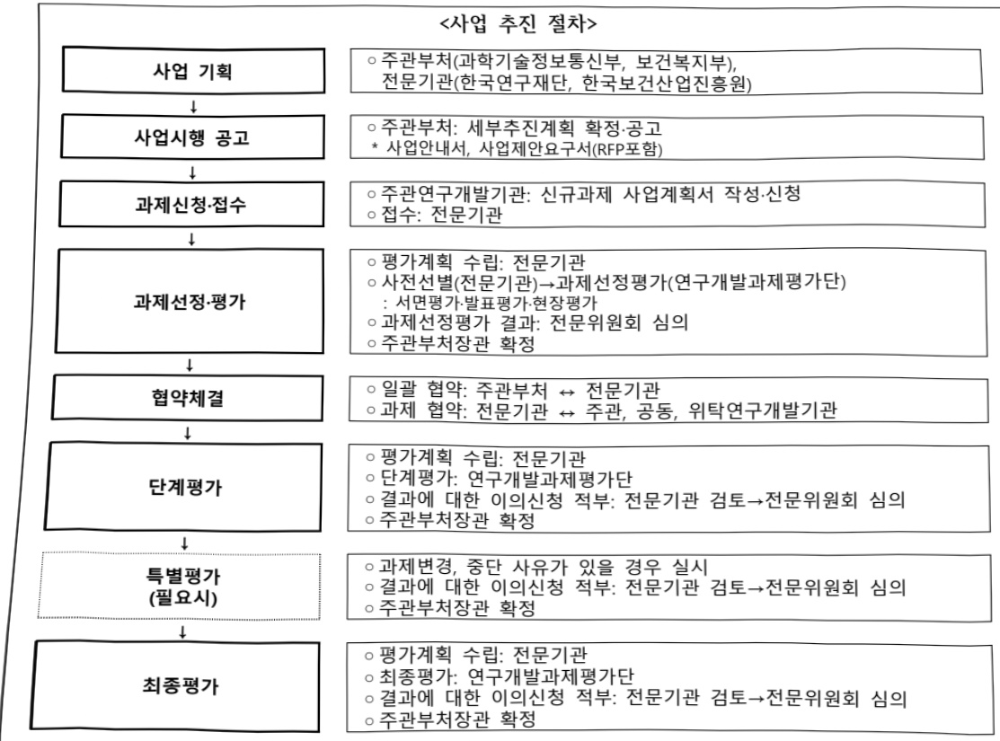
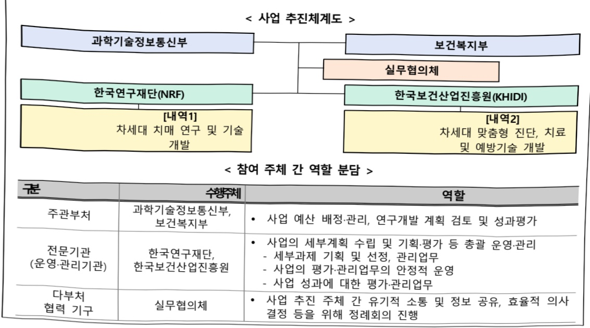
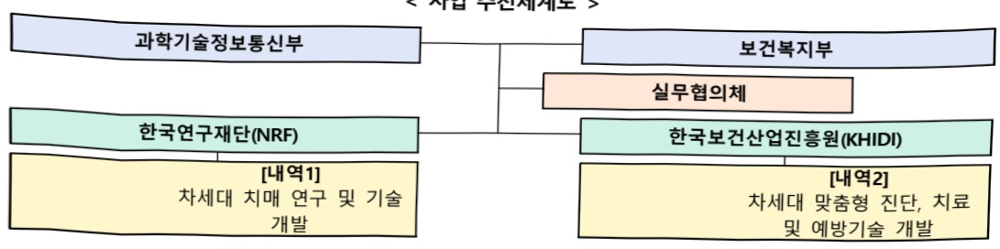

# 치매의료기술연구개발사업(R&D)

**해당 페이지**: PDF 1542 ~ 1547 쪽 해당

**부처**: 과학기술정보통신부
**분야**: 과학기술
**회계유형**: 일반회계
**2026 확정예산**: 1650.0 백만원
**전년대비 증감률**: None%
**AI 도메인**: 데이터, 의료/바이오

---

<table border=1 style='margin: auto; word-wrap: break-word;'><tr><td style='text-align: center; word-wrap: break-word;'>사 업 명</td></tr><tr><td style='text-align: center; word-wrap: break-word;'>(35) 치매의료기술연구개발사업(R&amp;D) (1138-500)</td></tr></table>

사업 코드 정보

<table border=1 style='margin: auto; word-wrap: break-word;'><tr><td style='text-align: center; word-wrap: break-word;'>구분</td><td style='text-align: center; word-wrap: break-word;'>회계</td><td style='text-align: center; word-wrap: break-word;'>소관</td><td style='text-align: center; word-wrap: break-word;'>실국(기관)</td><td style='text-align: center; word-wrap: break-word;'>계정</td><td style='text-align: center; word-wrap: break-word;'>분야</td><td style='text-align: center; word-wrap: break-word;'>부문</td></tr><tr><td rowspan="2">코드 명칭</td><td rowspan="2">일반회계</td><td rowspan="2">과학기술정보 통신부</td><td rowspan="2">연구개발정책실 미래전략기술정책관</td><td rowspan="2"></td><td style='text-align: center; word-wrap: break-word;'>150</td><td style='text-align: center; word-wrap: break-word;'>155</td></tr><tr><td style='text-align: center; word-wrap: break-word;'>과학기술</td><td style='text-align: center; word-wrap: break-word;'>과학기술연구개발</td></tr></table>

<table border=1 style='margin: auto; word-wrap: break-word;'><tr><td style='text-align: center; word-wrap: break-word;'>구분</td><td style='text-align: center; word-wrap: break-word;'>프로그램</td><td style='text-align: center; word-wrap: break-word;'>단위사업</td><td style='text-align: center; word-wrap: break-word;'>세부사업</td></tr><tr><td style='text-align: center; word-wrap: break-word;'>코드</td><td style='text-align: center; word-wrap: break-word;'>코드</td><td style='text-align: center; word-wrap: break-word;'>1100</td><td style='text-align: center; word-wrap: break-word;'>1138</td></tr><tr><td style='text-align: center; word-wrap: break-word;'>명칭</td><td style='text-align: center; word-wrap: break-word;'>명칭</td><td style='text-align: center; word-wrap: break-word;'>미래유망원천기술개발</td><td style='text-align: center; word-wrap: break-word;'>바이오·의료기술개발</td></tr></table>

☐ 사업 성격

<table border=1 style='margin: auto; word-wrap: break-word;'><tr><td rowspan="2">신규</td><td rowspan="2">계속</td><td rowspan="2">완료</td><td rowspan="2">예비타당성 실시여부</td><td rowspan="2">총사업비 관리대상</td><td rowspan="2">총액계상 예산사업</td><td style='text-align: center; word-wrap: break-word;'>사업소관 변경정보</td></tr><tr><td style='text-align: center; word-wrap: break-word;'>2025예산 시 소관</td></tr><tr><td style='text-align: center; word-wrap: break-word;'>○</td><td style='text-align: center; word-wrap: break-word;'></td><td style='text-align: center; word-wrap: break-word;'></td><td style='text-align: center; word-wrap: break-word;'></td><td style='text-align: center; word-wrap: break-word;'></td><td style='text-align: center; word-wrap: break-word;'></td><td style='text-align: center; word-wrap: break-word;'></td></tr></table>

☐ 사업 지원 형태 및 지원을

<table border=1 style='margin: auto; word-wrap: break-word;'><tr><td style='text-align: center; word-wrap: break-word;'>직접</td><td style='text-align: center; word-wrap: break-word;'>출자</td><td style='text-align: center; word-wrap: break-word;'>출연</td><td style='text-align: center; word-wrap: break-word;'>보조</td><td style='text-align: center; word-wrap: break-word;'>융자</td><td style='text-align: center; word-wrap: break-word;'>국고보조율(%)</td><td style='text-align: center; word-wrap: break-word;'>융자율(%)</td></tr><tr><td style='text-align: center; word-wrap: break-word;'></td><td style='text-align: center; word-wrap: break-word;'></td><td style='text-align: center; word-wrap: break-word;'>○</td><td style='text-align: center; word-wrap: break-word;'></td><td style='text-align: center; word-wrap: break-word;'></td><td style='text-align: center; word-wrap: break-word;'></td><td style='text-align: center; word-wrap: break-word;'></td></tr></table>

사업 소관부처 및 시행주체

<table border=1 style='margin: auto; word-wrap: break-word;'><tr><td style='text-align: center; word-wrap: break-word;'>사업명</td><td colspan="2">구분</td></tr><tr><td rowspan="2">치매의료기술연구개발사업</td><td style='text-align: center; word-wrap: break-word;'>소관부처</td><td style='text-align: center; word-wrap: break-word;'>연구개발정책실 미래전략기술정책관 첨단바이오기술과</td></tr><tr><td style='text-align: center; word-wrap: break-word;'>사업시행주체</td><td style='text-align: center; word-wrap: break-word;'>한국연구재단</td></tr></table>

### 가.예산 총괄표

(단위: 백만원, %)

<table border=1 style='margin: auto; word-wrap: break-word;'><tr><td rowspan="2">사업명</td><td rowspan="2">2024년 결산</td><td colspan="2">2025년 예산</td><td colspan="2">2026년 예산</td><td rowspan="2">증감(B-A)</td><td rowspan="2">(B-A)/A</td></tr><tr><td style='text-align: center; word-wrap: break-word;'>본예산</td><td style='text-align: center; word-wrap: break-word;'>추경(A)</td><td style='text-align: center; word-wrap: break-word;'>요구안</td><td style='text-align: center; word-wrap: break-word;'>본예산(B)</td></tr><tr><td style='text-align: center; word-wrap: break-word;'>치매의료기술연구개발사업(R&amp;D)</td><td style='text-align: center; word-wrap: break-word;'>-</td><td style='text-align: center; word-wrap: break-word;'>-</td><td style='text-align: center; word-wrap: break-word;'>-</td><td style='text-align: center; word-wrap: break-word;'>1,650</td><td style='text-align: center; word-wrap: break-word;'>1,650</td><td style='text-align: center; word-wrap: break-word;'>1,650</td><td style='text-align: center; word-wrap: break-word;'>순증</td></tr></table>

---

□ 기능별(내역사업별) 예산 내역

(단위:백만원)

<table border=1 style='margin: auto; word-wrap: break-word;'><tr><td rowspan="2"></td><td colspan="5">2024</td><td colspan="5">2025</td><td rowspan="2">2026 倉塲</td></tr><tr><td style='text-align: center; word-wrap: break-word;'>倉塲(倉塲)</td><td style='text-align: center; word-wrap: break-word;'>倉塲(倉塲)</td><td style='text-align: center; word-wrap: break-word;'>倉塲(倉塲)</td><td style='text-align: center; word-wrap: break-word;'>倉塲(倉塲)</td><td style='text-align: center; word-wrap: break-word;'>倉塲(倉塲)</td><td style='text-align: center; word-wrap: break-word;'>倉塲(倉塲)</td><td style='text-align: center; word-wrap: break-word;'>倉塲(倉塲)</td><td style='text-align: center; word-wrap: break-word;'>倉塲(倉塲)</td><td style='text-align: center; word-wrap: break-word;'>倉塲(倉塲)</td><td style='text-align: center; word-wrap: break-word;'>倉塲(倉塲)</td></tr><tr><td style='text-align: center; word-wrap: break-word;'>○ 기능별 분류(합계)</td><td style='text-align: center; word-wrap: break-word;'>-</td><td style='text-align: center; word-wrap: break-word;'>-</td><td style='text-align: center; word-wrap: break-word;'>-</td><td style='text-align: center; word-wrap: break-word;'>-</td><td style='text-align: center; word-wrap: break-word;'>-</td><td style='text-align: center; word-wrap: break-word;'>-</td><td style='text-align: center; word-wrap: break-word;'>-</td><td style='text-align: center; word-wrap: break-word;'>-</td><td style='text-align: center; word-wrap: break-word;'>-</td><td style='text-align: center; word-wrap: break-word;'>-</td><td style='text-align: center; word-wrap: break-word;'>1,650</td></tr><tr><td style='text-align: center; word-wrap: break-word;'>• 차세대 치매연구 및 기술개발</td><td style='text-align: center; word-wrap: break-word;'>-</td><td style='text-align: center; word-wrap: break-word;'>-</td><td style='text-align: center; word-wrap: break-word;'>-</td><td style='text-align: center; word-wrap: break-word;'>-</td><td style='text-align: center; word-wrap: break-word;'>-</td><td style='text-align: center; word-wrap: break-word;'>-</td><td style='text-align: center; word-wrap: break-word;'>-</td><td style='text-align: center; word-wrap: break-word;'>-</td><td style='text-align: center; word-wrap: break-word;'>-</td><td style='text-align: center; word-wrap: break-word;'>-</td><td style='text-align: center; word-wrap: break-word;'>1,650</td></tr></table>

### 나. 사업설명자료

## 1 ) 사업목적·내용

- (치매의료기술연구개발사업) AI·빅데이터 기반의 정밀의료를 활용한 치매 원인 규명,

조기 진단 및 맞춤형 치료·예방기술 개발을 통한 전주기 혁신적 연구개발 추진

- (내역_차세대 치매연구 및 기술개발) AI 및 융합기술 기반으로 기발굴된 치매 발

병기전 외 다각적인 원인 규명과 신규 바이오마커 및 치매치료제 후보물질 발굴

(AI 및 융합기술 기반 치매 신규타겟·바이오마커·유효 선도물질 발굴) AI 통합 분석 기술

등을 활용하여 새롭게 등장하는 치매 발명 위험요인 및 보호인자 탐색·기전 규명, 정밀

진단용 바이오마커 고도화, 치매 치료제 투여 환자 선별 마커 등 신규 바이오마커 발굴

(후보 치매약물 효과 시험·검증) 다양한 치매 원인 규명 및 병태생리학적 연관성에 기반

하여 GLP 연계가 가능한 근원적 치매 치료제 후보 물질을 발굴 및 초기 검증 수행

## 2 ) 사업개요

□ 사업근거 및 추진경위

① 법령상 근거 및 조항 적시

-과학기술기본법 제11조(국가연구개발사업 추진)

① 중앙행정기관의 장은 기본계획에 따라 말은 분야의 국가연구개발사업과 그 시책을 세워 추진하여야 한다.

- 뇌연구촉진법 제9조(뇌연구 투자 확대)

① 정부는 제5조제3항제2호의 투자재원의 확대 방안 및 추진계획에 따라 예산의 범위에서 뇌연구 투자를 확대하기 위하여 최대한 노력하여야 한다.

- 기초연구진흥 및 기술개발지원에 관한 법률 제14조(특정연구개발 사업의 추진)

---

① 과학기술정보통신부장관은 기초연구의 성과 등을 바탕으로 하여 국가 미래 유망기술과 융합기술을 중점적으로 개발하기 위한 연구개발사업(이하 "특정연구개발사업"이라 한다)에 대하여 계획을 수립하고, 연도별로 연구과제를 선정하여 이를 다음 각 호의 기관 또는 단체와 협약을 맺어 연구하게 할 수 있다. 이 경우 제2호의 기관 중 대표권이 없는 기관에 대하여는 그 기관이 속한 법인의 대표자와 협약할 수 있다.

- 보건의료기술 진흥법 제5조(보건의료기술 연구개발사업의 추진)

① 정부는 기본계획을 효율적으로 추진하기 위하여 보건의료기술 연구개발사업(이하 "연구개발사업"이라 한다)을 수행한다.

## ② 추진경위

- 치매극복연구개발사업 추진('20~'28)

- 사업 후반기('26~'28) 신규과제 지원공백에 대한 우려와 해결방안 마련 필요성에 대한 의견 수렴('24~'25)

※ 사업운영위원회, 유관학회 및 연구자 수요, 생명·의료전문위 의견 등 수렴

- 치매분야 연구지원 단절을 방지하고자, 양부처(과기정통부, 보건복지부)가 지원하는

브릿지 형태의 신규사업 추진 협의('25.03)

## □ 주요내용

① 사업규모

- 총사업비(해당되는 경우에만 기재) : 460.5억원(과기부:229.5억원, 복지부:231억원)

- 사업기간 : '26~'30년

- 최근 5년 간 투입된 사업비(예산액기준, 추경편성한 연도에는 추경포함)

<table border=1 style='margin: auto; word-wrap: break-word;'><tr><td style='text-align: center; word-wrap: break-word;'>$ \underline{\text{所}} $</td><td style='text-align: center; word-wrap: break-word;'>2022</td><td style='text-align: center; word-wrap: break-word;'>2023</td><td style='text-align: center; word-wrap: break-word;'>2024</td><td style='text-align: center; word-wrap: break-word;'>2025</td><td style='text-align: center; word-wrap: break-word;'>2026</td></tr><tr><td style='text-align: center; word-wrap: break-word;'>$ \underline{\text{人}} $</td><td style='text-align: center; word-wrap: break-word;'>-</td><td style='text-align: center; word-wrap: break-word;'>-</td><td style='text-align: center; word-wrap: break-word;'>-</td><td style='text-align: center; word-wrap: break-word;'>-</td><td style='text-align: center; word-wrap: break-word;'>1,650</td></tr></table>

-기타:해당없음

② 사업추진체계

- 사업시행방법 : 출연(기업참여시 matching)

-사업시행주체:한국연구재단,한국보건산업진흥원

-사업 수혜자 :산·학·연 또는 의료법 제3조제2항제3호의 병원급 의료기관

- 보조, 율자, 출연, 출자 등의 경우 보조·율자 등 지원 비율 및 법적근거

<table border=1 style='margin: auto; word-wrap: break-word;'><tr><td style='text-align: center; word-wrap: break-word;'>내역사업명</td><td style='text-align: center; word-wrap: break-word;'>구분</td><td style='text-align: center; word-wrap: break-word;'>피보조·피출연 등 기관명</td><td style='text-align: center; word-wrap: break-word;'>지원 금액 (2026예산)</td><td style='text-align: center; word-wrap: break-word;'>지원 비율(%)</td><td style='text-align: center; word-wrap: break-word;'>보조율 법적근거 (해당 조항)</td></tr><tr><td style='text-align: center; word-wrap: break-word;'>차세대 치매 연구 및</td><td style='text-align: center; word-wrap: break-word;'>출연</td><td style='text-align: center; word-wrap: break-word;'>한국연구 재단</td><td style='text-align: center; word-wrap: break-word;'>1,650</td><td style='text-align: center; word-wrap: break-word;'>100</td><td style='text-align: center; word-wrap: break-word;'>- 과학기술기본법 제11조(국가연구개발사업 추진) 및 뇌연구촉진법 제9조(뇌연구 투자 확대) - 기초연구진흥 및 기술개발지원에 관한 법률 제14조</td></tr></table>

---

<table border=1 style='margin: auto; word-wrap: break-word;'><tr><td style='text-align: center; word-wrap: break-word;'>기술개발</td><td style='text-align: center; word-wrap: break-word;'></td><td style='text-align: center; word-wrap: break-word;'></td><td style='text-align: center; word-wrap: break-word;'></td><td style='text-align: center; word-wrap: break-word;'></td><td style='text-align: center; word-wrap: break-word;'>(특정연구개발 사업의 추진) - 보건의료기술진흥법 제5조(연구개발사업의 추진)</td></tr></table>

## 3 ) 2026년도 예산 산출 근거

□(26년도)1,650백만원,26년 신규

① 차세대 치매연구 및 기술개발 : (26) 1,650백만원, 순증

- 선제적 대응을 위한 미래 치매 정밀진단·치료기반 확보 및 글로벌 경쟁력을 확보할 수 있는 치매 파이프라인 개발

·(다/상) 6개×300백만원×9/12개월 = 1,350백만원

·(다/하) 1개×600백만×6/12개월=300백만원

0 2025년도 예산 및 2026년도 예산안 산출 세부내역 비교

<table border=1 style='margin: auto; word-wrap: break-word;'><tr><td colspan="2">2025년 분예산</td><td colspan="2">2026년 예산안</td></tr><tr><td style='text-align: center; word-wrap: break-word;'>예산</td><td style='text-align: center; word-wrap: break-word;'>산출내역</td><td style='text-align: center; word-wrap: break-word;'>예산</td><td style='text-align: center; word-wrap: break-word;'>산출내역</td></tr><tr><td style='text-align: center; word-wrap: break-word;'>-</td><td style='text-align: center; word-wrap: break-word;'>-</td><td style='text-align: center; word-wrap: break-word;'>1,650</td><td style='text-align: center; word-wrap: break-word;'>○ 연구활동비(360-05): 1,650백만원 가. 차세대 치매 연구 및 기술개발: 1,650백만원 • (다/상) 6개×300백만×9/12개월=1,350백만원 • (다/하) 1개×600백만×6/12개월=300백만원</td></tr></table>

## 4 ) 사업효과

□ 사업영향, 산출물 성과지표 등

① '26년도 신규사업으로 사업 출범이후 성과지표 수립 필요

<table border=1 style='margin: auto; word-wrap: break-word;'><tr><td style='text-align: center; word-wrap: break-word;'>성과지표</td><td style='text-align: center; word-wrap: break-word;'>구분</td><td style='text-align: center; word-wrap: break-word;'>2026</td><td style='text-align: center; word-wrap: break-word;'>2027</td><td style='text-align: center; word-wrap: break-word;'>2028</td><td style='text-align: center; word-wrap: break-word;'>2029</td><td style='text-align: center; word-wrap: break-word;'>2030</td><td style='text-align: center; word-wrap: break-word;'>2026 목표치산출근거</td><td style='text-align: center; word-wrap: break-word;'>측정산식(또는 측정방법)</td><td style='text-align: center; word-wrap: break-word;'>자료수집방법(또는 자료출처)</td></tr><tr><td rowspan="3">표준화된 논문영향력지수(단위:점)</td><td style='text-align: center; word-wrap: break-word;'>목표</td><td style='text-align: center; word-wrap: break-word;'>-</td><td style='text-align: center; word-wrap: break-word;'>78</td><td style='text-align: center; word-wrap: break-word;'>78.4</td><td style='text-align: center; word-wrap: break-word;'>78.8</td><td style='text-align: center; word-wrap: break-word;'>79.2</td><td rowspan="3">치매극복연구개발사업 평균mnlF 수준을&#x27;27년도 목표치로 설정(&#x27;26년은 사업첫해로 목표치 미설정)</td><td rowspan="3">∑개별 SCI 논문게재 저널의 mnlF/ 총 SCI 논문게재 건수</td><td rowspan="3">IRIS 시스템</td></tr><tr><td style='text-align: center; word-wrap: break-word;'>실적</td><td style='text-align: center; word-wrap: break-word;'></td><td style='text-align: center; word-wrap: break-word;'></td><td style='text-align: center; word-wrap: break-word;'></td><td style='text-align: center; word-wrap: break-word;'></td><td style='text-align: center; word-wrap: break-word;'></td></tr><tr><td style='text-align: center; word-wrap: break-word;'>달성도</td><td style='text-align: center; word-wrap: break-word;'></td><td style='text-align: center; word-wrap: break-word;'></td><td style='text-align: center; word-wrap: break-word;'></td><td style='text-align: center; word-wrap: break-word;'></td><td style='text-align: center; word-wrap: break-word;'></td></tr><tr><td rowspan="3">기술이전 건수(단위:건)</td><td style='text-align: center; word-wrap: break-word;'>목표</td><td style='text-align: center; word-wrap: break-word;'>-</td><td style='text-align: center; word-wrap: break-word;'>1</td><td style='text-align: center; word-wrap: break-word;'>1</td><td style='text-align: center; word-wrap: break-word;'>2</td><td style='text-align: center; word-wrap: break-word;'>2</td><td rowspan="3">선정예정 과제 중기술이전 가능성있는 과제 수 기반(&#x27;26년은 사업첫해로 목표치 미설정)</td><td rowspan="3">기술로 선급금 5천만원 이상의 당해연도 기술이전 개수</td><td rowspan="3">IRIS 시스템</td></tr><tr><td style='text-align: center; word-wrap: break-word;'>실적</td><td style='text-align: center; word-wrap: break-word;'></td><td style='text-align: center; word-wrap: break-word;'></td><td style='text-align: center; word-wrap: break-word;'></td><td style='text-align: center; word-wrap: break-word;'></td><td style='text-align: center; word-wrap: break-word;'></td></tr><tr><td style='text-align: center; word-wrap: break-word;'>달성도</td><td style='text-align: center; word-wrap: break-word;'></td><td style='text-align: center; word-wrap: break-word;'></td><td style='text-align: center; word-wrap: break-word;'></td><td style='text-align: center; word-wrap: break-word;'></td><td style='text-align: center; word-wrap: break-word;'></td></tr></table>

② 성과지표 이외의 연도별 사업추진 경과 및 실적 : 해당없음('26년 신규사업)

---

③ 향후(2026년도 이후) 기대효과

- 치매 발병 위험 요인 및 보호 인자 탐색·기전 규명, 정밀 진단용 바이오마커 고도화 및 치매 치료제 투여 환자 선별 마커 등 신규 바이오마커 발굴(6건 이상)

- GLP 연계가 가능한 근원적 치매 치료제 후보 물질 발굴(2건 이상)

## 5 ) 타당성조사 및 예비타당성조사 시행여부 및 결과 요지

- 해당없음 : 5년간 총 사업비 500억원 미만 사업으로 예비타당성조사 대상사업 아님

## 6 ) 총사업비 대상사업 여부 및 내역 : 해당 없음

## 7 ) 사업 집행절차

---

<table border=1 style='margin: auto; word-wrap: break-word;'><tr><td style='text-align: center; word-wrap: break-word;'>구분</td><td style='text-align: center; word-wrap: break-word;'>수행주체</td><td style='text-align: center; word-wrap: break-word;'>역할</td></tr><tr><td style='text-align: center; word-wrap: break-word;'>주관부처</td><td style='text-align: center; word-wrap: break-word;'>과학기술정보통신부, 보건복지부</td><td style='text-align: center; word-wrap: break-word;'>• 사업 예산 배정·관리, 연구개발 계획 검토 및 성과평가</td></tr><tr><td style='text-align: center; word-wrap: break-word;'>전문기관 (운영·관리기관)</td><td style='text-align: center; word-wrap: break-word;'>한국연구재단, 한국보건산업진흥원</td><td style='text-align: center; word-wrap: break-word;'>• 사업의 세부계획 수립 및 기획·평가 등 총괄 운영·관리 - 세부과제 기획 및 선정, 관리업무 - 사업의 평가·관리업무의 안정적 운영 - 사업 성과에 대한 평가·관리업무</td></tr><tr><td style='text-align: center; word-wrap: break-word;'>다부처 협력 기구</td><td style='text-align: center; word-wrap: break-word;'>실무협의체</td><td style='text-align: center; word-wrap: break-word;'>• 사업 추진 주체 간 유기적 소통 및 정보 공유, 효율적 의사 결정 등을 위해 정례회의 진행</td></tr></table>

8) 각종 평가 : 해당없음

다. 최근 4년간 결산내역 : 해당없음

---

### 원본 PDF 크롭 이미지

