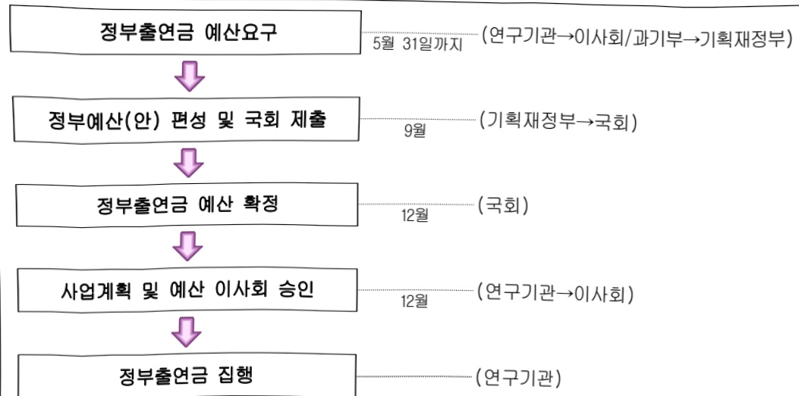

# 한국건설기술연구원연구운영비지원(R&D)

**해당 페이지**: PDF 1575 ~ 1584 쪽 해당

**부처**: 과학기술정보통신부
**분야**: 과학기술
**회계유형**: 일반회계
**2026 확정예산**: 86433.0 백만원
**전년대비 증감률**: 29.8%
**AI 도메인**: R&D 지원

---

### 가.예산 총괄표

(단위: 백만원, %)

<table border=1 style='margin: auto; word-wrap: break-word;'><tr><td rowspan="2">사업명</td><td rowspan="2">2024년 결산</td><td colspan="2">2025년 예산</td><td colspan="2">2026년 예산</td><td rowspan="2">증감(B-A)</td><td rowspan="2">(B-A)/A</td></tr><tr><td style='text-align: center; word-wrap: break-word;'>본예산</td><td style='text-align: center; word-wrap: break-word;'>추경*(A)</td><td style='text-align: center; word-wrap: break-word;'>요구안</td><td style='text-align: center; word-wrap: break-word;'>본예산(B)</td></tr><tr><td style='text-align: center; word-wrap: break-word;'>한국건설기술연구원연구운영비지원(R&amp;D)</td><td style='text-align: center; word-wrap: break-word;'>58,087</td><td style='text-align: center; word-wrap: break-word;'>66,604</td><td style='text-align: center; word-wrap: break-word;'>66,604</td><td style='text-align: center; word-wrap: break-word;'>86,433</td><td style='text-align: center; word-wrap: break-word;'>86,433</td><td style='text-align: center; word-wrap: break-word;'>19,829</td><td style='text-align: center; word-wrap: break-word;'>29.8</td></tr></table>

* 추경: 추경증감액을 포함한 최종 예산액을 기재

## □ 기능별(내역사업별) 예산 내역

(단위:백만원)

<table border=1 style='margin: auto; word-wrap: break-word;'><tr><td rowspan="2"></td><td colspan="5">2024</td><td colspan="5">2025</td><td rowspan="2">2026 倉塲</td></tr><tr><td style='text-align: center; word-wrap: break-word;'>倉塲の(専門)</td><td style='text-align: center; word-wrap: break-word;'>倉塲の専門</td><td style='text-align: center; word-wrap: break-word;'>倉塲の専門</td><td style='text-align: center; word-wrap: break-word;'>倉塲の専門</td><td style='text-align: center; word-wrap: break-word;'>倉塲の専門</td><td style='text-align: center; word-wrap: break-word;'>倉塲の専門</td><td style='text-align: center; word-wrap: break-word;'>倉塲の専門</td><td style='text-align: center; word-wrap: break-word;'>倉塲の専門</td><td style='text-align: center; word-wrap: break-word;'>倉塲の専門</td><td style='text-align: center; word-wrap: break-word;'>倉塲の専門</td></tr><tr><td style='text-align: center; word-wrap: break-word;'>○ 기능별 분류(専門)</td><td style='text-align: center; word-wrap: break-word;'>59,281</td><td style='text-align: center; word-wrap: break-word;'>59,281</td><td style='text-align: center; word-wrap: break-word;'>58,087</td><td style='text-align: center; word-wrap: break-word;'>-</td><td style='text-align: center; word-wrap: break-word;'>1,194</td><td style='text-align: center; word-wrap: break-word;'>66,604</td><td style='text-align: center; word-wrap: break-word;'>66,604</td><td style='text-align: center; word-wrap: break-word;'>65,347</td><td style='text-align: center; word-wrap: break-word;'>-</td><td style='text-align: center; word-wrap: break-word;'>1,257</td><td style='text-align: center; word-wrap: break-word;'>86,433</td></tr><tr><td style='text-align: center; word-wrap: break-word;'>○ 기관운영비</td><td style='text-align: center; word-wrap: break-word;'>33,075</td><td style='text-align: center; word-wrap: break-word;'>33,075</td><td style='text-align: center; word-wrap: break-word;'>31,881</td><td style='text-align: center; word-wrap: break-word;'>-</td><td style='text-align: center; word-wrap: break-word;'>1,194</td><td style='text-align: center; word-wrap: break-word;'>34,130</td><td style='text-align: center; word-wrap: break-word;'>34,130</td><td style='text-align: center; word-wrap: break-word;'>32,873</td><td style='text-align: center; word-wrap: break-word;'>-</td><td style='text-align: center; word-wrap: break-word;'>1,257</td><td style='text-align: center; word-wrap: break-word;'>35,448</td></tr><tr><td style='text-align: center; word-wrap: break-word;'>○ 주요사업비</td><td style='text-align: center; word-wrap: break-word;'>26,206</td><td style='text-align: center; word-wrap: break-word;'>26,206</td><td style='text-align: center; word-wrap: break-word;'>26,206</td><td style='text-align: center; word-wrap: break-word;'>-</td><td style='text-align: center; word-wrap: break-word;'>-</td><td style='text-align: center; word-wrap: break-word;'>32,474</td><td style='text-align: center; word-wrap: break-word;'>32,474</td><td style='text-align: center; word-wrap: break-word;'>32,474</td><td style='text-align: center; word-wrap: break-word;'>-</td><td style='text-align: center; word-wrap: break-word;'>-</td><td style='text-align: center; word-wrap: break-word;'>50,985</td></tr></table>

### 나. 사업설명자료

## 1 ) 사업목적·내용

- (한국건설기술연구원연구운영비지원(R&D)) 국가기반시설 성능 고도화, 기후변화 대응 국토관리, 친환경 국토조성에 관한 원천기술 개발과 성과 확산을 통해 국민 삶의 질 향상과 국가 발전에 기여

- (재난·재해 대응 기술 개발) 위성데이터 기반의 시설물 유지관리 등 스마트 유지관리·성능 혁신 기술 개발, 초고속 화재 대응 및 화재 디지털 트런 기술을 활용한 선제적 대응 솔루션 개발, 지반 액상화 예측, 지하시설물 안정성 평가, 도시홍수 제어 기술을 연계한 통합 안전관리 체계 구축으로, 안전·안심 인프라 구축 및 국가·사회 문제 해결

- (탄소중립 건설 기술 개발) 친환경 에너지, 폐자원 기반 에너지 전환 핵심기술 개발, 도시·건축물 에너지 고효율, 최적 관리시스템 기술 개발, 디지털·AI 기반 물관리 혁신과 미래형 수자원 기술개발을 통해 탄소저감 및 지속가능 건설 기술 확보로 폐적한 국민 생활환경 확보

- (미래공간 조성 기술 개발) UAM, 자율주행, 스마트도로 등 첨단 모빌리티 수용을 위한 인프라

---

기술개발, 초고밀도 저방사화 콘크리트 등 신 에너지 인프라 건설재료 기술 개발, 우주 및 지하공간 등 신공간 창출을 위한 건설 핵심기술 개발을 통해 미래 건설산업의 새로운 성장 동력 창출

- (건설 신업 혁신 선도 기술 개발) 중소·중건 건설기업의 현장 적용과 수요기반 기술개발 지원, 지역 사회 생활환경 개선 및 국토 균형발전 이슈 대응을 통한 현장 중심의 문제해결형 건설기술 개발, 저개발 국가의 특성 및 기술 수준을 고려한 현지 맞춤형 적정기술 개발을 통해 건설신업의 글로컬 문제 해결에 기여

## 2 ) 사업개요

☐ 사업근거 및 추진경위

① 법령상 근거 및 조항 적시 : 과학기술분야 정부출연연구기관등의 설립·운영 및 육성에 관한 법률 제5조(운영재원) 및 제8조(연구기관의 설립)

제5조(운영재원) ① 연구기관 및 연구회는 정부의 출연금과 그 밖의 수익금으로 운영한다.

② 정부는 연구기관 및 연구회의 설립·운영에 드는 경비에 충당하기 위하여 예산의 범위에서 연구기관 및 연구회에 출연금을 지급할 수 있다.

제8조(연구기관의 설립) ① 이 법에 따라 설립되는 연구기관은 별표와 같다.

② 연구기관은 주된 사무소의 소재지에서 설립등기를 함으로써 성립한다.

③ 제2항에 따른 설립등기 사항은 다음 각 호와 같다.

1. 목적(연구 분야를 포함한다. 이하 같다)

2. 명칭

3. 주된 사무소

4. 연기기관의 장의 성명과 주소

5. 공고의 방법

④ 연구기관의 설립 준비절차에 관하여 필요한 사항은 대통령령으로 정한다.

② 추진경위 - 사업 시작년도, 추진배경, 처벌 중점과제, 대통령 공약사항 등

- 1983. 6. 재단법인 한국건설기술연구원 개원

- 1988. 1. 건설부산하 정부출연연구기관으로 승계 설립

- 1999. 1. 한국건설기술연구원과 국립건설시험소 통합

- 1999. 1. 국무총리실 산하 정부출연연구기관으로 승계

- 2004.10. 과학기술부 산하 정부출연 연구기관으로 승계

- 2008. 2. 지식경제부 산하 정부출연 연구기관으로 승계

- 2013. 3. 미래창조과학부 산하 정부출연 연구기관으로 승계

- 2014. 6. 미래창조과학부 산하 국가과학기술연구회 소관 연구기관으로 승계

- 2017. 7. 과학기술정보통신부 산하 국가과학기술연구회 소관 연구기관으로 승계

-2017.7.과학기술정보통신부 산하 국가과학기술연구회 소관 연구기관으로 승계

## □ 주요내용

① 사업규모

- 총사업비 : 계속사업

---

- 사업기간 : 1983 ~ 계속

- 최근 5년 간 투입된 사업비(예산액기준, 추경편성한 연도에는 추경포함)

<table border=1 style='margin: auto; word-wrap: break-word;'><tr><td style='text-align: center; word-wrap: break-word;'>연도</td><td style='text-align: center; word-wrap: break-word;'>2022</td><td style='text-align: center; word-wrap: break-word;'>2023</td><td style='text-align: center; word-wrap: break-word;'>2024</td><td style='text-align: center; word-wrap: break-word;'>2025</td><td style='text-align: center; word-wrap: break-word;'>2026</td></tr><tr><td style='text-align: center; word-wrap: break-word;'>사업비</td><td style='text-align: center; word-wrap: break-word;'>66,198</td><td style='text-align: center; word-wrap: break-word;'>69,782</td><td style='text-align: center; word-wrap: break-word;'>59,281</td><td style='text-align: center; word-wrap: break-word;'>66,604</td><td style='text-align: center; word-wrap: break-word;'>86,433</td></tr></table>

## ② 사업추진체계

- 사업시행방법 : 직접수행, 출연

-사업시행주체:한국건설기술연구원

- 사업 수혜자 : 산업계, 학계, 연구계 및 일반국민

- 보조, 융자, 출연, 출자 등의 경우 보조·융자 등 지원 비율 및 법적근거

<table border=1 style='margin: auto; word-wrap: break-word;'><tr><td style='text-align: center; word-wrap: break-word;'>내역사업명</td><td style='text-align: center; word-wrap: break-word;'>구분</td><td style='text-align: center; word-wrap: break-word;'>피보조·피출연 등 기관명</td><td style='text-align: center; word-wrap: break-word;'>지원 금액 (2026예산)</td><td style='text-align: center; word-wrap: break-word;'>지원 비율(%)</td><td style='text-align: center; word-wrap: break-word;'>보조율 법적근거 (해당 조항)</td></tr><tr><td style='text-align: center; word-wrap: break-word;'>한국건설 기술연구원 연구운영비 지원(R&amp;D)</td><td style='text-align: center; word-wrap: break-word;'>출연</td><td style='text-align: center; word-wrap: break-word;'>한국건설 기술연구원</td><td style='text-align: center; word-wrap: break-word;'>86,433</td><td style='text-align: center; word-wrap: break-word;'>100</td><td style='text-align: center; word-wrap: break-word;'>과학기술분야 정부 출연연구기관 등의 설립·운영 및 육성에 관한 법률 제5조1,2항</td></tr></table>

## 3 ) 2026년도 예산 산출 근거

## 2025 년도 예산 및 2026년도 예산 산출 세부내역 비교

<table border=1 style='margin: auto; word-wrap: break-word;'><tr><td colspan="2">2025년 본예산</td><td colspan="2">2026년 예산</td></tr><tr><td style='text-align: center; word-wrap: break-word;'>예산</td><td style='text-align: center; word-wrap: break-word;'>산출내역</td><td style='text-align: center; word-wrap: break-word;'>예산</td><td style='text-align: center; word-wrap: break-word;'>산출내역</td></tr><tr><td rowspan="3">66,604</td><td style='text-align: center; word-wrap: break-word;'>○ 연구개발인건비(360-01): 31,854백만 원가. &#x27;25년 인건비 30,868백만 원나. 처우개선(3%) 926백만 원- (산출) 계속 1개 과제 × 31,854백만 원 × 12/12개월</td><td style='text-align: center; word-wrap: break-word;'>86,433</td><td style='text-align: center; word-wrap: break-word;'>○ 연구개발인건비(360-01): 33,031백만 원가. &#x27;26년 인건비 31,854백만 원나. 처우개선(3.5%) 1,117백만 원다. 신규인력 증원(3명) 60백만 원- (산출) 계속 1개 과제 × 33,031백만 원 × 12/12개월</td></tr><tr><td style='text-align: center; word-wrap: break-word;'>○ 연구개발경상경비(360-02): 2,276백만 원가. &#x27;25년 경상비 2,207백만 원나. 비경직성 경상비 공통감액 △30백만원다. 공공요금 인상분 등 99백만 원- (산출) 계속 1개 과제 × 2,276백만 원 × 12/12개월</td><td rowspan="2">○ 연구개발경상경비(360-02): 2,417백만 원가. &#x27;26년 경상비 2,276백만 원나. 경상비 효율화 △33백만원다. 공공요금 인상분 등 146백만 원라. 자회사분담금 증액 28백만 원- (산출) 계속 1개 과제 × 2,417백만 원 × 12/12개월</td><td rowspan="2"></td></tr><tr><td style='text-align: center; word-wrap: break-word;'>○ 연구개발건축비(360-03): 0백만 원</td></tr></table>

---

<table border=1 style='margin: auto; word-wrap: break-word;'><tr><td colspan="2">2025년 분예산</td><td colspan="2">2026년 예산</td></tr><tr><td style='text-align: center; word-wrap: break-word;'>예산</td><td style='text-align: center; word-wrap: break-word;'>산출내역</td><td style='text-align: center; word-wrap: break-word;'>예산</td><td style='text-align: center; word-wrap: break-word;'>산출내역</td></tr><tr><td style='text-align: center; word-wrap: break-word;'></td><td style='text-align: center; word-wrap: break-word;'>가. 노후시설 보수사업 : 0백만 원○ 연구개발장비·시스템구축비(360-04) : 1,300백만 원가. 장비구입비 1,300백만 원- (산출) 장비 12개 × 108.3백만 원 × 12/12개월○ 연구개발활동비 등(360-05) : 31,174백만 원가. 재난·재해 대응 기술 개발 11,044백만 원- (산출) 중과제 3개 × 3,681백만 원 × 100% × 12/12개월나. 탄소중립 건설 기술 개발 7,343백만 원- (산출) 중과제 3개 × 2,448백만 원 × 100% × 12/12개월다. 미래공간 조성 기술 개발 7,369백만 원- (산출) 중과제 3개 × 2,456백만 원 × 100% × 12/12개월라. 건설 산업 혁신 선도 기술 개발 5,418백만 원- (산출) 중과제 3개 × 1,806백만 원 × 100% × 12/12개월</td><td colspan="2">○ 연구개발건축비(360-03) : 0백만 원가. 노후시설 보수사업 : 0백만 원○ 연구개발장비·시스템구축비(360-04) : 1,300백만 원가. 장비구입비 1,300백만 원- (산출) 장비 16개 × 81.25백만 원 × 12/12개월○ 연구개발활동비 등(360-05) : 49,685백만 원가. 재난·재해 대응 기술 개발 9,356백만 원- (산출) 중과제 3개 × 3,119백만 원 × 100% × 12/12개월나. 탄소중립 건설 기술 개발 6,347백만 원- (산출) 중과제 3개 × 2,116백만 원 × 100% × 12/12개월다. 미래공간 조성 기술 개발 6,473백만 원- (산출) 중과제 3개 × 2,158백만 원 × 100% × 12/12개월라. 건설 산업 혁신 선도 기술 개발 4,665백만 원- (산출) 중과제 3개 × 1,555백만 원 × 100% × 12/12개월마. (전략연구사업1) 안전하고 편리한 지하도로 건설 기술 개발 5,350백만 원- (산출) 과제 1개 × 5,350백만 원 × 100% × 12/12개월바. (전략연구사업2) 도시형 CO2 포집 및 CCU 건설재료 기술 개발 5,424백만 원- (산출) 과제 1개 × 5,424백만 원 × 100% × 12/12개월사. (전략연구사업3) 안전하고 경제적인 지하 데이터센터 건설운영 기술 개발 2,913백만 원- (산출) 과제 1개 × 2,913백만 원 × 100% × 12/12개월야. (전략연구사업4) 에너지 자립률 100% 봇제로 건축물 구현 기술 개발 2,675백만 원- (산출) 과제 1개 × 2,675백만 원 × 100% × 12/12개월자. (전략연구사업5) 안전한 시공을 위한 AI Construction 모델 및 데이터 표준화 기술 개발 6,482백만 원- (산출) 과제 1개 × 6,482백만 원 × 100% × 12/12개월</td></tr></table>

---

## 4 ) 사업효과

## ☐ 사업영향, 산출물 성과지표 등

① 2022~2026년도 성과계획서 상 성과지표 및 최근 5년간 성과 달성도 : 해당없음

※ 과학기술계 출연연 지원금 사업의 경우 성과관리 비대상사업으로 '18년 성과계획서부터 제외

② 성과지표 이외의 연도별 사업추진 경과 및 실적

<table border=1 style='margin: auto; word-wrap: break-word;'><tr><td style='text-align: center; word-wrap: break-word;'>2022</td><td style='text-align: center; word-wrap: break-word;'>- DNA 기반 노후 교량구조물 스마트 유지관리 플랫폼 및 활용기술 개발- 지하 공간 정보 정확도 개선 및 매설관 안전관리 기술개발- 공공데이터 기반 건물에너지 광역 검진 기술 개발- 우주건설 환경 모사 및 현지 지형/지반 정보화 기초원천 기술 개발- 기존 건설재료의 한계를 극복하기 위해 탄소섬유 텍스타일 보강재와 고내 구성 무기계 결합재를 활용한 텍스타일 보강 콘크리트 구조물 보강 공법 개발(기존 공법대비 시공비 22~59% 절감 가능) - 콘크리트 내부에 매립되는 광섬유 기반 콘크리트 신경망 센서 개발- 유기성 폐기물 바이오가스를 활용한 자원·에너지 재생시스템 실용화 기술 개발- 제주형 도로포장 설계법, 중온아스팔트 유지관리지침 개발 및 정책 지원- 지반함몰 대응, 순환골재 활용, 해상특수교량 진단, MaaS 시스템 등 지역 특성 반영 기술 개발- [국내] 기술 실용화, 사업화 지원 (26개 과제, 지원액 26.0억 원), [해외] 기술 현지화, 협력 네트워크 지원 (7개 과제, 지원액 10.0억 원)</td></tr><tr><td style='text-align: center; word-wrap: break-word;'>2023</td><td style='text-align: center; word-wrap: break-word;'>- 감염병화산방지와 신속대응이 가능한 모듈러설비 및 검역 시스템 개발- 항균·항바이러스 성능 99% 이상의 공조환기장치용 필터 및 음압양압 조성공조환기장치개발- 출입국 검역·방역 모듈러터널 시스템 및 지능형 상시감지 통합 관제 시스템 개발- 탄소 기반 신건설재료 개발 (안정화 섬유 단열재, 우레탄 단열재 및 부식 프리 케이블) - 세계 최초 화재안전과 단열성능을 동시에 확보한 안정화 섬유 기반 단열재 및 세계 최고 수준 화재안전 성능 우레탄 단열재 개발- 국내 최초 국산 탄소섬유 케이블 및 정착장치 개발(인장성능 3,000 MPa급 봉형 탄소섬유 케이블) - DNA 기반 노후 교량구조물 스마트 유지관리 플랫폼 개발- 노후 교량 구조물 유지관리 플랫폼 개발 및 시범 운용(고양시, 서울시, 제주시) - AI 기반 교량 노후도 평가 및 예측 정확도 95% 확보 및 수요자 중심 23개 서비스 제공- 저비용·신속 기존 건물 제로에너지화 지원 시스템 개발- 공공건축물 30개소 건물에너지 DB 수집 기반 건물표준에너지모델 구축- 건물에너지 진단 체계 구축 및 기존 건물 제로에너지화 최적 지원시스템 구축(에너지/공사비/구조안전) - 대심도/대규모입체 네트워크 지하 대공간의 스마트 건설 및 스마트 케어 핵심기술 개발- 흙막이 벽체 및 주변 시설물 고정밀계측 관리 시스템 개발- 대심도/대규모 흙막이 벽체 내진설계 기준(안) 및 내진/차수 확보 기술 개발- AI 및 영상정보 기반 지하시설물 내부군염 자동검출기술 개발</td></tr><tr><td style='text-align: center; word-wrap: break-word;'>2024</td><td style='text-align: center; word-wrap: break-word;'>- 2,800MPa급 고강도 센싱 탄소섬유 케이블 개발- 기존 강재 대비 1.6배 강도, 1/4경량, 비부식성- 철원 횃불전망대 적용 완료, 철원 대교천 출렁다리 적용 예정- 구조물 수명 연장 및 유지관리비 30% 절감 기대효과</td></tr></table>

---

<table border=1 style='margin: auto; word-wrap: break-word;'><tr><td style='text-align: center; word-wrap: break-word;'></td><td style='text-align: center; word-wrap: break-word;'>○ 주거단지 음식물쓰레기 이용 발전소 규모의 청정 연료 생산기술 개발 - 바이오 폐기물 기반 고형연료(Bio-SRF) 생산 및 실증, 국제 연료 기준 1등 급 달성(BS EN15359:2011) - 한국남동발전 540kW급, 9톤 혼소 실증 및 중부발전·김포시 등 업무협약 - 폐기물 재활용을 통한 에너지 자립 및 환경 부담 저감 기대효과 ○ 극한건설 환경 구현 인프라 및 TRL6 이상급 극한건설 핵심기술 개발 - 세계 최초 - 100℃ 지반 냉각 진공챔버 인프라 구축, 마이크로파 기반 현 지자원 소결 기술, 무인 지반조사 장비 등 개발 - 현대차 우주 로버 시험, 천문연 CLPS 탑재체 성능검증, 한화시스템 인공 위성 성능평가 등 시험 용역 및 지반열지공챔버 인프라 활용 국내외 우주 산업 협력 (미국 블루오리진 외 4건) ○ 도심 미관 개선 및 안전 확보를 위한 Smart QSE 기반 미니트렌칭 공법 개발 - 공중선 지중화 혁신기술 미니트렌칭 공법 기술 개발, LCD/LED BIT 대비 무게 25~38% 경량화 및 폭 31~45% 슬림화 - 국내 5개 시범사업 수행, 미니트렌칭 공법 혼합물 및 시공 관련 기술이전 3건, 기술료 1.6억원 달성</td></tr><tr><td style='text-align: center; word-wrap: break-word;'>2025</td><td style='text-align: center; word-wrap: break-word;'>○ 기관운영비: 34,130백만 원 - 인건비: 31,854백만 원 - 경상경비: 2,276백만 원 ○ 주요사업비: 32,474백만 원 - 재난·재해 대응 기술 개발: 11,044백만 원 - 탄소중립 건설 기술 개발: 7,343백만 원 - 미래공산 조성 기술 개발: 7,369백만 원 - 건설 산업 혁신 선도 기술 개발: 5,418백만 원 - 장비·시스템구축비: 1,300백만 원 ○ 시설비: 0백만 원 * &#x27;24년부터 시설비는 한국건설기술연구원 시설 지원(R&amp;D)으로 분리 작성</td></tr></table>

## ③향후(2026년도 이후)기대효과

## ○ 재난·재해 대응 기술 개발

- 위성 SAR 및 근접센싱 기반 기반시설 이상탐지 시스템 개발 [이상탐지 정확도 80%, 위험도 평가를 위한 변위 예측 정확도 85% 확보, 기반시설 유지관리비: '19년 12조원 → '30년 27조원 → '40년 40조원 예상]

- 초고속 화재 대응 방화구획 기본설계 및 산업공단 구조물 안전점검 평가방법 개발

[산업공단 화재 등 신재난 화재 예측 정확도 80%, 신산업 시설 내 도입률 60% 이상

으로 안전성 향상

- 도시침수 시뮬레이션, 골목단위 침수 감시 AIoT 융합센서 및 배수펌프시스템 개발

[30분 이내 강우 선행 예측, 도시 침수 대응 테스트베드 구축 및 시범 서비스 추진]

## 0 탄소중립 건설 기술 개발

- 500kg/day 급 수소도시 기반시설 실시설계(안), 저에너지 수소가스 캐리어 및 탄소 포집 담체 개발 [탄소감축 5백만 톤 이상, 예상 시장규모 연 1,000억 원 이상 기대]

- 지역단위 탄소배출량 저감 시나리오, 성능가변형 윈도우시스템 개발 [국내외 현장 실증 15건 이상, 조명 에너지 30% 저감, 탄소 감축 1백만 톤 이상, 예상 시장규모

---

## 500 억원 이상 기대]

- 디지털 기반 통합 물 관리 플랫폼 및 신송 오염물질 처리 모델 개발 [수요 맞춤형 대체 수자원 확보 및 도시 생활용수 30% 개선, 국내외 현장실증 추진을 통한 지역 주민 만족도 90% 이상 달성]

## 미래공간 조성 기술 개발

- 플라스틱 모듈러 도로 구조체, 도로 환경 검지 센서(노면 환경, 교통정보, 교통안전 표지 등) 및 도로포장·운영 기술 확보 [교통 혼잡/안전 관련 사회·경제적 비용 약 3,000억원 절감, 첨단 모빌리티 인프라 설계·시공 관련 제도기준 개정]

- 차세대 콘크리트 구조물(원전 적용 등), 건설현장 안전성 및 생산성 향상 기술 확보 [SMR 신규 원전구조물 관련 국내외 기술반영 추진, 건설품질관리 표준화 추진]

- 유인 우주기지 건설기술 로드맵(안) 개발 [우주, 지하 등 신공간 창출을 위한 건설 원천기술 확보, 대한민국 주도형 아르테미스 국제협력 참여 및 국가 위상 제고]

## ○ 건설 산업 혁신 선도 기술 개발

- 숭소·숭견 건설기업 지원 실증기반 스마트 건설 기술 확보 [기술이전 계약액: 투입 예산(직접비) 대비 10% 이상(최종 종료과제 기준), 국내외 특허출원 등 12건 이상, 국내외 현장적용/시험시공 10건 이상]

- TaaS (Transportation as a Service) 승객+물류 복합 플랫폼 개발 [MaaS 기술 실용화 적용 및 수단 통합 95% 이상 달성으로 지역 수요 기반 맞춤형 현안 해결]

- 현지 맞춤형 탄소배출 저감 도로건설재료 생산 시스템 개발 [저개발 협력대상국 도로부문 탄소배출량 30% 저감, 도로건설 재료 생산 비용 저감 약 10%]

5) 타당성조사 및 예비타당성조사 시행여부 및 결과 요지 : 해당사항 없음

6) 총사업비 대상사업 여부 및 내역: 해당사항 없음

---

## 7 ) 사업 집행절차

○ 한국건설기술연구원(예산 요구(안) 제출)

○ 국가과학기술연구회 이사회(예산 요구(안) 심의 · 의결 · 제출)

○ 과학기술정보통신부(예산 요구(안) 심의 · 제출)

○ 기획재정부(예산 요구(안) 심의 및 정부(안) 확정)

○ 국회 과방위(예산 요구(안) 심의 및 승인)

○ 국회 예결위(예산 요구(안) 심의 및 승인)

○ 국가과학기술연구회 이사회(사업계획 및 예산(안) 제출 및 승인)

○ 한국건설기술연구원(출연금 교부 신청)

○ 과학기술정보통신부(출연금 교부)

○ 한국건설기술연구원(사업 수행)

## 8 ) 각종 평가

1)「과학기술분야 정부출연연구기관 등의 설립·운영 및 육성에 관한 법률」제28조

(연구기관의 평가)에 따른 2023년 3차 기관운영평가 결과

o (최종의견 및 점수) 우수(85.09점)

° (결과 요약) 공통영역(25점), 자율영역(50점), 현안대응 영역(15점), 기관장 기여 연구성과 부문(10점)으로 구성된 기관운영평가를 실시한 결과, 건설연은 5단계 등급(매우우수~매우미흡) 중 '우수' 등급 획득

---

### 다. 최근 4년간 결산내역

## 1 ) 결산표

☐ 부처 결산내역

(단위: 백만원, %)

<table border=1 style='margin: auto; word-wrap: break-word;'><tr><td rowspan="2">연도</td><td colspan="3">예산액</td><td rowspan="2">예산현액(A)</td><td rowspan="2">집행액(B)</td><td rowspan="2">집행를(B/A)</td><td rowspan="2">다음연도이월액</td><td rowspan="2">불용액</td></tr><tr><td style='text-align: center; word-wrap: break-word;'>본예산</td><td style='text-align: center; word-wrap: break-word;'>추정증감액</td><td style='text-align: center; word-wrap: break-word;'>추정</td></tr><tr><td style='text-align: center; word-wrap: break-word;'>2022</td><td style='text-align: center; word-wrap: break-word;'>66,198</td><td style='text-align: center; word-wrap: break-word;'>-</td><td style='text-align: center; word-wrap: break-word;'>66,198</td><td style='text-align: center; word-wrap: break-word;'>66,198</td><td style='text-align: center; word-wrap: break-word;'>65,285</td><td style='text-align: center; word-wrap: break-word;'>98.6</td><td style='text-align: center; word-wrap: break-word;'>-</td><td style='text-align: center; word-wrap: break-word;'>913</td></tr><tr><td style='text-align: center; word-wrap: break-word;'>2023</td><td style='text-align: center; word-wrap: break-word;'>69,782</td><td style='text-align: center; word-wrap: break-word;'>-</td><td style='text-align: center; word-wrap: break-word;'>69,782</td><td style='text-align: center; word-wrap: break-word;'>69,782</td><td style='text-align: center; word-wrap: break-word;'>68,446</td><td style='text-align: center; word-wrap: break-word;'>98.1</td><td style='text-align: center; word-wrap: break-word;'>-</td><td style='text-align: center; word-wrap: break-word;'>1,336</td></tr><tr><td style='text-align: center; word-wrap: break-word;'>2024</td><td style='text-align: center; word-wrap: break-word;'>59,281</td><td style='text-align: center; word-wrap: break-word;'>-</td><td style='text-align: center; word-wrap: break-word;'>59,281</td><td style='text-align: center; word-wrap: break-word;'>59,281</td><td style='text-align: center; word-wrap: break-word;'>58,087</td><td style='text-align: center; word-wrap: break-word;'>97.9</td><td style='text-align: center; word-wrap: break-word;'>-</td><td style='text-align: center; word-wrap: break-word;'>1,194</td></tr><tr><td style='text-align: center; word-wrap: break-word;'>2025</td><td style='text-align: center; word-wrap: break-word;'>66,604</td><td style='text-align: center; word-wrap: break-word;'>-</td><td style='text-align: center; word-wrap: break-word;'>66,604</td><td style='text-align: center; word-wrap: break-word;'>66,604</td><td style='text-align: center; word-wrap: break-word;'>65,347</td><td style='text-align: center; word-wrap: break-word;'>98.1</td><td style='text-align: center; word-wrap: break-word;'>-</td><td style='text-align: center; word-wrap: break-word;'>1,257</td></tr></table>

## 2 ) 주요 결산사항

□ 2022~2025년 결산 주요사항

<table border=1 style='margin: auto; word-wrap: break-word;'><tr><td style='text-align: center; word-wrap: break-word;'>2022</td><td style='text-align: center; word-wrap: break-word;'>- 이월 사유 및 불용 사유(집행부진사유)예산집행지침에 따른 인건비 잔액 미교부(913백만원)</td></tr><tr><td style='text-align: center; word-wrap: break-word;'>2023</td><td style='text-align: center; word-wrap: break-word;'>- 이월 사유 및 불용 사유(집행부진사유)예산집행지침에 따른 인건비 잔액 미교부(1,336백만원)</td></tr><tr><td style='text-align: center; word-wrap: break-word;'>2024</td><td style='text-align: center; word-wrap: break-word;'>- 이월 사유 및 불용 사유(집행부진사유)예산집행지침에 따른 인건비 잔액 미교부(1,194백만원)</td></tr><tr><td style='text-align: center; word-wrap: break-word;'>2025</td><td style='text-align: center; word-wrap: break-word;'>- 이월 사유 및 불용 사유(집행부진사유)예산집행지침에 따른 인건비 잔액 미교부(1,257백만원)</td></tr></table>

□ 2025년 이·전용 등 세부내역: 해당사항 없음

---

<table border=1 style='margin: auto; word-wrap: break-word;'><tr><td style='text-align: center; word-wrap: break-word;'>사 업 명</td></tr><tr><td style='text-align: center; word-wrap: break-word;'>(226) 한국과학기술연구원 연구운영비 지원(R&amp;D) (2241-404)</td></tr></table>

□ 사업 코드 정보

<table border=1 style='margin: auto; word-wrap: break-word;'><tr><td style='text-align: center; word-wrap: break-word;'>구분</td><td style='text-align: center; word-wrap: break-word;'>회계</td><td style='text-align: center; word-wrap: break-word;'>소관</td><td style='text-align: center; word-wrap: break-word;'>실국(기관)</td><td style='text-align: center; word-wrap: break-word;'>계정</td><td style='text-align: center; word-wrap: break-word;'>분야</td><td style='text-align: center; word-wrap: break-word;'>부문</td></tr><tr><td style='text-align: center; word-wrap: break-word;'>코드</td><td rowspan="2">일반회계</td><td rowspan="2">과학기술정보통신부</td><td rowspan="2">연구개발정책실기초원천연구정책관</td><td rowspan="2">-</td><td style='text-align: center; word-wrap: break-word;'>150</td><td style='text-align: center; word-wrap: break-word;'>152</td></tr><tr><td style='text-align: center; word-wrap: break-word;'>명칭</td><td style='text-align: center; word-wrap: break-word;'>과학기술</td><td style='text-align: center; word-wrap: break-word;'>과학기술연구지원</td></tr></table>

<table border=1 style='margin: auto; word-wrap: break-word;'><tr><td style='text-align: center; word-wrap: break-word;'>구분</td><td style='text-align: center; word-wrap: break-word;'>프로그램</td><td style='text-align: center; word-wrap: break-word;'>단위사업</td><td style='text-align: center; word-wrap: break-word;'>세부사업</td></tr><tr><td style='text-align: center; word-wrap: break-word;'>코드</td><td style='text-align: center; word-wrap: break-word;'>2200</td><td style='text-align: center; word-wrap: break-word;'>2241</td><td style='text-align: center; word-wrap: break-word;'>404</td></tr><tr><td style='text-align: center; word-wrap: break-word;'>명칭</td><td style='text-align: center; word-wrap: break-word;'>출연연구기관지원</td><td style='text-align: center; word-wrap: break-word;'>국가과학기술연구회 소관출연연구기관지원</td><td style='text-align: center; word-wrap: break-word;'>한국과학기술연구원 연구운영비 지원(R&amp;D)</td></tr></table>

<table border=1 style='margin: auto; word-wrap: break-word;'><tr><td colspan="6">☐ 사업 성격 (공동표구사료 11-1 삼성 11-1 삼성 4. 참조, 해당하는 사항에 “0” 표시)</td></tr><tr><td style='text-align: center; word-wrap: break-word;'>신규 계속</td><td style='text-align: center; word-wrap: break-word;'>환료</td><td style='text-align: center; word-wrap: break-word;'>예비타당성 실시여부</td><td style='text-align: center; word-wrap: break-word;'>총사업비 관리대상</td><td style='text-align: center; word-wrap: break-word;'>총액계상 예산사업</td><td style='text-align: center; word-wrap: break-word;'>사업소관 변경정보 2025예산 시 소관</td></tr><tr><td style='text-align: center; word-wrap: break-word;'></td><td style='text-align: center; word-wrap: break-word;'>☐</td><td style='text-align: center; word-wrap: break-word;'></td><td style='text-align: center; word-wrap: break-word;'></td><td style='text-align: center; word-wrap: break-word;'></td><td style='text-align: center; word-wrap: break-word;'></td></tr></table>

사업지원형태 및 지원을(최소한 개는 반드시 선택하시오. 해당사항에 O 표시)

<table border=1 style='margin: auto; word-wrap: break-word;'><tr><td style='text-align: center; word-wrap: break-word;'>직접</td><td style='text-align: center; word-wrap: break-word;'>출자</td><td style='text-align: center; word-wrap: break-word;'>출연</td><td style='text-align: center; word-wrap: break-word;'>보조</td><td style='text-align: center; word-wrap: break-word;'>융자</td><td style='text-align: center; word-wrap: break-word;'>국고보조율(%)</td><td style='text-align: center; word-wrap: break-word;'>융자율(%)</td></tr><tr><td style='text-align: center; word-wrap: break-word;'></td><td style='text-align: center; word-wrap: break-word;'></td><td style='text-align: center; word-wrap: break-word;'>○</td><td style='text-align: center; word-wrap: break-word;'></td><td style='text-align: center; word-wrap: break-word;'></td><td style='text-align: center; word-wrap: break-word;'></td><td style='text-align: center; word-wrap: break-word;'></td></tr></table>

## ☐ 사업 소관부처 및 시행주체

<table border=1 style='margin: auto; word-wrap: break-word;'><tr><td style='text-align: center; word-wrap: break-word;'>사업명</td><td colspan="2">구분</td></tr><tr><td rowspan="2">한국과학기술연구원연구운영비지원(R&amp;D)(2241-404)</td><td style='text-align: center; word-wrap: break-word;'>소관부처</td><td style='text-align: center; word-wrap: break-word;'>연구개발정책실 기초원천연구정책관 연구기관혁신정책과</td></tr><tr><td style='text-align: center; word-wrap: break-word;'>사업시행주체</td><td style='text-align: center; word-wrap: break-word;'>한국과학기술연구원</td></tr></table>

---

### 원본 PDF 크롭 이미지

