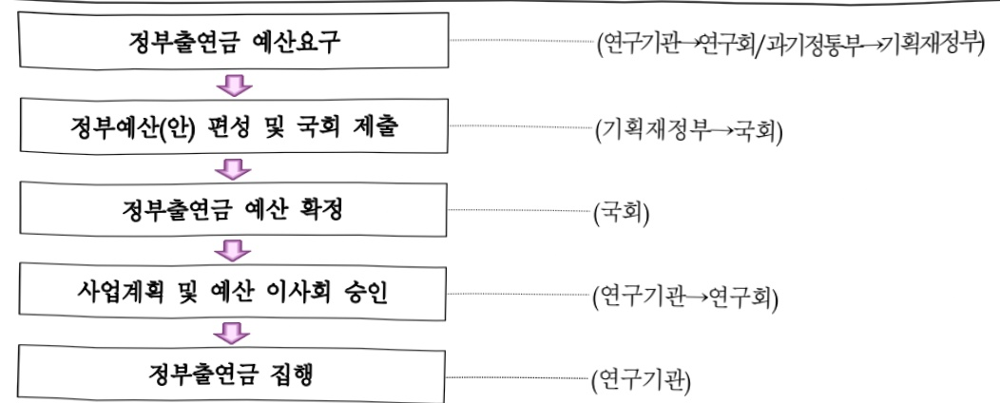

# 한국과학기술연구원 연구 운영비 지원(R&D)

**해당 페이지**: PDF 1585 ~ 1597 쪽 해당

**부처**: 과학기술정보통신부
**분야**: 과학기술
**회계유형**: 일반회계
**2026 확정예산**: 244008.0 백만원
**전년대비 증감률**: 19.8%
**AI 도메인**: R&D 지원

---

<table border=1 style='margin: auto; word-wrap: break-word;'><tr><td style='text-align: center; word-wrap: break-word;'>사 업 명</td></tr><tr><td style='text-align: center; word-wrap: break-word;'>(226) 한국과학기술연구원 연구운영비 지원(R&amp;D) (2241-404)</td></tr></table>

□ 사업 코드 정보

<table border=1 style='margin: auto; word-wrap: break-word;'><tr><td style='text-align: center; word-wrap: break-word;'>구분</td><td style='text-align: center; word-wrap: break-word;'>회계</td><td style='text-align: center; word-wrap: break-word;'>소관</td><td style='text-align: center; word-wrap: break-word;'>실국(기관)</td><td style='text-align: center; word-wrap: break-word;'>계정</td><td style='text-align: center; word-wrap: break-word;'>분야</td><td style='text-align: center; word-wrap: break-word;'>부문</td></tr><tr><td style='text-align: center; word-wrap: break-word;'>코드</td><td rowspan="2">일반회계</td><td rowspan="2">과학기술정보통신부</td><td rowspan="2">연구개발정책실기초원천연구정책관</td><td rowspan="2">-</td><td style='text-align: center; word-wrap: break-word;'>150</td><td style='text-align: center; word-wrap: break-word;'>152</td></tr><tr><td style='text-align: center; word-wrap: break-word;'>명칭</td><td style='text-align: center; word-wrap: break-word;'>과학기술</td><td style='text-align: center; word-wrap: break-word;'>과학기술연구지원</td></tr></table>

<table border=1 style='margin: auto; word-wrap: break-word;'><tr><td style='text-align: center; word-wrap: break-word;'>구분</td><td style='text-align: center; word-wrap: break-word;'>프로그램</td><td style='text-align: center; word-wrap: break-word;'>단위사업</td><td style='text-align: center; word-wrap: break-word;'>세부사업</td></tr><tr><td style='text-align: center; word-wrap: break-word;'>코드</td><td style='text-align: center; word-wrap: break-word;'>2200</td><td style='text-align: center; word-wrap: break-word;'>2241</td><td style='text-align: center; word-wrap: break-word;'>404</td></tr><tr><td style='text-align: center; word-wrap: break-word;'>명칭</td><td style='text-align: center; word-wrap: break-word;'>출연연구기관지원</td><td style='text-align: center; word-wrap: break-word;'>국가과학기술연구회 소관출연연구기관지원</td><td style='text-align: center; word-wrap: break-word;'>한국과학기술연구원 연구운영비 지원(R&amp;D)</td></tr></table>

<table border=1 style='margin: auto; word-wrap: break-word;'><tr><td colspan="6">☐ 사업 성격 (공동표구사료 11-1 삼성 11-1 삼성 4. 참조, 해당하는 사항에 “0” 표시)</td></tr><tr><td style='text-align: center; word-wrap: break-word;'>신규 계속</td><td style='text-align: center; word-wrap: break-word;'>환료</td><td style='text-align: center; word-wrap: break-word;'>예비타당성 실시여부</td><td style='text-align: center; word-wrap: break-word;'>총사업비 관리대상</td><td style='text-align: center; word-wrap: break-word;'>총액계상 예산사업</td><td style='text-align: center; word-wrap: break-word;'>사업소관 변경정보 2025예산 시 소관</td></tr><tr><td style='text-align: center; word-wrap: break-word;'></td><td style='text-align: center; word-wrap: break-word;'>☐</td><td style='text-align: center; word-wrap: break-word;'></td><td style='text-align: center; word-wrap: break-word;'></td><td style='text-align: center; word-wrap: break-word;'></td><td style='text-align: center; word-wrap: break-word;'></td></tr></table>

사업지원형태 및 지원을(최소한 개는 반드시 선택하시오. 해당사항에 O 표시)

<table border=1 style='margin: auto; word-wrap: break-word;'><tr><td style='text-align: center; word-wrap: break-word;'>직접</td><td style='text-align: center; word-wrap: break-word;'>출자</td><td style='text-align: center; word-wrap: break-word;'>출연</td><td style='text-align: center; word-wrap: break-word;'>보조</td><td style='text-align: center; word-wrap: break-word;'>융자</td><td style='text-align: center; word-wrap: break-word;'>국고보조율(%)</td><td style='text-align: center; word-wrap: break-word;'>융자율(%)</td></tr><tr><td style='text-align: center; word-wrap: break-word;'></td><td style='text-align: center; word-wrap: break-word;'></td><td style='text-align: center; word-wrap: break-word;'>○</td><td style='text-align: center; word-wrap: break-word;'></td><td style='text-align: center; word-wrap: break-word;'></td><td style='text-align: center; word-wrap: break-word;'></td><td style='text-align: center; word-wrap: break-word;'></td></tr></table>

## ☐ 사업 소관부처 및 시행주체

<table border=1 style='margin: auto; word-wrap: break-word;'><tr><td style='text-align: center; word-wrap: break-word;'>사업명</td><td colspan="2">구분</td></tr><tr><td rowspan="2">한국과학기술연구원연구운영비지원(R&amp;D)(2241-404)</td><td style='text-align: center; word-wrap: break-word;'>소관부처</td><td style='text-align: center; word-wrap: break-word;'>연구개발정책실 기초원천연구정책관 연구기관혁신정책과</td></tr><tr><td style='text-align: center; word-wrap: break-word;'>사업시행주체</td><td style='text-align: center; word-wrap: break-word;'>한국과학기술연구원</td></tr></table>

---

### 가. 예산 총괄표

(단위: 백만원, %)

<table border=1 style='margin: auto; word-wrap: break-word;'><tr><td colspan="3">2024년 2025년 예산</td><td colspan="2">2026년 예산</td><td colspan="2">중감 (B-A)</td></tr><tr><td style='text-align: center; word-wrap: break-word;'>사업명</td><td style='text-align: center; word-wrap: break-word;'>결산</td><td style='text-align: center; word-wrap: break-word;'>본예산</td><td style='text-align: center; word-wrap: break-word;'>추경*(A)</td><td style='text-align: center; word-wrap: break-word;'>요구안</td><td style='text-align: center; word-wrap: break-word;'>본예산(B)</td><td style='text-align: center; word-wrap: break-word;'>(B-A)/A</td></tr><tr><td style='text-align: center; word-wrap: break-word;'>한국과학기술연구원 연구운영비 지원(R&amp;D)</td><td style='text-align: center; word-wrap: break-word;'>181,396</td><td style='text-align: center; word-wrap: break-word;'>203,744</td><td style='text-align: center; word-wrap: break-word;'>203,744</td><td style='text-align: center; word-wrap: break-word;'>241,008</td><td style='text-align: center; word-wrap: break-word;'>244,008</td><td style='text-align: center; word-wrap: break-word;'>40,264</td></tr></table>

* 추경: 추경증감액을 포함한 최종 예산액을 기재

** '24년부터 시설비는 한국과학기술연구원 시설 지원(R&D)으로 분리 작성

## □ 기능별(내역사업별) 예산 내역

(단위:백만원)

<table border=1 style='margin: auto; word-wrap: break-word;'><tr><td rowspan="2"></td><td colspan="5">2024</td><td colspan="5">2025</td><td rowspan="2">2026 예산</td></tr><tr><td style='text-align: center; word-wrap: break-word;'>예산액(추경)</td><td style='text-align: center; word-wrap: break-word;'>예산현액</td><td style='text-align: center; word-wrap: break-word;'>집행액</td><td style='text-align: center; word-wrap: break-word;'>이월액</td><td style='text-align: center; word-wrap: break-word;'>불용액</td><td style='text-align: center; word-wrap: break-word;'>예산액(추경)</td><td style='text-align: center; word-wrap: break-word;'>예산현액</td><td style='text-align: center; word-wrap: break-word;'>집행액</td><td style='text-align: center; word-wrap: break-word;'>이월액</td><td style='text-align: center; word-wrap: break-word;'>불용액</td></tr><tr><td style='text-align: center; word-wrap: break-word;'>○ 기능별 분류(합계)</td><td style='text-align: center; word-wrap: break-word;'>183,622</td><td style='text-align: center; word-wrap: break-word;'>183,622</td><td style='text-align: center; word-wrap: break-word;'>181,396</td><td style='text-align: center; word-wrap: break-word;'>-</td><td style='text-align: center; word-wrap: break-word;'>2,226</td><td style='text-align: center; word-wrap: break-word;'>203,744</td><td style='text-align: center; word-wrap: break-word;'>203,744</td><td style='text-align: center; word-wrap: break-word;'>199,884</td><td style='text-align: center; word-wrap: break-word;'>-</td><td style='text-align: center; word-wrap: break-word;'>3,860</td><td style='text-align: center; word-wrap: break-word;'>244,008</td></tr><tr><td style='text-align: center; word-wrap: break-word;'>• 기관운영비</td><td style='text-align: center; word-wrap: break-word;'>78,861</td><td style='text-align: center; word-wrap: break-word;'>78,861</td><td style='text-align: center; word-wrap: break-word;'>76,635</td><td style='text-align: center; word-wrap: break-word;'>-</td><td style='text-align: center; word-wrap: break-word;'>2,226</td><td style='text-align: center; word-wrap: break-word;'>81,283</td><td style='text-align: center; word-wrap: break-word;'>81,283</td><td style='text-align: center; word-wrap: break-word;'>77,423</td><td style='text-align: center; word-wrap: break-word;'>-</td><td style='text-align: center; word-wrap: break-word;'>3,860</td><td style='text-align: center; word-wrap: break-word;'>89,409</td></tr><tr><td style='text-align: center; word-wrap: break-word;'>• 주요사업비</td><td style='text-align: center; word-wrap: break-word;'>104,761</td><td style='text-align: center; word-wrap: break-word;'>104,761</td><td style='text-align: center; word-wrap: break-word;'>104,761</td><td style='text-align: center; word-wrap: break-word;'>-</td><td style='text-align: center; word-wrap: break-word;'>-</td><td style='text-align: center; word-wrap: break-word;'>122,461</td><td style='text-align: center; word-wrap: break-word;'>122,461</td><td style='text-align: center; word-wrap: break-word;'>122,461</td><td style='text-align: center; word-wrap: break-word;'>-</td><td style='text-align: center; word-wrap: break-word;'>-</td><td style='text-align: center; word-wrap: break-word;'>154,599</td></tr></table>

* '24년부터 시설비는 한국과학기술연구원 시설 지원(R&D)으로 분리 작성

### 나. 사업설명자료

## 1 ) 사업목적·내용

- (한국과학기술연구원 연구운영비 지원) 종합연구기관의 강점을 바탕으로 기초·원천기술 분야의 선행 연구개발 및 학제 간 융합기술 개발

- (뇌과학연구사업) 신경회로 작동원리 이해를 통한 인지기능의 과학적 규명 및 중단적

뇌기능회로 연구를 통한 혁신적인 브레인 툴박스 개발

- (바이오·메디컬융합연구사업) 고령·장애인 질환 극복 및 신종 감염병 대응 연구 및 미래

맞춤의료의 융합 원천 기술 제공

- (청정수소융합연구사업) 탄소중립 이행에 따른 대규모 수소 공급에 대비, KIST 기술로 국내·외 수소 생산 공급망을 구축하여 높은 경제성과 안전성을 확보한 수소경제 구현

- (기후·환경연구사업) ‘지구온난화·극한기후·물 불균형’의 악순환 해결 및 글로벌 기후안보

획림을 위해, 생태계 탄소순환 회복 기술을 통한 탄소 네거티브 혁신주도 및 기후재난 억제

---

- (차세대반도체연구사업) 양자/반도체/소자 역량을 결합한 미래형 컴퓨팅 기술 개발

(AI·로봇연구사업) 스마트 기술을 기반으로 사용자가 건강하고 쾌적한 삶을 살아갈 수 있도록 AI/로봇/ICT융합을 통한 생활환경 구현

(첨단소재·시스템연구사업) 미래 첨단 소재기술 분야의 기술역량 강화 및 첨단장비·데이터 기반 연구수행

- (지속가능미래기술연구사업) 국가적 현안문제 대응 연구수행 및 글로벌 이슈분야에서 연구리더십 확보

- (협력기반구축사업) 글로벌 R&D협력을 통한 기초원천 기반기술 확보 및 국내외 협력 연구 플랫폼 구축·강화를 통한 개방형 연구 추진

- (융복합개방형연구사업) 국가적으로 중요한 사회문제 또는 출연(연)이 해야만 하는 미지연구 영역개척을 위하여 개방형 융합 기술 개발 및 각종 재난상황 및 국민의 행복한 삶 등 국가적으로 중요한 이슈에 대한 근본적인 해결

- (기술확산연구사업) 기술 상용화 후속연구를 통한 기술의 완성도 향상 및 이를 통한 KIST 보유기술의 산업계 확산 지원

- (자율구성 모듈형 휴머노이드 개발단) 로봇의 자율적 판단에 의해, 주어진 작업에 필요한 신체부위를 스스로 선택·구성하는 세계최초 모듈형 휴머노이드 기술 개발

- (한반도 탄소위기 극복기술 개발단) 국가탄소감축목표(NDC) 달성을 위해 필수적인 한반도 맞춤형 탄소직접제거(CDR) 기술 확보

- (노화면역 정밀제어 혁신치료제 개발단) 노화 면역세포를 효과적으로 회복시키고, 내성이나 면역저하 등 부작용을 최소화하는 혁신치료제 개발

- (반도체·배터리 열폭주 방지 혁신소재 개발단) 반도체와 배터리의 안정성을 획기적으로

향상시킬 수 있는 능동 열제어 소재 개발

- (가변형상 도심에너지 시스템 개발단) 메타구조체 및 프리폼 블록 기술 등을 활용, 도심

건물‘어디든 붙일 수’ 있으면서, ESS 일체화를 통해 에너지 자립이 가능한 태양전지 개발

- (저출산 극복 난임 해결기술 개발단) 저출산 극복을 위해 의료 현장 실수요를 반영한

난임 예측·진단 및 해결기술 개발

- (비독성 모달리티 탑재형 차세대 ADC 혁신플랫폼 개발단) 분자영상 평가·예측 플랫폼 기술 기반 비독성·다중모달리티 맞춤형 K-ADC 개발을 통한 ADC 기술주권 확보

- (신경정신질환 리벨런싱 혁신기술 개발단) 난치성 신경정신질환의 치료를 위해 뇌 내

- 균형을 회복시키는 신경과학-의공학-의약학-AI-한의학의 융합적 치료방법 개발

- (혁신 통증 극복 전략연구단) 통증 치료 전략의 확대와 연구 기반 구축으로 기존 통증

치료제의 한계를 극복하고 혁신 통증 치료 패러다임 구축

---

## 2 ) 사업개요

## 사업근거 및 추진경위

① 법령상 근거 및 조항 적시

- 과학기술분야 정부출연연구기관등의 설립·운영 및 육성에 관한 법률

② 추진경위

- 1966. 2. 10 한국과학기술연구소 설립

- 1981. 1. 5 한국과학기술원 설립(한국과학기술연구소와 한국과학원 통합)

- 1989. 6. 12 한국과학기술연구원 설립

- 1999. 1. 29 국무총리 산하 기초기술연구회로 소관 변경

- 2013. 3. 23 미래창조과학부로 감독관청 변경

- 2014. 6. 30 미래창조과학부 산하 국가과학기술연구회 소속으로 개편

- 2017. 7. 30 과학기술정보통신부로 감독관청 변경

주요내용

① 사업규모

- 총사업비 : 계속

- 사업기간 : 1996 ~ 계속

-최근 5년 간 투입된 사업비(예산액기준, 추경편성한 연도에는 추경포함)

<table border=1 style='margin: auto; word-wrap: break-word;'><tr><td style='text-align: center; word-wrap: break-word;'>연도</td><td style='text-align: center; word-wrap: break-word;'>2022</td><td style='text-align: center; word-wrap: break-word;'>2023</td><td style='text-align: center; word-wrap: break-word;'>2024</td><td style='text-align: center; word-wrap: break-word;'>2025</td><td style='text-align: center; word-wrap: break-word;'>2026</td></tr><tr><td style='text-align: center; word-wrap: break-word;'>사업비</td><td style='text-align: center; word-wrap: break-word;'>201,945</td><td style='text-align: center; word-wrap: break-word;'>222,796</td><td style='text-align: center; word-wrap: break-word;'>183,622</td><td style='text-align: center; word-wrap: break-word;'>203,744</td><td style='text-align: center; word-wrap: break-word;'>244,008</td></tr></table>

* '24년부터 시설비는 한국과학기술연구원 시설 지원(R&D)으로 분리 작성

② 사업추진체계

- 사업시행방법 : 출연

- 사업시행주체 : 한국과학기술연구원

- 사업 수혜자 : 산업계, 학계, 연구계 및 일반국민

- 보조, 융자, 출연, 출자 등의 경우 보조·융자 등 지원 비율 및 법적근거

<table border=1 style='margin: auto; word-wrap: break-word;'><tr><td style='text-align: center; word-wrap: break-word;'>내역사업명</td><td style='text-align: center; word-wrap: break-word;'>구분</td><td style='text-align: center; word-wrap: break-word;'>피보조·피출연 등 기관명</td><td style='text-align: center; word-wrap: break-word;'>지원 금액 (2026예산)</td><td style='text-align: center; word-wrap: break-word;'>지원 비율(%)</td><td style='text-align: center; word-wrap: break-word;'>보조율 법적근거 (해당 조항)</td></tr><tr><td style='text-align: center; word-wrap: break-word;'>한국과학기술 연구원 연구운영비 지원(R&amp;D)</td><td style='text-align: center; word-wrap: break-word;'>출연</td><td style='text-align: center; word-wrap: break-word;'>한국 과학기술 연구원</td><td style='text-align: center; word-wrap: break-word;'>244,008</td><td style='text-align: center; word-wrap: break-word;'>100</td><td style='text-align: center; word-wrap: break-word;'>과학기술분야 정부 출연연구기관 등의 설립·운영 및 육성에 관한 법률 제5조1,2항</td></tr></table>

---

(1) 인건비 : (2025) 74,208 → (2026) 76,826 백만원, +3.5%

- '25년 미반영 인건비 20백만원

- (산출) '25년 신규인력(1명) * 20(6개월분) = 20백만원

- 인건비 처우개선 '25년 대비 +3.5% 증액(2,598백만원)

- (산출) '25년 인건비(미반영 포함) 74,228 * 처우개선 3.5% = 2,598백만원

(2) 경상비 : (2025) 7,075 → (2026) 12,583백만원, +77.9%

- 주요사업비 중 분원운영사업 운영비 이관 3,048백만원

- (산출) 강릉분원 운영비 1,846백만원 + 전북분원 운영비 1,202백만원 = 3,048백만원

- '26년도 공동자회사 처우개선 71백만원 증액

- (산출) '25년도 인건비 6,448백만원 * '24년 출연금 비중 31.6% * 처우개선 3.5% = 71백만원

- '23년 대비 '24년 재산세 증액분 959백만원

- (산출) '24년 재산세 2,323백만원 - '23년 재산세 1,364백만원 = 959백만원

- 재산세 증가에 따른 종합부동산세 증액분 1,378백만원

- (산출) '24년 종부세 1,928백만원 - '23년 종부세 550백만원 = 1,378백만원

- 경상비 효율화 및 공통시설장비유지비 등 52백만원

(3) 주요사업비 : (2025) 122,461 → (2026) 154,599백만원, +26.2%

- 뇌과학연구사업 : ('25) 9,616 → ('26) 4,500백만원, △53.2%

- (종료) 고령화 사회를 대비한 브레인 메가 프로젝트 △3,016백만원

- (종료) 뇌질환 예측 및 극복을 위한 AI-신경망 연구 △2,100백만원

- 바이오·메디컬연구사업 : ('25) 10,131 → ('26) 8,110백만원, △19.9%

- (구조조정) 재난 안전을 위한 지능형 솔루션 기술 개발 △140백만원

- (종료) 맞춤형 진단·치료, 재생, 재활 및 신약 개발 △2,452백만원

- (종료) 초고령화 대응 장애극복 기술 연구 △2,054백만원

- (이관) 수술 4.0 시대를 선도하기 위한 MIDAS 원천기술 개발 +2,625백만원

- (명칭변경) 청정수소융합연구사업 : ('25) 17,666 → ('26) 4,166백만원, △76.4% * 대과제 명칭변경

- (구조조정) 포스트 LiB 차세대 이차전지원천기술 개발 △100백만원

- (이관) 포스트 LiB 차세대 이차전지원천기술 개발 △2,400백만원

- (구조조정) 대기환경 복합대응 연구사업 △1,000백만원

- (이관) 대기환경 복합대응 연구사업 △7,000백만원

- (이관) LTI(Lab-to-Industry) 플랫폼 기반 그린-올 생산 기술 △3,000백만원

- (신설) 기후·환경연구사업 : ('25) - → ('26) 8,695백만원, 순증 * 대과제 신설

- (이관) 대기환경 복합대응 연구사업 +7,000백만원

- (이관) 기후재난 대응을 위한 융합혁신기술 개발 +1,695백만원

---

- 차세대반도체연구사업 : ('25) 9,189 → ('26) 8,051백만원, △12.4%
  · (종료) 나노신경망모사 기술개발 △1,138백만원
- AI·로봇연구사업 : ('25) 10,633 → ('26) 7,908백만원, △25.6%
  · (구조조정) HERO for symbiosis project △100백만원
  · (이관) 수술 4.0 시대를 선도하기 위한 MIDAS 원천기술 개발 △2,625백만원
- 첨단소재·시스템연구사업 : ('25) 5,671 → ('26) 5,590백만원, △1.4% * 대과제 명칭변경
  · (구조조정) Electro Super Cellulose 복합소재 원천기술 개발 △100백만원
  · (종료) 실시간 AI 기반 스마트 화재대응기술 개발 △696백만원
  · (이관) Biomimetic visionrecovery(인공시각복원기술) +715백만원
- 지속가능미래기술연구사업 : ('25) 4,057 → ('26) 5,947백만원, +46.6% * 대과제 명칭변경
  · (구조조정) e-Chemical 제조기술 개발 △1,000백만원
  · (구조조정) 기후재난 대응을 위한 융합혁신기술 개발 △100백만원
  · (이관) 기후재난 대응을 위한 융합혁신기술 개발 △1,695백만원
  · (이관) 포스트 LiB 차세대 이차전지원천기술 개발 +2,400백만원
  · (이관) LTI(Lab-to-Industry) 플랫폼 기반 그린-올 생산 기술 +3,000백만원
  · (이관) Biomimetic visionrecovery(인공시각복원기술) △715백만원
- 협력기반구축사업 : ('25) 31,979 → ('26) 34,431백만원, +7.7%
  · (비목조정) 강릉분원 운영사업 △1,846백만원
  · (비목조정) 전북분원 운영사업 △1,202백만원
  · (증액) 강릉분원 운영사업 +3,000백만원
  · (증액) KIST유럽연구소 운영사업 +2,000백만원
  · (증액) GKP협력센터 운영사업 +500백만원
- 융복합개방형연구사업 : ('25) 11,029 → ('26) 11,029백만원, 전년동
- 기술확산연구사업 : ('25) 6,984 → ('26) 8,984백만원, +28.6%
  · (증액) 산업계 수요 기반 산·학·연 미래인재 양성사업 +2,000백만원 * 중과제 명칭변경
  · 장비시스템구축비 : ('25) 5,506 → ('26) 5,506백만원, 전년동
  · (전략연구사업) 자율 구성 모듈형 휴머노이드 개발단 : ('25) - → ('26) 3,323, 순증
  · (신규) 자율 구성 모듈형 휴머노이드 개발단 +3,323백만원
  · (전략연구사업) 한반도 탄소위기 극복 기술 개발단 : ('25) - → ('26) 3,642, 순증
  · (신규) 한반도 탄소위기 극복 기술 개발단 +3,642백만원
  · (전략연구사업) 노화면역 정밀 제어 혁신치료제 개발단 : ('25) - → ('26) 4,734, 순증
  · (신규) 노화면역 정밀 제어 혁신치료제 개발단 +4,734백만원

---

<table border=1 style='margin: auto; word-wrap: break-word;'><tr><td style='text-align: center; word-wrap: break-word;'>- (전략연구사업) 반도체·배터리 열폭주 방지 혁신소재 개발단 : (&#x27;25) - → (&#x27;26) 3,398, 순증 · (신규) 반도체·배터리 열폭주 방지 혁신소재 개발단 +3,398백만원</td></tr><tr><td style='text-align: center; word-wrap: break-word;'>- (전략연구사업) 가변형상 도심 에너지 시스템 개발단 : (&#x27;25) - → (&#x27;26) 4,670, 순증 · (신규) 가변형상 도심 에너지 시스템 개발단 +4,670백만원</td></tr><tr><td style='text-align: center; word-wrap: break-word;'>- (전략연구사업) 저출산 극복 난임 해결기술 개발단 : (&#x27;25) - → (&#x27;26) 4,435, 순증 · (신규) 저출산 극복 난임 해결기술 개발단 +4,435백만원</td></tr><tr><td style='text-align: center; word-wrap: break-word;'>- (전략연구사업) 비독성 모달리티 탑재형 차세대 ADC 혁신플랫폼 개발단 : (&#x27;25) - → (&#x27;26) 6,555, 순증 · (신규) 비독성 모달리티 탑재형 차세대 ADC 혁신플랫폼 개발단 +6,555백만원</td></tr><tr><td style='text-align: center; word-wrap: break-word;'>- (전략연구사업) 신경정신질환 리벨런싱 혁신기술 개발단 : (&#x27;25) - → (&#x27;26) 6,555, 순증 · (신규) 신경정신질환 리벨런싱 혁신기술 개발단 +6,555백만원</td></tr><tr><td style='text-align: center; word-wrap: break-word;'>- (전략연구사업) 혁신 통증 극복 전략연구단 : (&#x27;25) - → (&#x27;26) 4,370, 순증 · (신규) 혁신 통증 극복 전략연구단 +4,370백만원</td></tr></table>

## 4 ) 사업효과

사업영향, 산출물 성과지표 등

① 2022~2026년도 성과계획서 상 성과지표 및 최근 5년간 성과 달성도 : 해당없음

<table border=1 style='margin: auto; word-wrap: break-word;'><tr><td style='text-align: center; word-wrap: break-word;'>성과지표</td><td style='text-align: center; word-wrap: break-word;'>구분</td><td style='text-align: center; word-wrap: break-word;'>2022</td><td style='text-align: center; word-wrap: break-word;'>2023</td><td style='text-align: center; word-wrap: break-word;'>2024</td><td style='text-align: center; word-wrap: break-word;'>2025</td><td style='text-align: center; word-wrap: break-word;'>2026</td><td style='text-align: center; word-wrap: break-word;'>2026 목표치산출근거</td><td style='text-align: center; word-wrap: break-word;'>측정산식(또는 측정방법)</td><td style='text-align: center; word-wrap: break-word;'>자료수집방법(또는 자료출처)</td></tr><tr><td rowspan="3">지표명(단위: )</td><td style='text-align: center; word-wrap: break-word;'>목표</td><td style='text-align: center; word-wrap: break-word;'>-</td><td style='text-align: center; word-wrap: break-word;'>-</td><td style='text-align: center; word-wrap: break-word;'>-</td><td style='text-align: center; word-wrap: break-word;'>-</td><td style='text-align: center; word-wrap: break-word;'>-</td><td rowspan="3">-</td><td rowspan="3">-</td><td rowspan="3">-</td></tr><tr><td style='text-align: center; word-wrap: break-word;'>실적</td><td style='text-align: center; word-wrap: break-word;'>-</td><td style='text-align: center; word-wrap: break-word;'>-</td><td style='text-align: center; word-wrap: break-word;'>-</td><td style='text-align: center; word-wrap: break-word;'>-</td><td style='text-align: center; word-wrap: break-word;'>-</td></tr><tr><td style='text-align: center; word-wrap: break-word;'>달성도</td><td style='text-align: center; word-wrap: break-word;'>-</td><td style='text-align: center; word-wrap: break-word;'>-</td><td style='text-align: center; word-wrap: break-word;'>-</td><td style='text-align: center; word-wrap: break-word;'>-</td><td style='text-align: center; word-wrap: break-word;'>-</td></tr><tr><td rowspan="3">지표명(단위: )</td><td style='text-align: center; word-wrap: break-word;'>목표</td><td style='text-align: center; word-wrap: break-word;'>-</td><td style='text-align: center; word-wrap: break-word;'>-</td><td style='text-align: center; word-wrap: break-word;'>-</td><td style='text-align: center; word-wrap: break-word;'>-</td><td style='text-align: center; word-wrap: break-word;'>-</td><td rowspan="3">-</td><td rowspan="3">-</td><td rowspan="3">-</td></tr><tr><td style='text-align: center; word-wrap: break-word;'>실적</td><td style='text-align: center; word-wrap: break-word;'>-</td><td style='text-align: center; word-wrap: break-word;'>-</td><td style='text-align: center; word-wrap: break-word;'>-</td><td style='text-align: center; word-wrap: break-word;'>-</td><td style='text-align: center; word-wrap: break-word;'>-</td></tr><tr><td style='text-align: center; word-wrap: break-word;'>달성도</td><td style='text-align: center; word-wrap: break-word;'>-</td><td style='text-align: center; word-wrap: break-word;'>-</td><td style='text-align: center; word-wrap: break-word;'>-</td><td style='text-align: center; word-wrap: break-word;'>-</td><td style='text-align: center; word-wrap: break-word;'>-</td></tr></table>

※ 과학기술계 출연연 지원금 사업의 경우 성과관리 비대상사업으로 '18년 성과계획서부터 제외

---

② 성과지표 이외의 연도별 사업추진 경과 및 실적

<table border=1 style='margin: auto; word-wrap: break-word;'><tr><td style='text-align: center; word-wrap: break-word;'>2022</td><td style='text-align: center; word-wrap: break-word;'>· 세계 최초, 준안정상 팔라틀 수소화물의 존재와 생성원리 규명· 대형 모빌리티용 고온 수소연료전지 기술 개발· 저전력·고효율 인공 뉴런 소자 개발· KIST 면역증강제 기술 적용된 K-백신 임상2상 안전성 유효성 입증· 세계 두 번째로 개발한 상온 동작 양자컴퓨터 시연· 소변검사로 전립선암 20분 만에 진단· 메디컬 홀로그램 시스템 기술이전· 그린수소 생산하는 수전해 기술 게임 체인저 등장· 햇빛으로 구동되는 고효율 인공광합성 시스템 개발· 전자파 차폐/흡수 특성이 극대화된 나노소재 개발· KIST의 빅데이터 감염병 전파 모델, 코로나-19 확산 및‘사회적 거리두기’의미 분석· 초소형 귀금속 나노입자 제조 기술</td></tr><tr><td style='text-align: center; word-wrap: break-word;'>2023</td><td style='text-align: center; word-wrap: break-word;'>· 리튬이온전지의 화재 막는 난연성 전해액 개발· 오·폐수로 전기와 식수 동시 생산· 빛을 받으면 열을 내는 소재를 이용해 초고속 PCR 기술 개발· 더 오래 가는 전기자동차를 위한 핵심기술 개발· 빛으로 수돗물 속 미세플라스틱 검출· 탄소중립의 핵심 기술, CCUS 신공정 개발· 인공장기 인쇄하는 안전한 바이오 잉크· 그래핀과 반도체 런틴닷을 결합한 혼합차원 소재로 상온 발광효율 8배 증가· 그린수소를 더 빠르게 생산하는 비백금계 음극 촉매 개발· 약물 구조 정밀 규명 가능한 NMR 분석법 개발· 3차원 구조체를 활용한 새로운 형태의 연료전지 개발</td></tr><tr><td style='text-align: center; word-wrap: break-word;'>2024</td><td style='text-align: center; word-wrap: break-word;'>· 인공뇌신호 분석 뇌지도 제작 기술· 타우표적 치매 치료 전임상 후보물질 도출· 인공 광수용체 기반 시각복원 원천기술 확보· 나노케이지 전달기술 기반 효율적 항암 면역체계 플랫폼 구축· KIST 면역항암제 기술 적용된 ENPP1 저해제 국내 최초 임상 진입· 응측 전기자극 세포 증식 플랫폼 기술 상용화· 난치암 치료 신규 타겟 발굴· 사람처럼 만지고 느끼며 배울 수 있는 촉각지능 로봇핸드 개발· 3D 프린팅으로 전방향 자유롭게 그릴 수 있는 신축 전극 소재 개발· 삼차원 곡면에 자유롭게 그리는 친환경 에너지 하베스터 기술 개발· 사람의 움직임과 땀으로 발전가능한 스마트 섬유 개발· 뇌전증 치료제 원료인 전연 칸나비디율(CBD) 국내생산 기술 개발</td></tr><tr><td style='text-align: center; word-wrap: break-word;'>2025</td><td style='text-align: center; word-wrap: break-word;'>· 꿈의 온도 250°C에서 작동하는 세계 최고 수준의 차세대 수소연료전지· KIST 개발 ‘먹는 치매 신약’ 후보물질, 5,000억원 규모 해외 기술 수출· DNA 오리가미 기술 활용한 차세대 암백신 개발· 빛으로 건강 상태를 읽는 초박막형 무선 웨어러블 센서 개발· 분리된 공간에서도 동시 측정 가능한 분산형 양자센서 구현· 대기 중 CO2를 포튼산으로 직접 전환하는 CCU 기술의 상용화 가속화· 웨어러블 로봇 입고 고령자 북한산 등정 성공· 5,000번 구부려도 끄덕없는 대용량 에너지 저장 섬유 개발· 전방위 3D 프린팅 가능한 신축 전극 소재 개발 및 자유형상 디스플레이 응용· 프린터로 뽑아내는 세계 최고 초박막 태양전지 원천기술 개발· 골든타입 내 실종아동 등 안전 귀가를 위한 복합인지 기술 개발</td></tr></table>

---

③향후(2026년도 이후)기대효과

<table border=1 style='margin: auto; word-wrap: break-word;'><tr><td style='text-align: center; word-wrap: break-word;'>구분</td><td style='text-align: center; word-wrap: break-word;'>기대효과</td></tr><tr><td style='text-align: center; word-wrap: break-word;'>뇌과학연구사업</td><td style='text-align: center; word-wrap: break-word;'>○ 논문(SCIE) 90편, 특허출원/등록 15건○ 반응성 교세포의 신규 타겟 발굴 및 신규 치매 치료 후보약물 도출○ 행동/뇌활성 추적 기술 활용 자폐 중상별 연관 핵심 뇌세포 기전 발굴○ 자폐 사회성 개선 선도화합물의 작용 기전 및 뇌기능 조절 검증○ 조기 진단 및 치료 전략 수립을 위한 뇌 나이 측정 및 뇌질환 조기 예측○ 인간 뇌의 면역계를 모사한 뇌모델 개발 및 신규 플랫폼 구축○ 뇌·면역 생태계 복원 기술 기반 예측/예방/치료기술 개발</td></tr><tr><td style='text-align: center; word-wrap: break-word;'>바이오·메디컬융합연구사업</td><td style='text-align: center; word-wrap: break-word;'>○ 논문(SCIE) 95편, 특허출원/등록 80건○ 범국가적 감염병을 현장에서 변이에 상관없이 조기 진단할 수 있는 체외진단센서 개발○ 실내 유해물질 및 미지 바이러스 검출/분석 시스템 원천 기술 개발○ 디지털 지원 수술의 근간이 되는 각 분야(의학영상 및 중강현실, 빅데이터 및 AI, 수술 로봇 및 도구)의 핵심 원천기술 확보○ 연구기관·의료기관·기업·인허가기관으로 이어지는 의료기기 상용화 플랫폼 구축○ 난치성 질환 모니터링을 통한 긴급 상황 대처가 가능한 전자약 원천 기술 확보○ 환경성 질환 예측을 위한 세포 응집체 기반 평가 플랫폼 구축</td></tr><tr><td style='text-align: center; word-wrap: break-word;'>청정수소융합연구사업</td><td style='text-align: center; word-wrap: break-word;'>○ 논문(SCIE) 39편, 특허출원/등록 15건○ 그린 LOHC 생산을 위한 신개념 전기화학반응기의 소재 및 요소 기술의 메커니즘 규명○ 차세대 그린수소 생산/저장장치를 위해 효율과 내구성이 우수한 이온 전도막 개발○ 고효율 LOHC 수소화 촉매 개발○ 상온 10기압 이하에서 작동하는 수소저장소재 신조성 개발○ 그린수소 생산비용을 대폭 저감할 수 있는 고성능 수전해 원천기술 확보○ 기존 암모니아 생산 방식을 대체할 수 있는 고효율 암모니아 생산</td></tr><tr><td style='text-align: center; word-wrap: break-word;'>기후·환경연구사업</td><td style='text-align: center; word-wrap: break-word;'>○ 논문(SCIE) 35편, 특허출원/등록 10건○ 고성능 AI 기반 기후·탄소순환 모델 확보○ 한반도 맞춤형 극한기후 시나리오 구축○ 물순환 기반 물·탄소 상호영향 분석 가능한 인공지능 모델 개발○ 인공강수 기술 개발을 위한 다기능 구름챔버 제작 및 해석○ 다기능 구름챔버의 우주항공 분야 적용을 위한 광학계 설계 및 탑재</td></tr><tr><td style='text-align: center; word-wrap: break-word;'>차세대반도체연구사업</td><td style='text-align: center; word-wrap: break-word;'>○ 논문(SCIE) 26편, 특허출원/등록 6건○ 상온 초소형 양자프로세서 유닛 개발○ 최적화된 분산형 양자 컴퓨팅 시스템 제어 기술 확보○ 저손실/고성능 비선형 신소재를 이용한 광집적화로 제작 기술 고도화○ 현 기술로 계산하기 어려운 최적화 연산을 수행하는 차세대 반도체 기술 개발○ 메모리와 비메모리 기술을 결합한 구조 설계 및 관련 원천 기술 확보</td></tr><tr><td style='text-align: center; word-wrap: break-word;'>AI·로봇연구사업</td><td style='text-align: center; word-wrap: break-word;'>○ 논문(SCIE) 12편, 특허출원/등록 12건○ 이족 보행 기반 로봇의 실내 자율 이동 기술 확보○ 기민한 운동 조작이 가능한 메타봇 플랫폼 기술 개발○ 사용자·로봇·환경과의 멀티모달 복합 상호작용을 이해하고 물리적/감성적 공존을 위한 상호작용 기술 확보○ 고도화된 환경 시뮬레이션 기반의 자율 시스템 플랫폼 개발○ 강화된 상황인식과 자율결정 능력을 갖춘 전방위 추론 시스템 개발○ 고차원 추론을 통한 다중 데이터 통합 관제 및 시각지능 솔루션 개발</td></tr></table>

---

<table border=1 style='margin: auto; word-wrap: break-word;'><tr><td style='text-align: center; word-wrap: break-word;'>구분</td><td style='text-align: center; word-wrap: break-word;'>기대효과</td></tr><tr><td style='text-align: center; word-wrap: break-word;'>첨단소재·시스템연구사업</td><td style='text-align: center; word-wrap: break-word;'>○ 논문(SCIE) 25편, 특허출원/등록 10건○ 석유계 플라스틱의 기능한계 및 환경문제를 극복하는 친환경, 고강도 원천 신소재 확보○ 촉매 소재와 셀룰로오스를 복합 소재화하여 친환경적인 촉매 디바이스 구현○ 화이트마이크로바이옴 바이오공정 유래 산물 이용 고기능성 친환경 소재화 기술 개발○ 고성능 복사 냉각 소재(폐인트, 섬유, 투명멜롭 등) 및 열 복사 에너지 하베스팅 기술 확보○ 광수용체가 발현된 동물모델에서의 행동 및 신경생리 측정 기반 시각복원 원천 기술 확보</td></tr><tr><td style='text-align: center; word-wrap: break-word;'>지속가능미래기술연구사업</td><td style='text-align: center; word-wrap: break-word;'>○ 논문(SCIE) 27편, 특허출원/등록 12건○ 고이온전도성/대기안정형 나트륨계 고체전해질 핵심소재 기술 확보○ 차세대 고용량 무음극 기반 전지 셀 제조 기술 확보○ 기계적 메타물질 기반 프리폼 태양전지 원천기술 확보○ 산화·환원 전극에서 고부가가치 화합물 동시 생산을 위한 전해조 개발○ CO2 동시포집전환 효율 극대화를 위한 죄적 아빈 개발○ 혼합가스 전환 그린 매탄을 생산 기술 개발</td></tr><tr><td style='text-align: center; word-wrap: break-word;'>협력기반구축사업</td><td style='text-align: center; word-wrap: break-word;'>○ 논문(SCIE) 47편, 특허출원/등록 30건○ 효라이즌 유럽 3개 클러스터 상시모니터링 체계 구축, 과제 연구 테마 발굴 및 전소시업 구성○ 천연물·마이크로바이온 상호작용을 이용한 췌장암 면역 반응성 조절○ 스마트팜 자율주행과 정보센싱 및 농작업이 가능한 로봇플랫폼 개발○ 극한환경용 고내열 고분자 소재 기반 탄소복합소재(CFRP) 부품 기술 개발○ 전북 지역대학 및 기업과 함께 전략산업분야 용합연구 플랫폼 구축○ 보스턴 현지 연구 현장 밀착 지원 시스템 체계 구축○ 한·인도센터 및 베트남 VKIST 활용으로 협력연구사업 발굴 수행○ 과기정통부 국가R&amp;D 국방분야 투자전략 및 사업효율화 정책 수립 지원</td></tr><tr><td style='text-align: center; word-wrap: break-word;'>용복합개방형연구사업</td><td style='text-align: center; word-wrap: break-word;'>○ 논문(SCIE) 60편, 특허출원/등록 30건○ 세계 최고 수준의 연구 인프라를 구축하고 공동 활용이 가능한 연구 공간 확보를 통해 개방형 연구 시너지 극대화○ 산·학·연 협력연구를 통해 양자컴퓨팅, 양자통신, 양자센서 등 양자응용기술 분야에서 세계 최고 수준의 원천기술을 확보○ 저전력 인공지능 반도체 개발을 위한 신경모사 신소자 원천 기술 확보○ 논리연산/산술연산의 뇌과학적 원리 규명을 통한 스마트 뉴런 모델 개발○ 초고강도·초고탄성 물성을 동시에 구현하는 물성의 섬유 개발○ 우주/극한환경 대응 고차폐성 나노소재 개발 및 액티브 소재용 나노 복합소재 개발</td></tr><tr><td style='text-align: center; word-wrap: break-word;'>기술확산연구사업</td><td style='text-align: center; word-wrap: break-word;'>○ 기술확산을 위한 정부출연연구기관 성과확산 모델 확립○ 외부투자 연계 장업 또는 출자회사 설립 및 조기 정착 지원○ 예비창업자의 시작품 제작, 시장조사, 특허강화 지원을 통한 창업지원 성공모델 정착○ 천연물 전주기 데이터 연계를 통한 천연물 연구 체계 고도화○ 국내 최초 합체·천연물 융합기술 개발로 과학기술 역량 확보 및 바이오산업의 글로벌 기술력 강화</td></tr><tr><td style='text-align: center; word-wrap: break-word;'>자율구성모듈형휴머노이드개발단</td><td style='text-align: center; word-wrap: break-word;'>○ 로봇 팔 다리, 손 등 부위를 태고 블록처럼 조립하여 즉시 사용할 수 있는 모듈형 휴머노이드기술 개발</td></tr><tr><td style='text-align: center; word-wrap: break-word;'>한반도탄소위기극복기술개발단</td><td style='text-align: center; word-wrap: break-word;'>○ 세계 최고 수준의 탄소 직접포집·흡수 소재 국산화 및 지하수층 탄소 인공저장 기술, 한반도 탄소순환 진단 기술 개발</td></tr></table>

---

<table border=1 style='margin: auto; word-wrap: break-word;'><tr><td style='text-align: center; word-wrap: break-word;'>구분</td><td style='text-align: center; word-wrap: break-word;'>기대효과</td></tr><tr><td style='text-align: center; word-wrap: break-word;'>노화면역정밀제어혁신치료제개발단</td><td style='text-align: center; word-wrap: break-word;'>○ 세계 최고수준 AI 신약개발 플랫폼 기반 황반변성 노화면역세포 치료제 및 항암제병용치료용 면역강화 치료제 개발</td></tr><tr><td style='text-align: center; word-wrap: break-word;'>반도체·배터리열폭주 방지혁신소재개발단</td><td style='text-align: center; word-wrap: break-word;'>○ 배터리 열폭주 방지 스마트 소재, 반도체 핫스팟 능동냉각 소재, 부품 계면 열전달 신소재 개발</td></tr><tr><td style='text-align: center; word-wrap: break-word;'>가변형상도심에너지시스템개발단</td><td style='text-align: center; word-wrap: break-word;'>○ 어디든 붙일 수 있는 에너지 메타구조체, 프리폼 태양전지 블록 기술 및 ESS 일체형통합시스템 개발</td></tr><tr><td style='text-align: center; word-wrap: break-word;'>저출산 극복난임해결기술개발단</td><td style='text-align: center; word-wrap: break-word;'>○ 난임 환자 빅데이터 기반 난임유발질환 바이오마커 패널 발굴 및 예측·진단용 AI 개발, 난임 위험성 평가 자가검진 디바이스 및 자궁내막 세포치료제 개발</td></tr><tr><td style='text-align: center; word-wrap: break-word;'>비독성 모달리티탑재형차세대 ADC혁신플랫폼개발단</td><td style='text-align: center; word-wrap: break-word;'>○ 임상 데이터 기반 항체 탐색, 비독성·고기능성 페이로드 개발, 정밀 링커·접합 기술, 작동 원리 기반 효능 예측 등 핵심 요소기술을 유기적으로 통합한 ‘K-ADC 혁신플랫폼’ 확보</td></tr><tr><td style='text-align: center; word-wrap: break-word;'>신경정신질환리밸런성혁신기술개발단</td><td style='text-align: center; word-wrap: break-word;'>○ 신경정신질환을 모사하는 신규 동물모델 및 오가노이드 모델을 구축하고, 신경과학·뇌공학·뇌의약·AI·한의학 융합연구를 통해 기존 연구과제의 한계를 극복하는 혁신적인 치료기술 개발</td></tr><tr><td style='text-align: center; word-wrap: break-word;'>혁신 통증극복전략연구단</td><td style='text-align: center; word-wrap: break-word;'>○ 신규 통증 타겟 유효성 검증 및 발굴, 통증 연구 플랫폼 구축, 혁신 통증 치료 기술개발</td></tr></table>

5) 타당성조사 및 예비타당성조사 시행여부 및 결과 요지 : 해당없음

6) 총사업비 대상사업 정보 : 해당없음

---

## 7 ) 사업 집행절차

° 예산(안) 편성지침 및 기준 통보 (기획재정부)

° 기관 예산요구서 제출 (한국과학기술연구원 → 국가과학기술연구회)

이사회 심의 · 의결 · 제출 (국가과학기술연구회 → 과학기술정보통신부)

○ 부처 예산요구서 제출 (과학기술정보통신부 → 국가과학기술자문회의, 기획재정부)

° 국가과학기술자문회의 R&D 사전조정 및 결과통보 (자문회의 → 기획재정부)

○ 정부예산(안) 국회 제출 (기획재정부 → 국회)

° 정부예산 확정 (국회) 및 사업계획 및 예산(안) 이사회 승인

## 8 ) 각종 평가

1) 국회(예결위, 상임위, 예정처, 국정감사 포함) 지적

- 2024년 R&D 예산 감액에 대응하여 학생인건비 통합관리계정 적립액을 전년대비 축소하였으나 연구재료비 등으로 투입 필요(예정처, '24결산)

2) 대외공개 평가 : 해당없음

3) 자체평가 : 해당없음

---

### 다. 최근 4년간 결산내역

## 1 ) 결산표

☐ 부처 결산내역

(단위: 백만원, %)

<table border=1 style='margin: auto; word-wrap: break-word;'><tr><td rowspan="2">연도</td><td colspan="3">예산액</td><td rowspan="2">예산현액(A)</td><td rowspan="2">집행액(B)</td><td rowspan="2">집행률(B/A)</td><td rowspan="2">다음연도이월액</td><td rowspan="2">불용액</td></tr><tr><td style='text-align: center; word-wrap: break-word;'>본예산</td><td style='text-align: center; word-wrap: break-word;'>추경증감액</td><td style='text-align: center; word-wrap: break-word;'>추경</td></tr><tr><td style='text-align: center; word-wrap: break-word;'>2022</td><td style='text-align: center; word-wrap: break-word;'>201,945</td><td style='text-align: center; word-wrap: break-word;'>-</td><td style='text-align: center; word-wrap: break-word;'>201,945</td><td style='text-align: center; word-wrap: break-word;'>201,945</td><td style='text-align: center; word-wrap: break-word;'>198,915</td><td style='text-align: center; word-wrap: break-word;'>98.5</td><td style='text-align: center; word-wrap: break-word;'>-</td><td style='text-align: center; word-wrap: break-word;'>3,030</td></tr><tr><td style='text-align: center; word-wrap: break-word;'>2023</td><td style='text-align: center; word-wrap: break-word;'>222,796</td><td style='text-align: center; word-wrap: break-word;'>-</td><td style='text-align: center; word-wrap: break-word;'>222,796</td><td style='text-align: center; word-wrap: break-word;'>222,796</td><td style='text-align: center; word-wrap: break-word;'>218,856</td><td style='text-align: center; word-wrap: break-word;'>98.2</td><td style='text-align: center; word-wrap: break-word;'>-</td><td style='text-align: center; word-wrap: break-word;'>3,940</td></tr><tr><td style='text-align: center; word-wrap: break-word;'>2024</td><td style='text-align: center; word-wrap: break-word;'>183,622</td><td style='text-align: center; word-wrap: break-word;'>-</td><td style='text-align: center; word-wrap: break-word;'>183,622</td><td style='text-align: center; word-wrap: break-word;'>183,622</td><td style='text-align: center; word-wrap: break-word;'>181,396</td><td style='text-align: center; word-wrap: break-word;'>98.8</td><td style='text-align: center; word-wrap: break-word;'>-</td><td style='text-align: center; word-wrap: break-word;'>2,226</td></tr><tr><td style='text-align: center; word-wrap: break-word;'>2025</td><td style='text-align: center; word-wrap: break-word;'>203,744</td><td style='text-align: center; word-wrap: break-word;'>-</td><td style='text-align: center; word-wrap: break-word;'>203,744</td><td style='text-align: center; word-wrap: break-word;'>203,744</td><td style='text-align: center; word-wrap: break-word;'>199,884</td><td style='text-align: center; word-wrap: break-word;'>98.1</td><td style='text-align: center; word-wrap: break-word;'>-</td><td style='text-align: center; word-wrap: break-word;'>3,860</td></tr></table>

## 2 ) 주요 결산사항

□ 2022~2025년 결산 주요사항

<table border=1 style='margin: auto; word-wrap: break-word;'><tr><td style='text-align: center; word-wrap: break-word;'>2022</td><td style='text-align: center; word-wrap: break-word;'>- 이·전용 등 사유 : 해당사항 없음- 예비비 배정 사유 : 해당사항 없음- 추경 편성 사유 : 해당사항 없음- 이월 사유 및 불용 사유(집행부진사유) : 퇴직, 육아휴직 등 미충원 결원에 따른 인건비 불용(3,030백만원)</td></tr><tr><td style='text-align: center; word-wrap: break-word;'>2023</td><td style='text-align: center; word-wrap: break-word;'>- 이·전용 등 사유 : 해당사항 없음- 예비비 배정 사유 : 해당사항 없음- 추경 편성 사유 : 해당사항 없음- 이월 사유 및 불용 사유(집행부진사유) : 퇴직, 육아휴직 등 미충원 결원에 따른 인건비 불용(3,940백만원)</td></tr><tr><td style='text-align: center; word-wrap: break-word;'>2024</td><td style='text-align: center; word-wrap: break-word;'>- 이·전용 등 사유 : 해당사항 없음- 예비비 배정 사유 : 해당사항 없음- 추경 편성 사유 : 해당사항 없음- 이월 사유 및 불용 사유(집행부진사유) : 퇴직, 육아휴직 등 미충원 결원에 따른 인건비 불용(2,226백만원)</td></tr><tr><td style='text-align: center; word-wrap: break-word;'>2025</td><td style='text-align: center; word-wrap: break-word;'>- 이·전용 등 사유 : 해당사항 없음- 예비비 배정 사유 : 해당사항 없음- 추경 편성 사유 : 해당사항 없음- 이월 사유 및 불용 사유(집행부진사유) : 퇴직, 육아휴직 등 미충원 결원에 따른 인건비 불용(3,860백만원)</td></tr></table>

□ 2025년 이·전용 등 세부내역 : 해당사항 없음

---

### 원본 PDF 크롭 이미지

