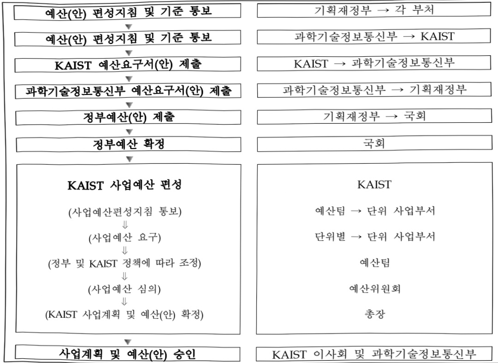

# 한국과학기술원 연구 운영비 지원(R&D)

**해당 페이지**: PDF 1598 ~ 1607 쪽 해당

**부처**: 과학기술정보통신부
**분야**: 과학기술
**회계유형**: 일반
**2026 확정예산**: 297077.0 백만원
**전년대비 증감률**: 36.1%
**AI 도메인**: R&D 지원

---

<table border=1 style='margin: auto; word-wrap: break-word;'><tr><td style='text-align: center; word-wrap: break-word;'>사 업 명</td></tr><tr><td style='text-align: center; word-wrap: break-word;'>(183) 한국과학기술원 연구운영비 지원(R&amp;D) (2231-401)</td></tr></table>

## 사업 코드 정보

<table border=1 style='margin: auto; word-wrap: break-word;'><tr><td style='text-align: center; word-wrap: break-word;'>구분</td><td style='text-align: center; word-wrap: break-word;'>회계</td><td style='text-align: center; word-wrap: break-word;'>소관</td><td style='text-align: center; word-wrap: break-word;'>실국(기관)</td><td style='text-align: center; word-wrap: break-word;'>계정</td><td style='text-align: center; word-wrap: break-word;'>분야</td><td style='text-align: center; word-wrap: break-word;'>부문</td></tr><tr><td style='text-align: center; word-wrap: break-word;'>코드</td><td rowspan="2">일반</td><td rowspan="2">과학기술정보통신부</td><td rowspan="2">미래인재정책국</td><td rowspan="2">-</td><td style='text-align: center; word-wrap: break-word;'>150</td><td style='text-align: center; word-wrap: break-word;'>152</td></tr><tr><td style='text-align: center; word-wrap: break-word;'>명칭</td><td style='text-align: center; word-wrap: break-word;'>과학기술</td><td style='text-align: center; word-wrap: break-word;'>과학기술연구지원</td></tr></table>

<table border=1 style='margin: auto; word-wrap: break-word;'><tr><td style='text-align: center; word-wrap: break-word;'>구분</td><td style='text-align: center; word-wrap: break-word;'>프로그램</td><td style='text-align: center; word-wrap: break-word;'>단위사업</td><td style='text-align: center; word-wrap: break-word;'>세부사업</td></tr><tr><td style='text-align: center; word-wrap: break-word;'>코드</td><td style='text-align: center; word-wrap: break-word;'>2200</td><td style='text-align: center; word-wrap: break-word;'>2231</td><td style='text-align: center; word-wrap: break-word;'>401</td></tr><tr><td style='text-align: center; word-wrap: break-word;'>명칭</td><td style='text-align: center; word-wrap: break-word;'>출연연구기관지원</td><td style='text-align: center; word-wrap: break-word;'>직할출연연구기관지원</td><td style='text-align: center; word-wrap: break-word;'>한국과학기술원 연구운영비 지원(R&amp;D)</td></tr></table>

사업 성격 (공통요구자료 Ⅱ-1 작성유의사항 4. 참조, 해당하는 사항에 “○” 표시)

<table border=1 style='margin: auto; word-wrap: break-word;'><tr><td rowspan="2">신규</td><td rowspan="2">계속</td><td rowspan="2">완료</td><td style='text-align: center; word-wrap: break-word;'>예비타당성</td><td style='text-align: center; word-wrap: break-word;'>총사업비</td><td style='text-align: center; word-wrap: break-word;'>총액계상</td><td style='text-align: center; word-wrap: break-word;'>사업소관 변경정보</td></tr><tr><td style='text-align: center; word-wrap: break-word;'>실시여부</td><td style='text-align: center; word-wrap: break-word;'>관리대상</td><td style='text-align: center; word-wrap: break-word;'>예산사업</td><td style='text-align: center; word-wrap: break-word;'>2025예산 시 소관</td></tr><tr><td style='text-align: center; word-wrap: break-word;'></td><td style='text-align: center; word-wrap: break-word;'>O</td><td style='text-align: center; word-wrap: break-word;'></td><td style='text-align: center; word-wrap: break-word;'></td><td style='text-align: center; word-wrap: break-word;'></td><td style='text-align: center; word-wrap: break-word;'></td><td style='text-align: center; word-wrap: break-word;'></td></tr></table>

사업 지원 형태 및 지원을 (최소한 한 개는 반드시 선택하시오. 해당사항에 O 표시)

<table border=1 style='margin: auto; word-wrap: break-word;'><tr><td style='text-align: center; word-wrap: break-word;'>직접</td><td style='text-align: center; word-wrap: break-word;'>출자</td><td style='text-align: center; word-wrap: break-word;'>출연</td><td style='text-align: center; word-wrap: break-word;'>보조</td><td style='text-align: center; word-wrap: break-word;'>융자</td><td style='text-align: center; word-wrap: break-word;'>국고보조율(%)</td><td style='text-align: center; word-wrap: break-word;'>융자율(%)</td></tr><tr><td style='text-align: center; word-wrap: break-word;'></td><td style='text-align: center; word-wrap: break-word;'></td><td style='text-align: center; word-wrap: break-word;'>O</td><td style='text-align: center; word-wrap: break-word;'></td><td style='text-align: center; word-wrap: break-word;'></td><td style='text-align: center; word-wrap: break-word;'></td><td style='text-align: center; word-wrap: break-word;'></td></tr></table>

## 사업 소관부처 및 시행주체

<table border=1 style='margin: auto; word-wrap: break-word;'><tr><td style='text-align: center; word-wrap: break-word;'>사업명</td><td colspan="2">구분</td></tr><tr><td rowspan="2">한국과학기술원연구운영비지원(R&amp;D)</td><td style='text-align: center; word-wrap: break-word;'>소관부처</td><td style='text-align: center; word-wrap: break-word;'>미래인재정책국미래인재양성과</td></tr><tr><td style='text-align: center; word-wrap: break-word;'>사업시행주체</td><td style='text-align: center; word-wrap: break-word;'>한국과학기술원</td></tr></table>

---

### 가.예산 총괄표

(단위:백만원,%)

<table border=1 style='margin: auto; word-wrap: break-word;'><tr><td rowspan="2">사업명</td><td rowspan="2">2024년 결산</td><td colspan="2">2025년 예산</td><td colspan="2">2026년 예산</td><td rowspan="2">증감(B-A)</td><td rowspan="2">(B-A)/A</td></tr><tr><td style='text-align: center; word-wrap: break-word;'>본예산</td><td style='text-align: center; word-wrap: break-word;'>추경*(A)</td><td style='text-align: center; word-wrap: break-word;'>요구안</td><td style='text-align: center; word-wrap: break-word;'>본예산(B)</td></tr><tr><td style='text-align: center; word-wrap: break-word;'>한국과학기술원연구운영비지원(R&amp;D)</td><td style='text-align: center; word-wrap: break-word;'>207,269</td><td style='text-align: center; word-wrap: break-word;'>218,356</td><td style='text-align: center; word-wrap: break-word;'>233,356</td><td style='text-align: center; word-wrap: break-word;'>287,242</td><td style='text-align: center; word-wrap: break-word;'>297,077</td><td style='text-align: center; word-wrap: break-word;'>78,721</td><td style='text-align: center; word-wrap: break-word;'>36.1</td></tr></table>

*추경: 추경증감액을 포함한 최종 예산액을 기재

## □ 기능별(내역사업별) 예산 내역

(단위:백만원)

<table border=1 style='margin: auto; word-wrap: break-word;'><tr><td rowspan="2"></td><td colspan="5">2024</td><td colspan="5">2025</td><td rowspan="2">2026예산</td></tr><tr><td style='text-align: center; word-wrap: break-word;'>예산액(추경)</td><td style='text-align: center; word-wrap: break-word;'>예산현액</td><td style='text-align: center; word-wrap: break-word;'>집행액</td><td style='text-align: center; word-wrap: break-word;'>이월액</td><td style='text-align: center; word-wrap: break-word;'>불용액</td><td style='text-align: center; word-wrap: break-word;'>예산액(추경)</td><td style='text-align: center; word-wrap: break-word;'>예산현액</td><td style='text-align: center; word-wrap: break-word;'>집행액</td><td style='text-align: center; word-wrap: break-word;'>이월액</td><td style='text-align: center; word-wrap: break-word;'>불용액</td></tr><tr><td style='text-align: center; word-wrap: break-word;'>○ 기능별 분류(합계)</td><td style='text-align: center; word-wrap: break-word;'>207,269</td><td style='text-align: center; word-wrap: break-word;'>207,269</td><td style='text-align: center; word-wrap: break-word;'>207,269</td><td style='text-align: center; word-wrap: break-word;'>-</td><td style='text-align: center; word-wrap: break-word;'>-</td><td style='text-align: center; word-wrap: break-word;'>233,356</td><td style='text-align: center; word-wrap: break-word;'>233,356</td><td style='text-align: center; word-wrap: break-word;'>233,356</td><td style='text-align: center; word-wrap: break-word;'>-</td><td style='text-align: center; word-wrap: break-word;'>-</td><td style='text-align: center; word-wrap: break-word;'>297,072</td></tr><tr><td style='text-align: center; word-wrap: break-word;'>□ 기관운영비</td><td style='text-align: center; word-wrap: break-word;'>113,202</td><td style='text-align: center; word-wrap: break-word;'>113,202</td><td style='text-align: center; word-wrap: break-word;'>113,202</td><td style='text-align: center; word-wrap: break-word;'>-</td><td style='text-align: center; word-wrap: break-word;'>-</td><td style='text-align: center; word-wrap: break-word;'>116,251</td><td style='text-align: center; word-wrap: break-word;'>116,251</td><td style='text-align: center; word-wrap: break-word;'>116,251</td><td style='text-align: center; word-wrap: break-word;'>-</td><td style='text-align: center; word-wrap: break-word;'>-</td><td style='text-align: center; word-wrap: break-word;'>120,754</td></tr><tr><td style='text-align: center; word-wrap: break-word;'>- 인진비</td><td style='text-align: center; word-wrap: break-word;'>97,647</td><td style='text-align: center; word-wrap: break-word;'>97,647</td><td style='text-align: center; word-wrap: break-word;'>97,647</td><td style='text-align: center; word-wrap: break-word;'>-</td><td style='text-align: center; word-wrap: break-word;'>-</td><td style='text-align: center; word-wrap: break-word;'>100,623</td><td style='text-align: center; word-wrap: break-word;'>100,623</td><td style='text-align: center; word-wrap: break-word;'>100,623</td><td style='text-align: center; word-wrap: break-word;'>-</td><td style='text-align: center; word-wrap: break-word;'>-</td><td style='text-align: center; word-wrap: break-word;'>104,792</td></tr><tr><td style='text-align: center; word-wrap: break-word;'>- 경상경비</td><td style='text-align: center; word-wrap: break-word;'>15,555</td><td style='text-align: center; word-wrap: break-word;'>15,555</td><td style='text-align: center; word-wrap: break-word;'>15,555</td><td style='text-align: center; word-wrap: break-word;'>-</td><td style='text-align: center; word-wrap: break-word;'>-</td><td style='text-align: center; word-wrap: break-word;'>15,628</td><td style='text-align: center; word-wrap: break-word;'>15,628</td><td style='text-align: center; word-wrap: break-word;'>15,628</td><td style='text-align: center; word-wrap: break-word;'>-</td><td style='text-align: center; word-wrap: break-word;'>-</td><td style='text-align: center; word-wrap: break-word;'>15,962</td></tr><tr><td style='text-align: center; word-wrap: break-word;'>□ 사업비</td><td style='text-align: center; word-wrap: break-word;'>94,067</td><td style='text-align: center; word-wrap: break-word;'>94,067</td><td style='text-align: center; word-wrap: break-word;'>94,067</td><td style='text-align: center; word-wrap: break-word;'>-</td><td style='text-align: center; word-wrap: break-word;'>-</td><td style='text-align: center; word-wrap: break-word;'>117,105</td><td style='text-align: center; word-wrap: break-word;'>117,105</td><td style='text-align: center; word-wrap: break-word;'>117,105</td><td style='text-align: center; word-wrap: break-word;'>-</td><td style='text-align: center; word-wrap: break-word;'>-</td><td style='text-align: center; word-wrap: break-word;'>176,322</td></tr><tr><td style='text-align: center; word-wrap: break-word;'>· 기관고유사업비</td><td style='text-align: center; word-wrap: break-word;'>70,824</td><td style='text-align: center; word-wrap: break-word;'>70,824</td><td style='text-align: center; word-wrap: break-word;'>70,824</td><td style='text-align: center; word-wrap: break-word;'>-</td><td style='text-align: center; word-wrap: break-word;'>-</td><td style='text-align: center; word-wrap: break-word;'>73,424</td><td style='text-align: center; word-wrap: break-word;'>73,424</td><td style='text-align: center; word-wrap: break-word;'>73,424</td><td style='text-align: center; word-wrap: break-word;'>-</td><td style='text-align: center; word-wrap: break-word;'>-</td><td style='text-align: center; word-wrap: break-word;'>71,690</td></tr><tr><td style='text-align: center; word-wrap: break-word;'>- 학사사업비</td><td style='text-align: center; word-wrap: break-word;'>41,001</td><td style='text-align: center; word-wrap: break-word;'>41,001</td><td style='text-align: center; word-wrap: break-word;'>41,001</td><td style='text-align: center; word-wrap: break-word;'>-</td><td style='text-align: center; word-wrap: break-word;'>-</td><td style='text-align: center; word-wrap: break-word;'>41,751</td><td style='text-align: center; word-wrap: break-word;'>41,751</td><td style='text-align: center; word-wrap: break-word;'>41,751</td><td style='text-align: center; word-wrap: break-word;'>-</td><td style='text-align: center; word-wrap: break-word;'>-</td><td style='text-align: center; word-wrap: break-word;'>42,351</td></tr><tr><td style='text-align: center; word-wrap: break-word;'>- 과학기술선도기초연구</td><td style='text-align: center; word-wrap: break-word;'>1,829</td><td style='text-align: center; word-wrap: break-word;'>1,829</td><td style='text-align: center; word-wrap: break-word;'>1,829</td><td style='text-align: center; word-wrap: break-word;'>-</td><td style='text-align: center; word-wrap: break-word;'>-</td><td style='text-align: center; word-wrap: break-word;'>1,829</td><td style='text-align: center; word-wrap: break-word;'>1,829</td><td style='text-align: center; word-wrap: break-word;'>1,829</td><td style='text-align: center; word-wrap: break-word;'>-</td><td style='text-align: center; word-wrap: break-word;'>-</td><td style='text-align: center; word-wrap: break-word;'>1,486</td></tr><tr><td style='text-align: center; word-wrap: break-word;'>- 글로벌선도대학육성·지원</td><td style='text-align: center; word-wrap: break-word;'>10,218</td><td style='text-align: center; word-wrap: break-word;'>10,218</td><td style='text-align: center; word-wrap: break-word;'>10,218</td><td style='text-align: center; word-wrap: break-word;'>-</td><td style='text-align: center; word-wrap: break-word;'>-</td><td style='text-align: center; word-wrap: break-word;'>10,518</td><td style='text-align: center; word-wrap: break-word;'>10,518</td><td style='text-align: center; word-wrap: break-word;'>10,518</td><td style='text-align: center; word-wrap: break-word;'>-</td><td style='text-align: center; word-wrap: break-word;'>-</td><td style='text-align: center; word-wrap: break-word;'>8,543</td></tr><tr><td style='text-align: center; word-wrap: break-word;'>- 학술정보운영</td><td style='text-align: center; word-wrap: break-word;'>9,722</td><td style='text-align: center; word-wrap: break-word;'>9,722</td><td style='text-align: center; word-wrap: break-word;'>9,722</td><td style='text-align: center; word-wrap: break-word;'>-</td><td style='text-align: center; word-wrap: break-word;'>-</td><td style='text-align: center; word-wrap: break-word;'>10,222</td><td style='text-align: center; word-wrap: break-word;'>10,222</td><td style='text-align: center; word-wrap: break-word;'>10,222</td><td style='text-align: center; word-wrap: break-word;'>-</td><td style='text-align: center; word-wrap: break-word;'>-</td><td style='text-align: center; word-wrap: break-word;'>10,722</td></tr><tr><td style='text-align: center; word-wrap: break-word;'>- 기관고유센터운영</td><td style='text-align: center; word-wrap: break-word;'>4,854</td><td style='text-align: center; word-wrap: break-word;'>4,854</td><td style='text-align: center; word-wrap: break-word;'>4,854</td><td style='text-align: center; word-wrap: break-word;'>-</td><td style='text-align: center; word-wrap: break-word;'>-</td><td style='text-align: center; word-wrap: break-word;'>5,404</td><td style='text-align: center; word-wrap: break-word;'>5,404</td><td style='text-align: center; word-wrap: break-word;'>5,404</td><td style='text-align: center; word-wrap: break-word;'>-</td><td style='text-align: center; word-wrap: break-word;'>-</td><td style='text-align: center; word-wrap: break-word;'>5,582</td></tr><tr><td style='text-align: center; word-wrap: break-word;'>- 대규모 융합연구소 운영</td><td style='text-align: center; word-wrap: break-word;'>2,000</td><td style='text-align: center; word-wrap: break-word;'>2,000</td><td style='text-align: center; word-wrap: break-word;'>2,000</td><td style='text-align: center; word-wrap: break-word;'>-</td><td style='text-align: center; word-wrap: break-word;'>-</td><td style='text-align: center; word-wrap: break-word;'>2,000</td><td style='text-align: center; word-wrap: break-word;'>2,000</td><td style='text-align: center; word-wrap: break-word;'>2,000</td><td style='text-align: center; word-wrap: break-word;'>-</td><td style='text-align: center; word-wrap: break-word;'>-</td><td style='text-align: center; word-wrap: break-word;'>1,622</td></tr><tr><td style='text-align: center; word-wrap: break-word;'>- 대형연구시설장비운영유지비</td><td style='text-align: center; word-wrap: break-word;'>1,200</td><td style='text-align: center; word-wrap: break-word;'>1,200</td><td style='text-align: center; word-wrap: break-word;'>1,200</td><td style='text-align: center; word-wrap: break-word;'>-</td><td style='text-align: center; word-wrap: break-word;'>-</td><td style='text-align: center; word-wrap: break-word;'>1,700</td><td style='text-align: center; word-wrap: break-word;'>1,700</td><td style='text-align: center; word-wrap: break-word;'>1,700</td><td style='text-align: center; word-wrap: break-word;'>-</td><td style='text-align: center; word-wrap: break-word;'>-</td><td style='text-align: center; word-wrap: break-word;'>1,382</td></tr><tr><td style='text-align: center; word-wrap: break-word;'>· 일반사업비</td><td style='text-align: center; word-wrap: break-word;'>18,557</td><td style='text-align: center; word-wrap: break-word;'>18,557</td><td style='text-align: center; word-wrap: break-word;'>18,557</td><td style='text-align: center; word-wrap: break-word;'>-</td><td style='text-align: center; word-wrap: break-word;'>-</td><td style='text-align: center; word-wrap: break-word;'>39,083</td><td style='text-align: center; word-wrap: break-word;'>39,083</td><td style='text-align: center; word-wrap: break-word;'>39,083</td><td style='text-align: center; word-wrap: break-word;'>-</td><td style='text-align: center; word-wrap: break-word;'>-</td><td style='text-align: center; word-wrap: break-word;'>87,672</td></tr><tr><td style='text-align: center; word-wrap: break-word;'>- 창업 및 사업화협력</td><td style='text-align: center; word-wrap: break-word;'>3,558</td><td style='text-align: center; word-wrap: break-word;'>3,558</td><td style='text-align: center; word-wrap: break-word;'>3,558</td><td style='text-align: center; word-wrap: break-word;'>-</td><td style='text-align: center; word-wrap: break-word;'>-</td><td style='text-align: center; word-wrap: break-word;'>3,558</td><td style='text-align: center; word-wrap: break-word;'>3,558</td><td style='text-align: center; word-wrap: break-word;'>3,558</td><td style='text-align: center; word-wrap: break-word;'>-</td><td style='text-align: center; word-wrap: break-word;'>-</td><td style='text-align: center; word-wrap: break-word;'>2,892</td></tr><tr><td style='text-align: center; word-wrap: break-word;'>- 미래선도형 특성화연구</td><td style='text-align: center; word-wrap: break-word;'>5,800</td><td style='text-align: center; word-wrap: break-word;'>5,800</td><td style='text-align: center; word-wrap: break-word;'>5,800</td><td style='text-align: center; word-wrap: break-word;'>-</td><td style='text-align: center; word-wrap: break-word;'>-</td><td style='text-align: center; word-wrap: break-word;'>13,400</td><td style='text-align: center; word-wrap: break-word;'>13,400</td><td style='text-align: center; word-wrap: break-word;'>13,400</td><td style='text-align: center; word-wrap: break-word;'>-</td><td style='text-align: center; word-wrap: break-word;'>-</td><td style='text-align: center; word-wrap: break-word;'>10,352</td></tr><tr><td style='text-align: center; word-wrap: break-word;'>- 창의적인제양성특성화교육</td><td style='text-align: center; word-wrap: break-word;'>9,199</td><td style='text-align: center; word-wrap: break-word;'>9,199</td><td style='text-align: center; word-wrap: break-word;'>9,199</td><td style='text-align: center; word-wrap: break-word;'>-</td><td style='text-align: center; word-wrap: break-word;'>-</td><td style='text-align: center; word-wrap: break-word;'>7,125</td><td style='text-align: center; word-wrap: break-word;'>7,125</td><td style='text-align: center; word-wrap: break-word;'>7,125</td><td style='text-align: center; word-wrap: break-word;'>-</td><td style='text-align: center; word-wrap: break-word;'>-</td><td style='text-align: center; word-wrap: break-word;'>15,372</td></tr><tr><td style='text-align: center; word-wrap: break-word;'>- 종북 AI BIO 과학영재학교 설립추진비(신규)</td><td style='text-align: center; word-wrap: break-word;'>-</td><td style='text-align: center; word-wrap: break-word;'>-</td><td style='text-align: center; word-wrap: break-word;'>-</td><td style='text-align: center; word-wrap: break-word;'>-</td><td style='text-align: center; word-wrap: break-word;'>-</td><td style='text-align: center; word-wrap: break-word;'>-</td><td style='text-align: center; word-wrap: break-word;'>-</td><td style='text-align: center; word-wrap: break-word;'>-</td><td style='text-align: center; word-wrap: break-word;'>-</td><td style='text-align: center; word-wrap: break-word;'>-</td><td style='text-align: center; word-wrap: break-word;'>152</td></tr></table>

---

<table border=1 style='margin: auto; word-wrap: break-word;'><tr><td rowspan="2"></td><td colspan="5">2024</td><td colspan="5">2025</td><td rowspan="2">2026예산</td></tr><tr><td style='text-align: center; word-wrap: break-word;'>예산액(추경)</td><td style='text-align: center; word-wrap: break-word;'>예산현액</td><td style='text-align: center; word-wrap: break-word;'>집행액</td><td style='text-align: center; word-wrap: break-word;'>이월액</td><td style='text-align: center; word-wrap: break-word;'>불용액</td><td style='text-align: center; word-wrap: break-word;'>예산액(추경)</td><td style='text-align: center; word-wrap: break-word;'>예산현액</td><td style='text-align: center; word-wrap: break-word;'>집행액</td><td style='text-align: center; word-wrap: break-word;'>이월액</td><td style='text-align: center; word-wrap: break-word;'>불용액</td></tr><tr><td style='text-align: center; word-wrap: break-word;'>- AI 국가대표 양성(InnoCORE)</td><td style='text-align: center; word-wrap: break-word;'>-</td><td style='text-align: center; word-wrap: break-word;'>-</td><td style='text-align: center; word-wrap: break-word;'>-</td><td style='text-align: center; word-wrap: break-word;'>-</td><td style='text-align: center; word-wrap: break-word;'>-</td><td style='text-align: center; word-wrap: break-word;'>15,000</td><td style='text-align: center; word-wrap: break-word;'>15,000</td><td style='text-align: center; word-wrap: break-word;'>15,000</td><td style='text-align: center; word-wrap: break-word;'>-</td><td style='text-align: center; word-wrap: break-word;'>-</td><td style='text-align: center; word-wrap: break-word;'>52,500</td></tr><tr><td style='text-align: center; word-wrap: break-word;'>- InnoCORE Link KAIST (신규)</td><td style='text-align: center; word-wrap: break-word;'>-</td><td style='text-align: center; word-wrap: break-word;'>-</td><td style='text-align: center; word-wrap: break-word;'>-</td><td style='text-align: center; word-wrap: break-word;'>-</td><td style='text-align: center; word-wrap: break-word;'>-</td><td style='text-align: center; word-wrap: break-word;'>-</td><td style='text-align: center; word-wrap: break-word;'>-</td><td style='text-align: center; word-wrap: break-word;'>-</td><td style='text-align: center; word-wrap: break-word;'>-</td><td style='text-align: center; word-wrap: break-word;'>-</td><td style='text-align: center; word-wrap: break-word;'>1,950</td></tr><tr><td style='text-align: center; word-wrap: break-word;'>- AI 전사양성사업(신규)</td><td style='text-align: center; word-wrap: break-word;'>-</td><td style='text-align: center; word-wrap: break-word;'>-</td><td style='text-align: center; word-wrap: break-word;'>-</td><td style='text-align: center; word-wrap: break-word;'>-</td><td style='text-align: center; word-wrap: break-word;'>-</td><td style='text-align: center; word-wrap: break-word;'>-</td><td style='text-align: center; word-wrap: break-word;'>-</td><td style='text-align: center; word-wrap: break-word;'>-</td><td style='text-align: center; word-wrap: break-word;'>-</td><td style='text-align: center; word-wrap: break-word;'>-</td><td style='text-align: center; word-wrap: break-word;'>4,450</td></tr><tr><td style='text-align: center; word-wrap: break-word;'>- 전략연구사업(신규)</td><td style='text-align: center; word-wrap: break-word;'>-</td><td style='text-align: center; word-wrap: break-word;'>-</td><td style='text-align: center; word-wrap: break-word;'>-</td><td style='text-align: center; word-wrap: break-word;'>-</td><td style='text-align: center; word-wrap: break-word;'>-</td><td style='text-align: center; word-wrap: break-word;'>-</td><td style='text-align: center; word-wrap: break-word;'>-</td><td style='text-align: center; word-wrap: break-word;'>-</td><td style='text-align: center; word-wrap: break-word;'>-</td><td style='text-align: center; word-wrap: break-word;'>-</td><td style='text-align: center; word-wrap: break-word;'>10,763</td></tr><tr><td style='text-align: center; word-wrap: break-word;'>- 소나무재선층 방제 마이오 신논레 맞춤형 세포공장(KAIST-UNIST)(신규)</td><td style='text-align: center; word-wrap: break-word;'>-</td><td style='text-align: center; word-wrap: break-word;'>-</td><td style='text-align: center; word-wrap: break-word;'>-</td><td style='text-align: center; word-wrap: break-word;'>-</td><td style='text-align: center; word-wrap: break-word;'>-</td><td style='text-align: center; word-wrap: break-word;'>-</td><td style='text-align: center; word-wrap: break-word;'>-</td><td style='text-align: center; word-wrap: break-word;'>-</td><td style='text-align: center; word-wrap: break-word;'>-</td><td style='text-align: center; word-wrap: break-word;'>-</td><td style='text-align: center; word-wrap: break-word;'>2,913</td></tr><tr><td style='text-align: center; word-wrap: break-word;'>- 양자컴퓨터(중성원자) 기술(KAIST-UNIST)(신규)</td><td style='text-align: center; word-wrap: break-word;'>-</td><td style='text-align: center; word-wrap: break-word;'>-</td><td style='text-align: center; word-wrap: break-word;'>-</td><td style='text-align: center; word-wrap: break-word;'>-</td><td style='text-align: center; word-wrap: break-word;'>-</td><td style='text-align: center; word-wrap: break-word;'>-</td><td style='text-align: center; word-wrap: break-word;'>-</td><td style='text-align: center; word-wrap: break-word;'>-</td><td style='text-align: center; word-wrap: break-word;'>-</td><td style='text-align: center; word-wrap: break-word;'>-</td><td style='text-align: center; word-wrap: break-word;'>5,944</td></tr><tr><td style='text-align: center; word-wrap: break-word;'>- 휴먼 디지털 트윈 프로젝트 사업단(DQIST-KAIST-UNIST-QSI)(신규)</td><td style='text-align: center; word-wrap: break-word;'>-</td><td style='text-align: center; word-wrap: break-word;'>-</td><td style='text-align: center; word-wrap: break-word;'>-</td><td style='text-align: center; word-wrap: break-word;'>-</td><td style='text-align: center; word-wrap: break-word;'>-</td><td style='text-align: center; word-wrap: break-word;'>-</td><td style='text-align: center; word-wrap: break-word;'>-</td><td style='text-align: center; word-wrap: break-word;'>-</td><td style='text-align: center; word-wrap: break-word;'>-</td><td style='text-align: center; word-wrap: break-word;'>-</td><td style='text-align: center; word-wrap: break-word;'>1,906</td></tr><tr><td style='text-align: center; word-wrap: break-word;'>- 장비·시스템구축비</td><td style='text-align: center; word-wrap: break-word;'>4,686</td><td style='text-align: center; word-wrap: break-word;'>4,686</td><td style='text-align: center; word-wrap: break-word;'>4,686</td><td style='text-align: center; word-wrap: break-word;'>-</td><td style='text-align: center; word-wrap: break-word;'>-</td><td style='text-align: center; word-wrap: break-word;'>4,598</td><td style='text-align: center; word-wrap: break-word;'>4,598</td><td style='text-align: center; word-wrap: break-word;'>4,598</td><td style='text-align: center; word-wrap: break-word;'></td><td style='text-align: center; word-wrap: break-word;'></td><td style='text-align: center; word-wrap: break-word;'>6,198</td></tr></table>

### 나. 사업설명자료

## 1 ) 사업목적·내용

□ 산업발전에 필요한 과학기술분야에 관하여 깊이 있는 이론과 실제적인 응용력을 갖춘 고급과학기술인재 양성

국가 정책적으로 수행하는 중·장기 연구개발과 국가과학기술 저력 배양을 위한 기초·응용연구 수행

- (기관운영비) : 설립목적에 따라 수립된 기관 R&R(역할과 책임) 관련 주요 사업

목표 달성을 위한 인건비, 경상경비 등 기관운영경비

- (사업비) : 고급과학기술인재 양성 및 기초·응용과학 연구수행 등 기관 고유목적

달성을 위한 교육·연구 사업비

## 2 ) 사업개요

## 사업근거 및 추진경위

① 법령상 근거 및 조항 적시 : 해당되는 모든 조항의 전체 조문을 기재

---

제10조(출연금) ① 국가, 지방자치단체 또는 「공공기관의 운영에 관한 법률」 제4조에 따른 공공기관은 과학기술원의 설립·건설·연구 및 운영에 필요한 경비에 충당하도록 과학기술원에 출연금을 지급할 수 있다. <개정 2022. 1. 11.>

② 제1항에 따른 출연금의 지급·사용 등에 필요한 사항은 대통령령으로 정한다.[전문개정 2009.2.6.]

② 추진경위 - 사업 시작년도, 추진배경, 부처별 중점과제, 대통령 공약사항 등

- 1969.06.15. 경제기획원장관과 주한 미 국제원조처(USAID-K) 장관에 ‘고급과학기술 인력양성을 위한 계획’ 추진 합의(Project No : 489-11-680-650)

- 1970.04.08.

박정희 대통령이 [경제동향보고] 석상에서 정부와 여당에 대해

과기처의 과학기술대학원의 독립 신설안을 추진할 것을 지시

- 1970.04.10. 경제기획원, 문교부, 과학기술처 차관과 한국과학기술연구소 부소장으로 하는 '과학원 설립을 위한 실무위원회'가 구성되고, 동 위원회에서 과학원 설립을 위한 기본계획 수립

- 1970.03.25.

과학기술계에서 정근모 박사를 초청하여 '과학기술원 설립에 대한 연구보고서'를 검토하면서 이에 대한 자문 청취

- 1970.04.28. 한국과학원법(안) 제33회 국무회의 통과

- 1970.06.29. 한국과학원의 설립 작업을 효율적으로 수행하기 위해 과학기술처장관의 자문에 응할 '한국과학원 설립자문위원회(위원장 김기형 과학기술처장관) 구성

-1970.07.16. 한국과학원법(안) 제74회 임시국회 의결

- 1970.08.07. 한국과학원법 공포

- 1970.09.16. AID로부터 한국과학원 설립에 필요한 차관 확보

-1971.02.16. 한국과학원 설립 등기

- 1981.01.05. 한국과학기술원(KAIST) 설립(※ 한국과학기술연구소(KIST)와 통합)

- 1984.12.31. 한국과학기술원법 개정공포(법률 제3778호)

※학사과정 신설과 그 교육을 위한 대학설립

-1989.06.12. 한국과학기술연구소(KIST)과 분리

- 1989.07.04. 한국과학기술대학과 통합(대덕캠퍼스로 이전)

- 1990.12.07. 제1회 학사학위 수여식

- 1996.10.01. 부설 고등과학원 설치

- 2004.05.04. 부설 나노종합팬센터(现나노종합기술원) 설치

- 2009.02.06. 한국과학영재학교 통합(※부설기관으로 설치)

- 2009.03.01. 학교법인 한국정보통신학원(한국정보통신대학교) 과 통합

---

## 주요내용

① 사업규모

- 총사업비(해당되는 경우에만 기재) : 해당사항 없음

- 사업기간 : 1971 ~ 계속

- 최근 5년 간 투입된 사업비(예산액기준, 추경편성한 연도에는 추경포함)

<table border=1 style='margin: auto; word-wrap: break-word;'><tr><td style='text-align: center; word-wrap: break-word;'>$ \underline{\text{연도}} $</td><td style='text-align: center; word-wrap: break-word;'>2022</td><td style='text-align: center; word-wrap: break-word;'>2023</td><td style='text-align: center; word-wrap: break-word;'>2024</td><td style='text-align: center; word-wrap: break-word;'>2025</td><td style='text-align: center; word-wrap: break-word;'>2026</td></tr><tr><td style='text-align: center; word-wrap: break-word;'>$ \underline{\text{사업비}} $</td><td style='text-align: center; word-wrap: break-word;'>239,231</td><td style='text-align: center; word-wrap: break-word;'>229,089</td><td style='text-align: center; word-wrap: break-word;'>207,269</td><td style='text-align: center; word-wrap: break-word;'>233,356</td><td style='text-align: center; word-wrap: break-word;'>297,077</td></tr></table>

- 기타: 해당사항 없음

② 사업추진체계

- 사업시행방법 : 출연

- 사업시행주체 : 한국과학기술

- 사업 수혜자 : 산업체, 연구기관, 대학 등

- 보조, 융자, 출연, 출자 등의 경우 보조·융자 등 지원 비율 및 법적근거

<table border=1 style='margin: auto; word-wrap: break-word;'><tr><td style='text-align: center; word-wrap: break-word;'>내역사업명</td><td style='text-align: center; word-wrap: break-word;'>구분</td><td style='text-align: center; word-wrap: break-word;'>피보조·피출연 등 기관명</td><td style='text-align: center; word-wrap: break-word;'>지원 금액 (2026예산)</td><td style='text-align: center; word-wrap: break-word;'>지원 비율(%)</td><td style='text-align: center; word-wrap: break-word;'>보조율 법적근거 (해당 조항)</td></tr><tr><td style='text-align: center; word-wrap: break-word;'>한국과학기술원 연구운영비 지원(R&amp;D)</td><td style='text-align: center; word-wrap: break-word;'>출연</td><td style='text-align: center; word-wrap: break-word;'>한국과학 기술원</td><td style='text-align: center; word-wrap: break-word;'>297,077</td><td style='text-align: center; word-wrap: break-word;'>100.0</td><td style='text-align: center; word-wrap: break-word;'>한국과학기술원법 제10조</td></tr></table>

## 3 ) 2026년도 예산 산출 근거

①한국과학기술원 연구운영비 지원:(26)297,077백만원

- (산출) 기관운영비 120,756백만원

기관고유사업비 71,690백만원

일반사업비 87,670백만원

전략연구사업 10,763백만원

장비·시스템구축비 6,198백만원

2026년도 예산 산출 세부내역

<table border=1 style='margin: auto; word-wrap: break-word;'><tr><td rowspan="2">예산</td><td style='text-align: center; word-wrap: break-word;'>2026년 예산</td></tr><tr><td style='text-align: center; word-wrap: break-word;'>산출내역</td></tr><tr><td style='text-align: center; word-wrap: break-word;'>297,077</td><td style='text-align: center; word-wrap: break-word;'>○ 기관운영비: 120,756백만원
가. 인건비(계속): 104,793백만원
나. 경상경비(계속): 15,963백만원
○ 기관고유사업비: 71,690백만원
가. 학사사업비(계속): 42,351백만원
나. 과학기술선도기초연구(계속): 1,486백만원
다. 글로벌선도대학육성·지원: 8,545백만원
라. 학술정보운영(계속): 10,722백만원</td></tr></table>

---

<table border=1 style='margin: auto; word-wrap: break-word;'><tr><td colspan="2">2026년 예산</td></tr><tr><td style='text-align: center; word-wrap: break-word;'>예산</td><td style='text-align: center; word-wrap: break-word;'>산출내역</td></tr><tr><td style='text-align: center; word-wrap: break-word;'></td><td style='text-align: center; word-wrap: break-word;'>마. 기관고유센터운영(계속) : 5,580백만원 바. 대규모융합연구소 운영 : 1,625백만원 사. 대형연구시설장비 운영유지비(계속) : 1,381백만원 ○ 일반사업비 : 87,670백만원 가. 장업 및 사업화 협력(계속) : 2,891백만원 나. 미래선도형 특성화연구(계속) : 10,356백만원 다. 창의적 인재양성 특성화교육(계속) : 15,371백만원 라. AI 국가대표 양성(InnoCORE)(계속) : 52,500백만원 마. (신규) InnoCORE Link KAIST : 1,950백만원 바. (신규) AI 전사양성사업 : 4,450백만원 사. (신규) 충북 AI BIO 과학영재학교 설립추진비 : 152백만원 ○ 전략연구사업(신규) : 10,763백만원 가. (신규)소나무재선충 방제 바이오신소재 맞춤형 세포공장 개발(KAIST-UNIST) 1식 x 2,913백만원 나. (신규)양자컴퓨터(중성원자) 기술 개발(KAIST-UNIST) 1식 x 5,944백만원 다. (신규)휴먼 디지털 트윈 프로젝트 사업단(DGIST-KAIST-UNIST-GIST) 1식 x 1,906백만원 ○ 장비.시스템구축비(계속) : 6,198백만원 가. 공동연구장비 구축 : 2,898백만원 나. 첨단의과학연구센터 운영 : 2,900백만원 다. 줄기세포 연구소 운영 : 400백만원</td></tr></table>

## 4 ) 사업효과

□ 사업영향, 산출물 성과지표 등

① 2022~2026년도 성과계획서 상 성과지표 및 최근 5년간 성과 달성도

<table border=1 style='margin: auto; word-wrap: break-word;'><tr><td style='text-align: center; word-wrap: break-word;'>성과지표</td><td style='text-align: center; word-wrap: break-word;'>구분</td><td style='text-align: center; word-wrap: break-word;'>2022</td><td style='text-align: center; word-wrap: break-word;'>2023</td><td style='text-align: center; word-wrap: break-word;'>2024</td><td style='text-align: center; word-wrap: break-word;'>2025</td><td style='text-align: center; word-wrap: break-word;'>2026</td><td style='text-align: center; word-wrap: break-word;'>2026 목표치산출근거</td><td style='text-align: center; word-wrap: break-word;'>측정산식(또는 측정방법)</td><td style='text-align: center; word-wrap: break-word;'>자료수집방법(또는 자료출처)</td></tr><tr><td rowspan="3">논문의 평균 피인용횟수(단위: 회)</td><td style='text-align: center; word-wrap: break-word;'>목표</td><td style='text-align: center; word-wrap: break-word;'>5.2</td><td style='text-align: center; word-wrap: break-word;'>5.4</td><td style='text-align: center; word-wrap: break-word;'>5.6</td><td style='text-align: center; word-wrap: break-word;'>5.8</td><td style='text-align: center; word-wrap: break-word;'>6.0</td><td rowspan="3">&#x27;25년도 목표치의 104% 설정</td><td rowspan="3">(&#x27;23년~&#x27;24년 발표한 논문의 &#x27;24년~&#x27;25년 피인용횟수의 합)/(&#x27;23년~&#x27;24년 발표한 논문수의 합)</td><td rowspan="3">발표논문편수 및 피인용횟수 집계</td></tr><tr><td style='text-align: center; word-wrap: break-word;'>실적</td><td style='text-align: center; word-wrap: break-word;'>5.8</td><td style='text-align: center; word-wrap: break-word;'>6.0</td><td style='text-align: center; word-wrap: break-word;'>6.2</td><td style='text-align: center; word-wrap: break-word;'>-</td><td style='text-align: center; word-wrap: break-word;'>-</td></tr><tr><td style='text-align: center; word-wrap: break-word;'>달성도</td><td style='text-align: center; word-wrap: break-word;'>116</td><td style='text-align: center; word-wrap: break-word;'>111</td><td style='text-align: center; word-wrap: break-word;'>111</td><td style='text-align: center; word-wrap: break-word;'>-</td><td style='text-align: center; word-wrap: break-word;'>-</td></tr></table>

---

② 성과지표 이외의 연도별 사업추진 경과 및 실적

<table border=1 style='margin: auto; word-wrap: break-word;'><tr><td style='text-align: center; word-wrap: break-word;'>2022</td><td style='text-align: center; word-wrap: break-word;'>. 2022 QS 세계대학평가 종합 42위. 2022 THE 아시아대학평가 14위, 국내 2위</td></tr><tr><td style='text-align: center; word-wrap: break-word;'>2023</td><td style='text-align: center; word-wrap: break-word;'>. 2023 QS 세계대학평가 종합 56위. 2023 QS 아시아대학평가 8위, 국내 1위. 2023 THE 아시아대학평가 17위, 국내 3위</td></tr><tr><td style='text-align: center; word-wrap: break-word;'>2024</td><td style='text-align: center; word-wrap: break-word;'>. 2024 QS 세계대학평가 종합 53위. 2024 THE 아시아대학평가 18위, 국내 3위. 2024 QS 학문분야평가(Broad Subject, 대계열) : Engineering &amp; Technology 20위, 국내 1위</td></tr><tr><td style='text-align: center; word-wrap: break-word;'>2025</td><td style='text-align: center; word-wrap: break-word;'>. 2025 THE 아시아대학평가 17위, 국내 2위. 2025 QS 학문분야평가(Broad Subject, 대계열) : Engineering &amp; Technology 24위, 국내 1위, Natural Sciences 38위, 국내 2위. 2025 QS 학문분야평가(Narrow Subject, 세부학문분야) : Materials Sciences 18위, 국내 1위, Electrical Engineering 22위, 국내 1위, Art &amp; Design 28위, 국내 1위, Computer Science 29위, 국내 1위</td></tr></table>

---

## ③향후(2026년도 이후)기대효과

ㅇ 핵심 인재양성과 융복합 협업연구를 통하여 사회적 가치 창출하고 국가의 혁신 성장 선도

## (교육)과학기술글로벌 인재 양성

### 1 -1.교육시스템혁신

>맞춤형 교육 콘텐츠 개발

·(학부교육) 응합인대학부 심치·온경

(대학원교육) AI대학원 설립·운영

· 교수학습 디지털 물랫폼 구축

·대학 교육시스템 혁신 강화: Education 4.0

▪ 학생 중심 면토링 교수 육성

>전인적 인재 양성

### 1 -2.인공지능(AI)교육확대·강화

(재학병) AI기초/천공과목 개설 및 교육 강화

(산업체) 맞춤형 AI 재교육 프로그램 강화

> (일반국민) 대상 AI 교육 프로그램 확대

### 1 -3.현장중심 교육강화 및 성과 확산

▪현장중심의 가치칭충 인재 교육

> 졸업생의 왕업 및 중소 · 벤처기업 진출 확대

>예비창업자 발굴 및 육성

## 3 (창업) 창업혁신 생태계 구축 및 발전

### 3 -1.기업가형 대학으로서의 Role Model 정립

· 글로벌 기업과 협력관계(Open Community 컨팅) 강화 및 기업 연구소 설립

·기업가정신 및 창업교육을 통한 창업 기반 강화

·창업기업의 글로벌 성장 지원

·일반국민 벤처창업 프로젝트 시범운영

·창업 액셀러레이팅

## 2 (연구) 인류 난제 해결을 위한 연구

• Open Venture Lab 물랫품을 통한 국민 창업 봄 조성

·글로벌시장-기업-KAIST 간 행보·인재·연구·비즈니스 교육보 마련

·지식재산 관리의 전문성 강화 및 성과 활산 시스템 구축

>기초과학 연구

### 3 -2.창업혁신을 통한 국가 성장 지원

### 2 -1.글로벌 선도 융복합 연구시스템 구축

·초세대 협업연구실 체도 운영 및 확대

·글로벌 선도 융복합 Flagship 연구시스템 구축

•KAIST 인공지능연구원(AI Institute) 설립

·초일류 연구자 옥성

·국가중점 산업군,기업R&D 확대

•산업 특성화 연구

·융합의과학원 설립·운영

·KC30IKAIST Grand Challenge 30) 프로젝트 확대 추진

·중소기업 연계 F&D 학대

과학기술 용용 연구

>중소기업 지원체계 강화

### 2 -2.4차산업혁명핵심분야수월성 및산업체연계강화

## (국제화)글로벌 리더십 역량 강화

### 4 -1. World Bridge by KAIST

KAIST 교육·연구 혁신모델 친파

·해외 대학/교육으로그럼 설립 지원 (KAIST 교육모델 개도국 전파)

### 4 -2.Global Campus 구축 및 물모델

>한국 대학의 글로벌화 선도

·외국인 학생 및 교원 유치 학대

• Global Top 10(GT10)

글로벌 컴퍼스화를 위한 인프라 구축

·외국인 학생 및 교원 유치 확대

국제협력활동 확대

·(기초과학진흥) 노벨상 도전을 위한 연구허브(KAIX) 구축

### 4 -3.Global Top 10위권 대학 진입

>한국의 국제적 위상에 걸맞은 글로벌 대학으로 성장

>분야별 20위권 이내 진입 수

## 핵심과제협업 강화 방안

## (특성화대)공동협력 프로그램 추진

> 온라인 공개강좌 사업(STAR-MOOC)

교원 공동 활용  학생교환  CUop

Company-University Cooperation Program

> 창업준비팀 공동 발굴/지원

(특성화대) 취/창업 공동 연계 '인턴스타트업' 사업

(지역) 출연(연)간 교육·연구협력 체계 재구축

## 조직문화 혁신 및 일하는 방식 혁신

## 경영효율화를 통한 지속가능성 확보

자체 재원 확보 노력

>경영효율화를 위한 행정 선진학

예산 구조개편

## 투명하고 공정한 KAIST 구현

>인권윤리 보호

>대학 명익회 구성

→전주기적 감사체계 도입

>여성과학자 육성

## 최적의 교육·연구 인프라 구축

연구역량 국대화를 위한 연구환경 조성

>착착의 교육·연구지원 시스템 구축

---

5) 타당성조사 및 예비타당성조사 시행여부 및 결과 요지 : 해당사항 없음

6) 총사업비 대상사업 정보 : 해당사항 없음

7) 사업 집행절차

## 8 ) 각종 평가

1) 국회(예결위, 상임위, 예정처, 국정감사 포함) 지적 : 해당사항 없음

2) 대외공개 평가 : R&D사업의 경우 「국가연구개발사업 등의 성과평가 및 성과관리에 관한 법률」 제7조제3항에 따른 부처의 R&D사업 자체성과평가에 대한 과학기술정보통신부 상위평가 결과 '24년도 임무중심형 기관평가 결과 '우수'

3) 자체평가 : 해당사항 없음

---

### 다. 최근 4년간 결산내역

## 1 ) 결산표

☐ 부처 결산내역

(단위: 백만원, %)

<table border=1 style='margin: auto; word-wrap: break-word;'><tr><td rowspan="2">연도</td><td colspan="3">예산액</td><td style='text-align: center; word-wrap: break-word;'>예산현액</td><td style='text-align: center; word-wrap: break-word;'>집행액</td><td style='text-align: center; word-wrap: break-word;'>집행률</td><td rowspan="2">다음연도 이월액</td><td rowspan="2">불용액</td></tr><tr><td style='text-align: center; word-wrap: break-word;'>본예산</td><td style='text-align: center; word-wrap: break-word;'>추경 중감액</td><td style='text-align: center; word-wrap: break-word;'>추경</td><td style='text-align: center; word-wrap: break-word;'>(A)</td><td style='text-align: center; word-wrap: break-word;'>(B)</td><td style='text-align: center; word-wrap: break-word;'>(B/A)</td></tr><tr><td style='text-align: center; word-wrap: break-word;'>2022</td><td style='text-align: center; word-wrap: break-word;'>239,231</td><td style='text-align: center; word-wrap: break-word;'>-</td><td style='text-align: center; word-wrap: break-word;'>239,231</td><td style='text-align: center; word-wrap: break-word;'>239,231</td><td style='text-align: center; word-wrap: break-word;'>239,231</td><td style='text-align: center; word-wrap: break-word;'>100</td><td style='text-align: center; word-wrap: break-word;'>-</td><td style='text-align: center; word-wrap: break-word;'>-</td></tr><tr><td style='text-align: center; word-wrap: break-word;'>2023</td><td style='text-align: center; word-wrap: break-word;'>229,089</td><td style='text-align: center; word-wrap: break-word;'>-</td><td style='text-align: center; word-wrap: break-word;'>229,089</td><td style='text-align: center; word-wrap: break-word;'>228,489</td><td style='text-align: center; word-wrap: break-word;'>228,489</td><td style='text-align: center; word-wrap: break-word;'>99.7</td><td style='text-align: center; word-wrap: break-word;'>-</td><td style='text-align: center; word-wrap: break-word;'>600</td></tr><tr><td style='text-align: center; word-wrap: break-word;'>2024</td><td style='text-align: center; word-wrap: break-word;'>207,269</td><td style='text-align: center; word-wrap: break-word;'>-</td><td style='text-align: center; word-wrap: break-word;'>207,269</td><td style='text-align: center; word-wrap: break-word;'>207,269</td><td style='text-align: center; word-wrap: break-word;'>207,269</td><td style='text-align: center; word-wrap: break-word;'>100</td><td style='text-align: center; word-wrap: break-word;'>-</td><td style='text-align: center; word-wrap: break-word;'>-</td></tr><tr><td style='text-align: center; word-wrap: break-word;'>2025</td><td style='text-align: center; word-wrap: break-word;'>218,356</td><td style='text-align: center; word-wrap: break-word;'>15,000</td><td style='text-align: center; word-wrap: break-word;'>233,356</td><td style='text-align: center; word-wrap: break-word;'>233,356</td><td style='text-align: center; word-wrap: break-word;'>233,356</td><td style='text-align: center; word-wrap: break-word;'>100</td><td style='text-align: center; word-wrap: break-word;'>-</td><td style='text-align: center; word-wrap: break-word;'>-</td></tr></table>

## 2 ) 주요 결산사항

□ 2022~2025년 결산 주요사항

<table border=1 style='margin: auto; word-wrap: break-word;'><tr><td style='text-align: center; word-wrap: break-word;'>2022</td><td style='text-align: center; word-wrap: break-word;'>- &#x27;협의 이·전용 등&#x27;의 상세내역 기술: 해당사항 없음- 이·전용 등 사유: 해당사항 없음- 추경 편성 사유: 해당사항 없음- 이월 사유 및 불용 사유(집행부진사유): 해당사항 없음</td></tr><tr><td style='text-align: center; word-wrap: break-word;'>2023</td><td style='text-align: center; word-wrap: break-word;'>- &#x27;이·전용 등&#x27;의 상세내역 기술: 해당없음- 이·전용 등 사유: 해당없음- 예비비 배정 사유: 해당없음- 추경 편성 사유: 해당없음- 이월 사유 및 불용 사유(집행부진사유)· 연구개발활동비 등(360-05)「일반사업비(창의적 인재양성 특성화교육(충북 AI BIO 영재고 설립 기획))」: 해당 사업에 대한 예비타당성 면제 및 적정성검토 절차 지연(&#x27;23년 9월~현재)에 따라, &#x27;23년 발주를 계획했던 교육관련 용역(교육환경 영향평가 및 교육과정 편성 및 운영방안 연구 등) 연내 수행 불가로 600백만원 불용</td></tr><tr><td style='text-align: center; word-wrap: break-word;'>2024</td><td style='text-align: center; word-wrap: break-word;'>- &#x27;협의 이·전용 등&#x27;의 상세내역 기술: 해당사항 없음- 이·전용 등 사유: 해당사항 없음- 추경 편성 사유: 해당사항 없음- 이월 사유 및 불용 사유(집행부진사유): 해당사항 없음</td></tr><tr><td style='text-align: center; word-wrap: break-word;'>2025</td><td style='text-align: center; word-wrap: break-word;'>- &#x27;이·전용 등&#x27;의 상세내역 기술: 해당없음- 이·전용 등 사유: 해당없음- 예비비 배정 사유: 해당없음- 추경 편성 사유: 「일반사업비(AI 국가대표 양성(InnoCORE))」(15,000백만원)AI+ST 분야의 고급인재 확보 및 첨단기술 개발 글로벌 경쟁 격화, 커널 동향 등에 대응하기 위한 예산 반영 필요성·시급성 존재- 이월 사유 및 불용 사유(집행부진사유): 해당사항 없음</td></tr></table>

□ 2025년 이·전용 등 세부내역 : 해당사항 없음

---

### 원본 PDF 크롭 이미지

