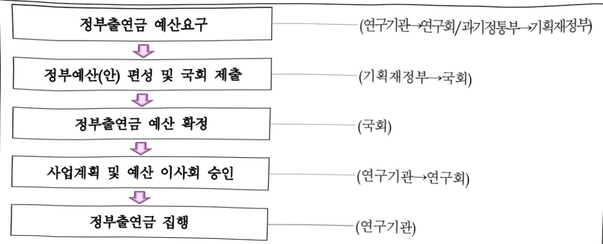

# 한국과학기술정보연구원 연구 운영비 지원(R&D)

**해당 페이지**: PDF 1608 ~ 1621 쪽 해당

**부처**: 과학기술정보통신부
**분야**: 과학기술
**회계유형**: 일반회계
**2026 확정예산**: 112476.0 백만원
**전년대비 증감률**: 9.2%
**AI 도메인**: R&D 지원

---

<table border=1 style='margin: auto; word-wrap: break-word;'><tr><td style='text-align: center; word-wrap: break-word;'>사 업 명</td></tr><tr><td style='text-align: center; word-wrap: break-word;'>(230) 한국과학기술정보연구원 연구 운영비 지원(R&amp;D) (2241-411)</td></tr></table>

## ☐ 사업 코드 정보

<table border=1 style='margin: auto; word-wrap: break-word;'><tr><td style='text-align: center; word-wrap: break-word;'>구분</td><td style='text-align: center; word-wrap: break-word;'>회계</td><td style='text-align: center; word-wrap: break-word;'>소관</td><td style='text-align: center; word-wrap: break-word;'>실국(기관)</td><td style='text-align: center; word-wrap: break-word;'>계정</td><td style='text-align: center; word-wrap: break-word;'>분야</td><td style='text-align: center; word-wrap: break-word;'>부문</td></tr><tr><td style='text-align: center; word-wrap: break-word;'>코드</td><td rowspan="2">일반회계</td><td rowspan="2">과학기술정보통신부</td><td rowspan="2">연구개발정책실기초원천연구정책관</td><td rowspan="2">-</td><td style='text-align: center; word-wrap: break-word;'>150</td><td style='text-align: center; word-wrap: break-word;'>152</td></tr><tr><td style='text-align: center; word-wrap: break-word;'>명칭</td><td style='text-align: center; word-wrap: break-word;'>과학기술</td><td style='text-align: center; word-wrap: break-word;'>과학기술연구지원</td></tr></table>

<table border=1 style='margin: auto; word-wrap: break-word;'><tr><td style='text-align: center; word-wrap: break-word;'>구분</td><td style='text-align: center; word-wrap: break-word;'>프로그램</td><td style='text-align: center; word-wrap: break-word;'>단위사업</td><td style='text-align: center; word-wrap: break-word;'>세부사업</td></tr><tr><td style='text-align: center; word-wrap: break-word;'>코드</td><td style='text-align: center; word-wrap: break-word;'>2200</td><td style='text-align: center; word-wrap: break-word;'>2241</td><td style='text-align: center; word-wrap: break-word;'>411</td></tr><tr><td style='text-align: center; word-wrap: break-word;'>명칭</td><td style='text-align: center; word-wrap: break-word;'>출연연구기관지원</td><td style='text-align: center; word-wrap: break-word;'>국가과학기술연구회 소관출연연구기관지원</td><td style='text-align: center; word-wrap: break-word;'>한국과학기술정보연구원 연구 운영비 지원(R&amp;D)</td></tr></table>

<table border=1 style='margin: auto; word-wrap: break-word;'><tr><td colspan="6">☐ 사업 성격 (공통요구자료 II-1 작성유의사항 4. 참조, 해당하는 사항에 “○” 표시)</td></tr><tr><td style='text-align: center; word-wrap: break-word;'>신규 계속</td><td style='text-align: center; word-wrap: break-word;'>완료</td><td style='text-align: center; word-wrap: break-word;'>예비타당성 실시여부</td><td style='text-align: center; word-wrap: break-word;'>총사업비 관리대상</td><td style='text-align: center; word-wrap: break-word;'>총액계상 예산사업</td><td style='text-align: center; word-wrap: break-word;'>사업소관 변경정보 2025예산 시 소관</td></tr><tr><td style='text-align: center; word-wrap: break-word;'></td><td style='text-align: center; word-wrap: break-word;'>☐</td><td style='text-align: center; word-wrap: break-word;'></td><td style='text-align: center; word-wrap: break-word;'></td><td style='text-align: center; word-wrap: break-word;'></td><td style='text-align: center; word-wrap: break-word;'></td></tr></table>

사업지원형태 및 지원을(최소한 한 개는 반드시 선택하시오. 해당사항에 O 표시)

<table border=1 style='margin: auto; word-wrap: break-word;'><tr><td style='text-align: center; word-wrap: break-word;'>직접</td><td style='text-align: center; word-wrap: break-word;'>출자</td><td style='text-align: center; word-wrap: break-word;'>출연</td><td style='text-align: center; word-wrap: break-word;'>보조</td><td style='text-align: center; word-wrap: break-word;'>융자</td><td style='text-align: center; word-wrap: break-word;'>국고보조율(%)</td><td style='text-align: center; word-wrap: break-word;'>융자율(%)</td></tr><tr><td style='text-align: center; word-wrap: break-word;'></td><td style='text-align: center; word-wrap: break-word;'></td><td style='text-align: center; word-wrap: break-word;'>○</td><td style='text-align: center; word-wrap: break-word;'></td><td style='text-align: center; word-wrap: break-word;'></td><td style='text-align: center; word-wrap: break-word;'></td><td style='text-align: center; word-wrap: break-word;'></td></tr></table>

## 사업 소관부처 및 시행주체

<table border=1 style='margin: auto; word-wrap: break-word;'><tr><td style='text-align: center; word-wrap: break-word;'>사업명</td><td colspan="2">구분</td></tr><tr><td rowspan="2">한국과학기술정보연구원연구 운영비지원(R&amp;D)(2241-411)</td><td style='text-align: center; word-wrap: break-word;'>소관부처</td><td style='text-align: center; word-wrap: break-word;'>연구개발정책실기초원천연구정책관연구기관혁신정책과</td></tr><tr><td style='text-align: center; word-wrap: break-word;'>사업시행주체</td><td style='text-align: center; word-wrap: break-word;'>한국과학기술정보연구원</td></tr></table>

---

### 가. 예산 총괄표

(단위: 백만원, %)

<table border=1 style='margin: auto; word-wrap: break-word;'><tr><td rowspan="2">사업명</td><td rowspan="2">2024년 결산</td><td colspan="2">2025년 예산</td><td colspan="2">2026년 예산</td><td rowspan="2">중감(B-A)</td><td rowspan="2">(B-A)/A</td></tr><tr><td style='text-align: center; word-wrap: break-word;'>본예산</td><td style='text-align: center; word-wrap: break-word;'>추경*(A)</td><td style='text-align: center; word-wrap: break-word;'>요구안</td><td style='text-align: center; word-wrap: break-word;'>본예산(B)</td></tr><tr><td style='text-align: center; word-wrap: break-word;'>한국과학기술정보연구원 연구 운영비 지원(R&amp;D)(2241-411)</td><td style='text-align: center; word-wrap: break-word;'>90,276</td><td style='text-align: center; word-wrap: break-word;'>102,966</td><td style='text-align: center; word-wrap: break-word;'>102,966</td><td style='text-align: center; word-wrap: break-word;'>112,476</td><td style='text-align: center; word-wrap: break-word;'>112,476</td><td style='text-align: center; word-wrap: break-word;'>9,510</td><td style='text-align: center; word-wrap: break-word;'>9.2</td></tr></table>

* 추경: 추경증감액을 포함한 최종 예산액을 기재

## □ 기능별(내역사업별) 예산 내역

(단위:백만원)

<table border=1 style='margin: auto; word-wrap: break-word;'><tr><td rowspan="2"></td><td colspan="5">2024</td><td colspan="5">2025</td><td rowspan="2">2026예산</td></tr><tr><td style='text-align: center; word-wrap: break-word;'>예산액(추정)</td><td style='text-align: center; word-wrap: break-word;'>예산현액</td><td style='text-align: center; word-wrap: break-word;'>집행액</td><td style='text-align: center; word-wrap: break-word;'>이월액</td><td style='text-align: center; word-wrap: break-word;'>불용액</td><td style='text-align: center; word-wrap: break-word;'>예산액(추정)</td><td style='text-align: center; word-wrap: break-word;'>예산현액</td><td style='text-align: center; word-wrap: break-word;'>집행액</td><td style='text-align: center; word-wrap: break-word;'>이월액</td><td style='text-align: center; word-wrap: break-word;'>불용액</td></tr><tr><td style='text-align: center; word-wrap: break-word;'>○ 기능별 분류(함께)</td><td style='text-align: center; word-wrap: break-word;'>91,758</td><td style='text-align: center; word-wrap: break-word;'>91,758</td><td style='text-align: center; word-wrap: break-word;'>90,276</td><td style='text-align: center; word-wrap: break-word;'>-</td><td style='text-align: center; word-wrap: break-word;'>1,482</td><td style='text-align: center; word-wrap: break-word;'>102,966</td><td style='text-align: center; word-wrap: break-word;'>102,966</td><td style='text-align: center; word-wrap: break-word;'>101,782</td><td style='text-align: center; word-wrap: break-word;'>-</td><td style='text-align: center; word-wrap: break-word;'>1,184</td><td style='text-align: center; word-wrap: break-word;'>112,476</td></tr><tr><td style='text-align: center; word-wrap: break-word;'>· 기관운영비</td><td style='text-align: center; word-wrap: break-word;'>40,043</td><td style='text-align: center; word-wrap: break-word;'>40,043</td><td style='text-align: center; word-wrap: break-word;'>38,561</td><td style='text-align: center; word-wrap: break-word;'>-</td><td style='text-align: center; word-wrap: break-word;'>1,482</td><td style='text-align: center; word-wrap: break-word;'>41,125</td><td style='text-align: center; word-wrap: break-word;'>41,125</td><td style='text-align: center; word-wrap: break-word;'>39,941</td><td style='text-align: center; word-wrap: break-word;'>-</td><td style='text-align: center; word-wrap: break-word;'>1,184</td><td style='text-align: center; word-wrap: break-word;'>42,469</td></tr><tr><td style='text-align: center; word-wrap: break-word;'>· 주요사업비</td><td style='text-align: center; word-wrap: break-word;'>51,715</td><td style='text-align: center; word-wrap: break-word;'>51,715</td><td style='text-align: center; word-wrap: break-word;'>51,715</td><td style='text-align: center; word-wrap: break-word;'>-</td><td style='text-align: center; word-wrap: break-word;'>-</td><td style='text-align: center; word-wrap: break-word;'>61,841</td><td style='text-align: center; word-wrap: break-word;'>61,841</td><td style='text-align: center; word-wrap: break-word;'>61,841</td><td style='text-align: center; word-wrap: break-word;'>-</td><td style='text-align: center; word-wrap: break-word;'>-</td><td style='text-align: center; word-wrap: break-word;'>70,007</td></tr></table>

### 나. 사업설명자료

## 1 ) 사업목적·내용

(한국과학기술정보연구원 연구 운영비 지원(R&D))

- 과학·기술 및 이와 관련된 산업정보의 종합적인 수집·분석·서비스

- 정보의 관리 및 유통에 관한 기술·정책·표준화 등의 전문적인 조사·연구

- 과학 및 산업기술 연구개발 인프라의 체계적인 구축·운영

⇒ 국가 과학기술 진흥과 산업의 발전에 기여(정관 제1조)

- 내역사업별 설명

(인건비) 국가과학·기술지식정보 분야 전문연구기관으로서 기관 고유사업 수행에 필요한 인건비 실소요액 지원

(경상경비) 국가과학·기술지식정보 분야 전문연구기관으로서 기관 고유사업 수행에 필요한 경상운영비 실소요액 지원

---

(컴퓨팅인프라 구축 및 운영) 세계적 수준의 국가R&D 인프라 구축 및 운영을 통한 첨단 연구 지원(데이터플랫폼인프라 구축 및 운영) 국가 핵심 과학기술정보·데이터의 전략적 구축 및 공유·활용 체계 완성

(고유임무 기반 국민체감형 R&D) HPC·데이터 기반의 국가·사회 현안을 직접적으로 해결할 수 있는 솔루션 개발을 통해 국민의 안전하고 행복한 삶 증진에 기여 및 공공기술의 기술산업화 지원을 통한 산·학·연 동반성장 창출

(장비구입비) 주요연구장비의 체계적 도입을 통한 R&D예산 투자효율성 확보 및 관리체계 고도화

(AI-화이트해커 기반 해킹제로 시스템 개발)선제적·능동적 국가 사이버안보 체계 구축을 위한 「AI-사이버트원·화이트해커·프로파일러」 기술 확보

(생활하수 활용 질병 AI 조기경보 개발)유행성 질병 AI 조기경보를 위한「온-디바이스상시 검출기 및 질병 AI 예측/분석 플랫폼 개발」을 통해 안전한 국민 생활환경 조성 및 신산업 창출

(차세대 유무선통신 통합 게이트웨이 개발)소프트웨어 정의 유무선 X-Gateway 시스템 개발과 국산화를 통한 세계적 수준의 성능 지표 달성과 국가 선도산업 창출 및 경제적 가치 증대

## 2 ) 사업개요

## ☐ 사업근거 및 추진경위

① 법령상 근거 및 조항 적시

- 과학기술분야 정부출연연구기관등의 설립 및 육성에 관한 법률 제5조

· 제5조(운영재원) ① 연구기관 및 연구회는 정부의 출연금과 그 밖의 수익금으로 운영한다.

② 정부는 연구기관 및 연구회의 설립·운영에 드는 경비에 충당하기 위하여 예산의 범위에서 연구기관 및 연구회에 출연금을 지급할 수 있다. 이 경우 정부는 연구기관 및 연구회의 지속적이고 안정적인 운영을 위하여 필요한 재원이 마련될 수 있도록 노력하여야 한다.

③ 지방자치단체의 요청에 따라 연구기관 및 연구회가 해당 지방자치단체에 지역조직을 설립 · 운영할 경우 지방자치단체는 이에 필요한 경비에 충당하기 위하여 예산의 범위에서 연구기관 및 연구회에 출연금을 지급할 수 있다.

## - 과학기술기본법 제26조 및 동법 시행령 제40조

과학기술기본법 제26조(과학기술지식·정보 등의 관리·유통) ①정부는

---

과학기술 및 국가연구개발사업 관련 지식·정보의 생산·유통·관리 및 활용을 촉진할 수 있도록 다음 각 호의 시책을 세우고 추진하여야 한다.

1. 과학기술 및 국가연구개발사업 관련 지식·정보의 수집·분석·가공 및 데이터베이스의 구축

2. 과학기술 및 국가연구개발사업 관련 지식 · 정보망의 구축 및 운영

3. 과학기술 및 국가연구개발사업 관련 지식 · 정보의 관리 · 유통기관의 육성 등

② 정부는 과학기술 및 국가연구개발사업 관련 지식·정보가 원활하게 관리·유통될 수 있도록 지식재산권 보호제도 등 지식가치를 평가하고 보호하는 데에 필요한 시책을 세우고 추진하여야 한다.

③ 정부는 제1항의 과학기술 및 국가연구개발사업 관련 지식 · 정보를 효율적으로 관리 · 유통하기 위하여 필요하면 대통령령으로 정하는 바에 따라 이를 지원할 기관을 지정하고 그 운영에 필요한 경비를 지원할 수 있다.

## · 과학기술기본법 시행령 제40조(과학기술지식·정보 등의 곽리·유통체제 구축 등)

(과학기술지식·정보 등의 관리·유통체제 구축 등)

① 법 제26조제1항에 따른 과학기술 및 국가연구개발사업 관련 지식·정보의 생산·유통·관리 및 활용의 대상에는 과학기술 분야 국내외 수집정보, 학술지, 논문, 국가연구개발사업 관련 과제 및 연구성과·평가·조정정보, 기술·산업정보, 특허정보, 연구개발 인력·시설·장비정보, 기술이전·실용화정보 및 기술창업정보 등을 포함한다.

② 과학기술정보통신부장관은 「지능정보화 기본법」 제7조에 따른 지능정보사회 실행계획의 과학기술부문계획에 따른 시책을 반영하여 추진해야 한다.

③ 과학기술정보통신부장관은 과학기술 및 국가연구개발사업 관련 지식·정보의 효율적인 관리·유통을 위하여 중앙행정기관의 장, 지방자치단체의 장, 기업·교육기관·연구기관의 장 및 과학기술 관련 기관·단체의 장에게 필요한 자료의 제출을 요청할 수 있다.

④ 관계 중앙행정기관의 장은 소관 분야에 대한 과학기술 및 국가연구개발사업 관련 지식·정보의 가치가 평가되고 이들 지식·정보가 적절하게 보호받을 수 있도록 필요한 조치를 마련하여야 한다.

⑤ 법 제26조제3항에 따른 지원기관(이하 이 조 및 제41조에서 “지원기관”이라 한다)은 「과학기술분야 정부출연연구기관 등의 설립 · 운영 및 육성에 관한 법률」에 따라 설립된 한국과학기술정보연구원(이하 “한국과학기술정보연구원”이라 한다)으로 한다. 다만, 과학기술정보통신부장관은 법 제12조에 따른 국가연구개발사업 조사 · 분석 · 평가결과 및 법 제12조의2제5항제3호에 따른 국가연구개발사업 예산의 배분 · 조정 관련 정보, 연구개발 시설 · 장비정보, 산업정보, 기술이전정보, 특허정보, 기상정보, 원자력정보 등 별도의 전문기관에서 관리 · 유통하는 것이 효율적이라고 판단되는 정보 분야에 대해서는 관계 중앙행정기관의 장과 협의하여 제26조제3항

---

각 호의 어느 하나에 해당하는 기관, 법인 또는 단체나 연구개발사업의 기획관리를 전문으로 하는 기관 중에서 따로 지원기관을 지정할 수 있다.

⑥ 과학기술정보통신부장관은 제5항 단서에 따라 지원기관을 지정하였을 때에는 다음 각 호의 사항을 관보에 공고하여야 한다.

1. 지원기관의 명칭과 주소

2. 지정연월일 및 지정기간

3. 지원업무의 종류 및 범위

⑦ 지원기관의 장은 과학기술 및 국가연구개발사업 관련 지식·정보의 관리·유통에 관한 그 해 사업계획 및 자금집행계획과 지난해 실적을 매년 1월 31일까지 과학기술정보통신부장관에게 제출하여야 한다.

⑧ 법 제26조제3항에 따라 한국과학기술정보연구원이 지원할 업무는 다음 각 호와 같다.

국내외 과학기술 관련 지식·정보의 종합적인 수집 및 분석

2. 과학기술 관련 지식·정보 관련 데이터베이스의 구축·연계 및 공동활용

3. 과학기술 관련 지식 · 정보 유통체계 및 종합관리시스템 구축

4. 과학기술 관련 지식·정보 공동활용을 위한 표준화

5. 과학기술 관련 지식 · 정보의 관리 · 유통을 촉진하기 위한 중합시책 및 계획의 수립 지원

6. 그 밖에 과학기술정보화 촉진을 위하여 필요한 사항

⑨ 지원기관의 장은 매 분기 마지막 달의 다음 달 10일까지 지정받은 업무의 추진실적을 과학기술정보통신부장관에게 제출하여야 한다.

## - 국가초고성능컴퓨터 활용 및 육성에 관한 법률 제9조 및 시행령 제11조

## ·국가초고성능컴퓨터 활용 및 육성에 관한 법률 제9조(국가초고성능컴퓨팅센터)

① 정부는 국가초고성능컴퓨팅의 육성과 그 활용을 촉진하기 위하여 대통령령으로 정하는 바에 따라 국가초고성능컴퓨팅센터를 설립 또는 지정할 수 있다.

③ 국가초고성능컴퓨팅센터는 다음 각 호의 사업을 한다.

1. 제7조제2항제1호에 따라 위원회가 심의하는 기본계획의 수립·변경과 이에 따른 중요 정책의 수립 및 그 집행의 조정에 대한 지원

2. 제7조제2항제6호에 따라 위원회가 심의하는 인력 개발 및 교류에 관한 기본

계획과 이에 따른 중요 정책, 인력활용지침의 수립 및 집행의 조정에 대한 지원

3. 제12조제2항에 따른 초고성능컴퓨팅 분야에 관한 인력수급전망

4. 국가 소요 초고성능컴퓨팅자원 수요 예측

5. 세계적 수준의 초고성능컴퓨팅자원 확보 및 운용

6.산학연협력을 통한 국가초고성능컴퓨팅 연구개발 수행

---

7. 초고성능컴퓨팅자원 연동기술 지원 및 초고성능컴퓨팅자원 공동활용 관리

8. 첨단연구망의 관리 및 운영

9. 초고성능컴퓨팅 관련 기반·응용 연구 및 연구결과 보급

10. 초고성능컴퓨팅 관련 전문인력의 양성 · 교육훈련 및 기술지원

11. 초고성능컴퓨팅 관련 기술정보 수집 및 보급

12. 초고성능컴퓨팅 관련 국제협력업무 수행

13. 초고성능컴퓨팅 국내외 동향조사 및 활성화방안 등 정책연구

14. 그 밖에 초고성능컴퓨팅 관련 업무

④ 국가초고성능컴퓨팅센터는 제3항에 따른 사업의 추진실적을 대통령령으로 정하는 바에 따라 매년 과학기술정보통신부장관에게 제출하고, 과학기술정보통신부장관은 추진실적을 점검하여야 한다.

⑤ 정부는 제1항에 따라 설립 또는 지정된 국가초고성능컴퓨팅센터의 운영에 필요한 경비의 전부 또는 일부를 지원할 수 있다

## ·국가초고성능컴퓨터 활용 및 육성에 관한 법률 시행령 제11조(국가센터 지정 등)

① 과학기술정보통신부장관은 법 제9조제1항에 따라 「과학기술분야 정부출연연구기관 등의 설립·운영 및 육성에 관한 법률」에 따라 설립된 한국과학기술정보연구원을 국가센터로 지정한다.

② 국가센터는 법 제9조제4항에 따라 전년도 사업 추진실적을 매년 1월 15일까지 과학기술정보통신부장관에게 제출하여야 한다.

③ 국가센터의 운영에 필요한 세부 사항은 관계 중앙행정기관의 장과의 협의를 거쳐 과학기술정보통신부장관이 정한다.

## ② 추진경위

- '62. 01 : 한국과학기술정보센터(KORSTIC) 설립

- '01. 01 : 한국과학기술정보연구원(KISTI) 설립

- '01. 07 : 과학기술정보의 관리 · 유통체제 구축 전담기관 지정

- '05. 03 : 과학기술정보보호센터 개소

- '05. 10 : 국가과학기술종합정보시스템(NTIS) 구축 총괄 주관기관 선정

- '10. 09 : 글로벌대용량실험데이터허브센터 개소

- '11. 12 : 국가초고속컴퓨팅센터 지정

- '13. 01 : 국가슈퍼컴퓨팅연구소 개소

- '18. 12 : 슈퍼컴퓨터 5호기(누리온) 공식 서비스

---

## 주요내용

① 사업규모

- 총사업비 : 해당없음

- 사업기간 : 2001년 ~ 계속

- 최근 5년 간 투입된 사업비(예산액기준, 추경편성한 연도에는 추경포함)

<table border=1 style='margin: auto; word-wrap: break-word;'><tr><td style='text-align: center; word-wrap: break-word;'>연도</td><td style='text-align: center; word-wrap: break-word;'>2022</td><td style='text-align: center; word-wrap: break-word;'>2023</td><td style='text-align: center; word-wrap: break-word;'>2024</td><td style='text-align: center; word-wrap: break-word;'>2025</td><td style='text-align: center; word-wrap: break-word;'>2026</td></tr><tr><td style='text-align: center; word-wrap: break-word;'>사업비</td><td style='text-align: center; word-wrap: break-word;'>110,008</td><td style='text-align: center; word-wrap: break-word;'>107,886</td><td style='text-align: center; word-wrap: break-word;'>91,758</td><td style='text-align: center; word-wrap: break-word;'>102,966</td><td style='text-align: center; word-wrap: break-word;'>112,476</td></tr></table>

* '24년부터 시설비는 한국과학기술정보연구원 시설 지원(R&D)으로 분리 작성

## - 기타: 해당없음

## ② 사업추진체계

- 사업시행방법 : 출연

- 사업시행주체 : 한국과학기술정보연구원

- 사업 수혜자 : 산업계, 학계, 연구계 및 일반국민

- 보조, 융자, 출연, 출자 등의 경우 보조·융자 등 지원 비율 및 법적근거

<table border=1 style='margin: auto; word-wrap: break-word;'><tr><td style='text-align: center; word-wrap: break-word;'>내역사업명</td><td style='text-align: center; word-wrap: break-word;'>구분</td><td style='text-align: center; word-wrap: break-word;'>피보조·피출연 등 기관명</td><td style='text-align: center; word-wrap: break-word;'>지원 금액 (2026예산)</td><td style='text-align: center; word-wrap: break-word;'>지원 비율(%)</td><td style='text-align: center; word-wrap: break-word;'>보조율 법적근거 (해당 조항)</td></tr><tr><td style='text-align: center; word-wrap: break-word;'>한국과학기술정보연구원연구운영비지원(R&amp;D)</td><td style='text-align: center; word-wrap: break-word;'>출연</td><td style='text-align: center; word-wrap: break-word;'>한국과학기술정보연구원</td><td style='text-align: center; word-wrap: break-word;'>112,476</td><td style='text-align: center; word-wrap: break-word;'>100</td><td style='text-align: center; word-wrap: break-word;'>과학기술분야 정부출연연구기관등의 설립·운영 및 육성에 관한 법률 제5조</td></tr></table>

## 3 ) 2026년도 예산 산출 근거

(1) 인건비 : ('25) 38,625백만원 → ('26) 39,977백만원, 1,352백만원 증액 - (요구) 정규직 처우개선(3.5%) 반영하여 전년대비 +3.5% 증액 - (산출) 정규직 처우개선 (1,352백만원)

* 38,625백만원 × 처우개선율 3.5% = 1,352백만원

(2) 경상비 : (25) 2,500백만원 → (26) 2,492백만원, △8백만원 감액

- (요구) 자회사 처우개선 및 공공요금 증가분 반영 및 경상경비 일괄감액을 반영하여 전

년대비 △8백만원 감액

- (산출) 경상비 효율화 (△58백만원)

- (산출) 자회사 처우개선 (22백만원)

* 자회사 분담금 중 인건비 1,441백만원 × 출연금 비중 43% × 처우개선율 3.5% = 22백만원

- (산출)공공요금(전기요금) 증가분(14백만원)

---

* (24년 결산 427백만원 - '23년 결산 392백만원) × '24년 결산 경상비 출연금 비중

41.0% = 14백만원

(사층)폐사비, 부 베 증가부(14백만원)

- (산출)재산세 본세 증가분(14백만원)

* '24년 결산 24백만원 - '23년 결산 10백만원 = 14백만원

(3) 주요사업비 : (25) 61,841 백만원 → (26) 70,007 백만원, 8,166 백만원 증액

- (요구) R&R 및 수입구조포트폴리오 투자 전략에 따라 국가과학·기술지식정보 분야 전문연구기관으로서 기관 고유사업 수행에 필요한 사업비 70,007백만원

- (산출) ①신규사업(3개) 필수소요 15,864백만원

②계속사업(15개)필수소요 54,143백만원

2025년도 예산 및 2026년도 예산안 산출 세부내역 비교

<table border=1 style='margin: auto; word-wrap: break-word;'><tr><td colspan="2">&#x27;25년 예산</td><td colspan="2">&#x27;26년 예산안</td></tr><tr><td style='text-align: center; word-wrap: break-word;'>예산</td><td style='text-align: center; word-wrap: break-word;'>산출내역</td><td style='text-align: center; word-wrap: break-word;'>예산</td><td style='text-align: center; word-wrap: break-word;'>산출내역</td></tr><tr><td rowspan="4">102,966</td><td style='text-align: center; word-wrap: break-word;'>○ 인건비(360-01): 38,625백만원가. 정규직 인건비(38,625백만원)  · 560명×69백만원=38,625백만원</td><td rowspan="4">112,476</td><td style='text-align: center; word-wrap: break-word;'>○ 인건비(360-01): 39,977백만원가. 정규직 인건비(38,625백만원)  · 560명×69백만원=38,625백만원나. 처우개선분(1,352백만원)  · 38,625백만원×3.5%=1,352백만원</td></tr><tr><td style='text-align: center; word-wrap: break-word;'>○ 경상비(360-02): 2,500백만원가. 경상운영비(2,500백만원)</td><td style='text-align: center; word-wrap: break-word;'>○ 경상비(360-02): 2,492백만원가. 경상운영비(2,500백만원)나. 경상비 효율화(△58백만원)다. 자회사 처우개선(22백만원)라. 공공요금 인상분(14백만원)마. 재산세 증가분(14백만원)</td></tr><tr><td style='text-align: center; word-wrap: break-word;'>○ 장비구입비(360-04): 3,528백만원가. 장비구입비(3,528백만원)  · 26대×136백만원=3,528백만원</td><td style='text-align: center; word-wrap: break-word;'>○ 장비구입비(360-04): 3,208백만원가. 장비구입비(3,208백만원)  · 43대×77백만원=3,208백만원</td></tr><tr><td style='text-align: center; word-wrap: break-word;'>○ 연구활동비 등(360-05): 58,313백만원가. 컴퓨팅인프라 구축 및 운영 (28,040백만원)  · (계속)4개×7,010백만원=28,040백만원나. 데이터플랫폼인프라 구축 및 운영 (17,182백만원)  · (계속)4개×4,296백만원=17,182백만원다. 고유임무 기반 국가전략기술 R&amp;D (7,626백만원)  · (신규)3개×2,542백만원=7,626백만원라. 고유임무 기반 국민체감형 R&amp;D (5,465백만원)  · (계속)3개×1,822백만원=5,465백만원</td><td style='text-align: center; word-wrap: break-word;'>○ 연구활동비 등(360-05): 66,799백만원가. 컴퓨팅인프라 구축 및 운영 (24,991백만원)  · (계속)4개×6,248백만원=24,991백만원나. 데이터플랫폼인프라 구축 및 운영 (15,205백만원)  · (계속)4개×3,801백만원=15,205백만원다. 고유임무 기반 국가전략기술 R&amp;D (6,473백만원)  · (계속)3개×2,158백만원=6,473백만원라. 고유임무 기반 국민체감형 R&amp;D (4,266백만원)  · (계속)3개×1,422백만원=4,266백만원마. AI-화이트해커 기반 해킹제로 시스템 개발 (6,562백만원)  · (신규)1개×6,562백만원=6,562백만원바. 생활하수 활용 질병 AI 조기경보 개발 (3,642백만원)  · (신규)1개×3,642백만원=3,642백만원사. 차세대 유무선통신 통합 게이트웨이 개발 (5,660백만원)  · (신규)1개×5,660백만원=5,660백만원</td></tr></table>

## 4 ) 사업효과

☐ 사업영향, 산출물 성과지표 등

① 2022~2026년도 성과계획서 상 성과지표 및 최근 5년간 성과 달성도 : 해당없음

② 성과지표 이외의 연도별 사업추진 경과 및 실적

---

<table border=1 style='margin: auto; word-wrap: break-word;'><tr><td style='text-align: center; word-wrap: break-word;'>2022</td><td style='text-align: center; word-wrap: break-word;'>o 오픈액세스 전환계약 및 SCOAP3를 통한 학술지 구독/출판 비용 절감(약 3,718배만원)o 국가 차원의 연구데이터 수집·공유·활용 플랫폼 구축을 통한 연구데이터 빅데이터化- 출연(연) 전문센터, 개인연구자가 보유한 연구데이터 약 3.7만 진을 수집·연계하여 공유·활용(10개 기관 연계, 파일 1,267건, 용량 2.9TB)o 과학기술 지식인프라 통합서비스 플랫폼 구축 단계 완성- 디지털 뉴딜 사업으로 구축된 1만여건의 문장요약 기계학습데이터를 논문의 연구방법, 연구과정, 연구결과 등을 요약할 수 있는 AI 모델 기반으로 학습- AI 학습모델을 활용하여 문장요약 데이터 2-3배 확보로 AI 논문요약서비스 강화o 초고성능컴퓨터 시스템 안정성 및 효율성 향상을 위한 기술연구를 통하여 원천기술 확보(SCIE)급 논문 2편)o 600PF 규모의 초고성능컴퓨터 6호기 시스템 설계- 600PF 급 이상의 이론성능을 갖춘 시스템 및 14MW급 시스템을 안정적으로 운영할 수 있는 기반시설·수배전 냉각 설비 등) 설계o 세계 최초 tapeless(디스크 기반) 대용량 아카이빙 시스템 운영(Custodial Disk Storage)- 테입 기반 아카이빙 시스템 대비 동일 가격으로 2배 이상의 경제적인 데이터 저장소 확보o 양자암호통신망 양자기관리 기술 TTA 기능성·공인검증 및 산업체 기술이전- QKD 프로토콜 응용 도청자 판단 알고과층, 양자기 확장방법 등 원천기술 확보(특허출원 5건)o 지능형 보안관제를 위한 고품질 AI/XAI 실데이터셋 구축(88백만건/100종)- 건강기술이전기준장수액(0.37억원) 대비(238%(0.85억원) 달성 및 특허출입·등록·건수·대비기술이전 실시·137% 달성o 글로벌 R&amp;D 모니터링을 위한 논문·개체 분석데이터 구축- 국내외주요·과학기술연구기관 103,638개 기반 속성정보 구축 및 W65 한국 학술문헌 기관·배정 카버리지 92.3% 달성o 국내 최초 인공지능 기반 공공R&amp;D 가치책을 모델 개발- 인공지능 기술을 활용한 공공기술기술수요자기업) 좌적화 매칭추천·모델을 개발하여 대전 테스트·파크 한국·멘트 츠진홍원과 유상 기술이전을 통해 지역 유나룬 기업 발굴 및 육성 지원o 세계적 수준의 엑사스케일 데이터 전송 가능한 테라급 초고성능 국가·과학기술연구망 인프라 확충- 전국 17개 지역망센터, 해외 4개 PoP 인프라 운영 (연구망 서비스 가용을 99.9% 달성)o 테라급 국가·과학기술연구망을 통한 거대·과학·융합연구 분야 우수 활용 성과 사례 도출- 천문우주(e-KVN), 핵융합(KSTAR), 바이오유전, 국가위성정보활용 등 4개 분야 중점 지원o 국가·시험 현보문제 해결 위한 필수·대이터 구축(40종, 19.6TB), 멀티스스·대이터 융합 및 좌적화기술 개발·수적 4종o 대국민 정보서비스 및 기관 정보화를 위한 최적의 정보시스템 구축 및 운영- 국제 수준의 정보인프라 운영 체계 인증 획득(ISO27001, ISO20000)</td></tr><tr><td style='text-align: center; word-wrap: break-word;'>2023</td><td style='text-align: center; word-wrap: break-word;'>o 출연(연) 및 해외 연구데이터를 연계공유하는 국가·연구데이터플랫폼(DataON) 운영- 과학기술 분야 내외 연구데이터 수집·제공을 통해 출연(연) 연구데이터 빅데이터化 50% 이상 실현- 해외 국가별 대표 연구데이터플랫폼(7개)과 DataON 연계o 지식인프라 기반 R&amp;D 혁신을 지원하는 지능형 융합서비스 설계 및 개발- 과학기술 정책 동향 R&amp;D 정보, 지식인프라 등을 종합적이고 다각도로 제공하는 패키징 서비스 체계 구축- 신규 API 적용, AI 기반 논문 문석 등 서비스 다변화로 과학기술 지식인프라 활용 2.41억 회 달성o 구조화된 born digital 온라인 공동저작 체계 안정화 및 전주기 오픈액세스 지원시스템 구축- 학술 커뮤니티의 오픈액세스 성숙도 향상 및 연구자·학술단체 출판비용 절감o 국가센터 초고성능컴퓨터 구축·운영 및 안정적 서비스- 시스템 가용률 99.4% 이상을 유지한 상태에서 5호기 MTIE 42.99일 달성- 6호기 적기 구축을 위한 시스템 규격서 도출 및 기반시설 설계 완료o 밀티·GPU 병렬화 슈퍼컴퓨터를 통한 난류 열유동 해석 슬버 개발- 도심풍환경변화의 실시간 시뮬레이션으로 4천만개 격사·해상도 및 4m 모델링 고효율· 고성능·분석기술 개발- 누리은 시스템 대비 6.34배 속도 향상 및 11.6배 에너지 효율로 실제 시간 대비 2.4배 빠른 도심풍시뮬레이션 기술 개발o 슈퍼컴퓨터 및 수중 영상·음과 데이터 기반 실시간 해양·생물 탐지·경보 기술 개발- 해양·생물(해파리) 인식 정확도 95% 이상 및 밀집도 분석 정확도 90% 이상 기술 개발로 원전</td></tr></table>

---

<table border=1 style='margin: auto; word-wrap: break-word;'><tr><td style='text-align: center; word-wrap: break-word;'></td><td style='text-align: center; word-wrap: break-word;'>취수구 사전 경고 시스템 구축 및 에너지 생산 효율 증대○ 인공지능(AD)을 활용한 기술 수요자(기업) 추천모델 및 공공 R&amp;D 사업화 유망성 탐색 플랫폼 APOLLO 개발- 공공 R&amp;D 매칭 정확도 87.9%, 수요기업 매칭 정확도 85.5% 수준으로 성능을 개선하고, 기술사업화 분석 알고리즘의 활용성/접근성 개선○ DX-ASTI 시스템의 고도화를 통한 자능형 가업지원 다지럴 플랫폼 구축으로 AI 실용화 출투선의 현장 맞춤형 지원- AI 맞춤형 지원으로 매출 증대 88억원 및 생산 유발 효과 177억 원 달성○ 국가과학기술연구망 인프라의 테라급 고도화를 위해 1.2테라급 백본 인프라 구성 및 국제망 전 구간 100기가급 확장- 국내외 백본 서비스 가용을 99.9% 이상 달성으로, 연구망 서비스의 안정성 · 신뢰성 향상 및 5대 거대과학 협업 연구 분야, 10개 첨단 연구 분야 연구지원○ 출연(연) 대상 국가 데이터 양자보안전송을 위한 양자암호통신 생태계 구축- 인간 유전체 정보보안 전송, 국가 위성 통합운용 · 데이터 유통, 양자 인터넷 구축연구 등을 위한 양자암호통신 시험망 구축○ XAI 기반의 침해위협 탐지모델 개발과 고품질 AI/XAI 실 데이터셋(11천만건/150종) 구축으로, 침해사고 분야 보안관제 정확도 향상 및 신속 대응 달성- 실 환경 데이터에 의한 성능 검증으로 보안관제 탑지 정확도 97.61%(세계 최고 수준: 중국 93%) 및 신속도 16분 4초(세계 최고 수준: 미국 20분) 달성</td></tr><tr><td style='text-align: center; word-wrap: break-word;'>2024</td><td style='text-align: center; word-wrap: break-word;'>○ 과학기술정보 큐레이션 시스템 고도화를 위한 AI-Human 협업 기반 고품질 자능형 데이터셋 구축(문서구조 인식 데이터 3천건 개체명 인식 데이터 2천7)○ 국가연구데이터플랫폼DataON을 통한 출연(연) 연구데이터 백데이터는 50% 이상 실현- 출연(연) 전체 26개 중 15개 기관 및 플랫폼 대상 NaRDA 보급 또는 DataON 연계○ NTIS 자동형 서비스 품질 개선 및 R&amp;D 특화 자능형 정보처리 패키지 개발로 R&amp;D 개체명 인식 기술 F1 기준 80점 달성목표치 대비 42.6% 향상 및 KoRDA/paca 등 R&amp;D특화 생성AI 모델 공개○ 최신 야기텍처 기반 야기종 시스템 28PF(누적 6.4PF) 규모 중설 및 시스템 가용률 99% 이상을 유지한 상태에서 5호기 MTH 30일 달성○ 멀타GPU 방탈화로 누리은 대비 6.4배 속도 향상 및 11.6배 에너지 효율 향상 및 실제 용산구 지형 1.5km² 영역 도심용 실시간 시범레이션 실현실제 시간 대비 2.4배 빠른 계산○ 수중 영상음과 데이터 기반 실시간 해양생물 탐지경보 기술 개발- 해양생물하띠리 인식95% 이상 밀집도90% 이상 정확도 달성 및 원전 취수구 대상 답과념 기반 해양생물 모델타링 및 밀집도 분석 SW 실증기술이전 5천만원)○ KI Cloud 인프라 운영체제 지원 및 운영 관리 도구로 KERA 활용, 운영체제 파일 압축/배포 방식 개선으로 배포 시간 88% 성능 향상○ 위터시그릴 관련모형을 4유형(양적장책과담도강화)사장성화대단성장 예측 세분화 및 Graph Convolutional Neural Network 모델 튜냐데이터 증상 기술 정교화○ Transformer 기반 공공R&amp;D 수요기업 최적함 매칭 모델 공공R&amp;D 기차장출 모델 · 시스템(APOLLO) 개발 및 과기부공공기술사업화 대표 모델 체백사범서비스 운영○ 국가전략기술분야 별 전략모델 및 6개 분야이요, 인공지능 반도체 다스롭데이 모델부터 수상 글로벌 인력지도 구축○ AI 기반 다지럴 기업지원 DX-ASTI 시스템으로 상시 수요발문 수요데이터 축적AI기반 정보서비스·성과관리 등 다지럴 기업지원 프로세스 구축○ 서울·대전 12네라담 백본 구축(아시아 최종) 및 글로벌 링형태 백데이터 전송체계 완성(세계 2번째)○ 광역권 2개 거잖뜨드 구축 및 4개 이상 연동망 연계, 교환노드 가용을 100% 달성 및 SDX 기반 핵심 기술 개발○ 양자동형암호기술 개발상극특화(미국 유럽 일본 중국 출원 및 출원연 대상 양자암호통신 시험망 구축(CCDA-KSTILKOBIC-KISTL, 항우연KISTL 등○ XAI 기반 침해위협탐지모델 개발 · 최적화 및 고품질 · 고정밀 AI/XAI 실데이터셋 구축(14.5천만건/150종), 실환경기반 XAI 의사결정자원모델 평가 · 검증○ 참수 대응 테이터 활용 요소기술 개발(4건) 및 출루선 고도화(1건 3종), 자자체 대상 출루선 활용 사례 도출(3건)○ 과학기술특화 ILM 학습 코피스(1.284.8GB) 및 자사·용담 데이터셋(2.296만건) 구축, Llam-3-70B 기반 모델 등 3종 개발 및 LogicKar 리더보드 1위 달성</td></tr><tr><td style='text-align: center; word-wrap: break-word;'>2025</td><td style='text-align: center; word-wrap: break-word;'>○ 밴치타드상위권 성능을 가진 과학기술정보 특화생성형 AI 모델과에이전트기술개발 및 기술 확산시례 도출기술이전 42년층액 3.96억원)</td></tr></table>

---

<table border=1 style='margin: auto; word-wrap: break-word;'><tr><td style='text-align: center; word-wrap: break-word;'>-4B 이하동급 크기 모델 중 한국어 영어 중합 벤치마크 최고 성능 달성 KON 활용 기술 기술이전 121 LLMps 플랫폼 기술 기술이전 2건 LLM 기반 PC 설치형 문서 분석 · 검색 에이전트 DCREA 기술이전 1건</td></tr><tr><td style='text-align: center; word-wrap: break-word;'>o AI · HPC 컴퓨팅 환경에 적용할 수 있는 차세대 CXL Memory 가상화 관리 기술 개발</td></tr><tr><td style='text-align: center; word-wrap: break-word;'>o NSQ 환경에서 활용할 수 있는 Real-Scale 나노소재 및 소자계산에 필요한 양자 Algorithm 개발</td></tr><tr><td style='text-align: center; word-wrap: break-word;'>-기준대비 항상된 효율성 및 성능을 가진 다치원 푸이송 방정식 계산을 위한 벤치마크 양자 Algorithm 및 소재 해결로 인의 고유치 계산을 위한 양자 Algorithm 개발</td></tr><tr><td style='text-align: center; word-wrap: break-word;'>o HPC/AI 기반 도시참수 현안해결을 위한 한인대응 기술실증 및 자치체(전북도) 자율운영 적용 사례 도출</td></tr><tr><td style='text-align: center; word-wrap: break-word;'>-HPC 기반 시뮬레이션과 현장 데이터를 유합한 솔루션 개발 및 AI 기반 기술 적용을 통해 예측 정확도 15-25% 수준 개선 현업 대응 효율 20% 개선</td></tr><tr><td style='text-align: center; word-wrap: break-word;'>o 세계 10위권 성능(600PF)의 국가센터 초고성능컴퓨터6호기 시스템 선정 및 기반 시설 구축 5호기 누리온 가동률 99.4%률 유지하면서 MITI 40일 이상 달성</td></tr><tr><td style='text-align: center; word-wrap: break-word;'>o 기존대비 계산 속도 10배 항상 및 정확도 99.9% 확보 가능한 찬체물리 다중유체 유동 해석을 위한 이기종 시스템 기반 초정밀 · 고맹렬 솔버 개발</td></tr><tr><td style='text-align: center; word-wrap: break-word;'>o AI 기반 데이터 생성 · 구축 · 연계 기술 개발을 통해 AI-Human 협업 기반 멀티모달 데이터 구축 체계 마련</td></tr><tr><td style='text-align: center; word-wrap: break-word;'>o 논문 · 데이터 추천 주제 분류 · 의미 검색 AI 기술 개발 자능형 데이터 플랫폼을 위한 AI · 데이터 활용 기반 구축</td></tr><tr><td style='text-align: center; word-wrap: break-word;'>o 이이더어 탐색·관련 문헌 심층·이해 문헌 분석·방향성 정립·연구주제 구체화까지 연구 기획 과정의 자능화를 지원하는 AI 기반 IdeaCN 서비스 개발</td></tr><tr><td style='text-align: center; word-wrap: break-word;'>o AI 기반 과학기술산업화 분석모델 개발 플랫폼(APOLLO) 구축 및 정책 연계와 기관 활용·확산 기반 확보</td></tr><tr><td style='text-align: center; word-wrap: break-word;'>-범부처 기술사업화 사업군 특징평가 분석도구로 체력 및 새정부·공공연구·성과·확산·정책 이행을 위한 공식 플랫폼으로 체력</td></tr><tr><td style='text-align: center; word-wrap: break-word;'>o 12개 패릴리기업에 대한 기업수요 및 AI 기반 하이브리드 R&amp;D 전주기 지원을 통해 매출 증가 234억 원(KISSI 가져옮 23.8%), 일자리 304명 창출</td></tr><tr><td style='text-align: center; word-wrap: break-word;'>o 한국 주요 연구기관과 글로벌 주요국의 리아이덴 랭킹 기반 과학기술 스스로어보드 확대 구축 및 정식 공개</td></tr><tr><td style='text-align: center; word-wrap: break-word;'>- 전세계 주요 대화기관 대상인 리아이덴 랭킹을 한국의 주요 연구기관(359개) 및 OECD 포함 주요 45개국에 확대 적용</td></tr><tr><td style='text-align: center; word-wrap: break-word;'>o 다양한 종류의 텍스트 비대이야에 대해 연구일일별 다양한 시간적 해상도 분석이 가능한 위크시그널 자동팀지 시스템 K-WE6 화장형 통합모델 개발</td></tr><tr><td style='text-align: center; word-wrap: break-word;'>o 보안위험 차단 및 가용률 향상을 위한 국내 최초 라우팅인증 도입 중부권 데이터교환노드 구축 및 SDX 기술적용을 통한 장애 최소화경로변경시간 80% 이상 단축 등을 통해 테라딥 과학기술연구망 서비스가용률 99.9998% 이상 달성</td></tr><tr><td style='text-align: center; word-wrap: break-word;'>- 안정적 운영을 기반으로 첨단연구지원 프로그램을 통한 SCIE급 논문 유발 151건(규교신저자) 발생</td></tr><tr><td style='text-align: center; word-wrap: break-word;'>o 미세중력 측정 동아시아 국제협력연구(ENGMA, 한국일본중국대인이 참여하는 초전도 미세중력계 관측 네트워크의 데이터 통합 관리 및 실시간 공유/분석이 가능한 데이터허브 구축</td></tr><tr><td style='text-align: center; word-wrap: break-word;'>o 대규모 고품질 보안원제 실태이녀셋 구축(16천만건180종) 및 설명가능 AI 기반의 보안원제 자동화 플랫폼 실환경 검증</td></tr><tr><td style='text-align: center; word-wrap: break-word;'>o 양지임호기술 연구망 적용을 위한 지능형 양자기 랄데이 기술 개발 및 양자임호기반 국가연구 인프라 연동 시스템 검증</td></tr><tr><td style='text-align: center; word-wrap: break-word;'>- 삼극특히 출원 이사야 유일 이기종 양자임호통신망 연동기술 시연 국가공인인증기관 연동기능 검증 완료</td></tr></table>

## ③ 향후(2026년도 이후) 기대효과 : 개조식으로 작성, 건 별로 계량적 수치 제시

<table border=1 style='margin: auto; word-wrap: break-word;'><tr><td style='text-align: center; word-wrap: break-word;'>전략목표</td><td style='text-align: center; word-wrap: break-word;'>성과목표</td><td style='text-align: center; word-wrap: break-word;'>주요달성 목표</td></tr><tr><td rowspan="3">1.국가 오픈사이언스 생태계 활성화를 위한 과학기술 분야 디지털 전환 지원 체계 마련</td><td style='text-align: center; word-wrap: break-word;'>1-1.과학기술정보 구축·공유 체제의 디지털 전환</td><td style='text-align: center; word-wrap: break-word;'>· 과학기술정보 디지털 큐레이션 성숙도 &quot;성숙&quot; 단계 도달 · AI 기술 활용으로 과학기술정보의 수집·구축 및 외부 AI 플랫폼의 정보 발견·접근·활용 가능 고도화 큐레이션 체계 확립</td></tr><tr><td style='text-align: center; word-wrap: break-word;'>1-2.클라우드 기반의 국가 연구데이터 공유·활용 활성화</td><td style='text-align: center; word-wrap: break-word;'>· 출연(연) 연구데이터 100% 빅데이터화 달성 및 AI 기반 연구데이터 큐레이션 서비스 제공 · 지능형 데이터 플랫폼 구축을 통한 R&amp;D 혁신 및 데이터 기반 연구개발 생산성 강화</td></tr><tr><td style='text-align: center; word-wrap: break-word;'>1-3.지능형 통합서비스 플랫폼으로 오픈사이언스 서비스 강화</td><td style='text-align: center; word-wrap: break-word;'>· 지식인프라 고수준 연계·용합으로 과학기술데이터 중심 AI 기술 개발 및 서비스 지능화를 통한 R&amp;D 활동 혁신 · 빅데이터 기반 수요자 중심 지능형 NTIS 서비스 체계 구축 및 국가 차원의 데이터·AI 기반 R&amp;D 연구환경 지원 강화</td></tr><tr><td style='text-align: center; word-wrap: break-word;'>2.국가 초고성능컴퓨팅 생태계</td><td style='text-align: center; word-wrap: break-word;'>2-1.초고성능컴퓨팅 인프라 및 서</td><td style='text-align: center; word-wrap: break-word;'>· 초거대 계산과학·인공지능 분야 컴퓨팅 수요 대응을 위한 세계 10위권</td></tr></table>

---

<table border=1 style='margin: auto; word-wrap: break-word;'><tr><td rowspan="3">선도를 위한 미래대응 초고성능컴퓨팅 공동활용 환경 구축</td><td style='text-align: center; word-wrap: break-word;'>비스 체계 고도화</td><td style='text-align: center; word-wrap: break-word;'>성능(600PF)의 국가센터 초고성능컴퓨터 6호기 구축 • 테라급 과학기술연구망/데이터교환노드 안정적 운영을 통한 서비스 가용률 99.9% 이상 달성 및 양자암호통신 서비스 제공</td></tr><tr><td style='text-align: center; word-wrap: break-word;'>2-2.과학·공학 및 산업·공공 분야 초고성능컴퓨팅 기반 거대문제 해결</td><td style='text-align: center; word-wrap: break-word;'>• 거대문제해결 능력 확보 및 액사스케일급 컴퓨터용 프리엑사 규모 병렬화 라이브러리/솔버 개발 • 천체물리 다중유체 유동 해석을 위한 이기종 시스템 기반 초정밀/고병렬 솔버 개발</td></tr><tr><td style='text-align: center; word-wrap: break-word;'>2-3. 초고성능컴퓨팅 공동활용 환경 구축</td><td style='text-align: center; word-wrap: break-word;'>• 엑사스케일급 국가 초고성능컴퓨팅 공동활용 서비스 전환 체계 마련 • 인공지능 기반 위협 탐지·분석 자동화 원천기술 개발 및 세계 최고 수준의 지능형 보안체계 구축</td></tr><tr><td rowspan="3">3. 국가 과학기술혁신 생태계 활성화를 위한 지능형 데이터 융합분석 체계 구축</td><td style='text-align: center; word-wrap: break-word;'>3-1.과학기술·산업융합분석·모델 개발 및 인사이트 제공</td><td style='text-align: center; word-wrap: break-word;'>• 글로벌 수준의 분석데이터 활용사례 창출 및 데이터 기반 의사결정 적시대응 리포팅 체제 확보 • 과학기술의 혁신적 발견과 글로벌 사회이슈 해결 지원을 위한 AI협업 기반 수요대응 미래 분석 및 예측 체계 개발</td></tr><tr><td style='text-align: center; word-wrap: break-word;'>3-2.국가R&amp;D 가치창출 지원 지능형 R&amp;BD 분석 플랫폼 구축</td><td style='text-align: center; word-wrap: break-word;'>• 지능형 과학기술산업화 생태계 구축을 위한 AI 기반 과학기술산업화 분석모델 및 플랫폼 개발 • 분석 플랫폼 기반 온-오프라인 연계 및 활용 사례 창출로 공공·민간 R&amp;BD 지원 체제 확립</td></tr><tr><td style='text-align: center; word-wrap: break-word;'>3-3.수요대응형 지역혁신 생태계 지원체제 구축 및 활성화</td><td style='text-align: center; word-wrap: break-word;'>• 지원기업의 경제적, 기술적, 사회적 성과 창출(매출증가 200억원, R&amp;D과제 유발 200억원, 일자리 창출 200명) • 지능화 협업생태계를 통한 AI 실용화 솔루션 활용·확산으로 생산유발 효과 177억원 달성</td></tr><tr><td rowspan="2">4.국가·사회 현안 적시대응 해결을 위한 Data/AI 기반 디지털 전환 체계 구축</td><td style='text-align: center; word-wrap: break-word;'>4-1. 과학기술 데이터 댐 구축 및 활용체계 마련</td><td style='text-align: center; word-wrap: break-word;'>• 과학기술 AI 데이터 20종 및 AI 활용 모델 50건 누적 제공으로 R&amp;D 성과 창출 기반 마련 • 국가전략 분야 데이터 대규모(고에너지물리 1,200만건, 암유전체 20만건)확보</td></tr><tr><td style='text-align: center; word-wrap: break-word;'>4-2. 디지털 전환 기반 국가·사회 현안 해결 및 혁신사례 창출</td><td style='text-align: center; word-wrap: break-word;'>• 국가사회 현안해결 지원을 위한 HPC/AI기반 모듈형 플랫폼 구축을 통한 국가사회 현안 해결 지원 • 개방형 협업을 통한 지역R&amp;D 활성화를 통해 AI·데이터 기반 지역혁안 대응 협력사례 3건 발굴</td></tr></table>

## 5 ) 타당성조사 및 예비타당성조사 시행여부 및 결과 요지 : 해당없음

☐ 타당성조사 보고서가 있는 경우는 편익/비용을 중심으로 내용을 요약제시(보고서 제목, 작성자(기관), 작성일 명시)

□ 총사업비 500억원 이상인 경우 예비타당성조사 시행유무 및 그 결과요지 기재

□ 시행하지 않은 경우 그 이유를 적시

## 6 ) 총사업비 대상사업 정보 : 해당없음

---

## 7 ) 사업 집행절차

° 예산(안) 편성지침 및 기준 통보 (기획재정부)

° 기관 예산요구서 제출 (한국과학기술연구원 → 국가과학기술연구회)

이사회 심의 · 의결 · 제출 (국가과학기술연구회 → 과학기술정보통신부)

° 부처 예산요구서 제출 (과학기술정보통신부 → 국가과학기술자문회의, 기획재정부)

°국가과학기술자문회의 R&D 사전조정 및 결과통보 (자문회의 → 기획재정부)

° 정부예산(안) 국회 제출 (기획재정부 → 국회)

○ 정부예산 확정 (국회) 및 사업계획 및 예산(안) 이사회 승인

## 8 ) 각종 평가 : 해당없음

### 다. 최근 4년간 결산내역

## 1 ) 결산표

☐ 부처 결산내역

(단위: 백만원, %)

<table border=1 style='margin: auto; word-wrap: break-word;'><tr><td rowspan="2">연도</td><td colspan="3">예산액</td><td rowspan="2">예산현액(A)</td><td rowspan="2">집행액(B)</td><td rowspan="2">집행률(B/A)</td><td rowspan="2">다음연도이월액</td><td rowspan="2">불용액</td></tr><tr><td style='text-align: center; word-wrap: break-word;'>본예산</td><td style='text-align: center; word-wrap: break-word;'>추경증감액</td><td style='text-align: center; word-wrap: break-word;'>추경</td></tr><tr><td style='text-align: center; word-wrap: break-word;'>2022</td><td style='text-align: center; word-wrap: break-word;'>110,008</td><td style='text-align: center; word-wrap: break-word;'>-</td><td style='text-align: center; word-wrap: break-word;'>110,008</td><td style='text-align: center; word-wrap: break-word;'>110,008</td><td style='text-align: center; word-wrap: break-word;'>109,104</td><td style='text-align: center; word-wrap: break-word;'>99.2</td><td style='text-align: center; word-wrap: break-word;'>-</td><td style='text-align: center; word-wrap: break-word;'>904</td></tr><tr><td style='text-align: center; word-wrap: break-word;'>2023</td><td style='text-align: center; word-wrap: break-word;'>107,886</td><td style='text-align: center; word-wrap: break-word;'>-</td><td style='text-align: center; word-wrap: break-word;'>107,886</td><td style='text-align: center; word-wrap: break-word;'>107,886</td><td style='text-align: center; word-wrap: break-word;'>107,018</td><td style='text-align: center; word-wrap: break-word;'>99.2</td><td style='text-align: center; word-wrap: break-word;'>-</td><td style='text-align: center; word-wrap: break-word;'>868</td></tr><tr><td style='text-align: center; word-wrap: break-word;'>2024</td><td style='text-align: center; word-wrap: break-word;'>91,758</td><td style='text-align: center; word-wrap: break-word;'>-</td><td style='text-align: center; word-wrap: break-word;'>91,758</td><td style='text-align: center; word-wrap: break-word;'>91,758</td><td style='text-align: center; word-wrap: break-word;'>90,276</td><td style='text-align: center; word-wrap: break-word;'>98.4</td><td style='text-align: center; word-wrap: break-word;'>-</td><td style='text-align: center; word-wrap: break-word;'>1,482</td></tr><tr><td style='text-align: center; word-wrap: break-word;'>2025</td><td style='text-align: center; word-wrap: break-word;'>102,966</td><td style='text-align: center; word-wrap: break-word;'>-</td><td style='text-align: center; word-wrap: break-word;'>102,966</td><td style='text-align: center; word-wrap: break-word;'>102,966</td><td style='text-align: center; word-wrap: break-word;'>101,782</td><td style='text-align: center; word-wrap: break-word;'>98.9</td><td style='text-align: center; word-wrap: break-word;'>-</td><td style='text-align: center; word-wrap: break-word;'>1,184</td></tr></table>

---

## 2 ) 주요 결산사항

□2022~2025년 결산 주요사항

<table border=1 style='margin: auto; word-wrap: break-word;'><tr><td style='text-align: center; word-wrap: break-word;'>2022</td><td style='text-align: center; word-wrap: break-word;'>- 인건비 집행잔액 904백만원 세출절감 불용</td></tr><tr><td style='text-align: center; word-wrap: break-word;'>2023</td><td style='text-align: center; word-wrap: break-word;'>- 인건비 집행잔액 852백만원 세출절감 불용 및 종료시설사업(가상실증실험실 구축) 집행잔액에 대한 불용차액분 미교부(16백만원)</td></tr><tr><td style='text-align: center; word-wrap: break-word;'>2024</td><td style='text-align: center; word-wrap: break-word;'>- 인건비 집행잔액 1,482백만원 세출절감 불용</td></tr><tr><td style='text-align: center; word-wrap: break-word;'>2025</td><td style='text-align: center; word-wrap: break-word;'>- 인건비 집행잔액 1,184백만원 세출절감 불용</td></tr></table>

□ 2025년 이·전용 등 세부내역 : 해당없음

---

### 원본 PDF 크롭 이미지

