# 한국기계연구원연구운영비지원(R&D)

**해당 페이지**: PDF 1622 ~ 1633 쪽 해당

**부처**: 과학기술정보통신부
**분야**: 과학기술
**회계유형**: 일반회계
**2026 확정예산**: 85485.0 백만원
**전년대비 증감률**: 22.0%
**AI 도메인**: R&D 지원

---

### 가. 예산 총괄표

(단위: 백만원, %)

<table border=1 style='margin: auto; word-wrap: break-word;'><tr><td rowspan="2">사업명</td><td rowspan="2">2024년 결산</td><td colspan="2">2025년 예산</td><td colspan="2">2026년 예산</td><td rowspan="2">증감(B-A)</td><td rowspan="2">(B-A)/A</td></tr><tr><td style='text-align: center; word-wrap: break-word;'>본예산</td><td style='text-align: center; word-wrap: break-word;'>추경*(A)</td><td style='text-align: center; word-wrap: break-word;'>요구안</td><td style='text-align: center; word-wrap: break-word;'>본예산(B)</td></tr><tr><td style='text-align: center; word-wrap: break-word;'>한국기계연구원연구운영비지원(R&amp;D)</td><td style='text-align: center; word-wrap: break-word;'>61,381</td><td style='text-align: center; word-wrap: break-word;'>70,042</td><td style='text-align: center; word-wrap: break-word;'>70,042</td><td style='text-align: center; word-wrap: break-word;'>85,485</td><td style='text-align: center; word-wrap: break-word;'>85,485</td><td style='text-align: center; word-wrap: break-word;'>15,443</td><td style='text-align: center; word-wrap: break-word;'>22.0</td></tr></table>

*추경: 추경증감액을 포함한 최종 예산액을 기재

## □ 기능별(내역사업별) 예산 내역

(단위:백만원)

<table border=1 style='margin: auto; word-wrap: break-word;'><tr><td rowspan="2"></td><td colspan="5">2024</td><td colspan="5">2025</td><td rowspan="2">2026예산</td></tr><tr><td style='text-align: center; word-wrap: break-word;'>예산의(추경)</td><td style='text-align: center; word-wrap: break-word;'>예산현액</td><td style='text-align: center; word-wrap: break-word;'>집행액</td><td style='text-align: center; word-wrap: break-word;'>이월액</td><td style='text-align: center; word-wrap: break-word;'>불용액</td><td style='text-align: center; word-wrap: break-word;'>예산의(추경)</td><td style='text-align: center; word-wrap: break-word;'>예산현액</td><td style='text-align: center; word-wrap: break-word;'>집행액</td><td style='text-align: center; word-wrap: break-word;'>이월액</td><td style='text-align: center; word-wrap: break-word;'>불용액</td></tr><tr><td style='text-align: center; word-wrap: break-word;'>○ 기능별 분류(함께)</td><td style='text-align: center; word-wrap: break-word;'>62,229</td><td style='text-align: center; word-wrap: break-word;'>62,229</td><td style='text-align: center; word-wrap: break-word;'>61,381</td><td style='text-align: center; word-wrap: break-word;'>-</td><td style='text-align: center; word-wrap: break-word;'>848</td><td style='text-align: center; word-wrap: break-word;'>70,042</td><td style='text-align: center; word-wrap: break-word;'>70,042</td><td style='text-align: center; word-wrap: break-word;'>69,242</td><td style='text-align: center; word-wrap: break-word;'>-</td><td style='text-align: center; word-wrap: break-word;'>800</td><td style='text-align: center; word-wrap: break-word;'>85,485</td></tr><tr><td style='text-align: center; word-wrap: break-word;'>• 기관운영비</td><td style='text-align: center; word-wrap: break-word;'>32,620</td><td style='text-align: center; word-wrap: break-word;'>32,620</td><td style='text-align: center; word-wrap: break-word;'>31,772</td><td style='text-align: center; word-wrap: break-word;'>-</td><td style='text-align: center; word-wrap: break-word;'>848</td><td style='text-align: center; word-wrap: break-word;'>33,743</td><td style='text-align: center; word-wrap: break-word;'>33,743</td><td style='text-align: center; word-wrap: break-word;'>32,943</td><td style='text-align: center; word-wrap: break-word;'>-</td><td style='text-align: center; word-wrap: break-word;'>800</td><td style='text-align: center; word-wrap: break-word;'>34,985</td></tr><tr><td style='text-align: center; word-wrap: break-word;'>• 주요사업비</td><td style='text-align: center; word-wrap: break-word;'>29,609</td><td style='text-align: center; word-wrap: break-word;'>29,609</td><td style='text-align: center; word-wrap: break-word;'>29,609</td><td style='text-align: center; word-wrap: break-word;'>-</td><td style='text-align: center; word-wrap: break-word;'>-</td><td style='text-align: center; word-wrap: break-word;'>36,299</td><td style='text-align: center; word-wrap: break-word;'>36,299</td><td style='text-align: center; word-wrap: break-word;'>36,299</td><td style='text-align: center; word-wrap: break-word;'>-</td><td style='text-align: center; word-wrap: break-word;'>-</td><td style='text-align: center; word-wrap: break-word;'>50,500</td></tr></table>

---

### 나. 사업설명자료

## 1 ) 사업목적·내용

- (한국기계연구원 연구운영비 지원) 기계분야의 산업원친기술 개발 및 성과확산, 신뢰성평가, 시험평가 등을 통해 국가 및 산업계의 발전에 기여

- (인건비) 기계분야의 산업원친기술 개발 및 성과확산, 신뢰성평가, 시험평가 등을 위한 연구인력 및 지원인력 인건비 지원

- (경상운영비) 제세공과금, 자산취득 및 유지비, 기타 기관운영 경비 등 기관운영에 소요되는 경상경비 지원

- (첨단 로봇 및 제조장비 기술 개발) 차세대 로봇플랫폼 및 지능(AI) 기술과 이차 전지·반도체 제조장비 국산화를 위한 첨단 제조장비 기술 개발

- (무탄소/고효율 에너지기계기술 개발) 탄소중립 달성을 위한 온실가스, 미세먼지 저감 초청정, 고효율 환경·에너지 핵심 공정·설비 개발

- (기계엔지니어링 디지털전환 기술 개발) 기계산업 전반의 디지털 전환(DX)을 선도하기 위한 기계엔지니어링 설계·제조 및 DX 구현 소재·부품 기술 개발

- (산업계 지원 및 미래유망 기계산업 기획) 기관전략 및 미래도전 사업 발굴·기획 등을 통해 기계산업 발전방향 제시, 기업현장 애로기술 지원 및 기업수요 기반 보유기술 사업화를 통한 산업계 지원 창업 및 사업화 촉진을 위한 생태계 조성

- (장비구입비) 연구계획에 따라 실소요 중심의 연구장비 도입계획을 수립하고 효율적으로 도입하여 연구에 신속히 활용될 수 있도록 지원

- (전략연구사업) 미래산업용 20 K 대용량 모듈형 극저은 냉각시스템 개발) 수소, 우주, 초전도 등 미래산업의 필수 기반인 모듈형 극저은 냉각시스템 개발

- (전략연구사업) 설계 엔지니어링 자율화를 위한 AI Agent 개발) 전문가의 개입 없이 설계 엔지니어링을 인공지능이 자율적으로 수행하는 AI Agent 핵심 기술 개발

- (전략연구사업) 반도체 제조용 차세대 플라즈마 식각 핵심기술 개발) 차세대 반도체 제조용 극저온 플라즈마 식각장비 핵심기술 개발

- ((전략연구사업) 폐플라스틱 열분해 플랜트 기술 개발 및 실증) 폐플라스틱 연속식

열분해 플랜트 및 열분해유 기반 화학연료 생산 기술 개발 및 실증

---

## 2 ) 사업개요

## □ 사업근거 및 추진경위

① 법령상 근거 및 조항 적시

- 과학기술분야 정부출연연구기관 등의 설립·운영 및 육성에 관한 법률

② 추진경위

- 1976. 12. 30. 한국기계금속시험연구소 설립 (상공부 소관)

- 1981. 1. 5. 한국기계연구소 설립 (통합설립, 과학기술처 소관)

- 1992. 3. 16. 한국기계연구원 개칭

- 1996. 11. 15. 부설 항공우주연구소 독립

- 1999. 1. 29. 국무총리실 산하로 소관부처 변경 (산업기술연구회)

- 2004. 10. 23. 과학기술부 산하로 소관부처 변경 (산업기술연구회)

- 2007. 4. 27. 부설 재료연구소 설립 (산업기술연구회)

- 2008. 2. 29. 지식경제부 산하로 소관부처 변경 (산업기술연구회)

- 2013. 3. 23. 미래창조과학부 산하로 소관부처 변경 (산업기술연구회)

- 2014. 6. 30. 연구회 통합으로 소속변경 (국가과학기술연구회)

- 2017. 7. 26. 과학기술정보통신부 산하로 소관부처 변경 (국가과학기술연구회)

- 2020. 11. 20. 부설 재료연구소 독립

## □ 주요내용

① 사업규모

- 총사업비 : 해당 없음

- 사업기간 : 1976년 ~ 계속

- 최근 5년 간 투입된 사업비(예산액기준, 추경편성한 연도에는 추경포함)

<table border=1 style='margin: auto; word-wrap: break-word;'><tr><td style='text-align: center; word-wrap: break-word;'>연도</td><td style='text-align: center; word-wrap: break-word;'>2022</td><td style='text-align: center; word-wrap: break-word;'>2023</td><td style='text-align: center; word-wrap: break-word;'>2024</td><td style='text-align: center; word-wrap: break-word;'>2025</td><td style='text-align: center; word-wrap: break-word;'>2026</td></tr><tr><td style='text-align: center; word-wrap: break-word;'>사업비</td><td style='text-align: center; word-wrap: break-word;'>79,105</td><td style='text-align: center; word-wrap: break-word;'>80,094</td><td style='text-align: center; word-wrap: break-word;'>62,229</td><td style='text-align: center; word-wrap: break-word;'>70,042</td><td style='text-align: center; word-wrap: break-word;'>85,485</td></tr></table>

② 사업추진체계

- 사업시행방법 : 출연

- 사업시행주체 : 한국기계연구원

- 사업 수혜자 : 산업계, 학계, 연구계, 공공부문 등

- 보조, 융자, 출연, 출자 등의 경우 보조·융자 등 지원 비율 및 법적근거

---

<table border=1 style='margin: auto; word-wrap: break-word;'><tr><td style='text-align: center; word-wrap: break-word;'>내역사업명</td><td style='text-align: center; word-wrap: break-word;'>구분</td><td style='text-align: center; word-wrap: break-word;'>피보조·피출연 등 기관명</td><td style='text-align: center; word-wrap: break-word;'>지원 금액 (2026예산)</td><td style='text-align: center; word-wrap: break-word;'>지원 비율(%)</td><td style='text-align: center; word-wrap: break-word;'>보조율 법적근거 (해당 조항)</td></tr><tr><td style='text-align: center; word-wrap: break-word;'>한국기계 연구원 연구운영비 지원(R&amp;D)</td><td style='text-align: center; word-wrap: break-word;'>출연</td><td style='text-align: center; word-wrap: break-word;'>한국기계 연구원</td><td style='text-align: center; word-wrap: break-word;'>85,485</td><td style='text-align: center; word-wrap: break-word;'>100</td><td style='text-align: center; word-wrap: break-word;'>과학기술분야 정부출연연구기관등의 설립·운영 및 육성에 관한 법률 제5조1,2항</td></tr></table>

## 3 ) 2026년도 예산 산출 근거

□ 기관운영비: 34,985 백만원(25년 대비 +1,242 백만원, 3.7% 증액)

○ 인건비: 30,904 백만원(25년 대비 +1,105 백만원, 3.7% 증액)

- (인건비 처우개선분(3.5%)) 1,045 백만원

- (25년 신규인력(3명) 인건비 미반영분 3명×40백만원×6/12개월) 60백만원

○ 경상운영비: 4,081 백만원(25년 대비 +137 백만원, 3.5% 증액)

- (공공요금(전기료) 상승분) 126백만원

* 전기료 : ('25년 4,264백만원 - '24년 3,985만원) × 45%(경상비 납부 비중) = 126백만원

- (자회사분담금 증액분) 43백만원

- (경상비 효율화) △32백만원

□ 수요사업비: 50,500백만원(25년 대비 +14,201백만원, 39.1% 증액)

○ 첨단 로봇 및 제조장비 기술 개발 사업(신규 개편): 11,723백만원

(‘25년 대비 △1,924백만원, △14.1% 감액)

* '25년 종료 세부과제 1건(1,031) 및 세부과제 감액 1건(893)으로 총 △1,924 구조조정

- 범용 AI 로봇 플랫폼 개발 4,261백만원(3개 과제×1,420백만원)

- 이차전지/반도체 패키징 제조장비 개발 7,462백만원(4개 과제×1,866백만원)

○ 무탄소/고효율 에너지기계기술 개발 사업(신규 개편): 7,703백만원

(‘25년 대비 △3,162백만원, △29.1% 감액)

* '25년 종료 세부과제 2건(2,957) 및 조기종료 세부과제 1건(205)으로 총 △3,162 구조조정

- 암모니아 연료 발전기술 개발 5,483백만원(3개 과제×1,828백만원)

- 300℃급 고온 히트펌프 개발 2,220백만원(2개 과제×1,110백만원)

○ 기계 엔지니어링 디지털전환 기술 개발(신규 개편): 7,355백만원

(‘25년 대비 △372백만원, △4.8% 감액)

* '25년 종료 세부과제 1건(372)으로 총 △372 구조조정

- 디지털 공작기계 핵심기술 개발 3,435백만원(3개 과제×1,145백만원)

- 확장현실 기기 제조 기술 개발 3,920백만원(3개 과제×1,307백만원)

○ 산업계 지원 및 미래유망 기계산업 기획(계속): 4,060백만원 (전년동)

- 미래유망 기계기술 창의·도전 연구 1,820백만원(1개 과제×1,820백만원)

---

<table border=1 style='margin: auto; word-wrap: break-word;'><tr><td style='text-align: center; word-wrap: break-word;'>연구성과 극대화를 위한 산업계 지원 2,240백만원(2개 과제×1,120백만원)</td></tr><tr><td style='text-align: center; word-wrap: break-word;'>○ 장비구입비(계속): - (전년동)</td></tr><tr><td style='text-align: center; word-wrap: break-word;'>○ (전략연구사업) 미래산업용 20 K 대용량 모듈형 극저온 냉각시스템 개발(신규): 6,752백만원 - &#x27;26년 인건비(1,652백만원), 직접비(3,966백만원), 간접비(1,134백만원) (총사업비 35,000백만원)</td></tr><tr><td style='text-align: center; word-wrap: break-word;'>○ (전략연구사업) 설계 엔지니어링 자율화를 위한 AI Agent 개발(신규): 6,410백만원 - &#x27;26년 인건비(1,555백만원), 직접비(3,778백만원), 간접비(1,077백만원) (총사업비 42,500백만원)</td></tr><tr><td style='text-align: center; word-wrap: break-word;'>○ (전략연구사업) 반도체 제조용 차세대 플라즈마 식각 핵심기술 개발(신규): 2,185백만원 - &#x27;26년 인건비(626백만원), 직접비(1,265백만원), 간접비(294백만원) (총사업비 18,000백만원)</td></tr><tr><td style='text-align: center; word-wrap: break-word;'>○ (전략연구사업) 폐플라스틱 열분해 플랜트 기술 개발 및 실증(신규): 4,312백만원 - &#x27;26년 인건비(817백만원), 직접비(2,914백만원), 간접비(581백만원) (총사업비 25,000백만원)</td></tr></table>

## 4 ) 사업효과

□ 사업영향, 산출물 성과지표 등

① 2022~2026년도 성과계획서 상 성과지표 및 최근 5년간 성과 달성도 : 해당 없음

② 성과지표 이외의 연도별 사업추진 경과 및 실적

<table border=1 style='margin: auto; word-wrap: break-word;'><tr><td style='text-align: center; word-wrap: break-word;'>2022</td><td style='text-align: center; word-wrap: break-word;'>○ 기관운영비 29,902백만원 - 인건비: 26,306백만원, 경상경비: 3,596백만원 ○ 주요사업비 38,967백만원 - 기존 기술 한계 극복형 스마트 생산장비 개발: 13,444백만원 - 에너지·환경 플랜트용 기계·설비 개발: 10,652백만원 - 공공·안전 기계시스템 엔지니어링 기술 개발: 9,038백만원 - 산업계 지원 및 미래유망 기계기술 기획: 4,768백만원 - 장비구입비: 1,065백만원 ○ 시설사업비 10,236백만원 - 노후시설 보수사업: 1,792백만원 - 연구2동(열유체연구동) 환경 개선사업: 2,774백만원 - 스마트 제조장비 실증 실험동 건설사업: 5,670백만원</td></tr><tr><td style='text-align: center; word-wrap: break-word;'>2023</td><td style='text-align: center; word-wrap: break-word;'>○ 기관운영비 31,465백만원 - 인건비: 27,787백만원, 경상경비: 3,678백만원 ○ 주요사업비 41,167백만원 - 기존 기술 한계 극복형 스마트 생산장비 개발: 13,373백만원 - 에너지·환경 플랜트용 기계·설비 개발: 13,573백만원 - 공공·안전 기계시스템 엔지니어링 기술 개발: 9,023백만원 - 산업계 지원 및 미래유망 기계기술 기획: 4,768백만원 - 장비구입비: 430백만원 ○ 시설사업비 7,462백만원 - 노후시설 보수사업: 1,792백만원 - 스마트 제조장비 실증 실험동 건설사업: 5,670백만원</td></tr></table>

---

<table border=1 style='margin: auto; word-wrap: break-word;'><tr><td style='text-align: center; word-wrap: break-word;'>2024</td><td style='text-align: center; word-wrap: break-word;'>○ 기관운영비 32,620백만원 - 인건비: 28,873백만원, 경상경비: 3,747백만원○ 주요사업비 29,609백만원 - 기존 기술 한계 극복형 스마트 생산장비 개발: 9,366백만원 - 에너지·환경 플랜트용 기계·설비 개발: 9,680백만원 - 공공·안전 기계시스템 엔지니어링 기술 개발: 6,503백만원 - 산업계 지원 및 미래유망 기계기술 기획: 4,060백만원 - 장비구입비: -</td></tr><tr><td style='text-align: center; word-wrap: break-word;'>2025</td><td style='text-align: center; word-wrap: break-word;'>○ 기관운영비 33,743백만원 - 인건비: 29,799백만원, 경상경비: 3,944백만원○ 주요사업비 36,299백만원 - 국가전략기술 선도를 위한 혁신기술 개발: 16,486백만원 - 기존 기술 한계 극복형 스마트 생산장비 개발: 7,814백만원 - 에너지·환경 플랜트용 기계·설비 개발: 5,806백만원 - 공공·안전 기계시스템 엔지니어링 기술 개발: 2,133백만원 - 산업계 지원 및 미래유망 기계기술 기획: 4,060백만원 - 장비구입비: -</td></tr></table>

## ③향후(2026년도 이후)기대효과

## □ 첨단 로봇 및 제조장비 기술 개발

<table border=1 style='margin: auto; word-wrap: break-word;'><tr><td style='text-align: center; word-wrap: break-word;'>End Product</td><td style='text-align: center; word-wrap: break-word;'></td><td style='text-align: center; word-wrap: break-word;'> &lt;차세대 통합 진단시스템&gt;</td><td style='text-align: center; word-wrap: break-word;'> &lt;칩렛패키징장비&gt;</td><td style='text-align: center; word-wrap: break-word;'> &lt;전고체전지 전극 연속생산장비&gt;</td><td style='text-align: center; word-wrap: break-word;'> &lt;윤급 고술력 극축단 레이저 광원&gt;</td></tr><tr><td style='text-align: center; word-wrap: break-word;'>경제사회적</td><td style='text-align: center; word-wrap: break-word;'>노동력 대체, 돌봄서비스 등</td><td style='text-align: center; word-wrap: break-word;'>감염 위험 감소</td><td style='text-align: center; word-wrap: break-word;'>시스템반도체 경쟁력 제고</td><td style='text-align: center; word-wrap: break-word;'>이차전지 대량 생산 수요 대응</td><td style='text-align: center; word-wrap: break-word;'>극축단 레이저 광원 국산화</td></tr><tr><td style='text-align: center; word-wrap: break-word;'>(성과지표)</td><td style='text-align: center; word-wrap: break-word;'>ㅇ 기술이전: 10건(8억)ㅇ 수입대체: 1,240억원</td><td style='text-align: center; word-wrap: break-word;'>ㅇ 기술이전: 5건(2.5억)ㅇ 수입대체: 150억원</td><td style='text-align: center; word-wrap: break-word;'>ㅇ 기술이전: 2건(3억)ㅇ 수입대체: 1,500억원</td><td style='text-align: center; word-wrap: break-word;'>ㅇ 기술이전: 2건(1.2억)ㅇ 수입대체: 450억원</td><td style='text-align: center; word-wrap: break-word;'>ㅇ 기술이전: 2건(1.4억)ㅇ 수입대체: 140억원</td></tr><tr><td style='text-align: center; word-wrap: break-word;'>기술적</td><td style='text-align: center; word-wrap: break-word;'>고난도작업 인간형 로봇</td><td style='text-align: center; word-wrap: break-word;'>현장진단, 다중진단 가능</td><td style='text-align: center; word-wrap: break-word;'>범프리스 패키징 (초과도기술지럽)</td><td style='text-align: center; word-wrap: break-word;'>생산성, 원가 절감, 친환경성</td><td style='text-align: center; word-wrap: break-word;'>해외 의존도 해소, 기술자립</td></tr><tr><td style='text-align: center; word-wrap: break-word;'>(성과지표)</td><td style='text-align: center; word-wrap: break-word;'>ㅇ (F,B)일상적 작업 AI로봇</td><td style='text-align: center; word-wrap: break-word;'>ㅇ (F)현장 고속 진단 시스템</td><td style='text-align: center; word-wrap: break-word;'>ㅇ (B) \pm 500nm 정렬 정밀도</td><td style='text-align: center; word-wrap: break-word;'>ㅇ (B)건식 전극 폭 200mm</td><td style='text-align: center; word-wrap: break-word;'>ㅇ (F)광변조 기반 KW급고술력대처</td></tr></table>

---

<table border=1 style='margin: auto; word-wrap: break-word;'><tr><td rowspan="2">End Product</td><td style='text-align: center; word-wrap: break-word;'></td><td style='text-align: center; word-wrap: break-word;'></td><td style='text-align: center; word-wrap: break-word;'></td></tr><tr><td style='text-align: center; word-wrap: break-word;'>&lt;암모니아 가스터빈&gt;</td><td style='text-align: center; word-wrap: break-word;'>&lt;1kW급 암모니아 연료전지 스택&gt;</td><td style='text-align: center; word-wrap: break-word;'>&lt;히트펌프 시스템&gt;</td></tr><tr><td style='text-align: center; word-wrap: break-word;'>경제사회적</td><td style='text-align: center; word-wrap: break-word;'>온실가스 감축</td><td style='text-align: center; word-wrap: break-word;'>탄소중립 달성</td><td style='text-align: center; word-wrap: break-word;'>무탄소 에너지 생산</td></tr><tr><td style='text-align: center; word-wrap: break-word;'>(성과지표)</td><td style='text-align: center; word-wrap: break-word;'>○ 기술이전: 1건(1억)
○ 수입대체: 1,400억원</td><td style='text-align: center; word-wrap: break-word;'>○ 기술이전: 4건(2억)
○ 수입대체: 1,000억원</td><td style='text-align: center; word-wrap: break-word;'>○ 기술이전: 2건(5억)
○ 연구소기업: 1건(100억)
○ 수입대체: 400억원</td></tr><tr><td style='text-align: center; word-wrap: break-word;'>기술적</td><td style='text-align: center; word-wrap: break-word;'>NOx 규제 충족 암모니아 발전</td><td style='text-align: center; word-wrap: break-word;'>세계 최초 연료전지 기술</td><td style='text-align: center; word-wrap: break-word;'>국내 열생산 설비 대체</td></tr><tr><td style='text-align: center; word-wrap: break-word;'>(성과지표)</td><td style='text-align: center; word-wrap: break-word;'>○ (F,B)TIT +1600°C급 대형 가스터빈용 암모니아크래킹 전소 연소기</td><td style='text-align: center; word-wrap: break-word;'>○ (F,B)출력도 75mW/m²급 이상 대면적 암모니아 ABMFC MEA</td><td style='text-align: center; word-wrap: break-word;'>○ (F,B)300°C급 고운 히트펌프 시스템</td></tr><tr><td colspan="4">1) F: First(세계최초), B: Best(세계최고), O: Only(세계유일)</td></tr><tr><td colspan="4">☐ 기계엔지니어링 디지털전환 기술 개발</td></tr><tr><td rowspan="2">End Product</td><td rowspan="2"></td><td style='text-align: center; word-wrap: break-word;'></td><td style='text-align: center; word-wrap: break-word;'></td></tr><tr><td style='text-align: center; word-wrap: break-word;'>&lt;자성체 특화 3D프린팅 시스템&gt;</td><td style='text-align: center; word-wrap: break-word;'>&lt;확장현실 재활훈련 플랫폼&gt;</td></tr><tr><td style='text-align: center; word-wrap: break-word;'>경제사회적</td><td style='text-align: center; word-wrap: break-word;'>노동력 대체, 산업 경쟁력</td><td style='text-align: center; word-wrap: break-word;'>미래 모빌리티 수요 대응</td><td style='text-align: center; word-wrap: break-word;'>차세대 XR 기기 시장 선점</td></tr><tr><td style='text-align: center; word-wrap: break-word;'>(성과지표)</td><td style='text-align: center; word-wrap: break-word;'>○ 기술이전: 3건(4.5억)
○ 수입대체: 2,500억원</td><td style='text-align: center; word-wrap: break-word;'>○ 기술이전: 3건(1.3억)
○ 수입대체: 600억원</td><td style='text-align: center; word-wrap: break-word;'>○ 기술이전: 6건(6억)
○ 수입대체: 2,900억원</td></tr><tr><td style='text-align: center; word-wrap: break-word;'>기술적</td><td style='text-align: center; word-wrap: break-word;'>자율 운전 고정밀 가공</td><td style='text-align: center; word-wrap: break-word;'>자성소재 3D프린팅 원천기술 확보</td><td style='text-align: center; word-wrap: break-word;'>곡면형 웨이브 가이드 구현</td></tr><tr><td style='text-align: center; word-wrap: break-word;'>(성과지표)</td><td style='text-align: center; word-wrap: break-word;'>○ (B)가공물 5종 무인 연속 가공</td><td style='text-align: center; word-wrap: break-word;'>○ (B)8.6 Nm/L 3D프린팅 모터</td><td style='text-align: center; word-wrap: break-word;'>○ (F)광스P칸 곡면 웨이브가이드</td></tr><tr><td colspan="4">1) F: First(세계최초), B: Best(세계최고), O: Only(세계유일)</td></tr><tr><td colspan="4">☐ 산업계 지원 및 미래유망 기계산업 기획</td></tr><tr><td colspan="4">○ (산업 과생효과) 기업수요와 개발기술의 최적 매칭과 지속적인 연계 지원을 통해 기업성장 및 기관발전을 도모하여 동반성장 실현</td></tr><tr><td colspan="4">○ (기술 과생효과) 기계산업 정책 기능 강화 및 기계분야 미래전략기술 발굴, 산·연 연구협력 주도를 통한 기계산업 R&amp;D 글로벌 경쟁력 강화</td></tr></table>

---

<table border=1 style='margin: auto; word-wrap: break-word;'><tr><td style='text-align: center; word-wrap: break-word;'>연구결과 (End-product)</td><td style='text-align: center; word-wrap: break-word;'>경제사회적 가치</td><td style='text-align: center; word-wrap: break-word;'>성과지표</td><td style='text-align: center; word-wrap: break-word;'>기술적 가치</td><td style='text-align: center; word-wrap: break-word;'>성과지표</td></tr><tr><td style='text-align: center; word-wrap: break-word;'>○미래유망 기계기술 창의·도전연구</td><td style='text-align: center; word-wrap: break-word;'>○미래 유망 기계기술 발굴을 통한 미래 신산업 개척으로 국가의 경제·사회적 가치 창출</td><td style='text-align: center; word-wrap: break-word;'>○미래유망 기계기술 발굴을 위한 창의·도전 기초연구지원 - AI, 디지털 전환 등 미래 유망분야 발굴 - NDC, 첨단기계기술 등 국가전략형 유망기술 발굴</td><td style='text-align: center; word-wrap: break-word;'>○기관연구전략 수립, 정부정책 대응 및 기본사업 체계 및 기획·재편을 통한 연구 효과성 및 수월성 증대</td><td style='text-align: center; word-wrap: break-word;'>-</td></tr><tr><td style='text-align: center; word-wrap: break-word;'>○연구성과 극대화를 위한 산업계 지원</td><td style='text-align: center; word-wrap: break-word;'>○지속가능한 산업계 협력 생태계 구축 및 상호 소통을 통해 기관 연구성과 기반 사업화를 촉진하고 국가경쟁력 강화에 기여</td><td style='text-align: center; word-wrap: break-word;'>○확장 기업지원 실시 ○플랫폼 운영을 통한 사업화 성과창출 ○개방형 산·연 협력 플랫폼 구축</td><td style='text-align: center; word-wrap: break-word;'>○중소기업 중단기 애로기술 해결을 통한 기업경쟁력 강화 ○신기술의 사업화로 신제품화 및 기존제품의 기능 업그레이드 등</td><td style='text-align: center; word-wrap: break-word;'>○기술이전 15건/년 - 기술료(확약) 10억원/년</td></tr><tr><td style='text-align: center; word-wrap: break-word;'>○기술사업화 생태계 조성</td><td style='text-align: center; word-wrap: break-word;'>○(담테크 창업) 투입 예산 대비 58~138배 기업가치 창출 (년 37인 창업/연구소 기업설립 시) ○(실증지원) 성과 조기 상용화로 산업계 경쟁력 강화</td><td style='text-align: center; word-wrap: break-word;'>○담테크 창업을 통한 사업화 성과창출 (6개 기업 창업) - 5년 뒤 기업가치 약 270억 ~ 624억</td><td style='text-align: center; word-wrap: break-word;'>○담테크 창업을 통한 기존 시장 혹은 상품의 혁신에 기여 ○기업의 기술역량 확보 및 신제품신공정 개발 가속화로 공공 기술의 실물 경제 기여 확대</td><td style='text-align: center; word-wrap: break-word;'>○기술 출자 3건/년 ○실증지원 기업 멤버 쉽 운영(약 16개 기업/년)</td></tr></table>

□(전략연구사업)미래산업용 20 K 대용량 모듈형 극저온 냉각시스템 개발

<table border=1 style='margin: auto; word-wrap: break-word;'><tr><td style='text-align: center; word-wrap: break-word;'>성과지표</td><td style='text-align: center; word-wrap: break-word;'>성과목표</td><td style='text-align: center; word-wrap: break-word;'>목표 수립 근거</td></tr><tr><td style='text-align: center; word-wrap: break-word;'>기술이전</td><td style='text-align: center; word-wrap: break-word;'>5건, 기술료 30억원</td><td style='text-align: center; word-wrap: break-word;'>• 극저온 터보기계 2건(10억원) • 극저온 냉각시스템 2건(18억원) • 극저온 SW 1건(2억원)</td></tr><tr><td style='text-align: center; word-wrap: break-word;'>창업, 연구소기업</td><td style='text-align: center; word-wrap: break-word;'>창업 1건 (투자유치 100억원) 연구소기업 1건 (기업가치 1,800억원)</td><td style='text-align: center; word-wrap: break-word;'>• 투자유치: EV = 매출×배수(100억 ×5 = 500억) - 냉각시스템 연 1기 판매기준 매출 • 기업가치: 기술가치(1,600억), 특허 확장가능성(200억 추정) - 연매출630억×영업이익률30% = 189억, 기술수명10년, 할인률: 12%→기술가치1,600억</td></tr><tr><td style='text-align: center; word-wrap: break-word;'>수입 대체</td><td style='text-align: center; word-wrap: break-word;'>연 2,000억원 (20 K 터보-브레이틀 냉각시스템 패키지)</td><td style='text-align: center; word-wrap: break-word;'>- 액체수소 재액화용 냉각시스템 시장(45억달러), 국내 점유율 60%, 국내 부가가치율 60% 기준</td></tr><tr><td style='text-align: center; word-wrap: break-word;'>신시장 창출</td><td style='text-align: center; word-wrap: break-word;'>국내 시장 8,000억원 형성 (20 K 터보-브레이틀 냉각시스템 패키지)</td><td style='text-align: center; word-wrap: break-word;'>- 액체수소 재액화용 터보기계(14억달러) 및 냉각시스템 (45억달러) 시장 점유율 10% 기준 - 시장규모는 수소 운송 및 저장 시장 (‘30년 1132.4억달러, Markets and Markets, 2023)과 LNG 시장 참조</td></tr></table>

---

□(전략연구사업)설계 엔지니어링 자율화를 위한 AI Agent 개발

<table border=1 style='margin: auto; word-wrap: break-word;'><tr><td style='text-align: center; word-wrap: break-word;'>성과지표</td><td style='text-align: center; word-wrap: break-word;'>성과목표</td><td style='text-align: center; word-wrap: break-word;'>목표 수립 근거</td></tr><tr><td style='text-align: center; word-wrap: break-word;'>기술이전</td><td style='text-align: center; word-wrap: break-word;'>7건, 기술료 7억원</td><td style='text-align: center; word-wrap: break-word;'>- 기어 설계 기술 2건, 2억원- 축계 시스템 설계 기술 3건, 3억원- 함정 생존성 설계 기술 1건, 총 1억원- 현가장치 설계 기술 1건, 총 1억원</td></tr><tr><td style='text-align: center; word-wrap: break-word;'>연구소기업</td><td style='text-align: center; word-wrap: break-word;'>연구소기업 1건(기업가치 100억원)</td><td style='text-align: center; word-wrap: break-word;'>- 초기 연매출 20억 기준, 배수 5배 적용 100억원, 국내 DeepTech 스타트업 시드 단계 유사 사례기준</td></tr><tr><td rowspan="2">수입 대체</td><td style='text-align: center; word-wrap: break-word;'>설계·해석 AI Agent: 연 180억원</td><td style='text-align: center; word-wrap: break-word;'>- 국내 외산 SW 대체(Ansys, Catia, Siemens NX 등)- 국내 500개 기관×연평균 6천만원×대체율 60%가정: 180억/년</td></tr><tr><td style='text-align: center; word-wrap: break-word;'>다중 AI Agent 협업 플랫폼: 연 300억원</td><td style='text-align: center; word-wrap: break-word;'>- PLM, 시뮬레이션 플랫폼 대체(Dassault 3DEXPERIENCE, Siemens, PTC 등)- 국내 500개 기관×연평균 1.5억원×대체율 40%가정: 300억/년</td></tr><tr><td rowspan="2">신시장 창출</td><td style='text-align: center; word-wrap: break-word;'>설계·해석 AI Agent: 연 800억원</td><td style='text-align: center; word-wrap: break-word;'>- 글로벌 CAE 시장 8조×목표 점유율 1% = 800억</td></tr><tr><td style='text-align: center; word-wrap: break-word;'>다중 AI Agent 협업 플랫폼: 연 2,000억원</td><td style='text-align: center; word-wrap: break-word;'>- 글로벌 시뮬레이션 SW 시장 48조×목표 점유율 0.4% = 약 2,000억</td></tr></table>

□(전략연구사업)반도체 제조용 차세대 플라즈마 식각 핵심기술 개발

<table border=1 style='margin: auto; word-wrap: break-word;'><tr><td style='text-align: center; word-wrap: break-word;'>성과지표</td><td style='text-align: center; word-wrap: break-word;'>성과목표</td><td style='text-align: center; word-wrap: break-word;'>목표 수립 근거</td></tr><tr><td style='text-align: center; word-wrap: break-word;'>기술이전</td><td style='text-align: center; word-wrap: break-word;'>6건, 기술료 5억원</td><td style='text-align: center; word-wrap: break-word;'>-</td></tr><tr><td style='text-align: center; word-wrap: break-word;'>수입 대체</td><td style='text-align: center; word-wrap: break-word;'>년 1,000억원</td><td style='text-align: center; word-wrap: break-word;'>식각장비 국내 시장규모의 3%</td></tr></table>

□ (전략연구사업) 폐플라스틱 열분해 플랜트 기술 개발 및 실증

<table border=1 style='margin: auto; word-wrap: break-word;'><tr><td style='text-align: center; word-wrap: break-word;'>성과지표</td><td style='text-align: center; word-wrap: break-word;'>성과목표</td><td style='text-align: center; word-wrap: break-word;'>목표 수립 근거</td></tr><tr><td style='text-align: center; word-wrap: break-word;'>기술이전</td><td style='text-align: center; word-wrap: break-word;'>3건, 기술료 10억원</td><td style='text-align: center; word-wrap: break-word;'>- 폐플라스틱 전처리 기술 1건, 2억원- 열분해 플랜트 기술 1건, 5억원- 미응축 가스 CCUS 기술 1건, 3억원</td></tr><tr><td rowspan="2">수입 대체</td><td style='text-align: center; word-wrap: break-word;'>50톤/일급 연속식 열분해 설비: 연 900억원</td><td rowspan="2">- 50톤/일급 연속식 열분해 설비 단가: 150억원- 국내 수요 6대/년 예상- 50톤/일급 전처리 설비 단가: 20억/대- 국내 수요 6대/년 예상</td></tr><tr><td style='text-align: center; word-wrap: break-word;'>폐플라스틱 전처리 설비: 연 120억원</td></tr><tr><td rowspan="2">신시장 창출</td><td style='text-align: center; word-wrap: break-word;'>폐플라스틱: 국내외 시장 1,100억원 전망</td><td rowspan="2">- 2030년까지 90만톤 규모 성장예상(환경부)- &#x27;25년 전세계 시장규모 851억 달러, 0.1% 점유율 적용- &#x27;23년 글로벌 바이오매스 시장규모 530억달러, 0.1% 점유율 적용</td></tr><tr><td style='text-align: center; word-wrap: break-word;'>바이오매스 열분해: 국외 시장 700억원 전망</td></tr></table>

5) 타당성조사 및 예비타당성조사 시행여부 및 결과 요지 : 해당 없음

6) 총사업비 대상사업 정보 : 해당 없음

---

## 7 ) 사업 집행절차

○ 연구원(예산 요구(안) 제출)

○ 국가과학기술연구회(예산 요구(안) 심의 · 의결 · 제출)

○ 과학기술정보통신부(예산 요구(안) 심의 · 제출)

○ 기획재정부(예산 요구(안) 심의 및 정부(안) 확정)

○ 국회 과방위(예산 요구(안) 심의 및 승인)

○국회 예결위(예산 요구(안) 심의 및 승인)

○연구원(사업계획 및 예산(안) 제출 및 승인)

○연구원(출연금 교부 신청)

○ 과학기술정보통신부(출연금 교부)

○ 연구원(사업 수행)

## -인건비

<table border=1 style='margin: auto; word-wrap: break-word;'><tr><td style='text-align: center; word-wrap: break-word;'>부처</td><td style='text-align: center; word-wrap: break-word;'></td><td style='text-align: center; word-wrap: break-word;'>피출연·피보조기관</td><td style='text-align: center; word-wrap: break-word;'></td><td style='text-align: center; word-wrap: break-word;'>간접보조사업자·사업수행자</td></tr><tr><td style='text-align: center; word-wrap: break-word;'>과학기술정보통신부</td><td style='text-align: center; word-wrap: break-word;'>→(30,904)</td><td style='text-align: center; word-wrap: break-word;'>한국기계연구원</td><td style='text-align: center; word-wrap: break-word;'>→(30,904)</td><td style='text-align: center; word-wrap: break-word;'>-</td></tr></table>

## -경상운영비

<table border=1 style='margin: auto; word-wrap: break-word;'><tr><td style='text-align: center; word-wrap: break-word;'>부처</td><td style='text-align: center; word-wrap: break-word;'></td><td style='text-align: center; word-wrap: break-word;'>피출연·피보조기관</td><td style='text-align: center; word-wrap: break-word;'></td><td style='text-align: center; word-wrap: break-word;'>간접보조사업자·사업수행자</td></tr><tr><td style='text-align: center; word-wrap: break-word;'>과학기술정보통신부</td><td style='text-align: center; word-wrap: break-word;'>→(4,081)</td><td style='text-align: center; word-wrap: break-word;'>한국기계연구원</td><td style='text-align: center; word-wrap: break-word;'>→(4,081)</td><td style='text-align: center; word-wrap: break-word;'>-</td></tr></table>

## -주요사업비

<table border=1 style='margin: auto; word-wrap: break-word;'><tr><td style='text-align: center; word-wrap: break-word;'>부처</td><td style='text-align: center; word-wrap: break-word;'></td><td style='text-align: center; word-wrap: break-word;'>피출연·피보조기관</td><td style='text-align: center; word-wrap: break-word;'></td><td style='text-align: center; word-wrap: break-word;'>간접보조사업자·사업수행자</td></tr><tr><td style='text-align: center; word-wrap: break-word;'>과학기술정보통신부</td><td style='text-align: center; word-wrap: break-word;'>→(50,500)</td><td style='text-align: center; word-wrap: break-word;'>한국기계연구원</td><td style='text-align: center; word-wrap: break-word;'>→(50,500)</td><td style='text-align: center; word-wrap: break-word;'>-</td></tr></table>

---

8) 각종 평가

<table border=1 style='margin: auto; word-wrap: break-word;'><tr><td rowspan="2">기관명</td><td colspan="2">평가결과</td></tr><tr><td style='text-align: center; word-wrap: break-word;'>최종등급</td><td style='text-align: center; word-wrap: break-word;'>점수</td></tr><tr><td style='text-align: center; word-wrap: break-word;'>한국기계연구원</td><td style='text-align: center; word-wrap: break-word;'>보통</td><td style='text-align: center; word-wrap: break-word;'>78.55점</td></tr></table>

### 다.최근 4년간 결산내역

## 1 ) 결산표

☐ 부처 결산내역

(단위: 백만원, %)

<table border=1 style='margin: auto; word-wrap: break-word;'><tr><td rowspan="2">연도</td><td colspan="3">예산액</td><td rowspan="2">예산현액(A)</td><td rowspan="2">집행액(B)</td><td rowspan="2">집행률(B/A)</td><td rowspan="2">다음연도이월액</td><td rowspan="2">불용액</td></tr><tr><td style='text-align: center; word-wrap: break-word;'>본예산</td><td style='text-align: center; word-wrap: break-word;'>추경중감액</td><td style='text-align: center; word-wrap: break-word;'>추경</td></tr><tr><td style='text-align: center; word-wrap: break-word;'>2022</td><td style='text-align: center; word-wrap: break-word;'>79,105</td><td style='text-align: center; word-wrap: break-word;'>-</td><td style='text-align: center; word-wrap: break-word;'>79,105</td><td style='text-align: center; word-wrap: break-word;'>79,105</td><td style='text-align: center; word-wrap: break-word;'>78,115</td><td style='text-align: center; word-wrap: break-word;'>98.7</td><td style='text-align: center; word-wrap: break-word;'>-</td><td style='text-align: center; word-wrap: break-word;'>990</td></tr><tr><td style='text-align: center; word-wrap: break-word;'>2023</td><td style='text-align: center; word-wrap: break-word;'>80,094</td><td style='text-align: center; word-wrap: break-word;'>-</td><td style='text-align: center; word-wrap: break-word;'>80,094</td><td style='text-align: center; word-wrap: break-word;'>80,094</td><td style='text-align: center; word-wrap: break-word;'>79,086</td><td style='text-align: center; word-wrap: break-word;'>98.7</td><td style='text-align: center; word-wrap: break-word;'>-</td><td style='text-align: center; word-wrap: break-word;'>1,008</td></tr><tr><td style='text-align: center; word-wrap: break-word;'>2024</td><td style='text-align: center; word-wrap: break-word;'>62,229</td><td style='text-align: center; word-wrap: break-word;'>-</td><td style='text-align: center; word-wrap: break-word;'>62,229</td><td style='text-align: center; word-wrap: break-word;'>62,229</td><td style='text-align: center; word-wrap: break-word;'>61,381</td><td style='text-align: center; word-wrap: break-word;'>98.6</td><td style='text-align: center; word-wrap: break-word;'>-</td><td style='text-align: center; word-wrap: break-word;'>848</td></tr><tr><td style='text-align: center; word-wrap: break-word;'>2025</td><td style='text-align: center; word-wrap: break-word;'>70,042</td><td style='text-align: center; word-wrap: break-word;'>-</td><td style='text-align: center; word-wrap: break-word;'>70,042</td><td style='text-align: center; word-wrap: break-word;'>70,042</td><td style='text-align: center; word-wrap: break-word;'>69,242</td><td style='text-align: center; word-wrap: break-word;'>98.9</td><td style='text-align: center; word-wrap: break-word;'>-</td><td style='text-align: center; word-wrap: break-word;'>800</td></tr></table>

## 2 ) 주요 결산사항

□ 2022~2025년 결산 주요사항

<table border=1 style='margin: auto; word-wrap: break-word;'><tr><td style='text-align: center; word-wrap: break-word;'>2022</td><td style='text-align: center; word-wrap: break-word;'>- 불용사유 : 예산집행지침에 따른 인건비 잔액 미교부(978백만원) 및 시설사업 기간 연장에 따른 완공소요 기 교부액(7백만원), ‘21년도 종료 시설사업 집행잔액 미교부액(5백만원)</td></tr><tr><td style='text-align: center; word-wrap: break-word;'>2023</td><td style='text-align: center; word-wrap: break-word;'>- 불용사유 : 예산집행지침에 따른 인건비 잔액 미교부(959백만원), ‘22년도 종료 시설사업 집행잔액 미교부액(49백만원)</td></tr><tr><td style='text-align: center; word-wrap: break-word;'>2024</td><td style='text-align: center; word-wrap: break-word;'>- 불용사유 : 예산집행지침에 따른 인건비 잔액 미교부(843백만원), ‘24년도 종료 시설사업 면적 감소에 따른 완공 소요 경상비 감액분(5백만원)</td></tr><tr><td style='text-align: center; word-wrap: break-word;'>2025</td><td style='text-align: center; word-wrap: break-word;'>- 불용사유 : 예산집행지침에 따른 인건비 잔액 미교부(800백만원)</td></tr></table>

□ 2025년 이·전용 등 세부내역 : 해당없음

---

<table border=1 style='margin: auto; word-wrap: break-word;'><tr><td style='text-align: center; word-wrap: break-word;'>사 업 명</td></tr><tr><td style='text-align: center; word-wrap: break-word;'>(227) 한국기초과학지원연구원 연구운영비 지원 (2241-405)</td></tr></table>

## □ 사업 코드 정보

<table border=1 style='margin: auto; word-wrap: break-word;'><tr><td style='text-align: center; word-wrap: break-word;'>구분</td><td style='text-align: center; word-wrap: break-word;'>회계</td><td style='text-align: center; word-wrap: break-word;'>소관</td><td style='text-align: center; word-wrap: break-word;'>실국(기관)</td><td style='text-align: center; word-wrap: break-word;'>계정</td><td style='text-align: center; word-wrap: break-word;'>분야</td><td style='text-align: center; word-wrap: break-word;'>부문</td></tr><tr><td style='text-align: center; word-wrap: break-word;'>코드</td><td rowspan="2">일반회계</td><td rowspan="2">과학기술정보통신부</td><td rowspan="2">연구개발정책실기초원천연구정책관</td><td rowspan="2">-</td><td style='text-align: center; word-wrap: break-word;'>150</td><td style='text-align: center; word-wrap: break-word;'>152</td></tr><tr><td style='text-align: center; word-wrap: break-word;'>명칭</td><td style='text-align: center; word-wrap: break-word;'>과학기술</td><td style='text-align: center; word-wrap: break-word;'>과학기술연구지원</td></tr></table>

<table border=1 style='margin: auto; word-wrap: break-word;'><tr><td style='text-align: center; word-wrap: break-word;'>구분</td><td style='text-align: center; word-wrap: break-word;'>프로그램</td><td style='text-align: center; word-wrap: break-word;'>단위사업</td><td style='text-align: center; word-wrap: break-word;'>세부사업</td></tr><tr><td style='text-align: center; word-wrap: break-word;'>코드</td><td style='text-align: center; word-wrap: break-word;'>2200</td><td style='text-align: center; word-wrap: break-word;'>2241</td><td style='text-align: center; word-wrap: break-word;'>405</td></tr><tr><td style='text-align: center; word-wrap: break-word;'>명칭</td><td style='text-align: center; word-wrap: break-word;'>출연연구기관지원</td><td style='text-align: center; word-wrap: break-word;'>국가과학기술연구회 소관출연연구기관지원</td><td style='text-align: center; word-wrap: break-word;'>한국기초과학지원연구원 연구운영비 지원(R&amp;D)</td></tr></table>

사업 성격 (공통요구자료 II-1 작성유의사항 4. 참조, 해당하는 사항에 “O” 표시)

<table border=1 style='margin: auto; word-wrap: break-word;'><tr><td style='text-align: center; word-wrap: break-word;'>신규</td><td style='text-align: center; word-wrap: break-word;'>계속</td><td style='text-align: center; word-wrap: break-word;'>완료</td><td style='text-align: center; word-wrap: break-word;'>예비타당성 실시여부</td><td style='text-align: center; word-wrap: break-word;'>총사업비 관리대상</td><td style='text-align: center; word-wrap: break-word;'>총액계상 예산사업</td><td style='text-align: center; word-wrap: break-word;'>사업소관 변경정보 2025예산 시 소관</td></tr><tr><td style='text-align: center; word-wrap: break-word;'></td><td style='text-align: center; word-wrap: break-word;'>☐</td><td style='text-align: center; word-wrap: break-word;'></td><td style='text-align: center; word-wrap: break-word;'></td><td style='text-align: center; word-wrap: break-word;'></td><td style='text-align: center; word-wrap: break-word;'></td><td style='text-align: center; word-wrap: break-word;'></td></tr></table>

사업 지원 형태 및 지원을 (최소한 한 개는 반드시 선택하시오. 해당사항에 O 표시)

<table border=1 style='margin: auto; word-wrap: break-word;'><tr><td style='text-align: center; word-wrap: break-word;'>직접</td><td style='text-align: center; word-wrap: break-word;'>출자</td><td style='text-align: center; word-wrap: break-word;'>출연</td><td style='text-align: center; word-wrap: break-word;'>보조</td><td style='text-align: center; word-wrap: break-word;'>융자</td><td style='text-align: center; word-wrap: break-word;'>국고보조율(%)</td><td style='text-align: center; word-wrap: break-word;'>융자율(%)</td></tr><tr><td style='text-align: center; word-wrap: break-word;'></td><td style='text-align: center; word-wrap: break-word;'></td><td style='text-align: center; word-wrap: break-word;'>○</td><td style='text-align: center; word-wrap: break-word;'></td><td style='text-align: center; word-wrap: break-word;'></td><td style='text-align: center; word-wrap: break-word;'></td><td style='text-align: center; word-wrap: break-word;'></td></tr></table>

□ 사업 소관부처 및 시행주체

<table border=1 style='margin: auto; word-wrap: break-word;'><tr><td style='text-align: center; word-wrap: break-word;'>사업명</td><td colspan="2">구분</td></tr><tr><td rowspan="3">한국기초과학지원연구원연구운영비지원(R&amp;D)(2241-405)</td><td rowspan="2">소관부처</td><td style='text-align: center; word-wrap: break-word;'>연구개발정책실 기초원천연구정책관</td></tr><tr><td style='text-align: center; word-wrap: break-word;'>연구기관혁신정책과</td></tr><tr><td style='text-align: center; word-wrap: break-word;'>사업시행주체</td><td style='text-align: center; word-wrap: break-word;'>한국기초과학지원연구원</td></tr></table>

---

### 원본 PDF 크롭 이미지

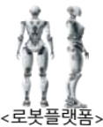

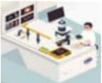

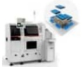

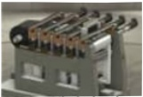

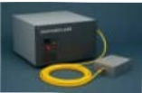

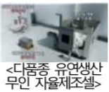

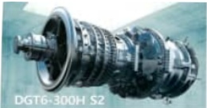

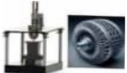

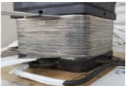

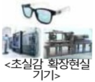

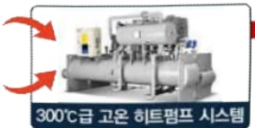

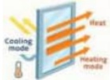

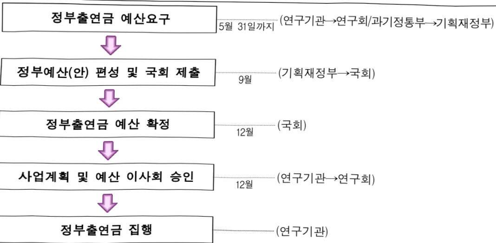

