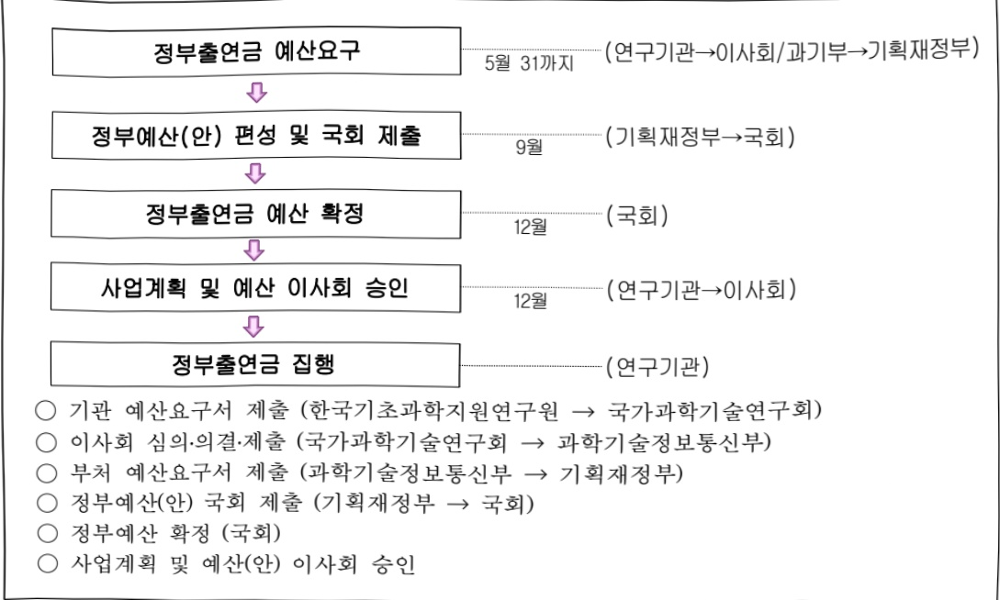

# 한국기초과학지원연구원 연구 운영비 지원(R&D)

**해당 페이지**: PDF 1634 ~ 1641 쪽 해당

**부처**: 과학기술정보통신부
**분야**: 과학기술
**회계유형**: 일반회계
**2026 확정예산**: 79917.0 백만원
**전년대비 증감률**: 5.5%
**AI 도메인**: R&D 지원

---

<table border=1 style='margin: auto; word-wrap: break-word;'><tr><td style='text-align: center; word-wrap: break-word;'>사 업 명</td></tr><tr><td style='text-align: center; word-wrap: break-word;'>(227) 한국기초과학지원연구원 연구운영비 지원 (2241-405)</td></tr></table>

## □ 사업 코드 정보

<table border=1 style='margin: auto; word-wrap: break-word;'><tr><td style='text-align: center; word-wrap: break-word;'>구분</td><td style='text-align: center; word-wrap: break-word;'>회계</td><td style='text-align: center; word-wrap: break-word;'>소관</td><td style='text-align: center; word-wrap: break-word;'>실국(기관)</td><td style='text-align: center; word-wrap: break-word;'>계정</td><td style='text-align: center; word-wrap: break-word;'>분야</td><td style='text-align: center; word-wrap: break-word;'>부문</td></tr><tr><td style='text-align: center; word-wrap: break-word;'>코드</td><td rowspan="2">일반회계</td><td rowspan="2">과학기술정보통신부</td><td rowspan="2">연구개발정책실기초원천연구정책관</td><td rowspan="2">-</td><td style='text-align: center; word-wrap: break-word;'>150</td><td style='text-align: center; word-wrap: break-word;'>152</td></tr><tr><td style='text-align: center; word-wrap: break-word;'>명칭</td><td style='text-align: center; word-wrap: break-word;'>과학기술</td><td style='text-align: center; word-wrap: break-word;'>과학기술연구지원</td></tr></table>

<table border=1 style='margin: auto; word-wrap: break-word;'><tr><td style='text-align: center; word-wrap: break-word;'>구분</td><td style='text-align: center; word-wrap: break-word;'>프로그램</td><td style='text-align: center; word-wrap: break-word;'>단위사업</td><td style='text-align: center; word-wrap: break-word;'>세부사업</td></tr><tr><td style='text-align: center; word-wrap: break-word;'>코드</td><td style='text-align: center; word-wrap: break-word;'>2200</td><td style='text-align: center; word-wrap: break-word;'>2241</td><td style='text-align: center; word-wrap: break-word;'>405</td></tr><tr><td style='text-align: center; word-wrap: break-word;'>명칭</td><td style='text-align: center; word-wrap: break-word;'>출연연구기관지원</td><td style='text-align: center; word-wrap: break-word;'>국가과학기술연구회 소관출연연구기관지원</td><td style='text-align: center; word-wrap: break-word;'>한국기초과학지원연구원 연구운영비 지원(R&amp;D)</td></tr></table>

사업 성격 (공통요구자료 II-1 작성유의사항 4. 참조, 해당하는 사항에 “O” 표시)

<table border=1 style='margin: auto; word-wrap: break-word;'><tr><td style='text-align: center; word-wrap: break-word;'>신규</td><td style='text-align: center; word-wrap: break-word;'>계속</td><td style='text-align: center; word-wrap: break-word;'>완료</td><td style='text-align: center; word-wrap: break-word;'>예비타당성 실시여부</td><td style='text-align: center; word-wrap: break-word;'>총사업비 관리대상</td><td style='text-align: center; word-wrap: break-word;'>총액계상 예산사업</td><td style='text-align: center; word-wrap: break-word;'>사업소관 변경정보 2025예산 시 소관</td></tr><tr><td style='text-align: center; word-wrap: break-word;'></td><td style='text-align: center; word-wrap: break-word;'>☐</td><td style='text-align: center; word-wrap: break-word;'></td><td style='text-align: center; word-wrap: break-word;'></td><td style='text-align: center; word-wrap: break-word;'></td><td style='text-align: center; word-wrap: break-word;'></td><td style='text-align: center; word-wrap: break-word;'></td></tr></table>

사업 지원 형태 및 지원을 (최소한 한 개는 반드시 선택하시오. 해당사항에 O 표시)

<table border=1 style='margin: auto; word-wrap: break-word;'><tr><td style='text-align: center; word-wrap: break-word;'>직접</td><td style='text-align: center; word-wrap: break-word;'>출자</td><td style='text-align: center; word-wrap: break-word;'>출연</td><td style='text-align: center; word-wrap: break-word;'>보조</td><td style='text-align: center; word-wrap: break-word;'>융자</td><td style='text-align: center; word-wrap: break-word;'>국고보조율(%)</td><td style='text-align: center; word-wrap: break-word;'>융자율(%)</td></tr><tr><td style='text-align: center; word-wrap: break-word;'></td><td style='text-align: center; word-wrap: break-word;'></td><td style='text-align: center; word-wrap: break-word;'>○</td><td style='text-align: center; word-wrap: break-word;'></td><td style='text-align: center; word-wrap: break-word;'></td><td style='text-align: center; word-wrap: break-word;'></td><td style='text-align: center; word-wrap: break-word;'></td></tr></table>

□ 사업 소관부처 및 시행주체

<table border=1 style='margin: auto; word-wrap: break-word;'><tr><td style='text-align: center; word-wrap: break-word;'>사업명</td><td colspan="2">구분</td></tr><tr><td rowspan="3">한국기초과학지원연구원연구운영비지원(R&amp;D)(2241-405)</td><td rowspan="2">소관부처</td><td style='text-align: center; word-wrap: break-word;'>연구개발정책실 기초원천연구정책관</td></tr><tr><td style='text-align: center; word-wrap: break-word;'>연구기관혁신정책과</td></tr><tr><td style='text-align: center; word-wrap: break-word;'>사업시행주체</td><td style='text-align: center; word-wrap: break-word;'>한국기초과학지원연구원</td></tr></table>

---

### 가.예산 총괄표

(단위: 백만원, %)

<table border=1 style='margin: auto; word-wrap: break-word;'><tr><td rowspan="2">사업명</td><td rowspan="2">2024년 결산</td><td colspan="2">2025년 예산</td><td colspan="2">2026년 예산</td><td rowspan="2">증감(B-A)</td><td rowspan="2">(B-A)/A</td></tr><tr><td style='text-align: center; word-wrap: break-word;'>본예산</td><td style='text-align: center; word-wrap: break-word;'>추경(A)</td><td style='text-align: center; word-wrap: break-word;'>요구안</td><td style='text-align: center; word-wrap: break-word;'>본예산(B)</td></tr><tr><td style='text-align: center; word-wrap: break-word;'>한국기초과학지원연구원 연구운영비 지원(R&amp;D)</td><td style='text-align: center; word-wrap: break-word;'>63,662</td><td style='text-align: center; word-wrap: break-word;'>75,726</td><td style='text-align: center; word-wrap: break-word;'>75,726</td><td style='text-align: center; word-wrap: break-word;'>79,917</td><td style='text-align: center; word-wrap: break-word;'>79,917</td><td style='text-align: center; word-wrap: break-word;'>4,191</td><td style='text-align: center; word-wrap: break-word;'>5.5</td></tr></table>

□ 기능별(내역사업별) 예산 내역

(단위:백만원)

<table border=1 style='margin: auto; word-wrap: break-word;'><tr><td rowspan="2"></td><td colspan="5">2024</td><td colspan="5">2025</td><td rowspan="2">2026 倉圧</td></tr><tr><td style='text-align: center; word-wrap: break-word;'>倉圧の (専門)</td><td style='text-align: center; word-wrap: break-word;'>倉圧の 専門</td><td style='text-align: center; word-wrap: break-word;'>倉圧の 専門</td><td style='text-align: center; word-wrap: break-word;'>倉圧の 専門</td><td style='text-align: center; word-wrap: break-word;'>倉圧の 専門</td><td style='text-align: center; word-wrap: break-word;'>倉圧の (専門)</td><td style='text-align: center; word-wrap: break-word;'>倉圧の 専門</td><td style='text-align: center; word-wrap: break-word;'>倉圧の 専門</td><td style='text-align: center; word-wrap: break-word;'>倉圧の 専門</td><td style='text-align: center; word-wrap: break-word;'>倉圧の 専門</td></tr><tr><td style='text-align: center; word-wrap: break-word;'>○ 기능별 분류(専門)</td><td style='text-align: center; word-wrap: break-word;'>64,251</td><td style='text-align: center; word-wrap: break-word;'>64,251</td><td style='text-align: center; word-wrap: break-word;'>63,662</td><td style='text-align: center; word-wrap: break-word;'>-</td><td style='text-align: center; word-wrap: break-word;'>589</td><td style='text-align: center; word-wrap: break-word;'>75,726</td><td style='text-align: center; word-wrap: break-word;'>75,726</td><td style='text-align: center; word-wrap: break-word;'>75,032</td><td style='text-align: center; word-wrap: break-word;'>-</td><td style='text-align: center; word-wrap: break-word;'>694</td><td style='text-align: center; word-wrap: break-word;'>79,917</td></tr><tr><td style='text-align: center; word-wrap: break-word;'>○ 기관운영비</td><td style='text-align: center; word-wrap: break-word;'>27,853</td><td style='text-align: center; word-wrap: break-word;'>27,853</td><td style='text-align: center; word-wrap: break-word;'>27,264</td><td style='text-align: center; word-wrap: break-word;'>-</td><td style='text-align: center; word-wrap: break-word;'>589</td><td style='text-align: center; word-wrap: break-word;'>28,928</td><td style='text-align: center; word-wrap: break-word;'>28,928</td><td style='text-align: center; word-wrap: break-word;'>28,234</td><td style='text-align: center; word-wrap: break-word;'>-</td><td style='text-align: center; word-wrap: break-word;'>694</td><td style='text-align: center; word-wrap: break-word;'>29,929</td></tr><tr><td style='text-align: center; word-wrap: break-word;'>○ 주요사업비</td><td style='text-align: center; word-wrap: break-word;'>36,398</td><td style='text-align: center; word-wrap: break-word;'>36,398</td><td style='text-align: center; word-wrap: break-word;'>36,398</td><td style='text-align: center; word-wrap: break-word;'>-</td><td style='text-align: center; word-wrap: break-word;'>-</td><td style='text-align: center; word-wrap: break-word;'>46,798</td><td style='text-align: center; word-wrap: break-word;'>46,798</td><td style='text-align: center; word-wrap: break-word;'>46,798</td><td style='text-align: center; word-wrap: break-word;'>-</td><td style='text-align: center; word-wrap: break-word;'>-</td><td style='text-align: center; word-wrap: break-word;'>49,988</td></tr></table>

### 나. 사업설명자료

## 1 ) 사업목적·내용

- (한국기초과학지원연구원 연구운영비 지원(R&D)) 국가 과학기술 발전에 기반이 되는 기초

과학 진흥을 위한 연구시설·장비 및 분석과학기술 관련 연구개발, 연구지원 및 공동연구 수행

- (국가연구시설장비 운영) 분석과학 Meister 주도형 첨단 연구장비 활용 전문 분석지원 및

공동연구를 통한 신사업 분야의 고부가가치 창출

- (분석과학 특성화 연구) 분석과학 신규 영역 발굴 및 원천 분석기법 개발

- (분석과학 인프라 구축 및 과학기술 현안 대응) 개방형 분석과학 생태계 구축 및

국가·사회문제 이슈 대응을 위한 분석과학 기반 현안 해결 연구

- (연구장비 산업화 기술 개발 및 지원대응) 연구장비 핵심기술 고도화 및 실증화를 통해 글로벌 경쟁력을 확보하고 상용화를 실시하여 연구장비 산업 역량강화

- (췌장암 조기 진단 솔루션 개발) 난치성 질병의 예측·예방 시스템 구축을 위한 질병 진행 단계별 수치화 및 맞춤형 정밀 헬스케어 구현

- (고전력 에너지 시스템용 전력반도체 개발) 국내 전력반도체 핵심 소재·소자 기술 확보

- (장비구입비) 기초과학 지원 기관으로서 연구소요 맞춤형 연구장비의 체계적 구축

---

## 2 ) 사업개요

## 사업근거 및 추진경위

① 법령상 근거 및 조항

- 과학기술분야 정부출연연구기관 등의 설립·운영 및 육성에 관한법률 제5조 (운영재원)

- 과학기술기본법 제15조 (기초과학의 진흥), 제17조 (협동·융합연구개발의 촉진), 제28조 (연구개발 시설·장비의 고도화)

② 추진경위

- 1988. 8. 한국과학재단 부설 '기초과학연구지원센터' 설립

- 1992. 4. 서울·부산·대구·광주센터 설치·운영

- 1999. 5. '기초과학지원연구소' 법인 설립

- 1999. 12. 전주센터 설치·운영

- 2001. 1. '한국기초과학지원연구원'으로 명칭 변경

- 2005. 5. 순천센터 설치·운영

- 2001. 11. 춘천센터 설치·운영

- 2005. 10. 부설 ‘국가핵융합연구소’ 설치

- 2006. 6. 오창분원·강릉센터 설치·운영

- 2008. 4. 제주센터 설치·운영

- 2009. 8. '국가연구시설장비진흥센터'(NFEC) 개소

- 2012. 12. 서울서부센터 설치·운영

- 2021. 7. 다목적 방사광가속기 구축사업 주관기관 지정

## □ 주요내용

① 사업규모

- 총사업비 : 해당없음(계속)

- 사업기간 : 1988년 ~ 계속

-최근 5년 간 투입된 사업비

<table border=1 style='margin: auto; word-wrap: break-word;'><tr><td style='text-align: center; word-wrap: break-word;'>연도</td><td style='text-align: center; word-wrap: break-word;'>2022</td><td style='text-align: center; word-wrap: break-word;'>2023</td><td style='text-align: center; word-wrap: break-word;'>2024</td><td style='text-align: center; word-wrap: break-word;'>2025</td><td style='text-align: center; word-wrap: break-word;'>2026</td></tr><tr><td style='text-align: center; word-wrap: break-word;'>사업비</td><td style='text-align: center; word-wrap: break-word;'>83,019</td><td style='text-align: center; word-wrap: break-word;'>84,107</td><td style='text-align: center; word-wrap: break-word;'>64,251</td><td style='text-align: center; word-wrap: break-word;'>75,726</td><td style='text-align: center; word-wrap: break-word;'>79,917</td></tr></table>

- 기타: 해당 없음

---

## ② 사업추진체계

- 사업시행방법 : 출연

- 사업시행주체 : 한국기초과학지원연구원

- 사업 수혜자 : 산업계, 학계, 연구계, 공공 등 국가 과학기술분야 관계자 및 국민

- 보조, 융자, 출연, 출자 등의 경우 보조·융자 등 지원 비율 및 법적근거

<table border=1 style='margin: auto; word-wrap: break-word;'><tr><td style='text-align: center; word-wrap: break-word;'>내역사업명</td><td style='text-align: center; word-wrap: break-word;'>구분</td><td style='text-align: center; word-wrap: break-word;'>피보조·피출연 등 기관명</td><td style='text-align: center; word-wrap: break-word;'>지원 금액 (2026예산)</td><td style='text-align: center; word-wrap: break-word;'>지원 비율(%)</td><td style='text-align: center; word-wrap: break-word;'>보조율 법적근거 (해당 조항)</td></tr><tr><td style='text-align: center; word-wrap: break-word;'>한국기초과학 지원연구원 연구운영비 지원(R&amp;D)</td><td style='text-align: center; word-wrap: break-word;'>출연</td><td style='text-align: center; word-wrap: break-word;'>한국기초 과학지원 연구원</td><td style='text-align: center; word-wrap: break-word;'>79,917</td><td style='text-align: center; word-wrap: break-word;'>100</td><td style='text-align: center; word-wrap: break-word;'>과학기술분야 정부출연연구기관 등의 설립·운영 및 육성에 관한 법률 제5조 제2항</td></tr></table>

## 3 ) 2026년도 예산 산출 근거

① 인건비 : (25) 26,002 → (26) 예산) 26,953 백만원

- (예산) 기관 고유미션인 수행을 위한 연구·지원인력 인건비 지원

- (산출) (‘25) 401명×65백만원 → (‘26 예산) 401명×67.3백만원 = 26,953백만원

· 전년수준 인건비 : 26,002백만원

· 처우개선 3.5% : 26,002백만원×3.5%=911백만원

· '25년 신규인력 2명 미반영 : 40백만원×2명×6/12개월=40백만원

## ② 경상경비 : (25) 2,926 → (26) 예산) 2,976 백만원

- (예산) 기관 고유미선 수행을 위한 경상운영비 지원

- (산출) (‘25) 401명×7.3백만원 → (‘26 예산) 401명×7.5백만원 = 2,976백만원

· 전년수준 경상비 : 2,926백만원

·경상비 효율화 : △35백만원

· 연구1동 증축사업 완공소요 : 5,138m²×0.038백만원×4/12개월=65백만원

· 자회사 처우개선 : 1,817백만원×31.8%(경상비 출연금 비중)×3.5%=20백만원

## ③ 주요사업비 : (25) 46,798 → (26) 예산) 49,988 백만원

- (예산) '26년도 국가 R&D 투자방향, 기관 R&R 등에 따른 기관 주요사업비 - (산출) ('25) 4개사업×11,699.5백만원 → ('26 예산) 7개사업×7,141.2백만원

국가연구시설장비 운영(12,589), 분석과학 특성화 연구(10,000), 분석과학 인프라 구축 및 과학기술 현안 대응(3,693), 연구장비 산업화 기술 개발 및 지원(2,100), 장비구입비(13,000), 췌장암 조기 진단 솔루션 개발(2,913), 고전력 에너지 시스템용 전력 반도체 개발(5,693)

---

## 4 ) 사업효과

사업영향, 산출물 성과지표 등

① 2022~2026년도 성과계획서 상 성과지표 및 최근 5년간 성과 달성도 : 해당없음

② 성과지표 이외의 연도별 사업추진 경과 및 실적

<table border=1 style='margin: auto; word-wrap: break-word;'><tr><td style='text-align: center; word-wrap: break-word;'>2022</td><td style='text-align: center; word-wrap: break-word;'>【항생제 내성 슈퍼박테리아 신속검출키트 개발】○ C.디피실(Clostridioides Difficile) 검출을 위한 종이 기반의 다중 검출키트(mPAD)로 단 1회 분석으로 10분 안에 검출 가능, 미량의 저농도 시료의 고감도 신호 증폭을 통해 최대 1시간 안에 검출 가능(2022년 국가연구개발 우수성과 100선)【선도연구장비 활용을 통한 분석단체 해결】○ 고자기장 900 MHz NMR 활용 단백질 동력학 연구 및 강유전성 HfO2의 성능 향상 메커니즘 연구 분야의 분석단체 해결【전자현미경 3차원 이미징 측정기술 이전】○ 다중모드 나노바이오 광학현미경 개발 영역에서 진공용 울트라마이크로톰 기술 개발 - SEM의 진공챔버 내부에서 블록시료를 수십 나노미터 두께로 자를 수 있는 장비로 연속된 시료의 블록면을 3차원으로 이미징 가능</td></tr><tr><td style='text-align: center; word-wrap: break-word;'>2023</td><td style='text-align: center; word-wrap: break-word;'>【난치암 &#x27;담도암&#x27;에 단백유전체 연구 적용해 새로운 치료전략 제시】○ 단백유전체 연구를 난치암인 간 내 담도암에 적용해 유전체 변이의 영향을 분석하고, 환자 개개인의 특성에 맞는 맞춤형 치료의 가능성 제시【타액으로 진단이 가능한 급성 염증·감염 신속 진단 슬립칩 개발】○ 체내 염증 및 감염으로 인한 급성 반응물질을 조기 진단할 수 있는 휴대용 칩 개발</td></tr><tr><td style='text-align: center; word-wrap: break-word;'>2024</td><td style='text-align: center; word-wrap: break-word;'>【파산화수소 감지로 암 진단, 신개념 조영기술 개발】○ 암세포에서 정상세포보다 과발현되는 과산화수소(H2O2)를 영상기술을 통해 비침습적으로 감지할 수 있는 신개념 조영기술을 개발【리틀금속배터리 성능 향상을 위한 나노 분석법 제시】○ NMR 장비를 활용하여 리틀금속배터리의 충방전에 따른 리틀 금속 전극의 가역성을 분석하고 동시에 리틀 이온의 거동을 관찰하여 향후 리틀배터리 연구 수행에 유용한 지침 수립【실시간 세포 추적 이미징으로 전이성 폐암 질환을 공략】○ 헬 산소화효소 2 (Heme oxygenase 2, 이하 HO2)가 전이성 암의 바이오마커(Biomarker)로서 활용될 수 있으며 HO2의 기능을 억제하는 종양개시세포 근적외선 프로브(Tumor-initiating cell near-infrared probe)로 암 전이를 제어하는 새로운 방법을 제시【그래핀 합성시 구리면에 따른 용력 변화 최초 발전】○ 구리 박막을 촉매로 그래핀을 합성할 때 발생하는 구리 스텝면과 그래핀 응력변화의 상관관계를 밝혀 고품질 그래핀 합성 연구에 중요한 정보를 제공</td></tr><tr><td style='text-align: center; word-wrap: break-word;'>2025</td><td style='text-align: center; word-wrap: break-word;'>【항바이오필름 실시간 분석으로 슈퍼박테리아 치료제 개발 기여】○ 3차원 홀로토모그래피 기반 실시간 분석기술로 신규 항균 펴타이드 발굴하여 항균 및 항바이오필름 효과 검증 및 규명【미세면지 시료 분석하여 도시별 조성과 생태독성 차이 규명】○ 동북아 3개국 미세면지 시료를 고분해능 이차원 가스크로마토그래피-질량분석기를 활용해 유해성이 높은 주요 PAHs 성분 도출하여 대기질 개선 전략 수립 근거 마련【열분석 시스템 기술 이전】○ 미세 크기 소자 동작시 발생하는 발열 온도 분포를 비접촉 방식으로 측정, 영상화하여 분석할 수 있는 첨단 현미경 기술이전(넥스트론, 선급기술료 1.3억 원)</td></tr></table>

---

<table border=1 style='margin: auto; word-wrap: break-word;'><tr><td rowspan="4">국가혁신성장을 견인하는 연구인프라의 종합발전 선도</td><td style='text-align: center; word-wrap: break-word;'>목표 1 대형·선도형 연구장비의 전략적 확충으로 국가연구인프라 경쟁력 강화</td></tr><tr><td style='text-align: center; word-wrap: break-word;'>• (개요) 구축비용으로 인해 대학·민간기업 등에서 보유하기 어려우나, 연구·산업계 분석난제 해결이나 고난도 분석에 반드시 필요한 대형·선도연구장비 중심으로 연구인프라 확충 - 매년 도입되는 연구장비 중 80% 이상은 중대형 연구장비 및 선도장비 중심으로 확충 * 선도장비: 국내 또는 세계 최초/최고 수준의 사양과 성능을 기반으로 수월적 성과를 도출할 수 있는 장비 • (기대효과) 대형·선도연구장비 공동활용&#x27;을 통해 국가 R&amp;D 재원의 효율적 투자, 연구·산업계의 애로기술 해결 및 세계 수준의 연구성과 창출에 기여 * 다목적 방사평가속기 구축(1조 454억원) → 경제적 파급효과 7조원, 고용창출 2만명 기대</td></tr><tr><td style='text-align: center; word-wrap: break-word;'>목표 2 대형·선도형 연구장비를 활용한 고난도 분석 지원으로 전환</td></tr><tr><td style='text-align: center; word-wrap: break-word;'>• (개요) 대학·민간에서 수행 가능한 분석지원서비스는 과감하게 중단하거나 민간에 이관하고, 분석지원서비스 산업 생태계는 활성화를 위해 지원 - KBSI가 보유하고 있는 범용 분석장비를 단계적으로 이관하고, 민간의 분석 역량에 따라 오픈랩, 창업지원, 장비이전 등 다양한 민간분석서비스 생태계 활성화 방안 추진 • (기대효과) KBSI는 고난도 분석에 역량을 집중하고, 민간의 분석지원서비스 산업 생태계 활성화 등 경제적 효과 기대 ※ 장비이전 및 활용촉진에 따라 &#x27; 25년까지 약 69.4명의 고용유발효과 기대</td></tr><tr><td rowspan="6">국가연구 인프라의 활용성을 극대화하는 분석과학연구</td><td style='text-align: center; word-wrap: break-word;'>목표 3 분석한계를 극복하는 고난도 분석기술 개발</td></tr><tr><td style='text-align: center; word-wrap: break-word;'>• (개요) 에너지·환경 소재의 성능한계 및 노화질병 치료를 위한 분석한계 극복 및 분석과학 플랫폼 확대 - 기능성 소재의 반응 매커니즘 규명, 단백질 응집 유래 난치성 노화질병 극복 분석시스템 확립 등 • (기대효과) 독보적 첨단 연구장비를 활용해 세계 수준의 연구성과 창출하여 국가 분석과학 경쟁력 강화 및 미래 경제성장을 위한 원천기술 확보</td></tr><tr><td style='text-align: center; word-wrap: break-word;'>목표 4 과학기술 트렌드 대용 및 국가·사회 문제해결형 분석과학 연구 확대</td></tr><tr><td style='text-align: center; word-wrap: break-word;'>• (개요) 소재 분야 자국우선주의 확대, 생명의료 분야의 감염병/난치병, 미세먼지 등 환경문제와 같이 국가·사회적 이슈에 대해 분석과학을 통해 근본적이고 혁신적인 해결방안 제시 - 국가현안 긴급분석대응 TF 운영, 국민건강 위협인자 진단, 자연재해 재발주기 규명 등 추진 • (기대효과) 분석과학을 활용한 국가·사회적 이슈 해결기반 마련, 연구·산업계의 애로사항 해결을 통해 국민의 삶의 질 향상과 경제적 효과 예상</td></tr><tr><td style='text-align: center; word-wrap: break-word;'>목표 5 고부가가치 연구장비 개발 및 국산화 지원</td></tr><tr><td style='text-align: center; word-wrap: break-word;'>• (개요) 해외 의존도가 높은 연구장비 산업의 기술자립도를 높이기 위해 연구장비·시스템을 직접 개발하고, 이를 통해 확보한 기술을 민간기업에 이전 - 다중모드 광학현미경, 보급형 투과전자현미경, 3차원 분자이미징 질량분석기 등 개발 • (기대효과) 연구장비 산업 활성화, 고용창출뿐 아니라 기술이전 기업 간 지속적인 협력을 통해 장비혁신 생태계 활성화에 기여</td></tr><tr><td rowspan="4">국가R&amp;D 경쟁력 향상을 위한 분석과학기술 공유 및 확산</td><td style='text-align: center; word-wrap: break-word;'>목표 6 대형인프라 연계, 분석과학 Meister 주도의 국가 분석과학기술 선진화</td></tr><tr><td style='text-align: center; word-wrap: break-word;'>• (개요) 분석과학 Meister 주도의 고난도 분석기술 체계화·특성화 추진, 연구·산업현장의 중대수요/애로사항 해결방안 제공, 고난도 수요맞춤형 연구지원 강화 등 추진 • (기대효과) 국가 연구장비·시설의 활용 가치를 높이고, 최고난도 분석기술 확보·확산에 기여</td></tr><tr><td style='text-align: center; word-wrap: break-word;'>목표 7 연구인프라 활용 역량의 대외 공유 및 확산</td></tr><tr><td style='text-align: center; word-wrap: break-word;'>• (개요) 동종 분석장비, 동일 분석 분야 중심의 이용자/운영자 네트워크 구축 등을 통해 분석 지식·정보·노하우 교류 및 보급·확산 추진 • (기대효과) 개방형·나눔형 공동활용 강화, 긴급분석 지원 등을 통해 중소/벤처기업, 범용 분석 서비스 기업의 경쟁력 향상, 애로사항 해결 및 창업 인큐베이션 성과 창출 기대</td></tr></table>

---

5) 타당성조사 및 예비타당성조사 시행여부 및 결과 요지 : 해당없음

6) 총사업비 대상사업 정보 : 해당없음

7) 사업 집행절차

## 8 ) 각종 평가

1) 국회(예결위, 상임위, 예정처, 국정감사 포함) 지적

(제기) 분석과학 특성화 연구사업 집행 부진

(조치) 4개 특성화 분야(바이오, 소재, 환경, 방사광가속기)로 사업 분리·개편을

통해 운영 효율화 및 집행 제고

※ (과방위, 22결산)

---

### 다. 최근 4년간 결산내역

## 1 ) 결산표

☐ 부처 결산내역

(단위: 백만원, %)

<table border=1 style='margin: auto; word-wrap: break-word;'><tr><td rowspan="2">연도</td><td colspan="3">예산액</td><td rowspan="2">예산현액(A)</td><td rowspan="2">집행액(B)</td><td rowspan="2">집행률(B/A)</td><td rowspan="2">다음연도이월액</td><td rowspan="2">불용액</td></tr><tr><td style='text-align: center; word-wrap: break-word;'>본예산</td><td style='text-align: center; word-wrap: break-word;'>추경증감액</td><td style='text-align: center; word-wrap: break-word;'>추경</td></tr><tr><td style='text-align: center; word-wrap: break-word;'>2022</td><td style='text-align: center; word-wrap: break-word;'>83,019</td><td style='text-align: center; word-wrap: break-word;'>-</td><td style='text-align: center; word-wrap: break-word;'>83,019</td><td style='text-align: center; word-wrap: break-word;'>83,019</td><td style='text-align: center; word-wrap: break-word;'>81,080</td><td style='text-align: center; word-wrap: break-word;'>97.7</td><td style='text-align: center; word-wrap: break-word;'>-</td><td style='text-align: center; word-wrap: break-word;'>1,939</td></tr><tr><td style='text-align: center; word-wrap: break-word;'>2023</td><td style='text-align: center; word-wrap: break-word;'>84,107</td><td style='text-align: center; word-wrap: break-word;'>-</td><td style='text-align: center; word-wrap: break-word;'>84,107</td><td style='text-align: center; word-wrap: break-word;'>84,107</td><td style='text-align: center; word-wrap: break-word;'>82,194</td><td style='text-align: center; word-wrap: break-word;'>97.7</td><td style='text-align: center; word-wrap: break-word;'>-</td><td style='text-align: center; word-wrap: break-word;'>1,913</td></tr><tr><td style='text-align: center; word-wrap: break-word;'>2024</td><td style='text-align: center; word-wrap: break-word;'>64,251</td><td style='text-align: center; word-wrap: break-word;'>-</td><td style='text-align: center; word-wrap: break-word;'>64,251</td><td style='text-align: center; word-wrap: break-word;'>64,251</td><td style='text-align: center; word-wrap: break-word;'>63,662</td><td style='text-align: center; word-wrap: break-word;'>99.1</td><td style='text-align: center; word-wrap: break-word;'>-</td><td style='text-align: center; word-wrap: break-word;'>589</td></tr><tr><td style='text-align: center; word-wrap: break-word;'>2025</td><td style='text-align: center; word-wrap: break-word;'>75,726</td><td style='text-align: center; word-wrap: break-word;'>-</td><td style='text-align: center; word-wrap: break-word;'>75,726</td><td style='text-align: center; word-wrap: break-word;'>75,726</td><td style='text-align: center; word-wrap: break-word;'>75,032</td><td style='text-align: center; word-wrap: break-word;'>99.1</td><td style='text-align: center; word-wrap: break-word;'>-</td><td style='text-align: center; word-wrap: break-word;'>694</td></tr></table>

## 2 ) 주요 결산사항

□ 2022~2025년 결산 주요사항

<table border=1 style='margin: auto; word-wrap: break-word;'><tr><td style='text-align: center; word-wrap: break-word;'>2022</td><td style='text-align: center; word-wrap: break-word;'>- 불용사유 · 신규인력 충원기간 차이에 따른 잔액, 휴직직원 인건비, 법정부담금 집행잔액 등 미교부(960백만원) · 시설사업 종료로 인한 집행잔액 불용(979백만원)</td></tr><tr><td style='text-align: center; word-wrap: break-word;'>2023</td><td style='text-align: center; word-wrap: break-word;'>- 불용사유 · 신규인력 충원기간 차이에 따른 잔액, 휴직직원 인건비, 법정부담금 집행잔액 등 미교부(1,113백만원) · 시설사업 낙찰차액으로 인한 집행잔액 불용(800백만원)</td></tr><tr><td style='text-align: center; word-wrap: break-word;'>2024</td><td style='text-align: center; word-wrap: break-word;'>- 불용사유 · 신규인력 충원기간 차이에 따른 잔액, 휴직직원 인건비, 법정부담금 집행잔액 등 미교부(589백만원)</td></tr><tr><td style='text-align: center; word-wrap: break-word;'>2025</td><td style='text-align: center; word-wrap: break-word;'>- 불용사유 · 신규인력 충원기간 차이에 따른 잔액, 휴직직원 인건비, 법정부담금 집행잔액 등 미교부(694백만원)</td></tr></table>

2025년 이·전용 등 세부내역 : 해당없음

---

### 원본 PDF 크롭 이미지

