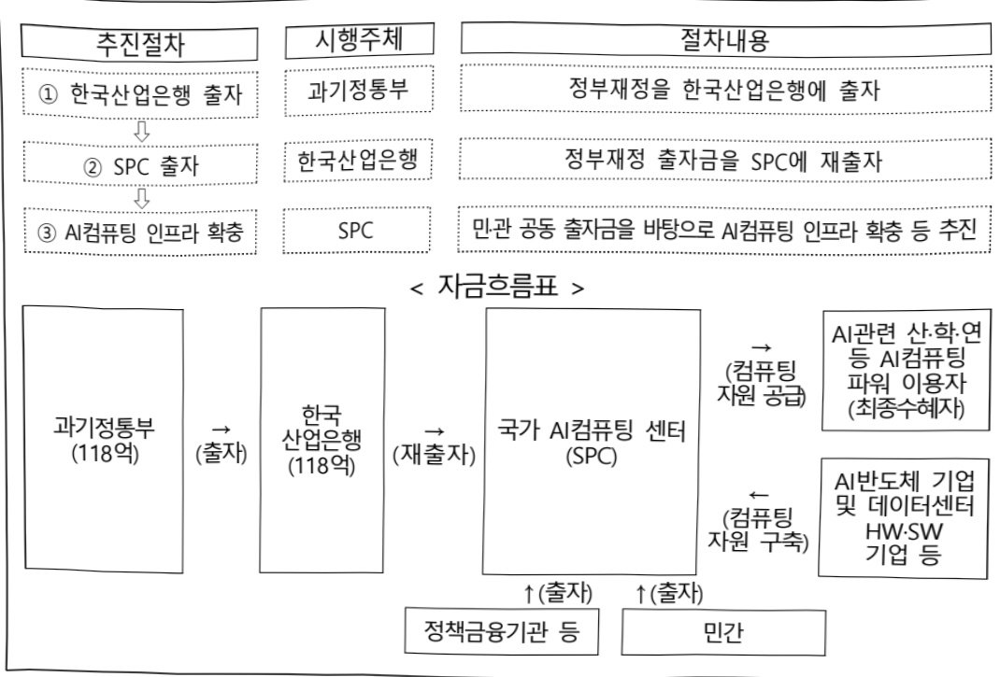

# 한국산업은행출자(AI컴퓨팅 인프라 확충)

**해당 페이지**: PDF 1651 ~ 1657 쪽 해당

**부처**: 과학기술정보통신부
**분야**: 통신
**회계유형**: 일반회계
**2026 확정예산**: 11800.0 백만원
**전년대비 증감률**: -43.8%
**AI 도메인**: AI반도체, 클라우드/컴퓨팅

---

<table border=1 style='margin: auto; word-wrap: break-word;'><tr><td style='text-align: center; word-wrap: break-word;'>사 업 명</td></tr><tr><td style='text-align: center; word-wrap: break-word;'>(334) 한국산업은행 출자(AI컴퓨팅 인프라 확충) (2603-325)</td></tr></table>

사업 코드 정보

<table border=1 style='margin: auto; word-wrap: break-word;'><tr><td style='text-align: center; word-wrap: break-word;'>구분</td><td style='text-align: center; word-wrap: break-word;'>회계</td><td style='text-align: center; word-wrap: break-word;'>소관</td><td style='text-align: center; word-wrap: break-word;'>실국(기관)</td><td style='text-align: center; word-wrap: break-word;'>계정</td><td style='text-align: center; word-wrap: break-word;'>분야</td><td style='text-align: center; word-wrap: break-word;'>부문</td></tr><tr><td style='text-align: center; word-wrap: break-word;'>코드</td><td rowspan="2">일반회계</td><td style='text-align: center; word-wrap: break-word;'>과학기술</td><td style='text-align: center; word-wrap: break-word;'>인공지능</td><td rowspan="2"></td><td style='text-align: center; word-wrap: break-word;'>130</td><td style='text-align: center; word-wrap: break-word;'>133</td></tr><tr><td style='text-align: center; word-wrap: break-word;'>명칭</td><td style='text-align: center; word-wrap: break-word;'>정보통신부</td><td style='text-align: center; word-wrap: break-word;'>인프라정책관</td><td style='text-align: center; word-wrap: break-word;'>통신</td><td style='text-align: center; word-wrap: break-word;'>정보통신</td></tr></table>

<table border=1 style='margin: auto; word-wrap: break-word;'><tr><td style='text-align: center; word-wrap: break-word;'>구분</td><td style='text-align: center; word-wrap: break-word;'>프로그램</td><td style='text-align: center; word-wrap: break-word;'>단위사업</td><td style='text-align: center; word-wrap: break-word;'>세부사업</td></tr><tr><td style='text-align: center; word-wrap: break-word;'>코드</td><td style='text-align: center; word-wrap: break-word;'>2600</td><td style='text-align: center; word-wrap: break-word;'>2603</td><td style='text-align: center; word-wrap: break-word;'>325</td></tr><tr><td style='text-align: center; word-wrap: break-word;'>명칭</td><td style='text-align: center; word-wrap: break-word;'>인공지능데이터진흥</td><td style='text-align: center; word-wrap: break-word;'>AI반도체경쟁력강화(일반)</td><td style='text-align: center; word-wrap: break-word;'>한국산업은행 출자(AI컴퓨팅 인프라 확충)</td></tr></table>

<table border=1 style='margin: auto; word-wrap: break-word;'><tr><td colspan="6">☐ 사업 성격</td><td style='text-align: center; word-wrap: break-word;'></td></tr><tr><td style='text-align: center; word-wrap: break-word;'>신규</td><td style='text-align: center; word-wrap: break-word;'>계속</td><td style='text-align: center; word-wrap: break-word;'>완료</td><td style='text-align: center; word-wrap: break-word;'>예비타당성 실시여부</td><td style='text-align: center; word-wrap: break-word;'>총사업비 관리대상</td><td style='text-align: center; word-wrap: break-word;'>총액계상 예산사업</td><td style='text-align: center; word-wrap: break-word;'>사업소관 변경정보 2025예산 시 소관</td></tr><tr><td style='text-align: center; word-wrap: break-word;'></td><td style='text-align: center; word-wrap: break-word;'>☐</td><td style='text-align: center; word-wrap: break-word;'></td><td style='text-align: center; word-wrap: break-word;'></td><td style='text-align: center; word-wrap: break-word;'></td><td style='text-align: center; word-wrap: break-word;'></td><td style='text-align: center; word-wrap: break-word;'></td></tr></table>

사업 지원 형태 및 지원을

<table border=1 style='margin: auto; word-wrap: break-word;'><tr><td style='text-align: center; word-wrap: break-word;'>직접</td><td style='text-align: center; word-wrap: break-word;'>출자</td><td style='text-align: center; word-wrap: break-word;'>출연</td><td style='text-align: center; word-wrap: break-word;'>보조</td><td style='text-align: center; word-wrap: break-word;'>융자</td><td style='text-align: center; word-wrap: break-word;'>국고보조율(%)</td><td style='text-align: center; word-wrap: break-word;'>융자율(%)</td></tr><tr><td style='text-align: center; word-wrap: break-word;'></td><td style='text-align: center; word-wrap: break-word;'>0</td><td style='text-align: center; word-wrap: break-word;'></td><td style='text-align: center; word-wrap: break-word;'></td><td style='text-align: center; word-wrap: break-word;'></td><td style='text-align: center; word-wrap: break-word;'></td><td style='text-align: center; word-wrap: break-word;'></td></tr></table>

사업 소관부처 및 시행주체

<table border=1 style='margin: auto; word-wrap: break-word;'><tr><td style='text-align: center; word-wrap: break-word;'>사업명</td><td colspan="2">구분</td></tr><tr><td rowspan="3">한국산업은행 출자 (AI컴퓨팅 인프라 확충)</td><td rowspan="2">소관부처</td><td style='text-align: center; word-wrap: break-word;'>인공지능정책실 인공지능인프라정책관</td></tr><tr><td style='text-align: center; word-wrap: break-word;'>인공지능기술기반정책과(인공지능컴퓨팅인프라팀)</td></tr><tr><td style='text-align: center; word-wrap: break-word;'>사업시행주체</td><td style='text-align: center; word-wrap: break-word;'>한국산업은행 경유 출자 등을 통해 설립된 SPC</td></tr></table>

---

### 가. 예산 총괄표

(단위: 백만원, %)

<table border=1 style='margin: auto; word-wrap: break-word;'><tr><td rowspan="2">사업명</td><td rowspan="2">2024년 결산</td><td colspan="2">2025년 예산</td><td colspan="2">2026년 예산</td><td rowspan="2">증감(B-A)</td><td rowspan="2">(B-A)/A</td></tr><tr><td style='text-align: center; word-wrap: break-word;'>본예산</td><td style='text-align: center; word-wrap: break-word;'>추경*(A)</td><td style='text-align: center; word-wrap: break-word;'>요구안</td><td style='text-align: center; word-wrap: break-word;'>본예산(B)</td></tr><tr><td style='text-align: center; word-wrap: break-word;'>한국산업은행 출자(AI컴퓨팅 인프라 확충)</td><td style='text-align: center; word-wrap: break-word;'>-</td><td style='text-align: center; word-wrap: break-word;'>21,000</td><td style='text-align: center; word-wrap: break-word;'>-</td><td style='text-align: center; word-wrap: break-word;'>11,800</td><td style='text-align: center; word-wrap: break-word;'>11,800</td><td style='text-align: center; word-wrap: break-word;'>△9,200</td><td style='text-align: center; word-wrap: break-word;'>△43.8</td></tr></table>

* 추경: 추경증감액을 포함한 최종 예산액을 기재

## □ 기능별(내역사업별) 예산 내역

(단위: 백만원)

<table border=1 style='margin: auto; word-wrap: break-word;'><tr><td rowspan="2"></td><td colspan="5">2024</td><td colspan="5">2025</td><td rowspan="2">2026 倉塗</td></tr><tr><td style='text-align: center; word-wrap: break-word;'>倉塗劑(専務)</td><td style='text-align: center; word-wrap: break-word;'>倉塗劑劑</td><td style='text-align: center; word-wrap: break-word;'>倉塗劑劑</td><td style='text-align: center; word-wrap: break-word;'>倉塗劑劑</td><td style='text-align: center; word-wrap: break-word;'>倉塗劑劑</td><td style='text-align: center; word-wrap: break-word;'>倉塗劑劑劑</td><td style='text-align: center; word-wrap: break-word;'>倉塗劑劑劑</td><td style='text-align: center; word-wrap: break-word;'>倉塗劑劑劑</td><td style='text-align: center; word-wrap: break-word;'>倉塗劑劑劑</td><td style='text-align: center; word-wrap: break-word;'>倉塗劑劑劑劑</td></tr><tr><td style='text-align: center; word-wrap: break-word;'>○ 기능별 분류(합계)</td><td style='text-align: center; word-wrap: break-word;'>-</td><td style='text-align: center; word-wrap: break-word;'>-</td><td style='text-align: center; word-wrap: break-word;'>-</td><td style='text-align: center; word-wrap: break-word;'>-</td><td style='text-align: center; word-wrap: break-word;'>-</td><td style='text-align: center; word-wrap: break-word;'>21,000</td><td style='text-align: center; word-wrap: break-word;'>21,000</td><td style='text-align: center; word-wrap: break-word;'>-</td><td style='text-align: center; word-wrap: break-word;'>21,000</td><td style='text-align: center; word-wrap: break-word;'>-</td><td style='text-align: center; word-wrap: break-word;'>21,000</td></tr><tr><td style='text-align: center; word-wrap: break-word;'>• AI컴퓨팅 인프라 확충</td><td style='text-align: center; word-wrap: break-word;'>-</td><td style='text-align: center; word-wrap: break-word;'>-</td><td style='text-align: center; word-wrap: break-word;'>-</td><td style='text-align: center; word-wrap: break-word;'>-</td><td style='text-align: center; word-wrap: break-word;'>-</td><td style='text-align: center; word-wrap: break-word;'>21,000</td><td style='text-align: center; word-wrap: break-word;'>21,000</td><td style='text-align: center; word-wrap: break-word;'>-</td><td style='text-align: center; word-wrap: break-word;'>21,000</td><td style='text-align: center; word-wrap: break-word;'>-</td><td style='text-align: center; word-wrap: break-word;'>21,000</td></tr></table>

### 나. 사업설명자료

## 1 ) 사업목적·내용

- (한국산업은행 출자) 민·관 출자를 바탕으로 특수목적법인(SPC)를 설립하고, 첨단 AI반도체(GPU 등) 기반으로 AI컴퓨팅 인프라 확충

- 이를 바탕으로 대학·연구소·스타트업 등에 AI컴퓨팅 자원을 제공하고, 국산 AI반도체 활성화 지원과 정부 R&D성과 적용 및 글로벌 기업 협력 등 추진

---

## 2 ) 사업개요

## □ 사업근거 및 추진경위

① 법령상 근거 및 조항 적시 : 해당되는 모든 조항의 전체 조문을 기재

- 과학기술기본법 제7조(과학기술기본계획), 제16조 5(성장동력의 발굴, 육성)

제7조(과학기술기본계획) ② 과학기술정보통신부장관은 5년마다 제1항에 따른 과학기술 발전에 관한 중·장기 정책목표와 방향을 반영하고 관계 중앙행정기관의 과학기술 관련 계획과 시책 등을 종합하여 과학기술기본계획(이하 “기본계획”이라 한다)을 세우고 과학기술자문회의의 심의를 거쳐 확정하여야 한다.

③ 기본계획에는 다음 각 호의 사항이 포함되어야 한다.

4. 과학기술 연구개발의 추진 및 협동·융합연구개발 촉진

4의2. 미래유망기술의 확보

제16조 5(성장동력의 발굴, 육성) ① 정부는 과학기술에 기반을 둔 성장동력을 발굴·육성하기 위하여 필요한 시책을 세우고 추진하여야 한다.

② 정부는 제1항에 따른 시책을 세울 때 다음 각 호에 관한 사항을 포함하여야 한다.

1. 성장동력 분야별 핵심기술의 개발·사업화

## -산업기술혁신 촉진법 제11조(산업기술개발사업)

<table border=1 style='margin: auto; word-wrap: break-word;'><tr><td style='text-align: center; word-wrap: break-word;'>제11조(산업기술개발사업) ① 산업통상자원부장관은 혁신계획 및 시행계획을 효율적으로 수행하기 위하여 관계 중앙행정기관의 장과 협의하여 다음 각 호의 산업기술분야에서 기술개발사업(산업기술개발을 위하여 필요한 기획 및 조사를 포함한다. 이하 “산업기술개발사업”이라 한다)을 추진할 수 있다.</td></tr><tr><td style='text-align: center; word-wrap: break-word;'>1. 산업의 공통적인 기반이 되는 생산기반 기술, 부품·소재 및 장비·설비(플랜트를 포함한다) 기술</td></tr><tr><td style='text-align: center; word-wrap: break-word;'>2. 산업기술 분야의 미래 유망 기술</td></tr><tr><td style='text-align: center; word-wrap: break-word;'>11. 개발된 산업기술의 사업화에 필요한 연계기술</td></tr><tr><td style='text-align: center; word-wrap: break-word;'>12. 제1호부터 제10호까지의 기술 간 결합을 통한 시장지향형 융합기술</td></tr></table>

## - 정보통신 진흥 및 융합 활성화 등에 관한 특별법 제32조(정보통신융합 등 기술·서비스 개발 등의 지원)

<table border=1 style='margin: auto; word-wrap: break-word;'><tr><td style='text-align: center; word-wrap: break-word;'>제32조(정보통신융합등 기술·서비스 개발 등의 지원) ① 과학기술정보통신부장관은 다른 산업 및 서비스 등에 정보통신의 접목을 통하여 생산성과 가치를 높일 수 있도록 노력하여야 한다.</td></tr><tr><td style='text-align: center; word-wrap: break-word;'>② 과학기술정보통신부장관은 정보통신융합등 기술·서비스의 개발을 촉진하기 위하여 다음 각 호의 사업을 추진할 수 있다.</td></tr><tr><td style='text-align: center; word-wrap: break-word;'>1. 정보통신융합등 기술·서비스 관련 연구개발 사업</td></tr><tr><td style='text-align: center; word-wrap: break-word;'>2. 제1호에 따라 추진되는 과제에 대한 기획·평가·관리</td></tr><tr><td style='text-align: center; word-wrap: break-word;'>3. 국가·지방자치단체, 대학·정부출연연구기관, 민간 등이 보유한 정보통신융합등 기술의 거래 등 기술이전을 위한 중개·알선 지원</td></tr><tr><td style='text-align: center; word-wrap: break-word;'>4. 정보통신융합등 기술에 대한 평가 및 평가 기법의 개발·보급</td></tr><tr><td style='text-align: center; word-wrap: break-word;'>5. 정보통신융합등 기술의 기술이전·사업화에 관한 통계조사·연구 등 관련 정보의 수집·분석·제공</td></tr><tr><td style='text-align: center; word-wrap: break-word;'>③ 과학기술정보통신부장관은 제2항 각 호의 사업을 추진하기 위하여 법인인 전담기관을 설립하거나 법인·단체에 위탁·운영할 수 있으며, 필요한 비용의 전부 또는 일부를 예산의 범위에서 출연 또는 보조할 수 있다.</td></tr></table>

---

-한국산업은행법 제18조제1항(업무)

제18조(업무) ① 한국산업은행은 제1조의 목적을 달성하기 위하여 다음 각 호의 분야에 자금을 공급한다.

1.산업의 개발·육성

2. 중소기업의 육성

3. 사회기반시설의 확충 및 지역개발

4. 에너지 및 자원의 개발

5. 기업·산업의 해외진출

6. 기업구조조정

7. 정부가 업무위탁이 필요하다고 인정하는 분야

8. 그 밖에 신성장동력산업 육성과 지속가능한 성장 촉진 등 금융산업 및 국민경제의 발전을 위하여 자금의 공급이 필요한 분야

② 추진경위 - 사업 시작년도, 추진배경, 부처별 중점과제, 대통령 공약사항 등

- AI 3대 강국 도약을 위한 AI고속도로 구축 (국정과제 20번)

- '국가 AI컴퓨팅 센터 구축(SPC 설립) 실행계획' 발표('25.1, 경제관계장관회의)

- '국가 AI컴퓨팅 센터 추진 (SPC 설립) 상황 및 계획 보고'(25.2, 국가AI위원회 산하 AI컴퓨팅 인프라 특별위원회)

- 'AI 고속도로 구축을 위한 국가 AI컴퓨팅 센터 추진방안' 발표('25.9, 국가인공 지능전략위원회)

□ 주요내용

① 사업규모

- 총사업비(해당되는 경우에만 기재) : 해당없음

- 사업기간 : '25~'30

-최근 5년 간 투입된 사업비(예산액기준, 추경편성한 연도에는 추경포함)

<table border=1 style='margin: auto; word-wrap: break-word;'><tr><td style='text-align: center; word-wrap: break-word;'>$ \underline{\text{所}} $</td><td style='text-align: center; word-wrap: break-word;'>2022</td><td style='text-align: center; word-wrap: break-word;'>2023</td><td style='text-align: center; word-wrap: break-word;'>2024</td><td style='text-align: center; word-wrap: break-word;'>2025</td><td style='text-align: center; word-wrap: break-word;'>2026</td></tr><tr><td style='text-align: center; word-wrap: break-word;'>$ \underline{\text{사업비}} $</td><td style='text-align: center; word-wrap: break-word;'>-</td><td style='text-align: center; word-wrap: break-word;'>-</td><td style='text-align: center; word-wrap: break-word;'>-</td><td style='text-align: center; word-wrap: break-word;'>21,000</td><td style='text-align: center; word-wrap: break-word;'>11,800</td></tr></table>

- 기타: 해당없음

② 사업추진체계

- 사업시행방법 : 출자

- 사업시행주체 : 한국산업은행 경유 출자 등을 통해 설립된 SPC

- 사업 수혜자 : SPC 참여 기업·기관 및 AI컴퓨팅 인프라 수요자

<table border=1 style='margin: auto; word-wrap: break-word;'><tr><td style='text-align: center; word-wrap: break-word;'>내역사업명</td><td style='text-align: center; word-wrap: break-word;'>구분</td><td style='text-align: center; word-wrap: break-word;'>피보조·피출연 등 기관명</td><td style='text-align: center; word-wrap: break-word;'>지원 금액 (2026예산)</td><td style='text-align: center; word-wrap: break-word;'>지원 비율(%)</td><td style='text-align: center; word-wrap: break-word;'>보조율 법적근거 (해당 조항)</td></tr><tr><td style='text-align: center; word-wrap: break-word;'>AI컴퓨팅 인프라 확충</td><td style='text-align: center; word-wrap: break-word;'>출자</td><td style='text-align: center; word-wrap: break-word;'>한국산업 은행</td><td style='text-align: center; word-wrap: break-word;'>11,800</td><td style='text-align: center; word-wrap: break-word;'>100</td><td style='text-align: center; word-wrap: break-word;'>정보통신 진흥 및 융합 활성화 등에 관한 특별법 제32조 제3항</td></tr></table>

---

<table border=1 style='margin: auto; word-wrap: break-word;'><tr><td style='text-align: center; word-wrap: break-word;'>국가 AI컴퓨팅 센터 구축을 위한 ‘26년 SPC 출자금 11,800백만원 - 산출내역: AI컴퓨팅 인프라 확충 출자금 1식 × 11,800백만원</td></tr></table>

## 4 ) 사업효과

□ 사업영향, 산출물 성과지표 등

① 2022~2026년도 성과계획서 상 성과지표 및 최근 5년간 성과 달성도

<table border=1 style='margin: auto; word-wrap: break-word;'><tr><td style='text-align: center; word-wrap: break-word;'>성과지표</td><td style='text-align: center; word-wrap: break-word;'>구분</td><td style='text-align: center; word-wrap: break-word;'>2022</td><td style='text-align: center; word-wrap: break-word;'>2023</td><td style='text-align: center; word-wrap: break-word;'>2024</td><td style='text-align: center; word-wrap: break-word;'>2025</td><td style='text-align: center; word-wrap: break-word;'>2026</td><td style='text-align: center; word-wrap: break-word;'>2026 목표치산출근거</td><td style='text-align: center; word-wrap: break-word;'>측정산식(또는 측정방법)</td><td style='text-align: center; word-wrap: break-word;'>자료수집방법(또는 자료출처)</td></tr><tr><td rowspan="3">AI컴퓨팅 인프라 활용 만족도(단위: 점)</td><td style='text-align: center; word-wrap: break-word;'>목표</td><td style='text-align: center; word-wrap: break-word;'>-</td><td style='text-align: center; word-wrap: break-word;'>-</td><td style='text-align: center; word-wrap: break-word;'>-</td><td style='text-align: center; word-wrap: break-word;'>60</td><td style='text-align: center; word-wrap: break-word;'>61.8</td><td rowspan="3">신규 지표임을 감안보통 이상의 수준인 60점을 취소 목표치설정 매년 전년 대비 3%씩 상향(단 향후 실적에 따라 상향폭증감)</td><td rowspan="3">(∑ 사용자 만족도 점수/이용자수)</td><td rowspan="3">사용자 만족도 설문조사</td></tr><tr><td style='text-align: center; word-wrap: break-word;'>실적</td><td style='text-align: center; word-wrap: break-word;'>-</td><td style='text-align: center; word-wrap: break-word;'>-</td><td style='text-align: center; word-wrap: break-word;'>-</td><td style='text-align: center; word-wrap: break-word;'>-</td><td style='text-align: center; word-wrap: break-word;'>-</td></tr><tr><td style='text-align: center; word-wrap: break-word;'>달성도</td><td style='text-align: center; word-wrap: break-word;'>-</td><td style='text-align: center; word-wrap: break-word;'>-</td><td style='text-align: center; word-wrap: break-word;'>-</td><td style='text-align: center; word-wrap: break-word;'>-</td><td style='text-align: center; word-wrap: break-word;'>-</td></tr></table>

※ 'AI컴퓨팅 인프라 활용 만족도' 성과지표는 국가 AI컴퓨팅 센터 개소 시점부터 측정 가능

② 성과지표 이외의 연도별 사업추진 경과 및 실적

<table border=1 style='margin: auto; word-wrap: break-word;'><tr><td style='text-align: center; word-wrap: break-word;'>2025</td><td style='text-align: center; word-wrap: break-word;'>○ SPC 민간 참여자 선정을 위한 공모 추진* (~10월) * 1차 1.23.~5.30., 재공모 6.2.~6.13., 2차 9.8.~10.21.○ SPC 민간 참여자 선정 평가 · 심사 등 추진(계속)</td></tr></table>

③ 향후(2026년도 이후) 기대효과 :

-산업·연구계의 AI개발·연구·활용을 위한 AI컴퓨팅 자원의 안정적 공급기반 마련

-정부 투자를 바탕으로 민간의 AI컴퓨팅 인프라 투자 촉진

## 5 ) 타당성조사 및 예비타당성조사 시행여부 및 결과 요지

□ 총사업비 500억원 이상인 경우 예비타당성조사 시행유무 및 그 결과요지 기재 : '24년 2차 예비타당성조사·면제사업 선정('24.8월, 24년 제6차 재정사업평가위원회)'

□ 시행하지 않은 경우 그 이유를 적시 : 국가재정법 제38조(예비타당성조사) 제2항 제9호(출연·보조기관의 인건비 및 경상비 지원, 융자 사업 등과 같이 예비타당성 조사의 실익이 없는 사업)에 해당

6) 총사업비 대상사업 정보: 해당없음

---

## 7 ) 사업 집행절차

## 8 ) 각종 평가

1) 국회(예결위, 상임위, 예정처, 국정감사 포함) 지적

- 국가 AI컴퓨팅 센터 사업의 조속한 사업추진 및 정부구입 GPU와 차별화 필요

(예정처, 25예산)

→ 문제점 지적에 대한 후속조치

- 국가 AI컴퓨팅 센터 사업 민간사업자 선정평가 절차를 차질없이 추진하고, '26년부터 서비스 제공 예정인 정부구입 GPU와 '28년말부터 제공 예정인 국가 AI컴퓨팅 센터의 GPU 서비스의 지원대상, 배분체계 등을 차별화하겠음

---

### 다.최근 4년간 결산내역

## 1 ) 결산표

☐ 부처 결산내역

(단위: 백만원, %)

<table border=1 style='margin: auto; word-wrap: break-word;'><tr><td rowspan="2">연도</td><td colspan="3">예산액</td><td rowspan="2">예산현액(A)</td><td rowspan="2">집행액(B)</td><td rowspan="2">집행률(B/A)</td><td rowspan="2">다음연도이월액</td><td rowspan="2">불용액</td></tr><tr><td style='text-align: center; word-wrap: break-word;'>본예산</td><td style='text-align: center; word-wrap: break-word;'>추경증감액</td><td style='text-align: center; word-wrap: break-word;'>추경</td></tr><tr><td style='text-align: center; word-wrap: break-word;'>2025</td><td style='text-align: center; word-wrap: break-word;'>21,000</td><td style='text-align: center; word-wrap: break-word;'>-</td><td style='text-align: center; word-wrap: break-word;'>-</td><td style='text-align: center; word-wrap: break-word;'>21,000</td><td style='text-align: center; word-wrap: break-word;'>-</td><td style='text-align: center; word-wrap: break-word;'>-</td><td style='text-align: center; word-wrap: break-word;'>21,000</td><td style='text-align: center; word-wrap: break-word;'>-</td></tr></table>

※ 다음연도 이월액은 '25.12월 기준이며, 추후확정

## 2 ) 주요 결산사항

□ 2022~2025년 결산 주요사항

<table border=1 style='margin: auto; word-wrap: break-word;'><tr><td style='text-align: center; word-wrap: break-word;'>2025</td><td style='text-align: center; word-wrap: break-word;'>-</td></tr></table>

□ 2025년 이·전용 등 세부내역 : 해당없음

---

### 원본 PDF 크롭 이미지

