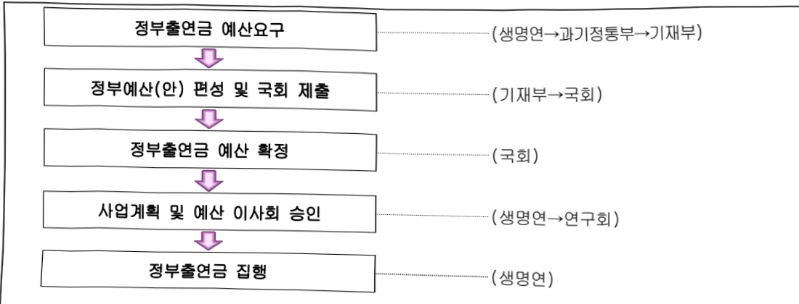

# 한국생명공학연구원 연구 운영비 지원(R&D)

**해당 페이지**: PDF 1658 ~ 1666 쪽 해당

**부처**: 과학기술정보통신부
**분야**: 과학기술
**회계유형**: 일반회계
**2026 확정예산**: 105590.0 백만원
**전년대비 증감률**: 11.8%
**AI 도메인**: R&D 지원

---

### 가.예산 총괄표

(단위: 백만원, %)

<table border=1 style='margin: auto; word-wrap: break-word;'><tr><td rowspan="2">사업명</td><td rowspan="2">2024년 결산</td><td colspan="2">2025년 예산</td><td colspan="2">2026년 예산</td><td rowspan="2">증감(B-A)</td><td rowspan="2">(B-A)/A</td></tr><tr><td style='text-align: center; word-wrap: break-word;'>본예산</td><td style='text-align: center; word-wrap: break-word;'>추경*(A)</td><td style='text-align: center; word-wrap: break-word;'>요구안</td><td style='text-align: center; word-wrap: break-word;'>본예산(B)</td></tr><tr><td style='text-align: center; word-wrap: break-word;'>한국생명공학연구원연구운영비지원(R&amp;D)</td><td style='text-align: center; word-wrap: break-word;'>80,531</td><td style='text-align: center; word-wrap: break-word;'>94,484</td><td style='text-align: center; word-wrap: break-word;'>94,484</td><td style='text-align: center; word-wrap: break-word;'>105,590</td><td style='text-align: center; word-wrap: break-word;'>105,590</td><td style='text-align: center; word-wrap: break-word;'>11,106</td><td style='text-align: center; word-wrap: break-word;'>11.8</td></tr></table>

* 추경: 추경증감액을 포함한 최종 예산액을 기재

## □ 기능별(내역사업별) 예산 내역

(단위:백만원)

<table border=1 style='margin: auto; word-wrap: break-word;'><tr><td rowspan="2"></td><td colspan="5">2024</td><td colspan="5">2025</td></tr><tr><td style='text-align: center; word-wrap: break-word;'>예산액(추정)</td><td style='text-align: center; word-wrap: break-word;'>예산현액</td><td style='text-align: center; word-wrap: break-word;'>집행액</td><td style='text-align: center; word-wrap: break-word;'>이월액</td><td style='text-align: center; word-wrap: break-word;'>불용액</td><td style='text-align: center; word-wrap: break-word;'>예산액(추정)</td><td style='text-align: center; word-wrap: break-word;'>예산현액</td><td style='text-align: center; word-wrap: break-word;'>집행액</td><td style='text-align: center; word-wrap: break-word;'>이월액</td><td style='text-align: center; word-wrap: break-word;'>불용액</td></tr><tr><td style='text-align: center; word-wrap: break-word;'>○ 기능별 분류(합계)</td><td style='text-align: center; word-wrap: break-word;'>82,763</td><td style='text-align: center; word-wrap: break-word;'>82,763</td><td style='text-align: center; word-wrap: break-word;'>80,531</td><td style='text-align: center; word-wrap: break-word;'>-</td><td style='text-align: center; word-wrap: break-word;'>-</td><td style='text-align: center; word-wrap: break-word;'>94,484</td><td style='text-align: center; word-wrap: break-word;'>94,484</td><td style='text-align: center; word-wrap: break-word;'>92,946</td><td style='text-align: center; word-wrap: break-word;'>-</td><td style='text-align: center; word-wrap: break-word;'>1,538</td></tr><tr><td style='text-align: center; word-wrap: break-word;'>· 기관운영비</td><td style='text-align: center; word-wrap: break-word;'>39,693</td><td style='text-align: center; word-wrap: break-word;'>39,693</td><td style='text-align: center; word-wrap: break-word;'>37,461</td><td style='text-align: center; word-wrap: break-word;'>-</td><td style='text-align: center; word-wrap: break-word;'>-</td><td style='text-align: center; word-wrap: break-word;'>40,890</td><td style='text-align: center; word-wrap: break-word;'>40,890</td><td style='text-align: center; word-wrap: break-word;'>39,352</td><td style='text-align: center; word-wrap: break-word;'>-</td><td style='text-align: center; word-wrap: break-word;'>1,538</td></tr><tr><td style='text-align: center; word-wrap: break-word;'>· 주요사업비</td><td style='text-align: center; word-wrap: break-word;'>43,070</td><td style='text-align: center; word-wrap: break-word;'>43,070</td><td style='text-align: center; word-wrap: break-word;'>43,070</td><td style='text-align: center; word-wrap: break-word;'>-</td><td style='text-align: center; word-wrap: break-word;'>-</td><td style='text-align: center; word-wrap: break-word;'>53,594</td><td style='text-align: center; word-wrap: break-word;'>53,594</td><td style='text-align: center; word-wrap: break-word;'>53,594</td><td style='text-align: center; word-wrap: break-word;'>-</td><td style='text-align: center; word-wrap: break-word;'>-</td></tr></table>

### 나.사업설명자료

## 1 ) 사업목적·내용

- (한국생명공학연구원 연구운영비 지원) 생명과학기술분야의 연구개발 및 공공인프라 구축·운영을 통해 국가 생명과학 기술, 산업발전 및 국가·사회현안 해결에 기여

<기본사업>

(첨단바이오 의약 원천기술 개발) 차세대 유전자 세포 치료제 등 개발을 통해 난치질환 극복방안 제시 및 개인 맞춤형 치료를 위한 미래혁신기술 개발로 국민의 건강한 삶 실현

(첨단 바이오 융합 소재 및 기술 개발) 바이오 융합기술과 고부가가치 바이오소재 개발을 통한 신산업 창출 및 융합형 신영역 발굴을 위한 도전적 연구기반 확대

(국가사회현안 해결 바이오핵심기술 개발) 노화, 감염병, 기후·환경변화 등으로 발생하는 바이오분야 국가사회현안 해결을 위한 핵심 원천기술 개발

(바이오 인프라 선진화) 글로벌 수준의 생명연구자원 및 정보 확보·보존·활용 체계 고도화, 기술지원 및 바이오 정책 기반 구축

## <전략연구사업>

(AI 활용 하이브리드 치료제 전략연구사업) 기존 의약품 한계(부작용, 내성 발생 등)

극복 및 신규 모달리티 시장 선점을 위한 신규 하이브리드 모달리티 치료제 개발 추진

---

(이식형 오가노이드-장기 전략연구사업) 장기 이식 수요 대응 등 국가사회적 현안

해결 및 산업 여건이 열약한 국내 인공장기 및 오가노이드 산업생태계 성장을

위한 이식형 오가노이드-장기 및 재생치료제 개발 추진

(합성생물학 기반 바이오항공유 전략연구사업) 미세조류 합성생물학 기반 바이오항공유

생산 기술 개발을 통한 국가 온실가스 감축목표 달성 기여 및 바이오제조 경제 활성화

## 2 ) 사업개요

사업근거 및 추진경위

① 법령상 근거 및 조항 : 「과학기술분야 정부출연연구기관 등의 설립 · 운영 및 육성에 관한 법률」 제5조 제2항

② 추진경위

- '85. 2 : 유전공학센터 설립(서울, 홍릉)

- '90. 7 : 대덕연구단지내 신축청사로 이전

- '95. 3 : 생명공학연구소로 명칭 변경

- '99. 5 : 기초기술연구회 소속 생명공학연구소로 독립법인화

- '01. 1 : 한국생명공학연구원으로 명칭 변경

- '05. 6 : 오창분원(충북 오창) 설치.운영

- '06.11 : 전북분원(전북 정읍) 설치.운영

## □ 주요내용

① 사업규모

- 총사업비 : 계속

- 사업기간 : 1985년 ~ 계속

- 최근 5년 간 투입된 사업비

<table border=1 style='margin: auto; word-wrap: break-word;'><tr><td style='text-align: center; word-wrap: break-word;'>연도</td><td style='text-align: center; word-wrap: break-word;'>2022</td><td style='text-align: center; word-wrap: break-word;'>2023</td><td style='text-align: center; word-wrap: break-word;'>2024</td><td style='text-align: center; word-wrap: break-word;'>2025</td><td style='text-align: center; word-wrap: break-word;'>2026</td></tr><tr><td style='text-align: center; word-wrap: break-word;'>사업비</td><td style='text-align: center; word-wrap: break-word;'>97,003</td><td style='text-align: center; word-wrap: break-word;'>105,553</td><td style='text-align: center; word-wrap: break-word;'>82,763</td><td style='text-align: center; word-wrap: break-word;'>94,484</td><td style='text-align: center; word-wrap: break-word;'>105,590</td></tr></table>

② 사업추진체계

- 사업시행방법 : 출연

- 사업시행주체 : 한국생명공학연구원

- 사업 수혜자 : 산업계, 학계, 연구계 관계자 및 국민

- 보조, 융자, 출연, 출자 등의 경우 보조·융자 등 지원 비율 및 법적근거

---

<table border=1 style='margin: auto; word-wrap: break-word;'><tr><td style='text-align: center; word-wrap: break-word;'>내역사업명</td><td style='text-align: center; word-wrap: break-word;'>구분</td><td style='text-align: center; word-wrap: break-word;'>피보조·피출연 등 기관명</td><td style='text-align: center; word-wrap: break-word;'>지원 금액 (2026예산)</td><td style='text-align: center; word-wrap: break-word;'>지원 비율(%)</td><td style='text-align: center; word-wrap: break-word;'>보조율 법적근거 (해당 조항)</td></tr><tr><td style='text-align: center; word-wrap: break-word;'>한국생명 공학연구원 연구운영비 지원 (R&amp;I)</td><td style='text-align: center; word-wrap: break-word;'>출연</td><td style='text-align: center; word-wrap: break-word;'>한국생명 공학연구원</td><td style='text-align: center; word-wrap: break-word;'>105,590</td><td style='text-align: center; word-wrap: break-word;'>100%</td><td style='text-align: center; word-wrap: break-word;'>과학기술분야정부출연연구기관등의 설립.운영 및 육성에 관한 법률 제5조1,2항</td></tr></table>

## 3 ) 2026년도 예산 산출 근거

□ 인건비 : (2025) 37,505 → (2026) 38,838 백만원, +3.6%

○ (요구) '25년도 신규인력 미반영 인건비(20), 처우개선분(3.5%) (1,313) 등

○ (산출) 677명 × 57백만원 × 12/12개월 = 38,838백만원

□ 경상비 : (2025) 3,385 → (2026) 8,586 백만원, +153.6%

(요구) 전기요금 인상분(55), 분원운영비 이관(주요사업비→경상비, 5116), 경상비

효율화(△51) 등

(산출) 1개 × 12/12개월 × 8,586백만원

※ 사유 : '23년 대비 '24년 전기로 인상분 55백만원, 분원운영비 이관 5,116백만원, 자회사 처우개선분 및 휴게시간 조정에 따른 인건비 추가분(보안관리단) 81백만원, 경상비 효율화 △51백만원

□ 주요사업비 : (2025) 53,594 → (2026) 58,166 백만원, 8.5%

○ 첨단바이오의약 원천기술 개발 : (2025) 20,583 → (2026) 8,876, △56.9%

- (요구) 대과제 이관(△4,822), 분원운영비 이관(→경상비) (△1,986) 등 전년 대비

56.9% 감액

- (신출) 3개 x 12/12개월 x 2,959백만원

○ 첨단바이오 융합 소재 및 기술개발 : (2025) 8,028 → (2026) 4,490, △44.1%

- (요구) 대과제 이관(△804), 분원운영비 이관(→경상비) (△933) 등 전년 대비

44.1% 감액

- (산출) 3개 x 12/12개월 x 1,497백만원

○ 국가사회헌안 해결 바이오 핵심기술 개발 : (2025) 10,152 → (2026) 10,246, 0.9%

- (요구) 대과제 이관(+1,626), 분원운영비 이관(→경상비) (△1,132) 등 전년 대비

0.9% 증액

- (산출) 3개 x 12/12개월 x 3,415백만원

---

- (요구) 대과제 이관(+4,000), 분원운영비 이관(→경상비) (△1,065) 등 전년 대비 21.4% 증액

- (산출) 4개 x 12/12개월 x 3,668백만원

○ 장비구입비 : (2025) 2,746 → (2026) 3,688, 34.3%

- (요구) 장비구입비 이관(+942) 등 전년 대비 34.3% 증액

- (산출) 1개 x 12/12개월 x 3,688백만원

○ AI 활용 하이브리드 모달리티 치료제 전략연구사업 : (2025) - → (2026) 6,555, 순증

- (요구) 'AI 활용 하이브리드 모달리티 치료제 전략연구사업'(총사업비 45,000백만원) 신규

- (산출) 1개 x 12/12개월 x 6,555백만원

○ 이식형 오가노이드-장기 전략연구사업 : (2025) - → (2026) 4,734, 순증

- (요구) ‘이식형 오가노이드-장기 전략연구사업’(총사업비 32.500백만원) 신규

- (산출) 1개 x 12/12개월 x 4,734백만원

○ 합성생물학 기반 바이오항공유 전략연구사업 : (2025) - → (2026) 4,907, 순증 - (요구) ‘합성생물학 기반 바이오항공유 전략연구사업’(총사업비 33,690백만원) 신규 - (산출) 1개 x 12/12개월 x 4,907백만원

2025년도 예산 및 2026년도 예산 산출 세부내역 비교

<table border=1 style='margin: auto; word-wrap: break-word;'><tr><td style='text-align: center; word-wrap: break-word;'>구분</td><td style='text-align: center; word-wrap: break-word;'>&#x27;25년 예산 산출내역</td><td style='text-align: center; word-wrap: break-word;'>&#x27;26년 예산 산출내역</td></tr><tr><td style='text-align: center; word-wrap: break-word;'>☐한국생명공학연구원연구운영비 지원(R&amp;D)</td><td style='text-align: center; word-wrap: break-word;'>94,484백만원</td><td style='text-align: center; word-wrap: break-word;'>105,590백만원</td></tr><tr><td style='text-align: center; word-wrap: break-word;'>(1) 인건비</td><td style='text-align: center; word-wrap: break-word;'>37,505백만원기반영 인건비(36,393백만원, 668명)인건비 처우 개선분(3.0%, 1,092백만원)&#x27;25년 신규 인력 인건비(20백만원)</td><td style='text-align: center; word-wrap: break-word;'>38,838백만원기반영 인건비(37,505백만원, 677명)&#x27;25년 신규 인력(1명) 인건비 미반영분(20백만원) 처우개선(3.5%, 1,313백만원)</td></tr><tr><td style='text-align: center; word-wrap: break-word;'>(2) 경상비</td><td style='text-align: center; word-wrap: break-word;'>3,385백만원&#x27;22년 기반영 경상비(3,300백만원)자회사 처우개선분 (50백만원)공공요금 증액분 등 (35백만원)</td><td style='text-align: center; word-wrap: break-word;'>8,586백만원&#x27;25년 기반영 경상비(3,385백만원)공공요금(전기) 증액(55백만원)자회사 처우개선 등 (81백만원)분원운영비 이관(주요사업비→경상비) (5,116백만원)경상비 효율화(△51백만원)</td></tr></table>

---

<table border=1 style='margin: auto; word-wrap: break-word;'><tr><td style='text-align: center; word-wrap: break-word;'>구분</td><td style='text-align: center; word-wrap: break-word;'>&#x27;25년 예산 산출내역</td><td style='text-align: center; word-wrap: break-word;'>&#x27;26년 예산 산출내역</td><td style='text-align: center; word-wrap: break-word;'></td></tr><tr><td style='text-align: center; word-wrap: break-word;'>(3) 주요사업비</td><td style='text-align: center; word-wrap: break-word;'>53,594백만원</td><td style='text-align: center; word-wrap: break-word;'>58,166백만원&lt;주요사업&gt;첨단바이오의약 원천기술 개발 20,583백만원* 3개 과제 x 6,861백만원 = 20,583백만원바이오 융합·소재 개발 8,028백만원* 4개 과제 x 2,007백만원 = 8,028백만원국민생활 문제 해결 바이오핵심기술 개발 10,152백만원* 3개 과제 x 3,384백만원 = 10,152백만원바이오 인프라 선진화 12,085백만원* 4개 과제 x 3,021백만원 = 12,085백만원장비구입비 2,746백만원* 1개 x 2,746백만원 = 2,746백만원</td><td style='text-align: center; word-wrap: break-word;'>첨단바이오의약 원천기술 개발 8,876백만원* 3개 과제 x 2,959백만원 = 8,876백만원첨단바이오 융합 소재 및 기술개발 4,490백만원* 3개 과제 x 1,497만원 = 4,490백만원국가사회현안 해결 바이오 핵심기술 개발 10,246백만원* 3개 과제 x 3,415백만원 = 10,246백만원바이오 인프라 선진화 14,670백만원* 4개 과제 x 3,668백만원 = 14,670백만원장비구입비 3,688백만원* 1개 x 3,688백만원 = 3,688백만원&lt;전략연구사업&gt;AI 활용 하이브리드 모달리티 치료제 전략연구사업 6,555백만원* 1개 과제 x 6,555백만원 = 6,555백만원이식형 오가노이드·장기 전략연구사업 4,734백만원* 1개 과제 x 4,734백만원 = 4,734백만원합성생물학 기반 바이오항공유 전략연구사업 4,907백만원* 1개 과제 x 4,907백만원 = 4,907백만원</td></tr></table>

## 4 ) 사업효과

사업영향, 산출물 성과지표 등

① 2022~2026년도 성과계획서 상 성과지표 및 최근 5년간 성과 달성도 : 해당없음

② 성과지표 이외의 연도별 사업추진 경과 및 실적

<table border=1 style='margin: auto; word-wrap: break-word;'><tr><td style='text-align: center; word-wrap: break-word;'>2022</td><td style='text-align: center; word-wrap: break-word;'>- 스마트폰 기반 코로나 19 변종을 1시간내 현장 진단해 다양한 바이러스를 진단(ACS Nano) - 과킨슨병 유전자의 미만형 위암 예후진단 원리로 치료제 개발 기대(J Exper Clin Cancer Res) - 혈액 검사로 초기 알츠하이머 진단 플랫폼을 개발해 조기 진단(Biosensors and Bicelectronics) - 혈액 내 신속한 위암 정밀진단 플랫폼을 개발해 효과적 치료를 기대(Chemical Engineering J) - 유해균 억제로 대장암 원리 규명해 치료제 개발과 마이크로바이옵 개선(Microbiome, ISME J) - GHB(물뽕) 마약 현장 탐지 기술을 개발해 성범죄 예방을 지원(Biosensors and Bioelectronics) - 고온에서 감자 수확량이 감소하는 원리를 규명해 뛰어난 감자 품종개발을 기대(Cell Reports) - in vitro에서 성숙된 인간 장관 오가노이드의 제조기술 개발 및 기술이전(주요기초이드사이언스)</td></tr></table>

---

<table border=1 style='margin: auto; word-wrap: break-word;'><tr><td style='text-align: center; word-wrap: break-word;'>2023</td><td style='text-align: center; word-wrap: break-word;'>- NK세포의 항암 활성을 조절하는 신규 면역관문(NgR1) 발굴(Nature Immunology) - 포도당(글루코스) 섭취를 제한하면, 수명이 연장되는 기전 규명(Nature Communications) - 암 탐지와 표적 치료까지 동시에 가능한 항암 생균치료제 개발(J. Controlled Release) - 단일 분자로도 측정 가능한 극미량/고효율 신약발굴 센서 개발(Nature Communications) - 초미세먼지와 세포 상호작용 분석으로, 초미세먼지 독성 실마리(J. Hazardous Materials) - 영장류 감염모델에서 코로나바이러스 변이의 폐 면역반응을 규명(J. Medical Virology) - 갈색지방의 열 생성 관여 신규 단백질(LETMDI)과 위치를 규명(Nature Communications) - 장내 미생물에서 염증반응 조절하는 단백질(AmTARS) 효소 발견(Cell Host &amp; Microbe) - SYT11 억제제를 유효성분으로 포함하는 위암 치료용 조성물 및 미만형위암 진단마커 기술 개발 및 기술이전(원큐어젠(쥐)) - 신규한 항-CD5 키메틱 항원 수용체 및 이를 발현하는 면역세포 활용기술 개발 및 기술이전(쥐)티에스바이오)</td></tr><tr><td style='text-align: center; word-wrap: break-word;'>2024</td><td style='text-align: center; word-wrap: break-word;'>- 유전성 하지마비 질환의 유전자치료 기술 개발(Journal of Experimental Medicine) - 고효율 바이오에너지 생산 가능한 합성 미생물 생태계 플랫폼 개발(Nature Communications) - 오가노이드에서 고순도 줄기세포를 대량 배양하는 기술 개발(Nature Communications) - 신·변종 호흡기 바이러스 현장 신속진단 플랫폼 개발(Advanced Materials) - 식물 합성생물학 연구에서 가장 많이 활용되고 있는 담배류 식물 ‘니코티아나 벤타미아나(N. benthamiana)’의 고품질 표준유전체 해독(Scientific Data) - 장내 미생물(아커만시아 뮤시니필라) 유래 단백질(Amuc_1409)의 장 줄기세포 재생 촉진 기전 규명(Nature Communications) - miR-1290 마이크로RNA의 간암 세포 성장 기전 규명 및 제어기술 개발(Cancer communications) - 마우스 유도만능줄기세포에서 세포외소포체를 분비하는 3차원 피부 상피 오가노이드 개발(Biomaterials) - 식물발현시스템 기반의 바이러스 진단 학체 생산 플랫폼 개발(Plant Biotechnology Journal)</td></tr><tr><td style='text-align: center; word-wrap: break-word;'>2025</td><td style='text-align: center; word-wrap: break-word;'>- 폐암 표적 치료하는 약물전달 나노바디 개발(Signal Transduct. Target. Therapy) - 메소텔린(MSLN) 단백질 표적의 췌장암 약물전달 치료법 개발(Molecular Cancer) - AI로 훈련된 영장류 행동 연구용 무선 뇌신경 기록기 개발(Nature Biomedical Engineering) - V(D)J 재조합 O-GlcNAc의 단백질 조절로 학체 개발(Cellular &amp; Molecular Immunology)</td></tr></table>

## ③향후(2026년도 이후)기대효과

## <기본사업>

- (첨단바이오 의약 원천기술개발) 신약개발 플랫폼 구동을 통한 산학·연 견인 등 거점 역할

선도 및 오가노이드, 인공장기 등 첨단 재생치료 기술 개발을 통한 국가 경쟁력 제고 기여

- (첨단바이오 융합 소재 및 기술개발) 퍼급력 높은 합성생물학 혁신기술 및 바이오파운드리

위크플로 가속화 기술 확보 및 데이터 기반 차세대 식의약 활성소재 발굴 및 고도화를

통한 혁신적 바이오 소재 개발 기술 확립

---

- (국가사회현안 해결 바이오핵심기술 개발) 부가가치가 높은 노화 치료 원천기술 확보 및 항노화 신약개발 촉진, 감염병 평가 및 스마트 백신 플랫폼 활용 후보물질 발굴을 통한 팬데믹 신속·효율 대응 체계 구축

- (바이오 인프라 선진화) 국가생명연구자원(소재·연구 데이터) 공공 인프라 역량 고도화를 통한 연구자원 자급률 제고 및 국가 바이오산업 기술경쟁력 강화 기여

## <전략연구사업>

- (AI 활용 하이브리드 치료제 전략연구사업) 항암 DAC 치료제, 항체기반 표적단백질 분해제 개발 등을 통한 국내 신약개발 생태계 활성화 기여

- (이식형 오가노이드-장기 전략연구사업) 이식형 오가노이드-장기 기반 장기 이식

수요 충당, 재생치료제 파이프라인 구축 지원 등 재생의료 산업생태계 활성화

- (합성생물학 기반 바이오항공유 전략연구사업) 약 19.6만톤 CO₂ 감축 효과를 통한

NDC 달성 기여 및 수입에 의존하고 있는 식물유지 유래 SAF 시장에 대한 수입

대체효과 창출 등

5) 타당성조사 및 예비타당성조사 시행여부 및 결과 요지 : 해당없음

6) 총사업비 대상사업 정보 : 해당없음

## 7 ) 사업 집행절차

° 예산(안) 편성지침 및 기준 통보 (기획재정부)

° 기관 예산요구서 제출 (한국생명공학연구원 → 국가과학기술연구회)

이사회 심의.의결.제출 (국가과학기술연구회 → 과학기술정보통신부)

° 부처 예산요구서 제출 (과학기술정보통신부 → 기획재정부)

° 정부예산(안) 국회 제출 (기획재정부 → 국회)

° 정부예산 확정 (국회)

- 사업계획 및 예산(안) 이사회 승인

---

## 8 ) 각종 평가

<table border=1 style='margin: auto; word-wrap: break-word;'><tr><td style='text-align: center; word-wrap: break-word;'>1) 국회(예결위, 상임위, 예정처, 국정감사 포함) 지적 : 해당사항 없음</td></tr><tr><td style='text-align: center; word-wrap: break-word;'>2) 대외공개 평가 : 해당사항 없음</td></tr><tr><td style='text-align: center; word-wrap: break-word;'>3) 자체평가 : 해당사항 없음</td></tr></table>

### 다. 최근 4년간 결산내역

## 1 ) 결산표

☐ 부처 결산내역

(단위: 백만원, %)

<table border=1 style='margin: auto; word-wrap: break-word;'><tr><td rowspan="2">연도</td><td colspan="3">예산액</td><td rowspan="2">예산현액(A)</td><td rowspan="2">집행액(B)</td><td rowspan="2">집행률(B/A)</td><td rowspan="2">다음연도이월액</td><td rowspan="2">불용액</td></tr><tr><td style='text-align: center; word-wrap: break-word;'>본예산</td><td style='text-align: center; word-wrap: break-word;'>추경증감액</td><td style='text-align: center; word-wrap: break-word;'>추경</td></tr><tr><td style='text-align: center; word-wrap: break-word;'>2022</td><td style='text-align: center; word-wrap: break-word;'>97,003</td><td style='text-align: center; word-wrap: break-word;'>-</td><td style='text-align: center; word-wrap: break-word;'>97,003</td><td style='text-align: center; word-wrap: break-word;'>97,003</td><td style='text-align: center; word-wrap: break-word;'>95,401</td><td style='text-align: center; word-wrap: break-word;'>98.3</td><td style='text-align: center; word-wrap: break-word;'>-</td><td style='text-align: center; word-wrap: break-word;'>1,602</td></tr><tr><td style='text-align: center; word-wrap: break-word;'>2023</td><td style='text-align: center; word-wrap: break-word;'>105,553</td><td style='text-align: center; word-wrap: break-word;'>-</td><td style='text-align: center; word-wrap: break-word;'>105,553</td><td style='text-align: center; word-wrap: break-word;'>105,553</td><td style='text-align: center; word-wrap: break-word;'>103,987</td><td style='text-align: center; word-wrap: break-word;'>98.5</td><td style='text-align: center; word-wrap: break-word;'>-</td><td style='text-align: center; word-wrap: break-word;'>1,566</td></tr><tr><td style='text-align: center; word-wrap: break-word;'>2024</td><td style='text-align: center; word-wrap: break-word;'>82,763</td><td style='text-align: center; word-wrap: break-word;'>-</td><td style='text-align: center; word-wrap: break-word;'>82,763</td><td style='text-align: center; word-wrap: break-word;'>82,763</td><td style='text-align: center; word-wrap: break-word;'>80,531</td><td style='text-align: center; word-wrap: break-word;'>97.3</td><td style='text-align: center; word-wrap: break-word;'>-</td><td style='text-align: center; word-wrap: break-word;'>2,232</td></tr><tr><td style='text-align: center; word-wrap: break-word;'>2025</td><td style='text-align: center; word-wrap: break-word;'>94,484</td><td style='text-align: center; word-wrap: break-word;'>-</td><td style='text-align: center; word-wrap: break-word;'>94,484</td><td style='text-align: center; word-wrap: break-word;'>94,484</td><td style='text-align: center; word-wrap: break-word;'>92,946</td><td style='text-align: center; word-wrap: break-word;'>98.4</td><td style='text-align: center; word-wrap: break-word;'>-</td><td style='text-align: center; word-wrap: break-word;'>1,538</td></tr></table>

## 2 ) 주요 결산사항

□ 2022~2025년 결산 주요사항

<table border=1 style='margin: auto; word-wrap: break-word;'><tr><td style='text-align: center; word-wrap: break-word;'>2022</td><td style='text-align: center; word-wrap: break-word;'>- 인력 미충원 등으로 발생한 인건비 집행잔액 1,602백만원 불용(미교부)</td></tr><tr><td style='text-align: center; word-wrap: break-word;'>2023</td><td style='text-align: center; word-wrap: break-word;'>- 인력 미충원 등으로 발생한 인건비 집행잔액 1,566백만원 불용(미교부)</td></tr><tr><td style='text-align: center; word-wrap: break-word;'>2024</td><td style='text-align: center; word-wrap: break-word;'>- 인력 미충원 등으로 발생한 인건비 집행잔액 2,232백만원 불용(미교부)</td></tr><tr><td style='text-align: center; word-wrap: break-word;'>2025</td><td style='text-align: center; word-wrap: break-word;'>- 인력 미충원 등으로 발생한 인건비 집행잔액 1,538백만원 불용(미교부)</td></tr></table>

□ 2025년 이·전용 등 세부내역 : 해당사항 없음

---

<table border=1 style='margin: auto; word-wrap: break-word;'><tr><td style='text-align: center; word-wrap: break-word;'>사 업 명</td></tr><tr><td style='text-align: center; word-wrap: break-word;'>(233) 한국생산기술연구원 연구운영비 지원(R&amp;D) (2241-422)</td></tr></table>

## ☐ 사업 코드 정보

<table border=1 style='margin: auto; word-wrap: break-word;'><tr><td style='text-align: center; word-wrap: break-word;'>구분</td><td style='text-align: center; word-wrap: break-word;'>회계</td><td style='text-align: center; word-wrap: break-word;'>소관</td><td style='text-align: center; word-wrap: break-word;'>실국(기관)</td><td style='text-align: center; word-wrap: break-word;'>계정</td><td style='text-align: center; word-wrap: break-word;'>분야</td><td style='text-align: center; word-wrap: break-word;'>부문</td></tr><tr><td style='text-align: center; word-wrap: break-word;'>코드</td><td rowspan="2">일반회계</td><td rowspan="2">과학기술정보통신부</td><td rowspan="2">연구개발정책실기초원천연구정책관</td><td rowspan="2"></td><td style='text-align: center; word-wrap: break-word;'>150</td><td style='text-align: center; word-wrap: break-word;'>152</td></tr><tr><td style='text-align: center; word-wrap: break-word;'>명칭</td><td style='text-align: center; word-wrap: break-word;'>과학기술</td><td style='text-align: center; word-wrap: break-word;'>과학기술연구지원</td></tr></table>

<table border=1 style='margin: auto; word-wrap: break-word;'><tr><td style='text-align: center; word-wrap: break-word;'>구분</td><td style='text-align: center; word-wrap: break-word;'>프로그램</td><td style='text-align: center; word-wrap: break-word;'>단위사업</td><td style='text-align: center; word-wrap: break-word;'>세부사업</td></tr><tr><td style='text-align: center; word-wrap: break-word;'>코드</td><td style='text-align: center; word-wrap: break-word;'>2200</td><td style='text-align: center; word-wrap: break-word;'>2241</td><td style='text-align: center; word-wrap: break-word;'>422</td></tr><tr><td style='text-align: center; word-wrap: break-word;'>명칭</td><td style='text-align: center; word-wrap: break-word;'>출연연구기관지원</td><td style='text-align: center; word-wrap: break-word;'>국가과학기술연구회 소관출연연구기관지원</td><td style='text-align: center; word-wrap: break-word;'>한국생산기술연구원 연구운영비지원(R&amp;D)</td></tr></table>

☐ 사업 성격 (공통요구자료 II-1 작성유의사항 4. 참조, 해당하는 사항에 “○” 표시)

<table border=1 style='margin: auto; word-wrap: break-word;'><tr><td rowspan="2">신규</td><td rowspan="2">계속</td><td rowspan="2">완료</td><td rowspan="2">예비타당성실시여부</td><td rowspan="2">총사업비관리대상</td><td rowspan="2">총액계상예산사업</td><td style='text-align: center; word-wrap: break-word;'>사업소관 변경정보</td></tr><tr><td style='text-align: center; word-wrap: break-word;'>2025예산 시 소관</td></tr><tr><td style='text-align: center; word-wrap: break-word;'></td><td style='text-align: center; word-wrap: break-word;'>○</td><td style='text-align: center; word-wrap: break-word;'></td><td style='text-align: center; word-wrap: break-word;'></td><td style='text-align: center; word-wrap: break-word;'></td><td style='text-align: center; word-wrap: break-word;'></td><td style='text-align: center; word-wrap: break-word;'></td></tr></table>

□ 사업 지원 형태 및 지원을 (최소한 한 개는 반드시 선택하시오. 해당사항에 0 표시)

<table border=1 style='margin: auto; word-wrap: break-word;'><tr><td style='text-align: center; word-wrap: break-word;'>직접</td><td style='text-align: center; word-wrap: break-word;'>출자</td><td style='text-align: center; word-wrap: break-word;'>출연</td><td style='text-align: center; word-wrap: break-word;'>보조</td><td style='text-align: center; word-wrap: break-word;'>융자</td><td style='text-align: center; word-wrap: break-word;'>국고보조율(%)</td><td style='text-align: center; word-wrap: break-word;'>융자율(%)</td></tr><tr><td style='text-align: center; word-wrap: break-word;'></td><td style='text-align: center; word-wrap: break-word;'></td><td style='text-align: center; word-wrap: break-word;'>○</td><td style='text-align: center; word-wrap: break-word;'></td><td style='text-align: center; word-wrap: break-word;'></td><td style='text-align: center; word-wrap: break-word;'></td><td style='text-align: center; word-wrap: break-word;'></td></tr></table>

□ 사업 소관부처 및 시행주체

<table border=1 style='margin: auto; word-wrap: break-word;'><tr><td style='text-align: center; word-wrap: break-word;'>사업명</td><td colspan="2">구분</td></tr><tr><td rowspan="3">한국생산기술연구원연구운영비지원(R&amp;D)(2241-422)</td><td rowspan="2">소관부처</td><td style='text-align: center; word-wrap: break-word;'>연구개발정책실 기초원천연구정책관</td></tr><tr><td style='text-align: center; word-wrap: break-word;'>연구기관혁신정책과</td></tr><tr><td style='text-align: center; word-wrap: break-word;'>사업시행주체</td><td style='text-align: center; word-wrap: break-word;'>한국생산기술연구원</td></tr></table>

---

### 원본 PDF 크롭 이미지

