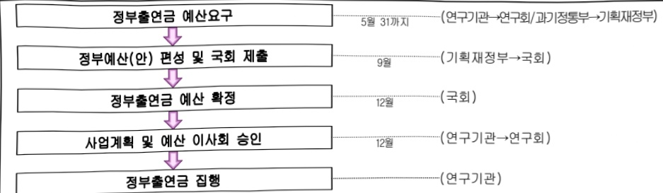

# 한국생산기술연구원연구운영비지원(R&D)

**해당 페이지**: PDF 1667 ~ 1674 쪽 해당

**부처**: 과학기술정보통신부
**분야**: 과학기술
**회계유형**: 일반회계
**2026 확정예산**: 149825.0 백만원
**전년대비 증감률**: 28.7%
**AI 도메인**: R&D 지원

---

### 가.예산 총괄표

(단위: 백만원, %)

<table border=1 style='margin: auto; word-wrap: break-word;'><tr><td rowspan="2">사업명</td><td rowspan="2">2024년 결산</td><td colspan="2">2025년 예산</td><td colspan="2">2026년 예산</td><td rowspan="2">증감 (B-A)</td><td rowspan="2">(B-A)/A</td></tr><tr><td style='text-align: center; word-wrap: break-word;'>본예산</td><td style='text-align: center; word-wrap: break-word;'>추경*(A)</td><td style='text-align: center; word-wrap: break-word;'>요구안</td><td style='text-align: center; word-wrap: break-word;'>본예산(B)</td></tr><tr><td style='text-align: center; word-wrap: break-word;'>한국생산기술연구원 연구운영비지원(R&amp;D)</td><td style='text-align: center; word-wrap: break-word;'>104,326</td><td style='text-align: center; word-wrap: break-word;'>116,405</td><td style='text-align: center; word-wrap: break-word;'>116,405</td><td style='text-align: center; word-wrap: break-word;'>149,825</td><td style='text-align: center; word-wrap: break-word;'>149,825</td><td style='text-align: center; word-wrap: break-word;'>33,420</td><td style='text-align: center; word-wrap: break-word;'>28.7</td></tr></table>

□ 기능별(내역사업별) 예산 내역

(단위:백만원)

<table border=1 style='margin: auto; word-wrap: break-word;'><tr><td rowspan="2"></td><td colspan="5">2024</td><td colspan="5">2025</td><td rowspan="2">2026 倉圧</td></tr><tr><td style='text-align: center; word-wrap: break-word;'>倉圧(専倉)</td><td style='text-align: center; word-wrap: break-word;'>倉圧(専倉)</td><td style='text-align: center; word-wrap: break-word;'>倉圧(専倉)</td><td style='text-align: center; word-wrap: break-word;'>倉圧(専倉)</td><td style='text-align: center; word-wrap: break-word;'>倉圧(専倉)</td><td style='text-align: center; word-wrap: break-word;'>倉圧(専倉)</td><td style='text-align: center; word-wrap: break-word;'>倉圧(専倉)</td><td style='text-align: center; word-wrap: break-word;'>倉圧(専倉)</td><td style='text-align: center; word-wrap: break-word;'>倉圧(専倉)</td><td style='text-align: center; word-wrap: break-word;'>倉圧(専倉)</td></tr><tr><td style='text-align: center; word-wrap: break-word;'>○ 기능별 분류(합계)</td><td style='text-align: center; word-wrap: break-word;'>106,779</td><td style='text-align: center; word-wrap: break-word;'>106,779</td><td style='text-align: center; word-wrap: break-word;'>104,326</td><td style='text-align: center; word-wrap: break-word;'>-</td><td style='text-align: center; word-wrap: break-word;'>2,453</td><td style='text-align: center; word-wrap: break-word;'>116,405</td><td style='text-align: center; word-wrap: break-word;'>116,405</td><td style='text-align: center; word-wrap: break-word;'>114,731</td><td style='text-align: center; word-wrap: break-word;'>-</td><td style='text-align: center; word-wrap: break-word;'>1,674</td><td style='text-align: center; word-wrap: break-word;'>149,825</td></tr><tr><td style='text-align: center; word-wrap: break-word;'>· 기관운영비</td><td style='text-align: center; word-wrap: break-word;'>63,493</td><td style='text-align: center; word-wrap: break-word;'>63,493</td><td style='text-align: center; word-wrap: break-word;'>61,040</td><td style='text-align: center; word-wrap: break-word;'>-</td><td style='text-align: center; word-wrap: break-word;'>2,453</td><td style='text-align: center; word-wrap: break-word;'>65,405</td><td style='text-align: center; word-wrap: break-word;'>65,405</td><td style='text-align: center; word-wrap: break-word;'>63,731</td><td style='text-align: center; word-wrap: break-word;'>-</td><td style='text-align: center; word-wrap: break-word;'>1,674</td><td style='text-align: center; word-wrap: break-word;'>70,962</td></tr><tr><td style='text-align: center; word-wrap: break-word;'>· 주요사업비</td><td style='text-align: center; word-wrap: break-word;'>43,286</td><td style='text-align: center; word-wrap: break-word;'>43,286</td><td style='text-align: center; word-wrap: break-word;'>43,286</td><td style='text-align: center; word-wrap: break-word;'>-</td><td style='text-align: center; word-wrap: break-word;'>-</td><td style='text-align: center; word-wrap: break-word;'>51,000</td><td style='text-align: center; word-wrap: break-word;'>51,000</td><td style='text-align: center; word-wrap: break-word;'>51,000</td><td style='text-align: center; word-wrap: break-word;'>-</td><td style='text-align: center; word-wrap: break-word;'>-</td><td style='text-align: center; word-wrap: break-word;'>78,863</td></tr></table>

### 나.사업설명자료

## 1 ) 사업목적·내용

° (한국생산기술연구원 연구운영비 지원(R&D)) 생산기술분야의 연구개발 및 실용화, 중소·중견기업의 기술지원 및 성과확산 등을 통해 국가산업발전에 기여하기 위함 - (인건비) 3대 중점연구분야의 생산기술 개발 및 중소기업 기술지원을 위한 전문인력의 기본적이고 안정적인 인건비 지원

- (경상비) 기관운영을 위해 소요되는 기본적인 운영비(기본공과금, 자산취득 및 유지비 등) 지원

- (지능화뿌리기술 연구개발사업) 국내 제조업 기반을 구성하는 핵심 공정기술의 고도화를 통해 주력산업 및 신산업의 경쟁력 제고를 목적으로 연구개발을 추진, 미래유망산업인 AI, IoT, 로보틱스, 3D프린팅 등 디지털 요소기술을 융합하여 고부가가치화된 지능형 뿌리공정으로의 전환 촉진을 위한 기술개발

- (지속가능기술 연구개발사업) 제조산업의 탄소중립 전환, 친환경화, 에너지 고효율화 등을 통해 환경과 공존하는 산업생태계 구축을 목적으로 추진 → 특히, 국제사회의 기후협약 및 ESG 규제 강화와 연계되어, 산업계의 근본적 체질 개선(지속가능성 확보)을 위한 탄소중립 제조생산 대응기술 확보를 위한 기술개발

---

- (인간중심생산기술 연구개발사업) 제조산업 지능화가 인간 삶의 질을 향상시키는 방향으로 구현되도록 연구개발을 추진하여 로봇, 스마트 모빌리티/바이오 등 사람 중심 기술개발 및 응용 가능성을 확보하는 R&D로, 안전·건강·고령화 사회 등의 수요를 반영한 국민 체감형 기술 확보를 위한 기술개발

- (생산기술제조혁신 실용화지원사업) 국내 중소·중견기업의 생산기술 확보를 지원하고, 지역산업 혁신 생태계의 균형 있는 성장을 도모하는 실용화 중심 기술지원을 목적으로 추진하고 전국 3개 전문연구소와 7개 지역조직 인프라를 활용하여 기술지원과 기업 맞춤형 실증/사업화를 병행 지원 및 관련 기술개발 추진

- (장비구입비) 기관주요사업 계획에 맞는 연구장비 도입 추진

## 2 ) 사업개요

## ☐ 사업근거 및 추진경위

① 법령상 근거 및 조항 적시 : 과학기술분야 정부출연연구기관등의 설립 · 운영 및 육성에 관한 법률 제5조(운영재원) 및 제8조(연구기관의 설립)

## 【참고】과학기술분야 정부출연연구기관 등의 설립·운영 및 육성에 관한 법률

제5조(운영 재원) ① 연구기관 및 연구회는 정부의 출연금과 그 밖의 수익금으로 운영한다.

② 정부는 연구기관 및 연구회의 설립·운영에 드는 경비에 충당하기 위하여 예산의 범위에서 연구기관 및 연구회에 출연금을 지급할 수 있다. 이 경우 정부는 연구기관 및 연구회의 지속적 이고 안정적인 운영을 위하여 필요한 재원이 마련될 수 있도록 노력하여야 한다.

제8조(연구기관의 설립) ① 이 법에 따라 설립되는 연구기관은 별표와 같다.

② 연구기관은 주된 사무소의 소재지에서 설립등기를 함으로써 성립한다.

③ 제2항에 따른 설립등기 사항은 다음 각 호와 같다.

1. 목적(연구 분야를 포함한다. 이하 같다)

2. 명칭

3. 주된 사무소

4. 연구기관의 장의 성명과 주소

5. 공고의 방법

④ 연구기관의 설립 준비절차에 관하여 필요한 사항은 대통령령으로 정한다.

## ② 추진경위

-1989.03.「중소기업의경영안정및구조조정촉진에관한특별법」에 따라 설립근거 마련(상공부 산하)

-1989.10.생산기술연구원 개원

- 1995.07.「공업 및 에너지 기술기반 조성에 관한 법률」로 법적근거 이관(산업자원부 산하)

-1997.05.한국생산기술연구원본원을충청남도천안으로이전

-1999.01.「정부출연연구기관등의설립,운영및육성에관한법률」로 법적 근거 이관(국무총리실 산하)

- 2004.10. 과학기술부 산하로 소관부처 변경(산업기술연구회)

- 2008.02. 지식경제부 산하로 소관부처 변경(산업기술연구회)

- 2013.03. 미래창조과학부 산하로 소관부처 변경(산업기술연구회)

---

- 2014.06. 연구회 통합으로 소속변경(국가과학기술연구회)

- 2017.07. 과학기술정보통신부 산하로 소관부처 변경(국가과학기술연구회)

## 주요내용

① 사업규모

- 총사업비 : 해당사항 없음(계속)

- 사업기간 : 1989년 ~ 계속

- 최근 5년 간 투입된 사업비(예산액기준, 추경편성한 연도에는 추경포함)

<table border=1 style='margin: auto; word-wrap: break-word;'><tr><td style='text-align: center; word-wrap: break-word;'>$ \underline{\text{所}} $</td><td style='text-align: center; word-wrap: break-word;'>2022</td><td style='text-align: center; word-wrap: break-word;'>2023</td><td style='text-align: center; word-wrap: break-word;'>2024</td><td style='text-align: center; word-wrap: break-word;'>2025</td><td style='text-align: center; word-wrap: break-word;'>2026</td></tr><tr><td style='text-align: center; word-wrap: break-word;'>$ \underline{\text{사업}} $</td><td style='text-align: center; word-wrap: break-word;'>124,211</td><td style='text-align: center; word-wrap: break-word;'>137,669</td><td style='text-align: center; word-wrap: break-word;'>106,779</td><td style='text-align: center; word-wrap: break-word;'>116,405</td><td style='text-align: center; word-wrap: break-word;'>149,825</td></tr></table>

② 사업추진체계

- 사업시행방법 : 출연

- 사업시행주체 : 한국생산기술연구원

-사업 수혜자 : 순 국민(중소·중견기업 종사자 등)

- 보조, 융자, 출연, 출자 등의 경우 보조·융자 등 지원 비율 및 법적근거

<table border=1 style='margin: auto; word-wrap: break-word;'><tr><td style='text-align: center; word-wrap: break-word;'>내역사업명</td><td style='text-align: center; word-wrap: break-word;'>구분</td><td style='text-align: center; word-wrap: break-word;'>피보조·피출연 등 기관명</td><td style='text-align: center; word-wrap: break-word;'>지원 금액 (2026예산)</td><td style='text-align: center; word-wrap: break-word;'>지원 비율(%)</td><td style='text-align: center; word-wrap: break-word;'>보조율 법적근거 (해당 조항)</td></tr><tr><td style='text-align: center; word-wrap: break-word;'>한국생산기술 연구원 연구운영비 지원(R&amp;D)</td><td style='text-align: center; word-wrap: break-word;'>출연</td><td style='text-align: center; word-wrap: break-word;'>한국생산 기술연구원</td><td style='text-align: center; word-wrap: break-word;'>149,825</td><td style='text-align: center; word-wrap: break-word;'>100</td><td style='text-align: center; word-wrap: break-word;'>과학기술분야정부출연연구기관등의 설립·운영및육성에관한법률 제5조1, 2항</td></tr></table>

## 3 ) 2026년도 예산 산출 근거

(1) 인건비 : (2025) 56,694 → (2026) 58,699백만원, +3.5%

- '25년 기존 인건비(56,694)

'25년 신규인력 인건비 미반영분(20) : (40백만원) x 1명 x 6/12

- 통상적 처우개선분(1,985): ('25년 인건비 56,694백만원) × 처우개선율 3.5%

(2) 경상경비 : (2025) 8,711 → (2026) 12,263 백만원, +40.8%

- '25년 기준 경상비(8,711)

-경상비 효율화(△212)

- '25년 미반영 완공소요(230) : 면적(6,051m²) x (12/12) x 0.038백만원 = 230백만원

-공공요금(전기료) 증액분(88) : '24년 전기요금 인상액 250백만원 x 경상비 출연금 비중 35.2% = 88백만원

- '25년 재산세 미반영분(16) : 지자세 10백만원 + 도시지역분 6백만원 = 16백만원

- 새산세(본세, 지방교육세) 증액분(53) : 183백만원('24년도) - 130백만원('23년도) = 53백만원

- KITECH 시설관리단 처우개선분(92) : '25년 인건비 7,450백만원 x 공통 인상률 적용 3.5% x 경상비 출연금 비중 35.2% = 92백만원

---

- 지역조직 승인에 따른 경상비 요구분(3,285) : 승인된 지역조직(한시조직→지역조직)의 총 건물 연면적 86,456m²당 x 0.038백만원(출연금 경상비 요구분)

(3) 주요사업비 : (2025) 51,000 → (2026) 78,863백만원, +54.6%

(3)-1. 지능화뿌리기술 연구개발사업 : (25) 14,594 → (26) 11,006백만원, △24.6%

(3)-2. 지속가능기술 연구개발사업 : (25) 7,508 → (26) 6,617백만원, △11.9%

(3)-3. 인간중심 생산기술 연구개발사업 : ('25) 4,760 → ('26) 6,673백만원, +40.2%

(3)-4. 생산기술제조혁신 실용화지원사업 : ('25) 20,769 → ('26) 16,050백만원, △22.7%

(3)-5. 장비구입비 : 2,969백만원, △11.9%

[전략연구사업]35,548백만원,순증

(3)-6. 지·산·연 협력기반 기업생태계 전환기술 개발 : 7,284백만원, 순증

- 3대 게임체인저(AI반도체) / 국가전략기술(수소, 첨단모빌리티, 첨단로봇·제조) / 탄소중립(산업공정, 수소) / 사업화

(3)-7. 그린수소기반 그린메탄올 생산시스템 개발 : 5,958백만원, 순증 - 국가전략기술(수소) / 탄소중립(CCUS, 수소) / 사업화

(3)-8. 스마트랩기반 AI-다이아몬드 CMOS 개발 : 6,516백만원, 순증

- 3대 게임체인저(AI반도체) / 국가전략기술(반도체·디스플레이, 인공지능, 첨단로봇·제조) / 탄소중립(산업공정, 전력망) / 글로벌

(3)-9. 극한환경용 에너지-워터 넥서스 플랫폼 개발 : 4,734백만원, 순증

- 3대 게임체인저(AI반도체) / 국가전략기술(우주·항공·해양) / 탄소중립(재생에너지, 효율·수요관리) / 재난안전

(3)-10. 지능형 미래모빌리티 상태진단 플랫폼 개발 : 5,958백만원, 순증 - 3대 게임체인저(AI반도체) / 국가전략기술(첨단모빌리티, 인공지능) / 탄소중립(친환경모빌리티, 효율·수요관리) / 사업화

(3)-11. 검색승강생성 기반 에너지소재 제조플랫폼 개발 : 5,098백만원, 순증

- 3대 게임체인저(AI반도체) / 국가전략기술(이차전지, 인공지능) / 탄소중립(재생에너지, 자원순환) / 사업화

2025년도 예산 및 2026년도 예산 산출 세부내역 비교

<table border=1 style='margin: auto; word-wrap: break-word;'><tr><td style='text-align: center; word-wrap: break-word;'>구분</td><td style='text-align: center; word-wrap: break-word;'>&#x27;25</td><td style='text-align: center; word-wrap: break-word;'>&#x27;26</td></tr><tr><td style='text-align: center; word-wrap: break-word;'>☐한국생산기술연구원연구운영비지원(R&amp;D)</td><td style='text-align: center; word-wrap: break-word;'>116,405</td><td style='text-align: center; word-wrap: break-word;'>149,825</td></tr><tr><td style='text-align: center; word-wrap: break-word;'>(1)인건비</td><td style='text-align: center; word-wrap: break-word;'>56,694·연구 및 지원 인력 인건비</td><td style='text-align: center; word-wrap: break-word;'>58,699·&#x27;25년 신규인력(1명) 미반영분 20백만원·통상적 처우개선분(3.5%) 1,985백만원</td></tr><tr><td style='text-align: center; word-wrap: break-word;'>(2)경상경비</td><td style='text-align: center; word-wrap: break-word;'>8,711·기본공과금 자산취득 및 유지비 기관운영비 등 기관운영에 소요되는 경상 적 운영 경비</td><td style='text-align: center; word-wrap: break-word;'>12,263·경상비 효율화(212), &#x27;25년 완공소요(230), 공공요금(88), 재산세(69), 자회사 처우개선(92), 지역조직 승인에 따른 경상비(3,285)</td></tr><tr><td style='text-align: center; word-wrap: break-word;'>(3)주요사업비</td><td style='text-align: center; word-wrap: break-word;'>51,000·지능화뿌리기술 자속기능기술 인간중심 생산기술 생산기술 제조혁신실용화 지원사업 장비규합비</td><td style='text-align: center; word-wrap: break-word;'>78,863·지출효율화 △7,685·전략연구사업 6개 +35,548·지산·연 협력기반 기업생태계 전환기술 개발사업(7,284)·그린수소기반 그린메탄을 생산시스템 개발사업(5,958)·스마트랩기반 All-다이아몬드 CMOS 개발사업(6,516)·극한환경용 에너지·워터 넥서스 플랫폼 개발사업(4,734)·지능형 미래모빌리티 상태진단 플랫폼 개발사업(5,958)·검색증강생성 기반 에너지소재 제조플랫폼 개발사업(5,098) 등 반영</td></tr></table>

---

## 4 ) 사업효과

사업영향, 산출물 성과지표 등

① 2022~2026년도 성과계획서 상 성과지표 및 최근 5년간 성과 달성도 : 해당없음

② 성과지표 이외의 연도별 사업추진 경과 및 실적 : 해당없음

③ 향후(2026년도 이후) 기대효과 :

0 기관 3대 중점연구분야를 연계한 국가차원의 임무지향형 연구사업 추진을 위해 AI 지능화 제조기술 중심의 연구체계 대전환

- 지능화 제조기술 중심으로 지능화뿌리기술, 로봇SI 및 휴머노이드 중심 제조기술, 에너지/환경 중심 제조기술 등을 융합하여 글로벌 제조산업 기술패권 경쟁에서 선도할 수 있는 선도형 수준 기술/플랫폼 개발(~30/3,000억원 규모)

° 정부 주요 R&D 정책 및 지방과학기술진흥종합계획에 부합한 지역기술혁신 역량 강화 - 지역조직을 연계한 출연(연)이 연계협력 연구를 수행하여 지역산업 생태계 강화 중심의 R&BD 지원 강화 추진(3연구소 7본부별 핵심 산업기술 개발 및 이전(10개), 생태계 육성(유관기업 지원 및 기술자문/시제품 제작 등 1,000건 이상) (~30년))

<table border=1 style='margin: auto; word-wrap: break-word;'><tr><td style='text-align: center; word-wrap: break-word;'>2022</td><td style='text-align: center; word-wrap: break-word;'>○기관운영비:60,614백만원- 인건비:51,915백만원, 경상경비:8,699백만원○주요사업비:57,378백만원- 뿌리기술 제조혁신 연구개발사업:12,092만원- 청정생산시스템기술 제조혁신 연구개발사업:9,392만원- 융복합생산기술 제조혁신 연구개발사업:8,073만원- 중소중견기업 생산기술 실용화 및 기술지원:23,165백만원- 장비구입:4,656백만원○시설비:6,219백만원- 시설보수:3,168백만원- 연구동 환경개선:3,051백만원</td></tr><tr><td style='text-align: center; word-wrap: break-word;'>2023</td><td style='text-align: center; word-wrap: break-word;'>○기관운영비:62,278백만원- 인건비:53,681백만원, 경상경비:8,597백만원○주요사업비:60,608백만원- 뿌리기술 제조혁신 연구개발사업:11,092만원- 청정생산시스템기술 제조혁신 연구개발사업:11,702만원- 융복합생산기술 제조혁신 연구개발사업:9,993만원- 중소중견기업 생산기술 실용화 및 기술지원:23,165백만원- 장비구입:4,656백만원○시설비:14,783백만원- 시설보수:3,168백만원- 연구동 환경개선:11,615백만원</td></tr><tr><td style='text-align: center; word-wrap: break-word;'>2024</td><td style='text-align: center; word-wrap: break-word;'>○기관운영비:63,493백만원- 인건비:55,023백만원, 경상경비:8,470백만원○주요사업비:43,286백만원- 뿌리기술 제조혁신 연구개발사업:6,207만원- 청정생산시스템기술 제조혁신 연구개발사업:9,050만원- 융복합생산기술 제조혁신 연구개발사업:5,891만원- 중소중견기업 생산기술 실용화 및 기술지원:18,769백만원- 장비구입:3,369백만원○시설비:13,779백만원- 시설보수:3,168백만원- 연구동 환경개선:10,611백만원</td></tr></table>

---

<table border=1 style='margin: auto; word-wrap: break-word;'><tr><td style='text-align: center; word-wrap: break-word;'>2025</td><td style='text-align: center; word-wrap: break-word;'>ㅇ 기관운영비 : 65,405백만원 - 인건비 : 56,694백만원, 경상경비 : 8,711백만원 ㅇ 주요사업비 : 51,000백만원 - 지능화뿌리기술연구개발사업 : 14,594만원 - 지속가능기술연구개발사업 : 7,508만원 - 인간중심생산기술연구개발사업 : 4,760만원 - 생산기술제조혁신실용화지원사업 : 20,769백만원 - 장비구입 : 3,369백만원 ㅇ 시설비 : 9,688백만원 - 시설보수 : 3,168백만원 - 연구동 환경개선 : 6,520백만원</td></tr></table>

5) 타당성조사 및 예비타당성조사 시행여부 및 결과 요지 : 해당없음

6) 총사업비 대상사업 정보 : 해당없음

## 7 ) 사업 집행절차

○ 한국생산기술연구원(예산 요구(안) 제출)

○ 국가과학기술연구회(예산 요구(안) 심의 · 의결 · 제출)

○ 과학기술정보통신부(예산 요구(안) 심의 · 제출)

○ 기획재정부(예산 요구(안) 심의 및 정부(안) 확정)

○ 국회 과학기술정보방송통신위원회(예산 요구(안) 심의 및 승인)

○ 국회 예산결산특별위원회(예산 요구(안) 심의 및 승인)

○ 한국생산기술연구원(사업계획 및 예산(안) 제출 및 승인)

○ 한국생산기술연구원(출연금 교부 신청)

○ 과학기술정보통신부(출연금 교부)

○ 한국생산기술연구원(사업 수행)

## 8 ) 각종 평가

1) 국회(예결위, 상임위, 예정처, 국정감사 포함) 지적 : 해당사항 없음

2) 대외공개 평가 : 해당사항 없음

3) 자체평가 : 해당사항 없음

---

### 다.최근 4년간 결산내역

## 1 ) 결산표

☐ 부처 결산내역

(단위: 백만원, %)

<table border=1 style='margin: auto; word-wrap: break-word;'><tr><td rowspan="2">笹도</td><td colspan="3">예산액</td><td style='text-align: center; word-wrap: break-word;'>예산현액</td><td style='text-align: center; word-wrap: break-word;'>집행액</td><td style='text-align: center; word-wrap: break-word;'>집행률</td><td rowspan="2">다음연도 이월액</td><td rowspan="2">불용액</td></tr><tr><td style='text-align: center; word-wrap: break-word;'>본예산</td><td style='text-align: center; word-wrap: break-word;'>추경 중감액</td><td style='text-align: center; word-wrap: break-word;'>추경</td><td style='text-align: center; word-wrap: break-word;'>(A)</td><td style='text-align: center; word-wrap: break-word;'>(B)</td><td style='text-align: center; word-wrap: break-word;'>(B/A)</td></tr><tr><td style='text-align: center; word-wrap: break-word;'>2022</td><td style='text-align: center; word-wrap: break-word;'>124,211</td><td style='text-align: center; word-wrap: break-word;'>-</td><td style='text-align: center; word-wrap: break-word;'>124,211</td><td style='text-align: center; word-wrap: break-word;'>124,211</td><td style='text-align: center; word-wrap: break-word;'>121,496</td><td style='text-align: center; word-wrap: break-word;'>97.8</td><td style='text-align: center; word-wrap: break-word;'>-</td><td style='text-align: center; word-wrap: break-word;'>2,715</td></tr><tr><td style='text-align: center; word-wrap: break-word;'>2023</td><td style='text-align: center; word-wrap: break-word;'>137,669</td><td style='text-align: center; word-wrap: break-word;'>-</td><td style='text-align: center; word-wrap: break-word;'>137,669</td><td style='text-align: center; word-wrap: break-word;'>137,669</td><td style='text-align: center; word-wrap: break-word;'>134,602</td><td style='text-align: center; word-wrap: break-word;'>97.8</td><td style='text-align: center; word-wrap: break-word;'>-</td><td style='text-align: center; word-wrap: break-word;'>3,067</td></tr><tr><td style='text-align: center; word-wrap: break-word;'>2024</td><td style='text-align: center; word-wrap: break-word;'>106,779</td><td style='text-align: center; word-wrap: break-word;'>-</td><td style='text-align: center; word-wrap: break-word;'>106,779</td><td style='text-align: center; word-wrap: break-word;'>106,779</td><td style='text-align: center; word-wrap: break-word;'>104,326</td><td style='text-align: center; word-wrap: break-word;'>97.8</td><td style='text-align: center; word-wrap: break-word;'>-</td><td style='text-align: center; word-wrap: break-word;'>2,453</td></tr><tr><td style='text-align: center; word-wrap: break-word;'>2025</td><td style='text-align: center; word-wrap: break-word;'>116,405</td><td style='text-align: center; word-wrap: break-word;'>-</td><td style='text-align: center; word-wrap: break-word;'>116,405</td><td style='text-align: center; word-wrap: break-word;'>116,405</td><td style='text-align: center; word-wrap: break-word;'>114,731</td><td style='text-align: center; word-wrap: break-word;'>98.6</td><td style='text-align: center; word-wrap: break-word;'>-</td><td style='text-align: center; word-wrap: break-word;'>1,674</td></tr></table>

## 2 ) 주요 결산사항

□ 2022~2025년 결산 주요사항

<table border=1 style='margin: auto; word-wrap: break-word;'><tr><td style='text-align: center; word-wrap: break-word;'>2022</td><td style='text-align: center; word-wrap: break-word;'>- 불용사유 : ‘21년도 인건비 불용차액 915백만원 및 ‘22년 인건비 미교부액 1,800백만원’</td></tr><tr><td style='text-align: center; word-wrap: break-word;'>2023</td><td style='text-align: center; word-wrap: break-word;'>- 불용사유 : ‘22년도 인건비 불용차액 1,067백만원 및 ‘23년 인건비 미교부액 2,000백만원’</td></tr><tr><td style='text-align: center; word-wrap: break-word;'>2024</td><td style='text-align: center; word-wrap: break-word;'>- 불용사유 : ‘23년도 인건비 불용차액 227백만원 및 ‘23년 인건비 미교부액 2,226백만원’</td></tr><tr><td style='text-align: center; word-wrap: break-word;'>2025</td><td style='text-align: center; word-wrap: break-word;'>- 불용사유 : ‘24년도 인건비 불용차액 174백만원 및 ‘24년 인건비 미교부액 1,500백만원’</td></tr></table>

□ 2025년 이·전용 등 세부내역 : 해당없음

---

<table border=1 style='margin: auto; word-wrap: break-word;'><tr><td style='text-align: center; word-wrap: break-word;'>사 업 명</td></tr><tr><td style='text-align: center; word-wrap: break-word;'>(236) 한국식품연구원 연구운영비 지원(R&amp;D) (2241-425)</td></tr></table>

☐ 사업 코드 정보

<table border=1 style='margin: auto; word-wrap: break-word;'><tr><td style='text-align: center; word-wrap: break-word;'>구분</td><td style='text-align: center; word-wrap: break-word;'>회계</td><td style='text-align: center; word-wrap: break-word;'>소관</td><td style='text-align: center; word-wrap: break-word;'>실국(기관)</td><td style='text-align: center; word-wrap: break-word;'>계정</td><td style='text-align: center; word-wrap: break-word;'>분야</td><td style='text-align: center; word-wrap: break-word;'>부문</td></tr><tr><td style='text-align: center; word-wrap: break-word;'>코드</td><td rowspan="2">일반회계</td><td rowspan="2">과학기술정보통신부</td><td rowspan="2">연구개발정책실기초원천연구정책관</td><td rowspan="2">-</td><td style='text-align: center; word-wrap: break-word;'>150</td><td style='text-align: center; word-wrap: break-word;'>152</td></tr><tr><td style='text-align: center; word-wrap: break-word;'>명칭</td><td style='text-align: center; word-wrap: break-word;'>과학기술</td><td style='text-align: center; word-wrap: break-word;'>과학기술연구지원</td></tr></table>

<table border=1 style='margin: auto; word-wrap: break-word;'><tr><td style='text-align: center; word-wrap: break-word;'>구분</td><td style='text-align: center; word-wrap: break-word;'>프로그램</td><td style='text-align: center; word-wrap: break-word;'>단위사업</td><td style='text-align: center; word-wrap: break-word;'>세부사업</td></tr><tr><td style='text-align: center; word-wrap: break-word;'>코드</td><td style='text-align: center; word-wrap: break-word;'>2200</td><td style='text-align: center; word-wrap: break-word;'>2241</td><td style='text-align: center; word-wrap: break-word;'>425</td></tr><tr><td style='text-align: center; word-wrap: break-word;'>명칭</td><td style='text-align: center; word-wrap: break-word;'>출연연구기관지원</td><td style='text-align: center; word-wrap: break-word;'>국가과학기술연구회 소관출연연구기관지원</td><td style='text-align: center; word-wrap: break-word;'>한국식품연구원 연구운영비 지원(R&amp;D)</td></tr></table>

□ 사업 성격 (공통요구자료 Ⅱ-1 작성유의사항 4. 참조, 해당하는 사항에 “○” 표시)

<table border=1 style='margin: auto; word-wrap: break-word;'><tr><td style='text-align: center; word-wrap: break-word;'>신규 계속</td><td style='text-align: center; word-wrap: break-word;'>환료</td><td style='text-align: center; word-wrap: break-word;'>예비타당성 실시여부</td><td style='text-align: center; word-wrap: break-word;'>총사업비 관리대상</td><td style='text-align: center; word-wrap: break-word;'>총액계상 예산사업</td><td style='text-align: center; word-wrap: break-word;'>사업소관 변경정보 2025예산 시 소관</td></tr><tr><td style='text-align: center; word-wrap: break-word;'></td><td style='text-align: center; word-wrap: break-word;'>☐</td><td style='text-align: center; word-wrap: break-word;'></td><td style='text-align: center; word-wrap: break-word;'></td><td style='text-align: center; word-wrap: break-word;'></td><td style='text-align: center; word-wrap: break-word;'></td></tr></table>

사업지원형태 및 지원을(최소한 한 개는 반드시 선택하시오. 해당사항에 O 표시)

<table border=1 style='margin: auto; word-wrap: break-word;'><tr><td style='text-align: center; word-wrap: break-word;'>직접</td><td style='text-align: center; word-wrap: break-word;'>출자</td><td style='text-align: center; word-wrap: break-word;'>출연</td><td style='text-align: center; word-wrap: break-word;'>보조</td><td style='text-align: center; word-wrap: break-word;'>융자</td><td style='text-align: center; word-wrap: break-word;'>국고보조율(%)</td><td style='text-align: center; word-wrap: break-word;'>융자율(%)</td></tr><tr><td style='text-align: center; word-wrap: break-word;'></td><td style='text-align: center; word-wrap: break-word;'></td><td style='text-align: center; word-wrap: break-word;'>○</td><td style='text-align: center; word-wrap: break-word;'></td><td style='text-align: center; word-wrap: break-word;'></td><td style='text-align: center; word-wrap: break-word;'></td><td style='text-align: center; word-wrap: break-word;'></td></tr></table>

## □ 사업 소관부처 및 시행주체

<table border=1 style='margin: auto; word-wrap: break-word;'><tr><td style='text-align: center; word-wrap: break-word;'>사업명</td><td colspan="2">구분</td></tr><tr><td rowspan="3">한국식품연구원연구운영비지원(R&amp;D)(2241-425)</td><td rowspan="2">소관부처</td><td style='text-align: center; word-wrap: break-word;'>연구개발정책실 기초원천연구정책관</td></tr><tr><td style='text-align: center; word-wrap: break-word;'>연구기관혁신정책과</td></tr><tr><td style='text-align: center; word-wrap: break-word;'>사업시행주체</td><td style='text-align: center; word-wrap: break-word;'>한국식품연구원</td></tr></table>

---

### 원본 PDF 크롭 이미지

