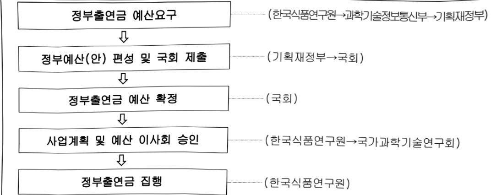

# 한국식품연구원연구운영비지원(R&D)

**해당 페이지**: PDF 1675 ~ 1683 쪽 해당

**부처**: 과학기술정보통신부
**분야**: 과학기술
**회계유형**: 일반회계
**2026 확정예산**: 49548.0 백만원
**전년대비 증감률**: 12.5%
**AI 도메인**: R&D 지원

---

<table border=1 style='margin: auto; word-wrap: break-word;'><tr><td style='text-align: center; word-wrap: break-word;'>사 업 명</td></tr><tr><td style='text-align: center; word-wrap: break-word;'>(236) 한국식품연구원 연구운영비 지원(R&amp;D) (2241-425)</td></tr></table>

☐ 사업 코드 정보

<table border=1 style='margin: auto; word-wrap: break-word;'><tr><td style='text-align: center; word-wrap: break-word;'>구분</td><td style='text-align: center; word-wrap: break-word;'>회계</td><td style='text-align: center; word-wrap: break-word;'>소관</td><td style='text-align: center; word-wrap: break-word;'>실국(기관)</td><td style='text-align: center; word-wrap: break-word;'>계정</td><td style='text-align: center; word-wrap: break-word;'>분야</td><td style='text-align: center; word-wrap: break-word;'>부문</td></tr><tr><td style='text-align: center; word-wrap: break-word;'>코드</td><td rowspan="2">일반회계</td><td rowspan="2">과학기술정보통신부</td><td rowspan="2">연구개발정책실기초원천연구정책관</td><td rowspan="2">-</td><td style='text-align: center; word-wrap: break-word;'>150</td><td style='text-align: center; word-wrap: break-word;'>152</td></tr><tr><td style='text-align: center; word-wrap: break-word;'>명칭</td><td style='text-align: center; word-wrap: break-word;'>과학기술</td><td style='text-align: center; word-wrap: break-word;'>과학기술연구지원</td></tr></table>

<table border=1 style='margin: auto; word-wrap: break-word;'><tr><td style='text-align: center; word-wrap: break-word;'>구분</td><td style='text-align: center; word-wrap: break-word;'>프로그램</td><td style='text-align: center; word-wrap: break-word;'>단위사업</td><td style='text-align: center; word-wrap: break-word;'>세부사업</td></tr><tr><td style='text-align: center; word-wrap: break-word;'>코드</td><td style='text-align: center; word-wrap: break-word;'>2200</td><td style='text-align: center; word-wrap: break-word;'>2241</td><td style='text-align: center; word-wrap: break-word;'>425</td></tr><tr><td style='text-align: center; word-wrap: break-word;'>명칭</td><td style='text-align: center; word-wrap: break-word;'>출연연구기관지원</td><td style='text-align: center; word-wrap: break-word;'>국가과학기술연구회 소관출연연구기관지원</td><td style='text-align: center; word-wrap: break-word;'>한국식품연구원 연구운영비 지원(R&amp;D)</td></tr></table>

□ 사업 성격 (공통요구자료 Ⅱ-1 작성유의사항 4. 참조, 해당하는 사항에 “○” 표시)

<table border=1 style='margin: auto; word-wrap: break-word;'><tr><td style='text-align: center; word-wrap: break-word;'>신규 계속</td><td style='text-align: center; word-wrap: break-word;'>환료</td><td style='text-align: center; word-wrap: break-word;'>예비타당성 실시여부</td><td style='text-align: center; word-wrap: break-word;'>총사업비 관리대상</td><td style='text-align: center; word-wrap: break-word;'>총액계상 예산사업</td><td style='text-align: center; word-wrap: break-word;'>사업소관 변경정보 2025예산 시 소관</td></tr><tr><td style='text-align: center; word-wrap: break-word;'></td><td style='text-align: center; word-wrap: break-word;'>☐</td><td style='text-align: center; word-wrap: break-word;'></td><td style='text-align: center; word-wrap: break-word;'></td><td style='text-align: center; word-wrap: break-word;'></td><td style='text-align: center; word-wrap: break-word;'></td></tr></table>

사업지원형태 및 지원을(최소한 한 개는 반드시 선택하시오. 해당사항에 O 표시)

<table border=1 style='margin: auto; word-wrap: break-word;'><tr><td style='text-align: center; word-wrap: break-word;'>직접</td><td style='text-align: center; word-wrap: break-word;'>출자</td><td style='text-align: center; word-wrap: break-word;'>출연</td><td style='text-align: center; word-wrap: break-word;'>보조</td><td style='text-align: center; word-wrap: break-word;'>융자</td><td style='text-align: center; word-wrap: break-word;'>국고보조율(%)</td><td style='text-align: center; word-wrap: break-word;'>융자율(%)</td></tr><tr><td style='text-align: center; word-wrap: break-word;'></td><td style='text-align: center; word-wrap: break-word;'></td><td style='text-align: center; word-wrap: break-word;'>○</td><td style='text-align: center; word-wrap: break-word;'></td><td style='text-align: center; word-wrap: break-word;'></td><td style='text-align: center; word-wrap: break-word;'></td><td style='text-align: center; word-wrap: break-word;'></td></tr></table>

## □ 사업 소관부처 및 시행주체

<table border=1 style='margin: auto; word-wrap: break-word;'><tr><td style='text-align: center; word-wrap: break-word;'>사업명</td><td colspan="2">구분</td></tr><tr><td rowspan="3">한국식품연구원연구운영비지원(R&amp;D)(2241-425)</td><td rowspan="2">소관부처</td><td style='text-align: center; word-wrap: break-word;'>연구개발정책실 기초원천연구정책관</td></tr><tr><td style='text-align: center; word-wrap: break-word;'>연구기관혁신정책과</td></tr><tr><td style='text-align: center; word-wrap: break-word;'>사업시행주체</td><td style='text-align: center; word-wrap: break-word;'>한국식품연구원</td></tr></table>

---

### 가.예산 총괄표

(단위: 백만원, %)

<table border=1 style='margin: auto; word-wrap: break-word;'><tr><td rowspan="2">사업명</td><td rowspan="2">2024년 결산</td><td colspan="2">2025년 예산</td><td colspan="2">2026년 예산</td><td rowspan="2">증감(B-A)</td><td rowspan="2">(B-A)/A</td></tr><tr><td style='text-align: center; word-wrap: break-word;'>본예산</td><td style='text-align: center; word-wrap: break-word;'>추경*(A)</td><td style='text-align: center; word-wrap: break-word;'>요구안</td><td style='text-align: center; word-wrap: break-word;'>본예산(B)</td></tr><tr><td style='text-align: center; word-wrap: break-word;'>한국식품연구원연구운영비지원(R&amp;D)</td><td style='text-align: center; word-wrap: break-word;'>38,875</td><td style='text-align: center; word-wrap: break-word;'>44,029</td><td style='text-align: center; word-wrap: break-word;'>44,029</td><td style='text-align: center; word-wrap: break-word;'>49,548</td><td style='text-align: center; word-wrap: break-word;'>49,548</td><td style='text-align: center; word-wrap: break-word;'>5,519</td><td style='text-align: center; word-wrap: break-word;'>12.5</td></tr></table>

* 추경: 추경증감액을 포함한 최종 예산액을 기재

□ 기능별(내역사업별) 예산 내역

(단위:백만원)

<table border=1 style='margin: auto; word-wrap: break-word;'><tr><td rowspan="2"></td><td colspan="5">2024</td><td colspan="5">2025</td><td rowspan="2">2026 倉塲</td></tr><tr><td style='text-align: center; word-wrap: break-word;'>倉塲倉塲(倉塲)</td><td style='text-align: center; word-wrap: break-word;'>倉塲倉塲</td><td style='text-align: center; word-wrap: break-word;'>倉塲倉塲</td><td style='text-align: center; word-wrap: break-word;'>倉塲倉塲</td><td style='text-align: center; word-wrap: break-word;'>倉塲倉塲</td><td style='text-align: center; word-wrap: break-word;'>倉塲倉塲</td><td style='text-align: center; word-wrap: break-word;'>倉塲倉塲</td><td style='text-align: center; word-wrap: break-word;'>倉塲倉塲</td><td style='text-align: center; word-wrap: break-word;'>倉塲倉塲</td><td style='text-align: center; word-wrap: break-word;'>倉塲倉塲</td></tr><tr><td style='text-align: center; word-wrap: break-word;'>○ 기능별 분류(합계)</td><td style='text-align: center; word-wrap: break-word;'>39,473</td><td style='text-align: center; word-wrap: break-word;'>39,473</td><td style='text-align: center; word-wrap: break-word;'>38,875</td><td style='text-align: center; word-wrap: break-word;'>-</td><td style='text-align: center; word-wrap: break-word;'>598</td><td style='text-align: center; word-wrap: break-word;'>44,029</td><td style='text-align: center; word-wrap: break-word;'>44,029</td><td style='text-align: center; word-wrap: break-word;'>43,229</td><td style='text-align: center; word-wrap: break-word;'>-</td><td style='text-align: center; word-wrap: break-word;'>800</td><td style='text-align: center; word-wrap: break-word;'>49,548</td></tr><tr><td style='text-align: center; word-wrap: break-word;'>○ 기관운영비</td><td style='text-align: center; word-wrap: break-word;'>22,552</td><td style='text-align: center; word-wrap: break-word;'>22,552</td><td style='text-align: center; word-wrap: break-word;'>21,954</td><td style='text-align: center; word-wrap: break-word;'>-</td><td style='text-align: center; word-wrap: break-word;'>598</td><td style='text-align: center; word-wrap: break-word;'>23,208</td><td style='text-align: center; word-wrap: break-word;'>23,208</td><td style='text-align: center; word-wrap: break-word;'>22,408</td><td style='text-align: center; word-wrap: break-word;'>-</td><td style='text-align: center; word-wrap: break-word;'>800</td><td style='text-align: center; word-wrap: break-word;'>23,971</td></tr><tr><td style='text-align: center; word-wrap: break-word;'>○ 주요사업비</td><td style='text-align: center; word-wrap: break-word;'>16,921</td><td style='text-align: center; word-wrap: break-word;'>16,921</td><td style='text-align: center; word-wrap: break-word;'>16,921</td><td style='text-align: center; word-wrap: break-word;'>-</td><td style='text-align: center; word-wrap: break-word;'>-</td><td style='text-align: center; word-wrap: break-word;'>20,821</td><td style='text-align: center; word-wrap: break-word;'>20,821</td><td style='text-align: center; word-wrap: break-word;'>20,821</td><td style='text-align: center; word-wrap: break-word;'>-</td><td style='text-align: center; word-wrap: break-word;'>-</td><td style='text-align: center; word-wrap: break-word;'>25,577</td></tr></table>

### 나. 사업설명자료

1) 사업목적·내용

- (사업목적) 식품 분야의 연구개발, 공익가치창출, 성과확산 및 기술지원 등을 통해 국가산업 발전과 국민의 삶의 질 향상에 기여

- (내역사업 사업목표 및 내용)

(내역사업1) 식품공정 전자동화 전략연구사업

· AI 기반 다중센싱 융합 및 정보연계 기술을 활용한 식품공정 전자동화 자율생산 시스템 개발

○ (내역사업2) K-SPIRITS 전략연구사업

· 군주·증류기·숙성기 요소기술 국산화 및 AI 기반 증류주 초가속 숙성 기술개발 연구

(내역사업3) 국민 건강 중진을 위한 식품 기능 및 영양대사 조절 연구

·건강백세시대 실현을 위한 식품의 건강 기능 구명 및 질환 조절 연구

·건강관리 및 만성질환 예방을 위한 정밀식이 연구

(내역사업4) 국민 영양안보 확보를 위한 식품공급망의 지속가능성 기반 구축

·식품품질·안전데이터기반생산유통관리기술개발

·식품산업 지속가능성 강화 융합 기술 개발

---

(내역사업5) 식품산업 경쟁력 강화를 위한 원천기술 개발 및 서비스 지원

· 소비자 수요 대응 푸드테크 핵심기술 개발

·식품산업 기술산업화 기반 구축

· 미래연구 지원 인프라 구축

## 2 ) 사업개요

□ 사업근거 및 추진경위

① 법령상 근거 및 조항 적시 : 「과학기술분야 정부출연연구기관 등의 설립·운영 및 육성에 관한 법률」 제5조 제2항

② 추진경위

- '87. 12. 농림부산하 한국식품개발연구원 설립

- '99. 01. 국무총리실 산하로 소속변경

- '04. 10. 과학기술부 산하로 소속변경

- '08. 02. 지식경제부 산하로 소속변경

- '13. 03. 미래창조과학부 산하로 소속 변경

- '17. 07. 과학기술정보통신부 산하로 소속 변경

- '17.09. 전북혁신도시로 청사이전

## □ 주요내용

① 사업규모

- 총사업비 : 해당 없음

- 사업기간 : '87년 ~ 계속

- 최근 5년 간 투입된 사업비(예산액기준, 추경편성한 연도에는 추경포함)

<table border=1 style='margin: auto; word-wrap: break-word;'><tr><td style='text-align: center; word-wrap: break-word;'>$ \underline{\text{所}} $</td><td style='text-align: center; word-wrap: break-word;'>2022</td><td style='text-align: center; word-wrap: break-word;'>2023</td><td style='text-align: center; word-wrap: break-word;'>2024</td><td style='text-align: center; word-wrap: break-word;'>2025</td><td style='text-align: center; word-wrap: break-word;'>2026</td></tr><tr><td style='text-align: center; word-wrap: break-word;'>$ \underline{\text{사업비}} $</td><td style='text-align: center; word-wrap: break-word;'>43,971</td><td style='text-align: center; word-wrap: break-word;'>45,763</td><td style='text-align: center; word-wrap: break-word;'>39,473</td><td style='text-align: center; word-wrap: break-word;'>44,029</td><td style='text-align: center; word-wrap: break-word;'>49,548</td></tr></table>

② 사업추진체계

- 사업시행방법 : 출연

- 사업시행주체 : 한국식품연구원

-사업 수혜자 : 산업계, 학계, 연구계, 공공부문 등 국가 모든 분야 및 국민

- 보조, 융자, 출연, 출자 등의 경우 보조·융자 등 지원 비율 및 법적근거

<table border=1 style='margin: auto; word-wrap: break-word;'><tr><td style='text-align: center; word-wrap: break-word;'>내역사업명</td><td style='text-align: center; word-wrap: break-word;'>구분</td><td style='text-align: center; word-wrap: break-word;'>피보조·피출연 등 기관명</td><td style='text-align: center; word-wrap: break-word;'>지원 금액 (2026예산)</td><td style='text-align: center; word-wrap: break-word;'>지원 비율(%)</td><td style='text-align: center; word-wrap: break-word;'>보조율 법적근거 (해당 조항)</td></tr><tr><td style='text-align: center; word-wrap: break-word;'>한국식품 연구원 연구운영비 지원(R&amp;D)</td><td style='text-align: center; word-wrap: break-word;'>출연</td><td style='text-align: center; word-wrap: break-word;'>한국식품 연구원</td><td style='text-align: center; word-wrap: break-word;'>49,548</td><td style='text-align: center; word-wrap: break-word;'>100</td><td style='text-align: center; word-wrap: break-word;'>과학기술분야 정부출연연구기관 등의 설립·운영 및 육성에 관한 법률 제5조 제1, 2항</td></tr></table>

---

## 3 ) 2026년도 예산 산출 근거

①인건비

:(25)19,773백만원→(26)20,465백만원,+692백만원증액

- (반영) 안정적인 기관운영을 위한 인건비 지원 692백만원 요구

- (산출) 전년 수준 인건비 20,465백만원

처우개선(3.5%) 반영 692백만원

② 경상비

:(25)3,435백만원,→(26)3,506백만원,+71백만원 증액

- (반영) 안정적인 기관운영을 위한 전년 수준의 3,506백만원 요구

- (산출) 전년 수준 경상경비 3,506백만원

비경직성경비 지출효율화 반영 및 공공요금 인상분 반영 등 71백만원

② 주요사업비

:(25)20,821백만원→(26)25,577백만원,+4,756백만원증액

- (반영)

· 식품공정 전자동화 전략연구사업 4,224백만원

• K-SPIRITS 전략연구사업 2,913백만원

• 국민 건강 증진을 위한 식품 기능 및 영양대사 조절 연구 7,572백만원

• 국민 영양안보 확보를 위한 식품공급망의 지속가능성 기반 구축 4,235백만원

·식품산업 경쟁력 강화를 위한 원천기술 개발 및 서비스 지원 5,835백만원

· 장비구입비 798백만원

- (산출)

• 면 제조 공정 초자동화를 위한 자율생산 공정 일체 지능형 생산 설비 개발 4,224백만원

• 프리미엄 K-SPIRITS 숙성 예측 기술 개발 및 균주·증류기·숙성기 국산화 2,913백만원

· 건강백세시대 실현을 위한 식품의 건강기능 구명 및 질환 조절 연구 등 7,572백만원

·식품품질·안전데이터기반생산유통관리기술개발등4.235백만원

소비자 수요 대응 푸드테크 핵심기술 개발 및 식품산업 기술산업화 기반 구축 등 5,835백만원

1억원 이상 장비 1건 등 총 15건의 연구장비 798백만원

2025년도 예산 및 2026년도 예산 산출 세부내역 비교

<table border=1 style='margin: auto; word-wrap: break-word;'><tr><td rowspan="2">예산</td><td colspan="2">2025년 본예산</td><td colspan="2">2026년 예산</td></tr><tr><td colspan="2">산출내역</td><td style='text-align: center; word-wrap: break-word;'>예산</td><td style='text-align: center; word-wrap: break-word;'>산출내역</td></tr><tr><td rowspan="4">44,029</td><td colspan="2">○ 연구개발인건비(360-01): 19,773백만원</td><td colspan="2">○ 연구개발인건비(360-01): 20,465백만원</td></tr><tr><td colspan="2">가. 323명 기준 인건비 - 323명 x 61.2백만원 x 12/12개월 = 19,773백만원 • 전년 수준 인건비 19,197백만원 • 처우개선(3.0%) 반영 573백만원</td><td colspan="2">가. 323명 기준 인건비 - 323명 x 63.4백만원 x 12/12개월 = 20,465백만원 • 전년 수준 인건비 19,773백만원 • 처우개선(3.5%) 반영 692백만원</td></tr><tr><td colspan="2">○ 연구개발경상경비(360-02): 3,435백만원</td><td colspan="2">49,548 ○ 연구개발경상경비(360-02): 3,506백만원</td></tr><tr><td colspan="2">가. 323명 기준 경상경비 - 323명 x 10.6백만원 x 12/12개월 = 3,435백만원 • 전년 수준 경상경비 3,355백만원 • 공통감액 반영 및 공공요금 인상분 등 반영 80백만원</td><td colspan="2">가. 323명 기준 경상경비 - 323명 x 10.8백만원 x 12/12개월 = 3,506백만원 • 전년 수준 경상경비 3,435백만원 • 공통감액 반영 및 공공요금 인상분 등 반영 71백만원</td></tr></table>

---

<table border=1 style='margin: auto; word-wrap: break-word;'><tr><td colspan="2">2025년 분예산</td><td colspan="2">2026년 예산</td></tr><tr><td style='text-align: center; word-wrap: break-word;'>산</td><td style='text-align: center; word-wrap: break-word;'>산출내역</td><td style='text-align: center; word-wrap: break-word;'>예산</td><td style='text-align: center; word-wrap: break-word;'>산출내역</td></tr><tr><td style='text-align: center; word-wrap: break-word;'>○ 연구개발장비·시스템구축비(360-04): 798백만원가. 1억원 이상 장비 2건 등 14건 장비비- 14건 x 57백만원 x 12/12개월 = 798백만원• 1억원 이상 장비 2건 국가연구시설장비심의위원회(NFEC)본심의 승인 완료</td><td style='text-align: center; word-wrap: break-word;'>○ 연구개발장비·시스템구축비(360-04): 798백만원가. 1억원 이상 장비 1건 등 15건 장비비- 15건 x 53.2백만원 x 12/12개월 = 798백만원• 1억원 이상 장비 1건 국가연구시설장비심의위원회(NFEC)본심의 승인 완료</td><td style='text-align: center; word-wrap: break-word;'>○ 연구개발장비·시스템구축비(360-04): 798백만원가. 1억원 이상 장비 1건 등 15건 장비비- 15건 x 53.2백만원 x 12/12개월 = 798백만원• 1억원 이상 장비 1건 국가연구시설장비심의위원회(NFEC)본심의 승인 완료</td><td style='text-align: center; word-wrap: break-word;'>○ 연구개발장비·시스템구축비(360-04): 798백만원가. 1억원 이상 장비 1건 등 15건 장비비- 15건 x 53.2백만원 x 12/12개월 = 798백만원• 1억원 이상 장비 1건 국가연구시설장비심의위원회(NFEC)본심의 승인 완료</td></tr><tr><td style='text-align: center; word-wrap: break-word;'>○ 연구개발활동비 등(360-05): 20,023백만원가. 건강수명 증진을 위한 식품바이오소재 및 영양대사 조절 연구- 2개 x 4,419백만원 x 12/12개월 = 8,839백만원• 건강백세시대 대비를 위한 식품의 기능소재 연구(2개 x 1,289백만원 x 12/12개월 = 2,577백만원)• 맞춤형 식이모델 및 헬스케어 연구(3개 x 2,087백만원 x 12/12개월 = 6,262백만원)</td><td style='text-align: center; word-wrap: break-word;'>나. 국민의 신뢰 확보를 위한 식품 품질·안전관리 유통기술 개발- 2개 x 1,642백만원 x 12/12개월 = 3,284백만원• 식품안전 데이터 기반 생산유통 관리기술 개발(1개 x 650백만원 x 12/12개월 = 650백만원)• 식품 품질정보 데이터 기반 생산유통 관리기술 개발(3개 x 878백만원 x 12/12개월 = 2,634백만원)</td><td style='text-align: center; word-wrap: break-word;'>나. K-SPIRITS 전략연구사업- 1개 x 2,913백만원 x 12/12개월 = 2,913백만원다. 국민 건강 증진을 위한 식품 기능 및 영양대사 조절 연구- 2개 x 3,786백만원 x 12/12개월 = 7,572백만원• 건강백세시대 실현을 위한 식품의 건강 기능 구명 및 질환 조절 연구(3개 x 977백만원 x 12/12개월 = 2,932백만원)• 건강관리 및 만성질환 예방을 위한 정밀식이 연구(3개 x 1,547백만원 x 12/12개월 = 4,640백만원)</td><td style='text-align: center; word-wrap: break-word;'>나. 국민 영양안보 확보를 위한 식품공급망의 지속가능성 기반 구축- 2개 x 2,123백만원 x 12/12개월 = 4,235백만원</td></tr><tr><td style='text-align: center; word-wrap: break-word;'>다. 식품산업 경쟁력 강화를 위한 원천기술 개발- 2개 x 2,123백만원 x 12/12개월 = 4,247백만원- 미래 소비자 수요 대응 핵심기술 개발(4개 x 837백만원 x 12/12개월 = 3,347백만원)• 미래 소비자 수요 대응 핵심기술 개발(1개 x 900백만원 x 12/12개월 = 900백만원)</td><td style='text-align: center; word-wrap: break-word;'>라. 기업경쟁력 강화를 위한 기술지원 및 미래역량 개발- 3개 x 1,218백만원 x 12/12개월 = 3,653백만원• 식품산업 연구개발지원 데이터플랫폼 구축(3개 x 488백만원 x 12/12개월 = 1,463백만원)• 식품산업 제도기반 고도화 및 기업지원(3개 x 462백만원 x 12/12개월 = 1,385백만원)• 미래도전 신규영역 창출 및 연구역량 강화사업(2개 x 403백만원 x 12/12개월 = 805백만원)</td><td style='text-align: center; word-wrap: break-word;'>라. 식품산업 경쟁력 강화를 위한 원천기술 개발 및 서비스 지원- 2개 x 2,123백만원 x 12/12개월 = 5,835백만원- 소비자 수요 대응 푸드테크 핵심기술 개발(3개 x 964백만원 x 12/12개월 = 2,892백만원)• 식품산업 기술산업화 기반 구축(3개 x 520백만원 x 12/12개월 = 1,560백만원)• 미래연구 지원 인프라 구축(3개 x 461백만원 x 12/12개월 = 1,383백만원)</td><td style='text-align: center; word-wrap: break-word;'>나. 국민 영양안보 확보를 위한 원천기술 개발 및 서비스 지원- 소비자 수요 대응 푸드테크 핵심기술 개발(3개 x 964백만원 x 12/12개월 = 2,892백만원)</td></tr></table>

---

## 4 ) 사업효과

사업영향, 산출물 성과지표 등

① 2022~2026년도 성과계획서 상 성과지표 및 최근 5년간 성과 달성도: 해당 없음

② 성과지표 이외의 연도별 사업추진 경과 및 실적

<table border=1 style='margin: auto; word-wrap: break-word;'><tr><td style='text-align: center; word-wrap: break-word;'>2022</td><td style='text-align: center; word-wrap: break-word;'>○기관운영비: 21,694백만원- 인건비: 18,368백만원, 경상경비: 3,326백만원○주요사업비: 22,277백만원- 건강수명 증진을 위한 식품바이오소재 및 영양대사 조절 연구: 10,062백만원- 국민의 신뢰 확보를 위한 식품 품질·안전관리 유통기술 개발: 3,412백만원- 식품산업 경쟁력 강화를 위한 원천기술 개발: 2,101백만원- 기업경쟁력 강화를 위한 기술지원 및 미래역량 개발: 5,437백만원- 연구장비비: 1,265백만원</td></tr><tr><td style='text-align: center; word-wrap: break-word;'>2023</td><td style='text-align: center; word-wrap: break-word;'>○기관운영비: 22,111백만원- 인건비: 18,729백만원, 경상경비: 3,382백만원○주요사업비: 23,652백만원- 건강수명 증진을 위한 식품바이오소재 및 영양대사 조절 연구: 9,580백만원- 국민의 신뢰 확보를 위한 식품 품질·안전관리 유통기술 개발: 4,670백만원- 식품산업 경쟁력 강화를 위한 원천기술 개발: 3,501백만원- 기업경쟁력 강화를 위한 기술지원 및 미래역량 개발: 4,797백만원- 연구장비비: 1,104백만원</td></tr><tr><td style='text-align: center; word-wrap: break-word;'>2024</td><td style='text-align: center; word-wrap: break-word;'>○기관운영비: 22,552백만원- 인건비: 19,197백만원, 경상경비: 3,355백만원○주요사업비: 23,652백만원- 건강수명 증진을 위한 식품바이오소재 및 영양대사 조절 연구: 6,839백만원- 국민의 신뢰 확보를 위한 식품 품질·안전관리 유통기술 개발: 3,284백만원- 식품산업 경쟁력 강화를 위한 원천기술 개발: 2,347백만원- 기업경쟁력 강화를 위한 기술지원 및 미래역량 개발: 3,653백만원- 연구장비비: 798백만원</td></tr><tr><td style='text-align: center; word-wrap: break-word;'>2025</td><td style='text-align: center; word-wrap: break-word;'>○기관운영비: 23,208백만원- 인건비: 19,773백만원, 경상경비: 3,435백만원○주요사업비: 20,821백만원- 건강수명 증진을 위한 식품바이오소재 및 영양대사 조절 연구: 8,839백만원- 국민의 신뢰 확보를 위한 식품 품질·안전관리 유통기술 개발: 3,284백만원- 식품산업 경쟁력 강화를 위한 원천기술 개발: 4,247백만원- 기업경쟁력 강화를 위한 기술지원 및 미래역량 개발: 3,653백만원- 연구장비비: 798백만원</td></tr></table>

## ③향후(2026년도 이후)기대효과

<table border=1 style='margin: auto; word-wrap: break-word;'><tr><td style='text-align: center; word-wrap: break-word;'>성과목표</td><td style='text-align: center; word-wrap: break-word;'>2021～2026 주요 예상성과</td><td style='text-align: center; word-wrap: break-word;'>기관 R&amp;R</td></tr><tr><td style='text-align: center; word-wrap: break-word;'>1-1. 맞춤형 식이 헬스케어 플랫폼 구축</td><td style='text-align: center; word-wrap: break-word;'>• 한국인 만성질환자 NutriOmics 정보 DB 구축(식품 빅데이터, 만성질환자의 식이, 혈액, SNP, 대사체 등을 포함하는 NutriOmics 정보 2,000건 이상) • 한국인 장내미생물-헬스 정보 DB 구축(누적 10,000명 이상 장내미생물-헬스 정보) • AI 기반 맞춤형 식이제안 플랫폼 개발 • 개방형 장내미생물 정보공유 플랫폼 개발</td><td rowspan="2">[상위역할1] 건강백세를 위한 식품의 기능 연구</td></tr><tr><td style='text-align: center; word-wrap: break-word;'>1-2. 초고령시대 대응 식품의 건강노화 조절기술 개발</td><td style='text-align: center; word-wrap: break-word;'>• 건강 수명 관련 신규 유전자 발굴(2종 이상) • 건강 수명 관련 세놀리틱스 제어 식품 정보 확보 • 노화 근육의 단백질 대사 장애 조절을 통해 근육노화를 제어할 수 있는 조절 인자 발굴(2종 이상) • 단백질 대사 조절 관련 근감소 제어 식품 정보 확보(3건 이상)</td></tr></table>

---

<table border=1 style='margin: auto; word-wrap: break-word;'><tr><td style='text-align: center; word-wrap: break-word;'>성과목표</td><td style='text-align: center; word-wrap: break-word;'>2021～2026 주요 예상성과</td><td style='text-align: center; word-wrap: break-word;'>기관 R&amp;R</td></tr><tr><td style='text-align: center; word-wrap: break-word;'>1-3. 건강개선 기능성소재 산업화 기술 개발</td><td style='text-align: center; word-wrap: break-word;'>· 사회문제 대응형 신규 기능성 클레임 개발(미세먼지, 청각기능, 당독소 관련 기능성) : 바이오마커 및 평가모델 구축, 식약처 신규 기능성 가이드라인 제시 · 신규 소재 발굴 및 파이프라인 구축(1차 : 호흡기건강, 신경내분비계, 간건강 / 2차 : 인지기능, 감영대응 면역증진, 체지방개선)</td><td style='text-align: center; word-wrap: break-word;'></td></tr><tr><td style='text-align: center; word-wrap: break-word;'>2-1. 식품 안전인자 정보화 기술 개발</td><td style='text-align: center; word-wrap: break-word;'>· 살아있는 식중독균 선택적 고감도(1 cfu/g) 검출기술 확보 · 정량 알고리즘(정확도 90% 이상) 개발 및 식중독균 초기 오염 정보 데이터 확보 · 변동성 모델(30건 이상) 및 데이터 세트(100건 이상) 통합 DB 개발 및 공유 · 표준분석법이 없거나 국내 기준 규격이 설정되지 않은 식품안전인자의 동시분석법 개발(과불화화함물, 맥각 알칼로이드, 식품첨가물) · 키랄성 식품 향료 분석기술 개발 · 난배양성 식중독균 유도 및 분석기술 개발</td><td rowspan="2">[상위역할2] 국민이 신뢰하는 식품 품질·안전 연구</td></tr><tr><td style='text-align: center; word-wrap: break-word;'>2-2. 지능정보 기반 유통관리시 스템 개발</td><td style='text-align: center; word-wrap: break-word;'>· 정밀도가 높고 복합적 품질 속성을 결정할 수 있는 광대역 분광영상 화학 이미징 시스템 확보 · 광대역 분광·물질 데이터 세트 구축 및 결정 알고리즘 개발(Indices-분광영상 DB 식품 5품목 이상, 총 2,500건 이상) · 지능형 안전유통시스템 현장 인프라 구축 및 상용화(현장실증 2개소, 기술이전 1건 이상) · 식품 품질 및 안전인자 데이터 연계 통합 플랫폼 구축(프로토타입 통합 플랫폼 1종, 품질모델 2종, 통합 플랫폼 상용화 모델 TRL 7 이상)</td></tr><tr><td style='text-align: center; word-wrap: break-word;'>3-1. 미래 소비자 수요 대응 핵심기술 개발</td><td style='text-align: center; word-wrap: break-word;'>· 고령자용 섭식 특성 평가를 위한 핵심인자 도출(5건 이상) · 발굴된 핵심인자를 활용한 고령자용 섭식 특성 평가시스템 구축 및 가이드라인 제시 · 소브산 대체 천연 보존료 개발 · 물리/생물전환 융복합 기술 활용 합성 인산염 및 아질산염 대체 가공기술 개발 · 국내 최초 육제품 클린라벨 인증 가이드라인 제시</td><td rowspan="4">[상위역할3] 소비자, 기업, 국가가 원하는 식품산업 원천기술 연구</td></tr><tr><td style='text-align: center; word-wrap: break-word;'>3-2. 발효미생물 활용을 위한 원천기술 개발</td><td style='text-align: center; word-wrap: break-word;'>· 낮은 비성장속도를 개선한 적응진화기술 기반 Bacillus sp. 균주 개량 기술 확보 · 개량 발효미생물 활용 식품용 효소 생산시스템 구축 : 비성장속도 개선 Bacillus sp. 균주를 활용한 재조합 단백질 발현 바이오브릭 원천기술 확보(식품용 효소생산 미생물 1건 이상 확보 및 기탁)</td></tr><tr><td style='text-align: center; word-wrap: break-word;'>4-1. 데이터 공유 기반 식품산업 연구개발 지원 플랫폼 구축</td><td style='text-align: center; word-wrap: break-word;'>· 식품 데이터의 표준화 및 수집·관리·공유·활용 플랫폼 구축 : 연구·데이터 수집 프로토콜 및 표준안 개발, 시각화 도구, 분석도구 등 데이터 활용기술을 장착한 데이터 기반 클라우드 랩 시범 운영 · 식품소재, 식품미생물 정보 디지털 전환 : 식품소재 및 식품미생물 소재 온라인 분양시스템 운영, 기존 소재은행 보유 소재의 특성정보 DB 화 및 산업계 공개</td></tr><tr><td style='text-align: center; word-wrap: break-word;'>4-2. 글로벌 식품산업 제도기반 고도화 및 현장 대응기술 개발</td><td style='text-align: center; word-wrap: break-word;'>· K-푸드 CODEX 규격 4단계(규격초안 심의단계) 진입 · 수산 및 농축산식품 생산가이드라인, 국제 식품안전관리시스템 인증 가이드라인(SQF, IFS, BRCS) 개발 및 산업체 보급 · 미주 및 아시아 지역 각 1곳 이상 비대면 감각평가 네트워크 구축 · 식품 내 에탄올 분석법 및 식품식초·간장 조미김 등) 내 돼지성분 분석법 ISOIEC 17025 인정 · 국제적 공신력을 갖춘 할랄연구실로서 해외 인증기관과의 교차인정 확대를 위한 하림성분 분석 기술지원</td></tr></table>

5) 타당성조사 및 예비타당성조사 시행여부 및 결과 요지: 해당 없음

6) 총사업비 대상사업 여부 및 내역: 해당 없음

---

## 7 ) 사업 집행절차

°예산(안) 편성지침 및 기준 통보 (기획재정부)

°기관 예산요구서 제출(한국식품연구원→국가과학기술연구회)

°이사회 심의·의결·제출 (국가과학기술연구회 → 과학기술정보통신부)

°부처 예산요구서 제출 (과학기술정보통신부 → 국가과학기술자문회의, 기획재정부)

°국가과학기술자문회의 R&D 사전조정 및 결과통보 (국가과학기술자문회의 → 기획

° 정부예산(안) 국회 제출 (기획재정부 → 국회) / 정부예산 확정 (국회)

°사업계획 및 예산(안) 이사회 승인(국가과학기술연구회)

°정부출연금 집행(한국식품원)

## 8 ) 각종 평가

<table border=1 style='margin: auto; word-wrap: break-word;'><tr><td colspan="3">☐ 2024년 기관평가 결과</td></tr><tr><td style='text-align: center; word-wrap: break-word;'>구분</td><td style='text-align: center; word-wrap: break-word;'>기관</td><td style='text-align: center; word-wrap: break-word;'>종합등급</td></tr><tr><td style='text-align: center; word-wrap: break-word;'>국가과학기술연구회</td><td style='text-align: center; word-wrap: break-word;'>한국식품연구원</td><td style='text-align: center; word-wrap: break-word;'>보통</td></tr></table>

### 다. 최근 4년간 결산내역

## 1 ) 결산표

☐ 부처 결산내역

(단위: 백만원, %)

<table border=1 style='margin: auto; word-wrap: break-word;'><tr><td rowspan="2">연도</td><td colspan="3">예산액</td><td rowspan="2">예산현액(A)</td><td rowspan="2">집행액(B)</td><td rowspan="2">집행률(B/A)</td><td rowspan="2">다음연도이월액</td><td rowspan="2">불용액</td></tr><tr><td style='text-align: center; word-wrap: break-word;'>본예산</td><td style='text-align: center; word-wrap: break-word;'>추경중감액</td><td style='text-align: center; word-wrap: break-word;'>추경</td></tr><tr><td style='text-align: center; word-wrap: break-word;'>2022</td><td style='text-align: center; word-wrap: break-word;'>43,971</td><td style='text-align: center; word-wrap: break-word;'>-</td><td style='text-align: center; word-wrap: break-word;'>43,971</td><td style='text-align: center; word-wrap: break-word;'>43,971</td><td style='text-align: center; word-wrap: break-word;'>42,269</td><td style='text-align: center; word-wrap: break-word;'>96.1</td><td style='text-align: center; word-wrap: break-word;'>-</td><td style='text-align: center; word-wrap: break-word;'>1,702</td></tr><tr><td style='text-align: center; word-wrap: break-word;'>2023</td><td style='text-align: center; word-wrap: break-word;'>45,763</td><td style='text-align: center; word-wrap: break-word;'>-</td><td style='text-align: center; word-wrap: break-word;'>45,763</td><td style='text-align: center; word-wrap: break-word;'>45,763</td><td style='text-align: center; word-wrap: break-word;'>43,807</td><td style='text-align: center; word-wrap: break-word;'>95.7</td><td style='text-align: center; word-wrap: break-word;'>-</td><td style='text-align: center; word-wrap: break-word;'>1,956</td></tr><tr><td style='text-align: center; word-wrap: break-word;'>2024</td><td style='text-align: center; word-wrap: break-word;'>39,473</td><td style='text-align: center; word-wrap: break-word;'>-</td><td style='text-align: center; word-wrap: break-word;'>39,473</td><td style='text-align: center; word-wrap: break-word;'>39,473</td><td style='text-align: center; word-wrap: break-word;'>38,875</td><td style='text-align: center; word-wrap: break-word;'>98.5</td><td style='text-align: center; word-wrap: break-word;'>-</td><td style='text-align: center; word-wrap: break-word;'>598</td></tr><tr><td style='text-align: center; word-wrap: break-word;'>2025</td><td style='text-align: center; word-wrap: break-word;'>44,029</td><td style='text-align: center; word-wrap: break-word;'>-</td><td style='text-align: center; word-wrap: break-word;'>44,029</td><td style='text-align: center; word-wrap: break-word;'>44,029</td><td style='text-align: center; word-wrap: break-word;'>43,229</td><td style='text-align: center; word-wrap: break-word;'>98.2</td><td style='text-align: center; word-wrap: break-word;'>-</td><td style='text-align: center; word-wrap: break-word;'>800</td></tr></table>

---

## 2 ) 주요 결산사항

□2022~2025년 결산 주요사항

<table border=1 style='margin: auto; word-wrap: break-word;'><tr><td style='text-align: center; word-wrap: break-word;'>2022</td><td style='text-align: center; word-wrap: break-word;'>- 불용사유 : 인건비 집행잔액 등 1,702백만원 불용</td></tr><tr><td style='text-align: center; word-wrap: break-word;'>2023</td><td style='text-align: center; word-wrap: break-word;'>- 불용사유 : 인건비 집행잔액 등 1,956백만원 불용</td></tr><tr><td style='text-align: center; word-wrap: break-word;'>2024</td><td style='text-align: center; word-wrap: break-word;'>- 불용사유 : 인건비 집행잔액 등 598백만원 불용</td></tr><tr><td style='text-align: center; word-wrap: break-word;'>2025</td><td style='text-align: center; word-wrap: break-word;'>- 불용사유 : 인건비 집행잔액 등 800백만원 불용</td></tr></table>

□ 2025년 이·전용 등 세부내역: 해당 없음

---

### 원본 PDF 크롭 이미지

