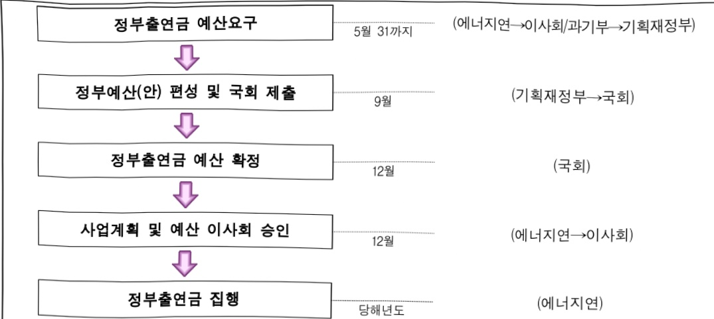

# 한국에너지기술연구원연구운영비지원(R&D)

**해당 페이지**: PDF 1684 ~ 1694 쪽 해당

**부처**: 과학기술정보통신부
**분야**: 과학기술
**회계유형**: 에너지및자원 사업특별회계
**2026 확정예산**: 93927.0 백만원
**전년대비 증감률**: 12.5%
**AI 도메인**: R&D 지원

---

### 가.예산 총괄표

(단위: 백만원, %)

<table border=1 style='margin: auto; word-wrap: break-word;'><tr><td rowspan="2">사업명</td><td rowspan="2">2024년 결산</td><td colspan="2">2025년 예산</td><td colspan="2">2026년 예산</td><td rowspan="2">증감(B-A)</td><td rowspan="2">(B-A)/A</td></tr><tr><td style='text-align: center; word-wrap: break-word;'>본예산</td><td style='text-align: center; word-wrap: break-word;'>추경*(A)</td><td style='text-align: center; word-wrap: break-word;'>요구안</td><td style='text-align: center; word-wrap: break-word;'>본예산(B)</td></tr><tr><td style='text-align: center; word-wrap: break-word;'>한국에너지기술연구원 연구운영비 지원(R&amp;D)</td><td style='text-align: center; word-wrap: break-word;'>73,769</td><td style='text-align: center; word-wrap: break-word;'>83,524</td><td style='text-align: center; word-wrap: break-word;'>83,524</td><td style='text-align: center; word-wrap: break-word;'>93,927</td><td style='text-align: center; word-wrap: break-word;'>93,927</td><td style='text-align: center; word-wrap: break-word;'>10,403</td><td style='text-align: center; word-wrap: break-word;'>12.5</td></tr></table>

*추경: 추경증감액을 포함한 최종 예산액을 기재

## □ 기능별(내역사업별) 예산 내역

(단위:백만원)

<table border=1 style='margin: auto; word-wrap: break-word;'><tr><td rowspan="2"></td><td colspan="5">2024</td><td colspan="5">2025</td><td style='text-align: center; word-wrap: break-word;'>2026</td></tr><tr><td style='text-align: center; word-wrap: break-word;'>예산액(추정)</td><td style='text-align: center; word-wrap: break-word;'>예산현액</td><td style='text-align: center; word-wrap: break-word;'>집행액</td><td style='text-align: center; word-wrap: break-word;'>이월액</td><td style='text-align: center; word-wrap: break-word;'>불용액</td><td style='text-align: center; word-wrap: break-word;'>예산액(추정)</td><td style='text-align: center; word-wrap: break-word;'>예산현액</td><td style='text-align: center; word-wrap: break-word;'>집행액</td><td style='text-align: center; word-wrap: break-word;'>이월액</td><td style='text-align: center; word-wrap: break-word;'>불용액</td><td style='text-align: center; word-wrap: break-word;'>예산</td></tr><tr><td style='text-align: center; word-wrap: break-word;'>○ 기능별 분류(합계)</td><td style='text-align: center; word-wrap: break-word;'>75,171</td><td style='text-align: center; word-wrap: break-word;'>75,171</td><td style='text-align: center; word-wrap: break-word;'>73,769</td><td style='text-align: center; word-wrap: break-word;'>-</td><td style='text-align: center; word-wrap: break-word;'>1,402</td><td style='text-align: center; word-wrap: break-word;'>83,524</td><td style='text-align: center; word-wrap: break-word;'>83,524</td><td style='text-align: center; word-wrap: break-word;'>82,354</td><td style='text-align: center; word-wrap: break-word;'>-</td><td style='text-align: center; word-wrap: break-word;'>1,170</td><td style='text-align: center; word-wrap: break-word;'>93,927</td></tr><tr><td style='text-align: center; word-wrap: break-word;'>· 기관운영비</td><td style='text-align: center; word-wrap: break-word;'>40,497</td><td style='text-align: center; word-wrap: break-word;'>40,497</td><td style='text-align: center; word-wrap: break-word;'>39,095</td><td style='text-align: center; word-wrap: break-word;'>-</td><td style='text-align: center; word-wrap: break-word;'>1,402</td><td style='text-align: center; word-wrap: break-word;'>41,625</td><td style='text-align: center; word-wrap: break-word;'>41,625</td><td style='text-align: center; word-wrap: break-word;'>40,455</td><td style='text-align: center; word-wrap: break-word;'>-</td><td style='text-align: center; word-wrap: break-word;'>1,170</td><td style='text-align: center; word-wrap: break-word;'>43,470</td></tr><tr><td style='text-align: center; word-wrap: break-word;'>· 주요사업비</td><td style='text-align: center; word-wrap: break-word;'>34,674</td><td style='text-align: center; word-wrap: break-word;'>34,674</td><td style='text-align: center; word-wrap: break-word;'>34,674</td><td style='text-align: center; word-wrap: break-word;'>-</td><td style='text-align: center; word-wrap: break-word;'>-</td><td style='text-align: center; word-wrap: break-word;'>41,899</td><td style='text-align: center; word-wrap: break-word;'>41,899</td><td style='text-align: center; word-wrap: break-word;'>41,899</td><td style='text-align: center; word-wrap: break-word;'>-</td><td style='text-align: center; word-wrap: break-word;'>-</td><td style='text-align: center; word-wrap: break-word;'>50,457</td></tr></table>

### 나. 사업설명자료

## 1 ) 사업목적·내용

- (한국에너지기술연구원 연구운영비 지원(R&D)) 에너지기술 분야의 산업원천기술 개발 및 성과확산 등을 통해 국가 성장동력 창출과 국민경제 발전에 기여하기 위한 연구개발사업 수행

(①탈탄소 사회 실현을 위한 에너지 생산, 장단기 에너지 저장, 활용 혁신기술 개발)

신재생에너지 생산·저장·활용 등 에너지 공급 분야의 탈탄소화 혁신 기술 개발을 통한 탄소중립 실현

-(②온실가스 감축과 기후위기 대응 기술 개발) 온실가스 포집·전환·활용 및 청정·자원순환 기술 역량 강화를 통한 기후 위기 대응 및 탄소중립 사회 구현 기반 마련

-(③에너지 기술 전주기 사업화 전략 플랫폼 구축 사업) 에너지 기술개발의 국가 임무

달성과 산업 현장 적용 및 글로벌 확산을 지원하는 전주기 사업화 전략 플랫폼 구축·운영

- (④국산 언어모델 기반 에너지 비용 15% 절감 건물·에너지 산업공정 설비 자율운전 AI 에이전트) 에너지 효율 15% 향상 건물·산업공정·e전환 설비 자율운전 국산 AI 에이전트 개발

---

(⑤플라스틱세 도입 및 재생원료 의무사용 30% 국제규제 대응을 위한 폐플라스틱 자원순환 플랜트 개발) 재활용이 불가능한 혼합 폐플라스틱을 연·원료화하는 자원순환 통합 공정 구축 및 운전시스템 개발

-(⑥폭발 위험없는 24시간(One-day) 사용 장주기 수계 배터리-ESS) 화재 위험 없이 24시간 작동가능한 수계 이차전지 스택 양산화를 위한 자동화 공정 개발 및 BESS 실증

## 2 ) 사업개요

사업근거 및 추진경위

① 법령상 근거 : 「과학기술분야 정부출연연구기관 등의 설립 · 운영 및 육성에 관한 법률」 제5조 제2항, 제3항

② 추진경위

- '77. 09 "한국열관리시험연구소" 설립

- '80. 03"한국 종합에너지연구소"로 개칭(동력자원부 소관)

- '81. 01 "재단법인 한국동력자원연구소"로 통합 발족(과학기술처 소관)

- '91. 11 "에너지분야"와 "자원분야"를 분리,

독립한 재단법인"한국에너지기술연구소" 발족(과학기술처 소관)

- '99. 01 국무총리실 산하로 소관부처 변경(공공기술연구회)

- '04. 10 과학기술부 산하로 소관부처 변경(공공기술연구회)

- '08. 03 지식경제부 산하로 소관부처 변경(산업기술연구회)

- '13. 03 미래창조과학부 산하로 소관부처 변경(산업기술연구회)

- '14. 06 연구회 통합으로 소속변경 (국가과학기술연구회)

- '17. 07 과학기술정보통신부 산하로 소관부처 변경(국가과학기술연구회)

---

## 주요내용

① 사업규모

- 총사업비 : 계속사업

- 사업기간 : 계속

- 최근 5년 간 투입된 사업비(예산액기준, 추경편성한 연도에는 추경포함)

<table border=1 style='margin: auto; word-wrap: break-word;'><tr><td style='text-align: center; word-wrap: break-word;'>$ \underline{\text{焼成}} $</td><td style='text-align: center; word-wrap: break-word;'>2022</td><td style='text-align: center; word-wrap: break-word;'>2023</td><td style='text-align: center; word-wrap: break-word;'>2024</td><td style='text-align: center; word-wrap: break-word;'>2025</td><td style='text-align: center; word-wrap: break-word;'>2026</td></tr><tr><td style='text-align: center; word-wrap: break-word;'>$ \underline{\text{사업비}} $</td><td style='text-align: center; word-wrap: break-word;'>92,789</td><td style='text-align: center; word-wrap: break-word;'>103,299</td><td style='text-align: center; word-wrap: break-word;'>75,171</td><td style='text-align: center; word-wrap: break-word;'>83,524</td><td style='text-align: center; word-wrap: break-word;'>93,927</td></tr></table>

- 기타 : 해당없음

② 사업추진체계

- 사업시행방법 : 출연

- 사업시행주체 : 한국에너지기술연구원

- 사업 수혜자 : 산업계, 학계, 연구계, 공공부문 등 국가 모든 분야

- 보조, 융자, 출연, 출자 등의 경우 보조·융자 등 지원 비율 및 법적근거

<table border=1 style='margin: auto; word-wrap: break-word;'><tr><td style='text-align: center; word-wrap: break-word;'>내역사업명</td><td style='text-align: center; word-wrap: break-word;'>구분</td><td style='text-align: center; word-wrap: break-word;'>피보조·피출연 등 기관명</td><td style='text-align: center; word-wrap: break-word;'>지원 금액 (2026예산)</td><td style='text-align: center; word-wrap: break-word;'>지원 비율(%)</td><td style='text-align: center; word-wrap: break-word;'>보조율 법적근거 (해당 조항)</td></tr><tr><td style='text-align: center; word-wrap: break-word;'>한국에너지 기술연구원 연구운영비 지원(R&amp;D)</td><td style='text-align: center; word-wrap: break-word;'>출연</td><td style='text-align: center; word-wrap: break-word;'>한국에너지 기술연구원</td><td style='text-align: center; word-wrap: break-word;'>93,927</td><td style='text-align: center; word-wrap: break-word;'>100</td><td style='text-align: center; word-wrap: break-word;'>과학기술분야 정부출연연구기관 등의 설립·운영 및 육성에 관한 법률 제5조(운영재원)</td></tr></table>

---

## 3 ) 2026년도 예산 산출 근거

### □ 2026년도 예산 : 93,927백만원(전년 대비 10,403백만원, 12.5%)

## ☐ 투자방향 및 반영내용

°(기관운영비)기관운영을위한인건비및경상비

- (인건비) 기존인력 인건비 처우개선 및 신규 증원인력 인건비 반영

- (경상비) 공공요금 증액분 등 기관 운영을 위한 필수 소요경비 요구

°(주요사업비)에너지 공급·소비분야 탈탄소화를 통한 기후위기 적응력 강화 및 전략연구사업 기반 에너지 기술 산업화를 위한 출연금 예산 지원

- 국산 언어모델 기반 건물·산업·e전환 에너지 설비 자율운전 AI 에이전트 개발을 통한 에너지 비용 15% 절감 및 분산에너지 발전량 15% 향상

- 폐플라스틱 자원순환 플랜트 개발을 통한 플라스틱세 도입 및 재생원료 의무사용 30% 등 국제규제 대응 및 지속가능 미래 실현

- 화재 위험 없이 24시간 작동가능한 수계 이차전지 스택 양산화를 위한 자동화 공정 및 BESS 실증으로 재생에너지 보급 확대 및 안전성 강화

## 2026 년도 예산 세부내용

### (1) 인건비 : (2025) 37,962 → (2026) 39,311 백만원, 3.6%

- (반영) 기존 인력 인건비 처우개선 및 '25년 미반영 신규인력 인건비(1명) 증액

- (산출) 전년수준 인건비 처우개선 및 미반영 신규 연구인력 인건비 정부지원단가 고려 산출

* (처우개선) 37,922백만원 × 3.5% × 12/12개월 = 1,329백만원

* (25년 미반영 신규인력) '25년도 신규증원(1명) × 40백만원 × 6/12개월 = 20백만원

### (2) 경상비 : (2025) 3,663 → (2026) 4,159 백만원, 13.5%

- (반영) 안정적 기관 운영을 위한 경상적 소요경비 및 공공요금 증액분 등 증액 - (산출) 기재부 공통기준 조정 및 공공요금 증액분 등 고려 산출

 * 공통감액조정 △83백만원, 공공요금 인상분 529백만원, 자회사 분담금 증액분 32백만원, 재산세 증가분 18백만원 반영

### (3) 주요사업비 : (2025) 41,899 백만원 → (2026) 50,457 백만원, 20.4%

## - (반영) 탈탄소 사회 실현을 위한 에너지 생산, 저장, 활용 혁신 기술 개발 15,438백만원('25년 대비 △8,057백만원 감액)

- (산출) 7,719백만원 × 2개

* 주요사업 체계개편(△2,215), 구조조정(△5,842)

## - (반영) 온실가스 감축과 기후위기 대응 기술 개발 14,588 백만원 (25년 대비 648백만원 중액)

- (산출) 4,863 백만원 × 3개

* 주요사업 체계개편(898), 구조조정(△250)

---

- (반영) 에너지 기술 전주기 사업화 전략 플랫폼 구축 사업 4,281 백만원

(25년 대비 1,317 백만원 중액)

- (산출) 1,427백만원 × 3개

* 주요사업 체계개편(1,317)

- (반영) [전략연구사업] 국산 언어모델 기반 에너지 비용 15% 절감 건물·에너지

산업공정 설비 자율운전 AI 에이전트 개발 5,827백만원(25년 대비

5,827백만원 증액)

- (산출) 5,827백만원 × 1개

* (신규) 국산 언어모델 기반 에너지 비용 15% 절감 건물·에너지산업공정 설비 자율운전 AI 에이전트 개발(5,827)

- (반영) [전략연구사업] 플라스틱세 도입 및 재생원료 의무사용 30% 국제규제 대응을 위한 폐플라스틱 자원순환 플랜트 개발 5,098백만원(25년 대비 5,098백만원 중액)

- (산출) 5,098백만원 × 1개

(신규) 플라스틱세 도입 및 재생원료 의무사용 30% 국제규제 대응을 위한 폐플라스틱 자원

순환 플랜트 개발(5,098)

- (반영) [전략연구사업] 폭발 위험없는 24시간(One-day) 사용 장주기 수계 배터리-ESS 3,725백만원('25년 대비 3,725백만원 중액)

- (산출) 3,725백만원 × 1개

* (신규) 폭발 위험없는 24시간(One-day) 사용 장주기 수계 배터리-ESS(3,725)

- (반영) 연구장비·시스템 구축비 1,500백만원(전년 동일)

- (산줄) 150백만원×10개 장비

* 1억원 이상 장비 5개 1,019백만원, 1억원 미만~3천만원 이상 장비 5개 481백만원

## □ 2025년도 및 2026년도 예산 산출 세부내역 비교

(단위 : 백만원)

<table border=1 style='margin: auto; word-wrap: break-word;'><tr><td style='text-align: center; word-wrap: break-word;'>구분</td><td style='text-align: center; word-wrap: break-word;'>2025예산</td><td style='text-align: center; word-wrap: break-word;'>2026예산</td></tr><tr><td style='text-align: center; word-wrap: break-word;'>☐한국에너지기술연구원 연구운영비 지원(R&amp;D)</td><td style='text-align: center; word-wrap: break-word;'>83,524</td><td style='text-align: center; word-wrap: break-word;'>93,927</td></tr><tr><td rowspan="2">(1)인건비</td><td style='text-align: center; word-wrap: break-word;'>37,962</td><td style='text-align: center; word-wrap: break-word;'>39,311</td></tr><tr><td style='text-align: center; word-wrap: break-word;'>·566명 정원기준 인건비 반영</td><td style='text-align: center; word-wrap: break-word;'>·인건비 처우개선 3.5%(1,329), 미반영 신규 인력(1명) 인건비(20)</td></tr><tr><td rowspan="2">(2)경상비</td><td style='text-align: center; word-wrap: break-word;'>3,663</td><td style='text-align: center; word-wrap: break-word;'>4,159</td></tr><tr><td style='text-align: center; word-wrap: break-word;'>·기관운영 필수소요 경비 반영</td><td style='text-align: center; word-wrap: break-word;'>·경상비 효율화(△83), 공공요금 증가분(523), 재산세 증가분(18) 및 자회사 처우개선(32)</td></tr><tr><td rowspan="9">(3)주요사업비</td><td style='text-align: center; word-wrap: break-word;'>41,899</td><td style='text-align: center; word-wrap: break-word;'>50,457</td></tr><tr><td style='text-align: center; word-wrap: break-word;'>·에너지 생산·저장·활용 혁신 기술(23,495)</td><td style='text-align: center; word-wrap: break-word;'>·탄소중립 에너지 R&amp;D 기술 로드맵 이행 위한 계속사업 R&amp;D 및 전략연구사업 예산 반영</td></tr><tr><td style='text-align: center; word-wrap: break-word;'>·온실가스 감축 및 기후위기 대응 기술(13,940)</td><td style='text-align: center; word-wrap: break-word;'>·에너지 생산·저장·활용 혁신 기술(15,438)</td></tr><tr><td style='text-align: center; word-wrap: break-word;'>·에너지 기술 전주기 사업화 (2,964)</td><td style='text-align: center; word-wrap: break-word;'>·온실가스 감축 및 기후위기 대응 기술(14,588)</td></tr><tr><td style='text-align: center; word-wrap: break-word;'>·연구장비구입비(1,500)</td><td style='text-align: center; word-wrap: break-word;'>·에너지 기술 전주기 사업화 (4,281)</td></tr><tr><td style='text-align: center; word-wrap: break-word;'></td><td style='text-align: center; word-wrap: break-word;'>·에너지 AI 에이전트(5,827)</td></tr><tr><td style='text-align: center; word-wrap: break-word;'></td><td style='text-align: center; word-wrap: break-word;'>·폐플라스틱 자원순환 플랜트(5,098)</td></tr><tr><td style='text-align: center; word-wrap: break-word;'></td><td style='text-align: center; word-wrap: break-word;'>·장주기 수계 배터리-ESS(3,725)</td></tr><tr><td style='text-align: center; word-wrap: break-word;'></td><td style='text-align: center; word-wrap: break-word;'>·연구장비구입비(1,500)</td></tr></table>

---

## 4 ) 사업효과

사업영향, 산출물 성과지표 등

① 2022~2026년도 성과계획서 상 성과지표 및 최근 5년간 성과 달성도 : 해당없음

② 성과지표 이외의 연도별 사업추진 경과 및 실적

<table border=1 style='margin: auto; word-wrap: break-word;'><tr><td style='text-align: center; word-wrap: break-word;'>2022</td><td style='text-align: center; word-wrap: break-word;'>○ &#x27;22년 출연금 92,789백만원 - 기관운영비 38,832백만원, 주요사업비 45,605백만원, 시설사업비 8,352백만원 ○ 300Nm3/hr급 수소 생산 CO2 포집 VSA 설계 및 운전기술(기술료 10억원) ○ 고효율 대면적 폐로브스카이트 태양전지 개발(Science 게재(&#x27;22)) ○ 고효율 텐덤 태양전지 정공수송물질 개발 (Advanced Energy Materials(IF 29.368) 표지 논문 게재(&#x27;22)) ○ 대기 환경의 용액공정 기반 페로브스카이트/CISSe 텐덤 태양전지 세계 최고 효율 달성 (Energy &amp; Environmental Science(IF 38.532) 표지 논문 게재(&#x27;22)) ○ 기상공정에 의해 촉매입자의 크기와 구조를 자유롭게 제어하는 One-Pot 촉매 합성기술 개발(국가연구개발 100선)</td></tr><tr><td style='text-align: center; word-wrap: break-word;'>2023</td><td style='text-align: center; word-wrap: break-word;'>○ &#x27;23년 출연금 103,299백만원 - 기관운영비 39,624백만원, 주요사업비 63,675백만원, 시설사업비 15,590백만원 ○ 알칼라인 수전해 분리막과 스택평가 플랫폼 기술(기술료 7억원) ○ 재생에너지 연계 수전해 확장형 모듈 스택 개발(기술료 10억원) ○ 고출력 고수명 나노 구조 세라믹 전극촉매 개발 (Applied Catalysis B: Environmental(IF 22.1) 논문 게재(&#x27;23)) ○ 바이오에너지 및 자원 업사이클링 기술 개발 (기술료 16.7억원, 출연(연) 테크노믹스 대상)</td></tr><tr><td style='text-align: center; word-wrap: break-word;'>2024</td><td style='text-align: center; word-wrap: break-word;'>○ &#x27;24년 출연금 75,171백만원 - 기관운영비 40,497백만원, 주요사업비 34,674백만원 ○ 세계 최초 전고체 전지 설계 방법론 제시 및 틀짓 &#x27;SolidXCell&#x27; 개발 (Nature Communications 논문 게재(&#x27;24), IF 14.7) ○ 세계 최고 수준의 반투명 페로브스카이트 태양전지 개발 (Advanced Energy Materials 표지논문 게재(&#x27;24), IF 27.8) ○ 해외 입제품 시장 진출을 위한 스마트 복합건조 원천기술(기술료 6억원) ○ 습식흡수제를 이용한 이산화탄소 포집 기술(기술료 6억원)</td></tr><tr><td style='text-align: center; word-wrap: break-word;'>2025</td><td style='text-align: center; word-wrap: break-word;'>○ &#x27;25년 출연금 83,524백만원 - 기관운영비 41,625백만원, 주요사업비 41,899백만원 ○ 세계 최대 규모의 이산화탄소 원천 분리 발전 기술 실증 (3MWth급 파일릿 플랜트 실증, CO2 분리 배출 성능 96% 달성) ○ 유연 페로브스카이트/CIGS 박막 다중접합 태양전지 세계 최고 효율 23.64% 달성 (에너지·재료 분야 국제 저명학술지 ‘줄(joule)’ 논문 게재(&#x27;25), IF 38.6)</td></tr></table>

---

③향후(2026년도 이후)기대효과

<table border=1 style='margin: auto; word-wrap: break-word;'><tr><td colspan="2">(대과제 1) 탈탄소 사회 실현을 위한 에너지 생산, 저장, 활용 혁신 기술 개발</td></tr><tr><td style='text-align: center; word-wrap: break-word;'>· 수소경제 실현을 위한 수소 전주기 핵심기술 및 실증기술 개발</td><td style='text-align: center; word-wrap: break-word;'>· 재생 전력 활용 수소 생산 설비 확대 및 수소공급 단가 저감· 화석 기반 산업, 수송 원료, 연료 대체· 연료전지 부품 국산화율 100% 달성 및  $ CO_{2} $ 배출 제로 이동수단 확산· 수소전기차 및 발전시장 글로벌 선도</td></tr><tr><td style='text-align: center; word-wrap: break-word;'>· 에너지 전환 실현을 위한 차세대 재생에너지 기술 개발</td><td style='text-align: center; word-wrap: break-word;'>· 태양전지 국내 생산 보급 확대 및 산업 생태계 경쟁력 강화· 해상풍력 산업클러스터 조성 및 에너지 수입 의존도 감소 및 국가 에너지 안보 강화· 잉여 재생전력의 저장을 통한 전력공급 변동 완화· 스마트그리드·마이크로그리드 고도화</td></tr><tr><td colspan="2">(대과제 2) 온실가스 감축과 기후위기 대응 기술 개발</td></tr><tr><td style='text-align: center; word-wrap: break-word;'>· 온실가스 포집·전환 이용기술 개발</td><td style='text-align: center; word-wrap: break-word;'>· 발전·산업 부문 적용을 통한 CCUS 기술 저변 확대 및 국산 기술 기반 포집 설비 시장 형성· CCU 기반의 연료 및 화학제품 생산공정 도입으로 탄소자원화 산업 생태계 확장· 미래 세대를 위한 온실가스 감축 기반 조성, 탄소중립에 기여</td></tr><tr><td style='text-align: center; word-wrap: break-word;'>· 탄소배출 저감을 위한 정정·자원순환 기술 개발</td><td style='text-align: center; word-wrap: break-word;'>· 농림 부산물·산림 전재 등 미활용 바이오매스 자원의 고부가 가치 연·원료화로 바이오에너지 산업 활성화· 연 3조 원 규모의 바이오디젤·플랫폼 케미컬 시장 진입 및 1.5조 원 규모의 신규 플랜트 수요 창출· 바이오매스 자원 활용도 제고 및 친환경 자원순환 시스템에 대한 대국민 수용성 증대</td></tr><tr><td style='text-align: center; word-wrap: break-word;'>· 미래선도형 탄소중립 기반기술</td><td style='text-align: center; word-wrap: break-word;'>· 고효율 산업 기자재 기술 및 탄소중립 열공급 기술 확대로 산업 경쟁력 향상과 공기질 개선 및 열요금 안정화· 배전망 운영 효율성 증대 및 전력 손실 최소화· 전력품질/공급 안정성 향상 및 RE 보급 확대</td></tr><tr><td colspan="2">(대과제 3) 에너지 기술 전주기 사업화 전략 플랫폼 구축 사업</td></tr><tr><td style='text-align: center; word-wrap: break-word;'>· 에너지 기술의 신속 시장진입을 위한 R&amp;BD 전략기획 사업</td><td style='text-align: center; word-wrap: break-word;'>· 임무형 R&amp;D 기획과 성과중심 관리체계 고도화를 통해 에너지 기술혁신과 국가 탄소중립 전략 기여· 탄소중립 분야 국가연구개발사업 예산 배분·조정 지원을 통한 정부 R&amp;D 투자 효율성 강화· 전략적 국제공동연구와 정보기반 협력체계 구축을 통해 초격차 기술 확보 및 KIER 기술의 글로벌 시장 진출 기반 마련</td></tr><tr><td style='text-align: center; word-wrap: break-word;'>· 에너지 기술의 민간수요 기반 상용화 촉진 사업</td><td style='text-align: center; word-wrap: break-word;'>· 기획부터 기술이전까지 산업 수요를 반영한 연구개발로 기술 실용화와 산업 문제 해결 지원· 시장성과 산업수요를 반영한 기술개발과 벨류업을 통해 대형 기술이전 성과 창출 및 기술료 수익성 회복· 기후변화 대응기술의 적기 시장진입을 통해 기후위기 극복 및 탄소중립 목표 달성 기여</td></tr><tr><td style='text-align: center; word-wrap: break-word;'>· 에너지 기술의 성과활용 및 지원 인프라 구축·운영 사업</td><td style='text-align: center; word-wrap: break-word;'>· K-Energy 후보발굴 및 시장적기진입 프로젝트 지원을 통해 대형 기술이전 및 해외 진출 기반 구축· AI·계산과학 기반 에너지 R&amp;D 수행 지원으로 R&amp;D 생산성 및 효율성 제고· 공동 연구장비 활용 및 전문분석 기반의 R&amp;D 지원체계 구축을 통해 K-Energy 실현과 연구성과 신뢰성 제고</td></tr></table>

---

<table border=1 style='margin: auto; word-wrap: break-word;'><tr><td colspan="2">(전탁연구사업 1) 국산 언어모델 기반 에너지 비용 15% 절감 건물·에너지산업공정 설비 자율운전 AI 에이전트 개발</td></tr><tr><td style='text-align: center; word-wrap: break-word;'>· 국산 생성형 AI와 에너지 특화 AI 에이전트 결합 기술 개발</td><td style='text-align: center; word-wrap: break-word;'>· 자율작업 성공률 95%, 응답속도 5초 이내 · 관리자와 AI 에이전트간 협업을 통한 최적 자율제어 및 조기 이상진단</td></tr><tr><td style='text-align: center; word-wrap: break-word;'>· 캠퍼스 건물군 에너지 최적화 자율운전 AI 에이전트 개발 및 실증</td><td style='text-align: center; word-wrap: break-word;'>· 건물 에너지 비용 15% 절감 · 건물 냉난방 및 조명 최적 자율 제어를 통한 건물에너지 비용 절감</td></tr><tr><td style='text-align: center; word-wrap: break-word;'>· 이차전지· 다소비 공정 효율향상 및 운영 안전 AI 에이전트 개발 및 실증</td><td style='text-align: center; word-wrap: break-word;'>· 플랜트 공정 에너지 소비 15% 절감 · 연료투입, 유량 최적화 및 오염물질 저감 최적화를 통한 효율 향상</td></tr><tr><td style='text-align: center; word-wrap: break-word;'>· 10MW급 대용량 분산에너지 자원 최적화 자율운전 AI 에이전트 개발</td><td style='text-align: center; word-wrap: break-word;'>· 분산자원 발전량 15% 증대 · 임박한 고장 예측을 통한 사전 정비로 이용률 향상 가능 · 배전망 내 설비의 수요패턴과 연계하는 운영기법 개선을 통한 낭비 요소 제거</td></tr><tr><td colspan="2">(전략연구사업 2) 플라스틱세 도입 및 재생원료 의무사용 30% 국제규제 대응을 위한 폐플라스틱 자원순환 플랜트 개발</td></tr><tr><td style='text-align: center; word-wrap: break-word;'>· 재활용 불가능 혼합 폐플라스틱 가스화 및 합성가스 정제 기술 개발</td><td style='text-align: center; word-wrap: break-word;'>· 폐플라스틱 가압 측매 유동층 가스화 기술 개발을 통한 가스화 공정 성능 향상 및 고품질 합성가스 생산 · 폐플라스틱 유래 합성가스 정제 기술 개발 · 재활용이 불가능한 폐플라스틱의 자원순환을 통해 자원순환 경제 구축 및 탄소중립 기여</td></tr><tr><td style='text-align: center; word-wrap: break-word;'>· 폐플라스틱 유래 합성가스 활용 플라스틱 원료  $ C_{2}-C_{3} $ 올레핀 생산 및 활용 기술 개발</td><td style='text-align: center; word-wrap: break-word;'>· 폐플라스틱 제자원화를 위한 One pot 촉매 반응 시스템 개발 · 합성가스를 고부가가치 원료로 전환하는 Methanol to Olefin (MTO) 공정 개발 · 자원순환 핵심기술 국산화로 탄소중립 재생원료 생산 비용 절감 및 국내 석유화학산업 경쟁력 강화</td></tr><tr><td style='text-align: center; word-wrap: break-word;'>· 공정 자동화 및 운전 지원을 통한 안전 및 운전 효율 향상 시스템 구축</td><td style='text-align: center; word-wrap: break-word;'>· 빅데이터/AI 학습 기반 폐플라스틱 에너지 생산 플랜트 운전 자동화로 고장진단 및 공정 효율 향상 · AloT 기술 융합 현장 통합 관제 시스템 설계 개발로 작업자 안전성 향상</td></tr><tr><td colspan="2">(전략연구사업 3) 폭발 위험없는 24시간(One-day) 사용 장주기 수계 배터리-ESS</td></tr><tr><td style='text-align: center; word-wrap: break-word;'>· 양산용 3D 스텍 설계 및 자동화 생산 프로세스</td><td style='text-align: center; word-wrap: break-word;'>· 전해질 유로 기반 3D 접합적층 전극 플레이트 · 자동화 공정용 전극 핵심소재 플레이트 구조체 · 양산용 스텍 고속 제조 자동화 조립 시스템구축 · 스텍 자동 압착·셀링 공정 및 스텍 모듈 병렬/직럴 조립 체계 구축</td></tr><tr><td style='text-align: center; word-wrap: break-word;'>· BOP운영 구축 및 SOC 수명예측</td><td style='text-align: center; word-wrap: break-word;'>· 수계 전해질 UV분광 SOC 적용 AI 모델 개발 및 수명예측 · SOC 충전상태 모니터링 개발 · AI 모델 학습 BOP Digital Twin 구축 설계 최적화 · BOP 통합 제어 (셈프, 밸브, 열관리, 탱크레벨 관리) 프로토콜 확립</td></tr><tr><td style='text-align: center; word-wrap: break-word;'>· FB-ESS 시스템 통합 및 운전 신뢰성 확보</td><td style='text-align: center; word-wrap: break-word;'>· 수계전지 스택 성능 모니터링 및 전해질 유량/수위 제어기술 개발 · PCS 전력변환 및 그리드 연계 설계 · EMS 운영 최적화 및 스케줄링 · 통합 모니터링/제어시스템 및 수계 배터리-ESS 파일덧 설계/구축</td></tr><tr><td style='text-align: center; word-wrap: break-word;'>· 24시간 장주기 사용 실증 및 트렉테코드 확보</td><td style='text-align: center; word-wrap: break-word;'>· 수계 배터리-ESS 파일덧 구축 (2MW/48MWh) · 실증을 위한 재생에너지-ESS 통합 시스템 설계 · 시스템 테스트 및 실증 운전 · 장기 트렉테코드 확보</td></tr></table>

---

5) 타당성조사 및 예비타당성조사 시행여부 및 결과 요지 : 해당없음

6) 총사업비 대상사업 정보 : 해당없음

7) 사업 집행절차

○ 한국에너지기술연구원(예산 요구(안) 제출)

○ 국가과학기술연구회 이사회(예산 요구(안) 심의 · 의결 · 제출)

○ 과학기술정보통신부(예산 요구(안) 심의 · 제출)

○ 기획재정부(예산 요구(안) 심의 및 정부(안) 확정)

○ 국회 과방위(예산 요구(안) 심의 및 승인)

○ 국회 예결위(예산 요구(안) 심의 및 승인)

국가과학기술연구회 이사회(사업계획 및 예산(안) 제출 및 승인)

○ 한국에너지기술연구원(출연금 교부 신청)

○ 과학기술정보통신부(출연금 교부)

○ 한국에너지기술연구원(사업 수행)

## 8 ) 각종 평가 : 해당없음

---

### 다. 최근 4년간 결산내역

## 1 ) 결산표

☐ 부처 결산내역

(단위: 백만원, %)

<table border=1 style='margin: auto; word-wrap: break-word;'><tr><td rowspan="2">연도</td><td colspan="3">예산액</td><td rowspan="2">예산현액(A)</td><td rowspan="2">집행액(B)</td><td rowspan="2">집행률(B/A)</td><td rowspan="2">다음연도이월액</td><td rowspan="2">불용액</td></tr><tr><td style='text-align: center; word-wrap: break-word;'>본예산</td><td style='text-align: center; word-wrap: break-word;'>추경중감액</td><td style='text-align: center; word-wrap: break-word;'>추경</td></tr><tr><td style='text-align: center; word-wrap: break-word;'>2022</td><td style='text-align: center; word-wrap: break-word;'>92,789</td><td style='text-align: center; word-wrap: break-word;'>-</td><td style='text-align: center; word-wrap: break-word;'>92,789</td><td style='text-align: center; word-wrap: break-word;'>92,789</td><td style='text-align: center; word-wrap: break-word;'>91,023</td><td style='text-align: center; word-wrap: break-word;'>98.1</td><td style='text-align: center; word-wrap: break-word;'>-</td><td style='text-align: center; word-wrap: break-word;'>1,766</td></tr><tr><td style='text-align: center; word-wrap: break-word;'>2023</td><td style='text-align: center; word-wrap: break-word;'>103,299</td><td style='text-align: center; word-wrap: break-word;'>-</td><td style='text-align: center; word-wrap: break-word;'>103,299</td><td style='text-align: center; word-wrap: break-word;'>103,299</td><td style='text-align: center; word-wrap: break-word;'>101,410</td><td style='text-align: center; word-wrap: break-word;'>98.2</td><td style='text-align: center; word-wrap: break-word;'>-</td><td style='text-align: center; word-wrap: break-word;'>1,889</td></tr><tr><td style='text-align: center; word-wrap: break-word;'>2024</td><td style='text-align: center; word-wrap: break-word;'>75,171</td><td style='text-align: center; word-wrap: break-word;'>-</td><td style='text-align: center; word-wrap: break-word;'>75,171</td><td style='text-align: center; word-wrap: break-word;'>75,171</td><td style='text-align: center; word-wrap: break-word;'>73,769</td><td style='text-align: center; word-wrap: break-word;'>98.1</td><td style='text-align: center; word-wrap: break-word;'>-</td><td style='text-align: center; word-wrap: break-word;'>1,402</td></tr><tr><td style='text-align: center; word-wrap: break-word;'>2025</td><td style='text-align: center; word-wrap: break-word;'>83,524</td><td style='text-align: center; word-wrap: break-word;'>-</td><td style='text-align: center; word-wrap: break-word;'>83,524</td><td style='text-align: center; word-wrap: break-word;'>83,524</td><td style='text-align: center; word-wrap: break-word;'>82,354</td><td style='text-align: center; word-wrap: break-word;'>98.6</td><td style='text-align: center; word-wrap: break-word;'>-</td><td style='text-align: center; word-wrap: break-word;'>1,170</td></tr></table>

## 2 ) 주요 결산사항

□ 2022~2025년 결산 주요사항

<table border=1 style='margin: auto; word-wrap: break-word;'><tr><td style='text-align: center; word-wrap: break-word;'>2022</td><td style='text-align: center; word-wrap: break-word;'>- (불용) 인건비 잔액 미교부(1,062백만원), ‘22년 종료 시설사업 잔액 불용(704백만원)</td></tr><tr><td style='text-align: center; word-wrap: break-word;'>2023</td><td style='text-align: center; word-wrap: break-word;'>- (불용) 인건비 잔액 미교부(1,889백만원)</td></tr><tr><td style='text-align: center; word-wrap: break-word;'>2024</td><td style='text-align: center; word-wrap: break-word;'>- (불용) 인건비 잔액 미교부(1,402백만원)</td></tr><tr><td style='text-align: center; word-wrap: break-word;'>2025</td><td style='text-align: center; word-wrap: break-word;'>- (불용) 인건비 잔액 미교부(1,170백만원)</td></tr></table>

□ 2025년 이·전용 등 세부내역 : 해당없음

---

<table border=1 style='margin: auto; word-wrap: break-word;'><tr><td style='text-align: center; word-wrap: break-word;'>사 업 명</td></tr><tr><td style='text-align: center; word-wrap: break-word;'>(1) 한국원자력연구원 연구운영비 지원(R&amp;D) (2241-401)</td></tr></table>

사업 코드 정보

<table border=1 style='margin: auto; word-wrap: break-word;'><tr><td style='text-align: center; word-wrap: break-word;'>구분</td><td style='text-align: center; word-wrap: break-word;'>회계</td><td style='text-align: center; word-wrap: break-word;'>소관</td><td style='text-align: center; word-wrap: break-word;'>실국(기관)</td><td style='text-align: center; word-wrap: break-word;'>계정</td><td style='text-align: center; word-wrap: break-word;'>분야</td><td style='text-align: center; word-wrap: break-word;'>부문</td></tr><tr><td style='text-align: center; word-wrap: break-word;'>코드</td><td style='text-align: center; word-wrap: break-word;'>에너지및자원</td><td style='text-align: center; word-wrap: break-word;'>과학기술</td><td style='text-align: center; word-wrap: break-word;'>연구개발정책실</td><td rowspan="2">투자계정</td><td style='text-align: center; word-wrap: break-word;'>150</td><td style='text-align: center; word-wrap: break-word;'>152</td></tr><tr><td style='text-align: center; word-wrap: break-word;'>명칭</td><td style='text-align: center; word-wrap: break-word;'>사업특별회계</td><td style='text-align: center; word-wrap: break-word;'>정보통신부</td><td style='text-align: center; word-wrap: break-word;'>미래전략기술정책관</td><td style='text-align: center; word-wrap: break-word;'>과학기술</td><td style='text-align: center; word-wrap: break-word;'>과학기술연구지원</td></tr></table>

<table border=1 style='margin: auto; word-wrap: break-word;'><tr><td style='text-align: center; word-wrap: break-word;'>구분</td><td style='text-align: center; word-wrap: break-word;'>프로그램</td><td style='text-align: center; word-wrap: break-word;'>단위사업</td><td style='text-align: center; word-wrap: break-word;'>세부사업</td></tr><tr><td style='text-align: center; word-wrap: break-word;'>코드</td><td style='text-align: center; word-wrap: break-word;'>2200</td><td style='text-align: center; word-wrap: break-word;'>2241</td><td style='text-align: center; word-wrap: break-word;'>401</td></tr><tr><td style='text-align: center; word-wrap: break-word;'>명칭</td><td style='text-align: center; word-wrap: break-word;'>출연연구기관지원</td><td style='text-align: center; word-wrap: break-word;'>국가과학기술연구회 소관출연연구기관지원</td><td style='text-align: center; word-wrap: break-word;'>한국원자력연구원 연구 운영비 지원(R&amp;D)</td></tr></table>

□ 사업 성격 (공통요구자료 Ⅱ-1 작성유의사항 4. 참조, 해당하는 사항에 “○” 표시)

<table border=1 style='margin: auto; word-wrap: break-word;'><tr><td rowspan="2">신규</td><td rowspan="2">계속</td><td rowspan="2">완료</td><td rowspan="2">예비타당성 실시여부</td><td rowspan="2">총사업비 관리대상</td><td rowspan="2">총액계상 예산사업</td><td style='text-align: center; word-wrap: break-word;'>사업소관 변경정보</td></tr><tr><td style='text-align: center; word-wrap: break-word;'>2025예산 시 소관</td></tr><tr><td style='text-align: center; word-wrap: break-word;'></td><td style='text-align: center; word-wrap: break-word;'>☐</td><td style='text-align: center; word-wrap: break-word;'></td><td style='text-align: center; word-wrap: break-word;'></td><td style='text-align: center; word-wrap: break-word;'></td><td style='text-align: center; word-wrap: break-word;'></td><td style='text-align: center; word-wrap: break-word;'></td></tr></table>

□ 사업 지원 형태 및 지원을 (최소한 한 개는 반드시 선택하시오. 해당사항에 O 표시)

<table border=1 style='margin: auto; word-wrap: break-word;'><tr><td style='text-align: center; word-wrap: break-word;'>직접</td><td style='text-align: center; word-wrap: break-word;'>출자</td><td style='text-align: center; word-wrap: break-word;'>출연</td><td style='text-align: center; word-wrap: break-word;'>보조</td><td style='text-align: center; word-wrap: break-word;'>융자</td><td style='text-align: center; word-wrap: break-word;'>국고보조율(%)</td><td style='text-align: center; word-wrap: break-word;'>융자율(%)</td></tr><tr><td style='text-align: center; word-wrap: break-word;'></td><td style='text-align: center; word-wrap: break-word;'></td><td style='text-align: center; word-wrap: break-word;'>○</td><td style='text-align: center; word-wrap: break-word;'></td><td style='text-align: center; word-wrap: break-word;'></td><td style='text-align: center; word-wrap: break-word;'></td><td style='text-align: center; word-wrap: break-word;'></td></tr></table>

## ☐ 사업 소관부처 및 시행주체

<table border=1 style='margin: auto; word-wrap: break-word;'><tr><td style='text-align: center; word-wrap: break-word;'>사업명</td><td colspan="2">구분</td></tr><tr><td rowspan="3">한국원자력연구원연구운영비지원(R&amp;D)</td><td rowspan="2">소관부처</td><td style='text-align: center; word-wrap: break-word;'>연구개발정책실미래전략기술정책관</td></tr><tr><td style='text-align: center; word-wrap: break-word;'>원자력연구개발과</td></tr><tr><td style='text-align: center; word-wrap: break-word;'>사업시행주체</td><td style='text-align: center; word-wrap: break-word;'>한국원자력연구원</td></tr></table>

---

### 원본 PDF 크롭 이미지

