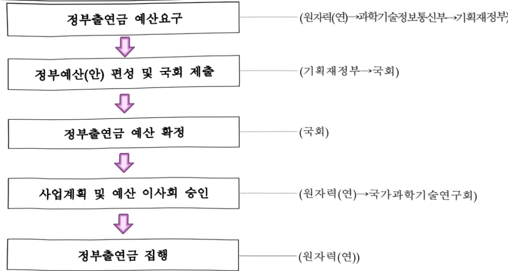

# 한국원자력연구원 연구 운영비 지원(R&D)

**해당 페이지**: PDF 1695 ~ 1705 쪽 해당

**부처**: 과학기술정보통신부
**분야**: 과학기술
**회계유형**: 에너지및자원 사업특별회계
**2026 확정예산**: 171326.0 백만원
**전년대비 증감률**: 11.2%
**AI 도메인**: R&D 지원

---

### 가.예산 총괄표

(단위:백만원,%)

<table border=1 style='margin: auto; word-wrap: break-word;'><tr><td rowspan="2">사업명</td><td rowspan="2">2024년 결산</td><td colspan="2">2025년 예산</td><td colspan="2">2026년 예산</td><td rowspan="2">증감(B-A)</td><td rowspan="2">(B-A)/A</td></tr><tr><td style='text-align: center; word-wrap: break-word;'>본예산</td><td style='text-align: center; word-wrap: break-word;'>추경*(A)</td><td style='text-align: center; word-wrap: break-word;'>요구안</td><td style='text-align: center; word-wrap: break-word;'>본예산(B)</td></tr><tr><td style='text-align: center; word-wrap: break-word;'>한국원자력연구원 연구운영비 지원(R&amp;D)</td><td style='text-align: center; word-wrap: break-word;'>140,717</td><td style='text-align: center; word-wrap: break-word;'>154,061</td><td style='text-align: center; word-wrap: break-word;'>154,061</td><td style='text-align: center; word-wrap: break-word;'>165,256</td><td style='text-align: center; word-wrap: break-word;'>171,326</td><td style='text-align: center; word-wrap: break-word;'>17,265</td><td style='text-align: center; word-wrap: break-word;'>11.2</td></tr></table>

*추경: 추경중감액을 포함한 최종 예산액을 기재

## □ 기능별(내역사업별) 예산 내역

(단위:백만원)

<table border=1 style='margin: auto; word-wrap: break-word;'><tr><td rowspan="2"></td><td colspan="5">2024</td><td colspan="5">2025</td><td rowspan="2">2026 倉圧</td></tr><tr><td style='text-align: center; word-wrap: break-word;'>倉圧倉圧(倉圧)</td><td style='text-align: center; word-wrap: break-word;'>倉圧倉圧</td><td style='text-align: center; word-wrap: break-word;'>倉圧倉圧</td><td style='text-align: center; word-wrap: break-word;'>倉圧倉圧</td><td style='text-align: center; word-wrap: break-word;'>倉圧倉圧</td><td style='text-align: center; word-wrap: break-word;'>倉圧倉圧</td><td style='text-align: center; word-wrap: break-word;'>倉圧倉圧</td><td style='text-align: center; word-wrap: break-word;'>倉圧倉圧</td><td style='text-align: center; word-wrap: break-word;'>倉圧倉圧</td><td style='text-align: center; word-wrap: break-word;'>倉圧倉圧</td></tr><tr><td style='text-align: center; word-wrap: break-word;'>○ 기능별 분류(합계)</td><td style='text-align: center; word-wrap: break-word;'>142,460</td><td style='text-align: center; word-wrap: break-word;'>142,460</td><td style='text-align: center; word-wrap: break-word;'>140,717</td><td style='text-align: center; word-wrap: break-word;'>-</td><td style='text-align: center; word-wrap: break-word;'>1,743</td><td style='text-align: center; word-wrap: break-word;'>154,061</td><td style='text-align: center; word-wrap: break-word;'>154,061</td><td style='text-align: center; word-wrap: break-word;'>152,122</td><td style='text-align: center; word-wrap: break-word;'>-</td><td style='text-align: center; word-wrap: break-word;'>1,939</td><td style='text-align: center; word-wrap: break-word;'>171,326</td></tr><tr><td style='text-align: center; word-wrap: break-word;'>· 기관운영비</td><td style='text-align: center; word-wrap: break-word;'>75,320</td><td style='text-align: center; word-wrap: break-word;'>75,320</td><td style='text-align: center; word-wrap: break-word;'>73,577</td><td style='text-align: center; word-wrap: break-word;'>-</td><td style='text-align: center; word-wrap: break-word;'>1,743</td><td style='text-align: center; word-wrap: break-word;'>77,609</td><td style='text-align: center; word-wrap: break-word;'>77,609</td><td style='text-align: center; word-wrap: break-word;'>75,670</td><td style='text-align: center; word-wrap: break-word;'>-</td><td style='text-align: center; word-wrap: break-word;'>1,939</td><td style='text-align: center; word-wrap: break-word;'>83,179</td></tr><tr><td style='text-align: center; word-wrap: break-word;'>· 주요사업비</td><td style='text-align: center; word-wrap: break-word;'>67,140</td><td style='text-align: center; word-wrap: break-word;'>67,140</td><td style='text-align: center; word-wrap: break-word;'>67,140</td><td style='text-align: center; word-wrap: break-word;'>-</td><td style='text-align: center; word-wrap: break-word;'>-</td><td style='text-align: center; word-wrap: break-word;'>76,452</td><td style='text-align: center; word-wrap: break-word;'>76,452</td><td style='text-align: center; word-wrap: break-word;'>76,452</td><td style='text-align: center; word-wrap: break-word;'>-</td><td style='text-align: center; word-wrap: break-word;'>-</td><td style='text-align: center; word-wrap: break-word;'>88,147</td></tr></table>

### 나.사업설명자료

## 1 ) 사업목적·내용

□ (한국원자력연구원 연구 운영비 지원(R&D)) 원자력의 연구개발을 종합적으로 수행해

학술의 진보, 에너지 확보 및 원자력의 이용을 촉진

(선신원자력 기술개발 및 성과확산) 선진원자로 핵심기반 기술 개발 및 검증, 연구로 해외수출 기반 확대, 하나로 핵연료 국산화로 축적된 기술력을 발전시켜 분산형 고밀도 신형 연구로 핵연료 공정기술 개발

- (방사성폐기물 통합관리 및 방사선 재해방지) 방사능 재해방지를 위한 방사성폐기물의 통합적인 안전관리 및 관련 시설의 안전 운영, 자원화 핵심 기술 개발

- (침단 방사선 융합연구기반 구축) 미래 산업 창출에 기여하는 방사선 융복합 연구 지원시설

운영 및 관련 기반연구 수행을 통한 방사선 신기술 개발 및 방사선 산업 육성에 기여

- (원자력·양자범 연구 중합인프라 운영 및 핵심 기초연구) 하나로 등 국가대형연구 시설의 안전하고 효율적인 운영을 통한 기초과학 및 첨단 산업 진흥, 동위원소 생산을 통한 국민 의료 복지 등에 기여

---

(원자력 인재육성·정책 및 글로벌협력 지원) 원자력 기술협력사업 지원을 통한 원자력·방사선 기술사업화 생태계 구축, 국내·외 원자력 교육과정 개발 및 운영을 통한 글로벌 원자력 전문 인재육성, 국가 원자력 정책 수립 지원 및 이행방안 연구 및 우리나라 원자력의 평화적 이용 및 기술개발을 위한 국제 수용성 확보, 원자력 정보 컨텐츠 확보 및 제공을 통한 연구개발 성과 증대

- (장비·시스템 구입비) 연구사업의 효과적 수행을 위한 연구장비의 효율적 구입·

운용, 기관고유 임무수행 등에 필요한 신규연구장비 도입 및 노후장비 교체 등

(표준설계인가 획득 SMR 상용화 위한 설계최적화 및 AI기반 운영시스템 개발)

표준설계인가를 획득한 SMR(SMART100)의 시장수요 대응 설계 최적화 및 AI 기반

운영시스템 개발을 통한 글로벌 SMR 시장 수출

- (난치성 질환 진단·치료 위한 방사성원료의약품 생산 및 개발) 의료용 방사성동위

원소의 안정공급과 수출산업화를 위한 자급 생산 기반 확보 및 산업 확대 추진

- (양자컴퓨터 오류정정 기술 혁신을 위한 양자급 무오류 양자소재 개발 및 실증)

양자소재 개발을 통한 양자오류 극복 및 양자 관련 응용 산업의 국가 경쟁력 확보를

통한 미래 양자산업 선도

- (고효을 초임계 CO2 발전을 위한 재압축기 개발) 무탄소 분산 전원의 발전효율 증대

위한 초임계 CO₂ 발전시스템 개발

## 2 ) 사업개요

## ☐ 사업근거 및 추진경위

① 법령상 근거 및 조항 적시

- 과학기술분야 정부출연연구기관 등의 설립·운영 및 육성에 관한 법률 제5조 ②항

「정부는 연구기관 및 연구회의 설립·운영에 소요되는 경비에 충당하기 위하여

예산의 범위에서 연구기관 및 연구회에 출연금을 지급할 수 있다. 이 경우 정부는

연구기관 및 연구회의 지속적이고 안정적인 운영을 위하여 필요한 재원이 마련될

수 있도록 노력하여야 한다.

- 과학기술분야 정부출연연구기관 등의 설립·운영 및 육성에 관한 법률 제8조 ①항

「이 법에 따라 설립되는 연구기관은 별표와 같다」

[(별표) 20. 한국원자력연구원]

## ② 추진경위

- 1958.03. 원자력법 공포

- 1959.02. 원자력연구소 개소 (우리나라 최초의 연구소)

- 1973.02. 한국원자력연구소 발족(원자력연구소, 방사선의학연구소, 방사선농학 연구소 통합)

※ 한국원자력연구소법 제정·공포('73.1.15)

---

- 1980.12. 한국에너지연구소로 명칭 변경

- 1989.12. 한국원자력연구소로 명칭 화워

- 1990.02. 부설 원자력안전센터를 분리하여 법인 한국원자력안전기술위 설립

- 2005.01. 국가원자력통제업무 이관으로 국가원자력관리통제소가 분리 및 설립

- 2007.03. 공공기술연구회로 소속변경 및 한국원자력연구원으로 명칭 변경

(부설 원자력의학원이 한국원자력의학원으로 분리·설립)

- 2008.03. 기초기술연구회 소관연구기관으로 소속 변경

- 2014.06 국가과학기술연구회 소관연구기관으로 소속 변경

주요내용

① 사업규모

- 사업기간 : 계속

- 최근 5년 간 투입된 사업비(예산액기준, 추경편성한 연도에는 추경포함)

<table border=1 style='margin: auto; word-wrap: break-word;'><tr><td style='text-align: center; word-wrap: break-word;'>연도</td><td style='text-align: center; word-wrap: break-word;'>2022</td><td style='text-align: center; word-wrap: break-word;'>2023</td><td style='text-align: center; word-wrap: break-word;'>2024</td><td style='text-align: center; word-wrap: break-word;'>2025</td><td style='text-align: center; word-wrap: break-word;'>2026</td></tr><tr><td style='text-align: center; word-wrap: break-word;'>사업비</td><td style='text-align: center; word-wrap: break-word;'>154,769</td><td style='text-align: center; word-wrap: break-word;'>158,106</td><td style='text-align: center; word-wrap: break-word;'>142,460</td><td style='text-align: center; word-wrap: break-word;'>154,061</td><td style='text-align: center; word-wrap: break-word;'>171,326</td></tr></table>

② 사업추진체계

- 사업시행방법 : 출연

- 사업시행주체 : 한국원자력연구원

- 사업 수혜자 : 산업계, 학계, 연구계 관계자 및 국민

- 보조, 융자, 출연, 출자 등의 경우 보조·융자 등 지원 비율 및 법적근거

<table border=1 style='margin: auto; word-wrap: break-word;'><tr><td style='text-align: center; word-wrap: break-word;'>내역사업명</td><td style='text-align: center; word-wrap: break-word;'>구분</td><td style='text-align: center; word-wrap: break-word;'>피보조·피출연 등 기관명</td><td style='text-align: center; word-wrap: break-word;'>지원 금액 (2026예산)</td><td style='text-align: center; word-wrap: break-word;'>지원 비율(%)</td><td style='text-align: center; word-wrap: break-word;'>보조율 법적근거 (해당 조항)</td></tr><tr><td style='text-align: center; word-wrap: break-word;'>한국원자력 연구원 연구 운영비 지원(R&amp;D)</td><td style='text-align: center; word-wrap: break-word;'>출연</td><td style='text-align: center; word-wrap: break-word;'>한국원자력 연구원</td><td style='text-align: center; word-wrap: break-word;'>171,326</td><td style='text-align: center; word-wrap: break-word;'>100</td><td style='text-align: center; word-wrap: break-word;'>과학기술분야 정부출연연구기관 등의 설립·운영 및 육성에 관한 법률 제5조 1, 2항</td></tr></table>

---

## 3 ) 2026년도 예산 산출 근거

<table border=1 style='margin: auto; word-wrap: break-word;'><tr><td style='text-align: center; word-wrap: break-word;'>&#x27;26년도 요구내용 및 산출근거</td></tr><tr><td style='text-align: center; word-wrap: break-word;'>(1) 인건비 : (2025) 73,758 → (2026) 79,048백만원, +7.2% - &#x27;26년 신규인력 증원 238백만원 - 처우개선분 3.5% 2,582백만원 - PBS 개선 2,470백만원</td></tr><tr><td style='text-align: center; word-wrap: break-word;'>(2) 경상비 : (2025) 3,851 → (2026) 4,131백만원, +7.3% - 경상비 효율화(△45백만원) - 공공요금 인상분 48백만원 - 자회사 처우개선분 17백만원 - 재산세 인상분 260백만원</td></tr><tr><td style='text-align: center; word-wrap: break-word;'>(3) 주요사업비 : (2025) 76,452 → (2026) 88,147백만원, 15.3%</td></tr><tr><td style='text-align: center; word-wrap: break-word;'>&lt;선진원자력 기술개발 및 성과확산&gt; (25) 3,556 → (26) 3,106백만원 - 자체구조조정(△450) &lt;방사성폐기물 통합관리 및 방사선 재해방지&gt; (25) 28,172 → (26) 25,966백만원 - 자체구조조정(△2,206) &lt;첨단 방사선 융합연구기반 구축&gt; (25) 11,740 → (26) 8,392백만원 - 자체구조조정(△3,348) &lt;원자력·양자범 연구 종합인프라 운영 및 핵심 기초연구&gt; (25) 29,358 → (26) 26,538백만원 - 자체구조조정(△2,820) &lt;원자력 인재육성정책 및 글로벌협력 지원&gt; (25) 2,532 → (26) 3,732백만원 - (증액) 원자력 기술협력사업&#x27;(700) - (신규) 우주 방사선 영향평가용 사이클로트론 연구시설 구축 타당성 조사(500) &lt;장비·시스템 구입비&gt; (25) 1,094 → (26) 540백만원 - R&amp;D 수행을 위한 필수 장비 구입비(△554) &lt;전략연구사업&gt; (25) - → (26) 19,873백만원 - (신규) 표준설계인가 획득 SMR 상용화 위한 설계최적화 및 AI기반 운영시스템 개발(7,024) - (신규) 난치성 질환 진단·치료 위한 방사성원료의약품 생산 및 개발(6,277) - (신규) 양자컴퓨터 오류정정 기술 혁신을 위한 양자급 무오류 양자소재 개발 및 실증(4,006) - (신규) 고효율 초임계 CO2 발전을 위한 재압축기 개발(2,566)</td></tr></table>

## 4 ) 사업효과

사업영향, 산출물 성과지표 등

① 2022~2026년도 성과계획서 상 성과지표 및 최근 5년간 성과 달성도 : 해당사항 없음

---

② 성과지표 이외의 연도별 사업추진 경과 및 실적

<table border=1 style='margin: auto; word-wrap: break-word;'><tr><td style='text-align: center; word-wrap: break-word;'>2022</td><td style='text-align: center; word-wrap: break-word;'>○ 실시간 해양 방사능 감시 시스템 구축- 선박에 탑재하여 기동경로에 따라 능동적인 해양 방사능 감시가 가능한 해수 방사능 검출 시스템을 국내 최초로 구축하고 기술이전에 성공○ 5G 네트워크 핵심부품 국산화 성공- 산업체와 협력을 통해 국내 최초로 25Gbps급 애벌런치 포토다이오드(APD) 개발에 성공하여 전량 수입에 의존하던 부품을 국내에서 생산○ 국내최초 ‘방사선 DNA 손상 정밀 예측 모델’ 개발- 복잡한 DNA 구조를 방사선 손상을 정밀하게 예측할 수 있는 구조로 변환, DNA를 구성하는 다양한 원자들의 손상 에너지 계산 알고리즘 개발- 사전데이터가 없는 생물에도 적용가능하며, DNA 뿐만 아니라 아미노산, 단백질 구조의 손상도 예측 가능</td></tr><tr><td style='text-align: center; word-wrap: break-word;'>2023</td><td style='text-align: center; word-wrap: break-word;'>○ 방사선 직접효과를 이용한 효흡기용합바이러스 백신 개발 가능성 확인- 방사선을 이용한 백신의 개발 시 단순조사보다는 직간접효과를 조절하면서 백신을 개발하여 효능 및 부작용 문제를 해결할 수 있는 새로운 아이디어 제공○ 고도 분석 기술 기반 전기차 폐배터리 진환경 재활용 기술 개발- 하나로 중성자 회절과 방사광 X-선 등 고도 분석을 활용하여 폐배터리 블랙과우더의 열화 현상을 해석하고, 기존 소재보다 수명 30% 이상 향상시킬 수 있는 업사이클링 기술 개발- 기존 재활용 공정에서 주로 활용되고 있는 습식 처리나 고온 건식 처리를 활용하지 않고 염소화 반응을 통해 상대적 저온(550도)에서 리튬만 97% 이상 회수 할 수 있는 진환경 공정 기술 개발○ 중성자 활용 차세대 이차전지 수명 저하 난제 해결- 국내외 이차전지 산업체에서 상용화를 위해 노력하고 있는 차세대 하이니켈(high-Ni) 양극 소재의 합성 공정에서 발생하는 나노 단위의 결함을 하나로 중성자 산란 장치를 통해 세계 최초로 정량화하고, 결함 제어하고 품질을 높여 수명 성능을 향상 시킬 수 있는 방법을 제시○ 저농도(기존 대비 1/5 이하) 산성용액 및 염류 발생 없는 중화제 이용한 최초의 우라늄 오염 토양 자체처분 제염 및 폐액재순환 공정 개발- 방사성폐기물을 획기적으로 감축할 수 있는 화학적 제염, 폐액처리, 2차 폐기물 고형화 기술을 개발하여 처분비용 절감(40% 이상) 기반 확보○ 국내 최고 수준의 우주 고전력 전기추력기 기술 확보- 8kW 인가전력에서 290mN 추력과 1,000초 비추력을 확인함으로써, 국내 최고 수준의 우주 고전력 전기추력기 기술 검증- 추력과 비추력을 측정할 수 있는 추력 스텐드를 자체 제작해 실험에 활용하였으며, 추력은 국내 최고 수준, 비추력은 기존 화학식 추력기의 보다 3배 높아 경제성 확보 확인○ 세계 최고 수준의 성능을 갖는 KAERI 고유 진환경 압전소재 개발- 기존 상용 강유전체 소재 Pb(Zr,Ti)O3 대비 동등 이상의 성능을 갖고, 300도 고온까지 압전성이 유지되는 비납계 (zero-Pb) 압전세라믹 3종 (신물질 A,B,C) 개발</td></tr></table>

---

<table border=1 style='margin: auto; word-wrap: break-word;'><tr><td style='text-align: center; word-wrap: break-word;'>2024</td><td style='text-align: center; word-wrap: break-word;'>○ 방사성원료의약품 요오드화나트륨(I-131)액 식약처 품목허가 획득 - 연구용 원자로 하나로에서 생산하여 난치성 암치료를 위한 방사성의약품 원료로 사용되는 방사성원료의약품 &#x27;KAERI 요오드화나트륨(I-131)액&#x27; 국내 최초 식약처 품목허가 획득 ○ 「네덜란드 델프트 공대 연구로 시설 구축 및 연구로 개조 사업(OYSTER)」 성료 - 국내 원자력 기술의 사상 첫 유럽시장 진출 OYSTER 프로젝트의 주요 역무를 성공적으로 완수함으로써 글로벌 원자력 기술력 입증 및 지속적 연구로 기술 수출에 기여 ○ 방사선육종 기반 슈퍼푸드 잡두 국산 1호 품종 개발 - 감마선 조사, 계통육성 및 선발, 재배평가 및 변이검정 등의 방사선 육종 과정을 거쳐 추위에 견디는 내한성이 우수한 품종 개발 및 품종보호출원 신청 ○ 전자선실증연구시설을 이용해 수급이 어려웠던 국내 문화재 최적 복원소재 공급 - 서울특별시 유형문화재 제 177호 &lt;관서명승도첩&gt;, &lt;미황사 영산회상도&gt; 복원 완료 ○ 원전 무선센서 전력공급을 위한 고효율·반영구 에너지 하베스터용 복합소재, 후막 소재, 별크소재 제조 공정 개발 및 절차도 수립 - 고성능 및 고온 안정성을 갖는 이종 세라믹 복합체 기술을 개발하여 Energy &amp; Fuels 분야 최고급 저널 J. Mater. Chem. A 논문 게재</td></tr><tr><td style='text-align: center; word-wrap: break-word;'>2025</td><td style='text-align: center; word-wrap: break-word;'>○ 방사성폐기물 전주기 관리체계 및 처리 인프라 확대 구축 - 국내 최초 입자성 물질 함유 방사성폐기물 비분산 포장제(소프트백) 사용 승인 및 현장 적용 - 추가 공정 없이 처리(포장)을 진행할 수 있어 소요시간(기간) 최대 90% 이상 단축 ○ 원자력 인공지능 적용성 향상을 위한 기반 기술 연구 - 원자력 분야의 복잡한 기술, 용어, 보고서 문서를 정밀하게 이해하고, 전문가 수준의 질의응답을 수행할 수 있는 거대언어모델 AtomicGPT를 개발 ○ 목표형질 타겟혈 육종기술 실증 및 온난화 대응 생물자원 개발·산업화 - 방사선육종 기술로 내염성이 우수하여 간척지 재배가 가능하고 바이오매스 생산성 높은 케나프 신품종 &#x27;원백을 개발, 품종보호권 및 재배기술을 국내기업 &#x27;컴바이오케나프&#x27;에 기술이전을 실시 - 고분자 복합소재 활용 작물 재배 실증 기술을 국내 기업 &#x27;컴센윈&#x27; 에 제공하여 국가 탄소중립 실현 및 출연연 기술사업화에 기여 ○ 하나로 및 활용시설 운영 - 하나로 2025년 상반기 4주기 계획 운전 및 218일 무 비계획정지 운전 달성 - 하나로 운영 안정화를 통해 중성자 활용 연구, 조사시험, 동위원소 및 반도체 재료 생산 활성화 ○ 나노소재기반 플렉서를 방사선 검출센서 개발 - 방사선 검출센서 어레이 개발 달성 및 향후 완벽한 플렉서를화 구현을 위한 백플레인 신호처리 소자의 방사선 내성 검증에 대한 중요성 확인</td></tr></table>

## ③향후(2026년도 이후)기대효과

☐ 선진원자력 기술개발 및 성과확산

- 노심 핵/차폐 및 이용시설 설계, 유체계통 및 계측제어계통 인허가, 원자로기기

취급전용도구 설계제작 및 원자로 집합체 내진해석 등 연구로 개발 지원

- 하나로의 핵연료 국산화 및 전량 공급을 통한 하나로의 안정적 운영에 기여,

핵연료 제조 시설의 환경방출기준 준수

- 초고은, 고출력이 요구되는 우주기지 전력공급 및 원자력 추진체 개발에 공통

활용 가능한 혁신핵연료 기술 확보

---

○ 방사성폐기물 통합관리 및 방사선 재해방지

- 핵주기시험시설의 법규준수를 통한 안전운전 향상, 이용자의 적기 시험 지원 및

독자적 핫셀 시험기술의 지속적 개발

- 연구원 내 발생 방사성폐기물 관리 및 감용/안정화 처리기술 개발로 방사성폐기물의 처분적합성 및 재고량 감축

- 다목적 고해상도 실시간 환경방사선 감시 정보 가시화 시스템 구축 및 운영

- 신축 방사성 핵종평가 화학분석 시설의 장비 구축 및 효율적 운영을 통한 핵종 분석능력 강화 및 폐기물의 경주처분장으로의 조속 이송

– 점단 방사선 융합연구기반 구축

– 방사선융합연구지원시설의 안정적 운영 및 기술·서비스 제공을 통한 방사선 기반 원천 및 융합기술 개발 기여

– 전자선 기반 방사선기술 실증 지원시스템 구축 및 애로기술 해결형 방사선 조사 서비스 제공

– 대단위 감마선 조사시설 품질경영시스템(ISO13485) 인증 획득

– 방사선육종 산업소재 자원 품종화 연구 및 바이오소재 활용역량 강화를 위한 실증연구, ICT기반 육종플랫폼 활용 실증 및 산업소재자원 활용연구

☐ 원자력 · 양자범 연구 종합인프라 운영 및 핵심 기초연구

- 하나로 주기적인전성평가 2차 PSR 착수 및 수행, 경년열화관리 및 예방정비

- 중성자과학연구시설의 안정적 가동과 산란장치 15기의 일상가동 체제 확립 및

- 양성자가속기 이용 이차범(중성자, RI) 서비스 및 이온빈 분석 영역 확대

- 양성자가속기 이용 동위원소 생산 기반 구축/연구, 우주방사선환경 연구용 범라인

운영, 양성자 및 이온빈 서비스 품질인증제 체계 운영

- 복합양자범 활용 미래·극한환경 대응 첨단기능소재 글로벌 선도기술 개발

- 세계 최고 계산 성능을 보유한 원자로 통합해석 플랫폼(V-SMR) 구축을 위한

핵심 요소 기술 확보

## ○ 원자력 인재육성·정책 및 글로벌협력 지원

- 글로벌 원자력 협력 전략 수립 및 우호적 환경 조성활동 강화

- 원자력시설 사이버보안 계획 조치 이행 · 훈련 실시 및 주요 정보통신 기반시설

취약점 분석 · 평가 및 보호대책 수립

- 원자력 환경감시센터 감시프로그램 운영 지원 개선 및 지역사회 상생 · 연대를 위한 현장 소통사업 확대 운영

- 원자력 R&D 정책 환경과 연구원 R&R 능 장기 주진전략에 부합하도록 연구

사업의 기획 및 평가 지원

- 차세대원자력의 전략기술 사업 발굴 및 연구원 기술개발 전략 수립

---

표준설계인가 획득 SMR 상용화 위한 설계최적화 및 AI기반 운영시스템 개발

- 글로벌 해양 부유식 SMR 신규시장 내 '30년대 첫호기 제작 및 시장 진입

- AI 기반 SMR 운영시스템 최적화 통해 SMR 운영비 절감 및 수입대체 효과 창출,

국내 SMR 산업 성장 및 일자리 창출

- 난치성 질환 진단 · 치료 위한 방사성원료의약품 생산 및 개발

- 암 진단 · 치료용 방사성동위원소의 수입대체효과 발생 및 국가 의료주권 확보 가능

- 치료용 방사성동위원소의 수출 확대 및 핵심 기술확보 · 인프라 구축을 통한

산업경쟁력 강화 기대

○ 양자컴퓨터 오류정정 기술 혁신을 위한 양자급 무오류 양자소재 개발 및 실증

- 양자과학기술 관련 국내 기술자립을 통한 수입대체효과 창출 및 다양한 양자

응용산업(컴퓨터, 보안, 통신 등)의 국가경쟁력 확보 기대

고효율 초임계 CO₂ 발전을 위한 재압축기 개발

-산업폐얼,원자력·화력발전등고효율초임계CO₂발전시스템수요처적용을

통한 발전효율 항상 및 탄소배출량 저감. LCOE(평균화 에너지 비용) 저각 기대

## 5 ) 타당성조사 및 예비타당성조사 시행여부 및 결과 요지 : 해당사항 없음

6) 총사업비 대상사업 정보 : 해당사항 없음

---

## 7 ) 사업 집행절차

☐ 예산(안) 편성지침 및 기준 통보 (기획재정부)

0 기관 예산요구서 제출 (한국원자력연구원 → 국가과학기술연구회)

이사회 심의 · 의결 · 제출 (국가과학기술연구회 → 과학기술정보통신부)

0 부처 예산요구서 제출 (과학기술정보통신부 → 기획재정부)

○ 정부예산(안) 국회 제출 (기획재정부 → 국회)

○ 정부예산 확정 (국회)

- 사업계획 및 예산(안) 이사회 승인

## 8 ) 각종 평가

1) 국회(예결위, 상임위, 예정처, 국정감사 포함) 지적

☐ 출연금 이월률 10% 초과 사업 대상 철저한 사업관리 및 집행가능성을 고려한 사업예산 배정, 시설사업 집행부진 관련 교부계획 조정 등 철저한 사업관리 필요('23년 결산, 예결위)

2) 대외공개 평가 : 해당사항 없음

3) 자체평가 : 해당사항 없음

---

### 다. 최근 4년간 결산내역

## 1 ) 결산표

☐ 부처 결산내역

(단위: 백만원, %)

<table border=1 style='margin: auto; word-wrap: break-word;'><tr><td rowspan="2">연도</td><td colspan="3">예산액</td><td rowspan="2">예산현액(A)</td><td rowspan="2">집행액(B)</td><td rowspan="2">집행률(B/A)</td><td rowspan="2">다음연도이월액</td><td rowspan="2">불용액</td></tr><tr><td style='text-align: center; word-wrap: break-word;'>본예산</td><td style='text-align: center; word-wrap: break-word;'>추경증감액</td><td style='text-align: center; word-wrap: break-word;'>추경</td></tr><tr><td style='text-align: center; word-wrap: break-word;'>2022</td><td style='text-align: center; word-wrap: break-word;'>154,769</td><td style='text-align: center; word-wrap: break-word;'>-</td><td style='text-align: center; word-wrap: break-word;'>154,769</td><td style='text-align: center; word-wrap: break-word;'>154,769</td><td style='text-align: center; word-wrap: break-word;'>152,556</td><td style='text-align: center; word-wrap: break-word;'>98.6</td><td style='text-align: center; word-wrap: break-word;'>-</td><td style='text-align: center; word-wrap: break-word;'>2,213</td></tr><tr><td style='text-align: center; word-wrap: break-word;'>2023</td><td style='text-align: center; word-wrap: break-word;'>158,106</td><td style='text-align: center; word-wrap: break-word;'>-</td><td style='text-align: center; word-wrap: break-word;'>158,106</td><td style='text-align: center; word-wrap: break-word;'>158,106</td><td style='text-align: center; word-wrap: break-word;'>156,115</td><td style='text-align: center; word-wrap: break-word;'>98.7</td><td style='text-align: center; word-wrap: break-word;'>-</td><td style='text-align: center; word-wrap: break-word;'>1,991</td></tr><tr><td style='text-align: center; word-wrap: break-word;'>2024</td><td style='text-align: center; word-wrap: break-word;'>142,460</td><td style='text-align: center; word-wrap: break-word;'>-</td><td style='text-align: center; word-wrap: break-word;'>142,460</td><td style='text-align: center; word-wrap: break-word;'>142,460</td><td style='text-align: center; word-wrap: break-word;'>140,717</td><td style='text-align: center; word-wrap: break-word;'>98.8</td><td style='text-align: center; word-wrap: break-word;'>-</td><td style='text-align: center; word-wrap: break-word;'>1,743</td></tr><tr><td style='text-align: center; word-wrap: break-word;'>2025</td><td style='text-align: center; word-wrap: break-word;'>154,061</td><td style='text-align: center; word-wrap: break-word;'>-</td><td style='text-align: center; word-wrap: break-word;'>154,061</td><td style='text-align: center; word-wrap: break-word;'>154,061</td><td style='text-align: center; word-wrap: break-word;'>152,122</td><td style='text-align: center; word-wrap: break-word;'>98.7</td><td style='text-align: center; word-wrap: break-word;'>-</td><td style='text-align: center; word-wrap: break-word;'>1,939</td></tr></table>

## 2 ) 주요 결산사항

□ 2022~2025년 결산 주요사항

<table border=1 style='margin: auto; word-wrap: break-word;'><tr><td style='text-align: center; word-wrap: break-word;'>2022</td><td style='text-align: center; word-wrap: break-word;'>- 이월 사유 및 불용 사유(집행부진사유) : 정부출연금 불용처리 인건비(2,213백만원) 발생</td></tr><tr><td style='text-align: center; word-wrap: break-word;'>2023</td><td style='text-align: center; word-wrap: break-word;'>- 이월 사유 및 불용 사유(집행부진사유) : 정부출연금 불용처리 인건비 등(1,991백만원) 발생</td></tr><tr><td style='text-align: center; word-wrap: break-word;'>2024</td><td style='text-align: center; word-wrap: break-word;'>- 이월 사유 및 불용 사유(집행부진사유) : 정부출연금 불용처리 인건비(1,743백만원) 발생</td></tr><tr><td style='text-align: center; word-wrap: break-word;'>2025</td><td style='text-align: center; word-wrap: break-word;'>- 이월 사유 및 불용 사유(집행부진사유) : 정부출연금 불용처리 인건비 등(1,939백만원) 발생</td></tr></table>

□ 2025년 이·전용 등 세부내역 : 해당사항 없음

---

<table border=1 style='margin: auto; word-wrap: break-word;'><tr><td style='text-align: center; word-wrap: break-word;'>사 업 명</td></tr><tr><td style='text-align: center; word-wrap: break-word;'>(11) 한국재료연구원 연구운영비 지원 (2241-302)</td></tr></table>

☐ 사업 코드 정보

<table border=1 style='margin: auto; word-wrap: break-word;'><tr><td style='text-align: center; word-wrap: break-word;'>구분</td><td style='text-align: center; word-wrap: break-word;'>회계</td><td style='text-align: center; word-wrap: break-word;'>소관</td><td style='text-align: center; word-wrap: break-word;'>실국(기관)</td><td style='text-align: center; word-wrap: break-word;'>계정</td><td style='text-align: center; word-wrap: break-word;'>분야</td><td style='text-align: center; word-wrap: break-word;'>부문</td></tr><tr><td style='text-align: center; word-wrap: break-word;'>코드</td><td rowspan="2">소재·부품·장비경쟁력강화 및 공급망 안정화 특별회계</td><td rowspan="2">과학기술정보통신부</td><td rowspan="2">연구개발정책실기초원천연구정책관</td><td rowspan="2">-</td><td style='text-align: center; word-wrap: break-word;'>150</td><td style='text-align: center; word-wrap: break-word;'>152</td></tr><tr><td style='text-align: center; word-wrap: break-word;'>명칭</td><td style='text-align: center; word-wrap: break-word;'>과학기술</td><td style='text-align: center; word-wrap: break-word;'>과학기술연구지원</td></tr></table>

<table border=1 style='margin: auto; word-wrap: break-word;'><tr><td style='text-align: center; word-wrap: break-word;'>구분</td><td style='text-align: center; word-wrap: break-word;'>프로그램</td><td style='text-align: center; word-wrap: break-word;'>단위사업</td><td style='text-align: center; word-wrap: break-word;'>세부사업</td></tr><tr><td style='text-align: center; word-wrap: break-word;'>코드</td><td style='text-align: center; word-wrap: break-word;'>2200</td><td style='text-align: center; word-wrap: break-word;'>2241</td><td style='text-align: center; word-wrap: break-word;'>302</td></tr><tr><td style='text-align: center; word-wrap: break-word;'>명칭</td><td style='text-align: center; word-wrap: break-word;'>출연연구기관지원</td><td style='text-align: center; word-wrap: break-word;'>국가과학기술연구회 소관출연연구기관지원</td><td style='text-align: center; word-wrap: break-word;'>한국재료연구원 연구운영비 지원(R&amp;D)</td></tr></table>

<table border=1 style='margin: auto; word-wrap: break-word;'><tr><td colspan="6">☐ 사업 성격 (공통요구자료 II-1 작성유의사항 4. 참조, 해당하는 사항에 “○” 표시)</td></tr><tr><td style='text-align: center; word-wrap: break-word;'>신규 계속</td><td style='text-align: center; word-wrap: break-word;'>완료</td><td style='text-align: center; word-wrap: break-word;'>예비타당성 실시여부</td><td style='text-align: center; word-wrap: break-word;'>총사업비 관리대상</td><td style='text-align: center; word-wrap: break-word;'>총액계상 예산사업</td><td style='text-align: center; word-wrap: break-word;'>사업소관 변경정보 2025예산 시 소관</td></tr><tr><td style='text-align: center; word-wrap: break-word;'></td><td style='text-align: center; word-wrap: break-word;'>☐</td><td style='text-align: center; word-wrap: break-word;'></td><td style='text-align: center; word-wrap: break-word;'></td><td style='text-align: center; word-wrap: break-word;'></td><td style='text-align: center; word-wrap: break-word;'></td></tr></table>

□ 사업 지원 형태 및 지원을 (최소한 한 개는 반드시 선택하시오. 해당사항에 O 표시)

<table border=1 style='margin: auto; word-wrap: break-word;'><tr><td style='text-align: center; word-wrap: break-word;'>직접</td><td style='text-align: center; word-wrap: break-word;'>출자</td><td style='text-align: center; word-wrap: break-word;'>출연</td><td style='text-align: center; word-wrap: break-word;'>보조</td><td style='text-align: center; word-wrap: break-word;'>융자</td><td style='text-align: center; word-wrap: break-word;'>국고보조율(%)</td><td style='text-align: center; word-wrap: break-word;'>융자율(%)</td></tr><tr><td style='text-align: center; word-wrap: break-word;'></td><td style='text-align: center; word-wrap: break-word;'></td><td style='text-align: center; word-wrap: break-word;'>○</td><td style='text-align: center; word-wrap: break-word;'></td><td style='text-align: center; word-wrap: break-word;'></td><td style='text-align: center; word-wrap: break-word;'></td><td style='text-align: center; word-wrap: break-word;'></td></tr></table>

사업 소관부처 및 시행주체

<table border=1 style='margin: auto; word-wrap: break-word;'><tr><td style='text-align: center; word-wrap: break-word;'>사업명</td><td colspan="2">구분</td></tr><tr><td rowspan="3">한국제료연구원연구운영비지원(R&amp;D)(2241-302)</td><td rowspan="2">소관부처</td><td style='text-align: center; word-wrap: break-word;'>연구개발정책실기초원천연구정책관</td></tr><tr><td style='text-align: center; word-wrap: break-word;'>연구기관혁신정책과</td></tr><tr><td style='text-align: center; word-wrap: break-word;'>사업시행주체</td><td style='text-align: center; word-wrap: break-word;'>한국제료연구원</td></tr></table>

---

### 원본 PDF 크롭 이미지

