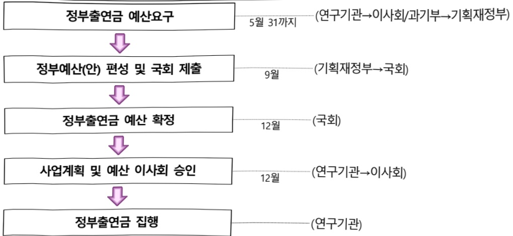

# 한국재료연구원연구운영비지원(R&D)

**해당 페이지**: PDF 1706 ~ 1715 쪽 해당

**부처**: 과학기술정보통신부
**분야**: 과학기술
**회계유형**: 소재·부품·장비 경쟁력강화 및 공급망 안정화 특별회계
**2026 확정예산**: 56196.0 백만원
**전년대비 증감률**: 18.0%
**AI 도메인**: R&D 지원

---

### 가.예산 총괄표

(단위: 백만원, %)

<table border=1 style='margin: auto; word-wrap: break-word;'><tr><td rowspan="2">사업명</td><td rowspan="2">2024년 결산</td><td colspan="2">2025년 예산</td><td colspan="2">2026년 예산</td><td rowspan="2">증감(B-A)</td><td rowspan="2">(B-A)/A</td></tr><tr><td style='text-align: center; word-wrap: break-word;'>본예산</td><td style='text-align: center; word-wrap: break-word;'>추경*(A)</td><td style='text-align: center; word-wrap: break-word;'>요구안</td><td style='text-align: center; word-wrap: break-word;'>본예산(B)</td></tr><tr><td style='text-align: center; word-wrap: break-word;'>한국재료연구원연구운영비지원(R&amp;D)</td><td style='text-align: center; word-wrap: break-word;'>40,949</td><td style='text-align: center; word-wrap: break-word;'>47,636</td><td style='text-align: center; word-wrap: break-word;'>47,636</td><td style='text-align: center; word-wrap: break-word;'>56,196</td><td style='text-align: center; word-wrap: break-word;'>56,196</td><td style='text-align: center; word-wrap: break-word;'>8,560</td><td style='text-align: center; word-wrap: break-word;'>18.0</td></tr></table>

*추경: 추경증감액을 포함한 최종 예산액을 기재

## □ 기능별(내역사업별) 예산 내역

(단위:백만원)

<table border=1 style='margin: auto; word-wrap: break-word;'><tr><td rowspan="2"></td><td colspan="5">2024</td><td colspan="5">2025</td><td rowspan="2">2026예산</td></tr><tr><td style='text-align: center; word-wrap: break-word;'>예산의(추정)</td><td style='text-align: center; word-wrap: break-word;'>예산현액</td><td style='text-align: center; word-wrap: break-word;'>집행액</td><td style='text-align: center; word-wrap: break-word;'>이월액</td><td style='text-align: center; word-wrap: break-word;'>불용액</td><td style='text-align: center; word-wrap: break-word;'>예산의(추정)</td><td style='text-align: center; word-wrap: break-word;'>예산현액</td><td style='text-align: center; word-wrap: break-word;'>집행액</td><td style='text-align: center; word-wrap: break-word;'>이월액</td><td style='text-align: center; word-wrap: break-word;'>불용액</td></tr><tr><td style='text-align: center; word-wrap: break-word;'>○ 기능별 분류(합계)</td><td style='text-align: center; word-wrap: break-word;'>45,291</td><td style='text-align: center; word-wrap: break-word;'>45,291</td><td style='text-align: center; word-wrap: break-word;'>40,949</td><td style='text-align: center; word-wrap: break-word;'>-</td><td style='text-align: center; word-wrap: break-word;'>4,342</td><td style='text-align: center; word-wrap: break-word;'>47,636</td><td style='text-align: center; word-wrap: break-word;'>47,636</td><td style='text-align: center; word-wrap: break-word;'>46,310</td><td style='text-align: center; word-wrap: break-word;'>-</td><td style='text-align: center; word-wrap: break-word;'>1,326</td><td style='text-align: center; word-wrap: break-word;'>56,196</td></tr><tr><td style='text-align: center; word-wrap: break-word;'>· 기관운영비</td><td style='text-align: center; word-wrap: break-word;'>22,081</td><td style='text-align: center; word-wrap: break-word;'>22,081</td><td style='text-align: center; word-wrap: break-word;'>20,739</td><td style='text-align: center; word-wrap: break-word;'>-</td><td style='text-align: center; word-wrap: break-word;'>1,342</td><td style='text-align: center; word-wrap: break-word;'>22,758</td><td style='text-align: center; word-wrap: break-word;'>22,758</td><td style='text-align: center; word-wrap: break-word;'>21,432</td><td style='text-align: center; word-wrap: break-word;'>-</td><td style='text-align: center; word-wrap: break-word;'>1,326</td><td style='text-align: center; word-wrap: break-word;'>23,545</td></tr><tr><td style='text-align: center; word-wrap: break-word;'>· 주요사업비</td><td style='text-align: center; word-wrap: break-word;'>20,210</td><td style='text-align: center; word-wrap: break-word;'>20,210</td><td style='text-align: center; word-wrap: break-word;'>20,210</td><td style='text-align: center; word-wrap: break-word;'>-</td><td style='text-align: center; word-wrap: break-word;'></td><td style='text-align: center; word-wrap: break-word;'>24,878</td><td style='text-align: center; word-wrap: break-word;'>24,878</td><td style='text-align: center; word-wrap: break-word;'>24,878</td><td style='text-align: center; word-wrap: break-word;'>-</td><td style='text-align: center; word-wrap: break-word;'>-</td><td style='text-align: center; word-wrap: break-word;'>32,651</td></tr><tr><td style='text-align: center; word-wrap: break-word;'>· 시설사업비</td><td style='text-align: center; word-wrap: break-word;'>3,000</td><td style='text-align: center; word-wrap: break-word;'>3,000</td><td style='text-align: center; word-wrap: break-word;'>-</td><td style='text-align: center; word-wrap: break-word;'>-</td><td style='text-align: center; word-wrap: break-word;'>3,000</td><td style='text-align: center; word-wrap: break-word;'>-</td><td style='text-align: center; word-wrap: break-word;'>-</td><td style='text-align: center; word-wrap: break-word;'>-</td><td style='text-align: center; word-wrap: break-word;'>-</td><td style='text-align: center; word-wrap: break-word;'>-</td><td style='text-align: center; word-wrap: break-word;'>-</td></tr></table>

### 나. 사업설명자료

## 1 ) 사업목적·내용

□ (세부사업) 한국재료연구원 연구운영비 지원(R&D)

- 소재분야의 연구개발, 성과확산, 시험평가, 기술지원을 통해 국가 소재 연구개발의 구심점 역할 수행, 국가 소재산업 발전 및 국가·사회문제 해결에 기여

## ☐ 내역사업

- (내역사업 ① : 인건비) 기관 고유임무 수행에 필요한 인건비

- (내역사업 ② : 경상경비) 기관 고유임무 수행에 필요한 경상경비

(내역사업 ③ : 신산업 혁신소재 개발) 첨단 모빌리티 및 정보·전자 소재 분야의 급속한 기술 진보에 대응하여, 기존 소재의 한계를 극복하고 미래 신산업 선도

(내역사업 ④ : 탄소중립 및 삶의 질 향상 소재 개발) 탄소중립 사회와 지속 가능한

에너지 환경을 위한 고기능성 소재 기술을 개발하고, 이를 통해 환경 보호와 건강

증진에 기여하는 혁신적인 기술 기반을 마련

---

(내역사업 ⑤ : 기술안보 소재 개발) 우주, 항공, 국방, 원자력 및 핵융합 분야에 사용 가능한 극한환경 소재 개발을 통해 국가 소재기술안보 기틀 마련에 기여

(내역사업 ⑥ : 소재혁신 플랫폼 구축) AI 및 디지털 혁신 기술을 활용한 스마트 제조 기술 플랫폼을 구축하여 혁신적인 기술 생태계를 형성하고, 국가 전략기술 대응을 위한 전주기적 소재기술 플랫폼을 마련

(내역사업 ⑦ : 장비구입비) 기본사업의 원활한 연구수행을 위한 장비구입비

(내역사업 ⑧ : (전략연구사업) 금속소재 조성·공정 자동설계 초거대 AI 서비스 개발)

금속 소재의 개발 주기를 획기적으로 단축하고, 금속 소재 기업의 설계 및 제조 혁신을 지원하여 산업의 디지털 전환과 글로벌 경쟁력 강화에 기여

(내역사업 ⑨: (전략연구사업) 차세대 항공엔진용 고온소재 개발) 항공엔진용 고온소재를 국산화하기 위해, 16,000lbf급 항공엔진에 적용 가능한 고성능 고온소재를 개발하여 필수 소재의 설계 및 성능을 확보

## 2 ) 사업개요

## ☐ 사업근거 및 추진경위

① 법령상 근거 및 조항 적시 : 과학기술분야 정부출연연구기관 등의 설립·운영 및 육성에 관한 법률 제5조(운영재원) 및 제8조(연구기관의 설립)

제5조(운영재원) ① 연구기관 및 연구회는 정부의 출연금과 그 밖의 수의금으로 운영한다.

② 정부는 연구기관 및 연구회의 설립 · 운영에 드는 경비에 충당하기 위하여 예산의

범위에서 연구기관 및 연구회에 출연금을 지급할 수 있다.

제8조(연구기관의 설립) ① 이 법에 따라 설립되는 연구기관은 별표와 같다.

② 연구기관은 주된 사무소의 소재지에서 설립등기를 함으로써 성립한다.

③ 제2항에 따른 설립등기 사항은 다음 각 호와 같다.

1. 목적(연구 분야를 포함한다. 이하 같다)

2. 명칭

3. 주된 사무소

4. 연기기관의 장의 성명과 주소

5. 공고의 방법

④ 연구기관의 설립 준비절차에 관하여 필요한 사항은 대통령령으로 정한다.

② 추진경위 - 사업 시작년도, 추진배경, 부처별 중점과제, 대통령 공약사항 등

- 1976. 12. 한국기계금속시험연구소 설립(상공부 소관)

- 1981. 1. 한국기계연구소 설립(통합설립, 과학기술처 소관)

- 1992. 3. 기관명칭 한국기계연구원 개칭, 본원을 창원에서 대덕으로 이전

- 1993. 4. 한국기계연구원 창원 분원 설치

- 2002. 3. 창원분원을 재료기술연구소로 명칭 변경

- 2007. 4. 한국기계연구원 부설 재료연구소로 부설화

- 2020. 11. 한국재료연구원 설립

---

## 주요내용

① 사업규모

- 총사업비(해당되는 경우에만 기재) : 계속

- 사업기간 : '07~계속

- 최근 5년 간 투입된 사업비(예산액기준, 추경편성한 연도에는 추경포함)

<table border=1 style='margin: auto; word-wrap: break-word;'><tr><td style='text-align: center; word-wrap: break-word;'>연도</td><td style='text-align: center; word-wrap: break-word;'>2022</td><td style='text-align: center; word-wrap: break-word;'>2023</td><td style='text-align: center; word-wrap: break-word;'>2024</td><td style='text-align: center; word-wrap: break-word;'>2025</td><td style='text-align: center; word-wrap: break-word;'>2026</td></tr><tr><td style='text-align: center; word-wrap: break-word;'>사업비</td><td style='text-align: center; word-wrap: break-word;'>46,962</td><td style='text-align: center; word-wrap: break-word;'>50,381</td><td style='text-align: center; word-wrap: break-word;'>45,291</td><td style='text-align: center; word-wrap: break-word;'>47,636</td><td style='text-align: center; word-wrap: break-word;'>56,196</td></tr></table>

- 기타: 해당없음

② 사업추진체계

- 사업시행방법 : 출연

- 사업시행주체 : 한국재료연구원

- 사업 수혜자 : 산업계, 학계, 연구계, 공공부문 등 국가 모든 분야

- 보조, 융자, 출연, 출자 등의 경우 보조·융자 등 지원 비율 및 법적근거

<table border=1 style='margin: auto; word-wrap: break-word;'><tr><td style='text-align: center; word-wrap: break-word;'>내역사업명</td><td style='text-align: center; word-wrap: break-word;'>구분</td><td style='text-align: center; word-wrap: break-word;'>피보조·피출연 등 기관명</td><td style='text-align: center; word-wrap: break-word;'>지원 금액 (2026예산)</td><td style='text-align: center; word-wrap: break-word;'>지원 비율(%)</td><td style='text-align: center; word-wrap: break-word;'>보조율 법적근거 (해당 조항)</td></tr><tr><td style='text-align: center; word-wrap: break-word;'>한국재료 연구원 연구운영비 지원(R&amp;D)</td><td style='text-align: center; word-wrap: break-word;'>출연</td><td style='text-align: center; word-wrap: break-word;'>한국재료 연구원</td><td style='text-align: center; word-wrap: break-word;'>56,196</td><td style='text-align: center; word-wrap: break-word;'>100</td><td style='text-align: center; word-wrap: break-word;'>과기출연기관법 제5조(운영재원) 제1항 및 제2항</td></tr></table>

---

## 3 ) 2026년도 예산 산출 근거

## ①인건비

:(25)21,322→(26)22,130백만원,808백만원 증액

- (반영) 법정필수인력 증원과 기관 안정적 운영을 위한 인건비 22,130백만원 요구

- (산출) '25년 미반영 인건비 3명(60백만원), 처우개선 3.5%(748백만원) 반영

(2025년) 414명x51.5백만원x100%x12개월/12개월 → (2026년) 414명x53.5백만원x100%x12개월/12개월

## ② 경상경비

:(25)1,436백만원→(26)1,415백만원,△21백만원 감액

- (반영) 기관 안정적 운영을 위한 전년 수준의 경상경비 1,436백만원 요구

- (산출) 비경직성 경상비 지출 효율화 △21백만원 감액

(2025년) 1개사업x1,436백만원x100%x12개월/12개월 → (2026년) 1개사업x1,415백만원x100%x12개월/12개월

## ③ 주요사업비

:(25)24,878백만원→(26)32,651백만원,7,773백만원 증액

- (반영) 국가전략기술 등 임무 중심으로 개편한 대과제 및 국민 체감형 대형성과 창출을 위한 전략연구사업 수행을 위한 주요사업비 요구

- (산출) 자체 구조조정(△4,111백만원), 재투자(399백만원), 전략연구사업 2개 반영(11,485백만원)

③-1. 대과제 1. 차세대 모빌리티와 정보·전자용 핵심 소재 원천 기술 확보: (25) 5,872→ (26) 4,454 백만원

- (반영) 전년 대비 27.5% 감액(구조조정(△1,617)), 사업체계 개편(4,255) 및 재투자(199)

- (산출) ① 첨단 모빌리티 소재 개발 3,776백만원 ② 정보·전자용 기능소재 678백만원

*산출내역:(1개x3,776백만원x12/12개월)+(1개x678백만원x12/12개월)= 4,454백만원

③-2. 대과제 2 탄소중립 사회와 지속 가능한 에너지환경을 위한 고기능성 소재기술 개발.(25) 7,357→(26) 6,025백만원

- (반영) 전년 대비 20.1% 감액(구조조정(△1,482)), 사업체계 개편(5,875) 및 재투자(150)

- (산출) ① 탄소중립 에너지/환경 소재 개발 3,699백만원 ② 첨단 바이오/헬스케어 소재 개발 2,326백만원 * 산출내역: (1개x3,699백만원x12/12개월)+(1개x2,326백만원x12/12개월)= 6,025백만원

③-3. 대과제 3. 우주항공, 원자력 및 국방 분야에서 요구되는 고성능 소재 기술 개발.(25) 3,101→(26) 2,988백만원

- (반영) 전년 대비 5.3% 감액(구조조정(△163)), 사업체계 개편(2,938) 및 재투자(50)

- (산출) ① 우주항공/극한환경소재 개발 1,922백만원 ② 차세대 발전/국방 소재 개발 1,066백만원 *산출내역:(1개x1,922백만원x12/12개월)+(1개x1,066백만원x12/12개월)= 2,988백만원

##### ③-4. 대과제 4. AI 및 디지털 혁신 기술을 활용한 스마트 제조 기술 플랫폼 구축.(25) 6,548→(26) 5,699백만원

- (반영) 전년 대비 13.0% 감액(구조조정(△849)), 사업체계 개편(5,699)

- (산출) ① 소재 AI/공정 혁신 플랫폼 구축 2,493백만원 ② 첨단 시험평가/분석 플랫폼 구축 3,206백만원 * 산출내역: (1개×2,493백만원×12/12개월)+(1개×3,206백만원×12/12개월)= 5,699백만원

#### ③-5. 대과제 5. 장비구입비 (25) 2,000 → (26) 2,000백만원

## - (반영) 전년동

- (산출) 기본사업의 원활한 연구수행을 위한 장비구입비 *산출내역:(1개x2,000백만원x12/12개월)= 2,000백만원

③-6.(전략연구사업)금속소재 조성·공정 자동설계 초거대 AI 서비스 개발:('25)-→('26) 4,443백만원

- (반영) 금속 소재의 개발 주기를 획기적으로 단축하고, 금속 소재 기업의 설계 및 제조 혁신을 지원하여 산업의 디지털 전환과 글로벌 경쟁력 강화에 기여하기 위한 전략연구사업 사업 신규 추진

- (산출) 금속소재 조성·공정 자동설계 초거대 AI 서비스 개발(4,443백만원)

*산출내역: 1개x4,443백만원x12/12개월= 4,443백만원

### ③-7.(전략연구사업)차세대 항공엔진용 고온소재 개발:(25)→(26)7,042백만원

- (반영) 현재 수입에 의존하고 있는 항공엔진용 고온소재를 국산화하기 위해, 16,000lbf급 항공엔진에 적용 가능한 고성능 고온소재를 개발하여 필수 소재의 설계 및 성능을 확보하고, 국산 예진 개발의 기반을 마련

- (산출) 차세대 항공엔진용 고온소재 개발(7,042백만원)

*산출내역: 1개x7,042백만원x12/12개월= 7,042백만원

---

2025년도 예산 및 2026년도 예산 산출 세부내역 비교

<table border=1 style='margin: auto; word-wrap: break-word;'><tr><td colspan="2">2025년 분예산</td><td colspan="2">2026년 예산</td></tr><tr><td style='text-align: center; word-wrap: break-word;'>예산</td><td style='text-align: center; word-wrap: break-word;'>산줄내역</td><td style='text-align: center; word-wrap: break-word;'>예산</td><td style='text-align: center; word-wrap: break-word;'>산줄내역</td></tr><tr><td style='text-align: center; word-wrap: break-word;'>47,636</td><td style='text-align: center; word-wrap: break-word;'>○ 연구개발인건비(360-01): 21,322백만원가. 인건비(21,322백만원)  · 인건비: 414명×51.5백만원×100%×12/12개월○ 연구개발경상경비(360-02): 1,436백만원가. 경상경비(1,436백만원)  · 경상경비: 1개×1,436백만원×100%×12/12개월○ 연구개발장비-시스템구축비(360-04): 2,000백만원가. 장비구입비(2,000백만원)  · 장비구입비: 1식×2,000백만원×100%×12/12개월○ 연구개발활동비 등(360-05): 22,878만원가. 주요사업비(22,878백만원)  · 신산업 혁신 소재 개발: 2개×2,936백만원×100%×12/12개월  · 탄소중립 및 삶의 질 향상소재 개발: 2개×3,679백만원×100%×12/12개월  · 기술안보 소재 개발: 2개×1,551백만원×100%×12/12개월  · 소재혁신 플랫폼 구축: 2개×3,274백만원×100%×12/12개월</td><td style='text-align: center; word-wrap: break-word;'>56,196</td><td style='text-align: center; word-wrap: break-word;'>○ 연구개발인건비(360-01): 22,130백만원가. 인건비(22,130백만원)  · 인건비: 414명×53.5백만원×100%×12/12개월○ 연구개발경상경비(360-02): 1,415백만원가. 경상경비(1,415백만원)  · 경상경비: 1개×1,415백만원×100%×12/12개월○ 연구개발장비-시스템구축비(360-04): 2,000백만원가. 장비구입비(2,000백만원)  · 장비구입비: 1식×2,000백만원×100%×12/12개월○ 연구개발활동비 등(360-05): 30,651백만원가. 주요사업비(30,651백만원)  · 신산업 혁신 소재 개발: 2개×2,227백만원×100%×12/12개월  · 탄소중립 및 삶의 질 향상소재 개발: 2개×3,013백만원×100%×12/12개월  · 기술안보 소재 개발: 2개×1,494백만원×100%×12/12개월  · 소재혁신 플랫폼 구축: 2개×2,850백만원×100%×12/12개월  · (전략연구사업) 금속소재 조성·공정 자동설계 초거대 AI 서비스 개발: 1개×4,443백만원×100%×12/12개월  · (전략연구사업) 차세대 항공엔진용 고온소재 개발: 1개×7,042백만원×100%×12/12개월</td></tr></table>

## 4 ) 사업효과

사업영향, 산출물 성과지표 등

① 2022~2026년도 성과계획서 상 성과지표 및 최근 5년간 성과 달성도: 해당없음

② 성과지표 이외의 연도별 사업추진 경과 및 실적

<table border=1 style='margin: auto; word-wrap: break-word;'><tr><td style='text-align: center; word-wrap: break-word;'>2022</td><td style='text-align: center; word-wrap: break-word;'>&lt;총 예산 : 46,962 백만원&gt;
○ 기관운영비 : 20,928 백만원
- 인건비 : 19,432 백만원, 경상경비 : 1,496 백만원
○ 주요사업비 : 25,419 백만원
- 에너지 소재개발사업 : 5,341 백만원
- 환경/안전 소재개발사업 : 3,801 백만원
- 정보전자 소재개발사업 : 5,109 백만원
- 수송기기 소재개발사업 : 1,770 백만원
- 창의/융합 소재개발사업 : 2,987 백만원
- 소재플랫폼 기술개발사업 : 3,720 백만원
- 장비구입비 : 2,691 백만원
○ 시설비 : 615 백만원
- 노후시설보수사업 : 615 백만원</td></tr><tr><td style='text-align: center; word-wrap: break-word;'>2023</td><td style='text-align: center; word-wrap: break-word;'>&lt;총 예산 : 50,381 백만원&gt;
○ 기관운영비 : 21,378 백만원
- 인건비 : 19,864 백만원, 경상경비 : 1,514 백만원</td></tr></table>

---

<table border=1 style='margin: auto; word-wrap: break-word;'><tr><td style='text-align: center; word-wrap: break-word;'></td><td style='text-align: center; word-wrap: break-word;'>○ 주요사업비: 28,148백만원- 에너지 소재개발사업: 6,091백만원- 환경/안전 소재개발사업: 3,147백만원- 정보전자 소재개발사업: 4,842백만원- 수송기기 소재개발사업: 4,270백만원- 창의/융합 소재개발사업: 3,387백만원- 소재플랫폼 기술개발사업: 3,720백만원- 장비구입비: 2,691백만원○ 시설비: 855백만원- 노후시설보수사업: 855백만원</td></tr><tr><td style='text-align: center; word-wrap: break-word;'>2024</td><td style='text-align: center; word-wrap: break-word;'>&lt;총 예산: 45,291백만원&gt;○ 기관운영비: 22,081백만원- 인건비: 20,643백만원, 경상경비: 1,438백만원○ 주요사업비: 20,210백만원- 에너지 소재개발사업: 4,191백만원- 환경/안전 소재개발사업: 1,547백만원- 정보전자 소재개발사업: 3,381백만원- 수송기기 소재개발사업: 3,046백만원- 창의/융합 소재개발사업: 2,825백만원- 소재플랫폼 기술개발사업: 3,220백만원- 장비구입비: 2,000백만원○ 시설비: 3,000백만원- 차세대 첨단 복합빔 조사시설 구축사업: 3,000백만원(연구운영비지원 R&amp;D) - ‘24년부터 시설 사업비는 일반 시설 지원 사업으로 분리</td></tr><tr><td style='text-align: center; word-wrap: break-word;'>2025</td><td style='text-align: center; word-wrap: break-word;'>&lt;총 예산: 47,636백만원&gt;○ 기관운영비: 22,758백만원- 인건비: 21,322백만원, 경상경비: 1,436백만원○ 주요사업비: 24,878백만원- 신산업 혁신 소재 개발: 5,872백만원- 탄소중립 및 삶의 질 향상소재 개발: 7,357백만원- 기술안보 소재 개발: 3,101백만원- 소재혁신 플랫폼 구축: 6,548백만원- 장비구입비: 2,000백만원</td></tr></table>

## ③향후(2026년도 이후)기대효과

<table border=1 style='margin: auto; word-wrap: break-word;'><tr><td style='text-align: center; word-wrap: break-word;'>신산업 혁신 소재 개발</td><td style='text-align: center; word-wrap: break-word;'>○ (핵심회토류 극저감형 고성능 영구자석 소재 개발) 단일 상/조직을 갖는 기존 자성소재의 성능 한계를 극복하기 위해, 복합 자기구조를 활용한 경자성 소재의 응용기술 개발○ (항공기용 연료전지 개발) 12시간 연속 비행 가능한 무인기용 연료전지 및 소재부품 실용화 기술 개발* 1,000W급 무인기용 연료전지 동력원 개발(11h 17min 완료)○ (고성능 센서소재 개발) 미래 모빌리티/IT용 단파적외선 Short-wave infrared (SWIR) 영역 (1.0~2.5um) 감지가 가능한 나노박막소재기반 차세대 지능형 이미지 센서 소재 및 소자 개발* 광효율을 극대화할 수 있는 소자 제조 기술 확보</td></tr></table>

---

<table border=1 style='margin: auto; word-wrap: break-word;'><tr><td style='text-align: center; word-wrap: break-word;'>탄소중립 및 삶의 질 향상소재 개발</td><td style='text-align: center; word-wrap: break-word;'>○ 무독성·친환경 온도제어 소재 개발로 냉방 에너지 절감 및 냉매 누출로 인한 환경오염 예방에 기여 * 우리나라 2030년 국가 온실가스 배출목표(&#x27;18년 대비 40% 감축) : 436.6백만톤CO2eq○ LNG 선박 등에서 배출되는 강력한 온실가스(메탄)의 효과적 제거를 위한 융합소재 개발로 탄소중립 실현에 기여 * 글로벌 탄소중립 정책에 따로 친환경 LNG 선박 시장 규모 급성장 예상(&#x27;30년 국내시장규모 340조원, &#x27;35년 신조 발주 LNG 선박 점유율 75%)○ 액체수소 저장용 고성능·저비용 소재·공정 개발을 통해 취약한 국내 수소저장기술을 보완하고, 수소에너지 시스템 대중화와 수소경제 활성화를 주도 * 2040년 기준 연간 43 조원의 부가가치와 더불어 42 만개의 일자리 창출의 경제적 효과○ 3차원 나노바이오 융합소재 기반 개인맞춤형 액체생검 기술 상용화 기반 마련 및 검진의 새 패러다임 제시 * 글로벌 액체생검 시장 규모 : 6조 3,000억원(2022년) → 24조 4,000억원(2032년)(예상)</td></tr><tr><td style='text-align: center; word-wrap: break-word;'>기술안보 소재 개발</td><td style='text-align: center; word-wrap: break-word;'>○ 우주·항공 추진체계용 극한 소재 개발 및 자립화를 통한 기술 자주권 확보○ 항공우주 핵심 부품소재의 안정적 공급 기반 확보로 대외 의존도 축소○ 고온 환경 내식성 부품의 국산화로 첨단 친환경 엔진기술 대응력 확보○ SMR(소형모듈원전) 수출 경쟁력의 핵심 요소인 핵심 구조소재 기술 내재화로 기술자립 및 공급망 안정화</td></tr><tr><td style='text-align: center; word-wrap: break-word;'>소재혁신 플랫폼 구축</td><td style='text-align: center; word-wrap: break-word;'>○ AI 기반 비정형 결합 탐지 자동화 기술로 고정밀 소재부품 생산 공정 품질관리 고도화○ 이미지, 스펙트럼, 실험데이터 등 다양한 데이터 유형을 융합·활용할 수 있는 AI 프레임워크 구축○ 첨단분석기술을 활용한 손상원인분석 기술 고도화로 산업분야 및 소재 관련 법적 중재(중대형 사고 등)의 사고원인 분석 제공</td></tr></table>

5) 타당성조사 및 예비타당성조사 시행여부 및 결과 요지: 해당없음

6) 총사업비 대상사업 정보: 해당없음

---

7) 사업 집행절차

○ 예산요구(안) 연구회 제출

○ 국가과학기술연구회 이사회(예산요구(안) 심의·의결·제출)

○ 과학기술정보통신부(예산요구(안) 심의·제출)

○ 기획재정부(예산요구(안) 심의 및 정부(안) 확정)

○ 국회 과방위(예산요구(안) 심의 및 승인)

○ 국회 예결위(예산요구(안) 심의 및 승인)

○ 국가과학기술연구회 이사회(사업계획 및 예산(안) 제출 및 승인)

○ 한국재료연구원(출연금 교부 신청)

○ 과학기술정보통신부(출연금 교부)

○ 한국재료연구원(사업 수행)

## 8 ) 각종 평가

1) 국회(예결위, 상임위, 예정처, 국정감사 포함) 지적: 해당없음

2) 대외공개 평가

2023년 소관연구기관 2차 기관운영평가 결과('23.10.11, 국가과학기술연구회): "우수"

<table border=1 style='margin: auto; word-wrap: break-word;'><tr><td rowspan="2">기관명</td><td colspan="2">평가결과</td></tr><tr><td style='text-align: center; word-wrap: break-word;'>최종등급</td><td style='text-align: center; word-wrap: break-word;'>점수</td></tr><tr><td style='text-align: center; word-wrap: break-word;'>한국재료연구원</td><td style='text-align: center; word-wrap: break-word;'>우수</td><td style='text-align: center; word-wrap: break-word;'>80.99점</td></tr></table>

3) 자체평가: 해당없음

---

### 다. 최근 4년간 결산내역

## 1 ) 결산표

☐ 부처 결산내역

(단위: 백만원, %)

<table border=1 style='margin: auto; word-wrap: break-word;'><tr><td rowspan="2">연도</td><td colspan="3">예산액</td><td rowspan="2">예산현액(A)</td><td rowspan="2">집행액(B)</td><td rowspan="2">집행률(B/A)</td><td rowspan="2">다음연도이월액</td><td rowspan="2">불용액</td></tr><tr><td style='text-align: center; word-wrap: break-word;'>본예산</td><td style='text-align: center; word-wrap: break-word;'>추경중감액</td><td style='text-align: center; word-wrap: break-word;'>추경</td></tr><tr><td style='text-align: center; word-wrap: break-word;'>2022</td><td style='text-align: center; word-wrap: break-word;'>46,962</td><td style='text-align: center; word-wrap: break-word;'>-</td><td style='text-align: center; word-wrap: break-word;'>46,962</td><td style='text-align: center; word-wrap: break-word;'>46,962</td><td style='text-align: center; word-wrap: break-word;'>46,235</td><td style='text-align: center; word-wrap: break-word;'>98.5</td><td style='text-align: center; word-wrap: break-word;'>-</td><td style='text-align: center; word-wrap: break-word;'>727</td></tr><tr><td style='text-align: center; word-wrap: break-word;'>2023</td><td style='text-align: center; word-wrap: break-word;'>50,381</td><td style='text-align: center; word-wrap: break-word;'>-</td><td style='text-align: center; word-wrap: break-word;'>50,381</td><td style='text-align: center; word-wrap: break-word;'>50,381</td><td style='text-align: center; word-wrap: break-word;'>49,888</td><td style='text-align: center; word-wrap: break-word;'>99.0</td><td style='text-align: center; word-wrap: break-word;'>-</td><td style='text-align: center; word-wrap: break-word;'>493</td></tr><tr><td style='text-align: center; word-wrap: break-word;'>2024</td><td style='text-align: center; word-wrap: break-word;'>45,291</td><td style='text-align: center; word-wrap: break-word;'>-</td><td style='text-align: center; word-wrap: break-word;'>45,291</td><td style='text-align: center; word-wrap: break-word;'>45,291</td><td style='text-align: center; word-wrap: break-word;'>40,949</td><td style='text-align: center; word-wrap: break-word;'>90.4</td><td style='text-align: center; word-wrap: break-word;'>-</td><td style='text-align: center; word-wrap: break-word;'>4,342</td></tr><tr><td style='text-align: center; word-wrap: break-word;'>2025</td><td style='text-align: center; word-wrap: break-word;'>47,636</td><td style='text-align: center; word-wrap: break-word;'>-</td><td style='text-align: center; word-wrap: break-word;'>47,636</td><td style='text-align: center; word-wrap: break-word;'>47,636</td><td style='text-align: center; word-wrap: break-word;'>46,310</td><td style='text-align: center; word-wrap: break-word;'>97.2</td><td style='text-align: center; word-wrap: break-word;'>-</td><td style='text-align: center; word-wrap: break-word;'>1,326</td></tr></table>

## 2 ) 주요 결산사항

□ 2022~2025년 결산 주요사항

<table border=1 style='margin: auto; word-wrap: break-word;'><tr><td style='text-align: center; word-wrap: break-word;'>2022</td><td style='text-align: center; word-wrap: break-word;'>- 예산집행지침에 따른 인건비 잔액 미교부(727백만원)</td></tr><tr><td style='text-align: center; word-wrap: break-word;'>2023</td><td style='text-align: center; word-wrap: break-word;'>- 예산집행지침에 따른 인건비 잔액 미교부(493백만원)</td></tr><tr><td style='text-align: center; word-wrap: break-word;'>2024</td><td style='text-align: center; word-wrap: break-word;'>- 예산집행지침에 따른 인건비 잔액 미교부(1,342백만원)
- 예산집행지침에 따른 시설비 잔액 미교부(3,000백만원)</td></tr><tr><td style='text-align: center; word-wrap: break-word;'>2025</td><td style='text-align: center; word-wrap: break-word;'>- 예산집행지침에 따른 인건비 잔액 미교부(1,326백만원)</td></tr></table>

□ 2025년 이·전용 등 세부내역: 해당없음

---

<table border=1 style='margin: auto; word-wrap: break-word;'><tr><td style='text-align: center; word-wrap: break-word;'>사 업 명</td></tr><tr><td style='text-align: center; word-wrap: break-word;'>(234) 한국전자통신연구원 연구운영비 지원(R&amp;D) (2241-423)</td></tr></table>

□ 사업 코드 정보

<table border=1 style='margin: auto; word-wrap: break-word;'><tr><td style='text-align: center; word-wrap: break-word;'>구분</td><td style='text-align: center; word-wrap: break-word;'>회계</td><td style='text-align: center; word-wrap: break-word;'>소관</td><td style='text-align: center; word-wrap: break-word;'>실국(기관)</td><td style='text-align: center; word-wrap: break-word;'>계정</td><td style='text-align: center; word-wrap: break-word;'>분야</td><td style='text-align: center; word-wrap: break-word;'>부문</td></tr><tr><td style='text-align: center; word-wrap: break-word;'>코드</td><td rowspan="2">일반회계</td><td rowspan="2">과학기술정보통신부</td><td rowspan="2">연구개발정책실기초원천연구정책관</td><td rowspan="2">-</td><td style='text-align: center; word-wrap: break-word;'>150</td><td style='text-align: center; word-wrap: break-word;'>152</td></tr><tr><td style='text-align: center; word-wrap: break-word;'>명칭</td><td style='text-align: center; word-wrap: break-word;'>과학기술</td><td style='text-align: center; word-wrap: break-word;'>과학기술연구지원</td></tr></table>

<table border=1 style='margin: auto; word-wrap: break-word;'><tr><td style='text-align: center; word-wrap: break-word;'>구분</td><td style='text-align: center; word-wrap: break-word;'>프로그램</td><td style='text-align: center; word-wrap: break-word;'>단위사업</td><td style='text-align: center; word-wrap: break-word;'>세부사업</td></tr><tr><td style='text-align: center; word-wrap: break-word;'>코드</td><td style='text-align: center; word-wrap: break-word;'>2200</td><td style='text-align: center; word-wrap: break-word;'>2241</td><td style='text-align: center; word-wrap: break-word;'>423</td></tr><tr><td style='text-align: center; word-wrap: break-word;'>명칭</td><td style='text-align: center; word-wrap: break-word;'>출연연구기관지원</td><td style='text-align: center; word-wrap: break-word;'>국가과학기술연구회 소관출연연구기관지원</td><td style='text-align: center; word-wrap: break-word;'>한국전자통신연구원 연구운영비 지원(R&amp;D)</td></tr></table>

□ 사업 성격 (공통요구자료 Ⅱ-1 작성유의사항 4. 참조, 해당하는 사항에 “O” 표시)

<table border=1 style='margin: auto; word-wrap: break-word;'><tr><td rowspan="2">신규</td><td rowspan="2">계속</td><td rowspan="2">완료</td><td style='text-align: center; word-wrap: break-word;'>예비타당성</td><td style='text-align: center; word-wrap: break-word;'>총사업비</td><td style='text-align: center; word-wrap: break-word;'>총액계상</td><td style='text-align: center; word-wrap: break-word;'>사업소관 변경정보</td></tr><tr><td style='text-align: center; word-wrap: break-word;'>실시여부</td><td style='text-align: center; word-wrap: break-word;'>관리대상</td><td style='text-align: center; word-wrap: break-word;'>예산사업</td><td style='text-align: center; word-wrap: break-word;'>2025예산 시 소관</td></tr><tr><td style='text-align: center; word-wrap: break-word;'></td><td style='text-align: center; word-wrap: break-word;'>○</td><td style='text-align: center; word-wrap: break-word;'></td><td style='text-align: center; word-wrap: break-word;'></td><td style='text-align: center; word-wrap: break-word;'></td><td style='text-align: center; word-wrap: break-word;'></td><td style='text-align: center; word-wrap: break-word;'></td></tr></table>

□ 사업 지원 형태 및 지원을 (최소한 한 개는 반드시 선택하시오. 해당사항에 0 표시)

<table border=1 style='margin: auto; word-wrap: break-word;'><tr><td style='text-align: center; word-wrap: break-word;'>직접</td><td style='text-align: center; word-wrap: break-word;'>출자</td><td style='text-align: center; word-wrap: break-word;'>출연</td><td style='text-align: center; word-wrap: break-word;'>보조</td><td style='text-align: center; word-wrap: break-word;'>융자</td><td style='text-align: center; word-wrap: break-word;'>국고보조율(%)</td><td style='text-align: center; word-wrap: break-word;'>융자율(%)</td></tr><tr><td style='text-align: center; word-wrap: break-word;'></td><td style='text-align: center; word-wrap: break-word;'></td><td style='text-align: center; word-wrap: break-word;'>○</td><td style='text-align: center; word-wrap: break-word;'></td><td style='text-align: center; word-wrap: break-word;'></td><td style='text-align: center; word-wrap: break-word;'></td><td style='text-align: center; word-wrap: break-word;'></td></tr></table>

☐ 사업 소관부처 및 시행주체

<table border=1 style='margin: auto; word-wrap: break-word;'><tr><td style='text-align: center; word-wrap: break-word;'>사업명</td><td colspan="2">구분</td></tr><tr><td rowspan="2">한국전자통신연구원연구운영비지원(R&amp;D)(2241-423)</td><td style='text-align: center; word-wrap: break-word;'>소관부처</td><td style='text-align: center; word-wrap: break-word;'>연구개발정책실 기초원천연구정책관 연구기관혁신정책과</td></tr><tr><td style='text-align: center; word-wrap: break-word;'>사업시행주체</td><td style='text-align: center; word-wrap: break-word;'>한국전자통신연구원</td></tr></table>

---

### 원본 PDF 크롭 이미지

